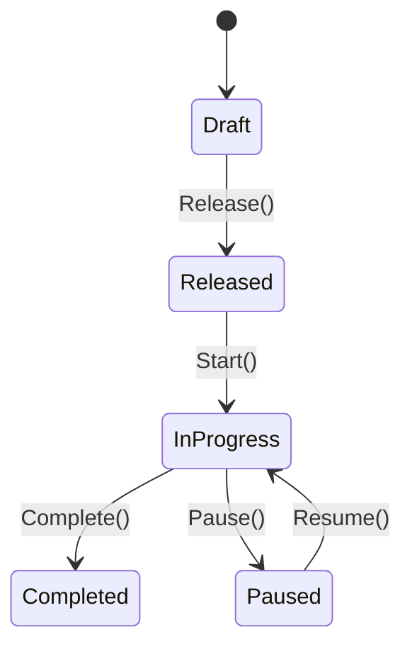
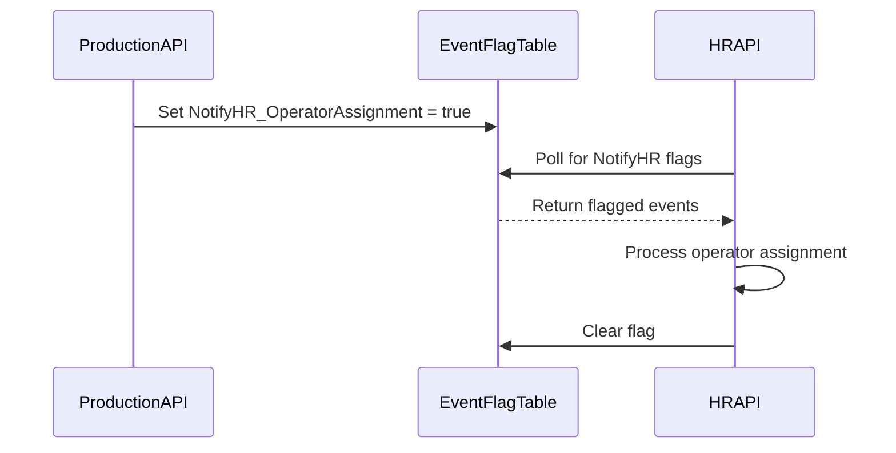

# JoineryTech Domain Model Design Workshop

> **Skill:** Comprehensive DDD-based domain modeling for JoineryTech 27-world ecosystem
>
> **Forrás:** Explorer Task Research (2026-07-07) — 4× proven domain models (CRM, Kontrolling, HR, Maintenance)
>
> **Owner:** Architect (design) ↔ Backend (implementation) ↔ Librarian (documentation)
>
> **Verzió:** 1.0 (2026-07-07)

---

## CÉLKITŰZÉS

A Domain Model Workshop egy **repeatable, template-based methodology** JoineryTech világ domain modelljeinek tervezésére és implementálására.

**Probléma:** 27 világ × 3-8 domain/világ = **100+ domain aggregate** tervezése és implementálása:
- Inconsistent domain language (terminológia káosz)
- Duplicate patterns (mindenki újra találja fel a kereket)
- Integration complexity (cross-domain events, API contracts)
- Test coverage gap (FSM, Repository, E2E, RLS patterns hiánya)

**Megoldás:** Standardized domain modeling workshop:
- **Bounded Context Analysis** — Domain határok, ubiquitous language
- **Aggregate Root Design** — Entity, value objects, invariants
- **FSM State Modeling** — States, transitions, guards
- **Event Pattern Design** — Domain events, integration event flags
- **Repository Interface** — Query, command, transaction patterns
- **Test Pattern Library** — FSM, Repository, E2E, RLS test templates

---

## METHODOLOGY

### PHASE 1: DOMAIN DISCOVERY (Architect + Business SME)

**Input:** Business requirements, user stories, regulatory constraints

**Output:** Domain Analysis Document

```markdown
# Domain Analysis — [World Name] / [Domain Name]

## Bounded Context
- **Context:** Manufacturing Execution System (MES) / Production domain
- **Ubiquitous Language:**
  - Production Order (gyártási rendelés)
  - Work Center (munkahelyi állomás)
  - Operation (műveleti lépés)
  - Quality Check (minőségellenőrzés)

## Core Aggregates (Candidate)
1. **ProductionOrder** — root aggregate (gyártási rendelés lifecycle)
2. **WorkCenter** — entity (munkahelyi kapacitás, routing)
3. **QualityInspection** — aggregate root (QC inspection FSM)

## Domain Events (Candidate)
- ProductionOrderCreated
- ProductionOrderStarted
- OperationCompleted
- QualityInspectionPassed / QualityInspectionFailed
- ProductionOrderCompleted

## External Dependencies
- **Joinery World:** Material BOM (anyaglista)
- **HR World:** Operator assignment (dolgozó kiosztás)
- **Maintenance World:** Equipment availability (gép rendelkezésre állás)
```

**Decision Criteria:**
- **Aggregate Root:** Ha független lifecycle van + invariants
- **Entity:** Ha identity fontos, de része egy aggregate-nek
- **Value Object:** Ha immutable + replaceable (pl. Address, Money)

---

### PHASE 2: AGGREGATE ROOT DESIGN (Architect)

**FSM State Modeling:**

```csharp
// ProductionOrder FSM states
public enum ProductionOrderState
{
    Draft,           // Created, not released
    Released,        // Released to shop floor
    InProgress,      // At least 1 operation started
    Paused,          // Temporarily stopped (waiting material/maintenance)
    QualityHold,     // Quality issue detected
    Completed,       // All operations done, quality passed
    Cancelled        // Order cancelled
}

// State transition guards
public class ProductionOrderStateMachine
{
    public bool CanRelease(ProductionOrder order)
        => order.State == ProductionOrderState.Draft
        && order.HasValidBOM
        && order.HasAssignedWorkCenter;

    public bool CanStart(ProductionOrder order)
        => order.State == ProductionOrderState.Released
        && order.MaterialsAvailable
        && order.EquipmentOperational;

    // ... additional guards
}
```

**Aggregate Design Pattern:**

```csharp
// Domain/Aggregates/ProductionOrder.cs
public class ProductionOrder : AggregateRoot<ProductionOrderId>
{
    // State
    public ProductionOrderState State { get; private set; }
    public ProductionOrderNumber OrderNumber { get; private set; }
    public DateTime? ReleasedAt { get; private set; }

    // Entities within aggregate
    private readonly List<Operation> _operations;
    public IReadOnlyCollection<Operation> Operations => _operations.AsReadOnly();

    // Value objects
    public MaterialRequirements Materials { get; private set; }
    public WorkCenterAssignment Assignment { get; private set; }

    // Domain methods (behavior)
    public void Release(UserId releasedBy, DateTime timestamp)
    {
        if (!CanRelease())
            throw new InvalidOperationException("Cannot release order in current state");

        State = ProductionOrderState.Released;
        ReleasedAt = timestamp;

        AddDomainEvent(new ProductionOrderReleasedEvent(Id, releasedBy, timestamp));
    }

    // Invariant enforcement
    private bool CanRelease()
        => State == ProductionOrderState.Draft
        && Materials.IsComplete
        && Assignment.IsValid;
}
```

---

### PHASE 3: EVENT PATTERN DESIGN (Architect)

**Domain Events (Internal):**

```csharp
// Domain/Events/ProductionOrderReleasedEvent.cs
public record ProductionOrderReleasedEvent(
    ProductionOrderId OrderId,
    UserId ReleasedBy,
    DateTime ReleasedAt
) : DomainEvent;
```

**Integration Event Flags (Cross-Domain):**

```csharp
// Infrastructure/Persistence/EventFlagRepository.cs
public class ProductionOrderEventFlags
{
    public bool NotifyHR_OperatorAssignment { get; set; }
    public bool NotifyMaintenance_EquipmentRequest { get; set; }
    public bool NotifyJoinery_MaterialConsumption { get; set; }
}

// Set flag when event occurs
public async Task Handle(ProductionOrderReleasedEvent evt)
{
    var flags = await _flagRepo.GetForOrder(evt.OrderId);
    flags.NotifyHR_OperatorAssignment = true;
    flags.NotifyMaintenance_EquipmentRequest = true;
    await _flagRepo.SaveAsync(flags);
}

// External scanner picks up flags
// GET /api/production/integration-events?flags=NotifyHR_OperatorAssignment
```

**Why Event Flags?**
- Decouples domains (no direct coupling to HR/Maintenance APIs)
- Async integration (polling, not real-time dependency)
- Resilient (flag persists if downstream unavailable)
- Audit trail (flag state + timestamp)

---

### PHASE 4: REPOSITORY INTERFACE DESIGN (Architect)

**Query Methods:**

```csharp
// Domain/Repositories/IProductionOrderRepository.cs
public interface IProductionOrderRepository
{
    // By ID
    Task<ProductionOrder?> GetByIdAsync(ProductionOrderId id, CancellationToken ct);

    // By business key
    Task<ProductionOrder?> GetByOrderNumberAsync(ProductionOrderNumber orderNumber, CancellationToken ct);

    // Query patterns
    Task<List<ProductionOrder>> GetByStateAsync(ProductionOrderState state, CancellationToken ct);
    Task<List<ProductionOrder>> GetByWorkCenterAsync(WorkCenterId workCenterId, CancellationToken ct);
    Task<List<ProductionOrder>> GetOverdueAsync(DateTime asOf, CancellationToken ct);

    // Persistence
    Task AddAsync(ProductionOrder order, CancellationToken ct);
    Task UpdateAsync(ProductionOrder order, CancellationToken ct);
}
```

**Transaction Patterns:**

```csharp
// Application/Commands/ReleaseProductionOrderHandler.cs
public class ReleaseProductionOrderHandler
{
    private readonly IProductionOrderRepository _repo;
    private readonly IUnitOfWork _uow;

    public async Task<Result> Handle(ReleaseProductionOrderCommand cmd)
    {
        await _uow.BeginTransactionAsync();

        try
        {
            var order = await _repo.GetByIdAsync(cmd.OrderId);
            if (order == null) return Result.NotFound();

            order.Release(cmd.ReleasedBy, DateTime.UtcNow);

            await _repo.UpdateAsync(order);
            await _uow.CommitAsync();

            return Result.Success();
        }
        catch
        {
            await _uow.RollbackAsync();
            throw;
        }
    }
}
```

---

### PHASE 5: TEST PATTERN LIBRARY (Backend)

**FSM State Transition Tests:**

```csharp
// Tests/Domain/ProductionOrderTests.cs
[Fact]
public void Release_FromDraftState_TransitionsToReleased()
{
    // Arrange
    var order = ProductionOrderFactory.CreateDraft();
    var userId = new UserId(Guid.NewGuid());

    // Act
    order.Release(userId, DateTime.UtcNow);

    // Assert
    Assert.Equal(ProductionOrderState.Released, order.State);
    Assert.NotNull(order.ReleasedAt);
}

[Fact]
public void Release_FromInProgressState_ThrowsInvalidOperationException()
{
    // Arrange
    var order = ProductionOrderFactory.CreateInProgress();

    // Act & Assert
    Assert.Throws<InvalidOperationException>(() =>
        order.Release(new UserId(Guid.NewGuid()), DateTime.UtcNow));
}
```

**Repository Integration Tests:**

```csharp
// Tests/Infrastructure/ProductionOrderRepositoryTests.cs
public class ProductionOrderRepositoryTests : IClassFixture<PostgresFixture>
{
    [Fact]
    public async Task GetByOrderNumber_ExistingOrder_ReturnsOrder()
    {
        // Arrange
        var order = ProductionOrderFactory.CreateDraft();
        await _repo.AddAsync(order);
        await _uow.CommitAsync();

        // Act
        var retrieved = await _repo.GetByOrderNumberAsync(order.OrderNumber);

        // Assert
        Assert.NotNull(retrieved);
        Assert.Equal(order.Id, retrieved.Id);
    }
}
```

**E2E Smoke Tests:**

```csharp
// Tests/E2E/ProductionOrderWorkflowTests.cs
[Fact]
public async Task ProductionOrder_FullLifecycle_CompletesSuccessfully()
{
    // Create order (Draft)
    var createResponse = await _client.PostAsync("/api/production/orders", ...);
    var orderId = await GetOrderIdFromResponse(createResponse);

    // Release order (Draft → Released)
    var releaseResponse = await _client.PostAsync($"/api/production/orders/{orderId}/release", ...);
    Assert.Equal(HttpStatusCode.OK, releaseResponse.StatusCode);

    // Start order (Released → InProgress)
    var startResponse = await _client.PostAsync($"/api/production/orders/{orderId}/start", ...);
    Assert.Equal(HttpStatusCode.OK, startResponse.StatusCode);

    // Complete order (InProgress → Completed)
    var completeResponse = await _client.PostAsync($"/api/production/orders/{orderId}/complete", ...);
    Assert.Equal(HttpStatusCode.OK, completeResponse.StatusCode);

    // Verify final state
    var order = await GetOrderAsync(orderId);
    Assert.Equal("Completed", order.State);
}
```

**RLS (Row-Level Security) Tests:**

```csharp
// Tests/Security/ProductionOrderRLSTests.cs
[Fact]
public async Task GetOrders_AsTenant1_OnlyReturnsTenant1Orders()
{
    // Arrange
    await SeedOrdersForTenant(tenantId: 1, count: 5);
    await SeedOrdersForTenant(tenantId: 2, count: 3);

    // Act (authenticated as Tenant 1)
    var orders = await _repo.GetAllAsync(tenantId: 1);

    // Assert
    Assert.Equal(5, orders.Count);
    Assert.All(orders, o => Assert.Equal(1, o.TenantId));
}
```

---

## INTEGRATION SPEC TEMPLATE

**Location:** `docs/joinerytech/[world]/[domain]-integration-spec.md`

**Structure:**

```markdown
# Production Domain Integration Specification

## 1. Domain Overview
- Aggregate roots: ProductionOrder, QualityInspection
- States: 7 states (Draft → Completed)
- Events: 12 domain events

## 2. Integration Event Flags

| Event | Flag Name | Target Domain | Polling Endpoint |
|-------|-----------|---------------|------------------|
| ProductionOrderReleased | NotifyHR_OperatorAssignment | HR | `/api/production/integration-events?flags=NotifyHR` |
| MaterialConsumed | NotifyJoinery_StockUpdate | Joinery | `/api/production/integration-events?flags=NotifyJoinery` |

## 3. Mermaid Diagrams

### State Transition Diagram


### Integration Event Flow


## 4. API Contract
### POST /api/production/orders/{id}/release
**Request:**
```json
{
  "releasedBy": "user-guid",
  "plannedStartDate": "2026-07-10T08:00:00Z"
}
```

**Response:**
```json
{
  "orderId": "order-guid",
  "state": "Released",
  "releasedAt": "2026-07-07T12:30:00Z"
}
```
```

---

## DOMAIN MODEL CHECKLIST

### Discovery Phase
- [ ] Bounded context defined
- [ ] Ubiquitous language documented (5-10 key terms)
- [ ] Aggregate root candidates identified (1-3 per domain)
- [ ] Domain events listed (8-15 events)
- [ ] External dependencies mapped

### Design Phase
- [ ] FSM states defined (5-10 states typical)
- [ ] State transition guards implemented
- [ ] Aggregate root class created
- [ ] Value objects identified (immutable, replaceable)
- [ ] Domain event records created
- [ ] Integration event flags designed

### Repository Phase
- [ ] Query methods defined (by ID, by business key, by filters)
- [ ] Command methods defined (Add, Update, Delete)
- [ ] Transaction patterns documented
- [ ] RLS policies defined (tenant isolation)

### Test Phase
- [ ] FSM tests written (5-10 tests per aggregate)
- [ ] Repository tests written (8-15 tests)
- [ ] E2E smoke tests written (6-10 scenarios)
- [ ] RLS validation tests written (3-5 tests)

### Integration Phase
- [ ] Integration spec document created
- [ ] Event flag endpoints implemented
- [ ] Mermaid diagrams added
- [ ] API contract documented (OpenAPI spec)

---

## REAL-WORLD EXAMPLES

### Example 1: CRM Domain (Proven)
**File:** `docs/joinerytech/crm/crm-domain-model-design-done.md`
**Aggregates:** Lead, Opportunity, Customer
**States:** 7 FSM states (Lead: New → Converted → Lost)
**Events:** 10 domain events (LeadCreated, OpportunityWon, CustomerActivated)
**Tests:** 20+ FSM tests, 15 repository tests, 10 E2E tests

### Example 2: Kontrolling Domain (Proven)
**File:** `docs/joinerytech/kontrolling/kontrolling-domain-model-design-done.md`
**Aggregates:** Budget, CostCenter, VarianceReport
**States:** 5 FSM states (Budget: Draft → Approved → Closed)
**Events:** 8 domain events (BudgetApproved, CostExceeded)
**Integration:** Event flags to Finance world

### Example 3: HR Domain (Proven)
**File:** `docs/joinerytech/hr/hr-domain-model-design-done.md`
**Aggregates:** Employee, TimeEntry, LeaveRequest
**States:** 6 FSM states (LeaveRequest: Pending → Approved → Used)
**Events:** 12 domain events (EmployeeHired, LeaveApproved)
**Integration:** Event flags to Production (operator assignment)

---

## SCALING TO 27 WORLDS

**Reusability Strategy:**

1. **Copy template** → New domain folder
2. **Customize ubiquitous language** → World-specific terms
3. **Reuse FSM patterns** → Draft → Released → Completed (common)
4. **Reuse Repository interface** → GetById, GetByState, Add, Update
5. **Reuse Test patterns** → FSM, Repository, E2E, RLS templates
6. **Generate Integration Spec** → Event flags + Mermaid diagrams

**Estimated Time per Domain:**
- Discovery: 2-4 hours (with business SME)
- Design: 4-6 hours (Architect)
- Implementation: 8-12 hours (Backend)
- Testing: 6-10 hours (Backend)
- **Total:** 20-32 hours per domain (1 week per domain)

**27 worlds × 5 domains avg = 135 domains → 135 weeks → ~2.5 years**
(With parallelization: 6-12 months with 3-5 backend devs)

---

## BENEFITS

| Benefit | Impact |
|---------|--------|
| **Consistency** | Same FSM patterns across all domains |
| **Accelerated Development** | Template reuse cuts time by 40-60% |
| **Onboarding** | New devs learn 1 pattern, apply to N domains |
| **Test Coverage** | Standardized test patterns ensure quality |
| **Integration Clarity** | Event flag pattern simplifies cross-domain |
| **Documentation** | Integration spec template ensures completeness |

---

## COORDINATION MATRIX

| Role | Responsibility |
|------|----------------|
| **Architect** | Discovery, FSM design, event patterns, integration spec |
| **Backend** | Aggregate implementation, repository, tests |
| **Librarian** | Knowledge synthesis, pattern documentation |
| **Conductor** | Phase dispatch, coordination between Architect/Backend |

---

## SAFETY GUARDRAILS

❌ **TILOS:**
- Aggregate root nélküli domain (minden domain kell aggregate root)
- FSM nélküli aggregate (lifecycle management chaos)
- Test coverage <80% (FSM, Repository, E2E kötelező)
- Integration spec hiánya (cross-domain koordináció lehetetlenné válik)

✅ **JAVASLAT:**
- Architect előbb domain model, Backend utána implementáció
- FSM always explicit (enum + transition guards)
- Event flags minden cross-domain kommunikációhoz
- Integration spec Mermaid diagrammal (vizualizáció kötelező)

---

## KITERJESZTÉSI LEHETŐSÉGEK

### 1. Code Generator Integration
**Tool:** `scripts/codegen/domain-scaffolder.sh`
**Input:** Domain model YAML spec
**Output:** Aggregate root class + Repository interface + Test stubs

### 2. Integration Testing Framework
**Tool:** `scripts/testing/cross-domain-e2e.sh`
**Purpose:** Test event flag flows across domains (Production → HR → Maintenance)

### 3. Domain Model Registry
**Location:** `docs/joinerytech/domain-registry.yaml`
**Purpose:** Centralized catalog of all 135 domains (aggregates, events, APIs)

---

## VERZIÓHISTÓRIA

| Verzió | Dátum | Frissítés |
|--------|-------|----------|
| 1.0 | 2026-07-07 | Initial release based on Explorer Task Research (4× proven domain models) |

---

**Skill Maintainer:** Architect + Librarian
**Last Updated:** 2026-07-07
