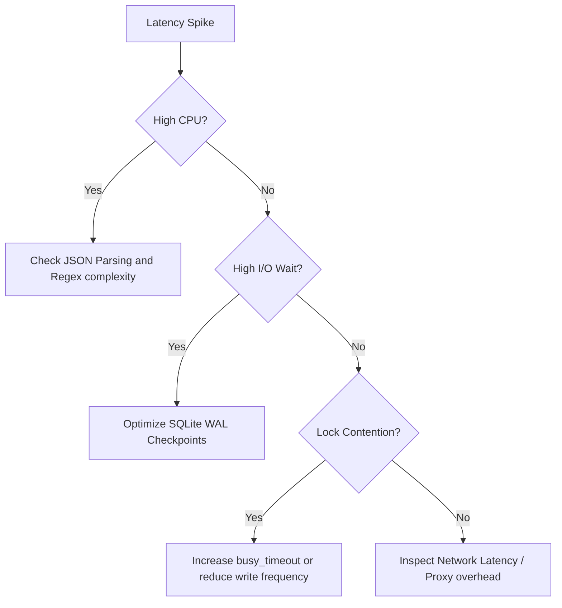

# EPIC-10 Operational Runbook: bootstrap_agent Service

This runbook provides guidance for operators and SREs responsible for managing the `bootstrap_agent` service.

## 1. SLA Definitions

| Metric | SLO | Warning Threshold | Critical Threshold |
|:-------|:----|:------------------|:-------------------|
| **P95 Latency** | < 50ms | > 45ms | > 100ms |
| **P99 Latency** | < 100ms| > 90ms | > 200ms |
| **Success Rate**| > 99.9%| < 99.5%| < 99.0% |
| **Error Rate** | < 0.1% | > 0.5% | > 1.0% |

## 2. Monitoring Setup

The service exports metrics compatible with Prometheus.

### Critical Queries

- **P95 Latency (last 5m):**
  `histogram_quantile(0.95, sum(rate(mcp_bootstrap_latency_seconds_bucket[5m])) by (le))`
- **Error Rate (last 5m):**
  `sum(rate(mcp_bootstrap_errors_total[5m])) / sum(rate(mcp_bootstrap_calls_total[5m]))`
- **CPU/Memory:**
  Monitor the MCP server process for spikes during high concurrency events.

## 3. Incident Response

### Symptom: High Latency (> 50ms p95)

1. **Check DB Performance:** Verify if SQLite Disk I/O is saturated.
2. **Check Concurrency:** Are there more than 100 active sessions being created simultaneously?
3. **Index Fragmentation:** High latency can be caused by index fragmentation. Run `VACUUM`.
4. **Lock Contention:** Check logs for `DATABASE_LOCKED` errors. Ensure WAL mode is active.

### Symptom: High Error Rate (> 1.0%)

1. **Identify Error Codes:** Are they `INVALID_DOMAIN`/`INVALID_ROLE` (client issues) or `DATABASE_CONNECTION_ERROR` (server issues)?
2. **Connectivity:** Ensure the server has read/write permissions to `database/agent.db`.
3. **Schema Mismatch:** Verify if a recent deployment changed the SQL schema without migrating the database.

## 4. Disaster Recovery

### Database Corruption

- **Symptom:** `SQLITE_CORRUPT` errors in logs.
- **Action:**
  1. Stop the MCP server.
  2. Restore `database/agent.db` from the latest backup.
  3. Restart the server.

### Accidental Role Deletion

- **Action:** Use the `git` history to recover the missing `.role.md` files and re-run the `scripts/seed_agent_db.ts` to sync the database.

## 5. Maintenance Schedule

- **Monthly:** Run `VACUUM` on `metadata.db` and `agent.db` to reclaim space and re-index.
- **Quarterly:** Review `database/roles/` for unused or duplicate roles and prune them.
- **Annual:** Review SLA targets. As hardware improves or the network stabilizes, consider tightening the p95 threshold.

## 6. Regression Testing

The CI/CD pipeline triggers a load test on every PR.

- **Failure:** If p95 exceeds 110% of the baseline, the build fails.
- **Action:** Investigate the code changes for new DB queries or heavy JSON processing. Do not merge unless the degradation is justified and the baseline is updated.

## 7. Advanced Monitoring & Alerting

To ensure the stability of the `bootstrap_agent` service, we have defined the following Prometheus alert rules. These should be loaded into the alerting manager (e.g., Cortex or Alertmanager).

### 🚨 Alert Rule: BootstrapLatencyHigh

- **Condition:** `histogram_quantile(0.95, sum(rate(mcp_bootstrap_latency_seconds_bucket[5m])) by (le)) > 0.1`
- **Severity:** Critical
- **Description:** P95 latency for bootstrap operations has exceeded 100ms for more than 5 minutes.
- **Action:** Scale out the MCP service or investigate SQLite disk congestion.

### 🚨 Alert Rule: BootstrapErrorRateSpike

- **Condition:** `sum(rate(mcp_bootstrap_errors_total[1m])) / sum(rate(mcp_bootstrap_calls_total[1m])) > 0.05`
- **Severity:** P1
- **Description:** Error rate exceeded 5% in the last minute.
- **Action:** Check `agent.db` connectivity and RBAC service health.

## 8. Capacity Planning & Scale-out

The `bootstrap_agent` service is primarily bound by SQLite I/O performance. Follow these guidelines for scaling:

### Vertical Scaling (Scale-up)

1. **CPU:** Increase CPU cores if JSON parsing of large role definitions exceeds 10ms.
2. **IOPS:** Move the database to NVMe SSDs if `iowait` exceeds 5% during peak hours.

### Horizontal Scaling (Scale-out)

1. **Read Replicas:** Use LiteFS or similar tech to replicate `agent.db` across multiple nodes for read-only bootstrap requests.
2. **Sharding:** If session counts exceed 1 million active nodes, shard the `sessions` table by `agent_id`.

## 🛡️ 9. Security Hardening Guide

The bootstrap process is the most vulnerable part of the agent lifecycle. Apply these hardening steps:

### Network Isolation

- Ensure the MCP server is only accessible via a VPN or private VPC endpoint.
- Use `mTLS` (Mutual TLS) to verify the identity of the calling agent before processing the `identify` payload.

### Data Sanitization Lifecycle

- The `InputValidator` should be audited quarterly for new bypass techniques.
- Enable `SQLITE_DBCONFIG_DEFENSIVE` to prevent accidental schema modifications via the tool.

## 🆘 10. Performance Troubleshooting Tree

If performance degrades, follow this decision tree to identify the bottleneck:

### Common Fixes:

- **Pragma Tuning:** `PRAGMA page_size = 4096;` and `PRAGMA cache_size = -2000;`.
- **Pre-compilation:** Periodically run `ANALYZE` to keep the query optimizer informed.

## 🔄 11. Backup & Restore Procedures

### Automated Daily Backups

The system runs a cron job at 02:00 UTC:
`sqlite3 database/agent.db ".backup 'backups/agent_$(date +%F).db'"`

### Verification Flow

1. Restore the backup to a temporary file.
2. Run `PRAGMA integrity_check;`.
3. Verify that the `sessions` table count is greater than zero.

## 📝 12. Post-mortem Template: Bootstrap Failure

In the event of a P1 outage, use this template to document the incident:

### Incident ID: [YYYY-MM-DD-BOOTSTRAP]

- **Duration:** [HH:MM]
- **Impact:** [X% of agents failed to initialize]
- **Root Cause:** [e.g., Disk Full, Schema Mismatch, Regression]
- **Action Items:**
  - [ ] Update monitoring thresholds
  - [ ] Add regression test case
  - [ ] Review deployment logs

## 📜 13. Compliance Checklist (Auditor View)

| Control ID | Description | Evidence Location |
| :--- | :--- | :--- |
| **AC-01** | Access Control to Roles | `RBACFilter.ts` logic. |
| **AU-02** | Session Audit Logs | `sessions` table in SQLite. |
| **SI-03** | Malicious Input Filtering | `InputValidator.ts` regex suite. |

## 14. Data Residency & Sovereign Cloud Considerations

When deploying the MCP server in highly regulated environments (e.g., EU Sovereign Cloud or US FedRAMP), follow these data residency rules:

### Metadata Location

- The `agent.db` and `metadata.db` files must be encrypted at rest using AES-256.
- In multi-region setups, ensure that `sessions` data does not leave the originating region to maintain GDPR compliance.

### Log Management

- Anonymize PII (Personally Identifiable Information) in log streams before exporting to external SIEM tools.
- Use the `MCP_LOG_ANONYMIZE=true` flag in production.

## 🚀 15. Performance Tuning: Platform Specifics

### Windows (Local Development)

- **Problem:** NTFS file locking can cause `DATABASE_LOCKED` errors during high-frequency writes.
- **Optimization:** Disable Windows Search indexing for the `database/` directory.
- **Pragma:** `PRAGMA temp_store = MEMORY;`

### Linux (Production/Docker)

- **Problem:** EXT4/XFS journal latency.
- **Optimization:** Use an `io_uring` enabled kernel if supported by Node.js/SQLite bindings.
- **Mount Options:** Use `noatime` for the database volume.

## 🧪 16. Chaos Engineering Scenarios (Stress Tests)

Run these scenarios monthly to verify system resilience:

### Scenario: Sudden Disk Full

- **Inject:** Create a large sparse file to fill the `/data` mount.
- **Expect:** `bootstrap_agent` should fail gracefully with `ERR_INFR_STORAGE_FULL`, and the agent should enter a "Retry-with-Exponential-Backoff" state.

### Scenario: Network Partition (ChromaDB)

- **Inject:** Drop packets to the vector store IP.
- **Expect:** The MCP server should continue serving base roles but flag "Vector Search Unavailable" in the metadata.

## 🛠️ 17. Role Life-cycle Management (Governance)

Manage the lifecycle of role definitions as follows:

| Stage | Action | Approval |
| :--- | :--- | :--- |
| **Draft** | Create `.role.md` in `dev/` branch. | Peer Review |
| **Beta** | Merge to `staging` for internal testing. | Tech Lead |
| **Live** | Tag release and sync to `agent.db`. | Architect |
| **Legacy** | Archive role and set `active=0` in DB. | Product Owner |

## 🔍 18. Advanced Debugging with `strace` (Linux Only)

If you suspect deep kernel-level I/O issues, run:
`strace -ff -e trace=file -p <PID>`

Look for:
- `EAGAIN` or `EWOULDBLOCK` on SQLite file descriptors.
- Long `fsync()` calls indicating slow hardware.

## ☸️ 19. Kubernetes Integration (K8s)

When running the MCP server on Kubernetes, apply the following configurations:

### Liveness and Readiness Probes

- **Liveness:** Use an internal endpoint to simply test if the Express server responds.
- **Readiness:** Include a quick validation query to `agent.db` to ensure I/O isn't blocked.

### Pod Disruption Budgets (PDB)

- Guarantee at least 2 healthy pods at all times during node rotations or patching.

## 🗄️ 20. Database Schema Migrations

Given the local nature of SQLite, migrations require special care.

### Rollout Strategy

1. Embed the SQL migration scripts in the codebase using a library like `umzug`.
2. On startup, check `user_version` using `PRAGMA user_version;`.
3. If structural changes are required (e.g., adding constraints), use the temporary table swap pattern because SQLite restricts `ALTER TABLE`.

## ⏱️ 21. Point-in-Time Recovery (PITR)

Implementing PITR with local SQLite:

### LiteStream Integration

For workloads requiring high durability, integrate `litestream` alongside the MCP Docker container.
- It continuously streams the WAL to an object store (like AWS S3 or Azure Blob Storage).
- Allows restoration of the database to any point down to the microsecond level prior to a crash.

---
*Last Updated: 2026-03-09*
*Contact: On-call SRE Team / Dev C*
