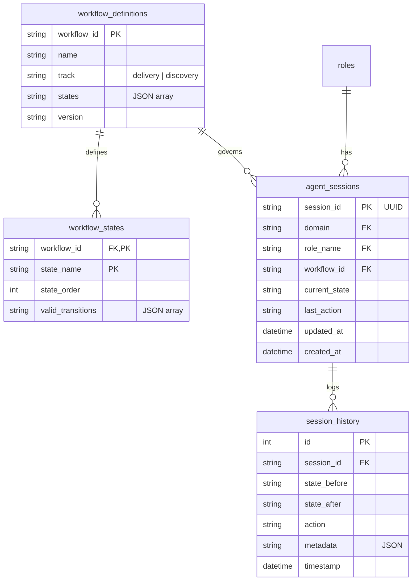
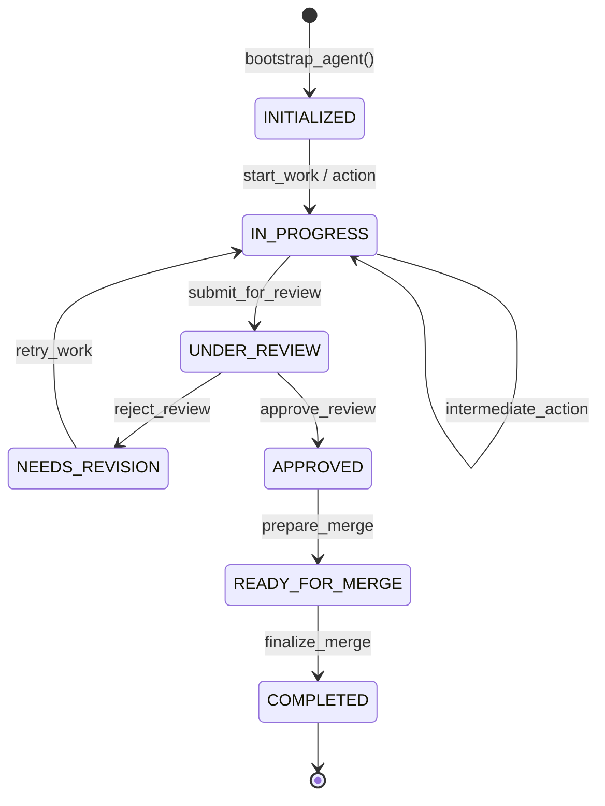

# FSM Schema Design — Workflow State Tracking

## Purpose
This document defines the database schema and transition rules for the Finite State Machine (FSM) tracking system in EPIC-11.

## ER Diagram (FSM Schema)

## FSM State Diagram (7-State Standard)

## Migration Rationale
- **Decoupling**: Sessions are tracked separately from role definitions to allow multiple active sessions for the same role.
- **Auditability**: `session_history` provides a full audit trail of how an agent progressed through a task.
- **Flexibility**: `workflow_definitions` allow for different tracks (delivery vs discovery) without changing the core session logic.
- **Performance**: Composite indexes on `(domain, role_name)` and FKs ensure fast lookups during bootstrap and transitions.

## Implementation Details
- **Migration**: `src/metadata/migrations/004_epic11_fsm_schema.sql`
- **Típusok**: `src/metadata/FSMSchema.ts`
