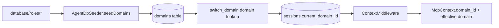

## EPIC-17 Multi-Domain Onboarding - Usage Guide

## Purpose

This guide explains:

- how to add a new domain to the system,
- how `list_available_domains` and `switch_domain` tools work,
- and how domain context flows from filesystem seeding into runtime session context.

## New Domain Onboarding

### Step 1: Create Domain Folder

Create a new folder under `database/roles/`.

Example:

```text
database/roles/product/
```

Optional: add a `README.md` inside the domain folder. The first non-heading line is used as domain description by the seeder.

### Step 2: Run Domain Seeder

Domains are seeded from filesystem to SQLite `domains` table by startup hook.

Current startup behavior:

- `src/index.ts` calls `new AgentDbSeeder(agentDb).seedDomains(path.join(databaseRoot, 'roles'))`
- `AgentDbSeeder.seedDomains()` scans direct subfolders of `database/roles/`
- folders starting with `_` are ignored

### Step 3: Verify Domain Visibility

Call `list_available_domains`.

Input:

```json
{}
```

Output shape:

```json
{
  "success": true,
  "data": {
    "domains": [
      {
        "id": "product",
        "name": "product",
        "description": "Product domain description"
      }
    ],
    "total": 1
  }
}
```

## Tool: list_available_domains

Lists domain registry entries from the `domains` table.

Input:

```json
{
  "include_unregistered": false
}
```

Behavior:

- default (`false`): returns only registered domains (`domains` table)
- `true`: merges registered domains with legacy role-derived domain names

## Tool: switch_domain

Switches active domain context for the caller session.

Input:

```json
{
  "domain_name": "management",
  "session_id": "<optional-if-already-in-context>"
}
```

RBAC rule:

- admin-only (`admin`, `admin_agent`, `ops_admin`)
- non-admin callers receive `FORBIDDEN`

Success output shape:

```json
{
  "success": true,
  "data": {
    "session_id": "admin-session",
    "domain_name": "management",
    "domain_id": "mgt",
    "current_domain_id": "mgt"
  }
}
```

## Error Handling

### Domain Not Found

If target domain does not exist in `domains` table:

```json
{
  "success": false,
  "code": "NOT_FOUND",
  "message": "Domain not found: <domain_name>"
}
```

### Not Admin

If caller role is not admin-capable:

```json
{
  "success": false,
  "code": "FORBIDDEN",
  "message": "switch_domain is admin-only"
}
```

## Data Flow Diagram



## Operational Notes

- `bootstrap_agent` resolves `current_domain_id` from domain registry when available.
- If a domain is not registered yet, fallback is graceful (`current_domain_id = null`, warning log).
- Domain-aware read filtering in `AgentDb` accepts optional `domainId` and remains backward-compatible with legacy rows where `domain_id` is null.
