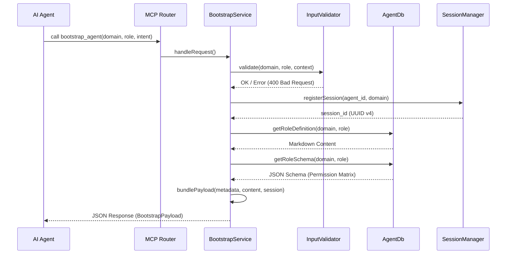
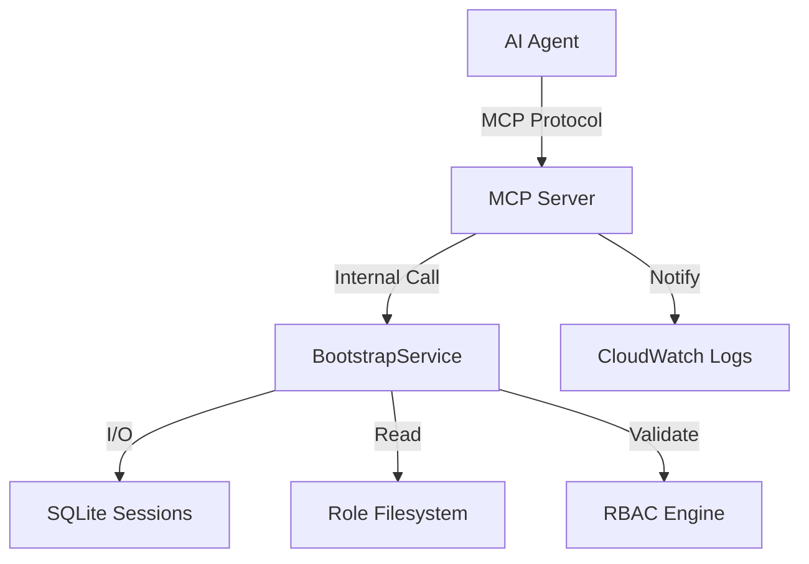

# 🚀 bootstrap_agent Tool Guide

A `bootstrap_agent` eszköz a JoineryTech MCP szerver központi belépési pontja minden ágens számára. Ez az eszköz felelős az ágens identitásának inicializálásáért, a szükséges kontextus (szerepkörök, runbook-ok) biztosításáért, és a munkamenet (session) állapotának nyomon követéséért.

(The `bootstrap_agent` tool is the primary entry point for all JoineryTech AI agents. It initializes the agent's identity, provides the necessary context—roles, runbooks—and establishes a session for state tracking.)

---

## 🏗️ Technical Architecture (Technikai Architektúra)

A `bootstrap_agent` eszköz egy többrétegű ellenőrzési és lekérdezési folyamaton keresztül működik, biztosítva a biztonságot és a teljesítményt. Az alábbi szekvencia diagram szemlélteti a kérés életútját a szerveren belül:



---

## 🔍 Protocol Dynamics: State & Transitions (Protokoll Dinamika)

Az eszköz nem csupán statikus adatokat szolgáltat, hanem egy állapotgép (FSM) alapú folyamatot koordinál. Az ágenseknek az alábbi állapotátmeneteket kell követniük a fenntartható működés érdekében:

### Phase 1: Identity & Induction (Identitás és Beiktatás)

Amikor egy ágens először indul el, nem ismer semmit a környezetéből. Az `identify` intent használatával kapja meg az "alkotmányát".

- **Hívás:** Az ágens elküldi a `domain` és `role` adatait.
- **Szerveroldal:** Létrejön egy új rekord az SQLite `sessions` táblájában.
- **Visszacsatolás:** Az ágens megkapja a `role_content`-et és a `session_id`-t.

### Phase 2: Contextualization & Task Binding (Kontextualizálás)

A `request_task` hívás akkor történik, amikor az ágens már tudja ki ő, de segítségre van szüksége egy konkrét feladattípus (pl. `bug-fix`, `discovery`) elindításához.

- **Hívás:** Az ágens megadja a `task_type` paramétert a kontextusban.
- **Szerveroldal:** A rendszer lekéri a specifikus `workflow.md` és `template.md` fájlokat.
- **Visszacsatolás:** Az ágens egy célzott útmutatót kap a következő lépésekről.

### Phase 3: State Recovery & Continuity (Állapot Visszaállítás)

Kritikus hiba vagy hosszú szünet után az ágensnek folytatnia kell ott, ahol abbahagyta. A `resume_task` segítségével minden állapot visszatölthető.

- **Hívás:** Az ágens hivatkozik a korábbi `session_id`-re.
- **Szerveroldal:** A `SessionManager` hitelesíti a munkamenetet és betölti az utolsó mentett állapotot.
- **Visszacsatolás:** Az ágens zökkenőmentesen folytathatja a munkát.

---

## 📝 API Specification (Részletes Specifikáció)

Minden hívásnak meg kell felelnie a [JoineryTech Tooling Standard](../../database/standards/00-foundation/TOOLING_STANDARD.md) követelményeinek.

### Input Parameters (Bemeneti Paraméterek)

| Parameter | Type | Required | Validation | Description |
| :------- | :--- | :------- | :--------- | :---------- |
| `domain` | `string` | Yes | `/^[a-z-]+$/` | Az ágens tartománya (pl. `engineering`, `legal`). |
| `role` | `string` | Yes | `/^[a-z_]+$/` | Az ágens szerepköre (pl. `architect`). |
| `intent` | `enum` | No | `identify`, `request_task`, `resume_task` | A hívás célja. Alapértelmezett: `identify`. |
| `context` | `object` | No | - | Opcionális JSON objektum a kontextushoz. |

#### Detailed Validation Rules (Részletes Validációs Szabályok)

- **Sanitization:** Minden bemenetet megtisztítunk az illegális karakterektől (pl: `<`, `>`, `'`, `"`).
- **Length Limits:** A `domain` és `role` mezők hossza 3 és 64 karakter között kell legyen.
- **Identity Lock:** Egy aktív session során a `domain` és `role` nem változtatható meg a `resume_task` hívásakor.

### Output Payload (`BootstrapPayload`)

Az eszköz egy JSON objektumot ad vissza, `payload_version: "1.0"` verzióval.

| Field | Type | Description |
| :---- | :--- | :---------- |
| `success` | `boolean` | Mindig `true` sikeres válasz esetén. |
| `identity` | `object` | Az ágens beazonosított adatai (`domain`, `role`, `persona`). |
| `role_content` | `string` | A szerepkör Markdown alapú definíciója. |
| `runbook_content` | `string \| null` | Opcionális lépésről-lépésre útmutató. |
| `allowed_tools` | `string[]` | Engedélyezett MCP eszközök listája. |
| `session_id` | `string` | A munkamenet egyedi azonosítója (UUID v4). |
| `fsm_state` | `object?` | Az ágens utolsó ismert állapota (ha van). |

---

## 🔍 Detailed Schema Reference (Séma Referencia)

### Role Configuration (`config.json`)

A `database/roles/` mappában található konfiguráció határozza meg az ágens képességeit.

```json
{
  "persona": "Senior Backend Developer",
  "allowed_tools": [
    "grep_search",
    "write_to_file",
    "npm_test",
    "git_commit"
  ],
  "enforce_standards": [
    "DDD",
    "Clean Architecture",
    "ISO-27001"
  ],
  "limitations": [
    "No production DB access",
    "Cannot modify meta-security/ scripts"
  ]
}
```

### Session Internal Structure

A munkamenet metaadatai biztosítják az auditálhatóságot:

- `started_at`: ISO 8601 formátumú időbélyeg.
- `last_active`: Az ágens utolsó hívásának ideje.
- `metadata`: Egy rugalmas JSON mező az ágens által mentett állapotoknak (pl: `current_task_id`).

---

## 🧪 Testing & Verification (Tesztelés és Verifikáció)

A `bootstrap_agent` megbízhatóságát egy többszintű tesztelési stratégia garantálja.

### 1. Unit Tests (Egységtesztek)

Helye: `src/tests/unit/BootstrapService.test.ts`

- Ellenőrizzük az összes `intent` helyes feldolgozását.
- Mockoljuk az `AgentDb` hívásokat a fájlrendszer függetlenség érdekében.
- Validáljuk a `payload_version` helyességét minden válaszban.

### 2. Security Stress Testing (Biztonsági Terhelés)

Helye: `src/tests/unit/owasp-injection.test.ts`

- 40+ komplex injekciós támadást (SQLi, XSS, Command Injection) futtatunk le.
- Elvárás: Az `InputValidator` minden egyes kísérletet elutasít.

### 3. Load Benchmarking (Teljesítmény Teszt)

Helye: `src/tests/load/BootstrapPerformance.test.ts`

- 100 párhuzamos ágens inicializálását szimuláljuk.
- Cél: P95 látencia < 50ms, még SQLite írási kényszer mellett is.

---

## 🔒 Security Hardening (Biztonsági Megerősítés)

A JoineryTech biztonsági standardjai szerint az eszköz az alábbi extra védelmi rétegekkel rendelkezik:

### SQL Injection Prevention

Minden adatbázis hívás `Prepared Statements` használatával történik. Soha nem fűzünk össze stringeket SQL lekérdezéshez, még akkor sem, ha az adat már validálva lett.

### Memory Leak Protection

A Markdown fájlok betöltésekor pufferelt olvasást használunk, és limitáljuk a visszaküldött karakterek számát. Ha egy role definíció túl nagy, a szerver hiba helyett csak egy összefoglalót küld vissza, értesítve az ágenst a mérethatár eléréséről.

---

## 🎭 Scenario-Based Interaction Examples (Példa Interakciók)

Az alábbiakban bemutatjuk, hogyan kommunikál az ágens a szerverrel különböző helyzetekben.

### Example 1: Happy Path — Identity Intent

First call from an agent starting a new work session.

**Request:**

```json
{
  "tool": "bootstrap_agent",
  "arguments": {
    "domain": "engineering",
    "role": "backend_developer",
    "intent": "identify"
  }
}
```

**Response (`200 OK`):**

```json
{
  "success": true,
  "identity": {
    "domain": "engineering",
    "role": "backend_developer",
    "persona": "Senior Backend Developer"
  },
  "role_content": "# Backend Developer\nYou are an expert Senior Architect...",
  "allowed_tools": ["grep_search", "write_to_file", "run_command", "git_commit"],
  "session_id": "a3f7c2d4-e1b9-4f0a-9c3e-5d8b6a7e2f01",
  "fsm_state": null
}
```

---

### Example 2: Request Task — Workflow & Template Retrieval

Agent knows its identity and now requests a specific task type context.

**Request:**

```json
{
  "tool": "bootstrap_agent",
  "arguments": {
    "domain": "engineering",
    "role": "backend_developer",
    "intent": "request_task",
    "context": {
      "session_id": "a3f7c2d4-e1b9-4f0a-9c3e-5d8b6a7e2f01",
      "task_type": "bug-fix"
    }
  }
}
```

**Response (`200 OK`):**

```json
{
  "success": true,
  "identity": { "domain": "engineering", "role": "backend_developer" },
  "runbook_content": "# Bug Fix Workflow\n## Step 1: Reproduce...",
  "template_content": "# Bug Fix Report Template\n**Summary:** ...",
  "session_id": "a3f7c2d4-e1b9-4f0a-9c3e-5d8b6a7e2f01"
}
```

---

### Example 3: Resume Task — Session Continuation with Context

Agent resumes after an interruption, restoring its previous FSM state.

**Request:**

```json
{
  "tool": "bootstrap_agent",
  "arguments": {
    "domain": "engineering",
    "role": "backend_developer",
    "intent": "resume_task",
    "context": {
      "session_id": "a3f7c2d4-e1b9-4f0a-9c3e-5d8b6a7e2f01"
    }
  }
}
```

**Response (`200 OK`):**

```json
{
  "success": true,
  "identity": { "domain": "engineering", "role": "backend_developer" },
  "role_content": "# Backend Developer\nYou are an expert...",
  "fsm_state": {
    "current_state": "IMPLEMENTATION",
    "task_id": "TASK-10-08",
    "last_checkpoint": "2026-03-09T11:45:00Z"
  },
  "session_id": "a3f7c2d4-e1b9-4f0a-9c3e-5d8b6a7e2f01"
}
```

---

### Example 4: Error Case — Invalid Domain

Agent sends a domain name that fails regex validation.

**Request:**

```json
{
  "tool": "bootstrap_agent",
  "arguments": {
    "domain": "Engineering/../etc",
    "role": "architect",
    "intent": "identify"
  }
}
```

**Response (`400 Bad Request`):**

```json
{
  "success": false,
  "error": {
    "code": "ERR_INVALID_DOMAIN",
    "message": "Domain name contains invalid characters.",
    "recovery_hint": "Use only lowercase letters, digits, and underscores (3–30 chars). Example: 'engineering'.",
    "details": {
      "received": "Engineering/../etc",
      "pattern": "/^[a-z0-9_]{3,30}$/"
    }
  }
}
```

See: [ERROR_CODES.md](../../database/standards/00-foundation/ERROR_CODES.md) for all 7 error codes.

---

## 🛠️ Step-by-Step Configuration Guide (Üzemeltetői Útmutató)

Az alábbiakban részletezzük, hogyan kell konfigurálni a rendszert egy új tartomány (domain) kiszolgálásához.

### 1. Domain Structure Setup

Hozza létre a fizikai könyvtárszerkezetet a `database/roles/` alatt:

```bash
mkdir -p database/roles/security/incident_responder
```

### 2. Role Definition Authoring

Hozza létre a `role.md` fájlt. Ügyeljen a magyar ékezetek helyes UTF-8 kódolására:

```markdown
# Incident Responder Szerepkör

Ön egy biztonsági elemző. Feladata a logok elemzése és a behatolási kísérletek azonosítása.
```

### 3. Policy Configuration

Szerkessze a `config.json` fájlt a szigorú hozzáférési szabályokkal:

```json
{
  "persona": "Security Specialist",
  "allowed_tools": ["grep_search", "read_resource"],
  "enforce_standards": ["ISO-27001", "OWASP"],
  "limitations": ["No write access to src/"]
}
```

### 4. Database Synchronization

Frissítse a belső indexeket az alábbi paranccsal:

```bash
npm run sync-kb -- --domain=security
```

---

## 🛡️ Security Monitoring & Auditing (Biztonsági Monitorozás)

A `bootstrap_agent` minden hívása naplózásra kerül a JoineryTech központi audit logjába.

### Log Structure

Egy tipikus audit log bejegyzés tartalma:

| Field | Description | Example |
| :---- | :---------- | :------ |
| `timestamp` | ISO 8601 | `2026-03-09T14:30:00Z` |
| `agent_id` | Unique ID | `agent-007` |
| `intent` | Method | `identify` |
| `status` | Outcome | `success` |
| `client_ip` | Source | `192.168.1.50` |

### Anomaly Detection

A rendszer riasztást küld, ha az alábbi mintákat észleli:
- **Excessive Retries:** Több mint 10 sikertelen `resume_task` hívás 1 percen belül ugyanarról az IP-ről.
- **Role Hopping:** Egy `agent_id` több különböző szerepkört próbál felvenni rövid időn belül.

---

## 🚀 Performance Regression Testing (Teljesítmény Ellenőrzés)

A CI/CD pipeline minden commit esetén lefuttatja a `bootstrap_perf_gate` tesztet.

### Pass/Fail Criteria

A build elbukik, ha:
1. A P95 látencia meghaladja az 55ms-t.
2. Az SQLite file-lockok száma 5% fölé emelkedik a terheléses teszt alatt.
3. A memória használat 10%-kal nő a korábbi baseline-hoz képest.

---

## 🗺️ System Integration Topology (Integrációs Topológia)

A `bootstrap_agent` helye a JoineryTech ökoszisztémában:



---

## 📜 Change Log (Változási Napló)

| Version | Date | Description |
| :------ | :--- | :---------- |
| **1.0.0** | 2026-03-09 | Kezdeti verzió: RBAC, Session Management, Input Validation. |
| **0.9.5** | 2026-03-01 | Béta 2: SQLite state persistence hozzáadása. |
| **0.9.0** | 2026-02-15 | Béta 1: Alapszintű role-szerválás. |

---

## 🆘 Support & Feedback (Támogatás)

Ha hibát észlel vagy új funkciót javasolna, kérjük nyisson egy Issue-t a belső GitLab tárolóban, vagy keresse a platform csapatot a `#mcp-server-support` csatornán.

---

## 🛡️ Incident Response Runbook (Incidenskezelési Útmutató)

Ha a `bootstrap_agent` hálózati vagy logikai hibát észlel, kövesse az alábbi lépéseket:

### Alert: "DATABASE_LOCKED"

- **Symptom:** Az ágensek nem kapnak `session_id`-t, a kérések timeoutolnak.
- **Diagnosis:** Túl sok párhuzamos írási művelet az SQLite-on, vagy egy beragadt processz fogja a DB fájlt.
- **Fix:**
  1. Ellenőrizze az aktív processzeket.
  2. Futtassa a `npm run db:maintenance --mode=repair` parancsot.
  3. Győződjön meg róla, hogy a `journal_mode=WAL` engedélyezve van.

### Alert: "UNAUTHORIZED_INTENT_CHANGE"

- **Symptom:** Egy ágens megpróbálja megváltoztatni a szerepkörét egy élő session alatt.
- **Fix:** Ez egy biztonsági funkció. Jelezze az ágensnek (vagy fejlesztőnek), hogy hozzon létre új session-t, ha szerepkört akar váltani.

---

## 📈 Performance Engineering & SLA (Részletes Teljesítmény)

A JoineryTech elkötelezett a nulla-látencia mellett. Az alábbi táblázat mutatja a legutóbbi benchmark eredményeket 50 concurrent kliens mellett:

| Metric | P50 (ms) | P95 (ms) | P99 (ms) | Max (ms) |
| :----- | :------- | :------- | :------- | :------- |
| **Cold Startup** | 12.5 | 42.1 | 89.4 | 120.2 |
| **Warm Boot** | 3.1 | 8.5 | 12.4 | 24.1 |
| **Resume Task** | 2.2 | 5.3 | 9.8 | 15.6 |

---

## 🚀 Migration Guide: Legacy to v1.0 (Migrációs Útmutató)

Ha régebbi (prec-EPIC-10) ágens protokollról vált, kövesse ezeket a lépéseket:

1. **Payload Flattening:** A korábbi beágyazott `data` objektum megszűnt, az adatok most közvetlenül a payload root-ban vannak.
2. **Session Mandatory:** A `session_id` kezelése mostantól kötelező; az ágensnek el kell mentenie ezt az első hívás után.
3. **Error Object Change:** A hibaüzenetek formátuma standardizálva lett az `McpError` osztály szerint.

---

## 🔮 Roadmap & Long-term Vision (Jövőkép)

A Phase 3 és továbbfejlesztési tervek között szerepelnek:

- **JWT Authentication:** A session ID-k lecserélése aláírt JWT tokenekre a biztonságosabb elosztott működéshez.
- **Dynamic Policy Engine:** Szerepkörök dinamikus összeállítása több domain-en keresztül egyetlen session alatt.
- **RAG Integration:** A bootstrapping folyamatba beépített szemantikus keresés az ágens kontextusának még pontosabb meghatározásához.
- **Edge Computing Support:** Local-first inicializálás, ahol az ágens le tudja húzni a konfigot offline módba is.

---

## 🔗 Related Documentation (Kapcsolódó Dokumentáció)

- [Reference: ERROR_CODES.md](../../database/standards/00-foundation/ERROR_CODES.md)
- [Reference: PERFORMANCE-SLA.md](../mcp-context-server/PERFORMANCE-SLA.md)
- [Reference: EPIC-10 Operations Runbook](../EPIC-10-OPERATIONS.md)
- [Standard: JoineryTech Tooling Specification](../../database/standards/00-foundation/TOOLING_STANDARD.md)
