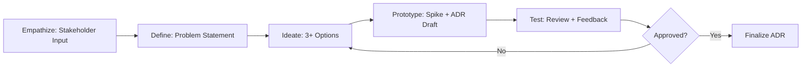
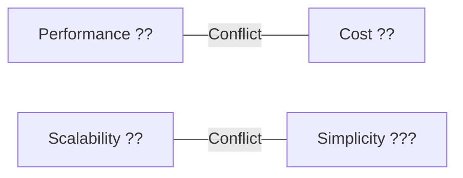

# **Design Thinking for Software Architecture**

## **1. Áttekintés**

A **Design Thinking** egy iteratív, user-centered problem-solving metodológia, amely a Software Architecture kontextusában lehetõvé teszi az Architect számára, hogy ne csak technikai, hanem üzleti és felhasználói szempontokat is figyelembe véve hozzon meg döntéseket.

**Mikor használd:**

- Epic Planning során új rendszerkomponensek tervezésekor
- ADR (Architecture Decision Record) írása során
- Architecture Review Board elõkészítésénél
- Komplex technológiai választások esetén
- Amikor több alternatív megoldás lehetséges

**Core filozófia:** Az architektúra nem "elõször megtervezem, aztán elkészül", hanem iteratív folyamat, ahol a stakeholderek, vezetõ fejlesztõk és üzleti igények együttesen formálják a végsõ megoldást.

---

## **2. Az 5 Fázis Architect Adaptációval**

### **2.1 Empathize (Empátia) - Stakeholder Context Megértése**

**Cél:** Ne csak a technikai követelményeket lásd, hanem a valódi fájdalompontokat és üzleti célokat.

**Gyakorlati lépések:**

1. **Stakeholder Interviews:** Beszélj a Product Ownerrel, Business Analysttel, Lead Developerekkel
   - *Kérdések:* "Mi a legnagyobb fájdalompont a jelenlegi rendszerrel?" "Mi lenne a siker kritériuma?"
2. **Developer Pain Points:** Gyûjtsd össze a jelenlegi rendszer technikai adósságait
   - *Eszköz:* Retrospektív jegyzetek, Code Review kommentek áttekintése
3. **Business Constraints:** Értsd meg a költségvetést, határidõket, compliance követelményeket
   - *Eszköz:* Empathy Map (stakeholder perspektívák vizualizálása)

**Kimenet:**

- Stakeholder Empathy Map (Business / Developer / Security / Operations perspektívák)
- Constraint List (Budget, Timeline, Technology lock-ins, Compliance)

**Anti-pattern:** Technikai specifikációból kiindulni stakeholder input nélkül ("Requirements Gathering skip").

---

### **2.2 Define (Definiálás) - Architectural Problem Statement**

**Cél:** A "Mit oldunk meg?" kérdés precíz, ADR-style megfogalmazása.

**Gyakorlati lépések:**

1. **Problem Statement:** Fogalmazd meg egy mondatban a döntési problémát
   - *Példa:* "Hogyan kezeljük a real-time notification-öket anélkül, hogy növelnénk a komplexitást és költségeket?"
2. **Quality Attributes Prioritization:** Használd az ISO 25010-et vagy hasonló keretrendszert
   - *Példa:* Performance > Scalability > Maintainability > Cost
3. **Constraints Validation:** Ellenõrizd, hogy van-e olyan technológiai vagy üzleti tiltás, ami behatárolja a megoldásokat
   - *Eszköz:* `docs/{project}/standards/constraints.md` betöltése

**Kimenet:**

- **Architectural Problem Statement** (1-2 mondat)
- **Quality Attributes Ranking** (Trade-off Sliders)
- **Context Boundaries** (Mit NEM oldunk meg most?)

**Anti-pattern:** Túl széles probléma definíció ("Újraírjuk a teljes rendszert").

---

### **2.3 Ideate (Ötletelés) - Architectural Alternatives Brainstorming**

**Cél:** Ne ugorj az elsõ megoldásra! Generálj legalább 3 alternatívát, még ha nyilvánvalónak is tûnik az egyik.

**Gyakorlati lépések:**

1. **Brainstorming Session:** Generálj legalább 3 különbözõ architectural approach-t
   - *Példa (Notification System):*
     - **Option A:** SignalR WebSockets (Real-time, de operációs overhead)
     - **Option B:** Polling + Caching (Egyszerû, de scaling problémák)
     - **Option C:** Azure Service Bus + Event Grid (Scalable, de komplexitás nõ)
2. **Trade-off Analysis:** Minden opciót értékelj a korábban definiált Quality Attributes alapján
   - *Eszköz:* Architecture Decision Matrix (Excel vagy Markdown táblázat)
3. **Constraint Check:** Szûrd ki azokat az opciókat, amelyek sértik a `constraints.md`-t

**Kimenet:**

- **3-5 Architectural Option** (rövid leírás + pros/cons)
- **Trade-off Matrix** (Quality Attributes vs. Options)
- **Shortlist** (Top 2 option, amelyek tovább mennek prototípus fázisba)

**Anti-pattern:** "Single Solution Mindset" - csak egy megoldás vizsgálata.

**Eszközök:**

- **Architecture Decision Matrix**

  ```markdown
  | Option | Performance | Scalability | Maintainability | Cost | Total Score |
  |--------|-------------|-----------------|------|-------------|
  | A      | 9           | 7           | 5               | 4    | 25          |
  | B      | 6           | 5           | 9               | 9    | 29          |
  ```

- **Trade-off Sliders**: Vizualizálj konfliktusokat (pl. Performance - Cost)

---

### **2.4 Prototype (Prototípus) - Spike & ADR Draft**

**Cél:** Gyors, olcsó validáció a végleges implementáció elõtt.

**Gyakorlati lépések:**

1. **Spike Planning:** Tervezz 1-2 napos technikai spike-okat a top 2 option validálásához
   - *Példa:* "SignalR spike: Hány concurrent connection kezelhetõ Azure App Service-n?"
2. **Proof of Concept:** Implementálj minimális mûködõ példát (akár csak console app)
3. **ADR Draft:** Dokumentáld a spike eredményeket ADR template-be
   - *Template:* `docs/{project}/decisions/ADR-XXXX.md`

**Kimenet:**

- **Spike Results** (Performance metrics, Complexity assessment, Cost estimate)
- **ADR Draft** (Context, Decision, Consequences)
- **Recommendation** (Melyik opciót javaslod és miért?)

**Anti-pattern:** "Analysis Paralysis" - túl sok prototípus, sosem döntesz.

**Spike Planning Template:**

```markdown
## Spike: SignalR Scalability Test
**Duration:** 1 day
**Goal:** Validate SignalR can handle 1000+ concurrent connections
**Success Criteria:** <100ms latency, <5% CPU usage spike
**Test Method:** Load testing with JMeter
**Risk:** Ha nem scale-el, Option C-re kell váltani
```

---

### **2.5 Test (Tesztelés) - Architecture Review & Validation**

**Cél:** A javasolt megoldás validálása feedback loop során.

**Gyakorlati lépések:**

1. **Architecture Review Board:** Prezentáld az ADR-t a Tech Lead-nek, Devil's Advocate-nek
   - *Eszköz:* `architect_signoff.md` template
2. **Tech Lead Feedback:** A Tech Lead értékelje a megvalósíthatóságot
   - *Kérdések:* "Van elég skill a csapatban?" "Mennyi idõ az implementáció?"
3. **Non-Functional Testing:** Validálj kritikus Quality Attributes-t
   - *Példa:* Performance benchmarking, Security threat modeling, Scalability calculation
4. **Iteration:** Ha a feedback alapján módosítás kell, térj vissza az Ideate vagy Define fázisba

**Kimenet:**

- **Approved ADR** (Finalized Architecture Decision Record)
- **Implementation Risks** (Devil's Advocate Review eredményei)
- **Go/No-Go Decision** (Folytatjuk az implementációt vagy visszalépünk?)

**Anti-pattern:** Skip feedback loop - "én tudom a legjobban, nincs szükség review-ra".

---

## **3. Integration Points - Hol Illeszkedik a Workflow-ba?**

### **Epic Planning Phase**

1. **Epic terv olvasása** › `docs/{project}/epics/EPIC-XXX.md`
2. **Empathize + Define** › Stakeholder igények tisztázása
3. **Ideate** › Architectural alternatives brainstorming
4. **Prototype** › Spike planning (ha szükséges)
5. **Test** › ADR draft review
6. **Kimenet:** `architect_signoff.md` + `ADR-XXXX.md`

### **ADR írása Design Thinking Módszerrel**



### **Architecture Review**

- **Design Thinking használata:** Ha a review során alternatíva kérdés merül fel, térj vissza az **Ideate** fázisba
- **Devil's Advocate Review:** Ez a **Test** fázis critical thinking része

---

## **4. Anti-patterns - Mit NE Csinálj**

| Anti-pattern | Leírás | Miért veszélyes? | Helyette |
|---------------|--------|------------------|----------|
| **Skip Empathize** | Technikai specifikációból indulsz stakeholder input nélkül | Rossz problémát oldasz meg | Stakeholder Interviews, Developer Pain Points gyûjtés |
| **Single Solution Mindset** | Csak 1 megoldást vizsgálsz | Elmulasztod a jobb alternatívát | Mindig generálj minimum 3 opciót |
| **Túl korai optimalizáció** | Az Ideate fázisban már implementációs részletekbe merülsz | Elemzési paralízis | Prototype fázisig maradj high-level-en |
| **Analysis Paralysis** | Túl sok prototípus, nem döntesz | Projekt késés | Max 2 spike, utána döntés |
| **No Feedback Loop** | Skip Test fázis, nem kérsz review-t | Hibás döntés kerül production-be | Mindig kérj Tech Lead + Devil's Advocate review-t |

---

## **5. Példa Workflow: ADR Létrehozás Design Thinking Módszerrel**

### **Kontextus**

Epic: "Real-time Notification System" aszinkron értesítésekhez (Order status, Message notifications).

### **Design Thinking Folyamat**

#### **1. Empathize**

- **Stakeholder Input:** "A felhasználók nem látják azonnal az Order státusz változást."
- **Developer Pain Point:** "A Polling növeli a DB terhelést."
- **Business Constraint:** "Maximum +$200/month Azure költség."

› **Empathy Map Output:**

- User needs: Instant feedback
- Developer needs: Low maintenance
- Business needs: Low cost

---

#### **2. Define**

**Problem Statement:**
"Hogyan implementáljunk real-time notification-t WebAPI-ban úgy, hogy:

- Latency <1s
- Azure költség <$200/month
- Clean Architecture megsértése nélkül?"

**Quality Attributes Ranking:**

1. Performance (Real-time kritikus)
2. Cost (Budget limit)
3. Maintainability (Clean Architecture megtartása)

---

#### **3. Ideate**

**Option A: SignalR WebSockets**

- **Pros:** Real-time, .NET native
- **Cons:** Sticky session problem, Azure App Service scaling overhead

**Option B: Polling (5s interval) + Redis Cache**

- **Pros:** Stateless, simple, low cost
- **Cons:** 5s latency, nem valódi real-time

**Option C: Azure Service Bus + Event Grid + SignalR**

- **Pros:** Scalable, decoupled
- **Cons:** Komplexitás nõ, több Azure service ($$$)

**Trade-off Matrix:**

| Option | Performance | Cost | Maintainability | Total |
|--------|-------------|------|-----------------|-------|
| A      | 9           | 6    | 7               | 22    |
| B      | 5           | 10   | 9               | 24    |
| C      | 10          | 4    | 5               | 19    |

› **Shortlist:** Option A és B mennek tovább prototípusba.

---

#### **4. Prototype**

**Spike 1: SignalR Scalability Test**

- **Cél:** 500 concurrent connection terhelés tesztelése
- **Eredmény:** <100ms latency ?, de Azure App Service Standard tier kell ($$$) ??

**Spike 2: Polling + Redis**

- **Cél:** Redis által cacheelt order status polling
- **Eredmény:** 5s latency (elfogadható?), Basic Redis tier elég ($20/month) ?

**ADR Draft Recommendation:** Option B (Polling + Redis), mert:

- Cost constraint-et nem sérti
- 5s latency üzletileg elfogadható (nem chat app)
- Maintainability magas (stateless, simple)

---

#### **5. Test**

**Architecture Review:**

- **Tech Lead Feedback:** "5s latency elfogadható? Kérdezzük meg a PO-t."
- **Product Owner válasz:** "Igen, Order státusznál nem kritikus."
- **Devil's Advocate:** "Mi van, ha a jövõben chat feature kell?" › Dokumentálni ADR-ben mint future risk.

**Final Decision:**

- **Approved:** Option B (Polling + Redis)
- **ADR Finalized:** `ADR-012-notification-polling-redis.md`
- **Risk:** Ha valódi real-time kell (chat), refactor SignalR-re

---

## **6. Eszközök és Technikák**

### **Empathy Map Template**

```markdown
## Stakeholder Empathy Map
| Stakeholder | Says | Thinks | Does | Feels |
|-------------|------|--------|------|-------|
| Business    | "Users complain about delayed updates" | "We need competitive edge" | Monitors analytics | Frustrated |
| Developer   | "Polling increases DB load" | "SignalR is complex" | Writes polling code | Overwhelmed |
```

### **Architecture Decision Matrix (Excel vagy Markdown)**

```markdown
| Criteria (Weight) | Option A | Option B | Option C |
|-------------------|----------|----------|----------|
| Performance (40%) | 9        | 5        | 10       |
| Cost (30%)        | 6        | 10       | 4        |
| Maintainability (30%) | 7    | 9        | 5        |
| **Weighted Score** | **7.6** | **7.9** | **6.5** |
```

### **Trade-off Sliders Diagram**



### **Spike Planning Template**

```markdown
## Spike: [Technology] Validation
**Duration:** [X days]
**Goal:** [Validate specific concern]
**Success Criteria:** [Measurable outcomes]
**Test Method:** [How will you test?]
**Risk Mitigation:** [If this fails, what's Plan B?]
```

---

## **7. További Olvasnivaló**

- **ADR Template:** `docs/{project}/decisions/ADR-TEMPLATE.md`
- **Architect Role:** `src/agent-system/database/roles/discovery/architect/architect.role.md`
- **Constraints:** `docs/{project}/standards/constraints.md`
- **Epic Planning:** `src/agent-system/database/roles/discovery/architect/architect.runbook.md`

---

**Összefoglalás:** A Design Thinking nem csak "kreativitás workshop", hanem **strukturált döntéshozatali framework**, amely biztosítja, hogy ne csak technikai, hanem üzleti és felhasználói szempontokat is figyelembe végy az architektúra tervezésénél. Az 5 fázis (Empathize › Define › Ideate › Prototype › Test) segít elkerülni a "csõvisszát" és hallucinációt.
