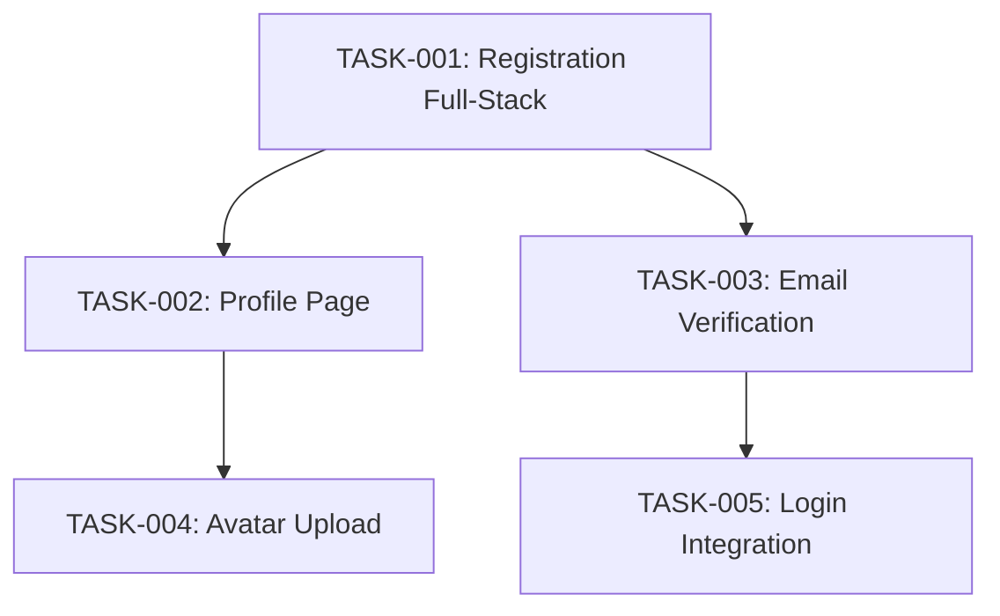
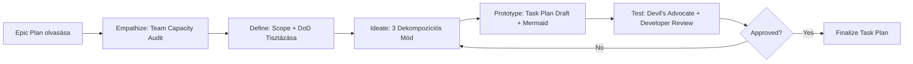
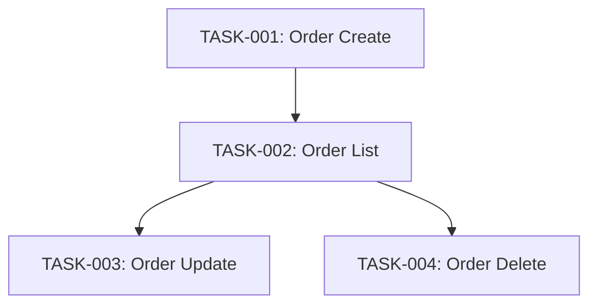
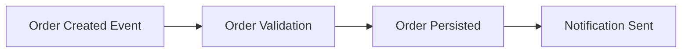

# **Design Thinking for Agile Task Planning**

## **1. Áttekintés**

A **Design Thinking** egy iteratív, user-centered problem-solving metodológia, amely a Task Planning kontextusában lehetõvé teszi a Tech Lead számára, hogy ne mechanikusan bontsa fel az Epic-et Task-okra, hanem figyelembe véve a csapat kapacitását, skill gap-eket és függõségeket készítsen megvalósítható tervet.

**Mikor használd:**
- Epic Plan & Task Breakdown során
- Task Planning Phase (Epic terv atomizálása)
- Sprint Planning elõkészítésekor
- Komplex függõségek kezelésénél
- Epic Closure utáni Lessons Learned dokumentálásánél

**Core filozófia:** A feladatbontás nem "vágd szét a tervet 10 részre", hanem **empathize** a fejlesztõkkel (kapacitás, skillek), **definiálj** jó DoD-t, **ideate** több dekompozíciós módszert, **prototípus** task plan-t, és **teszt** Devil's Advocate review-val.

---

## **2. Az 5 Fázis Tech Lead Adaptációval**

### **2.1 Empathize (Empátia) - Team Capacity & Context Megértése**

**Cél:** Ne csak az Epic tervet lásd, hanem a **csapat valódi helyzetét** is.

**Gyakorlati lépések:**
1. **Team Capacity Audit:** Hány developer available? Van-e szabadság, más projekt overlap?
   - *Eszköz:* Capacity Planning Spreadsheet (elérhetõ órák / sprint)
2. **Skill Gap Analysis:** A fejlesztõknek megvannak-e a szükséges skilljeik?
   - *Példa:* Ha az Epic React state management-et igényel, ki tud Redux Toolkit-et?
3. **Stakeholder Priorities:** A Product Owner mi a kritikus path?
   - *Kérdés:* "Ha csak 50%-ot tudunk szállítani sprinten belül, mi a must-have?"
4. **Developer Feedback:** Van-e technikai adósság, ami blokkol?
   - *Eszköz:* Retrospektív jegyzetek, Technical Debt backlog

**Kimenet:**
- **Team Capacity Matrix** (Developer, Available Hours, Primary Skills)
- **Skill Gap List** (Hiányzó skillek + Training/Pairing terv)
- **Stakeholder Priority Rank** (MoSCoW: Must / Should / Could / Won't)

**Anti-pattern:** "Csak a tervet bontom fel, nem érdekli, hogy ki csinálja" – Unrealistic Task-ok.

---

### **2.2 Define (Definiálás) - Epic Scope & DoD Tisztázása**

**Cél:** Világos határok húzása: Mit és mit NEM csinálunk most? Mi a "Done" definíciója?

**Gyakorlati lépések:**
1. **Epic Scope Boundaries:** Mit tartalmaz az Epic, mit NEM?
   - *Példa:* "EPIC-005: User Authentication" – Email/Password ?, Social Login ? (next Epic)
2. **Definition of Done (DoD) Canvas:** Minden Task-ra egységes DoD
   - *Template:*
     ```markdown
     ## DoD Criteria
     - [ ] Code implemented + Unit Tests (80% coverage)
     - [ ] Code Review approved
     - [ ] Integration Test passed
     - [ ] Documentation updated (README, API docs)
     - [ ] Deployed to Dev environment
     ```
3. **Task Breakdown Criteria:** Mi a minimum és maximum task méret?
   - *Guideline:* 1 Task = 4-16 óra (0.5-2 nap), nem több!

**Kimenet:**
- **Epic Scope Statement** (In/Out Scope lista)
- **Unified DoD Template** (minden Task-ra alkalmazzuk)
- **Task Sizing Guideline** (min/max órák)

**Anti-pattern:** "A Task mérete 5 nap" – Too big, tovább kell bontani!

---

### **2.3 Ideate (Ötletelés) - Task Dekompozíció Módszerek**

**Cél:** Ne csak "fent lefelé" bontsd a task-okat (Epic › Features › Tasks), hanem alkalmazz különbözõ dekompozíciós technikákat!

**Gyakorlati lépések:**
1. **Decomposition Techniques:**
   - **A. Vertical Slicing:** Full-stack feature slices (pl. "Login UI + API + DB")
   - **B. Horizontal Slicing:** Layer-by-layer (pl. "API Layer" › "Service Layer" › "Repository")
   - **C. Event Storming (DDD):** Domain events alapján task-olás
     - *Példa:* "User Registered" event › Tasks: Validation, DB Save, Email Notification
2. **Dependency Mapping:** Mermaid diagram a Task függõségekrõl
   - *Eszköz:* Mermaid Gantt Chart vagy Dependency Graph
3. **Parallelization Opportunities:** Mely Task-ok futhatnak párhuzamosan?
   - *Példa:* Frontend és Backend task-ok különválasztása

**Kimenet:**
- **3 Alternatív Task Breakdown Mód** (Vertical / Horizontal / Event-based)
- **Dependency Diagram** (Mermaid Graph)
- **Parallelization Plan** (Mely task-ok independent?)

**Anti-pattern:** "Single Decomposition" - csak egy módszerrel bontasz, nem vizsgálsz alternatívákat.

**Példa - 3 Alternatív Dekompozíció:**

**Epic:** User Registration Feature

**Vertical Slicing (User Story Mapping):**
```markdown
- TASK-01: Email/Password Registration (UI + API + DB + Email)
- TASK-02: Profile Page Setup (UI + API + DB)
```

**Horizontal Slicing (Layer-based):**
```markdown
- TASK-01: Registration API Endpoint (Controller + DTO)
- TASK-02: User Service Layer (Business Logic)
- TASK-03: User Repository (EF Core)
- TASK-04: Registration UI (React Form)
- TASK-05: Email Service Integration
```

**Event Storming (DDD):**
```markdown
- TASK-01: UserRegistered Event (Domain Event)
- TASK-02: Registration Command Handler (CQRS)
- TASK-03: Email Notification on UserRegistered (Event Handler)
- TASK-04: User Profile Created (Aggregate)
```

› **Döntés:** Vertical Slicing javasolt, mert:
- Gyors feedback loop (full feature done hamarabb)
- Demo-ready results minden Task után
- Kevesebb integration risk

---

### **2.4 Prototype (Prototípus) - Task Plan Draft & Dependency Diagram**

**Cél:** Gyors validáció a feladatbontás helyességére.

**Gyakorlati lépések:**
1. **Task Plan Draft:** Markdown file a Task-ok listájával
   - *Template:* `TASK-XXX.md` (ID, Title, Description, DoD, Dependencies, Estimated Hours, Assignee)
2. **Dependency Diagram (Mermaid):** Vizualizáld a függõségeket
   - *Eszköz:* Mermaid Gantt Chart vagy Flowchart
3. **Resource Allocation Matrix:** Ki melyik Task-on dolgozik?
   - *Eszköz:* Excel vagy Markdown táblázat

**Kimenet:**
- **Task Plan Markdown File** (minden task részletesen)
- **Mermaid Dependency Diagram**
- **Resource Allocation Table**

**Anti-pattern:** "Task terv Excel-ben" – Nem verziókezelt, nem review-ható Git-ben.

**Példa Task Plan (Markdown):**
```markdown
## TASK-001: Email/Password Registration (Full-Stack)
**Epic:** EPIC-005 User Authentication
**Description:** Implement user registration with email/password (UI + API + DB + Email confirmation).
**DoD:**
- [ ] React registration form (validation with Formik)
- [ ] API Endpoint: `POST /api/auth/register`
- [ ] User entity in DB (EF Core migration)
- [ ] Email confirmation sent (SMTP service)
- [ ] Unit Tests (80% coverage)
- [ ] Integration Test passed
**Dependencies:** None (first task)
**Estimated Hours:** 12h
**Assignee:** TBD (requires React + .NET skill)
```

**Dependency Diagram (Mermaid):**


---

### **2.5 Test (Tesztelés) - Devil's Advocate Review & Developer Feedback**

**Cél:** Validálni, hogy a Task Plan megvalósítható és nem tartalmaz hidden blocker-eket.

**Gyakorlati lépések:**
1. **Devil's Advocate Review:** Kérd a Devil's Advocate ágenst a kritikai review-ra
   - *Kérdések:* "Van-e scope creep?" "Reális-e az estimate?" "Hiányzik valami task?"
2. **Developer Feedback:** Prezentáld a Task Plan-t a fejlesztõknek (planning poker style)
   - *Kérdés:* "Ti mennyire látjátok reálisnak ezt a bontást?"
3. **Scope Refinement:** Ha a feedback alapján módosítás kell, térj vissza az **Ideate** fázisba
4. **Resource Conflicts Check:** Van-e overlap más projektekkel?

**Kimenet:**
- **Approved Task Plan** (Developer + Devil's Advocate sign-off)
- **Refined Estimates** (Planning poker eredmények)
- **Risk Register** (Ismert blockerek, függõségek)

**Anti-pattern:** "Csak én tudom, nincs szükség feedback-re" – Task elakad implementáció közben.

**Devil's Advocate Review Checklist:**
```markdown
## Review Questions
- [ ] Minden Task atomikus (max 2 nap)?
- [ ] DoD minden task-nál egyértelmû?
- [ ] Dependency-k helyesek (nincs circular dependency)?
- [ ] Skill-ek megvannak (nincs skill gap risk)?
- [ ] Estimates reálisak (nincs túloptimista becslés)?
- [ ] Scope clean (nincs scope creep)?
```

---

## **3. Integration Points - Hol Illeszkedik a Workflow-ba?**

### **Epic Planning & Task Breakdown Folyamat**


### **Sprint Planning Elõkészítés**
1. **Task Plan áttekintés:** Task prioritization MoSCoW módszerrel
2. **Sprint Commitment:** Hány Task fér bele egy sprintbe? (Capacity vs. Estimate)
3. **Resource Allocation:** Ki melyik task-on dolgozik?

### **Epic Closure - Lessons Learned**
- **Design Thinking használata:** Az Epic végi retrospektív során az **Empathize** fázist alkalmazva gyûjtsd össze a fejlesztõi feedback-et
- **Future Improvement:** Az **Ideate** fázis segítségével brainstorming-olj jobb task breakdown módszereket

---

## **4. Anti-patterns - Mit NE Csinálj**

| Anti-pattern | Leírás | Miért veszélyes? | Helyette |
|---------------|--------|------------------|----------|
| **Waterfall Thinking** | Túl nagy task-ok (5+ nap) vagy túl apró task-ok (1-2 óra) | Vagy túl granuláris, vagy tracking nem mûködik | 1 Task = 4-16 óra (0.5-2 nap) |
| **Ignore Team Feedback** | Csak az Epic terv alapján bontasz, nem kérsz developer input-ot | Unrealistic estimates, hidden blockerek | Empathize: Team capacity audit + skill gap analysis |
| **Single Decomposition** | Csak egy módszerrel bontasz (pl. mindig horizontal slicing) | Elmulasztod a jobb alternatívát | Ideate: Minimum 2 módszer összehasonlítása |
| **No Dependency Mapping** | Task-ok sorrendje nem világos | Blocker chain: egyik task vár a másikra | Prototype: Mermaid dependency diagram |
| **Skip Devil's Advocate Review** | Csak én review-zom a task plan-t | Scope creep, rejtett kockázatok | Test: Devil's Advocate review kötelezõ |

---

## **5. Példa Workflow: Epic & Task Dekompozíció Design Thinking Módszerrel**

### **Kontextus**
**Epic:** EPIC-008 Order Management - CRUD mûveletek Order entity-re (Create, Read, Update, Delete).

**Architect Sign-off:** Clean Architecture, CQRS pattern, EF Core, React frontend.

---

### **Design Thinking Folyamat**

#### **1. Empathize**
**Team Capacity Audit:**
- **Dev 1 (Backend):** 30h/sprint, Senior .NET + EF Core ?
- **Dev 2 (Frontend):** 25h/sprint, Mid-level React, Redux Toolkit ?? (neki mentoring kell)
- **Dev 3 (Full-stack):** 20h/sprint, Junior, API + React basic skill ??

**Skill Gap:**
- Dev 2 és Dev 3 számára Redux Toolkit pairing session szükséges

**Stakeholder Priority (MoSCoW):**
- **Must:** Order Create + List Orders (CRUD R+C)
- **Should:** Order Update + Delete (CRUD U+D)
- **Could:** Order Filtering (search by status, date range)
- **Won't:** Order Export to Excel (next Epic)

**Developer Feedback:**
- "Az elõzõ Epic-nél az Entity validáció blokkolt, most tervezzük be elõre!" (Constraint)

› **Empathy Map Output:**
- Team capacity: ~75h/sprint, de mentoring overhead miatt inkább 60h realistic
- Priority: R+C > U+D > Filtering

---

#### **2. Define**
**Epic Scope Statement:**
- **In Scope:** Order CRUD (Create, Read, Update, Delete), Basic validation, Clean Architecture
- **Out Scope:** Order Export, Advanced Filtering (next Epic)

**DoD Template:**
```markdown
## DoD Criteria
- [ ] Backend: CQRS Command/Query implemented
- [ ] Backend: Unit Tests (80% coverage)
- [ ] Frontend: React component + Redux Toolkit slice
- [ ] Frontend: E2E Test (Cypress)
- [ ] Code Review approved
- [ ] Deployed to Dev environment
```

**Task Sizing Guideline:**
- Min: 4h (0.5 nap), Max: 16h (2 nap)

---

#### **3. Ideate**
**3 Alternatív Dekompozíciós Módszer:**

**Option A: Vertical Slicing (User Story Mapping)**
```markdown
- TASK-01: Order Create (Full-stack: API + UI + DB)
- TASK-02: Order List (Full-stack: API + UI)
- TASK-03: Order Update (Full-stack: API + UI)
- TASK-04: Order Delete (Full-stack: API + UI)
```
**Pros:** Gyors feedback loop, minden task után demo-ható feature
**Cons:** Full-stack skill kell, Dev 3 (Junior) struggle-lhet

**Option B: Horizontal Slicing (Layer-based)**
```markdown
- TASK-01: Order Entity + EF Core Migration (Backend)
- TASK-02: CQRS Commands (Create, Update, Delete) (Backend)
- TASK-03: CQRS Queries (GetById, GetAll) (Backend)
- TASK-04: Order API Endpoints (Controller) (Backend)
- TASK-05: Order React Components (Frontend)
- TASK-06: Redux Toolkit Order Slice (Frontend)
```
**Pros:** Specialization (Backend/Frontend külön), Dev 1 gyorsan elõre halad
**Cons:** Integration risk (frontend csak a végén látja az API-t), nem demo-ható feature early

**Option C: Event Storming (DDD)**
```markdown
- TASK-01: OrderCreated Event + Command Handler
- TASK-02: OrderUpdated Event + Command Handler
- TASK-03: OrderDeleted Event + Command Handler
- TASK-04: Order Query Handler (Read Model)
- TASK-05: Order UI (Frontend)
```
**Pros:** Domain-driven, jó hosszú távon
**Cons:** Overkill simple CRUD-ra

**Trade-off Analysis:**
| Criteria | Vertical (A) | Horizontal (B) | Event Storming (C) |
|----------|--------------|----------------|---------------------|
| Demo Speed | 9 | 5 | 6 |
| Team Skill Fit | 6 | 9 | 4 |
| Integration Risk | 7 | 4 | 6 |
| **Total** | **22** | **18** | **16** |

› **Döntés:** **Option A (Vertical Slicing)**, de Dev 3 (Junior) csak TASK-02 (List)-et kapja, ami egyszerûbb.

---

#### **4. Prototype**
**Task Plan Draft:**

```markdown
## TASK-001: Order Create (Full-Stack)
**Epic:** EPIC-008 Order Management
**Description:** Implement Order creation (API + UI + DB + Validation).
**DoD:**
- [ ] Backend: CreateOrderCommand + Handler (CQRS)
- [ ] Backend: Order Entity + EF Core Migration
- [ ] Backend: Validation (FluentValidation)
- [ ] Backend: Unit Tests (80%)
- [ ] Frontend: Order Create Form (React + Formik)
- [ ] Frontend: Redux Toolkit createOrder action
- [ ] E2E Test (Cypress)
**Dependencies:** None
**Estimated Hours:** 14h
**Assignee:** Dev 1 (Backend) + Dev 2 (Frontend pairing)

---

## TASK-002: Order List (Full-Stack)
**Description:** Display all Orders in a table (API + UI).
**DoD:**
- [ ] Backend: GetAllOrdersQuery + Handler (CQRS)
- [ ] Backend: Unit Tests
- [ ] Frontend: Order List Component (React Table)
- [ ] Frontend: Redux Toolkit fetchOrders action
- [ ] E2E Test
**Dependencies:** TASK-001 (needs Order entity in DB)
**Estimated Hours:** 10h
**Assignee:** Dev 3 (Junior) - mentored by Dev 1

---

## TASK-003: Order Update (Full-Stack)
**Description:** Edit existing Order (API + UI).
**DoD:**
- [ ] Backend: UpdateOrderCommand + Handler
- [ ] Backend: Validation (FluentValidation)
- [ ] Backend: Unit Tests
- [ ] Frontend: Order Edit Form (React + Formik)
- [ ] Frontend: Redux Toolkit updateOrder action
- [ ] E2E Test
**Dependencies:** TASK-001, TASK-002
**Estimated Hours:** 12h
**Assignee:** Dev 2 (Frontend) + Dev 1 (Backend review)

---

## TASK-004: Order Delete (Full-Stack)
**Description:** Soft-delete Order (API + UI confirmation dialog).
**DoD:**
- [ ] Backend: DeleteOrderCommand + Handler (Soft Delete)
- [ ] Backend: Unit Tests
- [ ] Frontend: Delete Confirmation Modal (React)
- [ ] Frontend: Redux Toolkit deleteOrder action
- [ ] E2E Test
**Dependencies:** TASK-001, TASK-002
**Estimated Hours:** 8h
**Assignee:** Dev 3 (Junior) - mentored by Dev 2
```

**Dependency Diagram (Mermaid):**


**Resource Allocation:**
| Task | Assignee | Hours | Sprint Week |
|------|----------|-------|-------------|
| 001 | Dev 1 + Dev 2 | 14h | Week 1 |
| 002 | Dev 3 (mentored) | 10h | Week 1-2 |
| 003 | Dev 2 + Dev 1 | 12h | Week 2 |
| 004 | Dev 3 (mentored) | 8h | Week 2 |
| **Total** | | **44h** | 2 weeks |

---

#### **5. Test**
**Devil's Advocate Review:**
- ? Task méret OK (8-14h range)
- ? DoD minden task-nál clear
- ? Dependency-k helyes (TASK-001 first, then parallel TASK-003/004)
- ?? **Risk:** Dev 2 Redux Toolkit skill gap › **Mitigation:** Pairing session TASK-001-nél
- ?? **Risk:** Dev 3 (Junior) E2E Test írása › **Mitigation:** Dev 1 review-zza az E2E test-eket

**Developer Feedback (Planning Poker):**
- Dev 1: "14h TASK-001-re reális."
- Dev 2: "TASK-003 lehet 12h-nál több, ha Redux Toolkit-ben elakadok." › **Refined Estimate:** 12-16h
- Dev 3: "TASK-002 OK, de E2E test-nél segítség kell." › **Mentoring Note:** Dev 1 review-z

**Approval:**
- ? Task Plan approved
- ? Estimates refined
- ? Mentoring plan ready

---

## **6. Eszközök és Technikák**

### **User Story Mapping Template**
```markdown
## User Story Map: Order Management
| User Activity | Stories | Tasks |
|---------------|---------|-------|
| Create Order  | As a user, I want to create an order | TASK-001 |
| View Orders   | As a user, I want to see all my orders | TASK-002 |
| Edit Order    | As a user, I want to edit an order | TASK-003 |
| Delete Order  | As a user, I want to delete an order | TASK-004 |
```

### **Task Dependency Matrix**
```markdown
| Task | Depends On | Blocks |
|------|------------|--------|
| 001 | None | 002, 003, 004 |
| 002 | 001 | 003, 004 |
| 003 | 001, 002 | None |
| 004 | 001, 002 | None |
```

### **Event Storming Board (DDD Context)**


### **MoSCoW Prioritization Canvas**
```markdown
## MoSCoW Priority Matrix
| Must Have | Should Have | Could Have | Won't Have |
|-----------|-------------|------------|------------|
| Order Create | Order Update | Order Filtering | Order Export to Excel |
| Order List | Order Delete | | |
```

### **Definition of Done Canvas**
```markdown
## DoD Canvas (Copy-paste minden Task-ra)
- [ ] Code Review Approved (2 reviewers)
- [ ] Unit Tests (80% coverage)
- [ ] Integration/E2E Test Passed
- [ ] Documentation Updated (README, API Swagger)
- [ ] Deployed to Dev Environment
- [ ] No Blocker Bugs
```

---

## **7. További Olvasnivaló**

- **Tech Lead Role:** `src/agent-system/database/roles/discovery/tech_lead/tech_lead.role.md`
- **Task Planning Template:** `docs/{project}/epics/TASK-XXX.md`
- **Devil's Advocate Review:** `src/agent-system/database/roles/agentops/devils_advocate/devils_advocate.role.md`
- **Epic Planning:** `src/agent-system/database/roles/discovery/architect/architect.runbook.md`

---

**Összefoglalás:** A Design Thinking Task Planning során azt jelenti, hogy **nem mechanikusan** bontod fel az Epic-et, hanem:
1. **Empathize:** Megérted a csapat kapacitását és skill gap-eket
2. **Define:** Világos scope és DoD
3. **Ideate:** Több dekompozíciós módszert kipróbálsz
4. **Prototype:** Task Plan draft + Dependency diagram
5. **Test:** Devil's Advocate + Developer feedback

Ez a módszer csökkenti a "task elakad implementáció közben" problémát, és biztosítja, hogy a Task Plan **reális és megvalósítható** legyen.
