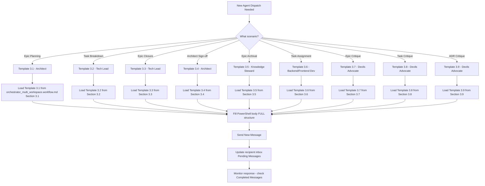

# **?? Multi-Workspace Coordination Skill**

Ez a dokumentum definiálja a **Communication Hub v2.0** mûködését és az Orchestrator szerepkörhöz tartozó **message-based coordination protokollt**. Minden Orchestrator session-nek ismernie kell ezeket a mintákat a hatékony Multi-Workspace koordinációhoz.

---

## **1. Communication Hub Alapelvek**

### **A. Message-based Coordination Pattern**

* **Mikor**: Minden ágenshez kommunikáció (Architect, Tech Lead, Backend/Frontend Developer, QA Tester, Knowledge Steward, Devils Advocate)
* **Cél**: Asszinkron, nyomkövetett, archivált üzenetváltás PowerShell message formátumban
* **Mûködés**:
  1. **Dispatch**: Orchestrator küld üzenetet az ágens inbox-ába (`New-Message` PowerShell command)
  2. **Processing**: Ágens FIFO sorrendben dolgozza a Pending Messages táblázatot
  3. **Response**: Ágens válaszol üzenettel (Template-based structure)
  4. **Validation**: Orchestrator validálja a response completeness-t

**Utasítás**: "SOHA ne közvetlen prompt-tal kommunikálj ágensekkel. MINDIG használd a Communication Hub üzenetküldést (`New-Message` PowerShell body-val)."

**Példa (HELYES)**:

```powershell
New-Message -From "orchestrator" -To "architect" `
  -Title "Epic Planning Request - EPIC-12" `
  -Body @"...{FULL Template 3.1 structure}..."@ `
  -Priority "high" `
  -Category "epic-planning"
```

**Anti-Pattern (ROSSZ)**:

```markdown
Architect, tervezd meg az EPIC-12-t. Küldj vissza epic plan-t.
```

? **Miért rossz**: NEM Communication Hub message, nem nyomkövetett, nincs inbox entry, nem archivált.

---

### **B. Inbox Management Pattern**

* **Mikor**: Response check, agent status validálás
* **Cél**: Real-time láthatóság az ágensek munkájába (Pending vs Completed messages)
* **Mûködés**:
  1. Töltsd be az ágens inbox-át: `docs/{project}/communication_hub/{role}_inbox.md`
  2. Ellenõrizd a "Pending Messages" táblázatot (message status: ? Pending)
  3. Ellenõrizd a "Completed Messages" táblázatot (új response megérkezett?)
  4. Olvass response message-et: `messages/{date}/msg-{id}-{role}-to-orchestrator.md`

**Utasítás**: "Mielõtt új üzenetet küldesz, ellenõrizd az elõzõ üzenet status-át az ágens inbox-ában. Ha ? Pending, várj vagy escalate (SLA violation)."

**SLA Guidelines**:

* ?? Critical priority: 2-4 hours (Epic Planning, Task Critique, ADR Review)
* ?? High priority: 4-8 hours (Task Breakdown, Epic Closure, Architect Sign-off)
* ?? Normal priority: 1 day (Task Assignment, Implementation)
* ? Low priority: 2 days (Documentation update, Archive)

---

### **C. FIFO Processing Pattern**

* **Mikor**: Agent inbox több Pending message-t tartalmaz
* **Cél**: Idõrendi sorrendben, prioritás override-dal dolgoznak az ágensek
* **Mûködés**:
  1. **FIFO by default**: Legrégebbi timestamp elõször (timestamp oszlop)
  2. **Priority override**: ?? Critical priority MINDIG elõször (regardless timestamp)
  3. **Blocking dependency**: Ha egy message reply_to field-je ? Pending, várj

**Utasítás**: "Ha egy ágensnek több Pending message-e van, NE várj mindegyik completion-re. Ellenõrizd a priority-t és a blocking dependency-t. Ha critical message van, az elõbb kerül sorra."

---

## **2. Template System & Enforcement**

### **D. Template Selection Pattern**

* **Mikor**: Új üzenet készítésekor (agent dispatch)
* **Cél**: A megfelelõ template kiválasztása a message scenario alapján
* **Mûködés**: Használd a **Template Selection Guide** táblázatot (orchestrator_multi_workspace.workflow.md Section 2):

| Message Scenario           | Target Agent          | Template            | Template ID |
|----------------------------|-----------------------|---------------------|-------------|
| Epic Planning              | Architect             | Epic Planning Request | Template 3.1|
| Task Breakdown             | Tech Lead             | Task Breakdown Request| Template 3.2|
| Epic Closure               | Tech Lead             | Epic Closure Request  | Template 3.3|
| Architect Sign-off         | Architect             | Architect Sign-off Request | Template 3.4|
| Epic Archival              | Knowledge Steward     | Epic Archival Request | Template 3.5|
| Task Assignment            | Backend/Frontend Dev  | Task Assignment       | Template 3.6|
| Epic Planning Critique     | Devils Advocate       | Epic Planning Review Request | Template 3.7|
| Task Planning Critique     | Devils Advocate       | Task Planning Review Request | Template 3.8|
| ADR Critique               | Devils Advocate       | ADR Review Request    | Template 3.9|

**Utasítás**: "MINDIG nézd meg a Template Selection Guide-ot MIELÕTT üzenetet küldesz. Használd a template Section 3-ból TELJES struktúráját (PowerShell body @"...")."

**Anti-Pattern (ROSSZ)**:

```markdown
Tech Lead, csináld meg az Epic closure-t EPIC-07-hez. Küldj dokumentációt.
```

? **Miért rossz**:

* Template 3.3 TELJES struktúrája HIÁNYZIK (Required Deliverables breakdown, Context Files paths, Closure Document Content, Calibration Instructions, Success Criteria checklist)
* Generic kérés ("csináld meg") ? explicit Required Deliverables (3 files: tech_lead_signoff.md, qa_signoff.md, epic_review.md content breakdown)
* Context Files HIÁNYZIK (Task completion messages paths, QA reports paths)

---

### **E. Template Enforcement Pattern**

* **Mikor**: Template body készítésekor
* **Cél**: Részletes, strukturált üzenet (explicit szakasz checklist + "Miért fontos" reasoning + anti-pattern példák)
* **Mûködés**: **MINDEN template szakasza KÖTELEZÕ** (NE rövidíts, NE egyszerûsíts, NE találd ki saját struktúrát)

**?? KRITIKUS Template Components** (MINDEN template-ben):

1. **Epic/Task/ADR Context**: Goal, Scope, Priority, Complexity (brief summary)
2. **Required Deliverables**: File lista + content breakdown (mi legyen benne részletesen)
3. **Context Files to Load**: Path lista (Epic plan, ADR files, Task plans, Standards) - EXPLICIT paths KÖTELEZÕEK
4. **Specific Requirements**: Tartalmi követelmények (section-by-section, field-by-field)
5. **Next Steps**: Agent actions + Orchestrator actions (conditional on outcome)
6. **Success Criteria**: [ ] checklist formátum (4-6 kritérium)
7. **SLA/Deadline**: Expected completion time (if applicable)

**Utasítás**: "Kövesd a PowerShell body (@"...") TELJES tartalmát. Minden szakaszt tölts ki részletesen. Context Files paths explicit lista KÖTELEZÕ (NE 'load relevant files' generic kérés)."

**Példa (Template 3.2 - Task Breakdown Request - HELYES)**:

```powershell
New-Message -From "orchestrator" -To "tech_lead" `
  -Title "Task Breakdown Request - EPIC-12" `
  -Body @"
Task breakdown required for EPIC-12 (Order Management System).

**Epic Context**:
- Epic Goal: Implement order creation, update, cancellation functionality
- Epic Scope: 3 main features (Create order, Update order status, Cancel order with refund)
- Key ADRs: ADR-005 (CQRS Commands for Orders), ADR-008 (Event Sourcing for Order History), ADR-012 (Repository Pattern for Order persistence)

**Required Deliverables**:
- Task count: Estimated 8-12 tasks (breakdown by layer: Core Entities/Commands, Infrastructure Repository, API Endpoints)
- Backlog update: docs/joinerytech-flow/backlog.md (append tasks with priority)
- Task distribution: Backend tasks {count}, Frontend tasks {count}, QA tasks {count}

**Context Files to Load**:
- Epic Plan: docs/joinerytech-flow/epics/EPIC-12/plan.md
- ADR-005: docs/joinerytech-flow/decisions/ADR-005-cqrs-commands-orders.md
- ADR-008: docs/joinerytech-flow/decisions/ADR-008-event-sourcing-order-history.md
- ADR-012: docs/joinerytech-flow/decisions/ADR-012-repository-pattern-orders.md
- Project Standards: docs/joinerytech-flow/standards/task_planning_standard.md

**Task Plan Requirements** (MINDEN task-hoz):
- Task title and goal (1-2 sentence)
- Implementation steps (3-7 steps)
- Files to modify/create (specific paths)
- Dependencies (blocks/blocked-by task IDs)
- Estimated effort (hours/days)
- DoD (acceptance criteria - testable!)
- Required skills (backend/frontend/qa)

**Next Steps**:
- Tech Lead: Create task plans using task_planning_standard.md
- Tech Lead: Update backlog.md with task entries
- Tech Lead: Send task breakdown completion message to Orchestrator (Template 4.X)
- Orchestrator: Validate task count (8-12 range), task distribution (Backend/Frontend/QA balance)
- Estimated duration: 6-8 hours

**Success Criteria**:
- [ ] Task count in range 8-12 (Epic scope coverage)
- [ ] Each task has DoD with testable acceptance criteria
- [ ] Dependencies documented (task dependency graph)
- [ ] Backlog.md updated with all tasks
- [ ] Task distribution balanced (Backend/Frontend/QA)
"@ `
  -Priority "high" `
  -Category "task-breakdown"
```

? **Miért helyes**:

* Epic Context részletes (Goal, Scope, Key ADRs **explicit títlokkal**)
* Required Deliverables breakdown (Task count estimate, Backlog update, Task distribution)
* Context Files to Load **explicit paths** (4 ADR + 1 standard - NEM "load relevant files")
* Task Plan Requirements **field-by-field** részletesen (7 kötelezõ field minden task-hoz)
* Next Steps **action-oriented** (Tech Lead mit csinál, Orchestrator mit validál)
* Success Criteria **[ ] checklist** formátumban (5 kritérium)

---

### **F. "Miért Fontos" Reasoning Pattern**

* **Mikor**: Template design során (új template készítésekor vagy refinement során)
* **Cél**: Explicit reasoning MINDEN kötelezõ szakaszhoz (ki használja, mire, miért kötelezõ)
* **Mûködés**: Adj magyarázatot, hogy az ágens értse a szakasz célját (NEM csak "mert kötelezõ")

**Példa (Template 3.3 - Epic Closure Request)**:

**Required Deliverables szakasz**:

* **3 files kötelezõ**: tech_lead_signoff.md, qa_signoff.md, epic_review.md
* **Miért fontos**: Tech Lead Sign-off › Architect validálja task completion-t (N/N, CI/CD pass, Test coverage %), QA Sign-off › Architect validálja quality-t (Acceptance tests pass), Epic Review › Knowledge Steward updates standards/DoD calibration

**Closure Document Content szakasz**:

* **Content breakdown**: tech_lead_signoff 5 sections (Test Results, Code Quality, Known Issues, Recommendations, Approval), qa_signoff 4 sections (Test Summary, Issues Found, Recommendations, Approval)
* **Miért fontos**: Architect sign-off elõfeltétel (content completeness check), Calibration nélkül Knowledge Steward NEM tudja mit frissítsen

**Calibration Instructions szakasz**:

* **Explicit lista**: dod_rule.md section update (which section?), standards filename (create/update what?), templates refinement (which template?)
* **Miért fontos**: Knowledge Steward pontosan tudja mit frissítsen (NEM generic "update standards if needed")

**Utasítás**: "Minden template szakasznál adj 'Miért fontos' reasoning-et (ki használja downstream, mire, miért kötelezõ). Ez segít az ágensnek megérteni a szakasz célját."

---

### **G. Anti-Pattern Examples Pattern**

* **Mikor**: Template dokumentációban (Section 3 után vagy Section 4 template-ekben)
* **Cél**: Konkrét ROSSZ példa (mit NE csináljanak), részletes magyarázattal (miért rossz)
* **Mûködés**: Minden template-hez adj egy Anti-Pattern Example-t (ROSSZ üzenet konkrét példa + bullet lista "Miért ROSSZ")

**Példa (Template 3.5 - Epic Archival Request)**:

**Anti-Pattern Example (ROSSZ)**:

```markdown
Archive Epic 07, 08, 11. Create archived/ folder, copy files, update state.md.
```

? **Miért ROSSZ**:

* Epic-ek táblázat HIÁNYZIK (File count, Size KB, Status minden Epic-hez)
* Expected Context Reduction HIÁNYZIK (Token reduction, Active context before/after)
* Archive Policy HIÁNYZIK (Copy NOT move explicit policy, Originals preserved)
* Context Files HIÁNYZIK (Epic paths lista betöltéshez)
* Success Criteria checklist HIÁNYZIK ([ ] formátum - completion validáció)
* Deadline HIÁNYZIK (Mikor kell kész legyen?)
* "Create archived/ folder" NEM elég - Required Actions 5-step breakdown KÖTELEZÕ

**Utasítás**: "Minden template-hez adj Anti-Pattern Example-t (ROSSZ üzenet + bullet lista 'Miért ROSSZ'). Ez hatékonyabb mint csak JÓ leírás (ágensek látják mi a TILOS)."

---

## **3. Agent-specific Dispatch Protocols**

### **H. Architect Dispatch Pattern**

* **Mikor**: Epic Planning, Architect Sign-off kérés
* **Template-ek**: Template 3.1 (Epic Planning Request), Template 3.4 (Architect Sign-off Request)
* **Critical Components**:
  * **Template 3.1**: Required Deliverables (Epic plan.md content breakdown, ADR 2-3 areas, dependency_map.md), Context Files (existing ADRs, standards), Success Criteria ([ ] 4 kritérium)
  * **Template 3.4**: Required Deliverables (architect_signoff.md **5 sections** content breakdown!), Architect Sign-off Content (Architecture Compliance 4-point, Technical Debt 4-level, Calibration Recommendations explicit), Success Criteria ([ ] 6 kritérium)

**Utasítás Template 3.4**: "NE csak 'create architect_signoff.md' - adj 5 sections tartalmi követelményeit (Validation Results, Architecture Compliance 4-point, ADR Adherence, Technical Debt 4-level, Calibration Recommendations explicit lista)."

**Validation Check (Response - Template 4.2)**:

* [ ] architect_signoff.md létezik (3 file: architect_signoff, decision_log, state)
* [ ] Architecture Compliance **4-point breakdown** present? (Clean Architecture layers, Domain modeling, Dependency rules, API design)
* [ ] Technical Debt Assessment **4-level breakdown** present? (Critical/High/Medium/Low count + Overall level)
* [ ] Calibration Recommendations **explicit lista** present? (dod_rule section, standards filename, templates list)

---

### **I. Tech Lead Dispatch Pattern**

* **Mikor**: Task Breakdown, Epic Closure kérés
* **Template-ek**: Template 3.2 (Task Breakdown Request), Template 3.3 (Epic Closure Request)
* **Critical Components**:
  * **Template 3.2**: Epic Context (Key ADRs **2-3 explicit titles**!), Required Deliverables (Task count estimate!, Task distribution Backend/Frontend/QA), Task Plan Requirements (7 field minden task-hoz), Success Criteria ([ ] 5 kritérium)
  * **Template 3.3**: Epic Status (N/N tasks, CI/CD, QA), Required Deliverables (**3 files** content breakdown!), Closure Document Content (tech_lead_signoff 5 sections, qa_signoff 4 sections), Calibration Instructions (dod_rule/standards/templates **explicit**!), Success Criteria ([ ] 7 kritérium)

**Utasítás Template 3.3**: "Closure Document Content KÖTELEZÕ - tech_lead_signoff.md 5 sections (Test Results, Code Quality, Known Issues, Recommendations, Approval), qa_signoff.md 4 sections. NE csak 'create 3 files'."

**Validation Check (Response - Template 4.2 Epic Closure)**:

* [ ] 3 files léteznek (tech_lead_signoff.md, qa_signoff.md, epic_review.md)
* [ ] Validation Summary metrics present? (N/N tasks format, CI/CD status, Test coverage %, Known issues count)
* [ ] Calibration Recommendations **explicit lista** present? (dod_rule updates, standards filename, templates list)

---

### **J. Backend/Frontend Developer Dispatch Pattern**

* **Mikor**: Task Assignment (Task Breakdown után, Devils Advocate approval után)
* **Template**: Template 3.6 (Task Assignment)
* **Critical Components**:
  * Task Context (Epic, Priority, Estimated effort, **Dependencies explicit**!)
  * Required Deliverables (Code implementation, Tests count+type, Implementation summary path)
  * Context Files (Task plan, Epic plan, ADR paths, **Skill files** paths)
  * Implementation Guidelines (Clean Architecture layers, Coding style N-shot, Tests 80%+ coverage, Documentation)
  * Success Criteria ([ ] 5 kritérium)

**Utasítás**: "Dependencies explicit KÖTELEZÕ - 'TASK-XX blocks this' vagy 'This blocks TASK-YY' formátumban. NE csak 'check dependencies'."

**Validation Check (Response - Template 4.1)**:

* [ ] Deliverables **layer breakdown** present? (Core/Infrastructure/API file count VAGY Components/Styles/Tests breakdown)
* [ ] Test Results **count formátum** present? (Unit X/X, Integration Y/Y, Code coverage Z%)
* [ ] Implementation Notes present? (Deviations, Technical decisions, Known issues)
* [ ] **Files Changed szakasz külön** present? (File paths + brief description)

---

### **K. QA Tester Dispatch Pattern**

* **Mikor**: Task implementation complete, QA testing szükséges
* **Template**: Template 3.6 (Task Assignment - QA variant) vagy explicit QA Test Request
* **Critical Components**:
  * Test Scope (Acceptance tests, Edge case tests, Regression tests, Security tests)
  * Context Files (Task plan DoD, Implementation summary, Test scenarios)
  * Test Requirements (Happy path, Error handling, Boundary conditions, Performance thresholds)
  * Success Criteria ([ ] 4 kritérium)

**Validation Check (Response - Template 4.1)**:

* [ ] Test Summary **category breakdown** present? (Acceptance X/X, Edge case Y/Y, Regression Z/Z, Security N/N)
* [ ] Test Coverage metrics present? (Functional %, Code %, Critical paths validated)
* [ ] Test Execution Details present? (Happy path, Error handling, Boundary, Performance < threshold)
* [ ] QA Report path present?

---

### **L. Knowledge Steward Dispatch Pattern**

* **Mikor**: Epic Archival (Epic closed, Architect sign-off complete), Calibration (standards/DoD/templates update)
* **Template-ek**: Template 3.5 (Epic Archival Request)
* **Critical Components**:
  * **Priority ?? CRITICAL**: Epic archival context overload-ot csökkent (token budget management)
  * Epic-ek táblázat (Epic ID, File count, Size KB, Status minden Epic-hez)
  * Expected Context Reduction (Token reduction, Active context before/after, Files archived count)
  * **Archive Policy explicit**: Copy NOT move! (Originals preserved read-only)
  * Required Actions (5-step breakdown)
  * Success Criteria ([ ] 5 kritérium)

**Utasítás**: "Archive Policy EXPLICIT KÖTELEZÕ - 'Copy NOT move (originals preserved in docs/{project}/epics/ as read-only historical reference)'. NE csak 'archive files'."

**Validation Check (Response - Template 4.1)**:

* [ ] Deliverables **file count + size KB** Epic-enként present? (20 files, 27 KB format)
* [ ] Communication Hub messages **count** Epic-enként present? (5 messages format)
* [ ] Context Reduction Metrics present? (Token reduction, Active context before/after)
* [ ] **Archive Policy** szakasz present? (Originals preserved, Archived copies, No data loss)
* [ ] **Files Modified** szakasz present? (Created paths!, Updated paths!)

---

### **M. Devils Advocate Dispatch Pattern**

* **Mikor**: Epic Planning complete (Architect), Task Planning complete (Tech Lead), ADR draft complete (Architect) - BEFORE implementation/approval
* **Template-ek**: Template 3.7 (Epic Planning Review Request), Template 3.8 (Task Planning Review Request), Template 3.9 (ADR Review Request)
* **Critical Components**:
  * Epic/Task/ADR Context (Goal, Scope, Status)
  * Required Deliverables (critique_report.md path, Critique status APPROVED/REJECTED/CONDITIONAL, Critical issues ?? count, Recommendations)
  * Context Files (Plan paths, ADR paths, Standards paths - **explicit**!)
  * **Critique Focus Areas** (**7 areas** minden template-nél - explicit lista KÖTELEZÕ!)
  * Next Steps (Devils Advocate execution, **Orchestrator decision** conditional on status)
  * Success Criteria ([ ] 5 kritérium)

**Utasítás Template 3.7**: "Critique Focus Areas **7 areas KÖTELEZÕ lista** - Standards enforcement, Architecture compliance, Risk identification, Dependency analysis, Scope completeness, DoD clarity, Alternative approaches. NE csak 'review the plan'."

**Validation Check (Response - Template 4.1/4.2/4.3)**:

* [ ] Critique Status explicit? (APPROVED/REJECTED/CONDITIONAL)
* [ ] **Critical Issues (??) breakdown** present? (Issue title + Impact + Recommendation minden issue-hoz)
* [ ] **Risk Assessment** breakdown present? (Technical/Business/Security - High/Medium/Low + explanation)
* [ ] **Recommendations prioritized** present? (Critical/High/Medium actionable steps)
* [ ] **Files** szakasz present? (Reviewed documents paths, Critique report path)

---

## **4. Template Enforcement Tapasztalatok (Lessons Learned)**

### **N. Template Compliance Testing Results Pattern**

* **Mikor**: Agent response validation során
* **Cél**: Validation alapján template compliance improvement
* **Tapasztalatok** (2026-02 testing):

**? SUCCESS (100% Compliance)**:

* **Tech Lead** (msg-004 - Template 4.2 Epic Closure Complete): Deliverables (3 files), Validation Summary (6/6 tasks, 100% coverage), **Calibration Recommendations explicit** (dod_rule, database_migration_standard, epic_review_template), Next Steps, Files
* **Orchestrator** (msg-011 - Template 3.5 Epic Archival Request javítva): Epic-ek táblázat, Expected Context Reduction, **Archive Policy** (Copy NOT move explicit), Success Criteria ([ ] 5 kritérium), Required Actions, Context Files

**?? PARTIAL (50-70% Compliance)**:

* **Architect** (msg-007, msg-008): Részletes, DE saját táblázat struktúra (NEM Template 4.1/4.2 format), Architecture Compliance/Tech Debt/Calibration **hiányos vagy HIÁNYZIK**
* **Backend Developer** (msg-012 - Template 4.1): Deliverables layer breakdown hiányos (file count nélkül), Test Results count formátum hiányzik (Unit X/X?), **Implementation Notes HIÁNYZIK**, **Files Changed HIÁNYZIK**
* **Knowledge Steward** (msg-011 archival - Template 4.1): Deliverables file count+KB **HIÁNYZIK** (20 files, 27 KB kellene), CH message count **HIÁNYZIK**, **Archive Policy HIÁNYZIK**, **Files Modified HIÁNYZIK**, Context body-ban **HIÁNYZIK**

**Utasítás**: "Ha agent response compliance < 80%, küldd vissza revision request-et (explicit hiányzó szakaszok listája). Használd az Anti-Pattern Example-t a hiányosság bemutatására."

---

### **O. Template Improvement Strategy Pattern**

* **Mikor**: Agent response compliance validation után
* **Cél**: Template refinement (anti-pattern példák, "Miért fontos" reasoning, explicit checklist)
* **Mi mûködik JÓL**:
  1. **Explicit szakasz checklist** (? formátum - 6-11 szakasz role-dependent): Ágensek látják mi KÖTELEZÕ
  2. **"Miért fontos" magyarázatok** szakaszonként: Ágensek értik a szakasz célját (ki használja downstream, mire)
  3. **Anti-Pattern Examples**: Konkrét ROSSZ example hatékonyabb mint JÓ leírás (ágensek látják TILOS patterns)
  4. **PowerShell body (@"...") TELJES struktúra**: Ágensek copy-paste-lik a struktúrát (NEM találják ki saját formátumot)
  5. **Success Criteria [ ] checklist**: Completion criteria világos (NEM prózai leírás)

**Mi NEM mûködik**:

  1. **Generic kérések**: "Create files" ? "Create 3 files (tech_lead_signoff.md 5 sections, qa_signoff.md 4 sections, epic_review.md)"
  2. **Implicit context loading**: "Load relevant files" ? "Load ADR-005, ADR-008, ADR-012 (explicit paths)"
  3. **Hiányzó "Miért fontos"**: Ágensek kihagyják a szakaszt ha NEM értik célját
  4. **Hiányzó Anti-Pattern**: Ágensek ismétlik a ROSSZ patterns ha NEM látják konkrét példát

**Utasítás**: "Ha új template-et készítesz VAGY meglévõt finomítasz, MINDIG add hozzá: (1) Explicit szakasz checklist ?, (2) 'Miért fontos' reasoning 3-4 szakaszhoz, (3) Anti-Pattern Example ROSSZ üzenet + bullet lista 'Miért ROSSZ'."

---

## **5. Response Validation & Escalation**

### **P. Response Completeness Validation Pattern**

* **Mikor**: Agent response megérkezik (Completed Messages táblázatban új entry)
* **Cél**: Template compliance check (minden kötelezõ szakasz present?)
* **Mûködés**:
  1. Töltsd be a response message-et: `messages/{date}/msg-{id}-{role}-to-orchestrator.md`
  2. Ellenõrizd a frontmatter category-t (correspondence to expected template)
  3. Ellenõrizd a body szakaszokat (Template-specific checklist alapján)
  4. Ha compliance < 80%, küldd vissza revision request-et

**Template-specific Validation Checklists** (lásd Section 3.H-M minden role-hoz)

**Utasítás**: "MINDEN agent response-nál ellenõrizd a template compliance-t (szakasz checklist alapján). Ha < 80%, küldd vissza explicit hiányzó szakaszok listájával."

**Példa (Revision Request - Backend Developer Template 4.1 hiányosság)**:

```powershell
New-Message -From "orchestrator" -To "backend_developer" `
  -Title "Task Implementation msg-012 - Revision Request" `
  -Body @"
Template 4.1 compliance check: 60% (hiányosságok found).

**Hiányzó/Hiányos szakaszok**:

1. **Deliverables - Layer Breakdown**:
   - Jelenlegi: "Code changes: Order entity, Repository, API endpoint"
   - Hiányzó: File count layer-enként (Core X files, Infrastructure Y files, API Z files)
   - Példa (HELYES): "Core (2 files: Order.cs, OrderValidator.cs), Infrastructure (1 file: OrderRepository.cs), API (1 file: OrdersController.cs)"

2. **Test Results - Count Formátum**:
   - Jelenlegi: "All tests passing"
   - Hiányzó: Unit/Integration count formátum (X/X, Y/Y), Code coverage % (Z% + 80% target)
   - Példa (HELYES): "Unit tests: 12/12 ?, Integration tests: 3/3 ?, Code coverage: 85% (target: 80%)"

3. **Implementation Notes** szakasz **TELJESEN HIÁNYZIK**:
   - Szükséges: Deviations from plan, Technical decisions made, Known issues/edge cases
   - Miért fontos: Tech Lead technical decisions látható (ADR szükséges? Standards update?)

4. **Files Changed** szakasz **TELJESEN HIÁNYZIK** (külön szakasz KÖTELEZÕ!):
   - Szükséges: File paths + brief description (minden módosított/létrehozott file)
   - Miért fontos: Orchestrator file path lista alapján validálja completion
   - Példa (HELYES):
     ```
     **Files Changed**:
     - src/Core/Entities/Order.cs (Created - Order entity with validation)
     - src/Infrastructure/Repositories/OrderRepository.cs (Created - Order persistence)
     - src/API/Controllers/OrdersController.cs (Created - Order CRUD endpoints)
     - tests/UnitTests/OrderTests.cs (Created - Order entity tests)
     ```

**Kérlek frissítsd msg-012-t a fenti hiányosságok pótlásával.**

**Success Criteria (revision)**:
- [ ] Deliverables layer breakdown file count-tal
- [ ] Test Results Unit X/X, Integration Y/Y, Code coverage Z% formátum
- [ ] Implementation Notes szakasz hozzáadva
- [ ] Files Changed szakasz külön hozzáadva (minden file path + description)
"@ `
  -Priority "high" `
  -ReplyTo "msg-012" `
  -Category "revision-request"
```

---

### **Q. SLA Violation Escalation Pattern**

* **Mikor**: Agent message status ? Pending TÚLLÉPTE SLA-t
* **Cél**: Escalation (clarification request, context overload warning, priority adjustment)
* **SLA Thresholds**:
  * ?? Critical: 4 hours (Epic Planning, Critique)
  * ?? High: 8 hours (Task Breakdown, Epic Closure)
  * ?? Normal: 1 day (Task Assignment)

**Utasítás**: "Ha SLA violation történik, küldd message-et az ágensnek (category: 'sla-check'). Kérdezd meg: (1) Clarification szükséges?, (2) Context overload?, (3) Blocking dependency?, (4) ETA új?"

**Példa (SLA Check)**:

```powershell
New-Message -From "orchestrator" -To "architect" `
  -Title "SLA Check - msg-015 (Epic Planning EPIC-12)" `
  -Body @"
msg-015 (Epic Planning Request EPIC-12) SLA violation detected.

**Original Request**: 2026-02-17T08:00:00Z
**SLA**: 4 hours (Critical priority)
**Current Time**: 2026-02-17T13:00:00Z (5 hours elapsed)
**Status**: ? Pending (inbox-ban továbbra is)

**Kérdések**:
1. Clarification szükséges? (Epic scope unclear? ADR missing?)
2. Context overload? (Too many ADRs to load? Standards complex?)
3. Blocking dependency? (Waiting for ADR approval? Depends on Epic X?)
4. ETA új? (Mikor várható completion?)

**Next Steps**:
- Ha clarification szükséges, küldd message-et explicit kérdésekkel
- Ha context overload, prioritizáld critical ADRs-t (többi later)
- Ha blocking dependency, jelezd (Orchestrator unblock-olja)
- Ha csak idõigényes, adj új ETA-t (expected completion time)
"@ `
  -Priority "critical" `
  -ReplyTo "msg-015" `
  -Category "sla-check"
```

---

## **6. Multi-Workspace Best Practices**

### **R. Context Hygiene Pattern**

* **Mikor**: Agent dispatch, response validation
* **Cél**: Minimális szükséges context (token budget management)
* **Mûködés**:
  1. **Context Files to Load explicit paths**: NE "load relevant files" (agent decision › over-loading)
  2. **Scope summary instead of full text**: Brief Epic scope summary üzenetben ? full Epic plan paste
  3. **Selective ADR loading**: Key ADRs 2-3 explicit (NE "all ADRs")

**Utasítás**: "Context Files explicit paths KÖTELEZÕ. NE kérd az ágenst 'load relevant files' - Te döntsd el mi releváns (Epic plan, ADR-005, ADR-008, standards X)."

---

### **S. Message Threading Pattern**

* **Mikor**: Multi-step workflow (Epic Planning › Task Breakdown › Implementation › Closure)
* **Cél**: Thread visibility (reply_to chain, thread_id tracking)
* **Mûködés**:
  1. Minden response message reply_to field-je az eredeti request msg-ID-ja
  2. Thread_id persistent (same Epic › same thread_id minden message-ben)
  3. Thread summary táblázat (backlog.md vagy Epic state.md)

**Utasítás**: "Használd a reply_to field-et MINDEN response message-nél. Thread_id legyen Epic-based (thread: EPIC-12 › minden EPIC-12 message ugyanaz thread_id)."

---

### **T. Archive-aware Coordination Pattern**

* **Mikor**: Epic closed, archival complete (Knowledge Steward)
* **Cél**: Archived Epic messages read-only reference (NEM active context)
* **Mûködés**:
  1. Epic archival után: Communication Hub messages snapshot `archived/{project}/communication_hub/epics/{EPIC_ID}/messages/`
  2. Archived messages registry: README.md (Message Registry táblázat, Statistics, Search Keywords)
  3. Reference archived messages (read-only): "See msg-004 in archived/joinerytech-flow/communication_hub/epics/EPIC-07/messages/"

**Utasítás**: "Epic archival után NE hivatkozz active Communication Hub messages-re. Használd archived paths (read-only reference)."

---

## **7. Orchestrator Cognitive Setup (Session Start)**

### **U. Multi-Workspace Session Initialization Pattern**

* **Mikor**: Orchestrator session start
* **Cél**: Load Communication Hub state, active threads, pending escalations
* **Mûködés**:
  1. Töltsd be: `docs/{project}/communication_hub/orchestrator_inbox.md` (Pending Messages)
  2. Töltsd be: `docs/{project}/backlog.md` (Active Epics, Task status)
  3. Töltsd be: `docs/{project}/state.md` (Project state, Active Epic IDs)
  4. Ellenõrizd SLA violations (Pending Messages timestamp > SLA threshold)
  5. Ellenõrizd blocking dependencies (Tasks waiting for completion)

**Utasítás**: "Session start-kor MINDIG töltsd be orchestrator_inbox.md (Pending Messages check). Ha SLA violation van, escalate AZONNAL."

---

### **V. Template Usage Decision Tree**



---

## **8. Quick Reference Card**

### **Orchestrator Multi-Workspace Cheat Sheet**

| Task | Template | Target | Critical Components |
|:-----|:---------|:-------|:-------------------|
| Epic Planning | 3.1 | Architect | Required Deliverables (Epic plan content, ADR 2-3, dependency_map), Context Files (ADR paths), Success Criteria ([ ] 4) |
| Task Breakdown | 3.2 | Tech Lead | Epic Context (Key ADRs **titles**!), Required Deliverables (Task count!, distribution), Task Plan Requirements (7 field), Success Criteria ([ ] 5) |
| Epic Closure | 3.3 | Tech Lead | Required Deliverables (**3 files** content!), Closure Document Content (5+4 sections), Calibration Instructions (**explicit**!), Success Criteria ([ ] 7) |
| Architect Sign-off | 3.4 | Architect | Required Deliverables (architect_signoff **5 sections**!), Architect Sign-off Content (4-point, 4-level, explicit), Success Criteria ([ ] 6) |
| Epic Archival | 3.5 | Knowledge Steward | Epic-ek táblázat, Expected Context Reduction, **Archive Policy** (Copy NOT move!), Success Criteria ([ ] 5) |
| Task Assignment | 3.6 | Backend/Frontend | Context Files (Task/Epic/ADR/Skills paths), Implementation Guidelines, Success Criteria ([ ] 5) |
| Epic Critique | 3.7 | Devils Advocate | Critique Focus Areas (**7 areas**!), Context Files (Plan/ADR/Standards paths), Success Criteria ([ ] 5) |
| Task Critique | 3.8 | Devils Advocate | Critique Focus Areas (**7 areas**!), Context Files paths, Success Criteria ([ ] 5) |
| ADR Critique | 3.9 | Devils Advocate | Critique Focus Areas (**7 areas**!), Context Files paths, Success Criteria ([ ] 5) |

**?? KRITIKUS minden template-nél**:

* ? Context Files **explicit paths** (NE "load relevant files")
* ? Required Deliverables **content breakdown** (NE csak "create files")
* ? Success Criteria **[ ] checklist** formátum (NE prózai leírás)
* ? PowerShell body (@"...") **TELJES struktúra** (NE saját formátum)

---

*Ez a skill biztosítja az Orchestrator Multi-Workspace coordination hatékony mûködését.*
