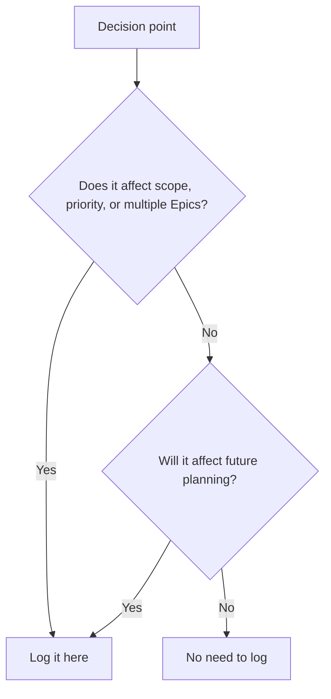

# Orchestrator Decision Log

**Project**: {PROJECT_NAME}
**Maintained by**: Orchestrator Agent

---

## Decision Entry Template

```markdown
### DEC-{NNN}: {Short Title}
- **Date**: YYYY-MM-DD
- **Context**: {What situation triggered this decision?}
- **Alternatives Considered**:
  1. {Option A} — {reason it was not chosen}
  2. {Option B} — {reason it was not chosen}
- **Decision**: {What was decided?}
- **Rationale**: {Why this option? Include constraints, principles, or data.}
- **Impact**: {Which Epics, agents, or timelines are affected?}
- **Follow-up**: {Any actions required as a result?}
- **Status**: ACTIVE | SUPERSEDED | REVERTED
```

---

## Decision Registry

### DEC-001: Raise Epic Priority Mid-Sprint
- **Date**: 2026-01-15
- **Context**: A critical bug was discovered in production affecting the core workflow.
- **Alternatives Considered**:
  1. Continue current Epic — risk of shipping broken behaviour
  2. Raise bug fix Epic to P1 — delays current Epic by ~3 days
- **Decision**: Raised bug fix Epic to P1.
- **Rationale**: The bug blocked all other work. Delaying it was more costly than the 3-day pause.
- **Impact**: EPIC-004 delayed by 3 days.
- **Follow-up**: Reassess EPIC-004 timeline after fix.
- **Status**: ACTIVE

---

### DEC-002: Parallelize Independent Tasks
- **Date**: 2026-01-22
- **Context**: EPIC-004 is independent of EPIC-003; both have separate teams.
- **Alternatives Considered**:
  1. Sequential execution — safe but slower
  2. Parallel execution — faster but requires clear boundary definition
- **Decision**: Run EPIC-003 and EPIC-004 in parallel.
- **Rationale**: Dependency analysis confirmed no shared state. Parallelization saves ~1 week.
- **Impact**: Both Epics progress simultaneously.
- **Follow-up**: Monitor for integration conflicts at merge point.
- **Status**: ACTIVE

---

### DEC-003: Pivot on Blocker
- **Date**: 2026-02-01
- **Context**: External API dependency was unavailable for EPIC-005.
- **Decision**: Start EPIC-006 while waiting for API access.
- **Rationale**: EPIC-006 has no external dependencies.
- **Impact**: EPIC-005 paused; EPIC-006 pulled forward.
- **Status**: ACTIVE

---

### DEC-004: Reverted Decision Example
- **Date**: 2026-02-10
- **Context**: Decided to use X library, but it caused conflicts.
- **Decision**: Reverted to previous approach.
- **Status**: REVERTED
- **Lessons Learned**: Always validate library compatibility before committing to it.

---

## Statistics

| Total Decisions | Active | Superseded | Reverted |
|:----------------|:-------|:-----------|:---------|
| {N} | {N} | {N} | {N} |

---

## Reverted Decisions

| ID | Title | Reverted Date | Reason |
|:---|:------|:-------------|:-------|
| DEC-004 | {Title} | {Date} | {Reason} |

---

## Usage Guide

### When to log a decision?

**MUST DOCUMENT:**
- Epic priority changes
- Scope additions or removals
- Agent role assignments
- Architectural pivots
- Decisions that affect more than one Epic or team

**NO NEED TO DOCUMENT:**
- Minor task sequencing within a single Epic
- Routine status updates
- Decisions already captured in an ADR

### Decision Tree (when uncertain)



### Using the Decision Template

1. Copy the entry template above.
2. Assign the next sequential ID (`DEC-{NNN}`).
3. Fill all fields — leave none blank; write "N/A" if not applicable.
4. Add to the Decision Registry section (chronological order).
5. Update the Statistics table.

### Integration with Other Documents

- **state.md**: Reference decision IDs in the "Last Decision" field.
- **epic_dependency_map.md**: Note when a decision changes dependency status.
- **Architect ADRs**: If the decision has architectural implications, also create an ADR.

### Decision Review Process

**Weekly Review** (Orchestrator responsibility):
1. Review all ACTIVE decisions — are they still valid?
2. Mark superseded or reverted decisions accordingly.
3. Update follow-up actions.

---

## Best Practices

**Good example:**
> "Raised EPIC-007 to P1 because the production incident blocked all other Epics. Evidence: incident report, stakeholder approval."

**Bad example:**
> "Changed priority."

The decision log is a historical record — future agents (and humans) must be able to understand *why* a decision was made without the original context.
