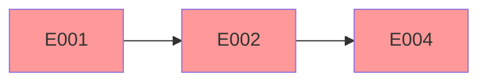
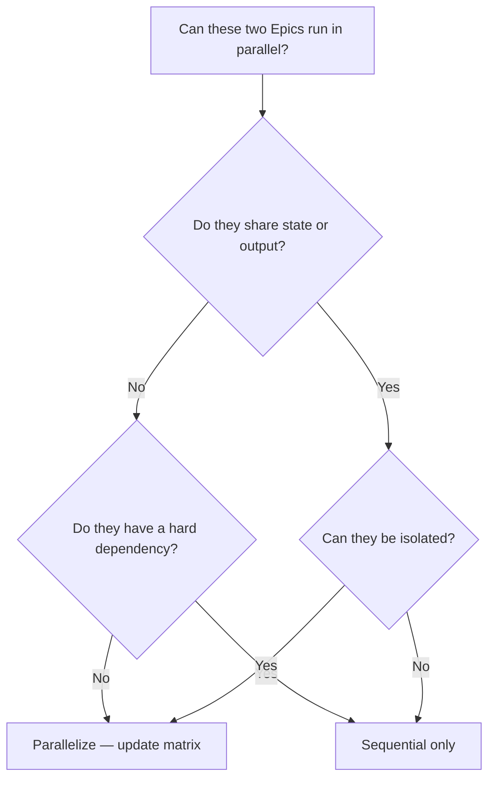

# Epic Dependency Map: {PROJECT_NAME}

**Maintained by**: Orchestrator Agent
**Last Updated**: {DATE}

---

## Dependency Matrix

| Epic | Title | Depends On | Blocks | Can Run in Parallel With |
|:-----|:------|:-----------|:-------|:------------------------|
| EPIC-001 | {Title} | — | EPIC-002, EPIC-003 | — |
| EPIC-002 | {Title} | EPIC-001 | EPIC-004 | EPIC-003 |
| EPIC-003 | {Title} | EPIC-001 | EPIC-005 | EPIC-002 |
| EPIC-004 | {Title} | EPIC-002 | — | EPIC-005 |
| EPIC-005 | {Title} | EPIC-003 | — | EPIC-004 |

---

## Dependency Graph

```mermaid
graph LR
    E001[EPIC-001: {Title}] --> E002[EPIC-002: {Title}]
    E001 --> E003[EPIC-003: {Title}]
    E002 --> E004[EPIC-004: {Title}]
    E003 --> E005[EPIC-005: {Title}]
```

**Legend**:
- `-->` Hard dependency (must complete first)
- `-.->` Soft dependency (preferable, not blocking)
- Gray: Planned | Blue: In Progress | Green: Done | Red: Blocked

---

## Task-Level Dependencies

### EPIC-002: {Title}

| Task | Depends On | Blocks |
|:-----|:-----------|:-------|
| TASK-01 | — | TASK-02 |
| TASK-02 | TASK-01 | TASK-03 |

### EPIC-003: {Title}

| Task | Depends On | Blocks |
|:-----|:-----------|:-------|
| TASK-01 | — | TASK-02 |

---

## Critical Path Analysis

The critical path is the longest sequence of dependent tasks. Delays here delay the whole project.

| Step | Epic / Task | Duration (est.) | Notes |
|:-----|:-----------|:----------------|:------|
| 1 | EPIC-001 | {X days} | Foundation — blocks everything |
| 2 | EPIC-002 | {X days} | Core feature |
| 3 | EPIC-004 | {X days} | Final integration |



---

## Circular Dependency Check

> A circular dependency means two or more Epics depend on each other — this is always a design error.

- [ ] No circular dependencies detected.
- If a cycle is detected: {Resolution plan}

---

## Dependency Change Log

| Date | Change | Reason | Approved By |
|:-----|:-------|:-------|:-----------|
| {DATE} | {e.g., Added soft dependency EPIC-003 → EPIC-007} | {Reason} | Orchestrator |

---

## Usage Guide

### When to update
- When a new Epic is added to the backlog
- When an Epic is completed or blocked
- When the critical path changes

### Parallelization Decision Tree



### Critical Path Optimization Strategy

1. Identify which Epic on the critical path has the highest estimated duration.
2. Check if any of its tasks can be parallelized internally.
3. Explore whether any dependency can be relaxed to a soft dependency.
4. Document any optimization decision in the dependency change log.

### Integration with Other Documents

- **state.md**: The Epic State Map must reflect the same status as this map.
- **decision_log.md**: Log any major dependency changes as Orchestrator decisions.
- **epic_review.md**: After each Epic closes, update this map to reflect the new state.
