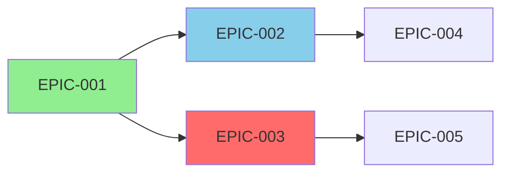

# Project State: {PROJECT_NAME}

**Last updated**: {YYYY-MM-DD HH:MM}
**Maintained by**: Orchestrator Agent

---

## Project Overview

| Metric | Value | Status |
|:-------|:------|:-------|
| Total Epics | {N} | — |
| Total Tasks | {N} | — |
| Completed Epics | {N} | ✅ |
| In Progress | {N} | 🔵 |
| Blocked | {N} | 🔴 |
| Planned | {N} | ⚪ |
| Overall Progress | {XX}% | — |

---

## Epic State Map

| Epic ID | Title | Status | Owner | Priority | Notes |
|:--------|:------|:-------|:------|:---------|:------|
| EPIC-001 | {Title} | Done | {Agent} | P1 | — |
| EPIC-002 | {Title} | In Progress | {Agent} | P1 | — |
| EPIC-003 | {Title} | Blocked | {Agent} | P2 | Waiting for EPIC-002 |
| EPIC-004 | {Title} | Planned | — | P2 | — |

**States Legend**:
- **Planned**: Epic created, not yet started
- **In Progress**: Active development under way
- **Blocked**: Cannot proceed — waiting for dependency, decision, or external input
- **In Review**: Implementation done, awaiting sign-offs
- **Done**: All sign-offs received and Epic formally closed

---

## Task State Map

| Task ID | Epic | Title | Status | Assigned To | Notes |
|:--------|:-----|:------|:-------|:-----------|:------|
| TASK-01 | EPIC-002 | {Title} | In Progress | {Developer} | — |
| TASK-02 | EPIC-002 | {Title} | Blocked | {Developer} | Waiting for TASK-01 |

---

## Blocker Register

| ID | Description | Severity | Blocking | Since | Resolution |
|:---|:-----------|:---------|:---------|:------|:-----------|
| BLK-001 | {Description} | Critical (blocks everything) | EPIC-003 | {Date} | {Plan or "pending"} |
| BLK-002 | {Description} | Medium | TASK-05 | {Date} | {Plan} |

---

## Next Steps (Action Queue)

| Priority | Action | Owner | Deadline |
|:---------|:-------|:------|:---------|
| P1 | {Action 1 — e.g., "Start EPIC-005 planning"} | Orchestrator | {Date} |
| P2 | {Action 2} | {Agent} | {Date} |

---

## Dependency Graph

---

## Project Timeline

| Phase | Epic IDs | Start | End (est.) | Status |
|:------|:---------|:------|:----------|:-------|
| Foundation | EPIC-001–002 | {Date} | {Date} | Done |
| Core Features | EPIC-003–005 | {Date} | {Date} | In Progress |
| Hardening | EPIC-006–007 | {Date} | {Date} | Planned |

---

## Notes & Context

**Last Decision**: {Decision ID and summary — e.g., "DEC-003: Pivoted to EPIC-006 while EPIC-005 is blocked"} → see `decision_log.md`

**Active Constraints**: {Any important project-level constraints or agreements to keep in mind}

---

## Usage Guide

### When to update
- After every Epic status change
- After every Orchestrator decision
- After unblocking or adding a blocker
- At the start of each planning session

### Update Checklist

- [ ] Epic State Map reflects current status
- [ ] Task State Map reflects current assignments
- [ ] Blocker Register is up to date
- [ ] Action Queue has the next 2–3 priority items
- [ ] Dependency Graph matches `epic_dependency_map.md`
- [ ] Last Decision field updated

### Integration with Other Documents

- **decision_log.md**: Reference decision IDs in "Last Decision" field
- **epic_dependency_map.md**: Keep both documents in sync after any Epic status change
- **health_report.md**: Product Owner uses this document as input for health reporting
- **program-state.md**: High-level program view references this document for active project status

---

*This document is the Orchestrator's single source of truth for project execution state. It must be kept current at all times.*
