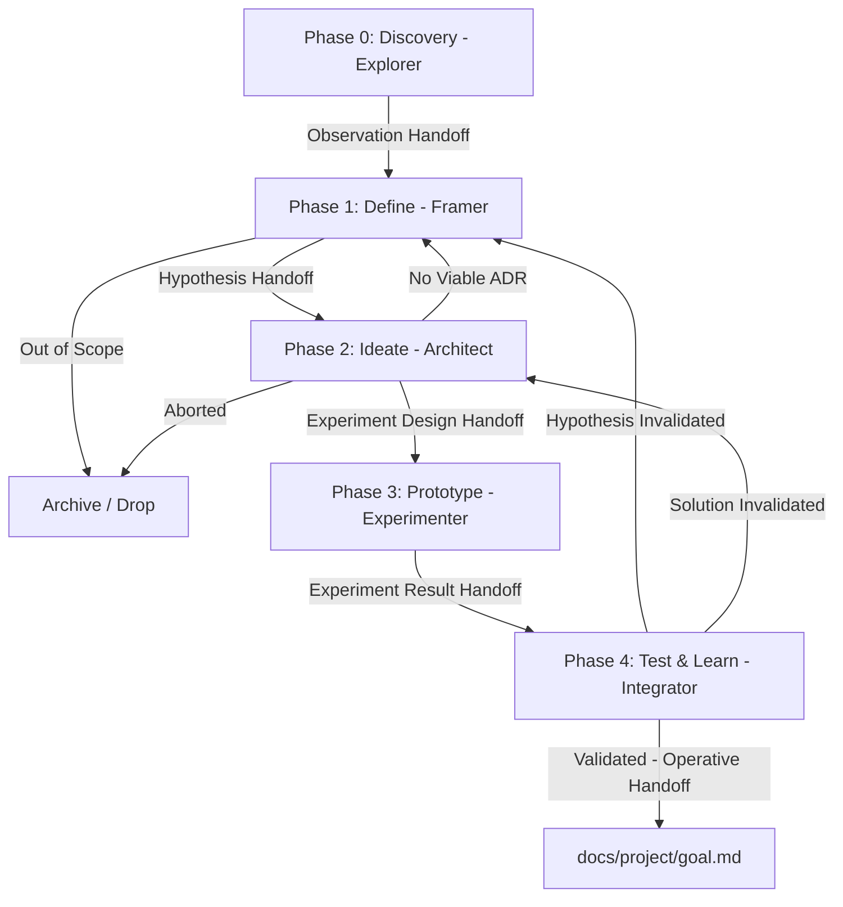

# Discovery Process Standard

This guide defines the operational mechanics of the Discovery process — phase transitions, role communication protocols, and handoff patterns. Its purpose is to ensure that work under `docs/joinerytech-flow/discovery/` is structured, measurable, and aligned with Double Diamond principles.

---

## Discovery Roles (The "Four Hats")

During Discovery, agents operate in four clearly separated focus modes (roles). Strict separation of concerns is essential to avoid cognitive bias.

1. **The Explorer**: Fact-collection mode. Records observations, conducts research — proposes no solutions.
2. **The Framer**: Structuring mode. Forms hypotheses, defines scope boundaries, and ruthlessly guards the boundary conditions. **FORBIDDEN to propose solutions (ADR).**
3. **The Architect / Designer**: Solution-design mode (Ideate phase). Develops technical alternatives within the boundaries defined by the Framer.
4. **The Experimenter**: Build mode. Executes PoCs and experiments in an isolated environment to validate the designed solution.
5. **The Integrator**: Evaluation mode. Consolidates results, validates the hypothesis, and initiates the operative handoff.

---

## Process and Communication (Handoffs)

The Discovery process follows a strict sequence where every phase closure is accompanied by a "Handoff" message to the next role, with explicit exit (Fail Fast) points.

### Phases and Transitions

### Phase 0: Discovery (Explorer)

- **Focus:** What is happening now? What pain points are observed?
- **Handoff:** Log `obs-*.md` files and notify the Framer.

### Phase 1: Define (Framer)

- **Focus:** What is the precise hypothesis? What is Out of Scope?
- **Exit:** If the problem is irrelevant or Out of Scope → **Archive**.
- **Handoff:** `hyp-*.md` and `scope.md`.

### Phase 2: Ideate (Architect / Designer)

- **Focus:** What technical solutions are possible within the boundaries defined by the Framer?
- **Exit:** If no feasible technical alternative exists → **Return to Framer** (Scope/Hypothesis revision) or **Archive**.
- **Handoff:** `ADR-*.md` (draft) and proposed experiment design.

### Phase 3: Prototype (Experimenter)

- **Focus:** The fastest and cheapest path to validation. Strictly within `scope.md` boundaries.
- **Reversibility Rule:** All prototype code must be built **in isolation and fully reversible**. The experiment MUST NOT permanently modify existing Core/Domain entities, database schema, or production code. At the end of the experiment, the prototype code must be removable via a single `git revert` or file deletion — without a trace. If this is not achievable → escalate to an operative project.
- **Handoff:** MVE (Minimum Viable Experiment) code, data, and execution logs.

### Phase 4: Test & Learn (Integrator)

- **Focus:** Were the success criteria met? What failed — the hypothesis or only the solution?
- **Conclusions:**
  - **Validated:** Project can start under `docs/`.
  - **Solution Invalidated:** The experiment/ADR failed, but the problem is real → **Back to Ideate** (new ADR).
  - **Hypothesis Invalidated:** The inference drawn from the observation was flawed → **Back to Define**.

---

## Communication Standards (Handoff Protocol)

At every role transition, the message must contain the following 5 elements:

1. **Source ID** (e.g. `obs-001` or `hyp-002`)
2. **Work location** (path to the affected discovery folder)
3. **Main conclusion:** Brief 1-2 sentence summary of the work completed
4. **Constraints/Scope (Link):** **Mandatory** reference to `scope.md` and relevant `ADR-*.md` files that the next phase must respect
5. **Requested action:** Which role is expected to do what in the next step

---

## Strict Prohibitions (Anti-patterns)

- **Explorer** must not draw conclusions.
- **Framer** must not propose solutions (ADR) — this distorts problem definition.
- **Architect** must not exceed the `scope.md` boundaries set by the Framer.
- **Experimenter** must not make final production architecture decisions and must not disregard boundary conditions.
- **Integrator** must not propose new experiments during evaluation — must remain an impartial judge.
