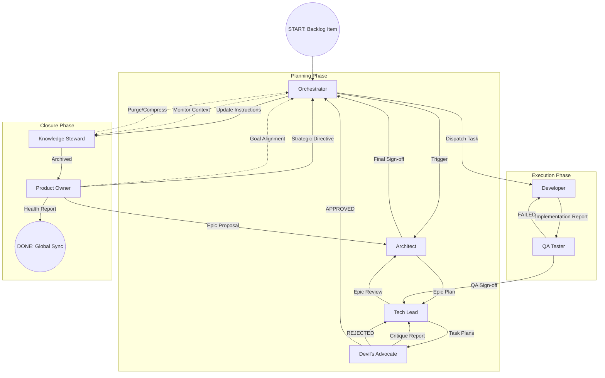
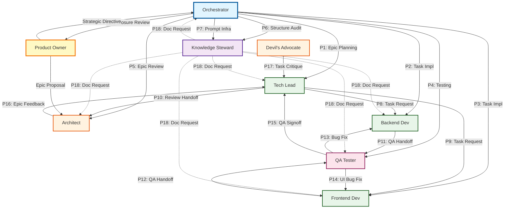

> ⚠️ **Partial deprecation:** The P1–P18 prompt template sections in this document are superseded by `docs/standards/03-agent-system/agent.messaging.protocol.md`. The workflow diagrams (Sections 1–4) remain the canonical visual reference.

# Complete Agent Workflow and Communication Playbook

This document depicts the full project lifecycle from initial request to global knowledge base sync. The diagram uses Mermaid syntax, which agents can natively interpret during their decision-making process.

## Prompt-Based Communication Playbook

As of the 2026-02-15 update, the project has **18 prompt templates** that form a complete "communication playbook". Like pre-planned plays in American football, agents now follow **standardized communication patterns**.

**What the Playbook means:**

- ✅ **Repeatable communication**: No need to write a new prompt each time
- ✅ **Consistency**: Same prompt → Same quality
- ✅ **Speed**: Copy-paste + parameterization (`{EPIC_ID}`, `{TASK_ID}`)
- ✅ **Documentation**: Clear record of who asks what from whom and how

**Playbook Location**: `src/agent-system/database/roles/{role}/messages/*.md` (18 prompts, 8 agents)

## 1. Main Process (High-Level State Machine)

## 2. State Descriptions and Agent Responsibilities

| State | Active Agent | Input | Output | Quality Gate |
| :---- | :---- | :---- | :---- | :---- |
| **Epic Planning** | Architect | Backlog / Goal | epic_plan.md, ADR | Architect Gate |
| **Task Planning** | Tech Lead | epic_plan.md | TASK-XX.md (Plans) | Tech Lead Gate |
| **Design Critique** | Devil's Advocate | TASK-XX.md | critique_report.md | **Devil's Advocate Gate** |
| **Implementation** | Developer | TASK-XX.md + Skills | Code + impl_report.md | DoD Check |
| **Verification** | QA Tester | Code + Plan | qa_signoff.md | **QA Gate** |
| **Epic Closure** | Tech Lead | Task Reports | epic_review.md | Lessons Learned |
| **Final Sign-off** | Architect | epic_review.md | architect_signoff.md | **Sign-off Gate** |
| **Calibration** | Steward | Sign-off Instructions | Global Skill Update | Knowledge Sync |
| **PO Review** | Product Owner | Epic Review + QA Reports | Product Backlog, Strategic Directive, Epic Proposal | Goal Alignment Check |

## 3. Orchestrator and Steward "Noise Reduction" Loop

Agents must follow this rule when interpreting the diagram:

1. **Context Check**: Before every state transition the Orchestrator checks token usage.
2. **Steward Trigger**: If token usage > 50%, the Knowledge Steward intervenes and compresses previous state data (e.g. replaces closed Task plans with summaries).
3. **Dependency Lock**: For parallel threads, the Orchestrator locks the affected files until state moves to VERIFICATION.

## 4. Error Paths

- **Design Reject**: If the Devil's Advocate blocks (P17), the process jumps back to Task Planning.
- **QA Fail**: If a test fails (P13, P14), the process jumps back to Implementation (Bug Fix Loop).
- **Architect Veto**: If a strategic error is found during Epic Review (P16 → Rejected), the process may jump all the way back to Epic Planning.

**Prompt-based Error Recovery:**

- For every failure, the relevant agent requests a fix or redesign according to **prompt rules**
- Prompts contain explicit **Recovery Flow** descriptions (e.g. P13/P14 bug fix → re-QA handoff)

## 5. Prompt-Based Communication Flow (Playbook Diagram)

This diagram shows the **concrete prompt-based communication** between agents. Each arrow represents a prompt template.

**Legend:**

- **Solid arrow (→)**: Direct communication prompt
- **Dashed arrow (-.->)**: Universal documentation prompt (P18)
- **PX numbering**: Prompt identifier (see "Playbook Reference" section)

## 6. Playbook Reference (Prompt Catalog)

All prompts catalogued — "who asks what from whom and how".

### Orchestrator Playbook (7 prompts)

| ID | Target Agent | Prompt Name | When to Use | File |
|:--:|:----------|:------------|:---------------|:-----|
| **P1** | Tech Lead | Epic Planning | Epic plan complete, needs Task breakdown | [tech_lead_epic_planning.message.md](../orchestrator/messages/tech_lead_epic_planning.message.md) |
| **P2** | Backend Dev | Task Implementation | Backend Task assignment | [backend_developer_task_implementation.message.md](../orchestrator/messages/backend_developer_task_implementation.message.md) |
| **P3** | Frontend Dev | Task Implementation | Frontend Task assignment | [frontend_developer_task_implementation.message.md](../orchestrator/messages/frontend_developer_task_implementation.message.md) |
| **P4** | QA Tester | Testing | Task implemented, testing needed | [qa_tester_testing.message.md](../orchestrator/messages/qa_tester_testing.message.md) |
| **P5** | Architect | Epic Review | Tasks planned, architect validation needed | [architect_epic_review.message.md](../orchestrator/messages/architect_epic_review.message.md) |
| **P6** | Knowledge Steward | Structure Audit | Documentation integrity check | [knowledge_steward_structure_audit.message.md](../orchestrator/messages/knowledge_steward_structure_audit.message.md) |
| **P7** | Knowledge Steward | Prompt Infrastructure | Introducing new prompt infrastructure | [knowledge_steward_prompt_infrastructure_integration.message.md](../orchestrator/messages/knowledge_steward_prompt_infrastructure_integration.message.md) |

### Tech Lead Playbook (3 prompts)

| ID | Target Agent | Prompt Name | When to Use | File |
|:--:|:----------|:------------|:---------------|:-----|
| **P8** | Backend Dev | Task Request | Task plan ready, request backend implementation | [backend_developer_task_request.message.md](../tech_lead/messages/backend_developer_task_request.message.md) |
| **P9** | Frontend Dev | Task Request | Task plan ready, request frontend implementation | [frontend_developer_task_request.message.md](../tech_lead/messages/frontend_developer_task_request.message.md) |
| **P10** | Architect | Review Handoff | Tasks complete, request architect review | [architect_epic_review_handoff.message.md](../tech_lead/messages/architect_epic_review_handoff.message.md) |

### Developer Playbook (2 prompts)

| ID | Initiator | Target Agent | Prompt Name | When to Use | File |
|:--:|:------------|:----------|:------------|:---------------|:-----|
| **P11** | Backend Dev | QA Tester | QA Handoff | Backend implementation done, QA testing | [qa_tester_qa_handoff.message.md](../backend_developer/messages/qa_tester_qa_handoff.message.md) |
| **P12** | Frontend Dev | QA Tester | QA Handoff | Frontend implementation done, UI/UX testing | [qa_tester_qa_handoff.message.md](../frontend_developer/messages/qa_tester_qa_handoff.message.md) |

### QA Tester Playbook (3 prompts)

| ID | Target Agent | Prompt Name | When to Use | File |
|:--:|:----------|:------------|:---------------|:-----|
| **P13** | Backend Dev | Bug Fix Request | Backend bugs found, request fix | [backend_developer_bug_fix.message.md](../qa_tester/messages/backend_developer_bug_fix.message.md) |
| **P14** | Frontend Dev | UI/UX Bug Fix | UI/UX bugs found, request fix | [frontend_developer_bug_fix.message.md](../qa_tester/messages/frontend_developer_bug_fix.message.md) |
| **P15** | Tech Lead | QA Signoff Handoff | Testing complete, hand off QA signoff | [tech_lead_qa_signoff_handoff.message.md](../qa_tester/messages/tech_lead_qa_signoff_handoff.message.md) |

### Review Agents Playbook (2 prompts)

| ID | Initiator | Target Agent | Prompt Name | When to Use | File |
|:--:|:------------|:----------|:------------|:---------------|:-----|
| **P16** | Architect | Tech Lead | Epic Feedback | Epic review done, deliver feedback to Tech Lead | [tech_lead_epic_feedback.message.md](../architect/messages/tech_lead_epic_feedback.message.md) |
| **P17** | Devil's Advocate | Tech Lead | Task Critique | Critical review of Task plans | [tech_lead_task_critique.message.md](../devils_advocate/messages/tech_lead_task_critique.message.md) |

### Knowledge Steward Playbook (1 universal prompt)

| ID | Target Agent | Prompt Name | When to Use | File |
|:--:|:----------|:------------|:---------------|:-----|
| **P18** | **Any Agent** | Documentation Request | Request documentation / archiving (parameterizable: Epic archiving, Task doc, Context cleanup, Skill calibration) | [documentation_request.message.md](../knowledge_steward/messages/documentation_request.message.md) |

**Total: 18 prompt templates**

---

*This diagram is the agent's default navigation map. The **Prompt Playbook** (P1–P18) defines the concrete communication templates. In case of ambiguity, the Orchestrator's decision is authoritative.*

**Playbook Usage:**

1. Select the appropriate prompt (P1–P18)
2. Parameterize (`{EPIC_ID}`, `{TASK_ID}`, `{project}`)
3. Send to the target agent
4. The prompt includes **Cognitive Setup**, **DoD**, and **Output Format** requirements

**Full Prompt Catalog**: [knowledge_map.md](knowledge_map.md) → "6. Prompt Templates"
