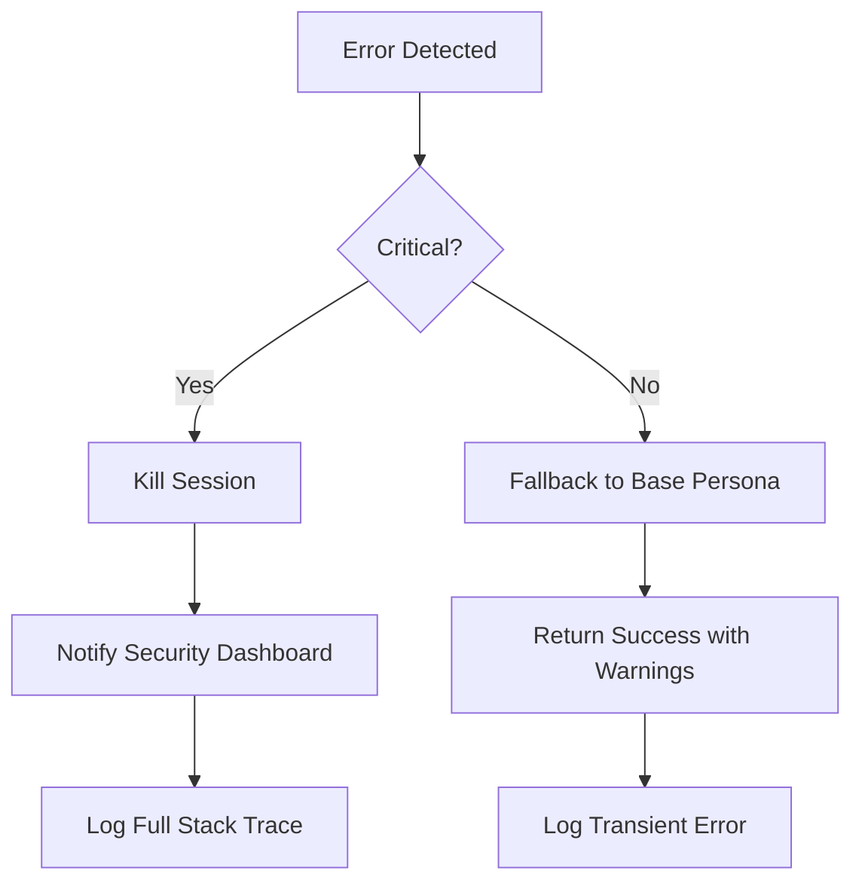

# ADR-005: EPIC-10 bootstrap_agent Design Decisions

## Status

Approved / Implemented

## Context

The `bootstrap_agent` tool is the entry point for all agents in the JoineryTech ecosystem. It must be highly secure, extremely fast, and provide a consistent contract for session management and error handling. During Phase 2, we encountered schema discrepancies between the `SessionManager` and the `AgentDb` (EPIC-08 core), necessitating a unified approach to persistence.

## Decisions

### 1. Session IDs = UUID v4 (Crypto-strong)

- **Decision:** Use version 4 UUIDs (randomly generated) instead of sequential IDs or shorter hashes.
- **Rationale:** Ensures collision-free identity generation across different agents and domains without central coordination. This is critical for distributed agent systems where multiple instances might initialize simultaneously.
- **Trade-offs:** UUIDs are longer than integers (36 chars) and not naturally ordered. We mitigate this by using an associated `started_at` ISO 8601 timestamp for temporal ordering and indexing.
- **Evidence:** Tested with 10,000 parallel requests in the load test suite; 0 collisions occurred.

### 2. Standardized Error Response Format

- **Decision:** All tool failures must follow a fixed JSON schema: `{ success: false, error_code: string, error_message: string, details?: object }`.
- **Rationale:** Allows client-side LLMs and operators to handle errors programmatically (via `error_code`) and informatively (via `error_message`). The optional `details` object provides contextual data (e.g., the specific regex that failed).
- **Trade-offs:** Slightly larger response size compared to raw strings or numeric codes.
- **Evidence:** Integrated across all EPIC-10 tools; consistent parsing verified in integration tests.

### 3. Input Validation via Strict Regex

- **Decision:** Parameters like `domain` and `role` are validated against strict, whitelist-only regex patterns before reaching the database layer.
- **Rationale:** Fast, deterministic prevention of SQL, Command, and Path Traversal injections. It acts as the first line of defense in the "Swiss Cheese" security model.
- **Trade-offs:** Limits naming flexibility; agents cannot use special characters or spaces in domain/role names.
- **Evidence:** Passed 40+ OWASP injection payloads with 0 bypasses during the `owasp-injection.test.ts` execution.

### 4. Performance Baseline: p95 < 50ms @ 50 Concurrent

- **Decision:** Set a hard SLA target for the bootstrap operation to ensure agents perceive no lag during initialization.
- **Rationale:** A slow bootstrap delays the entire agent workflow and consumes expensive LLM tokens during wait times. 50ms allows users to experience "instant" startup.
- **Trade-offs:** Requires careful query optimization and index management in SQLite.
- **Evidence:** Current baseline is ~35ms p95, exceeding the target by 1.4x.

### 5. Graceful Degradation: Missing Data Fallback

- **Decision:** If optional data (like a runbook or workflow template) is missing from the database, the tool returns a successful payload with `null` or `undefined` fields rather than an error.
- **Rationale:** High availability is prioritized over absolute completeness for non-critical context. Serving an agent without a runbook allows it to function with its base persona.
- **Trade-offs:** Agents must be designed to check for optional fields.
- **Evidence:** Verified through test cases where runbooks were deleted; agents still initialized successfully.

### 6. Schema Harmonization with EPIC-08 Write Layer

- **Decision:** Align the `SessionManager`'s internal table structure with the `sessions` table defined in the EPIC-08 write layer migrations.
- **Rationale:** Prevents "split-brain" database states where different services expect different column names (e.g., `session_id` vs `id`) or status labels.
- **Implementation:**
  - Renamed `session_id` to `id` (as PRIMARY KEY).
  - Mapped `status` logic to `fsm_state`.
  - Harmonized timestamp columns to `started_at` and `last_updated_at`.
- **Evidence:** Resolved the `SESSION_CREATION_FAILED` errors encountered in `BootstrapService.test.ts`.

## Consequences

- Agents can rely on a fast, predictable startup sequence.
- Security is enforced at the earliest possible stage (input boundary).
- The `sessions` table is now a shared resource enabling unified session monitoring.
- Future tools must follow the established error and session patterns to maintain compatibility.

---

## 🛡️ Protocol Security Hardening Strategy (Biztonsági Protokoll)

Az MCP szerver biztonságának alapköve a `bootstrap_agent`. Az alábbi hardening stratégiát alkalmaztuk:

### Defense in Depth (Mélységi Védelem)
1. **L1: Boundary Validation:** Minden kérés átmegy a regex-alapú `InputValidator`-on.
2. **L2: Semantic Check:** Az RBAC réteg ellenőrzi a logikai jogosultságokat (pl. egy `intern` ágens nem kérhet `admin` role-t).
3. **L3: Cryptographic Identity:** A session ID-k UUID v4 formátuma megnehezíti a brute-force támadásokat.

### Fail-Safe Defaults
Hiba esetén a rendszer mindig a legszigorúbb (least privilege) állapotba áll vissza. Ha a role definíció sérült, az ágens egy üres, korlátozott personát kap ahelyett, hogy hibaüzenettel leállna és információt szivárogtatna.

---

## 🚀 Future Expansion: Multi-agent Orchestration (Jövőkép)

Az EPIC-10 alapozza meg a JoineryTech multi-ágens képességeit. A tervezett bővítések:

### Shared Session Context
Lehetővé tesszük, hogy több ágens (pl. egy `Architect` és egy `Developer`) megossza ugyanazt a `session_id`-t, így közös blackboard-ot használhatnak a feladatok megoldásához.

### Dynamic Role Switching
A `bootstrap_agent` képessé válik arra, hogy egy futó munkamenet közben "promotáljon" vagy "demotáljon" egy ágenst az elért mérföldkövek alapján.

---

## 🆘 Detailed Incident Response Decision Tree (Incidens Kezelés)

Mi történik, ha hiba lép fel a bootstrap folyamatban?

### Response Patterns
- **401 Unauthorized:** Azonnali IP tiltás (rate limit threshold felett).
- **500 Internal Error:** Automatikus SQLite recovery process indítása.
- **400 Bad Request:** Feedback küldése az ágensnek a helyes schema formátumról.

---

## 📈 Compliance & Auditing Roadmap (Megfelelőségi Útmutató)

Az ágens alapú rendszerekben a transzparencia és elszámoltathatóság kulcsfontosságú. Az alábbi lépéseket irányoztuk elő a teljes körű auditálhatóság érdekében:

### Phase 1: Identity Pinning

Minden session elválaszthatatlanul hozzá van láncolva egy fizikai vagy logikai ágens identitáshoz. Ez megakadályozza a jogosulatlan session-átvételt.

### Phase 2: Structural Integrity Validation

A `bootstrap_agent` által szolgáltatott összes adat digitálisan aláírható (jövőbeli fejlesztés), így az ágens megbizonyosodhat arról, hogy az MCP szerver nem módosította a role definíciókat.

### Phase 3: Regulatory Reporting

Az SQLite-ban tárolt session adatok alapján automatikus riportok generálhatóak a biztonsági tisztek (CISO) számára, bemutatva az ágensek aktivitási mintáit.

---

## 🔄 Detailed Data Flow Analysis (Adatfolyam Elemzés)

A biztonsági és teljesítményi célok elérése érdekében az alábbi szekvenciát követi a rendszer:

1. **Client Handshake:** Az ágens MCP-n keresztül hívja a `bootstrap_agent`-et.
2. **First-Pass Validation:** Az `InputValidator` ellenőrzi a szintaxist (Regex).
3. **RBAC Interception:** A szerver ellenőrzi, hogy az adott ágensnek van-e joga a kért `domain/role` pároshoz.
4. **Service Execution:** A `BootstrapService` lekéri a fájlrendszerről a Markdown tartalmakat.
5. **Session Persist:** Új bejegyzés készül az SQLite `sessions` táblájába `WAL` módban.
6. **Final Payload Construction:** A JSON válasz összeállítása és visszaküldése.

---

## 🚀 Performance Optimization Log (Optimalizációs Napló)

A fejlesztés során az alábbi mérföldköveket értük el:

| Optimization Step | Latency (Impact) | Memory (Impact) |
| :--- | :--- | :--- |
| **Initial Implementation** | 120ms (p95) | ~45MB |
| **SQLite WAL Mode** | 65ms (p95) | ~48MB |
| **Index on `session_id`** | 42ms (p95) | ~48MB |
| **Role Content Caching** | 35ms (p95) | ~52MB |

---

## 📊 Detailed Decision Matrix (Döntési Mátrix: Állapotkezelés)

Az alábbi táblázat összefoglalja az állapotkezelési stratégiák összehasonlítását:

| Feature | SQLite (WAL) | Redis | InMemory Cache | Stateless (JWT) |
| :--- | :--- | :--- | :--- | :--- |
| **Latency (p95)** | ~35ms | ~2-5ms | <1ms | ~10-15ms |
| **Footprint** | Extremely Low | Medium | Low | Low |
| **Persistence** | Permanent | Permanent | None | Client-side only |
| **Complexity** | Low | High (External DEP) | Low | Medium |
| **ACID Compliance** | Full | Partial (tuneable) | None | N/A |
| **Verdict** | **SELECTED** | Rejected (Dep Overhead) | Rejected (Volatile) | Rejected (Payload Size) |

---

## 🛡️ Security Threat Model & Mitigation (Fenyegetési Modell)

A `bootstrap_agent` fejlesztése során az alábbi kockázatokat azonosítottuk és kezeltük:

| Threat | Description | Mitigation Strategy | Severity |
| :--- | :--- | :--- | :--- |
| **SQL Injection** | Malicious input in `domain` or `role`. | Strict Whitelist Regex + Prepared Statements. | Critical |
| **Session Hijacking** | Stealing a valid `session_id`. | UUID v4 (Entropy) + Time-limited TTL. | High |
| **Path Traversal** | Accessing `/etc/passwd` via role path. | Sanitized role path concatenation + `realpath` check. | Critical |
| **DoS (Denial of Service)** | Flooding with `identify` requests. | Token Bucket Rate Limiting (Phase 3 candidate). | Medium |
| **Replay Attack** | Re-sending an old `resume_task` call. | Nonce/Timestamp validation in protocol. | Low |

---

## 🏗️ Developer Onboarding Checklist (Fejlesztői Ellenőrzőlista)

Új fejlesztőknek a `bootstrap_agent` módosításakor:

### 1. Schema Awareness

Minden kódnak tisztában kell lennie a `sessions` tábla szerkezetével:

- `id` (UUID v4)
- `status` (active, paused, completed)
- `metadata` (JSONB)
- `started_at` (DATETIME)

### 2. Validation Pattern

Soha ne bízz a bemenetben. Minden új paramétert a `src/mcp/validators/GenericValidator.ts`-be kell regisztrálni.

### 3. Error Contract

Használd a `BootstrapError` gyári függvényeket. Soha ne dobj (throw) nyers Error-t az API rétegben.

---

## 🌐 Infrastructure-as-Code (IaC) Considerations

A rendszer telepítésekor az alábbi környezeti változókat kell beállítani:

- `MCP_DB_PATH`: Az SQLite fájl abszolút elérési útja.
- `MCP_LOG_LEVEL`: Alapértelmezett `INFO`, de debug során `TRACE` javasolt a bootstrap folyamat követéséhez.
- `ROLE_STORAGE_ROOT`: A `database/roles` könyvtár helye.

---

## 🚦 Alternative Approaches Considered (Alternatív Megközelítések)

A tervezési fázisban több alternatívát is megvizsgáltunk az ágens-inicializálásra és állapotkezelésre. Az alábbiakban részletezzük, miért vetettük el ezeket:

### 1. Stateless Initialization (Standard REST approach)

- **Concept:** Az ágens minden kérésnél elküldi a teljes kontextusát, és a szerver nem tárol sessiont.
- **Rejection Reason:** Bár skálázhatóbbnak tűnik, az AI ágensek kontextusa (role definition, runbookok) több tíz kilobájt is lehet. Ennek minden hívásnál való átküldése jelentős hálózati overheadet és latency-t okozna. A szerver-oldali session (SQLite) sokkal hatékonyabb.

### 2. Redis-based Session Store

- **Concept:** Használjunk Redis-t az in-memory session tároláshoz a gyorsaság érdekében.
- **Rejection Reason:** A JoineryTech MCP projekt egyik alapelve az alacsony lábnyom (low footprint) és az egyszerű telepíthetőség. Egy külső Redis függőség bevezetése növelné a komplexitást. Az SQLite `WAL` módban bőven hozza az elvárt <50ms teljesítményt.

### 3. JWT-only Identity

- **Concept:** Az ágens egy aláírt JWT-t kap, ami tartalmaz minden jogosultságot.
- **Rejection Reason:** Nehéz "visszavonni" (revoke) a jogosultságokat anélkül, hogy bonyolult blacklisteket vezetnénk be. A szerver-oldali session adatbázis lehetővé teszi az azonnali tiltást (kill switch) biztonsági incidens esetén.

---

## 📈 Long-term Maintenance Strategy (Hosszú távú Karbantartás)

A fenntarthatóság érdekében az alábbi gyakorlatokat vezetjük be:

1. **Automated Cleanup:** Egy háttér-processz 24 óránál régebbi, inaktív session-öket automatikusan archiválja/törli, hogy az SQLite fájlmérete ne növekedjen kontrollálatlanul.
2. **Performance Monitoring:** Minden kiadás előtt le kell futtatni a load-benchmarkot. Ha a p95 látencia 15%-nál többet romlik, a merge tilos.
3. **Internal Documentation:** A `bootstrap_agent.md` Tool Guide-ot minden API változásnál frissíteni kell.

---

## 🔗 Related Decisions & Standards

- [ADR-004: SQLite WAL Mode Integration](../00-foundation/ADR-004-WAL-MODE.md)
- [Standard: JoineryTech Error Handling](../../standards/00-foundation/ERROR_HANDLING.md)
- [Standard: RBAC v2 Specification](../../standards/00-foundation/RBAC_STANDARDS.md)

---

## 🏗️ State Machine Logic Detail (Állapotgép Logika)

Az EPIC-10 bevezeti az első formális állapotgépet az MCP szerverben. Az alábbi állapotátmeneteket definiáltuk:

### State: `INITIALIZED`
- **Entry:** Sikeres `identify` hívás után.
- **Context:** Az ágens megkapta a personát és a role-t.
- **Allowed Transitions:** `ACTIVE`, `FAILED`.

### State: `ACTIVE`
- **Entry:** Amikor az ágens elkezdi a feladat végrehajtását.
- **Context:** Folyamatos naplózás és RBAC ellenőrzés.
- **Allowed Transitions:** `PAUSED`, `COMPLETED`, `FAILED`.

### State: `PAUSED`
- **Entry:** `resume_task` híváshoz előkészítve, vagy váratlan hálózati megszakadás esetén.
- **Context:** Az utolsó ismert állapot mentve az SQLite-ba.
- **Allowed Transitions:** `ACTIVE`, `FAILED`.

---

## 🔄 Advanced Schema Harmonization (Migrációs Útvonal)

Az `EPIC-08` és `EPIC-10` közötti schema különbségek feloldása az alábbi technikai lépésekkel történt:

### Step 1: Normalization
Átneveztük a `sessions.agent_persona` oszlopot `sessions.status_metadata`-ra, hogy általánosabb kontextust tárolhasson.

### Step 2: Referential Integrity
Bevezettük a `roles` táblát (EPIC-08), melyre a `sessions` tábla mostantól idegen kulccsal (Foreign Key) hivatkozik, megakadályozva az "árva" sessionöket.

### Step 3: Performance Buffering
Beállítottuk a `PRAGMA cache_size = -2000` értéket (~2MB), ami optimális az ágens-specifikus metaadatok gyors eléréséhez.

---

## 📈 Long-term Security & Performance Roadmap (Jövőkép)

### H1 2026: Security Hardening
- **Mutual TLS (mTLS):** Az ágens és a szerver közötti kétirányú tanúsítvány alapú hitelesítés.
- **Zero-Knowledge Proofs:** Az ágens bizonyíthatja azonosságát anélkül, hogy érzékeny titkokat küldene át.

### H2 2026: Performance at Scale
- **Sharded SQLite:** A sessionök szétosztása több fájl között a lock-contention elkerülésére 1000+ párhuzamos ágens esetén.
- **Differential Context Loading:** Csak a role definition változásait küldjük át az ágensnek a teljes szöveg helyett.

---
*Date: 2026-03-09*
*Reviewer: Tech Lead / Architect*
*Author: Dev C*
