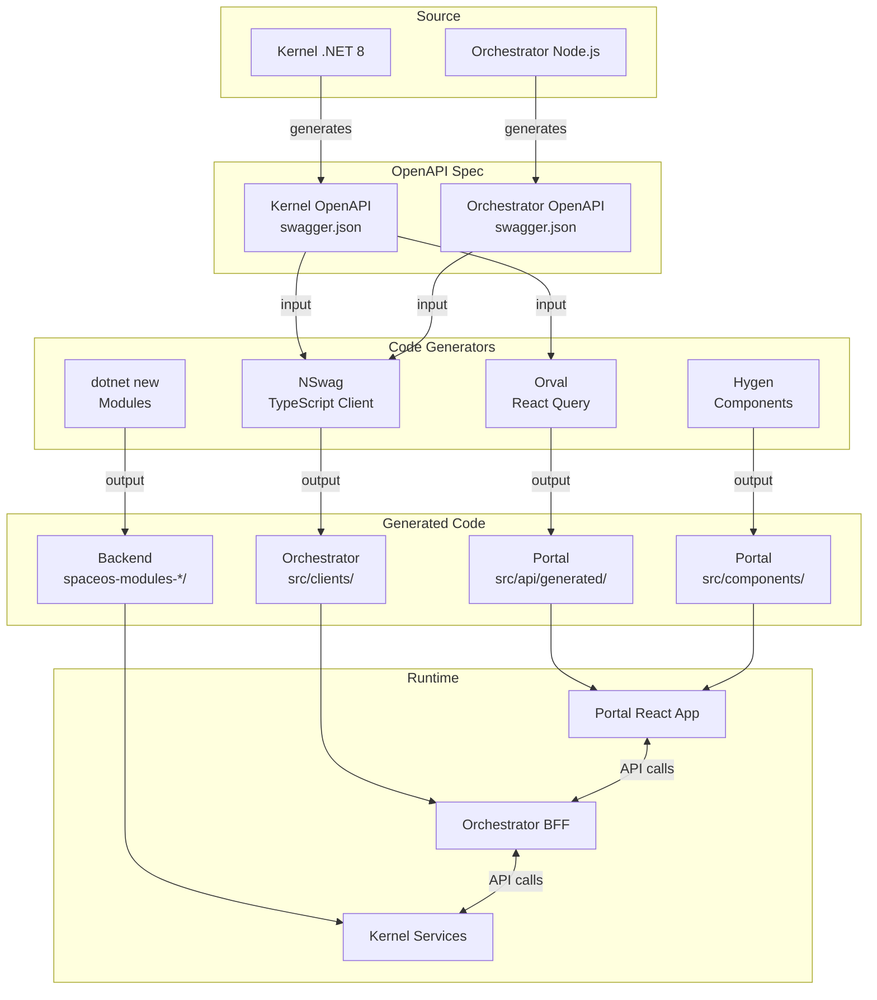
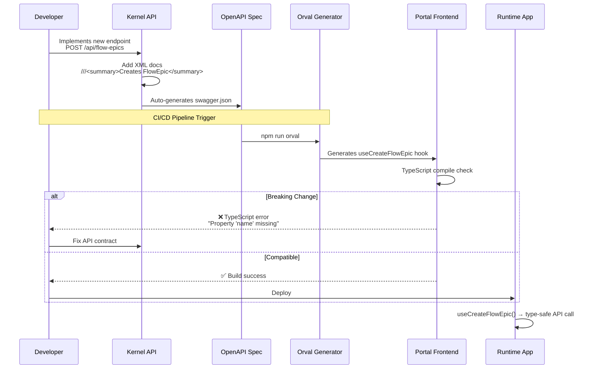
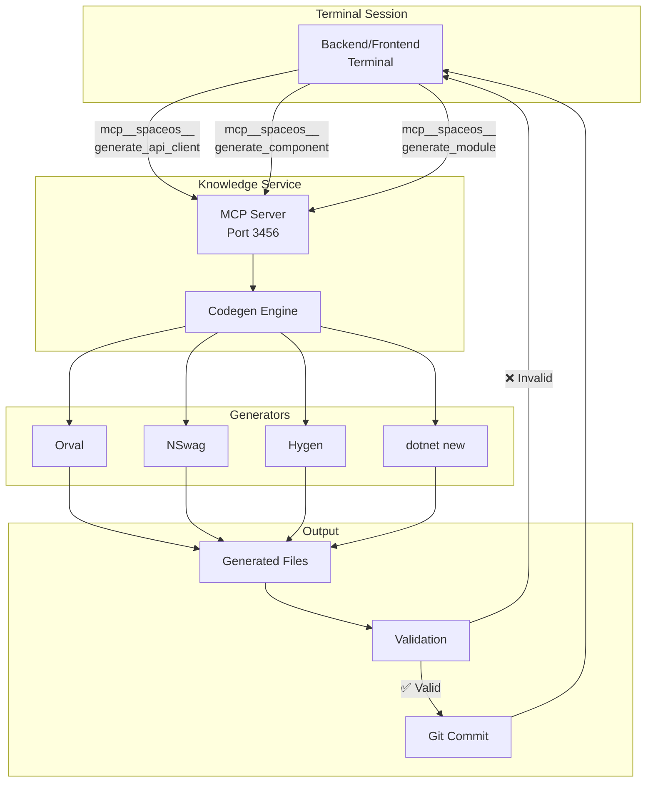
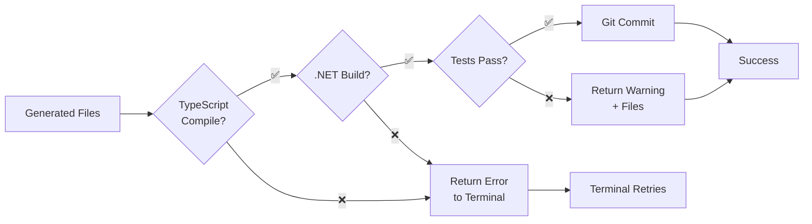

# SpaceOS Code Generator Toolchain — Architektúra

> **Version:** 1.0
> **Date:** 2026-06-30
> **Status:** ACTIVE
> **Related ADR:** [ADR-050](../decisions/ADR-050-code-generator-toolchain.md)

---

## Executive Summary

A SpaceOS Code Generator Toolchain egy 4-fázisú rendszer amely automatizálja a Walking Skeleton pattern implementációját:

- **Phase 1:** OpenAPI-based client generation (Orval + NSwag) — **CURRENT**
- **Phase 2:** Wrapper scripts — **PLANNED**
- **Phase 3:** Unified CLI — **PLANNED**
- **Phase 4:** MCP Tool Integration — **PLANNED**

**Goal:** 97% időmegtakarítás módulonkénti boilerplate kód generálásnál (3.75h → 7 perc).

---

## A) Rendszer Áttekintés

### High-Level Architecture



### Data Flow: OpenAPI → Generated Code → Runtime



---

## B) Phase 1-4 Részletes Architektúra

### Phase 1: Orval + NSwag (OpenAPI Client Generation)

**Status:** IN PROGRESS (Backend Terminal)

**Architecture:**

```mermaid
graph LR
    subgraph "Backend (.NET 8)"
        K[Kernel API<br/>Port 5000]
        O[Orchestrator<br/>Port 3000]
    end

    subgraph "OpenAPI Specs"
        KS[/swagger/v1/swagger.json]
        OS[/swagger/v1/swagger.json]
    end

    subgraph "Generators"
        Orv[Orval<br/>orval.config.ts]
        NSW[NSwag<br/>nswag.json]
    end

    subgraph "Generated Clients"
        PK[Portal<br/>kernelApi.ts]
        PO[Portal<br/>orchestratorApi.ts]
        OK[Orchestrator<br/>KernelClient.ts]
    end

    subgraph "Frontend"
        P[JoineryTech Portal<br/>React 18]
    end

    K -->|XML docs| KS
    O --> OS

    KS --> Orv
    OS --> Orv
    KS --> NSW

    Orv -->|React Query hooks| PK
    Orv -->|React Query hooks| PO
    NSW -->|TypeScript class| OK

    PK --> P
    PO --> P
    OK --> O
```

**Configuration Files:**

**1. Orval (Portal)**

```typescript
// frontend/joinerytech-portal/orval.config.ts
export default {
  kernel: {
    input: {
      target: 'http://localhost:5000/swagger/v1/swagger.json',
    },
    output: {
      target: 'src/api/generated/kernelApi.ts',
      client: 'react-query',
      mode: 'tags-split', // Splits by OpenAPI tags (e.g., FlowEpics, Tenants)
      override: {
        mutator: {
          path: 'src/api/client.ts',
          name: 'customInstance', // Injects auth headers
        },
      },
    },
  },
  orchestrator: {
    input: {
      target: 'http://localhost:3000/swagger/v1/swagger.json',
    },
    output: {
      target: 'src/api/generated/orchestratorApi.ts',
      client: 'react-query',
      mode: 'tags-split',
    },
  },
};
```

**2. NSwag (Orchestrator)**

```json
{
  "runtime": "Net80",
  "swaggerGenerator": {
    "fromDocument": {
      "url": "http://localhost:5000/swagger/v1/swagger.json"
    }
  },
  "codeGenerators": {
    "openApiToTypeScriptClient": {
      "className": "KernelApiClient",
      "moduleName": "",
      "namespace": "",
      "typeScriptVersion": 5.0,
      "template": "Fetch",
      "promiseType": "Promise",
      "dateTimeType": "Date",
      "nullValue": "Undefined",
      "generateClientClasses": true,
      "generateClientInterfaces": false,
      "generateOptionalParameters": true,
      "exportTypes": true,
      "wrapDtoExceptions": true,
      "exceptionClass": "ApiException",
      "clientBaseClass": null,
      "useTransformOptionsMethod": false,
      "useTransformResultMethod": false,
      "generateDtoTypes": true,
      "operationGenerationMode": "SingleClientFromOperationId",
      "markOptionalProperties": true,
      "generateCloneMethod": false,
      "typeStyle": "Interface",
      "enumStyle": "Enum",
      "useLeafType": false,
      "classTypes": [],
      "extendedClasses": [],
      "extensionCode": null,
      "generateDefaultValues": true,
      "excludedTypeNames": [],
      "excludedParameterNames": [],
      "handleReferences": false,
      "generateConstructorInterface": true,
      "convertConstructorInterfaceData": false,
      "importRequiredTypes": true,
      "useGetBaseUrlMethod": false,
      "baseUrlTokenName": "API_BASE_URL",
      "queryNullValue": "",
      "inlineNamedDictionaries": false,
      "inlineNamedAny": false,
      "templateDirectory": null,
      "typeNameGeneratorType": null,
      "propertyNameGeneratorType": null,
      "enumNameGeneratorType": null,
      "serviceHost": null,
      "serviceSchemes": null,
      "output": "src/clients/KernelApiClient.ts",
      "newLineBehavior": "Auto"
    }
  }
}
```

**Generated Code Example:**

```typescript
// Portal: src/api/generated/kernelApi.ts (Orval output)
import { useQuery, useMutation, UseQueryOptions, UseMutationOptions } from '@tanstack/react-query';
import { customInstance } from '../client'; // SpaceOS auth wrapper

export interface CreateFlowEpicRequest {
  name: string;
  tenantId: string;
  description?: string;
}

export interface FlowEpicDto {
  id: string;
  name: string;
  tenantId: string;
  status: 'Draft' | 'Active' | 'Completed';
  createdAt: Date;
}

// Auto-generated React Query hook
export const useCreateFlowEpic = (
  options?: UseMutationOptions<FlowEpicDto, Error, CreateFlowEpicRequest>
) => {
  return useMutation<FlowEpicDto, Error, CreateFlowEpicRequest>(
    (data) => customInstance({ url: '/api/flow-epics', method: 'POST', data }),
    options
  );
};

// Auto-generated GET hook
export const useGetFlowEpic = (
  id: string,
  options?: UseQueryOptions<FlowEpicDto, Error>
) => {
  return useQuery<FlowEpicDto, Error>(
    ['flow-epic', id],
    () => customInstance({ url: `/api/flow-epics/${id}`, method: 'GET' }),
    options
  );
};
```

**SpaceOS Custom Mutator (Auth Injection):**

```typescript
// frontend/joinerytech-portal/src/api/client.ts
import Axios, { AxiosRequestConfig } from 'axios';

export const AXIOS_INSTANCE = Axios.create({
  baseURL: import.meta.env.VITE_API_URL || 'http://localhost:5000',
});

// SpaceOS Custom: Auto-inject tenant header
AXIOS_INSTANCE.interceptors.request.use((config) => {
  const tenantId = localStorage.getItem('tenantId');
  const token = localStorage.getItem('authToken');

  if (tenantId) {
    config.headers['X-Tenant-Id'] = tenantId;
  }
  if (token) {
    config.headers['Authorization'] = `Bearer ${token}`;
  }

  return config;
});

// SpaceOS Custom: Error mapping (SpaceOS error codes → magyar hibaüzenetek)
AXIOS_INSTANCE.interceptors.response.use(
  (response) => response,
  (error) => {
    if (error.response?.data?.errorCode) {
      const spaceOsError = mapSpaceOsError(error.response.data.errorCode);
      error.message = spaceOsError.message;
    }
    return Promise.reject(error);
  }
);

export const customInstance = <T>(config: AxiosRequestConfig): Promise<T> => {
  const source = Axios.CancelToken.source();
  const promise = AXIOS_INSTANCE({ ...config, cancelToken: source.token }).then(
    ({ data }) => data
  );

  // @ts-ignore
  promise.cancel = () => {
    source.cancel('Query was cancelled by React Query');
  };

  return promise;
};

// SpaceOS error code → magyar hibaüzenet mapping
function mapSpaceOsError(code: string): { message: string } {
  const errorMap: Record<string, string> = {
    'TENANT_NOT_FOUND': 'A bérlő nem található',
    'FLOW_EPIC_DUPLICATE': 'Ez a folyamat már létezik',
    'UNAUTHORIZED': 'Nincs jogosultsága ehhez a művelethez',
    // ... 50+ SpaceOS specific error codes
  };

  return { message: errorMap[code] || 'Ismeretlen hiba történt' };
}
```

**CI/CD Integration:**

```yaml
# .github/workflows/api-codegen.yml
name: API Code Generation

on:
  push:
    branches: [main, develop]
    paths:
      - 'backend/spaceos-kernel/**'
      - 'backend/spaceos-orchestrator/**'

jobs:
  generate-api-clients:
    runs-on: ubuntu-latest

    steps:
      - uses: actions/checkout@v4

      - name: Setup .NET
        uses: actions/setup-dotnet@v4
        with:
          dotnet-version: '8.0.x'

      - name: Setup Node.js
        uses: actions/setup-node@v4
        with:
          node-version: '22.x'

      - name: Start Kernel API
        run: |
          cd backend/spaceos-kernel
          dotnet run &
          sleep 10 # Wait for API startup

      - name: Start Orchestrator API
        run: |
          cd backend/spaceos-orchestrator
          npm install
          npm start &
          sleep 5

      - name: Generate Portal API clients (Orval)
        run: |
          cd frontend/joinerytech-portal
          npm install
          npm run orval

      - name: Generate Orchestrator API client (NSwag)
        run: |
          cd backend/spaceos-orchestrator
          npm run nswag

      - name: TypeScript compile check
        run: |
          cd frontend/joinerytech-portal
          npm run typecheck

      - name: Commit generated files
        run: |
          git config user.name "SpaceOS Bot"
          git config user.email "bot@spaceos.dev"
          git add -A
          git diff --staged --quiet || git commit -m "chore: Regenerate API clients"
          git push
```

---

### Phase 2: SpaceOS Wrapper Scripts

**Status:** PLANNED

**Goal:** Unified bash scripts wrapper minden generátorhoz.

**Architecture:**

```
/opt/spaceos/scripts/codegen/
  ├── generate-api-client.sh       # Orval + NSwag unified wrapper
  ├── generate-component.sh        # Hygen wrapper (SpaceOS patterns)
  ├── generate-module.sh           # dotnet new wrapper
  └── templates/
      ├── component/               # Hygen templates
      │   ├── feature.tsx.ejs
      │   ├── ui.tsx.ejs
      │   └── layout.tsx.ejs
      └── module/                  # dotnet new templates
          └── spaceos-module/
```

**Script Examples:**

**1. generate-api-client.sh**

```bash
#!/bin/bash
# SpaceOS API Client Generator
# Usage: ./generate-api-client.sh <source> <target>
# Example: ./generate-api-client.sh kernel portal

set -e

SOURCE=$1  # kernel | orchestrator
TARGET=$2  # portal | orchestrator

if [[ -z "$SOURCE" || -z "$TARGET" ]]; then
  echo "Usage: ./generate-api-client.sh <source> <target>"
  exit 1
fi

case "$SOURCE-$TARGET" in
  "kernel-portal")
    echo "🔧 Generating Portal API client from Kernel..."
    cd /opt/spaceos/frontend/joinerytech-portal
    npm run orval -- --config orval.config.ts --input http://localhost:5000/swagger/v1/swagger.json
    ;;

  "orchestrator-portal")
    echo "🔧 Generating Portal API client from Orchestrator..."
    cd /opt/spaceos/frontend/joinerytech-portal
    npm run orval -- --config orval.config.ts --input http://localhost:3000/swagger/v1/swagger.json
    ;;

  "kernel-orchestrator")
    echo "🔧 Generating Orchestrator TypeScript client from Kernel..."
    cd /opt/spaceos/backend/spaceos-orchestrator
    npm run nswag
    ;;

  *)
    echo "❌ Invalid source-target combination: $SOURCE-$TARGET"
    exit 1
    ;;
esac

echo "✅ API client generated successfully"
```

**2. generate-component.sh**

```bash
#!/bin/bash
# SpaceOS Component Generator
# Usage: ./generate-component.sh <name> <category>
# Example: ./generate-component.sh FlowEpicCard feature

set -e

NAME=$1
CATEGORY=$2  # feature | ui | layout

if [[ -z "$NAME" || -z "$CATEGORY" ]]; then
  echo "Usage: ./generate-component.sh <name> <category>"
  exit 1
fi

cd /opt/spaceos/frontend/joinerytech-portal

# Run Hygen with SpaceOS templates
npx hygen component new \
  --name "$NAME" \
  --category "$CATEGORY" \
  --withTest true \
  --withStory true

echo "✅ Component $NAME generated in src/components/$NAME/"
```

**3. generate-module.sh**

```bash
#!/bin/bash
# SpaceOS Module Generator
# Usage: ./generate-module.sh <ModuleName> <AggregateRoot>
# Example: ./generate-module.sh Pricing Quote

set -e

MODULE=$1
AGGREGATE=$2

if [[ -z "$MODULE" || -z "$AGGREGATE" ]]; then
  echo "Usage: ./generate-module.sh <ModuleName> <AggregateRoot>"
  exit 1
fi

cd /opt/spaceos/backend

# Generate module structure from dotnet new template
dotnet new spaceos-module \
  -n "$MODULE" \
  -o "spaceos-modules-${MODULE,,}" \
  --aggregate "$AGGREGATE"

echo "✅ Module $MODULE generated in backend/spaceos-modules-${MODULE,,}/"
```

---

### Phase 3: SpaceOS CLI

**Status:** PLANNED

**Goal:** Unified CLI tool (`spaceos generate`) minden generátorhoz.

**Architecture:**

```typescript
// /opt/spaceos/cli/spaceos.ts
import { Command } from 'commander';
import { generateApiClient } from './commands/generateApiClient';
import { generateComponent } from './commands/generateComponent';
import { generateModule } from './commands/generateModule';

const program = new Command();

program
  .name('spaceos')
  .description('SpaceOS Development CLI')
  .version('1.0.0');

// spaceos generate api-client
program
  .command('generate api-client')
  .description('Generate API client from OpenAPI spec')
  .option('-s, --source <source>', 'API source (kernel | orchestrator)')
  .option('-t, --target <target>', 'Target project (portal | orchestrator)')
  .action(generateApiClient);

// spaceos generate component
program
  .command('generate component <name>')
  .description('Generate React component')
  .option('-c, --category <category>', 'Component category (feature | ui | layout)')
  .option('--no-test', 'Skip test file generation')
  .option('--no-story', 'Skip Storybook story generation')
  .action(generateComponent);

// spaceos generate module
program
  .command('generate module <name>')
  .description('Generate .NET module with Clean Architecture')
  .option('-a, --aggregate <name>', 'Aggregate root name')
  .option('-s, --states <states...>', 'FSM states')
  .option('-e, --endpoints <endpoints...>', 'API endpoints to generate')
  .action(generateModule);

program.parse();
```

**Usage Examples:**

```bash
# Generate Portal API client from Kernel
spaceos generate api-client --source kernel --target portal

# Generate React feature component
spaceos generate component FlowEpicCard --category feature

# Generate .NET module
spaceos generate module Pricing --aggregate Quote --states Draft Submitted Approved Rejected
```

---

### Phase 4: MCP Tool Integration

**Status:** PLANNED

**Goal:** Terminálok közvetlenül az MCP-n keresztül generálnak kódot.

**Architecture:**



**Implementation Workflow:**

```typescript
// spaceos-nexus/knowledge-service/src/codegen/codegenEngine.ts

export async function generateApiClient(params: {
  source: 'kernel' | 'orchestrator';
  target: 'portal' | 'orchestrator';
  outputDir?: string;
}): Promise<{ success: boolean; files: string[]; errors?: string[] }> {
  const { source, target, outputDir } = params;

  // 1. Validate source API is running
  const apiUrl = source === 'kernel'
    ? 'http://localhost:5000/swagger/v1/swagger.json'
    : 'http://localhost:3000/swagger/v1/swagger.json';

  try {
    await fetch(apiUrl);
  } catch (error) {
    return {
      success: false,
      files: [],
      errors: [`Source API ${source} not reachable at ${apiUrl}`],
    };
  }

  // 2. Run appropriate generator
  if (target === 'portal') {
    // Use Orval
    const orvalConfig = buildOrvalConfig(source, outputDir);
    const result = await runOrval(orvalConfig);
    return result;
  } else if (target === 'orchestrator') {
    // Use NSwag
    const nswagConfig = buildNSwagConfig(source, outputDir);
    const result = await runNSwag(nswagConfig);
    return result;
  }

  return { success: false, files: [], errors: ['Invalid target'] };
}

export async function generateComponent(params: {
  name: string;
  category: 'feature' | 'ui' | 'layout';
  withTest: boolean;
  withStory: boolean;
  props?: Array<{ name: string; type: string; required: boolean }>;
}): Promise<{ success: boolean; files: string[]; errors?: string[] }> {
  // Run Hygen with SpaceOS templates
  const hygenResult = await runHygen({
    generator: 'component',
    action: 'new',
    args: {
      name: params.name,
      category: params.category,
      withTest: params.withTest,
      withStory: params.withStory,
      props: params.props || [],
    },
  });

  return hygenResult;
}

export async function generateModule(params: {
  name: string;
  aggregate: string;
  states: string[];
  events?: string[];
  endpoints?: Array<{
    action: string;
    http: 'GET' | 'POST' | 'PUT' | 'DELETE';
    route: string;
  }>;
}): Promise<{ success: boolean; files: string[]; errors?: string[] }> {
  // Run dotnet new spaceos-module
  const dotnetResult = await runDotnetNew({
    template: 'spaceos-module',
    name: params.name,
    options: {
      aggregate: params.aggregate,
      states: params.states.join(','),
    },
  });

  // If endpoints specified, generate them
  if (params.endpoints && params.endpoints.length > 0) {
    for (const endpoint of params.endpoints) {
      await generateEndpoint({
        module: params.name,
        aggregate: params.aggregate,
        ...endpoint,
      });
    }
  }

  return dotnetResult;
}
```

---

## C) MCP Tool Specifikáció

### Tool Interface Definitions

**Located in:** `spaceos-nexus/knowledge-service/src/codegen/mcpTools.ts`

```typescript
// ============================================================================
// MCP Tool 1: generate_api_client
// ============================================================================

export interface GenerateApiClientParams {
  /**
   * Source API for OpenAPI spec
   * - kernel: SpaceOS Kernel (.NET 8, Port 5000)
   * - orchestrator: SpaceOS Orchestrator (Node.js, Port 3000)
   */
  source: 'kernel' | 'orchestrator';

  /**
   * Target project for generated client
   * - portal: JoineryTech Portal (React 18) → Orval
   * - orchestrator: Orchestrator BFF → NSwag
   */
  target: 'portal' | 'orchestrator';

  /**
   * Optional output directory override
   * Default:
   *   - portal: src/api/generated/
   *   - orchestrator: src/clients/
   */
  outputDir?: string;
}

export interface GenerateApiClientResult {
  success: boolean;

  /**
   * List of generated file paths
   * Example: ['src/api/generated/kernelApi.ts', 'src/api/generated/kernelApi.schemas.ts']
   */
  files: string[];

  /**
   * Error messages if generation failed
   */
  errors?: string[];

  /**
   * TypeScript compile check result
   */
  typeCheckPassed?: boolean;
}

// ============================================================================
// MCP Tool 2: generate_component
// ============================================================================

export interface PropertyDefinition {
  name: string;
  type: string; // 'string' | 'number' | 'boolean' | 'Date' | custom type
  required: boolean;
  description?: string;
}

export interface GenerateComponentParams {
  /**
   * Component name (PascalCase)
   * Example: 'FlowEpicCard', 'UserAvatar', 'DashboardLayout'
   */
  name: string;

  /**
   * Component category
   * - feature: Domain feature component (FlowEpicCard, OrderSummary)
   * - ui: Reusable UI component (Button, Modal, Table)
   * - layout: Layout component (DashboardLayout, Sidebar)
   */
  category: 'feature' | 'ui' | 'layout';

  /**
   * Generate test file (*.test.tsx)
   */
  withTest: boolean;

  /**
   * Generate Storybook story (*.stories.tsx)
   */
  withStory: boolean;

  /**
   * Component props definition (optional)
   * If not provided, generates empty props interface
   */
  props?: PropertyDefinition[];
}

export interface GenerateComponentResult {
  success: boolean;

  /**
   * List of generated files
   * Example: [
   *   'src/components/FlowEpicCard/FlowEpicCard.tsx',
   *   'src/components/FlowEpicCard/FlowEpicCard.test.tsx',
   *   'src/components/FlowEpicCard/FlowEpicCard.stories.tsx',
   *   'src/components/FlowEpicCard/index.ts'
   * ]
   */
  files: string[];

  errors?: string[];
}

// ============================================================================
// MCP Tool 3: generate_module
// ============================================================================

export interface EndpointDefinition {
  /**
   * Action name (Create, Update, Delete, Get, List, etc.)
   */
  action: string;

  /**
   * HTTP method
   */
  http: 'GET' | 'POST' | 'PUT' | 'DELETE' | 'PATCH';

  /**
   * API route
   * Example: '/api/pricing/quotes/{id}/approve'
   */
  route: string;

  /**
   * Request body properties (for POST/PUT/PATCH)
   */
  requestBody?: PropertyDefinition[];

  /**
   * Response type
   * Example: 'QuoteDto', 'Unit' (void), 'List<QuoteDto>'
   */
  responseType?: string;
}

export interface GenerateModuleParams {
  /**
   * Module name (PascalCase)
   * Example: 'Pricing', 'Inventory', 'Sales'
   */
  name: string;

  /**
   * Aggregate root name (PascalCase)
   * Example: 'Quote', 'Product', 'Order'
   */
  aggregate: string;

  /**
   * FSM states for aggregate
   * Example: ['Draft', 'Submitted', 'Approved', 'Rejected']
   */
  states: string[];

  /**
   * Domain events (optional)
   * Example: ['QuoteCreated', 'QuoteApproved', 'QuoteRejected']
   */
  events?: string[];

  /**
   * API endpoints to generate (optional)
   * If omitted, generates only CRUD endpoints
   */
  endpoints?: EndpointDefinition[];
}

export interface GenerateModuleResult {
  success: boolean;

  /**
   * List of generated files
   * Example: [
   *   'backend/spaceos-modules-pricing/SpaceOS.Modules.Pricing.Domain/Aggregates/Quote.cs',
   *   'backend/spaceos-modules-pricing/SpaceOS.Modules.Pricing.Application/Commands/CreateQuoteCommand.cs',
   *   'backend/spaceos-modules-pricing/SpaceOS.Modules.Pricing.Api/Endpoints/QuotesEndpoints.cs',
   *   ...
   * ]
   */
  files: string[];

  /**
   * .NET build check result
   */
  buildPassed?: boolean;

  errors?: string[];
}
```

### MCP Tool Registration

```typescript
// spaceos-nexus/knowledge-service/src/mcp.ts

import { generateApiClient, generateComponent, generateModule } from './codegen/codegenEngine';

// Register codegen tools
const CODEGEN_TOOLS = [
  {
    name: 'generate_api_client',
    description: 'Generate API client from OpenAPI spec (Orval or NSwag)',
    inputSchema: {
      type: 'object',
      properties: {
        source: {
          type: 'string',
          enum: ['kernel', 'orchestrator'],
          description: 'Source API for OpenAPI spec',
        },
        target: {
          type: 'string',
          enum: ['portal', 'orchestrator'],
          description: 'Target project for generated client',
        },
        outputDir: {
          type: 'string',
          description: 'Optional output directory override',
        },
      },
      required: ['source', 'target'],
    },
  },
  {
    name: 'generate_component',
    description: 'Generate React component with test and story',
    inputSchema: {
      type: 'object',
      properties: {
        name: {
          type: 'string',
          description: 'Component name (PascalCase)',
        },
        category: {
          type: 'string',
          enum: ['feature', 'ui', 'layout'],
          description: 'Component category',
        },
        withTest: {
          type: 'boolean',
          description: 'Generate test file',
          default: true,
        },
        withStory: {
          type: 'boolean',
          description: 'Generate Storybook story',
          default: true,
        },
        props: {
          type: 'array',
          description: 'Component props definition',
          items: {
            type: 'object',
            properties: {
              name: { type: 'string' },
              type: { type: 'string' },
              required: { type: 'boolean' },
              description: { type: 'string' },
            },
            required: ['name', 'type', 'required'],
          },
        },
      },
      required: ['name', 'category'],
    },
  },
  {
    name: 'generate_module',
    description: 'Generate .NET module with Clean Architecture structure',
    inputSchema: {
      type: 'object',
      properties: {
        name: {
          type: 'string',
          description: 'Module name (PascalCase)',
        },
        aggregate: {
          type: 'string',
          description: 'Aggregate root name',
        },
        states: {
          type: 'array',
          description: 'FSM states',
          items: { type: 'string' },
        },
        events: {
          type: 'array',
          description: 'Domain events (optional)',
          items: { type: 'string' },
        },
        endpoints: {
          type: 'array',
          description: 'API endpoints to generate (optional)',
          items: {
            type: 'object',
            properties: {
              action: { type: 'string' },
              http: { type: 'string', enum: ['GET', 'POST', 'PUT', 'DELETE', 'PATCH'] },
              route: { type: 'string' },
              requestBody: { type: 'array' },
              responseType: { type: 'string' },
            },
            required: ['action', 'http', 'route'],
          },
        },
      },
      required: ['name', 'aggregate', 'states'],
    },
  },
];

// Add to MCP tool list
router.post('/mcp', async (req: Request, res: Response) => {
  const { method, params } = req.body;

  if (method === 'tools/list') {
    const allTools = [
      ...KNOWLEDGE_TOOLS,
      ...MAILBOX_TOOLS,
      ...CODEGEN_TOOLS, // ← New tools
      // ... other tools
    ];

    res.json({ tools: allTools });
    return;
  }

  if (method === 'tools/call') {
    const { name, arguments: args } = params;

    // Handle codegen tools
    if (name === 'generate_api_client') {
      const result = await generateApiClient(args);
      res.json({ content: [{ type: 'text', text: JSON.stringify(result, null, 2) }] });
      return;
    }

    if (name === 'generate_component') {
      const result = await generateComponent(args);
      res.json({ content: [{ type: 'text', text: JSON.stringify(result, null, 2) }] });
      return;
    }

    if (name === 'generate_module') {
      const result = await generateModule(args);
      res.json({ content: [{ type: 'text', text: JSON.stringify(result, null, 2) }] });
      return;
    }

    // ... handle other tools
  }
});
```

---

## D) SpaceOS Custom Patterns

### 1. Auth/Tenant Header Injection

**Pattern:** Automatikus `X-Tenant-Id` és `Authorization` header minden API kérésben.

**Implementation (Portal):**

```typescript
// frontend/joinerytech-portal/src/api/client.ts

AXIOS_INSTANCE.interceptors.request.use((config) => {
  const tenantId = localStorage.getItem('tenantId');
  const token = localStorage.getItem('authToken');

  if (tenantId) {
    config.headers['X-Tenant-Id'] = tenantId;
  }
  if (token) {
    config.headers['Authorization'] = `Bearer ${token}`;
  }

  // SpaceOS Audit Logging: Track API call initiator
  config.headers['X-User-Id'] = localStorage.getItem('userId') || 'anonymous';
  config.headers['X-Session-Id'] = getOrCreateSessionId();

  return config;
});
```

**Why:** SpaceOS minden API call tenant-isolated + audit trail szükséges.

---

### 2. Error Mapping (SpaceOS Codes → Magyar Hibaüzenetek)

**Pattern:** Backend SpaceOS-specifikus hibakódok (pl. `TENANT_NOT_FOUND`) → Frontend magyar hibaüzenetek.

**Implementation:**

```typescript
// frontend/joinerytech-portal/src/api/errorMapper.ts

export const SPACEOS_ERROR_MAP: Record<string, string> = {
  // Tenant & Auth
  'TENANT_NOT_FOUND': 'A bérlő nem található',
  'TENANT_SUSPENDED': 'A bérlői fiók felfüggesztve',
  'UNAUTHORIZED': 'Nincs jogosultsága ehhez a művelethez',
  'TOKEN_EXPIRED': 'A munkamenet lejárt, jelentkezzen be újra',

  // Flow Epic
  'FLOW_EPIC_DUPLICATE': 'Ez a folyamat már létezik',
  'FLOW_EPIC_NOT_FOUND': 'A folyamat nem található',
  'FLOW_EPIC_IMMUTABLE': 'Ezt a folyamatot már nem lehet módosítani',

  // Pricing
  'QUOTE_CALCULATION_FAILED': 'Az árajánlat számítása sikertelen',
  'QUOTE_EXPIRED': 'Az árajánlat lejárt',

  // Manufacturing
  'BOM_MISMATCH': 'Az anyaglista nem egyezik a tervekkel',
  'PRODUCTION_NOT_STARTED': 'A gyártás még nem indult',

  // Generic
  'VALIDATION_FAILED': 'Az adatok érvénytelenek',
  'INTERNAL_ERROR': 'Belső hiba történt',
};

export function mapSpaceOsError(code: string): { message: string } {
  return {
    message: SPACEOS_ERROR_MAP[code] || 'Ismeretlen hiba történt',
  };
}

// Axios interceptor
AXIOS_INSTANCE.interceptors.response.use(
  (response) => response,
  (error) => {
    if (error.response?.data?.errorCode) {
      const spaceOsError = mapSpaceOsError(error.response.data.errorCode);
      error.message = spaceOsError.message;
    }

    // SpaceOS Audit: Log error to backend
    logErrorToAudit({
      code: error.response?.data?.errorCode,
      url: error.config?.url,
      userId: localStorage.getItem('userId'),
    });

    return Promise.reject(error);
  }
);
```

---

### 3. Audit Logging Pattern

**Pattern:** Minden API hívás naplózva (ki, mit, mikor, eredmény).

**Implementation (Backend):**

```csharp
// backend/spaceos-kernel/Infrastructure/Middleware/AuditMiddleware.cs

public class AuditMiddleware
{
    private readonly RequestDelegate _next;
    private readonly IAuditService _auditService;

    public AuditMiddleware(RequestDelegate next, IAuditService auditService)
    {
        _next = next;
        _auditService = auditService;
    }

    public async Task InvokeAsync(HttpContext context)
    {
        var stopwatch = Stopwatch.StartNew();

        // Extract SpaceOS audit headers
        var tenantId = context.Request.Headers["X-Tenant-Id"].ToString();
        var userId = context.Request.Headers["X-User-Id"].ToString();
        var sessionId = context.Request.Headers["X-Session-Id"].ToString();

        // Capture request
        var auditEntry = new AuditEntry
        {
            TenantId = tenantId,
            UserId = userId,
            SessionId = sessionId,
            Method = context.Request.Method,
            Path = context.Request.Path,
            Timestamp = DateTime.UtcNow,
        };

        try
        {
            await _next(context);

            // Capture response
            stopwatch.Stop();
            auditEntry.StatusCode = context.Response.StatusCode;
            auditEntry.DurationMs = (int)stopwatch.ElapsedMilliseconds;
        }
        catch (Exception ex)
        {
            stopwatch.Stop();
            auditEntry.StatusCode = 500;
            auditEntry.ErrorCode = ex.GetType().Name;
            auditEntry.DurationMs = (int)stopwatch.ElapsedMilliseconds;
            throw;
        }
        finally
        {
            // Log to database (async fire-and-forget)
            _ = _auditService.LogAsync(auditEntry);
        }
    }
}
```

**Generated API Clients Automatically Include Audit Headers:**

Orval custom mutator + NSwag `BaseClientOptions` inject audit headers minden request-be.

---

### 4. RLS Context Propagation

**Pattern:** Row-Level Security PostgreSQL GUC változók minden request-ben.

**Implementation (Backend):**

```csharp
// backend/spaceos-kernel/Infrastructure/Persistence/DbConnectionInterceptor.cs

public class RowLevelSecurityInterceptor : DbConnectionInterceptor
{
    private readonly IHttpContextAccessor _httpContextAccessor;

    public override async ValueTask<InterceptionResult> ConnectionOpeningAsync(
        DbConnection connection,
        ConnectionEventData eventData,
        InterceptionResult result,
        CancellationToken cancellationToken = default)
    {
        // Extract tenant and user from HTTP headers
        var tenantId = _httpContextAccessor.HttpContext?.Request.Headers["X-Tenant-Id"];
        var userId = _httpContextAccessor.HttpContext?.Request.Headers["X-User-Id"];

        if (!string.IsNullOrEmpty(tenantId))
        {
            // Set PostgreSQL GUC variables for RLS policies
            using var cmd = connection.CreateCommand();
            cmd.CommandText = @"
                SELECT set_config('app.current_tenant_id', @tenantId, false);
                SELECT set_config('app.current_user_id', @userId, false);
            ";
            cmd.Parameters.Add(new NpgsqlParameter("@tenantId", tenantId));
            cmd.Parameters.Add(new NpgsqlParameter("@userId", userId ?? "system"));

            await cmd.ExecuteNonQueryAsync(cancellationToken);
        }

        return result;
    }
}

// PostgreSQL RLS Policy Example
/*
CREATE POLICY "tenant_isolation" ON flow_epics
  USING (tenant_id = current_setting('app.current_tenant_id')::uuid);
*/
```

**Generated API Clients:** Már tartalmazzák a `X-Tenant-Id` header-t (Auth pattern).

---

### 5. Retry/Circuit Breaker

**Pattern:** Exponential backoff + circuit breaker kritikus API hívásoknál.

**Implementation (Frontend):**

```typescript
// frontend/joinerytech-portal/src/api/retryPolicy.ts

import axios, { AxiosError } from 'axios';
import { wait } from '../utils/time';

const MAX_RETRIES = 3;
const CIRCUIT_BREAKER_THRESHOLD = 5; // 5 failures → open circuit
const CIRCUIT_BREAKER_TIMEOUT = 60000; // 1 min

let failureCount = 0;
let circuitOpen = false;
let circuitOpenTime: number | null = null;

export async function retryWithBackoff<T>(
  fn: () => Promise<T>,
  retries = MAX_RETRIES
): Promise<T> {
  // Circuit breaker check
  if (circuitOpen) {
    if (circuitOpenTime && Date.now() - circuitOpenTime > CIRCUIT_BREAKER_TIMEOUT) {
      // Try to close circuit
      circuitOpen = false;
      circuitOpenTime = null;
      failureCount = 0;
    } else {
      throw new Error('Circuit breaker open - service unavailable');
    }
  }

  try {
    const result = await fn();

    // Success → reset failure count
    if (failureCount > 0) {
      failureCount = Math.max(0, failureCount - 1);
    }

    return result;
  } catch (error) {
    const axiosError = error as AxiosError;

    // Retry only on transient errors (5xx, network errors)
    const isRetryable =
      !axiosError.response || axiosError.response.status >= 500;

    if (isRetryable && retries > 0) {
      const delay = Math.pow(2, MAX_RETRIES - retries) * 1000; // Exponential backoff
      await wait(delay);
      return retryWithBackoff(fn, retries - 1);
    }

    // Track failure for circuit breaker
    failureCount++;
    if (failureCount >= CIRCUIT_BREAKER_THRESHOLD) {
      circuitOpen = true;
      circuitOpenTime = Date.now();
    }

    throw error;
  }
}

// Example usage in generated API client
export const useCreateFlowEpic = (options?: UseMutationOptions<...>) => {
  return useMutation<...>(
    (data) => retryWithBackoff(() =>
      customInstance({ url: '/api/flow-epics', method: 'POST', data })
    ),
    options
  );
};
```

---

## E) Integrációs Pontok

### 1. CI/CD Workflow (GitHub Actions)

**File:** `.github/workflows/api-codegen.yml` (lásd Phase 1 section)

**Triggers:**
- Push to `main` / `develop`
- Pull request to `main`
- Manual dispatch (workflow_dispatch)

**Steps:**
1. Start Kernel API
2. Start Orchestrator API
3. Run Orval (Portal)
4. Run NSwag (Orchestrator)
5. TypeScript compile check
6. Commit generated files
7. Push to branch

---

### 2. Knowledge Service MCP Server Bővítés

**Files:**
- `spaceos-nexus/knowledge-service/src/codegen/codegenEngine.ts` — Generator logic
- `spaceos-nexus/knowledge-service/src/codegen/mcpTools.ts` — MCP tool definitions
- `spaceos-nexus/knowledge-service/src/mcp.ts` — MCP router registration

**Integration Flow:**

```typescript
// Terminal calls MCP tool
Terminal → MCP Server → codegenEngine.ts → Orval/NSwag/Hygen/dotnet new
                                                    ↓
                                            Generated Files
                                                    ↓
                                            Validation (TypeScript/C#)
                                                    ↓
                                            ✅ Success / ❌ Error
```

---

### 3. Terminal Workflow Integráció

**Backend Terminal Workflow:**

```
1. Receives task: "Implement Pricing Quote API"
2. Uses MCP: mcp__spaceos__generate_module({
     name: "Pricing",
     aggregate: "Quote",
     states: ["Draft", "Submitted", "Approved", "Rejected"],
     endpoints: [
       { action: "Create", http: "POST", route: "/api/pricing/quotes" },
       { action: "Approve", http: "POST", route: "/api/pricing/quotes/{id}/approve" }
     ]
   })
3. MCP generates:
   - SpaceOS.Modules.Pricing.Domain/Aggregates/Quote.cs
   - SpaceOS.Modules.Pricing.Application/Commands/CreateQuoteCommand.cs
   - SpaceOS.Modules.Pricing.Application/Commands/ApproveQuoteCommand.cs
   - SpaceOS.Modules.Pricing.Api/Endpoints/QuotesEndpoints.cs
   - SpaceOS.Modules.Pricing.Tests/Unit/QuoteTests.cs
4. Backend Terminal:
   - Implements business logic in handlers
   - Runs tests
   - DONE outbox message
```

**Frontend Terminal Workflow:**

```
1. Receives task: "Implement FlowEpic Card UI"
2. Uses MCP: mcp__spaceos__generate_component({
     name: "FlowEpicCard",
     category: "feature",
     withTest: true,
     withStory: true,
     props: [
       { name: "epic", type: "FlowEpicDto", required: true },
       { name: "onEdit", type: "(id: string) => void", required: false }
     ]
   })
3. MCP generates:
   - src/components/FlowEpicCard/FlowEpicCard.tsx
   - src/components/FlowEpicCard/FlowEpicCard.test.tsx
   - src/components/FlowEpicCard/FlowEpicCard.stories.tsx
4. Frontend Terminal:
   - Implements component logic (JSX, hooks)
   - Writes tests
   - DONE outbox message
```

---

### 4. Validation és Error Handling

**Generated Code Validation Pipeline:**



**Error Types:**

| Error | Action |
|-------|--------|
| **Source API unreachable** | Return `{ success: false, errors: ['Kernel API not running'] }` |
| **TypeScript compile error** | Return errors + suggest fix (e.g., "Add missing property 'name' to CreateFlowEpicRequest") |
| **.NET build error** | Return errors + build log |
| **Test failures** | Return warning + files (tests can be fixed by terminal) |
| **Git conflict** | Return error + suggest manual merge |

**Error Response Format:**

```typescript
{
  success: false,
  files: [],
  errors: [
    "TypeScript compile error in src/api/generated/kernelApi.ts:42",
    "Property 'name' is missing in type 'CreateFlowEpicRequest'",
    "Expected: { name: string; tenantId: string; description?: string }",
    "Received: { tenantId: string; description?: string }"
  ],
  typeCheckPassed: false
}
```

---

## Implementation Roadmap

### Phase 1: API Client Generation (Week 1-2) — **CURRENT**

| Task | Assignee | Status |
|------|----------|--------|
| Kernel OpenAPI XML docs completion | Backend Terminal | ✅ DONE |
| Orval setup (Portal) | Backend Terminal | 🔄 IN PROGRESS |
| NSwag setup (Orchestrator) | Backend Terminal | 📋 TODO |
| CI/CD integration | Backend Terminal | 📋 TODO |

**Blocker:** Kernel OpenAPI spec completeness (minden endpoint XML `<summary>` docs).

---

### Phase 2: Wrapper Scripts (Week 3-4)

| Task | Assignee | Status |
|------|----------|--------|
| `generate-api-client.sh` | Backend Terminal | 📋 PLANNED |
| `generate-component.sh` | Frontend Terminal | 📋 PLANNED |
| `generate-module.sh` | Backend Terminal | 📋 PLANNED |
| Hygen templates (SpaceOS patterns) | Frontend Terminal | 📋 PLANNED |
| dotnet new template | Backend Terminal | 📋 PLANNED |

---

### Phase 3: SpaceOS CLI (Week 5-6)

| Task | Assignee | Status |
|------|----------|--------|
| CLI package setup (commander.js) | Backend Terminal | 📋 PLANNED |
| `spaceos generate api-client` | Backend Terminal | 📋 PLANNED |
| `spaceos generate component` | Frontend Terminal | 📋 PLANNED |
| `spaceos generate module` | Backend Terminal | 📋 PLANNED |
| CLI tests | Backend Terminal | 📋 PLANNED |

---

### Phase 4: MCP Integration (Week 7-10)

| Task | Assignee | Status |
|------|----------|--------|
| MCP tool definitions | Backend Terminal | 📋 PLANNED |
| `codegenEngine.ts` implementation | Backend Terminal | 📋 PLANNED |
| Orval/NSwag/Hygen/dotnet new wrappers | Backend Terminal | 📋 PLANNED |
| Validation pipeline | Backend Terminal | 📋 PLANNED |
| Terminal workflow integration | Conductor | 📋 PLANNED |
| Documentation | Librarian | 📋 PLANNED |

---

## Success Criteria

### Phase 1 (API Client Generation)

- [ ] Portal: `npm run orval` generates `src/api/generated/kernelApi.ts`
- [ ] Orchestrator: `npm run nswag` generates `src/clients/KernelApiClient.ts`
- [ ] CI/CD: Breaking changes caught by TypeScript compile errors
- [ ] CI/CD: Auto-commit + push generated files

### Phase 4 (MCP Integration)

- [ ] Backend Terminal: `mcp__spaceos__generate_module` creates 4 projects + tests
- [ ] Frontend Terminal: `mcp__spaceos__generate_component` creates 3 files (tsx, test, story)
- [ ] Validation: TypeScript/C# compile check passes
- [ ] Error handling: Meaningful error messages returned to terminal
- [ ] Documentation: Architect updates this doc with learnings

---

## Related Documentation

- **ADR-050:** [Code Generator Toolchain Decision](../decisions/ADR-050-code-generator-toolchain.md)
- **CODE_GENERATOR_CATALOGUE.md:** [20 Tools Research](../knowledge/patterns/CODE_GENERATOR_CATALOGUE.md)
- **SpaceOS Vision Master:** [5 Golden Rules](../vision/SpaceOS_Vision_Master.md)
- **Walking Skeleton ADR:** [ADR-005](../decisions/ADR-005-walking-skeleton-first.md)

---

**Document Maintained By:** Architect Terminal
**Last Updated:** 2026-06-30
**Version:** 1.0
