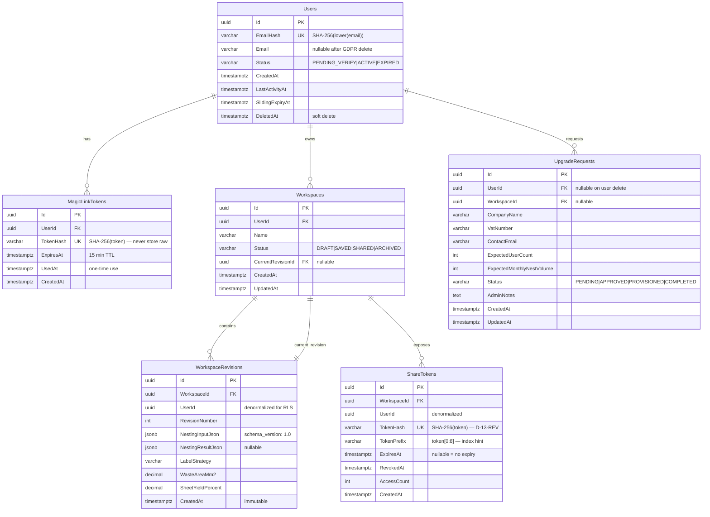

# SpaceOS — FreeTier Anonymous Workspace Architecture
## Anonymous Nesting · Magic-Link Workspace · Upgrade Funnel

> **Verzió:** v4.5 — 2026-04-20 (v4.4 + jogosultsági audit: OWNER, GUC, share_reader role, ShareTokens DDL, GDPR ContactEmail)
> **Státusz:** ✅ APPROVED — Implementation Ready
> **Blokkoló feltétel:** FT-1..FT-5 döntések ✅ APPROVED (`SpaceOS_FreeTier_Kickoff_Decisions_FT1_FT5.md`)
> **Kumulált review:** v2 ✅ database · v3 ✅ security · v4 ✅ backend · v4.5 ✅ permissions audit
> **Referencia:** `SpaceOS_Growth_Strategy_v1.md` · `SpaceOS_FreeTier_Kickoff_Decisions_FT1_FT5.md` · `SpaceOS_Modules_Contracts_Architecture_v4_2.md` (1.3.0 extension points) · `SpaceOS.Nesting.Algorithms` 1.0.0
> **Repo:** `spaceos-freetier-api` (új polyrepo)
> **DB schema:** `freetier` (shared PostgreSQL 16, nem új DB)
> **Port:** 5007 (systemd, loopback-only)
> **Becsült effort:** ~17.5 fejlesztői nap (FT-1..FT-5 delta után)
> **Test baseline:** 3150+ pass (Soft Launch LIVE)

---

## 1. Kumulált Finding Összesítő (v1 → v4)

| Review | Finding-ek | Legfontosabb javítás | Effort delta |
|--------|-----------|----------------------|--------------|
| v1 → v2 (database + schema) | 7 | Share token RLS bypass pattern + MagicLinkToken system-only access | +0 nap (terv szintjén megoldva) |
| v2 → v3 (`SE: Security`) | 15 | ShareDbContext over-privilege (SEC-12) + Redis fail-open nesting bypass (SEC-02) + share token plaintext (SEC-03) + session fingerprint spoofable (SEC-05) + hiányzó email rate limit (SEC-06) | +1.5 nap |
| v3 → v4 (`Principal SE: Backend`) | 27 | DDL `AuthenticatedAt`+`TokenHash/TokenPrefix` mismatch (BE-01,04) + UpgradeRequest public setters (BE-02) + Deferred FK EF Core (BE-10) + JSONB mapping (BE-11) + missing handlers (BE-16,17,21) + ConnectionClosingAsync pool poison (BE-22) | +1.0 nap |
| v4 → v4.5 (Permissions audit) | 5 | OWNER hiány → FORCE RLS bypass (🔴) + GUC nem regisztrált (🔴) + ShareTokens DDL plaintext vs D-13-REV (🟡) + share_reader role hiányzik (🟡) + ContactEmail NOT NULL vs GDPR (🟡) | +0 nap (DDL fix) |
| **Összesen** | 54 | | +2.5 nap |

### v2 Database Review — Findings

| # | Szint | Finding | Megoldás |
|---|-------|---------|---------|
| DB-01 | 🔴 CRITICAL | Share token public endpoint: RLS user_id context nincs → ShareTokens lookup blokkol | Külön RLS policy-t NEM alkalmazunk ShareTokens-en; share endpoint `IDbContextFactory`-val impersonálja a workspace tulajt a token validáció után |
| DB-02 | 🔴 CRITICAL | MagicLinkTokens RLS: token verify ELŐTT nincs user context → önmaga blokkolja a login-t | `MagicLinkTokens` táblán NEM alkalmazunk user-scoped RLS-t; system-only access, `TokenHash` unique constraint + TTL a biztonsági mechanizmus |
| DB-03 | 🟡 HIGH | Email tárolás GDPR conflict: magic link küldéshez kell a plain email, de GDPR minimizálás | `Email` nullable (NULL on delete), `EmailHash` (SHA-256) dedup-hoz + searching-hez; törlés esetén `Email = NULL`, `DeletedAt = NOW()` |
| DB-04 | 🟡 HIGH | WorkspaceRevision immutability | Nincs UPDATE policy a revíziókra; csak INSERT + SELECT; EF `AsNoTracking` kötelező |
| DB-05 | 🟠 MEDIUM | `current_setting('app.user_id', ...)` GUC null fallback | Nil-UUID `'00000000-0000-0000-0000-000000000000'` fallback, ahogy a Kernel `app.current_tenant_id`-nál (DATABASE_PATTERNS.md §1) |
| DB-06 | 🟠 MEDIUM | `UpgradeRequests` admin visibility: RLS FORCE blokkolja admin API-t | v1-ben csak manuális DB access (psql) — acceptable. V2-ben `spaceos_freetier_admin` role bypass |
| DB-07 | 🟢 LOW | `WorkspaceRevisions.UserId` denormalizáció konzisztencia | INSERT trigger vagy application réteg garantálja, hogy `UserId == Workspace.UserId`; FK cascade a Workspaces tábláról |

---

## 2. Architekturális döntések

### 2.1 Core döntések (FT-1..FT-5 — approved)

| # | Döntés | Választás | Referencia |
|---|--------|-----------|------------|
| **FT-1** | Izolációs modell | User-scoped FreeTier.Api (nem tenant) | Kickoff Decisions §FT-1 |
| **FT-2** | Session + rate limit store | Redis anonymous + PG post-auth + Redis counter | Kickoff Decisions §FT-2 |
| **FT-3** | URL stratégia | `eszkozok.joinerytech.hu` külön subdomain | Kickoff Decisions §FT-3 |
| **FT-4** | Rate limit PRIMARY | FreeTier.Api middleware + Redis | Kickoff Decisions §FT-4 |
| **FT-5** | Upgrade flow v1 | Manuális (Slack notif + admin provisioning) | Kickoff Decisions §FT-5 |

### 2.2 Inherited döntések (Growth Strategy v1)

| # | Döntés | Választás | GS ref |
|---|--------|-----------|--------|
| D-01 | Input modell | SEO landing + manuális form | PQ1 |
| D-02 | Visualization | L2 interaktív SVG + 4 label strategy + 3D v2 | PQ2 |
| D-03 | Auth mechanizmus | Magic link + 30 nap sliding | FT1 |
| D-04 | Share | Read-only + export · editable v2 | FT3 |
| D-05 | Label default | FullLabelStrategy | FT4 |
| D-06 | PDF elemek | SVG + cut list + yield + branding + CTA + meta (6 elem) | PQ7 |
| D-07 | Virality tags | Mind a 4 (PDF footer, share landing, invite, DXF watermark) | FT7 |
| D-08 | Email vendor | Brevo (magic link + marketing) | GS §5.4 |
| D-09 | Captcha | Cloudflare Turnstile (cookieless) | GS §5.4 |
| D-10 | Analytics | Plausible self-hosted | GS §5.4 |

### 2.3 Új döntések (v2 database + v3 security + v4 backend review — APPROVED)

| # | Döntés | Választás | Indoklás |
|---|--------|-----------|----------|
| **D-11** | Magic link token format | 32 byte CSPRNG → base64url (43 char) · DB-ben SHA-256 hash (64 hex) · sikeres verify-kor az összes többi unused token invalidálva · max 3 párhuzamos unused token/user | One-time use + log-safe storage; SEC-01 timing attack mitigation |
| **D-12** | Workspace JSON schema verziózás | `schema_version: "1.0"` mező a `NestingInputJson` JSONB-ben; additive-only v1.x; V2 → `WorkspaceExportV2` type | Upgrade export stabilitás (FT-5) + jövőkompatibilitás |
| **D-13-REV** | Share token formátum *(v3 revision)* | 32 byte CSPRNG → base64url (43 char) **secret** (soha nem tárolva) · DB-ben SHA-256 hash (`TokenHash`) + `TokenPrefix` (első 8 char, index hint) | SEC-03: eredeti plaintext D-13 DB breach esetén összes share linket leakeli; hashing illeszkedik D-11 mintához |
| **D-14-REV** | Session fingerprint algoritmus *(v3 revision)* | Szerver generál 16 byte CSPRNG `session_nonce`-t; `HttpOnly; Secure; SameSite=Lax` cookie-ban (`ft_sess`) visszaküldve; Redis key: `sess:{SHA-256(session_nonce)}` · IP+UA csak anomaly detection signal | SEC-05: eredeti IP+UA fingerprint spoofable; cookie-bound nonce cookie theftet igényel |
| **D-15** | Rate limit sliding window bucket | 5 perces bucket (300s) · Redis key: `rl:{scope}:{fingerprint}:{unix_ts/300}` | FT-4 5 perc bucket explicit; Lua atomic INCR+EXPIRE |
| **D-16** | Redis eviction policy | `allkeys-lru` · `maxmemory 256mb` · AOF persistence OFF | Session + RL adat ephemeral; 10 min TTL; restart esetén session loss elfogadott (FT-2) |
| **D-17** | Upgrade export format stability | `WorkspaceExportV1` DTO: stable contract · `schema_version` field · EF Core `Owned` entity | Admin kézzel exportál V1-ben; V2 auto-migration fut `WorkspaceExportV1 → KernelProject` konverzióval |
| **D-18** | Rate limit Redis failure mode | **Fail-closed** `POST /nest` + `POST /auth/magic-link`-nél; fail-open workspace read-oknál; `SemaphoreSlim(10)` compute concurrency guard Redis állapottól függetlenül | SEC-02: Redis SPOF = teljes RL bypass CPU-intenzív endpointokon |
| **D-19** | Share URL token-stripping redirect | `GET /s/{token}`: token validálás → `HttpOnly; Secure; SameSite=Lax` share-session cookie (1h TTL) → 302 redirect `/s/view/{workspace_id}`-ra; token eltűnik az URL-ből a navigációból | SEC-04: share token Referer header-ben szivárog harmadik fél scriptekhez |
| **D-20** | Share endpoint DB role | Dedikált `spaceos_freetier_share_reader` LOGIN role `SELECT` only on ShareTokens, WorkspaceRevisions, Workspaces; ShareDbContext ezt használja; `spaceos_schema_owner` csak migráció-idejű | SEC-12: schema_owner privilegizált; least-privilege principle; ADR-SEC-002 |
| **D-21** | JSONB column mapping | `NestingInputJson`/`NestingResultJson`: `string` backing field + `.HasColumnType("jsonb")`; `System.Text.Json` explicit (de)serialization alkalmazás rétegben; NEM `OwnsOne().ToJson()` | BE-11: Npgsql EF Core 8 standalone JSONB owned entity nem működik megbízhatóan |
| **D-22** | Domain event dispatch | `FreeTierDbContext.SaveChangesAsync()` override: pre-save `PopDomainEvents()` → post-save `IMediator.Publish()` minden event-re | BE-03: Golden Rule compliance; Kernel mintája |
| **D-23** | Workspace limit/user | Max 20 aktív workspace/user (status != ARCHIVED); `SaveWorkspaceCommandHandler` enforces | BE-missing: korlátlan workspace creation = storage abuse |
| **D-24** | Circular FK EF migration | Raw SQL `DEFERRABLE INITIALLY DEFERRED` + `suppressTransaction: true`; EF model: `.HasOne().WithMany().IsRequired(false)` FK builder NEM generál constraint-et | BE-10: EF Core migration builder nem tud DEFERRABLE constraint-et generálni |
| **D-25** | Redis connection config | `AbortOnConnectFail=false, ConnectRetry=3, ConnectTimeout=5000, SyncTimeout=1000`; Polly 3x exponential retry 200ms/400ms/800ms | BE-23: production resilience |
| **D-26** | IClock abstraction | `public interface IClock { DateTime UtcNow { get; } }` injektálva minden handler + domain factory-ba; `FakeClock` tesztekhez | BE-07: `DateTime.UtcNow` közvetlen hívás tiltott domain kódban |

---

## 3. Scope határ

### Core fázis (ez a dokumentum — v1)

| Fogalom | Tartalom | Státusz kezelés |
|---------|----------|-----------------|
| **Anonymous Session** | 10 min TTL Redis key · fingerprint-alapú · nesting lefuttatható, eredmény olvasható | `ACTIVE` → (timeout) → törölve |
| **FreeTierUser** | Magic-link auth'd user · 30 nap sliding · `user_id` izoláció | `PENDING_VERIFY` → `ACTIVE` → `EXPIRED` |
| **Workspace** | Permanent user-owned nesting history + saved configurations | `DRAFT` → `SAVED` → `SHARED` → `ARCHIVED` |
| **ShareToken** | Read-only + export link · opcionális expiry | `ACTIVE` → `EXPIRED` |
| **UpgradeRequest** | Kernel tenant provisioning kérés | `PENDING` → `APPROVED` → `PROVISIONED` → `COMPLETED` |

### NEM scope (későbbi fázisok)

| Fogalom | Fázis | Prereq |
|---------|-------|--------|
| 3D Three.js visualization | v2 | v1 SVG DEPLOYED |
| Editable share (collaboration) | v2 | v1 read-only share DEPLOYED |
| Stripe checkout + auto-provisioning | v2 | v1 manual upgrade validated |
| DACH subdomain mirror (`werkzeuge.asztalostech.hu`) | v2 | EN mirror (`tools.joinerytech.com`) DEPLOYED |
| PartnerTier embed (iframe) | Session E (v2.5) | FreeTier v1.5 LIVE |
| DXF/STEP export | v1.5 | v1 PDF DEPLOYED |

---

## 4. Domain modell

### 4.1 Solution struktúra

```
spaceos-freetier-api/
├── SpaceOS.FreeTier.Domain/
│   ├── Aggregates/
│   │   ├── FreeTierUser.cs           ⏳ v1
│   │   ├── Workspace.cs              ⏳ v1
│   │   └── UpgradeRequest.cs         ⏳ v1
│   ├── Entities/
│   │   ├── WorkspaceRevision.cs      ⏳ v1 — snapshot per save
│   │   └── ShareToken.cs             ⏳ v1
│   ├── ValueObjects/
│   │   ├── MagicLinkToken.cs         ⏳ v1
│   │   ├── SessionFingerprint.cs     ⏳ v1 — IP hash + UA hash
│   │   └── NestingInput.cs           ⏳ v1 — input panel + lines
│   ├── Enums/
│   │   ├── FreeTierUserStatus.cs
│   │   ├── WorkspaceStatus.cs
│   │   ├── UpgradeRequestStatus.cs
│   │   └── LabelStrategy.cs          ⏳ v1 — 4 érték
│   ├── Events/
│   │   ├── AnonymousNestingRequested.cs
│   │   ├── MagicLinkRequested.cs
│   │   ├── FreeTierUserActivated.cs
│   │   ├── WorkspaceSaved.cs
│   │   ├── ShareTokenGenerated.cs
│   │   ├── FreeTierUpgradeRequested.cs  ← hoz Slack webhook-ot
│   │   └── UpgradeProvisioned.cs
│   └── Repositories/
│       ├── IFreeTierUserRepository.cs
│       ├── IWorkspaceRepository.cs
│       └── IUpgradeRequestRepository.cs
├── SpaceOS.FreeTier.Application/
│   ├── Commands/
│   │   ├── SubmitAnonymousNesting/
│   │   ├── RequestMagicLink/
│   │   ├── VerifyMagicLink/
│   │   ├── SaveWorkspace/
│   │   ├── GenerateShareToken/
│   │   └── RequestUpgrade/
│   ├── Queries/
│   │   ├── GetWorkspace/
│   │   ├── ListUserWorkspaces/
│   │   └── GetSharedWorkspace/         ← D-01 finding: share token impersonation
│   ├── DTOs/
│   │   ├── AnonymousNestingRequest.cs
│   │   ├── AnonymousNestingResult.cs
│   │   ├── WorkspaceDto.cs
│   │   └── WorkspaceExportV1.cs      ← D-17 stable contract upgrade flow-hoz
│   └── Services/
│       ├── IRateLimitService.cs      ← Redis counter
│       ├── IMagicLinkService.cs
│       ├── IBrevoEmailService.cs
│       ├── ITurnstileValidator.cs
│       └── ILabelStrategyFactory.cs
├── SpaceOS.FreeTier.Infrastructure/
│   ├── Data/
│   │   ├── FreeTierDbContext.cs      ← `freetier` schema · user-scoped
│   │   ├── ShareDbContext.cs         ← `freetier` schema · NO RLS (share read bypass)
│   │   ├── UserSessionInterceptor.cs ← sets app.user_id GUC
│   │   └── Migrations/
│   │       └── F_0001_InitialSchema.cs
│   ├── Redis/
│   │   ├── RedisSessionStore.cs
│   │   ├── RedisRateLimitCounter.cs
│   │   └── RedisConnectionFactory.cs
│   ├── External/
│   │   ├── BrevoEmailClient.cs
│   │   ├── TurnstileHttpClient.cs
│   │   └── SlackWebhookClient.cs     ← upgrade notif
│   └── Pdf/
│       └── QuestPdfBrandedExporter.cs
├── SpaceOS.FreeTier.Api/
│   ├── Endpoints/
│   │   ├── AnonymousNestingEndpoints.cs
│   │   ├── AuthEndpoints.cs          ← magic link request + verify
│   │   ├── WorkspaceEndpoints.cs
│   │   ├── ShareEndpoints.cs         ← public, no auth
│   │   └── UpgradeEndpoints.cs
│   ├── Middleware/
│   │   ├── TurnstileMiddleware.cs
│   │   ├── RateLimitMiddleware.cs    ← Redis-backed
│   │   └── UserSessionMiddleware.cs
│   ├── Program.cs
│   └── appsettings.json
└── SpaceOS.FreeTier.Tests/
    ├── Domain/
    ├── Application/
    ├── Api/
    └── Security/
```

### 4.2 Aggregate-ek (v1 skeleton — v4 backend review tölti részletesen)

```csharp
// Domain/Aggregates/FreeTierUser.cs
public sealed class FreeTierUser
{
    public Guid Id { get; private set; }
    public string? Email { get; private set; }        // nullable after GDPR delete
    public string EmailHash { get; private set; }     // SHA-256(lowercase(email))
    public FreeTierUserStatus Status { get; private set; }
    public DateTime CreatedAt { get; private set; }
    public DateTime LastActivityAt { get; private set; }
    public DateTime SlidingExpiryAt { get; private set; }
    public DateTime? DeletedAt { get; private set; }

    // Factory
    public static Result<FreeTierUser> Register(string email, DateTime now) { /* ... */ }
    
    // Commands
    public Result Activate(string tokenHash, DateTime now) { /* ... */ }
    public Result ExtendSession(DateTime now) { /* ... */ }
    public Result RequestDelete(DateTime now) { /* email = null, DeletedAt = now */ }
}

// Domain/Aggregates/Workspace.cs
public sealed class Workspace
{
    public Guid Id { get; private set; }
    public Guid UserId { get; private set; }
    public string Name { get; private set; }
    public WorkspaceStatus Status { get; private set; }
    public Guid? CurrentRevisionId { get; private set; }
    private readonly List<WorkspaceRevision> _revisions = new();
    public IReadOnlyList<WorkspaceRevision> Revisions => _revisions;

    public Result<WorkspaceRevision> Save(NestingInput input, NestingResultSnapshot result, LabelStrategy strategy) { /* ... */ }
    public Result<ShareToken> GenerateShareToken(DateTime? expiresAt) { /* ... */ }
    public Result RevokeShare(Guid shareTokenId) { /* ... */ }
    public Result Archive() { /* ... */ }
}

// Domain/Aggregates/UpgradeRequest.cs
public sealed class UpgradeRequest
{
    public Guid Id { get; private set; }
    public Guid? UserId { get; private set; }
    public Guid? WorkspaceId { get; private set; }
    public string CompanyName { get; private set; }
    public string? VatNumber { get; private set; }
    public string ContactEmail { get; private set; }
    public int? ExpectedUserCount { get; private set; }
    public int? ExpectedMonthlyNestVolume { get; private set; }
    public UpgradeRequestStatus Status { get; private set; }
    
    public static Result<UpgradeRequest> Submit(
        Guid userId, Guid workspaceId,
        string companyName, string vatNumber,
        string contactEmail, int? userCount, int? nestVolume) { /* ... */ }
    
    // Admin commands (application layer, not domain — no business logic)
    public void MarkApproved() { Status = UpgradeRequestStatus.Approved; }
    public void MarkProvisioned() { Status = UpgradeRequestStatus.Provisioned; }
    public void MarkCompleted() { Status = UpgradeRequestStatus.Completed; }
}
```

---

## 5. Infrastructure

### 5.1 Deployment topológia

```
              ┌──────────────────────────────────────────────────┐
Browser ─HTTPS▶ │ Nginx (TLS 1.2/1.3)                               │
              │   eszkozok.joinerytech.hu → 127.0.0.1:5007        │
              │   limit_req zone=freetier:10m rate=20r/s          │
              │   X-SpaceOS-Brand: freetier (host-injection)      │
              └────────────┬─────────────────────────────────────┘
                           ▼
              ┌──────────────────────────────────────────────────┐
              │ FreeTier.Api :5007 (systemd, loopback-only)       │
              │   ├── TurnstileMiddleware                         │
              │   ├── RateLimitMiddleware (Redis counter)         │
              │   ├── UserSessionMiddleware (magic link scope)    │
              │   └── Endpoints                                   │
              └──────┬────────────────────────────────────┬─────┘
                     ▼                                     ▼
              ┌─────────────┐                      ┌────────────┐
              │ Redis 7.4   │                      │ PG 16      │
              │ :6379       │                      │ :5433      │
              │ sess:{...}  │                      │ `freetier` │
              │ rl:{...}    │                      │  schema    │
              └─────────────┘                      └────────────┘
                                                          │
                                                          │ (upgrade)
                                                          ▼
                                                   ┌────────────┐
                                                   │ Kernel     │
                                                   │ (tenant    │
                                                   │  seed via  │
                                                   │  manual    │
                                                   │  script)   │
                                                   └────────────┘
External:
  ├── Cloudflare Turnstile (captcha validate)
  ├── Brevo API (magic link + marketing)
  ├── Slack webhook (#spaceos-sales — upgrade notif)
  └── Plausible (self-hosted, `analytics.joinerytech.hu`)
```

### 5.2 Redis konfiguráció

- Install: `apt install redis-server` (Ubuntu 24.04)
- Config: `/etc/redis/redis.conf` — loopback-only, `maxmemory 256mb`, `maxmemory-policy allkeys-lru`, `save ""` (AOF off), `requirepass` (env var)
- Systemd: `redis-server.service`
- UFW: 6379 NEM nyitva kifelé

**Redis key namespacing:**

| Key pattern | TTL | Tartalom |
|---|---|---|
| `sess:{fingerprint_hex}` | 600s (10 min) | Anonymous session JSONB |
| `rl:nest:submit:anon:{fingerprint_hex}:{bucket}` | 3600s | Anonymous submit counter |
| `rl:nest:submit:auth:{user_id}:{bucket}` | 86400s | Authenticated submit counter |
| `rl:export:pdf:auth:{user_id}:{bucket}` | 86400s | PDF export counter |
| `rl:share:generate:auth:{user_id}:{bucket}` | 86400s | Share generate counter |
| `rl:workspace:save:auth:{user_id}:{bucket}` | 86400s | Workspace save counter |

`{bucket}` = `unix_timestamp / 300` (5 perces bucket, D-15 döntés)

### 5.3 Nginx vhost

- `/etc/nginx/sites-available/spaceos-freetier` — új vhost
- TLS cert reuse: `/etc/letsencrypt/live/joinerytech.hu/` (wildcard SAN)
- `limit_req_zone $binary_remote_addr zone=freetier:10m rate=20r/s`
- `proxy_pass 127.0.0.1:5007`

### 5.4 Approved package bővítés

| Package | Verzió | Licensz | Approval |
|---|---|---|---|
| `StackExchange.Redis` | 2.8.x | MIT | ✅ APPROVED (FT-2) |
| `QRCoder` | 1.4.x | MIT | ✅ APPROVED (label strategy) |
| `QuestPDF` | 2024.x | MIT | ✅ APPROVED (Joinery v2 használta) |

---

## 6. Security — v3 DONE (2026-04-20)

### 6.1 Findings (15 finding — v3 security review)

| # | Szint | Kategória | Finding | Megoldás | Effort |
|---|-------|-----------|---------|---------|--------|
| **SEC-01** | 🔴 CRITICAL | Auth | Magic link hash comparison timing attack + összes user token invalidálásának hiánya | `CryptographicOperations.FixedTimeEquals()` app rétegben; sikeres verify → összes unused token invalidálva; max 3 concurrent unused token/user (D-11 revision) | 0.25 nap |
| **SEC-02** | 🔴 CRITICAL | Rate Limit | Redis fail-open: ha Redis le van, nincs rate limit a CPU-intenzív nestingen | Fail-closed `POST /nest` + `POST /auth/magic-link`; `SemaphoreSlim(10)` compute guard; health check degraded Redis-nél (D-18) | 0.5 nap |
| **SEC-03** | 🟡 HIGH | Data Exposure | Share token plaintext DB-ben: breach esetén összes share link kiadva | D-13-REV: SHA-256 hash tárolása + TokenPrefix index hint | 0.25 nap |
| **SEC-04** | 🟡 HIGH | Data Exposure | ShareToken Referer header-ben szivárog Turnstile/Plausible scriptekhez | D-19: token-stripping redirect; `Referrer-Policy: no-referrer` | 0.25 nap |
| **SEC-05** | 🟡 HIGH | Session | SessionFingerprint (IP+UA) triviálisan spoofable shared network esetén | D-14-REV: server-side nonce cookie (`ft_sess`); IP+UA csak anomaly signal | 0.25 nap |
| **SEC-06** | 🟡 HIGH | Email Abuse | Nincs per-email magic link rate limit; email bombing lehetséges | `rl:auth:magiclink:{email_hash}` 3/15min + global 100/óra (D-15 bővítés) | 0.25 nap |
| **SEC-07** | 🟡 HIGH | GDPR | GDPR delete cascade hiányos: `UpgradeRequests.ContactEmail` PII marad; Redis keys nem törlődnek | ContactEmail nullable; Redis key purge delete-kor; 72h grace period share revoke-hoz | 0.5 nap |
| **SEC-08** | 🟠 MEDIUM | Upload | Nesting input validation nincs formalizálva | FluentValidation: max 500 parts, 10 sheets, dim 1-10000mm, name 100 char; `MaxRequestBodySize=1MB`; `MaxDepth=10`; `schema_version=="1.0"` | 0.25 nap |
| **SEC-09** | 🟠 MEDIUM | CSP/CORS | Hiányzó Content-Security-Policy + CORS config | Nginx CSP header; explicit CORS origin; `X-Frame-Options: DENY`; HSTS 1yr | 0.25 nap |
| **SEC-10** | 🟠 MEDIUM | Data Exposure | PDF metadata PII szivárgás (Author/Creator mező) | QuestPDF: Author/Creator/Producer="JoineryTech"; no email, no hostname | 0.1 nap |
| **SEC-11** | 🟠 MEDIUM | Auth | Nincs brute-force protection a magic link verify endpointon | `rl:auth:verify:{ip}` max 10/IP/5min | 0.1 nap |
| **SEC-12** | 🟠 MEDIUM | Infrastructure | ShareDbContext `spaceos_schema_owner`-ként fut — over-privileged | D-20: dedikált `spaceos_freetier_share_reader` role; SELECT only 3 tábla | 0.25 nap |
| **SEC-13** | 🟢 LOW | Data Exposure | Email structurált logokban (GDPR) | Serilog email masking; `EmailHash` logolása; raw token soha | 0.1 nap |
| **SEC-14** | 🟢 LOW | Infrastructure | Redis `requirepass` TLS nélkül (loopback-only) | Elfogadott v1-ben; v2-ben TLS ha Redis külön hostre kerül | 0 nap |
| **SEC-15** | 🟢 LOW | Auth | Végtelen sliding session (nincs max lifetime) | Abszolút 180 napos session max; `AuthenticatedAt` mező; utána re-auth | 0.1 nap |

**Total security review effort delta: +1.5 nap** (spec szintű javítások — kód még nincs)

### 6.2 Threat Model Summary

**Elsődleges fenyegetések:**
1. **Compute abuse** — anonymous nesting CPU-intenzív; Redis failure = nincs RL defense (→ D-18 fix)
2. **Email bombing** — Turnstile bypass services ~$2/1000; per-email RL szükséges (→ SEC-06 fix)
3. **DB breach data harvest** — share tokenek plaintext → mass workspace access (→ D-13-REV fix)
4. **Session impersonation** — fingerprint spoofable shared network esetén (→ D-14-REV fix)

**Defense-in-depth (v3 után):**
1. Nginx: IP rate limit 20r/s + TLS termination
2. Cloudflare Turnstile: bot filtering submissionon
3. Application: Redis sliding window RL + fail-closed kritikus endpointokon
4. In-process: `SemaphoreSlim(10)` nesting compute guard
5. Database: RLS user isolation (5 tábla) + token hashing (magic link + share)
6. Cookie: server-side nonce session binding
7. Network: `Referrer-Policy` + CSP + HSTS + CORS

---

## 7. Database schema — v2 DONE

### 7.1 ERD (Mermaid)



### 7.2 Full SQL DDL — Migration F_0001_InitialSchema

```sql
-- ============================================================
-- FreeTier Schema — freetier
-- Migration: F_0001_InitialSchema
-- Date: 2026-04-20
-- Convention: EF Core C# migration + suppressTransaction: true
-- RLS: user-scoped (app.user_id GUC, UserSessionInterceptor)
-- GDPR: email nullable on soft delete
-- ============================================================

-- Schema
CREATE SCHEMA IF NOT EXISTS freetier;

-- --------------------------------------------------------
-- freetier."Users"
-- Aggregate: FreeTierUser
-- RLS: FORCE (app.user_id)
-- GDPR: Email zeroed on DeletedAt
-- --------------------------------------------------------
CREATE TABLE freetier."Users" (
    "Id"              UUID         NOT NULL DEFAULT gen_random_uuid(),
    "EmailHash"       VARCHAR(64)  NOT NULL,
    "Email"           VARCHAR(320),                   -- nullable: zeroed on GDPR delete
    "Status"          VARCHAR(30)  NOT NULL DEFAULT 'PENDING_VERIFY',
    "CreatedAt"       TIMESTAMPTZ  NOT NULL DEFAULT NOW(),
    "LastActivityAt"  TIMESTAMPTZ  NOT NULL DEFAULT NOW(),
    "SlidingExpiryAt" TIMESTAMPTZ  NOT NULL,
    "DeletedAt"       TIMESTAMPTZ,
    CONSTRAINT "PK_Users" PRIMARY KEY ("Id"),
    CONSTRAINT "UQ_Users_EmailHash" UNIQUE ("EmailHash"),
    CONSTRAINT "CK_Users_Status" CHECK ("Status" IN (
        'PENDING_VERIFY', 'ACTIVE', 'EXPIRED'
    ))
);

-- --------------------------------------------------------
-- freetier."MagicLinkTokens"
-- Entity (owned by FreeTierUser)
-- RLS: NONE — system-only access, token hash = security
-- --------------------------------------------------------
CREATE TABLE freetier."MagicLinkTokens" (
    "Id"         UUID         NOT NULL DEFAULT gen_random_uuid(),
    "UserId"     UUID         NOT NULL,
    "TokenHash"  VARCHAR(64)  NOT NULL,               -- SHA-256(token); never store raw
    "ExpiresAt"  TIMESTAMPTZ  NOT NULL,               -- 15 minute TTL
    "UsedAt"     TIMESTAMPTZ,                         -- one-time-use sentinel
    "CreatedAt"  TIMESTAMPTZ  NOT NULL DEFAULT NOW(),
    CONSTRAINT "PK_MagicLinkTokens" PRIMARY KEY ("Id"),
    CONSTRAINT "UQ_MagicLinkTokens_TokenHash" UNIQUE ("TokenHash"),
    CONSTRAINT "FK_MagicLinkTokens_Users" FOREIGN KEY ("UserId")
        REFERENCES freetier."Users"("Id") ON DELETE CASCADE
);

-- --------------------------------------------------------
-- freetier."Workspaces"
-- Aggregate: Workspace
-- RLS: FORCE (app.user_id via UserId)
-- --------------------------------------------------------
CREATE TABLE freetier."Workspaces" (
    "Id"                UUID         NOT NULL DEFAULT gen_random_uuid(),
    "UserId"            UUID         NOT NULL,
    "Name"              VARCHAR(200) NOT NULL DEFAULT 'Névtelen munkaterület',
    "Status"            VARCHAR(30)  NOT NULL DEFAULT 'DRAFT',
    "CurrentRevisionId" UUID,                         -- FK added after first revision
    "CreatedAt"         TIMESTAMPTZ  NOT NULL DEFAULT NOW(),
    "UpdatedAt"         TIMESTAMPTZ  NOT NULL DEFAULT NOW(),
    CONSTRAINT "PK_Workspaces" PRIMARY KEY ("Id"),
    CONSTRAINT "FK_Workspaces_Users" FOREIGN KEY ("UserId")
        REFERENCES freetier."Users"("Id") ON DELETE CASCADE,
    CONSTRAINT "CK_Workspaces_Status" CHECK ("Status" IN (
        'DRAFT', 'SAVED', 'SHARED', 'ARCHIVED'
    ))
);

-- --------------------------------------------------------
-- freetier."WorkspaceRevisions"
-- Entity: immutable snapshots (no UPDATE)
-- RLS: FORCE (app.user_id via denormalized UserId)
-- --------------------------------------------------------
CREATE TABLE freetier."WorkspaceRevisions" (
    "Id"                UUID          NOT NULL DEFAULT gen_random_uuid(),
    "WorkspaceId"       UUID          NOT NULL,
    "UserId"            UUID          NOT NULL,        -- denormalized for RLS (no JOIN needed)
    "RevisionNumber"    INT           NOT NULL DEFAULT 1,
    "NestingInputJson"  JSONB         NOT NULL,        -- { schema_version: "1.0", sheet: {}, parts: [] }
    "NestingResultJson" JSONB,                         -- NULL until nesting computed
    "LabelStrategy"     VARCHAR(50)   NOT NULL DEFAULT 'FullLabel',
    "WasteAreaMm2"      DECIMAL(12,4),
    "SheetYieldPercent" DECIMAL(5,2),
    "CreatedAt"         TIMESTAMPTZ   NOT NULL DEFAULT NOW(),
    CONSTRAINT "PK_WorkspaceRevisions" PRIMARY KEY ("Id"),
    CONSTRAINT "FK_WorkspaceRevisions_Workspaces" FOREIGN KEY ("WorkspaceId")
        REFERENCES freetier."Workspaces"("Id") ON DELETE CASCADE,
    CONSTRAINT "UQ_WorkspaceRevisions_WorkspaceId_RevisionNumber"
        UNIQUE ("WorkspaceId", "RevisionNumber"),
    CONSTRAINT "CK_WorkspaceRevisions_LabelStrategy" CHECK ("LabelStrategy" IN (
        'FullLabel', 'PartNameOnly', 'DimensionOnly', 'NoLabel'
    ))
);

-- --------------------------------------------------------
-- freetier."ShareTokens"
-- Entity (owned by Workspace)
-- RLS: user_manage_own policy (INSERT/UPDATE/DELETE)
--      NO RLS on SELECT (DB-01 finding: public share endpoint)
--      Share read uses ShareDbContext (no GUC set) + token lookup
-- --------------------------------------------------------
CREATE TABLE freetier."ShareTokens" (
    "Id"           UUID         NOT NULL DEFAULT gen_random_uuid(),
    "WorkspaceId"  UUID         NOT NULL,
    "UserId"       UUID         NOT NULL,             -- denormalized; for user-manage policy
    "TokenHash"    VARCHAR(64)  NOT NULL,             -- SHA-256(token); never store raw (D-13-REV)
    "TokenPrefix"  VARCHAR(8)   NOT NULL,             -- token[0:8]; index hint for lookup
    "ExpiresAt"    TIMESTAMPTZ,                       -- NULL = no expiry
    "RevokedAt"    TIMESTAMPTZ,
    "AccessCount"  INT          NOT NULL DEFAULT 0,
    "CreatedAt"    TIMESTAMPTZ  NOT NULL DEFAULT NOW(),
    CONSTRAINT "PK_ShareTokens" PRIMARY KEY ("Id"),
    CONSTRAINT "UQ_ShareTokens_TokenHash" UNIQUE ("TokenHash"),
    CONSTRAINT "FK_ShareTokens_Workspaces" FOREIGN KEY ("WorkspaceId")
        REFERENCES freetier."Workspaces"("Id") ON DELETE CASCADE
);

-- --------------------------------------------------------
-- freetier."UpgradeRequests"
-- Aggregate: UpgradeRequest
-- RLS: user_isolation (UserId); admin sees via superuser/schema_owner
-- --------------------------------------------------------
CREATE TABLE freetier."UpgradeRequests" (
    "Id"                        UUID          NOT NULL DEFAULT gen_random_uuid(),
    "UserId"                    UUID,                  -- nullable: SET NULL on user delete
    "WorkspaceId"               UUID,                  -- nullable: SET NULL on workspace delete
    "CompanyName"               VARCHAR(200)  NOT NULL,
    "VatNumber"                 VARCHAR(50),
    "ContactEmail"              VARCHAR(320),                  -- nullable: zeroed on GDPR delete (SEC-07)
    "ExpectedUserCount"         INT,
    "ExpectedMonthlyNestVolume" INT,
    "Status"                    VARCHAR(30)   NOT NULL DEFAULT 'PENDING',
    "AdminNotes"                TEXT,
    "CreatedAt"                 TIMESTAMPTZ   NOT NULL DEFAULT NOW(),
    "UpdatedAt"                 TIMESTAMPTZ   NOT NULL DEFAULT NOW(),
    CONSTRAINT "PK_UpgradeRequests" PRIMARY KEY ("Id"),
    CONSTRAINT "FK_UpgradeRequests_Users" FOREIGN KEY ("UserId")
        REFERENCES freetier."Users"("Id") ON DELETE SET NULL,
    CONSTRAINT "FK_UpgradeRequests_Workspaces" FOREIGN KEY ("WorkspaceId")
        REFERENCES freetier."Workspaces"("Id") ON DELETE SET NULL,
    CONSTRAINT "CK_UpgradeRequests_Status" CHECK ("Status" IN (
        'PENDING', 'APPROVED', 'PROVISIONED', 'COMPLETED'
    ))
);

-- ============================================================
-- CIRCULAR FK: Workspaces.CurrentRevisionId → WorkspaceRevisions
-- Added AFTER both tables exist
-- ============================================================
ALTER TABLE freetier."Workspaces"
    ADD CONSTRAINT "FK_Workspaces_CurrentRevision" FOREIGN KEY ("CurrentRevisionId")
        REFERENCES freetier."WorkspaceRevisions"("Id") ON DELETE SET NULL
        DEFERRABLE INITIALLY DEFERRED;

-- ============================================================
-- INDEXES
-- ============================================================

-- Users
CREATE INDEX "IX_Users_Status"
    ON freetier."Users" ("Status")
    WHERE "DeletedAt" IS NULL;

CREATE INDEX "IX_Users_SlidingExpiryAt"
    ON freetier."Users" ("SlidingExpiryAt")
    WHERE "DeletedAt" IS NULL;
-- EmailHash: already covered by UQ_Users_EmailHash

-- MagicLinkTokens
CREATE INDEX "IX_MagicLinkTokens_UserId"
    ON freetier."MagicLinkTokens" ("UserId");

CREATE INDEX "IX_MagicLinkTokens_ExpiresAt_Unused"
    ON freetier."MagicLinkTokens" ("ExpiresAt")
    WHERE "UsedAt" IS NULL;
-- TokenHash: already covered by UQ_MagicLinkTokens_TokenHash

-- Workspaces
CREATE INDEX "IX_Workspaces_UserId"
    ON freetier."Workspaces" ("UserId");

CREATE INDEX "IX_Workspaces_UserId_Status_Active"
    ON freetier."Workspaces" ("UserId", "Status")
    WHERE "Status" != 'ARCHIVED';

-- WorkspaceRevisions
CREATE INDEX "IX_WorkspaceRevisions_WorkspaceId"
    ON freetier."WorkspaceRevisions" ("WorkspaceId");

CREATE INDEX "IX_WorkspaceRevisions_UserId"
    ON freetier."WorkspaceRevisions" ("UserId");

-- GIN index for JSONB queries (e.g., by schema_version)
CREATE INDEX "IX_WorkspaceRevisions_NestingInputJson_GIN"
    ON freetier."WorkspaceRevisions" USING GIN ("NestingInputJson");

-- ShareTokens
CREATE INDEX "IX_ShareTokens_WorkspaceId"
    ON freetier."ShareTokens" ("WorkspaceId");

CREATE INDEX "IX_ShareTokens_UserId"
    ON freetier."ShareTokens" ("UserId");

CREATE INDEX "IX_ShareTokens_TokenPrefix"
    ON freetier."ShareTokens" ("TokenPrefix")
    WHERE "RevokedAt" IS NULL;    -- prefix lookup + active filter
-- TokenHash: already covered by UQ_ShareTokens_TokenHash

-- UpgradeRequests
CREATE INDEX "IX_UpgradeRequests_UserId"
    ON freetier."UpgradeRequests" ("UserId");

CREATE INDEX "IX_UpgradeRequests_Status_Active"
    ON freetier."UpgradeRequests" ("Status")
    WHERE "Status" != 'COMPLETED';

-- ============================================================
-- ROW LEVEL SECURITY
-- GUC key: app.user_id  (≠ Kernel app.current_tenant_id)
-- Interceptor: UserSessionInterceptor.cs
-- Nil-UUID fallback: 0-UUID → policy never matches → 0 rows
-- ============================================================

-- Users: user sees only their own record
ALTER TABLE freetier."Users" ENABLE ROW LEVEL SECURITY;
ALTER TABLE freetier."Users" FORCE ROW LEVEL SECURITY;
CREATE POLICY "rls_users_user_isolation" ON freetier."Users"
    USING (
        "Id" = COALESCE(
            NULLIF(current_setting('app.user_id', TRUE), '')::uuid,
            '00000000-0000-0000-0000-000000000000'::uuid
        )
    );

-- Workspaces: user sees only their workspaces
ALTER TABLE freetier."Workspaces" ENABLE ROW LEVEL SECURITY;
ALTER TABLE freetier."Workspaces" FORCE ROW LEVEL SECURITY;
CREATE POLICY "rls_workspaces_user_isolation" ON freetier."Workspaces"
    USING (
        "UserId" = COALESCE(
            NULLIF(current_setting('app.user_id', TRUE), '')::uuid,
            '00000000-0000-0000-0000-000000000000'::uuid
        )
    );

-- WorkspaceRevisions: user sees only their revisions
ALTER TABLE freetier."WorkspaceRevisions" ENABLE ROW LEVEL SECURITY;
ALTER TABLE freetier."WorkspaceRevisions" FORCE ROW LEVEL SECURITY;
CREATE POLICY "rls_workspace_revisions_user_isolation" ON freetier."WorkspaceRevisions"
    USING (
        "UserId" = COALESCE(
            NULLIF(current_setting('app.user_id', TRUE), '')::uuid,
            '00000000-0000-0000-0000-000000000000'::uuid
        )
    );

-- ShareTokens: user_manage policy (INSERT/UPDATE/DELETE) scoped to owner
-- NOTE: SELECT has NO user_isolation policy — share endpoint uses ShareDbContext
--       (no GUC set) which bypasses RLS via spaceos_schema_owner role.
--       Token uniqueness + application-layer validation is the security mechanism.
ALTER TABLE freetier."ShareTokens" ENABLE ROW LEVEL SECURITY;
ALTER TABLE freetier."ShareTokens" FORCE ROW LEVEL SECURITY;
CREATE POLICY "rls_share_tokens_user_manage" ON freetier."ShareTokens"
    FOR ALL
    USING (
        "UserId" = COALESCE(
            NULLIF(current_setting('app.user_id', TRUE), '')::uuid,
            '00000000-0000-0000-0000-000000000000'::uuid
        )
    );
-- Public SELECT bypass: share endpoint connects as spaceos_schema_owner
-- which is exempt from FORCE RLS (FORCE only applies to non-owners)
-- Pattern: same as Kernel AuditWriter bypass (DATABASE_PATTERNS.md §1)

-- UpgradeRequests: user sees only their own requests
ALTER TABLE freetier."UpgradeRequests" ENABLE ROW LEVEL SECURITY;
ALTER TABLE freetier."UpgradeRequests" FORCE ROW LEVEL SECURITY;
CREATE POLICY "rls_upgrade_requests_user_isolation" ON freetier."UpgradeRequests"
    USING (
        "UserId" = COALESCE(
            NULLIF(current_setting('app.user_id', TRUE), '')::uuid,
            '00000000-0000-0000-0000-000000000000'::uuid
        )
    );
-- MagicLinkTokens: NO RLS — system-only table, token hash = security mechanism

-- ============================================================
-- GUC REGISZTRÁCIÓ (FORCE RLS runtime feltétele)
-- Nélküle: 42704 "unrecognized configuration parameter" hiba
-- Kernel mintája: SECURITY_PATTERNS.md §2.4
-- ============================================================
ALTER DATABASE spaceos SET "app.user_id" TO '';

-- ============================================================
-- OWNER BEÁLLÍTÁS (ADR-SEC-002 — FORCE RLS bypass megelőzés)
-- spaceos_app (migration runner) ne legyen table owner!
-- Owner = spaceos_schema_owner (NOLOGIN) → FORCE RLS érvényes marad
-- ============================================================
ALTER TABLE freetier."Users"              OWNER TO spaceos_schema_owner;
ALTER TABLE freetier."MagicLinkTokens"    OWNER TO spaceos_schema_owner;
ALTER TABLE freetier."Workspaces"         OWNER TO spaceos_schema_owner;
ALTER TABLE freetier."WorkspaceRevisions" OWNER TO spaceos_schema_owner;
ALTER TABLE freetier."ShareTokens"        OWNER TO spaceos_schema_owner;
ALTER TABLE freetier."UpgradeRequests"    OWNER TO spaceos_schema_owner;

-- ============================================================
-- PERMISSIONS
-- spaceos_app: app user (FreeTierDbContext — user-scoped, RLS aktív)
-- spaceos_schema_owner: migration runner + ShareDbContext bypass
-- spaceos_freetier_share_reader: least-privilege share read (D-20, SEC-12)
-- ============================================================

-- spaceos_app (DML, RLS érvényes rá)
GRANT USAGE ON SCHEMA freetier TO spaceos_app;
GRANT SELECT, INSERT, UPDATE, DELETE ON ALL TABLES IN SCHEMA freetier TO spaceos_app;
GRANT USAGE, SELECT ON ALL SEQUENCES IN SCHEMA freetier TO spaceos_app;

ALTER DEFAULT PRIVILEGES IN SCHEMA freetier
    GRANT SELECT, INSERT, UPDATE, DELETE ON TABLES TO spaceos_app;
ALTER DEFAULT PRIVILEGES IN SCHEMA freetier
    GRANT USAGE, SELECT ON SEQUENCES TO spaceos_app;

-- spaceos_freetier_share_reader (ShareDbContext — public share endpoint, D-20)
-- SELECT-only, csak 3 táblán; nincs INSERT/UPDATE/DELETE jog
CREATE ROLE spaceos_freetier_share_reader NOLOGIN;
GRANT USAGE ON SCHEMA freetier TO spaceos_freetier_share_reader;
GRANT SELECT ON freetier."ShareTokens"         TO spaceos_freetier_share_reader;
GRANT SELECT ON freetier."Workspaces"          TO spaceos_freetier_share_reader;
GRANT SELECT ON freetier."WorkspaceRevisions"  TO spaceos_freetier_share_reader;
```

### 7.3 UserSessionInterceptor — FreeTier adaptáció

A Kernel `TenantSessionInterceptor` (DATABASE_PATTERNS.md §2) mintájára, de `app.user_id` GUC-kal:

```csharp
// Infrastructure/Data/UserSessionInterceptor.cs
public sealed class UserSessionInterceptor : DbConnectionInterceptor
{
    private readonly IHttpContextAccessor _httpContextAccessor;

    public UserSessionInterceptor(IHttpContextAccessor httpContextAccessor)
        => _httpContextAccessor = httpContextAccessor;

    public override async Task ConnectionOpenedAsync(
        DbConnection connection,
        ConnectionEndEventData eventData,
        CancellationToken cancellationToken = default)
    {
        var userId = ResolveUserId();
        if (userId is not null)
        {
            await using var cmd = connection.CreateCommand();
            cmd.CommandText = "SELECT set_config('app.user_id', @val, false)";
            cmd.Parameters.Add(new NpgsqlParameter("@val", userId.ToString()));
            await cmd.ExecuteNonQueryAsync(cancellationToken);
        }
    }

    public override async Task ConnectionClosingAsync(
        DbConnection connection,
        ConnectionEventData eventData,
        CancellationToken cancellationToken = default)
    {
        await using var cmd = connection.CreateCommand();
        cmd.CommandText = "SELECT set_config('app.user_id', '', false)";
        await cmd.ExecuteNonQueryAsync(cancellationToken);
    }

    private Guid? ResolveUserId()
    {
        var context = _httpContextAccessor.HttpContext;
        if (context is null) return null;

        // Magic link session claim (set by UserSessionMiddleware after VerifyMagicLink)
        var claim = context.User.FindFirst("freetier_user_id")?.Value;
        return Guid.TryParse(claim, out var g) ? g : null;
    }
}
```

### 7.4 ShareDbContext — public share bypass

```csharp
// Infrastructure/Data/ShareDbContext.cs
// Separate DbContext for public share endpoint — NO UserSessionInterceptor
// Connects as spaceos_schema_owner (exempt from FORCE RLS)
// Only exposes: ShareTokens (SELECT), WorkspaceRevisions (SELECT)
public sealed class ShareDbContext : DbContext
{
    public DbSet<ShareToken> ShareTokens { get; set; } = null!;
    public DbSet<WorkspaceRevision> WorkspaceRevisions { get; set; } = null!;

    // DI registration:
    // services.AddDbContextFactory<ShareDbContext>(opt =>
    //     opt.UseNpgsql(config["ConnectionStrings:FreeTierShareConnection"]));
    // Connection string uses spaceos_schema_owner credentials
}
```

### 7.5 NestingInputJson — WorkspaceExportV1 séma

```json
{
  "schema_version": "1.0",
  "sheet": {
    "width_mm": 2800,
    "height_mm": 2070,
    "quantity": 1,
    "material": "MDF 18mm"
  },
  "parts": [
    {
      "name": "Oldallap bal",
      "width_mm": 500,
      "height_mm": 720,
      "quantity": 2,
      "grain_direction": "vertical"
    },
    {
      "name": "Polc",
      "width_mm": 460,
      "height_mm": 300,
      "quantity": 4,
      "grain_direction": "none"
    }
  ],
  "label_strategy": "FullLabel",
  "metadata": {
    "created_by": "freetier",
    "export_at": "2026-04-20T10:00:00Z"
  }
}
```

**Kernel import (v1 manuális):** Admin deserializálja a `WorkspaceExportV1` DTO-t, és manuálisan viszi át az új Kernel tenant-ba.

---

## 8. Backend Review — v4 DONE (2026-04-20)

### 8.1 Domain Model Findings

| # | Szint | Finding | Megoldás |
|---|-------|---------|---------|
| **BE-01** | 🔴 CRITICAL | `FreeTierUser.AuthenticatedAt` hiányzik a DDL-ből és C# modellből (SEC-15 mandatált 180 napos limit) | Hozzáadni DDL-hez + aggregátumhoz: `DateTime? AuthenticatedAt` |
| **BE-02** | 🟡 HIGH | `UpgradeRequest.MarkApproved/Provisioned/Completed()` public void — public setter Golden Rule #6 sértés | Refactor: `Result MarkApproved(DateTime now)` + state machine guard invariants |
| **BE-03** | 🟡 HIGH | `PopDomainEvents` pattern nincs az aggregátumokban | Kell: `IDomainEventContainer` base + `ClearDomainEvents()` mind 3 aggregátumon (D-22) |
| **BE-04** | 🟡 HIGH | DDL `ShareTokens."Token"` column — D-13-REV `TokenHash`+`TokenPrefix`-re mondja | DDL fix: `Token` → `TokenHash` VARCHAR(64) + `TokenPrefix` VARCHAR(8) |
| **BE-05** | 🟠 MEDIUM | `FreeTierUser.Activate(string tokenHash, ...)` — domain nem kapja a token hash-t; application réteg feladata | `Activate(DateTime now)` — handler végzi a verify + invalidation |
| **BE-06** | 🟠 MEDIUM | `NestingInput` VO nem fejti ki a validációs invariánsokat | `NestingInput.Create(sheets, parts)` factory + SEC-08 constraints |
| **BE-07** | 🟠 MEDIUM | `DateTime.UtcNow` hívás domain metódusokban — tesztelhetetlen | D-26: `IClock` injektálva minden domain factory-ba és handlerbe |

### 8.2 EF Core Specifics

| # | Szint | Finding | Megoldás |
|---|-------|---------|---------|
| **BE-10** | 🔴 CRITICAL | Circular FK `DEFERRABLE INITIALLY DEFERRED`: EF Core migration builder NEM generál DEFERRABLE constraint-et | D-24: raw SQL a migration-ben `suppressTransaction: true` (Cutting minta); EF model: `.HasOne().WithMany().IsRequired(false)` FK builder nélkül |
| **BE-11** | 🟡 HIGH | `NestingInputJson` JSONB: `OwnsOne().ToJson()` Npgsql EF Core 8-ban standalone column-on nem működik | D-21: `string` backing + `.HasColumnType("jsonb")` + explicit `JsonSerializer` |
| **BE-12** | 🟡 HIGH | `ShareDbContext` nem futtathat migrációt (D-20 role-nak nincs DDL privilege) | `MigrateAsync()` csak `FreeTierDbContext`-en; `ShareDbContext` migration disabled |
| **BE-13** | 🟠 MEDIUM | `WorkspaceRevision` immutability: EF change tracker `Modified` state-et adhat | `ChangeTracker.QueryTrackingBehavior = NoTracking` default a context-en |
| **BE-22** | 🔴 CRITICAL | `UserSessionInterceptor.ConnectionClosingAsync` GUC reset: ha SQL hibát dob → connection dirty marad a pool-ban → privilege escalation | try/catch: exception esetén `connection.Dispose()` (force pool eviction) |

### 8.3 Application Layer Completeness

| # | Szint | Finding | Megoldás |
|---|-------|---------|---------|
| **BE-16** | 🟡 HIGH | Hiányzó `RevokeShareToken` command handler | Hozzáadni: `Commands/RevokeShareToken/` + `DELETE /api/workspaces/{id}/shares/{shareId}` |
| **BE-17** | 🟡 HIGH | Hiányzó `GetWorkspaceRevisions` query handler | Hozzáadni: `Queries/GetWorkspaceRevisions/` + `GET /api/workspaces/{id}/revisions` |
| **BE-18** | 🟠 MEDIUM | `GetSharedWorkspace` query: `AccessCount` increment write a read query-ben | v1: fire-and-forget ShareDbContext update (documented tech debt); v2 kiszeparálni |
| **BE-19** | 🟠 MEDIUM | `SubmitAnonymousNesting`: authenticated user is hívhatja-e? | Egy handler; `userId` nullable param: null = anonymous (Redis temp), set = workspace save |
| **BE-21** | 🟠 MEDIUM | Hiányzó `ExportWorkspacePdf` query handler | Hozzáadni: `Queries/ExportWorkspacePdf/` + `GET /api/workspaces/{id}/export/pdf` |

### 8.4 Golden Rules Compliance

| Szabály | Státusz | Megoldás |
|---------|---------|---------|
| `ConfigureAwait(false)` | IMPLEMENT | Minden `await` utáni hívásban |
| `AsNoTracking()` | IMPLEMENT | Context default `QueryTrackingBehavior.NoTracking`; explicit `AsTracking()` ha kell mutáció |
| `Result<T>` return types | OK | Minden handler `IRequestHandler<TCmd, Result<T>>` |
| `PopDomainEvents` + Dispatch | MISSING → D-22 | `SaveChangesAsync` override (Kernel minta) |
| `Ardalis.Specification` | SKIP v1 | 3 query < 8 küszöb; YAGNI dokumentálva |
| No public setters | VIOLATED → BE-02 | UpgradeRequest fix |

### 8.5 Testing Strategy (175+ target)

| Kategória | Count | Prioritás |
|-----------|-------|-----------|
| Domain unit tests | ~40 | P0 — aggregát factory, state transitions, invariants, events |
| Application handler tests | ~35 | P0 — happy path + validation + not found + conflict |
| RLS isolation tests | ~15 | P0 — User A nem látja User B adatát (5 tábla) |
| Security tests | ~25 | P0 — magic link timing, fail-closed RL, token hash, nonce session, GDPR cascade |
| Infrastructure integration | ~20 | P1 — Redis timeout, Brevo mock, Turnstile mock, PDF |
| API endpoint tests | ~20 | P1 — routing, middleware order, HTTP status codes, CORS |
| Rate limit tests | ~10 | P1 — window, counter, fail-closed, multi-scope |
| Edge cases | ~10 | P2 — max 500 parts, 180-day limit, concurrent verify |
| **Total** | **~175** | |

**Kötelező tesztesetek:**
1. `User_A_Cannot_See_User_B_Workspace` — Testcontainers PG, 2x GUC set
2. Magic link second use → 401
3. `POST /nest` Redis unavailable → 503
4. 11th concurrent nesting request → queued/429
5. DEFERRABLE FK: `Workspace.Save()` circular insert single transaction-ban
6. Share token raw value soha nem DB-ben; lookup by `TokenPrefix`+`TokenHash`
7. `ExtendSession()` 181 nap után `AuthenticatedAt`-tól → `Result.Error`

---

## 9. Definition of Done

### Solution gates
- [ ] `dotnet build` → 0 error, 0 warning
- [ ] 5 csproj struktúra · CLAUDE.md · README.md · appsettings.json
- [ ] Test baseline ≥ 150 teszt

### Domain gates
- [ ] 3 aggregate: FreeTierUser, Workspace, UpgradeRequest
- [ ] 2+ entity: WorkspaceRevision, ShareToken
- [ ] 3+ VO: MagicLinkToken (hash), SessionFingerprint, NestingInput
- [ ] 4+ enum
- [ ] 7+ domain event
- [ ] Minden mutáció domain event-et vet

### Application gates
- [ ] 6 command handler
- [ ] 3 query handler + `GetSharedWorkspace` ShareDbContext-tel
- [ ] FluentValidation minden command-on
- [ ] `IRateLimitService` + `IMagicLinkService` + `IBrevoEmailService` + `ITurnstileValidator` + `ILabelStrategyFactory`

### Infrastructure gates
- [ ] Redis connection factory + retry policy
- [ ] PG `freetier` schema + Migration `F_0001_InitialSchema` (suppressTransaction: true)
- [ ] `UserSessionInterceptor` (sets `app.user_id` GUC)
- [ ] `ShareDbContext` (schema_owner role, no interceptor)
- [ ] Brevo HTTP client + rate limit backoff
- [ ] Slack webhook client
- [ ] QuestPDF branded exporter

### API gates
- [ ] 5 endpoint group (AnonymousNesting, Auth, Workspace, Share, Upgrade)
- [ ] 3 middleware (Turnstile, RateLimit, UserSession)
- [ ] Swagger/OpenAPI descriptor
- [ ] Health check endpoint (`/healthz`)

### Security gates (v3 ✅ — implementálandó)
- [ ] **SEC-01/D-11**: Magic link verify: `CryptographicOperations.FixedTimeEquals()`; sikeres verify → összes unused token invalidálva; max 3 unused/user
- [ ] **SEC-02/D-18**: Fail-closed `POST /nest` + `POST /auth/magic-link` Redis hiba esetén; `SemaphoreSlim(10)` nesting guard
- [ ] **SEC-03/D-13-REV**: ShareTokens: `TokenHash` SHA-256 + `TokenPrefix` 8 char; plaintext token soha DB-be
- [ ] **SEC-04/D-19**: Share token-stripping redirect (`/s/{token}` → cookie → `/s/view/{id}`); `Referrer-Policy: no-referrer`
- [ ] **SEC-05/D-14-REV**: `ft_sess` cookie (16 byte nonce, HttpOnly/Secure/SameSite=Lax); Redis key: `sess:{SHA-256(nonce)}`
- [ ] **SEC-06**: Magic link RL: `rl:auth:magiclink:{email_hash}:{bucket}` max 3/15min; global 100/h
- [ ] **SEC-07**: GDPR cascade: ContactEmail NULL; Redis purge; 72h grace + azonnali share revoke
- [ ] **SEC-08**: FluentValidation: max 500 parts, 10 sheets, dim 1-10000mm, name ≤100 char; `MaxRequestBodySize=1MB`; `JsonMaxDepth=10`; schema_version exact "1.0"
- [ ] **SEC-09**: Nginx: CSP + `X-Frame-Options: DENY` + HSTS 1yr + CORS explicit origin
- [ ] **SEC-10**: QuestPDF Author/Creator/Producer = "JoineryTech"
- [ ] **SEC-11**: `POST /auth/verify` RL: 10/IP/5min
- [ ] **SEC-12/D-20**: `spaceos_freetier_share_reader` role: SELECT only 3 tábla
- [ ] **SEC-13**: Serilog: EmailHash logolva, nem email; raw token soha logban
- [ ] **SEC-15**: `FreeTierUser.AuthenticatedAt`; 180 napos abszolút session limit
- [ ] RLS FORCE: Users, Workspaces, WorkspaceRevisions, ShareTokens, UpgradeRequests (5 tábla)
- [ ] MagicLinkTokens: NO RLS + TokenHash unique constraint
- [ ] Turnstile minden anonymous submission-ön

### Infra gates
- [ ] Nginx vhost `eszkozok.joinerytech.hu` LIVE
- [ ] Redis systemd active + loopback-only
- [ ] FreeTier.Api systemd active + loopback-only
- [ ] DNS record
- [ ] Brevo sender domain verify
- [ ] Turnstile site key production

### Monitoring gates
- [ ] Plausible event tracking (landing, submit, save, upgrade_request)
- [ ] Structured logs (Serilog → journalctl)
- [ ] Rate limit hit counter metric (`ratelimit_hit` Plausible event)

### Végállapot
- [ ] E2E happy path: anonymous landing → nesting → email capture → magic link → workspace save → share generate → export PDF
- [ ] E2E upgrade path: workspace → upgrade form → Slack notif received → manual provisioning → credentials email

---

## 10. Claude Code implementációs csomag — v4 DONE

### Track összesítő

| Track | Napok | Test output |
|-------|-------|-------------|
| A — Foundation (scaffold, domain, DbContext) | 3.0 | ~47 |
| B — Database (migration, RLS, event dispatch) | 2.0 | ~25 |
| C — Application layer (8 command + 5 query handler) | 3.5 | ~59 |
| D — Infrastructure (Redis, Brevo, Turnstile, Slack) | 2.5 | ~36 |
| E — API endpoints (5 group + middleware) | 1.5 | ~21 |
| F — Security hardening | 1.0 | ~12 |
| G — Integration + E2E | 1.5 | ~12 |
| **Buffer** | **3.0** | |
| **TOTAL** | **17.5 nap** | **~175+ teszt** |

### Napi ütemterv

| Nap | Feladat | Track | Teszt |
|-----|---------|-------|-------|
| 1.0 | Repo scaffold: sln + 5 csproj + NuGet (MediatR, FluentValidation, Ardalis.Result, Npgsql.EF, StackExchange.Redis, QuestPDF, Serilog) + `Directory.Build.props` + `CLAUDE.md` | A | +0 |
| 1.5 | `appsettings.json` + `Program.cs` minimal API skeleton + `/healthz` + systemd unit + nginx vhost template | A | +2 |
| 2.0 | Domain: 3 aggregate (`FreeTierUser`+`AuthenticatedAt`, `Workspace`, `UpgradeRequest`) + `IDomainEventContainer` + private setters + `Result<T>` factory + `IClock` (D-26) | A | +25 |
| 2.5 | Domain: entities (`WorkspaceRevision`, `ShareToken` TokenHash/TokenPrefix, `MagicLinkToken`) + VOs (`NestingInput`, `SessionNonce`) + Enums + Events (7) | A | +15 |
| 3.0 | `FreeTierDbContext` + EF entity configs + JSONB string mapping (D-21) + `UserSessionInterceptor` try/catch pool poison fix (BE-22) + `ShareDbContext` (factory, no migration) | A | +5 |
| 3.5 | Migration `F_0001_InitialSchema.cs` raw SQL: DDL + `AuthenticatedAt` + `TokenHash/TokenPrefix` + DEFERRABLE FK (D-24) + RLS + `spaceos_freetier_share_reader` role + GRANT | B | +3 |
| 4.0 | RLS isolation tests (User A/B, 5 tábla) + DEFERRABLE FK circular insert test | B | +10 |
| 4.5 | `FreeTierDbContext.SaveChangesAsync` override: `PopDomainEvents` + MediatR dispatch (D-22) + `QueryTrackingBehavior.NoTracking` | B | +5 |
| 5.0 | Testcontainers base + `FakeClock` + `IClock` DI + DB suite final | B | +7 |
| 5.5 | `RequestMagicLinkCommand` + `VerifyMagicLinkCommand` (SEC-01: FixedTimeEquals, invalidate all, max 3) | C | +8 |
| 6.0 | `SubmitAnonymousNestingCommand` + `IRateLimitService` + `IAnonymousSessionStore` + `SemaphoreSlim(10)` guard (D-18) | C | +8 |
| 6.5 | `SaveWorkspaceCommand` (D-23: 20 limit) + `GenerateShareTokenCommand` (D-13-REV hash) + `RevokeShareTokenCommand` (BE-16) | C | +10 |
| 7.0 | `RequestUpgradeCommand` + Slack webhook + `UpgradeRequest` state machine (BE-02) | C | +6 |
| 7.5 | `GetWorkspaceQuery` + `ListUserWorkspacesQuery` + `GetWorkspaceRevisionsQuery` (BE-17) — `AsNoTracking` | C | +6 |
| 8.0 | `GetSharedWorkspaceQuery` (`IDbContextFactory<ShareDbContext>`) + fire-and-forget AccessCount | C | +5 |
| 8.5 | `ExportWorkspacePdfQuery` (BE-21) + `QuestPdfBrandedExporter` + PDF metadata scrub (SEC-10) | C | +4 |
| 9.0 | FluentValidation: 8 command + `ValidationBehavior` + SEC-08 constraints | C | +12 |
| 9.5 | `RedisConnectionFactory` (D-25) + `RedisSessionStore` (nonce TTL) + `RedisRateLimitCounter` (Lua) | D | +8 |
| 10.0 | Fail-closed (D-18): `POST /nest` + `POST /auth/magic-link` → 503 Redis down | D | +5 |
| 10.5 | `BrevoEmailClient` (Polly retry) + `TurnstileHttpClient` + `SlackWebhookClient` | D | +6 |
| 11.0 | `UserSessionMiddleware` (D-14-REV: `ft_sess` cookie 16 byte nonce) | D | +6 |
| 11.5 | `RateLimitMiddleware` (per-scope + email SEC-06 + verify brute-force SEC-11) | D | +8 |
| 12.0 | `TurnstileMiddleware` anonymous POST endpoints | D | +3 |
| 12.5 | `AnonymousNestingEndpoints` + `AuthEndpoints` | E | +6 |
| 13.0 | `WorkspaceEndpoints` + `ShareEndpoints` (D-19 token-stripping redirect) | E | +8 |
| 13.5 | `UpgradeEndpoints` + Swagger + CORS (SEC-09) + security headers | E | +4 |
| 14.0 | `Program.cs` finalization: middleware order + DI + Serilog email masking (SEC-13) | E | +3 |
| 14.5 | SEC-01: `CryptographicOperations.FixedTimeEquals` + invalidate all unused | F | +4 |
| 15.0 | SEC-07 GDPR cascade (ContactEmail NULL, Redis purge, 72h grace) + SEC-15 180-day limit | F | +5 |
| 15.5 | Final security: SEC-09 nginx headers + SEC-04 Referer + SEC-10 PDF metadata | F | +3 |
| 16.0 | Full integration suite: Testcontainers (PG+Redis) + WebApplicationFactory | G | +10 |
| 16.5 | E2E happy path: anonymous → nesting → magic link → verify → save → share → PDF | G | +1 |
| 17.0 | E2E upgrade path: workspace → upgrade form → Slack → status transitions | G | +1 |
| 17.5 | `dotnet test` ≥175, 0 warnings; `README.md`; FREETIER terminál `CLAUDE.md` | Verification | ✅ |

### Gate-check — terminál kötelező olvasnivalói

Session indításakor:
1. Ez a dokumentum (teljes)
2. `docs/knowledge/patterns/DATABASE_PATTERNS.md` — RLS + GUC + EF migration minták
3. `docs/knowledge/patterns/DEV_DIFFICULTIES.md` — visszatérő csapdák
4. `spaceos-modules-cutting/Infrastructure/Data/` — DbContext + Interceptor referencia
5. `spaceos-kernel/Infrastructure/Security/TenantSessionInterceptor.cs` — GUC pattern

---

## 11. Implementation Context (Claude Code agent) ⏳ PENDING

### Shell discovery commands

```bash
# Repository discovery
cd /home/gabor/dev
git clone git@github.com:gaborszabo/spaceos-freetier-api.git
cd spaceos-freetier-api

# Solution structure check (empty repo → scaffold from docs)
ls -la
cat CLAUDE.md 2>/dev/null || echo "Scaffold from this doc"

# Related repos (read-only reference)
ls ~/dev/spaceos-modules-cutting       # UserSessionInterceptor pattern
ls ~/dev/SpaceOS.Kernel                # RLS + GUC patterns
ls ~/dev/SpaceOS.Nesting.Algorithms    # Nesting NuGet (already DONE)

# Check Redis on dev machine
redis-cli ping 2>/dev/null || sudo apt install redis-server

# Turnstile test keys (always passes in dev)
echo "Site key: 1x00000000000000000000AA"
echo "Secret key: 1x0000000000000000000000000000000AA"
```

---

## 12. Risks & Open Questions

| Terület | Kockázat | Mitigáció |
|---|---|---|
| Magic link email deliverability | Gmail/Outlook spam filter, bounce handling | Brevo domain verify + SPF/DKIM + bounce webhook |
| Redis single instance | SPOF — session + RL loss · Rate limit bypass if Redis down | v1: fail-open for RL, session loss acceptable (FT-2). v2: Redis Sentinel |
| Turnstile bot false-positives | Legitimate user kizárás | Turnstile `action` + analytics event; manual override endpoint (admin) |
| ShareToken in Referer header | Token szivárog harmadik fél felé | nginx `Referrer-Policy: no-referrer` + short token TTL |
| WorkspaceRevisions JSONB size | Nagyon sok parts → JSONB > 1MB | Input validation: max 500 parts, max 5MB JSON; application-layer check |
| GDPR data residency | EU vs. non-EU email | v1: accept EU-only; v2: geo-filter |
| Upgrade workspace export stability | v1 schema → v2 migration | D-17: WorkspaceExportV1 stable DTO + schema_version field |
| Circular FK Workspace ↔ WorkspaceRevision | EF Core migration ordering | DEFERRABLE INITIALLY DEFERRED constraint (SQL DDL §7.2) |

---

## 13. Review Pipeline Status

| Stage | Status | Assignee | Expected delta |
|---|---|---|---|
| v1 draft skeleton | ✅ READY | Architect | — |
| FT-1..FT-5 kickoff decisions | ✅ APPROVED (2026-04-20) | Gábor | 0 |
| v2 database review | ✅ DONE (2026-04-20) | Architect (database-schema-designer skill) | 0 nap |
| v3 security review | ✅ DONE (2026-04-20) | SE: Security sub-agent | +1.5 nap spec delta |
| v4 backend review | ✅ DONE (2026-04-20) | Principal SE sub-agent | +1.0 nap spec delta |
| Claude Code implementation | ⏳ QUEUED — Root dispatch szükséges | FREETIER terminál | ~17.5 nap |

---

## 14. Appendix — Cross-references

| Forrás | Mit ad ehhez |
|---|---|
| `SpaceOS_Growth_Strategy_v1.md` §5 | FreeTier paradigmaváltás, PQ1..PQ8 + FT1..FT8 döntések |
| `SpaceOS_FreeTier_Kickoff_Decisions_FT1_FT5.md` | FT-1..FT-5 formal decision record |
| `SpaceOS_Modules_Contracts_Architecture_v4_2.md` (1.3.0) | `SourceChannel.FreeTier`, `AnonymousSheetRequest`, `SubmitAnonymousSheetAsync` DIM |
| `SpaceOS.Nesting.Algorithms 1.0.0` | FFDH + Guillotine + MaxRects — standalone NuGet, FreeTier fogyasztó |
| `docs/knowledge/patterns/DATABASE_PATTERNS.md` §1-2 | RLS policy + GUC interceptor minták (Kernel-ből adaptálva) |
| `spaceos-modules-cutting/Migrations/InitialCuttingSchema.cs` | Migration struktúra referencia |

---

## 15. Sign-off sor

```
[x] v1 draft       → Architect (2026-04-20)
[x] FT-1..FT-5     → Gábor ✅ APPROVED (2026-04-20)
[x] v2 database    → Architect database-schema-designer (2026-04-20)
[x] v3 security    → SE: Security sub-agent (2026-04-20) — 15 findings, D-13-REV/D-14-REV/D-18/D-19/D-20
[x] v4 backend     → Principal SE sub-agent (2026-04-20) — 27 findings, D-21..D-26
[ ] Gábor APPROVED → Implementation READY (Root küld jóváhagyást)
[ ] Claude Code    → FREETIER-001..NNN task breakdown (Section 10 ütemterv alapján)
```
