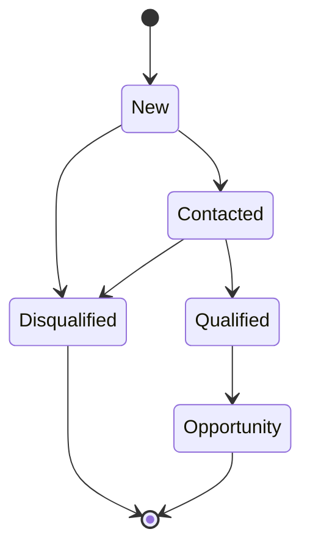
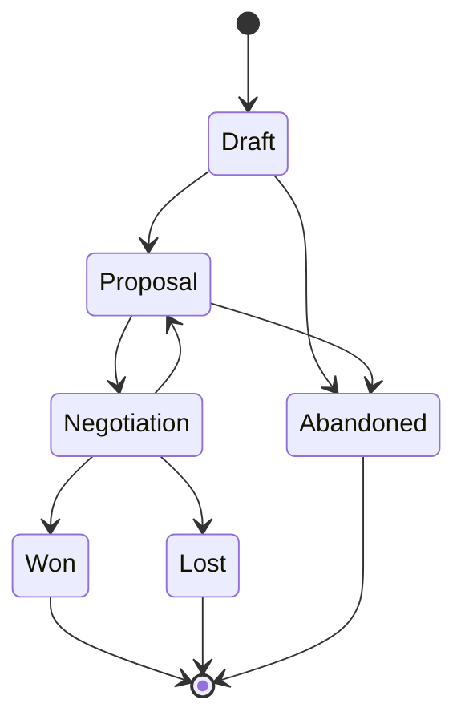

# ADR-054: JoineryTech CRM Domain Model Design

**Status:** DRAFT
**Date:** 2026-07-01
**Epic:** EPIC-JT-CRM
**Author:** Architect Terminal
**Reviewers:** Backend, Conductor

---

## Context

The JoineryTech ERP system requires a **Customer Relationship Management (CRM)** module to manage the commercial funnel from initial contact to quote creation. The CRM module sits **before** the existing Sales/Quoting pipeline and provides:

1. **Lead Management** — Track prospects from various sources (web, trade shows, referrals)
2. **Opportunity Management** — Convert qualified leads to opportunities with forecasting
3. **Activity & Task Tracking** — Log interactions and manage follow-ups with SLA monitoring
4. **Sales Integration** — Convert opportunities to quotes seamlessly

**Key Requirements:**
- FSM-based state management (Lead and Opportunity lifecycles)
- Multi-tenant isolation (RLS)
- Audit trail (immutable events)
- Integration with existing Sales and Customer modules
- Activity logging with SLA enforcement

---

## Decision

### 1. Aggregate Boundaries

The CRM domain is modeled as **two independent aggregate roots** with clear boundaries:

#### 1.1 Lead Aggregate

```
Lead (Aggregate Root)
├── LeadId (Guid)
├── Status (LeadStatus enum)
├── Source (LeadSource enum)
├── ContactInfo (Value Object)
│   ├── Name
│   ├── Email
│   ├── Phone
│   └── Company
├── AssignedTo (UserId)
├── Activities (Entity Collection)
│   └── Activity { Type, Timestamp, Description, CreatedBy }
├── Tasks (Entity Collection)
│   └── Task { Title, DueDate, Completed, Priority }
├── OpportunityRef (Guid?) ← Nullable, set when converted
├── CreatedAt / UpdatedAt
└── TenantId
```

**Invariants:**
- Status transitions must follow FSM rules (see §2.1)
- Cannot convert to Opportunity unless status = `Qualified`
- OpportunityRef is immutable once set
- All activities/tasks must have valid CreatedBy user

#### 1.2 Opportunity Aggregate

```
Opportunity (Aggregate Root)
├── OpportunityId (Guid)
├── Status (OpportunityStatus enum)
├── LeadRef (Guid?) ← Nullable, set if converted from Lead
├── ContactInfo (Value Object) ← Copied from Lead or manually entered
├── EstimatedValue (Money Value Object)
│   ├── Amount
│   └── Currency (default: HUF)
├── Probability (decimal 0-100)
├── ExpectedCloseDate (DateTime)
├── AssignedTo (UserId)
├── Activities (Entity Collection)
├── Tasks (Entity Collection)
├── QuoteRef (Guid?) ← Nullable, set when converted to Quote
├── B2BPartnerRef (Guid?) ← For B2B delegation
├── CreatedAt / UpdatedAt / ClosedAt
└── TenantId
```

**Invariants:**
- Status transitions must follow FSM rules (see §2.2)
- EstimatedValue must be > 0
- Probability must be 0-100 (validated per status)
- Cannot convert to Quote unless status = `Proposal` or `Negotiation`
- QuoteRef is immutable once set

---

### 2. Finite State Machines (FSM)

#### 2.1 Lead FSM



**State Definitions:**

| Status | Description | Probability | Next States |
|--------|-------------|-------------|-------------|
| **New** | Initial state, not yet contacted | 0% | Contacted, Disqualified |
| **Contacted** | First contact made, pending qualification | 10% | Qualified, Disqualified |
| **Qualified** | Meets criteria, ready for opportunity conversion | 25% | Opportunity (conversion) |
| **Disqualified** | Does not meet criteria | 0% | (terminal) |
| **Opportunity** | Converted to Opportunity | N/A | (terminal) |

**Transition Validation:**
- `New → Disqualified`: Requires `DisqualificationReason` (string, mandatory)
- `Contacted → Qualified`: Requires at least 1 Activity logged
- `Qualified → Opportunity`: Triggers `ConvertLeadToOpportunity` command

**Events Raised:**
- `LeadCreated`
- `LeadContacted`
- `LeadQualified`
- `LeadDisqualified`
- `LeadConvertedToOpportunity`

#### 2.2 Opportunity FSM



**State Definitions:**

| Status | Description | Probability | Next States |
|--------|-------------|-------------|-------------|
| **Draft** | Initial planning, not yet proposed | 10% | Proposal, Abandoned |
| **Proposal** | Proposal submitted to customer | 30% | Negotiation, Abandoned |
| **Negotiation** | Active negotiation phase | 60% | Won, Lost, Proposal (revision) |
| **Won** | Customer accepted, convert to Quote | 100% | (terminal) |
| **Lost** | Customer rejected or went elsewhere | 0% | (terminal) |
| **Abandoned** | Opportunity no longer pursued | 0% | (terminal) |

**Transition Validation:**
- `Draft → Proposal`: Requires `EstimatedValue > 0` and `ExpectedCloseDate` set
- `Negotiation → Won`: Triggers `ConvertOpportunityToQuote` command
- `Negotiation → Lost`: Requires `LossReason` (string, mandatory)
- `* → Abandoned`: Requires `AbandonmentReason` (string, mandatory)

**Events Raised:**
- `OpportunityCreated`
- `OpportunityProposed`
- `OpportunityNegotiated`
- `OpportunityWon`
- `OpportunityLost`
- `OpportunityAbandoned`
- `OpportunityRevisedToProposal`

---

### 3. Value Objects

#### 3.1 ContactInfo

```csharp
public sealed class ContactInfo : ValueObject
{
    public string Name { get; }
    public Email Email { get; }
    public PhoneNumber? Phone { get; }
    public string? Company { get; }

    public ContactInfo(string name, Email email, PhoneNumber? phone, string? company)
    {
        if (string.IsNullOrWhiteSpace(name))
            throw new ArgumentException("Name is required", nameof(name));

        Name = name;
        Email = email ?? throw new ArgumentNullException(nameof(email));
        Phone = phone;
        Company = company;
    }

    protected override IEnumerable<object> GetEqualityComponents()
    {
        yield return Name;
        yield return Email;
        yield return Phone ?? string.Empty;
        yield return Company ?? string.Empty;
    }
}
```

#### 3.2 Money (EstimatedValue)

```csharp
public sealed class Money : ValueObject
{
    public decimal Amount { get; }
    public Currency Currency { get; }

    public Money(decimal amount, Currency currency)
    {
        if (amount < 0)
            throw new ArgumentException("Amount cannot be negative", nameof(amount));

        Amount = amount;
        Currency = currency;
    }

    public Money Add(Money other)
    {
        if (Currency != other.Currency)
            throw new InvalidOperationException("Cannot add money with different currencies");

        return new Money(Amount + other.Amount, Currency);
    }

    protected override IEnumerable<object> GetEqualityComponents()
    {
        yield return Amount;
        yield return Currency;
    }
}

public enum Currency
{
    HUF = 1,
    EUR = 2,
    USD = 3
}
```

#### 3.3 Activity (Logged Interaction)

```csharp
public sealed class Activity : Entity
{
    public Guid ActivityId { get; }
    public ActivityType Type { get; }
    public DateTime Timestamp { get; }
    public string Description { get; }
    public Guid CreatedBy { get; }

    // Factory method
    public static Activity Log(ActivityType type, string description, Guid createdBy)
    {
        return new Activity
        {
            ActivityId = Guid.NewGuid(),
            Type = type,
            Timestamp = DateTime.UtcNow,
            Description = description,
            CreatedBy = createdBy
        };
    }
}

public enum ActivityType
{
    Call = 1,
    Email = 2,
    Meeting = 3,
    Note = 4
}
```

#### 3.4 CrmTask (Follow-up Task)

```csharp
public sealed class CrmTask : Entity
{
    public Guid TaskId { get; }
    public string Title { get; }
    public DateTime DueDate { get; }
    public bool Completed { get; private set; }
    public CrmTaskPriority Priority { get; }
    public Guid CreatedBy { get; }

    public void Complete()
    {
        Completed = true;
    }

    public bool IsOverdue() => !Completed && DateTime.UtcNow > DueDate;
}

public enum CrmTaskPriority
{
    Low = 1,
    Medium = 2,
    High = 3,
    Critical = 4
}
```

---

### 4. Domain Events Catalog

#### 4.1 Lead Events

| Event | Payload | Raised When |
|-------|---------|-------------|
| `LeadCreated` | `{ LeadId, ContactInfo, Source, AssignedTo, TenantId }` | New lead created |
| `LeadContacted` | `{ LeadId, ActivityId, ContactedBy }` | Status → Contacted |
| `LeadQualified` | `{ LeadId, QualifiedBy }` | Status → Qualified |
| `LeadDisqualified` | `{ LeadId, Reason, DisqualifiedBy }` | Status → Disqualified |
| `LeadConvertedToOpportunity` | `{ LeadId, OpportunityId, ConvertedBy }` | Lead → Opportunity conversion |
| `LeadActivityAdded` | `{ LeadId, ActivityId, Type, Description }` | Activity logged |
| `LeadTaskAdded` | `{ LeadId, TaskId, Title, DueDate }` | Task created |
| `LeadTaskCompleted` | `{ LeadId, TaskId, CompletedBy }` | Task completed |

#### 4.2 Opportunity Events

| Event | Payload | Raised When |
|-------|---------|-------------|
| `OpportunityCreated` | `{ OpportunityId, LeadRef, ContactInfo, EstimatedValue, AssignedTo, TenantId }` | New opportunity created |
| `OpportunityProposed` | `{ OpportunityId, EstimatedValue, ExpectedCloseDate }` | Status → Proposal |
| `OpportunityNegotiated` | `{ OpportunityId, UpdatedValue?, UpdatedProbability? }` | Status → Negotiation |
| `OpportunityWon` | `{ OpportunityId, FinalValue, QuoteRef, WonBy }` | Status → Won |
| `OpportunityLost` | `{ OpportunityId, Reason, LostBy }` | Status → Lost |
| `OpportunityAbandoned` | `{ OpportunityId, Reason, AbandonedBy }` | Status → Abandoned |
| `OpportunityRevisedToProposal` | `{ OpportunityId, RevisionReason }` | Negotiation → Proposal (revision) |
| `OpportunityActivityAdded` | `{ OpportunityId, ActivityId, Type, Description }` | Activity logged |
| `OpportunityTaskAdded` | `{ OpportunityId, TaskId, Title, DueDate }` | Task created |
| `OpportunityTaskCompleted` | `{ OpportunityId, TaskId, CompletedBy }` | Task completed |
| `OpportunityDelegatedToPartner` | `{ OpportunityId, PartnerId, B2BHandshakeId }` | B2B delegation |

---

### 5. Integration Contracts

#### 5.1 CRM → Sales Integration

**Use Case:** Convert Opportunity to Quote

**Command:** `ConvertOpportunityToQuoteCommand`

```csharp
public sealed class ConvertOpportunityToQuoteCommand : IRequest<Guid>
{
    public Guid OpportunityId { get; init; }
    public Guid CustomerId { get; init; }  // Created or existing customer
    public Guid RequestedBy { get; init; }
}
```

**Handler Logic:**
1. Load Opportunity aggregate (validate status = Proposal or Negotiation)
2. Check `crm.manage` AND `quote.create` permissions
3. Call Sales module: `CreateQuoteFromOpportunity` integration service
4. Update Opportunity: Set `QuoteRef` and transition to `Won`
5. Publish `OpportunityWon` event

**Integration Service Interface:**

```csharp
// SpaceOS.Modules.Sales.Contracts
public interface IQuoteCreationService
{
    Task<QuoteId> CreateQuoteFromOpportunityAsync(
        Guid opportunityId,
        Guid customerId,
        ContactInfo contactInfo,
        Money estimatedValue,
        Guid createdBy,
        Guid tenantId,
        CancellationToken ct = default);
}
```

**Implementation (Sales Module):**
- Creates new Quote with:
  - Customer: `customerId`
  - Initial line items: Empty (manual entry by sales)
  - Reference: `opportunityRef` metadata field
  - Status: `draft`
- Returns `QuoteId` for CRM to reference

#### 5.2 CRM → Identity Integration

**Use Case:** Validate user exists (for assignment, activity logging)

**Service Interface:**

```csharp
// SpaceOS.Modules.Identity.Contracts
public interface IUserValidationService
{
    Task<bool> UserExistsAsync(Guid userId, Guid tenantId, CancellationToken ct = default);
    Task<UserInfo> GetUserInfoAsync(Guid userId, Guid tenantId, CancellationToken ct = default);
}
```

**Usage in CRM:**
- Lead assignment: Validate `AssignedTo` user exists
- Activity creation: Validate `CreatedBy` user exists
- Opportunity ownership transfer

#### 5.3 CRM → Customer Integration

**Use Case:** Webshop inquiry auto-creates Lead

**Integration Service:**

```csharp
// SpaceOS.Modules.CRM.Contracts
public interface ILeadCreationService
{
    Task<LeadId> CreateLeadFromWebshopInquiryAsync(
        ContactInfo contactInfo,
        string inquiryDetails,
        Guid tenantId,
        CancellationToken ct = default);
}
```

**Implementation:**
- Creates Lead with:
  - Status: `New`
  - Source: `Webshop`
  - AssignedTo: Default sales user (configurable per tenant)
  - Auto-creates first Activity: "Webshop inquiry received"

---

### 6. Database Schema

#### 6.1 Leads Table

```sql
CREATE TABLE crm.leads (
    lead_id UUID PRIMARY KEY DEFAULT gen_random_uuid(),
    status VARCHAR(20) NOT NULL,  -- FSM state
    source VARCHAR(50) NOT NULL,  -- Webshop, TradeShow, Referral, Cold, etc.

    -- Contact Info (denormalized value object)
    contact_name VARCHAR(255) NOT NULL,
    contact_email VARCHAR(255) NOT NULL,
    contact_phone VARCHAR(50),
    contact_company VARCHAR(255),

    assigned_to UUID NOT NULL,  -- FK to Identity.Users
    opportunity_ref UUID,  -- FK to crm.opportunities (nullable, immutable)

    disqualification_reason TEXT,  -- Mandatory if status = Disqualified

    created_at TIMESTAMPTZ NOT NULL DEFAULT NOW(),
    updated_at TIMESTAMPTZ NOT NULL DEFAULT NOW(),
    tenant_id UUID NOT NULL,

    CONSTRAINT fk_leads_tenant FOREIGN KEY (tenant_id) REFERENCES kernel.tenants(id),
    CONSTRAINT fk_leads_opportunity FOREIGN KEY (opportunity_ref) REFERENCES crm.opportunities(opportunity_id),
    CONSTRAINT chk_lead_status CHECK (status IN ('New', 'Contacted', 'Qualified', 'Disqualified', 'Opportunity'))
);

-- RLS Policy
ALTER TABLE crm.leads ENABLE ROW LEVEL SECURITY;

CREATE POLICY tenant_isolation ON crm.leads
    USING (tenant_id = current_setting('app.current_tenant')::uuid);

-- Indexes
CREATE INDEX idx_leads_tenant_status ON crm.leads(tenant_id, status);
CREATE INDEX idx_leads_assigned_to ON crm.leads(assigned_to);
CREATE INDEX idx_leads_created_at ON crm.leads(created_at DESC);
```

#### 6.2 Opportunities Table

```sql
CREATE TABLE crm.opportunities (
    opportunity_id UUID PRIMARY KEY DEFAULT gen_random_uuid(),
    status VARCHAR(20) NOT NULL,  -- FSM state
    lead_ref UUID,  -- FK to crm.leads (nullable)

    -- Contact Info (denormalized value object)
    contact_name VARCHAR(255) NOT NULL,
    contact_email VARCHAR(255) NOT NULL,
    contact_phone VARCHAR(50),
    contact_company VARCHAR(255),

    -- Forecast
    estimated_value_amount DECIMAL(18, 2) NOT NULL,
    estimated_value_currency VARCHAR(3) NOT NULL DEFAULT 'HUF',
    probability DECIMAL(5, 2) NOT NULL,  -- 0-100
    expected_close_date DATE,

    assigned_to UUID NOT NULL,  -- FK to Identity.Users
    quote_ref UUID,  -- FK to Sales.Quotes (nullable, immutable)
    b2b_partner_ref UUID,  -- FK to Partners (nullable)

    loss_reason TEXT,  -- Mandatory if status = Lost
    abandonment_reason TEXT,  -- Mandatory if status = Abandoned

    created_at TIMESTAMPTZ NOT NULL DEFAULT NOW(),
    updated_at TIMESTAMPTZ NOT NULL DEFAULT NOW(),
    closed_at TIMESTAMPTZ,  -- Set when Won/Lost/Abandoned
    tenant_id UUID NOT NULL,

    CONSTRAINT fk_opportunities_tenant FOREIGN KEY (tenant_id) REFERENCES kernel.tenants(id),
    CONSTRAINT fk_opportunities_lead FOREIGN KEY (lead_ref) REFERENCES crm.leads(lead_id),
    CONSTRAINT chk_opportunity_status CHECK (status IN ('Draft', 'Proposal', 'Negotiation', 'Won', 'Lost', 'Abandoned')),
    CONSTRAINT chk_opportunity_probability CHECK (probability >= 0 AND probability <= 100),
    CONSTRAINT chk_opportunity_value CHECK (estimated_value_amount > 0)
);

-- RLS Policy
ALTER TABLE crm.opportunities ENABLE ROW LEVEL SECURITY;

CREATE POLICY tenant_isolation ON crm.opportunities
    USING (tenant_id = current_setting('app.current_tenant')::uuid);

-- Indexes
CREATE INDEX idx_opportunities_tenant_status ON crm.opportunities(tenant_id, status);
CREATE INDEX idx_opportunities_assigned_to ON crm.opportunities(assigned_to);
CREATE INDEX idx_opportunities_expected_close ON crm.opportunities(expected_close_date) WHERE status IN ('Proposal', 'Negotiation');
```

#### 6.3 Activities Table

```sql
CREATE TABLE crm.activities (
    activity_id UUID PRIMARY KEY DEFAULT gen_random_uuid(),
    entity_type VARCHAR(20) NOT NULL,  -- 'Lead' or 'Opportunity'
    entity_id UUID NOT NULL,  -- lead_id or opportunity_id

    activity_type VARCHAR(50) NOT NULL,  -- Call, Email, Meeting, Note
    description TEXT NOT NULL,
    timestamp TIMESTAMPTZ NOT NULL DEFAULT NOW(),
    created_by UUID NOT NULL,  -- FK to Identity.Users
    tenant_id UUID NOT NULL,

    CONSTRAINT fk_activities_tenant FOREIGN KEY (tenant_id) REFERENCES kernel.tenants(id),
    CONSTRAINT chk_activity_entity_type CHECK (entity_type IN ('Lead', 'Opportunity')),
    CONSTRAINT chk_activity_type CHECK (activity_type IN ('Call', 'Email', 'Meeting', 'Note'))
);

-- RLS Policy
ALTER TABLE crm.activities ENABLE ROW LEVEL SECURITY;

CREATE POLICY tenant_isolation ON crm.activities
    USING (tenant_id = current_setting('app.current_tenant')::uuid);

-- Indexes
CREATE INDEX idx_activities_entity ON crm.activities(entity_type, entity_id);
CREATE INDEX idx_activities_timestamp ON crm.activities(timestamp DESC);
```

#### 6.4 Tasks Table

```sql
CREATE TABLE crm.tasks (
    task_id UUID PRIMARY KEY DEFAULT gen_random_uuid(),
    entity_type VARCHAR(20) NOT NULL,  -- 'Lead' or 'Opportunity'
    entity_id UUID NOT NULL,  -- lead_id or opportunity_id

    title VARCHAR(500) NOT NULL,
    due_date DATE NOT NULL,
    completed BOOLEAN NOT NULL DEFAULT FALSE,
    priority VARCHAR(20) NOT NULL DEFAULT 'Medium',  -- Low, Medium, High, Critical

    created_by UUID NOT NULL,  -- FK to Identity.Users
    created_at TIMESTAMPTZ NOT NULL DEFAULT NOW(),
    tenant_id UUID NOT NULL,

    CONSTRAINT fk_tasks_tenant FOREIGN KEY (tenant_id) REFERENCES kernel.tenants(id),
    CONSTRAINT chk_task_entity_type CHECK (entity_type IN ('Lead', 'Opportunity')),
    CONSTRAINT chk_task_priority CHECK (priority IN ('Low', 'Medium', 'High', 'Critical'))
);

-- RLS Policy
ALTER TABLE crm.tasks ENABLE ROW LEVEL SECURITY;

CREATE POLICY tenant_isolation ON crm.tasks
    USING (tenant_id = current_setting('app.current_tenant')::uuid);

-- Indexes
CREATE INDEX idx_tasks_entity ON crm.tasks(entity_type, entity_id);
CREATE INDEX idx_tasks_overdue ON crm.tasks(due_date) WHERE completed = FALSE;
CREATE INDEX idx_tasks_created_by ON crm.tasks(created_by) WHERE completed = FALSE;
```

---

### 7. CQRS Command/Query Handlers

#### 7.1 Commands (Write Side)

| Command | Handler | Events Raised |
|---------|---------|---------------|
| `CreateLeadCommand` | `CreateLeadCommandHandler` | `LeadCreated` |
| `ContactLeadCommand` | `ContactLeadCommandHandler` | `LeadContacted` |
| `QualifyLeadCommand` | `QualifyLeadCommandHandler` | `LeadQualified` |
| `DisqualifyLeadCommand` | `DisqualifyLeadCommandHandler` | `LeadDisqualified` |
| `ConvertLeadToOpportunityCommand` | `ConvertLeadToOpportunityCommandHandler` | `LeadConvertedToOpportunity`, `OpportunityCreated` |
| `AddLeadActivityCommand` | `AddLeadActivityCommandHandler` | `LeadActivityAdded` |
| `AddLeadTaskCommand` | `AddLeadTaskCommandHandler` | `LeadTaskAdded` |
| `CreateOpportunityCommand` | `CreateOpportunityCommandHandler` | `OpportunityCreated` |
| `ProposeOpportunityCommand` | `ProposeOpportunityCommandHandler` | `OpportunityProposed` |
| `NegotiateOpportunityCommand` | `NegotiateOpportunityCommandHandler` | `OpportunityNegotiated` |
| `WinOpportunityCommand` | `WinOpportunityCommandHandler` | `OpportunityWon` |
| `LoseOpportunityCommand` | `LoseOpportunityCommandHandler` | `OpportunityLost` |
| `AbandonOpportunityCommand` | `AbandonOpportunityCommandHandler` | `OpportunityAbandoned` |
| `ConvertOpportunityToQuoteCommand` | `ConvertOpportunityToQuoteCommandHandler` | `OpportunityWon` |
| `AddOpportunityActivityCommand` | `AddOpportunityActivityCommandHandler` | `OpportunityActivityAdded` |
| `AddOpportunityTaskCommand` | `AddOpportunityTaskCommandHandler` | `OpportunityTaskAdded` |

**Command Structure Example:**

```csharp
// Application/Commands/Lead/CreateLeadCommand.cs
public sealed class CreateLeadCommand : IRequest<Guid>
{
    public ContactInfo ContactInfo { get; init; }
    public LeadSource Source { get; init; }
    public Guid AssignedTo { get; init; }
    public Guid TenantId { get; init; }
}

// Application/Commands/Lead/CreateLeadCommandHandler.cs
public sealed class CreateLeadCommandHandler : IRequestHandler<CreateLeadCommand, Guid>
{
    private readonly ICrmRepository _repository;
    private readonly IUserValidationService _userValidation;
    private readonly IEventBus _eventBus;

    public async Task<Guid> Handle(CreateLeadCommand request, CancellationToken ct)
    {
        // 1. Validate assigned user exists
        var userExists = await _userValidation.UserExistsAsync(request.AssignedTo, request.TenantId, ct);
        if (!userExists)
            throw new ValidationException("Assigned user does not exist");

        // 2. Create Lead aggregate
        var lead = Lead.Create(
            contactInfo: request.ContactInfo,
            source: request.Source,
            assignedTo: request.AssignedTo,
            tenantId: request.TenantId);

        // 3. Persist
        await _repository.AddLeadAsync(lead, ct);

        // 4. Publish event
        await _eventBus.PublishAsync(new LeadCreated
        {
            LeadId = lead.Id,
            ContactInfo = lead.ContactInfo,
            Source = lead.Source,
            AssignedTo = lead.AssignedTo,
            TenantId = lead.TenantId
        }, ct);

        return lead.Id;
    }
}
```

#### 7.2 Queries (Read Side)

| Query | Handler | Returns |
|-------|---------|---------|
| `GetLeadByIdQuery` | `GetLeadByIdQueryHandler` | `LeadDto` |
| `GetLeadsByStatusQuery` | `GetLeadsByStatusQueryHandler` | `List<LeadSummaryDto>` |
| `GetLeadsByAssignedUserQuery` | `GetLeadsByAssignedUserQueryHandler` | `List<LeadSummaryDto>` |
| `GetOpportunityByIdQuery` | `GetOpportunityByIdQueryHandler` | `OpportunityDto` |
| `GetOpportunitiesByStatusQuery` | `GetOpportunitiesByStatusQueryHandler` | `List<OpportunitySummaryDto>` |
| `GetOpportunityForecastQuery` | `GetOpportunityForecastQueryHandler` | `ForecastDto` |
| `GetActivitiesForEntityQuery` | `GetActivitiesForEntityQueryHandler` | `List<ActivityDto>` |
| `GetTasksForEntityQuery` | `GetTasksForEntityQueryHandler` | `List<TaskDto>` |
| `GetOverdueTasksQuery` | `GetOverdueTasksQueryHandler` | `List<TaskDto>` |

**Query Structure Example:**

```csharp
// Application/Queries/Opportunity/GetOpportunityForecastQuery.cs
public sealed class GetOpportunityForecastQuery : IRequest<ForecastDto>
{
    public Guid TenantId { get; init; }
}

// Application/Queries/Opportunity/GetOpportunityForecastQueryHandler.cs
public sealed class GetOpportunityForecastQueryHandler : IRequestHandler<GetOpportunityForecastQuery, ForecastDto>
{
    private readonly ICrmReadRepository _readRepository;

    public async Task<ForecastDto> Handle(GetOpportunityForecastQuery request, CancellationToken ct)
    {
        var opportunities = await _readRepository.GetActiveOpportunitiesAsync(request.TenantId, ct);

        var pipelineValue = opportunities
            .Where(o => o.Status != OpportunityStatus.Won && o.Status != OpportunityStatus.Lost)
            .Sum(o => o.EstimatedValue.Amount);

        var weightedValue = opportunities
            .Where(o => o.Status != OpportunityStatus.Won && o.Status != OpportunityStatus.Lost)
            .Sum(o => o.EstimatedValue.Amount * (o.Probability / 100m));

        var wonValue = opportunities
            .Where(o => o.Status == OpportunityStatus.Won)
            .Sum(o => o.EstimatedValue.Amount);

        var byPhase = opportunities
            .GroupBy(o => o.Status)
            .Select(g => new PhaseBreakdown
            {
                Status = g.Key.ToString(),
                Count = g.Count(),
                TotalValue = g.Sum(o => o.EstimatedValue.Amount)
            })
            .ToList();

        return new ForecastDto
        {
            PipelineValue = pipelineValue,
            WeightedValue = weightedValue,
            WonValue = wonValue,
            ByPhase = byPhase
        };
    }
}
```

---

### 8. API Endpoints

#### 8.1 Lead Endpoints

| Method | Endpoint | Command/Query | Auth |
|--------|----------|---------------|------|
| POST | `/api/crm/leads` | `CreateLeadCommand` | `crm.manage` |
| GET | `/api/crm/leads/{id}` | `GetLeadByIdQuery` | `crm.view` |
| GET | `/api/crm/leads?status={status}` | `GetLeadsByStatusQuery` | `crm.view` |
| PUT | `/api/crm/leads/{id}/contact` | `ContactLeadCommand` | `crm.manage` |
| PUT | `/api/crm/leads/{id}/qualify` | `QualifyLeadCommand` | `crm.manage` |
| PUT | `/api/crm/leads/{id}/disqualify` | `DisqualifyLeadCommand` | `crm.manage` |
| POST | `/api/crm/leads/{id}/convert` | `ConvertLeadToOpportunityCommand` | `crm.manage` |
| POST | `/api/crm/leads/{id}/activities` | `AddLeadActivityCommand` | `crm.manage` |
| POST | `/api/crm/leads/{id}/tasks` | `AddLeadTaskCommand` | `crm.manage` |

#### 8.2 Opportunity Endpoints

| Method | Endpoint | Command/Query | Auth |
|--------|----------|---------------|------|
| POST | `/api/crm/opportunities` | `CreateOpportunityCommand` | `crm.manage` |
| GET | `/api/crm/opportunities/{id}` | `GetOpportunityByIdQuery` | `crm.view` |
| GET | `/api/crm/opportunities?status={status}` | `GetOpportunitiesByStatusQuery` | `crm.view` |
| GET | `/api/crm/opportunities/forecast` | `GetOpportunityForecastQuery` | `crm.view` |
| PUT | `/api/crm/opportunities/{id}/propose` | `ProposeOpportunityCommand` | `crm.manage` |
| PUT | `/api/crm/opportunities/{id}/negotiate` | `NegotiateOpportunityCommand` | `crm.manage` |
| PUT | `/api/crm/opportunities/{id}/win` | `WinOpportunityCommand` | `crm.manage` |
| PUT | `/api/crm/opportunities/{id}/lose` | `LoseOpportunityCommand` | `crm.manage` |
| PUT | `/api/crm/opportunities/{id}/abandon` | `AbandonOpportunityCommand` | `crm.manage` |
| POST | `/api/crm/opportunities/{id}/convert-to-quote` | `ConvertOpportunityToQuoteCommand` | `crm.manage` + `quote.create` |
| POST | `/api/crm/opportunities/{id}/activities` | `AddOpportunityActivityCommand` | `crm.manage` |
| POST | `/api/crm/opportunities/{id}/tasks` | `AddOpportunityTaskCommand` | `crm.manage` |

---

### 9. Testing Strategy

#### 9.1 Unit Tests (Domain Layer)

```csharp
// Domain.UnitTests/LeadTests.cs
public class LeadTests
{
    [Fact]
    public void Lead_Create_ShouldSetStatusToNew()
    {
        // Arrange
        var contactInfo = new ContactInfo("John Doe", new Email("john@example.com"), null, "ACME Corp");

        // Act
        var lead = Lead.Create(contactInfo, LeadSource.Webshop, Guid.NewGuid(), Guid.NewGuid());

        // Assert
        Assert.Equal(LeadStatus.New, lead.Status);
        Assert.NotEqual(Guid.Empty, lead.Id);
    }

    [Fact]
    public void Lead_Contact_ShouldTransitionToContacted()
    {
        // Arrange
        var lead = Lead.Create(/* ... */);

        // Act
        lead.Contact();

        // Assert
        Assert.Equal(LeadStatus.Contacted, lead.Status);
    }

    [Fact]
    public void Lead_Qualify_FromNew_ShouldThrowException()
    {
        // Arrange
        var lead = Lead.Create(/* ... */);

        // Act & Assert
        Assert.Throws<InvalidOperationException>(() => lead.Qualify());
    }

    [Fact]
    public void Lead_ConvertToOpportunity_FromQualified_ShouldReturnOpportunity()
    {
        // Arrange
        var lead = Lead.Create(/* ... */);
        lead.Contact();
        lead.Qualify();

        // Act
        var opportunity = lead.ConvertToOpportunity(estimatedValue: new Money(100000, Currency.HUF));

        // Assert
        Assert.Equal(LeadStatus.Opportunity, lead.Status);
        Assert.NotNull(lead.OpportunityRef);
        Assert.Equal(opportunity.Id, lead.OpportunityRef);
    }
}
```

#### 9.2 Integration Tests (API + Database)

```csharp
// Api.IntegrationTests/LeadEndpointsTests.cs
public class LeadEndpointsTests : IClassFixture<WebApplicationFactory<Program>>
{
    private readonly HttpClient _client;

    [Fact]
    public async Task POST_Leads_ReturnsCreated()
    {
        // Arrange
        var request = new CreateLeadRequest
        {
            ContactInfo = new ContactInfoDto
            {
                Name = "John Doe",
                Email = "john@example.com",
                Phone = "+36301234567",
                Company = "ACME Corp"
            },
            Source = "Webshop",
            AssignedTo = Guid.NewGuid()
        };

        // Act
        var response = await _client.PostAsJsonAsync("/api/crm/leads", request);

        // Assert
        Assert.Equal(HttpStatusCode.Created, response.StatusCode);
        var leadId = await response.Content.ReadFromJsonAsync<Guid>();
        Assert.NotEqual(Guid.Empty, leadId);
    }

    [Fact]
    public async Task PUT_LeadQualify_InvalidTransition_ReturnsBadRequest()
    {
        // Arrange (create lead in New status)
        var leadId = await CreateLeadAsync();

        // Act (try to qualify without contacting first)
        var response = await _client.PutAsync($"/api/crm/leads/{leadId}/qualify", null);

        // Assert
        Assert.Equal(HttpStatusCode.BadRequest, response.StatusCode);
    }
}
```

---

### 10. Performance & Scalability Considerations

#### 10.1 Indexing Strategy

- **Tenant isolation:** `(tenant_id, status)` composite index on all tables
- **User-based queries:** `assigned_to` index for "My Leads/Opportunities" views
- **Date-based queries:** `created_at DESC` for recent items, `expected_close_date` for pipeline reports
- **Overdue tasks:** Partial index `WHERE completed = FALSE` to optimize SLA monitoring

#### 10.2 Caching Strategy

- **Forecast calculations:** Cache per tenant for 5 minutes (invalidate on Opportunity status change)
- **User assignments:** Cache user info for 1 hour (invalidate on user update)
- **Activity counts:** Real-time, no caching (low volume)

#### 10.3 Archival Strategy

- **Closed opportunities:** Archive to `crm.opportunities_archive` after 2 years (Won/Lost/Abandoned)
- **Disqualified leads:** Archive to `crm.leads_archive` after 1 year
- **Activities/Tasks:** Keep indefinitely (audit trail)

---

## Consequences

### Positive

1. **Clear Boundaries:** Lead and Opportunity are independent aggregates with well-defined FSMs
2. **Integration Ready:** Contracts defined for Sales, Identity, and Customer modules
3. **Audit Trail:** Immutable events provide full history of CRM activities
4. **Multi-Tenant:** RLS policies ensure tenant isolation
5. **Testable:** CQRS pattern enables unit testing of business logic
6. **Scalable:** Indexed queries and caching strategy support growth

### Negative

1. **Complexity:** Two aggregates + FSMs + events add cognitive load
2. **Integration Coordination:** Requires Sales and Identity modules to implement contracts
3. **Data Duplication:** ContactInfo denormalized across Lead and Opportunity tables
4. **Forecast Performance:** Calculation-heavy queries may require optimization as data grows

### Risks

| Risk | Mitigation |
|------|------------|
| **FSM Transition Bugs** | Comprehensive unit tests + integration tests for all transitions |
| **Orphaned References** | Foreign key constraints + periodic reconciliation job |
| **Forecast Calculation Slow** | Caching + pre-aggregated materialized view |
| **Activity Log Growth** | Archival strategy + partitioning by year |

---

## Implementation Plan

### Phase 1: Domain Layer (Week 1)

1. Implement Lead and Opportunity aggregates
2. Implement Value Objects (ContactInfo, Money, Activity, CrmTask)
3. Unit tests for all domain logic
4. FSM transition validation

### Phase 2: Application Layer (Week 2)

1. Implement Command Handlers (Create, Transition, Activity/Task management)
2. Implement Query Handlers (Read models, Forecast calculation)
3. Integration with MediatR
4. Integration tests (in-memory repository)

### Phase 3: Infrastructure Layer (Week 3)

1. Database migrations (tables, indexes, RLS policies)
2. Repository implementations (EF Core)
3. Event bus integration (in-process or RabbitMQ)
4. Integration with Identity module

### Phase 4: API Layer (Week 4)

1. REST API controllers
2. OpenAPI documentation
3. Authorization policies (`crm.manage`, `crm.view`)
4. API integration tests (Testcontainers)

### Phase 5: Integration with Sales (Week 5)

1. Implement `IQuoteCreationService` in Sales module
2. Test Opportunity → Quote conversion flow
3. E2E test: Lead → Opportunity → Quote

---

## References

- **ADR-002:** Modular Monolith — IParametricProduct interface
- **ADR-003:** Immutability & Audit Trail — SHA-256 hashed events
- **ADR-004:** Role-Based Access Control (RBAC) — Need-to-Know
- **ADR-051:** CQRS Handler Generator
- **ADR-052:** FSM Subscription System
- **Event Sourcing Patterns:** `/opt/spaceos/docs/knowledge/patterns/EVENT_SOURCING_PATTERNS.md`
- **JoineryTech CRM Spec:** `/opt/spaceos/docs/joinerytech/CLAUDE.md` (§CRM / Lead-pipeline)
- **DDD Blue Book:** Eric Evans, "Domain-Driven Design" (2003)
- **CQRS Journey:** Microsoft, "CQRS Journey" (2012)

---

## Appendix A: Calculated Fields (Not Stored)

The following fields are **computed at query time** and must NOT be stored in the database:

### Lead Conversion Rate

```csharp
public decimal CalculateLeadConversionRate(Guid tenantId)
{
    var totalQualified = _context.Leads
        .Where(l => l.TenantId == tenantId && l.Status == LeadStatus.Qualified)
        .Count();

    var totalConverted = _context.Leads
        .Where(l => l.TenantId == tenantId && l.Status == LeadStatus.Opportunity)
        .Count();

    return totalQualified > 0 ? (decimal)totalConverted / totalQualified : 0;
}
```

### Opportunity Win Rate

```csharp
public decimal CalculateWinRate(Guid tenantId)
{
    var totalClosed = _context.Opportunities
        .Where(o => o.TenantId == tenantId &&
                    (o.Status == OpportunityStatus.Won || o.Status == OpportunityStatus.Lost))
        .Count();

    var totalWon = _context.Opportunities
        .Where(o => o.TenantId == tenantId && o.Status == OpportunityStatus.Won)
        .Count();

    return totalClosed > 0 ? (decimal)totalWon / totalClosed : 0;
}
```

### Weighted Opportunity Value

```csharp
public Money CalculateWeightedValue(Opportunity opportunity)
{
    return new Money(
        opportunity.EstimatedValue.Amount * (opportunity.Probability / 100m),
        opportunity.EstimatedValue.Currency
    );
}
```

### Task SLA Status

```csharp
public TaskSlaStatus CalculateTaskSla(CrmTask task)
{
    if (task.Completed)
        return TaskSlaStatus.Completed;

    var now = DateTime.UtcNow;
    var daysUntilDue = (task.DueDate.Date - now.Date).Days;

    if (daysUntilDue < 0)
        return TaskSlaStatus.Overdue;
    else if (daysUntilDue <= 1)
        return TaskSlaStatus.DueSoon;
    else
        return TaskSlaStatus.OnTrack;
}

public enum TaskSlaStatus
{
    OnTrack,
    DueSoon,
    Overdue,
    Completed
}
```

---

**END OF ADR-054**
