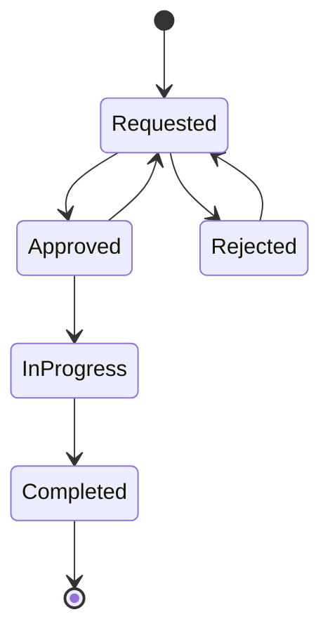

# ADR-056: JoineryTech HR (Human Resources) Domain Model Design

**Status:** DRAFT
**Date:** 2026-07-01
**Epic:** EPIC-JT-HR
**Author:** Architect Terminal
**Reviewers:** Backend, Conductor

---

## Context

The JoineryTech ERP system requires a **Human Resources (HR)** module to manage employee master data, capacity planning, absences, and time tracking. The HR module is a **shared resource layer** across multiple modules (Production, Logistics, Maintenance) and must provide real-time capacity calculations without duplicating employee data.

**Key Requirements:**
1. **Employee Master Data** — Single source of truth for all employees
2. **Capacity Calculation** — Daily available capacity considering assignments, absences, and logistics
3. **Absence Management** — FSM-based absence request workflow with approval
4. **Time Logging** — Work hour tracking for labor cost integration with Controlling
5. **Skills & Pay Grades** — Employee competency and payroll integration
6. **Personal Data** — Sensitive employee information (GDPR-compliant)
7. **Vacation Balance** — Calculated entitlement based on base days + child benefits

**Design Philosophy:**
- **One source of truth** — `employees[]` is the canonical employee registry
- **Calculated capacity** — No stored capacity values, always computed from assignments + absences
- **FSM for approvals** — Absence requests follow a state machine workflow
- **Integration-first** — HR feeds Controlling (labor cost), Production (capacity), Logistics (crew members)

---

## Decision

### 1. Aggregate Boundaries

The HR domain has **THREE primary aggregates**:

#### 1.1 Employee (Aggregate Root)

```
Employee (Aggregate Root)
├── EmployeeId (Guid)
├── Name (string)
├── Initials (string, 2-3 chars)
├── Role (EmployeeRole enum)
├── Department (Department enum)
├── FacilityId (Guid?)
├── PayGrade (PayGrade enum)
├── WeeklyHours (decimal) ← Full-time = 40, Part-time < 40
├── EmploymentType (EmploymentType enum)
├── Skills (Collection<EmployeeSkill>)
│   └── EmployeeSkill { Skill, Level (1-3) }
├── ContactInfo (Value Object)
│   ├── Phone
│   └── Email
├── PersonalData (Value Object — GDPR-protected)
│   ├── Children (int)
│   ├── MaritalStatus
│   ├── BirthDate
│   ├── BirthName
│   ├── BirthPlace
│   ├── MotherName
│   ├── Nationality
│   ├── Address
│   ├── PrivatePhone
│   ├── PrivateEmail
│   ├── EmergencyContactName
│   ├── EmergencyContactPhone
│   ├── TAJ (Social Security Number)
│   ├── TaxId
│   ├── IdCard
│   └── BankAccount
├── VacationBase (int?) ← Base vacation days (default 20)
├── Active (bool)
├── Color (string) ← UI avatar color
├── CreatedAt / UpdatedAt
└── TenantId
```

**Invariants:**
- Name and Initials are required
- WeeklyHours must be > 0 and ≤ 40
- Skills can only have levels 1-3
- PersonalData is nullable (can be empty for privacy)
- VacationBase defaults to 20 if not specified

#### 1.2 Absence (Aggregate Root)

```
Absence (Aggregate Root)
├── AbsenceId (Guid)
├── EmployeeId (Guid) ← FK to Employee
├── Status (AbsenceStatus enum)
├── Type (AbsenceType enum)
├── StartDate (DateTime)
├── EndDate (DateTime)
├── WorkdaysCount (int) ← Calculated: business days in range
├── Reason (string?)
├── RejectionReason (string?) ← Mandatory if status = Rejected
├── RequestedBy (Guid) ← Employee who requested
├── ApprovedBy (Guid?) ← Manager who approved/rejected
├── CreatedAt / UpdatedAt
└── TenantId
```

**Invariants:**
- StartDate ≤ EndDate
- WorkdaysCount is calculated (excludes weekends)
- Status transitions must follow FSM (see §2.1)
- RejectionReason is mandatory if status = Rejected
- Approved/InProgress/Completed absences block capacity

#### 1.3 Assignment (Entity — NOT Aggregate Root)

```
Assignment (Entity)
├── AssignmentId (Guid)
├── EmployeeId (Guid)
├── Source (AssignmentSource enum)
│   ├── Project
│   ├── Maintenance
│   ├── Logistics
│   └── Manual
├── ReferenceId (Guid) ← ProjectId, WorkOrderId, ShipmentId, etc.
├── ReferenceLabel (string)
├── StartDate (DateTime)
├── EndDate (DateTime)
├── HoursPerDay (decimal)
├── CreatedAt
└── TenantId
```

**Purpose:** Tracks employee workload from multiple sources (Projects, Maintenance, Logistics). Assignments are created by other modules and feed into the capacity calculation.

**Invariants:**
- HoursPerDay ≤ DayCapacity (validated at creation)
- StartDate ≤ EndDate
- Source-specific ReferenceId validation

#### 1.4 TimeLog (Entity)

```
TimeLog (Entity)
├── TimeLogId (Guid)
├── EmployeeId (Guid)
├── ProjectId (Guid?)
├── Date (DateTime)
├── Hours (decimal)
├── Description (string?)
├── LoggedBy (Guid)
├── PushedToControlling (bool) ← Has this been synced to Controlling?
├── CreatedAt
└── TenantId
```

**Purpose:** Daily work hour log for labor cost tracking. Integrates with Controlling module.

**Invariants:**
- Hours > 0 and ≤ 24
- Date cannot be in the future
- Once pushed to Controlling, cannot be modified

---

### 2. Finite State Machine (FSM)

#### 2.1 Absence Request FSM



**State Definitions:**

| Status | Description | Blocks Capacity? | Next States |
|--------|-------------|------------------|-------------|
| **Requested** | Initial state, pending approval | ❌ No | Approved, Rejected |
| **Approved** | Manager approved, not yet started | ✅ Yes | InProgress, Requested (cancel) |
| **InProgress** | Absence period has started | ✅ Yes | Completed |
| **Completed** | Absence period has ended | ✅ Yes (for historical balance) | (terminal) |
| **Rejected** | Manager rejected request | ❌ No | Requested (resubmit) |

**Transition Validation:**
- `Requested → Approved`: Requires `hr.manage` permission
- `Requested → Rejected`: Requires `hr.manage` permission + RejectionReason mandatory
- `Approved → InProgress`: Automatic transition when `StartDate ≤ TODAY`
- `InProgress → Completed`: Automatic transition when `EndDate < TODAY`
- `Rejected → Requested`: Allows employee to resubmit with changes

**Events Raised:**
- `AbsenceRequested`
- `AbsenceApproved`
- `AbsenceRejected`
- `AbsenceStarted` (auto)
- `AbsenceCompleted` (auto)

---

### 3. Capacity Calculation Engine

The HR module's core value is **real-time capacity calculation**. Capacity is NEVER stored — always computed from:
1. Employee weekly hours
2. Assignments (from Projects, Maintenance, Logistics)
3. Absences (blocking days)
4. Logistics crew assignments (implicit workload)

#### 3.1 Daily Capacity Formula

```csharp
public sealed class HrEngine
{
    public static decimal DayCapacity(Employee employee)
    {
        return employee.WeeklyHours / 5m; // 5 working days
    }

    public static DayLoad CalculateDayLoad(
        Employee employee,
        DateTime date,
        IEnumerable<Assignment> assignments,
        IEnumerable<Absence> absences,
        IEnumerable<Shipment> shipments)
    {
        var dayCapacity = DayCapacity(employee);

        // 1. Check if employee is absent on this date
        var isAbsent = absences.Any(a =>
            a.EmployeeId == employee.Id &&
            IsBlocking(a.Status) &&
            a.StartDate.Date <= date.Date &&
            a.EndDate.Date >= date.Date);

        if (isAbsent)
        {
            return new DayLoad
            {
                Capacity = dayCapacity,
                Assigned = 0,
                Available = 0,
                Overloaded = false,
                Reason = "Absence"
            };
        }

        // 2. Calculate assigned hours from assignments
        var assignedHours = assignments
            .Where(a =>
                a.EmployeeId == employee.Id &&
                a.StartDate.Date <= date.Date &&
                a.EndDate.Date >= date.Date)
            .Sum(a => a.HoursPerDay);

        // 3. Add logistics crew hours (implicit)
        var logisticsHours = CalculateLogisticsHours(employee, date, shipments);

        var totalAssigned = assignedHours + logisticsHours;
        var available = Math.Max(0, dayCapacity - totalAssigned);
        var overloaded = totalAssigned > dayCapacity;

        return new DayLoad
        {
            Capacity = dayCapacity,
            Assigned = totalAssigned,
            Available = available,
            Overloaded = overloaded
        };
    }

    private static bool IsBlocking(AbsenceStatus status)
    {
        return status == AbsenceStatus.Approved ||
               status == AbsenceStatus.InProgress ||
               status == AbsenceStatus.Completed;
    }
}

public sealed class DayLoad
{
    public decimal Capacity { get; init; }
    public decimal Assigned { get; init; }
    public decimal Available { get; init; }
    public bool Overloaded { get; init; }
    public string? Reason { get; init; }
}
```

#### 3.2 Week Summary

```csharp
public sealed class WeekSummary
{
    public DateTime WeekStart { get; init; } // Monday
    public decimal TotalCapacity { get; init; }
    public decimal TotalAssigned { get; init; }
    public decimal TotalAvailable { get; init; }
    public int OverloadedDays { get; init; }
    public Dictionary<DateTime, DayLoad> DailyBreakdown { get; init; }
}

public static WeekSummary CalculateWeekSummary(
    Employee employee,
    DateTime monday,
    /* ... data sources */)
{
    var days = Enumerable.Range(0, 5)
        .Select(i => monday.AddDays(i))
        .ToList();

    var dailyLoads = days
        .Select(date => (date, load: CalculateDayLoad(employee, date, ...)))
        .ToDictionary(x => x.date, x => x.load);

    return new WeekSummary
    {
        WeekStart = monday,
        TotalCapacity = dailyLoads.Values.Sum(d => d.Capacity),
        TotalAssigned = dailyLoads.Values.Sum(d => d.Assigned),
        TotalAvailable = dailyLoads.Values.Sum(d => d.Available),
        OverloadedDays = dailyLoads.Values.Count(d => d.Overloaded),
        DailyBreakdown = dailyLoads
    };
}
```

#### 3.3 Overload Detection

```csharp
public sealed class OverloadSet
{
    public HashSet<string> Keys { get; init; } // "employeeId|date"
}

public static OverloadSet DetectOverloads(
    IEnumerable<Employee> employees,
    IEnumerable<DateTime> dates,
    /* ... data sources */)
{
    var overloads = new HashSet<string>();

    foreach (var emp in employees)
    {
        foreach (var date in dates)
        {
            var load = CalculateDayLoad(emp, date, ...);
            if (load.Overloaded)
            {
                overloads.Add($"{emp.Id}|{date:yyyy-MM-dd}");
            }
        }
    }

    return new OverloadSet { Keys = overloads };
}
```

---

### 4. Vacation & Sick Leave Balance

Vacation entitlement is **calculated dynamically** based on:
1. Base vacation days (default 20)
2. Child vacation days (Hungarian Labor Code §118)

#### 4.1 Vacation Entitlement Formula

```csharp
public sealed class VacationBalance
{
    public int Entitlement { get; init; }
    public int Base { get; init; }
    public int ChildExtra { get; init; }
    public int Used { get; init; }
    public int Remaining { get; init; }
}

public static VacationBalance CalculateVacationBalance(
    Employee employee,
    int year,
    IEnumerable<Absence> absences)
{
    // 1. Base entitlement
    var baseVacation = employee.VacationBase ?? 20;

    // 2. Child vacation days (Hungarian Labor Code §118)
    var childExtra = employee.PersonalData?.Children switch
    {
        null or 0 => 0,
        1 => 2,
        2 => 4,
        >= 3 => 7,
        _ => 0
    };

    var totalEntitlement = baseVacation + childExtra;

    // 3. Used vacation days (blocking absences of type "Vacation" in this year)
    var usedDays = absences
        .Where(a =>
            a.EmployeeId == employee.Id &&
            a.Type == AbsenceType.Vacation &&
            IsBlocking(a.Status) &&
            a.StartDate.Year == year)
        .Sum(a => a.WorkdaysCount);

    var remaining = Math.Max(0, totalEntitlement - usedDays);

    return new VacationBalance
    {
        Entitlement = totalEntitlement,
        Base = baseVacation,
        ChildExtra = childExtra,
        Used = usedDays,
        Remaining = remaining
    };
}
```

#### 4.2 Sick Leave Balance

```csharp
public sealed class SickBalance
{
    public int AnnualEntitlement { get; init; } = 15; // Fixed
    public int Used { get; init; }
    public int Remaining { get; init; }
}

public static SickBalance CalculateSickBalance(
    Employee employee,
    int year,
    IEnumerable<Absence> absences)
{
    const int annualSickDays = 15;

    var usedDays = absences
        .Where(a =>
            a.EmployeeId == employee.Id &&
            a.Type == AbsenceType.SickLeave &&
            IsBlocking(a.Status) &&
            a.StartDate.Year == year)
        .Sum(a => a.WorkdaysCount);

    return new SickBalance
    {
        AnnualEntitlement = annualSickDays,
        Used = usedDays,
        Remaining = Math.Max(0, annualSickDays - usedDays)
    };
}
```

---

### 5. Value Objects

#### 5.1 EmployeeSkill

```csharp
public sealed class EmployeeSkill : ValueObject
{
    public Skill Skill { get; }
    public int Level { get; } // 1-3

    public EmployeeSkill(Skill skill, int level)
    {
        if (level < 1 || level > 3)
            throw new ArgumentException("Skill level must be 1-3", nameof(level));

        Skill = skill;
        Level = level;
    }

    protected override IEnumerable<object> GetEqualityComponents()
    {
        yield return Skill;
        yield return Level;
    }
}

public enum Skill
{
    // Logistics skills
    Delivery = 1,
    Installation = 2,
    Survey = 3,

    // Manufacturing skills
    Sawing = 4,
    Assembly = 5,
    Finishing = 6,
    Edgebanding = 7,

    // Generic skills
    Welding = 8,
    Painting = 9,
    QualityControl = 10
}
```

#### 5.2 PersonalData (GDPR-Protected)

```csharp
public sealed class PersonalData : ValueObject
{
    public int? Children { get; }
    public MaritalStatus? MaritalStatus { get; }
    public DateTime? BirthDate { get; }
    public string? BirthName { get; }
    public string? BirthPlace { get; }
    public string? MotherName { get; }
    public string? Nationality { get; }
    public string? Address { get; }
    public string? PrivatePhone { get; }
    public string? PrivateEmail { get; }
    public string? EmergencyContactName { get; }
    public string? EmergencyContactPhone { get; }
    public string? TAJ { get; } // Social Security Number
    public string? TaxId { get; }
    public string? IdCard { get; }
    public string? BankAccount { get; }

    // All fields nullable for privacy
    public PersonalData(/* ... nullable parameters */) { /* ... */ }

    protected override IEnumerable<object> GetEqualityComponents()
    {
        yield return Children ?? 0;
        yield return MaritalStatus ?? JoineryTech.MaritalStatus.Unknown;
        // ... (return all fields)
    }
}

public enum MaritalStatus
{
    Unknown = 0,
    Single = 1,
    Married = 2,
    Divorced = 3,
    Widowed = 4
}
```

---

### 6. Domain Events Catalog

#### 6.1 Employee Events

| Event | Payload | Raised When |
|-------|---------|-------------|
| `EmployeeCreated` | `{ EmployeeId, Name, Role, Department, TenantId }` | New employee added |
| `EmployeeUpdated` | `{ EmployeeId, UpdatedFields, UpdatedBy }` | Employee data changed |
| `EmployeeDeactivated` | `{ EmployeeId, DeactivatedBy }` | Employee set to inactive |
| `EmployeeSkillAdded` | `{ EmployeeId, Skill, Level }` | Skill added to employee |
| `EmployeeSkillUpdated` | `{ EmployeeId, Skill, OldLevel, NewLevel }` | Skill level changed |
| `EmployeePersonalDataUpdated` | `{ EmployeeId, UpdatedBy }` | Personal data changed (GDPR audit) |

#### 6.2 Absence Events

| Event | Payload | Raised When |
|-------|---------|-------------|
| `AbsenceRequested` | `{ AbsenceId, EmployeeId, Type, StartDate, EndDate, RequestedBy }` | Absence request created |
| `AbsenceApproved` | `{ AbsenceId, ApprovedBy }` | Status → Approved |
| `AbsenceRejected` | `{ AbsenceId, RejectionReason, RejectedBy }` | Status → Rejected |
| `AbsenceStarted` | `{ AbsenceId }` | Status → InProgress (auto) |
| `AbsenceCompleted` | `{ AbsenceId }` | Status → Completed (auto) |
| `AbsenceCancelled` | `{ AbsenceId, CancelledBy }` | Approved → Requested (revert) |

#### 6.3 Assignment Events

| Event | Payload | Raised When |
|-------|---------|-------------|
| `AssignmentCreated` | `{ AssignmentId, EmployeeId, Source, ReferenceId, StartDate, EndDate, HoursPerDay }` | Assignment created |
| `AssignmentRemoved` | `{ AssignmentId, RemovedBy }` | Assignment deleted |

#### 6.4 TimeLog Events

| Event | Payload | Raised When |
|-------|---------|-------------|
| `TimeLogCreated` | `{ TimeLogId, EmployeeId, ProjectId, Hours, Date, LoggedBy }` | Work hours logged |
| `TimeLogPushedToControlling` | `{ TimeLogId, ControllingAdjustmentId }` | Synced to Controlling |
| `TimeLogDeleted` | `{ TimeLogId, DeletedBy }` | Time log removed |

---

### 7. Integration Contracts

#### 7.1 HR → Controlling Integration

**Service Interface:**

```csharp
// SpaceOS.Modules.HR.Contracts
public interface ILaborCostService
{
    Task<IEnumerable<TimeLogEntry>> GetTimeLogsForProjectAsync(
        Guid projectId,
        Guid tenantId,
        CancellationToken ct = default);

    Task<Money> CalculateLaborCostAsync(
        Guid employeeId,
        decimal hours,
        Guid tenantId,
        CancellationToken ct = default);
}

public sealed class TimeLogEntry
{
    public Guid Id { get; init; }
    public Guid EmployeeId { get; init; }
    public decimal Hours { get; init; }
    public Money HourlyRate { get; init; }
    public Money TotalCost { get; init; }
    public DateTime LogDate { get; init; }
}
```

**Push to Controlling:**

```csharp
public sealed class PushTimeLogToControllingCommand : IRequest
{
    public Guid TimeLogId { get; init; }
    public Guid TenantId { get; init; }
}

public sealed class PushTimeLogToControllingCommandHandler : IRequestHandler<PushTimeLogToControllingCommand>
{
    private readonly IHRRepository _hrRepo;
    private readonly IControllingService _controllingService;

    public async Task Handle(PushTimeLogToControllingCommand request, CancellationToken ct)
    {
        var timeLog = await _hrRepo.GetTimeLogByIdAsync(request.TimeLogId, request.TenantId, ct);
        var employee = await _hrRepo.GetEmployeeByIdAsync(timeLog.EmployeeId, request.TenantId, ct);

        var hourlyRate = CalculateHourlyRate(employee);
        var totalCost = timeLog.Hours * hourlyRate.Amount;

        await _controllingService.AddCostAdjustmentAsync(new CostAdjustmentRequest
        {
            Scope = AdjustmentScope.Project,
            ProjectId = timeLog.ProjectId,
            Category = CostCategory.Labor,
            ActualAdjustment = new Money(totalCost, Currency.HUF),
            Reason = $"Time log {timeLog.Id}: {timeLog.Hours}h by {employee.Name}",
            CreatedBy = timeLog.LoggedBy,
            TenantId = request.TenantId
        }, ct);

        timeLog.MarkAsPushedToControlling();
        await _hrRepo.UpdateTimeLogAsync(timeLog, ct);
    }

    private Money CalculateHourlyRate(Employee employee)
    {
        return employee.HourlyCost ?? GetPayGradeRate(employee.PayGrade);
    }
}
```

#### 7.2 HR → Production Integration

**Service Interface:**

```csharp
// SpaceOS.Modules.HR.Contracts
public interface ICapacityService
{
    Task<IEnumerable<EmployeeCapacity>> GetAvailableCapacityAsync(
        DateTime date,
        Guid tenantId,
        CancellationToken ct = default);

    Task<DayLoad> GetEmployeeLoadAsync(
        Guid employeeId,
        DateTime date,
        Guid tenantId,
        CancellationToken ct = default);
}

public sealed class EmployeeCapacity
{
    public Guid EmployeeId { get; init; }
    public string Name { get; init; }
    public decimal AvailableHours { get; init; }
    public IEnumerable<Skill> Skills { get; init; }
}
```

#### 7.3 HR → Logistics Integration

**Crew Member Resolution:**

```csharp
// SpaceOS.Modules.HR.Contracts
public interface IEmployeeService
{
    Task<IEnumerable<Employee>> GetEmployeesByIdsAsync(
        IEnumerable<Guid> employeeIds,
        Guid tenantId,
        CancellationToken ct = default);
}
```

**Usage in Logistics:**
- Logistics `Crew` has `MemberIds` (List<Guid>)
- Logistics calls `IEmployeeService.GetEmployeesByIdsAsync()` to resolve names/skills
- Logistics creates implicit assignments when scheduling shipments

#### 7.4 HR → EHS Integration

**Training Compliance:**

```csharp
// SpaceOS.Modules.HR.Contracts
public interface ITrainingComplianceService
{
    Task<IEnumerable<TrainingStatus>> GetEmployeeTrainingStatusAsync(
        Guid employeeId,
        Guid tenantId,
        CancellationToken ct = default);
}

public sealed class TrainingStatus
{
    public Guid EmployeeId { get; init; }
    public TrainingType Type { get; init; }
    public TrainingValidity Validity { get; init; } // Valid, ExpiringSoon, Expired
    public DateTime? ExpiryDate { get; init; }
}

public enum TrainingType
{
    SafetyTraining = 1,
    MachineOperation = 2,
    FireSafety = 3,
    FirstAid = 4,
    HazardousMaterials = 5
}
```

---

### 8. Database Schema

#### 8.1 Employees Table

```sql
CREATE TABLE hr.employees (
    employee_id UUID PRIMARY KEY DEFAULT gen_random_uuid(),
    name VARCHAR(255) NOT NULL,
    initials VARCHAR(3) NOT NULL,
    role VARCHAR(50) NOT NULL,
    department VARCHAR(50) NOT NULL,
    facility_id UUID,

    pay_grade VARCHAR(50) NOT NULL DEFAULT 'Standard',
    weekly_hours DECIMAL(5, 2) NOT NULL DEFAULT 40.00,
    employment_type VARCHAR(50) NOT NULL DEFAULT 'FullTime',

    -- Contact
    phone VARCHAR(50),
    email VARCHAR(255),

    -- Personal data (GDPR-protected)
    children INT,
    marital_status VARCHAR(20),
    birth_date DATE,
    birth_name VARCHAR(255),
    birth_place VARCHAR(255),
    mother_name VARCHAR(255),
    nationality VARCHAR(100),
    address TEXT,
    private_phone VARCHAR(50),
    private_email VARCHAR(255),
    emergency_contact_name VARCHAR(255),
    emergency_contact_phone VARCHAR(50),
    taj VARCHAR(50), -- Social Security Number
    tax_id VARCHAR(50),
    id_card VARCHAR(50),
    bank_account VARCHAR(50),

    vacation_base INT DEFAULT 20,
    active BOOLEAN NOT NULL DEFAULT TRUE,
    color VARCHAR(7), -- Hex color for UI

    created_at TIMESTAMPTZ NOT NULL DEFAULT NOW(),
    updated_at TIMESTAMPTZ NOT NULL DEFAULT NOW(),
    tenant_id UUID NOT NULL,

    CONSTRAINT fk_employees_tenant FOREIGN KEY (tenant_id) REFERENCES kernel.tenants(id),
    CONSTRAINT chk_weekly_hours CHECK (weekly_hours > 0 AND weekly_hours <= 40),
    CONSTRAINT chk_vacation_base CHECK (vacation_base >= 0 AND vacation_base <= 50)
);

-- RLS Policy
ALTER TABLE hr.employees ENABLE ROW LEVEL SECURITY;

CREATE POLICY tenant_isolation ON hr.employees
    USING (tenant_id = current_setting('app.current_tenant')::uuid);

-- Indexes
CREATE INDEX idx_employees_tenant_active ON hr.employees(tenant_id, active);
CREATE INDEX idx_employees_department ON hr.employees(department) WHERE active = TRUE;
CREATE INDEX idx_employees_role ON hr.employees(role) WHERE active = TRUE;
```

#### 8.2 Employee Skills Table

```sql
CREATE TABLE hr.employee_skills (
    employee_id UUID NOT NULL,
    skill VARCHAR(50) NOT NULL,
    level INT NOT NULL CHECK (level >= 1 AND level <= 3),
    tenant_id UUID NOT NULL,

    PRIMARY KEY (employee_id, skill),
    CONSTRAINT fk_skills_employee FOREIGN KEY (employee_id) REFERENCES hr.employees(employee_id) ON DELETE CASCADE,
    CONSTRAINT fk_skills_tenant FOREIGN KEY (tenant_id) REFERENCES kernel.tenants(id)
);

-- RLS Policy
ALTER TABLE hr.employee_skills ENABLE ROW LEVEL SECURITY;

CREATE POLICY tenant_isolation ON hr.employee_skills
    USING (tenant_id = current_setting('app.current_tenant')::uuid);

-- Index
CREATE INDEX idx_employee_skills_skill ON hr.employee_skills(skill, level);
```

#### 8.3 Absences Table

```sql
CREATE TABLE hr.absences (
    absence_id UUID PRIMARY KEY DEFAULT gen_random_uuid(),
    employee_id UUID NOT NULL,
    status VARCHAR(20) NOT NULL, -- FSM state
    type VARCHAR(50) NOT NULL,

    start_date DATE NOT NULL,
    end_date DATE NOT NULL,
    workdays_count INT NOT NULL,

    reason TEXT,
    rejection_reason TEXT,

    requested_by UUID NOT NULL,
    approved_by UUID,

    created_at TIMESTAMPTZ NOT NULL DEFAULT NOW(),
    updated_at TIMESTAMPTZ NOT NULL DEFAULT NOW(),
    tenant_id UUID NOT NULL,

    CONSTRAINT fk_absences_employee FOREIGN KEY (employee_id) REFERENCES hr.employees(employee_id),
    CONSTRAINT fk_absences_tenant FOREIGN KEY (tenant_id) REFERENCES kernel.tenants(id),
    CONSTRAINT chk_absence_status CHECK (status IN ('Requested', 'Approved', 'InProgress', 'Completed', 'Rejected')),
    CONSTRAINT chk_absence_type CHECK (type IN ('Vacation', 'SickLeave', 'UnpaidLeave', 'Other')),
    CONSTRAINT chk_absence_dates CHECK (start_date <= end_date),
    CONSTRAINT chk_rejection_reason CHECK (
        (status = 'Rejected' AND rejection_reason IS NOT NULL) OR
        (status != 'Rejected')
    )
);

-- RLS Policy
ALTER TABLE hr.absences ENABLE ROW LEVEL SECURITY;

CREATE POLICY tenant_isolation ON hr.absences
    USING (tenant_id = current_setting('app.current_tenant')::uuid);

-- Indexes
CREATE INDEX idx_absences_employee_dates ON hr.absences(employee_id, start_date, end_date);
CREATE INDEX idx_absences_status ON hr.absences(status) WHERE status IN ('Requested', 'Approved');
CREATE INDEX idx_absences_tenant_status ON hr.absences(tenant_id, status);
```

#### 8.4 Assignments Table

```sql
CREATE TABLE hr.assignments (
    assignment_id UUID PRIMARY KEY DEFAULT gen_random_uuid(),
    employee_id UUID NOT NULL,
    source VARCHAR(50) NOT NULL, -- 'Project', 'Maintenance', 'Logistics', 'Manual'
    reference_id UUID NOT NULL,
    reference_label VARCHAR(255) NOT NULL,

    start_date DATE NOT NULL,
    end_date DATE NOT NULL,
    hours_per_day DECIMAL(5, 2) NOT NULL,

    created_at TIMESTAMPTZ NOT NULL DEFAULT NOW(),
    tenant_id UUID NOT NULL,

    CONSTRAINT fk_assignments_employee FOREIGN KEY (employee_id) REFERENCES hr.employees(employee_id),
    CONSTRAINT fk_assignments_tenant FOREIGN KEY (tenant_id) REFERENCES kernel.tenants(id),
    CONSTRAINT chk_assignment_source CHECK (source IN ('Project', 'Maintenance', 'Logistics', 'Manual')),
    CONSTRAINT chk_assignment_dates CHECK (start_date <= end_date),
    CONSTRAINT chk_assignment_hours CHECK (hours_per_day > 0 AND hours_per_day <= 8)
);

-- RLS Policy
ALTER TABLE hr.assignments ENABLE ROW LEVEL SECURITY;

CREATE POLICY tenant_isolation ON hr.assignments
    USING (tenant_id = current_setting('app.current_tenant')::uuid);

-- Indexes
CREATE INDEX idx_assignments_employee_dates ON hr.assignments(employee_id, start_date, end_date);
CREATE INDEX idx_assignments_reference ON hr.assignments(source, reference_id);
```

#### 8.5 Time Logs Table

```sql
CREATE TABLE hr.time_logs (
    time_log_id UUID PRIMARY KEY DEFAULT gen_random_uuid(),
    employee_id UUID NOT NULL,
    project_id UUID,
    date DATE NOT NULL,
    hours DECIMAL(5, 2) NOT NULL,
    description TEXT,
    logged_by UUID NOT NULL,
    pushed_to_controlling BOOLEAN NOT NULL DEFAULT FALSE,

    created_at TIMESTAMPTZ NOT NULL DEFAULT NOW(),
    tenant_id UUID NOT NULL,

    CONSTRAINT fk_time_logs_employee FOREIGN KEY (employee_id) REFERENCES hr.employees(employee_id),
    CONSTRAINT fk_time_logs_tenant FOREIGN KEY (tenant_id) REFERENCES kernel.tenants(id),
    CONSTRAINT chk_time_log_hours CHECK (hours > 0 AND hours <= 24),
    CONSTRAINT chk_time_log_date CHECK (date <= CURRENT_DATE)
);

-- RLS Policy
ALTER TABLE hr.time_logs ENABLE ROW LEVEL SECURITY;

CREATE POLICY tenant_isolation ON hr.time_logs
    USING (tenant_id = current_setting('app.current_tenant')::uuid);

-- Indexes
CREATE INDEX idx_time_logs_employee_date ON hr.time_logs(employee_id, date DESC);
CREATE INDEX idx_time_logs_project ON hr.time_logs(project_id) WHERE project_id IS NOT NULL;
CREATE INDEX idx_time_logs_controlling ON hr.time_logs(pushed_to_controlling) WHERE pushed_to_controlling = FALSE;
```

---

### 9. CQRS Command/Query Handlers

#### 9.1 Commands (Write Side)

| Command | Handler | Events Raised |
|---------|---------|---------------|
| `CreateEmployeeCommand` | `CreateEmployeeCommandHandler` | `EmployeeCreated` |
| `UpdateEmployeeCommand` | `UpdateEmployeeCommandHandler` | `EmployeeUpdated` |
| `DeactivateEmployeeCommand` | `DeactivateEmployeeCommandHandler` | `EmployeeDeactivated` |
| `SetEmployeeSkillCommand` | `SetEmployeeSkillCommandHandler` | `EmployeeSkillAdded` or `EmployeeSkillUpdated` |
| `UpdatePersonalDataCommand` | `UpdatePersonalDataCommandHandler` | `EmployeePersonalDataUpdated` |
| `RequestAbsenceCommand` | `RequestAbsenceCommandHandler` | `AbsenceRequested` |
| `ApproveAbsenceCommand` | `ApproveAbsenceCommandHandler` | `AbsenceApproved` |
| `RejectAbsenceCommand` | `RejectAbsenceCommandHandler` | `AbsenceRejected` |
| `CreateAssignmentCommand` | `CreateAssignmentCommandHandler` | `AssignmentCreated` |
| `RemoveAssignmentCommand` | `RemoveAssignmentCommandHandler` | `AssignmentRemoved` |
| `LogWorkHoursCommand` | `LogWorkHoursCommandHandler` | `TimeLogCreated` |
| `PushTimeLogToControllingCommand` | `PushTimeLogToControllingCommandHandler` | `TimeLogPushedToControlling` |

#### 9.2 Queries (Read Side)

| Query | Handler | Returns |
|-------|---------|---------|
| `GetEmployeeByIdQuery` | `GetEmployeeByIdQueryHandler` | `EmployeeDto` |
| `GetActiveEmployeesQuery` | `GetActiveEmployeesQueryHandler` | `List<EmployeeSummaryDto>` |
| `GetEmployeeDayLoadQuery` | `GetEmployeeDayLoadQueryHandler` | `DayLoadDto` (calculated) |
| `GetEmployeeWeekSummaryQuery` | `GetEmployeeWeekSummaryQueryHandler` | `WeekSummaryDto` (calculated) |
| `GetVacationBalanceQuery` | `GetVacationBalanceQueryHandler` | `VacationBalanceDto` (calculated) |
| `GetSickBalanceQuery` | `GetSickBalanceQueryHandler` | `SickBalanceDto` (calculated) |
| `GetAbsencesByStatusQuery` | `GetAbsencesByStatusQueryHandler` | `List<AbsenceDto>` |
| `GetOverloadedEmployeesQuery` | `GetOverloadedEmployeesQueryHandler` | `List<OverloadDto>` (calculated) |
| `GetTimeLogsForProjectQuery` | `GetTimeLogsForProjectQueryHandler` | `List<TimeLogDto>` |

---

### 10. API Endpoints

#### 10.1 Employee Endpoints

| Method | Endpoint | Command/Query | Auth |
|--------|----------|---------------|------|
| POST | `/api/hr/employees` | `CreateEmployeeCommand` | `hr.manage` |
| GET | `/api/hr/employees/{id}` | `GetEmployeeByIdQuery` | `hr.view` |
| GET | `/api/hr/employees?active=true` | `GetActiveEmployeesQuery` | `hr.view` |
| PUT | `/api/hr/employees/{id}` | `UpdateEmployeeCommand` | `hr.manage` |
| DELETE | `/api/hr/employees/{id}` | `DeactivateEmployeeCommand` | `hr.manage` |
| PUT | `/api/hr/employees/{id}/skills` | `SetEmployeeSkillCommand` | `hr.manage` |
| PUT | `/api/hr/employees/{id}/personal-data` | `UpdatePersonalDataCommand` | `hr.manage` |

#### 10.2 Capacity Endpoints

| Method | Endpoint | Command/Query | Auth |
|--------|----------|---------------|------|
| GET | `/api/hr/employees/{id}/capacity/day?date={date}` | `GetEmployeeDayLoadQuery` | `hr.view` |
| GET | `/api/hr/employees/{id}/capacity/week?monday={date}` | `GetEmployeeWeekSummaryQuery` | `hr.view` |
| GET | `/api/hr/capacity/overloaded?startDate={date}&endDate={date}` | `GetOverloadedEmployeesQuery` | `hr.view` |

#### 10.3 Absence Endpoints

| Method | Endpoint | Command/Query | Auth |
|--------|----------|---------------|------|
| POST | `/api/hr/absences` | `RequestAbsenceCommand` | `hr.request` (self-service) |
| GET | `/api/hr/absences/{id}` | `GetAbsenceByIdQuery` | `hr.view` |
| GET | `/api/hr/absences?status={status}` | `GetAbsencesByStatusQuery` | `hr.view` |
| PUT | `/api/hr/absences/{id}/approve` | `ApproveAbsenceCommand` | `hr.manage` |
| PUT | `/api/hr/absences/{id}/reject` | `RejectAbsenceCommand` | `hr.manage` |

#### 10.4 Vacation/Sick Balance Endpoints

| Method | Endpoint | Command/Query | Auth |
|--------|----------|---------------|------|
| GET | `/api/hr/employees/{id}/vacation-balance?year={year}` | `GetVacationBalanceQuery` | `hr.view` |
| GET | `/api/hr/employees/{id}/sick-balance?year={year}` | `GetSickBalanceQuery` | `hr.view` |

#### 10.5 Assignment Endpoints

| Method | Endpoint | Command/Query | Auth |
|--------|----------|---------------|------|
| POST | `/api/hr/assignments` | `CreateAssignmentCommand` | `hr.manage` |
| DELETE | `/api/hr/assignments/{id}` | `RemoveAssignmentCommand` | `hr.manage` |

#### 10.6 Time Log Endpoints

| Method | Endpoint | Command/Query | Auth |
|--------|----------|---------------|------|
| POST | `/api/hr/time-logs` | `LogWorkHoursCommand` | `hr.manage` |
| GET | `/api/hr/time-logs?projectId={id}` | `GetTimeLogsForProjectQuery` | `hr.view` |
| POST | `/api/hr/time-logs/{id}/push-to-controlling` | `PushTimeLogToControllingCommand` | `hr.manage` |

---

### 11. Testing Strategy

#### 11.1 Unit Tests (Domain Logic)

```csharp
// Domain.UnitTests/HrEngineTests.cs
public class CapacityCalculationTests
{
    [Fact]
    public void DayCapacity_FullTimeEmployee_Returns8Hours()
    {
        // Arrange
        var employee = new Employee { WeeklyHours = 40 };

        // Act
        var capacity = HrEngine.DayCapacity(employee);

        // Assert
        Assert.Equal(8m, capacity);
    }

    [Fact]
    public void CalculateDayLoad_WithAbsence_ReturnsZeroAvailable()
    {
        // Arrange
        var employee = new Employee { Id = Guid.NewGuid(), WeeklyHours = 40 };
        var date = DateTime.Today;
        var absence = new Absence
        {
            EmployeeId = employee.Id,
            Status = AbsenceStatus.Approved,
            StartDate = date,
            EndDate = date
        };

        // Act
        var load = HrEngine.CalculateDayLoad(employee, date, Array.Empty<Assignment>(), new[] { absence }, Array.Empty<Shipment>());

        // Assert
        Assert.Equal(0, load.Available);
        Assert.Equal("Absence", load.Reason);
    }

    [Fact]
    public void CalculateVacationBalance_WithChildren_AddsExtraDays()
    {
        // Arrange
        var employee = new Employee
        {
            VacationBase = 20,
            PersonalData = new PersonalData { Children = 2 }
        };

        // Act
        var balance = HrEngine.CalculateVacationBalance(employee, 2026, Array.Empty<Absence>());

        // Assert
        Assert.Equal(24, balance.Entitlement); // 20 + 4 (2 children)
        Assert.Equal(4, balance.ChildExtra);
    }
}
```

#### 11.2 Integration Tests (API + Database)

```csharp
// Api.IntegrationTests/HrEndpointsTests.cs
public class HrCapacityTests : IClassFixture<WebApplicationFactory<Program>>
{
    [Fact]
    public async Task GetEmployeeDayLoad_WithOverload_ReturnsOverloadedTrue()
    {
        // Arrange
        var empId = await CreateEmployeeAsync(weeklyHours: 40);
        await CreateAssignmentAsync(empId, hours: 10, date: DateTime.Today);

        // Act
        var response = await _client.GetAsync($"/api/hr/employees/{empId}/capacity/day?date={DateTime.Today:yyyy-MM-dd}");

        // Assert
        var load = await response.Content.ReadFromJsonAsync<DayLoadDto>();
        Assert.True(load.Overloaded); // 10 hours > 8 hour capacity
    }
}
```

---

### 12. Performance & Scalability Considerations

#### 12.1 Caching Strategy

- **Employee data:** Cache per tenant for 10 minutes
- **Capacity calculations:** NO CACHE (always real-time)
- **Vacation/Sick balance:** Cache per employee/year for 1 hour

#### 12.2 Database Optimization

- **Indexed foreign keys:** `employee_id`, `tenant_id` on all tables
- **Partial indexes:** `WHERE active = TRUE` on employees
- **Date range queries:** Composite index on `(employee_id, start_date, end_date)`

---

## Consequences

### Positive

1. **Single Source of Truth:** All employee data centralized
2. **Real-Time Capacity:** Calculations always reflect current state
3. **Cross-Module Integration:** HR feeds Controlling, Production, Logistics
4. **GDPR Compliance:** Personal data isolated and access-controlled
5. **Flexible Absence Management:** FSM-based workflow with approval

### Negative

1. **Calculation Performance:** Large teams may require optimization
2. **Cross-Module Dependencies:** Requires stable contracts from 3+ modules
3. **Complex Capacity Logic:** Logistics implicit hours add complexity

### Risks

| Risk | Mitigation |
|------|------------|
| **Slow Capacity Calculations** | Pre-calculate overloads for dashboard views |
| **Absence Approval Bottleneck** | Auto-approve for specific absence types |
| **Personal Data Leakage** | RLS policies + audit logging |

---

## Implementation Plan

**Week 1:** Domain Layer (Employee, Absence, Assignment, TimeLog aggregates)
**Week 2:** Capacity Calculation Engine (DayLoad, WeekSummary, Overload detection)
**Week 3:** Absence FSM + Vacation/Sick Balance calculations
**Week 4:** Integration contracts (Controlling, Production, Logistics)
**Week 5:** API Layer + GDPR compliance audit

---

## References

- **ADR-003:** Immutability & Audit Trail
- **ADR-004:** RBAC & RLS
- **JoineryTech HR Spec:** `/opt/spaceos/docs/joinerytech/CLAUDE.md` (§HR / Munkaerő-kapacitás)
- **Hungarian Labor Code §118:** Child vacation days

---

**END OF ADR-056**
