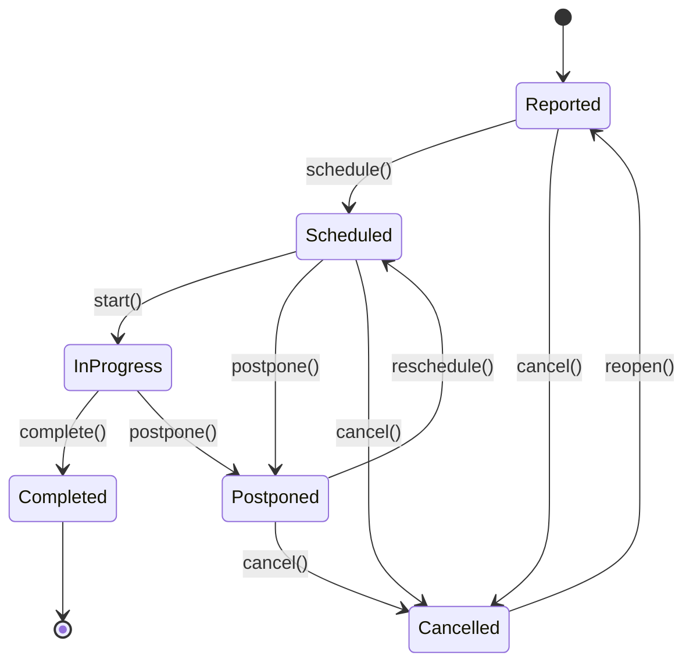

# ADR-057: JoineryTech Maintenance Domain Model

**Status:** DRAFT
**Date:** 2026-07-01
**Epic:** EPIC-JT-MAINT
**Author:** Architect Terminal

---

## Context

A JoineryTech ERP Maintenance (Karbantartás / Eszközgazdálkodás) modulja felelős az eszköz-törzs kezeléséért, a megelőző karbantartás tervezéséért, és az állásidő-követésért. A modul kritikus szerepet játszik a termelési hatékonyság fenntartásában és a termelésütemezés megbízhatóságában.

**Üzleti igények:**
- **Eszköz-törzs:** Központi nyilvántartás gépekről, járművekről, szerszámokról, infrastruktúráról
- **Megelőző karbantartás:** Időköz- és üzemóra-alapú tervek automatikus munkalap generálással
- **Reaktív karbantartás:** Géptörés/breakdown kezelése, sürgősségi prioritás
- **Állásidő-követés:** Termelési kapacitásra ható leállások rögzítése
- **Külső partnerek:** Külsős szerelő-cégek delegálása
- **Költségkövetés:** Karbantartási költségek projektekhez rendelése

**Technikai kihívások:**
- Asset status **calculation-first** — soha ne állítsd kézzel, FSM vezérli
- Production scheduling integráció — leállított gép kapacitása 0
- Multi-trigger preventive plans — napok ÉS üzemórák figyelése
- HR capacity integration — belső szerelők ütemezése

---

## Decision

A Maintenance modul **3 aggregate root** köré szerveződik:

1. **Asset (Eszköz)** — eszköz-törzs, calculated status
2. **WorkOrder (Munkalap)** — FSM-alapú karbantartási munkalap
3. **MaintenancePlan (Megelőző Terv)** — időköz/üzemóra-alapú trigger logic

**Design Principles:**
- **Calculated Status** — Asset status mindig computed, WorkOrder FSM hajtja
- **Scheduler-Driven** — preventive plans automatikus WorkOrder generálással
- **Integration-First** — HR, Production, Kontrolling, Warehouse tight coupling
- **Immutability** — downtime log append-only, audit trail minden munkalapon

---

## Aggregate Boundaries

### 1. Asset Aggregate

**Asset (Root):**
```csharp
public class Asset
{
    public Guid Id { get; private set; }
    public Guid TenantId { get; private set; }
    public string Code { get; private set; }           // e.g., "CNC-001"
    public string Name { get; private set; }           // e.g., "CNC Márkó 5-tengely"
    public AssetKind Kind { get; private set; }        // Machine, Vehicle, Tool, Infrastructure, IT, Room

    public Guid? FacilityId { get; private set; }      // Location facility
    public string Location { get; private set; }       // e.g., "Hall A/Bay 3"

    public string? Vendor { get; private set; }
    public string? Model { get; private set; }
    public string? SerialNumber { get; private set; }
    public DateTime? PurchasedAt { get; private set; }
    public decimal? PurchaseValue { get; private set; }

    public decimal OperatingHours { get; private set; }  // Total operating hours (for hour-based maintenance)
    public string? MachineId { get; private set; }       // Link to Production SHOPFLOOR_MACHINES
    public string? VehicleId { get; private set; }       // Link to Logistics vehicles

    public bool IsRetired { get; private set; }
    public DateTime? RetiredAt { get; private set; }
    public string? Notes { get; private set; }

    // Calculated status (NEVER stored, always computed)
    public AssetStatus CalculateStatus(IEnumerable<WorkOrder> workOrders)
    {
        if (IsRetired) return AssetStatus.Retired;

        var activeWorkOrders = workOrders.Where(w =>
            w.AssetId == Id &&
            (w.Status == WorkOrderStatus.InProgress || w.Status == WorkOrderStatus.Scheduled));

        // Breakdown takes precedence
        if (activeWorkOrders.Any(w => w.Type == WorkOrderType.Corrective && w.RequiresShutdown))
            return AssetStatus.BreakdownShutdown;

        // Under maintenance
        if (activeWorkOrders.Any(w => w.RequiresShutdown))
            return AssetStatus.UnderMaintenance;

        return AssetStatus.Operational;
    }

    // Domain methods
    public void UpdateOperatingHours(decimal hours) { /* ... */ }
    public void Retire(DateTime retiredAt) { /* ... */ }
    public void Reactivate() { /* ... */ }
}

public enum AssetKind
{
    Machine,        // gép
    Vehicle,        // jármű
    Tool,           // szerszám
    Infrastructure, // infra
    IT,             // IT eszköz
    Room            // helyiség (cleaning plans)
}

public enum AssetStatus
{
    Retired,            // selejtezve
    UnderMaintenance,   // karbantartas
    BreakdownShutdown,  // leallitva
    Operational         // uzemel
}
```

**Value Objects:**
```csharp
public record AssetSpecs(string? Vendor, string? Model, string? SerialNumber, DateTime? PurchasedAt, decimal? PurchaseValue);
```

**Domain Events:**
```csharp
public record AssetCreated(Guid AssetId, string Code, AssetKind Kind);
public record AssetRetired(Guid AssetId, DateTime RetiredAt);
public record AssetReactivated(Guid AssetId);
public record AssetOperatingHoursUpdated(Guid AssetId, decimal OperatingHours);
```

---

### 2. WorkOrder Aggregate

**WorkOrder (Root):**
```csharp
public class WorkOrder
{
    public Guid Id { get; private set; }
    public Guid TenantId { get; private set; }
    public string Code { get; private set; }           // e.g., "WO-2026-001"

    public Guid AssetId { get; private set; }
    public WorkOrderType Type { get; private set; }     // Corrective, Preventive, Cleaning
    public WorkOrderPriority Priority { get; private set; }
    public WorkOrderStatus Status { get; private set; }

    public string Title { get; private set; }
    public string? Description { get; private set; }

    public DateTime ReportedAt { get; private set; }
    public Guid? ReportedBy { get; private set; }       // User ID

    public DateTime? ScheduledStartAt { get; private set; }
    public DateTime? ActualStartAt { get; private set; }
    public DateTime? CompletedAt { get; private set; }

    public bool RequiresShutdown { get; private set; }  // Does this WO require asset shutdown?

    // Assignment
    public AssignmentType AssigneeType { get; private set; } // Internal, External
    public Guid? AssignedEmployeeId { get; private set; }    // If internal
    public Guid? DelegatedPartnerId { get; private set; }    // If external

    // Costs
    public decimal EstimatedHours { get; private set; }
    public decimal? ActualHours { get; private set; }
    public decimal? TotalCost { get; private set; }          // Calculated on completion

    // Project binding (optional)
    public Guid? ProjectId { get; private set; }

    // Preventive plan reference
    public Guid? MaintenancePlanId { get; private set; }

    public string? CancellationReason { get; private set; }
    public string? PostponementReason { get; private set; }

    // FSM methods
    public void Schedule(DateTime scheduledStartAt, Guid? assignedEmployeeId = null) { /* ... */ }
    public void Start(DateTime actualStartAt) { /* ... */ }
    public void Complete(decimal actualHours, decimal totalCost) { /* ... */ }
    public void Cancel(string reason) { /* ... */ }
    public void Postpone(string reason) { /* ... */ }
    public void Reopen() { /* ... */ }

    public void DelegateToPartner(Guid partnerId) { /* ... */ }
    public void Recall() { /* ... */ }

    public void BindToProject(Guid projectId) { /* ... */ }
}

public enum WorkOrderType
{
    Corrective,  // korrektív (géptörés, breakdown)
    Preventive,  // megelőző
    Cleaning     // takarítás
}

public enum WorkOrderPriority
{
    Critical,    // sürgős (géptörés, termelést blokkolja)
    High,        // fontos
    Medium,      // normál
    Low          // alacsony
}

public enum WorkOrderStatus
{
    Reported,    // bejelentve
    Scheduled,   // utemezve
    InProgress,  // folyamatban
    Completed,   // kesz
    Postponed,   // halasztva
    Cancelled    // elutasitva
}

public enum AssignmentType
{
    Internal,    // belső dolgozó
    External     // külsős partner
}
```

**FSM Diagram (Mermaid):**


**Domain Events:**
```csharp
public record WorkOrderCreated(Guid WorkOrderId, Guid AssetId, WorkOrderType Type, WorkOrderPriority Priority);
public record WorkOrderScheduled(Guid WorkOrderId, DateTime ScheduledStartAt, Guid? AssignedEmployeeId);
public record WorkOrderStarted(Guid WorkOrderId, DateTime ActualStartAt);
public record WorkOrderCompleted(Guid WorkOrderId, DateTime CompletedAt, decimal ActualHours, decimal TotalCost);
public record WorkOrderCancelled(Guid WorkOrderId, string Reason);
public record WorkOrderPostponed(Guid WorkOrderId, string Reason);
public record WorkOrderReopened(Guid WorkOrderId);
public record WorkOrderDelegated(Guid WorkOrderId, Guid PartnerId);
public record WorkOrderRecalled(Guid WorkOrderId);
public record WorkOrderBoundToProject(Guid WorkOrderId, Guid ProjectId);
```

---

### 3. MaintenancePlan Aggregate

**MaintenancePlan (Root):**
```csharp
public class MaintenancePlan
{
    public Guid Id { get; private set; }
    public Guid TenantId { get; private set; }
    public Guid AssetId { get; private set; }

    public string Label { get; private set; }           // e.g., "90-day service"
    public PlanKind Kind { get; private set; }          // Preventive, Cleaning
    public TriggerType Trigger { get; private set; }    // Interval, OperatingHours

    public int? IntervalDays { get; private set; }      // For interval-based
    public decimal? IntervalHours { get; private set; } // For operating hours-based

    public DateTime? LastDone { get; private set; }     // Last completion date
    public decimal? LastDoneHours { get; private set; } // Operating hours at last completion

    public AssignmentType AssigneeType { get; private set; }
    public Guid? AssignedEmployeeId { get; private set; }
    public string? PartnerName { get; private set; }    // External partner

    public decimal EstimatedHours { get; private set; }

    public bool IsActive { get; private set; }

    // Calculate if plan is due
    public bool IsDue(Asset asset, DateTime today, int lookaheadDays = 0)
    {
        if (!IsActive) return false;

        if (Trigger == TriggerType.Interval && IntervalDays.HasValue && LastDone.HasValue)
        {
            var daysSinceLastDone = (today - LastDone.Value).TotalDays;
            return daysSinceLastDone >= (IntervalDays.Value - lookaheadDays);
        }

        if (Trigger == TriggerType.OperatingHours && IntervalHours.HasValue && LastDoneHours.HasValue)
        {
            var hoursSinceLastDone = asset.OperatingHours - LastDoneHours.Value;
            return hoursSinceLastDone >= IntervalHours.Value;
        }

        // First execution
        if (!LastDone.HasValue && !LastDoneHours.HasValue)
            return true;

        return false;
    }

    // Domain methods
    public void MarkCompleted(DateTime completedAt, decimal currentOperatingHours) { /* ... */ }
    public void Deactivate() { /* ... */ }
    public void Reactivate() { /* ... */ }
}

public enum PlanKind
{
    Preventive,  // megelőző
    Cleaning     // takarítás
}

public enum TriggerType
{
    Interval,        // napok alapú (intervalDays)
    OperatingHours   // üzemóra alapú (intervalHours)
}
```

**Domain Events:**
```csharp
public record MaintenancePlanCreated(Guid PlanId, Guid AssetId, PlanKind Kind, TriggerType Trigger);
public record MaintenancePlanCompleted(Guid PlanId, DateTime CompletedAt, decimal OperatingHours);
public record MaintenancePlanDeactivated(Guid PlanId);
public record MaintenancePlanReactivated(Guid PlanId);
```

---

### 4. Downtime Entity (Child of WorkOrder)

**Downtime:**
```csharp
public class Downtime
{
    public Guid Id { get; private set; }
    public Guid TenantId { get; private set; }
    public Guid AssetId { get; private set; }
    public Guid? WorkOrderId { get; private set; }

    public DateTime Start { get; private set; }
    public DateTime? End { get; private set; }
    public decimal? Hours { get; private set; }

    public string Reason { get; private set; }
    public bool IsPlanned { get; private set; }        // Scheduled maintenance vs. breakdown

    public void Close(DateTime end)
    {
        End = end;
        Hours = (decimal)(end - Start).TotalHours;
    }
}
```

**Domain Events:**
```csharp
public record DowntimeStarted(Guid DowntimeId, Guid AssetId, Guid? WorkOrderId, DateTime Start, bool IsPlanned);
public record DowntimeClosed(Guid DowntimeId, DateTime End, decimal Hours);
```

---

## Integration Contracts

### 1. Maintenance → HR (Capacity Integration)

**Interface:**
```csharp
public interface IMaintenanceHrService
{
    Task AssignEmployeeToWorkOrderAsync(Guid workOrderId, Guid employeeId, decimal estimatedHours, DateTime scheduledStartAt);
    Task RemoveEmployeeFromWorkOrderAsync(Guid workOrderId);
}
```

**Implementáció:**
- WorkOrder.Schedule() → creates HR `assignments` record (source: "maintenance")
- WorkOrder.Complete() → removes HR assignment
- **Permission:** `hr.manage` required for assignment

---

### 2. Maintenance → Production (Downtime Integration)

**Interface:**
```csharp
public interface IMaintenanceProductionService
{
    Task<Dictionary<string, DateTime[]>> GetProductionDowntimeMapAsync(DateTime startDate, DateTime endDate);
}
```

**Implementáció:**
- Returns map: `machineId|date → downtime exists`
- Production scheduling uses this to set capacity = 0 for down machines
- Conflict detection: task scheduled on down machine → conflict alert

---

### 3. Maintenance → Controlling (Cost Integration)

**Interface:**
```csharp
public interface IMaintenanceControllingService
{
    Task PushWorkOrderCostAsync(Guid workOrderId, Guid? projectId, decimal totalCost, DateTime completedAt);
}
```

**Implementáció:**
- WorkOrder.Complete() → if ProjectId set, push cost to Controlling
- Category: Overhead (if no project) or Project-specific
- **Permission:** `controlling.manage` required

---

### 4. Maintenance → Warehouse (Parts Requisition)

**Interface:**
```csharp
public interface IMaintenanceWarehouseService
{
    Task CreateRequisitionFromWorkOrderAsync(Guid workOrderId, List<PartRequest> parts);
}
```

**Implementáció:**
- WorkOrder → create Draft Requisition
- Approval flow separate (Warehouse module)

---

### 5. Maintenance → Partners (B2B Handshake)

**Interface:**
```csharp
public interface IMaintenancePartnerService
{
    Task DelegateWorkOrderAsync(Guid workOrderId, Guid partnerId);
    Task RecallWorkOrderAsync(Guid workOrderId);
}
```

**Implementáció:**
- WorkOrder.DelegateToPartner() → creates B2B handshake (kind: "maintenance")
- Partner completes → WorkOrder.Complete() called

---

## Database Schema

### Tables

**1. maintenance.assets**
```sql
CREATE TABLE maintenance.assets (
    id UUID PRIMARY KEY DEFAULT gen_random_uuid(),
    tenant_id UUID NOT NULL,
    code VARCHAR(50) NOT NULL,
    name VARCHAR(255) NOT NULL,
    kind VARCHAR(50) NOT NULL,

    facility_id UUID,
    location VARCHAR(255),

    vendor VARCHAR(255),
    model VARCHAR(255),
    serial_number VARCHAR(255),
    purchased_at TIMESTAMP,
    purchase_value DECIMAL(18,2),

    operating_hours DECIMAL(10,2) NOT NULL DEFAULT 0,
    machine_id VARCHAR(50),     -- Link to Production
    vehicle_id VARCHAR(50),     -- Link to Logistics

    is_retired BOOLEAN NOT NULL DEFAULT FALSE,
    retired_at TIMESTAMP,
    notes TEXT,

    created_at TIMESTAMP NOT NULL DEFAULT NOW(),
    updated_at TIMESTAMP NOT NULL DEFAULT NOW(),

    CONSTRAINT chk_kind CHECK (kind IN ('Machine', 'Vehicle', 'Tool', 'Infrastructure', 'IT', 'Room'))
);

CREATE UNIQUE INDEX idx_assets_code ON maintenance.assets(tenant_id, code);
CREATE INDEX idx_assets_kind ON maintenance.assets(tenant_id, kind);
CREATE INDEX idx_assets_retired ON maintenance.assets(tenant_id, is_retired);
CREATE INDEX idx_assets_machine ON maintenance.assets(machine_id) WHERE machine_id IS NOT NULL;
```

**2. maintenance.work_orders**
```sql
CREATE TABLE maintenance.work_orders (
    id UUID PRIMARY KEY DEFAULT gen_random_uuid(),
    tenant_id UUID NOT NULL,
    code VARCHAR(50) NOT NULL,

    asset_id UUID NOT NULL REFERENCES maintenance.assets(id),
    type VARCHAR(50) NOT NULL,
    priority VARCHAR(50) NOT NULL,
    status VARCHAR(50) NOT NULL,

    title VARCHAR(255) NOT NULL,
    description TEXT,

    reported_at TIMESTAMP NOT NULL,
    reported_by UUID,

    scheduled_start_at TIMESTAMP,
    actual_start_at TIMESTAMP,
    completed_at TIMESTAMP,

    requires_shutdown BOOLEAN NOT NULL DEFAULT FALSE,

    assignee_type VARCHAR(50) NOT NULL,
    assigned_employee_id UUID,
    delegated_partner_id UUID,

    estimated_hours DECIMAL(10,2) NOT NULL,
    actual_hours DECIMAL(10,2),
    total_cost DECIMAL(18,2),

    project_id UUID,
    maintenance_plan_id UUID,

    cancellation_reason TEXT,
    postponement_reason TEXT,

    created_at TIMESTAMP NOT NULL DEFAULT NOW(),
    updated_at TIMESTAMP NOT NULL DEFAULT NOW(),

    CONSTRAINT chk_type CHECK (type IN ('Corrective', 'Preventive', 'Cleaning')),
    CONSTRAINT chk_priority CHECK (priority IN ('Critical', 'High', 'Medium', 'Low')),
    CONSTRAINT chk_status CHECK (status IN ('Reported', 'Scheduled', 'InProgress', 'Completed', 'Postponed', 'Cancelled')),
    CONSTRAINT chk_assignee_type CHECK (assignee_type IN ('Internal', 'External'))
);

CREATE UNIQUE INDEX idx_work_orders_code ON maintenance.work_orders(tenant_id, code);
CREATE INDEX idx_work_orders_asset ON maintenance.work_orders(asset_id, status);
CREATE INDEX idx_work_orders_status ON maintenance.work_orders(tenant_id, status);
CREATE INDEX idx_work_orders_scheduled ON maintenance.work_orders(scheduled_start_at) WHERE status = 'Scheduled';
CREATE INDEX idx_work_orders_active ON maintenance.work_orders(tenant_id, asset_id) WHERE status IN ('Scheduled', 'InProgress');
```

**3. maintenance.maintenance_plans**
```sql
CREATE TABLE maintenance.maintenance_plans (
    id UUID PRIMARY KEY DEFAULT gen_random_uuid(),
    tenant_id UUID NOT NULL,
    asset_id UUID NOT NULL REFERENCES maintenance.assets(id),

    label VARCHAR(255) NOT NULL,
    kind VARCHAR(50) NOT NULL,
    trigger VARCHAR(50) NOT NULL,

    interval_days INT,
    interval_hours DECIMAL(10,2),

    last_done TIMESTAMP,
    last_done_hours DECIMAL(10,2),

    assignee_type VARCHAR(50) NOT NULL,
    assigned_employee_id UUID,
    partner_name VARCHAR(255),

    estimated_hours DECIMAL(10,2) NOT NULL,

    is_active BOOLEAN NOT NULL DEFAULT TRUE,

    created_at TIMESTAMP NOT NULL DEFAULT NOW(),
    updated_at TIMESTAMP NOT NULL DEFAULT NOW(),

    CONSTRAINT chk_kind CHECK (kind IN ('Preventive', 'Cleaning')),
    CONSTRAINT chk_trigger CHECK (trigger IN ('Interval', 'OperatingHours')),
    CONSTRAINT chk_assignee_type CHECK (assignee_type IN ('Internal', 'External'))
);

CREATE INDEX idx_maintenance_plans_asset ON maintenance.maintenance_plans(asset_id, is_active);
CREATE INDEX idx_maintenance_plans_active ON maintenance.maintenance_plans(tenant_id, is_active);
```

**4. maintenance.downtimes**
```sql
CREATE TABLE maintenance.downtimes (
    id UUID PRIMARY KEY DEFAULT gen_random_uuid(),
    tenant_id UUID NOT NULL,
    asset_id UUID NOT NULL REFERENCES maintenance.assets(id),
    work_order_id UUID REFERENCES maintenance.work_orders(id),

    start TIMESTAMP NOT NULL,
    "end" TIMESTAMP,
    hours DECIMAL(10,2),

    reason VARCHAR(255) NOT NULL,
    is_planned BOOLEAN NOT NULL,

    created_at TIMESTAMP NOT NULL DEFAULT NOW()
);

CREATE INDEX idx_downtimes_asset ON maintenance.downtimes(asset_id, start DESC);
CREATE INDEX idx_downtimes_work_order ON maintenance.downtimes(work_order_id);
CREATE INDEX idx_downtimes_active ON maintenance.downtimes(tenant_id, asset_id) WHERE "end" IS NULL;
```

### RLS Policies

```sql
-- Tenant isolation
ALTER TABLE maintenance.assets ENABLE ROW LEVEL SECURITY;
ALTER TABLE maintenance.work_orders ENABLE ROW LEVEL SECURITY;
ALTER TABLE maintenance.maintenance_plans ENABLE ROW LEVEL SECURITY;
ALTER TABLE maintenance.downtimes ENABLE ROW LEVEL SECURITY;

CREATE POLICY tenant_isolation_assets ON maintenance.assets
    USING (tenant_id = current_setting('app.current_tenant')::UUID);

CREATE POLICY tenant_isolation_work_orders ON maintenance.work_orders
    USING (tenant_id = current_setting('app.current_tenant')::UUID);

CREATE POLICY tenant_isolation_maintenance_plans ON maintenance.maintenance_plans
    USING (tenant_id = current_setting('app.current_tenant')::UUID);

CREATE POLICY tenant_isolation_downtimes ON maintenance.downtimes
    USING (tenant_id = current_setting('app.current_tenant')::UUID);
```

---

## CQRS Command/Query Handlers

### Commands (14)

**Asset Management:**
1. `CreateAssetCommand` → AssetCreated
2. `UpdateAssetCommand` → AssetUpdated
3. `RetireAssetCommand` → AssetRetired
4. `ReactivateAssetCommand` → AssetReactivated
5. `UpdateOperatingHoursCommand` → AssetOperatingHoursUpdated

**WorkOrder Management:**
6. `CreateWorkOrderCommand` → WorkOrderCreated
7. `ScheduleWorkOrderCommand` → WorkOrderScheduled
8. `StartWorkOrderCommand` → WorkOrderStarted
9. `CompleteWorkOrderCommand` → WorkOrderCompleted
10. `CancelWorkOrderCommand` → WorkOrderCancelled
11. `PostponeWorkOrderCommand` → WorkOrderPostponed
12. `ReopenWorkOrderCommand` → WorkOrderReopened
13. `DelegateWorkOrderCommand` → WorkOrderDelegated
14. `RecallWorkOrderCommand` → WorkOrderRecalled

**MaintenancePlan Management:**
15. `CreateMaintenancePlanCommand` → MaintenancePlanCreated
16. `UpdateMaintenancePlanCommand` → MaintenancePlanUpdated
17. `DeactivatePlanCommand` → MaintenancePlanDeactivated
18. `MarkPlanCompletedCommand` → MaintenancePlanCompleted

### Queries (12)

1. `GetAssetByIdQuery` → AssetDto
2. `GetAssetsQuery` → List<AssetDto> (with filters: kind, status, facility)
3. `GetAssetStatusQuery` → AssetStatusDto (calculated status + active work orders)
4. `GetWorkOrderByIdQuery` → WorkOrderDto
5. `GetWorkOrdersQuery` → List<WorkOrderDto> (with filters: status, type, priority, asset)
6. `GetActiveWorkOrdersForAssetQuery` → List<WorkOrderDto>
7. `GetMaintenancePlansQuery` → List<MaintenancePlanDto> (with filters: asset, active)
8. `GetDuePlansQuery` → List<MaintenancePlanDto> (due within N days)
9. `GetDowntimesForAssetQuery` → List<DowntimeDto>
10. `GetProductionDowntimeMapQuery` → Dictionary<string, DateTime[]> (for production scheduling)
11. `GetMaintenanceCostsByProjectQuery` → List<MaintenanceCostDto>
12. `GetMaintenanceDashboardQuery` → MaintenanceDashboardDto (KPIs: assets under maintenance, active work orders, overdue plans)

---

## REST API Endpoints

### Asset Management (8 endpoints)

```
GET    /api/maintenance/assets                 # List assets (filters: kind, status, facility)
GET    /api/maintenance/assets/{id}            # Get asset details
POST   /api/maintenance/assets                 # Create asset
PUT    /api/maintenance/assets/{id}            # Update asset
PUT    /api/maintenance/assets/{id}/retire     # Retire asset
PUT    /api/maintenance/assets/{id}/reactivate # Reactivate asset
PUT    /api/maintenance/assets/{id}/hours      # Update operating hours
GET    /api/maintenance/assets/{id}/status     # Get calculated status + active work orders
```

### WorkOrder Management (11 endpoints)

```
GET    /api/maintenance/work-orders            # List work orders (filters: status, type, priority, asset)
GET    /api/maintenance/work-orders/{id}       # Get work order details
POST   /api/maintenance/work-orders            # Create work order
PUT    /api/maintenance/work-orders/{id}/schedule      # Schedule work order
PUT    /api/maintenance/work-orders/{id}/start         # Start work order
PUT    /api/maintenance/work-orders/{id}/complete      # Complete work order
PUT    /api/maintenance/work-orders/{id}/cancel        # Cancel work order
PUT    /api/maintenance/work-orders/{id}/postpone      # Postpone work order
PUT    /api/maintenance/work-orders/{id}/reopen        # Reopen work order
PUT    /api/maintenance/work-orders/{id}/delegate      # Delegate to external partner
PUT    /api/maintenance/work-orders/{id}/recall        # Recall from partner
```

### MaintenancePlan Management (6 endpoints)

```
GET    /api/maintenance/plans                  # List maintenance plans (filters: asset, active)
GET    /api/maintenance/plans/{id}             # Get plan details
POST   /api/maintenance/plans                  # Create plan
PUT    /api/maintenance/plans/{id}             # Update plan
DELETE /api/maintenance/plans/{id}             # Deactivate plan
GET    /api/maintenance/plans/due              # Get due plans (query param: withinDays)
```

### Downtime Management (2 endpoints)

```
GET    /api/maintenance/downtimes              # Get downtimes (filters: asset, dateRange)
GET    /api/maintenance/downtimes/production-map # Get production downtime map (for scheduling)
```

### Dashboard & Reports (3 endpoints)

```
GET    /api/maintenance/dashboard              # Maintenance dashboard KPIs
GET    /api/maintenance/costs                  # Maintenance costs by project
GET    /api/maintenance/assets/{id}/history    # Asset maintenance history
```

---

## Permissions

```csharp
public static class MaintenancePermissions
{
    public const string View = "maintenance.view";         // Read access
    public const string Manage = "maintenance.manage";     // Create/update assets, work orders, plans
    public const string Approve = "maintenance.approve";   // Approve high-cost work orders
    public const string Admin = "maintenance.admin";       // Retire assets, delete plans
}
```

---

## Scheduler Service (Background Service)

**Preventive Maintenance Scheduler:**
```csharp
public class PreventiveMaintenanceScheduler : BackgroundService
{
    protected override async Task ExecuteAsync(CancellationToken stoppingToken)
    {
        while (!stoppingToken.IsCancellationRequested)
        {
            await CheckDuePlansAndCreateWorkOrders();
            await Task.Delay(TimeSpan.FromHours(1), stoppingToken); // Run every hour
        }
    }

    private async Task CheckDuePlansAndCreateWorkOrders()
    {
        var duePlans = await _mediator.Send(new GetDuePlansQuery(withinDays: 7));

        foreach (var plan in duePlans)
        {
            // Only create WO if no active WO for this plan
            var existingWo = await _repository.GetActiveWorkOrderForPlan(plan.Id);
            if (existingWo == null)
            {
                await _mediator.Send(new CreateWorkOrderFromPlanCommand(plan.Id));
            }
        }
    }
}
```

---

## Testing Strategy

### Unit Tests

**Aggregate Logic:**
- Asset.CalculateStatus() — all 4 states
- WorkOrder FSM transitions — happy path + validation failures
- MaintenancePlan.IsDue() — interval-based + hours-based + lookahead

**Domain Events:**
- WorkOrderCompleted triggers downtime closure
- WorkOrderCompleted updates MaintenancePlan.LastDone

### Integration Tests

**Database:**
- RLS policies enforce tenant isolation
- WorkOrder cascade delete with downtimes

**CQRS Handlers:**
- CreateWorkOrderCommand → WorkOrderCreated event published
- CompleteWorkOrderCommand → HR assignment removed, Controlling cost pushed

### E2E Tests

**Preventive Maintenance Flow:**
1. Create Asset + MaintenancePlan (interval: 90 days)
2. Scheduler creates WorkOrder (mocked time travel)
3. Schedule WorkOrder → HR assignment created
4. Complete WorkOrder → Plan.LastDone updated, HR assignment removed

**Breakdown Flow:**
1. Create Asset + WorkOrder (type: Corrective, priority: Critical)
2. Start WorkOrder → Downtime started
3. Complete WorkOrder → Downtime closed, Asset status = Operational

---

## Performance & Scalability

### Caching

```csharp
// Asset status (5 min cache)
[OutputCache(Duration = 300)]
public async Task<AssetStatusDto> GetAssetStatus(Guid assetId) { /* ... */ }

// Maintenance dashboard KPIs (10 min cache)
[OutputCache(Duration = 600)]
public async Task<MaintenanceDashboardDto> GetDashboard() { /* ... */ }
```

### Materialized View (Optional)

```sql
CREATE MATERIALIZED VIEW maintenance.asset_status_summary AS
SELECT
    a.id AS asset_id,
    a.tenant_id,
    a.code,
    a.name,
    a.kind,
    CASE
        WHEN a.is_retired THEN 'Retired'
        WHEN EXISTS (SELECT 1 FROM maintenance.work_orders w WHERE w.asset_id = a.id AND w.status IN ('Scheduled', 'InProgress') AND w.type = 'Corrective' AND w.requires_shutdown) THEN 'BreakdownShutdown'
        WHEN EXISTS (SELECT 1 FROM maintenance.work_orders w WHERE w.asset_id = a.id AND w.status IN ('Scheduled', 'InProgress') AND w.requires_shutdown) THEN 'UnderMaintenance'
        ELSE 'Operational'
    END AS status,
    COUNT(w.id) FILTER (WHERE w.status IN ('Scheduled', 'InProgress')) AS active_work_orders_count
FROM maintenance.assets a
LEFT JOIN maintenance.work_orders w ON w.asset_id = a.id
GROUP BY a.id, a.tenant_id, a.code, a.name, a.kind, a.is_retired;

-- Refresh nightly
REFRESH MATERIALIZED VIEW maintenance.asset_status_summary;
```

### Archival

- **Completed WorkOrders:** Archive after 3 years
- **Downtimes:** Archive after 3 years (compliance)
- **Deactivated MaintenancePlans:** Soft delete, never purge

---

## Implementation Plan

### Week 1: Domain Layer
- Asset, WorkOrder, MaintenancePlan aggregates
- FSM validation logic
- Domain events

### Week 2: Scheduler + Calculation Engine
- PreventiveMaintenanceScheduler background service
- Asset.CalculateStatus() logic
- MaintenancePlan.IsDue() logic

### Week 3: Application Layer
- CQRS command handlers (18 commands)
- CQRS query handlers (12 queries)
- MediatR pipeline

### Week 4: Infrastructure Layer
- Database schema + RLS policies
- EF Core repositories
- Event bus integration

### Week 5: API Layer & Integration
- Controllers (30 endpoints)
- OpenAPI spec
- Integration contracts (HR, Production, Controlling, Warehouse, Partners)
- E2E tests

---

## Dependencies

**Blocks:**
- Production scheduling (needs downtime map)
- Controlling cost tracking (needs work order costs)
- HR capacity planning (needs technician assignments)

**Blocked By:**
- None (standalone module)

---

## Risks & Mitigations

| Risk | Mitigation |
|------|------------|
| Scheduler creates duplicate WorkOrders | Check for existing active WO before creating |
| Asset status stale (cached) | Short cache TTL (5 min), invalidate on WO status change |
| Production scheduling conflicts missed | Real-time downtime check via API (not cached) |
| External partner SLA breach | Email alerts on overdue external WorkOrders |

---

## Acceptance Criteria

- [x] Aggregate boundaries (Asset, WorkOrder, MaintenancePlan)
- [x] FSM diagram (WorkOrder)
- [x] Scheduler logic design
- [x] Integration contract Maintenance→Production
- [x] Integration contract Maintenance→HR
- [x] Integration contract Maintenance→Controlling
- [x] ADR dokumentáció

---

## References

- **Source:** `/opt/spaceos/docs/joinerytech/CLAUDE.md` (lines 472-479)
- **Related ADRs:**
  - ADR-054: CRM Domain Model (FSM pattern)
  - ADR-055: Kontrolling Domain Model (calculation-first design)
  - ADR-056: HR Domain Model (capacity integration)
- **Tech Stack:** .NET 8, EF Core, PostgreSQL, MediatR, BackgroundService

---

## Notes

**Design Highlights:**
- **Calculation-First:** Asset status NEVER stored, always computed from WorkOrder state
- **Scheduler-Driven:** Preventive plans automatically generate WorkOrders
- **Production Integration:** Downtime map critical for scheduling conflict detection
- **Multi-Trigger:** Supports both time-based (days) and usage-based (operating hours) maintenance
- **Immutable Downtime Log:** Append-only for audit trail

**Implementation Priority:**
1. Asset + WorkOrder aggregates (core functionality)
2. Scheduler service (preventive maintenance automation)
3. Production integration (downtime map for scheduling)
4. HR integration (technician capacity)
5. Controlling integration (cost tracking)

A dokumentáció készen áll a backend implementációra.
