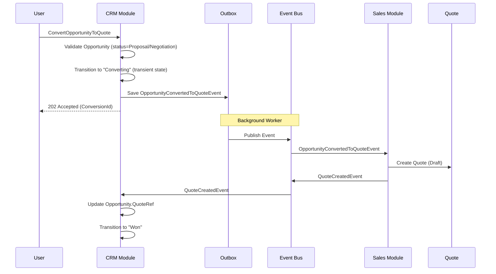

# ADR-063: CRM → Sales Integration Pattern

**Status:** PROPOSED
**Date:** 2026-07-10
**Epic:** EPIC-JT-CRM
**Checkpoint:** CP-CRM-INTEGRATION
**Author:** Architect Terminal
**Reviewers:** Conductor, Backend

---

## Context

The JoineryTech CRM module needs to integrate with the Sales module when an **Opportunity is converted to a Quote**. This is a critical business flow:

```
Lead → Opportunity (CRM) → Quote (Sales) → Order (Sales) → Invoice (Finance)
```

### Current State (ADR-054)

**CRM Module:**
- Opportunity aggregate with FSM: Draft → Proposal → Negotiation → Won/Lost/Abandoned
- `ConvertOpportunityToQuoteCommand` defined but NOT implemented
- `OpportunityConvertedToQuoteEvent` / `OpportunityWon` events defined
- `IQuoteCreationService` interface defined in ADR-054 (CRM expects Sales to implement)

**Sales Module:**
- No ADR exists yet (Sales module architecture not formalized)
- Assumed: Quote aggregate with FSM (Draft → Sent → Accepted → Converted → Expired)
- Expected: `POST /api/sales/quotes` endpoint

### Integration Challenge

| Challenge | Description |
|-----------|-------------|
| **Module Boundaries** | CRM and Sales are separate L2 modules with independent databases |
| **Transaction Boundaries** | Opportunity update and Quote creation span two bounded contexts |
| **Consistency** | What if Quote creation fails after Opportunity status changed? |
| **Data Flow** | What data transfers from Opportunity to Quote? |
| **Ownership** | Who owns the resulting Quote? |

---

## Decision

### Integration Pattern: **Asynchronous Domain Events with Outbox**

We will use **Domain Events with Outbox Pattern** for CRM → Sales integration.

### Summary Table

| Aspect | Decision |
|--------|----------|
| **Pattern** | Asynchronous Domain Events (MediatR Notifications) |
| **Reliability** | Transactional Outbox Pattern |
| **Consistency** | Eventually Consistent |
| **Coupling** | Loose (CRM doesn't know Sales internals) |
| **Error Handling** | Compensating Transaction + Dead Letter Queue |

### Why Not Synchronous API Call?

| Aspect | Synchronous API | Domain Events (Chosen) |
|--------|-----------------|------------------------|
| **Coupling** | ❌ Tight (CRM calls Sales API) | ✅ Loose (CRM publishes event) |
| **Availability** | ❌ Sales must be UP | ✅ Eventual delivery |
| **Transaction** | ❌ 2PC required | ✅ Local transaction + outbox |
| **Failure Mode** | ❌ CRM fails if Sales fails | ✅ CRM succeeds, Sales retries |
| **Testing** | ❌ Integration test required | ✅ Unit test with mock handler |

### Why Not Saga Pattern?

Saga pattern is **overkill** for this use case:
- Only 2 steps (Update Opportunity + Create Quote)
- No complex compensation chain needed
- Simple idempotent retry is sufficient

---

## Architecture

### Event Flow Diagram



### State Machine Extension

The Opportunity FSM needs a transient state for conversion:

```
Draft → Proposal → Negotiation → Converting → Won
                              ↓
                            Lost/Abandoned
```

**Converting State:**
- Transient state (not visible in UI)
- Timeout: 30 seconds
- On success (QuoteCreated): → Won
- On failure/timeout: → Negotiation (rollback) + alert

### Event Definitions

#### OpportunityConvertedToQuoteEvent (CRM publishes)

```csharp
public sealed record OpportunityConvertedToQuoteEvent : IDomainEvent
{
    public Guid EventId { get; init; } = Guid.NewGuid();
    public Guid OpportunityId { get; init; }
    public Guid ConversionId { get; init; }  // Idempotency key
    public Guid TenantId { get; init; }

    // Data for Quote creation
    public Guid CustomerId { get; init; }
    public ContactInfo ContactInfo { get; init; }
    public Money EstimatedValue { get; init; }
    public string? SpecialTerms { get; init; }
    public Guid SalesRepId { get; init; }
    public DateTime ExpectedCloseDate { get; init; }

    // Metadata
    public Guid RequestedBy { get; init; }
    public DateTime Timestamp { get; init; } = DateTime.UtcNow;
}
```

#### QuoteCreatedFromOpportunityEvent (Sales publishes)

```csharp
public sealed record QuoteCreatedFromOpportunityEvent : IDomainEvent
{
    public Guid EventId { get; init; } = Guid.NewGuid();
    public Guid QuoteId { get; init; }
    public Guid OpportunityId { get; init; }
    public Guid ConversionId { get; init; }  // Correlation key
    public Guid TenantId { get; init; }
    public DateTime Timestamp { get; init; } = DateTime.UtcNow;
}
```

#### QuoteCreationFailedEvent (Sales publishes on failure)

```csharp
public sealed record QuoteCreationFailedEvent : IDomainEvent
{
    public Guid EventId { get; init; } = Guid.NewGuid();
    public Guid OpportunityId { get; init; }
    public Guid ConversionId { get; init; }
    public Guid TenantId { get; init; }
    public string Reason { get; init; }
    public ErrorCode ErrorCode { get; init; }
    public DateTime Timestamp { get; init; } = DateTime.UtcNow;
}

public enum ErrorCode
{
    CustomerNotFound = 1,
    InvalidProductReference = 2,
    PricingError = 3,
    InternalError = 99
}
```

---

## API Contract

### CRM Endpoint: Convert Opportunity to Quote

```yaml
# OpenAPI 3.1 Fragment
paths:
  /api/crm/opportunities/{id}/convert-to-quote:
    post:
      operationId: convertOpportunityToQuote
      summary: Convert a qualified Opportunity to a Quote in Sales module
      tags:
        - Opportunities
      security:
        - BearerAuth: []
      parameters:
        - name: id
          in: path
          required: true
          schema:
            type: string
            format: uuid
          description: Opportunity ID
      requestBody:
        required: true
        content:
          application/json:
            schema:
              $ref: '#/components/schemas/ConvertToQuoteRequest'
      responses:
        '202':
          description: Conversion initiated (async)
          content:
            application/json:
              schema:
                $ref: '#/components/schemas/ConversionInitiatedResponse'
        '400':
          description: Bad Request (validation error)
          content:
            application/json:
              schema:
                $ref: '#/components/schemas/ProblemDetails'
        '404':
          description: Opportunity not found
        '409':
          description: Conflict (invalid state transition or already converting)
          content:
            application/json:
              schema:
                $ref: '#/components/schemas/ProblemDetails'
        '422':
          description: Business rule violation
          content:
            application/json:
              schema:
                $ref: '#/components/schemas/ProblemDetails'
        '503':
          description: Service temporarily unavailable (retry later)

components:
  schemas:
    ConvertToQuoteRequest:
      type: object
      required:
        - customerId
      properties:
        customerId:
          type: string
          format: uuid
          description: Customer ID (from Customer module)
        specialTerms:
          type: ['string', 'null']
          maxLength: 2000
          description: Optional special terms/conditions for the quote
        lineItemOverrides:
          type: ['array', 'null']
          items:
            $ref: '#/components/schemas/LineItemOverride'
          description: Optional price/quantity overrides

    LineItemOverride:
      type: object
      required:
        - productId
      properties:
        productId:
          type: string
          format: uuid
        quantity:
          type: ['integer', 'null']
          minimum: 1
        unitPrice:
          type: ['number', 'null']
          minimum: 0
        discountPercent:
          type: ['number', 'null']
          minimum: 0
          maximum: 100

    ConversionInitiatedResponse:
      type: object
      required:
        - conversionId
        - opportunityId
        - status
        - statusCheckUrl
      properties:
        conversionId:
          type: string
          format: uuid
          description: Unique conversion correlation ID
        opportunityId:
          type: string
          format: uuid
        status:
          type: string
          enum: [initiated, processing]
        statusCheckUrl:
          type: string
          format: uri
          description: URL to poll for conversion status
        estimatedCompletionSeconds:
          type: integer
          default: 5
          description: Estimated time to completion

    ProblemDetails:
      type: object
      required:
        - type
        - title
        - status
      properties:
        type:
          type: string
          format: uri
          description: Error type URI
        title:
          type: string
          description: Human-readable error title
        status:
          type: integer
          description: HTTP status code
        detail:
          type: string
          description: Detailed error message
        instance:
          type: string
          format: uri
          description: Request instance URI
        errors:
          type: object
          additionalProperties:
            type: array
            items:
              type: string
          description: Validation errors by field
```

### CRM Endpoint: Check Conversion Status

```yaml
paths:
  /api/crm/conversions/{conversionId}:
    get:
      operationId: getConversionStatus
      summary: Check status of Opportunity to Quote conversion
      tags:
        - Conversions
      security:
        - BearerAuth: []
      parameters:
        - name: conversionId
          in: path
          required: true
          schema:
            type: string
            format: uuid
      responses:
        '200':
          description: Conversion status
          content:
            application/json:
              schema:
                $ref: '#/components/schemas/ConversionStatusResponse'
        '404':
          description: Conversion not found

components:
  schemas:
    ConversionStatusResponse:
      type: object
      required:
        - conversionId
        - opportunityId
        - status
        - createdAt
      properties:
        conversionId:
          type: string
          format: uuid
        opportunityId:
          type: string
          format: uuid
        status:
          type: string
          enum: [initiated, processing, completed, failed, timeout]
        quoteId:
          type: ['string', 'null']
          format: uuid
          description: Quote ID (set when completed)
        quoteUrl:
          type: ['string', 'null']
          format: uri
          description: URL to the created Quote
        failureReason:
          type: ['string', 'null']
          description: Error message (set when failed)
        createdAt:
          type: string
          format: date-time
        completedAt:
          type: ['string', 'null']
          format: date-time
```

### Sales Event Handler Contract

```csharp
// Sales module implements this handler
public class OpportunityConvertedToQuoteEventHandler
    : INotificationHandler<OpportunityConvertedToQuoteEvent>
{
    private readonly IQuoteRepository _quoteRepository;
    private readonly IEventBus _eventBus;

    public async Task Handle(
        OpportunityConvertedToQuoteEvent notification,
        CancellationToken ct)
    {
        // 1. Check idempotency (ConversionId already processed?)
        if (await _quoteRepository.ExistsByConversionIdAsync(notification.ConversionId, ct))
        {
            // Already processed - publish success event again (idempotent)
            var existingQuote = await _quoteRepository.GetByConversionIdAsync(notification.ConversionId, ct);
            await _eventBus.PublishAsync(new QuoteCreatedFromOpportunityEvent
            {
                QuoteId = existingQuote.Id,
                OpportunityId = notification.OpportunityId,
                ConversionId = notification.ConversionId,
                TenantId = notification.TenantId
            }, ct);
            return;
        }

        try
        {
            // 2. Create Quote
            var quote = Quote.CreateFromOpportunity(
                opportunityId: notification.OpportunityId,
                conversionId: notification.ConversionId,
                customerId: notification.CustomerId,
                contactInfo: notification.ContactInfo,
                estimatedValue: notification.EstimatedValue,
                specialTerms: notification.SpecialTerms,
                salesRepId: notification.SalesRepId,
                expectedCloseDate: notification.ExpectedCloseDate,
                tenantId: notification.TenantId);

            await _quoteRepository.AddAsync(quote, ct);

            // 3. Publish success event
            await _eventBus.PublishAsync(new QuoteCreatedFromOpportunityEvent
            {
                QuoteId = quote.Id,
                OpportunityId = notification.OpportunityId,
                ConversionId = notification.ConversionId,
                TenantId = notification.TenantId
            }, ct);
        }
        catch (DomainException ex)
        {
            // 4. Publish failure event
            await _eventBus.PublishAsync(new QuoteCreationFailedEvent
            {
                OpportunityId = notification.OpportunityId,
                ConversionId = notification.ConversionId,
                TenantId = notification.TenantId,
                Reason = ex.Message,
                ErrorCode = MapToErrorCode(ex)
            }, ct);
        }
    }
}
```

---

## Data Flow

### Data Transferred from Opportunity to Quote

| Field | Source | Target | Notes |
|-------|--------|--------|-------|
| **OpportunityId** | Opportunity.Id | Quote.OpportunityRef | Back-reference |
| **ConversionId** | Generated | Quote.ConversionId | Idempotency key |
| **CustomerId** | Request body | Quote.CustomerId | Validated by Customer module |
| **ContactInfo** | Opportunity.ContactInfo | Quote.ContactInfo | Copied (snapshot) |
| **EstimatedValue** | Opportunity.EstimatedValue | Quote.InitialValue | Starting price |
| **SpecialTerms** | Request body | Quote.SpecialTerms | Optional |
| **SalesRepId** | Opportunity.AssignedTo | Quote.SalesRepId | Sales rep assignment |
| **ExpectedCloseDate** | Opportunity.ExpectedCloseDate | Quote.ValidUntil | Quote expiration |
| **TenantId** | Opportunity.TenantId | Quote.TenantId | Multi-tenant isolation |

### Data NOT Transferred (Quote Creates Fresh)

| Field | Reason |
|-------|--------|
| **QuoteId** | Generated by Sales module |
| **LineItems** | Sales creates from product catalog (not CRM responsibility) |
| **QuoteNumber** | Generated by Sales (sequential per tenant) |
| **QuoteStatus** | Starts as Draft |
| **Pricing** | Calculated by Sales pricing engine |

---

## Error Handling

### Error Scenarios

| Scenario | CRM Response | Sales Response | Recovery |
|----------|--------------|----------------|----------|
| **Customer not found** | N/A | QuoteCreationFailedEvent | CRM rolls back to Negotiation |
| **Invalid product** | N/A | QuoteCreationFailedEvent | CRM rolls back, user fixes |
| **Sales unavailable** | N/A | Event retried (3x) | DLQ after retries |
| **Timeout (30s)** | 409 on status check | N/A | CRM auto-rollback |
| **Duplicate conversion** | Idempotent 202 | Idempotent event | No action needed |

### Compensating Transaction (CRM)

```csharp
public class QuoteCreationFailedEventHandler
    : INotificationHandler<QuoteCreationFailedEvent>
{
    private readonly IOpportunityRepository _repository;
    private readonly ILogger<QuoteCreationFailedEventHandler> _logger;

    public async Task Handle(
        QuoteCreationFailedEvent notification,
        CancellationToken ct)
    {
        var opportunity = await _repository.GetByIdAsync(notification.OpportunityId, ct);

        if (opportunity is null || opportunity.Status != OpportunityStatus.Converting)
        {
            _logger.LogWarning("Ignoring QuoteCreationFailed for Opportunity {Id} - not in Converting state",
                notification.OpportunityId);
            return;
        }

        // Rollback to Negotiation
        opportunity.RollbackConversion(notification.Reason);
        await _repository.UpdateAsync(opportunity, ct);

        _logger.LogWarning("Opportunity {Id} rolled back from Converting to Negotiation. Reason: {Reason}",
            notification.OpportunityId, notification.Reason);

        // TODO: Notify user via UI/email
    }
}
```

---

## Implementation Guidance

### Backend Task Specification

**Task ID:** MSG-BACKEND-XXX (to be assigned)
**Epic:** EPIC-JT-CRM
**Estimated NWT:** 40-60 (~3-4 hours)

#### Phase 1: CRM Side (30 NWT)

1. **Extend Opportunity FSM** (10 NWT)
   - Add `Converting` transient state
   - Add `RollbackConversion()` method
   - Update state transition validation

2. **Implement ConvertOpportunityToQuoteCommandHandler** (15 NWT)
   - Validate opportunity state (Proposal or Negotiation)
   - Generate ConversionId
   - Transition to Converting
   - Save OpportunityConvertedToQuoteEvent to outbox

3. **Implement Event Handlers** (5 NWT)
   - QuoteCreatedFromOpportunityEventHandler (complete conversion)
   - QuoteCreationFailedEventHandler (rollback)

#### Phase 2: Sales Side (20-30 NWT)

1. **Create Quote Aggregate** (15 NWT)
   - Quote.CreateFromOpportunity() factory method
   - Quote FSM (Draft → Sent → Accepted → Converted → Expired)
   - ConversionId for idempotency

2. **Implement OpportunityConvertedToQuoteEventHandler** (15 NWT)
   - Idempotency check (ConversionId)
   - Quote creation logic
   - Publish QuoteCreatedFromOpportunityEvent

---

## Integration Test Scenarios

### Scenario 1: Happy Path

```gherkin
Given an Opportunity in "Negotiation" status
And a valid Customer exists
When I call POST /api/crm/opportunities/{id}/convert-to-quote
Then I receive 202 Accepted with conversionId
And the Opportunity transitions to "Converting"
And within 5 seconds, the Opportunity transitions to "Won"
And a new Quote exists in Sales module with status "Draft"
And the Opportunity.QuoteRef equals the new Quote.Id
```

### Scenario 2: Idempotent Retry

```gherkin
Given an Opportunity already converted (status = "Won", QuoteRef set)
When I call POST /api/crm/opportunities/{id}/convert-to-quote with same ConversionId
Then I receive 202 Accepted (idempotent)
And no new Quote is created
And the existing Quote.Id is returned
```

### Scenario 3: Invalid State

```gherkin
Given an Opportunity in "Draft" status
When I call POST /api/crm/opportunities/{id}/convert-to-quote
Then I receive 409 Conflict
And the error message is "Only opportunities in Proposal or Negotiation status can be converted"
And the Opportunity remains in "Draft"
```

### Scenario 4: Sales Module Failure

```gherkin
Given an Opportunity in "Negotiation" status
And the Sales module returns an error (CustomerNotFound)
When I call POST /api/crm/opportunities/{id}/convert-to-quote
Then I receive 202 Accepted initially
But when I poll GET /api/crm/conversions/{conversionId}
Then the status is "failed"
And the failureReason contains "Customer not found"
And the Opportunity has rolled back to "Negotiation"
```

### Scenario 5: Timeout

```gherkin
Given an Opportunity in "Negotiation" status
And the Sales module does not respond within 30 seconds
When I call POST /api/crm/opportunities/{id}/convert-to-quote
Then I receive 202 Accepted initially
But after 30 seconds when I poll GET /api/crm/conversions/{conversionId}
Then the status is "timeout"
And the Opportunity has rolled back to "Negotiation"
```

---

## Risk Assessment

### Critical Risks

| Risk | Likelihood | Impact | Mitigation |
|------|-----------|--------|------------|
| **Data loss on conversion failure** | LOW | CRITICAL | Transactional outbox ensures event durability |
| **Duplicate Quotes created** | MEDIUM | HIGH | Idempotency key (ConversionId) prevents duplicates |
| **Inconsistent state (Converting stuck)** | LOW | HIGH | Timeout mechanism auto-rollback (30s) |

### High Risks

| Risk | Likelihood | Impact | Mitigation |
|------|-----------|--------|------------|
| **Event ordering issues** | LOW | HIGH | Single ConversionId per conversion, idempotent handlers |
| **Sales module not ready** | MEDIUM | HIGH | CRM can deploy first; Sales handler can be stubbed |
| **Customer validation fails** | MEDIUM | MEDIUM | Pre-validate before conversion; clear error messages |

### Medium Risks

| Risk | Likelihood | Impact | Mitigation |
|------|-----------|--------|------------|
| **User confusion (async flow)** | MEDIUM | MEDIUM | UI shows "Converting..." with progress indicator |
| **Event replay during recovery** | LOW | MEDIUM | All handlers are idempotent |

---

## Consequences

### Positive

1. **Loose Coupling:** CRM doesn't know Sales internals (only events)
2. **Reliability:** Transactional outbox ensures no event loss
3. **Testability:** Each handler can be unit tested in isolation
4. **Scalability:** Events can be processed asynchronously
5. **Auditability:** Full event trail for compliance
6. **Resilience:** CRM succeeds even if Sales is temporarily down

### Negative

1. **Eventual Consistency:** User doesn't see Quote immediately (5-10s delay)
2. **Complexity:** Event handlers, outbox, timeout mechanism
3. **Debugging:** Async flow harder to trace than sync API

### Neutral

1. **Sales Module Dependency:** Sales must implement event handler (can be stubbed)
2. **Infrastructure:** Requires event bus (MediatR already in place)

---

## References

- **ADR-054:** JoineryTech CRM Domain Model (`docs/architecture/decisions/ADR-054-joinerytech-crm-domain-model.md`)
- **ADR-058:** JoineryTech Integration Architecture (`docs/architecture/decisions/ADR-058-joinerytech-integration-architecture.md`)
- **ADR-041:** Graph-Based Workflow (`docs/architecture/decisions/ADR-041-graph-based-workflow-architecture.md`)
- **MSG-ARCHITECT-071:** CRM Specification Alignment
- **Pattern Reference:** Transactional Outbox Pattern (Microservices.io)
- **Event Sourcing Patterns:** `docs/knowledge/patterns/EVENT_SOURCING_PATTERNS.md`

---

## Document Sign-Off

**Prepared by:** Architect Terminal
**Date:** 2026-07-10
**Status:** PROPOSED — Ready for Review

**Review Required:**
- [ ] Conductor review (dispatch planning)
- [ ] Backend review (implementation feasibility)
- [ ] Root approval (architectural decision)

**Next Steps:**
1. Conductor reviews ADR-063
2. If approved → Backend dispatch (MSG-BACKEND-XXX)
3. Backend implements Phase 1 (CRM side) first
4. Sales module implements Phase 2 when ready

---

**END OF ADR-063**

Co-Authored-By: Claude Opus 4.5 <noreply@anthropic.com>
