# SpaceOS — Modules.Abstractions: Product Configuration Engine
## Parametric Component Graph + Manufacturing Derivation + Geometry Attachment + IFC/STEP Bridge

> **Verzió:** v4.0 — 2026-04-09
> **Státusz:** IMPLEMENTÁCIÓRA KÉSZ
> **Blokkoló feltétel:** Phase 3C+ DoD teljes (Kernel migrations 0025-0026)
> **Kumulált review:** `/database-designer` + `/database-schema-designer` → v2 · `/senior-security` → v3 · `/senior-backend` → v4
> **Repo:** `spaceos-modules-abstractions` (új polyrepo)
> **DB schema:** `spaceos_modules` (meglévő PostgreSQL 16, Kernel mellett)
> **Kernel kapcsolat:** `SpatialElementId` FK — GeometryAttachment → Phase 3A SpatialElement (BVH)
> **Becsült effort:** ~46 fejlesztői nap (4 track)

---

## 1. Kumulált Finding Összesítő (v1 → v4)

| Review | Finding-ek | Legfontosabb javítás | Effort delta |
|--------|-----------|----------------------|--------------|
| v1 → `/database-designer` + `/database-schema-designer` → v2 | 1 CRITICAL · 3 HIGH · 2 MEDIUM | DAG cycle detection DB-szinten · SlotConnection self-ref guard · ProductTemplate versioning immutability | +2 nap |
| v2 → `/senior-security` → v3 | 2 CRITICAL · 3 HIGH · 3 MEDIUM | RuleOperator injection via enum abuse · Cross-tenant template access · GeometryAttachment file path traversal | +2.5 nap |
| v3 → `/senior-backend` → v4 | 0 CRITICAL · 2 HIGH · 2 MEDIUM | GraphCalculationEngine determinism · TopologicalSort stack overflow guard · IFC parser DoS | +1.5 nap |
| **Összesen** | **3 CRITICAL · 8 HIGH · 7 MEDIUM** | | **~46 fejlesztői nap** |

### Finding részletek

| ID | Súly | Terület | Probléma | v_ javítás |
|----|------|---------|----------|------------|
| DB-01 | 🔴 CRITICAL | DAG integrity | SlotConnection gráf kört tartalmazhat → végtelen rekurzió a Graph Engine-ben | v2: `check_connection_dag()` PostgreSQL trigger — recursive CTE cycle detection INSERT/UPDATE-kor |
| DB-02 | 🟠 HIGH | Self-reference | SlotConnection: ParentSlotId = ChildSlotId → self-loop | v2: `CK_SlotConnections_NoSelfLoop` CHECK constraint |
| DB-03 | 🟠 HIGH | Template versioning | ProductTemplate.Version módosítható → meglévő számítások érvénytelenednek | v2: `Version` immutable trigger — UPDATE-kor `RAISE EXCEPTION`; új verzió = új rekord |
| DB-04 | 🟠 HIGH | Depth guard | Gráf mélység korlátlan → stack overflow a traversal-ban | v2: `CK_ConnectionDepth` — max 50 szint recursive CTE check trigger |
| DB-05 | 🟡 MEDIUM | SlotConnection uniqueness | Azonos parent→child + axis kombináció duplikálható | v2: UNIQUE constraint (TemplateId, ParentSlotId, ChildSlotId, Axis) — már DDL-ben |
| DB-06 | 🟡 MEDIUM | TemplateParameter Key | Key varchar szabad szöveg → typo = néma hiba | v2: Application-szintű enum validáció (nem DB CHECK, mert tenant-specifikus kulcsok lehetnek) |
| SEC-01 | 🔴 CRITICAL | Cross-tenant template | ProductTemplate RLS hiánya → más tenant template-jei lekérdezhetők | v3: RLS FORCE ON ProductTemplates, ComponentSlots, SlotConnections, TemplateParameters — tenant_id alapú |
| SEC-02 | 🔴 CRITICAL | File path traversal | GeometryAttachment.FileReference path traversal → `../../etc/passwd` | v3: FileReference validáció: `^[a-zA-Z0-9_\-/]+\.[a-z]{2,5}$` regex + nem kezdődhet `/` vagy `..`-tal; storage layer path prefix enforced |
| SEC-03 | 🟠 HIGH | RuleOperator abuse | Ha új RuleOperator enum értéket kap a DB (direkt INSERT) → Graph Engine ismeretlen ág | v3: DB CHECK constraint az Operator mezőn; C# enum parse strict (no fallback default) |
| SEC-04 | 🟠 HIGH | IFC parser DoS | Rosszindulatú IFC fájl (100MB+, mélyen nested) → OOM | v3: IFC import: max file size 50MB; max element count 100K; streaming parser timeout 60s |
| SEC-05 | 🟠 HIGH | Template clone cross-tenant | Clone/copy template funkció → target tenant nem validált | v3: Clone handler: target TenantId = JWT TenantId (soha nem más tenant-be) |
| SEC-06 | 🟡 MEDIUM | GeometryAttachment orphan | Slot törlés → attachment orphan marad (FK nincs, blob nem törlődik) | v3: Cascade soft delete; OutboxEntry → deferred blob cleanup |
| SEC-07 | 🟡 MEDIUM | MachiningOp CNC injection | CncOperation output-ba kerülő ComponentName → G-code komment injection | v3: ComponentName sanitize: `[a-zA-ZáéíóöőúüűÁÉÍÓÖŐÚÜŰ0-9 _\-]` regex, max 100 char |
| SEC-08 | 🟡 MEDIUM | STEP parser | STEP AP214 parser third-party library (Open CASCADE) → supply chain risk | v3: Pinned version + hash verification; sandbox process (külön worker, nem API process-ben) |
| BE-01 | 🟠 HIGH | Determinism | GraphCalculationEngine: `decimal` típus OK, de `Math.Round` mode nem specifikált → platform-függő | v4: `MidpointRounding.AwayFromZero` explicit minden `Math.Round` hívásban |
| BE-02 | 🟠 HIGH | Stack overflow | TopologicalSort recursive → mély gráf (50+ szint) stack overflow | v4: Iteratív Kahn's algorithm (BFS) a rekurzió helyett; DB-szintű mélység guard (DB-04) a védvonal |
| BE-03 | 🟡 MEDIUM | Template validation | ProductTemplate mentéskor nincs gráf-érvényesség ellenőrzés (összefüggőség, root létezés) | v4: `ITemplateValidator.Validate()` — connected graph check, exactly 1 root, no orphan slots |
| BE-04 | 🟡 MEDIUM | CuttingOversize | CuttingOversize hozzáadás a Graph Engine-ben hardcoded — legyen TemplateParameter | v4: `CuttingOversize` TemplateParameter-ként, Graph Engine feloldja kalkuláció végén |

---

## 2. Architekturális döntések (ADR)

### ADR-014: Product Graph Engine (Modules.Abstractions)

**Kontextus:** A statikus offset-táblák (DoorTypeRules, PartDimensionRules, CuttingConstants) nem skáláznak több terméktípusra és nem konfigurálhatók felhasználó által.

**Döntés:** Univerzális parametrikus gráf motor. A termék = ComponentSlot-ok (csomópontok) + SlotConnection-ök (élek). A gráf topológiai bejárása adja a szabászlistát, CNC programot, és gyártási folyamatot.

**Következmény:** A v4.2 offset-tábla modell elavult. Minden korábbi tábla (DoorTypeRules, PartDimensionRules, CuttingConstants, GlobalConstants) kiváltódik a ProductTemplate + ComponentSlot + SlotConnection + TemplateParameter struktúrával.

### ADR-015: Closed RuleOperator Enum

**Kontextus:** Szabad formula string injection risk (SEC-02 a Modules.Joinery v4-ből).

**Döntés:** Zárt `RuleOperator` enum: Identity, Subtract, Add, SubtractN, Max, Min, Constant. Nem Turing-complete, de a faipar összes offset-számítása kifejezhető.

**Következmény:** Új operátor = enum bővítés + 1 switch ág + migration. Szándékosan limitált — a domain nyelve, nem programozási nyelv.

### ADR-016: Multi-Fidelity Geometry (L0-L4)

**Kontextus:** Nem minden forrás ad teljes CAD modellt. Néha csak méretek (telefon), néha bounding box (alaprajz), néha full STEP.

**Döntés:** GeometryAttachment entity, 5 szint (L0-L4). A rendszer a legalacsonyabb közös szinten ütköztet (L1 BVH — Phase 3A).

**Következmény:** IFC/STEP parser opcionális (Horizon 2). L0 (paraméter) és L1 (BoundingBox) a Soft Launch minimum.

### ADR-017: CAD Feature Tree = Manufacturing BOM = Process Plan

**Kontextus:** A gráf 3 nézetet kell hogy kiszolgáljon egyetlen forrásból.

**Döntés:** SlotConnection tartalmazza mindhárom aspektust: DimensionRule (méret) + JointType (illesztés) + MachiningOp (CNC) + ProcessPhase (gyártás). A 3 nézet deriválás, nem külön adat.

---

## 3. Domain modell

### Solution struktúra (új repo)

```
spaceos-modules-abstractions/
├── SpaceOS.Modules.Abstractions.Domain/
│   ├── Aggregates/
│   │   └── ProductTemplate.cs
│   ├── Entities/
│   │   ├── ComponentSlot.cs
│   │   ├── SlotConnection.cs
│   │   ├── TemplateParameter.cs
│   │   └── GeometryAttachment.cs
│   ├── ValueObjects/
│   │   ├── DimensionInput.cs
│   │   ├── ResolvedDimensions.cs
│   │   └── CalculatedDimensions.cs (dict wrapper)
│   ├── Enums/
│   │   ├── RuleOperator.cs
│   │   ├── DimensionAxis.cs
│   │   ├── JointType.cs
│   │   ├── MachiningOperation.cs
│   │   ├── ProcessPhase.cs
│   │   ├── GeometryLevel.cs
│   │   └── SemanticRole.cs
│   ├── Services/
│   │   ├── IProductCalculationEngine.cs
│   │   ├── IManufacturingDerivation.cs
│   │   ├── ITemplateValidator.cs
│   │   └── ICollisionService.cs
│   ├── Results/
│   │   ├── CalculationResult.cs
│   │   ├── CuttingListItem.cs
│   │   ├── CncOperation.cs
│   │   └── ProductionStep.cs
│   └── Events/
│       ├── ProductTemplateCreated.cs
│       ├── ProductTemplateVersioned.cs
│       ├── CalculationCompleted.cs
│       └── GeometryAttached.cs
├── SpaceOS.Modules.Abstractions.Application/
│   ├── Templates/
│   │   ├── Commands/
│   │   │   ├── CreateProductTemplateCommand.cs + Handler + Validator
│   │   │   ├── AddComponentSlotCommand.cs + Handler + Validator
│   │   │   ├── AddSlotConnectionCommand.cs + Handler + Validator
│   │   │   ├── SetTemplateParameterCommand.cs + Handler + Validator
│   │   │   ├── CloneProductTemplateCommand.cs + Handler + Validator
│   │   │   └── AttachGeometryCommand.cs + Handler + Validator
│   │   └── Queries/
│   │       ├── GetProductTemplateQuery.cs + Handler
│   │       ├── ListProductTemplatesQuery.cs + Handler (Ardalis.Spec)
│   │       └── GetTemplateGraphQuery.cs + Handler
│   ├── Calculation/
│   │   ├── Commands/
│   │   │   └── CalculateProductCommand.cs + Handler
│   │   └── Queries/
│   │       ├── GetCuttingListQuery.cs + Handler
│   │       ├── GetCncPlanQuery.cs + Handler
│   │       └── GetProcessPlanQuery.cs + Handler
│   └── Seeding/
│       └── ITemplateSeeder.cs + JoineryTemplateSeeder.cs
├── SpaceOS.Modules.Abstractions.Infrastructure/
│   ├── Persistence/
│   │   ├── AbstractionsDbContext.cs
│   │   └── Configurations/
│   ├── Services/
│   │   ├── GraphCalculationEngine.cs
│   │   ├── ManufacturingDerivationService.cs
│   │   ├── TemplateValidatorService.cs
│   │   └── BoundingBoxCollisionService.cs
│   ├── Import/
│   │   ├── ExcelTemplateImporter.cs
│   │   ├── IfcImporter.cs (Phase D)
│   │   └── StepImporter.cs (Phase E)
│   └── Migrations/
├── SpaceOS.Modules.Abstractions.Api/
│   └── Program.cs + Endpoints/
└── SpaceOS.Modules.Abstractions.Tests/
    ├── Graph/
    │   ├── TopologicalSortTests.cs
    │   ├── CycleDetectionTests.cs
    │   ├── DimensionPropagationTests.cs
    │   └── DoorFafTFullPathwayTests.cs
    ├── Manufacturing/
    │   ├── CncDerivationTests.cs
    │   └── ProcessPlanTests.cs
    ├── Validation/
    │   ├── TemplateValidatorTests.cs
    │   └── ConnectionRuleTests.cs
    └── Security/
        ├── CrossTenantTests.cs
        └── FilePathTraversalTests.cs
```

### Aggregates

```csharp
// ProductTemplate — a termék sablon (aggregate root)
public sealed class ProductTemplate : TenantScopedEntity
{
    private readonly List<ComponentSlot> _slots = new();
    private readonly List<SlotConnection> _connections = new();
    private readonly List<TemplateParameter> _parameters = new();

    public string TradeType { get; private set; }      // "door", "cabinet", "window"
    public string Name { get; private set; }           // "FAF_T ajtó"
    public int Version { get; private set; }           // immutable per record (DB-03)
    public bool IsActive { get; private set; }

    public IReadOnlyList<ComponentSlot> Slots => _slots.AsReadOnly();
    public IReadOnlyList<SlotConnection> Connections => _connections.AsReadOnly();
    public IReadOnlyList<TemplateParameter> Parameters => _parameters.AsReadOnly();

    private ProductTemplate() { }

    public static Result<ProductTemplate> Create(
        Guid tenantId, string tradeType, string name)
    {
        if (string.IsNullOrWhiteSpace(tradeType)) return Result.Invalid("TradeType required");
        if (string.IsNullOrWhiteSpace(name)) return Result.Invalid("Name required");

        var template = new ProductTemplate
        {
            Id = Guid.NewGuid(),
            TenantId = tenantId,
            TradeType = tradeType.ToLowerInvariant(),
            Name = name,
            Version = 1,
            IsActive = true
        };
        template.AddDomainEvent(new ProductTemplateCreated(template.Id, tenantId, tradeType, name));
        return Result.Success(template);
    }

    public Result<ComponentSlot> AddSlot(
        string name, string componentType, string? defaultMaterial,
        decimal? defaultThickness, int quantity, bool isVirtual,
        SemanticRole? semanticRole, int sortOrder)
    {
        if (_slots.Count >= 200) return Result.Error("Maximum 200 slots per template"); // SEC guard
        var slot = ComponentSlot.Create(Id, TenantId, name, componentType,
            defaultMaterial, defaultThickness, quantity, isVirtual, semanticRole, sortOrder);
        if (!slot.IsSuccess) return slot;
        _slots.Add(slot.Value);
        return slot;
    }

    public Result<SlotConnection> AddConnection(
        Guid parentSlotId, Guid childSlotId, DimensionAxis axis,
        RuleOperator op, decimal operand, int? multiplierCount,
        Guid? secondaryParentSlotId,
        JointType jointType, MachiningOperation machiningOp, ProcessPhase processPhase,
        decimal? grooveDepth, decimal? grooveWidth,
        decimal? drillDiameter, decimal? drillDepth,
        decimal? angle, decimal? radius)
    {
        if (parentSlotId == childSlotId) return Result.Error("Self-loop forbidden"); // DB-02
        if (!_slots.Any(s => s.Id == parentSlotId)) return Result.Error("Parent slot not in template");
        if (!_slots.Any(s => s.Id == childSlotId)) return Result.Error("Child slot not in template");
        if (_connections.Count >= 500) return Result.Error("Maximum 500 connections per template");

        var conn = SlotConnection.Create(Id, TenantId, parentSlotId, childSlotId, axis,
            op, operand, multiplierCount, secondaryParentSlotId,
            jointType, machiningOp, processPhase,
            grooveDepth, grooveWidth, drillDiameter, drillDepth, angle, radius);
        if (!conn.IsSuccess) return conn;
        _connections.Add(conn.Value);
        return conn;
    }

    public Result SetParameter(string key, decimal value, string? description)
    {
        var existing = _parameters.FirstOrDefault(p => p.Key == key);
        if (existing != null)
        {
            existing.UpdateValue(value);
            return Result.Success();
        }
        if (_parameters.Count >= 100) return Result.Error("Maximum 100 parameters per template");
        _parameters.Add(TemplateParameter.Create(Id, TenantId, key, value, description));
        return Result.Success();
    }
}
```

### Enums

```csharp
public enum RuleOperator
{
    Identity,       // child = parent
    Subtract,       // child = parent − operand
    Add,            // child = parent + operand
    SubtractN,      // child = parent − (operand × count)
    Max,            // child = max(parent, secondary) − operand
    Min,            // child = min(parent, secondary) − operand
    Constant        // child = operand (independent of parent)
}

public enum DimensionAxis { Width, Height, Depth }

public enum JointType
{
    Offset,         // virtuális (csak számítás)
    Butt,           // tompa
    Dado,           // hornyolt
    Rabbet,         // falcolt
    Miter,          // gérvágás
    Pocket,         // zseb/rejtett csavar
    TongueGroove,   // csap-horony
    Dowel,          // tipli
    EdgeBand,       // élzárás
    Chamfer,        // letörés
    Round           // kerekítés
}

public enum MachiningOperation
{
    None, Cut, AngledCut, Groove, Drill, EdgeBand, Chamfer, Round, Pocket, Profile
}

public enum ProcessPhase
{
    Design, Cutting, CNC, EdgeBanding, Surface, Assembly, QualityControl, Packaging
}

public enum GeometryLevel { L0_Parameter, L1_BoundingBox, L2_Skeleton, L3_Surface, L4_Solid }

public enum SemanticRole { Vertical, Horizontal, Angled }  // MFT gravity classes
```

### Domain Services

```csharp
public interface IProductCalculationEngine
{
    // Core: méret-propagáció a gráfon
    CalculationResult Calculate(
        ProductTemplate template, DimensionInput root,
        IReadOnlyDictionary<string, decimal>? parameterOverrides);
}

public interface IManufacturingDerivation
{
    // Nézet 2: CNC műveleti terv
    IReadOnlyList<CncOperation> DeriveCncPlan(CalculationResult result);
    // Nézet 3: gyártási folyamat
    IReadOnlyList<ProductionStep> DeriveProcessPlan(CalculationResult result);
}

public interface ITemplateValidator
{
    // BE-03: gráf érvényesség
    Result Validate(ProductTemplate template);
}
```

### GraphCalculationEngine (core)

```csharp
public sealed class GraphCalculationEngine : IProductCalculationEngine
{
    public CalculationResult Calculate(
        ProductTemplate template, DimensionInput root,
        IReadOnlyDictionary<string, decimal>? overrides)
    {
        // 1. Gráf felépítés
        var adjacency = BuildAdjacency(template.Connections);
        var rootSlot = FindRoot(template, adjacency);

        // 2. Topológiai rendezés — BE-02: iteratív Kahn's (nem rekurzív)
        var sorted = KahnsTopologicalSort(template.Slots, adjacency);

        // 3. Parameter feloldás (template defaults + overrides)
        var parameters = ResolveParameters(template.Parameters, overrides);

        // 4. Méret-propagáció
        var dims = new Dictionary<Guid, ResolvedDimensions>();
        dims[rootSlot.Id] = ResolvedDimensions.FromInput(root);

        foreach (var slot in sorted.Skip(1))
        {
            var incoming = template.Connections
                .Where(c => c.ChildSlotId == slot.Id)
                .ToList();
            dims[slot.Id] = ResolveSlotDimensions(slot, incoming, dims, parameters);
        }

        // 5. CuttingOversize alkalmazás (BE-04: TemplateParameter-ból)
        var cuttingOversize = parameters.GetValueOrDefault("CuttingOversize", 0m);

        // 6. CuttingList (fizikai slot-okból)
        var cuttingList = template.Slots
            .Where(s => !s.IsVirtual)
            .Where(s => dims.ContainsKey(s.Id))
            .Select(s => ToCuttingListItem(s, dims[s.Id], cuttingOversize))
            .ToList();

        return new CalculationResult(template, dims, cuttingList, parameters);
    }

    // BE-02: Kahn's algorithm (BFS, nem rekurzív, stack-safe)
    private static IReadOnlyList<ComponentSlot> KahnsTopologicalSort(
        IReadOnlyList<ComponentSlot> slots,
        Dictionary<Guid, List<Guid>> adjacency)
    {
        var inDegree = slots.ToDictionary(s => s.Id, _ => 0);
        foreach (var (_, children) in adjacency)
            foreach (var child in children)
                inDegree[child]++;

        var queue = new Queue<Guid>(inDegree.Where(kv => kv.Value == 0).Select(kv => kv.Key));
        var result = new List<ComponentSlot>();
        var slotMap = slots.ToDictionary(s => s.Id);

        while (queue.Count > 0)
        {
            var current = queue.Dequeue();
            result.Add(slotMap[current]);
            if (adjacency.TryGetValue(current, out var children))
            {
                foreach (var child in children)
                {
                    inDegree[child]--;
                    if (inDegree[child] == 0) queue.Enqueue(child);
                }
            }
        }

        // DB-01: ha nem minden csomópont bejárt → kör van
        if (result.Count != slots.Count)
            throw new DomainException("Cycle detected in product graph — template is invalid");

        return result.AsReadOnly();
    }

    // BE-01: explicit MidpointRounding
    private static decimal Round(decimal value) =>
        Math.Round(value, 1, MidpointRounding.AwayFromZero);

    private static ResolvedDimensions ResolveSlotDimensions(
        ComponentSlot slot,
        List<SlotConnection> incoming,
        Dictionary<Guid, ResolvedDimensions> dims,
        IReadOnlyDictionary<string, decimal> parameters)
    {
        var width = 0m;
        var height = 0m;
        var depth = 0m;

        foreach (var conn in incoming)
        {
            var parentDims = dims[conn.ParentSlotId];
            var parentValue = conn.Axis switch
            {
                DimensionAxis.Width => parentDims.Width,
                DimensionAxis.Height => parentDims.Height,
                DimensionAxis.Depth => parentDims.Depth,
                _ => 0m
            };

            var secondaryValue = conn.SecondaryParentSlotId.HasValue
                ? GetAxisValue(dims[conn.SecondaryParentSlotId.Value], conn.Axis)
                : 0m;

            var result = conn.Operator switch
            {
                RuleOperator.Identity   => parentValue,
                RuleOperator.Subtract   => parentValue - conn.Operand,
                RuleOperator.Add        => parentValue + conn.Operand,
                RuleOperator.SubtractN  => parentValue - (conn.Operand * (conn.MultiplierCount ?? 1)),
                RuleOperator.Max        => Math.Max(parentValue, secondaryValue) - conn.Operand,
                RuleOperator.Min        => Math.Min(parentValue, secondaryValue) - conn.Operand,
                RuleOperator.Constant   => conn.Operand,
                _ => throw new DomainException($"Unknown operator: {conn.Operator}") // SEC-03
            };

            switch (conn.Axis)
            {
                case DimensionAxis.Width: width = Round(result); break;
                case DimensionAxis.Height: height = Round(result); break;
                case DimensionAxis.Depth: depth = Round(result); break;
            }
        }

        return new ResolvedDimensions(width, height, depth);
    }
}
```

---

## 4. DB Schema

### DDL — spaceos_modules schema

```sql
-- Migration 0001 — Product Configuration Engine

CREATE SCHEMA IF NOT EXISTS spaceos_modules;
ALTER SCHEMA spaceos_modules OWNER TO spaceos_schema_owner;

-- 1. ProductTemplates
CREATE TABLE spaceos_modules."ProductTemplates" (
    "Id"          uuid          NOT NULL PRIMARY KEY DEFAULT gen_random_uuid(),
    "TenantId"    uuid          NOT NULL,
    "TradeType"   varchar(30)   NOT NULL CHECK ("TradeType" IN ('door','cabinet','window','generic')),
    "Name"        varchar(200)  NOT NULL,
    "Version"     int           NOT NULL DEFAULT 1,
    "IsActive"    boolean       NOT NULL DEFAULT true,
    "IsArchived"  boolean       NOT NULL DEFAULT false,
    "CreatedAt"   timestamptz   NOT NULL DEFAULT NOW(),
    "UpdatedAt"   timestamptz   NOT NULL DEFAULT NOW(),
    UNIQUE ("TenantId", "Name", "Version")
);

-- 2. ComponentSlots
CREATE TABLE spaceos_modules."ComponentSlots" (
    "Id"                uuid          NOT NULL PRIMARY KEY DEFAULT gen_random_uuid(),
    "TemplateId"        uuid          NOT NULL REFERENCES spaceos_modules."ProductTemplates"("Id") ON DELETE CASCADE,
    "TenantId"          uuid          NOT NULL,
    "Name"              varchar(100)  NOT NULL,
    "ComponentType"     varchar(50)   NOT NULL CHECK ("ComponentType" IN (
        'Root','Frame','Insert','Clad','FrameCore','Blende','Coating',
        'Panel','Shelf','Back','Door','Drawer','Hardware','Edge','Virtual'
    )),
    "SemanticRole"      varchar(20)   CHECK ("SemanticRole" IN ('Vertical','Horizontal','Angled')),
    "DefaultMaterial"   varchar(100),
    "DefaultThickness"  decimal(6,2),
    "Quantity"          int           NOT NULL DEFAULT 1 CHECK ("Quantity" > 0 AND "Quantity" <= 100),
    "IsVirtual"         boolean       NOT NULL DEFAULT false,
    "SortOrder"         int           NOT NULL DEFAULT 0
);

-- 3. SlotConnections
CREATE TABLE spaceos_modules."SlotConnections" (
    "Id"                      uuid          NOT NULL PRIMARY KEY DEFAULT gen_random_uuid(),
    "TemplateId"              uuid          NOT NULL REFERENCES spaceos_modules."ProductTemplates"("Id") ON DELETE CASCADE,
    "TenantId"                uuid          NOT NULL,
    "ParentSlotId"            uuid          NOT NULL REFERENCES spaceos_modules."ComponentSlots"("Id") ON DELETE CASCADE,
    "ChildSlotId"             uuid          NOT NULL REFERENCES spaceos_modules."ComponentSlots"("Id") ON DELETE CASCADE,
    "Axis"                    varchar(10)   NOT NULL CHECK ("Axis" IN ('Width','Height','Depth')),
    "Operator"                varchar(20)   NOT NULL CHECK ("Operator" IN (
        'Identity','Subtract','Add','SubtractN','Max','Min','Constant'
    )),
    "Operand"                 decimal(8,3)  NOT NULL DEFAULT 0,
    "MultiplierCount"         int           DEFAULT NULL,
    "SecondaryParentSlotId"   uuid          DEFAULT NULL REFERENCES spaceos_modules."ComponentSlots"("Id"),
    -- Gyártás
    "JointType"               varchar(30)   NOT NULL DEFAULT 'Offset' CHECK ("JointType" IN (
        'Offset','Butt','Dado','Rabbet','Miter','Pocket','TongueGroove',
        'Dowel','EdgeBand','Chamfer','Round'
    )),
    "MachiningOp"             varchar(20)   NOT NULL DEFAULT 'None' CHECK ("MachiningOp" IN (
        'None','Cut','AngledCut','Groove','Drill','EdgeBand','Chamfer','Round','Pocket','Profile'
    )),
    "ProcessPhase"            varchar(20)   NOT NULL DEFAULT 'Cutting' CHECK ("ProcessPhase" IN (
        'Design','Cutting','CNC','EdgeBanding','Surface','Assembly','QualityControl','Packaging'
    )),
    -- CNC paraméterek
    "GrooveDepth"             decimal(6,2)  DEFAULT NULL,
    "GrooveWidth"             decimal(6,2)  DEFAULT NULL,
    "DrillDiameter"           decimal(6,2)  DEFAULT NULL,
    "DrillDepth"              decimal(6,2)  DEFAULT NULL,
    "Angle"                   decimal(6,2)  DEFAULT NULL,
    "Radius"                  decimal(6,2)  DEFAULT NULL,
    "JointNote"               varchar(200),
    -- Guards
    CHECK ("ParentSlotId" <> "ChildSlotId"),  -- DB-02
    UNIQUE ("TemplateId", "ParentSlotId", "ChildSlotId", "Axis")  -- DB-05
);

-- 4. TemplateParameters
CREATE TABLE spaceos_modules."TemplateParameters" (
    "Id"            uuid          NOT NULL PRIMARY KEY DEFAULT gen_random_uuid(),
    "TemplateId"    uuid          NOT NULL REFERENCES spaceos_modules."ProductTemplates"("Id") ON DELETE CASCADE,
    "TenantId"      uuid          NOT NULL,
    "Key"           varchar(50)   NOT NULL,
    "Value"         decimal(10,4) NOT NULL,
    "Description"   varchar(200),
    UNIQUE ("TemplateId", "Key")
);

-- 5. GeometryAttachments
CREATE TABLE spaceos_modules."GeometryAttachments" (
    "Id"                  uuid          NOT NULL PRIMARY KEY DEFAULT gen_random_uuid(),
    "TenantId"            uuid          NOT NULL,
    "SlotInstanceId"      uuid          NOT NULL,  -- ComponentSlot vagy runtime instance
    "Level"               varchar(20)   NOT NULL CHECK ("Level" IN (
        'L0_Parameter','L1_BoundingBox','L2_Skeleton','L3_Surface','L4_Solid'
    )),
    "SpatialElementId"    uuid          DEFAULT NULL,  -- FK Kernel SpatialElement (L1)
    "SkeletonJson"        jsonb         DEFAULT NULL,  -- L2
    "FileReference"       varchar(500)  DEFAULT NULL,  -- L3/L4: validated path (SEC-02)
    "FileFormat"          varchar(10)   DEFAULT NULL CHECK ("FileFormat" IN (
        'STEP','IFC','OBJ','STL','DXF','3MF'
    )),
    "FileHash"            varchar(64)   DEFAULT NULL,  -- SHA-256
    "CreatedAt"           timestamptz   NOT NULL DEFAULT NOW(),
    CHECK ("FileReference" !~ '^[./]' OR "FileReference" IS NULL),  -- SEC-02 partial
    CHECK ("FileReference" !~ '\.\.' OR "FileReference" IS NULL)    -- SEC-02 traversal
);
```

### Indexek

```sql
CREATE INDEX "IX_ProductTemplates_TenantId" ON spaceos_modules."ProductTemplates" ("TenantId");
CREATE INDEX "IX_ProductTemplates_TenantId_TradeType" ON spaceos_modules."ProductTemplates" ("TenantId", "TradeType")
    WHERE "IsActive" = true AND "IsArchived" = false;
CREATE INDEX "IX_ComponentSlots_TemplateId" ON spaceos_modules."ComponentSlots" ("TemplateId");
CREATE INDEX "IX_SlotConnections_TemplateId" ON spaceos_modules."SlotConnections" ("TemplateId");
CREATE INDEX "IX_SlotConnections_ParentSlotId" ON spaceos_modules."SlotConnections" ("ParentSlotId");
CREATE INDEX "IX_SlotConnections_ChildSlotId" ON spaceos_modules."SlotConnections" ("ChildSlotId");
CREATE INDEX "IX_TemplateParameters_TemplateId" ON spaceos_modules."TemplateParameters" ("TemplateId");
CREATE INDEX "IX_GeometryAttachments_SlotInstanceId" ON spaceos_modules."GeometryAttachments" ("SlotInstanceId");
CREATE INDEX "IX_GeometryAttachments_SpatialElementId" ON spaceos_modules."GeometryAttachments" ("SpatialElementId")
    WHERE "SpatialElementId" IS NOT NULL;
```

### RLS (SEC-01)

```sql
-- ProductTemplates
ALTER TABLE spaceos_modules."ProductTemplates" ENABLE ROW LEVEL SECURITY;
ALTER TABLE spaceos_modules."ProductTemplates" FORCE ROW LEVEL SECURITY;
CREATE POLICY "pt_tenant" ON spaceos_modules."ProductTemplates"
    USING ("TenantId" = current_setting('app.tenant_id')::uuid);

-- ComponentSlots
ALTER TABLE spaceos_modules."ComponentSlots" ENABLE ROW LEVEL SECURITY;
ALTER TABLE spaceos_modules."ComponentSlots" FORCE ROW LEVEL SECURITY;
CREATE POLICY "cs_tenant" ON spaceos_modules."ComponentSlots"
    USING ("TenantId" = current_setting('app.tenant_id')::uuid);

-- SlotConnections
ALTER TABLE spaceos_modules."SlotConnections" ENABLE ROW LEVEL SECURITY;
ALTER TABLE spaceos_modules."SlotConnections" FORCE ROW LEVEL SECURITY;
CREATE POLICY "sc_tenant" ON spaceos_modules."SlotConnections"
    USING ("TenantId" = current_setting('app.tenant_id')::uuid);

-- TemplateParameters
ALTER TABLE spaceos_modules."TemplateParameters" ENABLE ROW LEVEL SECURITY;
ALTER TABLE spaceos_modules."TemplateParameters" FORCE ROW LEVEL SECURITY;
CREATE POLICY "tp_tenant" ON spaceos_modules."TemplateParameters"
    USING ("TenantId" = current_setting('app.tenant_id')::uuid);

-- GeometryAttachments
ALTER TABLE spaceos_modules."GeometryAttachments" ENABLE ROW LEVEL SECURITY;
ALTER TABLE spaceos_modules."GeometryAttachments" FORCE ROW LEVEL SECURITY;
CREATE POLICY "ga_tenant" ON spaceos_modules."GeometryAttachments"
    USING ("TenantId" = current_setting('app.tenant_id')::uuid);
```

### DB Triggers

```sql
-- DB-01: DAG cycle detection
CREATE OR REPLACE FUNCTION spaceos_modules.check_connection_dag()
RETURNS TRIGGER AS $$
BEGIN
    IF EXISTS (
        WITH RECURSIVE path AS (
            SELECT NEW."ChildSlotId" AS slot_id, 1 AS depth
            UNION ALL
            SELECT sc."ChildSlotId", p.depth + 1
            FROM spaceos_modules."SlotConnections" sc
            JOIN path p ON sc."ParentSlotId" = p.slot_id
            WHERE p.depth < 50  -- DB-04: max depth
        )
        SELECT 1 FROM path WHERE slot_id = NEW."ParentSlotId"
    ) THEN
        RAISE EXCEPTION 'Cycle detected: connection %→% would create a loop',
            NEW."ParentSlotId", NEW."ChildSlotId";
    END IF;
    RETURN NEW;
END;
$$ LANGUAGE plpgsql;

CREATE TRIGGER "TR_SlotConnections_DagCheck"
    BEFORE INSERT OR UPDATE ON spaceos_modules."SlotConnections"
    FOR EACH ROW EXECUTE FUNCTION spaceos_modules.check_connection_dag();

-- DB-03: Version immutability
CREATE OR REPLACE FUNCTION spaceos_modules.prevent_version_change()
RETURNS TRIGGER AS $$
BEGIN
    IF OLD."Version" <> NEW."Version" THEN
        RAISE EXCEPTION 'ProductTemplate.Version is immutable — create a new version instead';
    END IF;
    RETURN NEW;
END;
$$ LANGUAGE plpgsql;

CREATE TRIGGER "TR_ProductTemplates_VersionImmutable"
    BEFORE UPDATE ON spaceos_modules."ProductTemplates"
    FOR EACH ROW EXECUTE FUNCTION spaceos_modules.prevent_version_change();
```

### ERD

```mermaid
erDiagram
    ProductTemplates {
        uuid Id PK
        uuid TenantId "RLS"
        varchar TradeType "CHECK enum"
        varchar Name
        int Version "immutable"
        bool IsActive
    }
    ComponentSlots {
        uuid Id PK
        uuid TemplateId FK
        uuid TenantId "RLS"
        varchar Name
        varchar ComponentType "CHECK enum"
        varchar SemanticRole "nullable"
        bool IsVirtual
        int Quantity
    }
    SlotConnections {
        uuid Id PK
        uuid TemplateId FK
        uuid ParentSlotId FK
        uuid ChildSlotId FK
        varchar Axis "CHECK W/H/D"
        varchar Operator "CHECK enum"
        decimal Operand
        varchar JointType "CHECK enum"
        varchar MachiningOp "CHECK enum"
        varchar ProcessPhase "CHECK enum"
    }
    TemplateParameters {
        uuid Id PK
        uuid TemplateId FK
        varchar Key
        decimal Value
    }
    GeometryAttachments {
        uuid Id PK
        uuid TenantId "RLS"
        uuid SlotInstanceId
        varchar Level "CHECK L0-L4"
        uuid SpatialElementId "nullable FK Kernel"
        varchar FileReference "validated path"
    }

    ProductTemplates ||--o{ ComponentSlots : "has"
    ProductTemplates ||--o{ SlotConnections : "has"
    ProductTemplates ||--o{ TemplateParameters : "has"
    ComponentSlots ||--o{ SlotConnections : "parent"
    ComponentSlots ||--o{ SlotConnections : "child"
    ComponentSlots ||--o{ GeometryAttachments : "geometry"
```



---

## 5. API Surface

```
POST   /api/modules/templates                           CreateProductTemplate
GET    /api/modules/templates                           ListProductTemplates (Ardalis.Spec)
GET    /api/modules/templates/{id}                      GetProductTemplate
GET    /api/modules/templates/{id}/graph                GetTemplateGraph (full tree)
POST   /api/modules/templates/{id}/slots                AddComponentSlot
POST   /api/modules/templates/{id}/connections          AddSlotConnection
PUT    /api/modules/templates/{id}/parameters/{key}     SetTemplateParameter
POST   /api/modules/templates/{id}/clone                CloneProductTemplate (SEC-05: same tenant)

POST   /api/modules/templates/{id}/calculate            CalculateProduct (DimensionInput → Result)
GET    /api/modules/templates/{id}/cutting-list          GetCuttingList (last calculation)
GET    /api/modules/templates/{id}/cnc-plan              GetCncPlan
GET    /api/modules/templates/{id}/process-plan          GetProcessPlan

POST   /api/modules/geometry/attach                     AttachGeometry (L1-L4)
```

---

## 6. Definition of Done

### Migration gates
- [ ] Migration 0001 (spaceos_modules schema, 5 tables, RLS, triggers) alkalmazva
- [ ] `spaceos_modules` schema owner = `spaceos_schema_owner`
- [ ] `check_connection_dag()` trigger működik (DB-01)
- [ ] `prevent_version_change()` trigger működik (DB-03)
- [ ] RLS FORCE mind az 5 táblán (SEC-01)

### Domain gates
- [ ] ProductTemplate aggregate: `static Create()` factory, no public setters
- [ ] ComponentSlot: max 200/template, Quantity > 0
- [ ] SlotConnection: self-loop guard (DB-02), max 500/template
- [ ] RuleOperator: zárt enum, unknown → DomainException (SEC-03)
- [ ] Domain events: ProductTemplateCreated, CalculationCompleted

### Engine gates
- [ ] GraphCalculationEngine: Kahn's topological sort (iteratív, BE-02)
- [ ] Cycle detection: gráfban kör → DomainException (DB-01)
- [ ] `Math.Round(_, 1, MidpointRounding.AwayFromZero)` (BE-01)
- [ ] CuttingOversize TemplateParameter-ből (BE-04)
- [ ] ITemplateValidator: connected graph, 1 root, no orphans (BE-03)

### Manufacturing gates
- [ ] CncOperation deriválás: JointType → MachiningOp mapping
- [ ] ProcessPhase → ProductionStep topológiai sorrendben
- [ ] CuttingListItem: fizikai slot-okból, oversize alkalmazva
- [ ] ComponentName sanitized (SEC-07)

### Security gates (deployment blockers)
- [ ] Cross-tenant template access → RLS blocked (SEC-01)
- [ ] GeometryAttachment FileReference path traversal → blocked (SEC-02)
- [ ] CloneProductTemplate: target TenantId = JWT TenantId (SEC-05)
- [ ] IFC import: max 50MB, max 100K elements, 60s timeout (SEC-04)

### Összesített
- [ ] Meglévő 1452 teszt zöld
- [ ] Modules.Abstractions új tesztek: ≥ 60 db
- [ ] 0 build warning
- [ ] `ConfigureAwait(false)` minden production async call-ban
- [ ] `dotnet list package --vulnerable` → 0 high/critical
- [ ] `EXPLAIN ANALYZE` minden query endpoint-on — Index Scan
- [ ] Golden Rules 1-12 teljesül

---

## 7. Security adósság

| ID | Tétel | Ez a fázis | Marad |
|----|-------|------------|-------|
| DB-01 | DAG cycle | ✅ trigger | — |
| SEC-01 | Cross-tenant | ✅ RLS FORCE | — |
| SEC-02 | Path traversal | ✅ regex + prefix | — |
| SEC-04 | IFC DoS | ✅ limits | — |
| SEC-08 | STEP supply chain | ⚠️ Documented | Phase E — vendor audit |
| Escrow GA | S3 Object Lock | — | Future |
| P2-3 | GDPR pseudo | — | Future |

---

## 8. Roadmap

| Sorrend | Fázis | Effort | Prioritás |
|---------|-------|--------|-----------|
| **1** | Abstractions Core (Template + Graph Engine) | ~15 nap | P0 — Soft Launch alap |
| **2** | Manufacturing Derivation (CNC + Process) | ~8 nap | P0 — Soft Launch |
| **3** | Geometry Attachment (L0-L4, SpatialElement FK) | ~5 nap | P1 — Post-launch |
| **4** | IFC Bridge (Revit import/export) | ~10 nap | P1 — Horizon 2 |
| **5** | STEP Bridge (Inventor/SW import) | ~10 nap | P1 — Horizon 2 |
| **6** | CNC Post-processor (G-code gen) | ~8 nap | P2 — Horizon 2 |
| **7** | Portal UI (Classic view + Graph editor) | ~12 nap | P1 — Parallel |
| — | Doorstar FAF_T seed (ProductTemplate) | ~2 nap | Track 3-ban, Phase 1 után |
| — | Excel template import script | ~2 nap | Onboarding |

---

## 9. Claude Code implementációs csomag

### Végrehajtási sorrend

| Nap | Feladat | Track | Függőség |
|-----|---------|-------|----------|
| 1-2 | Domain: enums, VOs, ProductTemplate aggregate, ComponentSlot, SlotConnection | A-Core | — |
| 3-4 | Domain: TemplateParameter, GeometryAttachment, domain events, IProductCalculationEngine | A-Core | Nap 2 |
| 5-6 | Infrastructure: AbstractionsDbContext, EF configs, Migration 0001 (DDL + RLS + triggers) | A-Core | Nap 4 |
| 7-8 | Infrastructure: GraphCalculationEngine (Kahn's sort, dimension propagation) | A-Core | Nap 6 |
| 9 | Infrastructure: TemplateValidatorService (BE-03) | A-Core | Nap 8 |
| 10-11 | Application: CQRS handlers (Create, AddSlot, AddConnection, SetParameter, Calculate) | A-Core | Nap 9 |
| 12 | API: Minimal API endpoints, FluentValidation validators | A-Core | Nap 11 |
| 13 | Tesztek: Graph (sort, cycle, propagation), FAF_T full pathway | A-Core | Nap 12 |
| 14 | Tesztek: Security (cross-tenant, path traversal), Validation (BE-03) | A-Core | Nap 13 |
| 15 | DoD checklist, DB trigger tesztek live-on | A-Core | Nap 14 |
| 16-17 | Manufacturing: ManufacturingDerivationService (CNC + Process) | B-Mfg | Nap 15 |
| 18 | Manufacturing: CncOperation, ProductionStep output, ProcessPhase sorting | B-Mfg | Nap 17 |
| 19 | Tesztek: CNC derivation, process plan | B-Mfg | Nap 18 |
| 20 | Doorstar FAF_T ProductTemplate seed (JoineryTemplateSeeder) | Seed | Nap 19 |
| 21-22 | Geometry: GeometryAttachment entity, L0-L4, SpatialElement FK | C-Geo | Nap 15 |
| 23 | Geometry: BoundingBoxCollisionService (Phase 3A BVH integration) | C-Geo | Nap 22 |
| 24-28 | IFC Bridge: xbim integration, import, export | D-IFC | Nap 23 |
| 29-33 | STEP Bridge: Open CASCADE wrapper, Part-level import | E-STEP | Nap 23 |

### Agent utasítás

> "Implementáld a `SpaceOS_Modules_Abstractions_Architecture_v4.md` alapján:
>
> **Phase A (Core):** ProductTemplate aggregate + ComponentSlot + SlotConnection + TemplateParameter + GraphCalculationEngine (Kahn's iteratív, BE-02) + TemplateValidatorService (BE-03) + Migration 0001 (DDL + RLS SEC-01 + triggers DB-01/DB-03) + CQRS handlers + API endpoints
>
> **Phase B (Manufacturing):** ManufacturingDerivationService + CncOperation deriválás + ProcessPhase → ProductionStep + CuttingList
>
> **Phase C (Geometry):** GeometryAttachment entity + L0-L4 + SpatialElement FK + FileReference validation (SEC-02)
>
> DoD: #6 · Blokkolók: Migration 0001, RLS FORCE, DAG trigger
> Gate: `dotnet test && dotnet build`"

### Kockázatok

| Kockázat | P | Hatás | Mitigáció |
|----------|---|-------|-----------|
| Graph Engine performance nagy gráfon (200+ slot) | Közepes | Lassú kalkuláció | Kahn's O(V+E) — 200 slot triviális; cache ha kell |
| DAG trigger performance INSERT burst-nél | Alacsony | Lassú template mentés | Recursive CTE max 50 depth — bounded |
| IFC/STEP parser library stabilitás | Közepes | Import fail | Sandbox process + timeout + fallback L1 |
| Doorstar Excel → ProductTemplate mapping komplexitás | Magas | Seed data hiba | Iteratív validáció Doorstar Excel-lel |
| Felhasználói gráf editor UX | Magas | Adoption barrier | Klasszikus nézet (Excel skin) elsődleges; gráf editor haladóknak |

---

*SpaceOS — Modules.Abstractions: Product Configuration Engine v4.0*
*`/database-designer` + `/database-schema-designer` + `/senior-security` + `/senior-backend` reviewed · 2026-04-09*
*Státusz: IMPLEMENTÁCIÓRA KÉSZ — 18 finding beépítve, minden döntés lezárva*
*Felülírt dokumentumok: Modules.Joinery v4.md, v4.1 Errata, v4.2 Errata (offset-tábla modell elavult)*
