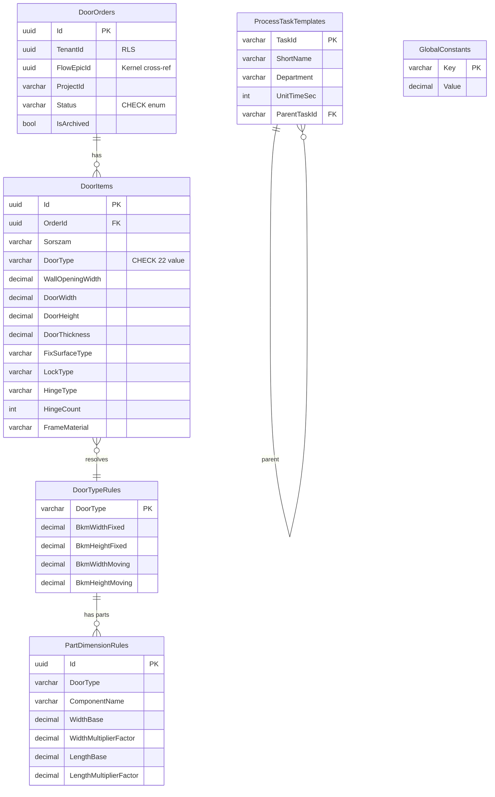

# SpaceOS — Modules.Joinery
## Ajtógyártás Domain Engine (L2 Layer — Teljes ajtó domain)

> **Verzió:** v4.0 — 2026-04-08
> **Státusz:** IMPLEMENTÁCIÓRA KÉSZ
> **Blokkoló feltétel:** Production Readiness Sprint DoD teljes
> **Kumulált review:** `/database-designer` + `/database-schema-designer` → v2 · `/senior-security` → v3 · `/senior-backend` → v4
> **Repo:** `spaceos-modules-joinery` (új polyrepo)
> **DB schema:** `spaceos_joinery` (meglévő PostgreSQL 16, Kernel mellett)
> **Kernel kapcsolat:** `FlowEpicId` FK — Handshake teremt Epic-et, DoorOrder az ImplementationDetail (ADR-008)

---

## 1. Kumulált Finding Összesítő (v1 → v4)

| Review | Finding-ek | Legfontosabb javítás | Effort delta |
|--------|-----------|----------------------|--------------|
| v1 → `/database-designer` + `/database-schema-designer` → v2 | 1 CRITICAL · 2 HIGH · 2 MEDIUM | door_items cross-tenant RLS hiánya · part_dimension_rules formula injection | +1 nap |
| v2 → `/senior-security` → v3 | 2 CRITICAL · 3 HIGH · 2 MEDIUM | DoorOrder FlowEpicId cross-tenant check · formula eval DoS · spaceos_joinery schema owner | +1.5 nap |
| v3 → `/senior-backend` → v4 | 0 CRITICAL · 3 HIGH · 2 MEDIUM | IDoorCalculationService determinizmus · IDataSeeder idempotencia · DoorItem FSM guard | +1 nap |
| **Összesen** | **3 CRITICAL · 8 HIGH · 6 MEDIUM** | | **~16 fejlesztői nap** |

### Finding részletek

| ID | Súly | Terület | Probléma | v_ javítás |
|----|------|---------|----------|------------|
| DB-01 | 🔴 CRITICAL | door_items RLS | door_items-en nincs közvetlen RLS — cross-tenant lekérdezés lehetséges | v2: RLS USING (order_id IN (SELECT id FROM door_orders WHERE tenant_id = current_setting(...)::uuid)) |
| DB-02 | 🟠 HIGH | part_dimension_rules | width_formula/length_formula varchar szabad szöveg → arbitrary expression execution | v2: formula mezők helyett offset + multiplier párok (decimal) — nincs eval |
| DB-03 | 🟠 HIGH | door_type enum | DoorType csak app-szinten validált — DB-szintű CHECK constraint hiányzik | v2: CHECK constraint az összes érvényes DoorType értékkel |
| DB-04 | 🟡 MEDIUM | process_task_templates | unit_time interval típus — EF Core 8 explicit config nélkül TimeSpan mapping problémás | v2: int (másodperc) tárolás, domain rétegben TimeSpan konverzió |
| DB-05 | 🟡 MEDIUM | global_constants | GlobalConstants bármely app role által módosítható | v2: REVOKE UPDATE/DELETE on global_constants FROM spaceos_app; csak schema_owner módosíthat |
| SEC-01 | 🔴 CRITICAL | FlowEpicId | DoorOrder.FlowEpicId nem validált — idegen tenant FlowEpicId-je linkelhetővé válik | v3: CreateDoorOrderCommandHandler: FlowEpic tenant ownership Kernel API hívással vagy JWT TenantId claim alapján |
| SEC-02 | 🔴 CRITICAL | formula engine | PartDimensionRule formula evalálása runtime-ban DoS / injection vektor | v3: DB-02 javítása kötelező; ha formula engine marad → sandboxed expression evaluator + whitelist; javasolt: statikus offset táblák |
| SEC-03 | 🟠 HIGH | schema owner | spaceos_joinery schema owner nem spaceos_schema_owner → RLS megkerülhető | v3: ALTER SCHEMA spaceos_joinery OWNER TO spaceos_schema_owner |
| SEC-04 | 🟠 HIGH | RBAC | DoorOrder submit/calculate endpoint-ok bármely authenticated user számára elérhető | v3: `[Authorize(Policy = "ManufacturerOnly")]` — TenantType=Manufacturer claim policy |
| SEC-05 | 🟠 HIGH | CuttingList cache | Számított CuttingList cacheelése esetén elavult szabály → hibás szabászat | v3: soha nem cacheelni — mindig on-demand kalkuláció; `Cache-Control: no-store` response header |
| SEC-06 | 🟡 MEDIUM | GlobalConstants tamper audit | GlobalConstants módosítása nem kelt domain eventet | v3: schema_owner módosítás → audit trigger (PostgreSQL trigger → AuditLog) |
| SEC-07 | 🟡 MEDIUM | DoorItem qty limit | Nincs felső korlát az Items count-on — 10.000 item egy OrderOn belül → OOM | v3: MaxItems = 500 validation rule (FluentValidation) |
| BE-01 | 🟠 HIGH | determinizmus | IDoorCalculationService statikus függvény kell — DateTime.Now, Random, external IO tiltott | v4: pure function, inject `IClock` ha dátum kell; tesztelhetőség biztosított |
| BE-02 | 🟠 HIGH | CalculateDoorOrder CQRS | Kalkuláció side effect, nem command — CalculateDoorOrderCommand szükséges, raises DoorOrderCalculated event | v4: önálló command, nem handler belső metódus |
| BE-03 | 🟠 HIGH | IDataSeeder | Konstans táblák (DoorTypeRules, CuttingConstants, PartDimensionRules, ProcessTaskTemplates) seed nélkül üres DB-n nem működnek | v4: IDataSeeder implementáció, ON CONFLICT DO NOTHING, startup-on fut |
| BE-04 | 🟡 MEDIUM | FSM guard | DoorItem módosítás Submitted státuszban nincs tiltva | v4: DoorOrder domain guard: if (Status != DoorOrderStatus.Draft) throw DomainException |
| BE-05 | 🟡 MEDIUM | Approved packages | Modules.Joinery új repo — package list nincs deklarálva | v4: CLAUDE.md-ben rögzítve: MediatR · FluentValidation · Ardalis.Result · Ardalis.Specification · EF Core 8 · Npgsql 8 · xUnit v3 · Moq |

---

## 2. Domain modell

### Solution struktúra (új repo)

```
spaceos-modules-joinery/
├── SpaceOS.Modules.Joinery.Domain/
│   ├── Aggregates/
│   │   ├── DoorOrder.cs
│   │   └── DoorOrderStatus.cs
│   ├── Entities/
│   │   └── DoorItem.cs
│   ├── ValueObjects/
│   │   ├── DoorDimensions.cs
│   │   ├── SurfaceSpec.cs
│   │   ├── CoatingSpec.cs
│   │   ├── GlazingSpec.cs
│   │   ├── HardwareSpec.cs
│   │   ├── MaterialSpec.cs
│   │   └── ProcessingSpec.cs
│   ├── Enums/
│   │   ├── DoorType.cs
│   │   ├── OpeningDirection.cs
│   │   └── SurfaceType.cs
│   ├── Events/
│   │   ├── DoorOrderCreated.cs
│   │   ├── DoorOrderSubmitted.cs
│   │   ├── DoorItemAdded.cs
│   │   └── DoorOrderCalculated.cs
│   ├── Services/
│   │   ├── IDoorCalculationService.cs
│   │   ├── IHardwareResolutionService.cs
│   │   ├── IProcessFlowService.cs
│   │   └── IMaterialRequirementService.cs
│   ├── Rules/
│   │   ├── DoorTypeRule.cs
│   │   ├── CuttingConstant.cs
│   │   ├── PartDimensionRule.cs
│   │   ├── ProcessTaskTemplate.cs
│   │   └── GlobalConstant.cs
│   └── Results/
│       ├── CuttingListItem.cs
│       ├── FinishedDimension.cs
│       ├── HardwareListItem.cs
│       ├── MaterialRequirement.cs
│       ├── ProcessTask.cs
│       └── QuantitySummary.cs
├── SpaceOS.Modules.Joinery.Application/
│   ├── Orders/
│   │   ├── Commands/CreateDoorOrderCommand.cs + Handler + Validator
│   │   ├── Commands/AddDoorItemCommand.cs + Handler + Validator
│   │   ├── Commands/CalculateDoorOrderCommand.cs + Handler
│   │   ├── Commands/SubmitDoorOrderCommand.cs + Handler
│   │   └── Queries/GetCuttingListQuery.cs + Handler
│   └── Seeding/
│       └── IDataSeeder.cs + DoorRulesDataSeeder.cs
├── SpaceOS.Modules.Joinery.Infrastructure/
│   ├── Persistence/
│   │   ├── JoineryDbContext.cs
│   │   └── Configurations/ (EF Core configurations)
│   ├── Services/
│   │   ├── DoorCalculationService.cs
│   │   ├── HardwareResolutionService.cs
│   │   ├── ProcessFlowService.cs
│   │   └── MaterialRequirementService.cs
│   └── Migrations/
├── SpaceOS.Modules.Joinery.Api/
│   └── Program.cs + Endpoints/
└── SpaceOS.Modules.Joinery.Tests/
```

### Aggregates

```csharp
// SpaceOS.Modules.Joinery.Domain/Aggregates/DoorOrder.cs

public sealed class DoorOrder : TenantScopedEntity  // Kernel pattern
{
    private readonly List<DoorItem> _items = new();

    public string ProjectId { get; private set; }       // DSMR — pl. "25119"
    public string ProjectName { get; private set; }
    public Guid FlowEpicId { get; private set; }        // Kernel FlowEpic FK (NOT NULL, ADR-008)
    public ProjectInfo ProjectInfo { get; private set; } // VO: client name, address, phone, delivery date
    public DoorOrderStatus Status { get; private set; }
    public IReadOnlyList<DoorItem> Items => _items.AsReadOnly();

    private DoorOrder() { }  // EF Core

    public static Result<DoorOrder> Create(
        Guid tenantId, Guid flowEpicId, string projectId, string projectName, ProjectInfo info)
    {
        if (string.IsNullOrWhiteSpace(projectId)) return Result.Invalid(new ValidationError("ProjectId required"));
        if (flowEpicId == Guid.Empty) return Result.Invalid(new ValidationError("FlowEpicId required"));

        var order = new DoorOrder
        {
            Id = Guid.NewGuid(),
            TenantId = tenantId,
            FlowEpicId = flowEpicId,
            ProjectId = projectId,
            ProjectName = projectName,
            ProjectInfo = info,
            Status = DoorOrderStatus.Draft
        };
        order.AddDomainEvent(new DoorOrderCreated(order.Id, tenantId, projectId));
        return Result.Success(order);
    }

    public Result AddItem(DoorItem item)
    {
        // BE-04: FSM guard
        if (Status != DoorOrderStatus.Draft)
            return Result.Error("Cannot add items to a non-Draft order");
        // SEC-07: max 500 item
        if (_items.Count >= 500)
            return Result.Error("Maximum 500 items per order");

        _items.Add(item);
        AddDomainEvent(new DoorItemAdded(Id, TenantId, item.Id));
        return Result.Success();
    }

    public Result Submit()
    {
        if (Status != DoorOrderStatus.Draft)
            return Result.Error($"Cannot submit order in {Status} status");
        if (!_items.Any())
            return Result.Error("Order must have at least one item");

        Status = DoorOrderStatus.Submitted;
        AddDomainEvent(new DoorOrderSubmitted(Id, TenantId));
        return Result.Success();
    }
}
```

### Enums

```csharp
// DoorType — Méret_Konstansok + Szab_Konstansok forrás
public enum DoorType
{
    Butorfront,         // Bútorfront
    Disztok,            // Dísztok
    FAF_T,              // Falba Ágyazott Forgó T
    FAF_TN,             // Falba Ágyazott Forgó TN
    FAF_TN_KetSzarny,   // FAF TN Kétszárnyú
    Falcos,             // Falcos
    Falsikban,          // Falsíkban
    FEF_T,              // Falsíkban Elhelyezett Forgó T
    FEF_T_KetSzarny,
    FEF_TN,
    FEF_TN_KetSzarny,
    Falpanel,
    Sikban,             // Síkban
    Tokba,
    Pivot,
    PivotDisztokkal,
    TUS_Tokba,
    TUT_Sikba,
    TPL_Sikba,
    TPS_Tokba,
    KetSzarny_Sikba,
    KetSzarny_Tokba
}

public enum DoorOrderStatus { Draft, Submitted, InProduction, Completed, Cancelled }
public enum OpeningDirection { Left, Right, Double, PivotLeft, PivotRight }
public enum SurfaceType { Painted, Foiled }
```

### Value Objects (kulcsak)

```csharp
// DoorDimensions — minden méret mm-ben, decimal
public sealed record DoorDimensions(
    decimal WallOpeningWidth,    // Ajtó Falnyílás Szélessége
    decimal DoorWidth,           // Ajtó Szélesség
    decimal WallOpeningHeight,   // Ajtó Falnyílás Magassága
    decimal DoorHeight,          // Ajtó Hosszúság (= magasság)
    decimal WallOpeningThickness,// Ajtó Falnyílás Vastagság
    decimal DoorThickness        // Ajtó Vastagság
)
{
    public static Result<DoorDimensions> Create(...)
    {
        if (DoorWidth > WallOpeningWidth) return Result.Invalid(...);
        if (DoorHeight > WallOpeningHeight) return Result.Invalid(...);
        if (DoorWidth <= 0 || DoorHeight <= 0) return Result.Invalid(...);
        return Result.Success(new DoorDimensions(...));
    }
}

// SurfaceSpec — Fix vagy Mozgó oldal spec-je
public sealed record SurfaceSpec(
    SurfaceType SurfaceType,
    string Color,
    string ColorCode,
    string Pattern,
    string PatternType,
    string PatternProfile,
    CoatingSpec? Coating,       // nullable — nem mindig van borítás
    bool HasBlende,
    bool HasWallPanel
);

// HardwareSpec — vasalatok
public sealed record HardwareSpec(
    string LockType,
    string LockSize,
    string StrikeType,
    string HandleType,
    string HandleColor,
    string HandleKit,
    bool KeyholeDrilling,
    bool AutoThreshold,
    bool PanelTensioner,
    string HingeType,
    int HingeCount,             // Pánt Darab — computed by rule if 0
    string HingeSpacing,        // Pánt Elosztás
    string HingeColor,
    string EdgeStripType,
    string EdgeStripColor,
    string SealType,
    string SealColor
);
```

### Domain Services (interfaces)

```csharp
// IDoorCalculationService — BE-01: pure, deterministic
public interface IDoorCalculationService
{
    // Input: DoorItem + aktuális szabályok snapshot
    // Output: CuttingList + FinishedDimensions
    // NINCS: DateTime.Now, Random, I/O — pure function
    IReadOnlyList<CuttingListItem> CalculateCuttingList(
        DoorItem item, DoorTypeRule rule, IReadOnlyList<PartDimensionRule> dimRules, GlobalConstants constants);

    IReadOnlyList<FinishedDimension> CalculateFinishedDimensions(
        DoorItem item, DoorTypeRule rule, IReadOnlyList<PartDimensionRule> dimRules, GlobalConstants constants);
}

// IHardwareResolutionService
public interface IHardwareResolutionService
{
    IReadOnlyList<HardwareListItem> Resolve(DoorItem item, DoorTypeRule rule);
}

// IProcessFlowService
public interface IProcessFlowService
{
    IReadOnlyList<ProcessTask> GenerateProcessPlan(
        DoorOrder order, IReadOnlyList<ProcessTaskTemplate> templates);
}
```

### Kalkuláció logika (Data-05.0.01 alapján)

```csharp
// SpaceOS.Modules.Joinery.Infrastructure/Services/DoorCalculationService.cs

public sealed class DoorCalculationService : IDoorCalculationService
{
    public IReadOnlyList<CuttingListItem> CalculateCuttingList(
        DoorItem item, DoorTypeRule rule, IReadOnlyList<PartDimensionRule> dimRules, GlobalConstants constants)
    {
        var results = new List<CuttingListItem>();
        var cuttingOversize = constants.CuttingOversize;  // 1mm

        // BKM méretek — Méret_Konstansok alapján
        var bkmWidthFixed = item.Dimensions.DoorWidth + rule.BkmWidthFixed;
        var bkmHeightFixed = item.Dimensions.DoorHeight + rule.BkmHeightFixed;
        var bkmWidthMoving = item.Dimensions.DoorWidth + rule.BkmWidthMoving;
        var bkmHeightMoving = item.Dimensions.DoorHeight + rule.BkmHeightMoving;

        // Komponensek — PartDimensionRules alapján
        foreach (var dimRule in dimRules.Where(r => r.DoorType == item.DoorType))
        {
            // DB-02 javítás: offset + multiplier párok, nem eval
            var width = dimRule.WidthBase + (dimRule.WidthMultiplierFactor * bkmWidthFixed) + cuttingOversize;
            var length = dimRule.LengthBase + (dimRule.LengthMultiplierFactor * bkmHeightFixed) + cuttingOversize;

            results.Add(new CuttingListItem(
                ItemSorszam: item.Sorszam,
                ComponentName: dimRule.ComponentName,
                Material: dimRule.Material,
                Thickness: dimRule.Thickness,
                Width: Math.Round(width, 1),
                Length: Math.Round(length, 1),
                Quantity: dimRule.Quantity * item.Quantity,
                ComponentType: dimRule.ComponentType
            ));
        }

        return results.AsReadOnly();
    }
}
```

### Calculated output records (nem persistált)

```csharp
public sealed record CuttingListItem(
    string ItemSorszam, string ComponentName, string Material,
    decimal Thickness, decimal Width, decimal Length, int Quantity, string ComponentType);

public sealed record FinishedDimension(
    string ItemSorszam, string ComponentName, decimal Width, decimal Length,
    int Quantity, string Material, string SurfaceType, string? Note);

public sealed record HardwareListItem(
    string ItemSorszam, string ComponentType, string Name,
    int Quantity, string Color, string? Note);

public sealed record MaterialRequirement(
    string Material, decimal Thickness, decimal TotalM2, decimal TotalLinearMeter);

public sealed record ProcessTask(
    string TaskId, string ShortName, string Description, string Department,
    TimeSpan UnitTime, int Headcount, string? ParentTaskId);

public sealed record QuantitySummary(
    int DoorLeafs, int FrameCores, int Cladding, int Blende,
    int FurnitureFront, int WallPanel, int Painted, int Foiled);
```

---

## 3. DB Schema

### DDL — spaceos_joinery schema

```sql
-- Migration 0001 — Initial schema (Modules.Joinery saját migration sorozat)

CREATE SCHEMA IF NOT EXISTS spaceos_joinery;
ALTER SCHEMA spaceos_joinery OWNER TO spaceos_schema_owner;  -- SEC-03

-- 1. door_orders
CREATE TABLE spaceos_joinery."DoorOrders" (
    "Id"            uuid            NOT NULL PRIMARY KEY DEFAULT gen_random_uuid(),
    "TenantId"      uuid            NOT NULL,
    "FlowEpicId"    uuid            NOT NULL,  -- Kernel FlowEpic FK (external ref, no FK constraint — cross-DB)
    "ProjectId"     varchar(30)     NOT NULL,
    "ProjectName"   varchar(200)    NOT NULL,
    "Status"        varchar(20)     NOT NULL DEFAULT 'Draft'
                    CHECK ("Status" IN ('Draft','Submitted','InProduction','Completed','Cancelled')),
    "ClientName"    varchar(200),
    "ClientAddress" varchar(500),
    "ClientPhone"   varchar(50),
    "DeliveryDate"  date,
    "IsArchived"    boolean         NOT NULL DEFAULT false,
    "CreatedAt"     timestamptz     NOT NULL DEFAULT NOW(),
    "UpdatedAt"     timestamptz     NOT NULL DEFAULT NOW()
);

-- 2. door_items
CREATE TABLE spaceos_joinery."DoorItems" (
    "Id"                    uuid            NOT NULL PRIMARY KEY DEFAULT gen_random_uuid(),
    "OrderId"               uuid            NOT NULL REFERENCES spaceos_joinery."DoorOrders"("Id") ON DELETE RESTRICT,
    "Sorszam"               varchar(5)      NOT NULL,
    "Name"                  varchar(200),
    "Quantity"              int             NOT NULL CHECK ("Quantity" > 0),
    "DoorType"              varchar(30)     NOT NULL
                            CHECK ("DoorType" IN (
                                'Butorfront','Disztok','FAF_T','FAF_TN','FAF_TN_KetSzarny',
                                'Falcos','Falsikban','FEF_T','FEF_T_KetSzarny','FEF_TN',
                                'FEF_TN_KetSzarny','Falpanel','Sikban','Tokba','Pivot',
                                'PivotDisztokkal','TUS_Tokba','TUT_Sikba','TPL_Sikba',
                                'TPS_Tokba','KetSzarny_Sikba','KetSzarny_Tokba'
                            )),
    "OpeningDirection"      varchar(15)     NOT NULL CHECK ("OpeningDirection" IN ('Left','Right','Double','PivotLeft','PivotRight')),
    -- DoorDimensions (EF OwnsOne)
    "WallOpeningWidth"      decimal(8,2)    NOT NULL,
    "DoorWidth"             decimal(8,2)    NOT NULL,
    "WallOpeningHeight"     decimal(8,2)    NOT NULL,
    "DoorHeight"            decimal(8,2)    NOT NULL,
    "WallOpeningThickness"  decimal(6,2)    NOT NULL,
    "DoorThickness"         decimal(6,2)    NOT NULL,
    -- SurfaceSpec Fix/Mozgó oldal (EF OwnsOne — JSON nem: DB-01 kapcsolódó döntés)
    "FixSurfaceType"        varchar(10)     CHECK ("FixSurfaceType" IN ('Painted','Foiled')),
    "FixColor"              varchar(100),
    "FixColorCode"          varchar(50),
    "FixPattern"            varchar(100),
    "FixPatternType"        varchar(50),
    "FixPatternProfile"     varchar(50),
    "FixCoatingColor"       varchar(100),
    "FixHasBlende"          boolean         NOT NULL DEFAULT false,
    "FixHasWallPanel"       boolean         NOT NULL DEFAULT false,
    "MovSurfaceType"        varchar(10)     CHECK ("MovSurfaceType" IN ('Painted','Foiled')),
    "MovColor"              varchar(100),
    "MovColorCode"          varchar(50),
    "MovPattern"            varchar(100),
    "MovPatternType"        varchar(50),
    "MovPatternProfile"     varchar(50),
    "MovCoatingColor"       varchar(100),
    "MovHasBlende"          boolean         NOT NULL DEFAULT false,
    "MovHasWallPanel"       boolean         NOT NULL DEFAULT false,
    -- GlazingSpec
    "GlazingType"           varchar(50),
    "GlazingColor"          varchar(50),
    "GlazingStyle"          varchar(50),
    "GlazingPattern"        varchar(50),
    -- HardwareSpec
    "LockType"              varchar(50),
    "LockSize"              varchar(30),
    "StrikeType"            varchar(50),
    "HandleType"            varchar(50),
    "HandleColor"           varchar(50),
    "HandleKit"             varchar(50),
    "KeyholeDrilling"       boolean         NOT NULL DEFAULT false,
    "AutoThreshold"         boolean         NOT NULL DEFAULT false,
    "PanelTensioner"        boolean         NOT NULL DEFAULT false,
    "HingeType"             varchar(50),
    "HingeCount"            int             DEFAULT 0,
    "HingeSpacing"          varchar(50),
    "HingeColor"            varchar(50),
    "EdgeStripType"         varchar(50),
    "EdgeStripColor"        varchar(50),
    "SealType"              varchar(50),
    "SealColor"             varchar(50),
    -- MaterialSpec
    "FrameMaterial"         varchar(100),
    "InsertMaterial"        varchar(100),
    "CladMaterial"          varchar(100),
    "FrameCoreMaterial"     varchar(100),
    "BlendeMaterial"        varchar(100),
    "CoatingMaterial"       varchar(100),
    -- ProcessingSpec
    "CncProcessing"         varchar(200),
    "PanelProcessing"       varchar(200),
    "FrameProcessing"       varchar(200),
    "Note"                  text
);

-- 3. Konstans + szabálytáblák (shared config — tenant-független)

CREATE TABLE spaceos_joinery."DoorTypeRules" (
    "DoorType"          varchar(30)     NOT NULL PRIMARY KEY,
    "AjtólapCount"      int             NOT NULL DEFAULT 1,
    "BkmWidthFixed"     decimal(6,2)    NOT NULL DEFAULT 0,
    "BkmHeightFixed"    decimal(6,2)    NOT NULL DEFAULT 0,
    "BkmWidthMoving"    decimal(6,2)    NOT NULL DEFAULT 0,
    "BkmHeightMoving"   decimal(6,2)    NOT NULL DEFAULT 0
);

CREATE TABLE spaceos_joinery."CuttingConstants" (
    "Id"                    uuid            NOT NULL PRIMARY KEY DEFAULT gen_random_uuid(),
    "DoorType"              varchar(30)     NOT NULL,
    "ComponentSlot"         varchar(50)     NOT NULL,  -- pl. 'Keret_Vizszintes', 'Keret_Fuggoleges'
    "FrameMaterialH"        varchar(100),
    "FrameThicknessH"       decimal(6,2),
    "FrameWidthOffsetH"     decimal(6,2),
    "FrameLengthOffsetH"    decimal(6,2),
    "FrameCountH"           int,
    "FrameMaterialV"        varchar(100),
    "FrameThicknessV"       decimal(6,2),
    "FrameWidthOffsetV"     decimal(6,2),
    "FrameLengthOffsetV"    decimal(6,2),
    "FrameCountV"           int
);

CREATE TABLE spaceos_joinery."PartDimensionRules" (
    "Id"                    uuid            NOT NULL PRIMARY KEY DEFAULT gen_random_uuid(),
    "DoorType"              varchar(30)     NOT NULL,
    "ComponentName"         varchar(100)    NOT NULL,
    "ComponentType"         varchar(50)     NOT NULL,  -- 'Frame', 'Insert', 'Clad', 'FrameCore', 'Blende', 'Coating'
    "Quantity"              int             NOT NULL DEFAULT 1,
    "Material"              varchar(100),
    "Thickness"             decimal(6,2),
    -- DB-02 javítás: offset + multiplier, nem szabad formula string
    "WidthBase"             decimal(8,3)    NOT NULL DEFAULT 0,   -- konstans mm tag
    "WidthMultiplierFactor" decimal(6,4)    NOT NULL DEFAULT 1,   -- BKM/mert szorzó
    "LengthBase"            decimal(8,3)    NOT NULL DEFAULT 0,
    "LengthMultiplierFactor" decimal(6,4)  NOT NULL DEFAULT 1
);

CREATE TABLE spaceos_joinery."ProcessTaskTemplates" (
    "TaskId"        varchar(20)     NOT NULL PRIMARY KEY,  -- pl. 'GyI-E.01'
    "ShortName"     varchar(100)    NOT NULL,
    "Description"   varchar(500),
    "Department"    varchar(50),
    "UnitTimeSec"   int             NOT NULL DEFAULT 0,     -- DB-04: int másodperc, nem interval
    "Headcount"     int             NOT NULL DEFAULT 1,
    "ParentTaskId"  varchar(20)     REFERENCES spaceos_joinery."ProcessTaskTemplates"("TaskId") ON DELETE SET NULL
);

CREATE TABLE spaceos_joinery."GlobalConstants" (
    "Key"   varchar(50)     NOT NULL PRIMARY KEY,
    "Value" decimal(10,4)   NOT NULL
);
-- Seeded: ('CuttingOversize', 1), ('CladdingOverhang', 0.2), ('MatyiWidth', 4.6)

-- DB-05: GlobalConstants csak schema_owner módosíthatja
REVOKE UPDATE, DELETE, INSERT ON spaceos_joinery."GlobalConstants" FROM spaceos_app;
GRANT SELECT ON spaceos_joinery."GlobalConstants" TO spaceos_app;
```

### Indexek

```sql
-- DoorOrders
CREATE INDEX "IX_DoorOrders_TenantId" ON spaceos_joinery."DoorOrders" ("TenantId");
CREATE INDEX "IX_DoorOrders_FlowEpicId" ON spaceos_joinery."DoorOrders" ("FlowEpicId");
CREATE INDEX "IX_DoorOrders_TenantId_Status" ON spaceos_joinery."DoorOrders" ("TenantId", "Status")
    WHERE "IsArchived" = false;

-- DoorItems
CREATE INDEX "IX_DoorItems_OrderId" ON spaceos_joinery."DoorItems" ("OrderId");

-- Rules
CREATE INDEX "IX_PartDimensionRules_DoorType" ON spaceos_joinery."PartDimensionRules" ("DoorType");
CREATE INDEX "IX_CuttingConstants_DoorType" ON spaceos_joinery."CuttingConstants" ("DoorType");
```

### RLS

```sql
-- DoorOrders
ALTER TABLE spaceos_joinery."DoorOrders" ENABLE ROW LEVEL SECURITY;
ALTER TABLE spaceos_joinery."DoorOrders" FORCE ROW LEVEL SECURITY;
CREATE POLICY "DoorOrders_tenant_isolation" ON spaceos_joinery."DoorOrders"
    USING ("TenantId" = current_setting('app.tenant_id')::uuid);

-- DoorItems (DB-01: cross-tenant isolation subquery-vel)
ALTER TABLE spaceos_joinery."DoorItems" ENABLE ROW LEVEL SECURITY;
ALTER TABLE spaceos_joinery."DoorItems" FORCE ROW LEVEL SECURITY;
CREATE POLICY "DoorItems_tenant_isolation" ON spaceos_joinery."DoorItems"
    USING ("OrderId" IN (
        SELECT "Id" FROM spaceos_joinery."DoorOrders"
        WHERE "TenantId" = current_setting('app.tenant_id')::uuid
    ));

-- Szabálytáblák: nincs RLS (tenant-független config)
```

### ERD



---

## 4. API surface

```
POST   /api/orders                        CreateDoorOrder
POST   /api/orders/{id}/items             AddDoorItem
POST   /api/orders/{id}/calculate         CalculateDoorOrder → CuttingListResponse
GET    /api/orders/{id}/cutting-list      GetCuttingList
GET    /api/orders/{id}/process-plan      GetProcessPlan
GET    /api/orders/{id}/hardware-list     GetHardwareList
GET    /api/orders/{id}/material-req      GetMaterialRequirements
POST   /api/orders/{id}/submit            SubmitDoorOrder
GET    /api/orders                        ListDoorOrders (paged, Ardalis.Specification)
GET    /api/orders/{id}                   GetDoorOrder
```

Minden endpoint: `[Authorize(Policy = "ManufacturerOnly")]` — SEC-04.

---

## 5. EF Core konfiguráció

```csharp
// JoineryDbContext.cs
public class JoineryDbContext : DbContext
{
    public DbSet<DoorOrder> DoorOrders => Set<DoorOrder>();
    public DbSet<DoorItem> DoorItems => Set<DoorItem>();
    public DbSet<DoorTypeRule> DoorTypeRules => Set<DoorTypeRule>();
    public DbSet<PartDimensionRule> PartDimensionRules => Set<PartDimensionRule>();
    public DbSet<ProcessTaskTemplate> ProcessTaskTemplates => Set<ProcessTaskTemplate>();
    public DbSet<GlobalConstant> GlobalConstants => Set<GlobalConstant>();

    protected override void OnModelCreating(ModelBuilder mb)
    {
        mb.HasDefaultSchema("spaceos_joinery");
        mb.ApplyConfigurationsFromAssembly(typeof(JoineryDbContext).Assembly);
    }
}

// DoorItemConfiguration.cs — OwnsOne minden VO-hoz (DB-01 javítás: nem JSONB)
public class DoorItemConfiguration : IEntityTypeConfiguration<DoorItem>
{
    public void Configure(EntityTypeBuilder<DoorItem> builder)
    {
        builder.OwnsOne(e => e.Dimensions, d => {
            d.Property(x => x.WallOpeningWidth).HasColumnName("WallOpeningWidth");
            // ... többi méret
        });
        builder.OwnsOne(e => e.FixSide, s => { /* ... */ });
        builder.OwnsOne(e => e.MovingSide, s => { /* ... */ });
        builder.OwnsOne(e => e.Glazing, g => { /* ... */ });
        builder.OwnsOne(e => e.Hardware, h => { /* ... */ });
        builder.OwnsOne(e => e.Materials, m => { /* ... */ });
        builder.OwnsOne(e => e.Processing, p => { /* ... */ });
    }
}
```

---

## 6. Data Seeder (BE-03)

```csharp
// DoorRulesDataSeeder.cs — Data-05.0.01 konstansok C#-ban

public sealed class DoorRulesDataSeeder : IDataSeeder
{
    private readonly JoineryDbContext _db;

    public async Task SeedAsync(CancellationToken ct)
    {
        // GlobalConstants — ON CONFLICT DO NOTHING (idempotent)
        await _db.Database.ExecuteSqlRawAsync("""
            INSERT INTO spaceos_joinery."GlobalConstants" ("Key","Value")
            VALUES ('CuttingOversize', 1), ('CladdingOverhang', 0.2), ('MatyiWidth', 4.6)
            ON CONFLICT ("Key") DO NOTHING
            """, ct).ConfigureAwait(false);

        // DoorTypeRules — Méret_Konstansok forrás
        var rules = new[]
        {
            new DoorTypeRule { DoorType = DoorType.Disztok,   AjtólapCount = 0, BkmWidthFixed = 8,   BkmHeightFixed = 4,   BkmWidthMoving = 1,    BkmHeightMoving = -4  },
            new DoorTypeRule { DoorType = DoorType.FAF_T,     AjtólapCount = 1, BkmWidthFixed = 8,   BkmHeightFixed = 4,   BkmWidthMoving = 2,    BkmHeightMoving = -4  },
            new DoorTypeRule { DoorType = DoorType.FAF_TN,    AjtólapCount = 1, BkmWidthFixed = 0,   BkmHeightFixed = 0,   BkmWidthMoving = 0,    BkmHeightMoving = 0   },
            new DoorTypeRule { DoorType = DoorType.Falsikban, AjtólapCount = 1, BkmWidthFixed = 1,   BkmHeightFixed = 0,   BkmWidthMoving = 0,    BkmHeightMoving = 0   },
            // ... teljes lista Data-05.0.01 alapján
        };

        foreach (var rule in rules)
        {
            await _db.Database.ExecuteSqlRawAsync("""
                INSERT INTO spaceos_joinery."DoorTypeRules"
                VALUES (@type, @count, @bwf, @bhf, @bwm, @bhm)
                ON CONFLICT ("DoorType") DO NOTHING
                """, /* parameters */ ct).ConfigureAwait(false);
        }

        // ProcessTaskTemplates — Feladat_Egység_idő forrás
        // GyI-E.01..GyI-E.11, GyI-T.01..GyI-T.13, GyV-B.01..GyV-B.xx stb.
        await SeedProcessTasksAsync(ct).ConfigureAwait(false);
    }
}
```

---

## 7. CLAUDE.md (repo gyökér)

```markdown
# SpaceOS.Modules.Joinery — CLAUDE.md

## Stack
- .NET 8, Clean Architecture + DDD + CQRS
- PostgreSQL 16 schema: spaceos_joinery
- EF Core 8 + Npgsql 8

## Approved packages
MediatR · FluentValidation · Ardalis.Result · Ardalis.Specification
EF Core 8 · Npgsql 8 · xUnit v3 · Moq

## Golden Rules (azonos a Kernel-lel)
1. No public setters on aggregates
2. Business logic in Domain only
3. Every mutation raises domain event
4. PopDomainEvents() + DispatchAsync() minden mutating handler végén
5. Every list query through Ardalis.Specification
6. Result<T> return type on every handler
7. ConfigureAwait(false) minden production async call-ban
8. AsNoTracking() minden read-only method-ban

## Kritikus szabályok
- CuttingList soha nem cache-elhető — mindig on-demand (SEC-05)
- DoorOrder.AddItem() csak Draft státuszban (BE-04)
- IDoorCalculationService: pure function — nincs DateTime.Now, Random, I/O
- PartDimensionRule: WidthBase + WidthMultiplierFactor — nincs szabad formula eval (DB-02)
- FlowEpicId: minden DoorOrder-nek van — Handshake teremt Epic-et (ADR-008)
```

---

## 8. Definition of Done

### Migration gates

- [ ] `spaceos_joinery` schema létrehozva, owner: `spaceos_schema_owner`
- [ ] Migrations 0001–0003 alkalmazva (DoorOrders, DoorItems, Rules + seed)
- [ ] RLS aktív: `ALTER TABLE ... FORCE ROW LEVEL SECURITY` — ellenőrzés: `\d DoorOrders`
- [ ] GlobalConstants read-only app role-nak: `SELECT has_table_privilege('spaceos_app','spaceos_joinery.GlobalConstants','INSERT')` → false
- [ ] `EXPLAIN ANALYZE GET /api/orders` → Index Scan (nem Seq Scan)
- [ ] Seed adatok: `SELECT COUNT(*) FROM spaceos_joinery."DoorTypeRules"` → ≥ 15 sor
- [ ] Seed adatok: `SELECT COUNT(*) FROM spaceos_joinery."ProcessTaskTemplates"` → ≥ 40 sor

### Domain gates

- [ ] `DoorOrder.Create()` → `DoorOrderCreated` event
- [ ] `DoorOrder.Submit()` → `DoorOrderSubmitted` event
- [ ] `DoorOrder.AddItem()` Submitted állapotban → `Result.Error` (BE-04)
- [ ] 500+ item hozzáadása → `Result.Error` (SEC-07)
- [ ] `IDoorCalculationService` tesztelhetőség: mock rules-szal determinisztikus output
- [ ] `DoorCalculationService` BKM számítás: FAF_T door, BkmWidthFixed=8 → width = input + 8 (unit teszt)
- [ ] `DoorCalculationService` CuttingOversize: minden darab +1mm (unit teszt)
- [ ] `HardwareResolutionService` HingeCount: 0 bemenetre → rule alapján számított érték

### API + validation gates

- [ ] `POST /api/orders` FlowEpicId = Guid.Empty → 400 (FluentValidation)
- [ ] `POST /api/orders/{id}/calculate` → `200 OK` + `CuttingListResponse` legalább 1 item-mel
- [ ] `GET /api/orders/{id}/cutting-list` → `Cache-Control: no-store` header (SEC-05)
- [ ] Unauthenticated request → 401
- [ ] Non-Manufacturer tenant → 403 (SEC-04)
- [ ] DoorType invalid érték → 400 FluentValidation error

### Security gates (deployment blocker)

- [ ] Cross-tenant query: `app.tenant_id=A` beállítva → Tenant B DoorOrder-jei nem láthatók
- [ ] Cross-tenant DoorItem: subquery RLS teszt — idegen tenant item-je nem listázódik (DB-01)
- [ ] FlowEpicId ownership check: idegen tenant FlowEpicId → 403 (SEC-01)
- [ ] `spaceos_joinery` schema owner: `SELECT nspowner::regrole FROM pg_namespace WHERE nspname='spaceos_joinery'` → `spaceos_schema_owner`

### Összesített

- [ ] Meglévő **1452** teszt zöld (Kernel + Orchestrator + Portal + E2E)
- [ ] Modules.Joinery új tesztek: **≥ 65 db** (domain 25 · calculation 20 · API 15 · security 5)
- [ ] `0` build warning
- [ ] `ConfigureAwait(false)` minden production async call-ban
- [ ] `dotnet list package --vulnerable → 0` high/critical
- [ ] `grep -r "BuildServiceProvider" --include="*.cs"` → 0

---

## 9. Security adósság státusz

| ID | Tétel | Előző sprint | Ez a sprint | Marad |
|----|-------|-------------|-------------|-------|
| — | Modules réteg nincs | ❌ | ✅ Modules.Joinery v1 kész | Modules.Cabinet következő |
| — | Door domain logika Excel-ben | ❌ | ✅ C# DomainService + CalculationEngine | — |
| ADR-008 | ImplementationDetail soha nem hagyja el a tenant node-ját | ✅ | ✅ CuttingList/HardwareList nem API response-ban, hanem Modules-ban marad | — |

---

## 10. Mi jön utána

| Fázis | Tartalom | Blokkoló |
|-------|----------|---------|
| Modules.Joinery v2 | Document generation: PDF Gyártásilap, Szabászati lista export | v1 DoD teljes |
| Modules.Cabinet | Szekrénygyártás domain (második L2 modul) | v1 pattern megvan |
| Escrow WORM upgrade | S3 Object Lock — true WORM | Doorstar pilot live |
| asztalostech.hu second brand | Második brand konfiguráció | Modules.Cabinet v1 |

---

## 11. Claude Code implementációs csomag

### Végrehajtási sorrend

| Nap | Feladat | Track | Függőség |
|-----|---------|-------|----------|
| 1 | Repo scaffold: solution + 5 project + CLAUDE.md + approved packages | Domain | — |
| 2 | Domain enums + Value Objects + DoorOrder aggregate + DoorItem entity | Domain | Nap 1 |
| 3 | Domain events + domain service interfaces + Result records (CuttingListItem stb.) | Domain | Nap 2 |
| 4 | EF Core: JoineryDbContext + DoorItemConfiguration (OwnsOne minden VO) + Migration 0001 | Infra | Nap 2 |
| 5 | RLS migration 0002 + GlobalConstants 0003 + DoorTypeRules seeder | Infra | Nap 4 |
| 6 | DoorCalculationService — BKM kalkuláció + PartDimensionRules offset logic | Infra | Nap 3 |
| 7 | HardwareResolutionService + ProcessFlowService + MaterialRequirementService | Infra | Nap 6 |
| 8 | Application: CreateDoorOrderCommand + AddDoorItemCommand + Validators | App | Nap 3 |
| 9 | Application: CalculateDoorOrderCommand + SubmitDoorOrderCommand + GetCuttingListQuery | App | Nap 8 |
| 10 | API: Minimal API endpoints + ManufacturerOnly policy + Cache-Control header | Api | Nap 9 |
| 11 | IDataSeeder: GlobalConstants + DoorTypeRules + CuttingConstants + ProcessTaskTemplates seeding | Infra | Nap 5 |
| 12–14 | Tests: domain 25 + calculation 20 + API 15 + security 5 = ≥ 65 | Tests | Nap 10 |
| 15 | DoD checklist + EXPLAIN ANALYZE + security gate ellenőrzés | QA | Nap 14 |
| 16 | Buffer / hotfix / VPS deploy | VPS | Nap 15 |

### Agent utasítás

> "Implementáld a `SpaceOS_Modules_Joinery_v4.md` szerint a következő feladatokat:
> Sorrend: Domain réteg → Infrastructure (EF Core + Services) → Application (CQRS) → API → Tests
> Repo: `spaceos-modules-joinery` (külön polyrepo, saját .NET solution)
> DB schema: `spaceos_joinery` — NEM a Kernel DB context-je, külön JoineryDbContext
> Kritikus: IDoorCalculationService pure function — nincs I/O, DateTime.Now, cache
> Kritikus: PartDimensionRule.WidthBase + WidthMultiplierFactor — nincs formula eval
> Kritikus: DoorItems RLS subquery-vel (DB-01 finding)
> Seed: IDataSeeder futtatása startup-on — ON CONFLICT DO NOTHING
> DoD checklist: Section 8
> Minden feladat után futtasd: `dotnet test && dotnet build`"

### Kockázatok és mitigációk

| Kockázat | Valószínűség | Hatás | Mitigáció |
|----------|-------------|-------|-----------|
| Data-05 konstansok hibás átfordítása C#-ba | Közepes | Magas | Excel → C# unit teszt: minden DoorType-ra 1 példa kalkuláció manuálisan ellenőrizve |
| PartDimensionRule formula logika nem fedi le az összes Szab_Konstansok esetet | Közepes | Magas | Doorstar QA: minden típusra referencia CuttingList Excel vs. Service output összehasonlítás |
| FlowEpicId cross-tenant validation Kernel API hívás nélkül — JWT claim alapján | Alacsony | Közepes | TenantId claim === DoorOrder.TenantId check — szinkron, nincs Kernel roundtrip |
| EF OwnsOne 7 VO egy táblában → nagyon széles tábla (~100 oszlop) | Alacsony | Alacsony | PostgreSQL limitálás ~1600 oszlop; 100 oszlop elfogadható |

---

*SpaceOS · Modules.Joinery v4.0 · database-designer + database-schema-designer + senior-security + senior-backend reviewed · 2026-04-08*
*Státusz: IMPLEMENTÁCIÓRA KÉSZ — 17 finding beépítve, minden döntés lezárva*
