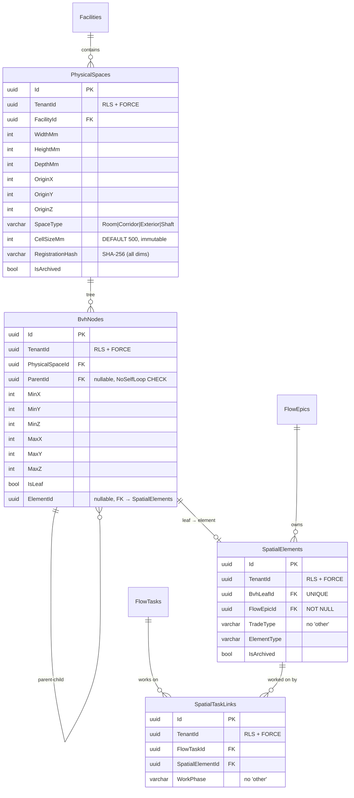

# SpaceOS — Phase 3A Architecture
## Spatial BIM Core + Modules.Joinery + 4D Timeline

> Verzió: v3.0 — 2026-04-06
> Státusz: **IMPLEMENTÁCIÓRA KÉSZ — végleges tervdokumentum**
> Blokkoló feltétel: Phase 2 DoD teljes (T-01..T-08 zöld)
> Referencia ügyfél: Doorstar Kft. — első Modules.Joinery derivátum
> Kumulált review: `/database-designer` + `/database-schema-designer` → v2 · `/senior-security` → v3 · `/senior-backend` → v3

---

## 1. Kumulált Finding Összesítő (v1 → v3)

| Review | Finding-ek | Legfontosabb javítás | Effort delta |
|---|---|---|---|
| v1 → `/database-designer` + `/database-schema-designer` → v2 | 3 DB finding | 6 int AABB oszlop (nem JSONB); UNIQUE constraint SpatialTaskLinks-en; CHECK constraint BvhNode leaf/element integritásra | +0.5 nap |
| v2 → `/senior-security` → v3 | 3C + 5H + 3M | Table ownership (FORCE RLS bypass); cross-tenant SpatialTaskLink trigger; BVH cycle guard; RegistrationHash input spec; `'other'` enum eltávolítva | +1 nap |
| v2 → `/senior-backend` → v3 | 2C + 5H + 4M | `_nodes` eager load eltávolítva; `InsertBvhNodeCommandHandler` → belső `IBvhTreeService`; async recursive BVH; FluentValidation minden Command-hoz; pagináció; `SpatialGrid` VO; `TenantId` base class; EF Core `OwnsOne`; domain events | +1.5 nap |
| **Összesen** | **5C + 10H + 7M = 22 finding** | **Becsült effort: ~3 nap extra a v2-höz képest** | |

---

## 2. Modules.Joinery hierarchia

```
Modules.Joinery (base Driver — Layer 2)
├── OpeningElement
│     ├── DimensionRules              ← ráhagyások, tokok, küszöbmagasság
│     └── SpatialContractGenerator   ← AABB kiszámítása a Kernel számára
├── CarcassElement                   ← szekrény / korpusz
└── ShelfElement                     ← polc, osztó

Modules.Joinery.Door (Doorstar brand skin)
├── DoorProduct                      ← OpeningElement-ből derivált
│     ├── LeafCount                  ← egy- vagy kétszárnyú
│     ├── SwingDirection             ← nyílásirány
│     ├── HardwareSpec               ← Blum/Hettich pánt pozíciók
│     └── CNCExport                  ← vágáslista, marási utasítások
└── DoorManufacturingOrder           ← Doorstar-specifikus gyártási rekord
```

**Elv: deriváció, nem duplikáció.** Cabinet és Window branch ugyanebből az alapból nő ki.

---

## 3. Adatszuverenitás — ADR-008

**Szabály: szerver határon kizárólag `SpatialContract` utazhat.**

| Adat | Utazhat? | Hol él |
|---|---|---|
| AABB (min/max pont), TradeType, FsmState, reachedAt | ✓ Igen | `SpatialContractsView` — publikus |
| Anyagspec, lapméret, vasalat pozíció | ✗ Soha | ImplementationDetail — owner Node only |
| CNC vágáslista, árak, munkaidő | ✗ Soha | ImplementationDetail — owner Node only |
| ElementType (Driver-specifikus osztályozás) | ✗ Soha | `SpatialContractsView`-ból SZÁNDÉKOSAN KIZÁRVA |

**RBAC rétegek:**

| Szerepkör | Látja | Nem látja |
|---|---|---|
| Designer / Megrendelő | Minden AABB + TradeType + FsmState | Egyetlen ImplementationDetail sem |
| Doorstar (ajtógyártó) | Saját DoorProduct + más trade AABB (clearance) | Más trade implementációja |
| MEP (gépész/villany) | Fal + szekrény + ajtó AABB | Sem ajtó, sem szekrény implementáció |

---

## 4. Kernel Domain modell

### 4.1 Aggregátum határok

**`PhysicalSpace` — aggregate root (BE-P3A-01 fix: `_nodes` eltávolítva)**

```csharp
// Domain/Aggregates/PhysicalSpace.cs
public sealed class PhysicalSpace : AggregateRoot
{
    public Guid TenantId              { get; private set; }   // BE-P3A-07
    public FacilityId FacilityId      { get; private set; }
    public DimensionVector Dimensions { get; private set; }   // VO: W×H×D mm
    public Point3D Origin             { get; private set; }   // VO: X,Y,Z mm
    public SpaceType SpaceType        { get; private set; }
    public int CellSizeMm             { get; private set; }   // immutable after first BvhNode
    public string RegistrationHash    { get; private set; }   // SHA-256 (SEC-P3A-05 spec)

    // NINCS _nodes navigation — BE-P3A-01 fix
    // BvhNode fa kezelése: IBvhRepository + IBvhTreeService (belső)

    public static PhysicalSpace Register(
        Guid tenantId, FacilityId facilityId,
        DimensionVector dims, Point3D origin,
        SpaceType type, int cellSizeMm = 500)
    {
        var space = new PhysicalSpace
        {
            TenantId          = tenantId,
            FacilityId        = facilityId,
            Dimensions        = dims,
            Origin            = origin,
            SpaceType         = type,
            CellSizeMm        = cellSizeMm,
            RegistrationHash  = ComputeRegistrationHash(
                tenantId, facilityId, dims, origin, type, cellSizeMm, DateTimeOffset.UtcNow)
        };
        space.RaiseDomainEvent(new PhysicalSpaceRegisteredEvent(
            space.Id, tenantId, facilityId.Value, type.ToString(),
            dims.WidthMm, dims.HeightMm, dims.DepthMm));
        return space;
    }

    // SEC-P3A-05: determinisztikus hash — minden méretadat + timestamp
    private static string ComputeRegistrationHash(
        Guid tenantId, FacilityId facilityId,
        DimensionVector dims, Point3D origin,
        SpaceType type, int cellSizeMm, DateTimeOffset createdAt)
    {
        var input = string.Join("|",
            tenantId.ToString("D"), facilityId.Value.ToString("D"),
            dims.WidthMm, dims.HeightMm, dims.DepthMm,
            origin.X, origin.Y, origin.Z,
            type.ToString(), cellSizeMm,
            createdAt.ToUnixTimeMilliseconds());
        return Convert.ToHexString(
            SHA256.HashData(Encoding.UTF8.GetBytes(input))).ToLowerInvariant();
    }
}
```

**`TenantScopedEntity` — base class (BE-P3A-07)**

```csharp
// Domain/Common/TenantScopedEntity.cs
public abstract class TenantScopedEntity : Entity
{
    public Guid TenantId { get; protected set; }
}
```

**`BvhNode` — entity (BE-P3A-03 fix: nincs `_children` navigation)**

```csharp
// Domain/Entities/BvhNode.cs
public sealed class BvhNode : TenantScopedEntity
{
    public Guid PhysicalSpaceId { get; private set; }
    public Guid? ParentId       { get; private set; }   // null = root
    public BoundingBox BoundingBox { get; private set; }
    public bool IsLeaf          { get; private set; }
    public Guid? ElementId      { get; private set; }   // only when IsLeaf = true

    // NINCS _children navigation — BE-P3A-03 fix
    // Gyerekek betöltése: IBvhRepository.GetChildrenAsync()
}
```

**`SpatialElement` — entity**

```csharp
// Domain/Entities/SpatialElement.cs
public sealed class SpatialElement : TenantScopedEntity
{
    public Guid BvhLeafId    { get; private set; }
    public Guid FlowEpicId   { get; private set; }  // NOT NULL
    public TradeType TradeType { get; private set; }
    public string ElementType  { get; private set; }
    public bool IsArchived     { get; private set; }
}
```

**`SpatialTaskLink` — join entity**

```csharp
// Domain/Entities/SpatialTaskLink.cs
public sealed class SpatialTaskLink : TenantScopedEntity
{
    public Guid FlowTaskId        { get; private set; }
    public Guid SpatialElementId  { get; private set; }
    public WorkPhase WorkPhase    { get; private set; }
}
```

**Value Objects**

```csharp
// Domain/ValueObjects/BoundingBox.cs
public sealed record BoundingBox(
    int MinX, int MinY, int MinZ,
    int MaxX, int MaxY, int MaxZ)
{
    public bool Intersects(BoundingBox other) =>
        MinX <= other.MaxX && MaxX >= other.MinX &&
        MinY <= other.MaxY && MaxY >= other.MinY &&
        MinZ <= other.MaxZ && MaxZ >= other.MinZ;
}

// Domain/ValueObjects/SpatialGrid.cs  — BE-P3A-06
public sealed record SpatialGrid(
    Guid PhysicalSpaceId,
    int CellSizeMm,
    int WidthCells,   // ceil(WidthMm / CellSizeMm)
    int DepthCells)   // ceil(DepthMm / CellSizeMm)
{
    public static SpatialGrid From(PhysicalSpace space) => new(
        space.Id,
        space.CellSizeMm,
        (int)Math.Ceiling((double)space.Dimensions.WidthMm / space.CellSizeMm),
        (int)Math.Ceiling((double)space.Dimensions.DepthMm / space.CellSizeMm));

    public IEnumerable<GridCell> GetIntersectingCells(BoundingBox query)
    {
        int colMin = Math.Max(0, query.MinX / CellSizeMm);
        int colMax = Math.Min(WidthCells - 1, query.MaxX / CellSizeMm);
        int rowMin = Math.Max(0, query.MinZ / CellSizeMm);
        int rowMax = Math.Min(DepthCells - 1, query.MaxZ / CellSizeMm);
        for (int col = colMin; col <= colMax; col++)
            for (int row = rowMin; row <= rowMax; row++)
                yield return new GridCell(col, row);
    }
}

// Domain/ValueObjects/DimensionVector.cs
public sealed record DimensionVector(int WidthMm, int HeightMm, int DepthMm);

// Domain/ValueObjects/Point3D.cs
public sealed record Point3D(int X, int Y, int Z);
```

### 4.2 Domain Events (BE-P3A-08)

```csharp
// Domain/Events/PhysicalSpaceRegisteredEvent.cs
public sealed record PhysicalSpaceRegisteredEvent(
    Guid PhysicalSpaceId, Guid TenantId, Guid FacilityId,
    string SpaceType, int WidthMm, int HeightMm, int DepthMm)
    : IDomainEvent;

// Domain/Events/SpatialElementRegisteredEvent.cs
public sealed record SpatialElementRegisteredEvent(
    Guid ElementId, Guid PhysicalSpaceId,
    Guid FlowEpicId, string TradeType)
    : IDomainEvent;

// Domain/Events/SpatialCollisionDetectedEvent.cs
public sealed record SpatialCollisionDetectedEvent(
    Guid ElementIdA, Guid ElementIdB,
    BoundingBox IntersectionVolume)
    : IDomainEvent;
```

### 4.3 BVH Domain Service (BE-P3A-01 + BE-P3A-02 + BE-P3A-03 + SEC-P3A-03 + SEC-P3A-07)

```csharp
// Application/Services/IBvhTreeService.cs  — BELSŐ, nem nyilvános API
public interface IBvhTreeService
{
    /// <summary>
    /// Inserts a SpatialElement into the BVH tree.
    /// Tree restructuring managed internally. NOT a public API endpoint.
    /// </summary>
    Task<Result<Guid>> InsertElementAsync(
        Guid physicalSpaceId, BoundingBox elementBox,
        Guid flowEpicId, TradeType tradeType, string elementType,
        CancellationToken ct);

    Task<Result<IReadOnlyList<Guid>>> QueryIntersectingAsync(
        Guid physicalSpaceId, BoundingBox query, CancellationToken ct);
}

// Domain/Services/BvhQueryService.cs
public sealed class BvhQueryService
{
    private readonly IBvhRepository _bvhRepo;
    private const int MaxDepth = 32;   // SEC-P3A-07

    public async Task<IReadOnlyList<Guid>> QueryIntersectingAsync(
        Guid physicalSpaceId, BoundingBox query, CancellationToken ct)
    {
        var results = new List<Guid>();
        var root = await _bvhRepo.GetRootAsync(physicalSpaceId, ct)
                                  .ConfigureAwait(false);
        if (root is null) return results;
        await TraverseBvhAsync(root, query, results, new HashSet<Guid>(), 0, ct)
              .ConfigureAwait(false);
        return results;
    }

    private async Task TraverseBvhAsync(
        BvhNode node, BoundingBox query,
        List<Guid> results, HashSet<Guid> visited,
        int depth, CancellationToken ct)
    {
        // SEC-P3A-03 + SEC-P3A-07: cycle + depth guard
        if (depth > MaxDepth)
            throw new DomainException($"BVH max depth ({MaxDepth}) exceeded.");
        if (!visited.Add(node.Id))
            throw new DomainException($"BVH cycle detected at node {node.Id}.");

        if (!node.BoundingBox.Intersects(query)) return;

        if (node.IsLeaf)
        {
            if (node.ElementId.HasValue) results.Add(node.ElementId.Value);
            return;
        }

        var children = await _bvhRepo.GetChildrenAsync(node.Id, ct)
                                      .ConfigureAwait(false);
        foreach (var child in children)
            await TraverseBvhAsync(child, query, results, visited, depth + 1, ct)
                  .ConfigureAwait(false);
    }
}
```

### 4.4 4D — FlowEpic computed state

```csharp
// Meglévő FlowEpic aggregátumban — nem módosítja a Kernel frozen szabályt
public FsmState ComputeSpatialState() =>
    Tasks.All(t => t.FsmState == FsmState.ClosedDone)      ? FsmState.ClosedDone :
    Tasks.Any(t => t.FsmState == FsmState.InDev)            ? FsmState.InDev :
    Tasks.Any(t => t.FsmState == FsmState.WaitingForInput)  ? FsmState.WaitingForInput :
    FsmState.BacklogReady;
```

---

## 5. Application Layer — CQRS

### 5.1 Nyilvános handler lista

| Handler | Típus | Visszatérés | Megjegyzés |
|---|---|---|---|
| `RegisterPhysicalSpaceCommandHandler` | Command | `Result<Guid>` | belsőleg: `IBvhTreeService` nincs hívva |
| `RegisterSpatialElementCommandHandler` | Command | `Result<Guid>` | belsőleg: `IBvhTreeService.InsertElementAsync()` |
| `LinkTaskToElementCommandHandler` | Command | `Result` | SEC-P3A-02: cross-tenant check |
| `GetSpatialSnapshotAtTQueryHandler` | Query | `Result<PagedList<SpatialContractDto>>` | BE-P3A-05: lapozás |
| `GetSpatialTimelineEventsQueryHandler` | Query | `Result<List<SpatialTimelineEventDto>>` | AuditLog-ból, nem új tábla |

> `InsertBvhNodeCommandHandler` és `QueryBvhIntersectingQueryHandler` **BELSŐ** — nem nyilvános API endpoint (BE-P3A-02).

### 5.2 FluentValidation (BE-P3A-04)

```csharp
// Application/Commands/Validators/RegisterPhysicalSpaceCommandValidator.cs
public sealed class RegisterPhysicalSpaceCommandValidator
    : AbstractValidator<RegisterPhysicalSpaceCommand>
{
    public RegisterPhysicalSpaceCommandValidator()
    {
        RuleFor(x => x.FacilityId).NotEmpty();
        RuleFor(x => x.WidthMm).GreaterThan(0).LessThanOrEqualTo(100_000);
        RuleFor(x => x.HeightMm).GreaterThan(0).LessThanOrEqualTo(30_000);
        RuleFor(x => x.DepthMm).GreaterThan(0).LessThanOrEqualTo(100_000);
        RuleFor(x => x.CellSizeMm).GreaterThanOrEqualTo(100).LessThanOrEqualTo(5_000);
        RuleFor(x => x.SpaceType).IsInEnum();
    }
}

// Application/Commands/Validators/RegisterSpatialElementCommandValidator.cs
public sealed class RegisterSpatialElementCommandValidator
    : AbstractValidator<RegisterSpatialElementCommand>
{
    public RegisterSpatialElementCommandValidator()
    {
        RuleFor(x => x.PhysicalSpaceId).NotEmpty();
        RuleFor(x => x.FlowEpicId).NotEmpty();
        RuleFor(x => x.TradeType).IsInEnum();
        RuleFor(x => x.ElementType).NotEmpty().MaximumLength(50);
        RuleFor(x => x.BoundingBox.MinX).LessThan(x => x.BoundingBox.MaxX);
        RuleFor(x => x.BoundingBox.MinY).LessThan(x => x.BoundingBox.MaxY);
        RuleFor(x => x.BoundingBox.MinZ).LessThan(x => x.BoundingBox.MaxZ);
    }
}

// Application/Commands/Validators/LinkTaskToElementCommandValidator.cs
public sealed class LinkTaskToElementCommandValidator
    : AbstractValidator<LinkTaskToElementCommand>
{
    public LinkTaskToElementCommandValidator()
    {
        RuleFor(x => x.FlowTaskId).NotEmpty();
        RuleFor(x => x.SpatialElementId).NotEmpty();
        RuleFor(x => x.WorkPhase).IsInEnum();
    }
}
```

### 5.3 Handler minta — Golden Rules 3+4+7 (BE-P3A-08 + BE-P3A-11)

```csharp
// Application/Commands/RegisterPhysicalSpaceCommandHandler.cs
public sealed class RegisterPhysicalSpaceCommandHandler
    : IRequestHandler<RegisterPhysicalSpaceCommand, Result<Guid>>
{
    public async Task<Result<Guid>> Handle(
        RegisterPhysicalSpaceCommand cmd, CancellationToken ct)
    {
        var facilityExists = await _facilityRepo
            .ExistsAsync(cmd.FacilityId, ct).ConfigureAwait(false);
        if (!facilityExists)
            return Result.NotFound("Facility not found.");

        var space = PhysicalSpace.Register(
            _currentTenant.TenantId,
            new FacilityId(cmd.FacilityId),
            new DimensionVector(cmd.WidthMm, cmd.HeightMm, cmd.DepthMm),
            new Point3D(cmd.OriginX, cmd.OriginY, cmd.OriginZ),
            cmd.SpaceType, cmd.CellSizeMm);

        await _spaceRepo.AddAsync(space, ct).ConfigureAwait(false);
        await _unitOfWork.CommitAsync(ct).ConfigureAwait(false);

        // Golden Rule 4
        await _dispatcher.DispatchAsync(space.PopDomainEvents(), ct)
                         .ConfigureAwait(false);

        return Result.Success(space.Id.Value);
    }
}

// LinkTaskToElementCommandHandler — SEC-P3A-02 cross-tenant check
public async Task<Result> Handle(
    LinkTaskToElementCommand cmd, CancellationToken ct)
{
    var task    = await _taskRepo.GetByIdAsync(cmd.FlowTaskId, ct)
                                  .ConfigureAwait(false);
    var element = await _elementRepo.GetByIdAsync(cmd.SpatialElementId, ct)
                                     .ConfigureAwait(false);

    if (task is null || element is null)
        return Result.NotFound();

    // Defense-in-depth — DB trigger is véd (SEC-P3A-02)
    if (task.TenantId != element.TenantId)
        return Result.Forbidden("Cross-tenant spatial link rejected.");

    var link = new SpatialTaskLink(cmd.FlowTaskId, cmd.SpatialElementId, cmd.WorkPhase);
    await _linkRepo.AddAsync(link, ct).ConfigureAwait(false);
    await _unitOfWork.CommitAsync(ct).ConfigureAwait(false);
    return Result.Success();
}
```

### 5.4 4D Query specifikáció (BE-P3A-05 + BE-P3A-11 + SEC-P3A-08 + SEC-P3A-11)

**Snapshot — `GET /api/spaces/{id}/timeline?at={T}&page=1&pageSize=50`**

```sql
SELECT DISTINCT ON (se."Id")
    se."Id", se."TradeType",
    bn."MinX", bn."MinY", bn."MinZ",
    bn."MaxX", bn."MaxY", bn."MaxZ",
    ae."Payload"->>'newState'  AS "FsmStateAtT",
    ae."OccurredAt"            AS "ReachedAt"
FROM "SpatialElements" se
JOIN "BvhNodes"        bn  ON bn."Id" = se."BvhLeafId"
JOIN "SpatialTaskLinks" stl ON stl."SpatialElementId" = se."Id"
JOIN "AuditEvents"     ae  ON ae."Payload"->>'flowTaskId' = stl."FlowTaskId"::text
WHERE se."PhysicalSpaceId" = @spaceId
  AND se."TenantId"        = @tenantId     -- SEC-P3A-11: explicit, RLS mellett
  AND se."IsArchived"      = false          -- SEC-P3A-04: archivált kizárva
  AND ae."EventType"       = 'FlowTaskStateChanged'
  AND ae."OccurredAt"     <= @at
  -- SEC-P3A-08: malformed UUID guard
  AND try_cast_uuid(ae."Payload"->>'flowTaskId') IS NOT NULL
ORDER BY se."Id", ae."OccurredAt" DESC
LIMIT @pageSize OFFSET @offset             -- BE-P3A-05: lapozás
```

**Playback — `GET /api/spaces/{id}/timeline/events`**

```sql
SELECT
    ae."OccurredAt",
    se."Id"        AS "ElementId",
    se."TradeType",
    ae."Payload"->>'previousState' AS "FromState",
    ae."Payload"->>'newState'      AS "ToState"
FROM "AuditEvents" ae
JOIN "SpatialTaskLinks" stl
    ON stl."FlowTaskId" = try_cast_uuid(ae."Payload"->>'flowTaskId')  -- SEC-P3A-08
JOIN "SpatialElements"  se ON se."Id" = stl."SpatialElementId"
WHERE se."PhysicalSpaceId" = @spaceId
  AND se."TenantId"        = @tenantId     -- SEC-P3A-11
  AND se."IsArchived"      = false
  AND ae."EventType"       = 'FlowTaskStateChanged'
  AND try_cast_uuid(ae."Payload"->>'flowTaskId') IS NOT NULL
ORDER BY ae."OccurredAt" ASC
```

> Nincs külön `SpatialTimelineEvent` tábla — az AuditLog az egyetlen igazságforrás.

---

## 6. Adatbázis — teljes DDL v3

### 6.1 Migration sorrend

```
0016  PhysicalSpaces      + trigger TR_PhysicalSpaces_CellSizeImmutable
0017  BvhNodes            + trigger TR_BvhNodes_DepthLimit  (max 32)
0018  SpatialElements     + FK_BvhNodes_SpatialElement visszafelé + SpatialContractsView
0019  SpatialTaskLinks    + trigger TR_SpatialTaskLinks_TenantCheck
      try_cast_uuid()     helper function
```

### 6.2 DDL

```sql
-- ── helper function (SEC-P3A-08) ─────────────────────────────────────
CREATE OR REPLACE FUNCTION try_cast_uuid(text)
RETURNS UUID AS $$
BEGIN RETURN $1::uuid;
EXCEPTION WHEN invalid_text_representation THEN RETURN NULL;
END;
$$ LANGUAGE plpgsql IMMUTABLE;

-- ── Migration 0016: PhysicalSpaces ───────────────────────────────────
CREATE TABLE "PhysicalSpaces" (
    "Id"               UUID        NOT NULL DEFAULT gen_random_uuid() PRIMARY KEY,
    "TenantId"         UUID        NOT NULL,
    "FacilityId"       UUID        NOT NULL,
    "WidthMm"          INTEGER     NOT NULL CHECK ("WidthMm"  > 0),
    "HeightMm"         INTEGER     NOT NULL CHECK ("HeightMm" > 0),
    "DepthMm"          INTEGER     NOT NULL CHECK ("DepthMm"  > 0),
    "OriginX"          INTEGER     NOT NULL DEFAULT 0,
    "OriginY"          INTEGER     NOT NULL DEFAULT 0,
    "OriginZ"          INTEGER     NOT NULL DEFAULT 0,
    "SpaceType"        VARCHAR(20) NOT NULL
                           CHECK ("SpaceType" IN ('Room','Corridor','Exterior','Shaft')),
    "CellSizeMm"       INTEGER     NOT NULL DEFAULT 500
                           CHECK ("CellSizeMm" >= 100),
    "RegistrationHash" VARCHAR(64) NOT NULL,
    "IsArchived"       BOOLEAN     NOT NULL DEFAULT false,
    "CreatedAt"        TIMESTAMPTZ NOT NULL DEFAULT now(),
    "UpdatedAt"        TIMESTAMPTZ NOT NULL DEFAULT now(),

    CONSTRAINT "FK_PhysicalSpaces_Facilities"
        FOREIGN KEY ("FacilityId") REFERENCES "Facilities"("Id") ON DELETE NO ACTION
);

-- SEC-P3A-01: ownership
ALTER TABLE "PhysicalSpaces" OWNER TO spaceos_schema_owner;
GRANT SELECT, INSERT, UPDATE, DELETE ON "PhysicalSpaces" TO spaceos_app;

ALTER TABLE "PhysicalSpaces" ENABLE ROW LEVEL SECURITY;
ALTER TABLE "PhysicalSpaces" FORCE ROW LEVEL SECURITY;
CREATE POLICY "ps_tenant_isolation" ON "PhysicalSpaces" FOR ALL
    USING ("TenantId" = COALESCE(
        NULLIF(current_setting('app.current_tenant_id', true), ''),
        '00000000-0000-0000-0000-000000000000')::uuid);

-- SEC-P3A-09: CellSizeMm immutability trigger
CREATE OR REPLACE FUNCTION prevent_cell_size_change() RETURNS TRIGGER AS $$
BEGIN
    IF OLD."CellSizeMm" != NEW."CellSizeMm" THEN
        IF EXISTS (SELECT 1 FROM "BvhNodes"
                   WHERE "PhysicalSpaceId" = NEW."Id" LIMIT 1) THEN
            RAISE EXCEPTION 'cell_size_immutable: BvhNodes already exist for space %', NEW."Id";
        END IF;
    END IF;
    RETURN NEW;
END;
$$ LANGUAGE plpgsql;
CREATE TRIGGER "TR_PhysicalSpaces_CellSizeImmutable"
    BEFORE UPDATE ON "PhysicalSpaces"
    FOR EACH ROW EXECUTE FUNCTION prevent_cell_size_change();

-- ── Migration 0017: BvhNodes ─────────────────────────────────────────
CREATE TABLE "BvhNodes" (
    "Id"               UUID    NOT NULL DEFAULT gen_random_uuid() PRIMARY KEY,
    "TenantId"         UUID    NOT NULL,
    "PhysicalSpaceId"  UUID    NOT NULL,
    "ParentId"         UUID    NULL,
    "MinX" INTEGER NOT NULL, "MinY" INTEGER NOT NULL, "MinZ" INTEGER NOT NULL,
    "MaxX" INTEGER NOT NULL, "MaxY" INTEGER NOT NULL, "MaxZ" INTEGER NOT NULL,
    "IsLeaf"           BOOLEAN NOT NULL DEFAULT false,
    "ElementId"        UUID    NULL,
    "CreatedAt"        TIMESTAMPTZ NOT NULL DEFAULT now(),

    CONSTRAINT "FK_BvhNodes_PhysicalSpace"
        FOREIGN KEY ("PhysicalSpaceId") REFERENCES "PhysicalSpaces"("Id") ON DELETE CASCADE,
    CONSTRAINT "FK_BvhNodes_Parent"
        FOREIGN KEY ("ParentId") REFERENCES "BvhNodes"("Id") ON DELETE CASCADE,
    -- SEC-P3A-03: self-loop megelőzése
    CONSTRAINT "CK_BvhNodes_NoSelfLoop"
        CHECK ("ParentId" IS NULL OR "ParentId" != "Id"),
    -- SEC-P3A-03 + DB-designer: integrity
    CONSTRAINT "CK_BvhNodes_LeafElement"
        CHECK (("IsLeaf" = true) OR ("ElementId" IS NULL))
);

-- SEC-P3A-01: ownership
ALTER TABLE "BvhNodes" OWNER TO spaceos_schema_owner;
GRANT SELECT, INSERT, UPDATE, DELETE ON "BvhNodes" TO spaceos_app;

ALTER TABLE "BvhNodes" ENABLE ROW LEVEL SECURITY;
ALTER TABLE "BvhNodes" FORCE ROW LEVEL SECURITY;
CREATE POLICY "bvh_tenant_isolation" ON "BvhNodes" FOR ALL
    USING ("TenantId" = COALESCE(
        NULLIF(current_setting('app.current_tenant_id', true), ''),
        '00000000-0000-0000-0000-000000000000')::uuid);

-- SEC-P3A-07: max depth guard trigger
CREATE OR REPLACE FUNCTION check_bvh_depth() RETURNS TRIGGER AS $$
DECLARE v_depth INTEGER;
BEGIN
    IF NEW."ParentId" IS NOT NULL THEN
        WITH RECURSIVE depth_cte AS (
            SELECT "Id", "ParentId", 0 AS d FROM "BvhNodes" WHERE "Id" = NEW."ParentId"
            UNION ALL
            SELECT n."Id", n."ParentId", dc.d + 1
            FROM "BvhNodes" n JOIN depth_cte dc ON n."Id" = dc."ParentId"
            WHERE dc.d < 34
        )
        SELECT MAX(d) INTO v_depth FROM depth_cte;
        IF v_depth >= 32 THEN
            RAISE EXCEPTION 'bvh_max_depth_exceeded: depth % at node %', v_depth, NEW."Id";
        END IF;
    END IF;
    RETURN NEW;
END;
$$ LANGUAGE plpgsql;
CREATE TRIGGER "TR_BvhNodes_DepthLimit"
    BEFORE INSERT ON "BvhNodes"
    FOR EACH ROW EXECUTE FUNCTION check_bvh_depth();

-- ── Migration 0018: SpatialElements ──────────────────────────────────
CREATE TABLE "SpatialElements" (
    "Id"          UUID        NOT NULL DEFAULT gen_random_uuid() PRIMARY KEY,
    "TenantId"    UUID        NOT NULL,
    "BvhLeafId"   UUID        NOT NULL,
    "FlowEpicId"  UUID        NOT NULL,
    -- SEC-P3A-06: 'other' eltávolítva
    "TradeType"   VARCHAR(50) NOT NULL
                      CHECK ("TradeType" IN ('door','window','cabinet','wall','opening','shelf')),
    "ElementType" VARCHAR(50) NOT NULL,
    "IsArchived"  BOOLEAN     NOT NULL DEFAULT false,
    "CreatedAt"   TIMESTAMPTZ NOT NULL DEFAULT now(),
    "UpdatedAt"   TIMESTAMPTZ NOT NULL DEFAULT now(),

    CONSTRAINT "FK_SpatialElements_BvhLeaf"
        FOREIGN KEY ("BvhLeafId") REFERENCES "BvhNodes"("Id") ON DELETE RESTRICT,
    CONSTRAINT "FK_SpatialElements_FlowEpic"
        FOREIGN KEY ("FlowEpicId") REFERENCES "FlowEpics"("Id") ON DELETE NO ACTION,
    CONSTRAINT "UQ_SpatialElements_BvhLeafId" UNIQUE ("BvhLeafId")
);

-- SEC-P3A-01: ownership
ALTER TABLE "SpatialElements" OWNER TO spaceos_schema_owner;
GRANT SELECT, INSERT, UPDATE, DELETE ON "SpatialElements" TO spaceos_app;

ALTER TABLE "SpatialElements" ENABLE ROW LEVEL SECURITY;
ALTER TABLE "SpatialElements" FORCE ROW LEVEL SECURITY;
CREATE POLICY "se_tenant_isolation" ON "SpatialElements" FOR ALL
    USING ("TenantId" = COALESCE(
        NULLIF(current_setting('app.current_tenant_id', true), ''),
        '00000000-0000-0000-0000-000000000000')::uuid);

-- SEC-P3A-04: visszafelé mutató FK (BvhNodes → SpatialElements)
ALTER TABLE "BvhNodes"
    ADD CONSTRAINT "FK_BvhNodes_SpatialElement"
    FOREIGN KEY ("ElementId") REFERENCES "SpatialElements"("Id")
    ON DELETE SET NULL;

-- SEC-P3A-10: ADR-008 DB view — ImplementationDetail SOHA nem kerül bele
CREATE VIEW "SpatialContractsView" AS
SELECT
    se."Id"        AS "ElementId",
    se."TenantId",
    se."TradeType",
    se."FlowEpicId",
    bn."MinX", bn."MinY", bn."MinZ",
    bn."MaxX", bn."MaxY", bn."MaxZ",
    se."IsArchived",
    se."CreatedAt"
    -- ElementType SZÁNDÉKOSAN HIÁNYZIK — Driver-specifikus, nem publikus
FROM "SpatialElements" se
JOIN "BvhNodes" bn ON bn."Id" = se."BvhLeafId"
WHERE se."IsArchived" = false;
GRANT SELECT ON "SpatialContractsView" TO spaceos_app;

-- ── Migration 0019: SpatialTaskLinks ─────────────────────────────────
CREATE TABLE "SpatialTaskLinks" (
    "Id"               UUID        NOT NULL DEFAULT gen_random_uuid() PRIMARY KEY,
    "TenantId"         UUID        NOT NULL,
    "FlowTaskId"       UUID        NOT NULL,
    "SpatialElementId" UUID        NOT NULL,
    -- SEC-P3A-06: 'other' eltávolítva
    "WorkPhase"        VARCHAR(50) NOT NULL
                           CHECK ("WorkPhase" IN
                               ('measurement','cutting','edging',
                                'assembly','finishing','installation')),
    "CreatedAt"        TIMESTAMPTZ NOT NULL DEFAULT now(),

    CONSTRAINT "FK_SpatialTaskLinks_FlowTask"
        FOREIGN KEY ("FlowTaskId") REFERENCES "FlowTasks"("Id") ON DELETE CASCADE,
    CONSTRAINT "FK_SpatialTaskLinks_SpatialElement"
        FOREIGN KEY ("SpatialElementId") REFERENCES "SpatialElements"("Id") ON DELETE CASCADE,
    CONSTRAINT "UQ_SpatialTaskLinks_TaskElement"
        UNIQUE ("FlowTaskId", "SpatialElementId")
);

-- SEC-P3A-01: ownership
ALTER TABLE "SpatialTaskLinks" OWNER TO spaceos_schema_owner;
GRANT SELECT, INSERT, UPDATE, DELETE ON "SpatialTaskLinks" TO spaceos_app;

ALTER TABLE "SpatialTaskLinks" ENABLE ROW LEVEL SECURITY;
ALTER TABLE "SpatialTaskLinks" FORCE ROW LEVEL SECURITY;
CREATE POLICY "stl_tenant_isolation" ON "SpatialTaskLinks" FOR ALL
    USING ("TenantId" = COALESCE(
        NULLIF(current_setting('app.current_tenant_id', true), ''),
        '00000000-0000-0000-0000-000000000000')::uuid);

-- SEC-P3A-02: cross-tenant link trigger
CREATE OR REPLACE FUNCTION check_spatial_task_link_tenant() RETURNS TRIGGER AS $$
DECLARE
    v_task_tenant    UUID;
    v_element_tenant UUID;
BEGIN
    SELECT "TenantId" INTO v_task_tenant
        FROM "FlowTasks" WHERE "Id" = NEW."FlowTaskId";
    SELECT "TenantId" INTO v_element_tenant
        FROM "SpatialElements" WHERE "Id" = NEW."SpatialElementId";
    IF v_task_tenant IS DISTINCT FROM v_element_tenant THEN
        RAISE EXCEPTION 'cross_tenant_link_rejected: task % != element %',
            v_task_tenant, v_element_tenant;
    END IF;
    IF NEW."TenantId" IS DISTINCT FROM v_task_tenant THEN
        RAISE EXCEPTION 'spatial_task_link_tenant_mismatch';
    END IF;
    RETURN NEW;
END;
$$ LANGUAGE plpgsql;
CREATE TRIGGER "TR_SpatialTaskLinks_TenantCheck"
    BEFORE INSERT ON "SpatialTaskLinks"
    FOR EACH ROW EXECUTE FUNCTION check_spatial_task_link_tenant();
```

### 6.3 Index stratégia

```sql
-- PhysicalSpaces
CREATE INDEX "IX_PhysicalSpaces_TenantId"   ON "PhysicalSpaces" ("TenantId");
CREATE INDEX "IX_PhysicalSpaces_FacilityId" ON "PhysicalSpaces" ("FacilityId");
CREATE INDEX "IX_PhysicalSpaces_Active"
    ON "PhysicalSpaces" ("TenantId", "FacilityId") WHERE "IsArchived" = false;

-- BvhNodes
CREATE INDEX "IX_BvhNodes_PhysicalSpaceId" ON "BvhNodes" ("PhysicalSpaceId");
CREATE INDEX "IX_BvhNodes_ParentId"
    ON "BvhNodes" ("ParentId") WHERE "ParentId" IS NOT NULL;
CREATE INDEX "IX_BvhNodes_ElementId"
    ON "BvhNodes" ("ElementId") WHERE "IsLeaf" = true;

-- SpatialElements
CREATE INDEX "IX_SpatialElements_TenantId"   ON "SpatialElements" ("TenantId");
CREATE INDEX "IX_SpatialElements_FlowEpicId" ON "SpatialElements" ("FlowEpicId");
CREATE INDEX "IX_SpatialElements_TradeType"
    ON "SpatialElements" ("TradeType") WHERE "IsArchived" = false;

-- SpatialTaskLinks
CREATE INDEX "IX_SpatialTaskLinks_FlowTaskId"
    ON "SpatialTaskLinks" ("FlowTaskId");
CREATE INDEX "IX_SpatialTaskLinks_SpatialElementId"
    ON "SpatialTaskLinks" ("SpatialElementId");
```

### 6.4 EF Core konfiguráció (BE-P3A-09)

```csharp
// Infrastructure/Persistence/Configurations/BvhNodeConfiguration.cs
public sealed class BvhNodeConfiguration : IEntityTypeConfiguration<BvhNode>
{
    public void Configure(EntityTypeBuilder<BvhNode> builder)
    {
        builder.ToTable("BvhNodes");
        builder.HasKey(n => n.Id);
        builder.Property(n => n.TenantId).IsRequired();

        // BE-P3A-09: BoundingBox OwnsOne — 6 oszlopra képez
        builder.OwnsOne(n => n.BoundingBox, bb =>
        {
            bb.Property(b => b.MinX).HasColumnName("MinX").IsRequired();
            bb.Property(b => b.MinY).HasColumnName("MinY").IsRequired();
            bb.Property(b => b.MinZ).HasColumnName("MinZ").IsRequired();
            bb.Property(b => b.MaxX).HasColumnName("MaxX").IsRequired();
            bb.Property(b => b.MaxY).HasColumnName("MaxY").IsRequired();
            bb.Property(b => b.MaxZ).HasColumnName("MaxZ").IsRequired();
        });

        builder.HasOne<BvhNode>()
               .WithMany()
               .HasForeignKey(n => n.ParentId)
               .OnDelete(DeleteBehavior.Cascade)
               .IsRequired(false);
    }
}

// Infrastructure/Persistence/Configurations/PhysicalSpaceConfiguration.cs
public sealed class PhysicalSpaceConfiguration : IEntityTypeConfiguration<PhysicalSpace>
{
    public void Configure(EntityTypeBuilder<PhysicalSpace> builder)
    {
        builder.ToTable("PhysicalSpaces");
        builder.HasKey(s => s.Id);

        builder.OwnsOne(s => s.Dimensions, d =>
        {
            d.Property(v => v.WidthMm).HasColumnName("WidthMm").IsRequired();
            d.Property(v => v.HeightMm).HasColumnName("HeightMm").IsRequired();
            d.Property(v => v.DepthMm).HasColumnName("DepthMm").IsRequired();
        });

        builder.OwnsOne(s => s.Origin, o =>
        {
            o.Property(v => v.X).HasColumnName("OriginX").IsRequired();
            o.Property(v => v.Y).HasColumnName("OriginY").IsRequired();
            o.Property(v => v.Z).HasColumnName("OriginZ").IsRequired();
        });

        builder.Property(s => s.SpaceType)
               .HasConversion<string>()
               .HasMaxLength(20);
    }
}
```

### 6.5 ERD



---

## 7. Definition of Done — v3 (kumulált)

### Migration gate-ek

- [ ] `0016` fut — `PhysicalSpaces` + RLS + FORCE + `spaceos_schema_owner` + immutability trigger
- [ ] `0017` fut — `BvhNodes` + self-ref + `CK_NoSelfLoop` + depth trigger (max 32)
- [ ] `0018` fut — `SpatialElements` + visszafelé FK + `SpatialContractsView` + `spaceos_schema_owner`
- [ ] `0019` fut — `SpatialTaskLinks` + cross-tenant trigger + `spaceos_schema_owner`
- [ ] `try_cast_uuid()` helper function létezik
- [ ] `EXPLAIN ANALYZE` minden query endpointon — Seq Scan nincs

### Domain gate-ek

- [ ] `BoundingBox.Intersects()` unit teszt — 8 eset (hit + miss minden tengelyen)
- [ ] `BvhQueryService` async, repository-driven — `node.Children` navigation property nem létezik (compile gate)
- [ ] `BvhQueryService` visited-set cycle guard teszt — A→B→A → `DomainException`
- [ ] `BvhQueryService` maxDepth=32 guard teszt — 33. szinten `DomainException`
- [ ] `SpatialGrid.GetIntersectingCells()` unit teszt — belső / határ / külső / átfedő eset
- [ ] `PhysicalSpace.RegistrationHash` unit teszt — azonos input → azonos hash; 1 bit diff → különböző hash
- [ ] `FlowEpic.ComputeSpatialState()` teszt — 5 kombináció
- [ ] Parallel safety teszt — két IN_DEV Task átfedő AABB → `SpatialCollisionDetectedEvent`
- [ ] `PhysicalSpaceRegisteredEvent` + `SpatialElementRegisteredEvent` + `SpatialCollisionDetectedEvent` handler tesztek

### API + Validáció gate-ek

- [ ] `RegisterPhysicalSpaceCommandValidator` tesztek — valid + invalid boundary cases
- [ ] `RegisterSpatialElementCommandValidator` tesztek — MinX >= MaxX → validation error
- [ ] `GetSpatialSnapshotAtT` → `PagedList<SpatialContractDto>` — nem `List<T>`
- [ ] `InsertBvhNodeCommandHandler` NEM szerepel OpenAPI spec-ben
- [ ] `QueryBvhIntersectingQueryHandler` NEM szerepel OpenAPI spec-ben
- [ ] `SpatialContractDto` tartalmaz: `elementId`, `boundingBox`, `tradeType`, `fsmStateAtT`, `reachedAt` — `ElementType` és `ImplementationDetail` nincs benne

### Security gate-ek

- [ ] `SELECT tableowner FROM pg_tables WHERE tablename = 'BvhNodes'` → `spaceos_schema_owner`
- [ ] Cross-tenant SpatialTaskLink INSERT → `cross_tenant_link_rejected` (integration teszt)
- [ ] BvhNode self-loop INSERT → `CK_BvhNodes_NoSelfLoop` violation
- [ ] `CellSizeMm` UPDATE miután BvhNode létezik → `cell_size_immutable` exception
- [ ] `SpatialContractsView` SELECT → `ElementType` kolumna nem szerepel az eredményben
- [ ] Playback query malformed `flowTaskId` → sor kihagyva, nem exception
- [ ] Spatial query `TenantId` filter — hamis TenantId → 0 sor (RLS + explicit filter)
- [ ] `TradeType = 'other'` INSERT → CHECK constraint violation

### Összesített

- [ ] Meglévő **1049 teszt** zöld
- [ ] Phase 3A új tesztek: **≥ 35 db**
- [ ] 0 build warning (xUnit1051 kivételével)
- [ ] `ConfigureAwait(false)` minden production async call-ban
- [ ] `dotnet list package --vulnerable` → 0 high/critical

---

## 8. Security adósság státusz — Phase 3A után

| ID | Tétel | Phase 2 | Phase 3A | Marad |
|---|---|---|---|---|
| P0-1..P1-7 | JWT ES256, Sink, Race, RLS, TenantId, KV ref, IntentJson, Redis, Threat Model | ✅ | — | — |
| P1-3 | AggregateSnapshot | ❌ | ❌ | Phase 3B |
| P1-4 | Outbox Pattern | ❌ | ❌ | Phase 3B |
| P1-8 | ProofHash + WORM | ❌ | ❌ | Phase 3B |
| SEC-P3A-01..11 | Table ownership, cross-tenant trigger, BVH cycle, hash spec, 'other' enum, depth guard, UUID cast, CellSize race, DB view, TenantId explicit filter | ❌ | ✅ | — |
| BE-P3A-01..11 | Eager load, internal service boundary, async BVH, validators, pagination, SpatialGrid VO, TenantId base class, domain events, OwnsOne config, API boundary, ConfigureAwait | ❌ | ✅ | — |

---

*SpaceOS · Phase 3A Architecture v3.0 · `/database-designer` + `/database-schema-designer` + `/senior-security` + `/senior-backend` reviewed · 2026-04-06*
*Státusz: IMPLEMENTÁCIÓRA KÉSZ — 22 finding beépítve, minden döntés lezárva*
