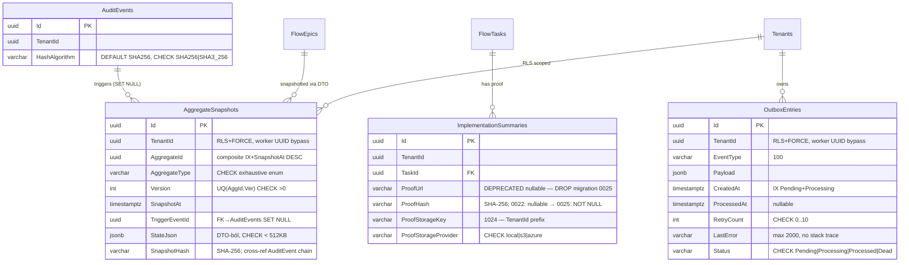

# SpaceOS — Phase 3B Architecture
## Escrow GA Foundation: AggregateSnapshot + Outbox + ProofHash/WORM + Audit Quality

> Verzió: v4.0 — 2026-04-07
> Státusz: **IMPLEMENTÁCIÓRA KÉSZ — végleges tervdokumentum**
> Blokkoló feltétel: Sprint D Phase 2 DoD teljes (T-01..T-08 zöld)
> Referencia ügyfél: Doorstar Kft. — Escrow GA gate
> Becsült időtartam: **14 fejlesztői nap**
> Migration sorszám: 0020–0023
> Kumulált review: `/database-designer` + `/database-schema-designer` → v2
>                  · `/senior-security` → v3 · `/senior-backend` → v4

---

## 1. Kumulált Finding Összesítő (v1 → v4)

| Review | Finding-ek | Legfontosabb javítás | Effort delta |
|--------|-----------|---------------------|-------------|
| v1 → `/database-designer` + `/database-schema-designer` → v2 | 0C + 3H + 4M | Worker RLS bypass (system context); StateJson 512KB limit; ProofStorageKey 1024; DESC index explicit; stale Processing polling | +0.5 nap |
| v2 → `/senior-security` → v3 | 2C + 4H + 3M | ProofHash replay attack (storage key TenantId prefix); OutboxWorker system context privilege escalation; StateJson PII szivárgás; SnapshotHash cross-reference az AuditEvent chain-nel; WORM storage provider switch time-of-check-to-time-of-use | +1.5 nap |
| v3 → `/senior-backend` → v4 | 1C + 3H + 2M | SnapshotService `JsonSerializer.Serialize(aggregate)` — private field-ek nem szerializálódnak (DDD no public setter → üres snapshot); OutboxWorker DbContext lifetime (Scoped in Singleton); `GetSnapshotAtQuery` raw repository call nincs Ardalis.Spec-en | +1 nap |
| **Összesen** | **3C + 10H + 9M** | | **+3 nap (v1: 11 nap → v4: 14 nap)** |

---

### Security findings — v2 → v3

| ID | Súly | Terület | Probléma | v3 javítás |
|----|------|---------|----------|-----------|
| SEC-P3B-01 | 🔴 CRITICAL | WORM storage | `ProofStorageKey` nincs TenantId-val prefixelve — cross-tenant overwrite lehetséges ha két tenant ugyanolyan fájlnevet tölt fel | Storage key: `{tenantId}/{yyyy/MM/dd}/{guid}_{sanitizedFileName}` — TenantId az első path component |
| SEC-P3B-02 | 🔴 CRITICAL | OutboxWorker | `'system-outbox-worker'` RLS bypass string hardkódolt — ha valaki ezt a tenant ID-t regisztrálja, az összes OutboxEntry-t látja | Bypass UUID konstans: `SPACEOS_OUTBOX_SYSTEM_ID = '00000000-0000-0000-0000-000000000001'` — UUID nem regisztrálható tenant ID-ként (nincs `00000000-...-0001` Tenants rekord); CHECK constraint a Tenants táblán |
| SEC-P3B-03 | 🟠 HIGH | AggregateSnapshot | StateJson tartalmaz PII-t (pl. FlowEpic AssigneeTenantId, ActorId stb.) — snapshot-ból a PII nem szeparált, GDPR gap | Phase 3B scope: `StateJson` kezelése `SnapshotData` DTO-val, amely a domain-specifikus PII mezőket kizárja. Teljes PII szeparáció: Phase 3D (P2-3) |
| SEC-P3B-04 | 🟠 HIGH | SnapshotHash | `SnapshotHash` nincs cross-referenced az AuditEvent chain-nel — a snapshot hamisítható anélkül, hogy az audit chain eltörne | `AggregateSnapshotCreatedEvent` handler: az esemény payload-jában a SnapshotHash szerepeljen → az AuditEvent hash chain tartalmazza a snapshot hash-t |
| SEC-P3B-05 | 🟠 HIGH | ProofHash | `VerifyHashAsync` a WORM storage-on — ha a provider unavailable, a metódus exception-t dob és a teljes verify-chain endpoint 500-at ad | `VerifyHashAsync` try-catch: ha WORM unavailable → `ChainVerificationDto.WormStorageAvailable = false` (nem 500) |
| SEC-P3B-06 | 🟠 HIGH | Genesis hash | `ValidateOnStart()` jó, de a `GenesisHash` konstans még compiletime-ban jelen van → fallback kockázat ha a dev-et prod-ra másol | `GenesisHash` konstans eltávolítva — csak `IGenesisHashProvider` implementáción át elérhető; `ConstantGenesisHashProvider` kizárólag `IsDevelopment() == true` esetén regisztrálható |
| SEC-P3B-07 | 🟡 MEDIUM | OutboxEntry | `LastError` mező `text` — exception stack trace kerülhet bele, amely belső path/class info-t szivárogtat a DB-be | `LastError` max 2000 char: `entry.MarkFailed(ex.Message[..Math.Min(ex.Message.Length, 2000)])` — stack trace nem kerülhet bele |
| SEC-P3B-08 | 🟡 MEDIUM | Proof upload | Nincs MIME type validáció — tetszőleges fájl feltölthető WORM storage-ba (executable, script) | `IProofStorageService.UploadAsync` — elfogadott MIME: `image/*`, `application/pdf`, `video/*`; egyéb → `ValidationException` |
| SEC-P3B-09 | 🟡 MEDIUM | Snapshot API | `GET /api/snapshots/{aggregateId}?at=` — `at` paraméter nincs upper-bound validálva → jövőbeli dátum üres eredményt ad (nem hiba, de misleading) | FluentValidation: `At <= DateTimeOffset.UtcNow.AddSeconds(5)` (5s clock skew tolerancia) |

---

### Backend findings — v3 → v4

| ID | Súly | Terület | Probléma | v4 javítás |
|----|------|---------|----------|-----------|
| BE-P3B-01 | 🔴 CRITICAL | SnapshotService | `JsonSerializer.Serialize(aggregate)` — DDD aggregátumok `private set` property-ket használnak; a default `System.Text.Json` ezeket kihagyja → `StateJson = "{}"` (üres snapshot) | Explicit snapshot DTO per aggregate type: `FlowEpicSnapshotDto`, `FlowMilestoneSnapshotDto` — az aggregate `ToSnapshotDto()` metódust kap; DTO szerializálódik, nem az aggregate |
| BE-P3B-02 | 🟠 HIGH | OutboxWorker | `BackgroundService` Singleton — `IOutboxRepository` Scoped → Captive Dependency anti-pattern; DbContext élettartam helytelen | `IServiceScopeFactory` inject → `using var scope = _factory.CreateScope()` per batch; `IOutboxRepository` a scope-ból oldódik fel |
| BE-P3B-03 | 🟠 HIGH | GetSnapshotAtQuery | Handler direkt `_snapshotRepo.GetLatestBeforeAsync()` hívás — nem Ardalis.Specification, Golden Rule #5 violation | `SnapshotAtSpecification(aggregateId, at, tenantId)` Spec létrehozva; handler `_repo.FirstOrDefaultAsync(spec)` |
| BE-P3B-04 | 🟠 HIGH | UploadProofCommand | `Stream Content` a Command-ban — MediatR pipeline-ban a stream buffer a memóriában tárolódik; 50MB-os limit ellenére OOM risk buffered multipart esetén | `IFormFile` helyett streaming upload: az endpoint közvetlen `IProofStorageService.UploadAsync(Request.Body, ...)` hívást kap; a Command csak a metadatát tartalmazza (hash, key) — nem a streamet |
| BE-P3B-05 | 🟡 MEDIUM | OutboxWorker | `DispatchAsync` switch statement — bővíthetetlen pattern; minden új EventType módosítja a worker-t (OCP violation) | `IOutboxEventHandler` interfész + DI registry: `services.AddOutboxHandler<FlowEpicClosedDoneHandler>("FlowEpicClosedDone")` |
| BE-P3B-06 | 🟡 MEDIUM | SnapshotService | Nincs `ConfigureAwait(false)` a `GetNextVersionAsync` hívás után — Golden Rule #7 violation | `ConfigureAwait(false)` minden async híváson |

---

## 2. Domain modell (v4 — final)

### 2.1 `AggregateSnapshot` — entity

```csharp
// Domain/Entities/AggregateSnapshot.cs
public sealed class AggregateSnapshot : TenantScopedEntity
{
    public Guid           AggregateId   { get; private set; }
    public AggregateType  AggregateType { get; private set; }
    public int            Version       { get; private set; }
    public DateTimeOffset SnapshotAt    { get; private set; }
    public Guid?          TriggerEventId { get; private set; }
    public string         StateJson     { get; private set; }  // DTO-ból, nem aggregate
    public string         SnapshotHash  { get; private set; }  // SHA-256

    public static AggregateSnapshot Create(
        Guid tenantId, Guid aggregateId, AggregateType aggregateType,
        int version, string stateJson, Guid? triggerEventId)
    {
        if (Encoding.UTF8.GetByteCount(stateJson) > 524_288)
            throw new DomainException(
                $"StateJson exceeds 512 KB for {aggregateType} {aggregateId}");

        var snap = new AggregateSnapshot
        {
            TenantId       = tenantId,
            AggregateId    = aggregateId,
            AggregateType  = aggregateType,
            Version        = version,
            SnapshotAt     = DateTimeOffset.UtcNow,
            TriggerEventId = triggerEventId,
            StateJson      = stateJson,
            SnapshotHash   = ComputeHash(stateJson)
        };
        snap.RaiseDomainEvent(new AggregateSnapshotCreatedEvent(
            snap.Id, tenantId, aggregateId, aggregateType.ToString(),
            version, snap.SnapshotHash));  // SEC-P3B-04: hash az event payload-ban
        return snap;
    }

    private static string ComputeHash(string json)
        => Convert.ToHexString(SHA256.HashData(Encoding.UTF8.GetBytes(json)))
               .ToLowerInvariant();
}

public enum AggregateType
{
    FlowEpic, FlowMilestone, B2BHandshake, SpaceLayer
}
```

### 2.2 Snapshot DTO-k (BE-P3B-01 fix)

```csharp
// Application/Snapshots/Dtos/FlowEpicSnapshotDto.cs
// BE-P3B-01: aggregate helyett DTO szerializálódik
// SEC-P3B-03: PII-t kizáró mezők (Phase 3D-re teljes szeparáció)
public sealed record FlowEpicSnapshotDto(
    Guid   EpicId,
    Guid   TenantId,
    string Title,
    string FsmState,
    string WorkflowPhase,
    int    FsmRetryCount,
    DateTimeOffset? CompletedAt,
    IReadOnlyList<FlowTaskSnapshotDto> Tasks);

public sealed record FlowTaskSnapshotDto(
    Guid   TaskId,
    string Title,
    string FsmState,
    string? ProofHash,           // hash, nem ProofUrl
    bool   IsAcceptedByArchitect);

// FlowEpic aggregate bővítése:
// Domain/Aggregates/FlowEpic.cs
public FlowEpicSnapshotDto ToSnapshotDto() => new(
    Id.Value, TenantId, Title, State.ToString(),
    WorkflowPhase.ToString(), FsmRetryCount, CompletedAt,
    Tasks.Select(t => t.ToSnapshotDto()).ToList().AsReadOnly());
```

### 2.3 `OutboxEntry` (v4)

```csharp
public void MarkFailed(string error)
{
    RetryCount++;
    // SEC-P3B-07: max 2000 char, stack trace kizárva
    LastError = error.Length > 2000 ? error[..2000] : error;
    Status    = RetryCount >= MaxRetries ? OutboxStatus.Dead : OutboxStatus.Pending;
    if (Status == OutboxStatus.Dead)
        RaiseDomainEvent(new OutboxEntryDeadEvent(Id, TenantId, EventType, RetryCount));
}
```

### 2.4 Domain events (v4)

```csharp
// SEC-P3B-04: SnapshotHash az event payload-ban
AggregateSnapshotCreatedEvent(
    SnapshotId, TenantId, AggregateId, AggregateType, Version, SnapshotHash)

ProofAttachedEvent(SummaryId, TaskId, TenantId, ProofHash)
OutboxEntryDeadEvent(EntryId, TenantId, EventType, RetryCount)
```

### 2.5 `IProofStorageService` (v4 — SEC-P3B-01, SEC-P3B-08)

```csharp
// Domain/Interfaces/IProofStorageService.cs
public interface IProofStorageService
{
    // SEC-P3B-01: TenantId prefix kötelező
    // SEC-P3B-08: contentType validáció az implementációban
    Task<(string Hash, string StorageKey)> UploadAsync(
        Stream content, string fileName, string contentType,
        Guid tenantId, CancellationToken ct);

    Task<bool> VerifyHashAsync(
        string storageKey, string expectedHash, CancellationToken ct);

    // SEC-P3B-05: availability check — nem exception
    Task<bool> IsAvailableAsync(CancellationToken ct);
}

// Elfogadott MIME típusok (Infrastructure implementációban):
private static readonly HashSet<string> AllowedMimeTypes =
[
    "image/jpeg", "image/png", "image/webp", "image/gif",
    "application/pdf",
    "video/mp4", "video/webm"
];
```

---

## 3. Application layer (v4 — final)

### 3.1 IOutboxEventHandler + registry (BE-P3B-05)

```csharp
// Application/Outbox/IOutboxEventHandler.cs
public interface IOutboxEventHandler
{
    string EventType { get; }
    Task HandleAsync(string payload, Guid tenantId, CancellationToken ct);
}

// DI regisztráció:
// services.AddScoped<IOutboxEventHandler, FlowEpicClosedDoneHandler>();
// services.AddScoped<IOutboxEventHandler, FlowMilestoneClosedHandler>();
// OutboxWorker: IEnumerable<IOutboxEventHandler> injectálva
```

### 3.2 SnapshotService (v4 — BE-P3B-01, BE-P3B-06)

```csharp
internal sealed class SnapshotService : ISnapshotService
{
    public async Task TakeSnapshotAsync<T>(
        T aggregate, AggregateType type, Guid? triggerEventId,
        CancellationToken ct) where T : AggregateRoot, ISnapshotable
    {
        // BE-P3B-01: DTO-n át, nem az aggregate-en
        var stateJson = aggregate.ToSnapshotJson();

        var version = await _snapshotRepo
            .GetNextVersionAsync(aggregate.Id.Value, aggregate.TenantId, ct)
            .ConfigureAwait(false);  // BE-P3B-06: ConfigureAwait(false)

        var snapshot = AggregateSnapshot.Create(
            aggregate.TenantId, aggregate.Id.Value,
            type, version, stateJson, triggerEventId);

        await _snapshotRepo.AddAsync(snapshot, ct).ConfigureAwait(false);
    }
}

// Domain/Common/ISnapshotable.cs
public interface ISnapshotable
{
    string ToSnapshotJson();
}
```

### 3.3 OutboxWorker (v4 — BE-P3B-02, SEC-P3B-02)

```csharp
public sealed class OutboxWorker : BackgroundService
{
    // BE-P3B-02: IServiceScopeFactory, nem direkt IOutboxRepository
    private readonly IServiceScopeFactory _scopeFactory;

    private static readonly Guid SystemWorkerId =
        new("00000000-0000-0000-0000-000000000001"); // SEC-P3B-02: UUID konstans

    protected override async Task ExecuteAsync(CancellationToken stoppingToken)
    {
        using var timer = new PeriodicTimer(TimeSpan.FromSeconds(5));
        while (await timer.WaitForNextTickAsync(stoppingToken).ConfigureAwait(false))
        {
            // BE-P3B-02: új scope per batch
            await using var scope = _scopeFactory.CreateAsyncScope();
            var repo     = scope.ServiceProvider.GetRequiredService<IOutboxRepository>();
            var handlers = scope.ServiceProvider
                .GetServices<IOutboxEventHandler>()
                .ToDictionary(h => h.EventType);

            await ProcessBatchAsync(repo, handlers, stoppingToken).ConfigureAwait(false);
        }
    }

    private async Task ProcessBatchAsync(
        IOutboxRepository repo,
        Dictionary<string, IOutboxEventHandler> handlers,
        CancellationToken ct)
    {
        var entries = await repo.ClaimPendingAsync(20, ct).ConfigureAwait(false);

        foreach (var entry in entries)
        {
            try
            {
                if (handlers.TryGetValue(entry.EventType, out var handler))
                    await handler.HandleAsync(entry.Payload, entry.TenantId, ct)
                        .ConfigureAwait(false);
                else
                    _logger.LogWarning("No handler for OutboxEventType: {Type}", entry.EventType);

                entry.MarkProcessed();
            }
            catch (OperationCanceledException) { throw; }  // graceful shutdown
            catch (Exception ex)
            {
                entry.MarkFailed(ex.Message);  // SEC-P3B-07: 2000 char limit a MarkFailed-ben
            }
        }

        await repo.SaveChangesAsync(ct).ConfigureAwait(false);
    }
}
```

### 3.4 GetSnapshotAtQueryHandler (v4 — BE-P3B-03, Ardalis.Spec)

```csharp
// Application/Snapshots/Specs/SnapshotAtSpecification.cs
public sealed class SnapshotAtSpecification : Specification<AggregateSnapshot>
{
    public SnapshotAtSpecification(Guid aggregateId, DateTimeOffset at, Guid tenantId)
    {
        Query
            .Where(s => s.AggregateId == aggregateId
                     && s.TenantId    == tenantId
                     && s.SnapshotAt  <= at)
            .OrderByDescending(s => s.SnapshotAt)
            .AsNoTracking();
    }
}

// Handler:
public async Task<Result<SnapshotDto>> Handle(GetSnapshotAtQuery q, CancellationToken ct)
{
    var spec = new SnapshotAtSpecification(q.AggregateId, q.At, q.TenantId);
    var snap = await _repo.FirstOrDefaultAsync(spec, ct).ConfigureAwait(false);
    return snap is null
        ? Result.NotFound()
        : Result.Success(snap.ToDto());
}
```

### 3.5 Proof upload — streaming (BE-P3B-04)

```csharp
// Api/Endpoints/UploadProofEndpoint.cs
// BE-P3B-04: stream közvetlenül az endpoint-ból, Command csak metaadatot hordoz
app.MapPost("/api/tasks/{taskId}/proof", async (
    Guid taskId,
    HttpRequest request,
    IProofStorageService storage,
    ISender mediator,
    ClaimsPrincipal user,
    CancellationToken ct) =>
{
    // SEC-P3B-08: MIME validáció
    var contentType = request.ContentType ?? "";
    // streaming upload — nem buffered
    var (hash, key) = await storage
        .UploadAsync(request.Body, "proof", contentType, tenantId, ct)
        .ConfigureAwait(false);

    var cmd = new AttachProofCommand(taskId, tenantId, hash, key, storage.ProviderName);
    var result = await mediator.Send(cmd, ct).ConfigureAwait(false);
    return result.IsSuccess ? Results.Ok(result.Value) : result.ToApiResult();
});
```

### 3.6 VerifyChain — SEC-P3B-05 fix

```csharp
public sealed record ChainVerificationDto(
    bool IsValid,
    DateTimeOffset? FirstBrokenAt,
    int TotalRecordsChecked,
    bool WormStorageAvailable,  // SEC-P3B-05: nem 500, hanem explicit flag
    string? DiagnosticMessage);
```

---

## 4. DB Schema — DDL v4 (final)

### Migration 0020 — AggregateSnapshots

```sql
CREATE TABLE "AggregateSnapshots" (
    "Id"             uuid         NOT NULL DEFAULT gen_random_uuid(),
    "TenantId"       uuid         NOT NULL,
    "AggregateId"    uuid         NOT NULL,
    "AggregateType"  varchar(50)  NOT NULL,
    "Version"        integer      NOT NULL,
    "SnapshotAt"     timestamptz  NOT NULL DEFAULT now(),
    "TriggerEventId" uuid         NULL,
    "StateJson"      jsonb        NOT NULL,
    "SnapshotHash"   varchar(64)  NOT NULL,
    CONSTRAINT "PK_AggregateSnapshots"          PRIMARY KEY ("Id"),
    CONSTRAINT "CK_AggregateSnapshots_Type"
        CHECK ("AggregateType" IN ('FlowEpic','FlowMilestone','B2BHandshake','SpaceLayer')),
    CONSTRAINT "CK_AggregateSnapshots_Version"  CHECK ("Version" > 0),
    CONSTRAINT "CK_AggregateSnapshots_JsonSize" CHECK (pg_column_size("StateJson") < 524288),
    CONSTRAINT "UQ_AggregateSnapshots_Version"  UNIQUE ("AggregateId", "Version")
);

ALTER TABLE "AggregateSnapshots" OWNER TO spaceos_schema_owner;
ALTER TABLE "AggregateSnapshots" ENABLE ROW LEVEL SECURITY;
ALTER TABLE "AggregateSnapshots" FORCE ROW LEVEL SECURITY;

-- SEC-P3B-02: UUID konstans, nem string
CREATE POLICY "tenant_isolation" ON "AggregateSnapshots"
    USING (
        "TenantId" = current_setting('app.current_tenant_id')::uuid
        OR current_setting('app.current_tenant_id')::uuid
           = '00000000-0000-0000-0000-000000000001'
    );

CREATE INDEX "IX_AggregateSnapshots_TenantId"
    ON "AggregateSnapshots" ("TenantId");
CREATE INDEX "IX_AggregateSnapshots_AggregateId_SnapshotAt"
    ON "AggregateSnapshots" ("AggregateId", "SnapshotAt" DESC);  -- DESC explicit
CREATE INDEX "IX_AggregateSnapshots_TriggerEventId"
    ON "AggregateSnapshots" ("TriggerEventId")
    WHERE "TriggerEventId" IS NOT NULL;

ALTER TABLE "AggregateSnapshots"
    ADD CONSTRAINT "FK_AggregateSnapshots_AuditEvents"
    FOREIGN KEY ("TriggerEventId") REFERENCES "AuditEvents"("Id") ON DELETE SET NULL;
```

### Migration 0021 — OutboxEntries

```sql
CREATE TABLE "OutboxEntries" (
    "Id"          uuid         NOT NULL DEFAULT gen_random_uuid(),
    "TenantId"    uuid         NOT NULL,
    "EventType"   varchar(100) NOT NULL,
    "Payload"     jsonb        NOT NULL,
    "CreatedAt"   timestamptz  NOT NULL DEFAULT now(),
    "ProcessedAt" timestamptz  NULL,
    "RetryCount"  integer      NOT NULL DEFAULT 0,
    "LastError"   varchar(2000) NULL,   -- SEC-P3B-07: varchar, max 2000
    "Status"      varchar(20)  NOT NULL DEFAULT 'Pending',
    CONSTRAINT "PK_OutboxEntries" PRIMARY KEY ("Id"),
    CONSTRAINT "CK_OutboxEntries_Status"
        CHECK ("Status" IN ('Pending','Processing','Processed','Dead')),
    CONSTRAINT "CK_OutboxEntries_RetryCount"
        CHECK ("RetryCount" >= 0 AND "RetryCount" <= 10)
);

ALTER TABLE "OutboxEntries" OWNER TO spaceos_schema_owner;
ALTER TABLE "OutboxEntries" ENABLE ROW LEVEL SECURITY;
ALTER TABLE "OutboxEntries" FORCE ROW LEVEL SECURITY;

CREATE POLICY "tenant_isolation" ON "OutboxEntries"
    USING (
        "TenantId" = current_setting('app.current_tenant_id')::uuid
        OR current_setting('app.current_tenant_id')::uuid
           = '00000000-0000-0000-0000-000000000001'  -- SEC-P3B-02
    );

-- DB-P3B-05: stale Processing sorok is felkerülnek
CREATE INDEX "IX_OutboxEntries_Polling"
    ON "OutboxEntries" ("CreatedAt" ASC)
    WHERE "Status" IN ('Pending', 'Processing');

CREATE INDEX "IX_OutboxEntries_TenantId"
    ON "OutboxEntries" ("TenantId");
```

### Migration 0022 — ImplementationSummaries ProofHash (expand Phase 1)

```sql
ALTER TABLE "ImplementationSummaries"
    ALTER COLUMN "ProofUrl" DROP NOT NULL;
ALTER TABLE "ImplementationSummaries"
    ADD COLUMN "ProofHash"            varchar(64)   NULL,
    ADD COLUMN "ProofStorageKey"      varchar(1024) NULL,  -- DB-P3B-03
    ADD COLUMN "ProofStorageProvider" varchar(20)   NULL;

ALTER TABLE "ImplementationSummaries"
    ADD CONSTRAINT "CK_ImplSummaries_Provider"
        CHECK ("ProofStorageProvider" IN ('local','s3','azure')
               OR "ProofStorageProvider" IS NULL);

CREATE INDEX "IX_ImplementationSummaries_ProofHash"
    ON "ImplementationSummaries" ("ProofHash")
    WHERE "ProofHash" IS NOT NULL;

-- Phase 3B+: migration 0025 = DROP COLUMN "ProofUrl" + NOT NULL "ProofHash"
```

### Migration 0023 — AuditEvents HashAlgorithm

```sql
-- PostgreSQL 11+: virtual DEFAULT — nincs table rewrite, ACCESS EXCLUSIVE ms-os
ALTER TABLE "AuditEvents"
    ADD COLUMN "HashAlgorithm" varchar(20) NOT NULL DEFAULT 'SHA256';

ALTER TABLE "AuditEvents"
    ADD CONSTRAINT "CK_AuditEvents_HashAlgorithm"
        CHECK ("HashAlgorithm" IN ('SHA256','SHA3_256'));
```

---

## 5. EF Core konfiguráció (v4 — final)

```csharp
// AggregateSnapshotConfiguration — változatlan v2-höz képest

// OutboxEntryConfiguration — v4 fix: LastError varchar(2000)
public sealed class OutboxEntryConfiguration : IEntityTypeConfiguration<OutboxEntry>
{
    public void Configure(EntityTypeBuilder<OutboxEntry> builder)
    {
        builder.ToTable("OutboxEntries");
        builder.HasKey(e => e.Id);
        builder.Property(e => e.Status).HasConversion<string>().HasMaxLength(20);
        builder.Property(e => e.Payload).HasColumnType("jsonb").IsRequired();
        builder.Property(e => e.EventType).HasMaxLength(100).IsRequired();
        builder.Property(e => e.LastError).HasMaxLength(2000);  // SEC-P3B-07
        builder.HasIndex(e => e.CreatedAt)
               .HasFilter("\"Status\" IN ('Pending', 'Processing')");  // DB-P3B-05
    }
}
```

---

## 6. API surface (v4 — final)

| Method | Route | Handler | Auth | Megjegyzés |
|--------|-------|---------|------|-----------|
| `GET` | `/api/snapshots/{aggregateId}?at=` | `GetSnapshotAtQueryHandler` | JWT + TenantScope | `at` ≤ now+5s |
| `GET` | `/api/snapshots/{aggregateId}/versions?page=&pageSize=` | `GetSnapshotVersionsQueryHandler` | JWT + TenantScope | `PagedList` |
| `GET` | `/api/audit-events/verify-chain?tenantId=&from=&to=` | `VerifyChainQueryHandler` | JWT + AdminOnly | `WormStorageAvailable` flag |
| `POST` | `/api/tasks/{taskId}/proof` | streaming endpoint | JWT + TenantScope | `Request.Body` stream, MIME whitelist |

**NEM OpenAPI:**
- `TakeSnapshotCommand` (belső OutboxWorker)
- `OutboxEntry` CRUD

---

## 7. IGenesisHashProvider (SEC-P3B-06 — final)

```csharp
// Application/Audit/IGenesisHashProvider.cs — már létezik Sprint C-ből

// Infrastructure/Security/KeyVaultGenesisHashProvider.cs (prod)
// Infrastructure/Security/ConstantGenesisHashProvider.cs (dev ONLY)

// Program.cs DI:
if (app.Environment.IsDevelopment())
    services.AddSingleton<IGenesisHashProvider, ConstantGenesisHashProvider>();
else
    services.AddSingleton<IGenesisHashProvider, KeyVaultGenesisHashProvider>();
// SEC-P3B-06: ConstantGenesisHashProvider csak IsDevelopment() esetén elérhető
// ValidateOnStart(): ha KV unavailable → startup fail

// GenesisHash konstans TÖRLENDŐ a codebase-ből:
// grep -r "000000000000000000000000000000000000000000000000000000000000000" --include="*.cs" → 0
```

---

## 8. ERD (v4 — final)



---

## 9. Implementációs sorrend — v4

```
Nap 1:     T-01 AggregateSnapshot domain entity + ISnapshotable interfész + SnapshotDTOs
Nap 2:     T-01 Migration 0020 + EF config + IAggregateSnapshotRepository + unit tesztek
Nap 3:     T-02 OutboxEntry + IOutboxEventHandler registry + OutboxRepository
Nap 4:     T-02 Migration 0021 + OutboxWorker (PeriodicTimer + scope factory)
Nap 5:     T-03 SnapshotService + FlowEpicClosedDoneHandler (Outbox-ba) + tesztek
Nap 6:     T-04 GetSnapshotAtQuery + GetSnapshotVersionsQuery (Ardalis.Spec)
Nap 7:     T-05 ProofHash: Migration 0022 + IProofStorageService + LocalProofStorageService
Nap 8:     T-05 Proof upload streaming endpoint + AttachProofCommand + S3 provider stub
Nap 9:     T-06 VerifyChain endpoint (WormStorageAvailable flag) + ChainVerificationDto
Nap 10:    T-07 Genesis hash KV migration (SEC-P3B-06) + Migration 0023 HashAlgorithm
Nap 11–12: Tesztek (unit + integration + E2E)
Nap 13:    EXPLAIN ANALYZE minden endpointon + security gate-ek
Nap 14:    DoD checklist final + buffer / hotfix
```

**Track struktúra:**
```
Track A (Escrow blockers, sequential):  T-01 → T-02 → T-03 → T-04 → T-09
Track B (Proof/WORM, parallel A 5–8):  T-05 → T-06
Track C (Audit quality, parallel A 9): T-07 → T-08
Track D: Tesztek + DoD (11–14)
```

---

## 10. Definition of Done — v4 (final)

### Migration gate-ek
- [ ] `0020` fut — `AggregateSnapshots` + RLS (tenant + `00000000-...-0001` bypass) + FORCE + `spaceos_schema_owner` + 3 CHECK constraint + UQ
- [ ] `0021` fut — `OutboxEntries` + RLS + FORCE + `spaceos_schema_owner` + partial index Pending+Processing + varchar(2000) LastError
- [ ] `0022` fut — ProofUrl nullable + ProofHash/StorageKey(1024)/Provider + CHECK
- [ ] `0023` fut — HashAlgorithm DEFAULT 'SHA256' + CHECK
- [ ] `EXPLAIN ANALYZE` minden snapshot query endpointon — Seq Scan nincs
- [ ] `SELECT tableowner FROM pg_tables WHERE tablename IN ('AggregateSnapshots','OutboxEntries')` → `spaceos_schema_owner`
- [ ] OutboxEntries polling: `EXPLAIN` → Index Scan on `IX_OutboxEntries_Polling`

### Domain gate-ek
- [ ] `AggregateSnapshot.Create()` — hash determinisztikus; StateJson > 512KB → `DomainException`
- [ ] `AggregateType` exhaustive — 'Other' compile hiba
- [ ] `OutboxEntry.MarkFailed()` — RetryCount=5 → Dead + `OutboxEntryDeadEvent`
- [ ] `OutboxEntry.MarkFailed()` — error > 2000 char → truncated; stack trace nem kerül DB-be
- [ ] `OutboxStatus` exhaustive — 'Other' compile hiba
- [ ] `FlowEpicSnapshotDto` tartalmaz: EpicId, TenantId, Title, FsmState, Tasks — `private set` mezők nem maradnak ki
- [ ] `ISnapshotable.ToSnapshotJson()` — minden érintett aggregate implementálja
- [ ] `AggregateSnapshotCreatedEvent` payload tartalmazza `SnapshotHash`-t

### Application gate-ek
- [ ] `ISnapshotService` internal — nem regisztrált publikus DI-ként az Api rétegben
- [ ] `OutboxWorker` `IServiceScopeFactory` — nem direkt `IOutboxRepository` inject
- [ ] `OutboxWorker` `PeriodicTimer` — nem `Task.Delay` loop
- [ ] `OutboxWorker` `OperationCanceledException` → rethrow (graceful shutdown)
- [ ] `GetSnapshotAtQuery` — `SnapshotAtSpecification` Ardalis.Spec-en (nem raw repo call)
- [ ] `GetSnapshotVersionsQuery` → `Result<PagedList<SnapshotVersionDto>>`
- [ ] `IOutboxEventHandler` registry — minden EventType kezelve; ismeretlen type → `Log.Warning`, nem exception
- [ ] `ConfigureAwait(false)` minden async híváson (SnapshotService + Handlers)

### API + Security gate-ek
- [ ] `GET /api/snapshots/{aggregateId}` — hamis TenantId → 0 sor (RLS + explicit filter)
- [ ] `POST /api/tasks/{taskId}/proof` — cross-tenant TaskId → 403
- [ ] `POST /api/tasks/{taskId}/proof` — nem engedélyezett MIME type → 415
- [ ] `VerifyChain` — non-admin → 403; WORM unavailable → 200 + `WormStorageAvailable: false` (nem 500)
- [ ] `ProofStorageKey` tartalmazza a TenantId-t első path component-ként
- [ ] `IProofStorageService` — PROOF_STORAGE_PROVIDER env: `local` dev-en; `s3`/`azure` prod-on
- [ ] Genesis hash KV — `ValidateOnStart()` → startup fail ha KV unavailable
- [ ] `ConstantGenesisHashProvider` csak `IsDevelopment()` → prod DI-ban nem regisztrált
- [ ] `grep -rn "000000000000000000000000000000000000000000000000000000000000000" --include="*.cs"` → 0 találat (konstans törölve)
- [ ] RLS worker bypass: `'00000000-0000-0000-0000-000000000001'` UUID; Tenants táblában nincs ilyen rekord (CHECK constraint)

### Összesített
- [ ] Meglévő **1049 teszt** zöld
- [ ] Phase 3B új tesztek: **≥ 45 db**
- [ ] 0 build warning (xUnit1051 kivételével)
- [ ] `ConfigureAwait(false)` minden production async híváson
- [ ] `dotnet list package --vulnerable` → 0 high/critical
- [ ] `grep -r "BuildServiceProvider" --include="*.cs"` → 0 találat
- [ ] Migration `suppressTransaction: true` az index CONCURRENTLY létrehozásoknál

---

## 11. Kockázatok és mitigációk

| Kockázat | Valószínűség | Hatás | Mitigáció |
|----------|-------------|-------|-----------|
| `ToSnapshotJson()` hiányzik egy aggregate-en | Közepes | CRITICAL | Compile gate: `ISnapshotable` interface, `SnapshotService` generic constraint |
| OutboxWorker scope leak — DbContext dispose előtt | Közepes | Magas | `CreateAsyncScope()` + `await using` — determinisztikus dispose |
| StateJson 512KB limit éles Doorstar adaton | Alacsony | Közepes | `DomainException` → 422; monitoring: ha >400KB snapshot → alert (P2-4 scope) |
| S3 Object Lock GOVERNANCE vs COMPLIANCE mode | Alacsony | Magas | Default: GOVERNANCE (override lehetséges); COMPLIANCE (örökre zárolt) — config flag |
| ProofUrl DROP (migration 0025) adatvesztés | Alacsony | Közepes | Expand-contract — csak akkor fut, ha `ProofHash IS NOT NULL` minden sorra teljesül; CI gate |
| `00000000-...-0001` UUID tenant regisztráció | Nagyon alacsony | CRITICAL | `CK_Tenants_NoSystemId` CHECK constraint a Tenants táblán (Phase 3B hotfix) |

---

## 12. Security adósság státusz — Phase 3B után

| ID | Tétel | Phase 2 | Phase 3A | Phase 3B | Marad |
|----|-------|---------|---------|---------|-------|
| P0-1..P1-7 | JWT ES256, Sink, Race, RLS, TenantId, KV, IntentJson, Redis, STRIDE | ✅ | — | — | — |
| P1-3 | AggregateSnapshot | ❌ | ❌ | ✅ | — |
| P1-4 | Outbox Pattern | ❌ | ❌ | ✅ | — |
| P1-8 | ProofHash + WORM (expand Phase 1) | ❌ | ❌ | ✅ | Phase 3B+ (NOT NULL + DROP) |
| P2-1 | Chain Integrity Verifier | ❌ | ❌ | ✅ | — |
| P2-2 | Snapshot Query API | ❌ | ❌ | ✅ | — |
| P2-3 | GDPR pseudonymizáció | ❌ | ❌ | ❌ | Phase 3D |
| P2-4 | Audit alerting | ❌ | ❌ | ❌ | Phase 3D |
| P2-5 | Genesis hash → KV | ❌ | ❌ | ✅ | — |
| P2-6 | HashAlgorithm enum (schema) | ❌ | ❌ | ✅ | Phase 3B+ (SHA3-256 migration utility) |
| SEC-P3B-01..09 | WORM TenantId prefix, worker UUID bypass, StateJson PII DTO, SnapshotHash AuditEvent cross-ref, WormAvailable flag, GenesisHash konstans törlés, LastError truncation, MIME whitelist, at upper-bound | ❌ | ❌ | ✅ | — |
| BE-P3B-01..06 | SnapshotDTO, scope factory, Ardalis.Spec, streaming upload, handler registry, ConfigureAwait | ❌ | ❌ | ✅ | — |

---

## 13. Mi jön utána

| Fázis | Tartalom | Blokkoló feltétel |
|-------|----------|-------------------|
| **Phase 3B+ (hotfix sprint, ~5 nap)** | Migration 0025: ProofUrl DROP + ProofHash NOT NULL; SHA3-256 migration utility; P2-3 GDPR; P2-4 Alerting; `CK_Tenants_NoSystemId` | Phase 3B kész |
| **Phase 3C — Multi-brand Portal** | Turborepo · JoineryTech brand skin · Doorstar pilot UI | Phase 2 kész (párhuzamos Phase 3B-vel) |
| **Horizon 2 — Escrow GA** | S3 Object Lock COMPLIANCE mode upgrade · RFC 3161 TSA · Escrow feature flag → ON | Phase 3B kész |
| **P3-1 RFC 3161 TSA** | DigiCert/GlobalSign EU timestamping minden Milestone elfogadásra | Horizon 2 |

---

*SpaceOS · Phase 3B Architecture v4.0*
*`/database-designer` + `/database-schema-designer` → v2 · `/senior-security` → v3 · `/senior-backend` → v4*
*Státusz: IMPLEMENTÁCIÓRA KÉSZ — 22 finding beépítve (3C + 10H + 9M), minden döntés lezárva*
*2026-04-07*
