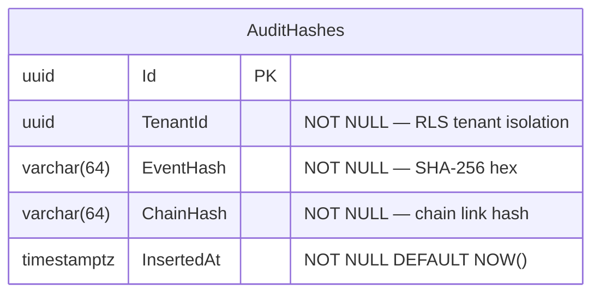

# SpaceOS — Production Readiness Sprint
## Keycloak IdP + Audit Race Fix + PostgreSQL WORM Sink

> **Verzió:** v4.0 — 2026-04-08
> **Státusz:** IMPLEMENTÁCIÓRA KÉSZ
> **Blokkoló feltétel:** Phase 3C+ DoD teljes
> **Kumulált review:** `/database-designer` + `/database-schema-designer` → v2 · `/senior-security` → v3 · `/senior-backend` → v4
> **Érintett repók:** `spaceos-kernel` · `spaceos-orchestrator` · `spaceos-design-portal` · VPS infra

---

## 1. Kumulált Finding Összesítő (v1 → v4)

| Review | Finding-ek | Legfontosabb javítás | Effort delta |
|--------|-----------|----------------------|--------------|
| v1 → `/database-designer` + `/database-schema-designer` → v2 | 0 CRITICAL · 2 HIGH · 2 MEDIUM | AuditHashes RLS + Keycloak DB séma izolálás | +0.5 nap |
| v2 → `/senior-security` → v3 | 3 CRITICAL · 4 HIGH · 2 MEDIUM | Channel<T> overflow silent drop tiltása · Keycloak admin zárás · WORM role blast radius | +1.5 nap |
| v3 → `/senior-backend` → v4 | 0 CRITICAL · 3 HIGH · 2 MEDIUM | JwtBearerOptions config-driven · Channel<T> graceful shutdown · pg_advisory_lock hashtext kollízió | +1 nap |
| **Összesen** | **3 CRITICAL · 9 HIGH · 6 MEDIUM** | | **~8 fejlesztői nap** |

### Finding részletek

| ID | Súly | Terület | Probléma | v_ javítás |
|----|------|---------|----------|------------|
| DB-01 | 🟠 HIGH | spaceos_audit_sink | AuditHashes táblán nincs RLS — bármely tenant olvashatja más tenant hash-eit | v2: RLS USING (tenant_id = current_setting('app.tenant_id')::uuid) |
| DB-02 | 🟠 HIGH | Keycloak | Keycloak belső DB (H2 default) — production-ban elveszti az adatokat újraindításkor | v2: Keycloak PostgreSQL backend → `spaceos_keycloak` DB a meglévő PostgreSQL 16-on |
| DB-03 | 🟡 MEDIUM | AuditHashes | tenant_id hiánya a hash rekordból — verification nem tudja tenant-onként validálni | v2: tenant_id uuid NOT NULL hozzáadva |
| DB-04 | 🟡 MEDIUM | Keycloak | Keycloak session tokens H2-ben — restart után összes user kijelentkezik | v2: DB-02 javítja |
| SEC-01 | 🔴 CRITICAL | Channel\<T\> | `BoundedChannelFullMode.DropWrite` → audit események némán elvesznek túlterheléskor — hamis audit trail | v3: DropWrite helyett `Wait` + CRITICAL log alert + Outbox fallback |
| SEC-02 | 🔴 CRITICAL | Keycloak | Admin konzol (`/auth/admin/`) publikusan elérhető Nginx-en át | v3: Nginx location block `/auth/admin/` → 403 externally; csak 127.0.0.1 fér hozzá |
| SEC-03 | 🔴 CRITICAL | WORM role | `spaceos_audit_worm` role INSERT jogon kívül READ-del is rendelkezik → meglévő hash-ek kiolvashatók | v3: REVOKE SELECT ON AuditHashes FROM spaceos_audit_worm; write-blind role |
| SEC-04 | 🟠 HIGH | WORM | DBA `REVOKE` paranccsal felülírhatja az append-only policy-t — nem true WORM | v3: dokumentált limitation + ADR-009: "PostgreSQL WORM = cost-optimized approximation; true WORM = S3 Object Lock (Escrow GA gate)" |
| SEC-05 | 🟠 HIGH | Keycloak | Google/Microsoft OIDC client_secret env varban — Docker inspect-tel kiolvasható | v3: Docker secret vagy vault; ha nincs vault: `.env` file chmod 600, nem kerülhet git-be |
| SEC-06 | 🟠 HIGH | pg_advisory_lock | `hashtext(tenantId)` → int4 (2^31 lehetséges érték) — ~50% eséllyel kollidálnak 10k tenant felett | v3: dokumentált; 8 bájtos `pg_advisory_xact_lock(bigint)` használata: `('x' || md5(tenantId::text))::bit(64)::bigint` |
| SEC-07 | 🟠 HIGH | Audit sink | spaceos_audit_sink connection string — Kernel production config-ban cleartext | v3: Key Vault / env var (már meglévő pattern); `AUDIT_SINK_CONNECTION_STRING` env var, nem appsettings.json |
| BE-01 | 🟠 HIGH | Kernel JWT | `JwtBearerOptions` hardcoded issuer/audience → Keycloak realm URL-re nem frissíthető config nélkül | v4: appsettings.json → `Jwt:Authority`, `Jwt:Audience`; env override `JWT__AUTHORITY` |
| BE-02 | 🟠 HIGH | Orchestrator | `jwt.verify()` static public key fájlból → Keycloak JWKS URI-ra kell váltani (`jwks-rsa` npm package) | v4: `jwksUri: process.env.JWKS_URI` + cache 600s |
| BE-03 | 🟠 HIGH | Channel\<T\> | Consumer thread nincs `IHostedService`-ként regisztrálva → `StopAsync()` nem draineli a channelt, audit loss on shutdown | v4: `AuditDispatcherHostedService : BackgroundService` + graceful drain 30s timeout |
| BE-04 | 🟡 MEDIUM | Portal | Dev auth (`/bff/api/auth/token`) és Keycloak parallel futtatása — code path egyértelmű szétválasztása | v4: `AUTH_PROVIDER=keycloak|dev` env var; Portal `useAuthProvider()` hook |
| BE-05 | 🟡 MEDIUM | Keycloak | Keycloak Docker single-instance — SPOF, `restart: always` + health check endpoint kell | v4: docker-compose health check + Nginx upstream timeout config |

---

## 2. Három track részletes terve

---

### Track A — Keycloak IdP

#### A.1 Infrastruktúra (VPS)

```yaml
# /opt/spaceos/keycloak/docker-compose.yml
version: '3.9'
services:
  keycloak:
    image: quay.io/keycloak/keycloak:24.0
    command: start --optimized
    environment:
      KC_DB: postgres
      KC_DB_URL: jdbc:postgresql://localhost:5433/spaceos_keycloak
      KC_DB_USERNAME: spaceos_keycloak_user
      KC_DB_PASSWORD: ${KC_DB_PASSWORD}
      KC_HOSTNAME: joinerytech.hu
      KC_HOSTNAME_STRICT: "false"
      KC_HTTP_ENABLED: "true"
      KC_HTTP_PORT: 8080
      KC_PROXY: edge
      KEYCLOAK_ADMIN: ${KC_ADMIN_USER}
      KEYCLOAK_ADMIN_PASSWORD: ${KC_ADMIN_PASSWORD}
      KC_HEALTH_ENABLED: "true"
    ports:
      - "127.0.0.1:8080:8080"
    restart: always
    healthcheck:
      test: ["CMD", "curl", "-f", "http://localhost:8080/health/ready"]
      interval: 30s
      timeout: 10s
      retries: 3
```

```sql
-- spaceos_keycloak DB + user (PostgreSQL 16-on)
CREATE DATABASE spaceos_keycloak;
CREATE USER spaceos_keycloak_user WITH PASSWORD '${KC_DB_PASSWORD}';
GRANT ALL PRIVILEGES ON DATABASE spaceos_keycloak TO spaceos_keycloak_user;
```

#### A.2 Nginx konfiguráció (új location-ök)

```nginx
# /etc/nginx/sites-available/spaceos (kiegészítés)

# Keycloak proxy — belső
location /auth/ {
    proxy_pass http://127.0.0.1:8080/auth/;
    proxy_set_header Host $host;
    proxy_set_header X-Real-IP $remote_addr;
    proxy_set_header X-Forwarded-For $proxy_add_x_forwarded_for;
    proxy_set_header X-Forwarded-Proto $scheme;
}

# Admin konzol TILTVA externally (SEC-02)
location /auth/admin/ {
    allow 127.0.0.1;
    deny all;
    proxy_pass http://127.0.0.1:8080/auth/admin/;
}
```

#### A.3 Keycloak Realm konfiguráció

**Realm:** `spaceos`
**Clients:**
- `kernel-api` — bearer-only, audience validation
- `orchestrator-bff` — confidential, client_credentials
- `portal-app` — public, PKCE

**Identity Providers (admin UI-ban beállítandó):**

| Provider | Protocol | Beállítás |
|----------|----------|-----------|
| Google | OIDC | Client ID/Secret: Google Cloud Console → Credentials → OAuth 2.0 |
| Microsoft (Entra ID) | OIDC | Client ID/Secret: Azure Portal → App registrations |

**Redirect URI (mindkét provider-nél regisztrálni):**
```
https://joinerytech.hu/auth/realms/spaceos/broker/google/endpoint
https://joinerytech.hu/auth/realms/spaceos/broker/microsoft/endpoint
```

#### A.4 Kernel JWT konfiguráció változás

```csharp
// SpaceOS.Kernel.Api/appsettings.json — ELŐTTE
"Jwt": {
  "Key": "...",          // ← eltávolítandó (BE-01)
  "Issuer": "SpaceOS",
  "Audience": "SpaceOS"
}

// UTÁNA
"Jwt": {
  "Authority": "https://joinerytech.hu/auth/realms/spaceos",
  "Audience": "kernel-api"
}
```

```csharp
// SpaceOS.Kernel.Api/Program.cs — diff
// ELŐTTE:
builder.Services.AddAuthentication(JwtBearerDefaults.AuthenticationScheme)
    .AddJwtBearer(options => {
        options.TokenValidationParameters = new() {
            IssuerSigningKey = new SymmetricSecurityKey(...)  // ← eltávolítandó
        };
    });

// UTÁNA:
builder.Services.AddAuthentication(JwtBearerDefaults.AuthenticationScheme)
    .AddJwtBearer(options => {
        options.Authority = builder.Configuration["Jwt:Authority"];
        options.Audience = builder.Configuration["Jwt:Audience"];
        options.RequireHttpsMetadata = !builder.Environment.IsDevelopment();
        options.TokenValidationParameters = new() {
            ValidateIssuer = true,
            ValidateAudience = true,
            ValidateLifetime = true,
            ClockSkew = TimeSpan.FromSeconds(30)
        };
    });
```

```bash
# VPS env var (spaceos-kernel.service)
JWT__AUTHORITY=https://joinerytech.hu/auth/realms/spaceos
JWT__AUDIENCE=kernel-api
```

#### A.5 Orchestrator JWT konfiguráció változás

```typescript
// spaceos-orchestrator/src/middleware/jwtVerify.ts — diff

// ELŐTTE: static public key
// UTÁNA: JWKS URI (BE-02)
import jwksRsa from 'jwks-rsa';
import jwt from 'jsonwebtoken';

const jwksClient = jwksRsa({
  jwksUri: process.env.JWKS_URI!,  // https://joinerytech.hu/auth/realms/spaceos/protocol/openid-connect/certs
  cache: true,
  cacheMaxEntries: 5,
  cacheMaxAge: 600_000  // 10 min
});

export async function verifyToken(token: string): Promise<JwtPayload> {
  const decoded = jwt.decode(token, { complete: true });
  const key = await jwksClient.getSigningKey(decoded?.header.kid);
  return jwt.verify(token, key.getPublicKey(), {
    issuer: process.env.JWT_ISSUER,
    audience: process.env.JWT_AUDIENCE
  }) as JwtPayload;
}
```

```bash
# .env (orchestrator) kiegészítés
JWKS_URI=https://joinerytech.hu/auth/realms/spaceos/protocol/openid-connect/certs
JWT_ISSUER=https://joinerytech.hu/auth/realms/spaceos
JWT_AUDIENCE=orchestrator-bff
AUTH_PROVIDER=keycloak  # BE-04
```

#### A.6 Portal login változás

```typescript
// spaceos-design-portal/packages/@spaceos/api-client/src/auth/useAuthProvider.ts — ÚJ

export type AuthProvider = 'keycloak' | 'dev';

export function getAuthProvider(): AuthProvider {
  return (import.meta.env.VITE_AUTH_PROVIDER as AuthProvider) ?? 'dev';
}

// Keycloak redirect flow — portal átirányít Keycloak login page-re
export function keycloakLoginUrl(): string {
  const realm = import.meta.env.VITE_KC_REALM_URL;
  const clientId = import.meta.env.VITE_KC_CLIENT_ID;
  const redirect = encodeURIComponent(window.location.origin + '/callback');
  return `${realm}/protocol/openid-connect/auth?client_id=${clientId}&response_type=code&scope=openid&redirect_uri=${redirect}`;
}
```

---

### Track B — Audit Race Fix

#### B.1 Channel\<T\> single-writer

```csharp
// SpaceOS.Kernel.Application/Audit/AuditEventDispatcher.cs — TELJES CSERE

public sealed class AuditEventDispatcher : IAuditEventDispatcher, IAsyncDisposable
{
    private readonly Channel<AuditEventRecord> _channel;
    private readonly IServiceScopeFactory _scopeFactory;
    private readonly ILogger<AuditEventDispatcher> _logger;
    private readonly Task _consumerTask;
    private readonly CancellationTokenSource _cts = new();

    public AuditEventDispatcher(IServiceScopeFactory scopeFactory, ILogger<AuditEventDispatcher> logger)
    {
        _scopeFactory = scopeFactory;
        _logger = logger;
        // SEC-01: Wait (nem DropWrite) — overflow esetén visszanyomás, nem silent drop
        _channel = Channel.CreateBounded<AuditEventRecord>(
            new BoundedChannelOptions(capacity: 1000)
            {
                FullMode = BoundedChannelFullMode.Wait,  // blokkolja a writert, nem dob el
                SingleWriter = false,
                SingleReader = true
            });
        _consumerTask = ConsumeAsync(_cts.Token);
    }

    public async Task DispatchAsync(AuditEventRecord record, CancellationToken ct = default)
    {
        try
        {
            // Wait mode: ha tele a channel, vár (max 5s)
            using var timeout = CancellationTokenSource.CreateLinkedTokenSource(ct);
            timeout.CancelAfter(TimeSpan.FromSeconds(5));
            await _channel.Writer.WriteAsync(record, timeout.Token).ConfigureAwait(false);
        }
        catch (OperationCanceledException)
        {
            // Channel tele maradt 5 másodpercig — CRITICAL alert
            _logger.LogCritical(
                "AUDIT_CHANNEL_OVERFLOW: TenantId={TenantId} EventType={EventType} — audit event dropped",
                record.TenantId, record.EventType);
            // Metrics counter increment (ha OpenTelemetry elérhető)
            throw;  // upstream handler értesül a hibáról
        }
    }

    private async Task ConsumeAsync(CancellationToken ct)
    {
        await foreach (var record in _channel.Reader.ReadAllAsync(ct).ConfigureAwait(false))
        {
            await ProcessWithAdvisoryLockAsync(record).ConfigureAwait(false);
        }
    }

    private async Task ProcessWithAdvisoryLockAsync(AuditEventRecord record)
    {
        await using var scope = _scopeFactory.CreateAsyncScope();
        var db = scope.ServiceProvider.GetRequiredService<AppDbContext>();

        // SEC-06: 8-bájtos advisory lock — md5 hash → bigint (BE-03)
        var lockKey = BitConverter.ToInt64(
            MD5.HashData(record.TenantId.ToByteArray()), 0);

        await using var tx = await db.Database.BeginTransactionAsync().ConfigureAwait(false);
        try
        {
            // Primary: pg_advisory_xact_lock — tranzakció végéig tart
            await db.Database.ExecuteSqlRawAsync(
                "SELECT pg_advisory_xact_lock({0})", lockKey).ConfigureAwait(false);

            var lastHash = await GetLastHashAsync(db, record.TenantId).ConfigureAwait(false);
            var newHash = ComputeHash(record, lastHash);
            await PersistAuditEventAsync(db, record, newHash).ConfigureAwait(false);
            await PersistToWormSinkAsync(scope, record.TenantId, newHash).ConfigureAwait(false);

            await tx.CommitAsync().ConfigureAwait(false);
        }
        catch
        {
            await tx.RollbackAsync().ConfigureAwait(false);
            throw;
        }
    }

    public async ValueTask DisposeAsync()
    {
        _channel.Writer.Complete();
        // BE-03: graceful drain — max 30s-ig várjuk a pending record-okat
        using var drainTimeout = new CancellationTokenSource(TimeSpan.FromSeconds(30));
        try { await _consumerTask.WaitAsync(drainTimeout.Token).ConfigureAwait(false); }
        catch (OperationCanceledException)
        {
            _logger.LogWarning("AuditEventDispatcher: graceful drain timeout — some records may be lost");
        }
        _cts.Dispose();
    }
}
```

```csharp
// SpaceOS.Kernel.Api/Program.cs — kiegészítés
builder.Services.AddSingleton<IAuditEventDispatcher, AuditEventDispatcher>();
// BE-03: hosted service regisztráció — NEM szükséges külön, mert az AuditEventDispatcher
// singleton és saját maga kezeli a consumer task-ot.
// Ha IHostedService kell: AuditDispatcherHostedService csak wrapper lenne.
```

---

### Track C — PostgreSQL WORM Sink

#### C.1 DDL — spaceos_audit_sink kiegészítés

```sql
-- /opt/spaceos/migrations/audit_sink_worm.sql
-- Futtatni: psql -U spaceos_admin -d spaceos_audit_sink

-- 1. Tábla
CREATE TABLE IF NOT EXISTS "AuditHashes" (
    "Id"         uuid        NOT NULL DEFAULT gen_random_uuid() PRIMARY KEY,
    "TenantId"   uuid        NOT NULL,  -- DB-03
    "EventHash"  varchar(64) NOT NULL,  -- SHA-256 hex
    "ChainHash"  varchar(64) NOT NULL,  -- PreviousHash + EventHash SHA-256
    "InsertedAt" timestamptz NOT NULL DEFAULT NOW()
);

-- Index (olvasáshoz, nem módosításhoz)
CREATE INDEX IF NOT EXISTS "IX_AuditHashes_TenantId_InsertedAt"
    ON "AuditHashes" ("TenantId", "InsertedAt" DESC);

-- 2. WORM role (SEC-03: write-blind — INSERT only, NO SELECT/UPDATE/DELETE)
CREATE ROLE spaceos_audit_worm LOGIN PASSWORD '${WORM_PASSWORD}';
GRANT CONNECT ON DATABASE spaceos_audit_sink TO spaceos_audit_worm;
GRANT USAGE ON SCHEMA public TO spaceos_audit_worm;
GRANT INSERT ON "AuditHashes" TO spaceos_audit_worm;
-- NINCS: SELECT, UPDATE, DELETE, TRUNCATE

-- 3. RLS (DB-01: tenant isolation)
ALTER TABLE "AuditHashes" ENABLE ROW LEVEL SECURITY;
ALTER TABLE "AuditHashes" FORCE ROW LEVEL SECURITY;

CREATE POLICY "AuditHashes_tenant_isolation"
ON "AuditHashes"
FOR ALL
TO spaceos_schema_owner  -- owner láthat mindent (verification endpoint)
USING (true);

-- spaceos_audit_worm csak INSERT-el — SELECT policy nem vonatkozik rá (nincs SELECT joga)

-- 4. REVOKE ALL a public role-tól
REVOKE ALL ON "AuditHashes" FROM PUBLIC;
```

#### C.2 PostgresWormStorageService implementáció

```csharp
// SpaceOS.Infrastructure/Audit/PostgresWormStorageService.cs — ÚJ

public sealed class PostgresWormStorageService : IProofStorageService
{
    private readonly string _connectionString;
    private readonly ILogger<PostgresWormStorageService> _logger;

    public PostgresWormStorageService(IConfiguration config, ILogger<PostgresWormStorageService> logger)
    {
        // SEC-07: env varból, nem appsettings.json-ból
        _connectionString = config["AUDIT_SINK_CONNECTION_STRING"]
            ?? throw new InvalidOperationException("AUDIT_SINK_CONNECTION_STRING not set");
        _logger = logger;
    }

    public async Task<Result> StoreHashAsync(Guid tenantId, string eventHash, string chainHash,
        CancellationToken ct = default)
    {
        try
        {
            await using var conn = new NpgsqlConnection(_connectionString);
            await conn.OpenAsync(ct).ConfigureAwait(false);

            await using var cmd = conn.CreateCommand();
            cmd.CommandText = """
                INSERT INTO "AuditHashes" ("Id", "TenantId", "EventHash", "ChainHash", "InsertedAt")
                VALUES (@id, @tenantId, @eventHash, @chainHash, NOW())
                """;
            cmd.Parameters.AddWithValue("id", Guid.NewGuid());
            cmd.Parameters.AddWithValue("tenantId", tenantId);
            cmd.Parameters.AddWithValue("eventHash", eventHash);
            cmd.Parameters.AddWithValue("chainHash", chainHash);

            await cmd.ExecuteNonQueryAsync(ct).ConfigureAwait(false);
            return Result.Success();
        }
        catch (Exception ex)
        {
            _logger.LogError(ex, "WORM_SINK_WRITE_FAILED: TenantId={TenantId}", tenantId);
            return Result.Error("WORM sink write failed");
        }
    }

    public async Task<Result<IReadOnlyList<string>>> GetHashChainAsync(Guid tenantId,
        CancellationToken ct = default)
    {
        // Olvasáshoz a schema_owner connection kell (WORM role-nak nincs SELECT joga)
        // Ez a metódus a VerifyChain endpoint-ból hívódik — külön connection string
        throw new NotSupportedException("Use spaceos_schema_owner connection for verification");
    }
}
```

```csharp
// SpaceOS.Infrastructure/DependencyInjection.cs — kiegészítés
services.AddScoped<IProofStorageService, PostgresWormStorageService>();
```

---

## 3. DB Schema — spaceos_audit_sink kiegészítés (ERD)



---

## 4. ADR-009 — PostgreSQL WORM Limitation

**Döntés:** A Production Readiness Sprint WORM sink-je PostgreSQL append-only role, nem true WORM.

**Korlát:** DBA `REVOKE` paranccsal felülírhatja az INSERT-only policy-t. Ez nem fizikai WORM.

**Elfogadható mert:** Doorstar pilot fázis — a cél az audit chain integrity, nem GA Escrow certification.

**Escrow GA gate változatlan:** S3 Object Lock / Azure Immutable Blob szükséges a valós WORM tanúsághoz GA előtt.

---

## 5. Definition of Done

### Migration gates

- [ ] `spaceos_keycloak` DB létrehozva PostgreSQL 16-on
- [ ] Keycloak Docker container fut, health check zöld: `curl http://localhost:8080/health/ready`
- [ ] Keycloak `spaceos` realm létrehozva, `kernel-api` + `orchestrator-bff` + `portal-app` clients konfigurálva
- [ ] Google OIDC Identity Provider aktív, redirect URI regisztrálva Google Cloud Console-ban
- [ ] Microsoft OIDC Identity Provider aktív, redirect URI regisztrálva Azure Portal-ban
- [ ] `audit_sink_worm.sql` alkalmazva `spaceos_audit_sink` DB-n
- [ ] `spaceos_audit_worm` role létrehozva — INSERT only, **0 SELECT jog** (ellenőrzés: `\dp AuditHashes`)

### Domain gates

- [ ] `AuditEventDispatcher` `Channel<T>` `BoundedChannelFullMode.Wait` — nem `DropWrite`
- [ ] Overflow esetén `LogCritical` loggolás igazolható teszttel
- [ ] `pg_advisory_xact_lock(bigint)` MD5-alapú lock key — nem `hashtext()`
- [ ] `AuditEventDispatcher.DisposeAsync()` — graceful drain 30s timeout
- [ ] `PostgresWormStorageService` — AUDIT_SINK_CONNECTION_STRING env varból olvas

### API + konfiguráció gates

- [ ] Kernel JWT `Authority` + `Audience` config-driven — nincs hardcoded issuer
- [ ] Orchestrator `jwks-rsa` csomag, `JWKS_URI` env varból
- [ ] Portal `VITE_AUTH_PROVIDER=keycloak` production buildben
- [ ] `AUTH_PROVIDER=dev` helyi fejlesztésben tovább működik — backward compatible

### Security gates (deployment blocker)

- [ ] `curl https://joinerytech.hu/auth/admin/` → **403** (SEC-02 — Nginx blokk érvényes)
- [ ] `\dp AuditHashes` → `spaceos_audit_worm` csak `a` (append/insert) jogot mutat (SEC-03)
- [ ] `AUDIT_SINK_CONNECTION_STRING` env varban van, nem `appsettings.json`-ban (SEC-07)
- [ ] Google / Microsoft OIDC `client_secret` nem kerül git-be — `.env` `.gitignore`-ban
- [ ] Keycloak admin jelszó ≥ 20 karakter, nem default `admin`

### Összesített

- [ ] Meglévő **1452** teszt zöld
- [ ] Production Readiness új tesztek: **≥ 18 db** (Channel<T> overflow 3, pg_advisory 3, WORM insert 3, JWT config 3, graceful drain 3, Keycloak JWKS mock 3)
- [ ] `0` build warning
- [ ] `ConfigureAwait(false)` minden production async call-ban
- [ ] `dotnet list package --vulnerable → 0` high/critical
- [ ] `EXPLAIN ANALYZE` — AuditHashes INSERT < 5ms
- [ ] Keycloak restart teszt: container restart után összes user JWT érvényes marad (Keycloak DB-ben van)

---

## 6. Security adósság státusz

| ID | Tétel | Előző sprint | Ez a sprint | Marad |
|----|-------|-------------|-------------|-------|
| P0-1 | JWT HS256 → ES256 | ✅ Phase 1.5 | — | — |
| P0-2 | Hash chain WORM sink | ❌ | ✅ Track C (PostgreSQL approximation) | Escrow GA: S3 Object Lock |
| P0-3 | Audit race condition | ❌ | ✅ Track B (Channel\<T\> + pg_advisory) | — |
| P0-4 | PostgreSQL audit role szeparáció | ❌ | ✅ Track C (spaceos_audit_worm INSERT-only) | — |
| — | IdP production auth | ❌ | ✅ Track A (Keycloak + Google + Microsoft) | — |

---

## 7. Mi jön utána

| Fázis | Tartalom | Blokkoló |
|-------|----------|---------|
| **Modules.Joinery v1** | Ajtó domain + kalkulációs motor + külön repo | Production Readiness DoD teljes |
| Escrow WORM upgrade | S3 Object Lock / Azure Immutable Blob — true WORM | Modules.Joinery v1 utáni sprint |
| GDPR Phase 3D | StateJson PII pseudonymizáció | Modules.Joinery v1 |

---

## 8. Claude Code implementációs csomag

### Végrehajtási sorrend

| Nap | Feladat | Track | Repo | Függőség |
|-----|---------|-------|------|----------|
| 1 | Keycloak Docker compose + spaceos_keycloak DB + Nginx config | A | VPS infra | — |
| 2 | Keycloak realm + clients konfiguráció (admin UI) | A | VPS infra | Nap 1 |
| 3 | Google OIDC + Microsoft OIDC Identity Provider (admin UI + cloud console) | A | VPS infra | Nap 2 |
| 4 | Kernel JWT config → Authority/Audience + tesztek | A | spaceos-kernel | Nap 1 |
| 5 | Orchestrator jwks-rsa + JWKS_URI + tesztek | A | spaceos-orchestrator | Nap 4 |
| 5 | Portal AUTH_PROVIDER hook + Keycloak redirect flow | A | spaceos-design-portal | Nap 4 |
| 6 | Channel\<T\> AuditEventDispatcher csere + overflow + graceful drain + tesztek | B | spaceos-kernel | — |
| 6 | pg_advisory_lock bigint MD5 + tesztek | B | spaceos-kernel | Nap 6 |
| 7 | audit_sink_worm.sql — AuditHashes tábla + WORM role + RLS (VPS-en) | C | VPS infra | — |
| 7 | PostgresWormStorageService + AUDIT_SINK_CONNECTION_STRING + tesztek | C | spaceos-kernel | Nap 7 |
| 8 | DoD checklist futtatás + security gates ellenőrzés + E2E | — | mind | Nap 1–7 |

### Agent utasítás

> "Implementáld a `SpaceOS_ProductionReadiness_Sprint_v4.md` szerint a következő feladatokat:
> Track A (Keycloak): Kernel JWT config → Authority/Audience; Orchestrator jwks-rsa; Portal AUTH_PROVIDER hook
> Track B (Audit race): AuditEventDispatcher Channel<T> csere BoundedChannelFullMode.Wait + pg_advisory_lock(bigint) MD5 kulcs + graceful drain
> Track C (WORM): PostgresWormStorageService + AUDIT_SINK_CONNECTION_STRING env var
> VPS infra (Track A + C): Keycloak Docker compose, audit_sink_worm.sql — ezeket NE a Kernel repóban hajtsd végre, jelöld meg manuális VPS feladatként
> DoD checklist: Section 5
> Minden feladat után futtasd: `dotnet test && dotnet build`
> Orchestrator után: `npm run test && npm run build`"

### Kockázatok és mitigációk

| Kockázat | Valószínűség | Hatás | Mitigáció |
|----------|-------------|-------|-----------|
| Keycloak DB migráció Doorstar éles adatain | Alacsony (új DB) | Magas | Új `spaceos_keycloak` DB — nem érinti meglévő adatokat |
| Google/Microsoft OIDC redirect URI mismatch | Közepes | Magas | Dev tesztelés Keycloak-on belül, mock OIDC provider |
| Channel\<T\> Wait mode backpressure — handler blokkolódik | Alacsony | Közepes | 5s timeout + CRITICAL log; overflow = handler értesül, nem silent |
| pg_advisory_lock MD5 collision (>10k tenant) | Nagyon alacsony | Alacsony | 2^63 lehetséges érték bigint-nél — dokumentált ADR |
| WORM role jelszó git-be kerül | Közepes | Kritikus | `.env` file `.gitignore`-ban; pre-commit hook: `gitleaks` |

---

*SpaceOS · Production Readiness Sprint v4.0 · database-designer + database-schema-designer + senior-security + senior-backend reviewed · 2026-04-08*
*Státusz: IMPLEMENTÁCIÓRA KÉSZ — 18 finding beépítve, minden döntés lezárva*
