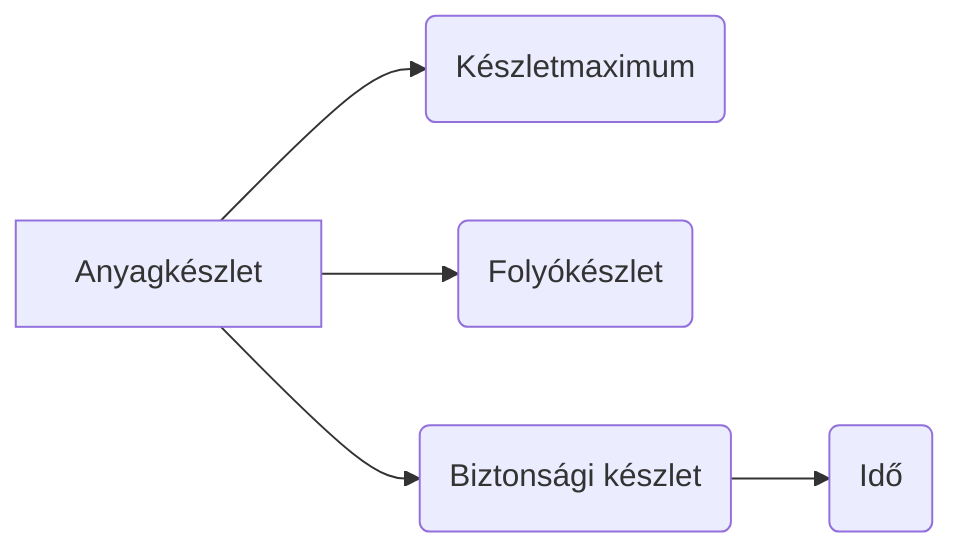

# Knowledge Base - RAG Export
> Auto-generated by Pipeline


---
## Fájl: faipari_gyártásszervezes__170223-1536x2040.jpg

# SOPONYAI ÉVA KATALIN

# FAIPARI GYÁRTÁSSZERVEZÉS

## Gyártási folyamatábra

**Bemenő anyagok:**
- Lapok, lemezek
- Fűrészáru
- Ragasztó

**Folyamatlépések:**

1. Ragasztó-előkészítés
2. Szárítás
3. Hasítás, szeletelés
4. Hosszolás
5. Darabolás
6. Javítás, dugózás
7. Keresztmetszet-kialakítás
8. Szerkezeti kötések kialakítása
9. Szabás
10. Keretszerelés
11. Keretcsiszolás
12. Keretek, lapok aljazása
13. Szerelés, végszerelés
14. Alapmázolás, impregnálás
15. Készáruraktár

**Kiegészítő bemenő anyagok:**
- Szerelvények, üveg
- Mázoló- és impregnálószerek

## Jelmagyarázat

| Jelölés | Jelentés |
|---|---|
| ▨ | Raktár |
| ▧ | Nem technológiai folyamat |
| ▦ | Segédfolyamat |
| ▢ | Technológiai folyamat |

---

**SKANDI-WALD KÖNYVKIADÓ**

---
## Fájl: faipari_gyártásszervezes__170252-1536x2040.jpg

# SOPONYAI ÉVA KATALIN

# Faipari gyártásszervezés

4. kiadás

SKANDI-WALD KÖNYVKIADÓ, BUDAPEST

---
## Fájl: faipari_gyártásszervezes__170311-1536x2040.jpg

A Szakképzési Tankönyv és Taneszköz Tanács javaslatára a tankönyv használatát az oktatási miniszter a 45168/2001. szám alatt a 2001/2002-es tanévtől engedélyezte.

Tankönyv a bútor- és épületasztalosipari technikus (52 5411 03), kárpitosipari technikus (52 5411 06), fűrész- és lemezipari technikus (52 5499 04) szakképzéshez.

**Szakmai lektor:**
KOVÁCSNÉ BUKUCS ERZSÉBET

**Pedagógiai lektor:**
DR. BORJÁN JÓZSEF

© Soponyai Éva Katalin
© Hungarian edition Skandi-Wald Könyvkiadó, 2012

ISBN 978-963-86176-2-0

---
## Fájl: faipari_gyártásszervezes__170324-1536x2040.jpg

# Tartalom

**Előszó** 7

## 1. Szervezés és vezetés   9
- 1.1. A szervezés   9
- 1.2. A cél meghatározása   9
- 1.3. A rendszer   10
  - 1.3.1. A rendszerek működése és tulajdonságai   10
  - 1.3.2. A döntési kényszer   11
- 1.4. Folyamatok   11
  - 1.4.1. A rendszer egységeinek kapcsolata   11
  - 1.4.2. A folyamat értelmezése   12
  - 1.4.3. A vállalati struktúra   12
- 1.5. A rendszerek vizsgálata   14
  - 1.5.1. A modellezés   14
  - 1.5.2. A feketedoboz-módszer   14
- 1.6. A rendszer irányítása   14
  - 1.6.1. Az irányítás szükségessége   14
  - 1.6.2. Környezeti hatások   14
  - 1.6.3. Beavatkozás a rendszer működésébe   15
- 1.7. Gazdálkodószervezetek   16
- 1.8. A folyamatok fajtái   17
  - 1.8.1. Irányítási folyamat   17
  - 1.8.2. Fizikai folyamat   17
  - 1.8.3. Gazdasági folyamat   17
  - 1.8.4. A gazdasági folyamatok hibalehetőségei   18
- 1.9. Információk   21
  - 1.9.1. Az információk alapján végezhető műveletek   21
  - 1.9.2. Információs rendszer   21
  - 1.9.3. Adatok és algoritmusok   21
  - 1.9.4. Az információk értéke   22
  - 1.9.5. Az információ áramlása   22
  - 1.9.6. Helyes döntést eredményező információk   22
  - 1.9.7. Téves döntést eredményező információk   23

**Összefoglalás**   23
**Kérdések**   24

## 2. Rendszer- és munkaszervezés   25
- 2.1. A rendszer- és munkaszervezés kapcsolata   25
  - 2.1.1. A rendszerszervezés   25
  - 2.1.2. A rendszerszervezés folyamata   26
- 2.2. Munkaszervezés   26
- 2.3. Gyártásszervezés   27
  - 2.3.1. Műszaki fejlesztés   27
  - 2.3.2. Gyártásfejlesztés   27
  - 2.3.3. Gyárfejlesztés (beruházás)   28
  - 2.3.4. Termelékenység   29
  - 2.3.5. Megtérülési idő   29

**Összefoglalás**   29
**Kérdések**   30
**Mintafeladatok**   30
**Feladatok**   31

## 3. A gyártási folyamat megszervezése   32
- 3.1. A gyártási folyamat és összetevői   32
- 3.2. A gyártási folyamat felépítése rendeltetés szerint   32
  - 3.2.1. Gyártási főfolyamat   33
  - 3.2.2. Gyártási segédfolyamat   42
  - 3.2.3. Gyártási mellékfolyamat   43
- 3.3. Gyártási típusok   43
- 3.4. Gyártás-előkészítés   45
  - 3.4.1. Anyagnorma   45
  - 3.4.2. Létszámszükséglet   47
  - 3.4.3. Készletgazdálkodás, raktárkészlet   47
- 3.5. Munkaerő-gazdálkodás   49
  - 3.5.1. A munkaidő kihasználtsága   49
  - 3.5.2. Munkabér, bérnorma   57
  - 3.5.3. A munkahatékonyság növelése   58

---
## Fájl: faipari_gyártásszervezes__170333-1536x2040.jpg

**Összefoglalás**   58
**Kérdések**   59
**Képletek**   60
**Mintafeladatok**   61
**Feladatok**   62

## 4. Gazdaságossági számítások   63
- 4.1. Gazdaságosság   63
  - 4.1.1. A munkatermelékenység gazdaságossági vizsgálata   64
  - 4.1.2. A megtakarítás vizsgálata   64
- 4.2. A megtérülési idő   65
- 4.3. Az átfutási idő   65
- 4.4. A befektetett eszközök forgásideje   66
- 4.5. A gyártás tervezése   66
  - 4.5.1. Üzleti terv   67
  - 4.5.2. Kapacitás   67
  - 4.5.3. Átbocsátóképesség   67
  - 4.5.4. A kapacitáskihasználtság vizsgálata   68
- 4.6. Gyártási program   68

**Összefoglalás**   71
**Kérdések**   71
**Képletek**   72
**Mintafeladatok**   74
**Feladatok**   76

## 5. Az emberi tényezők hatása a munkavégzésre   77
- 5.1. Munkalélektan   77
- 5.2. A figyelem fajtái   77
- 5.3. A figyelem tulajdonságai   77
- 5.4. Az emlékezés   78
- 5.5. A munkavégzés hatékonyságát befolyásoló tényezők   78
  - 5.5.1. Üzemen belüli tárgyi tényezők   79
  - 5.5.2. Üzemen belüli személyi tényezők   79
  - 5.5.3. Üzemen kívüli tényezők   79

**Összefoglalás**   79
**Kérdések**   80
**Feladatok**   80

## 6. Műszaki dokumentáció   81
- 6.1. A műszaki dokumentáció feladata   81
- 6.2. A műszaki dokumentáció részei   81
  - 6.2.1. Műszaki rajzok   81
  - 6.2.2. Alkatrészjegyzék   82
  - 6.2.3. Szabásjegyzék   83
  - 6.2.4. Technológiai sorrend   84
- 6.3. Előkalkuláció   86
  - 6.3.1. Az előkalkuláció alapadatai   86
  - 6.3.2. Az előkalkulációs munkalap   86
  - 6.3.3. Az előkalkuláció ellenőrzése   88
  - 6.3.4. Utókalkuláció   88

**Összefoglalás**   88
**Kérdések**   89
**Feladatok**   89

## 7. Faipari üzem tervezése   90
- 7.1. Engedélyeztetés   90
  - 7.1.1. Lakóövezet   90
  - 7.1.2. Ipari és raktárépületek   90
- 7.2. Ipari üzem telepítése   90
- 7.3. Technológiai terv   91
- 7.4. Az építmények tűzvédelmi tervezése   94
  - 7.4.1. Tűztávolság   95
  - 7.4.2. Tűzszakasz   95
  - 7.4.3. Tűzoltóvíz   95
- 7.5. A faipari üzemek, műhelyek épületei   95

**Összefoglalás**   96
**Kérdések**   96
**Feladatok**   96

## 8. Az üzem berendezésének tervezése   97
- 8.1. Munkahelytervezés   97
  - 8.1.1. A famegmunkáló gépek helyszükséglete   97
  - 8.1.2. Gépelrendezési terv   102
  - 8.1.3. A termelőeszközök, a műhelyek, valamint az egyéb helyiségek egymáshoz való viszonya   103
  - 8.1.4. Az üzemrészek és az üzemek anyagmozgatásának kialakítása   103

---
## Fájl: faipari_gyártásszervezes__170344-1536x2040.jpg

- 8.2. A gyártási rendszerek és az anyagmozgatás összefüggése   104
  - 8.2.1. Műhelyrendszerű gyártás   104
  - 8.2.2. Csoportos rendszerű vagy zárt ciklusú gyártás   104
  - 8.2.3. Folyamatos rendszerű gyártás   105
- 8.3. Az anyagmozgatás területei   105
  - 8.3.1. Külső szállításhoz kapcsolódó anyagmozgatás   105
  - 8.3.2. Üzemegységek közötti anyagmozgatás   105
  - 8.3.3. Üzemen belüli anyagmozgatás   106
- 8.4. Az anyagmozgatási technológia kialakítása   106

**Összefoglalás**   106
**Kérdések**   107
**Feladatok**   107

## 9. Szabványok   108
- 9.1. Az európai és nemzetközi szabványosítás intézményrendszere   108
- 9.2. A magyar szabványosítás új rendszere   108
- 9.3. Faipari szabványok   109
  - 9.3.1. A szabványok használata   109
  - 9.3.2. A szabványok jelölése, azonosítása   110
- 9.4. Nemzetközi osztályozási rendszer   110
- 9.5. Vállalati szabványosítás   110

**Összefoglalás**   110
**Kérdések**   111

## 10. Minőségbiztosítás, minőségirányítás   112
- 10.1. A minőségirányítás fő alapelvei   112
  - 10.1.1. A vevőközpontúság   112
  - 10.1.2. A vezetési kultúra kialakítása   112
  - 10.1.3. A munkatársak bevonása a döntéshozatalba   113
  - 10.1.4. Folyamatszemlélet kialakítása   113
  - 10.1.5. Rendszerszemléletű irányítás   113
  - 10.1.6. Folyamatos fejlesztés   113
  - 10.1.7. Tényekre alapozott döntéshozatal   113
  - 10.1.8. Szállítói kapcsolatok a kölcsönös megelégedettség alapján   114
- 10.2. A minőségirányítási rendszerek tervezése   114
  - 10.2.1. Vevői elégedettség   114
  - 10.2.2. Dokumentálás   114
  - 10.2.3. Emberi erőforrások   114
  - 10.2.4. Infrastruktúra   115
  - 10.2.5. A termék előállításának megtervezése   115
- 10.3. Terméktervezés és -fejlesztés   116
- 10.4. Beszerzés   116
- 10.5. A termék-előállítás szabályozása   116
- 10.6. A termék megfigyelése és mérése   117
- 10.7. A hibás termékek kezelése   118

**Összefoglalás**   119
**Kérdések**   120
**Feladatok**   120

## 11. Számítástechnika a faiparban   121
- 11.1. A számítástechnikai berendezések elemei   121
- 11.2. Felhasználói programok   122
  - 11.2.1. Szövegszerkesztés   122
  - 11.2.2. Adatbázis-kezelés   122
  - 11.2.3. Táblázatkezelés   122
- 11.3. Számítógépes adatátvitel, kommunikáció   122
  - 11.3.1. Helyi hálózatok   122
  - 11.3.2. A faipari üzem hálózatának megtervezése   123
  - 11.3.3. Az internet   124
  - 11.3.4. Segédprogramok   124
- 11.4. Faipari vonatkozású számítógépprogramok   125
- 11.5. Javaslatok a faipari programok használatához   125

**Összefoglalás**   126
**Kérdések**   127
**Feladatok**   128

**Irodalom**   129

---
## Fájl: faipari_gyártásszervezes__170354-1536x2040.jpg

# Előszó

A gyártásszervezés összetett tevékenység: a termelésnek és a vele összefüggő gazdasági folyamatoknak a megszervezése és végrehajtása. Ismerete és alkalmazása nélkül a vállalat termelésének hatékonysága nem érheti el a kívánt szintet.

A tankönyv betekintést nyújt az alapvető szervezési ismeretekbe. Nem tér ki az anyag- és gyártásismereti és egyéb szakmai tudnivalókra, feltételezve, hogy az olvasó mindezekkel tisztában van. Ahhoz, hogy a vállalat, vállalkozás termelését hatékonyan irányíthassuk, komplex ismeretekre épülő, átfogó gondolkodásmódra van szükség. Ebben segít a szaktárgyi felkészültség, valamint a szervezési alapismeretek.

A tankönyv felépítésénél és összeállításánál az volt a cél, hogy a faipar területén egyre inkább elterjedő kis- és középvállalkozások létrehozásához és működtetéséhez megfelelő ismereteket szerezhessenek a hallgatók. A tananyag feldolgozása során az általános fogalmaktól haladunk a konkrét faipari ismeretek felé.

A szövegkiemelések – reméljük – megkönnyítik a tanulást.

---
## Fájl: faipari_gyártásszervezes__170411-1536x2040.jpg

# 1. Szervezés és vezetés

## 1.1. A SZERVEZÉS

Életünk események sorozatából áll; amikor ezeket az eseményeket megpróbáljuk felhasználni vagy esetleg elkerülni, akkor tudatos szervezőtevékenységet folytatunk. A szervezés (organisacio) a vállalat, a termelőegység optimális működését biztosító tevékenység. E bonyolult munka során figyelemmel kell kísérni a kiváltott hatást; ellenőrizni kell a folyamatot, és a lehető leggyorsabban lehetőséget kell adni az esetleges változtatásra.

**Példa.** Vizsgáljunk meg egy alapgépekkel felszerelt, két fővel dolgozó üzemet (termelőegységet), amely felvállalja 40 darab étkezőgarnitúra gyártását 2 hónapos szállítási határidővel!

Az előkalkuláció alapján megegyeznek az árban és a szállítás ütemezésében. Hiányzik a megfelelő anyagi fedezet, ezért csak az alapanyag 50%-át tudják megvásárolni a termelés megkezdéséhez.

Van-e várható akadálya a határidőben való minőségi szállításnak? Ki kell mondanunk, hogy igen.

Hasonló, előre feltételezhető probléma lehet:

- a további anyagi fedezet megteremtése,
- a tárolási kapacitás hiánya,
- váratlan alkalmatlanság a munkára (pl. betegség, baleset miatt),
- a megfelelő mennyiségű, azonos minőségű anyag beszerzése,
- a gépek meghibásodása stb.

A példából belátható, hogy az előrelátó szervezés során meg kell tervezni a nem várt akadályok kiküszöbölését is.

*A szervezés olyan szellemi alkotótevékenység, amely megfelelő ismeretek felhasználásával biztosítja a kitűzött célok megvalósítását, megtervezi a céloknak megfelelő folyamatokat és a folyamatoknak megfelelő szervezési kereteket.*

A szervezés során meghatározzuk és csoportosítjuk a feladatok ellátásához szükséges munkaerőket és munkaeszközöket.

## 1.2. A CÉL MEGHATÁROZÁSA

A szervezéshez elengedhetetlenül szükséges a cél ismerete. Megkülönböztetünk egymással kölcsönhatásban lévő *hosszú távú* és *rövid távú célokat* (1. ábra). A hosszú távú cél a vállalat profiljának és profitjának megteremtése és megőrzése. Ennek érdekében születnek a rövid távú célok a konkrét termék-előállítás keretein belül.

Az adott termék előállításának megfelelő folyamatok megtervezésére szükség van ahhoz, hogy a vállalat elérje fő célját.

```
┌─────────────────────────────┐
│           Fő cél            │
│       Hosszú távú cél       │
└──────────────┬──────────────┘
               ↕
┌─────────────────────────────┐
│          Szervezés          │
└──────────────┬──────────────┘
               ↕
┌─────────────────────────────┐
│      Gyártási folyamat      │
└──────────────┬──────────────┘
               ↕
┌───────────┬───────────┬───────────┐
│ 1. termék │ 2. termék │ 3. termék │
└───────────┴───────────┴───────────┘
          Rövid távú cél
               ↓
┌─────────────────────────────┐
│         Értékesítés         │
└─────────────────────────────┘
```

**1. ábra.** A célok kölcsönhatása

---
## Fájl: faipari_gyártásszervezes__170421-1536x2040.jpg

# 1.3. A RENDSZER

A szervezés keretében **rendszereket** működtetünk egymástól függetlenül, de összekapcsolva.

*A rendszer különböző, egymással összefüggő egységek és elemek halmaza.*

**Példa.** Melyek a rendszer elemei egy kárpitos-tevékenységet folytató vállalkozás esetében?

A vállalkozás működéséhez az alábbi tevékenységek szükségesek:

- piackutatás,
- elő- és utókalkuláció,
- anyagbeszerzés,
- raktár,
- asztalosrészleg,
- szövetszabászat,
- habszabászat,
- varroda,
- szerelőrészleg,
- csomagolás,
- értékesítés,
- készáruszállítás,
- bérszámfejtés,
- pénzügyi és számviteli munka,
- karbantartás.

## 1.3.1. A rendszerek működése és tulajdonságai

Ezek az egységek, elemek a termelést, tehát a **rövid távú célt** szolgálják, eredményük viszont megvalósítja a **hosszú távú célt** is, azaz kialakítja a vállalat profilját. Ebből következik, hogy az eredményes együttműködés biztos megélhetést és hasznot nyújt a vállalkozás, ill. a dolgozók számára.

*Ha a rendszer állandósul, vagyis nem fejlődik, nem bővül, akkor statikussá válik.*

Például az anyagbeszerzésnek igazodnia kell a raktári készlethez, a raktári készletnek pedig a termeléshez. Ha a termelés–raktár–anyagbeszerzés között nem optimális a kölcsönhatás, akkor a rendszerben fennakadás keletkezik, annak ellenére, hogy az egységek „önmagukban” jól működnek (2. ábra).

```
┌──────────────────┐         ┌──────────────┐
│  Anyagbeszerzés  │ ←─────→ │    Raktár    │
└────────┬─────────┘         └──────┬───────┘
         ↕                          ↕
         └───────────┬──────────────┘
                      ↕
              ┌──────────────┐
              │   Termelés   │
              └──────────────┘
```

**2. ábra.** Az anyagbeszerzés kölcsönhatásai

Az elemek közötti kölcsönhatás teszi lehetővé a rendszer működését. Ha az elemek közötti összhang felborul, akkor a vállalati eredmények romlanak, kevesebb a nyereség, esetleg tönkre is megy a cég.

*A vállalat, vállalkozás érdeke, hogy nyitott, célratörő és tervezett legyen.*

A vállalat célja, hogy termékeit piacra vigye, értékesítse, ezért **nyitottnak** kell lennie a piaci igényekre, és nem tarthatja vissza termékeit (3. ábra). A nyitottságot jellemzi az is, hogy a vállalat folyamatosan fejleszt: kutatja és használja az új anyagokat, szerszámokat, technológiákat, és igyekszik a lehető legpontosabban kiszolgálni megrendelőit. (Természetesen ez nem azt jelenti, hogy a hagyományos anyagokat használó vállalkozások nem nyitottak.) A nyitottság legfőbb mutatója az áruforgalom alakulása.

A **célratörő vállalkozás** a célja elérése érdekében képes a saját tevékenységét korrigálni. Nem elégszik meg a cél meghatározásával és a termelési folyamat beindításával, hanem folyamatosan figyelemmel kíséri saját tevékenységét, és szükség esetén változtatásokat hajt végre.

A **tervezett rendszerek** a társadalmi tevékenység keretein belül meghatározott céllal létrehozott és működtetett rendszerek (vállalkozások).

A vállalkozások (vállalatok) ideálisan működnének, ha nem lenne szükségük a váratlan helyzetek miatti folyamatos beavatkozásra.

```
              ┌──────────────┐
        ┌────→│   Vállalat   │────┐
        │     └──────────────┘    │
   Igények                     Termék
        │     ┌──────────────┐    │
        └─────│     Piac     │←───┘
              └──────────────┘
```

**3. ábra.** A piaci nyitottság

---
## Fájl: faipari_gyártásszervezes__170426-1536x2040.jpg

# FOLYAMATOK

A termelést ugyan a legapróbb részletekig megtervezzük, ellenben:
- meghibásodik a gép,
- sok dolgozó beteg lesz (pl. influenzajárvány idején),
- áramkimaradás van stb.

Tehát folyamatos ellenőrzésre és beavatkozásokra van szükség. Ha a vállalkozás (vállalat) **képes alkalmazkodni** a környezeti hatásokhoz és változtatásokhoz, akkor **adaptívnak** mondjuk.

A jól működő, adaptív vállalat azonnal képes reagálni a környezeti hatásokra. A vállalat kétféleképpen reagálhat:
- **belső működését változtatja meg** (pl. a dolgozókat átcsoportosítja, más technológiát állít fel stb.),
- **a kimenetet módosítja** (a terméket, termékszerkezetet, termékskálát alakítja át).

## 1.3.2. A döntési kényszer

A döntést a belső és külső tényezők együttese alapján, de a lehető legrövidebb időn belül kell meghozni.

A **kisvállalkozások** és a kevés részterülettel működő vállalatok gyorsabban képesek reagálni a váratlan helyzetekre, hiszen az információknak rövidebb utat kell megtenniük a döntéshozóig és attól vissza, a döntés kivitelezéséig. Kevesebb az átszervezés által érintett terület is. (Egy nagyvállalat működését, „lendületét” megállítani a részterületek bonyolultabb összekapcsolódása miatt sokkal nehezebb.) Nem szabad elfelejtkeznünk az emberi tényezőkről. A kisvállalkozások a sokoldalú, jól képzett szakemberek alkalmazását részesítik előnyben. Fontos a dolgozók önálló munkavégzése, gondolkodása és kreativitása, akik szinte „ösztönösen” képesek a változtatásokra.

A **nagyvállalatok** dolgozóinak nagy része egy adott munkafolyamat végzésében gyakorlott. Kevésbé látják át a szervezet működését, ezért nehezebben és lassabban reagálnak a szükséges változtatásokra. Ennek ellenére a nagyvállalatok is képesek lehetnek a gyors és hatásos módosításokra, de kizárólag a rendszer szervezettségének és magas fokú működésének következtében.

A szervezettség folyamatos ellenőrzésre, visszajelzésekre ad lehetőséget, ami a vállalat működésének javítását eredményezi.

*Minden vállalat érdeke, hogy a folyamatos visszajelzések alapján módosítsa saját működését, tanuljon saját hibáiból, és kijavítsa azokat.*

Ezen az elven működnek a minőségbiztosítási eljárások is, amelyekről a 10. fejezetben szó lesz.

## 1.4. FOLYAMATOK

### 1.4.1. A rendszer egységeinek kapcsolata

A vállalati egységek kölcsönhatásából jönnek létre a **folyamatok**, ezek határozzák meg a vállalat struktúráját.

*Az egységek a rendszer (a vállalat) önálló műveleteket végző részei, amelyekben a folyamatok végbemennek. Ezek a belső folyamatok az egységek kapott információi és anyagai által létrehozott eredmények, illetve a végtermékek között zajlanak le.*

Az információt, anyagot **bemenetnek**, az eredményt (végterméket) **kimenetnek** tekintjük.

**Példa.** Az előző példában szereplő kárpitosüzem tevékenységeit már ismerjük. Elemezzük ki az asztalosüzemnek mint vállalaton belüli önálló egységnek (üzemrésznek) a tevékenységét!

**1. Bemeneti információi:**
- a gyártandó termékek vázszerkezetére vonatkozó műszaki dokumentációk,
- a termelési mennyiség (a garnitúrák száma),
- a határidő,
- raktári jelentés az alapanyagról, a segédanyagokról és a félkész áruról.

**2. Bemeneti anyagai:**
- a műszaki dokumentáció alapján raktári utalványon kivételezett alap-, segéd- és kiegészítő anyagok, félkész áruk,
- a technológiához szükséges energia.

Az üzemegység **kimenete a végtermék**, azaz a részleg által előállított vázszerkezet, ami a félkészáru-raktárba vagy a szerelőrészlegbe, esetleg mindkét helyre kerül.

---
## Fájl: faipari_gyártásszervezes__170432-1536x2040.jpg

# 1.4.2. A folyamat értelmezése

A folyamat a rendszerben végbemenő állapotváltozások sorozata, vagyis a folyamat a vállalkozáson (vállalaton vagy rendszeren) belül lezajló összes tevékenység.

A 4. ábra egy kárpitosvállalat termelési folyamatát mutatja. Az alapanyag áthalad a termelésen, ezenkívül folyamatos, kétirányú a visszajelzés a minőségre és a mennyiségre vonatkozóan az egységek között. Visszajelzések nélkül fennakadás keletkezhet a termelésben, hiszen pl. az alapanyag minőségében vagy az alkatrészek darabszámában későn észlelt eltérés lelassíthatja a folyamatokat.

Az 5. ábra a kárpitosüzem egy kiemelt részterületének folyamatát ábrázolja.

## 1.4.3. A vállalati struktúra

*A struktúra a rendszer szerkezete: egy adott pillanatban a rendszer elemeinek, azaz a különböző egységeknek az egymással való kapcsolata. Ez a kapcsolat lehet soros és párhuzamos.*

### Soros kapcsolás

*Soros kapcsolásról akkor beszélünk, ha az üzembe telepített gépek egyetlen technológiai folyamatot szolgálnak, vagy egy technológiai folyamathoz egyetlen gépsor van rendelve (6. ábra).*

Ha az egyes gépek kapacitása nagymértékben eltér egymástól, akkor a termelés kapacitása mindig a legkisebb teljesítményű géphez igazodik. Ha valamelyik gép meghibásodik, az egész rendszer megáll.

**Példa.** Képzeljünk el egy ablakgyártó üzemet! A fűrészáru szeleteléséhez sorozatvágó körfűrészt üzemeltet, 3 m³/műszak teljesítménnyel; a profilmaráshoz asztalosmarógépet használ kézi előtolással, 1 m³/műszak teljesítménnyel. A csapozáshoz 2 m³/műszak teljesítésű csapozó marógép áll rendelkezésre. A munkavégzés folyamatos, a késztermék mennyisége mégis a legkisebb teljesítményű géphez igazodik, napi 1 m³.

Ez a példa egy nagyon rosszul szervezett géptelepítést szemléltet, de jól kiemeli, mennyire fontos a gépparkot alkotó gépek kapacitásának összehangolása.

---

## 4. ábra. Kárpitosvállalat termelési folyamata

**Folyamatábra elemei:**

- **Alapanyagraktár** ↔ (kétirányú minőségi és mennyiségi visszajelzéssel) a következő üzemekkel:
  - Asztalosüzem
  - Szövetszabászat
  - Varroda
  - Habszabászat
  - Rugókészítő üzem

- A fenti üzemek mindegyike kapcsolódik a **Félkészáru-raktárhoz** (kétirányú minőségi és mennyiségi visszajelzéssel)

- **Félkészáru-raktár** ↔ **Szerelőüzem** (kétirányú kapcsolat)

- **Szerelőüzem** → **Csomagolórészleg** → **Készáruraktár** (soros, egyirányú kapcsolat, minőségi és mennyiségi visszajelzéssel a Szerelőüzem felé)

**Jelmagyarázat:**

| Jelölés | Jelentés |
|---|---|
| — · — · — | minőségi visszajelzés |
| - - - - - - | mennyiségi visszajelzés |

---
## Fájl: faipari_gyártásszervezes__170436-1536x2040.jpg

# FOLYAMATOK

## 5. ábra. Kárpitosüzem szervezési részfolyamatai

**Anyagraktár**
- Megrendelés
- Áruátvétel
- Készletezés
- Anyagkiadás

**Asztalosüzem**
- Anyagkivételezés
- Termelés
- Termék átadása

**Félkészáru-raktár**
- Bevételezés
- Készletezés
- Kiadás

**Habszabászat**
- Anyagkivételezés
- Termelés
- Termék átadása

**Szerelés**
- Félkész termék + anyag
- Termelés
- Termék átadása
- Csomagolás
- Készáruraktár

*(A folyamatábrán az Anyagraktár Anyagkiadás lépése látja el anyaggal az Asztalosüzemet és a Habszabászatot; ezek Termék átadása lépései a Félkészáru-raktár Bevételezés lépéséhez kapcsolódnak. A Félkészáru-raktár Kiadás lépése a Szerelés folyamatát táplálja, amely a Csomagoláson keresztül a Készáruraktárba torkollik.)*

---

## 6. ábra. Soros kapcsolás

| Gép | Kapacitás |
|---|---|
| Sorozatvágó körfűrészgép | 3 m³ |
| Asztalos-marógép | 1 m³ |
| Csapozó marógép | 2 m³ |

*(A gépek soros elrendezésben, egymás után kapcsolódnak: Sorozatvágó körfűrészgép → Asztalos-marógép → Csapozó marógép.)*

## Párhuzamos kapcsolás

*Párhuzamos kapcsolásról akkor beszélünk, ha az üzembe telepített gépek több technológiai folyamatot szolgálnak ki, vagy egy technológiai folyamathoz több gépsor van rendelve (7. ábra).*

Ha az előző példában szereplő gépeket egymással párhuzamosan üzemeltetjük, több termék gyártható. A többlettermék raktárba kerül.

A 7. ábra jól szemlélteti, hogy több lehetőség is adott a termelési kapacitás növelésére, még helytelenül telepített géppark esetén is, például:

- a két nagyobb teljesítményű gépen más termék készítése, esetleg átállás bérmunkára;

## 7. ábra. Párhuzamos kapcsolás

| Sorozatvágó körfűrészgép (3 m³) | Asztalos-marógép (1 m³) | Csapozó marógép (2 m³) |
|---|---|---|
| → Raktár | → Raktár | → Raktár |

---
## Fájl: faipari_gyártásszervezes__170441-1536x2040.jpg

# 14 — SZERVEZÉS ÉS VEZETÉS

– több műszak elrendelése az asztalosmarógépen;
– az asztalosmarógép kiváltása többfejes marógéppel;
– alvállalkozók bevonása a profilkialakításra.

Kisvállalatok esetében a kieső teljesítmények pótlására könnyen megvalósítható lehetőség alvállalkozók bekapcsolása a rendszerbe, tehát a *rendszer alternatív módon való üzemeltetése*. Alternatív kapcsolat akkor jön létre, ha a rendszerbe tartalék elemet építünk be.

## 1.5. A RENDSZEREK VIZSGÁLATA

A rendszereket akkor tudjuk megfelelően üzemeltetni, ha tisztában vagyunk felépítésükkel és működésükkel, ezért ezeket mindenképpen vizsgálni kell.

### 1.5.1. A modellezés

A vizsgálat többféle módon végezhető. Mi gyakorlati szempontból, a rendszer működésének javítása érdekében vizsgálunk, ezért a rendszer viselkedésének modellezése a legegyszerűbb módszer. Modellezéssel a rendszer struktúrájáról és működési körülményeiről kapunk információt.

Akkor modellezünk, ha ismerjük a rendszer struktúráját, felépítését. Modellezni kell *új üzem telepítése* esetén, mert az közvetlenül nem vizsgálható, hiszen még nem létezik. Modellezést géptelepítések, munkahelyek kialakításánál célszerű alkalmazni. Nem kell modelleznünk, ha a rendszer egyszerű, ezért könnyen tanulmányozható.

### 1.5.2. A feketedoboz-módszer

A feketedoboz-módszerrel a rendszerek viselkedését ismerhetjük meg. Ezt a módszert a létező rendszereknél alkalmazzuk, ha belső felépítésüket nem ismerjük. A rendszer *működésének* megismerése a célunk: bemenőjeleket adunk a rendszernek és figyeljük a kimenőjeleket. A kapott eredmények alapján következtetéseket vonunk le.

Egyszerűbb megérteni a vizsgálat lényegét a felületkezelés példájában. Adott felületi hiba kiküszöbölése érdekében változtatásokat végzünk a felületkezelő anyag összetételében (több vagy kevesebb hígítószert vagy színezőanyagot alkalmazunk). Pontosan mérjük az összetételt és vizsgáljuk az elért eredményt: ennek alapján következtetni tudunk a hiba okára.

## 1.6. A RENDSZER IRÁNYÍTÁSA

A rendszereket minden esetben irányítani kell. A rendszerben irányítás nélkül *kaotikus* állapot keletkezik.

*Az irányítás a rendszerbe történő beavatkozás a benne zajló folyamatok kívánt módon való fenntartása, megváltoztatása, megállítása vagy létrehozása céljából.*

Az irányítás biztosítja, hogy a rendszeren belüli folyamat a rendszer céljának megfelelően menjen végbe, illetve a folyamat a kívánt változást eredményezze. Az irányítás révén érhető el, hogy az üzem (rendszer) a célkitűzéseknek megfelelően üzemeljen, termeljen, és a termelési folyamatok megfelelő produktumokat hozzanak létre.

### 1.6.1. Az irányítás szükségessége

Az irányítást a rendszereket ért hatások teszik szükségessé. Ezeket a hatásokat gyakran előre meg tudjuk tervezni, számítunk rájuk, de vannak olyanok is, amelyek váratlanul jelentkeznek. Például számítunk a dolgozók szabadságidejével, ütemezni tudjuk kiadását, de nem számítunk a gép nagyjavítást igénylő meghibásodásával.

### 1.6.2. Környezeti hatások

A környezeti hatás lehet:
- várt, kívánt hatás, pl. nagytételű megrendelés,

---
## Fájl: faipari_gyártásszervezes__170448-1536x2040.jpg

# 1.6.3. Beavatkozás a rendszer működésébe

– várt, de nem kívánt hatás, pl. a megrendelés visszavonása,
– nem várt, nem kívánt hatás, pl. az alapanyag-szállítás elakadása.

Beavatkozhatunk a rendszer működésébe még a környezeti hatások megjelenése előtt, vagy azután, hogy kifejtették negatív hatásukat. Logikusnak tűnik, hogy a legjobb, ha megelőzzük őket. Például megfelelő alapanyagkészletünk van, vagy több megrendelővel állunk kapcsolatban. Ez a megelőzés valamilyen fokú **izolációt** jelent a negatív környezeti hatásokkal szemben. Sajnos, sok esetben az izoláció nem lehet teljes mértékű, ezért a már bekövetkezett negatív változásokat korrigálni kell. Az időben történő beavatkozás csak a termelés folyamatos ellenőrzésével és mérésével oldható meg.

**Példa.** Azt tapasztaljuk, hogy nő a selejtes, hibás termék mennyisége. Fel kell tárni a hiba jellegét, okát, és intézkednünk kell a megszüntetésére. A meo (minőség-ellenőrzési osztály) folyamatos visszajelzése a termelésirányítás felé önmagában még nem szünteti meg a problémát. Intézkedésre van szükség a termelés megfelelő területén.

## Szabályozás, vezérlés

A korrekciót végrehajthatjuk **szabályozással**, azaz folyamatosan nézzük a selejtnek a termelés mennyiségéhez viszonyított százalékos értékét vagy az anyagkihozatali százalékot, és annak meghatározott eltérése esetén intézkedünk a termelés módosításáról.

*A szabályozás során a rendszer belső változásait figyeljük, és az észlelt változásokra azonnali intézkedésekkel reagálunk.*

Másik lehetőségünk a **vezérlés** alkalmazása.

*Vezérlés esetén számítunk a külső zavaró hatásokra, de csak akkor teszünk intézkedéseket, amikor észleljük azok befolyását.*

**Példa.** Gyengébb minőségű alapanyagokat viszünk a termelésbe, és tudjuk, hogy emiatt gondjaink lehetnek. Az alapanyag válogatására, javítására fordított idő miatt megnövekszik a termelésre fordított költség, ezért intézkednünk kell. Ez lehet az alapanyag előválogatása, előjavítása vagy kivonása a termelésből.

Alapvető különbség tehát, hogy szabályozás esetén a belső értékek változására helyezzük a hangsúlyt, míg vezérléskor a bemenet és a kimenet viszonyát vizsgáljuk.

## Szabályozókörök

*A rendszerek irányításához szabályozókörök felállítására van szükség.*

A szabályozókör négy fő összetevője a 8. ábrán látható.

- **Irányító**: a cél ismeretében a kapott információk alapján döntést hoz a beavatkozásról.
- **Beavatkozó**: az irányító döntése alapján megfelelő változtatásokat hajtat végre.
- **Irányított**: az utasításoknak megfelelően végzi tevékenységét (termel).
- **Érzékelő**: méri az elért eredményt és a zavaró hatásokat, ezekről információt szolgáltat a döntéshozó számára.

---

### 8. ábra. A szabályozókör felépítése

```
                    ┌─────────────────────────┐
                    │       IRÁNYÍTOTT         │
                    │  a szabályozandó üzem    │
                    └─────────────────────────┘
                          ▲            │
                          │            ▼
┌───────────────────────┐        ┌─────────────────────────┐
│      BEAVATKOZÓ        │        │        ÉRZÉKELŐ         │
│  pl. az üzemvezető,    │        │  a zavaró tényezők       │
│  aki végrehajtja       │        │  hatását méri, pl. az    │
│  a változtatásokat     │        │  üzemvezető, meo         │
└───────────────────────┘        └─────────────────────────┘
         ▲                                    │
         │                                    │
         │        ┌─────────────────────┐     │
         │        │      IRÁNYÍTÓ        │     │
         │        │   az igazgató,       │     │
         │        │   ő a szabályozó     │◄────┘
         │        └─────────────────────┘
         │             ▲         │
         │             │  döntés a beavatkozásról
         │             │
   kitűzött cél    mért adatok

---
## Fájl: faipari_gyártásszervezes__170459-1536x2040.jpg

# 16 · SZERVEZÉS ÉS VEZETÉS

Szabályozóköröket minden egységen belül kialakíthatnak, a vállalaton belül kisebb szabályozókörök működhetnek a főkörön belül.

## Visszacsatolás

*Ha az információk kört alkotnak, visszacsatolásról beszélünk.* A visszacsatolás eredményeként a céltól való eltérés a mért értékek ismeretében a rendszer szabályozásával korrigálható.

## 1.7. GAZDÁLKODÓSZERVEZETEK

A vállalkozásokat (vállalatokat) nagyságuktól és termékszerkezetüktől függetlenül *gazdálkodószervezetnek* tekintjük (9. ábra).

**Gazdálkodószervezet =**

| Személyek | + | Technikai eszközök |
|---|---|---|

**Szervezettség**

*9. ábra. Gazdálkodószervezet*

*A gazdálkodószervezet (gazdasági rendszer) személyek és technikai eszközök szervezett csoportja. Szervezettsége által képes célok kitűzésére, és a célkitűzéseknek megfelelő feladatok végrehajtására.*

A faiparban általában a *termelő-*, tehát konkrét terméket előállító vagy a termék készültségi fokában változtatást eredményező és a *szolgáltatótevékenység* a jellemző. Konkrét termék előállítása pl. a fűrészárugyártás, az ablakgyártás stb. A termék készültségi fokát megváltoztató szolgáltatótevékenység pl. a lapszabászat, a bérszárítás stb.

Szolgáltatótevékenység pl. a helyszíni szerelés, a javítás stb.

Minden gazdálkodószervezetben emberek dolgoznak, akiknek a tevékenysége lehet:

- célkitűző tevékenység, azaz tervezés (célmeghatározás, erőforrás-biztosítás, a feladatok megfogalmazása, a teljesítési feltételek megfogalmazása, kalkuláció);
- végrehajtó tevékenység (a teljesítési feltételek megteremtése, az adott feltételek optimális kihasználása, végrehajtás).

Az ágazaton belül a gazdálkodószervezetek sokfélék lehetnek, az egyéni vállalkozástól a nagyüzemig. Hasonlítsuk össze az előbbi meghatározás alapján a két szélső esetet.

**Példa.** *A* egyéni vállalkozás, *B* pedig egy 500 főt foglalkoztató nagyüzem. Könnyű belátnunk, hogy egyéni vállalkozás esetén az összes célkitűző és végrehajtási tevékenység egy személy kezében összpontosul, míg *B* esetében irányító-, termelő- és gazdasági szabályozásra van szükség, amelyeket egy személy képtelen ellátni. Megfelelő szervezőegységek hiányában a termelés áttekinthetetlen, egymást akadályozó részterületekre esik szét, részben vagy egészben eltér a kitűzött céltól. Kaotikus állapot jöhet létre.

*B* esetben a tevékenységet a következők szerint szervezik.

**A célkitűző tevékenység:**

- *feladatok megfogalmazása*
  - igazgató: a fő cél ismeretében a rövid távú célok meghatározása,
  - műszaki vezetők: javaslatok a fő cél ismeretében szakterületüknek megfelelően, a rövid távú célokra vonatkozóan,
  - gazdasági vezetők: a pénzügyi és számviteli feltételek biztosítása a fő cél eléréséhez;

- *teljesítési feltételek biztosítása*
  - igazgató: gazdasági, termelési és személyi feltételek biztosítása,
  - műszaki vezetők: a tervezés, fejlesztés, termelés szabályozása,
  - gazdasági vezetők: az erőforrások és a gazdálkodás biztosítása;

- *kalkulációk*
  - gazdasági vezetők: elő- és utókalkulációk, elemzések készítése,
  - műszaki vezetők: adatok szolgáltatása a gazdasági vezetésnek (pl. anyagnorma).

**A végrehajtó tevékenység:**

- *teljesítési feltételek megteremtése*
  - műszaki vezetők: optimális munkafeltételek biztosítása,

---
## Fájl: faipari_gyártásszervezes__170542-1536x2040.jpg

# A FOLYAMATOK FAJTÁI

- **gazdasági vezetők:** raktárkészlet biztosítása;
- *adott feltételek optimális kihasználása*
  - **műszaki vezetők:** munkaszervezés,
  - **művezetők:** munkaszervezés;
- *végrehajtás*
  - **művezetők:** a termelés közvetlen irányítása, ellenőrzése és biztosítása,
  - **a vállalat dolgozói:** termelés.

A gazdálkodószervezet folyamatosan mozog, változik.

A vállalkozáson (vállalaton) belül változik a dolgozók összetétele, felkészültsége. Változik a raktár- és árukészlet, a termékszerkezet, de folyamatosan változnak a termelésre és gazdálkodásra vonatkozó előírások is (pl. adó, tb., munkavállalói járulék stb.).

## 1.8. A FOLYAMATOK FAJTÁI

*A gazdálkodószervezetben végbemenő változássorozatok, folyamatok lehetnek irányítási, fizikai, gazdasági jellegűek.*

### 1.8.1. Irányítási folyamat

*Az irányítási folyamat a vezetés szintjein megvalósuló tevékenységek egymásra épülő sorozata, például:*

- **igazgató:** a cég vezetése, képviselete;
- **gazdasági vezető:** a pénzügyi és számviteli terület irányítása, ellenőrzése;
- **műszaki vezető:** a termelési terület irányítása, ellenőrzése;
- **művezetők:** az üzemek irányítása, ellenőrzése, a termelési folyamatok összehangolása;
- **csoportvezetők:** a termelőegységek irányítása, ellenőrzése, a termelési folyamatok összehangolása.

### 1.8.2. Fizikai folyamat

*A fizikai folyamat a termelés szintjein megvalósuló tevékenységek egymásra épülő sorozata.*

A termelés a gyártási folyamatban az alapanyagból a késztermék előállítása, megfelelő kézi és gépi eszközök használatával. (A fizikai folyamatok szervezésével a gyártásszervezés című fejezetben foglalkozunk.)

### 1.8.3. Gazdasági folyamat

*A gazdasági folyamat a vezetés szintjein megvalósuló elemzőtevékenységek egymásra épülő sorozata.*

A gazdasági folyamat megelőzi, kíséri és követi a fizikai folyamatot, miközben figyelembe veszi az irányítási folyamat célkitűzéseit.

A 10. ábrán látható, hogy a gazdasági folyamat az irányítási folyamat számára ad információkat, ezek az információk a termelést megelőző szakaszban **előkalkuláció** formájában jelennek meg. Folyamatában kísérik a termelést, tehát raktári **készletnyilvántartást** vezetnek. Figyelik az anyagraktár, félkészáru-raktár, készáru-raktár készleteit, és szabályozzák azokat. Követik a termelést: elszámolást, **utókalkulációkat** végeznek a termelés tényleges gazdaságosságának ellenőrzése érdekében.

```
┌──────────────┐         ┌──────────────┐
│  Irányítás   │ ◄─────► │   Tervezés   │
└──────────────┘         └──────────────┘
        ▲                       ▲
        │                       │
        └───────┐       ┌───────┘
                ▼       ▼
        ┌───────────────────────┐
        │  Gazdasági folyamat   │
        └───────────────────────┘
           ▲         ▲         ▲
           │         │         │
┌──────────────┐┌──────────────┐┌──────────────┐
│  Megelőzés   ││   Kísérés    ││   Követés    │
│(megrendelés, ││ (raktározás, ││ (elszámolás, │
│előkalkuláció)││nyilvántartás)││utókalkuláció)│
└──────────────┘└──────────────┘└──────────────┘
```

**10. ábra.** A gazdasági folyamat elhelyezkedése a szervezetben

Mindezek mellett pénzügyi és számviteli feladatokat látnak el. Az elvégzett elemzések alapján szolgáltatják az információkat a vezető számára, aki a gazdaságossági adatok figyelembevételével hozza meg a termelésre vonatkozó döntéseit.

**A gazdasági folyamat nagyüzemi megosztása**

A vállalatok nagyságától, szervezettségétől függően a gazdasági folyamatokat különbözőkép-

---
## Fájl: faipari_gyártásszervezes__170551-1536x2040.jpg

# 18
## SZERVEZÉS ÉS VEZETÉS

pen lehet felosztani. Így pl. egy 500 fős nagyüzemnél külön jelenik meg:

- a gazdálkodási részleg, amely elsősorban pénz-, eszköz-, készlet-, munkaerő- és költséggazdálkodást végez;
- az ellenőrzési részleg, amelynek feladata a tervezés, elemzés, ellenőrzés, az elő- és utókalkulációk, azaz gazdaságossági számítások készítése;
- a számviteli részleg, amely könyvelést, analitikus és raktári nyilvántartást folytat;
- a marketingrészleg, amelynek feladata a piackutatás, a beszerzés, az értékesítés és az ezzel összefüggő teendők;
- a humánpolitikai (személyzeti) részleg, amely a munkavállalók felvételével, képzésével, szabadságának tervezésével, munkajogi feladatok ellátásával foglalkozik;
- a termelési részleg, amely a termelés konkrét lefolytatásáért felelős.

## Kisvállalkozások gazdasági folyamata

Egy háromfős kisvállalkozás esetén természetes, hogy az előbbi feladatmegosztás nem lehetséges, sőt szükségtelen. Ebben az esetben a vezető dönt a pénzügyi, személyügyi, fejlesztési, tervezési stb. folyamatokról. Rövidebb a döntési idő, hiszen az információk kevesebb utat járnak be, kisebb a visszacsatolási kör. Feltételezhetnénk, hogy az egyszemélyi vezetés, egyszemélyi döntés és gazdasági folyamat a legoptimálisabb. Valójában azonban igen nagy tévedési lehetőséget ad, mert gátló tényező a vállalkozás helyzetének „belülről” való szemlélése.

## 1.8.4. A gazdasági folyamatok hibalehetőségei

Két gazdálkodási forma jellemző hibáit foglalja össze az 1. táblázat.

A hibák kiküszöbölése érdekében vizsgálatokat kell végezni, mégpedig úgy, hogy az egyenrangú folyamatokat, folyamatrészeket vagy összefüggéseikben, vagy alá- és fölérendeltségükben vizsgáljuk.

### Egyenrangú folyamatok

Egyenrangú folyamatokra példa a 2. táblázat.

### Alá- és fölérendelt folyamatok

A gazdasági folyamatok alá- és fölérendeltségük alapján történő vizsgálatához a folyamatokat részfolyamatokra kell bontani (3. táblázat). A lebontást a *műveletek* mélységéig folytatjuk (4. táblázat).

**1. táblázat**

| 1–3 fős kisvállalkozás esetén | 500 fős nagyüzem esetén |
|---|---|
| Beszűkülhet a visszajelzési kör | Nagy a visszajelzési kör. Lelassulhat, elakadhat az információ |
| A jelenségeket egyoldalúan szemlélik | Téves információ kerülhet a visszacsatolási körbe |
| Szakértelemhiány a gazdálkodásban | Érdektelenség a dolgozók részéről. Szakértelem hiánya adott területen |

**2. táblázat**

| Folyamat | Jellemzők |
|---|---|
| Gyártmánytervezés | Piackutatás. A termelőegység profiljába beleillő új termék műszaki dokumentációjának elkészítése |
| Gyártmány-előkészítés | Prototípus előállítása, módosítása, dokumentálása. Anyagok megrendelése, technológiai szervezés, munkaerő-betanítás. Anyag- és időnormák meghatározása |
| Szériagyártás | Folyamatos termelés. A termelés során jelentkező hibák kiküszöbölése. Ellenőrzés. Dokumentációk korrigálása |

---
## Fájl: faipari_gyártásszervezes__170556-1536x2040.jpg

# A FOLYAMATOK FAJTÁI

**3. táblázat**

## A gyártmánytervezés folyamata

| részfolyamat | tevékenység | művelet |
|---|---|---|
| Piackutatás (igényfelmérés) | Megrendelők igényeinek felmérése. Kiállítások szervezése. Reklámtevékenység | Kérdőívek készítése, elemzése. Kiállítás berendezése. Meghívók készítése, küldése. Kiadványok szerkesztése |
| Formaterv készítése | Vázlatrajzok, látványtervek, makettek készítése | Rajzolás, színezés, festés, gyurmázás, számítógépes tervezés |
| Műszaki rajz készítése | Nézeti rajz készítése. Metszetek, csomópontok rajzolása. Alkatrészrajzok készítése | Fő méretek meghatározása. Szerkezeti kötések, alkalmazott anyagok meghatározása. Alkatrészek pontos méretének és kialakításának meghatározása |
| Alkatrészjegyzék készítése | Adatgyűjtés a műszaki rajz alapján | Felhasználásra kerülő anyagok konkrét meghatározása (gyári szám, méret, minőség stb.) |
| Technológiai sorrend felállítása | A munkaműveletek sorrendjének meghatározása a meglévő géppark és az alkatrészeken szükséges kialakítások figyelembevételével | Gépparkra vonatkozó adatok feltárása. Alkatrészek kialakítási sorrendjének megállapítása. Munkaerő képzettségi szintjének feltárása. Anyagmozgatási és tárolási lehetőségek átvizsgálása. Különleges eljárások alkalmazási feltételeinek, szükségességének vizsgálata. Időszükséglet levezetése. Folyamatábrák készítése |
| Anyagnorma meghatározása | Alkatrészjegyzék, szabásjegyzék felülvizsgálata. Anyagminőségre vonatkozó elvárások figyelembevétele. Meghatározott normák rögzítése, ellenőrzése, jóváhagyása. Információ továbbítása a termelőegységekhez | A megmunkálási veszteség meghatározása a technológiai sorrend alapján. Minőségi előírások meghatározása. Számítások elvégzése, ellenőrzése, adatok rögzítése, továbbítása jóváhagyásra. Adatok tárolása |
| Időnorma meghatározása | Az effektív felhasznált és az állásidők meghatározása a technológiai sorrend alapján. Anyagmozgatási idők megállapítása. Adatok ellenőrzése. Korrekciós számítások elvégzése. Módosítási javaslat a technológiai sorrendre vonatkozóan. Időnormák jóváhagyása. Adatok továbbítása a termelésnek, bérszámfejtésnek | Adatok kigyűjtése és ellenőrzése. Technológiai sorrend, folyamatábrák ellenőrzése, esetleg modellezés. A dolgozók képzettségi szintjének figyelembevétele. Átcsoportosítási lehetőségek feltárása. A nyert adatok felhasználása. Alternatív lehetőségek kidolgozása. Adatok továbbítása jóváhagyásra |
| Előkalkuláció elkészítése | Adatok begyűjtése, egyeztetése. Gazdaságossági számítások elkészítése. Árajánlati javaslat megtétele | Anyagnorma, időnorma, bérszámfejtési adatok, alvállalkozói megbízások lehetőségének feltárása, lekérése, egyeztetése. Törvénykezési szabályok tanulmányozása, figyelembevétele. Javaslati ár rögzítése, továbbítása |
| Prototípus elkészítése | Anyagok utalványozása. Műszaki dokumentáció tanulmányozása. Termék elkészítése. Műszaki dokumentáció adatainak ellenőrzése. Módosítások jóváhagyása, adatok rögzítése és továbbítása | Raktári utasítás anyagnorma alapján. Termék ismérveinek tanulmányozása, felkészülés a gyártásra. Javaslattétel módosításra. A termék legyártása a műszaki dokumentáció alapján. Alkatrészjegyzék, szabásterv, technológiai sorrend, időnorma, adatok rögzítése |
| Próbatermelés (0-széria) | A széria nagyságának meghatározása. Munkaerő betanítása. Anyagok kivételezése. A termelési folyamat lefolytatása, figyelemmel kísérése, mérése. Minőség-ellenőrzés a gyártási folyamat elemeinél. A termelési tapasztalatok rögzítése, továbbítása a vezetés felé. Korrekciós javaslatok készítése és végrehajtása | Gazdaságossági szempontok figyelembevétele. Részfolyamatok, műveletek ismertetése a dolgozókkal. Utalványozás anyagnorma alapján. A folyamatok időszükségletének ellenőrzése, mérése. Minőségi előírások ellenőrzése. Kapott adatok rögzítése, továbbítása. A termelés folyamán rögzített adatok ellenőrzése, az okok feltárása, módosítási javaslatok megtétele |

---
## Fájl: faipari_gyártásszervezes__170608-1536x2040.jpg

# 4. táblázat

## Az előszerelés folyamata

| Részfolyamat | Tevékenység | Művelet |
|---|---|---|
| **Fiók-összeállítás** | Alkatrészek előkészítése. Szerszámok előkészítése. Gépbeállítás. Belső felületek tisztítása. Kötések ragasztása. Alkatrészek összeillesztése. Szorítás. Fiókfenéklap behelyezése és rögzítése | Anyagmozgatás. (Alkatrészek munkaterületre való bekészítése a félkész-áru-raktárból. Segédanyagok, szerelvények előkészítése.) Alkatrészek fajtájának, darabszámának, minőségének és mennyiségének ellenőrzése. Szerszámok ellenőrzése, élezése. Szerszámok felhelyezése, beállítása. Csiszolás. Ragasztó előkészítése, felhordása. Fiókoldalak behelyezése a fiókelőlapba, fiókháttal felhelyezése az oldalakhoz. Kivétel a kalodából. Fiókfenéklap behelyezése és rögzítése. Ellenőrzés. Felületek tisztítása. Kész fiókok tárolóba helyezése |
| **Korpusz-összeállítás** | Alkatrészek előkészítése. Köldökcsapozás. Összeállítás. Szorítás. Hátfal felhelyezése. Lábazat felhelyezése. Minőség-ellenőrzés. Tisztítás. Anyagmozgatás | Anyagmozgatás. Alkatrészek ellenőrzése minőség, méret és mennyiség szerint. Ragasztó előkészítése, felvitele. Köldökcsapok behelyezése. Alkatrészek összeillesztése. Kalodába helyezés. Megfelelő nyomás biztosítása. Hátfal felhelyezése, rögzítése. Szerelőlécek rögzítése, ragasztása, csavarozása. Szorítás megszüntetése. Ellenőrzés. Felületek tisztítása. Kész korpusz továbbítása végső szereléshez |
| **Ajtók vasalása** | Alkatrészek előkészítése. Szerszámok előkészítése. Gépbeállítás. Vasalathelyek kialakítása. Vasalatok behelyezése. Vasalatok rögzítése. Anyagmozgatás, tárolás | Anyagmozgatás. (Alkatrészek munkaterületre való bekészítése a félkészáru-raktárból. Segédanyagok, szerelvények előkészítése.) Alkatrészek fajtájának, darabszámának, minőségének és mennyiségének ellenőrzése. Szerszámok ellenőrzése, élezése. Szerszámok felhelyezése, beállítása. Sablon felhelyezése. Furatok elkészítése. Vasalatok behelyezése, csavarozása. Kész alkatrészek tárolása, továbbítása készre szereléshez |

---
## Fájl: faipari_gyártásszervezes__170617-1536x2040.jpg

# 1.9. INFORMÁCIÓK

Az információ az adott rendszer működését befolyásoló, új ismereteket adó jel vagy jelsorozat (11. ábra). Az információkat adatok és hírek hordozzák. Az adat rögzített, a hír pedig mozgásban lévő információ.

**Információk**

```
        ↓    ↓    ↓    ↓
    ┌─────────────────────┐
 ← │      Rendszer         │ →
 ← │                       │ →
    └─────────────────────┘
```

*11. ábra. A rendszer és az információk kapcsolata*

A jelek és jelsorozatok a rendszer számára tartalmi jelentőségűek.

A rendszer működéséhez információkra van szükség. Ezek az információk lehetnek külsők, tehát kívülről jövők, vagy belsők, azaz a rendszeren belül keletkezők (5. táblázat).

## 5. táblázat

| **Információk** | |
|---|---|
| **külső** | **belső** |
| Megrendelés | Készletváltozás |
| Reklamációk | Gép meghibásodása |
| Rendeletek, törvények változása | Dolgozói elégedetlenség |
| Megrendelések visszavonása | Üzemzavar |
| Elismerés | A termelés visszaesése |

## 1.9.1. Az információk alapján végezhető műveletek

Az információk felhasználásához szükség van bizonyos műveletek elvégzésére, ezek (6. táblázat):

- gyűjtés: adatok begyűjtése,
- rögzítés: adatok felvitele,
- ellenőrzés: a hitelesség vizsgálata,
- tárolás: későbbi felhasználáshoz,
- feldolgozás: kiértékelés,
- előállítás: jelentéskészítés,
- továbbítás: jelentéstétel.

## 6. táblázat

| **Műveletek** | **Például** |
|---|---|
| Adatgyűjtés | A méretek kigyűjtése a szabásjegyzékből |
| Rögzítés | Lapszabászat számára a méretek leírása |
| Tárolás | 1 példány megőrzése, ill. adattárolóban való mentése |
| Feldolgozás | Szabásterv készítése |
| Előállítás | Szabásterv nyomtatása |
| Továbbítás | Megrendelés leadása a lapszabászatnak |

## 1.9.2. Információs rendszer

Az egymásra épülő információs műveleteket információs rendszernek nevezzük.

Nem nehéz belátni, hogy ha ezen a rendszeren belül bármelyik művelet kiesik – pl. elfelejtjük továbbítani a megrendelést –, akkor a rendszer működésében hiba keletkezik.

## 1.9.3. Adatok és algoritmusok

Ahhoz, hogy információt szolgáltathassunk, ismerni kell a rendszer folyamatait és feladatait leíró adatokat és algoritmusokat.

Ez a mi esetünkben a *műszaki dokumentáció*, amely tartalmazza a termék előállításához szükséges összes információt. Adatokat ad számunkra az anyagnorma, az alkatrészjegyzék és az időnorma, algoritmusokat pedig a technológiai sorrend.

Az információs rendszer mindig egy megadott gazdasági rendszerhez tartozik, és annak feladataihoz, módszeréhez igazodik.

Azaz nem lehet egy az egyben átültetni, „sablonként” használni még hasonló termékszerkezettel rendelkező vállalatok, termelőegységek esetében sem.

**Példa.** Két azonos nagyságú, azonos gépesítésű és létszámú vállalat működik egymástól 500 km távolságra. Az egyik vasúti és közúti közlekedés-

---
## Fájl: faipari_gyártásszervezes__170623-1536x2040.jpg

# 22 SZERVEZÉS ÉS VEZETÉS

sel jól megközelíthető, perfektált területen fekszik. A másik kizárólag közúton közelíthető meg, így is viszonylag nehezen, csak közúti szállítást tud igénybe venni.

*Ugyanazokkal a feladatokkal kell megküzdenie mindkettőnek?*

A válasz egyértelmű: nem! Ennek alapvető oka az, hogy a közlekedéssel szorosan összefügg az anyagbeszerzés, az áruszállítás, de még a dolgozók munkába járása is.

## 1.9.4. Az információk értéke

*Az információkat tovább vizsgálva kiderül, hogy értékük a gyorsaságban, pontosságban és teljeskörűségben rejlik.*

## 1.9.5. Az információ áramlása

Az információkat lassan és gyorsan lehet továbbítani. A vezetés hierarchiáján áthaladó információ óhatatlanul lelassul.

### Lassú, közvetett információáramlás

Képzeljük el azt a helyzetet, hogy a varroda mérethibásan szabott anyagot kap. A dolgozó észleli a hibát, jelzi a művezetőnek, aki megkeresi a műszaki vezetőt. A műszaki vezető jelentést tesz az igazgatónak, aki utasítást ad a hiba kiküszöbölésére a műszaki vezetőnek. A műszaki vezető megkeresi a szabászat művezetőjét, aki gondoskodik a hiba megszüntetéséről. Végiggondolni is sok, nemhogy kivárni a tényleges intézkedést! Elképzelhető az is, hogy párhuzamosan történik a szabás és a kárpitvarrás, tehát az intézkedés bevezetéséig tetemes kár keletkezhet! A lassú információáramlás a 12. ábrán látható.

### Gyors, közvetlen információáramlás

*Az információ útja a közvetlen áramlással lerövidíthető.*

Ebben az esetben minden szint vezetője közvetlen kapcsolatban van egymással, beleértve a művezetőket is. Előnye, hogy a felsőbb vezetés döntéshozataláig a selejt „termelése” leállítható. Az információk folyamatosan és gyorsan áramlanak.

A vállalatvezetésnek olyan információs rendszerre van szüksége, amely biztosítja a döntés meghozatalához szükséges információkat, a folyamatos és gyors információáramlást (13. ábra).

**13. ábra. Gyors, közvetlen információáramlás**

```
                    ┌──────────┐
              ◄────►│ Igazgató │◄────►
                    └────┬─────┘
                         │
                  ┌──────▼────────┐
              ◄──►│ Műszaki vezető│◄──►
              │   └───┬───────┬───┘   │
              │       │       │       │
        ┌─────▼──┐         ┌──▼─────┐
    ◄──►│Művezető│         │Művezető│◄──►
    │   └───┬────┘         └────┬───┘   │
    │       │                   │       │
┌───▼──────┐│               ┌───▼────┐  │
│Szabászat │◄               │ Varroda│  │
└──────────┘                └────────┘  
```

## 1.9.6. Helyes döntést eredményező információk

*Az információs rendszer akkor jó, ha:*

- megfelelő tájékozottsági szintet ad;
- elegendő;
- előállítása hatékony;
- biztosítja az információs rendszer és a környezet közötti kapcsolatot;
- törvényességet biztosít;
- kielégíti a szakmai elvárásokat.

---

**12. ábra. Lassú, közvetett információáramlás**

```
                    ┌──────────┐
                    │ Igazgató │
                    └────┬─────┘
                         ▲
                  ┌──────▼────────┐
                  │ Műszaki vezető│
                  └───┬───────┬───┘
                      │       │
                ┌─────▼──┐ ┌──▼─────┐
                │Művezető│ │Művezető│
                └───┬────┘ └────┬───┘
                    ▲            ▲
              ┌─────┴────┐  ┌────┴───┐
              │Szabászat │  │ Varroda│
              └──────────┘  └────────┘

---
## Fájl: faipari_gyártásszervezes__170630-1536x2040.jpg

# 1.9.7. Téves döntést eredményező információk

*Téves döntést eredményezhet az információ, ha:*

- későn érkezett;
- túlságosan részletező;
- nagy terjedelmű;
- ellentmondó;
- hibás prognózist ad.

Mindezekből kiderül, hogy az adatok készítése, kezelése, továbbítása befolyásolja a vállalat működését. Az információ kezelésének legkorszerűbb, napjainkban legelterjedtebb módja a számítógépes adatfeldolgozás.

## Összefoglalás

Minden termelőtevékenységet valamilyen céllal végzünk. Ahhoz, hogy célunkat elérjük, tudatos szellemi tevékenységre van szükségünk. Ez a szellemi tevékenység a szervezés, amely a cél elérése érdekében feladatokat határoz meg. A feladatok optimális kivitelezéséhez meghatározza és csoportosítja a szükséges munkaerőket és eszközöket.

A szervezés csak a cél ismeretében működőképes. Ahhoz, hogy a hosszú távú célt (a vállalat célját) meg tudja valósítani, konkrét lépéseket tervez és valósít meg, rövid távú célokat tűz ki. A rövid távú célok megvalósítása érdekében rendszereket működtet. A rendszereken belül egységeket, az egységeken belül elemeket alakít ki.

A rendszereket és azok részeit a célok (hosszú és rövid távú célok) kapcsolják össze.

A szervezés első fázisát analizálás (elemekre bontás), míg befejező fázisát szintézis (elemek összekapcsolása) jellemzi.

A jól működő rendszerek nyitottak, célratörők és tervezettek.

A rendszereket különböző hatások érik, amelyekre számítunk (várjuk őket), vagy váratlanul jelennek meg. A rendszert ért hatások lehetnek kedvezőek és kedvezőtlenek. Tekintettel arra, hogy a különböző hatásokat nem lehet elkerülni, a rendszerek működésébe be kell avatkoznunk. Adaptívvá, alkalmazkodóvá kell tennünk a vállalatot.

A hatások, változások gyors döntést (beavatkozást) kívánnak. A döntés megfelelő időben való meghozatalához folyamatos és pontos információkra van szükségünk. Az információ megfelelő áramlása érdekében visszajelzési köröket hozunk létre.

A rendszeren belül folyamatok zajlanak, amelyek az egységek kölcsönhatásából keletkeznek. A folyamatokat információk működtetik, ezek a rendszerben állapotváltozásokat eredményeznek.

A rendszer szerkezete a struktúra, azaz az egységek, elemek kapcsolata. A kapcsolat lehet soros vagy párhuzamos.

A rendszerek működését folyamatosan és rendszeresen vizsgálnunk kell. A vizsgálat célja információszerzés a rendszer állapotáról.

A rendszerbe való beavatkozás az irányítás. Az irányítás feladata a folyamatok kívánt módon történő létrehozása, működtetése, a cél követése.

A gazdálkodószervezetek (gazdasági rendszerek) képesek a cél kitűzésére és az annak megfelelő feladatok végrehajtására. Célkitűző tevékenység a tervezés, végrehajtó tevékenység a feltételek megteremtése, kihasználása és a célkitűzéseknek megfelelő feladatok végrehajtása, azaz a termelés.

A gazdálkodószervezetben végbemenő változássorozatok a folyamatok. Jellegüket tekintve lehetnek irányítási, gazdasági és fizikai folyamatok. A folyamatokat megfelelő működésük érdekében vizsgáljuk, vagyis információkat gyűjtünk róluk.

Az információkat kezeljük. Gyűjteni, rögzíteni, ellenőrizni, tárolni, feldolgozni, előállítani és továbbítani kell őket a megfelelő döntéshozatal céljából. Az információk egymásra épülése alkotja az információs rendszert. Az információk értéke gyorsaságukban, pontosságukban és teljeskörűségükben van. A jó információ lehetővé teszi a helyes döntést, míg a rossz információ téves döntést eredményez.

---
## Fájl: faipari_gyártásszervezes__170635-1536x2040.jpg

# Kérdések

1. Miért van szükség szervezésre a termelőtevékenységek működtetéséhez?
2. Mit értünk a szervezés fogalmán?
3. Mi adja a szervezés alapját, kiindulópontját?
4. Mit nevezünk hosszú távú célnak?
5. Milyen kapcsolat van a hosszú és a rövid távú cél között?
6. Értelmezze a rendszer fogalmát!
7. A szervezés szempontjából hogyan működtetjük a rendszereket?
8. Hogyan épülnek fel a rendszerek? Mondjon példákat!
9. Mi biztosítja a rendszerek működését?
10. Milyennek kell lennie a jól szervezett rendszernek?
11. Hogyan reagál az adaptív vállalat (vállalkozás) a környezeti hatásokra?
12. Mi teszi indokolttá a rendszeren belüli folyamatos visszajelzést?
13. Mit eredményez az egységek kölcsönhatása?
14. Mit nevezünk vállalati struktúrának?
15. Hogyan működnek az egységek?
16. Mit értünk a folyamat fogalmán?
17. Hogyan kapcsolhatjuk egymáshoz az elemeket?
18. Hogyan küszöbölhető ki a soros kapcsolás hátránya?
19. Miért van szükség a rendszerek vizsgálatára?
20. Hogyan vizsgálhatók a rendszerek?
21. Milyen esetben kell modelleznünk a rendszereket?
22. Mikor van szükség a rendszerek irányítására?
23. Mi teszi szükségessé a rendszer irányítását?
24. Milyen környezeti hatások érhetik a rendszert?
25. Mikor tudunk beavatkozni a rendszer működésébe?
26. Mit értünk vezérlés alatt?
27. Mi a visszacsatolás?
28. Mikor tekintünk egy gazdálkodóegységet szervezetnek?
29. Mit értünk a gazdálkodószervezet fogalmán?
30. Milyen tevékenységet folytathatnak az emberek a gazdálkodószervezeteken belül?
31. Milyen folyamatok működnek a gazdálkodószervezeteken belül?
32. Milyen összefüggés van a gazdálkodószervezeten belüli folyamatok között?
33. Mi az információ, és milyen fajtái vannak?
34. Mi a különbség az adat és a hír között?
35. Mi az információs rendszer feladata?
36. Mire van szükség az információ előállításához?
37. „Átültethetők-e” az információs rendszerek több gazdasági egységre?
38. Mi adja az információk értékét?
39. Hogyan lehet lerövidíteni az információ útját?
40. Milyennek kell lennie az információnak, hogy megfelelő döntéshozatalt eredményezzen?
41. Milyen információ vezet téves vezetői döntéshez?

---
## Fájl: faipari_gyártásszervezes__170639-1536x2040.jpg

# 2. Rendszer- és munkaszervezés

## 2.1. A rendszer- és munkaszervezés kapcsolata

Mint azt az előző fejezetben már megtanultuk, a szervezés olyan szellemi alkotótevékenység, amely az adott kor ismeretanyagának felhasználásával lehetővé teszi:

- a szervezet elé kitűzött célok megvalósítását,
- a céloknak megfelelő folyamatok kialakítását és működtetését,
- a folyamatoknak megfelelő szervezeti kereteket,
- valamint meghatározza és csoportosítja a feladatok ellátásához szükséges munkaerőket és munkaeszközöket.

| | |
|---|---|
| 1 | Cél |
| 2 | Munkafolyamat |
| 3 | Szervezet |

**14. ábra.** Szervezési alárendeltség

A 14. ábráról kitűnik, hogy a szervezés kizárólag adott cél eléréséért folytatott munkavégzés (termelés) megvalósítása érdekében történik. Szervezésre minden gazdálkodóterületen szükség van, így az egyszemélyes vállalkozások esetében is, ahol a rendszerességet biztosítja.

A felgyorsult gazdasági élet, a számítástechnika elterjedése, a folyamatosan gyorsuló vállalkozói tempó a szervezés magas fokát követeli meg. A gazdálkodószervezetek vezetőinek egyre gyorsabban kell reagálniuk a környezeti hatásokra.

A helyes döntés meghozatalához viszont naprakész információkra van szükség.

*A szervezés folyamatos tevékenység, hiszen folyamatosan méri és figyeli a külső és belső környezeti hatásokat, és a kapott információk alapján intézkedéseket tesz.*

Már ismert számunkra, hogy a gazdálkodószervezeteken belül irányítási, gazdasági és fizikai folyamatok mennek végbe. A fizikai folyamatok a termeléssel, forgalmazással kapcsolatos munkavégzéseket ölelik fel, míg a gazdasági folyamatok a fizikai folyamatokra (azaz a termelésre, forgalmazásra) vonatkozó adatok, hírek, információk összességét dolgozzák fel és szabályozzák. Megelőzik, kísérik és követik a fizikai folyamatokat.

*A gazdasági folyamatok szervezését rendszerszervezésnek, a fizikai folyamatok szervezését munkaszervezésnek nevezzük.*

### 2.1.1. A rendszerszervezés

*A rendszerszervezés a gazdasági folyamatok szervezésével foglalkozik.*

Célja, hogy átfogó ismereteket nyújtson a megszervezett rendszer egészéről, tehát a vállalat minden területét átfedő folyamatokról, külső és belső hatásokról egyaránt képet ad.

A gyorsaság elengedhetetlenül szükséges feltétele a hasznos információnak, ezért ehhez a feladathoz felhasználja a korszerű technikákat és módszereket. Napjainkban szükséges a számítástechnika alkalmazása a szervezés területén, ezzel is meg kell ismerkednünk.

A rendszerszervezést szükségessé teszik:

- a gazdasági élet változásai,
- a törvények, rendeletek változásai,
- az új technológiák megjelenése,
- a vezetőváltás,

---
## Fájl: faipari_gyártásszervezes__170644-1536x2040.jpg

# RENDSZER- ÉS MUNKASZERVEZÉS

**15. ábra folyamatábra leírása:**

```
Vezetői elhatározás, célkitűzés
         │
    (Kell) ──────────────┐
         ▼                │
   Helyzetfelmérés        │
         │                │
    (Van) ──────► Összehasonlítás
         ▼                
Számítógépes rendszer
         │
         ▼
Rendszerterv bevezetése ──► Dokumentációk
         │              ──► Felügyelet
         │              ──► Munkaszervezés
         ▼
A működő rendszer értékelése ──► Költség
                             ──► Hatékonyság
```

**15. ábra.** A rendszerszervezés folyamata

- új folyamatok kialakítása;
- a marketingtevékenység szükségessége (piackutatás, piacelemzés, prognóziskészítés, piacbefolyásolás),
- a kontrolling, azaz ellenőrzés szükségessége, ez belső gazdasági információkat kell közvetítsen a vezetés felé (vagyoni és pénzügyi helyzetről, nyereségről stb.).

## 2.1.2. A rendszerszervezés folyamata

A rendszerszervezés folyamatának szakaszai:

- vezetői elhatározás, célkitűzés,
- helyzetfelmérés,
- helyzetfelmérés elemzése,
- számítógépes rendszer tervezése,
- rendszerterv bevezetése,
- a működő rendszer értékelése.

A 15. ábra a rendszerszervezés folyamatát mutatja. Az első lépés a vezetői elhatározás (célkitűzés) összehasonlítása a vállalat tényleges helyzetével. Ennek alapján tervezik meg és alakítják ki a számítógépes rendszert. A rendszerterv bevezetése egyaránt vonatkozik a dokumentációk kezelésére és a rendszer felügyeletére, valamint a munkaszervezésre, tehát a vállalat egész területét felügyeli. A működő rendszer értékelése a felmerülő költségek és a hatékonyság alapján történik. A rendszerszervezés a gazdaságosság folyamatosságát biztosítja.

## 2.2. MUNKASZERVEZÉS

Tekintettel arra, hogy a mi munkaterületünkön nagy valószínűséggel a termelés megszervezése és irányítása lesz a feladatunk, térjünk át a munkaszervezésre (16. ábra).

*A munkaszervezés az emberi munka hatékonyságát vizsgálja, és javaslatokat, megoldásokat dolgoz ki a hatékonyabb munkavégzés érdekében.*

A szervezés a hosszú és rövid távú céloknak megfelelően a folyamatok és az azoknak megfe-

**16. ábra folyamatábra leírása:**

```
                Hosszú távú cél
                     │
    Munkaeszköz ┌─────────────┐ Munkaerő
                │ Rövid távú  │
                │    cél      │
                └─────────────┘
                     │
                  Termelés
```

**16. ábra.** Munkaszervezés

---
## Fájl: faipari_gyártásszervezes__170648-1536x2040.jpg

lelő szervezeti keretek kialakításával biztosítja a megvalósulást. Feladatkörén belül csoportosítja a feladatok ellátásához szükséges munkaerőt és munkaeszközöket is.

## 2.3. GYÁRTÁSSZERVEZÉS

*A gyártásszervezés olyan tevékenység, amely a vállalati céloknak megfelelően biztosítja a termelés optimális működését.*

A gyártásszervezés a fizikai folyamatok vállalati céloknak megfelelő kialakítását jelenti. Egységesíti a rendszer- és munkaszervezési ismereteket a vállalat számára optimális termelés kialakítása érdekében. Fő feladata a gyártási folyamatok kialakítása.

**17. ábra folyamatábra leírása:**

```
                              ┌─→ Teljes körű
                Új szervezés ─┤
                              └─→ Részleges
Gyártásszervezés ─┤
                              ┌─→ Teljes körű
                Átszervezés ──┤
                              └─→ Részleges
```

**17. ábra.** A gyártásszervezés jellege

A gyártási folyamatok szervezésére minden változtatás esetében szükség van, így:

- új üzem létrehozásakor,
- üzem átszervezésekor,
- új technológia kialakításakor,
- technológia átszervezésekor,
- új gép telepítésekor, gépek átcsoportosításakor,
- új termék bevezetésekor,
- termék, illetve termékszerkezet átalakításakor.

A gyártásszervezés jellege szerint lehet új szervezés vagy átszervezés (17. ábra). Mindkét esetben érintheti a teljes vállalatot vagy annak csak egy résztertületét, azaz megkülönböztetjük a teljes, ill. a részleges átszervezést.

*Új és teljes körű a gyártásszervezés akkor, ha új vállalatot, új üzemet hozunk létre, vagy meglévő üzemünkben lecseréljük a gépparkot és új technológiát alakítunk ki, esetleg termékszerkezet-váltást hajtunk végre.*

Meglévő üzemben teljes körű az új szervezés, ha pl. a korpuszbútorok gyártásáról áttérünk kárpitozott bútorok gyártására. Idetartozik az az eset is, amikor laminált lapból készített bútorok helyett ezután tömörfa bútorokat szeretnénk gyártani, vagy amikor a fűrészüzemünkben tervezzük a parkettagyártás bevezetését.

*Átszervezésről akkor beszélünk, ha már meglévő és működő vállalatot részben vagy egészben új felállás szerint akarunk üzemeltetni.*

Teljes körű lesz az átszervezés, ha a gyártástechnológiát új gépsor telepítése miatt megváltoztatjuk, vagy az anyagmozgatást magasabb fokon gépesítjük.

Részleges átszervezést végzünk, ha a meglévő termékek mellett egy új termék bevezetését is meg kívánjuk valósítani (pl. kész rakodólapokat is szeretnénk gyártani, nem csak rakodólapelemeket).

### 2.3.1. Műszaki fejlesztés

*A műszaki fejlesztés műszaki-gazdasági tevékenység, amely a munka eszközeiben, tárgyában, a termékekben és a technológiában végbemenő, tehát a műszaki fejlődés fogalmába tartozó változásokat eredményez.*

Feladatkörébe tartozik a szabványosítás és tipizálás végrehajtása a gyártmányfejlesztés keretein belül.

*A szabványosítás a rendszeresen ismétlődő műszaki-gazdasági feladatok egységes megoldásmódjainak meghatározása és azok következetes alkalmazása. A tipizálás olyan egységesítés, amely a termék összes jellemző tulajdonságát (méret, szerkezet, kivitel stb.) műszaki és gazdasági optimum szerint állapítja meg.*

### 2.3.2. Gyártásfejlesztés

*A meglévő termékek gyártásának módosítása vagy új termék, fejlettebb technológia kialakítása azzal a céllal, hogy az egyébként korszerű termék egyenletes minőséget, a piaci igények kielégítését, gazdaságos előállítást eredményezzen.*

---
## Fájl: faipari_gyártásszervezes__170656-1536x2040.jpg

A gyártásfejlesztés vonatkozhat egy termékre, a teljes gyártási folyamatra, valamint a termelékenység növelésére és a kapacitás bővítésére.

A termék vonatkozásában idetartozik:
- az új termékek bevezetése,
- a meglévő termékek korszerűsítése,
- a termékszerkezet megváltoztatása.

A gyártási folyamat megváltoztatható:
- új anyagok alkalmazásával,
- új technológia bevezetésével,
- a termelőeszközök átcsoportosításával.

A termelékenység bővíthető:
- a meglévő berendezések korszerűsítésével,
- a technológiai eljárások korszerűsítésével,
- a szervezési feltételek korszerűsítésével.

A kapacitás bővíthető:
- a technológia megváltoztatásával (soros, párhuzamos kapcsolás),
- alvállalkozók bevonásával,
- a személyi állomány átszervezésével.

A gyártásfejlesztés bármely területére vonatkozhat az újítások, szabadalmak bevezetése. Egy terület fejlesztése maga után vonja a többi terület módosítását is.

A gyártásfejlesztés egyik fontos és lehetséges megoldása a racionalizálás.

*A racionalizálás gazdasági és minőségbiztosítási szempontok fokozott érvényesítése új anyagok bevezetésével, a meglévő gépek jobb kihasználásával, az új gyártási útvonalak kialakításával.*

A fejlesztési tevékenység keretein belül lehetséges az újítások bevezetése és a szabadalmak megvalósítása.

*Újítás a viszonylag új műszaki, illetve szervezési megoldás, amely hasznos eredményekkel jár, és hasznosítása nem ütközik jogszabályba.*

Az újítás nem lehet kereskedelmi forgalomban kapható termék. Lényege, hogy a bevezető szervnél még nem alkalmazott műszaki vagy szervezési megoldás legyen, függetlenül attól, hogy más szervnél már kipróbálták a használatát. Akkor hasznos az újítás, ha a bevezető gazdálkodószervezetnek előnyt biztosít. A vállalat vezetője újítási feladatokat, pályázatokat írhat ki. A beérkező javaslatokat szintén a vállalat vezetője bírálja el, és dönt a bevezetésükről. Az újítás hasznosítható a gazdálkodószervezet által rendszeres előállítással, alkalmazással, forgalomba hozással.

*Szabadalom minden új, haladást jelentő és a gyakorlatban alkalmazható műszaki jellegű megoldás, amely nem jutott még olyan mértékben nyilvánosságra, hogy azt más szakember megvalósíthatta.*

Haladó jellegű a szabadalom, ha a megoldás révén eddig ki nem elégített szükséglet teljesíthető vagy előnyösebben teljesíthető. Műszaki jellegű, ha a termékben vagy a termelési eljárásban jelent változtatást.

A szabadalmat kizárólagos jog illeti meg, ezért saját használatban alkalmazható vagy értékesítésre bocsátható. Szabadalmi oltalom vonatkozik rá, amely a bejelentés napjától 20 évig tart.

*Szolgálati találmánynak minősül a szabadalom, amennyiben a megoldást munkaviszony keretében vagy más jogviszonyból folyó kötelesség alapján dolgozták ki. Ebben az esetben a szabadalom a munkáltatót vagy más jogviszony alapján jogosultat illeti meg.*

## 2.3.3. Gyárfejlesztés (beruházás)

A gyártásszervezés keretén belül végrehajthatunk olyan állóeszköz-növelő tevékenységet, amelynek célja a szükségletek, keresletek optimális kielégítésére alkalmas létesítmények megvalósítása kedvező feltételek mellett. Ezt a tevékenységet gyárfejlesztésnek, más néven beruházásnak nevezzük.

*Gyárfejlesztés (beruházás) a teljes termelési egységre vonatkozó fejlesztési tevékenység, a termelés anyagi feltételeinek megváltoztatása céljából.*

**18. ábra. A gyártásszervezés munkafolyamatai**

| Helyzetfelmérés (információk gyűjtése) | → | Elemzés |
|---|---|---|
| ↑ | | ↓ |
| Terv bevezetése | ← | Szervezési terv kidolgozása |

---
## Fájl: faipari_gyártásszervezes__170701-1536x2040.jpg

# GYÁRTÁSSZERVEZÉS

Minden szervezés, illetve átszervezés első lé-
pése a helyzetfelmérés, vagyis az információk
gyűjtése. A kapott információkat elemezzük, és
elkészítjük a gyártás szervezési tervét. A terv be-
vezetése után ellenőrzéseket hajtunk végre,
vagyis ismét információkat gyűjtünk, és elem-
zésük alapján hagyjuk jóvá a termelést vagy
tesszük meg a kívánt intézkedéseket (18. ábra).

## 2.3.4. Termelékenység

Minden gyártásszervezés esetében meg kell ha-
tározni a termelékenységet és a hatékonyságot.
A termelékenység az adott idő alatt előállított
termék mennyisége. A hatékonyság a meghatáro-
zott idő alatt adott munkabefektetéssel előállított
termék mennyisége.

A termelékenység e meghatározás értelmé-
ben egyenesen arányos a hatékonysággal, vagyis
minél kevesebb idő alatt minél több termék
előállítását jelenti.

A termelékenység változása ($t_v$) átszervezés
esetén meghatározható százalékos értékkel, ha
az átszervezés előtti termelékenységet ($t_e$) el-
osztjuk az átszervezés utáni termelékenységgel
($t_u$).

$t_v = \frac{t_e}{t_u} \cdot 100\%$

A termelékenység mutatóját minden esetben
adott időhöz viszonyított termelési mennyiség
jelenti, pl. min/fm, h/m³, h/db (perc/folyómé-
ter, óra/köbméter, óra/darab) stb.

A termelékenységi mutatót meghatározhatjuk
gépre, adott munkaterületre, üzemre vagy válla-
latra, attól függően, hogy milyen esemény kapcsán
kerül sor a vizsgálatra.

## 2.3.5. Megtérülési idő

Meg kell határoznunk a tervezés szakaszában a
szervezés, átszervezés költségeinek megtérülési
idejét. Ez számunkra a vállalat célkitűzéseit alá-
támasztó alapinformáció. Ha a kapott érték
nem megfelelő, szervezeti módosításra van
szükség.

A megtérülési idő az átszervezéshez, szervezés-
hez szükséges ráfordítások összegének és az átszer-
vezéssel elért éves megtakarításnak a hányadosa:

megtérülési idő = $\frac{R}{E_c}$ év,

ahol R az átszervezéshez szükséges ráfordítások
összege, Ft; $E_c$ az átszervezéssel 1 év alatt elért
megtakarítás, Ft/év.

Új üzem létesítése esetén R a létesítéshez
szükséges ráfordítások összege, Ft; $E_c$ az 1 év
alatt elért eredmény, Ft/év.

A gyártási folyamat a nyersanyag munkába
vételétől a termék teljes elkészüléséig tartó mű-
veletsorozatok összessége. A gyártási folyama-
tok szervezését a következő fejezetben részletez-
zük.

### Összefoglalás

A gazdálkodószervezeteken belül irányítási,
gazdasági és fizikai folyamatok zajlanak. Az irá-
nyítási folyamatok szabályozását, szervezését a
vezetés látja el a fizikai és gazdasági folyamatok-
ról kapott információk alapján, a fő cél megtar-
tása érdekében. A fizikai folyamatok szervezése
a munkaszervezés, a gazdasági folyamatok szer-
vezése a rendszerszervezés. A rendszerszervezés
átfogó információkat ad a megszervezett rend-
szer egészéről.

A rendszerszervezést szükségessé teszik a kül-
ső és belső változások, hatások (pl. vezetőváltás,
átszervezés, új technológiák bevezetése, törvé-
nyek, rendeletek változása, piaci igények válto-
zása). A rendszerszervezés szintén folyamato-
kon keresztül valósul meg.

Ezek a folyamatok a célkitűzést követő hely-
zetfelméréssel, elemzéssel, tervezéssel, a terv be-
vezetésével, valamint a működő rendszer érté-
kelésével valósulnak meg.

A munkaszervezéssel az emberi munka haté-
konyságát növelhetjük. A hosszú és rövid távú
céloknak megfelelően csoportosítjuk a felada-
tok ellátásához szükséges munkaerőket, mun-

---
## Fájl: faipari_gyártásszervezes__170706-1536x2040.jpg

# 30

A termelés optimális működését a gyártás-
szervezés keretein belül biztosítjuk. A gyártás-
szervezés a rendszer- és munkaszervezésre épül.
Fő feladata a gyártási folyamatok optimális ki-
alakítása.

A szervezés alapvető lépései itt sem változ-
nak, azaz helyzetfelmérés, elemzés, terv, a terv
bevezetése, ellenőrzés, jóváhagyás (intézkedés)
követik egymást.

A gyártásfejlesztés keretein belül teljes és
részleges átszervezéseket hajthatunk végre,
amelynek célja új termék bevezetése a terme-
lésbe, illetve meglévő termék hatékonyabb
gyártása.

Új üzemet, technológiát alakíthatunk ki.
Lecserélhetjük és bővíthetjük a gépparkot. Újí-
tásokat, szabadalmakat vezethetünk be. Megvál-
toztathatjuk a szervezési folyamatokat. Min-
den esetben a fő cél elérése érdekében kell cse-
lekednünk.

A gyártásszervezés a feladatkörén belül meg-
határozza a hatékonyságot és a termelékenysé-
get. Kiszámítjuk a végrehajtott módosítás meg-
térülési idejét, és kialakítjuk a gyártási folyama-
tokat.

A termelékenység adott idő alatt előállított
termékmennyiség, míg a hatékonyság megha-
tározott idő alatt és adott munkabefektetéssel
előállított termékmennyiség. Tehát minél jobb
a hatékonyság, annál nagyobb a termelékeny-
ség.

A megtérülési idő a szervezés, átszervezés rá-
fordításának és a szervezés, átszervezés által elért
megtakarításnak a hányadosa. Megmutatja,
hogy mennyi idő alatt térül meg a befekteté-
sünk.

## Kérdések

1. Mit értünk munkaszervezésen?
2. Milyen feladatokat lát el a rendszerszerve-
zés?
3. Mi indokolja a rendszerszervezés alkalma-
zását?
4. Melyek a rendszerszervezés folyamatainak
szakaszai?
5. Melyek a munkaszervezés feladatai?
6. Milyen feladatokat lát el a gyártásszervezés?
7. Milyen esetben kell gyártásszervezést végez-
nünk?
8. Mikor új és teljes körű a gyártásszervezés?
9. Mit értünk átszervezés alatt?
10. Melyek az átszervezés fő lépései?
11. Mi a különbség a termelékenység és a haté-
konyság között?
12. Mire szolgál a megtérülési idő számítása?
13. Mi a racionalizálás feladata?
14. Mit értünk tipizáláson?
15. Mi az újítás?
16. Mit kell tudni a szabadalomról?
17. Miben különbözik a gyárfejlesztés a gyárt-
mányfejlesztéstől?
18. Hogyan növelhető a termelékenység?

## Mintafeladatok

### 1. gyakorló feladat

Átszervezést hajtottunk végre a vállalatunknál.
Az átszervezés előtti termelékenység 45 min/m³
volt. Az átszervezés után a termelékenység 40
min/m³-re változott. Milyen mértékű teljesít-
ményváltozást értünk el az átszervezéssel?

**Megoldás:**

A termelékenység változása:

$$t_v = \dfrac{t_e}{t_u} \cdot 100\%,\quad t_e = 45\ min/m^3,$$

$$t_u = 40\ min/m^3.$$

Tehát a termelékenység változása az átszervezés
következtében 112,5%.

### 2. gyakorló feladat

A vállalat átszervezésének bekerülési költsége
2 500 000 Ft. Az átszervezés hatásának érvénye-
sülésével 1 000 000 Ft/év eredmény várható.
Mennyi idő alatt térül meg az átszervezésre for-
dított összeg?

---
## Fájl: faipari_gyártásszervezes__170710-1536x2040.jpg

GYÁRTÁSSZERVEZÉS 31

**Megoldás:**

$$\text{megtérülési idő} = \frac{R}{E_e} \text{ év},$$

$R = 2\,500\,000 \text{ Ft}; E_e = 1\,000\,000 \text{ Ft/év};$

$$\text{megtérülési idő} = \frac{2\,500\,000}{1\,000\,000} = 2,5 \text{ év.}$$

A vállalatnak az átszervezés költsége 2,5 év alatt térül meg.

## Feladatok

1. Mennyi idő alatt térül meg az átszervezésre fordított ráfordítás, ha a befektetés összege 4 millió Ft volt, és az átszervezéssel elérhető éves eredmény előre láthatóan 450 ezer Ft lesz?
2. Milyen teljesítménynövekedéssel számolhatunk, ha az átszervezés utáni teljesítmény 45 db/h, az átszervezés előtti 41 db/h teljesítményhez képest?

---
## Fájl: faipari_gyártásszervezes__170719-1536x2040.jpg

# 3. A gyártási folyamat megszervezése

## 3.1. A gyártási folyamat és összetevői

A gyártási folyamat a nyersanyag munkába vételétől a termék elkészüléséig tartó teljes műveletsorozat.

A gyártási folyamat két fő részre osztható: a munkafolyamatra és a természeti folyamatra (19. ábra). A munkafolyamat a tényleges megmunkálás folyamatát jelenti, azaz a termékben változások mennek végbe. A természeti folyamatban megmunkálás nem történik, de itt jelennek meg a kémiai és fizikai változások, ezért a termék elkészítéséhez elengedhetetlenül szükségesek.

A munkafolyamat is két további folyamatra bontható: technológiai és nem technológiai folyamatra. A technológiai folyamat alatt a terméken közvetlen megmunkálás történik, míg a nem technológiai folyamat alatt a terméken megmunkálás nem történik, de pl. további megmunkáláshoz szállítjuk őket, vagy minőség-ellenőrzést hajtunk végre rajtuk.

*   **Munkafolyamat:** az anyag megmunkálása termék-előállítás érdekében; technológiai és nem technológiai folyamatok összessége.
*   **Technológiai folyamat:** a termék kézi vagy gépi közvetlen megmunkálása, a technológiai sorrend követésével.
*   **Nem technológiai folyamat:** azon tevékenységek összessége, amelyek a termék megmunkálási fokában változást nem eredményeznek, de annak további megmunkálásához elengedhetetlenül szükségesek (pl. anyagmozgatás).
*   **Természeti folyamat:** a termékben végbemenő fizikai és kémiai változások összessége. Időtartama alatt a terméken megmunkálás nem végezhető.

A gyártási folyamat felépítésére példa a 20. ábrán látható.

| Gyártási folyamat |
| :--- |
| **Munkafolyamat** | **Természeti folyamat** |
| Technológiai folyamat | Nem technológiai folyamat |

*19. ábra. Gyártási folyamat felépítése*

| Ablakgyártás (GYÁRTÁSI FOLYAMAT) |
| :--- |
| **Anyagok megmunkálása (MUNKAFOLYAMAT)** | **Szárítás, klimatizálás, kötési idő kivárása stb. (TERMÉSZETI FOLYAMAT)** |
| Gépi megmunkálás (TECHNOLÓGIAI FOLYAMAT) | Anyagkiválasztás, anyagmozgatás (NEM TECHNOLÓGIAI FOLYAMAT) |

*20. ábra. Példa a gyártási folyamat felépítésére*

## 3.2. A gyártási folyamat felépítése rendeltetés szerint

A gyártás nem csupán a termék technológia szerinti elkészítését jelenti, hiszen a munkavégzéshez megfelelő körülmények, szerszámok, anyagmozgatás és nem utolsó sorban megfelelő felkészülés szükséges. A gyártási folyamat rendeltetés

---
## Fájl: faipari_gyártásszervezes__170739-1536x2040.jpg

szerinti felépítése a 21. ábrán látható. A főfolyamatot segédfolyamatok és mellékfolyamatok egészítik ki, amelyek szerves egységet képeznek a gyártási folyamattal. Megjelenik továbbá az ábrán a gazdasági folyamathoz való kapcsolódás, hiszen a gyártmány-előkészítés, valamint a raktározás a gazdasági folyamat része is.

# A GYÁRTÁSI FOLYAMAT FELÉPÍTÉSE RENDELTETÉS SZERINT

*(A 21. ábra folyamatábrája)*

| Gyártás-előkészítés | |
| :--- | :--- |
| Gyártmány-előkészítés | Anyag-előkészítés |
| **Készáruraktár** | **Főfolyamat** | **Mellékfolyamat** |
| **Kiegészítő folyamat** | | **Kiszolgáló folyamat** |
| - Energiaszolgáltatás<br>- Szerszámok, készülékek készítése<br>- Csomagolóeszközök készítése | | - Szállítás<br>- Karbantartás |

*21. ábra. A gyártási folyamat felépítése rendeltetés szerint*

## 3.2.1. Gyártási főfolyamat

A gyártási főfolyamat alatt zajlik le a munkavégzés, azaz az anyagok különböző fázisokban történő megmunkálása teljes készültségi fokra, vagyis az alapanyag késztermékké alakítása.

A főfolyamatot megelőzi a gyártás előkészítése, azaz az alap- és segédanyagok felhasználásra kész állapotba hozása, valamint a gyártmány műszaki és szervezési előkészítése. A főfolyamattal párhuzamosan segédfolyamatok és mellékfolyamatok mennek végbe. A főfolyamatot a készáru raktározása követi (l. a 21. ábrát). A folyamatok tehát egymásra utaltak, önmagukban a gazdasági rendszert működtetni képtelenek.

## A faipari üzemek gyártási főfolyamatai

A faipart az előállított termékek alapján két fő területre oszthatjuk: elsődleges faiparhoz soroljuk az alapanyaggyártó üzemeket, másodlagos faiparhoz a további feldolgozást végző faipari üzemek tartoznak.

Az elsődleges faipar részei:
* a fűrészáru-termelés,
* a falemezgyártás,
* az agglomerált lapok gyártása.

A másodlagos faiparhoz tartozó üzemeket az általuk jellemzően használt alapanyagok alapján is csoportosíthatjuk:
* lap-, lemezalkatrészek gyártásával, szerelésével (pl. bútorgyártás) foglalkozók,
* fűrészáru-alkatrészek gyártásával és szerelésével (pl. épületasztalos-szerkezetek, bútorgyártás) foglalkozók,
* kárpitosalkatrészek előállításával és szerelésével foglalkozók.

Az alapanyaggyártó, elsődleges faiparhoz tartozó üzemek gyártási folyamatai viszonylag egyszerűek. A leggyakrabban a rönktér, fűrészcsarnok, készárutér (máglyatér) szakaszokkal találkozhatunk.

---
## Fájl: faipari_gyártásszervezes__170746-1536x2040.jpg

34

A GYÁRTÁSI FOLYAMAT MEGSZERVEZÉSE

---

### 22. ábra. Tömörfa alkatrészek gyártási folyamata

A folyamatábra az alábbi elemeket és lépéseket tartalmazza:

*   **Fűrészáru** (Raktár)
*   **Szárítás** (Nem technológiai folyamat)
*   **Szabás** (Technológiai folyamat)
*   **Keresztmetszet-kialakítás** (Technológiai folyamat)
*   **Szerkezeti kötések kialakítása** (Technológiai folyamat)
*   **Csiszolás** (Technológiai folyamat)
*   **Alkatrészraktár** (Raktár)
*   **Állványszerelés** (Technológiai folyamat)
*   **Portalanítás** (Technológiai folyamat)
*   **Alaplakkfelhordás** (Technológiai folyamat)
*   **Kötési idő, pihentetés** (Nem technológiai folyamat)
*   **Csiszolás** (Technológiai folyamat)
*   **Fedőlakkfelhordás** (Technológiai folyamat)
*   **Kötési idő, pihentetés** (Nem technológiai folyamat)
*   **Oszlatás, kikészítés** (Technológiai folyamat)
*   **Készáruraktár** (Raktár)

**Kapcsolódó segédfolyamatok és anyagok:**
*   **Szerszám** (Segédfolyamat)
*   **Felületkezelő anyag** (Raktár)
*   **Felületkezelő anyag előkészítése** (Technológiai folyamat)
*   **Ragasztó** (Raktár)
*   **Ragasztó előkészítése** (Technológiai folyamat)

---

**Jelmagyarázat:**
| Jelölés | Jelentés |
| :--- | :--- |
| ░░░░░ | Raktár |
| ///// | Nem technológiai folyamat |
| XXXXX | Segédfolyamat |
| □ | Technológiai folyamat |

---
## Fájl: faipari_gyártásszervezes__170753-1536x2040.jpg

A GYÁRTÁSI FOLYAMAT FELÉPÍTÉSE RENDELTETÉS SZERINT

### 23. ábra. Ajtó- és ablakgyártás folyamata

| Folyamat / Elem | Típus |
| :--- | :--- |
| Lapok, lemezek | Raktár |
| Fűrészáru | Raktár |
| Szerszám | Segédfolyamat |
| Ragasztó | Raktár |
| Szárítás | Nem technológiai folyamat |
| Ragasztó-előkészítés | Technológiai folyamat |
| Hasítás, szeletelés | Technológiai folyamat |
| Hossztoldás | Technológiai folyamat |
| Darabolás | Technológiai folyamat |
| Javítás, dugózás | Technológiai folyamat |
| Keresztmetszet-kialakítás | Technológiai folyamat |
| Szabás | Technológiai folyamat |
| Szerkezeti kötések kialakítása | Technológiai folyamat |
| Keretszerelés | Technológiai folyamat |
| Keretcsiszolás | Technológiai folyamat |
| Keretek, lapok aljazása | Technológiai folyamat |
| Szerelvények, üveg | Raktár |
| Szerelés, végszerelés | Technológiai folyamat |
| Mázoló- és impregnálószerek | Raktár |
| Alapmázolás, impregnálás | Technológiai folyamat |
| Készáruraktár | Raktár |

**Jelmagyarázat:**
*   ░░░░░ : Raktár
*   ///// : Nem technológiai folyamat
*   XXXXX : Segédfolyamat
*   □ : Technológiai folyamat

---

A másodlagos faipar gyártásszervezési szakaszai összetettebbek, ennek alapján a következő szakaszok különböztethetők meg:

1. alapanyag-beérkezés, -raktározás, -készletezés,
2. alkatrész-előgyártás,
3. alkatrész-raktározás (szállítás),
4. alkatrész-utómegmunkálás, szerelőadagolás,
5. készáruszerelés, csomagolás,
6. készáru-komplettírozás, -raktározás.

A másodlagos faiparhoz tartozó üzemek folyamatábráit (l. a 22.–30. ábrát) szemlélve megállapíthatjuk, hogy a különböző alapanyagok különböző megmunkálási technológiákat igényelnek. Gyakori az összetett alapanyag-feldolgozás.

A 27. ábra a kárpitozott bútorok gyártási folyamatát mutatja, amelyben megjelenik a tömörfa megmunkálása, a lapalkatrészek megmunkálása és a kárpitozási folyamatok összessége.

---
## Fájl: faipari_gyártásszervezes__170805-1536x2040.jpg

36

A GYÁRTÁSI FOLYAMAT MEGSZERVEZÉSE

---

### 24. ábra. Korpuszbútorok gyártási folyamata

| Szakasz | Folyamatok és Raktárak |
| :--- | :--- |
| **1. szakasz (RAKTÁR)** | Fűrészáruraktár, Lap- és lemezraktár, Furnérraktár, Vegyianyag-raktár, Szerelvény-, csomagolóanyag-, kooperációs raktár |
| **2. szakasz** | Szárítás, Furnér-előkészítés, táblásítás, Vegyianyag-előkészítés, Szabászat, Egalizálás, Felületborítás, Mechanikai megmunkálás, Csiszolás |
| **3. szakasz (RAKTÁR)** | Alkatrészraktár |
| **4. szakasz** | Felületkezelés, Alkatrész-komplettírozás |
| **5. szakasz** | Szerelés, csomagolás, Állványszerelés |
| **6. szakasz (RAKTÁR)** | Készáruraktár, komplettírozás |

---

**Folyamatábra leírása:**

*   **Fűrészáruraktár** → Szárítás → Mechanikai megmunkálás → Csiszolás → **Alkatrészraktár** → Felületkezelés → Alkatrész-komplettírozás → Állványszerelés → Szerelés, csomagolás → **Készáruraktár, komplettírozás**
*   **Lap- és lemezraktár** → Szabászat → Egalizálás → Felületborítás → Mechanikai megmunkálás → Csiszolás → **Alkatrészraktár** → Felületkezelés → Alkatrész-komplettírozás → Szerelés, csomagolás → **Készáruraktár, komplettírozás**
*   **Furnérraktár** → Furnér-előkészítés, táblásítás → Felületborítás
*   **Vegyianyag-raktár** → Vegyianyag-előkészítés → Felületkezelés
*   **Szerelvény-, csomagolóanyag-, kooperációs raktár** → Szerelés, csomagolás

---
## Fájl: faipari_gyártásszervezes__170810-1536x2040.jpg

A GYÁRTÁSI FOLYAMAT FELÉPÍTÉSE RENDELTETÉS SZERINT

### 25. ábra. Korpuszbútorok szerelési és csomagolási folyamata

**Folyamatábra:**

*   **Fényezőüzem**
*   **Szerelvényraktár** (szerelvények, ragasztók, csomagolóanyagok)
*   **Kaliber, sablon** → Alkatrészek előszerelése
*   Alkatrészek előszerelése → Korpusz összeállítása
*   Korpusz összeállítása → Frontalkatrészek felszerelése
*   Frontalkatrészek felszerelése → Tisztítás, minősítés
*   Tisztítás, minősítés → Csomagolás
*   Csomagolás → **Készáruraktár, komplettírozás**

---

**1. szakasz: az alapanyag beérkezése, raktározása és készletezése.**
A felhasználásra kerülő anyagok sokfélesége megfelelő raktározási módot és készletgazdálkodást igényel.

**2. szakasz: alkatrész-előgyártás.**
A különböző anyagok megmunkálása különböző gyártástechnológiát igényel, tehát a különböző alkatrészek különböző megmunkálási folyamatokon mennek keresztül. Ez azt is jelentheti, hogy az alkatrészeket egymástól „függetlenül” gyártják.

**3. szakasz: alkatrész-raktározás, -szállítás.**
Az alkatrészek összetettsége és különböző gyártási folyamatokban történő megmunkálása miatt a gyártási folyamatok összehangolásához szükség van az alkatrészek gyártási folyamaton belüli tárolására.

**4. szakasz: alkatrész-utómegmunkálás, szerelőadagolás.**
A gyártási folyamat szerelési szakaszában „találkoznak” a különböző folyamatokban előállított alkatrészek. Adagolásuk, szerelésre való előkészítésük ezért fontos szervezési feladatot jelent.

**5. szakasz: készáruszerelés, csomagolás.**
Ebben az esetben a különböző termelési folyamatokban elkészült alkatrészekből állítjuk össze a készterméket. Az összeszerelt termékeket raktározásra és szállításra kész formában csomagoljuk.

**6. szakasz: a garnitúrák összeállítása, komplettírozása.**
Például komplett ülőgarnitúra vagy szekrénysor összeállítása, kiegészítve a tartozékszerelvényekkel. Ezek a szerelvények a termelési folyamatban nem minden esetben jelennek meg, de a késztermék részei.

A másodlagos faiparban gyakran alkalmazott módszer a kooperáció alkalmazása.

**Kooperáció:** munkamegosztás, egy külső tevékenység, anyag átalakítási munkájának (termelésének) felhasználása, átvétele.

Kooperációval egyszerűbbé, sokszor gyorsabbá és olcsóbbá tehető a különböző alapanyagok felhasználását igénylő termékek gyártása.

A 22.–30. folyamatábrák jól szemléltetik a különböző alapanyagokat feldolgozó gyártási folyamatok összetettségét és kapcsolódását a segédfolyamatokhoz.

---
## Fájl: faipari_gyártásszervezes__170817-1536x2040.jpg

38

A GYÁRTÁSI FOLYAMAT MEGSZERVEZÉSE

---

### 26. ábra. Lapalkatrészek megmunkálási folyamata

| Jelmagyarázat | |
| :--- | :--- |
| ■■■■■ | Raktár |
| □□□□□ | Technológiai folyamat |
| ///// | Nem technológiai folyamat |
| XXXXX | Kiszolgáló folyamat |
| ~~~~~ | félkész termék |
| ---- | előkészített segédanyag |
| - - - | szerszám, sablon, kaliber |
| ───► | anyag és alkatrész |

**Folyamatábra elemei:**

*   **Raktárak:**
    *   Furnérraktár
    *   Vegyi raktár
    *   Lapanyagraktár
    *   Terítékadagoló raktár
    *   Alkatrészraktár (puffer)
    *   Alkatrészraktár

*   **Technológiai folyamatok:**
    *   Szabás (furnér)
    *   Terítékképzés
    *   Szabás (lapanyag)
    *   Egalizálás
    *   Felületborítás
    *   Mechanikai megmunkálás
    *   Alapcsiszolás
    *   Mechanikai utómegmunkálás
    *   Simító csiszolás
    *   1. lakkréteg felhordása
    *   Lakkcsiszolás
    *   2. lakkréteg felhordása
    *   Lakkcsiszolás, polírozás

*   **Nem technológiai folyamatok:**
    *   Alkatrészek pihentetése
    *   Lakk száradása (két alkalommal)

*   **Kiszolgáló folyamatok:**
    *   Ragasztó-előkészítés
    *   Segédüzem, szerszám, csiszolóanyag
    *   Felületkezelő anyag előkészítése

---
## Fájl: faipari_gyártásszervezes__170822-1536x2040.jpg

A GYÁRTÁSI FOLYAMAT FELÉPÍTÉSE RENDELTETÉS SZERINT

39

**27. ábra. Kárpitozott bútorok gyártási folyamata**

### 1. Lapmegmunkálás
*   Lap- és lemezraktár
*   Szabászat
*   Egalizálás
*   Felületborítás
*   Mechanikai megmunkálás
*   Csiszolás
*   Alkatrészraktár
*   Felületkezelés
*   Alkatrész-előszerelés

### 2. Kárpitosszerelés
*   Szerelvény-, csomagolóanyag-, kooperációs raktár
*   Bevonóanyag-raktár
*   Bevonóanyag előkészítése
*   Párnázóanyag-raktár
*   Párnázat előkészítése
*   Alkatrész készre szerelése
*   Kárpitozási folyamat
*   Alkatrész készre szerelése
*   Kárpitosbútor összeépítése, csomagolás

### 3. Fűrészáru-megmunkálás
*   Vegyianyag-raktár
*   Vegyianyag-előkészítés
*   Fűrészáruraktár
*   Szárítás
*   Szabás
*   Mechanikai megmunkálás
*   Csiszolás
*   Alkatrészraktár
*   Keretalkatrész összeépítése
*   Állványszerelés
*   Felületkezelés
*   Szerelés, csomagolás
*   Készárúraktár, komplettírozás

---

| Szakaszok |
| :--- |
| 1. szakasz |
| 2. szakasz |
| 3. szakasz |
| 4. szakasz |
| 5. szakasz |
| 6. szakasz |

---
## Fájl: faipari_gyártásszervezes__170829-1536x2040.jpg

40

A GYÁRTÁSI FOLYAMAT MEGSZERVEZÉSE

### 28. ábra. Kárpitozott alkatrészek gyártási folyamata

| Textilraktár | Habraktár | Fémraktár |
| :--- | :--- | :--- |
| Bevonóanyag-beszállítás | Párnázóanyag-beszállítás | Huzalbeszállítás |
| Szabás | Darabolás, szabás | Rugógyártás |
| Varrás, tűzés, átvarrás | Ragasztás, formázás, élszegés | Rugóösszefűzés |
| Komplettírozás | Komplettírozás | Élkeret-elhelyezés |
| Raktár | Raktár | Raktár |

**Jelmagyarázat:**
*   [ ] Szállítási folyamat
*   [:::] Raktározás

---

### 29. ábra. Lágyhab forma kialakításának folyamata

**Habosítás**
*   Tömbhabosítás
*   Formahabosítás

**Elővágás**

**Szabás**
*   Méretre vágás
*   Formavágás
*   Marás
*   Hulladéktépés, vágás, egyesítés

**Szerelés**
*   Párnázás
*   Bevonás

---
## Fájl: faipari_gyártásszervezes__170833-1536x2040.jpg

A GYÁRTÁSI FOLYAMAT FELÉPÍTÉSE RENDELTETÉS SZERINT 41

### 30. ábra. Kárpitozott bútorok szerelésének és csomagolásának folyamata

| Folyamat megnevezése | Technológiai lépések |
| :--- | :--- |
| **Rugózat nélküli szabad párnák kárpitozása** | Komplettírozott bevonó alkatrészelemek, alkatrészek → Párnatöltés → Gombozás |
| **Magas rugózatú szabad párnák kárpitozása** | Komplettírozott párnázó alkatrészelemek, alkatrészek → Alappárnázás → Felsőpárnázás → Bevonás |
| **Állványzatra épített, magas rugózat nélküli alkatrészek kárpitozása** | Komplettírozott rugózatok → Tartószerkezet-szerelés → Párnázás → Bevonás |
| **Állványzatra épített magas rugózatú alkatrészek kárpitozása** | Komplettírozott állványszerkezetek → Tartószerkezet-szerelés → Rugózatszerelés → Alappárnázás → Felsőpárnázás → Bevonás |

**Kárpitozott alkatrészek kompletírozása**
↓
**Szerelés, csomagolás**
↓
**Készárúraktár, kompletírozás**

---

**Jelmagyarázat:**
*   [:::] Raktár
*   [ ] Technológia

---
## Fájl: faipari_gyártásszervezes__170841-1536x2040.jpg

42

A GYÁRTÁSI FOLYAMAT MEGSZERVEZÉSE

A jobb áttekinthetőség érdekében eltérően jelöltük a raktározási, technológiai folyamatok, a segédfolyamatok, valamint a természeti folyamatok szakaszait. Az elkülönülő gyártási szakaszok is megjelennek az ábrákon.

## 3.2.2. Gyártási segédfolyamat

A segédfolyamatok a főfolyamatok zavartalan lebonyolítását hivatottak elősegíteni. Kiegészítő és kiszolgáló folyamatokra bonthatók.

A kiegészítő folyamatokban olyan termékeket állítanak elő, amelyek közvetlenül nem jelennek meg a főfolyamat által gyártott termékben, de megteremtik a főfolyamat munkavégzésének feltételét.

A kiegészítő folyamatok megfelelő mennyiségű és minőségű:
*   energiát szolgáltatnak (pl. gőz, hőmérséklet),
*   szerszámokkal, készülékekkel látják el a főfolyamatot (pl. sablonokat, célszerszámokat stb. készítenek),
*   csomagoló-, tárolóeszközöket készítenek (pl. rakodólapok, konténerek stb.).

A kiszolgáló folyamatok feladata az üzemrészek zavartalan működésének biztosítása. A kiszolgáló folyamatok közé soroljuk a külső és belső szállítást, az anyagmozgatást, valamint a szerszámok, gépek, épületek karbantartását, az üzemfenntartást.

### Üzemfenntartás

A gépek és berendezések üzemének fenntartása műszaki és szervezési tevékenység, amely tartósan biztosítja a gépek, berendezések működőképes állapotát, megszervezi karbantartásukat, felújításukat, és gondoskodik a működés egyéb körülményeiről.

Az üzemfenntartás feladata:
*   a géppark, a berendezések üzembe állítása, azok működési feltételeinek biztosítása (pl. csatlakozások, biztonsági feltételek stb.),
*   karbantartás, vagyis a gépek és berendezések ápolása, vizsgálata, a kisebb javítások, szerelések elvégzése,
*   a megelőző és szükséges javítások elvégzése,
*   a selejtezés.

A karbantartási rendszerek a telepítésüktől függően központosított, önálló vagy vegyes telepítésűek. A központosított karbantartás a különböző üzemek egységes ellátását végzi, míg az önálló karbantartási rendszer feladata egy üzem ellátása. A vegyes rendszer a központosított és önálló rendszer kombinációja.

Működési jelleg szerint van:
*   szükség szerinti karbantartási rendszer,
*   tervszerű, megelőző karbantartási rendszer (tmk),
*   műszaki állapotvizsgálat alapján működő megelőző karbantartási rendszer.

A szükség szerinti karbantartási rendszer a gépek, berendezések kezelését, gondozását végzi. Rendszeres felügyeletet tart, de csak meghibásodás esetén javít.

A tervszerű, megelőző karbantartási rendszer (tmk) időben biztosítja a gépek, berendezések működőképes állapotát. Tervezett vizsgálatokat, javításokat végez a váratlan meghibásodások elkerülése érdekében. A javítások fajtái:
*   **javító karbantartás**, azaz futójavítás, amikor pontossági és szerkezeti vizsgálatok alapján csak a könnyen javítható hibákat javítják ki,
*   **kisjavítás**, amikor a kopott, repedt alkatrészek kisjavítását, felújítását végzik,
*   **közepes javítás** esetén a gépszerkezeteket is érintő javítások zajlanak,
*   **nagyjavítás**, felújítás esetén az összes alkatrészre kiterjedő, eredeti állapotot elérő vagy azt meghaladó javítást végeznek. A nagyjavításokat meghatározott üzemóra vagy naptári időtartam lejártával előírásszerűen kell elvégezni.

Műszaki állapotvizsgálat alapján működő megelőző karbantartási rendszerek alkalmazása során mérőműszeres vizsgálattal ellenőrzik a gépeket, azok szétszedése nélkül. Javításról a vizsgálati eredmények alapján intézkednek.

### Energiaellátás és gazdálkodás

Minden termelőtevékenységnek, ipari termelésnek a termelés fenntartásához, a gépek üze-

---
## Fájl: faipari_gyártásszervezes__170844-1536x2040.jpg

tunk gőz- és villamos energia formájában. Az energiaigény kielégíthető vásárlással és vállalaton belüli energia-előállítással. A hulladékok jól használhatók vállalaton belül energia-előállításhoz.

Az üzemeket az energiaellátás biztosítása érdekében energetikai üzemekkel kell ellátni.

Az energetikai üzemek létesítéséhez energiagazdálkodási tervet kell készíteni. Ebben fel kell tüntetni az energiára vonatkozó igényeket mennyiségük, nagyságrendjük megjelölésével. Pontosan meg kell határozni az energiát igénylő üzemeket, üzemrészeket.

Az energetikai üzemek fajtái:
*   **Kazánház:** feladata a hőellátás biztosítása gőz, illetve meleg víz formájában.
*   **Kompresszorüzem:** a pneumatikus készülékekhez sűrített levegőt állít elő.
*   **Villamosenergia-elosztó üzemrész:** feladata a villamos energia transzformálása és elosztása a vállalaton belül.

Az energiafelhasználásról energiamérleget kell készíteni, ebben a tervezett energiafelhasználás mennyiségét viszonyítjuk a tényleges energiafelhasználáshoz.

### Gyártóeszköz-gazdálkodás

A gyártóeszköz-gazdálkodás feladata szerszám, készülék, sablon, mérő- és ellenőrző eszközök készítése a termelési folyamat számára.

Ezen a feladatkörön belül kéziszerszámokat, forgácsolószerszámokat, idomszereket, kalibereket, sablonokat, valamint különleges segédeszközöket, készülékeket gyárt. Ezeket az eszközöket vállalati fogyóeszközként a dolgozók számára szerszámlapon adják ki.

### 3.2.3. Gyártási mellékfolyamat

Minden gyártási folyamatban, azaz termék-előállításban keletkezik hulladék. Ez hatványozottan igaz a faipari tevékenységgel foglalkozó üzemekre (főként a forgácsolóeljárások és a faanyag szerkezete miatt). Természetesen nemcsak fa-, illetve faalapú anyagok hulladéka jelenik meg a termelés eredményeként, hanem hab-, textil- és veszélyes hulladékok is.

A hulladékok feldolgozása célszerűbbnek tűnik a kezelésükből adódó költségek viselésénél, ezért foglalkoznunk kell hasznosításukkal is. A mellékfolyamat feladata a hulladék feldolgozása, hasznosítása.

A hulladékhasznosítás árbevételünket is befolyásolhatja, hiszen a leeső anyagokból kisméretű melléktermék, pl. polc, ülőke, ülőpárna stb. készíthető. Hasznosítható a termelés során keletkezett hulladék energiatermelésre is. Több nagyüzem nemcsak saját hőenergia-szükségletét képes megtermelni a hulladék hasznosításával, hanem a többletenergiát értékesíti is.

## 3.3. GYÁRTÁSI TÍPUSOK

A gyártás nagyságrendjétől függően különböző gyártási típusok vannak, ezek a következők:

*   **Egyedi gyártás**, azaz nagyon kis számú azonos termék előállítása (31. ábra). Jellemzője, hogy a gyártásirányítás operatív jellegű. Terv készül a termékről, de a szervezés bizonyos műveletei (pl. munkanorma-készítés) nem kifizetődők, emiatt elmaradnak. Magas fokú szakmai hozzáértést igényel. A gépek kihasználtsága kicsi. A faipari szakmák esetében egyedi gyártás jellemzi a kis- és középvállalkozások termelését a bútorgyártásban (kárpitos- és korpuszbútorok), valamint a belsőépítészet területén felmerülő munkákat. Egyedi gyártás a prototípus-készítés is.
*   **Sorozatgyártás**, azaz meghatározott mennyiségű egyforma termék egyszerre történő előállítása (32. ábra). Előnye, hogy jól előkészíthető. A magas fokú előkészíthetőség következtében kevésbé szakképzett munkaerő is alkalmazható. Speciális technológiai eljárások és célgépek üzemeltethetők ennél a gyártási típusnál. A berendezések kihasználtsága kedvező. Sorozatgyártás jellemzi az épületasztalos-ipart, valamint a bútorgyártás bizonyos területeit (szék, irodabútor stb.).
*   **Tömeggyártás**, azaz egyforma gyártmányok folyamatos előállítása. A berendezések ugyanazokat a műveleteket végzik folyamatosan. Más termék gyártására való átállás nehéz a célgépek alkalmazása és a speciális technológiák miatt.

---
## Fájl: faipari_gyártásszervezes__170849-1536x2040.jpg

44

A GYÁRTÁSI FOLYAMAT MEGSZERVEZÉSE


31. ábra. Egyedi gyártás az asztalosműhelyben


32. ábra. Sorozatgyártás üzemcsarnoka

---
## Fájl: faipari_gyártásszervezes__170854-1536x2040.jpg

GYÁRTÁS-ELŐKÉSZÍTÉS
45

Előnye a gépek és berendezések nagyfokú kihasználtsága és a nagyfokú termelékenység. A tömeggyártás a fűrész- és lemezipari területeket érinti leginkább.
A termelés nagyságrendje minden esetben a kereslethez igazodik.

## 3.4. GYÁRTÁS-ELŐKÉSZÍTÉS

A gyártás-előkészítés műszaki és gazdasági tevékenységek összessége. Célja az új termék gyártásba való bevezetésének megszervezése, azaz a gyártás térbeli és időbeli lefolytatásának megszervezése.

A gyártás-előkészítés a gazdasági és fizikai folyamatok területéhez egyaránt tartozik, azaz rendszerszervezést és munkaszervezést egyaránt igényel. Célja a gyártás megkezdéséhez megfelelő mennyiségű információ gyűjtése és szolgáltatása a gazdasági folyamatok és a fizikai folyamatok, valamint az irányítási folyamatok számára. Ezen információk alapján hozza meg döntését a vezetés a termék-előállításra és az azzal kapcsolatos szerződések megkötésére vonatkozóan. A gazdasági folyamatban meghatározzák a termék árát, majd megfeleltetik a piaci igényeknek. A kapott információk alapján felkészülnek a termelésre. A gyártás-előkészítés tehát műszaki és szervezési feladatok megoldását jelenti az új gyártmány bevezetése érdekében.

Új gyártmánynak minősül minden olyan termék, amelyet a tervezett megjelenési formában még nem gyártottak.
Ennek értelmében új gyártmány pl. az azonos méretekkel, de más kivitelű frontfelülettel ellátott konyhabútor is.

Az új gyártmány bevezetését többszintű, alapos felkészülés előzi meg. A vállalat már elvégezte a piackutatást, azaz felmérte a tervezett termék piaci helyzetét, és a piacbővítési lehetőségeket és a piaci árra vonatkozó információkat is ismeri. Megfelelő színvonalú marketingmunkájának köszönhetően ismeri a fogyasztók igényeit, amelyek ismeretében készült el az új termék tervezete.

Az új termék gyártásához szükséges összes információt a műszaki dokumentáció tartalmazza. (A részletes tervezést, azaz a műszaki dokumentáció elkészítésének menetét a 6. fejezetben tárgyaljuk.)

A gyártmányfejlesztés folyamatos információgyűjtésből, ellenőrzésből és visszacsatolásból tevődik össze. A fő célkitűzés érdekében kísérletek, fejlesztés, marketingtevékenység és termelési tapasztalatok értékesítése jellemzi a folyamatot. Ezeknek a tevékenységeknek az eredménye alapján határozzák meg a fejlesztési feladatokat.

Az elfogadott javaslatok kidolgozása megkezdődik, míg az el nem fogadottak további előkészítés céljából visszakerülnek átdolgozásra.

Az elfogadott fejlesztési javaslatok műszaki dokumentációjának kidolgozása és mintadarabok elkészítése után ismét dönteni kell a dokumentum, illetve a mintadarab elfogadásáról. Ezek vagy technológiai előkészítésre, vagy átdolgozásra továbbkerülnek.

A technológiai előkészítésben a szerkezeti tervek és a prototípus készül el. Ismét döntést kíván a prototípus elfogadása. Az elfogadást befolyásolja a termelhetőség és a minőség.

A prototípus elfogadása után következik a gyártmány- és gyártásdokumentumok elkészítése (pl. alkatrész- és műhelyrajzok). Intézkedni kell a termeléshez szükséges készülékek, eszközök elkészítésére.

Ezt követően gyártják a nullszériát. A nullszéria gyártási tapasztalatai alapján lehetőség van korrekciók végrehajtására.

A konkrét gyártás-előkészítés csak mindezek után valósulhat meg, és megkezdődhet a sorozatgyártás.

Ezt a szervezési rendszert természetesen csak sorozat- és tömeggyártás esetén kell alkalmazni, hiszen egyedi gyártás esetén kifejezetten hátráltatná a termelést (33. ábra).

### 3.4.1. Anyagnorma

A gyártás-előkészítés fontos lépése az anyagnorma meghatározása. Az anyagnorma egységnyi termék előállításához felhasználható anyagmennyiség.

---
## Fájl: faipari_gyártásszervezes__170906-1536x2040.jpg

46

A GYÁRTÁSI FOLYAMAT MEGSZERVEZÉSE

---

### 33. ábra. A gyártmányfejlesztés folyamata a sorozatgyártásban

| Folyamatlépések és döntési pontok |
| :--- |
| **TÁVLATI CÉL** |
| **GAZDASÁGI CÉLKITŰZÉSEK** |
| Kísérlet, kutatás | Fejlesztési terv | Marketing | Termelés |
| A fejlesztési feladat meghatározása (döntéselőkészítő javaslat) |
| **Fejlesztési feladat jóváhagyása:** Igen / Nem (ha Nem: Ismétlés) |
| Szerkesztési opponencia | Formatervek elkészítése |
| **Fejlesztési feladat jóváhagyása:** Igen / Nem (ha Nem: Ismétlés) |
| Műszaki irányár képzése |
| Mintadarabok elkészítése |
| **Fejlesztési feladat jóváhagyása:** Igen / Nem (ha Nem: Ismétlés) |
| Technológiai opponencia | Szerkezeti tervek elkészítése |
| Műszaki előkalkuláció |
| Prototípus elkészítése |
| Prototípusok minőségellenőrzése |
| **Fejlesztési feladat jóváhagyása:** Igen / Nem (ha Nem: Ismétlés) |
| Gyártmány- és gyártásdokumentáció elkészítése |
| Árképzés |
| Készülék- és szerszámgyártás |
| „0” sorozat gyártása |
| **Fejlesztési feladat jóváhagyása:** Igen / Nem |
| Gyártmány- és gyártásdokumentáció véglegesítése |
| Gyártmány- és gyártásdokumentáció kiadása |
| Gyártáselőkészítés |
| Sorozatgyártás |

---
## Fájl: faipari_gyártásszervezes__170910-1536x2040.jpg

GYÁRTÁS-ELŐKÉSZÍTÉS 47

Az anyagnorma megállapítható:
*   becsléssel (ez pontatlan módszer),
*   tapasztalati vagy statisztikai adatok alapján,
*   műszaki számításokkal.

A faiparban az anyagnormát a szabásjegyzék alapján határozzuk meg. Más értékkel kell számolnunk fűrészipari feldolgozás és asztalosipari feldolgozás esetén. Meghatározó a vágási mód, a fafaj, a készítendő alkatrész mérete és minősége.

**Tapasztalati anyagnormák:**
*   tűlevelű fűrészáru: 20–40%
*   lombos fűrészáru: 30–50%
*   lapanyagok: 5–20%
*   vakfurnér: 20–30%
*   színfurnér: 20–80%
*   fűrészrönk: 20–40%

A műszaki számítással történő meghatározást a gyakorlatban ritkán alkalmazzuk, ugyanis az alapanyag speciális volta miatt időigényes és kevésbé pontos (a faanyag szerkezete fafajonként változik, nem egységes a minősége sem).

Az anyagfelhasználás ellenőrzésére alkalmazható a felhasználási anyagnorma, amely azt mutatja meg, hogy egy termékre mennyi anyagot használtunk fel. Az így kapott értéket hasonlítjuk össze az érvényben lévő anyagnorma alapján előirányzott anyagfelhasználással. Ha a felhasználási anyagnorma több az előirányzottnál, akkor meg kell vizsgálni a többletfelhasználás okát. Ez az ok lehet pl. az alapanyag nem megfelelő minősége, selejtes termék gyártása, vagy helytelen technológia. Amennyiben a tényleges felhasználás kevesebb az előirányzottnál, megint vizsgálatot kell végezni az anyagmegtakarítás okának feltárására. Előfordulhat, hogy olyan megoldást tárunk fel, amely a technológiában később érvényesíthető, pl. újítás vagy szabadalom lesz.

Az $A_f$ felhasználási anyagnorma:
$$A_f = \frac{\text{a ténylegesen felhasznált összes anyag mennyisége}}{\text{gyártott termékmennyiség}}$$

## 3.4.2. Létszámszükséglet

Elsősorban új üzem létesítése esetén fontos a létszámszükséglet meghatározása. A létszámot szakmunkánkénti bontásban tervezzük. A kisvállalkozások esetében igyekszünk sokoldalú szakmunkásokkal dolgozni, hiszen nagyon fontos, hogy a termelés minden fázisához értő szakembert alkalmazzunk.

Az $L_{sz}$ létszámszükséglet:
$$L_{sz} = \frac{t_{sz} \cdot m}{I_e}$$

ahol:
*   $m$: a tervezett termékmennyiség (m³, db, garnitúra);
*   $t_{sz}$: a normaidő-szükséglet (h/m³, h/db, h/garnitúra);
*   $I_e$: egy dolgozó időalapja: az az óramennyiség, amennyit egy dolgozó meghatározott idő alatt dolgozhat (h/fő).

A dolgozó időalapját számítással határozzuk meg:
$$I_e = M \cdot I \cdot (1 - V_1/100), \text{ h}$$

ahol:
*   $M$: az év munkanapjainak száma (nap/év);
*   $I$: a napi munkaidő (h/nap);
*   $V_1$: a veszteségidő az előző év statisztikai adatai alapján, napokban (szabadság, betegség, egyéb).

## 3.4.3. Készletgazdálkodás, raktárkészlet

A készletgazdálkodás feladata a folyamatos, zavartalan termelés biztosítása a termelőegységek megfelelő minőségű anyaggal, szerszámmal, eszközzel való ellátásával.

Ahhoz, hogy a készletgazdálkodás a feladatát el tudja látni, folyamatos kapcsolatot kell tartania a gyártás-előkészítéssel, a szállítókkal és a termeléssel. A folyamatos termelés érdekében raktárkészletet hoz létre. A raktárkészletnek a termelés nagyságrendjének függvényében többnapi folyamatos termelést kell lehetővé tennie. A napok száma függ a beszállítási lehetőségektől, valamint a termelés nagyságrendjétől.

---
## Fájl: faipari_gyártásszervezes__170917-1536x2040.jpg

# 48

## A GYÁRTÁSI FOLYAMAT MEGSZERVEZÉSE

A készletnagyság nem lehet túlságosan nagy, mert fokozott anyagi terhet jelent a vállalat számára. Ez megjelenhet a raktárterület növekedésében, a raktári berendezések, a dolgozók számának növekedésében, a raktározási idő növekedésében és a forgóeszköz-lekötésben.



**34. ábra. Készletszabályozás**

Mindezek elkerülése érdekében a raktárkészletet készletnorma kialakításával szabályozni kell. Létre kell hozni a biztonsági (törzs-) készletet, valamint a folyókészletet (34. ábra).

A biztonsági, más néven törzskészlet állandó nagyságú, állandó összetételű, kizárólag szállítási zavarok esetén használható fel.

A folyókészlet a két szállítás közötti termeléshez elegendő mennyiség.

## Az alapanyagraktár területe

A faipari tevékenységek sokrétűségének köszönhetően a feldolgozásra kerülő anyagokat nem minden esetben raktározhatjuk egy légtérben. A fűrész- és lemezipar területén elsősorban a rönkfeldolgozás jellemző. Az üzem kialakítási módjától függően a rönköket vagy máglyában, vagy áztatómedencében tároljuk (35. ábra).

A termékszerkezettől függően szükségünk lehet különböző vegyi anyagokra (impregnálószerek), valamint üzem- és kenőanyagokra az anyagmozgató gépek működtetéséhez.

A bútoripar szintén különböző anyagfajtákkal dolgozik (fűrészáru, lapanyagok, felületkezelő anyagok stb.). A kárpitosipari termékek gyártásához vázszerkezetre, habanyagra, különböző acélokra, szövetekre van szükség. Anyagfajtánként kell tehát meghatároznunk a raktár alapterületét. Át kell gondolnunk azt is, hogy melyek az egyazon raktárban tárolható anyagok.

Az alapanyagraktár alapterülete tárolási módtól függően meghatározható:
*   egynapi készlet alapján,
*   egy raktározási tömb alapján (pl. rakodólap),
*   az 1 m³-ben elhelyezhető anyagmennyiség alapján.

A tárolási körülményeket úgy kell kialakítani, hogy a tárolt anyagot minőségi károsodás ne érje.

A tárolásnál a következő alapkövetelményeket kell betartani:
*   18 °C hőmérséklet,
*   45–55% relatív páratartalom,
*   napfénytől védett terület,
*   pormentes, tiszta levegő,
*   vagyonbiztonság,
*   tűz- és baleset-megelőzés,

**35. ábra. Rönktér**

---
## Fájl: faipari_gyártásszervezes__170921-1536x2040.jpg

– gazdaságos anyagmozgatás,
– a fizikai munka csökkentése,
– gazdaságos helykihasználás.

Az alapanyagok tárolási módjai anyagféleségektől függőek. Tárolhatók:
*   **rönktéren, máglyázva:** rönk,
*   **egységrakatban:** fűrészáru,
*   **rakodólapon:** bútorfrízek, parkettafrízek,
*   **állványokon, polcokon:** darabáru, szövet stb.,
*   **hengeres formában:** szövetek.

### Anyagátvétel
Ha nincs módunk a beérkezett anyag tételes átvizsgálására, feltételesen vegyük át. A mennyiséget szállítólevél alapján egyeztetjük, a megfelelő azonosító jelzéssel nem rendelkező anyagot elkülönítve tároljuk. Végleges átvételre a mennyiségi és minőségi ellenőrzés után kerül sor. Az esetleges reklamációk intézéséhez szükségünk van az áru azonosítására alkalmas szállítólevélre, valamint az árukísérő jegyzékre.

## 3.5. MUNKAERŐ-GAZDÁLKODÁS

### 3.5.1. A munkaidő kihasználtsága
A munkaidő a munkavégzésre fordított időtartam; része annak a műszakidőnek, amelyet a dolgozó a munkaterületen a munkavégzés érdekében tölt. Maximális napi hosszát törvény határozza meg.

A munkaidő tehát elvileg a dolgozó által a termelésre fordított időtartam. A valóságban ez így nem teljesülhet, hiszen a 8 órás munkaidő alatt pihenőket kell tartani, azaz munkarend szerinti szüneteket kell beiktatni a munkavégzés menetébe. Ezek a szünetek lehetővé teszik a dolgozók számára a pihenést, étkezést, esetleg dohányzást. E szünetek kötelező jellegűek, időtartamukat a munkavégzés jellege és a vállalat kollektív szerződése határozza meg.

A fennmaradó munkaidőt három szakaszra oszthatjuk:
*   **előkészületi és befejezési idő:** ekkor történik a munka kiosztása, a gépek beüzemelése, a szerszámfelhelyezés, a gépbeállítás stb., valamint a munka befejezése után a munkaterület takarítása, az elkészült termékek átadása, a munkaterület átadása;
*   **normaidő:** az anyagok megmunkálásának időtartama. Természetesen itt is vannak megszakítások, hiszen a munkahelyet ki kell szolgálni, anyaggal kell ellátni, szerszámot kell cserélni, vagy éppen a dolgozó személyi szükségleteit kell kielégíteni;
*   **normába be nem számítható időveszteségek:** lehetnek a munkástól függetlenek (pl. szervezetlenség, műszaki meghibásodás) vagy a munkástól függőek (pl. magánbeszélgetések, rendkívüli szünetek önkényes beiktatása stb.).

A műszakidő összetétele a 36. ábrán látható.
A munkaidő kihasználtsága nagymértékben meghatározza a termelés hatékonyságát, ezért a lehető legnagyobb mértékű szervezést igényli. A szervezés első lépése a munkaidő-kihasználtság elemzése munkanap-felvételezéssel.

### Munkanap-felvételezés
A munkanap-felvételezéssel elemezhető:
*   a munkaidő kihasználtsága,
*   a gépek, berendezések időalapjának kihasználtsága,
*   a gépkiszolgálási idő mértéke,
*   az üzem szervezettségi színvonala.

A munkanap-felvételezés stopperórás és mintavételezéses módszerrel végezhető. Az alkalmazandó módszert a vizsgált terület nagysága, valamint a gyártási folyamat sajátosságai döntik el.

### Munkanap-felvételezés stopperórával
Ez a munkanap-felvételezés több napon keresztül zajlik, közben több dolgozó munkavégzését figyeljük, mérjük. A felvételezés a dolgozók egész napos tevékenységére vonatkozik munkakezdéstől a munka befejezéséig. A mérésbe beletartozik minden cselekvés és cselekvési idő, ami megszakítja a munkát. A kapott adatok alapján felvételi grafikont kell készíteni. Felvételi grafikont készíthetünk 1 főre, illetve az összes dolgozóra (7. és 8. táblázat).

---
## Fájl: faipari_gyártásszervezes__170928-1536x2040.jpg

50

A GYÁRTÁSI FOLYAMAT MEGSZERVEZÉSE

---

### 36. ábra. A műszakidő összetétele

A műszakidő felépítése az alábbi hierarchikus rendszer szerint bontható részekre:

*   **Műszakidő**
    *   **Munkarend szerinti szünetek**
    *   **Munkaidő**
        *   **Normába be nem számítható veszteségek**
            *   **Dolgozótól független**
                *   Műszaki ok
                *   Szervezési ok
            *   **Dolgozótól függő**
        *   **Darabidő**
            *   **Előkészületi és befejezési idő**
            *   **Alapidő**
                *   **Főidő**
                    *   Gépi
                    *   Kézi
                *   **Mellékidő**
                    *   Gépi
                    *   Kézi
        *   **Normába beszámítható megszakítások**
            *   Pihenési és személyi szükségleti idő
            *   Munkahely-kiszolgálás

---
## Fájl: faipari_gyártásszervezes__170933-1536x2040.jpg

MUNKAERŐ-GAZDÁLKODÁS

### 7. táblázat. Egy dolgozó felvételi grafikonjának 1 órája

| Tevékenység | 0–10 | 10–20 | 20–30 | 30–40 | 40–50 | 50–60 | Összes idő, min |
| :--- | :---: | :---: | :---: | :---: | :---: | :---: | :---: |
| Munka-előkészítés | – | | | | | | 7 |
| Géptisztítás | – | | | | | | 3 |
| Szerszámcsere | | – | | | | | 5 |
| Géphiba | | | – | – | | | 9 |
| Anyag gépre helyezése | | – | | | | | 5 |
| Anyag megmunkálása | | | | – | – | – | 21 |
| Munkahelytől távol | | | | – | | – | 10 |
| **Összesen** | | | | | | | **60** |

### 8. táblázat. Több dolgozó munkanap-felvételi grafikonja

| A dolgozó neve | 0–10 | 10–20 | 20–30 | 30–40 | 40–50 | 50–60 | Összes idő, min |
| :--- | :---: | :---: | :---: | :---: | :---: | :---: | :---: |
| Kökény Zsolt | G | | | | | E | 17 |
| Farkas Béla | K | | | | | | 3 |
| Kiss Ignác | | B | | | | | 5 |
| Hamis Ádám | | | | Mh | | | 15 |
| Tóth Elemér | | Mt | | | | | 8 |
| **Összesen** | | | | | | | **48** |

A táblázatban **G** a géphiba, **K** késett, **B** beszélget, **Mt** munkahelytől távol, **Mh** munkahiány, **E** egyéb távollét.

A kapott információkat a következő számítással kell kiértékelni:

$$\text{munkaidő-kihasználtság} = \frac{\text{munkamegszakítások időtartama}}{\text{munkaidő}} \cdot 100\%$$

## Munkanap-felvételezés mintavétellel

Ez a módszer kb. 95%-os megbízhatóságú. A méréseket szúrópróbaszerűen, a valószínűségszámítás elvei alapján végezzük:

$$S \cdot p = 2 \sqrt{\frac{p(1 - p)}{N}}$$

ahol **S** az eltérés a megbízhatósági szinttől; **p** a nem termelő tevékenység aránya, %; **N** a mintavétel száma.

Ha előre megadjuk a megbízhatósági szintet, kiszámolható a mintavétel száma:

$$N = \frac{4(1 - p)}{S^2p}$$

A nem termelő tevékenység arányát a mintavételezéshez meg kell állapítani, mégpedig stopperórás vagy számításos módszerrel:

$$p = \frac{\text{improduktív idő}}{\text{összes megfigyelt idő}} \cdot 100\%$$

A mintavételezést elő kell készíteni, vagyis meg kell tervezni a lépéseket:
– a cél meghatározása,

---
## Fájl: faipari_gyártásszervezes__170940-1536x2040.jpg

– a mintavétel száma,
– felvételi út meghatározása,
– a felvételi út ismeretében meghatározható az időprogram.

A felvételi út:
$$U = \frac{N}{L}$$
ahol **U** a szükséges utak száma; **L** a felvételbe bevont létszám; **N** a mintavétel száma.

A felvételezéshez szükséges munkanapok:
$$M = \frac{U}{U_e}$$
ahol **Uₑ** az egy napra tervezett út; **M** a munkanapok száma; **U** a szükséges utak száma.

## A felvételezés végrehajtása

A felvételezés megkezdése előtt tájékoztatni kell a dolgozókat annak céljáról, okáról és a végrehajtás módjáról. A felvételezésnek egyértelműnek kell lennie. Mindent pontosan, érthetően, azonos elv alapján kell mérni.

A felvételezés felvételi űrlapon történik (9. táblázat). A méréseket stopperórával végezzük. Ez kétféleképpen történhet: vagy minden mért tevékenységnél lenullázzuk az órát, vagy a mért értéket osztjuk fel a műveletekre.

A kapott eredményeket értékelni kell, ennek lépései:
– az adatok összesítése,
– az adatok csoportosítása,
– kimutatás készítése a termeléssel töltött tevékenységről és a veszteség százalékáról,
– a kapott eredmények elemzése.

### 9. táblázat: FELVÉTELI ŰRLAP

**Felvétel helye:** ................................................... **Felvételt készítő:** .......................................
**Felvétel időpontja:** ......................................

| | 1 | 2 | 3 | 4 | 5 | 6 | 7 | 8 |
| :--- | :---: | :---: | :---: | :---: | :---: | :---: | :---: | :---: |
| **Főtevékenység** | | | | | | | | |
| anyagot adagol | | | | | | | | |
| anyagot elszed | | | | | | | | |
| anyaghibát kiejt | | | | | | | | |
| stb. | | | | | | | | |
| **Melléktevékenység** | | | | | | | | |
| anyagot válogat | | | | | | | | |
| anyagot bekészít | | | | | | | | |
| szerszámot cserél | | | | | | | | |
| gépet beállít | | | | | | | | |
| stb. | | | | | | | | |
| **Veszteségidők** | | | | | | | | |
| géphiba | | | | | | | | |
| anyaghiány | | | | | | | | |
| beszélgetés | | | | | | | | |
| munkahelytől távol | | | | | | | | |
| stb. | | | | | | | | |
| **Összesen** | | | | | | | | |

---
## Fájl: faipari_gyártásszervezes__170949-1536x2040.jpg

– a kapott eredmények közlése a vezetéssel és a dolgozókkal egyaránt, és intézkedések hozása (nem kell intézkedéseket hoznunk, ha a veszteség nem haladja meg az 5%-ot).

# MUNKAERŐ-GAZDÁLKODÁS

## A munkanorma megállapítása
Munkanormának nevezzük azt a meghatározott minőségű és mennyiségű munkát, amit a dolgozónak a megadott paraméterek alapján el kell végeznie.

*   **Időnorma:** az az időmennyiség, amely meghatározott minőségű és mennyiségű munka elvégzéséhez szükséges.
*   **Teljesítménynorma:** az a termékmennyiség, amelyet a dolgozónak meghatározott idő alatt kell előállítania.

A meghatározás értelmében a munkanormát a munkavégzéshez meghatározott időhöz vagy a munka mennyiségéhez, a teljesítményhez viszonyítjuk. A munkanorma ismeretére szükségünk van a tervezéshez, a szervezéshez, valamint a teljesítménybérezéshez. A munkanormákat különbözőképpen csoportosíthatjuk: kifejezésmód szerint, készítési mód szerint és terjedelem szerint (10. táblázat).

### 10. táblázat: A munkanormák csoportosítása

| Kifejezésmód szerint | Készítési mód szerint | Terjedelem szerint |
| :--- | :--- | :--- |
| Időnorma | Becsült | Műveletelem |
| Teljesítménynorma | Statisztikai | Művelet |
| | Összehasonlításos | Műveletcsoport |
| | Időméréses | Termék |
| | Műszaki | Termékcsoport |

A kifejezés szerinti csoportosítás a legismertebb a dolgozók körében: vagy azt közöljük, hogy adott idő alatt meghatározott minőségű és terjedelmű munkát kell elvégezniük, azaz időnormát adunk, vagy azt, hogy adott minőségű és adott mennyiségű munkát végezzenek el, azaz teljesítménynormát adunk. Általában elmondható, hogy időnormát legtöbb esetben a kis sorozatú termelésnél használunk, teljesítménynormát pedig a nagy sorozatok esetében.

A bérezést ezeknek a normáknak az ismeretében határozzuk meg. A normákat el kell készíteni, az elkészítési módok a 10. táblázatból kiolvashatók. Kifejtésükkel a továbbiakban foglalkozunk.

## Becsült norma
A becslés előzetes tapasztalatokra épül. Viszonylag pontatlan, ezért kizárólag egyedi vagy kis sorozatú termékgyártásnál használható. Idetartozhat a prototípus-készítés is.

## Statisztikai norma
Ebben az esetben az adott üzem által már gyártott hasonló felépítésű és hasonló technológiával készített termék időráfordításának az átlagát kell kiszámolni. Pontosabb értéket ad, mint a becslés, de hátránya, hogy az alacsonyabb teljesítéseket is magában foglalja. A pontosítás érdekében korrekciós tényezőt kell alkalmazni, amely a műszaki fejlesztések miatti hatékonyságot javítja.

A termék *t* normaideje:
$$t = \frac{\text{termékre fordított idő}}{\text{gyártott termékmennyiség}}$$

**Példa:** A vállalatnál 4% változás történt a munkaszervezéssel, 6% a technikai berendezések korszerűsítésével, összesen tehát 10%. Tehát a korrekciós tényező 10%.

A statisztikai munkanorma pontossága a nyilvántartás pontosságától függ. Célszerű ezért a munkaráfordítási időket termékenként nyilvántartani.

## Összehasonlításos norma
Az előző időszakban gyártott termékek normaidejéhez viszonyítunk. Pontossága attól függ, hogy jól választjuk-e meg a viszonyítási alapot.

## Időméréses normaidő
Ezt a munkanormát időméréssel állapítjuk meg, mégpedig globálisan és időelemzéssel. A globális mérés esetében a munka megkezdésétől a munka befejezéséig mérjük az időtartamokat. Kevésbé pontos eredményt ad, ezért főleg akkor alkalmazzuk, ha a műveletek kis szá-

---
## Fájl: faipari_gyártásszervezes__171005-1536x2040.jpg

mú ismétlése jellemzi a munkát (pl. kisüzemi bútorkészítés esetén).

Időelemzés során a műveletekre, műveletelemekre bontott munkavégzést mérjük, és a méréseket átlagoljuk. Elsősorban sorozatgyártásnál alkalmazott módszer.

## Műszaki norma

Ez adja a legpontosabb eredményt (37. ábra). Műszakilag megalapozott, mivel a műszaki szervezés és technológiai feltételek elemzésével készül. Az eljárás idő- és munkaigényes, ezért elsősorban a tömeggyártásnál használatos.

### A műszaki norma kidolgozásának menete (37. ábra)

| Előkészítés | Időmérés | Mért adatok értékelése | Műveleti norma megállapítása | Terméknorma megállapítása |
| :--- | :--- | :--- | :--- | :--- |
| • Munkatanulmányok | Közvetlen | • Sortisztítás | | • Nettó |
| • Munkafelvétel | • Szakaszos | • Szóródásvizsgálat | | • Bruttó |
| | • Folyamatos | • Középérték-számítás | | |
| | | • Gyakoriság megállapítása | | |

**Kidolgozásához elemezni kell:**
* a munkakörülményeket,
* az alkalmazott technológiát,
* a munkamódszereket,
* a gépek és berendezések állapotát.

Első lépés az előkészítés: elkészítjük a munkatanulmányokat. A munkatanulmányok célja a műszaki és szervezési hiányosságok feltárása és megszüntetése.

Általánosan és konkrétan vizsgáljuk és elemezzük a munkakörülményeket. Ebben a szakaszban időmérést még nem alkalmazunk. Általános vizsgálatot kell alkalmaznunk:
* ha a gyártási folyamatban változtatást hajtottunk végre, vagyis a technológiai folyamat szervezési módszere és a műszaki feltételek megváltoztak;
* ha a munka folyamatában a gépek állapotát és a munkavégzést befolyásoló egyéb tényezőket akarjuk vizsgálni.

A konkrét vizsgálat a munkahelyek, munkafolyamatok tanulmányozása. A munkahelyeken megvizsgáljuk pl. az anyag- és munkaellátottságot, a világítást, a hőmérsékletet, a munkahely kialakítását stb., vagyis a munkavégzést befolyásoló körülményeket. Ahhoz, hogy a munkafolyamatokat érdemben vizsgálni tudjuk, fel kell bontani összetevőkre a következőképpen:

* **Termelőfolyamat:** a nyersanyag késztermékké alakítása (pl. ülőgarnitúra gyártása).
* **Munkafolyamat:** amikor az anyagon alapvető változtatásokat hajtunk végre (pl. habszabás, szövetszabás, ülőkeret-összeállítás).
* **Műveletcsoport:** a munkafolyamat elhatárolható önálló része (pl. szövetterítés, enyvezés).
* **Művelet:** a munkafolyamat legkisebb önálló része (pl. tűzés, vágás művelete).
* **Műveletelem:** a művelet még stopperórával mérhető legkisebb része (pl. munkadarab kézbevétele).
* **Mozdulat:** a műveletelem legkisebb része (pl. kar kinyújtása a munkadarabért).

Magyarországon a legelterjedtebb munkaszervezési módszer a 3M (mozdulatelemzés–munkatanulmányozás–munkakialakítás), amelynek alapja az amerikai MTM (*Methods Time Measurement*) módszer. A vizsgálat lényege, hogy a fizikai munkafolyamatokat alapmozdulatokra (elemekre) bontják. Minden elemhez, azaz mozdulathoz rögzítik a jellemző ismérveket, körülményeket és a hozzá tartozó időt. Ezzel az analízissel pontosan kiküszöbölhetők a felesleges mozdulatok, meghatározható az ideális

---
## Fájl: faipari_gyártásszervezes__171008-1536x2040.jpg

munkahely-kialakítás. A munkafolyamat időszükséglete időmérés nélkül is tervezhető. Ez a módszer teszi lehetővé az automatizálást is.

Második lépés a munkanap-felvételezés, amellyel a munkaidő-felhasználás elemezhető. Itt vizsgáljuk a munkaidő kihasználtságát és a normába beszámítható veszteségidőt azzal a céllal, hogy feltárjuk a hiányosságokat, és megfelelő intézkedéseket tudjunk hozni kiküszöbölésükre.

Nem szabad beszámolnunk a normába a munkástól függő és munkástól független veszteségidőket. Ez alól kivételt képez a munkafiziológiai szempontból szükséges pihenőidő.

A műszaki norma alapidejét műveletenkénti méréssel vagy elemző módszerrel adjuk meg.

## A műveletidő mérése

Az időmérés időfelvételi lapon történik. A lapon fel kell jegyeznünk minden munkával kapcsolatos adatot és a mért időeredményeket. Az idő mérhető közvetlen és közvetett módszerrel (l. a 37. ábrát).

*   **Közvetlen időmérést** alkalmazunk abban az esetben, ha a művelet időtartama hosszabb 0,05 percnél, vagyis még viszonylag könnyen mérhető. A mérést lehet folyamatosan és szakaszosan végezni. A folyamatos időmérésnél a műveletet mérjük, a műveletek határpontjait a folyamatosan járó óráról olvassuk le. A szakaszos mérés esetében minden műveletelemnél 0-ról indítjuk az órát.
*   **Közvetett időmérést** akkor alkalmazunk, ha a műveletelemek időtartama nem éri el a 0,05 percet. Az ilyen rövid idejű műveletelemeknél célszerűbb a műveletcsoportok mérése.

A közvetett időmérés kivitelezése a következő: kiválasztunk három, egymást követő A, B és C műveletelemet. Először megmérjük az A+B idejét, majd a B+C idejét. Ezt követően egyszerre mind a hármat, vagyis az A+B+C időt. A méréseket analitikus módszerrel feldolgozzuk a matematikai elvek alapján. Tehát:

*   A = (A + B + C) – (B + C)
*   B = (A + B) – A
*   C = (B + C) – B

Az időmérést minden esetben az átlagos képességű dolgozóknál alkalmazzuk a munkaidő különböző időpontjaiban és a dolgozó beleegyezésével. Minél rövidebb az elem időtartama, annál több mérést kell végeznünk a kapott eredmény megbízhatósága érdekében. A méréseknél a határpontokat egyértelműen kell megállapítani.

## A mért adatok értékelése

A következő lépés a mért adatok értékelése. Az értékelés célja, hogy megállapítsuk a mért adatok elfogadhatóságát és meghatározzuk a műveleti időnormát.

**Az értékelés munkamenete:** Sortisztítással ki kell zárni a hibás értékeket. Előfordulhat, hogy a felvételi lapra olyan adatokat vezettek fel, amelyek nagymértékben eltérnek a többitől. Ezek az adatok valószínűleg hibásak, ezért ki kell venni őket az értékelésre kerülő adatok közül. Az eredményeket statisztikai elemzéssel értékeljük ki.

## Gyakoriság megállapítása

Végül a gyakoriság megállapítása következik. Itt azt vizsgáljuk, hogy egy-egy műveletelemet hányszor kell elvégezni egy elszámolási egységben:

$$\text{gyakoriság} = \frac{\text{műveletelem darabszáma}}{\text{alkatrészek száma}}$$

**Például:**
$$\text{gyakoriság} = \frac{4 \text{ db szeletelővágás}}{1 \text{ db pallón}}$$

A műveletelemszám meghatározható számolással (egyszerűen megszámoljuk) vagy számítással.
Például pallón a szeletelővágások száma meghatározható, ha:
*   a pallók átlagos szélessége 180 mm,
*   a pallók átlagos hosszúsága 2 m,
*   az alkatrészek szabási keresztmetszete 50×50 mm.

Ekkor:
$$\text{a vágások száma egy pallón} = \frac{\text{átlagszélesség}}{\text{szabásszélesség}} + 1$$

$$\frac{180}{50} + 1 = 4 \text{ db.}$$

Palló szeletelése látható a 38. ábrán.

---
## Fájl: faipari_gyártásszervezes__171025-1536x2040.jpg

56

A GYÁRTÁSI FOLYAMAT MEGSZERVEZÉSE

**38. ábra. Palló szeletelése**
1 szélezővágás; 2, 3, 4 szeletelővágás

### A műveletnorma megállapítása

$$t_m = t_{eb} + t_{db}$$
$$t_{db} = t_a + V_k + V_{psz}$$
$$t_{db} = t_a \cdot \left(1 + \frac{V_k + V_{psz}}{100}\right)$$

Ahol:
*   $t_m$: a műveletnorma,
*   $t_{eb}$: az előkészületi és befejezési idő,
*   $t_{db}$: a művelet darabideje,
*   $t_a$: az alapidő,
*   $V_k$: a munkahely-kiszolgálási idő,
*   $V_{psz}$: a pihenési és személyi szükségletek ideje.

A műveletekre csak százalékosan vetíthető a munkahely-kiszolgálási és a pihenési és személyi szükségletek ideje.

### A terméknorma

A terméknorma a termék teljes elkészítési normaideje. A terméknorma a tervezéshez és az elemzésekhez készül. Ritkán, egyedi vagy kis tételű gyártás esetén megadhatjuk elszámolási egységnek is. Két fajtáját alkalmazhatjuk: a nettó terméknormát és a bruttó terméknormát. 

A nettó terméknorma a műveletek normaidejének összessége, azaz:
$$t = \sum_{t_m=1}^{n} t_m, \text{ min/db.}$$

Bruttó terméknorma a közvetlen és a közvetett munkaidő összessége.

### Normamegállapítás analitikus módszerrel

**Gépi megmunkálásnál:**
$t_a = L \cdot e$
$t_a = t_e + t_{mell}$

Ahol:
*   $t_e$: az előtolás ideje,
*   $e$: az eltolási sebesség,
*   $L$: az alkatrész hossza,
*   $t_{mell}$: a mellékidő.

**Az anyag előtolási idejének számítása:**
*   a pallók átlagos szélessége 180 mm,
*   a pallók átlagos hosszúsága 2 m,
*   az alkatrészek szabási keresztmetszete 50×50 mm.

Ekkor:
$$\text{a vágások száma egy pallón} = \frac{\text{átlagszélesség}}{\text{szabásszélesség}} + 1$$
$$\frac{180}{50} + 1 = 4 \text{ db.}$$

A vágás hossza egy pallóra vetítve = pallóhosszúság × vágások száma,
$L_v = L_a \cdot \text{vágások száma}$
azaz $2 \times 4 = 8 \text{ m.}$

**5 m/min kézi előtolási sebesség esetén:**
$e = \frac{L_v}{t}$
$e = 5 \text{ m/min}$
$t_a = \frac{L_v}{e}$
$t_a = \frac{8 \text{ m}}{5 \text{ m/min}} = 1,6 \text{ min}$

Ahol $L_v$ a vágáshossz (m); $L_a$ a pallók átlagos hosszúsága (m); $sz_{sz}$ az alkatrész szabásszélessége (mm).
Mellékidőként ($t_{mell}$) megjelenik a palló gépre helyezése, visszaadása, a lécanyag leemelése stb.

### Lépcsős és ideiglenes normák

Általában ezeket a normákat új termék bevezetése vagy ideiglenes munkavégzés esetén határozzuk meg. Új termék bevezetésénél szükség van arra, hogy a dolgozók megszokják, begyakorolják készítésének fogásait, ezért egy előre meghatározott időszakra ún. lépcsős normát érvényesítünk (39. ábra). A lépcsők hossza és a teljesítménykövetelmény százaléka a profilváltás nagyságától függ.

Például az új termék bevezetésének:
*   első két napján 70%;
*   második két napján 80%;
*   harmadik két napján 90% az előírt teljesítmény.

A lépcsős terméknorma számítása:
$$\text{80\%-os teljesítménykövetelményre} = \left(\frac{t}{80}\right) \cdot 100$$
ahol $t$ a termék normaideje.

---
## Fájl: faipari_gyártásszervezes__171036-1536x2040.jpg

MUNKAERŐ-GAZDÁLKODÁS | 57

---

### 39. ábra. Lépcsős norma

*(Grafikon: Y-tengely: Teljesítmény % (70, 80, 90, 100); X-tengely: Idő, nap (1-7))*

### Normakarbantartás

A normák karbantartását több szempont is indokolja. Mint azt a szervezési ismeretek általános fejezetében kiemeltük, a folyamatos ellenőrzésre szükség van a változások és a hibák felmérése érdekében. A rendszerek dinamikusak és nyitottak, ezért különböző hatások érvényesülhetnek bennük. Az ellenőrzés célja a rendszerben keletkezett változások feltárása. A normakövetelményt meg kell változtatni műszaki és szervezési változtatások esetén, valamint akkor, ha hibás követelményt támasztottunk.

A normakarbantartást rendszeresen és esetenként végezhetjük. Az ellenőrzési szempont a teljesíthetőség és a körülmények változásának vizsgálata.

## 3.5.2. Munkabér, bérnorma

A dolgozót a munkavégzés ellenszolgáltatásaként munkabér illeti meg.

A dolgozó és a munkáltató munkabérre vonatkozó megállapodását munkaszerződés rögzíti. A munkaszerződést a vállalat kollektív szerződése alapján, valamint a munkajogi törvények betartásával kell elkészíteni. A munkaszerződés a dolgozó és a munkáltató jóváhagyó aláírásával lép életbe. A munkaszerződésben a bért, azaz a dolgozó munkájának ellenértékét a minimálbérre vonatkozó jogszabály alapján kell meghatározni.

A bérforma függ:
*   a munka sajátosságaitól,
*   a tevékenység jellegétől,
*   a konkrét körülményektől,
*   a munkakörtől.

A bérforma ösztönző lehet a termelésnövelésre, a minőség javítására és a fajlagos anyagfelhasználás csökkentésére is. Alkalmazható bérformák: az időbér, teljesítménybér, kombinált bér.

Az időbér lehet órai, napi, heti, havi bontású. Hátránya, hogy nem ösztönöz nagyobb teljesítményre.

A teljesítménybér az elvégzett munkától függ, de minden esetben el kell érnie a minimálbért. Olyan munkafeltételeket kell teremteni, hogy a munkavállaló folyamatosan tudjon munkát végezni. Ha ez nem lehetséges, garantált bért is meg kell állapítanunk részére.

A darabbér a teljesítménybér egyik változata, amit a normaidő és a művelet besorolásának órabére határoz meg. Elszámolható egyénileg vagy csoportosan. Az egyéni elszámolás a dolgozótól adott időtartam alatt raktárra vagy további megmunkálásra átvett termékmennyiség alapján történik. A csoportos elszámolás esetén az adott munkafolyamaton dolgozók által előállított termékmennyiség bérét osztják fel a besorolás figyelembevételével (pl. csoportos elszámolású a szalagfűrészgépen a gépes és az elszedő bérelszámolása).

Kombinált bér esetén az elszámolásnál figyelembe vesszük az időt, a teljesítményt, a minőséget és a megtakarítást.

### A munkák és a munkakörök besorolása

A különböző munkák, munkaterületek más-más felkészültséget és gyakorlatot igényelnek a munkavállalóktól (pl. a kárpitvarrás, a keretfűrészgép kezelése). A besorolás vonatkozhat munkára és munkavállalóra.

A munkavállaló személyi alapbére függ:
*   a szakképzettségtől,
*   az iskolai végzettségtől,
*   a szakmai gyakorlattól,
*   a munkával járó felelősségtől.

---
## Fájl: faipari_gyártásszervezes__171044-1536x2040.jpg

58

A munkabesorolásnál figyelembe kell venni a munka szakigényét és a munkakörülményeket is.

A munkakörülmények szintén csoportosíthatók:
*   **Normál körülmény:** normál erőkifejtés (pl. varroda, habszabászat);
*   **Kedvezőtlen körülmény:** normál erőkifejtés, egészségkárosító hatásokkal (pl. felületkezelő üzemrész);
*   **Kedvezőtlen körülmény:** nagy erőkifejtés (pl. rönktéri kézi anyagmozgatás);
*   **Különösen kedvezőtlen körülmény:** nagy erőkifejtés (pl. bányászati munka).

A dolgozókat bérpótlék is megilleti abban az esetben, ha:
*   az általánostól eltérő munkafeltételekkel dolgoznak (éjszakai, délutános pótlék);
*   túlmunkát végeznek (az előírt munkaidő lejárta után is dolgoznak);
*   munkaszüneti napon végeznek munkát.

Ki kell fizetni a dolgozónak az önhibáján kívüli állásidőt is. A dolgozót akkor is megilleti az alapórabére, ha pl. áramkimaradás vagy géphiba miatt nem tud termelni.

### 3.5.3. A munkahatékonyság növelése

A legtöbb időt az anyag, illetve alkatrész mozgatása teszi ki a munkavégzés folyamán. A legnagyobb fizikai igénybevételt is ez jelenti a dolgozók számára.

A hatékonyság növelhető megfelelő tárolóhelyek kialakításával, az anyagmozgatás gépesítésével és színvonalas szervezéssel.

### Összefoglalás

A gyártási folyamat a nyersanyag munkába vételétől a termék teljes elkészüléséig tartó műveletek sorozata. A gyártási folyamat fő részei a munkafolyamat, azaz a tényleges megmunkálás, és a természeti folyamat, amikor a terméken megmunkálás nem történik, csak kémiai és fizikai változások zajlanak benne.

A munkafolyamat technológiai folyamatból és nem technológiai folyamatból tevődik össze. A technológiai folyamat alatt ténylegesen megmunkáljuk az anyagot, míg a nem technológiai folyamat alatt megmunkálást nem végzünk, de a további megmunkálás érdekében cselekszünk (pl. anyagmozgatás).

Rendeltetése szerint a gyártási folyamat főfolyamatra, segédfolyamatra és mellékfolyamatra osztható. A főfolyamatban előkészítjük a gyártást, az anyagokat késztermékké alakítjuk, és az elkészült terméket raktározzuk. A segédfolyamatokat a főfolyamatok zavartalan lebonyolítása érdekében hozzuk létre, vagyis kiegészítő és kiszolgáló folyamatokat működtetünk. A kiegészítő folyamat keretein belül szolgáltatjuk az energiát, szerszámokat, készülékeket, és csomagolóeszközöket készítünk.

A kiszolgáló folyamat a külső és belső szállításokat, a gépek, berendezések, épületek karbantartását látja el, így biztosítva a zavartalan termelést. A gyártási mellékfolyamatok a gyártási főfolyamatban keletkezett hulladékot hasznosítják, ezzel is csökkentve a főtermék önköltségét.

A gyártás nagyságrendje alapján gyártástípusokat különböztethetünk meg, ezek az egyedi, a sorozat- és a tömeggyártás. A termelés nagyságrendjét minden esetben a kereslet határozza meg.

Az új termék gyártásának tér- és időbeli megszervezése a gyártás-előkészítés. Új gyártmány minden olyan termék, amelyet a tervezett megjelenési formában még nem gyártottak. Az új gyártmány bevezetését piackutatás és marketingmunka előzi meg a fogyasztói igények felmérése végett. Az új termék gyártásához szükséges összes információt a műszaki dokumentáció tartalmazza.

A gyártás-előkészítés feladata többek között az anyag-, idő- és bérnorma megállapítása, valamint a készlet- és munkaerő-gazdálkodás megszervezése.

Anyagnorma az egységnyi termék előállításához felhasználható anyagmennyiség. Megállapíthatjuk becsléssel, tapasztalati vagy statisztikai úton, és műszaki számításokkal. A termék elkészítéséhez ténylegesen felhasznált anyag

---
## Fájl: faipari_gyártásszervezes__171053-1536x2040.jpg

mennyiséget a felhasználási anyagnorma mutatja meg. Ha ezt összehasonlítjuk az előirányzott anyagnormával, megállapítható a többletfelhasználás, amelynek okát ki kell vizsgálnunk.

A termelés nagyságrendjéhez kell megállapítanunk a létszámszükségletet is. Ezt szakmunkánkénti bontásban tervezzük, a dolgozók időalapjának kiszámításával.

Szabályoznunk kell a készletgazdálkodást is, azaz a raktári készlet nagyságát. A készletgazdálkodás a termelés anyaggal, szerszámmal és eszközzel való zavartalan ellátását biztosítja. Fontos, hogy a készlet ne legyen túl nagy, mert leköti a forgóeszközt, és ne legyen túl kicsi, mert zavarok támadhatnak a termelésben. A szükséges és elégséges elvet célszerű alkalmaznunk.

Az anyagraktár területét a termelésben alkalmazott anyagok fajtái és mennyisége határozza meg. A beérkező anyagokat szállítójegy alapján veszik át. A szállítmányokat elkülönítve kell tárolni, az elkülönítés megoldható megfelelő azonosítójelek alkalmazásával is.

A munkaidő, azaz a munkavégzésre fordított időtartam a műszakidő munkarend szerinti szünetekkel csökkentett része. Előkészületi és befejezési idő, normaidő, valamint normába be nem számítható szünetek alkotják. A munkaidő kihasználtsága meghatározza a termelés hatékonyságát.

A normaidő vizsgálatához munkanap-felvételezést alkalmazunk. A munkanap-felvételezés lehetővé teszi a munkaidő-kihasználtság, a gépek és berendezések kihasználtsága, a gépkiszolgálás ideje és az üzem szervezettségi színvonalának az elemzését.

A munkanorma meghatározott minőségű és mennyiségű munka, amit a dolgozóknak megadott paraméterek mellett el kell végezniük. A munkanormát meghatározhatjuk becsléssel, statisztikai úton, összehasonlítással, időméréssel, valamint műszakilag megalapozott számításokkal. A műszaki munkanorma megállapításához a munkafolyamatot elemeire bontjuk (termelőfolyamat, munkafolyamat, műveletcsoport, művelet, műveletelem, mozdulat).

Az időnorma a meghatározott minőségű és mennyiségű munka elvégzéséhez szükséges időmennyiség. A teljesítménynorma az a termékmennyiség, amelyet a dolgozóknak meghatározott idő alatt elő kell állítaniuk.

Alkalmazhatunk terméknormát, amely a termék teljes elkészítésének normaideje, illetve lépcsős normát az új termék begyakorlásának időtartamára. A normák rendszeres és esetenkénti karbantartást igényelnek. Ezt az igényt a folyamatokban végbemenő változások indokolják.

Meg kell határoznunk a munkabért, a dolgozók munkavégzésének ellenértékét is. A munkabér a bérformától, a szakképzettségi szinttől és a munka igényességétől, valamint körülményeitől függ. Alkalmazhatunk idő-, teljesítmény- és darabbért, valamint kombinált bért is.

## Kérdések

1. Milyen műveletek sorozata a gyártási folyamat?
2. Milyen fő részekre osztható a gyártási folyamat?
3. Ismertesse a munkafolyamat fogalmát!
4. Milyen változások mennek végbe a terméken a természeti folyamat ideje alatt?
5. Milyen feladatokat lát el az üzemfenntartás?
6. Mi a feladata a karbantartásnak?
7. Mi a mellékfolyamatok szerepe?
8. Mi a készletgazdálkodás feladata?
9. Hogyan kell meghatározni a raktári készlet nagyságát?
10. Milyen tárolási körülményeket kell biztosítani az anyagok tárolásához?
11. Hogyan épül fel a műszakidő?
12. Mit értünk a munkanorma fogalmán?
13. Milyen célt szolgálnak a munkatanulmányok?
14. Mi a lényege a 3M módszernek?
15. Mit nevezünk normaidőnek?
16. Mi a célja a munkanap-felvételezésnek?
17. Hogyan mérhető a műveletidő?
18. Miért kell meghatároznunk a munkanap-felvételezéshez szükséges munkanapok számát?
19. Milyen műveleteket kell elvégeznünk a munkanap-felvételezéssel megállapított adatokon?

---
## Fájl: faipari_gyártásszervezes__171058-1536x2040.jpg

60

A GYÁRTÁSI FOLYAMAT MEGSZERVEZÉSE

20. Mi a különbség az időnorma és a teljesítménynorma között?
21. Mi a lépcsős norma feladata?
22. Mikor alkalmazunk terméknormát?
23. Milyen lépésekből áll a műszaki norma megállapítása?
24. Milyen szempontok figyelembevételével határozható meg a munkabér?
25. Milyen összefüggés van a munkabér és a minimálbér között?
26. Hogyan határozható meg a minimálbér értéke?
27. Mikor illeti meg a dolgozót bérpótlék?
28. Milyen esetben kell kifizetni a dolgozónak az állásidőt?
29. Hogyan növelhető a munkavégzés hatékonysága?
30. Ismertesse a faipar szerkezetét!
31. Milyen hatással van a jellemzően alkalmazott alapanyag a faipari gyártási folyamatok szervezésére?
32. Mi a folyamatábra szerepe a gyártásszervezésben?
33. Ismertesse az egyedi gyártás előnyeit és hátrányait!
34. Milyen esetben alkalmazunk tömeggyártást?
35. A faipar mely területein alkalmazható sorozatgyártás?
36. Mi jellemzi a tömeggyártást?
37. Mi az alapvető különbség az újítás és a szabadalom között?
38. Mi jellemzi a gyártásfejlesztést?
39. Mi jellemzi a gyárfejlesztést?
40. Mit értünk gyártmányfejlesztésen?

## Képletek

**1. Felhasználási anyagnorma, $A_f$:**
$$A_f = \frac{\text{a ténylegesen felhasznált összes anyag mennyisége}}{\text{gyártott termékmennyiség}}$$

**2. A létszámszükséglet meghatározása:**
$$L_{sz} = \frac{t_{sz} \cdot m}{I_e}$$

**3. Egy dolgozó időalapja:**
$$I_e = M \cdot I \cdot (1 - V_1/100)$$

**4. Munkaidő-kihasználatlanság:**
$$\text{Munkaidő-kihasználatlanság} = \frac{\text{munkamegszakítások időtartama}}{\text{munkaidő}} \cdot 100\%$$

**5. Mintavételes munkanap-megfigyelési számítások:**
$$S \cdot p = 2 \sqrt{\frac{p(1 - p)}{N}}$$

A mintavétel száma:
$$N = \frac{4(1 - p)}{S^2 \cdot p}$$

$$p = \frac{\text{improduktív idő}}{\text{összes megfigyelt idő}} \cdot 100\%$$

**6. A felvételi út meghatározása:**
$$U = \frac{N}{L}$$

**7. Felvételezéshez szükséges munkanapok száma:**
$$M = \frac{U}{U_e}$$

**8. A termék normaideje:**
$$t = \frac{\text{termékre fordított idő}}{\text{gyártott termékmennyiség}}$$

**9. Műveletek gyakorisága:**
$$\text{gyakoriság} = \frac{\text{műveletelem darabszáma}}{\text{alkatrészek száma}}$$

---
## Fájl: faipari_gyártásszervezes__171103-1536x2040.jpg

MUNKAERŐ-GAZDÁLKODÁS 61

**10. A műveletnorma megállapítása:**
*   $t_m = t_{eb} + t_{db}$
*   $t_{db} = t_a + V_k + V_{psz}$
*   $t_{db} = t_a \cdot \left(1 + \dfrac{V_k + V_{psz}}{100}\right)$

**11. Nettó terméknorma:**
*   $t = \displaystyle\sum_{t_m=1}^{n} t_m$, min/db.

**12. Normamegállapítás analitikus módszerrel:**
*   $t_a = L \cdot e$
*   $t_a = t_e + t_{mell}$

---

## Mintafeladatok

**1. 50 db furnérozott ajtóhoz 230,63 m² furnért használtak fel. Mennyi az ajtó furnérfelhasználási anyagnormája?**
*   $A_f = \dfrac{\text{a ténylegesen felhasznált összes anyag mennyisége}}{\text{gyártott termékmennyiség}}$
*   $A_f = \dfrac{230,63}{50} = 4,61 \text{ m}^2$
*   **Az ajtó felhasználási anyagnormája 4,61 m².**

**2. Hány dolgozó tudja előállítani az 50 db ülőgarnitúrát egy hónap alatt, ha a garnitúra normaidő-szükséglete 35 óra?**
*   Adatok: $m = 50$ db, $t_{sz} = 35$ h, $V_1 = 2$ nap, $I = 7$ h, $M = 22$ nap/hó, $L_{sz} = ?$
*   $I_e = M \cdot I \cdot (1 - V_1/100)$
*   $L_{sz} = \dfrac{t_{sz} \cdot m}{I_e} = \dfrac{35 \cdot 50}{150,92} = 11,5$ fő, kerekítés után 12 fő.
*   **Tehát az 50 db garnitúra egy hónap alatti legyártásához 12 dolgozóra van szükség.**

**3. Milyen az üzem munkaidő-kihasználatlansága, ha a munkamegszakítások összes időtartama 39 perc, és a munkaidő 7 óra 30 perc?**
*   Munkaidő-kihasználatlanság = $\dfrac{\text{munkamegszakítások időtartama}}{\text{munkaidő}} \cdot 100\%$
*   Munkaidő-kihasználatlanság = $\dfrac{39}{450} \cdot 100\% = 8,6\%$
*   **Azaz a munkaidő kihasználtsága 91,4%.**

**4. Mennyi a termék normaideje, ha 3 óra alatt 60 fm szegőlécet gyártanak le?**
*   $t = \dfrac{\text{termékre fordított idő}}{\text{gyártott termékmennyiség}} = \dfrac{180 \text{ min}}{60 \text{ fm}} = 3 \text{ min/fm}$
*   **Tehát a termék normaideje 3 min/fm.**

**5. Határozza meg a műveletek gyakoriságát, ha 15 db kétajtós ruhásszekrény ajtóalkatrészeit kell élfurnérozni!**
*   Egy ajtó négy élét kell furnérozni, a szekrények kétajtósak.
*   Tehát egy szekrényhez $4 \cdot 2 = 8$ élfurnérozás szükséges.
*   15 db szekrénytest esetén a 30 ajtón 120 élfurnérozási művelet van.
*   Gyakoriság = $\dfrac{\text{műveletelem darabszáma}}{\text{alkatrészek száma}} = \dfrac{120}{30} = \dfrac{4}{1}$
*   **Tehát a gyakoriság a szekrényajtók élfurnérozásánál 4/1.**

**6. Határozza meg az 5 m hosszú palló egyengetésének normaidejét, ha az előtolási sebesség 6 m/min, és a mért mellékidő 4 perc!**
*   $L = 5$ m, $e = 6$ m/min, $t_{mell} = 4$ min.
*   $t_e = \dfrac{L}{e} = \dfrac{5}{6} = 0,83$
*   $t_a = t_e + t_{mell} = 0,83 + 4 = 4,83$ min.
*   **Tehát az 5 m-es palló egyengetésének normaideje 4,83 min.**

---
## Fájl: faipari_gyártásszervezes__171223-1536x2040.jpg

62

A GYÁRTÁSI FOLYAMAT MEGSZERVEZÉSE

# Feladatok

1. Készítse el egy szabadon választott fűrészüzem folyamatábráját! Milyen egységeknek kell szerepelniük a folyamatban?
2. Készítsen munkanap-felvételezést egy adott üzem munkafolyamatairól!
3. Telepítsen sorba kapcsolt elemekkel működő üzemegységet!
4. Határozza meg a maximális termelési kapacitást ebben az üzemben!
5. Határozza meg a fajlagos anyagfelhasználást, ha 30 m³ parkettfríz előállításához 93 m³ fűrészrönköt használt fel!
6. Hány dolgozóra van szükség 25 konyhai ülőgarnitúra legyártásához, ha 2 hét áll rendelkezésünkre, és a garnitúra normaidő-szükséglete 15 óra?
7. Milyen az üzem munkaidő-kihasználtsága, ha a munkamegszakítások átlagos időtartama 40 perc, és a munkaidő 7 órás?
8. Határozza meg az ablakgyártás normaidejét, ha a 60 db ablak legyártásához 240 órára volt szükség!
9. Mennyi a korpusz szerelési normaideje, ha 35 db szekrénytestet 6 óra alatt szereltek össze az üzemben?
10. Mennyi idő alatt tudunk lefűrészelni 100 fm tetőlécet, ha 5 m/min előtolási sebességgel dolgozunk, és a 4 m-es pallók anyagmozgatására egyenként 3 perccel kell számolnunk?

---
## Fájl: faipari_gyártásszervezes__171229-1536x2040.jpg

# 4. Gazdaságossági számítások

## 4.1. Gazdaságosság

A rendszerszervezés keretein belül folyamatos ellenőrzésre van szükség a termelés gazdaságosságára vonatkozóan, azaz visszajelzés szükséges a vállalatirányítás felé a pénzügyi, gazdasági helyzetről.

A gazdaságosság valamilyen tevékenység hatékonysága. A hatékonyság az eredmény és az eléréséhez szükséges ráfordítás aránya.

Gazdaságossági számításokat kell végeznünk:
* új termék bevezetésekor;
* új gép, berendezés vásárlásakor és munkába állításakor;
* új technológia bevezetésekor;
* átszervezés esetén;
* a vállalat teljes tevékenységére vonatkozóan rendszeresen, adott időközönként.

Minden gazdaságossági számítást előzetesen, vagyis a bevezetés előtt, és utólag, a bevezetés után is el kell végezni. Az előzetes számításokra a várható eredmény felmérése érdekében van szükség. Ennek alapján döntjük el, hogy a tervezett változtatást kivitelezzük-e, és milyen formában. Előzetes számítással adjuk meg a termék árát is (előkalkuláció), és a gazdasági évet is előzetesen tervezzük.

Az utólagos gazdasági számítások az elért eredményről adnak visszajelzést. Összehasonlítjuk az előzetes számításokkal, és az így kapott információk hatással lesznek a további feladatok megszervezésére.

A gazdaságosságot egyenes és fordított mutatószámmal fejezzük ki.

Az egyenes mutatószám számítása:
$$G = \frac{E}{R}$$
ahol **G** a gazdaságosság; **E** az eredmény; **R** a ráfordítás.

Ha G értéke nő, akkor nő a gazdaságosság; a gazdaságosság annál nagyobb, minél nagyobb az eredmény, vagy minél kisebb a ráfordítás.

Az eredmény az árbevétel és a ráfordítás különbözete.

Ráfordítás minden anyagi befektetés, amit a kivitelezés érdekében felhasználunk (pl. új gép vásárlása, telepítése, anyagok vásárlása, energiafelhasználás).

A fordított mutatószám az egységnyi eredményre eső ráfordítást fejezi ki:
$$G_f = \frac{R}{E}$$

A kisebb G érték ebben az esetben gazdaságosabb tevékenységet jelent.

Az eredményt előnyösen befolyásolhatja, ha:
* több terméket állítunk elő adott idő alatt,
* csökken a fajlagos anyagfelhasználás,
* csökken az energiafelhasználás,
* csökken a munkaráfordítás.

A gazdaságossági mutatókat megkülönböztethetjük kifejezésmódjuk vagy teljességük szerint.

Kifejezésmód szerinti a mutatószámok lehetnek:
* **vegyes** (pl. Ft/db, Ft/m³),
* **naturális** (pl. m³/m³, db/m³),
* **értékbeni** (Ft/Ft) mutatók.

Teljességük szerint a mutatószámok lehetnek részlegesek vagy összefoglalók. A részleges mutatószámok csak bizonyos kiemelt területekre vonatkoznak, mint pl. adott termelési egység energiafelhasználása. Az összefoglaló mutatószám teljességében, minden részletet tartalmazva készül. A gazdaságossági vizsgálatokat különböző területeken és módszerekkel lehet elkészíteni. Vizsgálnunk kell a munkatermelékenység változásait, a megtakarítást, a megtérülési időt.

---
## Fájl: faipari_gyártásszervezes__171252-1536x2040.jpg

64

GAZDASÁGOSSÁGI SZÁMÍTÁSOK

### 4.1.1. A munkatermelékenység gazdaságossági vizsgálata

*A munkatermelékenység a termelésben kifejtett emberi munka hatékonysága.*

A munkatermelékenység vizsgálatánál két időszak változásait viszonyítjuk egymáshoz:

$$\text{a termelékenység változása} = \frac{t_u}{t_e} \cdot 100\%,$$

ahol $t_e$ az átszervezés előtti; $t_u$ az átszervezés utáni termelékenység.

A munkatermelékenység mutatószámait meghatározhatjuk:
* egy dolgozó egy negyedévre jutó termelésére vonatkoztatva:
$$\frac{\text{negyedévi termelés}}{L_ü};$$
* egy dolgozó egy törvényes munkanapjára jutó termelésre vonatkoztatva:
$$\frac{\text{negyedévi termelés}}{L_ü \cdot M_t};$$
* egy dolgozó egy ledolgozandó munkanapjára jutó termelés:
$$\frac{\text{negyedévi termelés}}{L_ü \cdot M_d};$$
* egy dolgozó egy munkaórájára jutó termelés:
$$\frac{\text{negyedévi termelés}}{L_ü \cdot M_d \cdot I};$$

ahol $L_ü$ állományi létszám, fő; $M_t$ a törvényes munkanapok száma adott időszakban, nap; $M_d$ a ledolgozandó munkanapok száma, nap; $I$ a napi munkaórák száma, h.

A mutatók kifejezhetők a termelés fajtájának függvényében db, m³, Ft stb. mértékegységgel.
A mutatók alakulását befolyásolja:
* a munkaidő-ráfordítás csökkenése (pl. új gép, technológia bevezetése miatt);
* az egy dolgozóra jutó munkaórák számának növelése;
* az átlagos teljesítménynövekedés.

### 4.1.2. A megtakarítás vizsgálata

A termelésre eső költségek megtakarításának több lehetséges módja van. Így pl. megtakarításhoz vezet a normaidő csökkenése, az anyag-, illetve energiafelhasználás csökkenése stb. A megtakarítás nagyságát egy-egy intézkedés bevezetése előtt célszerű megvizsgálni.

A normaidő csökkenéséből adódó bérmegtakarítás:

$$t_ó = \frac{(t_e - t_u) \cdot P_{gy}}{60},$$

ahol $t_ó$ a normaóra-megtakarítás, h; $t_e$ a termék normaideje változtatás előtt, min; $t_u$ a termék normaideje változtatás után, min; $P_{gy}$ a gyártandó mennyiség, db, m³, m² stb.

A kapott értékből könnyen meghatározható a bérmegtakarítás mértéke:

$$\text{bérmegtakarítás} = t_ó \cdot á_b \cdot \left(1 + \frac{j}{100}\right),$$

ahol $á_b$ az átlagos órabér, Ft/h; $j$ a társadalombiztosítási járulék, %.

A normaidő-megtakarítás nyereségnövekedést eredményezhet, ha a megtakarított időt többlettermelésre fordítjuk, vagy csökkentjük a létszámot.

A nyereség növekedése meghatározható annak alapján is, hogy a normaidő-megtakarításból mennyi többletterméket állítunk elő.
Az egy termékre jutó nyereségtöbblet számítása:

$$Ny_t = \frac{60 \cdot t_ó}{t_u} \cdot Ny \quad \text{Ft/db, Ft/m}^3 \text{ stb.},$$

ahol $Ny_t$ a nyereségtöbblet, Ft; $Ny$ a nyereség, Ft; $t_u$ a termék normaideje átszervezés után, db/min, m³/min stb.; $t_ó$ a normaóra-megtakarítás, h.

---
## Fájl: faipari_gyártásszervezes__171300-1536x2040.jpg

65

Természetesen az anyagfelhasználás csökkenéséből eredő nyereségnövekedést is ki lehet értékben fejezni, ebből egy termékre jut:

$$Ny_t = \frac{a_t}{a_n} \cdot Ny \quad \text{Ft/db, Ft/m}^3 \text{ stb.,}$$

ahol $a_t$ az anyagmegtakarítás, m³, m²; $a_n$ az anyagnorma, m³, m².

## 4.2. A MEGTÉRÜLÉSI IDŐ

A megtérülési idő az átszervezés gazdaságosságát jellemzi, vagyis megmutatja, hogy az átszervezésre fordított kiadások megtérülése mikorra várható. A megtérülési időt új üzem tervezésekor az üzleti terv készítése során határozzuk meg:

$$\text{megtérülési idő} = \frac{R}{E_e} \quad \text{év,}$$

ahol $R$ a ráfordítás, Ft; $E_e$ az egy évre tervezett elérhető megtakarítás, Ft/év.

A termelés folyamán a termékek különböző készültségi fokban jelennek meg. Vannak termékek, amelyek még a megmunkálás elején tartanak, elkészülésükig a megmunkálási folyamatok nagy része még hátra van. Találhatók a termelési folyamatban olyan termékek, amelyeken egyes üzemrészek már befejezték az általuk végezhető munkafolyamatokat. Ezek a termékek készültségi fokuk alapján akár értékesíthetők is lennének, de a vállalaton belül folytatódik a további megmunkálásuk. A termékek egy részét már az összes gyártási szakaszon megmunkálták, és kiszállításra, értékesítésre várnak. A termékek készültségi fokának megfelelően megkülönböztetünk befejezetlen, félkész és készterméket.

*   **A befejezetlen termék** megmunkálása már elkezdődött, de még nem fejeződött be. Jelenlegi állapotában értékesítésre nem alkalmas.
*   **A félkész termék** az adott üzemrész által már megmunkált, befejezett. Értékesíthető vagy további feldolgozásra alkalmas.
*   **A késztermék** a gyártási folyamat által befejezett, tehát értékesítésre alkalmas.

Szervezési és gazdálkodási szempontból egyaránt fontos, hogy a termékek értékét készültségi fokuktól függetlenül meg tudjuk határozni. A félkész és késztermék esetében ez viszonylag egyszerű feladat, hiszen a termék-előállítás költségei befejezettségük alapján könnyen meghatározhatók.

A befejezetlen termék értéke egyenlő az átfutási idő alatt a termékre halmozódott ráfordítások értékével.

A befejezetlen termékek értékének meghatározása a vállalat gazdálkodása szempontjából azért fontos, mert az átfutási idő alatt a termékre halmozódott ráfordítások megjelennek ugyan, de a termék nincs értékesíthető állapotban: ha a termék befejezetlen marad, akkor kizárólag költségnövelő tényezőként jelenik meg. Gondot okoz, hogy a befejezetlen termék mennyiségének változása egyenesen arányos a forgóeszköz-lekötés nagyságával. (A termékben áll a pénzünk.)

Forgóeszköz minden olyan eszköz, amely értékét egy termelési folyamatban átadja a terméknek. Forgóeszköz az anyag, a munkabér, az energia stb. Magas forgóeszközérték esetén nő a befektetésünk, de nő az esetleges hitelkamatunk is. Viszont, ha alacsony értéket választunk, akkor fennakadások keletkezhetnek a termelésben.

A forgóeszköz értékének megválasztása fontos gazdasági feladat.

## 4.3. AZ ÁTFUTÁSI IDŐ

Az átfutási idő az alapanyag-kiválasztástól a termék elkészüléséig tartó időtartam (40. ábra).

Az átfutási idő nagyságát a termék bonyolultsága, a gyártástechnológia, valamint az üzem szervezettsége befolyásolja.

Az átfutási idő számítása:

$$Á = \frac{b}{Q},$$

ahol $Á$ az átfutási idő, nap; $b$ a befejezetlen termelés, m³, m², db stb.; $Q$ a napi átbocsátóképesség, m³/nap, m²/nap, db/nap stb.

---
## Fájl: faipari_gyártásszervezes__171308-1536x2040.jpg

66

GAZDASÁGOSSÁGI SZÁMÍTÁSOK

### 40. ábra. Átfutási idő

| Átfutási idő | | |
| :--- | :--- | :--- |
| Technológiai idő | Műveletek közötti idő | Kieső idő |
| Műveletközti várakozás | Anyagmozgatás | Munkarend miatt kieső idő | Terméknorma megállapítása |

A részátfutási időket is meg kell vizsgálni (l. a gépek soros vagy párhuzamos kapcsolása).

#### Az átfutási idők fajtái

*   **Technológiai átfutási idő** – megegyezik a technológiai műveletek normaidejével:
    $Á_t = t$

*   **Gyártási átfutási idő** – a technológiai műveletek normaidején kívül a várakozási időket is figyelembe vesszük:
    $Á_{gy} = Á_t + Á_v$
    $Á_v = (L – 1) \cdot t_ü \cdot (E_{db} – 1)$
    $Á_{gy} = t + (P_t – 1) \cdot t_ü + Á_v$

    *Ahol:*
    *   $Á_{gy}$: a gyártási átfutási idő, min;
    *   $Á_v$: a várakozási idő, min;
    *   $Á_t$: a technológiai idő, min/db;
    *   $t$: a normaidő, min/db;
    *   $E_{db}$: egy dolgozónál tartható darabszám, db;
    *   $L$: a dolgozók létszáma, fő;
    *   $t_ü$: ütemidő, min/db/fő;
    *   $P_t$: a tétel darabszáma, db.

*   **Napi átfutási idő** – számításánál figyelembe vesszük a gyártási időn kívül a munkarend miatt kieső időket, valamint a műszaki és szervezési okokból kieső időket. A műszaki és szervezési okokból kieső időket a vállalat statisztikai adataiból, ennek hiányában munkanapfelvétel alapján kapjuk meg:
    $Á_n = Á_{gy} \cdot \left(1 + \frac{V}{100}\right) \cdot \left( \frac{365 \cdot 24}{M \cdot M_ü \cdot I} \right)$

    *Ahol:*
    *   $V$: a műszaki szervezési okból kieső időveszteség, %;
    *   $M$: az évi munkanapok száma, nap/év;
    *   $M_ü$: a műszakok száma;
    *   $I$: a napi munkaidő, h/nap.

A számítások alapján megállapítható, hogy az átfutási idő csökkenthető:
*   a termék készítési idejének csökkentésével,
*   a veszteség- és várakozási idő csökkentésével,
*   folyamatos műszakváltással.

---

## 4.4. A BEFEKTETETT ESZKÖZÖK FORGÁSIDEJE

A forgásidő az az időtartam, amely alatt a befektetett eszközök értéke megtérül az árbevételben. Kifejezhető a forgási sebesség fordulatszámával, valamint napokban meghatározott forgási sebességgel.

A forgási sebesség fordulatszáma meghatározható az adott időtartam alatti árbevételben megjelenő befektetések megtérülési számával, vagyis azzal, hogy hányszor fordul meg a befektetett összeg. A forgási sebesség azt mutatja meg, hogy hány nap szükséges egy fordulat megtételéhez, azaz mennyi idő alatt térül meg a befektetett összeg.

Futamidőnek nevezzük a napokban kifejezett forgási sebességet. Befektetett eszköz minden tartós, éves használaton túli eszköz vagy szolgáltatás.

## 4.5. A GYÁRTÁS TERVEZÉSE

A gyártást gazdasági szempontból is meg kell tervezni és szervezni a gyártási programozás során. A programozás fő feladatai:
*   az üzleti terv készítése,
*   a kapacitás megállapítása és kihasználása,
*   az átbocsátóképesség megállapítása.

---
## Fájl: faipari_gyártásszervezes__171313-1536x2040.jpg

A GYÁRTÁS TERVEZÉSE | 67

---

### 4.5.1. Üzleti terv

Tervet kell készítenünk a vállalkozás hosszú távú céljaihoz, valamint a konkrét cselekvésekre, termelésre vonatkozóan a rövid távú célokhoz. Az üzleti terv ennek értelmében a vállalkozás mértékét, a termelés nagyságát és a gyártandó terméket, termékszerkezetet is magában foglalja. Az elkészítéséhez tehát ismernünk kell a vállalat kapacitását és átbocsátóképességét.

A vállalat kapacitása és átbocsátóképessége megállapítható:
*   időtartam szempontjából (év, hónap, nap);
*   termelőterület szempontjából (vállalat nagysága, üzemek, gépek mennyisége, állapota stb.);
*   termék, termékszerkezet szempontjából.

### 4.5.2. Kapacitás

A vállalat kapacitása az a termékmennyiség, amelyet optimális műszaki és szervezési feltételek mellett meghatározott idő alatt előállíthat.

A kapacitást befolyásolja a dolgozók létszáma, a gépek, berendezések mennyisége és állapota, azok kihasználtsága és a kapacitásnorma. A kapacitásnorma az optimális feltételek mellett teljesíthető idő- vagy teljesítménynorma. A kapacitás meghatározásához a naptári időalap alapján ki kell számolni a hasznos időalapot.

A naptári időalap:
**Iₙ = 365 nap/év · 24 h/nap;**

a hasznos időalap:
**Iₕ = (Iₙ – tₖ) · Gₒ,**

ahol:
*   **tₖ**: a gépek karbantartására fordított idő, h/év;
*   **K**: a kapacitás;
*   **Gₒ**: az összes gép darabszáma;
*   **tₖᵢ**: a kapacitás-időnorma;
*   **Iₙ**: a naptári időalap;
*   **tₖₜ**: a kapacitás-teljesítménynorma;
*   **Iₕ**: hasznos időalap.

**K = Iₕ / tₖᵢ** vagy **K = Iₕ · tₖₜ.**

Tehát a kapacitás a hasznos időalap és az idő- vagy teljesítménynorma függvénye.

---

### 4.5.3. Átbocsátóképesség

Az átbocsátóképesség a vállalat által meghatározott idő alatt, tényleges feltételek alapján teljesíthető termék mennyisége. Az átbocsátóképesség számításakor csak az üzemelő gépek, valamint ezen gépek, berendezések munkarend szerinti időalapja vehető figyelembe.

A valóságban az optimális feltétel ritkán teljesül, ezért az átbocsátóképesség mindig kisebb, mint a kapacitás.

A munkarend szerinti időalap:
**Iₘ = Iₕ – (Mₛᵤₖ + Mᵤₖ) · Gᵤ,**

ahol:
*   **Iₘ**: munkarend szerinti időalap, h/év;
*   **Iₕ**: hasznos időalap, h/év;
*   **Mₛᵤₖ**: a munkaszüneti napok száma;
*   **Mᵤₖ**: a kieső műszakok órái;
*   **Gᵤ**: az üzemelő gépek száma.

A munkarend szerinti időalapot csökkenti a veszteségidő, amit a gépek meghibásodása, javítása, anyaghiány, valamint energiakiesés okozhat. Tehát a tényleges feltételek figyelembevételéhez ezekkel is számolni kell, meg kell határoznunk a produktív időalapot.

A produktív időalap az az időmennyiség, amennyit a tényleges feltételek mellett termelésre fordíthat a vállalat.

A produktív időalap számítása:
**Iₚ = Iₘ · (1 + V / 100),**

ahol:
*   **Iₚ**: produktív időalap, h/év;
*   **Iₘ**: munkarend szerinti időalap, h/év;
*   **V**: a veszteségidő, %.

A tényleges norma a vizsgált időszak tényleges feltételeivel teljesíthető.

Az átbocsátóképesség így számítható:
**Q = Iₚ / tₜᵢ** vagy **Q = Iₚ · tₜₑₗⱼ,**

ahol:
*   **Q**: az átbocsátóképesség, termékmennyiség/év;
*   **tₜᵢ**: a tényleges időnorma, h/db, h/m³ stb.;
*   **tₜₑₗⱼ**: a tényleges teljesítménynorma;
*   **Iₚ**: a produktív időalap, h/év.

---
## Fájl: faipari_gyártásszervezes__171324-1536x2040.jpg

68

GAZDASÁGOSSÁGI SZÁMÍTÁSOK

**11. táblázat. A kapacitás és az átbocsátóképesség kapcsolata**

| Jellemzők | Kapacitás | Átbocsátóképesség |
| :--- | :--- | :--- |
| Műszaki és szervezési feltételek | Optimálisak | Ténylegesek |
| Gépek, berendezések kihasználtsága | Maximális, minden gép mindig üzemel | Csak az üzemelő gépeket vesszük figyelembe |
| Gépek, berendezések időalapja | Hasznos | Munkarend szerinti produktív |
| Időalap-számítás | $I_h = (I_n - t_k)G_o$ | $I_p = I_m \cdot (1 - \frac{V}{100})$ |
| Kiszámítása az időnormához viszonyítva | $K = \frac{I_m}{t_{ki}}$ | $K = \frac{I_p}{t_{ii}}$ |
| Kiszámítása a teljesítménynormához viszonyítva | $K = I_h \cdot t_{kt}$ | $Q = I_p \cdot t_{telj}$ |
| Kapcsolatuk egymással | $K - Q = T$ | |

### 4.5.4. A kapacitáskihasználtság vizsgálata

Százalékos arányban meghatározhatjuk a kapacitás kihasználásának mértékét. A kapott érték megmutatja, hogy mennyire közelítettük meg az ideális termelési szintet. Minél nagyobb százalékot teljesítettünk, annál jobb a vállalat kihasználtsága (a 100%-ot szinte lehetetlen elérni):

$$K_k = \frac{Q}{K} \cdot 100\%$$

ahol $K_k$ a kapacitáskihasználtság, %; $Q$ átbocsátóképesség, termékmennyiség/év; $K$ a kapacitás; $T$ a termelési tartalék.

A termelési tartalék:
$K - Q = T$,
vagyis a kapacitás és az átbocsátóképesség különbsége határozza meg a termelési tartalékokat (11. táblázat).

## 4.6. GYÁRTÁSI PROGRAM

A gyártási program a rendszerszervezés része, amelyben meghatározzuk a termékgyártás sorrendjét és a gyártási határidőket. A gyártási program elkészítése három lépésből áll.

**Első lépés: információgyűjtés:**
– megállapítjuk a gépek, berendezések számát,
– meghatározzuk a technológiát,
– felmérjük a létszám- és munkaidő-ráfordítást,
– meghatározzuk a tervezett termékmennyiséget,
– a termék munkaigényességét,
– a szállítási határidőket, valamint a gyártást és gazdaságosságot érintő összes információt.

**Második lépés: a termék termelési lebontása.**
A lebontás ellentétes irányú határidőkkel indul. Ez azt jelenti, hogy a szállítási határidőből kiindulva határozzuk meg a gyártási folyamat szakaszainak beindítását.

Korpuszbútorok és kárpitozott bútorok gyártási folyamata látható a 41. és 42. ábrán. Az ábrákon is különválik a gyártási folyamat hat fő szakasza:
– alapanyag-beérkezés, -raktározás, -készletezés,
– alkatrész-előgyártás,
– alkatrész-raktározás (szállítás),
– alkatrész-utómegmunkálás, szerelőadagolás,
– készáruszerelés, -csomagolás,
– készáru-komplettírozás, -raktározás.

A szállítási határidőre komplettírozott készáruval kell rendelkeznünk, vagyis a terméknek a

---
## Fájl: faipari_gyártásszervezes__171329-1536x2040.jpg

GYÁRTÁSI PROGRAM 69

**41. ábra. Korpuszbútorok gyártási folyamatának szakaszai**

| 1. szakasz | 2. szakasz | 3. szakasz | 4. szakasz | 5. szakasz | 6. szakasz |
| :--- | :--- | :--- | :--- | :--- | :--- |
| **Szerelvény-, csomagolóanyag-, kooperációs raktár** | | | | | |
| **Vegyianyag-raktár** | Vegyianyag-előkészítés | | Felületkezelés | Alkatrész-komplettírozás | |
| **Furnérraktár** | Furnér-előkészítés, táblásítás | | | | |
| **Lap- és lemezraktár** | Szabászat, Egalizálás, Felületborítás, Mechanikai megmunkálás, Csiszolás | Alkatrészraktár | Felületkezelés | Alkatrész-komplettírozás | Szerelés, csomagolás, Készáruraktár, komplettírozás |
| **Fűrészáruraktár** | Szárítás, Mechanikai megmunkálás, Csiszolás | Alkatrészraktár | Felületkezelés | Alkatrész-komplettírozás | Állványszerelés |

*(Megjegyzés: A folyamatábra logikai felépítése a fenti táblázatban a szakaszok szerinti bontásban követi a dokumentum szerkezetét.)*

---
## Fájl: faipari_gyártásszervezes__171341-1536x2040.jpg

70

GAZDASÁGOSSÁGI SZÁMÍTÁSOK

---

### 42. ábra. Kárpitozott bútorok gyártási folyamatának szakaszai

| 1. szakasz | 2. szakasz | 3. szakasz | 4. szakasz | 5. szakasz | 6. szakasz |
| :--- | :--- | :--- | :--- | :--- | :--- |
| **Fűrészáru-megmunkálás** | | | | | |
| Fűrészárúraktár | Szárítás, Szabás, Mechanikai megmunkálás, Csiszolás | Alkatrészraktár | Állványszerelés, Felületkezelés | Alkatrész-készre szerelése | Kárpitosbútor összeépítése, csomagolás |
| **Vegyianyag-raktár** | Vegyianyag-előkészítés | | Felületkezelés | | |
| **Kárpitosszerelés** | | | | | |
| Bevonóanyag-raktár | Bevonóanyag előkészítése | | | Alkatrész-készre szerelése | Kárpitosbútor összeépítése, csomagolás |
| Párnázóanyag-raktár | Párnázat előkészítése | | | Alkatrész-készre szerelése | Kárpitosbútor összeépítése, csomagolás |
| **Lapmegmunkálás** | | | | | |
| Lap- és lemezraktár | Szabászat, Egalizálás, Felületborítás, Mechanikai megmunkálás, Csiszolás | Alkatrészraktár | Felületkezelés | Alkatrész-előszerelés | Szerelés, csomagolás, Készáruraktár, komplettírozás |
| **Szerelvény-, csomagolóanyag-, kooperációs raktár** | | | | | Szerelés, csomagolás, Készáruraktár, komplettírozás |

*(Megjegyzés: A folyamatábra logikai felépítése a fenti táblázatban a szakaszok szerinti bontásban követi a dokumentum szerkezetét.)*

---

**Folyamatábra elemei (a szakaszok szerinti bontásban):**

*   **1. szakasz:** Fűrészárúraktár, Vegyianyag-raktár, Bevonóanyag-raktár, Párnázóanyag-raktár, Lap- és lemezraktár, Szerelvény-, csomagolóanyag-, kooperációs raktár.
*   **2. szakasz:** Vegyianyag-előkészítés, Szárítás, Szabás, Bevonóanyag előkészítése, Párnázat előkészítése, Szabászat, Egalizálás, Felületborítás, Mechanikai megmunkálás, Csiszolás, Keretalkatrész összeépítése.
*   **3. szakasz:** Alkatrészraktár, Mechanikai megmunkálás, Csiszolás.
*   **4. szakasz:** Felületkezelés, Állványszerelés.
*   **5. szakasz:** Alkatrész-előszerelés, Alkatrész-készre szerelése, Kárpitozási folyamat.
*   **6. szakasz:** Kárpitosbútor összeépítése, csomagolás, Szerelés, csomagolás, Készáruraktár, komplettírozás.

---
## Fájl: faipari_gyártásszervezes__171348-1536x2040.jpg

6. szakaszban kell lennie. Innen indulva határozzuk meg, hogy mikor kell elhagynia a terméknek az 5., 4., 3., 2. és 1. szakaszt. Mivel ismerjük a szakaszok átfutási idejét, meghatározható az adott termék gyártásának megkezdési időpontja, valamint a gyártásra való felkészülés (pl. anyagbeszerzés) ideális időpontja is.

**Harmadik lépés: a gyártási folyamatok határidőinek megtervezése:**
*   a gyártás-előkészítés elkezdésének ideje,
*   a műszaki dokumentációk átadásának határideje a termelés felé,
*   a termelés elkezdésének határideje,
*   a termelés ütemezése,
*   a termék átadási határideje.

# Összefoglalás

A gazdaságossági számítások célja a vállalat tervszerű működtetésének biztosítása.

A hatékonyság megállapításához az egységnyi eredmény eléréséhez szükséges ráfordításokat vizsgáljuk. A gazdaságossági vizsgálatokat el kell végeznünk a termelést érintő valamennyi változtatás esetén. Előzetes és utólagos számításokat végzünk. Az előzetes számítások feladata a tervezés, vagyis a várható eredmény meghatározása, míg az utólagos számításoké a ténymegállapítás.

A gazdaságosság kifejezhető egyenes és fordított mutatószámmal. Az eredményesség nő, ha több terméket állítunk elő adott idő alatt, csökkentjük a fajlagos anyag- és energiafelhasználást, valamint a munkaráfordítást. Ráfordításnak az anyagi befektetéseket nevezzük.

A gazdasági mutatókat kifejezésmódjuk szerint (Ft/db, Ft/Ft stb.) vagy teljességük alapján különböztetjük meg. Teljes vagy részleges vizsgálatok vannak.

A gazdaságossági vizsgálatokat végezhetjük a munkatermelékenység, azaz a termelésben kifejtett emberi munka hatékonyságának gazdaságosságára vonatkozóan. Ebben az esetben vizsgáljuk a munkaidő-ráfordítás csökkenését, az egy dolgozóra eső munkaórák számának növekedését és az átlagos teljesítménynövekedést. Vizsgáljuk továbbá a megtakarítást és a megtérülési időt. A megtakarítás jelentkezhet normaidő-csökkenésben, bérmegtakarításban, anyagkihozatal-növekedésben és energiamegtakarításban. A megtérülési idő a ráfordítás és az 1 évre tervezett elérhető megtakarítás viszonyszáma, mértékegysége Ft/év.

A termelési folyamatban a termékek különböző készültségi fokúak lehetnek, ezért megkülönböztetünk befejezetlen, félkész és készterméket. A befejezetlen terméken a megmunkálás elkezdődött, de még folyamatában tart, ezért jelenlegi állapotában nem értékesíthető. A termék ebben a szakaszában csak a ráfordításokat halmozza magába. A félkész termék adott üzemrész által már megmunkált termék, további megmunkálást igényel, de már eladható is. A termékek értékét bármely állapotban meg kell határozni a forgóeszköz-lekötés vizsgálata során.

Meg kell vizsgálnunk továbbá az átfutási időt is, vagyis meg kell határoznunk azt az időtartamot, amely alatt a termék elkészül. Megkülönböztetünk technológiai, gyártási és napi átfutási időket. Az átfutási idők ismeretében meghatározható a befektetett eszközök forgásideje.

A gyártás programozása a gyártás gazdaságossági szempontból való megszervezése. A gyártásprogramozás feladatai közé tartozik az üzletterv-készítés, a kapacitásmegállapítás és -kihasználás, valamint az átbocsátóképesség megállapítása. A vállalat kapacitásán az optimális feltételekkel meghatározott idő alatt elkészíthető termékmennyiséget értjük. A gyártási programban a termékgyártás sorrendjét és a gyártási határidőket tervezzük meg.

## Kérdések

1. Mi a gazdaságosság?
2. Milyen esetekben kell gazdaságossági számításokat végeznünk?
3. Mi az előzetes gazdaságossági számítások feladata?
4. Hogyan értelmezhető a gazdaságosság egyenes mutatószáma?
5. Mit jelent a gazdaságosság fordított mutatószáma?

---
## Fájl: faipari_gyártásszervezes__171356-1536x2040.jpg

72

GAZDASÁGOSSÁGI SZÁMÍTÁSOK

6. Mit értünk munkatermelékenységen?
7. Hogyan használhatjuk fel a normaidő-megtakarítást a nyereségesség növelése érdekében?
8. Mit mutat meg a megtérülési idő?
9. Mit értünk a befejezetlen termék fogalmán?
10. Mi a félkész termék?
11. Hogyan határozható meg a befejezetlen termék értéke?
12. Milyen időtartamot ölel fel az átfutási idő?
13. Miben különbözik a technológiai, a gyártási és a napi átfutási idő?
14. Mi a forgásidő?
15. Mit értünk a gyártás programozásán?
16. Mi az üzleti terv feladata?
17. Mi a kapacitás?
18. Mit értünk a vállalat átbocsátóképességén?
19. Hogyan határozhatjuk meg a produktív időalapot?
20. Miért szükséges ismernünk a kapacitás kihasználtságát?

## Képletek

**1. A gazdaságosság egyenes mutatószáma:**
$$G = \frac{E}{R}$$
*ahol G a gazdaságosság; E az eredmény; R a ráfordítás.*

**2. A gazdaságosság fordított mutatószáma:**
$$G_f = \frac{R}{E}$$

**3. A termelékenység változása:**
$$\text{a termelékenység változása} = \frac{t_u}{t_e} \cdot 100\%$$
*ahol $t_e$ a termelékenység az átszervezés előtt; $t_u$ a termelékenység az átszervezés után.*

**4. Egy dolgozó egy negyedévre jutó termelése:**
$$\frac{1/4 \text{ évi termelés}}{L_ü}$$

**5. Egy dolgozó egy törvényes munkanapjára jutó termelése:**
$$\frac{1/4 \text{ évi termelés}}{L_ü \cdot M_t}$$

**6. Egy dolgozó egy munkanapjára jutó termelése:**
$$\frac{1/4 \text{ évi termelés}}{L_ü \cdot M_d}$$

**7. Egy dolgozó egy munkaórájára jutó termelése:**
$$\frac{1/4 \text{ évi termelés}}{L_ü \cdot M_d \cdot I}$$
*ahol $L_ü$ az állományi létszám, fő; $M_t$ a törvényes munkanapok száma adott időszakban, nap; $M_d$ a ledolgozandó munkanapok száma, nap; $I$ a napi munkaórák száma, h.*

**8. Normaidő-csökkenésből adódó bérmegtakarítás:**
$$t_ó = \frac{(t_e - t_u) \cdot P_{gy}}{60}$$
*ahol $t_ó$ a normaóra-megtakarítás, h; $t_e$ a termék normaideje változtatás előtt, min; $t_u$ a termék normaideje változtatás után, min; $P_{gy}$ a gyártandó mennyiség, db, m³, m² stb.*

**9. Bérmegtakarítás:**
$$\text{bérmegtakarítás} = t_ó \cdot á_b \cdot \left(1 + \frac{j}{100}\right)$$
*ahol $á_b$ átlagos órabér, Ft/h; $j$ társadalombiztosítási járulék, %.*

---
## Fájl: faipari_gyártásszervezes__171401-1536x2040.jpg

GYÁRTÁSI PROGRAM 73

**10. Egy termékre eső nyereségtöbblet:**

$$Ny_t = \frac{60 \cdot t_ő}{t_ü} \cdot Ny \quad (\text{Ft/db, Ft/m}^3 \text{ stb.})$$

*ahol $Ny_t$ a nyereségtöbblet, Ft; $Ny$ a nyereség, Ft; $t_ü$ a termék normaideje átszervezés után, db/min, m³/min stb.; $t_ő$ a normaóra-megtakarítás, h.*

$$Ny_t = \frac{a_t}{a_n} \cdot Ny \quad (\text{Ft/db, Ft/m}^3 \text{ stb.})$$

*ahol $a_t$ az anyagmegtakarítás, m³, m²; $a_n$ az anyagnorma, m³, m².*

**11. Megtérülési idő:**

$$\text{megtérülési idő} = \frac{R}{E_e} \quad (\text{év})$$

*ahol $R$ a ráfordítás, Ft; $E_e$ egy évre tervezett elérhető megtakarítás, Ft/év.*

**12. Átfutási idő:**

$$\acute{A} = \frac{b}{Q}$$

*ahol $\acute{A}$ az átfutási idő, nap; $b$ a befejezetlen termelés, m³, m², db stb.; $Q$ a napi átbocsátóképesség, m³/nap, m²/nap, db/nap stb.*

**13. Technológiai átfutási idő** (megegyezik a technológiai műveletek normaidejével):

$$\acute{A}_t = t$$

**14. Gyártási átfutási idő:**

$$\acute{A}_{gy} = \acute{A}_t + \acute{A}_v$$
$$\acute{A}_v = (L-1) \cdot t_ü \cdot (E_{db}-1)$$
$$\acute{A}_{gy} = t + (P_t-1) \cdot t_ü + \acute{A}_v$$

*ahol $\acute{A}_{gy}$ a gyártási átfutási idő, min; $\acute{A}_v$ a várakozási idő, min; $\acute{A}_t$ a technológiai idő, min/db; $t$ a normaidő, min/db; $E_{db}$ az egy dolgozónál tartható darabszám, db; $L$ a dolgozók létszáma, fő; $t_ü$ az ütemidő, min/db/fő; $P_t$ a tétel darabszáma, db.*

**15. Napi átfutási idő:**

$$\acute{A}_n = \acute{A}_{gy} \cdot \left(1 + \frac{V}{100}\right) \cdot \left(\frac{365 \cdot 24}{M \cdot M_ü \cdot I}\right)$$

*ahol $V$ a műszaki szervezési okból kieső időveszteség, %; $M$ az évi munkanapszám, nap/év; $M_ü$ a műszakok száma; $I$ a napi munkaidő, h/nap.*

**16. Naptári és hasznos időalap:**

*   **Naptári időalap:** $I_n = 365 \text{ nap/év} \cdot 24 \text{ h/nap}$
*   **Hasznos időalap:** $I_h = (I_n - t_k) \cdot G_ö$

*ahol $t_k$ a gépek karbantartására fordított idő, h/év; $K$ a kapacitás; $G_ö$ az összes gép darabszáma; $t_{ki}$ a kapacitás-időnorma; $I_n$ a naptári időalap; $t_{kt}$ a kapacitás-teljesítménynorma; $I_h$ a hasznos időalap.*

**17. Kapacitás:**

$$K = \frac{I_h}{t_{ki}} \quad \text{vagy} \quad K = I_h \cdot t_{kt}$$

**18. A munkarend szerinti időalap:**

$$I_m = I_h - (M_{szk} + M_{ük}) \cdot G_ü \quad (\text{h/év})$$

*ahol $I_m$ a munkarend szerinti időalap, h/év; $I_h$ a hasznos időalap, h/év; $M_{szk}$ a munkaszüneti napok száma, nap; $M_{ük}$ a kieső műszakok órái, h; $G_ü$ az üzemelő gépek száma, db.*

**19. Produktív időalap:**

$$I_p = I_m \cdot \left(1 + \frac{V}{100}\right)$$

*ahol $I_p$ a produktív időalap, h/év; $I_m$ a munkarend szerinti időalap, h/év; $V$ veszteségidő, %.*

---
## Fájl: faipari_gyártásszervezes__171408-1536x2040.jpg

74

GAZDASÁGOSSÁGI SZÁMÍTÁSOK

**20. Átbocsátóképesség:**

$$Q = \frac{I_p}{t_{ti}} \quad \text{vagy} \quad Q = I_p \cdot t_{telj}$$

*ahol $Q$ az átbocsátóképesség, termékmennyiség/év; $t_{ti}$ a tényleges időnorma, h/db, h/m³ stb.; $t_{telj}$ a tényleges teljesítménynorma; $I_p$ a produktív időalap, h/év.*

**21. Kapacitáskihasználtság:**

$$K_k = \frac{Q}{K} \cdot 100\%$$

*ahol $K_k$ a kapacitáskihasználtság, %; $Q$ az átbocsátóképesség, termékmennyiség/év; $K$ a kapacitás; $T$ a termelési tartalék.*

**22. Termelési tartalék:**

$$K - Q = T$$

---

### Mintafeladatok

**1. Határozza meg a gazdaságosságot egyenes mutatószámmal, ha 3 millió Ft eredményt ért el a vállalat 30 millió Ft ráfordítással!**

Tehát az eredményesség a vállalatnál a ráfordítás 0,1 része.

$$G = \frac{E}{R}, \quad E = 3 \text{ millió Ft}, \quad R = 30 \text{ millió Ft}$$
$$G = \frac{3 \text{ millió Ft}}{30 \text{ millió Ft}} = 0,1$$

**2. Határozza meg a gazdaságosság fordított mutatószámát, ha 500 000 Ft eredményt 1,5 millió Ft ráfordítással értek el!**

Tehát a vállalatnál az egységnyi eredmény eléréséhez háromszoros ráfordítás szükséges.

$$G = \frac{R}{E}, \quad E = 500\,000 \text{ Ft}, \quad R = 1,5 \text{ millió Ft}$$
$$G = \frac{1\,500\,000}{500\,000} = 3$$

**3. Határozza meg a termelékenység változását, ha az átszervezés előtti 30 m³/nap értékről az átszervezés hatására 35 m³/napra változott a fűrészüzem alapanyag-feldolgozó teljesítménye!**

$t_e = 30 \text{ m³/nap}, \quad t_u = 35 \text{ m³/nap}$

$$\text{Termelékenységváltozás} = \frac{t_u}{t_e} \cdot 100\%$$
$$\text{Termelékenységváltozás} = \frac{35}{30} \cdot 100\% = 116,6\%$$

Az átszervezés hatására a termelékenység az eredeti állapothoz viszonyítva 116,6% lett.

**4. Mennyi az egy dolgozóra jutó 1/4 éves termelés, ha 5 dolgozóval ez alatt az idő alatt 4,5 millió Ft termelési értéket állítottunk elő?**

$L_ü = 5 \text{ fő}$

$$\frac{4,5 \text{ millió Ft}}{5 \text{ fő}} = 900\,000 \text{ Ft}$$

Azaz az egy dolgozóra eső 1/4 éves termelési érték 900 000 Ft.

**5. Ennél a vállalatnál egy dolgozó egy ledolgozandó munkanapjára jutó termelési érték, ha 60 munkanappal és 7,5 óra munkaidővel számolunk:**

$$\frac{1/4 \text{ éves termelés}}{L_ü \cdot M_d} = \frac{4,5 \text{ millió Ft}}{5 \cdot 60} = 15\,000 \text{ Ft/fő/nap}$$

Egy dolgozó egy ledolgozott munkaórájára jutó termelési érték ugyanakkor:

$$\frac{1/4 \text{ éves termelés}}{L_ü \cdot M_d \cdot I} = \frac{4,5 \text{ millió Ft}}{5 \cdot 60 \cdot 7,5} = 2\,000 \text{ Ft/h}$$

**6. Mekkora bérmegtakarítást érhetünk el 300 m³ alapanyag feldolgozásánál, ha egy m³ alapanyag feldolgozásának normaidejét 45 percről 40 percre csökkentjük? A dolgozók átlagos órabére 420 Ft/h.**

$$t_ó = \frac{(t_e - t_u) \cdot P_{gy}}{60}; \quad t_ó = \frac{(45-40) \cdot 300}{60} = 25 \text{ h}$$

---
## Fájl: faipari_gyártásszervezes__171411-1536x2040.jpg

GYÁRTÁSI PROGRAM 75

$t_k = 45 \text{ min}; t_u = 40 \text{ min}; P_{gy} = 300 \text{ m}^3;$
$Á_b = 420 \text{ Ft/h}; J = 43\%;$
$\text{bérmegtakarítás} = t_ó \cdot Á_b \cdot (1 + J/100\%);$
$\text{bérmegtakarítás} = 25 \cdot 420 \cdot (1 + 43/100\%) = 15\,015 \text{ Ft}.$

Tehát a m³-enkénti 5 min normaidő-megtakarítás 300 m³ alapanyag feldolgozása esetén 15 015 Ft bérmegtakarítást eredményez.

**7. Mekkora többletnyereséggel számolhatunk az előző feladatban alkalmazott normaidő-csökkentéssel, ha a változtatás előtti nyereség az 1 m³ feldolgozott alapanyagra vetítve 4 000 Ft volt?**

$Ny = 4\,000 \text{ Ft/m}^3; t_u = 40 \text{ min/m}^3; t_ó = 5 \text{ min/m}^3;$
$Ny_t = \frac{t_u}{60 \cdot t_ó} \cdot Ny;$
$Ny_t = \frac{40 \text{ min}}{60 \cdot 5 \text{ min}} \cdot 4\,000 \text{ Ft/m}^3 = 412 \text{ Ft/m}^3$

Tehát amennyiben a normaidő-megtakarításból többletterméket állítunk elő, a nyereségtöbblet m³-enként 412 Ft.

**8. Mennyi az egy m³ fűrészárura eső nyereségtöbblet, ha az 1,2 m³/m³ anyagnormát 0,05 m³ megtakarítással javítottuk és az eddigi nyereségünk 5 000 Ft/m³ volt?**

$Ny_t = \frac{a_t}{a_n} \cdot Ny; \quad Ny_t = \frac{0,05}{1,5} \cdot 5\,000 = 165 \text{ Ft};$
$a_t = 0,05 \text{ m}^3; a_n = 1,5 \text{ m}^3; Ny = 5\,000 \text{ Ft/m}^3.$

A nyereségtöbblet 0,05 m³ anyagmegtakarítás esetén 165 Ft.

**9. Mennyi idő alatt térül meg az átszervezésbe befektetett ráfordításunk, ha az átszervezés hatására éves szinten elérhető megtakarítás előre láthatóan 500 000 Ft és a ráfordítás költsége 2 600 000 Ft volt?**

$\text{megtérülési idő} = \frac{R}{E_e}$
$\text{megtérülési idő} = \frac{2\,600\,000}{500\,000} = 5,2 \text{ év};$
$R = 2\,600\,000 \text{ Ft}; E_e = 500\,000 \text{ Ft}.$

Az átszervezés költsége 5,2 év alatt megtérül.

**10. Mennyi az átfutási ideje 50 m³ befejezetlen terméknek, ha az üzem napi átbocsátóképessége 12 m³?**

$Á = \frac{b}{Q}; \quad Á = \frac{50}{12} = 4,16 \text{ nap};$
$b = 50 \text{ m}^3; Q = 12 \text{ m}^3/\text{nap}.$

50 m³ termék befejezhető 4,16 nap alatt.

**11. Határozza meg a gyártás átfutási idejét a 4 fővel dolgozó üzem fotelkárpitvarrásának, ha a varrás technológiai ideje 18 min/db, a gyártás ütemideje 4 min/db, és egy dolgozónál egyszerre 3 db fotelkárpit lehet!**

$Á_{gy} = Á_t + Á_v; \quad Á_t = 18 \text{ min/db}, L = 4 \text{ fő}.$
$Á_v = (L-1) \cdot t_ü \cdot (E_{db}-1); \quad Á_v = (4-1) \cdot 4 \cdot (3-1) = 24 \text{ min/db};$
$Á_{gy} = 18 + 24 = 42 \text{ min/db}.$

Tehát a fotelkárpitvarrás átfutási ideje 42 min.

**12. Határozza meg az asztalosüzem kapacitását, ha 5 alapgéppel dolgozik, és a kapacitás-teljesítménynorma 0,2 m³/h, és éves szinten 250 h a gépek karbantartására fordított idő!**

$K = I_h \cdot t_{kt}; \quad I_h = (I_n - t_k) \cdot G_ö;$
$G_ö = 5 \text{ db}; t_{kt} = 0,2 \text{ m}^3/\text{h}; t_k = 250 \text{ h}.$
A naptári időalap $I_n = 365 \text{ nap/év} \cdot 24 \text{ h/nap} = 8\,760 \text{ h}.$
$I_h = (8\,760 - 250) \cdot 5 = 42\,550 \text{ h};$
$K = 42\,550 \cdot 0,2 = 8\,510 \text{ m}^3.$

Tehát az üzem kapacitása 8 510 m³/év.

**13. Határozza meg az előző feladatban szereplő üzem átbocsátóképességét két műszak és három, egyszerre üzemelő gép esetén!**

---
## Fájl: faipari_gyártásszervezes__171420-1536x2040.jpg

76

GAZDASÁGOSSÁGI SZÁMÍTÁSOK

$I_m = I_h - (M_{szk} + M_{ük}) \cdot G_{ü};$
$I_h = 42\ 550\ \text{h/év}; G_{ü} = 3\ \text{db}.$

A munkaszüneti napok száma az adott évben 145 nap, $M_{szk} = 145\ \text{nap/év} \cdot 24\ \text{h} = 3\ 480\ \text{h}$.
A kieső műszakok száma: $M_{ük} = 220\ \text{nap} \cdot 16\ \text{h} = 3\ 520\ \text{h}$.
$I_m = 42\ 550 - (3\ 480 + 3\ 520) \cdot 3 = 21\ 550\ \text{h};$
$t_{telj} = 0,18\ \text{m}^3/\text{h}.$

A produktív időalap $I_p = I_m \cdot (1 - V/100);$
$I_p = 21\ 550 \cdot (1 - 21/100) = 17\ 024,5\ \text{h/év}.$

Az üzemben a statisztikai adatok alapján a veszteségidő $V = 21\%$.
$Q = I_p \cdot t_{telj};$
$Q = 17\ 024,5 \cdot 0,18 = 3\ 064,4\ \text{m}^3/\text{év}.$

Tehát az üzem átbocsátóképessége $3\ 064,4\ \text{m}^3/\text{év}$.

**14. Határozza meg a kapacitáskihasználtságot az előző példához!**

$K_k = \dfrac{Q}{K} \cdot 100\%;$
$K_k = \dfrac{3\ 064,4}{8\ 510} \cdot 100\% = 36\%.$

Tehát az üzem kapacitását 36%-ban használjuk ki.

## Feladatok

1. Milyen az üzem gazdaságossága, ha 600 000 Ft eredmény eléréséhez 5 600 000 Ft ráfordításra volt szükség? (Mindkét gazdaságossági mutatót határozza meg!)
2. Milyen termelékenységi változás érhető el, ha az üzem átszervezés előtti termelékenysége 15 m³/nap volt, az átszervezés után pedig 16,5 m³/nap?
3. Határozza meg az egy dolgozó egy ledolgozandó munkanapjára jutó termelést, ha a 10 fős üzem 1/4 éves termelése 300 m³ parkettafríz!
4. Határozza meg a bérmegtakarítás mértékét abban a szerelőüzemben, ahol 500 ülőgarnitúra összeszerelésénél a garnitúrák szerelésének 25 min/db normaidejét 20 min/db-ra csökkentettük átszervezéssel! Az üzem dolgozóinak átlag órabére 500 Ft/h.
5. Milyen többletnyereséggel számolhatunk az előző feladatban, ha az átszervezés előtti nyereség egy garnitúrára vetítve 20 000 Ft volt?
6. Az ajtók furnérozásának anyagnormáját 4,79 m²-ről 4,42 m²-re csökkentettük. Milyen nyereségtöbbletet érhetünk el termékenként, ha 1 ajtóra eső nyereség eddig 8 500 Ft volt?
7. Mennyi idő alatt térül meg az átszervezésre fordított 6 000 000 Ft ráfordításunk, ha éves szinten a ráfordítással elérhető megtakarítás 2 400 000 Ft?
8. Határozza meg 100 m³ alapanyag feldolgozásának átfutási idejét, ha az üzem napi átbocsátóképessége 25 m³!
9. Határozza meg a gyártás átfutási idejét a 15 fővel dolgozó asztalosüzemben, ha a fűrészelés technológiai ideje 45 min/m³, a gyártás ütemideje 25 min/m³, és egy dolgozónál 0,5 m³ befejezetlen termék lehet!
10. Mekkora a kapacitása annak a fűrészüzemnek, amelyik négy szalagfűrészgéppel, egy keretfűrészgéppel, egy páros leszabóval dolgozik, és kapacitásteljesítménye 0,4 m³/h? Az üzem a gépek karbantartására éves szinten 300 órát fordít.
11. Mekkora az előző feladatban szereplő üzem átbocsátóképessége, ha 2 · 8 órás műszakban dolgozik, és általában egy gép nem üzemel? A gépek teljesítménynormája 0,25 m³/h, a veszteségidő 30%. Határozza meg az üzem kapacitáskihasználtságát is!

---
## Fájl: faipari_gyártásszervezes__171423-1536x2040.jpg

# 5. Az emberi tényezők hatása a munkavégzésre

A munkavégzés hatékonyságának vizsgálatához tartozik az emberi tényezők vizsgálata is. Ezzel a területtel a pszichológia, szociológia és a fiziológia tudománya foglalkozik mélyrehatóan. Fontos, hogy mint szervezési tényezőkkel, legalább alapinformációkkal rendelkezzünk e tekintetben is.

A munkapszichológia feladata mindazoknak a pszichológia keretébe tartozó problémáknak a kutatása, amelyek az embereknek a szakmai munkájához való viszonylatában adódnak. Közreműködik a munka eredményességének és termelékenységének emelésében, valamint az ember számára könnyebbé, biztonságosabbá és örömtelibbé tételében.

Célja, hogy a munkaeszközöket és a munkafeltételeket olyanná alakítsuk, hogy azok a lehető legjobban megfeleljenek a dolgozó embernek, tehát könnyebb és biztonságosabb legyen a munkavégzés.

## 5.1. Munkalélektan

A munkavégzés biztonsága és hatékonysága érdekében tudatosan kell alkalmazni a pszichológiai összefüggéseket és törvényeket.

A pszichológiát a múlt század közepéig a filozófia egyik ágának tekintették. Önálló tudománnyá a XIX. század ötvenes-hatvanas éveiben vált, amikor feltárták az első pontos, egzakt formában is megfogalmazható pszichológiai törvényeket.

Az ember állandó, szoros és kölcsönös kapcsolatban van természeti és társadalmi környezetével. Ily módon maga az ember is része az objektív valóságnak. Az objektív valóság tárgyai és jelenségei hatást gyakorolnak érzékszerveinkre, és ezek az emberi agyban érzékelés, észlelés, képzelet, gondolat, érzelem, törekvés és vágy formájában tükröződnek.

Az ember tudatában megfelelő reakciót váltanak ki, amelyek valamilyen cselekvésre késztetik. Az emberi pszichikum természeti és társadalmi történelmi fejlődés eredménye. Az ember, észlelve a külső objektív valóság egyik vagy másik jelenségét, gondolkodik és cselekszik.

A pszichológia igen alaposan és elmélyülten foglalkozik az emberi cselekedetek fiziológiai alapjaival. Nincs lehetőségünk arra, hogy részletesen tanulmányozzuk a pszichológiát: meg kell elégednünk a munkaszervezés szempontjából legfontosabb területek kiemelésével és vázlatos ismertetésével.

## 5.2. A figyelem fajtái

Figyelem nélkül az ember egyetlen tevékenységét sem tudja eredményesen végezni, pl. tanulni, testi vagy szellemi munkát végezni. A figyelem minden tudatos tevékenységünk egyik fontos feltétele, amely lehet önkéntelen és tudatos.

Az önkéntelen figyelmet közvetlenül szándékunk és akaratunk nélkül, az ingerek sajátosságai és tulajdonságai váltják ki, pl. hirtelen hanghatás, fény stb. A szándékos (akarati) figyelmet valamilyen feladat megoldásakor, egy előre meghatározott cél érdekében, akaratunk összpontosításával váltjuk ki.

A szándékos figyelem akarati erőkifejtést igényel, ezért fárasztóbb, mint az önkéntelen figyelem. Az emberek tulajdonságai különböznek, a figyelmük is eltérő.

## 5.3. A figyelem tulajdonságai

A figyelem terjedelme alatt az ingerek mennyiségét értjük: az egyidejűleg figyelmünkben tartható ingerek számára utal. Minél több tárgy kö-

---
## Fájl: faipari_gyártásszervezes__171431-1536x2040.jpg

78

AZ EMBERI TÉNYEZŐK HATÁSA A MUNKAVÉGZÉSRE

zött képes kapcsolatot teremteni az ember, annál szélesebb figyelmének a terjedelme.

A figyelem tartósságát az jellemzi, hogy mennyi ideig tudunk az adott tárgyra, jelenségre összpontosítani. Ez a figyelem-összpontosítás azonban időben nem lehet túl hosszú. Ezért a munkavégzés során úgy kell szünetekkel irányítani a figyelmet, hogy az mindig a megfelelő időpontban legyen intenzív.

A figyelem koncentrációját az adott tárgyra irányuló érdeklődés, valamint a tevékenység jelentőségének és fontosságának tudata biztosítja. Csökkenti a figyelem összpontosítását az egyhangúság, a huzamosan végzett tevékenység, amely érdeklődésünket nem kelti fel, vagy az erős, zavaró ingerek hatása, a fáradtság, betegség.

A figyelem megosztása alatt azt értjük, hogy egyidejűleg több tárgyra vagy tevékenységre tudjuk irányítani a figyelmünket. Például autóvezetés vagy munka közbeni rádióhallgatás.

A figyelem átvitelének nevezzük azt a jelenséget, amikor figyelmünket egyik tárgyról a másikra irányítjuk. Erre a képességünkre igen gyakran van szükségünk, mivel sokszor váratlan ingerekre kell gyorsan reagálni.

A szórakozottság az a jelenség, amikor az ember nem képes arra az adott tárgyra vagy jelenségre figyelni, amire éppen szüksége lenne. A szórakozottság lehet tudatos. A tudatos szórakozottság azt jelenti, hogy az ember gondolata csak egy adott tárgy körül forog, és kizárja a körülötte történteket. A figyelem fejleszthető.

A rendszeres és tervszerű munka megköveteli a szándékos figyelmet. Alapvető fontosságú, hogy a munkavégzés felkeltse a dolgozók érdeklődését. Figyelembe kell venni a dolgozók életkorát, életkori sajátosságait is.

## 5.4. AZ EMLÉKEZÉS

Az emlékezés lelki folyamat, a múltbeli tapasztalatokat tükrözi vissza a tudatunkban, illetve felidézve a múltbéli tapasztalatokat, inkább a jövőre irányul.

Az emlékezés folyamatát használjuk fel pl. munkavédelmi oktatáson, amikor a megtörtént baleseteket elemezzük. Az emlékezet segít abban, hogy hasonló helyzetekben elkerüljük a balesetet.

Az emlékezés magában foglalja a bevésés, a megőrzés és a felidézés folyamatát. A hatékony és szervezett formájú, szándékolt emlékezetbe vésést tanulásnak nevezzük. Az emlékezetbe vésés sikere attól függ, hogy milyen erős emléknyomok és kapcsolatok keletkeztek a bevésett ismeret részei között. A sikeres emlékezetbe vésés egyik feltétele az arra irányuló szándék.

Az emlékezés fejlődésének leglényegesebb vonása a specializálódás az emberi tevékenységgel kapcsolatban. Az embernél e szakmai jellegű emlékezés viszonylag magas színvonalát az érdeklődés ilyen irányú szervezett összpontosítása határozza meg. Ezért ajánlatos a szakmai továbbképzéseken való részvétel a vállalkozás vezetői és dolgozói számára egyaránt.

## 5.5. A MUNKAVÉGZÉS HATÉKONYSÁGÁT BEFOLYÁSOLÓ TÉNYEZŐK

A munkavégzés jellege szerint megkülönböztetünk:
* szellemi,
* fizikai,
* összetett munkavégzést.

A munkavégzés hatékonyságát az emberi tényezők jelentősen befolyásolják:
* **munkaszociológiai tényezők:** a munkával összefüggésben a munkahelyi kapcsolatok, munkahelyi légkör;
* **munkapszichológiai tényezők:** a munkavégzéshez való személyes kapcsolódás, viszony;
* **munkafiziológiai tényezők:** a munkakörülmények dolgozókra gyakorolt hatása (pl. szín, hang, hőmérséklet).

A munkavégzés jellege a gépesítéssel, pl. automata gépsorok, számítógépek alkalmazásával, kézi kisgépek használatával fokozatosan a könnyű fizikai, illetve összetett szellemi (és fizikai) munka irányba tolódik el. A hatékonyság nőni látszik. A hatékonyságot az emberi tényezők nagymértékben befolyásolják. Feltételezhetjük, hogy aki munkába áll, az dolgozni akar.

---
## Fájl: faipari_gyártásszervezes__171438-1536x2040.jpg

A legtöbb esetben azért, mert pénzt akar keresni. Tehát az első számú motiváció a megélhetés. Ha a munkavállalásért fizetést kap, nagy valószínűséggel nem törekszik a hatékonyságra.

A munkavállalás alkalmával, illetve azt megelőzően közölni kell az elvárásokat a munkavégzésre vonatkozóan. Ezt követően számon lehet és kell kérni a teljesítményt. Erre szolgál a munkaszerződés.

A munkaszerződés tartalmára a későbbiek folyamán részletesen kitérünk. Most nézzük meg, mit tehetünk a munkaszervezés keretein belül az emberi tényezők hatékonyságának növelése érdekében. Ezzel a témakörrel az ergonómia tudománya foglalkozik.

## 5.5.1. Üzemen belüli tárgyi tényezők

A tárgyi tényezők:
1. **Munkaeszközök:** a szerszámok, gépek, eszközök alakja, konstrukciója, mozgásiránya, mozgássebessége, a jelzések, jelzőtáblák, kapcsolók elhelyezése által kiváltott hatás.
2. **Munkahelyi tényezők:** a munkacsarnok mérete, színe, magassága, a közlekedőutak, mozgástávolságok, munkahelyzetek (álló-, ülő- vagy járómunka), állandó vagy változó munkaterület, védőruházat szükségszerűsége stb.
3. **Bioklimatikus tényezők:** évszakok, napszakok, időjárási viszonyok hatása a munkateljesítményre.
4. **Mikroklíma:** munkahelyi megvilágítás, zaj, hő, légáramlás stb.
5. **Munka- és műveleti rendek:** műszakbeosztás (1–2–3 műszak), a munkaidő megosztása szünetekkel, a szünet- és pihenőidő időpontja, tartama.
6. **Munkamozgások és műveletek:** a technológiai folyamattal szorosan összefüggő optimális mozgások kialakítása, „automatizált” mozgássor, kötött vagy szabad ritmusok.
7. **Munkaszervezettség:** anyagellátás, munkamegosztás stb.

## 5.5.2. Üzemen belüli személyi tényezők

A személyi tényezők:
1. **Horizontális kapcsolatok:** az egyszintű munkatársi kapcsolatok. Idetartoznak a dolgozók egymás közti viszonyai, csoportok kialakulása, csoportok egymásra és az új csoporttagokra gyakorolt hatása.
2. **Vertikális kapcsolatok:** a vezető–beosztott viszony. Vezetési stílusok, utasítások, rendelkezések közlése, kritika, bérezés, jutalmazás, büntetés.

A helyzetet bonyolítja, hogy az üzemen kívüli tényezők is hatással vannak a teljesítményre.

## 5.5.3. Üzemen kívüli tényezők

A tárgyi tényezők:
* a lakáskörülmények,
* közlekedési viszonyok,
* családi munkavállalás (házimunka megosztása),
* továbbtanulás, önképzés stb.

A személyi tényezők között szerepel:
* a családi állapot,
* a baráti kapcsolatok,
* az érdeklődési körökhöz kötött kapcsolatok.

A sikeresen működő vállalkozások nem hagyják figyelmen kívül a munkalélektan eredményeit, a munkaszervezés szerves részének tekintik. Ezzel is növelik a munkavégzés hatékonyságát és biztonságát.

## Összefoglalás

A munkavégzés hatékonyságát nagymértékben befolyásolják az emberi tényezők. Ezen hatások kutatásával, illetve alkalmazási módszerek kidolgozásával foglalkozik a munkalélektan, a munkafiziológia, valamint a munkaszociológia tudománya.

---
## Fájl: faipari_gyártásszervezes__171445-1536x2040.jpg

80 AZ EMBERI TÉNYEZŐK HATÁSA A MUNKAVÉGZÉSRE

A munkavégzésre vonatkozó lélektani, fiziológiai és műszaki ismereteket az ergonómia tudománya összességében kezeli. A munkapszichológia a munkavégzés biztonságának és hatékonyságának javítását igyekszik megvalósítani a lelki tényezők felhasználásával. A munkafiziológia a munka emberi szervezetre gyakorolt hatását vizsgálja, és a vizsgálatok eredménye alapján módszereket dolgoz ki az egészségmegóvás, a biztonságos és hatékony munkavégzés érdekében. A munkaszociológia az emberi kapcsolatok munkavégzésre gyakorolt hatásaival foglalkozik.

A munkavégzés szempontjából kiemelten fontosak a figyelem és az emlékezés sajátosságai. A figyelem minden tudatos tevékenység egyik fontos feltétele, lehet önkéntelen és szándékos (tudatos). A szándékos figyelem akarati erőkifejtést igényel, ezért bizonyos idő elteltével fáradtságot okoz.

A figyelmet jellemezhetjük terjedelmével, tartósságával és koncentrációjával, valamint megosztásával és átvitelével. A figyelem fontos ismérve, hogy fejleszthető.

Minden, munkával kapcsolatos tevékenységben megjelennek a munkavégzés hatékonyságát befolyásoló, üzemen belüli és kívüli személyi és tárgyi tényezők is.

A munkahelyen belüli tárgyi tényezők a gépek, berendezések színe, elhelyezése, a megvilágítás, a hőmérséklet, a szervezettség. Személyi tényezők a munkatársak közötti kapcsolatok, a vezető és a beosztott közötti kapcsolat.

Az üzemen kívüli tényezők is nagy hatást gyakorolnak a munkavégzésre (pl. lakáskörülmények, családi állapot, érdeklődési kör).

A munkavégzés hatékonyságát befolyásolja továbbá a munkavégzés jellege, vagyis hogy fizikai, szellemi vagy összetett munkát kell-e végeznie a munkavállalónak.

A sikeresen működő vállalatok figyelembe veszik a munkalélektani, illetve az ergonómiai ismereteket, és a munkaszervezés szerves részeként kezelik.

## Kérdések

1. Mi a munkalélektan feladata?
2. Melyek a figyelem főbb sajátosságai?
3. Mit tehetünk az akaratlagos figyelem felkeltése érdekében? Mondjon példákat!
4. Milyen kapcsolat van a munkalélektan és a munkavédelem között?
5. Milyen kapcsolat van a munkalélektan és a hatékonyság között?
6. Hogyan fejleszthető az emlékezet?
7. Miért szükséges felidéznünk a megtörtént baleseteket a munkavédelmi oktatáson?
8. Milyen személyi tényezők fejtik ki hatásukat a vállalkozás keretein belül?
9. Hogyan befolyásolja a vezetői magatartás a vállalkozás működését?

## Feladatok

1. Gyűjtsön adatokat a munkalélektan alkalmazására folyóiratokban található cikkekkel alátámasztva!
2. Készítse el saját vállalkozásának ergonómiai tervét! (A vállalkozás formáját, nagyságát és profilját szabadon választhatja meg.)

---
## Fájl: faipari_gyártásszervezes__171453-1536x2040.jpg

# 6. Műszaki dokumentáció

## 6.1. A műszaki dokumentáció feladata

Minden gyártás megkezdése előtt tervezünk, enélkül nem kezdhető meg a termelés. A tervezés folyamán választ kell adni bizonyos kérdésekre:

*   **Ki kell találni magát a terméket**, vagyis azt, hogy mit akarunk gyártani.
*   **El kell dönteni, hogy milyen anyagokat akarunk használni**, vagyis miből készül a termék. Nyilvánvaló, hogy a termék befolyásolja az anyag megválasztását.
*   **El kell dönteni azt is, hogy milyen eszközöket, szerszámokat, gépeket kell használni** az alkalmazott anyagokhoz a tervezett termék elkészítése érdekében, vagyis mivel készíthető el a termék. Fel kell mérni a meglévő eszköz-, szerszám- és gépállományt. Ennek alapján a bővítés, változtatás gazdaságosságát és szükségességét is meg kell határozni.
*   **El kell dönteni a műveletek ideális sorrendjét**, vagyis hogyan készítjük el a terméket az általunk választott anyagból a rendelkezésre álló eszköz, szerszám, gép segítségével. Ez azt jelenti, hogy fel kell állítani a technológiai sorrendet.
*   **Meg kell továbbá határoznunk az elkészítés időtartamát**, vagyis mennyi idő alatt tudjuk elkészíteni a terméket. Az időtartam meghatározásánál figyelembe kell venni a termelési folyamatok kényszerpihenőit, azaz a szükséges állásidőket (pl. a nem technológiai folyamat, valamint a természeti folyamat alatti kötési idő, száradási idő stb.).
*   **Meg kell határozni a bekerülési költséget**, hogy meg tudjuk határozni a termék árát, vagyis mennyiért éri meg az általunk választott módszerrel és anyagokból előállítani a terméket.

A műszaki dokumentáció a szervezés egyik fő alapdokumentuma. A gazdasági és a fizikai folyamatok megszervezéséhez, irányításához ad információkat.

A műszaki dokumentáció szigorú rendszer szerint épül fel. Szükséges minden termelési formában, hiszen nélküle a termelésre való felkészülésben, a határidők megadásában és az értékesítési árban is jelentősen tévedhetünk, a tévedésnek pedig súlyos anyagi következményei lehetnek. Fokozott a dokumentálási kényszer kis-, közép- vagy nagyszériás termelés esetén.

A műszaki dokumentációkat a termelési területek nagy részénél szigorúan titkos dokumentumnak minősítik. Például a vezető elektrotechnikai cégek, vegyi üzemek szigorúan őrzik ezt a dokumentumot, hiszen információi alapján bármelyik más üzem is azonos minőségben és színvonalon képes lenne gyártani a terméküket.

## 6.2. A műszaki dokumentáció részei

### 6.2.1. Műszaki rajzok

A műszaki rajzok információhordozók, rajzolt formában közlik a termék gyártására vonatkozó elképzeléseket, utasításokat.

A termelés megszervezése előtt meg kell tervezni a terméket, azaz el kell készítenünk a termék műszaki rajzait. Ezek lehetnek: formatervek, nézeti rajzok, metszetek, csomóponti rajzok, alkatrészrajzok, összeállítási rajzok, valamint műhelyrajzok. A műszaki rajz készítésének egymást követő, logikus lépései vannak. Ennek alapján első lépésünk a formaterv (43. ábra). A formaterv térbeli ábrázolás, amely megmutat-

---
## Fájl: faipari_gyártásszervezes__171502-1536x2040.jpg

– fajtájukat és mennyiségüket a termék határozza meg (pl. bonyolultabb termék esetében több azonos irányú metszetet kell készíteni).

A részletezőrajzok készítése folyamán, ismerve a termelőüzem adottságait – pl. gépi felkészültséget – meghatározzuk az alkalmazandó anyagokat, alkatrész-összeépítési módokat is. A műszaki rajzok alapján tudjuk elkészíteni az alkatrészjegyzéket.

### A műszaki rajzok információtartalma
A szakrajz felvilágosítást ad:
* a munkadarab formájáról,
* a munkadarab méretéről,
* a szerkezeti összeépítéséről,
* az alkatrészek minőségéről.

### A műszaki rajzok feliratmezői
A műszaki rajzokat feliratmezővel kell ellátni (MSZ ISO 7200), amelynek tartalmaznia kell az azonosítómezőt, ebben meg kell adni:
* a nyilvántartási számot (rajzszámot),
* a rajz címét,
* a rajz törvényes tulajdonosának nevét.

A feliratmező részei a kiegészítő információk megadására szolgáló mezők:

**1. Jelek:**
* vetítési módra utaló jelkép (MSZ ISO 128),
* méretarányok (MSZ ISO 5455),
* hosszmértékek mértékegysége, ha az a mm-től eltérő.

**2. Műszaki információk:**
* felületkikészítés módja (ISO 1302),
* tűrések jelölési módja (ISO 1101, ISO 2768).

**3. Adminisztrációs információk:**
* rajzlapok mérete (ISO 5457),
* a rajz első kiadásának időpontja,
* egyéb adminisztrációs információk.

## 6.2.2. Alkatrészjegyzék
Az alkatrészjegyzék a műszaki rajz alapján készített információhordozó, amely pontosan megmutatja a termékben lévő összes különböző anyagú, méretű és kialakítású alkatrészt (12. táblázat).

---

**43. ábra. Formaterv**

A formaterv a termék külső megjelenési formáját mutatja. Sok esetben iparművészek készítik. A formatervnél a termék esztétikai hatása dominál, természetesen figyelembe véve annak funkcióját is.

A formaterv gyakorlati megvalósításához, kivitelezéséhez szükség van a részletezőrajzokra (metszetekre, csomópontokra, alkatrészrajzokra, összeépítési rajzokra). A részletezőrajzok teszik egyértelművé a termék szerkezeti felépítését, kivitelét, alkalmazott anyagait, az alkatrészek méreteit, az alkatrészek egymáshoz való viszonyát és kapcsolódását.

### A műszaki rajzok követelményei
A műszaki szakemberek egységes, közös nyelve a szabványosan elkészített szakrajz. Ahhoz, hogy a műszaki rajzokat egységesen lehessen kezelni és értelmezni, meg kell felelniük a velük szemben támasztott követelményeknek, vagyis:
* az érvényben lévő szabványoknak megfelelően kell készülniük,
* egyértelműnek és áttekinthetőnek kell lenniük,
* minden szükséges információt tartalmazniuk kell (méret, felületkezelés, ragasztás stb.),

---
## Fájl: faipari_gyártásszervezes__171511-1536x2040.jpg

A MŰSZAKI DOKUMENTÁCIÓ RÉSZEI | 83

### 12. táblázat: Alkatrészjegyzék

| Sorszám | Alkatrész neve | Alkatrész darabszáma | Alkatrész mérete (hossz | szélesség | vastagság) | Alkatrész anyaga | Mennyisége (m³ | m² | fm) | Megjegyzés |
| :--- | :--- | :--- | :--- | :--- | :--- | :--- | :--- | :--- | :--- | :--- |
| 1 | | x | | | | | | | | |
| 2 | | y | | | | | | | | |
| . | | | | | | | | | | |
| . | | | | | | | | | | |
| n | | z | | | | | | | | |
| n | Összesen | x+y+...+z | | | | | | | | |

Ha figyelmesen szemléljük a táblázatot, meg kell állapítanunk, hogy egy szervezésre és ellenőrzésre alkalmas információgyűjteménnyel rendelkezünk. Az alkatrészjegyzékből megtudhatjuk:
* az alkatrészek fajtáit,
* az összes szükséges alkatrész darabszámát,
* a különböző alkatrészek méretét,
* a különböző alkatrészek anyagát,
* az azonos alapanyagból készülő alkatrészek anyagmennyiségét,
* az azonos módon további megmunkálásra kerülő alkatrészeket.

Ezen adatok alapján következtethetünk a termék legyártásához szükséges anyagok:
* fajtájára,
* mennyiségére,
* minőségére,
* méretére,
* a szerelési szakaszokban csatlakoztatni kívánt alkatrészfajtákra, azok mennyiségére,
* az azonos fajta megmunkálást igénylő alkatrészek megmunkálási sorrendjére.

Tehát az alkatrészjegyzékből levont következtetések alapján tudjuk felállítani a technológiai sorrendet. Az alkatrészjegyzéket tovább kell bővíteni szabásjegyzékké.

## 6.2.3. Szabásjegyzék
A szabásjegyzék a különböző műveleti szakaszokban az alkatrészek kész méretéhez viszonyított túlméretekkel ellátott alkatrészjegyzék. A túlméret

### 13. táblázat: Szabásjegyzék

| Alkatrészjegyzék (a 12. táblázat szerint) | Alkatrész nyersmérete (hossz | szélesség | vastagság) | Bruttó anyagmennyiség (m³ | m² | fm) | Jegyzet |
| :--- | :--- | :--- | :--- | :--- | :--- | :--- | :--- |
| | | | | | | | |
| | | | | | | | |
| | | | | | | | |
| | | | | | | | |

---
## Fájl: faipari_gyártásszervezes__171516-1536x2040.jpg

minden esetben a további megmunkálás módjától és fajtájától függ (13. táblázat). Az alkatrészjegyzékhez az alkatrész nyersméretét és a bruttó anyagmennyiséget feltüntető táblázati oszlopok csatlakoznak.

Tehát, ha egy tömörfa alkatrész kész mérete, pl. 450×43×20, és ezt az alkatrészt többfejes gyalugépen fogjuk megmunkálni, majd politúrozás alá csiszolni, akkor a keresztmetszeti szabásméret kiszámítása a következő:
* gyalulási túlméret 2 mm oldalanként, azaz 4 mm;
* háromszori csiszolás 0,5 mm oldalanként, azaz 1 mm;
* keresztmetszeti túlméret összesen 5 mm.

A hosszúsági méretráhagyás szintén a további megmunkálás függvénye. Ha a példánkban szereplő alkatrészeket kisüzemi technológiában csapozással állítjuk össze, az alkatrész mindkét végére 10–10 mm hosszúsági túlméretet kell hagynunk. A szabási túlméret függ az alapanyag minőségétől is, pl. a vetemedett, erőteljesen egyenetlen felületet többszöri átengedéssel tudjuk csak síkba hozni. Mindezek miatt a szabásjegyzékben ez az alkatrész 470×48×25 mm méretben jelenik meg.

A szabásjegyzékhez egyszerűbb esetben elegendő az alkatrészjegyzék további bővítése (l. a 13. táblázatot).

## Megmunkálási túlméretek
Fontos, hogy a szabásjegyzék minden esetben áttekinthető legyen. A megmunkálás különböző szakaszaiban az alkatrészeknek különböző túlméretei vannak. Ez nyilvánvaló, hiszen az alkatrészek túlméretei a megmunkálás előre haladásával fokozatosan csökkennek.

Az ellenőrzés megkönnyítése érdekében adott munkaterületre célszerű elkészíteni az oda vonatkozó mérettáblázatot. Minél nagyobb és „lebontottabb” a termelőrészlegünk, annál inkább szükségünk van erre.

Egy nagyüzemben a termelőegységek látszólag egymástól függetlenül végzik a termelést, így nem várható el a művezetőktől, hogy minden termék minden alkatrészének további megmunkálásával tisztában legyenek. Tehát számukra pontos, egyértelmű információ, hogy az ő termelőrészlegüktől hány darab, milyen „részkészméretű” alkatrész legyártását várják el adott időtartam alatt. Ez csak abban az esetben lehetséges, ha a termelőegységek számára lebontjuk a szabásjegyzéket.

## 6.2.4. Technológiai sorrend
A technológiai sorrendet nem egyszerű meghatározni, kizárólag akkor tudjuk helyesen megoldani a feladatot, ha választ kaptunk az előző fejezetben feltett alapvető kérdésekre:
* **Mit készítünk:** mi lesz a főtermék?
* **Miből készítjük:** milyen anyagokat használunk fel?
* **Mivel készítjük:** milyen eszközök (szerszámok, gépek stb.) állnak rendelkezésünkre?

Ezekre a kérdésekre adott válaszoktól eljutunk a *hogyan?* kérdésre adandó válaszig, azaz a technológiai sorrend felállításához. A technológiai sorrend a műveletek sorrendje, elkészítésével megtervezzük a műveletek egymásra épülését. Egyszerűbb esetekben egy táblázat is alkalmas lehet a sorrend meghatározására.

### A technológiai sorrend táblázata
A 14. táblázat szintén fontos információkat hordoz; a táblázat oszlopai a következők:
* **Sorszám:** a műveletek mennyiségére utal.
* **Művelet:** összesíti az egymást követő műveletek fajtáit. Fontos, hogy a műveleteket szigorúan követési sorrendben vezessük fel.
* **Eszköz, szerszám:** feladata, hogy a munkafolyamat megkezdése előtt összesítsük a szükséges munkaeszközök, szerszámok jegyzékét. Ez lehetőséget ad az eszközök előkészítésére, átvizsgálására, esetleg beszerzésére. (Ne munkavégzés közben derüljön ki, hogy bizonyos eszközöket még be kell szereznünk, illetve hogy néhány eszköz a legutóbbi munkánk alkalmával tönkrement.)
* **Gép:** pontosan megmutatja az alkalmazni kívánt gépeket, az alkalmazásuk sorrendjében. Ha ehhez hozzávesszük a szükséges szerszámokat és megmunkálási időt, akkor pontos információt kapunk a gépek leterheltségéről, és az

---
## Fájl: faipari_gyártásszervezes__171521-1536x2040.jpg

anyagmozgatás megszervezésére vonatkozó tényezőkről is.

### 14. táblázat: Technológiai sorrend

| S.sz. | Művelet | Eszköz/szerszám | Gép | Csatlakozó alkatrészek | Megmunkálási idő | Állásidő | Megjegyzés |
| :--- | :--- | :--- | :--- | :--- | :--- | :--- | :--- |
| | | | | | | | |
| | | | | | | | |
| | | | | | | | |
| | | | | | | | |
| | | | | | | | |

**Időszükséglet összesen:**

*   **Megmunkálási idő:** alapot képez az előkalkuláció bérköltségének kiszámításához, továbbá a gépek leterheltségéről. Fontos, hogy gépeinket a lehető legnagyobb mértékben kihasználjuk, azaz a teljes kapacitással vegyük őket igénybe.
*   **Állásidő:** itt jelennek meg a technológia szempontjából szükséges időtartamok (pl. szárítási, kötési idő stb.), de ezen időtartam alatt az adott alkatrészen megmunkálás nem végezhető. Úgy kell tehát a munkánkat szervezni, hogy ekkor más alkatrészeket munkáljunk meg a gyártási folyamatban. Ez akár más termék alkatrészeinek megmunkálását is jelentheti.

A megmunkálási idő és az állásidő összege határozza meg a termék elkészülési idejét. Ez alapján tudunk szállítási határidőt meghatározni.

*   **Megjegyzés:** további információkat közölhetünk a gyártással kapcsolatosan.

Mindezek alapján egyértelmű, hogy a technológiai sorrend meghatározása egyrészt a fizikai folyamat, azaz a termelés előkészítését teszi lehetővé, másrészt a gazdasági folyamat számára ad információkat. Szoros kapcsolatban van az irányítási folyamattal is, hiszen a szükséges átszervezésekhez, valamint a szerződéskötéshez elengedhetetlenül fontos határidőket itt alapozzuk meg. Kisüzemi termelés esetén a termékek gyártásának térbeli és időbeli összehangolása egyszerűbb, mégsem hanyagolható el a technológiai sorrend elkészítése.

## Folyamatábra

A technológiai sorrendet minden új termékhez el kell készíteni. A vállalatok, függetlenül nagyságuktól és termékskálájuktól, többfajta, eltérő szérianagyságú terméket állítanak elő. Ez teszi szükségessé a folyamatábrák elkészítését. A folyamatábra megkönnyíti a gépek jobb kihasználását: hiszen a gépek kapacitása változó, a helyes szervezés csökkenti az anyagmozgatási időket is.

A folyamatábra szemlélteti (modellezi) a termelési folyamatot. Megmutatja a kapcsolódási pontokat. Tér- és időbeli, valamint mennyiségi összefüggéseket tár fel.

---
## Fájl: faipari_gyártásszervezes__171527-1536x2040.jpg

86

**Példa**
A 25. ábrán a kárpitozott bútorok szerelésének és csomagolásának folyamata látható. A nyilak a különböző folyamatrészek kapcsolódását mutatják. Fontos, hogy úgy szervezzük meg a technológiai folyamatokat, hogy a csatlakozó alkatrészek térben és időben a megfelelő minőségben, mennyiségben és kivitelben a megfelelő helyen legyenek. Ezzel nagymértékben csökkenthető a munkahiány miatti állásidő, és növelhető a hatékonyság.

### 15. táblázat: Az előkalkuláció adatai

| Alapadatok | Költségek |
| :--- | :--- |
| Anyagnorma | Anyagköltség |
| Időszükséglet | Bérköltség |
| Alvállalkozói szerződések | Különköltség |
| Érvényben lévő törvényi és jogszabályi előírások | Adók, TB |
| A vállalat járulékos költségei | Rezsiköltség |
| Tervezett nyereség | Fejlesztés, tartalékképzés |

## 6.3. ELŐKALKULÁCIÓ

Az előkalkuláció során a termék árát határozzák meg. Mivel ekkor a termék még csak tervezési szinten létezik, úgy kaphatunk pontos adatot, ha a műszaki dokumentációban eddig ismertetett lépések információira építünk.

Az előkalkuláció készítése már a gazdasági folyamat része, de kis- és középvállalkozások esetében a vezetés feladatkörébe tartozó tevékenység.

Sajnálatosan napjainkban még mindig használatban van a becsléses árközlés. Ebben az esetben nem az előzetes adatok alapján kalkulálnak, hanem egy hasonló munkához viszonyítva, vagy az anyagköltséghez viszonyítva adja meg az árat a cégtulajdonos.

A becsléses árközlés igen nagy tévedési lehetőséget rejt magában, aminek következtében a gyártó vagy a megrendelő károsodik. A becsült árközlést nem tekinthetjük előkalkulációnak.

### 6.3.1. Az előkalkuláció alapadatai

Sok ismeretre és adatra van szükségünk az előkalkuláció elkészítéséhez, azaz egy korrekt ár meghatározásához. Az adatokat a műszaki dokumentáció alkatrészjegyzékéből, technológiai sorrendjéből, illetve a vállalat könyvelési adataiból kaphatjuk meg (15. táblázat).

### 6.3.2. Az előkalkulációs munkalap

A termék árának meghatározásához munkalapot használnak. A munkalapon feltüntetik a termék nevét, gyártási darabszámát, a megrendelés számát, valamint a kalkuláció készítésének, elfogadásának, esetleges módosításának időpontját.

Ezek az adatok a termék és a kalkuláció azonosításának lehetőségét szolgálják. Az előkalkulációt a műszaki leírás egészíti ki.

#### Műszaki leírás

A műszaki leírás a termék általános jellemzőit tartalmazza. Megtalálhatók benne mindazok az információk, amelyek a termék azonosításához szükségesek, de kivonatos formája miatt a termék azonos kivitelben és minőségben való gyártására a belőlük kapott információk alapján nem kerülhet sor.

Ez a leírás elsősorban a megrendelő (vásárló) számára ad információkat a termék használatára. A műszaki dokumentáció a benne rejlő gyártási információk alapján rendkívül fontos dokumentum a gyártó számára. Sok esetben szolgálati titokként kezelik. A vevő számára viszont szükséges a termékről a számára elegendő információkat közölnünk. A műszaki leírás sok esetben a kezelési utasítással társul.

Tehát a műszaki leírás tartalmazza a termék elnevezését, funkcióját, fő méreteit, az alkalmazott anyagokat, a termék felületkezelését és

---
## Fájl: faipari_gyártásszervezes__171531-1536x2040.jpg

összeépítési módját, csomagolási módját. Kiegészíthető szerelési útmutatóval, amennyiben helyszíni összeszerelést igényel a termék.

### Anyagköltség
*Az anyagköltség a termék-előállításhoz szükséges valamennyi anyag, anyagnorma alapján meghatározott bekerülési értéke.*

Az anyagnormát anyagfajtánként határozzuk meg az alkatrészjegyzék anyagmennyisége alapján. Itt érvényesítjük a hivatalosan elfogadott megmunkálási veszteségszázalékot. Ha nem áll rendelkezésünkre hivatalos érték, úgy viszonyítás, statisztikai adatok, illetve próbatermelés alapján határozzuk meg ezt a százalékot.

Fontos figyelembe venni azt a tényt is, hogy az elfogadható veszteségszázalék függ:
* az anyag fajtájától,
* az anyag minőségétől,
* az alkatrész alakjától,
* az alkatrész méretétől,
* az alkatrész minőségétől, felhasználásától.

Az anyagköltséget külön-külön határozzuk meg alap-, segéd- és kiegészítő anyagok vonatkozásában.

*   **Alapanyag:** a terméket felépítő anyagok összessége, pl. bútorgyártás esetén gyakran előfordul, hogy forgácslapot, furnért, rétegelt lemezt, tömörfát és farostlemezt is alkalmazunk a gyártás során.
*   **Segédanyagok:** közé a termék megfelelő kivitelezéséhez és összeépítéséhez használatos anyagokat soroljuk. Itt kell meghatározni a szükséges felületkezelő anyagok, ragasztók, csavarok, köldökcsapok, tűzőkapcsok, cérnák stb. mennyiségét. Természetesen ezeknél az anyagféleségeknél is számolnunk kell bizonyos mértékű veszteséggel, amit szintén statisztikai adatok alapján, illetve méréssel tudunk meghatározni.
*   **Kiegészítő anyagok:** közé sorolunk minden olyan anyagféleséget, amelyet más vállalattól számla ellenében vásároltunk a termékbe történő beépítés érdekében. Ilyen anyagok pl. a vasalatok, az esztergált elemek, tükrök, üvegek stb.

Az anyagköltségben összesítjük az alap-, segéd- és kiegészítő anyagok költségét.

### Bérköltség
A bérköltséget a technológiai sorrendben feltüntetett normaidők alapján a munkabesorolások figyelembevételével tudjuk meghatározni. A bérekre vetített egyéb költségeknek is meg kell jelenniük a termék árában.

*Bérköltség az adott termék előállítása során közvetlenül felmerülő munkabér és annak közterhei.*

Itt számolhatók el a mindenkor érvényben lévő jogszabályok és törvények alapján meghatározott társadalombiztosítási járulékok és az egyéb bért érintő adónemek.

### Bérre vetített egyéb költségek
*Bérre vetített egyéb költség minden olyan fix költség, amely közvetlenül nem kötődik a termékhez, de a vállalat működéséhez elengedhetetlenül szükséges.*

Ilyen költség a rezsiköltség is. Rezsiköltségnek minősül az üzem fenntartásával és működtetésével kapcsolatos összes költség, amely közvetlenül a termékben nem jelenik meg. Ide kell sorolnunk az adminisztráció, az energia, az épületfenntartási, -karbantartási, -takarítási és egyéb költségeket, amelyeket a jogszabály alapján idesorolhatunk.

A vállalatnál felmerülő rezsiköltségeket is rá kell terhelni a termékre. Természetesen nem lehetséges a rezsiköltségeket kizárólag egy termékre vetíteni, ezért ezt a költséget az előző évben teljesített munkaóra, illetve órabér összességére a ténylegesen felmerült ilyen jellegű kiadásokhoz viszonyítva határozzuk meg.

### Gyártási különköltség
Ez a költség abban az esetben jelenik meg, ha alvállalkozókkal számla ellenében végeztetünk valamilyen tevékenységet vagy munkát, pl. a helyszíni szerelést, szállítást stb.

### Önköltség
*Önköltség az egy termék előállítására fordított költségek összege, azaz a bekerülési költség.*

Az anyagköltség, bérköltség, a bérre vetített egyéb költség, a rezsiköltség és a gyártási különköltségek összes oszlopainak összeadásából

---
## Fájl: faipari_gyártásszervezes__171538-1536x2040.jpg

kapjuk a termék önköltségét. A tervezett nyereség százalékértéke az önköltségre vetítve épül az árba.

### Adott termékre eső nyereség
A nyereség mértékét a jogszabályok figyelembevételével tervezhetjük meg. A vállalat nyeresége a vállalat fejlesztésére, tartalékképzésre, valamint meghatározott része osztalék kifizetésére szolgál. Az osztalék pénzbeli kifizetés a vállalat tulajdonosainak.

Az önköltség és a nyereség adja a termék nettó értékét, vagyis nettó árát. A nettó és a bruttó ár közötti különbség az áfa (általános forgalmi adó) mértéke. Tehát a nettó árat fel kell szorozni a megfelelő áfakulccsal.

Az áfa érvényben lévő mértékét a SZJ (Szolgáltatói Jegyzék), valamint az ITJ (Ipari Termék Jegyzék) alapján tudjuk meghatározni. Pillanatnyilag a faipari termékek nagy része 25%-os áfakulcs alá tartozik.

## 6.3.3. Az előkalkuláció ellenőrzése
Az árat az előkalkuláció alapján állapítják meg, és közlik a megrendelővel, vevővel. Előfordulhat olyan eset, amikor a tervezett ár meghaladja a piaci kereslet által megfizethető értéket. Ilyenkor meg kell vizsgálni az ár csökkentésének lehetőségét.

Az ár mértékének csökkentéséhez vezethet:
* az alkalmazott anyagok anyagkihozatalának javítása,
* társtermék készítése az eselék anyagokból,
* az anyagfelhasználás megváltoztatása, más, olcsóbb anyagok alkalmazása,
* a normaidő csökkentése,
* a hatékonyság növelése,
* a technológiai sorrend, folyamat megváltoztatása.

Nem változtatható meg az alacsonyabb árfekvés érdekében a bérnorma, vagyis a dolgozó nem károsítható!

## 6.3.4. Utókalkuláció
Az utókalkuláció a termék bekerülési költségének megállapítása a gyártása során ténylegesen felmerült költségek alapján. Az elő- és utókalkuláció összehasonlítása alapján meghatározható az esetleges eltérések oka. Korrigálási lehetőségek tárhatók fel, valamint megállapítható a termék tényleges nyereségtartalma. Minden, bevezetésre kerülő új gyártmány esetén elő- és utókalkulációt kell készíteni.

## Összefoglalás
A termékgyártás alapdokumentuma a műszaki dokumentáció, amely tartalmazza az adott termék gyártásához szükséges összes információt. A tervezés műszaki rajzok készítésével indul.

A műszaki rajzok olyan információhordozók, amelyek rajzolt formában közlik a termék gyártására vonatkozó elképzeléseket és utasításokat. Az információk egyértelműsége érdekében be kell tartani a szakrajzi szabályokat, szabványokat.

A műszaki rajzok alapján tudjuk elkészíteni az alkatrészjegyzéket. Az alkatrészjegyzék tartalmazza a terméket felépítő összes alkatrész alapanyagára, méretére, mennyiségére, megmunkálására vonatkozó információt.

Az alkatrészjegyzéket tovább bővíthetjük szabásjegyzékké, amely az alkatrészek készméretén felül a megmunkálástól függő túlméretekkel növelt méreteket is tartalmazza.

Meg kell határoznunk a technológiai sorrendet, azaz az egymás után következő műveletek sorrendjét is. A technológiai sorrend meghatározásával megtervezzük a szükséges eszközöket, szerszámokat, gépeket, valamint a munkafolyamatok normaidejét is. Itt tudjuk összehangolni a termelési folyamat különböző szakaszait is.

A folyamatábrák lehetővé teszik a termelési folyamatok tér- és időbeli összehangolását, szemléltetését, az összefüggések feltárását.

A műszaki dokumentáció fontos része az előkalkuláció, amelyben megállapítják a termék

---
## Fájl: faipari_gyártásszervezes__171542-1536x2040.jpg

árat tervezett kiadásokhoz (költségekhez) viszonyítva.

Az előkalkuláció melléklete a műszaki leírás. A műszaki leírásban az általunk gyártani kívánt termékről közlünk a felhasználó számára fontos információkat, felhasználási esetleg összeszerelési javaslatot adunk.

Az előkalkulációs költségek az anyagköltség, a bérköltség, a bérre vetített egyéb költség (tb, adó, rezsiköltség stb.), a gyártási különköltség. Ezek összege adja a termék önköltségét.

Az önköltségre számítjuk a tervezett nyereséget. A nyereség a vállalati fejlesztéseket, tartalékokat fedezi.

A termék nettó értéke, illetve ára az önköltséget és a nyereséget tartalmazza. A bruttó ár, azaz az eladási ár a nettó ár és az általános forgalmi adó összege.

Az előkalkulációt is ellenőrizni kell. Az ellenőrzés fontosságát indokolja, hogy az árnak fedeznie kell a ténylegesen felmerülő költségeket a nyereséges termelés érdekében.

Ha ármódosításra van szükség, tételenként meg kell keresnünk a költségcsökkentés lehetőségét a termelési folyamat, az alkalmazott anyagok és a normák ellenőrzésével, a reális változtatási lehetőségek feltárásával.

Az elő- és utókalkuláció összevetése a gyártás- és rendszerszervezési folyamat működéséről ad visszajelzést számunkra. Az utókalkuláció az adott termék gyártásának érdekében ténylegesen felhasznált költségek alapján készül.

---

## Kérdések

1. Mi teszi indokolttá a műszaki dokumentációk szigorú védelmét?
2. Milyen információkat kell tartalmaznia a műszaki dokumentációknak?
3. Milyen követelményeket támasztunk a műszaki rajzokkal szemben?
4. Mi a formaterv feladata?
5. Mi az alkatrészjegyzék feladata?
6. Milyen információkat hordoz az alkatrészjegyzék?
7. Milyen szempontok figyelembevételével készül a szabásjegyzék?
8. Mi befolyásolja a túlméret nagyságát?
9. Milyen információk szükségesek a technológiai sorrend meghatározásához?
10. Milyen információkat kapunk a technológiai sorrend táblázatából?
11. Miért szükséges a nem technológiai idő ismerete a termékgyártás folyamatában?
12. Milyen esetben készítünk folyamatábrát?
13. Mi teszi szükségessé a folyamatábra készítését?
14. Hogyan kapjuk meg az előkalkulációhoz szükséges alapadatokat?
15. Mi az előkalkuláció feladata?
16. Milyen információkat tartalmaz a műszaki leírás?
17. Hogyan határozzuk meg az anyagköltséget?
18. Hogyan határozható meg a bérköltség?
19. Milyen összetevői vannak a bérre vetített anyagköltségnek?
20. Mi tartozik a gyártási különköltség kategóriájába?
21. Hogyan határozzuk meg a termék önköltségét?
22. Mire szolgál a nyereség?
23. Milyen beavatkozásokkal csökkenthető a termék önköltsége?
24. Mikor készítünk utókalkulációt?
25. Mi az utókalkuláció feladata?

## Feladatok

1. Készítse el egy szabadon választott termék alkatrészjegyzékét!
2. Készítse el az előző feladat szabásjegyzékét a túlméretek indoklásával!
3. Készítse el az alkatrészjegyzék feladatához megválasztott termék technológiai sorrendjét!
4. Készítsen folyamatábrát az előző feladat termékéhez, ha a termelés két fő termékre irányul!
5. Készítsen komplett műszaki dokumentációt egy szabadon választott termékhez!

---
## Fájl: faipari_gyártásszervezes__171548-1536x2040.jpg

# 7. Faipari üzem tervezése

## 7.1. ENGEDÉLYEZTETÉS

Minden üzem, műhely megépítése szigorú előírások betartásához, építési engedélyhez kötött. Az épületek elhelyezésével és kialakításával kapcsolatos az Országos Építésügyi Szabályzat (OÉSZ), valamint az Országos Tűzvédelmi Szabályzat (OTSZ). Minden esetben építész tervezi az épületet, és végzi a szükséges engedélyezési eljárásokat.

Minden településnek van rendezési terve, amely a település jövőbeni építkezéseivel kapcsolatos elképzeléseket tartalmazza. A rendezési terv meghatározza a bel- és külterületeket is. Belterülethez tartoznak a lakó-, az üdülő-, az intézmény-, az ipari és raktár-, valamint a zöldövezet. Külterületnek a mezőgazdasági rendeltetésű területek minősülnek. A közlekedési és erdőterületek tartozhatnak a bel- vagy a külterülethez.

A rendezési terv célja, hogy a meglévő településrészek, településközpontok felújítása, építése egy előre megfontolt, megtervezett koncepció alapján történjen, a már kialakult jellegzetes településszerkezet megtartása, műemléki védelme és a lakó- és üdülőövezet nyugalma érdekében.

A faipari üzemek telepítése, létrehozása szempontjából a lakó-, az ipari és a raktárövezet jöhet számításba.

### 7.1.1. Lakóövezet

A lakóövezetben építeni csak építkezési telken (egyedi vagy tömbtelken) lehet. Az épületek fő- és melléképület formájában valósíthatók meg. Melléképület főépület nélkül nem építhető. Főépületként szállásépület, a lakosság alapfokú ellátását szolgáló építmény, ellátó- és szolgáltatóépítmények, kisüzemi termelő- és tárolóépítmények, üzemanyagtöltő állomások, gépkocsitárolók helyezhetők el. Melléképület csak a már meglévő épület kiegészítéseként valósulhat meg.

Kisüzemi termelőépítményt (melléképületeket is) csak akkor szabad elhelyezni, ha:
* az a területnek megfelelő főépítmény rendeltetésszerű használatát nem akadályozza, arra nincs káros hatással vagy attól nem károsodik (tehát iparterületen nem lehet lakóépületet építeni), és az egészséget sem károsítja;
* a rendeltetése szerinti külön hatósági előírásoknak megfelel (egészségügy, tűzvédelem, balesetvédelem stb.);
* az építmények közötti előírt legkisebb távolságok betarthatók.

Ezek a rendelkezések egyértelműen meghatározzák a műhely nagyságát a zaj vagy a kibocsátott káros anyag mennyisége alapján.

### 7.1.2. Ipari és raktárépületek

Bizonyos üzemnagyságnak vagy iparágnak a település és a szomszédos települések lakó- és üdülőépítményeire gyakorolt hatása olyan jelentős lehet, hogy a még megengedhető káros környezeti hatások betartása érdekében ezeket az épületeket csak a rendezési tervben kijelölt iparterületen lehet felépíteni. Ha nem áll rendelkezésre rendezési terv, akkor az önkormányzat területfelhasználási hozzájárulása szükséges a terület felhasználására vonatkozóan.

## 7.2. IPARI ÜZEM TELEPÍTÉSE

Ipari üzemek telepítésekor figyelembe kell venni:
* a telepítendő üzem a település szélárnyékába kerüljön, hogy a keletkező por vagy szag a településtől távolodjon;

---
## Fájl: faipari_gyártásszervezes__171551-1536x2040.jpg

– fő közlekedési út közelében legyen, hogy a település úthálózatát és a lakosság túlterhelését elkerüljék;
– kialakítható legyen az esetlegesen szükséges védősáv, erdő- vagy zöldterület;
– megfelelő mennyiségű tűzoltóvíz álljon rendelkezésre közműhálózatról vagy egyedi vízszerzéssel;
– ár- és belvízveszélyes területen, alápincézett, alábányászott területen nem szabad iparterületet kialakítani.

Ha kisüzemi vagy ipari tevékenységet akarunk folytatni akár lakó-, akár iparterületen, a káros környezeti hatások mértékének kimutatására szakhatósági ellenőrzés céljára üzemeltetéstechnológiai tervet kell készíteni.

Kizárólag az a telek építhető be ipari létesítménnyel, amelyik rendelkezik a rendeltetésszerű használatához szükséges villamosenergia-, ivóvíz-, technológiaivíz-, tűzoltóvíz-ellátással. A keletkezett szennyvíz elvezetése, szikkasztása megoldható, valamint a keletkezett hulladék elszállítása, illetve megsemmisítésének módja biztosított; a veszélyes hulladékok kezelése pedig az előírásnak megfelelően megoldható.

Parkolási lehetőségről kell gondoskodni a dolgozók számára és az árurakodás céljára. Ha ez a telken nem oldható meg, úgy az alkalmatlannak minősül az adott létesítmény számára. Az épületek között a tűztávolságokat be kell tartani (16. táblázat).

### 16. táblázat: Tűztávolságok

| Az építmény tűzveszélyességi osztálya | Legkisebb tűztávolság (m), ha az építmény tűzállósági fokozata | | | | |
| :--- | :---: | :---: | :---: | :---: | :---: |
| | **I.** | **II.** | **III.** | **IV.** | **V.** |
| **A** | 14 | 16 | – | – | – |
| **B** | 12 | 14 | – | – | – |
| **C** | 10 | 12 | 14 | – | – |
| **D** | 8 | 10 | 12 | 14 | – |
| **E** | 6 | 8 | 10 | 12 | 14 |

Ha lakóterületen melléképületben kívánunk műhelyt létesíteni, az OÉSZ rendelkezései szerint kizáró ok, ha:
* a lakóövezetre megállapított beépítési százalékot túllépjük,
* a szomszédos épületektől a szükséges tűztávolságot nem tudjuk biztosítani,
* a telken belül nem tudjuk a rakodást és a szükséges számú gépkocsi parkolását biztosítani,
* üzemünk zaj- és porterhelése a megengedhető értékhatár fölé esik.

Ezért célszerű inkább iparterületen kijelölt telket választani. Az építési engedély megadásának feltétele a saját tulajdonú telek.

## A telek kiválasztásának szempontjai

* A faipari tevékenység általában területigényes, így a terület vízszintes, sík felületű legyen.
* A felszíni víz, csapadék természetes úton levezethető legyen.
* A talajvízszint mélyen legyen; jó, ha a mértékadó talajvízszint legalább –2 m-en van. A talajvíz ne legyen agresszív, azaz ne legyen szulfáttartalmú (SO₄), sem glaubersó-tartalmú.
* A talaj teherbírása a 0,2 N/mm² értéket érje el.
* A tűzivíz-ellátáshoz természetes víznyerési lehetőség biztosított területünkön, vagy víztározó kialakítására elegendő terület áll rendelkezésre.
* A bejárat közvetlenül fő közlekedési útra nem nyílhat. A kiválasztott telket ellátó út teherbírása a várható igényeknek megfelelő legyen.
* A villamosenergia-ellátás biztosítva legyen, közvetlenül vagy transzformálás útján.
* A keletkező hulladékokat hasznosíthassuk (pl. hőenergiát állítunk elő).
* A szükségesnél nagyobb területet vásároljunk, a későbbi fejlesztés érdekében.

Az üzem tervezési folyamata az előzetes tervek kidolgozásával kezdődik. Ekkor információhoz jutunk a várható területigény, az energiaigény, a keletkező hulladék, azon belül a veszélyes hulladék mennyiségére, a várható létszámigény alakulására. El kell tehát készítenünk a technológiai tervet.

## 7.3. TECHNOLÓGIAI TERV

A technológiai tervben rögzíteni kell:
– Az előállított termékek mennyiségét, minőségét, az előállításhoz szükséges alap- és se-

---
## Fájl: faipari_gyártásszervezes__171605-1536x2040.jpg

92

FAIPARI ÜZEM TERVEZÉSE

gédanyagok mennyiségét, minőségét.
– A gyártási folyamat lépéseit, a technológiai sorrendet.
– A gépek, berendezések típusát, számát, elrendezését.
– A munkahelyek kialakítását, a munkaerő-szükségletet.
– A belső anyagmozgatás módját, eszközeit.

A technológiai terv alapján készítjük el az építészeti tervet, amely meghatározza az épület méreteit, szerkezetét, a közművek elhelyezését.

---

**44. ábra. Furnérüzem alaprajza**

| Jelölés | Megnevezés |
| :--- | :--- |
| 1 | Darupálya |
| 2 | Gőzölőautoklávok |
| 3 | Tolópadpálya |
| 4 | Hossztolófűrész |
| 5 | Rönkemelő darupálya |
| 6 | Furnérhasító |
| 7 | Furnérhámozó |
| 8 | Szárító |
| 9 | Tárolóasztal és olló |
| 10 | Kötegelő |
| 11 | Kötöző |
| 12 | Mérő |
| 13 | Címkéző |
| 14 | Szállítópálya |
| 15 | Gőzölőmedencék |
| 16 | Hulladékaprító |
| 17 | Raktár |
| 18 | Üzemi iroda, mosdó, étkező |
| 19 | Elektromos központ |

---
## Fájl: faipari_gyártásszervezes__171615-1536x2040.jpg

93

gédanyagok tárolását, tárolás közbeni kezelését. Azon anyagok jegyzékét, amelyek tárolása külön figyelmet igényel. A szükséges vegyi anyagok jegyzékét és azok mennyiségét. A fokozottan tűz- és robbanásveszélyes (A) vagy tűz- és robbanásveszélyes (B) anyagok jegyzékét és mennyiségét.

*   A gyártáshoz szükséges gépek, berendezések, szállítóberendezések, emelőberendezések típusát, méretét, súlyát, a különleges működésükre vonatkozó adatokat. A gyártáshoz szükséges energiamennyiséget, azok fajtáit, időbeni megoszlásukat.
*   A gyártás során keletkező szennyező anyagok fajtáit és mennyiségét, a keletkező hulladékok fajtáit, azok mennyiségét, lokalizálásának, kezelésének, megsemmisítésének módját.
*   A készáru raktározási módját, a szükséges területet, a különleges kezelés módját.
*   Az üzem tűzveszélyességi osztályát, vagy az elérhető technológiai folyamatokat külön-külön.
*   A gépek cseréjére vagy javítására vonatkozó különleges előírásokat.

Lehetőség szerint a legkorszerűbb gyártástechnológiát tervezzük. Gondolni kell a fejlesztés során várható technológiai változásokra, valamint a későbbi fejlesztési igény gazdaságos megvalósítására is.

## A gyártás megtervezése

A gyártás megtervezése a termelési folyamatábra (munkafolyamat), valamint a technológiai folyamatábra (gép-berendezés) megszerkesztéséből áll. A termelési folyamatábra a gyártás egymás utáni szakaszait és ezek kapcsolatát szemlélteti.

A műszaki dokumentáció készítésénél már foglalkoztunk a technológiai sorrend meghatározásával. A különbség az, hogy a műszaki dokumentációt egy adott termékre készítjük el, míg az üzem tervezésénél egy adott (vagy tervezett) termékskála képezi a technológiai sorrend alapját.

A technológiai folyamatábra a technológiai tervhez szorosan kapcsolódik. Ennek alapján határozzuk meg a szükséges épületek és helyiségek méreteit.

A technológiai terv elkészítéséhez szükséges adatok:
*   az alkalmazott gépek méretei (a gépkönyv összes adata);
*   a gép elhelyezkedéséhez, kiszolgálásához szükséges helyigény;
*   a berendezések ideiglenes raktározási igénye, módja;
*   a gép működés közbeni viselkedése (hő, rezgés stb.).

A technológiai terv elkészítésének célja a gyártási folyamat elhelyezéséhez szükséges alapterület nagyságának és függőleges helyigényének felmérése. Ezt a tervet léptékhelyesen kell megrajzolni, hogy a műhely befogadóméreteit lemérhessük a rajzról.

A gépeket a gyártási sornak megfelelő távolságban, nagyságban, a gépek melletti raktározási helyeket, az összekötő szállítóberendezéseket pontosan, mérethelyesen kell a rajzon feltüntetni.

Ha nagyobb fesztávolságú épület megépítésére van szükség, akkor az alátámasztási pontok, pillérek helye ebben a technológiai tervben megkereshető.

A gyártási folyamatábrán bejelölt eltérő technológiai folyamatok tervét külön-külön meg kell rajzolni, hogy azok helyigénye is meghatározható legyen.

Furnérüzem alaprajzát mutatja a 44. ábra.

Az építészeti igényeket a termelési folyamatábra és a technológiai folyamatábra ismeretében megszerkesztett helyiségkapcsolódási vázlat alapján tudjuk megadni. A helyiségkapcsolási vázlathoz helyiségenként a következő adatok szükségesek:

*   a helyiség rendeltetése, alapterület mérete, szükséges belmagassága, a gépek elrendezése, az alap és a födém hasznos terhelhetősége, különleges hatások feltüntetése, a megvilágítás szükségessége, mértéke, a padló és falburkolat anyaga, a zajcsillapítás szükségessége, a dolgozók száma nemenkénti bontásban;
*   energiaellátás fajtája és mennyisége;
*   különleges igények és veszélyek, a fokozott szellőzés igénye vagy klimatikus igény;
*   utalás az egy épületben összekapcsolható, összevonható helyiségekre.

---
## Fájl: faipari_gyártásszervezes__171626-1536x2040.jpg

94

FAIPARI ÜZEM TERVEZÉSE

[ÁBRA: 45. ábra. Kárpitosüzem helyiségkapcsolata]

*   **Vegyianyag-raktár** → Felületkezelő anyag előkészítése → Felületkezelés → Gyártócsarnok
*   **Lapanyag-raktár** → Lapszabászat → Gyártócsarnok
*   **Faanyag-raktár** → Szárító → Gyártócsarnok
*   **Szövetraktár** → Szabászat, varroda → Gyártócsarnok
*   **Habszabászat** → Gyártócsarnok
*   **Gyártócsarnok** → Szerelőműhely → Kárpitosüzem → Készáruraktár
*   **Rugóüzem** → Szerelőműhely
*   **Élező, TMK** → Szerelőműhely
*   **Üzemi iroda, Étkező, Öltöző, zuhanyozó, WC, mosdó** → Gyártócsarnok

Kárpitosüzem helyiségkapcsolata látható a 45. ábrán.

A helyiségek méreteinek megállapításakor a következőket is figyelembe kell venni:
*   a gépek és berendezések elhelyezéséhez szükséges területen kívül dolgozónként 2 m² alapterület és 15 m³ légtér biztosítása kívánatos;
*   az üzem minimális belmagassága 3,2 m legyen, a legkisebb belmagasság pl. a gépészeti cső alatt sem lehet kevesebb 2 m-nél.

A helyiségkapcsolási vázlat alapján az építésztervező már megtervezheti az üzem épületeit.

## 7.4. AZ ÉPÍTMÉNYEK TŰZVÉDELMI TERVEZÉSE

Az épületet tűzvédelmi szempontból, azaz tűzkárosítás ellen is meg kell tervezni. Ez a tervezés arra irányul, hogy a rendeltetésszerű használat közben véletlenszerűen bekövetkező tűzesetek esetén a lehető legkisebb kár keletkezzen az épületben, valamint hogy fokozott tűzeset esetén az élet és vagyon mentése megvalósítható legyen. A betartandó rendelkezéseket szabályzatok és szabványok tartalmazzák. A tűzvédelmi rendelkezés megállapítása és alkalmazása szempontjából az anyagokat, tevékenységet, épületeket tűzveszélyességi osztályokba kell sorolni.

Egy létesítmény tűzveszélyességi osztályba sorolását a területének 40 %-át meghaladó területen folyó tevékenység tűzveszélyessége határozza meg. Tűzveszélyességi osztályok:
*   A fokozottan tűz- és robbanásveszélyes,
*   B tűz- és robbanásveszélyes,
*   C tűzveszélyes,
*   D mérsékelten tűzveszélyes,
*   E nem tűzveszélyes.

Az építőanyagokat éghetőségük szerint a következőképpen csoportosítjuk:
*   nem éghető anyagok (beton, tégla, acél, CK-lapok);

---
## Fájl: faipari_gyártásszervezes__171630-1536x2040.jpg

– éghető anyagok:
*   nehezen éghető (égéskésleltetővel telített fa),
*   közepesen éghető (égéskésleltetővel festett fa),
*   könnyen éghető (kezeletlen fa).

A tűzállósági határérték (Th) az építőanyagok fontos jellemzője, megmutatja, hogy a tűzhatás megkezdésétől mennyi ideig tudja a szerkezet vagy építőanyag a tűzzel szembeni ellenálló képességét megtartani. Mértékegysége az óra.

### 7.4.1. Tűztávolság
Az építmények között olyan távolságot kell kialakítani, hogy a keletkezett tűz vagy robbanás a szomszédos épületeket ne veszélyeztesse, a veszélybe került személyek mentése, ill. a tűz oltása biztosítható legyen. Lakóépületben A és B tűzveszélyességű tevékenység nem alakítható ki.

A faipari üzemek C, a felületkezelő műhelyek B, a kazánházak A vagy B tűzveszélyességi osztályba sorolandók.

### 7.4.2. Tűzszakasz
A tűzszakasz az a legnagyobb, összefüggő terület, ami tűzvédelmi szempontból egységet képez. A tűzszakaszokat tűzgátló fallal és nyílásokkal kell egymástól elválasztani. A tűzszakasz nagyságát ipari épületnél a tűzveszélyességi osztály (A–E), a tűzterhelés (MJ/m²) és a tűzállósági fokozat I–V. szerint kell meghatározni.

### 7.4.3. Tűzoltóvíz
Üzemi épületeknél a tűz oltására tűzoltóvizet kell biztosítani, a tűzterhelés nagysága által meghatározott ideig. A vízmennyiség a tűzszakasz nagyságától függ.

---

## 7.5. A FAIPARI ÜZEMEK, MŰHELYEK ÉPÜLETEI

Az ipari csarnok általában nagyobb fesztávolságú és alapterületű üzemi épület. Alaprajzi és magassági méreteit, a szintek számát a gyártástechnológia, a gép és a berendezés szabja meg. Kialakítás szerint lehet egyszintes (földszintes) vagy többszintes.

A belső tér alaprajzi méretei és függőleges teherhordó szerkezete szerint megkülönböztetünk egyhajós vagy többhajós csarnokokat. A födémek (tetőfödém) terheit meghatározott rendszerben elhelyezett pillérek (oszlopok) hordják. A térelhatároló falaktól függetlenített vázszerkezet nagy előnye az átalakíthatóság, a változó technológiákkal szembeni rugalmasság.

A korszerű ipari csarnokok modulrendszerben épülnek. A modulrendszer lehetőséget nyújt arra, hogy előre gyártott szerkezeti elemek alkalmazásával minden irányba bővíthető, különböző nagyságú épületeket hozzunk létre. A szerkezeti rendszer variálható. Megválasztásánál mindig a célnak megfelelő, a gyártási eljáráshoz legjobban alkalmazkodó, azt leginkább elősegítő anyagokat és építőelemeket alkalmazzuk.

A szerkezetek anyagát tekintve acél-, vasbeton és faszerkezetű csarnokokat különböztetünk meg. Az üzem rendeltetése, a gyártmány anyaga és a gyártási eljárás megszabja a tűzveszélyességi fokozatot, tehát ennek megfelelő szerkezeti anyagok kiválasztása szükséges. A szerkezetek tervezésénél tűzrendészeti, gazdasági és technológiai szempontokat is figyelembe kell venni.

A csarnok természetes megvilágítású legyen. A padlók a terheléseknek, fizikai és vegyi hatású igénybevételeknek megfelelő anyagokból és szerkezeti megoldásokkal készüljenek. A technológiai berendezések, gépek, szállítóberendezések alapozása betonból vagy vasbetonból készült tömb- vagy lemezlap lehet.

Az ipari üzemek nyílászáró szerkezeteit általában acélprofilokból és acéllemezekből ké-

---
## Fájl: faipari_gyártásszervezes__171638-1536x2040.jpg

szülnek, amelyek a nyílászárók méretétől függően különböző vasalatokkal és működtető szerkezetekkel láthatók el.

96

FAIPARI ÜZEM TERVEZÉSE

A termelő ipari üzemekhez szorosan hozzátartoznak a működéshez szükséges energiát biztosító épületek és építmények. Ilyenek a kazánházak és a villamos energiát közvetítő transzformátorházak. Az ipari üzemek legfontosabb energiaátalakító és -közvetítő forrása a transzformátorállomás. A szabadtéri transzformátorok telepítése az A és B tűz- és robbanásveszélyes fokozatnak megfelelően vasbeton védőfalakat és biztonsági kerítést igényel.

Az ipari üzemekhez tartozó tárolók, raktárak az üzem jellege, gyártási profilja és kapacitása szerint rendkívül változó rendeltetéssel és nagyságrendben épülhetnek.

## Összefoglalás

Új üzem tervezéséhez, létrehozásához elkerülhetetlen az engedélyeztetési eljárások lefolytatása. Üzemet lakóterületen csak nagyon szigorú előírásoknak való megfelelés esetén létesíthetünk. A legfontosabb szempontok az egészségvédelem, munkavédelem, környezetvédelem betartása.

A telek megfelelő nagyságú, szilárdságú és talajvíztől mentes legyen, és lehetőséget adjon a tűzoltóvíz biztosítására. Közművesített legyen, azaz rendelkeznie kell villamos energiával, ivóvízzel, technológiai vízzel, tűzoltóvízzel és úthálózathoz való kapcsolódással.

Az új üzem tervezési folyamata a technológiai terv kidolgozásával kezdődik. A technológiai tervben rögzíteni kell minden, tervezett termelésre vonatkozó adatot, úgy mint a termék fajtája, mennyisége, a jellemzően alkalmazott anyagok, azok tárolása, a gépek, berendezések, a szállítás stb.

A gyártás tervezésekor munkafolyamatokat, valamint gép-, berendezéselhelyezési terveket készítünk.

A technológiai folyamatot a tervezett termékskálához igazítva határozzuk meg. A technológiai tervben konkrét gépeket szerepeltetünk konkrét méretekkel, figyelembe véve azok kiszolgálási helyigényét is.

Az építményeket tűzvédelmi szempontból is meg kell tervezni. Ennek keretén belül meghatározzuk a tűzvédelmi fokozatokat, valamint a megfelelő mennyiségű tűzoltóvíz biztosítását.

A korszerű faipari üzemek pillérvázas ipari csarnokok. A pillérvázas szerkezet lehetőséget ad a tér megfelelő tagolására, esetleges bővítésére. Új csarnok építésénél biztosítani kell a technológiának megfelelő természetes világítást, a padlók terhelhetőségét, a gépek rögzítését, az energiát és a kapcsolódó helyiségek rendeltetésüknek megfelelő kialakítását.

## Kérdések

1. Mi a rendezési terv célja?
2. Milyen esetekben szabad kisüzemi létesítményt lakóterületen elhelyezni?
3. Milyen esetekben lehet kizárólag ipari és raktárterületre telepíteni az üzemet?
4. Milyen szempontokat kell figyelembe venni ipari üzem telepítése esetén?
5. Mi az üzemeltetéstechnológiai terv feladata?
6. Milyen közművesítéssel rendelkező telek építhető be ipari létesítménnyel?
7. Milyen kizáró okok adódhatnak a lakóterületi melléképületben tervezett műhely létesítése esetén?
8. Milyen információkat kell tartalmaznia a technológiai tervnek?
9. Hogyan határozható meg a technológiai folyamat új üzem létesítésekor?
10. Milyen információkat kell közölni a helyiségkapcsolási sémákhoz?
11. Hogyan állapítható meg a létesítmény tűzveszélyességi fokozata?
12. Tűzvédelmi szempontból milyen szabályok betartása kötelező az ipari létesítmények esetén?

## Feladatok

1. Készítse el egy szabadon választott üzem helyiségkapcsolódási ábráját!
2. Adjon információkat az építésztervező számára az üzem megtervezéséhez!
3. Készítsen engedélyeztetési kérelmet egy asztalosüzem létesítésére lakóterület esetén!

---
## Fájl: faipari_gyártásszervezes__171641-1536x2040.jpg

# 8. Az üzem berendezésének tervezése

Az üzemet alapos tervezéssel lehet helyesen berendezni. Ez a tervezés a szervezési tevékenység része, így alkalmaznunk kell az eddig tanultakat.

Az új üzemek berendezésénél vagy a már meglévő üzem rekonstrukciójánál (felújításánál) először a gyártási folyamattervet kell elkészíteni. A gyártási folyamatterv elkészítéséhez a vezető célkitűzésének megfelelően meg kell határozni az üzem, termelőegység termékszerkezetét. Nem mindegy ugyanis, hogy pl. hosszú vagy rövid anyagok feldolgozását végzi jellemzően az üzem, szükséges-e felületkezelő részleg kialakítása stb. A gyártási folyamatterv a munkahely- és a gépfelállítási terv alapja.

Fontos, hogy az anyagtovábbítás, anyagmozgatás a lehető legegyszerűbb legyen, vagyis az anyag a lehető legrövidebb úton jusson el az egyik munkahelytől a másikig, illetve a lehető legegyszerűbb módon tudjuk a megmunkáláshoz emelni és onnan elvenni (pl. ne kelljen megmunkálás előtt megfordítani, esetleg átemelni).

*   A munkahelyekhez megfelelő nagyságú anyagtároló helyet kell biztosítani (a megmunkálásra váró és a megmunkált anyag, sőt a hulladék számára is).
*   Meg kell tervezni a munkadarab útját, lerakási helyét és továbbításának módját (pl. kocsi, targonca, görgősor).
*   A munkahelyek kialakításakor arra kell törekedni, hogy a dolgozó a lehető legkevesebb energia felhasználásával végezhesse munkáját (ennek érdekében pl. kartávolságán belül legyen a szerszám, anyag, munkadarab).

## 8.1. MUNKAHELYTERVEZÉS

A munkahelytervezés során kiemelt fontosságú a gépműhely tervezése, hiszen ennek eredményeként gazdaságos termelést végezhetünk, ellenkező esetben viszont rontja a termelés hatékonyságát.

A munkahelyek tervezésének szempontjai:
*   A szükséges gépeket, szerszámokat, kézi munkaerőt olyan számban és mennyiségben kell alkalmazni, hogy az üzem minden körülmények között elérje a kívánt teljesítményt.
*   Nem szabad figyelmen kívül hagyni a munkahelyek egymás közötti egyensúlyát. Hiba az egyes munkaterületek túlterhelése. (Ez akkor jelentkezik, amikor egy-egy géphez több munkafolyamatot rendelünk, a tervezéskor viszont ezt nem vettük figyelembe.)

## 8.1.1. A famegmunkáló gépek helyszükséglete

A famegmunkáló gépek helyszükségletét meghatározzák:
*   a gép és alapozásának helyszükséglete,
*   a géphez kapcsolódó meghajtás,
*   a kiszolgálószemélyzet helyszükséglete,
*   az anyag géphez és géptől való szállításának helyszükséglete,
*   az anyag és a munkadarab helyszükséglete,
*   a hulladéktárolás módja.

Az anyag és munkadarab helyszükségleténél fontos figyelembe venni az anyaghosszúságot. Anyagrakatok számára legalább két rakatot kell biztosítani, a hulladék számára pedig egy rakatot.

A 46. ábrán elrettentő példát látunk: a keletkező hulladék (forgács, fűrészpor), valamint az alapanyag gép melletti tárolását nem oldották meg. A következmény: tűz- és balesetveszélyes munkaterület kialakulása.

---
## Fájl: faipari_gyártásszervezes__171651-1536x2040.jpg

98

AZ ÜZEM BERENDEZÉSÉNEK TERVEZÉSE

Minden megmunkálógép más helyigényű. A gépek helyszükségletének megállapításához célszerű a gépgyártó, illetve forgalmazó cégtől információt kérni, meglévő gép esetén pedig a gépkönyv adatait figyelembe venni. Szemléltetésként nézzük meg néhány faipari alapgép helyszükségletét (47.–54. ábra).

**46. ábra.** Helytelen munkaszervezés

**47. ábra.** Szalagfűrészgép (helyszükséglete 30 m², hosszú anyagoknál 40 m²)

---
## Fájl: faipari_gyártásszervezes__171657-1536x2040.jpg

MUNKAHELYTERVEZÉS

99

**48. ábra.** Körfűrészgép (helyszükséglete 25 m²)

**49. ábra.** Leszabófűrész (helyszükséglete 25–30 m²)

---
## Fájl: faipari_gyártásszervezes__171704-1536x2040.jpg

100

AZ ÜZEM BERENDEZÉSÉNEK TERVEZÉSE

**50. ábra.** Függőleges lapszabászgép

**51. ábra.** Egyengető gyalugép (30 m²)

---
## Fájl: faipari_gyártásszervezes__171710-1536x2040.jpg

MUNKAHELYTERVEZÉS

101

**51. ábra.** Egyengető gyalugép (30 m²)

*(A műszaki rajzon feltüntetett méretek: 998, 850, Ø150, 1880, 2040, 415, 1350, 890, Ø150, 1025, 2238, max. 1680, 415, 415, Ø150)*

**52. ábra.** Asztalosmarógép (25–30 m²)

**53. ábra.** Szalagcsiszológép (25 m²)

---
## Fájl: faipari_gyártásszervezes__171715-1536x2040.jpg

102

AZ ÜZEM BERENDEZÉSÉNEK TERVEZÉSE

**54. ábra.** Gyalupad (10 m²)

## 8.1.2. Gépelrendezési terv

Új üzemek létesítésénél fő elrendezési elv, hogy a gépeket a főterméknek megfelelő folyamatos munkasorrendben telepítsük. Ebben az esetben is számítanunk kell arra, hogy a termékszerkezet idővel változhat (pl. a piaci igények miatt), ezért esetleg új gépeket kell majd beállítanunk, amivel megváltoztatjuk a kialakított rendszert, és csökken a termelésünk. Megnő az anyagmozgatási idő, és nagyobb lesz a termék átfutási ideje. Arra kell tehát törekednünk, hogy az anyagmozgatási időket a lehető legkisebbre korlátozzuk. Az új gép beállításával kapcsolatos problémák megelőzhetők, ha előre számítunk rájuk, és gépparkunkat ennek megfelelően helyezzük el.

Ha a gyártási folyamat megkívánja, célszerű a munkafolyamatba több azonos fajta gépet beállítani, hogy elkerüljük az alkatrészek folyamattal szembeni mozgatását.

Gyártási folyamattervet kell készíteni új üzem létesítése, illetve meglévő üzem rekonstrukciója esetén, amely alapján elkészíthető a gépelhelyezési terv. A gépelhelyezési terv a gyártási folyamattervből kiindulva a legegyszerűbben modellezéssel valósítható meg. Ez azt jelenti, hogy a gépek méretarányos alaprajzát kartonból kivágjuk, és elhelyezzük az üzem, üzemcsarnok azonos méretarányban készült alaprajzára. Ezután ellenőrizzük a közlekedési utak, anyagtároló helyek előírások szerinti megvalósíthatóságát. Amennyiben ábránk minden szempontnak megfelelő, az elhelyezett kartonokat körberajzoljuk, valamint a közlekedőutakat is berajzoljuk.

Előre látható bővítés esetén a később beszerzendő gépek helyét is berajzoljuk, helyüket a telepítéskor szabadon hagyjuk.

Ha olyan üzemet létesítünk, amelyben várhatóan változó profilú termelést folytatunk majd, akkor célszerű süllyesztett villamos csatlakozókat alkalmazni.

Természetesen ezzel nem fejeződött be a tervezés, hiszen ellenőrzéseket kell még végeznünk. Az ellenőrzéseket a gépek leterheltségére, más üzemrészekhez való kapcsolódása szempontjából is vizsgálni kell.

Felújítás, rekonstrukció tervezése során hasonlóan járunk el. Ekkor a már meglévő termelést is figyelembe kell vennünk, célunk a lehető legkevesebb termeléskieséssel járó átszervezés. Megfelelő időpontokat kell találni az átszervezésre, pl. a szabadságolási főszezont a nyári vagy téli időszakban. Kisebb átszervezések a munkaszüneti napokon is megoldhatók, hiszen a faipari gépek nagy részénél áthelyezéskor alapozást, villamos áramra való csatlakoztatást és a por-, illetve forgácselszívást kell csak megoldani.

A gépek áthelyezését érdemes megfontolni, ha azt tapasztaljuk, hogy lelassult a termelés. Ennek oka nagy valószínűséggel a gépek közti rosszul működő anyagmozgatás. Az áthelyezés költségét rövid idő alatt megtéríti a szállítási utak lerövidülése.

Sokrétű, összetett termékszerkezetű üzemekben nem célszerű folyamatos gyártásra alapozni (pl. amely üzem nyílászárókat is készít, de mellette felvállalja a konyhabútorok gyártását is), ekkor súlyponti eljárást kell alkalmazni.

Súlyponti eljárás esetén csak megbecsüljük a folyamatokat, a leggyakrabban előforduló munkadarabok, illetve alkatrészek megmunkálása alapján.

Folyamatos gyártásnál a gépek elhelyezése követi a gyártási folyamatot. Ez abban az esetben lehetséges, ha az üzem egy- vagy kétféle terméket gyárt (pl. ajtó-, ablakgyártás; nem lehet viszont folyamatos termelést biztosítani tömörfából és laminált lapokból készített bútorgyártásnál).

---
## Fájl: faipari_gyártásszervezes__171719-1536x2040.jpg

MUNKAHELYTERVEZÉS 103

Minden munkadarabra el kell készíteni a technológiai sorrendet. Az összesített technológiai sorrend alapján tudjuk meghatározni az egy időben gyártott termékek munkafolyamatait. Ez az összesítés mutatja meg számunkra az egyes munkahelyek és anyagmozgatási útvonalak leterheltségét.

A gyártási folyamatot meghatározza:
* a termelés módja,
* a termelés nagysága,
* a meglévő géppark,
* a dolgozók szakmai tudása és tapasztalata.

### 8.1.3. A termelőeszközök, a műhelyek, valamint az egyéb helyiségek egymáshoz való viszonya

Az 55. ábrán látható műhelyben a munkahelyek (gépek) nem egyforma leterheltségűek. Többfajta műveletet végezhetünk az alapgépeken, ezért a termelési folyamatban az üzem telepítési típusától függően, elsősorban a műhelyrendszerű gyártás esetén az alapgépek fokozottan terheltek. Tekintettel arra, hogy a szerelés művelete nehezen gépesíthető, viszont szinte minden alkatrész megjelenik ebben a fázisban, a szerelőműhely munkahelyeinek kialakítására nagyobb figyelmet kell fordítani.

### 8.1.4. Az üzemrészek és az üzemek anyagmozgatásának kialakítása

A termelési folyamat szerves része az anyagmozgatás, erre a termelési folyamat minden szintjén szükség van.

A beérkezett anyag szállítóeszközről való lerakodásától kezdve a megmunkálás különböző szakaszaiban, a géphez való közelítésen, a gépre való felhelyezésen a géptől való elszállításig, a késztermék kiszállításig folyamatosan megjelenik az anyagmozgatás igénye. Az anyagmozgatás ideje alatt produktív munkavégzés a terméken nem zajlik, ezért mint mellékidő jelenik meg aktív költségtényezőként. Időtartamának csökkentésével gazdaságosabbá tehető a termelés, és a dolgozók fizikai leterhelése is kisebb.

A feladatok ellátása szerint az anyagmozgatás fázisai lehetnek:
* a termelőrészlegek anyagellátása, az alap- és segédanyagok, valamint a félkész termékek beszállítása;

---

*(Ábra: 55. ábra. Munkahelyek üzemen belüli terhelése)*

**Jelmagyarázat:**
* **ÉZ:** élzárás
* **SF:** sorozatfúró
* **TFGY:** többfejes gyalugép
* **AM:** asztalosmarógép
* **CSMG:** csapozó marógép
* **PKF:** párhuzamos körfűrészgép
* **SZCS:** szalagcsiszoló
* **KCS:** korongcsiszológép
* **SZF:** szalagfűrészgép
* **LF:** leszabófűrészgép

---
## Fájl: faipari_gyártásszervezes__171727-1536x2040.jpg

– a termelőrészlegek és a raktárak közötti forgalom;
– a termelőrészlegek belső forgalma; a technológia megvalósításához a munkahelyekhez, illetve munkahelyektől munkadarabok továbbítása;
– a raktárak belső forgalma; be- és kitárolási műveletek;
– a termelőrészlegek közötti forgalom félkész termékekkel;
– a nem rendszeres, esetenkénti anyagmozgatás, ez adódhat géphiba, a berendezések karbantartása stb. miatt.

Az anyagmozgatási technológia kialakításakor figyelembe kell venni:
* a gyártás rendszerét;
* a fejlesztési koncepciókat;
* a telepítési adottságokat;
* az épületek belső kialakítását;
* a munkavédelmi előírásokat;
* a rendelkezésre álló személyi és technikai állományt.

# 8.2. A GYÁRTÁSI RENDSZEREK ÉS AZ ANYAGMOZGATÁS ÖSSZEFÜGGÉSE

A gyártási rendszerek a gyártásnak az alkalmazott technológia és berendezések szerint kialakított szerkezeti egységei. A gyártási rendszerek térbeli elrendezése a vállalaton belüli termelőegységek (munkahelyek) térbeli elrendezése. A gyártóberendezések (gépek) csoportosítása hat a munkadarab áramlásának folyamatosságára.

A gyártási rendszerek fajtái:
* műhelyrendszerű;
* csoportos rendszerű (zárt ciklusú);
* folyamatos rendszerű.

A gyártási rendszer meghatározza az anyagmozgatási technológia és berendezés kialakítását. A gyártási rendszerek fajtáit a termelőberendezések térbeli elrendezése és a munkadarabok áramlásának folyamatossága határozza meg.

## 8.2.1. Műhelyrendszerű gyártás

Műhelyrendszerű gyártás esetén az azonos megmunkálási műveletek egy területre, üzemrészre csoportosulnak. Sok esetben maga a technológia kívánja meg ezt, pl. felületkezelésnél.

A csoportosítás következménye, hogy:
* az egymást követő műveletek elkülönülnek egymástól;
* szállítási útvonalak jelennek meg a folyamatban;
* az anyagmozgatás térben és időben megszakítottá válik;
* a termelési folyamat különböző részein anyag- és félkésztermék-tárolókat kell kialakítani, amelyek zavarhatják az áttekinthetőséget, valamint elfoglalják az üzem szabad területeit.

Előnye a gazdaságos területkihasználás, valamint a gépek terhelésének rugalmas alakíthatósága és a technológiai ellenőrzés egyszerű kivitelezhetősége.
Hátránya a hosszú átfutási idő.

A műhelyrendszerű gyártásnál az anyagmozgatás szakaszos, ezért folyamatos anyagmozgató gépeket nem tudunk alkalmazni. Az anyagmozgató gépeket minden esetben a szállítási csúcsra tervezzük, vagyis a műhelyrendszerű gyártásnál ezek az eszközök nagyrészt kihasználatlanok lesznek. A kihasználtság javítható többfunkciós anyagmozgató gépek alkalmazásával (pl. targonca).

## 8.2.2. Csoportos rendszerű vagy zárt ciklusú gyártás

Csoportos rendszerű (zárt ciklusú) gyártás esetén az egymást követő műveletek munkahelyei egy területen, üzemrészen helyezkednek el. A különböző technológiájú berendezések egy helyiségben üzemelnek. A megmunkálási helyek (gépek, kézi munkahelyek) követik a technológia irányát, ami így egybeesik az anyagmozgatási folyamat irányával. (A faiparban leggyakrabban előforduló rendszer.) Egy meghatározott gyártmányfajta előállítása történik a rendszerben.

---
## Fájl: faipari_gyártásszervezes__171732-1536x2040.jpg

A munkahelyek közti kapcsolat ugyan nem kötött, de a szállítási útvonalak nagymértékben lerövidülnek, hiszen az alkatrészek a szomszédos munkahelyek között haladnak.

Ebben az esetben az alkatrészeket egységrakatokban, esetleg darabonként továbbítják a munkahelyek között. Az anyagmozgatás speciális anyagtovábbító eszközök alkalmazásával oldható meg (görgősorok, csúszda, konvejorok vagy egységrakatokat mozgató targoncák stb.). Az anyagmozgatás folyamata áttekinthető, közbenső tárolás nem jellemzi ezt a gyártási rendszert.

### 8.2.3. Folyamatos rendszerű gyártás

A folyamatos rendszerű gyártás a műveletek pontos időbeli összehangolására épül. A munkahelyek követik a műveletek sorrendjét, ezt a munkafolyamatok műveletekre való lebontása teszi lehetővé.

Előnye, hogy a rövid szállítási utak miatt az időkiesés csökken. További előny a gépek, berendezések és a terület magas fokú kihasználtsága. A termelésben célgépek, automaták alkalmazhatók.

A folyamatos rendszerű gyártás lehet kötött ütemű, azaz szinkronizált. Szinkronizált gyártás esetén a műveletek időtartama megegyezik vagy egymás többszöröse. A kötetlen ütemű gyártás esetén a technológiai sajátosságok miatt ütemes mozgást nem lehet biztosítani.

A folyamatos rendszerű gyártás feltétele a tipizálás: egységesítés, a termék összes jellemző tulajdonságának (méret, szerkezet, kivitel stb.) műszaki és gazdasági optimum szerinti megállapítása (pl. furathelyek esetén).

Az anyagmozgatás a rendszer szerves része, beépül a gyártási folyamatba. Az időbeli összehangolás teljes mértékű, a munkadarabokat minden esetben a kellő időben továbbítjuk. Folyamatos gyártási rendszer esetében magas fokú folyamatszervezést kell megvalósítani, az anyagmozgató eszközök ebben az esetben láncpályák, meghajtott görgősorok, szállítószalagok stb.

A folyamatos gyártási rendszer lehetővé teszi az automatizálást. Az automatizálás a munkafolyamat és a hozzá kapcsolódó anyagmozgatás számítógép-vezérléssel irányított, teljes mértékű gépesítése.

## 8.3. AZ ANYAGMOZGATÁS TERÜLETEI

Az üzemeken, termelőegységeken belül az anyagmozgatás területei az üzem technológiájától, az alkalmazott rendszerektől függően jelennek meg. Leggyakrabban az alábbiakkal találkozunk:

*   külső szállításhoz kapcsolódó;
*   tárolással, raktározással összefüggő;
*   üzemrészek közötti;
*   üzemen belüli és munkaterületen történő anyagmozgatás.

### 8.3.1. Külső szállításhoz kapcsolódó anyagmozgatás

A felhasználandó anyagok beérkezése, a késztermék és a hulladék kiszállítása miatt, azaz a külső kapcsolatból adódóan az alapanyagraktárakat, készáruraktárt célszerű már a tervezés folyamán a külső szállítási útvonalak közelében elhelyezni.

A tervezéskor figyelembe kell venni, hogy:
*   a rakodáshoz megfelelő területet biztosítsunk,
*   az anyagokat, illetve készterméket egységrakatokban, raklapokon helyezzük el,
*   a gyors rakodás érdekében anyagmozgató gépeink csúcsterhelésre legyenek tervezve,
*   megfelelő raktári kapacitásunk legyen a szállítások közötti időtartam termelésének arányában.

### 8.3.2. Üzemegységek közötti anyagmozgatás

Az üzemegységek közötti anyagmozgatás a termelési folyamat szakaszaiban jelentkező szállítás. Az anyagmozgatás végbemegy raktár–üzem, üzem–üzem, valamint üzem–raktár között.

---
## Fájl: faipari_gyártásszervezes__171737-1536x2040.jpg

Főbb sajátosságai:
*   kisebb rakományok aránylag gyakori szállítása,
*   a termelésnek megfelelően egyenletes vagy változó ütemű,
*   a szállítási utak és sorrendek változnak.

Az anyagmozgatás teljesítménye függ az alkalmazott szállítóeszközöktől (megfelelő-e az áru méretéhez, tömegéhez, minőségéhez); a szállítandó anyagok szállításra kész állapotától (tartály, rakodólap, egységrakat stb.), az anyagforgalom szervezettségétől.

### 8.3.3. Üzemen belüli anyagmozgatás

Ebben az esetben az anyagmozgatásnak kettős feladatot kell ellátnia: egyrészt a munkahelyek közötti anyagmozgatást, másrészt az anyagok megmunkáláshoz (műveletvégzéshez) való juttatását.

A munkahelyek közötti anyagmozgatás főbb sajátosságai:
*   kis egységek továbbítása nagy gyorsasággal,
*   szűk belső térben, kis szakaszon mozognak,
*   a megmunkálógépek közvetlen közelében végzik a rakodást.

Az anyagoknak a megmunkáláshoz (a műveletek végzéséhez) való továbbítása felöleli az anyagok emelését, átfordítását, adagolását és egyéb manipulálását. Legtöbb esetben ezt kézi erővel végzik, pl. gépmunkás szolgálja ki a gépet, ő emeli fel az anyagot.

Nagyméretű, nagy tömegű anyagok esetében ez nehéz fizikai munkát jelent, tehát törekedni kell a kiváltására.

A csoportos és folyamatos gyártási rendszereknél az anyag megmunkáláshoz való eljuttatása már automatizált, ennek hatására növekszik a termelés hatékonysága, a munkaerő egy része pedig átcsoportosítható.

## 8.4. AZ ANYAGMOZGATÁSI TECHNOLÓGIA KIALAKÍTÁSA

Az anyagmozgatás a gyártástechnológia szerves része, ezért a gyártástechnológia bármilyen megváltoztatása maga után vonja az anyagmozgatás átszervezését is. A megfelelő kapcsolat érdekében átalakítás, bővítés, új üzem létrehozása esetén be kell tartani a következő szempontokat:

*   Meg kell határozni a technológiai folyamat fő fázisait és paramétereit.
*   Meg kell választani az anyagmozgatási lánc elvi rendszerét és a felhasználandó eszközöket.
*   Az épületek, munkahelyek tárolóhelyeit ki kell jelölni.
*   Meg kell határozni a fő anyagmozgatási útvonalakat.
*   Meg kell vizsgálni a tervezett termelő-, anyagmozgatási eszközök, valamint tárolóhelyek egymáshoz való kapcsolatát és viszonyát.
*   Véglegesen rögzíteni kell az alaprajzi elrendezéseket, a berendezések típusát.
*   A technológiai sorrendekben meg kell határozni az anyagmozgatási utakat, a rakodási helyeket, valamint az anyagkezelési mozdulatok megszervezését.

### Összefoglalás

Új üzem létesítése vagy felújítása esetén első lépésünk a gyártási folyamatterv elkészítése. Ez az alapja a munkahely- és gépfelállítási terv kidolgozásának. A gépműhely megtervezése, azaz a gépek megfelelő telepítésének kialakítása jelentős hatással van a hatékonyságra. Ezért a gépek és berendezések kihasználtságában igyekszünk folyamatos és egyenletes leterheltséget biztosítani a lehető legrövidebb anyagmozgatási útvonalak közbeiktatásával. Megtervezendő a munkadarab útja, anyagtároló helyek elrendezése stb.

---
## Fájl: faipari_gyártásszervezes__171740-1536x2040.jpg

AZ ANYAGMOZGATÁSI TECHNOLÓGIA KIALAKÍTÁSA 107

A gépek helyszükségletét a gépkönyv adatainak figyelembevételével határozzuk meg. A gépek elhelyezését modellezéssel tervezzük, majd ellenőrizzük azok leterheltségét. A gépeket célszerű a főtermék munkasorrendjében telepíteni.

Az üzemi helyiségek egymáshoz való viszonyát is ebben a tervezési szakaszban határozzuk meg. A munkahelyek (gépek) egymással való kapcsolata és távolsága csökkentheti vagy növelheti az anyagmozgatásra fordított időt, azaz a nem technológiai idő mértékére van hatással.

Műhelyrendszerű gyártás esetén azonos megmunkálási műveleteket egy területre, üzemrészre csoportosítunk, aminek eredményeként megszakítottá válik az anyagmozgatás folyamata. Csoportos rendszerű (zárt ciklusú) gyártás esetén az egymást követő műveletek munkahelyei egy területen helyezkednek el. A gépek elrendezése tehát követi a technológiai folyamat irányát. Ebben a rendszerben lerövidülnek a szállítási utak. A folyamatos rendszerű gyártás esetén a műveletek időben pontosan összehangolt rendszert képeznek, így az anyagmozgatás nagyon jól gépesíthető. Az anyagmozgatás magas fokú gépesítése lehetővé teszi a termelés automatizálását.

Az anyagmozgatás szükségessége megjelenik a termelési folyamat minden szakaszában, sőt megelőzi (anyagbeszállítás) és követi is azt (késztermék-kiszállítás).

A gyártástechnológia megváltoztatása maga után vonja az anyagmozgatási folyamat átszervezését is.

## Kérdések

1. Milyen szempontokat kell figyelembe venni a munkahelytervezésnél?
2. Hogyan határozható meg a faipari gépek helyszükséglete?
3. Milyen elv alapján célszerű elrendezni a gépeket?
4. Milyen módszerrel történik a gépelrendezés tervezése?
5. Miért teszi gazdaságosabbá a termelést az anyagmozgatási idő csökkentése?
6. Mit jelent a műhelyrendszerű gyártás?
7. Hogyan épül fel a csoportos rendszerű gyártás?
8. Mi a folyamatos rendszerű gyártás lényege?
9. Ismertesse az anyagmozgatás területeit!
10. Milyen feladatokat lát el az üzemen belüli munkahelyi anyagmozgatás?
11. Milyen szempontokat kell figyelembe venni az anyagmozgatási technológia kialakításakor?

## Feladatok

1. Tervezze meg az alapgépekkel felszerelt fűrészüzem gépelrendezését!
2. Tervezze meg az alapgépekkel felszerelt asztalosüzem gépelrendezését!
3. Tervezze meg az alapgépekkel felszerelt kárpitosüzem gépelrendezését!
4. Tervezze meg egy furnérozott bútorok gyártását végző asztalosüzem alaprajzát!

---
## Fájl: faipari_gyártásszervezes__171809-1536x2040.jpg

tervezését is.

# 9. Szabványok

A szabványok az ipari országok gazdaságszabályozási rendszerének eszközei. A jól működő piacgazdaságokban alapvetően fontos a jól működő műszaki szabályozási rendszer, amely pozitívan befolyásolja a vállalatközi együttműködéseket, valamint az áru és szolgáltatás forgalmát.

Magyarországon 1921-ben kezdődött meg a szabványosítás. Ekkor alakult meg a Magyar Mérnök és Építési Egylet keretében a Magyar Ipari Szabványosító Bizottság. 1941-ben az Ipari Minisztérium felügyelete alá került az akkori Magyar Szabványügyi Intézet Egyesület. 1948-ban a KGST hatására a műszaki szabályozás központi irányítás alá került. Minisztertanácsi rendelet írta elő a szabványok kötelező alkalmazását állami szabványként. A szabványoktól eltérni csak az illetékes miniszter, illetve a MSZH (Magyar Szabványügyi Hivatal) elnökének engedélyével lehetett. A szabványoknak való megfelelést állami, hatósági jogkörrel a minőségellenőrző intézetek ellenőrizték. 1990-ben kormányhatározat született a nemzeti szabványosítási és minőségtanúsítási rendszer átalakításáról, amely az EU tagállamokhoz való igazodást eredményezheti.

Az EU tagállamokban egyszintű nemzeti szabályozás folyik, és a szabványok alkalmazása önkéntes. A szabványok direktívák, két fő részből állnak. Az első rész a jogszabály rendelkező része, amely intézkedik a hatályról, ismerteti a direktíva tárgyára vonatkozó és az alkalmazási kötelezettséget érintő tudnivalókat. A gyártónak a direktívákban szereplő követelményeket kell teljesítenie, és alkalmazhat a szabványtól eltérő megoldásokat is. Ilyenkor bizonyítania kell a direktíva előírásainak betartását. Indokolt esetben a szabványok alkalmazása jogszabállyal vagy törvénnyel kötelezővé tehető. Ilyen pl. amikor a szabvány lényeges rendező tényezővé válik a technika elsajátításában és továbbfejlesztésében, különösen a biztonságtechnika, az egészségvédelem, a környezetvédelem és a fogyasztóvédelem területén.

## 9.1. Az európai és nemzetközi szabványosítás intézményrendszere

1961-ben alakult meg az Európai Gazdasági Közösség (EGK) és Európa Szabadkereskedelmi Társulás (EFTA) tagországaiban működő szabványügyi szervek európai társulása, az Európai Szabványügyi Bizottság (CEN).

A Magyar Szabványügyi Hivatal (MSZH) tagja a Nemzetközi Szabványügyi Szervezetnek (ISO), a Nemzetközi Elektrotechnikai Bizottságnak (IEC) és a Nemzetközi Távközlési Uniónak (ITU).

A faipari szabványok európai szinten a CEN-hez, nemzetközi szinten az ISO-hoz tartoznak. A CEN fő feladata, hogy az ISO világméretű szabványosítási tevékenységével összhangban megalapozza az EU és az EFTA keretében a szabványügyi együttműködést. A CEN törekvése arra irányul, hogy az európai szabványok követelményei ne térjenek el a világszabványok követelményeitől. Ez teszi lehetővé, hogy az európai piac nyitott maradjon a világ más régiói számára is.

## 9.2. A magyar szabványosítás új rendszere

A nemzeti szabványosításról szóló, 1995. évi XXVIII. törvény értelmében a szabványok nem jogszabályok. A szabványok államilag felhatalmazott köztestület, a Magyar Szabványügyi Testület (MSZT) által elfogadott és közzétett, a szab-

---
## Fájl: faipari_gyártásszervezes__171812-1536x2040.jpg

vényalkalmazók körében a nemzeti műszaki bizottságokban elfogadott műszaki dokumentumok.

A szabványok által biztosított megoldások:
* egységesek,
* gazdaságosak,
* irányadók,
* optimálisak,
* ismételhetően alkalmazhatók.

A szabványok alkalmazásának előnye, hogy a gyártók általuk szavatolják a terméket, így a fogyasztók körében nagyobb bizalmat élveznek, valamint a termékek piaci pozíciója kedvezőbb.

A Magyar Szabványügyi Testület főbb feladatai:
* a nemzeti szabványok kidolgozása, jóváhagyása, közzététele, módosítása, visszavonása;
* európai és nemzetközi szabványok honosítása;
* felkérés termék- és minőségtanúsításra;
* minőségtanúsítási rendszerek működtetése;
* információs, dokumentációs, oktatási tevékenység;
* kapcsolattartás a nemzetközi és európai szabványügyi szervezetekkel.

## A Magyar Szabványügyi Testület szervezeti felépítése

Az MSZT legfőbb döntéshozó szervezete a Szabványügyi Tanács. Tagsága választott. Arányosan vannak képviselve a gazdálkodó-, a szakmai, a tudományos szervezetek, az érdekképviseletek, valamint a központi közigazgatási szervezetek.

Az albizottságok a szervezeten belül működnek, ezek a nemzeti szabványosító műszaki bizottságok. Gondoskodnak a nemzeti szabványok kidolgozásáról, jóváhagyásáról, közzétételéről, módosításáról, visszavonásáról. Figyelemmel kísérik a nemzetközi és európai szabványokat, bevezetik és közzéteszik azokat. Szabványosításnál figyelembe veszik az érdekelt szervezetek szempontjait. Gondoskodnak a közérdekű jogszabályokhoz kapcsolódó nemzeti szabványok kidolgozásáról, kiadásáról.

A programbizottságokat több, egymáshoz kapcsolódó szakterületen működő nemzeti szabványosítási műszaki bizottság elnöke alkotja. Feladatuk az egymáshoz kapcsolódó szakterületek koordinációja által az átfedések, hiányosságok megszüntetése, valamint a prioritások meghatározása.

A nemzeti (szakmai) bizottságok feladata a szakmai terület hazai szabványosítási irányvonalának meghatározása, nemzeti állásfoglalás kialakítása a nemzetközi és európai szabványügyi szervezeteknek.

Az albizottságokban munkacsoportok tevékenykednek.

A bizottságokban a szabványosításban érdekeltek vannak képviselve, tehát tagjai között megtalálhatók:
* a központi közigazgatási szervek,
* a köztestületek,
* a gyártók,
* a forgalmazók,
* az érdekképviseleti szervek képviselői.

# 9.3. FAIPARI SZABVÁNYOK

A faipar sokrétűsége folytán a faipari szabványokkal több nemzeti szabványosító műszaki bizottság foglalkozik. A Magyar Szabványügyi Testület Magyarországon folyamatosan vezeti be az európai szabványokat (EN) magyar nemzeti szabványként (MSZ EN). A szabványok többsége magyar nyelven jelenik meg, de néhány jóváhagyó közleménnyel bevezetett szabvány csak eredeti angol vagy német nyelven olvasható. A szabványok bevezetését a Magyar Szabványügyi Testület az 1995. évi XXVII. törvény alapján teszi közzé az általa kiadott Szabványügyi Közlönyben. A szabványok rendszerezése egyszerű elv alapján történik.

## 9.3.1. A szabványok használata

Célszerű minden szabvány alkalmazása előtt meggyőződni az alkalmazás kötelezőségéről. A nemzeti szabványok alkalmazása önkéntes, kivéve, ha jogszabály részben vagy egészben kötelezővé teszi az alkalmazását. Ezt a szabványban a hivatkozási szám előtt lévő lefelé fordított fekete

---
## Fájl: faipari_gyártásszervezes__171819-1536x2040.jpg

térés esetén a kötelezővé tevő kibocsátó szervhez kell fordulni engedélyért.

Európai és nemzetközi szabványok magyar nemzeti szabványként magyar nyelvre fordítás nélkül, jóváhagyó közleménnyel is bevezethetők. Ebben az esetben az angol nyelvű kiadást kell alkalmazni, a szabvány hivatkozási száma előtt fekete négyzet található: ■.

## 9.3.2. A szabványok jelölése, azonosítása

**Betű- és számjelzések azonosítása**

Minden magyar nemzeti szabvány kibocsátójele MSZ. Ha nemzetközi ISO vagy európai EN szabványt honosítottak, a megfelelő jelzés követi az MSZ jelet (pl. MSZ ISO, MSZ EN).

A betűjelet követi a szabvány azonosítószáma és a kibocsátás éve (pl. MSZ 2540:1990). Ezek a számok adják a szabvány hivatkozási számát, ennek alapján azonosítható a szabvány. Előfordulhat, hogy szabványsorozatról van szó. Ilyenkor az azonosítószám két, egymástól kötőjellel elválasztott számból áll. A második számcsoport adja a sorozat számát (pl. MSZ 6786–14:1982).

Van olyan szabvány is, amelynek jelzése pl. MSZ-08. Itt a 08 az ágazati besorolásra utal. Ilyen jelzésű szabványokat az ágazati besorolás megszűnése óta nem adnak ki, de vannak még érvényben lévő régi szabványok is.

**A szabvány tárgya**

Az azonosítójelzés után következik a szabvány tárgyára vonatkozó megnevezés. Itt zárójelben feltüntetik a korábbi szabvány számát, amelyet az új hatálytalanított. A szabvány terjedelmét is feltüntetik itt (pl. 4 oldal).

## 9.4. NEMZETKÖZI OSZTÁLYOZÁSI RENDSZER

A faipari szabványokat a nemzetközi osztályozási rendszernek megfelelően csoportosítják. Ez egy háromszintű, hierarchikus osztályozási rendszer, ahol az első szint a szabványosítási tevékenység szakterülete. A szakterületeknek két számjegyű szakjele van. A faipar 79-es. A szakterületeket csoportokra bontották. A csoportszámok három számjegyűek (79.020 Faipari eljárások). A csoportok alcsoportokra bomlanak, ezeket két számjegyű számmal jelzik (79.060.10 rétegelt falemezek).

## 9.5. VÁLLALATI SZABVÁNYOSÍTÁS

A vállalaton belül a nemzeti szabványok figyelembevételével vállalati szabványokat hozhatunk létre és alkalmazhatunk. A szabványosítás célja a rendszeresen ismétlődő műszaki és gazdasági feladatokra egységes megoldási módok meghatározása és ezek következetes alkalmazása.

Szabványosítással nagymértékben csökkenthető a gépek átállítására fordított idő (például azonos furattávolságok alkalmazása esetén). Folyamatossá tehető a gyártás a különböző termékek alkatrészeinek azonos technológiával való előállításával, valamint a különböző termékek alkatrészeinek tipizált méretkialakításával az anyagkihozatal javul, és gyártási idő is csökkenthető.

## Összefoglalás

* A szabványok gazdaságszabályozási eszközök. Az idők folyamán az alkalmazásukra vonatkozó előírások változtak. Kötelező alkalmazásukra leginkább a környezetvédelmet és a munkavédelmet érintő területeken lehet számítani.
* Ha a szabvány alkalmazását jogszabály előírja, akkor betartása kötelező.
* Európai (CEN) és nemzetközi (ISO) szabványok vannak érvényben a magyar szabványok (MSZ) mellett.
* A magyar szabványok a Magyar Szabványügyi Testület (MSZT) által jóváhagyott, elfogadott és közzétett műszaki dokumentumok.
* Az MSZT-ben képviseltetik magukat a gazdálkodó-, a szakmai, a tudományos szervezetek, az érdekvédelmi képviseletek, valamint a központi közigazgatási szervezetek.
* Az egyes szabványok kötelező alkalmazását a

---
## Fájl: faipari_gyártásszervezes__171828-1536x2040.jpg

tű- és számjelzése pontos információkat tartalmaz annak alkalmazási területére, kibocsátási idejére, tárgyára és terjedelmére vonatkozóan. A faipar szakterületi jelzése 79.

A vállalatok saját belső szabványokat dolgozhatnak ki és alkalmazhatnak. Ez az eljárás a szabványosítás, amely szorosan összefügg a minőségbiztosítással. A vállalati szabványosítás célja a rendszeresen ismétlődő műszaki és gazdasági feladatok, egységes megoldási módok meghatározása és ezek vállalaton belüli kötelező alkalmazása. Vállalati szabványok lehetnek a vállalat által bevezetett tipizálások; olyan egységesítések, amelyek a termék összes jellemző tulajdonságát (méret, szerkezet, kivitel stb.) a vállalat műszaki és gazdasági optimuma szerint állapítják meg.

## Kérdések

1. Mi a szabvány feladata?
2. Hogyan változott a magyarországi szabványosítás az elmúlt időszakban?
3. Mi a CEN?
4. Mi az ISO?
5. Miért van szükség szabványosításra?
6. Mi a szabvány?
7. Milyen feladatokat lát el a Magyar Szabványügyi Testület?
8. Hogyan épül fel az MSZT?
9. Kik vesznek részt a szabványosítási feladatok ellátásában?
10. Kötelező-e a szabványok használata?
11. Milyen esetekben teszik törvényileg kötelezővé a szabvány használatát?
12. Előfordulhat-e idegen nyelvű szabvány jogszerű használata a magyar ipar területén?
13. Hogyan értelmezhetők a következő szabványjelölések:

* **MSZ 6786–18:1989.** Faanyagvizsgálatok. A zsugorodás meghatározása (*MSZ KGST 1139–1978; *MSZ KGST 1140–1978) 3 o. (= KGST SZT 6089–87);
* **MSZ 7116:1994.** Ragasztott faipari termékek és szerkezetek formaldehid-kibocsátásának meghatározása gázanalízissel, 6 o.;
* **MSZ 13297–3:1980.** Fenyő és lombos fűrészáru. Szélezett fenyő és lombos fűrészáru csomagolása (*MSZ 1 3297/3–1973) (Módosítás számváltozásról: Sz. K. 1995. 11. sz.; Korábban: MSZ KGST 2373:1980) 6 o. (= KGST SZT 2373–80).

---
## Fájl: faipari_gyártásszervezes__171836-1536x2040.jpg

# 10. Minőségbiztosítás, minőségirányítás

A minőségbiztosítási eljárás a szervezés magas fokát jelenti, az eljárások alapja a szervezési alapelvek alkalmazása. Hazánkban a legelterjedtebb minőségirányítási rendszer az ISO 9001:2000, de találkozhatunk az EFQM és a TQM elvek alkalmazásával is. Bármelyik irányt követjük, ill. alkalmazzuk is, a fő elv változatlan: a vállalkozás (vállalat) részterületekre bontása (analízise) és a részterületek folyamatos megfigyelése. A megfigyelések alapján konkrét intézkedések megvalósítása. Visszajelzési köröket hozunk létre a vállalat megfelelően színvonalas, minőségi munkájának megvalósítása érdekében.

A minőségirányítási rendszer működtetése minőségközpontú vállalatirányítást, korszerű és magas szintű vezetést, szervezést jelent.

A minőségbiztosítás fontosságát Magyarországon az 1990-es években ismerték fel. A gazdasági viszonyok változása szükségessé tette a vállalatok minőségpolitikájának megváltoztatását is. A külföldi piacokon való helytálláshoz elengedhetetlenül szükséges a vállalat minőségi értékelésének igazolása.

A rendszer bevezetésének első szakaszában a vevő (megrendelő) elvárásainak kielégítése volt a fő cél. A rendszer a fejlődése folyamán sokkal komplexebbé vált, hiszen már nem elégszik meg csupán a vevők (megrendelők) minél elfogadhatóbb kielégítésével, hanem egy átfogó vezetési szemléletet jelent, amely beépül a vállalat irányításába. Ezáltal két egymásra épülő szint alakult ki: a minőségbiztosítás és a minőségirányítás.

A minőségirányítás összehangolt tevékenység a szervezet irányítására és szabályozására a minőségi elvárások figyelembevételével. A minőségbiztosítás a minőségirányítás része. Célja a vevő (megrendelő) követelményeinek, elvárásainak maximális kielégítése.

## 10.1. A minőségirányítás alapelvei

A minőségirányítás lényege, hogy a rendszer működését a kölcsönös megelégedettség alapján, a fő cél elérése érdekében, megfelelő színvonalon tartsa és folyamatosan fejlessze.

### 10.1.1. A vevőközpontúság

A vállalat nem elégszik meg a pillanatnyi kapcsolatokkal, hanem előremegy, sőt követi is őket, ennek során:

* fel kell tárni a vevők (megrendelők) jelenlegi és jövőbeli igényeit,
* meg kell felelni a vevők (megrendelők) követelményeinek,
* meg kell érteni és nyilvánosságra hozni ezeket az igényeket,
* meg kell győződni a vevők (megrendelők) megelégedettségéről,
* tervezni és irányítani kell a kapcsolatokat.

### 10.1.2. A vezetési kultúra kialakítása

A vezetési kultúra kulcsfontosságú a minőségi munkavégzésben. Világos, jól körülhatárolt célokra van szükség. Ezeket a célokat minden dolgozónak ismernie kell. A vezetés tudatosan alkalmazza a munkalélektan módszereit. A minőségi munkavégzés érdekében a vezetés részéről szükséges:

* a vállalat (vállalkozás) céljainak és irányultságának meghatározása;
* a célok, feladatok feltárása és ismertetése a dolgozókkal;
* a dolgozók bevonása a vállalati döntésekbe;

---
## Fájl: faipari_gyártásszervezes__171843-1536x2040.jpg

– a világos jövőkép;
– az igényesség és példamutatás a vezetők részéről;
– a megfelelő erőforrások biztosítása.

## 10.1.3. A munkatársak bevonása a döntéshozatalba

A munkalélektani ismeretekre alapozva fontos a dolgozók megelégedettségének, felelősségtudatának elérése, ez nagymértékben hozzájárul a hatékonyság növeléséhez és a minőségi munkavégzés igényéhez.

Ennek érdekében:
* tulajdonosi szemléletet kell kialakítani a dolgozókban,
* felelőssé kell tenni őket a problémák megoldásában,
* értékek létrehozását kell biztosítani a vevők számára,
* növelni kell a dolgozók aktivitását fejlesztési, továbbképzési lehetőségekkel,
* törekedni kell a munkával és a közösséggel kapcsolatos elégedettségre.

## 10.1.4. Folyamatszemlélet kialakítása

Fontos, hogy a folyamatokat behatároljuk, és a megfelelő kapcsolódási pontokon összekapcsoljuk. A folyamatok megfelelő működését a személyes felelősség teszi hatékonyabbá, ezért szükséges:

* a céloknak megfelelő folyamatok pontos meghatározása. A folyamatoknak a hozzáadott érték szempontjából való átvizsgálása;
* a bemenetek és kimenetek azonosítása és mérése. Az egyik folyamat kimenetele gyakran a másik folyamat bemenetét jelenti;
* a folyamatok és a szervezet funkcióinak összekapcsolása. Így az egyedi folyamatok közötti kapcsolatot ellenőrzés alatt lehet tartani.

A minőségbiztosítás szempontjából fontos, hogy a követelményeket megértsék és teljesítsék a dolgozók;
* a folyamatokat a mérések eredményének figyelembevételével állandóan fejleszteni kell;
* lényeges az egyértelmű felelősség és elszámolás a folyamatirányításban.

## 10.1.5. Rendszerszemléletű irányítás

Fontos az egymással összefüggő folyamatok azonosítása, megértése és egységes rendszerenkénti szabályozása; ennek keretében az erőforrások hatékonyabb kihasználása, az eredményesség növelése, a szervezet strukturálása, a rendszer továbbfejlesztése mérés és értékelés útján.

## 10.1.6. Folyamatos fejlesztés

Nem szabad megelégedni egy befutott termékkel, hanem törekedni kell a továbbfejlesztésére. Érvényes ez az egész vállalatra, azaz állandóan keresnünk kell a fejlesztési lehetőségeket, folyamatos ellenőrzések és korrekciók mellett. Szükség van tehát:

* a termékek és szolgáltatások rendszeres fejlesztésére,
* a folyamatok fejlesztésére,
* a rendszer fejlesztésére,
* rendszeres értékelésre a kritériumokhoz, célokhoz viszonyítva,
* a folyamatos és rendszeres továbbképzésre minden területen.

## 10.1.7. Tényekre alapozott döntéshozatal

A szervezésről tanultaknál már kihangsúlyoztuk az információkkal szemben támasztott követelményeket. Helyes döntést csak megfelelő időben kapott, megbízható információk alapján lehet hozni, ennek érdekében elengedhetetlenül fontos:

* az adatok gyűjtése, mérések végrehajtása,
* az adatok megbízhatósága,
* az adatok elemzése,
* döntéshozatal a kapott eredmények alapján.

---
## Fájl: faipari_gyártásszervezes__171848-1536x2040.jpg

114 | MINŐSÉGBIZTOSÍTÁS, MINŐSÉGIRÁNYÍTÁS

### 10.1.8. Szállítói kapcsolatok a kölcsönös megelégedettség alapján

Folyamatos és korrekt kapcsolatot kell kialakítani a partnerekkel, ösztönözni kell őket a számunkra megfelelő minőségű termék előállítására.

Mindez elérhető:
* a szállítók azonosításával, kiválasztásával a rövid és hosszú távú céloknak megfelelően,
* egyértelmű és nyílt kommunikációval,
* közös továbbfejlesztéssel,
* a szállító elismerésével.

## 10.2. A MINŐSÉGIRÁNYÍTÁSI RENDSZEREK TERVEZÉSE

A minőségirányítási rendszer célja, hogy a vállalat (vállalkozás) képes legyen egyenletesen olyan terméket szállítani, amely megfelel a vevői és egyben a jogszabályi követelményeknek.

A vállalat (vállalkozás) minőségirányítási rendszerének megtervezésére és megvalósítására a változó szükségletek, a szervezet saját céljai, a szolgáltatott termékek, az alkalmazott folyamatok és a szervezet felépítése egyaránt hatással vannak. A kapott eredményeket a külső és belső ügyfelek felhasználhatják, hogy értékelhessék a szervezetnek a vevői, jogszabályi és saját követelmények kielégítésére vonatkozó képességét.

A rendszertanúsítvány lehetőséget nyújt nagyobb terjedelmű és igényes vevőkapcsolatok kialakítására. A külföldi megrendelők elsősorban a minőségbiztosítási eredmények alapján választják meg partnereiket, hiszen a minősítés garanciát jelent számukra a termék minőségére és a szerződési feltételek betartására egyaránt.

### 10.2.1. Vevői elégedettség

A vevői elégedettség növeléséhez szükség van arra, hogy a vállalat:
* eredményesen használja az irányítása alatt lévő rendszert,
* ezt a rendszert folyamatosan továbbfejlessze,
* megfeleljen a vevői elvárásoknak és követelményeknek,
* megfeleljen az alkalmazandó jogszabályoknak.

### 10.2.2. Dokumentálás

A minőségbiztosítási, minőségirányítási rendszerekben elengedhetetlenül szükséges a dokumentálás.

A dokumentációnak tartalmaznia kell a szervezet minőségpolitikáját, a minőségi céljait és a minőségügyi kézikönyvét.

Dokumentálni kell:
* a folyamatok azonosítását, sorrendjét, kölcsönhatását, kapcsolatát;
* a kritériumokat és az alkalmazott módszereket;
* az erőforrásokat és az információkat;
* a megfigyeléseket, méréseket,
* az intézkedéseket.

A minőségügyi kézikönyvben rögzíteni kell az alkalmazási területet és a dokumentált eljárásokat, valamint a folyamatok közti kölcsönhatást.

A minőségi célokat a szervezetre alkalmazható szinten és funkcióinak megfelelően a vállalat vezetője tűzi ki. A céloknak mérhetőknek kell lenniük, és a vállalat minőségpolitikájából indulnak ki.

A minőségirányítási rendszert tervezni kell. A tervezés három szinten jelenik meg: a rendszerben, a folyamatokban és a termékben (produktumban).

A rendszer bevezetéséhez biztosítani kell a jól működő kommunikációs folyamatokat.

A minőségirányítási rendszerek egyik fontos területe az erőforrás-gazdálkodás. Idesoroljuk az emberi, tárgyi és környezeti erőforrásokat.

### 10.2.3. Emberi erőforrások

Az emberi erőforrásokkal szemben támasztott követelmény a megfelelő felkészültség. A felkészültség oktatásra, képzésre, képességek kialakítására és a megszerzett gyakorlatra egyaránt vo-

---
## Fájl: faipari_gyártásszervezes__171854-1536x2040.jpg

natkozik. A szervezetnek, azaz a vállalatnak pontosan meg kell határoznia a dolgozókkal szemben támasztott képzettségi, felkészültségi igényt. Tekintettel a folyamatos változásokra (pl. új technológiák, anyagok megjelenése), rendszeres továbbképzésről kell gondoskodnia.

Másik fontos tényező, hogy minden egyes dolgozónak pontosan ismernie kell a saját tevékenységére vonatkozó elvárásokat, vagyis minden dolgozó legyen tisztában a minőségi célokkal és azzal, hogy az ő munkája hogyan járul a minőségi elvárások teljesítéséhez.

A képzésekről és a tájékoztatásról természetesen feljegyzéseket kell készíteni, és az elért hatásokat, változásokat mérni kell.

## 10.2.4. Infrastruktúra

Pontosan meg kell határozni az infrastruktúrát, tehát az épületek, munkaterületek, felszerelések és a támogató szolgáltatások rendszerét, azok karbantartását. Meg kell határozni a munkakörnyezetre vonatkozó elvárásokat, tényezőket. Ez alatt azt értjük, hogy mind a termék előállítása szempontjából, mind a dolgozók munkavédelmi és ergonómiai szempontjából megfelelő környezetet kell biztosítani.

A termék-előállításhoz szükséges környezet technológiától függően lehet például:
* **pormentes:** felületkezelés, ragasztás;
* **alacsony légmozgású:** lakköntés;
* **tiszta, olaj-, zsír- és ragasztómentes:** kárpitszerelés;
* **megfelelő hőmérsékletű:** ragasztás.

Munkavédelmi szempontból megfelelő a környezet, ha betartják a munkavégzésre vonatkozó munkavédelmi előírásokat. Például a közlekedőutak felfestése, a gépek megfelelő jelölése, szellőztetés, világítás, öltözők, mosdók az elvárásoknak megfelelő színvonala stb. Ergonómiai szempontból lényeges a munkaterületek áttekinthetősége, színhatások alkalmazása, a hangulatos összhatás a színek, a terek és a világítás tekintetében. Mondhatnánk azt is, hogy a kultúrált környezet biztosítása.

## 10.2.5. A termék előállításának megtervezése

Az ISO 9001:2000 szintén nagy hangsúlyt fektet a termék előállításának megszervezésére. A folyamatok minőségtervezése megköveteli a rendszer folyamatainak tervezését, azaz a folyamat- és rendszerszervezést.

A termékre vonatkozó minőségi elvárásokat és a termék folyamatos ellenőrzését a minőségterv tartalmazza. Ebben kell meghatározni:
* a termékre vonatkozó minőségi célokat és követelményeket;
* a termeléshez szükséges folyamatokat és dokumentumokat;
* az erőforrások biztosítását;
* a termékellenőrzés folyamatát és a termékminősítés kritériumait.

Fontos szempont a vevők elvárásainak megfelelő kielégítése. A termékre vonatkozó követelmények meghatározásáért a szervezet (vállalkozás) a felelős. Ez azt jelenti, hogy nem elegendő elfogadni a vevő követelményeit, más követelmények figyelembevétele is szükséges. (A megrendelőnek nem feltétlenül kell ismernie a terhelhetőségi tényezőket pl. a lépcsőgyártásban, ezért előfordulhat, hogy olyan szerkezetet szeretne velünk készíttetni, amelyik nem felel meg a statikai előírásoknak. Természetes dolog, hogy ebben az esetben más megoldást kell javasolnunk számára.)

Ezért a termékekre vonatkozó követelményeket az alábbiak figyelembevételével határozzuk meg:
* a megrendelő által előírt elvárások;
* a tervezett felhasználáskor szükséges, de a megrendelő által nem említett követelmények;
* a törvényi, jogszabályi előírások;
* a szervezet által előírt egyéb követelmények (pl. amelyek a termék használatára nincsenek hatással, de a szervezet sajátosságait kiemelik, esetleges ellenőrzések a gyártási folyamat szakaszaiban).

A termékre vonatkozó követelményeket a kötelezettségvállalás (szerződéskötés) előtt kell átvizs-

---
## Fájl: faipari_gyártásszervezes__171901-1536x2040.jpg

gálni. Az ajánlat kiküldése már kötelezettségvállalást jelent.

Meg kell tehát vizsgálni:
* pontosan meghatározottak-e a termékre vonatkozó követelmények (egyértelműség);
* az esetleges eltéréseket az előző termékhez viszonyítva;
* a követelmények teljesíthetőségét.

Intézkedési tervet kell készíteni a megrendelőkkel történő kapcsolattartásra is, és azt végre kell hajtani. Ennek a tervnek tartalmaznia kell a termékre vonatkozó információkat, a szerződés kezelését, a szerződésmódosításokat, a megrendelői visszajelzéseket és a vevői panaszokra tett intézkedéseket. Mindezek biztosítják a hatékony, eredményes kapcsolattartást.

## 10.3. TERMÉKTERVEZÉS ÉS -FEJLESZTÉS

A terméktervezés és -fejlesztés a minőségirányítás érdekes területe. Minden vállalat szigorúan őrzi ezeket a dokumentumokat. Tekintettel arra, hogy a vállalat léte múlhat a fejlesztési információkon, ezeket a dokumentumokat nem köteles kiadni.

A tervezés kiinduló adatai:
* a termék funkciója,
* érvényes jogszabályok, törvények,
* jelenlegi termékszerkezet,
* lényeges követelmények,
* egyértelműség, teljesség,
* ellenőrzés.

A tervezést jóvá kell hagyni, az ellenőrzött tervnek tartalmaznia kell:
* megfelelő információkat a beszerzéshez;
* megfelelő információkat az előállításhoz;
* minőségi kritériumokat;
* a termék használatára vonatkozó előírásokat (pl. biztonsági, kezelési utasítások).

A tervet a termelésbe való bevezetés előtt ellenőrizni kell, mégpedig a prototípus, illetve a próbagyártás folyamán. A műszaki dokumentáció adatait pontosan kell ellenőrizni, és az esetleges eltéréseket rögzíteni. Eldöntendő, hogy a kapott eredmények megfelelnek-e követelményeinknek. Probléma, eltérés esetén fel kell tárni az okot, majd intézkedni kell.

Termékfejlesztés esetén a változtatásokat egyértelműen kell meghatározni, vagyis meg kell vizsgálni, hogy milyen hatást eredményez akár a legkisebb változtatás is a termék alkatrészeire. Így ugyanazokat a lépéseket kell végigjárni, mint a tervezés során.

## 10.4. BESZERZÉS

A beszerzés folyamatába tartozik a szállítókkal való egyeztetés, kapcsolattartás. Pontosan ki kell jelölni a velük szemben támasztott követelményeket:
* a minőségi elvárásokat,
* a határidők pontos betartását,
* a beszerzett áru hatását a termékünkre.

Mindezek alapján értékeljük a szállítókat, mégpedig képességeik szempontjából. Az áruval, termékkel szemben támasztott követelmények a minőségbiztosítási eljárás szellemének megfelelően, akár a gyártási folyamatban is ellenőrizhetők. Ez azt jelenti, hogy a termelést nyitottá kell tenni. Igazolni, bizonyítani kell, hogy a vevő (megrendelő) követelményeinek megfelelően történt a gyártás.

A folyamatos és pontos dokumentálás a minőségbiztosítás alapja.

## 10.5. A TERMÉK-ELŐÁLLÍTÁS SZABÁLYOZÁSA

A termék-előállítás szabályozását lehetővé tevő dokumentumok (gyártási utasítások):
* a termék jellemzőit leíró információk (műszaki dokumentációk);
* munkautasítások (technológiai sorrend);
* megfelelő gépek, eszközök, szerszámok, segédfolyamatok biztosítása;
* ellenőrzési és mérőeszközök, segédfolyamatok biztosítása;
* ellenőrzési és mérőpontok beiktatása a termelésbe;
* termékkiszállítás;

---
## Fájl: faipari_gyártásszervezes__171910-1536x2040.jpg

– kiszállítás utáni tevékenység megszervezése (pl. szerviz, helyszíni szerelés stb.).

Gondoskodni kell a termék megóvásáról is. Ez a termelési folyamatra, a raktározásra és a vevőhöz történő szállításra egyaránt vonatkozik. Ennek érdekében pontosan meg kell határozni:
* az alkatrészekre vonatkozó kezelést (pl. felületkezelt alkatrészek szerelvényezése);
* az alkatrészek, félkész termékek, késztermékek tárolását;
* a csomagolást;
* a védelmet, megóvást.

A minőségirányítási rendszer fontos feladata a vevői elégedettség elérése, amit figyelemmel kell kísérni. Ez az elégedettség a követelmények teljesítésének függvénye. Rendszeresen belső felülvizsgálatot (auditot) kell tartani, amelyekhez meg kell határozni:
* a felülvizsgálat kritériumait;
* alkalmazási területeit (milyen kiterjedésű lesz a vizsgálat);
* a gyakoriságot;
* a vizsgálati módszereket.

Senki nem vizsgálhatja saját munkáját, ezáltal megőrizhető az objektivitás. A vezetésnek azonnali intézkedéseket kell hozni, ha eltéréseket tapasztal. Az intézkedésnek az eltérések okaira kell irányulniuk.

## 10.6. A TERMÉK MEGFIGYELÉSE ÉS MÉRÉSE

A termék jellemzőit figyelemmel kell kísérni és folyamatosan mérni kell. Ez vonatkozik a beszerzett félkész és késztermékekre is. A minőséget (megfelelőséget) az elfogadási kritériumokhoz viszonyítjuk. Feljegyzésekben igazolni kell az ellenőrzést végző felelős személyt. A követelményeknek nem megfelelő terméket azonosítani kell, és gondoskodni kell arról, hogy ne kerüljön további felhasználásra, esetleg kiszállításra.

Ezt a szabályozást dokumentálni kell. Itt feltüntetendők a kapcsolódó felelősségek és a termék kezelésére vonatkozó felhatalmazás és eljárás is.

A megfigyelés és mérés a gyártási folyamat szabályozásának része, a termék megfelelőségét és egyenletes minőségét szabályozza.

A minőség-ellenőrzés az anyag, alkatrész és késztermék meghatározott jellemzőinek megállapítása az előírt minőségi követelményekhez viszonyítva. A késztermék minősítése lehet:
* **I. osztályú**, ha a termék a meghatározott minőségi követelményeknek maradéktalanul megfelel;
* **II. osztályú**, ha a kifogásolható és az elfogadható minőségi megfelelés további fokozatokat, azaz minőségi osztályokat elégít ki.

| Minőség-ellenőrzés | |
| :--- | :--- |
| Teljes körű | Részleges |
| | Szúrópróba szerinti | Mintavétel |

*56. ábra. A minőség-ellenőrzés módszerei*

A minőség-ellenőrzés lehet teljes körű és részleges (56. ábra). Részleges minőség-ellenőrzést szúrópróbaszerűen és mintavételezés alapján végezhetünk. Az ellenőrzés módszerét a termék és a gyártási mód határozza meg. Részleges ellenőrzés esetén a véletlenszerűen ellenőrzésre kiemelt termék minősége alapján következtetünk a többi termék minőségére. Leginkább a tömegcikk- és a sorozatgyártásban alkalmazandó.

A minőség tanúsítása a termék minőségének igazolása. A tanúsítás módjait kormányrendelet szabályozza. A minőségi bizonyítvány az áruhoz csatolt okirat, amely a felhasználás szempontjából lényeges tulajdonságokat tartalmazza. Például megjelöljük a termékhez felhasznált anyagokat, a felületkezelés fajtáját, a tartozékokat, szerelési útmutatót adunk, és a használatra, valamint szállításra vonatkozó fontos tudnivalókat közlünk. Bizonyítjuk a termék megfelelőségét. (Nyílászárók esetén elengedhetetlenül fon-

---
## Fájl: faipari_gyártásszervezes__171916-1536x2040.jpg

tosan megfelel a minőségi követelményeknek.)

A minőségi jel a termék minőségi követelményekhez viszonyított megfelelőségére vonatkozó jelzés. Például I., II. osztály.

A címke a termék összetételére, kezelési módjára, a felhasználás legkedvezőbb módjára ad felvilágosítást.

A szállítólevél, számla okmányokon pontosan fel kell tüntetni a termék fajtájára, mennyiségére, méretére és minőségére vonatkozó adatokat.

A védjegy a gyártó cég azonosítójele, amelyre kizárólagos joga van. A védjegy a vállalat minőségi garanciájának tanúsítása a terméken.

## 10.7. A HIBÁS TERMÉKEK KEZELÉSE

A hibás termék kezelhető:
* az észlelt hiba elhárításával, javításával;
* a termékfelhasználással (továbbengedéssel), erre csak a felhatalmazott személy vagy a vevő adhat engedélyt;
* kizárással, azaz teljesen kivonva a termelésből.

### Selejtkezelés, selejtelemzés

Selejt az a hibás termék vagy alkatrész, amely olyan mértékben tér el a követelményektől, hogy eredeti rendeltetésének megfelelően nem vagy csak javítás után felel meg.

Megkülönböztetünk végleges selejtet, ami nem javítható, vagy ahol a javításra fordított költség nem térül meg, valamint javítható selejtet, amikor a hiba még gazdaságosan javítható.

A hibát okozhatja a felhasznált anyag és a gyártási mód. Selejtes termelés esetén elemzést kell végeznünk, vagyis:
* fel kell tárnunk a hiba okát;
* a hibák keletkezésének összefüggéseit;
* intézkedéseket, javaslatokat kell kidolgoznunk a hibák okainak megszüntetésére és a keletkezett hibás termékek javítására, kezelésére;
* a hozott intézkedéseket be kell vezetnünk.

Minden vevői panaszra megfelelő módon kell reagálni. Minden esetben fel kell mérni a megfelelő rendezés lehetőségét és az intézkedéseket ennek alapján kell megtenni. A felmerülő reklamációk, vevői elégedetlenségek rendezhetők javítással, árengedménnyel vagy a termék cseréjével.

A veszteségeket a következőképpen kell összegezni:

**Minőségi veszteség = selejtkár + II., III. oszt. termékek árbevétel-kiesései + garanciális és szavatossági költség**
**Minőségi veszteség – megtérülés = tiszta (nettó) minőségi veszteség**

A minőségi veszteségből megtérülést eredményezhet:
* a selejt hasznosítása (pl. átdolgozás utáni értékesítése, más funkcióra való alacsonyabb áron való értékesítése, kiárusítása);
* kiváló minőségi osztályú termék felára;
* az árbevétel garanciális és szavatossági alapja (a termék árába általános költség formájában beépített költség);
* anyaghiba esetén a selejtkár áthárítása a gyártóra.

A szavatosság a gyártónak a törvény (Ptk.) szerinti felelőssége az eladott áru minőségi elvárásoknak való megfelelésére.

A vevőt szavatossági jog illeti meg. Választása szerint javítást, árleszállítást, meghatározott esetekben cserét vagy visszavételt, azaz a vételár visszatérítését kérheti.

A hibát a vevőnek kell igazolnia az eladónál, vagyis a vásárlás színhelyén. Az eladónak 8 napon belül intézkednie kell a hiba kijavításáról. Ennek hiányában a vevő az eladó költségére kijavíttathatja a hibás terméket. A szavatosság általában a vásárlástól számított 6 hónapon belül érvényes, kivéve a rejtett hibát, amelynek szavatossága 3 év. Speciális esetekben eltérhet a szavatosság időtartama, így pl. épületszerkezeteknél 10 év, nyílászáró esetében 5 év.

A jótállás (garancia) jogszabály által előírt kötelezettségvállalás, idejének megjelölésével.

A bútorokra 12 hónap, épületasztalos-termékekre 3 év a jótállási idő. A garancia alóli felmentés csak abban az esetben lehetséges, ha a hiba nem a gyártás folyamán keletkezett (hanem pl. helytelen használat következménye). A gyártónak kell bizonyítania, hogy a termelés során a kifogásolt hiba nem jöhetett létre.

---
## Fájl: faipari_gyártásszervezes__171919-1536x2040.jpg

A HIBÁS TERMÉKEK KEZELÉSE | 119

Jogos reklamáció esetén a vevő kérheti a díjtalan javítást, bizonyos esetekben a termék cseréjét vagy visszavételét. A meghibásodott terméket a vásárló kérésére akkor kell kicserélni, ha:

* a vásárlástól számított 3 napon belül meghibásodott;
* nem javítható, vagy javítás után sem alkalmas rendeltetésszerű használatra;
* javítása 60 napnál tovább tart (ha a javítást nem a helyszínen végezzük, a javítás időtartamára a vevő részére cserét kell biztosítani);
* a hatodik javítás után is hibás marad a termék.

Csere esetén a jótállási idő a cseretermékre a csere napjától indul.

A minőségbiztosítási, minőségirányítási rendszerek működésük megfelelőségét, eredményességét és továbbfejlesztési lehetőségeiket adatok gyűjtésére és elemzésére alapozzák. Ezek az adatok megfigyelésből, mérésből és más lényeges forrásból származhatnak. Az adatok elemzése során információ nyerhető:

* a vevői megelégedettségről,
* a termékről (mennyire elégítik ki a vele szemben támasztott követelményeket),
* a folyamatokról és rendszerekről,
* a termékek jellemzőiről,
* a termeléshez kapcsolódó tendenciákról,
* helyesbítő, megelőző intézkedések lehetőségeiről,
* a szállítókról.

A minőségirányítási rendszer nyitott és dinamikus. Folyamatosan keresi azokat a megoldásokat, ahol előrelépésre van lehetőség.

## Összefoglalás

A minőségirányítás a vállalatirányítás és a szervezés magasabb fokát jelenti. A minőségbiztosítás a minőségirányítás része, és csak megfelelően működő rendszerek képesek a minőségi elvárások figyelembevételével történő szabályozásra és irányításra. Fő feladata, hogy a rendszer működését a kölcsönös megelégedettség alapján a fő cél elérése érdekében megfelelő színvonalon tartsa és folyamatosan fejlessze.

Ennek érdekében pontosan megfogalmazza a feladatokat a tevékenység minden részére kiterjedően, vagyis a marketing és piackutatás területére (vevőközpontúság), a vezetői kultúrára és magatartására, a dolgozóra, a folyamatok és rendszerek kialakítására és működtetésére, a fejlesztésre, az adatok kezelésére, a szállítói kapcsolatokra stb.

A minőségirányítási rendszert is meg kell tervezni. A terv a gazdálkodószervezet (vállalat) minőségpolitikájának megfelelően a minőségügyi célok megfogalmazásából és a minőségügyi kézikönyv az eljárások és munkautasítások leírásából, összeállításából áll. A vállalat meghatározza a minőségpolitikáját (hosszú távú célját), ennek megfelelő minőségi célokat határoz meg (rövid távú célok). A célok eléréséhez szükséges alkalmazási területeket, dokumentálási eljárásokat és a folyamatok közti kölcsönhatásokat a minőségügyi kézikönyvben rögzíti.

A dokumentumban jól elkülöníthető és beazonosítható módon fel kell tüntetni az információkat a folyamatokról, a kritériumokról, a módszerekről, az erőforrásokról és az infrastruktúráról. Rögzíteni kell továbbá a megfigyeléseket és méréseket, valamint az azokra tett intézkedéseket.

A tervezés megjelenik a rendszerben, a folyamatokban és a termékben. Mindehhez jól működő kommunikációs folyamatok kialakítására is szükség van. Megfelelő információáramlást kell kialakítani. A minőségirányítási rendszer kiemelkedő területe az erőforrás-gazdálkodás, amely egyaránt vonatkozik az emberi (humán), tárgyi és környezeti gazdálkodásra.

Az emberi erőforrások felkészültsége és felkészítése a feladatok elvégzésére a folyamatszervezés része. Fontos, hogy minden dolgozó pontosan ismerje a tevékenységére vonatkozó elvárásokat. A tárgyi és környezeti gazdálkodás az infrastruktúrára és a munkakörnyezetre vonatkozó elvárások kielégítését hivatott rendezni. Elsődleges szempont a termelés és a munkavédelem biztosítása, megfelelő színvonalon.

A minőség a termék-előállítás megszervezésére vonatkozó terv, részletesen tartalmazza a termékre vonatkozó minőségi elvárásokat és a termék folyamatos ellenőrzésének módját.

---
## Fájl: faipari_gyártásszervezes__171925-1536x2040.jpg

120

MINŐSÉGBIZTOSÍTÁS, MINŐSÉGIRÁNYÍTÁS

A gyártás folyamán akadhatnak olyan termékek vagy alkatrészek, amelyek a rendeltetésüknek megfelelő követelményeknek nem felelnek meg. Ezek a selejtes termékek: gazdaságosan nem javíthatók, viszont költségük megjelenik a gyártási folyamatban. Sok esetben a terméken adódó hiba a felhasználónál jelentkezik. A megfelelő hibajavításról, kezelésről a vállalatnak kell gondoskodnia. A selejttermelés okait elemzéssel kell feltárni, hogy kiküszöböljük. A selejtes termékek okozta veszteségek elemzése szintén fontos feladat, hiszen ez a veszteség nagymértékben ronthatja az eredményt. A termékekre szavatosság, vagyis a minőségi elvárásoknak való megfeleltetés érvényes. A jótállás, illetve garancia jogszabály által előírt kötelezettségvállalás a termék minőségére.

A megrendelőkkel való kapcsolattartásra intézkedési tervet kell kidolgozni és végrehajtani. Ebben a tervben a termékre vonatkozó információkat és a szerződés kezelését dolgozzuk ki.

A minőségirányítás felöleli a terméktervezés és -fejlesztés feladatkörét is. Fontos, hogy az új termék gyártásba való bevezetése előtt ellenőrzéseket hajtsunk végre. Az ellenőrzés által kapott információknak megfelelően az esetleges hibák okainak kivizsgálása és megszüntetése a cél.

A beszerzésnél a partnereket pontos információkkal látjuk el a velük szemben támasztott elvárásainkra vonatkozóan.

A termékgyártás szabályozását pontos dokumentumok rögzítik. Így műszaki dokumentációval, energetikai tervvel, karbantartási tervvel, valamint ellenőrzési és mérési dokumentumokkal kell rendelkeznünk. A rendszeres belső felülvizsgálat a belső folyamatok és az azokban dolgozók munkájának javítása érdekében történik, objektív módon.

A minőségirányítás tehát a szervezés még átgondoltabb, alaposabb, pontosan dokumentált változata, minőségközpontú vállalatirányítás.

### Kérdések

1. Mi az alapja a minőségbiztosításnak?
2. Miért van szükség a hibák okainak feltárására és dokumentálására?
3. Milyen adatok gyűjtését kéri a minőségbiztosítási rendszer?
4. Miért van szükség az adatok gyűjtésére?
5. Milyen a jó minőségirányítási rendszer?
6. Milyen minőségbiztosítási eljárásokat ismer?
7. Sorolja fel a minőségirányítás alapelveit!
8. Hogyan növelhető a vevői elégedettség?
9. Mit kell tartalmaznia a minőségügyi dokumentumoknak?
10. Mi a selejt?
11. Hogyan kezelhető a selejtes termék, alkatrész?
12. Mit értünk a jótállás vagy garancia fogalmán?
13. Mi a szavatosság?
14. Mi a selejtelemzés feladata?
15. Mit kell tartalmaznia a minőségügyi kézikönyvnek?
16. Miben hasonlít a minőségirányítás a rendszerszervezéshez?
17. Mit jelent az erőforrás-gazdálkodás?
18. Hogyan végezhetjük a termékek minőségellenőrzését?
19. Milyen kapcsolatot kell kialakítani a partnerekkel?
20. Fontos-e a minőség szempontjából a dolgozók elégedettsége és felelőssége?
21. Mire vonatkozik a belső ellenőrzés, és hogyan kell lefolytatni azt?

### Feladatok

1. Készítse el vázlatosan saját vállalkozásának minőségügyi tervét!
2. Készítse el a vállalkozása által készített termékek minőség-ellenőrzési tervét!

---
## Fájl: faipari_gyártásszervezes__171930-1536x2040.jpg

# 11. A számítástechnika alkalmazása

Napjainkban még a legkisebb vállalkozásban is igen nagy jelentősége van annak, hogy a lehető legtöbb információ a lehető leggyorsabban a felhasználó rendelkezésére álljon. A versenyképesség legtöbbször azon múlik, hogy az idők során felgyülemlő információ- és adatmennyiséget a cég vezetői milyen hatásfokkal tudják hasznosítani a saját céljaik érdekében.

A számítástechnika az adatok kezelésében, felhasználásában és az információáramlásban nélkülözhetetlen eszközzé vált. A következőkben vázlatosan ismertetjük a számítástechnika alkalmazását a szervezés szemszögéből.

## 11.1. A számítástechnikai berendezések elemei

A hardver a számítógépes rendszer mechanikus, elektromos és elektronikus alkatrészeinek összessége (57. ábra). A számítógép hardverelemeit működtető programok a szoftverek (17. táblázat). A szoftver a számítógépen használt programok, programrendszerek összessége.

Az egy adott feladat végrehajtása során minden számítógépben érvényes funkciók:
* az adatbevitel,
* a vezérlés,
* a műveletvégzés,
* az eredménykiíratás.

**Rendszerprogramok.** BIOS (Basic Input Output System) – e program feladata a számítógép egységeinek ellenőrzése, alapfunkcióinak irányítása, a gépi szintű folyamatok vezérlése, valamint az ember–gép kapcsolatot megteremtő program keresése.

**Operációs rendszerek.** Az operációs rendszer a számítógép hardvere és a felhasználó közötti összekötő kapcsolatot teszi lehetővé (DOS, MS-DOS, PC-DOS, WINDOWS stb.).

### 57. ábra. A hardver felépítése

| Hardver | |
| :--- | :--- |
| **Központi egység (CPU) (számítógép)** | **Perifériák** |
| • vezérlőegység | • mágnestár |
| • aritmetikai egység | • billentyűzet |
| • központi memória | • képernyő |
| • regiszterek | • nyomtató stb. |
| **Illesztőegységek** | |

### 17. táblázat. Szoftver

| Rendszerszoftver | Felhasználói szoftver |
| :--- | :--- |
| Vezérlőprogramok | Rajzkészítés, tervezés, |
| BIOS | kalkulációs, matematikai |
| Operációs rendszerek | programok stb. |
| Segédprogramok | |
| Szerkesztőprogramok | |
| Értelmezőprogramok | |
| Hibakereső programok | |

Az operációs rendszer alapfeladatai:
* a programok működtetése,
* a gépi erőforrások kezelése,
* a feldolgozás ütemezése,
* az adatok kezelése és átvitele,
* párbeszédes kapcsolattartás a gép kezelőjével,
* a programok, adatok biztonságos tárolása,
* a működési zavarok jelzése, kezelése.

---
## Fájl: faipari_gyártásszervezes__171939-1536x2040.jpg

122

## 11.2. FELHASZNÁLÓI PROGRAMOK

### 11.2.1. Szövegszerkesztés
A szövegszerkesztőt használhatjuk levélírásra, megrendelés, szerződés, reklámanyag stb. készítésére.

### 11.2.2. Adatbázis-kezelés
Az adatbázis-kezelő a szervezési feladatokban kiválóan alkalmazható lehetőség, kiváltja az időigényes, papíralapú adatkezelést. A faipari üzemekben az adatok nyilvántartási területei:
* vevőnyilvántartás,
* szállító-nyilvántartás,
* a pénzmozgások nyilvántartása, könyvelés,
* raktárkészlet-nyilvántartás stb.

Az adatbázis-kezelés másik területe a hálózati adatbázis-kezelés, ez lehetővé teszi, hogy ugyanazt az adatbázist (pl. raktárkészlet, vevőnyilvántartás) egyszerre több helyről (pl. a raktárból az eladó, az asztalosüzemből az üzemvezető) is módosíthatják, illetve lekérdezhetik. Az adatbázis-kezelő szoftverek az adatokat általában egy előre kialakított adatstruktúrából veszik és írják vissza. Az adatszerkezet kialakítását és az adatbázist kezelő szoftver megválasztását a felhasználási cél határozza meg.

### 11.2.3. Táblázatkezelés
A táblázatkezelőben a tárolt adatokkal műveletek végezhetők, az adatok pedig áttekinthető formában táblázatokban és diagramokban jeleníthetők meg. A táblázatkezelőben alkalmazható műveletek és függvények:
* matematikai műveletek (összegzés, szorzás, gyökvonás stb.),
* statisztikai (átlag, szórás stb.), pénzügyi (értékcsökkenés-, kamatszámítás stb.) adatbázisban alkalmazott függvények,
* logikai függvények,
* szöveggel végzett műveletek,
* dátum- és időátszámítások.

---

## 11.3. SZÁMÍTÓGÉPES ADATÁTVITEL, KOMMUNIKÁCIÓ

Több számítógép összekapcsolásával hálózatokat hozhatunk létre. A hálózatok kialakítását indokolja a nyomtatók, háttértárak jobb kihasználása, a közös állományhasználat lehetősége, az egyszerűbb és gyorsabb információcsere a felhasználók között, ezenkívül költségkímélő.

A hálózatok fizikai kiterjedésük szerint lehetnek:
* helyi hálózatok, LAN,
* városi hálózatok, MAN,
* kiterjedt hálózat, WAN.

A hálózati összeköttetésekre általában digitális vonalakat használnak. A digitális vonalakon a kommunikációt a számítógép-hálózatban működő hálózati kártyák felügyelik, amelyeket adatátviteli sebességgel, a rendszer logikai felépítésével, milyenségével jellemezhetünk.

Az egyre jobban elterjedő digitális telefonhálózatok (ISDN: Integrated Services Digital Network) az adatátvitel sebességében és minőségében is új lehetőségeket nyújtanak.

### 11.3.1. Helyi hálózatok
Cél, hogy a vállalaton belül minden felhasználó hozzáférhessen a közös adatokhoz és adatokat tudjon cserélni. A számítógépes üzemi adatfeldolgozásnak egyre nagyobb a létjogosultsága a kis- és középüzemek feladatainak a megoldásában is (pl. a könyvelésben, a gyártás-előkészítésben és -tervezésben, az anyaggazdálkodás során). A számítógép-hálózat segítségével az adatállományok központosítottan tárolhatók és elérhetők.

A legáltalánosabban használt hálózat az ún. helyi számítógép-hálózat, amely egy „kitüntetett” számítógépből, a szerverből és az ehhez kapcsolódó munkaállomásokból áll.

A szerver szerepe a munkaállomásokról érkező igények kiszolgálása és az adattárolás, míg a munkaállomások a szerver és a felhasználók között teremtenek kapcsolatot. A hálózati adatáramlást vezetékek, a számítógépek egymás közti párbeszédét pedig hálózati kártyák teszik

---
## Fájl: faipari_gyártásszervezes__171944-1536x2040.jpg

lehetővé. Általában a szerverhez csatlakozik a hálózati, nagy teljesítményű nyomtató, az ezt vezérlő hálózati program pedig lehetővé teszi, hogy több olyan munkaállomás is ezen a nyomtatón nyomtasson, amelyeknek nincs saját nyomtatójuk.

Minden hálózat működéséhez szükség van egy olyan, a szerveren futó hálózati programra vagy operációs rendszerre, amely az egyes munkaállomások és a szerver közötti zavartalan kommunikációt biztosítja. A munkaállomáson a hálózati kártya és a számítógép közötti kapcsolatot megteremtő programnak kell futnia.

Egy helyi hálózaton természetszerűen egyszerre több, különböző típusú munkát végző felhasználó dolgozik, ezért biztosítani kell, hogy minden egyes felhasználó képes legyen a számára szükséges programokat és adatállományokat használni, de azt is, hogy ne tudjon olyan műveleteket végezni, amely nem tartozik a feladatkörébe.

Ezt a jogosultsági rendszert a hálózat felügyelője, a rendszergazda állítja fel, és a hálózatba való belépéskor az egyes felhasználók jelszavát lekérdezve lehetővé teszi a beállított állományokhoz való hozzáférést.

A rendszergazda az egyedüli személy a hálózatban, akinek minden állományhoz teljes körű hozzáférési jogai vannak.

## 11.3.2. A faipari üzem hálózatának megtervezése

A hálózat telepítésének folyamata nagyban különbözik egy 4–5 munkaállomást, illetve egy 50–100 gépet tartalmazó hálózat esetén. A hálózat telepítése jóval több annál, minthogy tetszőleges számú munkaállomást vezetékekkel összekötünk. A hálózat telepítésének lépései:

*   össze kell gyűjteni az egyes szervezeti egységek feladatait;
*   meg kell állapítani, mely részlegek munkája igényli a számítógépes támogatást;
*   meg kell határozni, hogy mely részlegek milyen kapcsolatban vannak egymással;
*   fel kell tárni a közöttük zajló adatforgalom jellemzőit.

Példánkban ezt a 18. táblázatban vázoljuk fel.

A valóságban egy ilyen táblázat jóval bonyolultabb, és összeállítása is igen nehéz, de nagyon jó szolgálatot tehet az esetleges szervezeti átfedések és tisztázatlanságok felismerésében.

A leendő hálózat szempontjából az a tökéletes megoldás, hogy ha egyszerre vásároljuk meg az összes szükséges hálózati egységet, mivel így lehetőleg egy szállítótól azonos minőségű hardvereket vásárolunk.

A faiparban mindennapos gondot okoz, hogy a gyártóműhelyekben, felületkezelő csarnokban a környezeti tényezők különleges kiépítettségű gép megvásárlását igénylik, amely kevésbé érzékeny a porra és a változó hőmérsékletviszonyokra. A hálózati vezeték kiválasztásánál és nyomvonaltervezésekor is figyelembe kell vennünk az egyes üzemrészekben lévő, nagy teljesítményű villamos motorok és egyéb elektromos egységek adatáramlást zavaró hatását. A munkaállomások biztonságos működését lehetővé tevő szünetmentes tápegységek beszerzése is szükséges.

A hardverek felmérése után fontos teendő a már meglévő és a beszerzendő szoftverek jegyzékének összeállítása. Az integrált rendszerek előnye, hogy a megfelelő jogosultságokkal szinte

### 18. táblázat

| Egység | Kitől kap | Mit kap | Mit csinál | Kinek adja |
| :--- | :--- | :--- | :--- | :--- |
| Anyagraktár | Szállító | Szállítólevél | Bevételi bizonylat | Számvitel |
| Számvitel | Termelési csoport | Utalvány | Kiadási bizonylat | Műhelyek, számvitel |
| Készáruraktár | Termelési csoport | Gyártási utasítás | Bevételi bizonylat | Szerelőműhely |
| Szerelőműhely | Raktár és számvitel | Bizonylat | Késztermék | Raktár és számvitel |

---
## Fájl: faipari_gyártásszervezes__171953-1536x2040.jpg

minden információ naprakészen a rendelkezésünkre áll.

Fel kell mérni, hogy az egyes alkalmazásokat milyen gyakran és milyen intenzitással használjuk. A hálózat terhelésének tervezésénél ugyanis olyan alkalmazásokat is figyelembe kell majd vennünk, amelyeket ugyancsak havonta egyszer használunk, de akkor napi több órán keresztül folyamatos leterhelést jelent a szerver számára. El kell dönteni azt is, hogy milyen legyen a domináns operációs rendszer a cégnél.

A hálózat kialakításához egy elrendezési rajz is szükséges, amelyen az egyes irodák, illetve épületek közötti távolságokat tüntetjük fel. Ennek alapján tudjuk meghatározni, hogy milyen elrendezésű hálózat és mennyi kiegészítő elem (pl. jelismétlő) szükséges.

## 11.3.3. Az internet

A világ egyik legelterjedtebb számítógép-hálózata az internet. A rendszer alapvetően négyféle szolgáltatást nyújt: az elektronikus levél (e-mail); az ún. „discussion groups” (beszélgetőcsoportok) vagy „newsgroups” (hírcsoportok) elnevezésű szolgáltatás; a harmadik lehetőség a különböző helyeken üzemelő számítógépek összekapcsolása; a negyedik funkció az adatbázisok fájlként való átvitele. Ennek során bármely egyedi felhasználó bejuthat cégek, oktatási és kormányintézmények és számos egyéb szervezet adattárának interneten hozzáférhetővé tett részébe, onnan „lekérheti” és saját gépén tárolhatja a kívánt fájlokat.

Az interneten megtalálhatóak azok az információszolgáltatók, akik a faiparral valamilyen kapcsolatban állnak, és célpiacuk a fa-, illetve az asztalosipar, pl.:
* oktatási intézmények,
* állami hivatalok,
* gép-, alapanyag-, segédanyaggyártók,
* szoftvergyártók,
* közvetítők,
* erdőgazdaságok,
* érdekképviseletek,
* kiadók,
* más országok faipari vállalkozói stb.

## 11.3.4. Segédprogramok

A számítógép a működése során az adatokkal végzett műveletekkel párhuzamosan különböző szintű adatkarbantartásokat igényel.

A számítógépes vírusok szándékosan készített károkozó programok, amelyek rendszereket, adatbázisokat, fájlokat támadnak meg, és a gépben lévő programokon, illetve adathordozóin keresztül kárt okoznak. A károkozás előtt gondoskodhatnak saját szaporodásukról. A vírusfertőzés felismerhető, ugyanis különböző zavarok jelennek meg, pl.:
* megváltoznak az állományok keletkezési időpontjai és méretei;
* a háttértáron indokolatlanul megnő, ill. lecsökken a felhasználható adatterület nagysága;
* ismeretlen eredetű és nevű állományok jönnek létre;
* az eddig hibátlan működésű programban zavar keletkezik, pl. lelassul, magától befejeződik, bizonyos funkciókat nem hajt végre;
* lelassul a lemezkezelés;
* a gép feldolgozási sebessége és szabad memóriája lecsökken;
* a perifériák rendellenesen viselkednek.

A vírusirtást vírusirtó programmal végezzük. A rendszert újraindítjuk egy még nem fertőzött, írásvédett rendszerlemezzel, amelyen rajta van a vírusirtó program is. Minden lemezen hajtsunk végre vírusvizsgálatot. Irtás után újra futtassuk le a keresőprogramot. A tömörített állományokat kibontásuk után azonnal ellenőrizzük.

A vírusfertőzés megelőzésére különböző módszerek ajánlhatók. A nem saját lemezeket használat előtt vírusellenőrzővel meg kell vizsgálni. A vírusellenőrző programokat célszerű rendszeresen frissíteni. Tartsunk készenlétben írásvédett lemezen tárolt vírusellenőrző programot. Csak jogtiszta programokat használjunk. Tároljuk külön a futtatható vagy a frissen másolt állományokat.

Mivel a vírusirtók folyamatosan változnak, így jó, ha vírusirtó programjainkat is folyamatosan karbantartjuk, és mindig a legújabb verziót használjuk.

---
## Fájl: faipari_gyártásszervezes__171958-1536x2040.jpg

125

## 11.4. FAIPARI VONATKOZÁSÚ SZÁMÍTÓGÉPPROGRAMOK

A faipari tevékenységek szinte teljes területét lefedik a számítógépes programok, már a gyártás-előkészítés szakaszában nélkülözhetetlen segítséget nyújtanak. Így a tervezésnél formatervek, perspektivikus rajzok, szerkezeti rajzok készítéséhez használhatunk CAD-programokat (AutoCAD, CADKEY stb.), CAD/CAM/CAE-rendszereket (Pro/ENGINEER, CATIA stb.). Leírások készítéséhez szövegszerkesztőket, közülük legelterjedtebb a Word.

A gyártás-előkészítéshez anyagjegyzék, technológiai leírás, normák, a szabásoptimalizálás készítéséhez táblázatkezelő (Excel, Lotus, Quatro), szövegszerkesztő, optimalizálóprogramokat (OPTIMA, AMORF), valamint CAD-programokat, CAP-programokat.

Az anyaggazdálkodásban beszerzés, vételezés, raktárkészlet kezelésére táblázatkezelő és számolóprogramok, valamint raktárkészletprogramok és adatbázis-kezelők segíthetik munkánkat.

Gyártásban az anyagvételezés, CNC-programozás, raktározás programjai a CAD/CAM-rendszerek, CNC-programok, táblázatkezelők, valamint a szövegszerkesztők. Utókalkuláció készítésénél a szállítólevél, számvitel, bérelszámolás, gyártási adatok kezeléséhez táblázatkezelőket, szövegszerkesztőket, bérprogramokat és könyvviteli programokat használhatunk.

## 11.5. JAVASLATOK A FAIPARI PROGRAMOK HASZNÁLATÁHOZ

**Optimalizációs programok:** alkalmazhatók a lapszabászatban, ahol a szabászjegyzékben vagy alkatrészjegyzékben meghatározott alkatrészeket a megadott táblákból a lehető legkevesebb hulladék keletkezésével kell kivágni. A hatékonyság szempontja az elért hulladék minimális mennyisége lehet. A feldolgozóprogramok használati értékét az egyéb szolgáltatások megléte is befolyásolja, pl.:

* egész lapok minőségi nyilvántartása,
* darablapok minőségi nyilvántartása,
* készletnyilvántartás (egész darab),
* kalkuláció,
* számlázómodul,
* vágáshossz-számítás,
* optimalizálás a szálirány figyelembevételével,
* kevert szálirányú optimalizálás,
* méretarányos terítékrajz-nyomtatás,
* rendelési tételek teljesítése készletaktualizálással,
* készletaktualizálás minőségenként,
* grafikus nyomtatás.

Ismertebb hazai programok: AMORF, MESTERSZABÁSZ, OPTIMA.

**CAD-programok:** a CAD a *Computer Aided Design*, azaz számítógéppel támogatott tervezés angol kifejezés rövidítése. Idetartoznak az ismert és általános szempontok szerint kifejlesztett CAD-programok (pl. AutoCAD), az ezen programokra épülő speciális fejlesztések, és a teljesen függetlenül is működő, a tervezést támogató célprogramok.

A CAD-rendszerek alkalmazásának előnyei:
* a rajzok gyorsabban és pontosabban elkészíthetők, mint kézzel, és bármikor lehet változtatni rajtuk;
* nagyfokú kezelési kényelem;
* a részletrajzok a rajzból kiemelhetők, áthelyezhetők, tárolhatók, változtathatók;
* a gyors és pontos méretekkel való ellátás;
* a gyakran előforduló feladatokra makrók készíthetők;
* lehetőség van más programokkal való kombinálásra;
* a geometriai adatok más területen továbbfeldolgozhatók;
* az egyszer előállított adatokat többszörösen fel lehet használni;
* az adatállomány központi aktualizálásának lehetősége.

Ablak- és ajtógyártás esetén egy lehetséges tervezési sorrend a következő:
* a vevő alapadatainak felvétele (név, cím stb.);

---
## Fájl: faipari_gyártásszervezes__172008-1536x2040.jpg

126

A SZÁMÍTÁSTECHNIKA ALKALMAZÁSA

*   a rendelt termékek grafikus tervezése (anyagok, alkatrészek, tartozékok, rajz, ár stb. megadása) vagy a már egyszer gyártott termékek adatbázisából való beolvasása;
*   ár-, gyártási idő, bér- stb. kalkulációk elkészítése és ellenőrzése termékenként;
*   a rendelések felvitele: a megfelelő termékeket hozzárendeljük a vevő rendelésének megfelelő pozícióihoz;
*   rendelések ütemezése adott egységre (hónap, hét) a kapacitásadatok segítségével (azaz adott idő alatt hány darab terméket tudunk legyártani gazdaságosan), ezekből az adatokból már egy „gép által becsült” szállítási időpontot is kapunk;
*   visszaigazolás elkészítése;
*   gyártási listák elkészítése (a gyártás szempontjainak megfelelő csoportosításban);
*   alkatrészlisták és egyéb gyártási dokumentációk (üveg, enyvezés stb.), anyaglisták, tartozéklisták, etikettek, anyagrendelési listák elkészítése.

Az egyedi, főképp az íves pofafájú lépcsők, lépcsőrendszerek komoly feladat elé állítják a tervezőt, gyártót egyaránt. A tervezés időtartama hosszú is lehet. A lépcsőfokoknak papírsablonnal való gyártásához az optimalizált, 1:1 méretarányú rajz kinyomtatására is gondoltak a gyártók a kereskedelemben szokásos A/3-as formátumú nyomtatókon (választás szerint nagyméretű, A0/A1-es rajzgépeket is lehet alkalmazni). A programok ezentúl képesek a térbeli szerkezet megmutatására, körüljárására, árjegyzékek, darablisták készítésére. A fejlettebbek már a CNC megmunkálóközpontok vezérlésére is alkalmasak.

**Bútortervező programok:** közülük ismertebbek a CAD-rendszerre épülő AMORF, AUTOBÚTOR (bútortervező), AUTOPOLC (polcrendszertervezés) és BÜROSTAR (irodabútor-tervezés). Az elkészült bútor összes információja egy állományba kerülhet, amit aztán a belsőépítészeti programok, illetve a lakberendező programok fogadhatnak, bemutatva, hogy a bútor egy elképzelt vagy megadott környezetben hogyan fog kinézni.

**Belsőépítészeti, lakberendező programok:** a terv készítése e rendszerekben általában a helyiség felrajzolásával kezdődik. A falak szélessége, magassága tetszőlegesen változtatható, a falak tulajdonságai (szín, érdesség) és domborulatai szintén beállíthatók. Az elkészült 3 dimenziós kép ezután már nyomtatható, „körbejárható”, kiszínezhető és beárnyékolható, de tételes árajánlat készítésére is használhatjuk e rendszerek többségét.

**Termékkatalógusok, beépítési segédletek:** találkozhatunk pl. a vasalatok, dekorok, fa alapanyag, ajtó-, ablak- és gépgyártók kiadványaival. Ezek szintén számítástechnikai eszközökkel készülnek.

**A CNC-vezérlés:** az első NC-vezérlésű gépeket az 50-es évek elején építették az USA-ban. Az NC a *Numerical Control* szavak rövidítése, magyarul számjegyes vezérlést jelent. A szerszámgépbe az összes szükséges információt (a munkadarab méretei, az előtolás, a fogásmélység, a forgácsolósebesség) kódolt számokkal betápláljuk, a gép ezek alapján vezérli a munkafolyamatot.

A CNC a *Computer Numerical Control* angol szavak rövidítése. A CNC-vezérlésű szerszámgépek mikroszámítógéppel vannak felszerelve, ami a begépelt, betáplált programokat értelmezi.

A vezérlés alatt a munkafolyamat teljes befolyásolását értjük. A szerszámgép beavatkozószerve és a vezérlőlogika közötti kapcsolatot az illesztővezérlés hozza létre (PC: *programmable control*). CNC-gépek a faiparban: CNC-felsőmarók, 4 és 5 tengelyes NC-gépek, CNC-fúrógépek, CNC-megmunkálóközpontok, CNC-lapszabász-fűrészgépek, CNC-élmegmunkálók.

## Összefoglalás
A számítástechnika alkalmazása megkönnyíti és gyorsabbá teszi az adatok, információk kezelését. A gyártásszervezés nélkülözhetetlen eszköze. A számítástechnikai rendszerek hardver- és szoftverelemekből állnak.

A hardver a számítógéprendszer mechanikus, elektromos és elektronikus alkatrészeinek összessége. A szoftver a hardver elemeit működ-

---
## Fájl: faipari_gyártásszervezes__172012-1536x2040.jpg

tető program. A szoftverek lehetnek rendszer- és felhasználói programok. A rendszerprogramok feladata a számítógép egységeinek ellenőrzése, alapfunkcióinak irányítása, vezérlése, valamint a programok működtetése, az adatok kezelése, tárolása, mentése, a kommunikáció biztosítása a felhasználóval. A felhasználói programokkal leveleket, megrendelőket stb. szerkeszthetünk (szövegszerkesztés), adatállományokat hozhatunk létre (adatbázis-kezelés), és táblázatokat, diagramokat készíthetünk (táblázatkezelés).

A számítógépek összekapcsolásával hálózatokat hozhatunk létre, amelyek kiterjedésüket tekintve lehetnek helyi, városi és kiterjedt hálózatok. Az üzemen belüli kommunikációhoz helyi hálózatokat alakítunk ki. A hálózatok szerverből és munkaállomásokból épülnek fel. A hálózat felügyeletét a rendszergazda látja el, a felhasználók a számukra engedélyezett területekhez férhetnek hozzá a saját jelszavuk alkalmazásával.

A hálózat lehetővé teszi az adatállományok hozzáférését több terület számára. Előnye a pontos, gyors információhoz jutás, valamint a különböző hardverelemek egységes használata (pl. nyomtató).

A helyi hálózatok megtervezéséhez szükség van a szervezési folyamatok meglétére és ellenőrzésére és a kapcsolódási pontok kiemelésére. Ez azt jelenti, hogy a hálózat tervezésekor felmerülhet a rendszer átszervezésének igénye is.

Az internet világméretű hálózat (világháló). Szolgáltatásai között levelezési lehetőség, társalgási és tanácskozási lehetőség, különböző helyen üzemelő számítógépek összekapcsolásának lehetősége, valamint hozzáférhető és átvehető adatbázisok szerepelnek. Segítségével hazai és külföldi információszolgáltatókkal léphetünk kapcsolatba.

A segédprogramok speciális igényeket kielégítő programok. Legfontosabb segédprogram a vírusirtó program. A vírus szándékosan készített károsító program, ami zavart okoz a szoftverekben, de a zavarról lehet felismerni. Fontos, hogy megfelelő megelőző intézkedésekkel megelőzzük, illetve a lehető leggyorsabban reagáljunk rá.

Számos faipari vonatkozású program van forgalomban, amelyek használatára vonatkozó információkhoz szintén az interneten keresztül juthatunk. Alkalmazhatjuk őket tervezésnél, rajzok készítésénél, gyártás-előkészítésben alkatrészjegyzékek, szabásjegyzékek készítéséhez. Az anyaggazdálkodásban a készletek nyilvántartására, az adatok kezelésére. A gyártásban az anyagvételezéstől kezdve a gépi megmunkálás vezérlésig. Kalkulációk, könyvelés, bérszámfejtés végezhető velük. A gyártásszervezés teljes területén nagy hatásfokkal alkalmazhatók.

## Kérdések

1. Mi teszi szükségessé a számítógépek alkalmazását a faiparban?
2. Mi a hardver és a szoftver?
3. Milyen feladatokat végezhetünk a szövegszerkesztővel?
4. Milyen feladatokat végezhetünk a táblázatkezelővel?
5. Mire használható az adatbázis-kezelés?
6. Mi a hálózat?
7. Mikor célszerű helyi hálózatot kialakítani?
8. Mi a szerver?
9. Mi a rendszergazda feladata?
10. Hozzáférhet-e minden dolgozó a hálózat összes adatához?
11. Milyen feladatokat kell elvégezni a hálózat telepítése előtt?
12. Milyen szolgáltatást nyújt az internet?
13. Mi a vírus és hogyan ismerhető fel?
14. Milyen megelőző intézkedések szükségesek a vírusokkal szemben?

---
## Fájl: faipari_gyártásszervezes__172017-1536x2040.jpg

128

A SZÁMÍTÁSTECHNIKA ALKALMAZÁSA

# Feladatok

1. **Készítsen megrendelőt** szövegszerkesztővel az alapanyag-beszerzésre!
2. **Gyűjtse össze** adatbázis-kezelővel a 15 főt foglalkoztató üzem dolgozóinak személyi adatait szakképzettség, órabér-besorolás és munkában töltött időtartam szerint!
3. **Összesítse** külön-külön az előző adatokat életkor, nem, lakóhely és végzettség szerint!
4. **Készítse el** a havi termelés diagramját a napi termelésbevételezés alapján!
5. **Adjon információkat** a helyi hálózat kivitelezéséhez a saját vállalkozása számára! (Saját vállalkozás alatt egy tetszőleges üzem értendő.)
6. **Soroljon fel** faipari vonatkozású segédprogramokat alkalmazási lehetőségekkel együtt!

---
## Fájl: faipari_gyártásszervezes__172021-1536x2040.jpg

# Irodalom

*   **Breis–Oratek–Havke–Ottenschlager–Rottmar–Scholz–Schwarz:** Asztalos I.–II. Budapest, B+V Lap- és Könyvkiadó, Műszaki Könyvkiadó, 1998.
*   **Drabek–Thuswaldner–König–Schwarz–Strber–Winter:** Számítástechnika a fafeldolgozásban. Budapest, B+V Lap- és Könyvkiadó, 1985.
*   **Jan Frackiewicz:** A munka szervezése és vezetése. Budapest, Közgazdasági és Jogi Könyvkiadó, 1973.
*   **Sutermeister:** Ember és termelékenység. Budapest, Közgazdasági és Jogi Könyvkiadó, 1966.
*   **Asztalosmesterkönyv I.** Budapest, Országos Asztalos- és Faipari Szövetség, 1997.
*   **Magyar Asztalos és Faipar újság** 1997, 1998, 1999, 2000 évi kiadványai.

---
## Fájl: faipari_gyártásszervezes__172034-1536x2040.jpg

Kiadja a Skandi-Wald Könyvkiadó Kft.
Felelős kiadó: a kiadó ügyvezető igazgatója
Felelős szerkesztő: Rét Anna

Szedés és tördelés: Jet Set Tipográfiai Műhely
Nyomta és kötötte: a Pátria Nyomda Zrt.
Felelős vezető: Fodor István vezérigazgató

Műszaki szerkesztő: Nagyné D. Judit
A borítót tervezte: Székely Edith

A könyv formátuma: B5
Terjedelme: 11,75 (A5) ív
Azonossági száma: 59 348

e-mail: vevoszolg@muszakikiado.hu
www.muszakikiado.hu

---
## Fájl: faipari_gyártásszervezes__172044-1536x2040.jpg

Tankönyv
a bútor- és épületasztalosipari technikus (52 5411 03),
kárpitosipari technikus (52 5411 06),
fűrész- és lemezipari technikus (52 5499 04)
szakképzéshez

**SKANDI-WALD KÖNYVKIADÓ**
1033 Budapest, Szentendrei út 89-93.
E-mail: vevoszolg@muszakikiado.hu
www.muszakikiado.hu

59 348

ISBN 978-963-86176-2-0