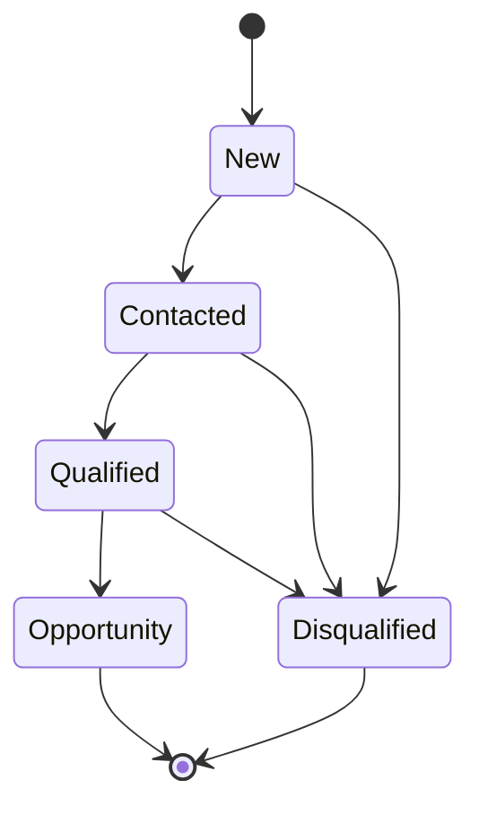
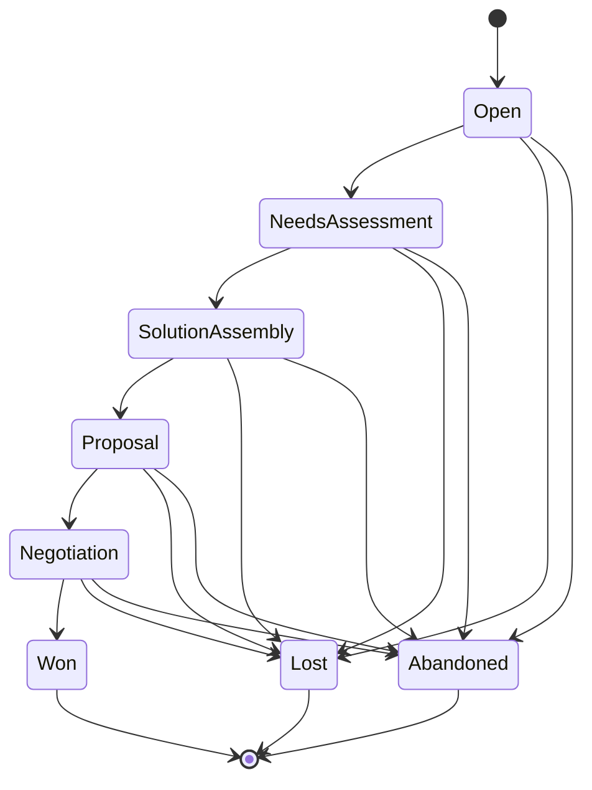

# JoineryTech CRM Domain Model

**Version:** 1.0
**Date:** 2026-07-02
**Epic:** EPIC-JT-CRM
**References:** ADR-058, OpenAPI Phase 1 Spec

---

## Executive Summary

This document defines the **Domain-Driven Design (DDD) domain model** for the JoineryTech CRM module. The model implements a **lead nurturing workflow** from initial contact to opportunity conversion, using **Finite State Machines (FSM)** for state transitions and **immutable value objects** for data integrity.

**Key Aggregates:**
1. **Lead** — Initial contact/inquiry before qualification
2. **Opportunity** — Qualified lead with estimated value and sales pipeline tracking

**Integration Points:**
- **Sales Module:** Opportunity → Quote conversion (when status = Proposal)
- **Webshop:** Auto-lead creation from contact forms
- **B2B Handshake:** Partner lead tracking and revenue sharing

---

## 1. Aggregate Roots

### 1.1 Lead Aggregate

**Purpose:** Represents an unqualified contact or inquiry. Tracks nurturing activities until qualification or disqualification.

**Lifecycle:**
```
New → Contacted → Qualified → Opportunity (converted)
  ↓       ↓          ↓
Disqualified
```

**Aggregate Boundary:**
- **Root:** Lead entity
- **Value Objects:** ContactInfo, LeadSource, LeadScore
- **Entities (within aggregate):** Activity (child entity)
- **Domain Events:** LeadCreated, LeadContacted, LeadQualified, LeadDisqualified, LeadConvertedToOpportunity

**Invariants:**
1. `Status` transitions must follow FSM rules (see Section 3)
2. `AssignedToUserId` must reference a valid user with `crm.manage` role
3. `ContactInfo.Email` must be unique per tenant (enforced by repository)
4. `LeadScore` is computed (read-only, calculated by LeadScoringService)
5. Once status = `Opportunity`, cannot transition back (terminal state + conversion)

**C# Skeleton:**
```csharp
public class Lead : AggregateRoot<LeadId>
{
    // Identifiers
    public LeadId Id { get; private set; }
    public TenantId TenantId { get; private set; }

    // Status (FSM)
    public LeadStatus Status { get; private set; }

    // Contact Information (Value Object)
    public ContactInfo Contact { get; private set; }

    // Source Tracking
    public LeadSource Source { get; private set; }

    // Assignment
    public UserId AssignedToUserId { get; private set; }

    // Scoring (computed)
    public LeadScore Score { get; private set; }

    // Reference to converted opportunity (if status = Opportunity)
    public OpportunityId? OpportunityRef { get; private set; }

    // Activity history (child entities)
    private readonly List<Activity> _activities = new();
    public IReadOnlyList<Activity> Activities => _activities.AsReadOnly();

    // Audit
    public DateTime CreatedAt { get; private set; }
    public DateTime? UpdatedAt { get; private set; }

    // Private constructor (enforce factory methods)
    private Lead() { }

    // Factory: Create new lead
    public static Lead Create(
        TenantId tenantId,
        ContactInfo contact,
        LeadSource source,
        UserId assignedToUserId)
    {
        var lead = new Lead
        {
            Id = LeadId.New(),
            TenantId = tenantId,
            Status = LeadStatus.New,
            Contact = contact,
            Source = source,
            AssignedToUserId = assignedToUserId,
            Score = LeadScore.Initial(),
            CreatedAt = DateTime.UtcNow
        };

        lead.AddDomainEvent(new LeadCreatedEvent(lead.Id, lead.TenantId, lead.Contact.Email));
        return lead;
    }

    // FSM: New → Contacted
    public void MarkAsContacted()
    {
        if (Status != LeadStatus.New)
            throw new InvalidStateTransitionException(Status, LeadStatus.Contacted);

        Status = LeadStatus.Contacted;
        UpdatedAt = DateTime.UtcNow;

        AddDomainEvent(new LeadContactedEvent(Id, TenantId));
    }

    // FSM: Contacted → Qualified
    public void Qualify()
    {
        if (Status != LeadStatus.Contacted)
            throw new InvalidStateTransitionException(Status, LeadStatus.Qualified);

        Status = LeadStatus.Qualified;
        UpdatedAt = DateTime.UtcNow;

        AddDomainEvent(new LeadQualifiedEvent(Id, TenantId));
    }

    // FSM: Any → Disqualified
    public void Disqualify(string reason)
    {
        if (Status == LeadStatus.Opportunity || Status == LeadStatus.Disqualified)
            throw new InvalidStateTransitionException(Status, LeadStatus.Disqualified);

        if (string.IsNullOrWhiteSpace(reason))
            throw new ArgumentException("Disqualification reason is required", nameof(reason));

        Status = LeadStatus.Disqualified;
        UpdatedAt = DateTime.UtcNow;

        AddDomainEvent(new LeadDisqualifiedEvent(Id, TenantId, reason));
    }

    // Factory: Convert to Opportunity
    public Opportunity ConvertToOpportunity(
        CustomerId customerId,
        string title,
        Money estimatedValue,
        decimal probability)
    {
        if (Status != LeadStatus.Qualified)
            throw new InvalidStateTransitionException(Status, LeadStatus.Opportunity);

        var opportunity = Opportunity.CreateFromLead(
            tenantId: TenantId,
            leadId: Id,
            customerId: customerId,
            title: title,
            estimatedValue: estimatedValue,
            probability: probability,
            assignedToUserId: AssignedToUserId
        );

        // Update lead status to terminal state
        Status = LeadStatus.Opportunity;
        OpportunityRef = opportunity.Id;
        UpdatedAt = DateTime.UtcNow;

        AddDomainEvent(new LeadConvertedToOpportunityEvent(Id, TenantId, opportunity.Id));

        return opportunity;
    }

    // Add activity (child entity)
    public void AddActivity(ActivityType type, string description, UserId performedBy)
    {
        var activity = Activity.Create(type, description, performedBy);
        _activities.Add(activity);

        UpdatedAt = DateTime.UtcNow;
    }

    // Recalculate score (called by LeadScoringService)
    public void UpdateScore(LeadScore newScore)
    {
        Score = newScore;
        UpdatedAt = DateTime.UtcNow;
    }
}
```

---

### 1.2 Opportunity Aggregate

**Purpose:** Represents a qualified sales opportunity with pipeline tracking and forecasting.

**Lifecycle:**
```
Open → NeedsAssessment → SolutionAssembly → Proposal → Negotiation → Won
  ↓          ↓                 ↓               ↓            ↓
Lost or Abandoned (terminal states)
```

**Aggregate Boundary:**
- **Root:** Opportunity entity
- **Value Objects:** Money (estimatedValue), Probability
- **Entities (within aggregate):** Activity (child entity)
- **Domain Events:** OpportunityCreated, OpportunityAdvanced, OpportunityWon, OpportunityLost, OpportunityAbandoned

**Invariants:**
1. `Status` transitions must follow FSM rules (see Section 3)
2. `Probability` must be 0-100 (percentage)
3. `EstimatedValue.Amount` must be >= 0
4. Once status = `Won`, `OrderRef` must be set (integration with Sales module)
5. Once status = `Proposal`, `QuoteRef` must be set
6. `CustomerId` must reference a valid customer (enforced by repository)

**C# Skeleton:**
```csharp
public class Opportunity : AggregateRoot<OpportunityId>
{
    // Identifiers
    public OpportunityId Id { get; private set; }
    public TenantId TenantId { get; private set; }

    // Status (FSM)
    public OpportunityStatus Status { get; private set; }

    // References
    public LeadId? LeadId { get; private set; } // Origin lead (nullable if manually created)
    public CustomerId CustomerId { get; private set; }
    public UserId AssignedToUserId { get; private set; }

    // Opportunity Details
    public string Title { get; private set; }
    public Money EstimatedValue { get; private set; }
    public decimal Probability { get; private set; } // 0-100%

    // Expected Close Date
    public DateTime? ExpectedCloseDate { get; private set; }

    // Integration References
    public QuoteId? QuoteRef { get; private set; } // Set when status = Proposal
    public OrderId? OrderRef { get; private set; } // Set when status = Won

    // Activity history (child entities)
    private readonly List<Activity> _activities = new();
    public IReadOnlyList<Activity> Activities => _activities.AsReadOnly();

    // Audit
    public DateTime CreatedAt { get; private set; }
    public DateTime? UpdatedAt { get; private set; }

    // Private constructor
    private Opportunity() { }

    // Factory: Create from qualified lead
    public static Opportunity CreateFromLead(
        TenantId tenantId,
        LeadId leadId,
        CustomerId customerId,
        string title,
        Money estimatedValue,
        decimal probability,
        UserId assignedToUserId)
    {
        if (probability < 0 || probability > 100)
            throw new ArgumentException("Probability must be 0-100", nameof(probability));

        var opportunity = new Opportunity
        {
            Id = OpportunityId.New(),
            TenantId = tenantId,
            LeadId = leadId,
            CustomerId = customerId,
            Title = title,
            EstimatedValue = estimatedValue,
            Probability = probability,
            AssignedToUserId = assignedToUserId,
            Status = OpportunityStatus.Open,
            CreatedAt = DateTime.UtcNow
        };

        opportunity.AddDomainEvent(new OpportunityCreatedEvent(
            opportunity.Id,
            opportunity.TenantId,
            opportunity.CustomerId,
            opportunity.EstimatedValue));

        return opportunity;
    }

    // Factory: Create manually (no lead)
    public static Opportunity Create(
        TenantId tenantId,
        CustomerId customerId,
        string title,
        Money estimatedValue,
        decimal probability,
        UserId assignedToUserId)
    {
        return CreateFromLead(
            tenantId,
            leadId: null,
            customerId,
            title,
            estimatedValue,
            probability,
            assignedToUserId);
    }

    // FSM: Advance to next stage
    public void AdvanceToNeedsAssessment()
    {
        if (Status != OpportunityStatus.Open)
            throw new InvalidStateTransitionException(Status, OpportunityStatus.NeedsAssessment);

        Status = OpportunityStatus.NeedsAssessment;
        UpdatedAt = DateTime.UtcNow;

        AddDomainEvent(new OpportunityAdvancedEvent(Id, TenantId, Status));
    }

    public void AdvanceToSolutionAssembly()
    {
        if (Status != OpportunityStatus.NeedsAssessment)
            throw new InvalidStateTransitionException(Status, OpportunityStatus.SolutionAssembly);

        Status = OpportunityStatus.SolutionAssembly;
        UpdatedAt = DateTime.UtcNow;

        AddDomainEvent(new OpportunityAdvancedEvent(Id, TenantId, Status));
    }

    public void AdvanceToProposal(QuoteId quoteId)
    {
        if (Status != OpportunityStatus.SolutionAssembly)
            throw new InvalidStateTransitionException(Status, OpportunityStatus.Proposal);

        Status = OpportunityStatus.Proposal;
        QuoteRef = quoteId;
        UpdatedAt = DateTime.UtcNow;

        AddDomainEvent(new OpportunityAdvancedEvent(Id, TenantId, Status));
    }

    public void AdvanceToNegotiation()
    {
        if (Status != OpportunityStatus.Proposal)
            throw new InvalidStateTransitionException(Status, OpportunityStatus.Negotiation);

        Status = OpportunityStatus.Negotiation;
        UpdatedAt = DateTime.UtcNow;

        AddDomainEvent(new OpportunityAdvancedEvent(Id, TenantId, Status));
    }

    // FSM: Win opportunity
    public void MarkAsWon(OrderId orderId)
    {
        if (Status != OpportunityStatus.Negotiation)
            throw new InvalidStateTransitionException(Status, OpportunityStatus.Won);

        Status = OpportunityStatus.Won;
        OrderRef = orderId;
        Probability = 100; // Won = 100% probability
        UpdatedAt = DateTime.UtcNow;

        AddDomainEvent(new OpportunityWonEvent(Id, TenantId, EstimatedValue, orderId));
    }

    // FSM: Lose opportunity
    public void MarkAsLost(string reason)
    {
        if (Status == OpportunityStatus.Won || Status == OpportunityStatus.Lost || Status == OpportunityStatus.Abandoned)
            throw new InvalidStateTransitionException(Status, OpportunityStatus.Lost);

        if (string.IsNullOrWhiteSpace(reason))
            throw new ArgumentException("Lost reason is required", nameof(reason));

        Status = OpportunityStatus.Lost;
        Probability = 0; // Lost = 0% probability
        UpdatedAt = DateTime.UtcNow;

        AddDomainEvent(new OpportunityLostEvent(Id, TenantId, reason));
    }

    // FSM: Abandon opportunity
    public void Abandon(string reason)
    {
        if (Status == OpportunityStatus.Won)
            throw new InvalidStateTransitionException(Status, OpportunityStatus.Abandoned);

        if (string.IsNullOrWhiteSpace(reason))
            throw new ArgumentException("Abandon reason is required", nameof(reason));

        Status = OpportunityStatus.Abandoned;
        Probability = 0;
        UpdatedAt = DateTime.UtcNow;

        AddDomainEvent(new OpportunityAbandonedEvent(Id, TenantId, reason));
    }

    // Update probability (sales forecast adjustment)
    public void UpdateProbability(decimal newProbability)
    {
        if (newProbability < 0 || newProbability > 100)
            throw new ArgumentException("Probability must be 0-100", nameof(newProbability));

        if (Status == OpportunityStatus.Won || Status == OpportunityStatus.Lost || Status == OpportunityStatus.Abandoned)
            throw new InvalidOperationException("Cannot update probability for terminal states");

        Probability = newProbability;
        UpdatedAt = DateTime.UtcNow;
    }

    // Update expected close date
    public void UpdateExpectedCloseDate(DateTime? newDate)
    {
        if (Status == OpportunityStatus.Won || Status == OpportunityStatus.Lost || Status == OpportunityStatus.Abandoned)
            throw new InvalidOperationException("Cannot update close date for terminal states");

        ExpectedCloseDate = newDate;
        UpdatedAt = DateTime.UtcNow;
    }

    // Add activity (child entity)
    public void AddActivity(ActivityType type, string description, UserId performedBy)
    {
        var activity = Activity.Create(type, description, performedBy);
        _activities.Add(activity);

        UpdatedAt = DateTime.UtcNow;
    }
}
```

---

## 2. Value Objects

### 2.1 ContactInfo

**Purpose:** Immutable contact information (name, email, phone, company).

**Invariants:**
- `Email` must be valid email format
- `Name` cannot be empty
- `Phone` is optional

**C# Skeleton:**
```csharp
public class ContactInfo : ValueObject
{
    public string Name { get; private set; }
    public Email Email { get; private set; }
    public PhoneNumber? Phone { get; private set; }
    public string? Company { get; private set; }

    private ContactInfo() { }

    public static ContactInfo Create(string name, string email, string? phone = null, string? company = null)
    {
        if (string.IsNullOrWhiteSpace(name))
            throw new ArgumentException("Name is required", nameof(name));

        return new ContactInfo
        {
            Name = name,
            Email = Email.Create(email),
            Phone = phone != null ? PhoneNumber.Create(phone) : null,
            Company = company
        };
    }

    protected override IEnumerable<object> GetEqualityComponents()
    {
        yield return Name;
        yield return Email;
        yield return Phone ?? string.Empty;
        yield return Company ?? string.Empty;
    }
}
```

---

### 2.2 Money

**Purpose:** Immutable monetary value (amount + currency).

**Invariants:**
- `Amount` must be >= 0
- `Currency` must be valid ISO 4217 code (HUF, EUR, USD)

**C# Skeleton:**
```csharp
public class Money : ValueObject
{
    public decimal Amount { get; private set; }
    public string Currency { get; private set; } // ISO 4217 (HUF, EUR, USD)

    private Money() { }

    public static Money Create(decimal amount, string currency = "HUF")
    {
        if (amount < 0)
            throw new ArgumentException("Amount must be >= 0", nameof(amount));

        if (!IsValidCurrency(currency))
            throw new ArgumentException($"Invalid currency: {currency}", nameof(currency));

        return new Money { Amount = amount, Currency = currency };
    }

    private static bool IsValidCurrency(string currency)
    {
        return currency is "HUF" or "EUR" or "USD";
    }

    protected override IEnumerable<object> GetEqualityComponents()
    {
        yield return Amount;
        yield return Currency;
    }

    // Operators
    public static Money operator +(Money a, Money b)
    {
        if (a.Currency != b.Currency)
            throw new InvalidOperationException($"Cannot add different currencies: {a.Currency} and {b.Currency}");

        return Create(a.Amount + b.Amount, a.Currency);
    }

    public static Money operator -(Money a, Money b)
    {
        if (a.Currency != b.Currency)
            throw new InvalidOperationException($"Cannot subtract different currencies: {a.Currency} and {b.Currency}");

        return Create(a.Amount - b.Amount, a.Currency);
    }
}
```

---

### 2.3 LeadScore

**Purpose:** Computed lead quality score (0-100). Calculated by `LeadScoringService`.

**Scoring Factors:**
- **Source Quality:** TradeShow (20), Referral (15), Website (10), Other (5)
- **Activity Count:** 5 points per activity (max 25)
- **Estimated Value:** 20 points if > 500k HUF, 10 points if > 100k, 0 otherwise
- **Engagement:** 15 points if contacted within 48h, 10 points if within 7 days
- **Company Size:** 10 points if company provided

**C# Skeleton:**
```csharp
public class LeadScore : ValueObject
{
    public int Value { get; private set; } // 0-100

    private LeadScore() { }

    public static LeadScore Create(int value)
    {
        if (value < 0 || value > 100)
            throw new ArgumentException("Score must be 0-100", nameof(value));

        return new LeadScore { Value = value };
    }

    public static LeadScore Initial() => Create(0);

    protected override IEnumerable<object> GetEqualityComponents()
    {
        yield return Value;
    }

    // Qualitative labels
    public string Label => Value switch
    {
        >= 80 => "Hot",
        >= 60 => "Warm",
        >= 40 => "Cold",
        _ => "Unscored"
    };
}
```

---

### 2.4 LeadSource

**Purpose:** Lead origin tracking (enum-like value object).

**Valid Sources:** Website, Phone, Email, TradeShow, Referral, Partner, Direct, Marketing, SocialMedia

**C# Skeleton:**
```csharp
public class LeadSource : ValueObject
{
    public string Value { get; private set; }

    private LeadSource() { }

    public static LeadSource Website => new() { Value = "Website" };
    public static LeadSource Phone => new() { Value = "Phone" };
    public static LeadSource Email => new() { Value = "Email" };
    public static LeadSource TradeShow => new() { Value = "TradeShow" };
    public static LeadSource Referral => new() { Value = "Referral" };
    public static LeadSource Partner => new() { Value = "Partner" };
    public static LeadSource Direct => new() { Value = "Direct" };
    public static LeadSource Marketing => new() { Value = "Marketing" };
    public static LeadSource SocialMedia => new() { Value = "SocialMedia" };

    public static LeadSource FromString(string source)
    {
        return source switch
        {
            "Website" => Website,
            "Phone" => Phone,
            "Email" => Email,
            "TradeShow" => TradeShow,
            "Referral" => Referral,
            "Partner" => Partner,
            "Direct" => Direct,
            "Marketing" => Marketing,
            "SocialMedia" => SocialMedia,
            _ => throw new ArgumentException($"Invalid lead source: {source}", nameof(source))
        };
    }

    protected override IEnumerable<object> GetEqualityComponents()
    {
        yield return Value;
    }

    // Quality score for LeadScoringService
    public int QualityScore => Value switch
    {
        "TradeShow" => 20,
        "Referral" => 15,
        "Website" => 10,
        "Partner" => 10,
        "Direct" => 8,
        "Marketing" => 8,
        "Phone" => 5,
        "Email" => 5,
        "SocialMedia" => 5,
        _ => 0
    };
}
```

---

## 3. Finite State Machines (FSM)

### 3.1 Lead FSM



**Transition Rules:**

| From State | To State | Condition | Method |
|------------|----------|-----------|--------|
| New | Contacted | User performed initial contact | `MarkAsContacted()` |
| New | Disqualified | Not a fit (+ reason required) | `Disqualify(reason)` |
| Contacted | Qualified | Meets qualification criteria | `Qualify()` |
| Contacted | Disqualified | Not a fit (+ reason required) | `Disqualify(reason)` |
| Qualified | Opportunity | Converted to sales opportunity | `ConvertToOpportunity(...)` |
| Qualified | Disqualified | Lost during qualification | `Disqualify(reason)` |

**Terminal States:** `Opportunity`, `Disqualified`

**Validation:**
- `Disqualify()` requires `reason` parameter (non-empty string)
- `ConvertToOpportunity()` requires `CustomerId`, `Title`, `EstimatedValue`, `Probability`
- Once `Opportunity` or `Disqualified`, no further transitions allowed

---

### 3.2 Opportunity FSM



**Transition Rules:**

| From State | To State | Condition | Method |
|------------|----------|-----------|--------|
| Open | NeedsAssessment | Initial discovery completed | `AdvanceToNeedsAssessment()` |
| Open | Lost | Opportunity lost early | `MarkAsLost(reason)` |
| Open | Abandoned | Opportunity abandoned | `Abandon(reason)` |
| NeedsAssessment | SolutionAssembly | Requirements gathered | `AdvanceToSolutionAssembly()` |
| SolutionAssembly | Proposal | Quote sent to customer | `AdvanceToProposal(quoteId)` |
| Proposal | Negotiation | Customer reviewing proposal | `AdvanceToNegotiation()` |
| Negotiation | Won | Customer accepted | `MarkAsWon(orderId)` |
| Any (except Won) | Lost | Opportunity lost (+ reason) | `MarkAsLost(reason)` |
| Any (except Won) | Abandoned | Opportunity abandoned (+ reason) | `Abandon(reason)` |

**Terminal States:** `Won`, `Lost`, `Abandoned`

**Validation:**
- `AdvanceToProposal(quoteId)` requires valid `QuoteId` (integration with Sales module)
- `MarkAsWon(orderId)` requires valid `OrderId` (integration with Sales module)
- `MarkAsLost(reason)` and `Abandon(reason)` require non-empty `reason`
- Terminal states cannot transition to any other state

---

## 4. Domain Services

### 4.1 LeadScoringService

**Purpose:** Calculate lead quality score (0-100) based on multiple factors.

**Inputs:**
- Lead entity (source, activities, estimated value, created date)

**Scoring Algorithm:**
```
Score = SourceQuality + ActivityScore + ValueScore + EngagementScore + CompanyScore

SourceQuality (0-20):
  - TradeShow: 20
  - Referral: 15
  - Website, Partner: 10
  - Direct, Marketing: 8
  - Phone, Email, SocialMedia: 5

ActivityScore (0-25):
  - 5 points per activity (max 5 activities = 25 points)

ValueScore (0-20):
  - > 500k HUF: 20
  - > 100k HUF: 10
  - < 100k HUF: 0

EngagementScore (0-15):
  - Contacted within 48h: 15
  - Contacted within 7 days: 10
  - Not contacted: 0

CompanyScore (0-10):
  - Company provided: 10
  - No company: 0

Total = Capped at 100
```

**C# Skeleton:**
```csharp
public class LeadScoringService : ILeadScoringService
{
    public LeadScore CalculateScore(Lead lead)
    {
        int score = 0;

        // Source quality (0-20)
        score += lead.Source.QualityScore;

        // Activity count (0-25, 5 points per activity, max 5)
        int activityCount = Math.Min(lead.Activities.Count, 5);
        score += activityCount * 5;

        // Estimated value (0-20)
        if (lead.EstimatedValue != null)
        {
            if (lead.EstimatedValue.Amount > 500_000)
                score += 20;
            else if (lead.EstimatedValue.Amount > 100_000)
                score += 10;
        }

        // Engagement (0-15)
        var daysSinceCreation = (DateTime.UtcNow - lead.CreatedAt).TotalDays;
        var hasContactActivity = lead.Activities.Any(a => a.Type == ActivityType.Call || a.Type == ActivityType.Meeting);

        if (hasContactActivity)
        {
            if (daysSinceCreation <= 2)
                score += 15;
            else if (daysSinceCreation <= 7)
                score += 10;
        }

        // Company provided (0-10)
        if (!string.IsNullOrEmpty(lead.Contact.Company))
            score += 10;

        // Cap at 100
        score = Math.Min(score, 100);

        return LeadScore.Create(score);
    }
}
```

---

### 4.2 OpportunityForecastService

**Purpose:** Calculate weighted sales forecast based on pipeline stage and probability.

**Inputs:**
- Collection of Opportunity entities
- Forecast period (e.g., Q3 2026)

**Algorithm:**
```
Weighted Forecast = Σ (EstimatedValue × Probability%)

For each opportunity:
  If ExpectedCloseDate is within forecast period AND Status != Lost/Abandoned:
    WeightedValue = EstimatedValue.Amount × (Probability / 100)
    Total += WeightedValue
```

**C# Skeleton:**
```csharp
public class OpportunityForecastService : IOpportunityForecastService
{
    public Money CalculateWeightedForecast(
        IEnumerable<Opportunity> opportunities,
        DateTime periodStart,
        DateTime periodEnd)
    {
        decimal totalForecast = 0m;
        string currency = "HUF"; // Default

        foreach (var opp in opportunities)
        {
            // Skip terminal lost/abandoned states
            if (opp.Status == OpportunityStatus.Lost || opp.Status == OpportunityStatus.Abandoned)
                continue;

            // Skip if expected close date outside period
            if (opp.ExpectedCloseDate == null ||
                opp.ExpectedCloseDate < periodStart ||
                opp.ExpectedCloseDate > periodEnd)
                continue;

            // Weighted value = amount × (probability / 100)
            decimal weightedValue = opp.EstimatedValue.Amount * (opp.Probability / 100m);
            totalForecast += weightedValue;

            // Use currency from first opportunity (assume all same currency)
            currency = opp.EstimatedValue.Currency;
        }

        return Money.Create(totalForecast, currency);
    }

    // Alternative: Forecast by stage
    public Dictionary<OpportunityStatus, Money> CalculateForecastByStage(
        IEnumerable<Opportunity> opportunities)
    {
        var forecast = new Dictionary<OpportunityStatus, Money>();

        var grouped = opportunities
            .Where(o => o.Status != OpportunityStatus.Lost && o.Status != OpportunityStatus.Abandoned)
            .GroupBy(o => o.Status);

        foreach (var group in grouped)
        {
            decimal totalWeighted = group.Sum(o => o.EstimatedValue.Amount * (o.Probability / 100m));
            string currency = group.First().EstimatedValue.Currency;

            forecast[group.Key] = Money.Create(totalWeighted, currency);
        }

        return forecast;
    }
}
```

---

## 5. Repository Contracts

### 5.1 ILeadRepository

**Purpose:** Persistence interface for Lead aggregate.

**C# Skeleton:**
```csharp
public interface ILeadRepository
{
    // Queries
    Task<Lead?> GetByIdAsync(LeadId id, CancellationToken ct);
    Task<IEnumerable<Lead>> GetByStatusAsync(LeadStatus status, CancellationToken ct);
    Task<IEnumerable<Lead>> GetByAssignedUserAsync(UserId userId, CancellationToken ct);
    Task<IEnumerable<Lead>> GetBySources List<LeadSource> sources, CancellationToken ct);

    // Paged query
    Task<PagedResult<Lead>> GetPagedAsync(
        int page,
        int pageSize,
        LeadStatus? statusFilter = null,
        UserId? assignedToFilter = null,
        CancellationToken ct = default);

    // Commands
    Task AddAsync(Lead lead, CancellationToken ct);
    Task UpdateAsync(Lead lead, CancellationToken ct);

    // Unique constraint check
    Task<bool> EmailExistsAsync(Email email, TenantId tenantId, CancellationToken ct);
}
```

---

### 5.2 IOpportunityRepository

**Purpose:** Persistence interface for Opportunity aggregate.

**C# Skeleton:**
```csharp
public interface IOpportunityRepository
{
    // Queries
    Task<Opportunity?> GetByIdAsync(OpportunityId id, CancellationToken ct);
    Task<IEnumerable<Opportunity>> GetByStatusAsync(OpportunityStatus status, CancellationToken ct);
    Task<IEnumerable<Opportunity>> GetByAssignedUserAsync(UserId userId, CancellationToken ct);
    Task<IEnumerable<Opportunity>> GetByCustomerAsync(CustomerId customerId, CancellationToken ct);

    // Forecast queries
    Task<IEnumerable<Opportunity>> GetByExpectedCloseDateRangeAsync(
        DateTime start,
        DateTime end,
        CancellationToken ct);

    // Paged query
    Task<PagedResult<Opportunity>> GetPagedAsync(
        int page,
        int pageSize,
        OpportunityStatus? statusFilter = null,
        UserId? assignedToFilter = null,
        CancellationToken ct = default);

    // Commands
    Task AddAsync(Opportunity opportunity, CancellationToken ct);
    Task UpdateAsync(Opportunity opportunity, CancellationToken ct);
}
```

---

## 6. Child Entities

### 6.1 Activity

**Purpose:** Track CRM activities (calls, emails, meetings, notes) within Lead or Opportunity aggregate.

**Types:** Call, Email, Meeting, Note

**C# Skeleton:**
```csharp
public class Activity : Entity<ActivityId>
{
    public ActivityId Id { get; private set; }
    public ActivityType Type { get; private set; }
    public string Description { get; private set; }
    public UserId PerformedBy { get; private set; }
    public DateTime PerformedAt { get; private set; }

    private Activity() { }

    public static Activity Create(ActivityType type, string description, UserId performedBy)
    {
        if (string.IsNullOrWhiteSpace(description))
            throw new ArgumentException("Description is required", nameof(description));

        return new Activity
        {
            Id = ActivityId.New(),
            Type = type,
            Description = description,
            PerformedBy = performedBy,
            PerformedAt = DateTime.UtcNow
        };
    }
}

public enum ActivityType
{
    Call,
    Email,
    Meeting,
    Note
}
```

---

## 7. Integration Boundaries

### 7.1 Sales Module Integration

**Opportunity → Quote Conversion:**

When `Opportunity.AdvanceToProposal(quoteId)` is called, a Quote must already exist in the Sales module.

**Flow:**
1. User creates Quote in Sales module (outside CRM aggregate)
2. Sales module returns `QuoteId`
3. CRM module calls `opportunity.AdvanceToProposal(quoteId)`
4. `OpportunityAdvancedEvent` published with `quoteId` reference

**Opportunity → Order Conversion:**

When `Opportunity.MarkAsWon(orderId)` is called, an Order must already exist in the Sales module.

**Flow:**
1. User accepts Quote in Sales module → Order created
2. Sales module returns `OrderId`
3. CRM module calls `opportunity.MarkAsWon(orderId)`
4. `OpportunityWonEvent` published with `orderId` reference

---

### 7.2 Webshop Integration

**Auto-Lead Creation from Contact Form:**

Webshop exposes contact form. On submission, creates Lead via CRM API.

**Flow:**
1. Customer fills contact form on webshop
2. Webshop calls `POST /api/crm/leads` (CRM API)
3. CRM module creates Lead with `Source = Website`
4. Lead auto-assigned to default sales rep (configured per tenant)
5. `LeadCreatedEvent` published → notifications sent

---

### 7.3 B2B Handshake Integration

**Partner Lead Tracking:**

B2B partners can submit leads via API. Revenue share tracked via `LeadSource.Partner`.

**Flow:**
1. Partner calls `POST /api/crm/leads` with `source=Partner`
2. CRM module creates Lead with partner reference (custom field or Note)
3. When lead converts to Opportunity → Won, revenue share calculated
4. Partner receives notification via webhook (out of scope for Phase 1)

---

## 8. Domain Events

### 8.1 Lead Events

| Event | Triggers | Payload |
|-------|---------|---------|
| `LeadCreatedEvent` | New lead created | LeadId, TenantId, Email |
| `LeadContactedEvent` | Status: New → Contacted | LeadId, TenantId |
| `LeadQualifiedEvent` | Status: Contacted → Qualified | LeadId, TenantId |
| `LeadDisqualifiedEvent` | Status → Disqualified | LeadId, TenantId, Reason |
| `LeadConvertedToOpportunityEvent` | Status: Qualified → Opportunity | LeadId, TenantId, OpportunityId |

---

### 8.2 Opportunity Events

| Event | Triggers | Payload |
|-------|---------|---------|
| `OpportunityCreatedEvent` | New opportunity created | OpportunityId, TenantId, CustomerId, EstimatedValue |
| `OpportunityAdvancedEvent` | Status advanced (any stage) | OpportunityId, TenantId, NewStatus |
| `OpportunityWonEvent` | Status: Negotiation → Won | OpportunityId, TenantId, EstimatedValue, OrderId |
| `OpportunityLostEvent` | Status → Lost | OpportunityId, TenantId, Reason |
| `OpportunityAbandonedEvent` | Status → Abandoned | OpportunityId, TenantId, Reason |

---

## 9. Validation Rules

### 9.1 Lead Validation

| Rule | Enforcement |
|------|-------------|
| Email uniqueness per tenant | Repository check before `AddAsync` |
| AssignedToUserId must have `crm.manage` role | Application service validates before `Lead.Create()` |
| Disqualify requires reason | Domain method validates (throw if empty) |
| Cannot transition from Opportunity state | Domain method validates (throw `InvalidStateTransitionException`) |

---

### 9.2 Opportunity Validation

| Rule | Enforcement |
|------|-------------|
| Probability must be 0-100 | Domain method validates (throw if out of range) |
| EstimatedValue.Amount must be >= 0 | Value Object validates on creation |
| CustomerId must exist | Repository check (FK constraint in DB) |
| QuoteRef required for Proposal status | Domain method enforces (parameter required) |
| OrderRef required for Won status | Domain method enforces (parameter required) |
| Cannot update terminal states | Domain methods throw `InvalidOperationException` |

---

## 10. Summary

**Aggregate Roots:** 2 (Lead, Opportunity)
**Value Objects:** 4 (ContactInfo, Money, LeadScore, LeadSource)
**Child Entities:** 1 (Activity)
**Domain Services:** 2 (LeadScoringService, OpportunityForecastService)
**Repository Contracts:** 2 (ILeadRepository, IOpportunityRepository)
**Domain Events:** 10 (5 Lead + 5 Opportunity)

**Key Design Principles:**
- **Immutability:** Value Objects are immutable
- **FSM Enforcement:** Status transitions validated at domain level
- **Event-Driven:** Domain events published for all state changes
- **Aggregate Isolation:** No direct references between Lead and Opportunity (use IDs)
- **Integration via Events:** Sales/Webshop/B2B integrate via API + domain events

---

**Next Steps:**
1. Backend terminal implements C# full code (Phase 1)
2. PostgreSQL schema design (RLS + FSM tables)
3. API endpoints implementation (CQRS handlers)
4. Unit tests for FSM transitions
5. Integration tests for repository contracts

---

**Document Version:** 1.0
**Last Updated:** 2026-07-02
**Author:** Architect Terminal
**Status:** ✅ Ready for Implementation
