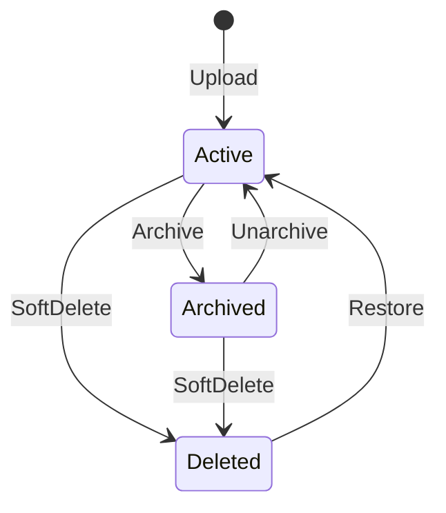

# JoineryTech DMS Domain Model — DDD Design Specification

**Version:** 1.0
**Date:** 2026-07-04
**Epic:** EPIC-JT-DMS
**Architect:** architect terminal
**Status:** Implementation Ready

---

## Executive Summary

This document specifies the **Document Management System (DMS) domain model** for the JoineryTech ERP system using **Domain-Driven Design (DDD)** tactical patterns. The DMS domain is responsible for:

- **Document Storage** — The single source of truth for all uploaded files with metadata
- **Version Control** — Immutable version history with SHA-256 integrity verification
- **Entity Linking** — Documents can be attached to any entity (Orders, Projects, Assets, Employees, etc.)
- **Search & Discovery** — Full-text search across metadata and optionally file content
- **Permission Management** — Need-to-know access control with audit trail
- **Integration** — All modules can link documents; blob storage for file content

**Key Design Principles:**
1. **Single Source of Truth** — `Document` aggregate is THE canonical document registry
2. **Immutability** — Versions are immutable; editing creates a new version
3. **File Content Outside SQL** — Only metadata in PostgreSQL; actual files in blob storage
4. **SHA-256 Integrity** — Every version has a hash for tamper detection
5. **Entity Linking Pattern** — Loose coupling via EntityType + EntityId references
6. **Need-to-Know RBAC** — Explicit permissions required for sensitive documents
7. **Audit Trail** — All document events logged for compliance

---

## Table of Contents

1. [Aggregate Roots](#1-aggregate-roots)
2. [Entities](#2-entities)
3. [Value Objects](#3-value-objects)
4. [Enums](#4-enums)
5. [Domain Services](#5-domain-services)
6. [Domain Events](#6-domain-events)
7. [Repository Contracts](#7-repository-contracts)
8. [FSM State Machines](#8-fsm-state-machines)
9. [Integration Boundaries](#9-integration-boundaries)
10. [Validation Rules](#10-validation-rules)
11. [Implementation Guide](#11-implementation-guide)

---

## 1. Aggregate Roots

### 1.1 Document Aggregate

**Responsibility:** Represents a file with metadata, version history, entity links, tags, and permissions. The single source of truth for all document information across the system.

```csharp
public class Document : AggregateRoot<DocumentId>
{
    public DocumentId Id { get; private set; }
    public TenantId TenantId { get; private set; }
    public string FileName { get; private set; }
    public string MimeType { get; private set; }
    public string Description { get; private set; }
    public DocumentStatus Status { get; private set; }
    public UserId UploadedByUserId { get; private set; }
    public DateTime UploadedAt { get; private set; }
    public DateTime? ArchivedAt { get; private set; }
    public DateTime? DeletedAt { get; private set; }
    public DateOnly? ExpiryDate { get; private set; } // For certificates, compliance docs
    public Guid CurrentVersionId { get; private set; }
    public int CurrentVersionNumber { get; private set; }

    private readonly List<DocumentVersion> _versions = new();
    public IReadOnlyList<DocumentVersion> Versions => _versions.AsReadOnly();

    private readonly List<EntityLink> _entityLinks = new();
    public IReadOnlyList<EntityLink> EntityLinks => _entityLinks.AsReadOnly();

    private readonly List<string> _tags = new();
    public IReadOnlyList<string> Tags => _tags.AsReadOnly();

    private readonly List<DocumentPermission> _permissions = new();
    public IReadOnlyList<DocumentPermission> Permissions => _permissions.AsReadOnly();

    // Factory method
    public static Document Create(
        TenantId tenantId,
        string fileName,
        string mimeType,
        UserId uploadedByUserId,
        Stream fileStream,
        IBlobStorageService blobStorage,
        string description = null,
        DateOnly? expiryDate = null)
    {
        if (string.IsNullOrWhiteSpace(fileName))
            throw new ArgumentException("File name is required", nameof(fileName));
        if (string.IsNullOrWhiteSpace(mimeType))
            throw new ArgumentException("MIME type is required", nameof(mimeType));
        if (fileStream == null || fileStream.Length == 0)
            throw new ArgumentException("File content is required", nameof(fileStream));

        var document = new Document
        {
            Id = DocumentId.New(),
            TenantId = tenantId,
            FileName = fileName,
            MimeType = mimeType,
            Description = description,
            Status = DocumentStatus.Active,
            UploadedByUserId = uploadedByUserId,
            UploadedAt = DateTime.UtcNow,
            ExpiryDate = expiryDate,
            CreatedAt = DateTime.UtcNow
        };

        // Create first version
        var firstVersion = document.CreateVersion(fileStream, blobStorage, uploadedByUserId, "Initial upload");
        document.CurrentVersionId = firstVersion.Id;
        document.CurrentVersionNumber = 1;

        document.AddDomainEvent(new DocumentUploadedEvent(
            document.Id, document.TenantId, document.FileName, document.MimeType,
            firstVersion.SizeBytes, document.UploadedByUserId));

        return document;
    }

    // Add new version (immutable versioning)
    public DocumentVersion AddVersion(
        Stream fileStream,
        IBlobStorageService blobStorage,
        UserId uploadedByUserId,
        string changeNotes = null)
    {
        if (Status != DocumentStatus.Active)
            throw new DomainException("Cannot add version to non-active document");
        if (fileStream == null || fileStream.Length == 0)
            throw new ArgumentException("File content is required", nameof(fileStream));

        var version = CreateVersion(fileStream, blobStorage, uploadedByUserId, changeNotes);
        CurrentVersionId = version.Id;
        CurrentVersionNumber = version.VersionNumber;

        AddDomainEvent(new DocumentVersionAddedEvent(
            Id, TenantId, version.VersionNumber, version.SizeBytes, uploadedByUserId, changeNotes));

        return version;
    }

    private DocumentVersion CreateVersion(
        Stream fileStream,
        IBlobStorageService blobStorage,
        UserId uploadedByUserId,
        string changeNotes)
    {
        var versionNumber = _versions.Count + 1;
        var hash = CalculateSHA256(fileStream);
        fileStream.Position = 0; // Reset stream position after hashing
        var sizeBytes = fileStream.Length;

        // Upload to blob storage
        var fileUrl = blobStorage.UploadAsync(
            fileStream,
            $"{TenantId.Value}/{Id.Value}/{versionNumber}/{FileName}",
            MimeType).GetAwaiter().GetResult();

        var version = new DocumentVersion
        {
            Id = Guid.NewGuid(),
            VersionNumber = versionNumber,
            FileUrl = fileUrl,
            Hash = hash,
            SizeBytes = sizeBytes,
            UploadedByUserId = uploadedByUserId,
            UploadedAt = DateTime.UtcNow,
            ChangeNotes = changeNotes
        };

        _versions.Add(version);
        return version;
    }

    // Entity linking
    public void LinkToEntity(EntityType entityType, Guid entityId, UserId linkedByUserId)
    {
        if (Status == DocumentStatus.Deleted)
            throw new DomainException("Cannot link deleted document to entity");

        if (_entityLinks.Any(l => l.EntityType == entityType && l.EntityId == entityId))
            throw new DomainException($"Document already linked to {entityType} {entityId}");

        var link = new EntityLink
        {
            EntityType = entityType,
            EntityId = entityId,
            LinkedByUserId = linkedByUserId,
            LinkedAt = DateTime.UtcNow
        };

        _entityLinks.Add(link);
        AddDomainEvent(new DocumentLinkedToEntityEvent(Id, TenantId, entityType, entityId, linkedByUserId));
    }

    public void UnlinkFromEntity(EntityType entityType, Guid entityId)
    {
        var link = _entityLinks.FirstOrDefault(l => l.EntityType == entityType && l.EntityId == entityId);
        if (link == null)
            throw new DomainException($"Document not linked to {entityType} {entityId}");

        _entityLinks.Remove(link);
        AddDomainEvent(new DocumentUnlinkedFromEntityEvent(Id, TenantId, entityType, entityId));
    }

    // Tagging
    public void AddTag(string tag)
    {
        if (string.IsNullOrWhiteSpace(tag))
            throw new ArgumentException("Tag cannot be empty", nameof(tag));

        var normalizedTag = tag.Trim().ToLowerInvariant();
        if (_tags.Contains(normalizedTag))
            return; // Idempotent

        _tags.Add(normalizedTag);
        AddDomainEvent(new DocumentTagAddedEvent(Id, TenantId, normalizedTag));
    }

    public void RemoveTag(string tag)
    {
        var normalizedTag = tag.Trim().ToLowerInvariant();
        if (!_tags.Contains(normalizedTag))
            return; // Idempotent

        _tags.Remove(normalizedTag);
        AddDomainEvent(new DocumentTagRemovedEvent(Id, TenantId, normalizedTag));
    }

    // Permissions
    public void GrantPermission(PermissionType permissionType, UserId grantedToUserId, UserId grantedByUserId)
    {
        if (_permissions.Any(p => p.PermissionType == permissionType && p.GrantedToUserId == grantedToUserId))
            return; // Idempotent

        var permission = new DocumentPermission
        {
            PermissionType = permissionType,
            GrantedToUserId = grantedToUserId,
            GrantedByUserId = grantedByUserId,
            GrantedAt = DateTime.UtcNow
        };

        _permissions.Add(permission);
        AddDomainEvent(new DocumentPermissionGrantedEvent(Id, TenantId, permissionType, grantedToUserId, grantedByUserId));
    }

    public void RevokePermission(PermissionType permissionType, UserId userId)
    {
        var permission = _permissions.FirstOrDefault(p => p.PermissionType == permissionType && p.GrantedToUserId == userId);
        if (permission == null)
            return; // Idempotent

        _permissions.Remove(permission);
        AddDomainEvent(new DocumentPermissionRevokedEvent(Id, TenantId, permissionType, userId));
    }

    // Lifecycle: Archive
    public void Archive()
    {
        if (Status != DocumentStatus.Active)
            throw new DomainException($"Cannot archive document in {Status} status");

        Status = DocumentStatus.Archived;
        ArchivedAt = DateTime.UtcNow;
        AddDomainEvent(new DocumentArchivedEvent(Id, TenantId, FileName));
    }

    public void Unarchive()
    {
        if (Status != DocumentStatus.Archived)
            throw new DomainException($"Cannot unarchive document in {Status} status");

        Status = DocumentStatus.Active;
        ArchivedAt = null;
        AddDomainEvent(new DocumentUnarchivedEvent(Id, TenantId, FileName));
    }

    // Lifecycle: Soft Delete (move to trash)
    public void SoftDelete()
    {
        if (Status == DocumentStatus.Deleted)
            throw new DomainException("Document is already deleted");

        // Optionally warn if entity links exist
        Status = DocumentStatus.Deleted;
        DeletedAt = DateTime.UtcNow;
        AddDomainEvent(new DocumentDeletedEvent(Id, TenantId, FileName, _entityLinks.Count));
    }

    public void Restore()
    {
        if (Status != DocumentStatus.Deleted)
            throw new DomainException($"Cannot restore document in {Status} status");

        Status = DocumentStatus.Active;
        DeletedAt = null;
        AddDomainEvent(new DocumentRestoredEvent(Id, TenantId, FileName));
    }

    // Update metadata
    public void UpdateMetadata(string fileName = null, string description = null, DateOnly? expiryDate = null)
    {
        if (Status == DocumentStatus.Deleted)
            throw new DomainException("Cannot update deleted document");

        if (!string.IsNullOrWhiteSpace(fileName))
            FileName = fileName;

        Description = description ?? Description;
        ExpiryDate = expiryDate ?? ExpiryDate;

        AddDomainEvent(new DocumentMetadataUpdatedEvent(Id, TenantId, FileName, Description));
    }

    private static string CalculateSHA256(Stream stream)
    {
        using var sha256 = System.Security.Cryptography.SHA256.Create();
        stream.Position = 0;
        var hashBytes = sha256.ComputeHash(stream);
        return Convert.ToHexString(hashBytes).ToLowerInvariant();
    }
}
```

**Invariants:**
- FileName must not be empty
- MimeType must be valid
- CurrentVersionId must always point to a valid version in _versions
- Versions are immutable (once created, cannot be edited)
- Cannot add versions to non-active documents
- Cannot link deleted documents to entities
- Archived documents can be unarchived; deleted documents can be restored

---

### 1.2 Folder Aggregate (Optional — Phase 2)

**Responsibility:** Organize documents into hierarchical folders. Optional feature for large document collections.

```csharp
public class Folder : AggregateRoot<FolderId>
{
    public FolderId Id { get; private set; }
    public TenantId TenantId { get; private set; }
    public string Name { get; private set; }
    public FolderId ParentFolderId { get; private set; } // null = root folder
    public UserId CreatedByUserId { get; private set; }
    public DateTime CreatedAt { get; private set; }

    // Factory method
    public static Folder Create(
        TenantId tenantId,
        string name,
        UserId createdByUserId,
        FolderId parentFolderId = null)
    {
        if (string.IsNullOrWhiteSpace(name))
            throw new ArgumentException("Folder name is required", nameof(name));

        var folder = new Folder
        {
            Id = FolderId.New(),
            TenantId = tenantId,
            Name = name,
            ParentFolderId = parentFolderId,
            CreatedByUserId = createdByUserId,
            CreatedAt = DateTime.UtcNow
        };

        folder.AddDomainEvent(new FolderCreatedEvent(folder.Id, folder.TenantId, folder.Name, folder.ParentFolderId));
        return folder;
    }

    public void Rename(string newName)
    {
        if (string.IsNullOrWhiteSpace(newName))
            throw new ArgumentException("Folder name is required", nameof(newName));

        var oldName = Name;
        Name = newName;
        AddDomainEvent(new FolderRenamedEvent(Id, TenantId, oldName, newName));
    }

    public void Move(FolderId newParentFolderId)
    {
        if (newParentFolderId == Id)
            throw new DomainException("Cannot move folder into itself");

        var oldParentId = ParentFolderId;
        ParentFolderId = newParentFolderId;
        AddDomainEvent(new FolderMovedEvent(Id, TenantId, oldParentId, newParentFolderId));
    }
}
```

**Invariants:**
- Name must not be empty
- Name unique within parent folder (per tenant)
- Cannot move folder into itself (circular reference prevention)
- Cannot delete non-empty folder (validation at application layer)

---

## 2. Entities

### 2.1 DocumentVersion (Value Object owned by Document)

**Responsibility:** Represents a single immutable version of a document file.

```csharp
public class DocumentVersion
{
    public Guid Id { get; init; }
    public int VersionNumber { get; init; }
    public string FileUrl { get; init; } // Blob storage URL
    public string Hash { get; init; } // SHA-256 for integrity
    public long SizeBytes { get; init; }
    public UserId UploadedByUserId { get; init; }
    public DateTime UploadedAt { get; init; }
    public string ChangeNotes { get; init; } // Optional: what changed
}
```

---

## 3. Value Objects

### 3.1 EntityLink

**Responsibility:** Represents a link between a document and an entity (Order, Project, Asset, Employee, etc.).

```csharp
public class EntityLink : ValueObject
{
    public EntityType EntityType { get; init; }
    public Guid EntityId { get; init; }
    public UserId LinkedByUserId { get; init; }
    public DateTime LinkedAt { get; init; }

    protected override IEnumerable<object> GetEqualityComponents()
    {
        yield return EntityType;
        yield return EntityId;
    }
}
```

---

### 3.2 DocumentPermission

**Responsibility:** Represents an explicit permission grant for a document.

```csharp
public class DocumentPermission : ValueObject
{
    public PermissionType PermissionType { get; init; }
    public UserId GrantedToUserId { get; init; }
    public UserId GrantedByUserId { get; init; }
    public DateTime GrantedAt { get; init; }

    protected override IEnumerable<object> GetEqualityComponents()
    {
        yield return PermissionType;
        yield return GrantedToUserId;
    }
}
```

---

### 3.3 DocumentMetadata (DTO for queries)

**Responsibility:** Read-only projection of document metadata for listing and search results.

```csharp
public record DocumentMetadata(
    DocumentId Id,
    string FileName,
    string MimeType,
    string Description,
    DocumentStatus Status,
    int CurrentVersionNumber,
    long SizeBytes,
    UserId UploadedByUserId,
    DateTime UploadedAt,
    DateOnly? ExpiryDate,
    IReadOnlyList<string> Tags,
    IReadOnlyList<EntityLinkDto> EntityLinks);

public record EntityLinkDto(EntityType EntityType, Guid EntityId);
```

---

### 3.4 Money

**Responsibility:** Currency value (reused from Kernel).

```csharp
public class Money : ValueObject
{
    public decimal Amount { get; init; }
    public string Currency { get; init; } // "HUF", "EUR"

    public static Money HUF(decimal amount) => new() { Amount = amount, Currency = "HUF" };
    public static Money EUR(decimal amount) => new() { Amount = amount, Currency = "EUR" };

    protected override IEnumerable<object> GetEqualityComponents()
    {
        yield return Amount;
        yield return Currency;
    }
}
```

---

## 4. Enums

### 4.1 DocumentStatus

```csharp
public enum DocumentStatus
{
    Active = 0,     // Normal state, can be viewed/edited
    Archived = 1,   // Read-only, moved to archive
    Deleted = 2     // Soft deleted, in trash (can be restored)
}
```

---

### 4.2 EntityType

```csharp
public enum EntityType
{
    Order = 0,          // Sales order
    Project = 1,        // Project (production job)
    Asset = 2,          // Machine, vehicle, tool (Maintenance)
    Employee = 3,       // HR employee
    WorkOrder = 4,      // Maintenance work order
    Ticket = 5,         // QA ticket (complaint)
    Lead = 6,           // CRM lead
    Opportunity = 7,    // CRM opportunity
    Supplier = 8,       // Procurement supplier
    PurchaseOrder = 9,  // Procurement PO
    Inspection = 10,    // QA inspection
    Other = 99          // Generic/unknown
}
```

---

### 4.3 PermissionType

```csharp
public enum PermissionType
{
    View = 0,       // Can view document
    Edit = 1,       // Can add versions, update metadata
    Delete = 2,     // Can soft-delete document
    Share = 3       // Can grant permissions to others
}
```

---

### 4.4 MimeTypeCategory

```csharp
public enum MimeTypeCategory
{
    PDF,            // application/pdf
    Image,          // image/*
    Document,       // application/vnd.* (Word, Excel, etc.)
    Spreadsheet,    // application/vnd.*spreadsheet*
    Archive,        // application/zip, application/x-rar
    Unknown         // application/octet-stream, other
}
```

---

## 5. Domain Services

### 5.1 DocumentSearchService

**Responsibility:** Full-text search across documents (metadata + optional content extraction).

```csharp
public interface IDocumentSearchService
{
    /// <summary>
    /// Search documents by query (filename, description, tags)
    /// </summary>
    Task<IEnumerable<DocumentMetadata>> SearchAsync(
        string query,
        SearchFilters filters,
        int skip = 0,
        int take = 50,
        CancellationToken ct = default);
}

public class SearchFilters
{
    public IEnumerable<string> Tags { get; init; }
    public EntityType? EntityType { get; init; }
    public Guid? EntityId { get; init; }
    public UserId? UploadedByUserId { get; init; }
    public DateOnly? StartDate { get; init; }
    public DateOnly? EndDate { get; init; }
    public MimeTypeCategory? MimeTypeCategory { get; init; }
    public DocumentStatus? Status { get; init; }
    public bool IncludeArchived { get; init; } = false;
    public bool IncludeDeleted { get; init; } = false;
}

public class DocumentSearchService : IDocumentSearchService
{
    private readonly IDocumentRepository _repository;

    public DocumentSearchService(IDocumentRepository repository)
    {
        _repository = repository;
    }

    public async Task<IEnumerable<DocumentMetadata>> SearchAsync(
        string query,
        SearchFilters filters,
        int skip = 0,
        int take = 50,
        CancellationToken ct = default)
    {
        // PostgreSQL tsvector full-text search
        var results = await _repository.SearchAsync(query, filters, skip, take, ct);

        // Optionally rank by relevance
        return results.OrderByDescending(d => CalculateRelevance(d, query));
    }

    private decimal CalculateRelevance(DocumentMetadata doc, string query)
    {
        if (string.IsNullOrWhiteSpace(query))
            return 0;

        var queryLower = query.ToLowerInvariant();
        decimal score = 0;

        // Filename match (highest priority)
        if (doc.FileName.ToLowerInvariant().Contains(queryLower))
            score += 10;

        // Description match
        if (doc.Description?.ToLowerInvariant().Contains(queryLower) == true)
            score += 5;

        // Tag match
        if (doc.Tags.Any(t => t.Contains(queryLower)))
            score += 3;

        return score;
    }
}
```

---

### 5.2 DocumentAccessControlService

**Responsibility:** Check if a user has permission to view/edit/delete a document.

```csharp
public interface IDocumentAccessControlService
{
    /// <summary>
    /// Check if user has specific permission on document
    /// </summary>
    Task<bool> HasPermissionAsync(
        Document document,
        UserId userId,
        PermissionType permissionType,
        CancellationToken ct = default);

    /// <summary>
    /// Get all permissions for a user on a document
    /// </summary>
    Task<IEnumerable<PermissionType>> GetUserPermissionsAsync(
        Document document,
        UserId userId,
        CancellationToken ct = default);
}

public class DocumentAccessControlService : IDocumentAccessControlService
{
    private readonly IUserService _userService;

    public DocumentAccessControlService(IUserService userService)
    {
        _userService = userService;
    }

    public async Task<bool> HasPermissionAsync(
        Document document,
        UserId userId,
        PermissionType permissionType,
        CancellationToken ct = default)
    {
        // 1. Admin always has full access
        var user = await _userService.GetByIdAsync(userId, ct);
        if (user.HasRole("admin") || user.HasRole("dms.admin"))
            return true;

        // 2. Document owner has full access
        if (document.UploadedByUserId == userId)
            return true;

        // 3. Check explicit permission grant
        if (document.Permissions.Any(p => p.PermissionType == permissionType && p.GrantedToUserId == userId))
            return true;

        // 4. Check entity-linked access (if user can view linked entity, they can view document)
        if (permissionType == PermissionType.View)
        {
            // For each entity link, check if user has access to that entity
            // This requires cross-module integration (e.g., can user view Order X?)
            // Simplified: delegate to application layer
        }

        return false;
    }

    public async Task<IEnumerable<PermissionType>> GetUserPermissionsAsync(
        Document document,
        UserId userId,
        CancellationToken ct = default)
    {
        var permissions = new List<PermissionType>();

        foreach (var permissionType in Enum.GetValues<PermissionType>())
        {
            if (await HasPermissionAsync(document, userId, permissionType, ct))
                permissions.Add(permissionType);
        }

        return permissions;
    }
}
```

---

### 5.3 DocumentVersioningService

**Responsibility:** Handle version comparison, rollback, and integrity verification.

```csharp
public interface IDocumentVersioningService
{
    /// <summary>
    /// Get a specific version of a document
    /// </summary>
    DocumentVersion GetVersion(Document document, int versionNumber);

    /// <summary>
    /// Rollback to a previous version (creates new version with old content)
    /// </summary>
    Task<DocumentVersion> RollbackToVersionAsync(
        Document document,
        int versionNumber,
        UserId userId,
        IBlobStorageService blobStorage,
        CancellationToken ct = default);

    /// <summary>
    /// Verify file integrity (check SHA-256 hash matches)
    /// </summary>
    Task<bool> VerifyIntegrityAsync(
        DocumentVersion version,
        IBlobStorageService blobStorage,
        CancellationToken ct = default);
}

public class DocumentVersioningService : IDocumentVersioningService
{
    public DocumentVersion GetVersion(Document document, int versionNumber)
    {
        var version = document.Versions.FirstOrDefault(v => v.VersionNumber == versionNumber);
        if (version == null)
            throw new DomainException($"Version {versionNumber} not found");

        return version;
    }

    public async Task<DocumentVersion> RollbackToVersionAsync(
        Document document,
        int versionNumber,
        UserId userId,
        IBlobStorageService blobStorage,
        CancellationToken ct = default)
    {
        var sourceVersion = GetVersion(document, versionNumber);

        // Download old version content
        await using var stream = await blobStorage.DownloadAsync(sourceVersion.FileUrl, ct);

        // Create new version with old content
        var newVersion = document.AddVersion(
            stream,
            blobStorage,
            userId,
            $"Rollback to version {versionNumber}");

        return newVersion;
    }

    public async Task<bool> VerifyIntegrityAsync(
        DocumentVersion version,
        IBlobStorageService blobStorage,
        CancellationToken ct = default)
    {
        await using var stream = await blobStorage.DownloadAsync(version.FileUrl, ct);

        using var sha256 = System.Security.Cryptography.SHA256.Create();
        var hashBytes = await sha256.ComputeHashAsync(stream, ct);
        var computedHash = Convert.ToHexString(hashBytes).ToLowerInvariant();

        return computedHash == version.Hash;
    }
}
```

---

### 5.4 BlobStorageService (Infrastructure)

**Responsibility:** Upload/download files to blob storage (Azure Blob, S3, MinIO, local filesystem).

```csharp
public interface IBlobStorageService
{
    /// <summary>
    /// Upload file to blob storage
    /// </summary>
    /// <returns>Blob URL for the uploaded file</returns>
    Task<string> UploadAsync(
        Stream fileStream,
        string blobPath,
        string mimeType,
        CancellationToken ct = default);

    /// <summary>
    /// Download file from blob storage
    /// </summary>
    Task<Stream> DownloadAsync(string blobUrl, CancellationToken ct = default);

    /// <summary>
    /// Delete file from blob storage
    /// </summary>
    Task DeleteAsync(string blobUrl, CancellationToken ct = default);

    /// <summary>
    /// Generate presigned URL for direct download (time-limited)
    /// </summary>
    Task<string> GeneratePresignedUrlAsync(
        string blobUrl,
        TimeSpan expiration,
        CancellationToken ct = default);
}

// Implementation depends on storage provider:
// - Azure Blob: AzureBlobStorageService
// - AWS S3: S3BlobStorageService
// - MinIO: MinioBlobStorageService
// - Local: LocalFileSystemStorageService (dev/test)
```

**Blob URL Pattern:**
```
blob://{tenantId}/{documentId}/{versionNumber}/{fileName}
```

---

### 5.5 DocumentExpiryService

**Responsibility:** Check for documents with expiry dates (certificates, compliance docs) and notify before expiration.

```csharp
public interface IDocumentExpiryService
{
    /// <summary>
    /// Get documents expiring within N days
    /// </summary>
    Task<IEnumerable<DocumentMetadata>> GetExpiringDocumentsAsync(
        int daysUntilExpiry,
        CancellationToken ct = default);

    /// <summary>
    /// Get expired documents
    /// </summary>
    Task<IEnumerable<DocumentMetadata>> GetExpiredDocumentsAsync(
        CancellationToken ct = default);
}

public class DocumentExpiryService : IDocumentExpiryService
{
    private readonly IDocumentRepository _repository;

    public DocumentExpiryService(IDocumentRepository repository)
    {
        _repository = repository;
    }

    public async Task<IEnumerable<DocumentMetadata>> GetExpiringDocumentsAsync(
        int daysUntilExpiry,
        CancellationToken ct = default)
    {
        var expiryThreshold = DateOnly.FromDateTime(DateTime.UtcNow.AddDays(daysUntilExpiry));
        return await _repository.GetByExpiryDateRangeAsync(
            DateOnly.FromDateTime(DateTime.UtcNow.AddDays(1)),
            expiryThreshold,
            ct);
    }

    public async Task<IEnumerable<DocumentMetadata>> GetExpiredDocumentsAsync(
        CancellationToken ct = default)
    {
        var today = DateOnly.FromDateTime(DateTime.UtcNow);
        return await _repository.GetExpiredDocumentsAsync(today, ct);
    }
}
```

---

## 6. Domain Events

### 6.1 Document Events

```csharp
// Document lifecycle
public record DocumentUploadedEvent(
    DocumentId DocumentId,
    TenantId TenantId,
    string FileName,
    string MimeType,
    long SizeBytes,
    UserId UploadedByUserId) : DomainEvent;

public record DocumentVersionAddedEvent(
    DocumentId DocumentId,
    TenantId TenantId,
    int VersionNumber,
    long SizeBytes,
    UserId UploadedByUserId,
    string ChangeNotes) : DomainEvent;

public record DocumentMetadataUpdatedEvent(
    DocumentId DocumentId,
    TenantId TenantId,
    string FileName,
    string Description) : DomainEvent;

public record DocumentArchivedEvent(
    DocumentId DocumentId,
    TenantId TenantId,
    string FileName) : DomainEvent;

public record DocumentUnarchivedEvent(
    DocumentId DocumentId,
    TenantId TenantId,
    string FileName) : DomainEvent;

public record DocumentDeletedEvent(
    DocumentId DocumentId,
    TenantId TenantId,
    string FileName,
    int EntityLinkCount) : DomainEvent;

public record DocumentRestoredEvent(
    DocumentId DocumentId,
    TenantId TenantId,
    string FileName) : DomainEvent;
```

### 6.2 Entity Link Events

```csharp
public record DocumentLinkedToEntityEvent(
    DocumentId DocumentId,
    TenantId TenantId,
    EntityType EntityType,
    Guid EntityId,
    UserId LinkedByUserId) : DomainEvent;

public record DocumentUnlinkedFromEntityEvent(
    DocumentId DocumentId,
    TenantId TenantId,
    EntityType EntityType,
    Guid EntityId) : DomainEvent;
```

### 6.3 Tag Events

```csharp
public record DocumentTagAddedEvent(
    DocumentId DocumentId,
    TenantId TenantId,
    string Tag) : DomainEvent;

public record DocumentTagRemovedEvent(
    DocumentId DocumentId,
    TenantId TenantId,
    string Tag) : DomainEvent;
```

### 6.4 Permission Events

```csharp
public record DocumentPermissionGrantedEvent(
    DocumentId DocumentId,
    TenantId TenantId,
    PermissionType PermissionType,
    UserId GrantedToUserId,
    UserId GrantedByUserId) : DomainEvent;

public record DocumentPermissionRevokedEvent(
    DocumentId DocumentId,
    TenantId TenantId,
    PermissionType PermissionType,
    UserId UserId) : DomainEvent;
```

### 6.5 Search Events

```csharp
public record DocumentSearchedEvent(
    TenantId TenantId,
    UserId UserId,
    string Query,
    int ResultCount,
    DateTime SearchedAt) : DomainEvent;
```

### 6.6 Folder Events (Phase 2)

```csharp
public record FolderCreatedEvent(
    FolderId FolderId,
    TenantId TenantId,
    string Name,
    FolderId ParentFolderId) : DomainEvent;

public record FolderRenamedEvent(
    FolderId FolderId,
    TenantId TenantId,
    string OldName,
    string NewName) : DomainEvent;

public record FolderMovedEvent(
    FolderId FolderId,
    TenantId TenantId,
    FolderId OldParentId,
    FolderId NewParentId) : DomainEvent;

public record FolderDeletedEvent(
    FolderId FolderId,
    TenantId TenantId,
    string Name) : DomainEvent;
```

---

## 7. Repository Contracts

### 7.1 IDocumentRepository

```csharp
public interface IDocumentRepository
{
    // ============ QUERIES ============

    /// <summary>
    /// Get document by ID (with RLS enforcement)
    /// </summary>
    Task<Document?> GetByIdAsync(DocumentId id, CancellationToken ct = default);

    /// <summary>
    /// Get documents by entity link (all documents linked to a specific Order/Project/etc.)
    /// </summary>
    Task<IEnumerable<DocumentMetadata>> GetByEntityLinkAsync(
        EntityType entityType,
        Guid entityId,
        CancellationToken ct = default);

    /// <summary>
    /// Get documents uploaded by a user
    /// </summary>
    Task<IEnumerable<DocumentMetadata>> GetByUploaderAsync(
        UserId uploaderId,
        int skip = 0,
        int take = 50,
        CancellationToken ct = default);

    /// <summary>
    /// Search documents (full-text search with filters)
    /// </summary>
    Task<IEnumerable<DocumentMetadata>> SearchAsync(
        string query,
        SearchFilters filters,
        int skip = 0,
        int take = 50,
        CancellationToken ct = default);

    /// <summary>
    /// Get recently uploaded documents
    /// </summary>
    Task<IEnumerable<DocumentMetadata>> GetRecentAsync(
        int count = 20,
        CancellationToken ct = default);

    /// <summary>
    /// Get documents by tag
    /// </summary>
    Task<IEnumerable<DocumentMetadata>> GetByTagAsync(
        string tag,
        int skip = 0,
        int take = 50,
        CancellationToken ct = default);

    /// <summary>
    /// Get documents expiring within date range
    /// </summary>
    Task<IEnumerable<DocumentMetadata>> GetByExpiryDateRangeAsync(
        DateOnly startDate,
        DateOnly endDate,
        CancellationToken ct = default);

    /// <summary>
    /// Get expired documents
    /// </summary>
    Task<IEnumerable<DocumentMetadata>> GetExpiredDocumentsAsync(
        DateOnly today,
        CancellationToken ct = default);

    // ============ COMMANDS ============

    /// <summary>
    /// Add new document
    /// </summary>
    Task AddAsync(Document document, CancellationToken ct = default);

    /// <summary>
    /// Update existing document
    /// </summary>
    Task UpdateAsync(Document document, CancellationToken ct = default);

    // Note: Delete is soft-delete via Document.SoftDelete() + UpdateAsync()
}
```

---

### 7.2 IFolderRepository (Phase 2)

```csharp
public interface IFolderRepository
{
    /// <summary>
    /// Get folder by ID
    /// </summary>
    Task<Folder?> GetByIdAsync(FolderId id, CancellationToken ct = default);

    /// <summary>
    /// Get children of a folder
    /// </summary>
    Task<IEnumerable<Folder>> GetByParentIdAsync(
        FolderId parentId,
        CancellationToken ct = default);

    /// <summary>
    /// Get root folders (no parent)
    /// </summary>
    Task<IEnumerable<Folder>> GetRootFoldersAsync(CancellationToken ct = default);

    /// <summary>
    /// Check if folder has children (for delete validation)
    /// </summary>
    Task<bool> HasChildrenAsync(FolderId folderId, CancellationToken ct = default);

    /// <summary>
    /// Check if folder has documents (for delete validation)
    /// </summary>
    Task<bool> HasDocumentsAsync(FolderId folderId, CancellationToken ct = default);

    Task AddAsync(Folder folder, CancellationToken ct = default);
    Task UpdateAsync(Folder folder, CancellationToken ct = default);
    Task DeleteAsync(FolderId folderId, CancellationToken ct = default);
}
```

---

## 8. FSM State Machines

### 8.1 Document Lifecycle FSM

**States:**
- `Active` — Normal state, can be viewed/edited/linked
- `Archived` — Read-only, moved to archive
- `Deleted` — Soft deleted, in trash (can be restored)

**Terminal States:** None (all states can transition)



**Transition Rules:**

| From | To | Command | Conditions | Who Can Trigger |
|---|---|---|---|---|
| — | Active | Create | — | Any authenticated user |
| Active | Archived | Archive | — | Document owner, `dms.admin` |
| Archived | Active | Unarchive | — | Document owner, `dms.admin` |
| Active | Deleted | SoftDelete | — | Document owner, `dms.admin` |
| Archived | Deleted | SoftDelete | — | Document owner, `dms.admin` |
| Deleted | Active | Restore | — | `dms.admin` only |

**Note:** The Document lifecycle is simple (3 states) and doesn't require explicit FSM classes. Status transitions are validated inline in aggregate methods.

---

## 9. Integration Boundaries

### 9.1 DMS → All Modules (Entity Linking)

**Purpose:** Any module can link documents to its entities.

**Contract:**
```csharp
// All modules can call DMS to link documents
public interface IDmsIntegration
{
    /// <summary>
    /// Get documents linked to an entity
    /// </summary>
    Task<IEnumerable<DocumentMetadata>> GetDocumentsForEntityAsync(
        EntityType entityType,
        Guid entityId);

    /// <summary>
    /// Link a document to an entity
    /// </summary>
    Task LinkDocumentAsync(
        DocumentId documentId,
        EntityType entityType,
        Guid entityId,
        UserId linkedByUserId);

    /// <summary>
    /// Unlink a document from an entity
    /// </summary>
    Task UnlinkDocumentAsync(
        DocumentId documentId,
        EntityType entityType,
        Guid entityId);
}
```

**Integration Examples:**

| Module | Entity | Document Types |
|---|---|---|
| **Sales/Orders** | Order | Contract PDF, customer drawings, signed quotes |
| **Production** | Project | Progress photos, final delivery photos, CAD exports |
| **Maintenance** | Asset | Purchase invoice, maintenance manual PDF, warranty docs |
| **HR** | Employee | ID scan, employment contract, certificates, training docs |
| **Maintenance** | WorkOrder | Before/after photos, service report, invoice |
| **QA** | Ticket | Complaint photos, resolution documents |
| **CRM** | Lead/Opportunity | Quote PDF, proposal, meeting notes |
| **Procurement** | Supplier | Supplier agreement, price list, ISO certificates |
| **Procurement** | PurchaseOrder | PO PDF, delivery receipt, invoice |

---

### 9.2 Storage Integration (Blob Storage)

**Purpose:** File content stored outside SQL database in blob storage.

**Contract:**
```csharp
// Blob storage URL pattern
// blob://{tenantId}/{documentId}/{versionNumber}/{fileName}

// Azure Blob implementation
public class AzureBlobStorageService : IBlobStorageService
{
    private readonly BlobServiceClient _client;
    private readonly string _containerName = "documents";

    public async Task<string> UploadAsync(
        Stream fileStream,
        string blobPath,
        string mimeType,
        CancellationToken ct = default)
    {
        var containerClient = _client.GetBlobContainerClient(_containerName);
        var blobClient = containerClient.GetBlobClient(blobPath);

        await blobClient.UploadAsync(fileStream, new BlobHttpHeaders { ContentType = mimeType }, cancellationToken: ct);

        return $"blob://{_containerName}/{blobPath}";
    }

    public async Task<Stream> DownloadAsync(string blobUrl, CancellationToken ct = default)
    {
        var blobPath = ExtractBlobPath(blobUrl);
        var containerClient = _client.GetBlobContainerClient(_containerName);
        var blobClient = containerClient.GetBlobClient(blobPath);

        var download = await blobClient.DownloadAsync(ct);
        return download.Value.Content;
    }

    public async Task<string> GeneratePresignedUrlAsync(
        string blobUrl,
        TimeSpan expiration,
        CancellationToken ct = default)
    {
        var blobPath = ExtractBlobPath(blobUrl);
        var containerClient = _client.GetBlobContainerClient(_containerName);
        var blobClient = containerClient.GetBlobClient(blobPath);

        var sasUri = blobClient.GenerateSasUri(
            BlobSasPermissions.Read,
            DateTimeOffset.UtcNow.Add(expiration));

        return sasUri.ToString();
    }
}
```

**Storage Separation:**
- **SQL (PostgreSQL):** Document metadata only (filename, mime type, status, links, permissions, etc.)
- **Blob Storage:** Actual file content (Azure Blob, S3, MinIO, local filesystem)

---

### 9.3 Search Integration (Full-Text Search)

**Purpose:** Enable fast document search across metadata and optionally file content.

**Options:**

**Option A: PostgreSQL tsvector (recommended for initial implementation)**
```sql
-- Add tsvector column for full-text search
ALTER TABLE "Documents" ADD COLUMN search_vector tsvector;

-- Create GIN index
CREATE INDEX idx_documents_search ON "Documents" USING GIN(search_vector);

-- Update trigger
CREATE TRIGGER documents_search_trigger
BEFORE INSERT OR UPDATE ON "Documents"
FOR EACH ROW EXECUTE FUNCTION
  tsvector_update_trigger(search_vector, 'pg_catalog.hungarian', file_name, description);

-- Search query
SELECT * FROM "Documents"
WHERE search_vector @@ plainto_tsquery('hungarian', 'contract');
```

**Option B: ElasticSearch (for large-scale deployments)**
- Index documents in ElasticSearch for advanced search
- Include extracted text from PDFs (Apache Tika, pdf.js)
- Optional OCR for images (Tesseract)

---

## 10. Validation Rules

### 10.1 Document Validation

| Rule | Enforcement | Error Message |
|---|---|---|
| FileName must not be empty | Domain method | "File name is required" |
| MimeType must not be empty | Domain method | "MIME type is required" |
| File content must not be empty | Domain method | "File content is required" |
| CurrentVersionId must exist in versions | Invariant | "Current version not found" |
| Cannot add version to non-active document | Domain method | "Cannot add version to non-active document" |
| Cannot link deleted document | Domain method | "Cannot link deleted document to entity" |
| Cannot update deleted document | Domain method | "Cannot update deleted document" |
| Max file size (50 MB default) | Application layer | "File exceeds maximum size" |

---

### 10.2 EntityLink Validation

| Rule | Enforcement | Error Message |
|---|---|---|
| EntityType must be valid | Enum validation | "Invalid entity type" |
| Cannot link same entity twice | Domain method | "Document already linked to this entity" |
| EntityId must exist (foreign key) | Application layer | "Entity not found" |

---

### 10.3 Permission Validation

| Rule | Enforcement | Error Message |
|---|---|---|
| PermissionType must be valid | Enum validation | "Invalid permission type" |
| GrantedToUserId must exist | Application layer | "User not found" |
| Only Share permission holders can grant | Application layer | "Permission denied" |

---

### 10.4 Folder Validation (Phase 2)

| Rule | Enforcement | Error Message |
|---|---|---|
| Name must not be empty | Domain method | "Folder name is required" |
| Name unique within parent | Application layer (unique constraint) | "Folder name already exists in this location" |
| Cannot move folder into itself | Domain method | "Cannot move folder into itself" |
| Cannot delete non-empty folder | Application layer | "Cannot delete folder with contents" |

---

## 11. Implementation Guide

### Phase 1: Core Domain (Week 1-2)

**Step 1: Shared Kernel**
```bash
spaceos-modules-dms/
  Domain/
    Common/
      AggregateRoot.cs
      ValueObject.cs
      Entity.cs
      DomainEvent.cs
      DomainException.cs
```

**Step 2: Document Aggregate**
```csharp
// Implement Document aggregate
Document.cs
DocumentId.cs (strongly-typed ID)
DocumentStatus.cs (enum)
```

**Step 3: Value Objects**
```csharp
DocumentVersion.cs
EntityLink.cs
DocumentPermission.cs
EntityType.cs (enum)
PermissionType.cs (enum)
MimeTypeCategory.cs (enum)
```

**Step 4: Unit Tests**
```csharp
DocumentTests.cs
  - CanCreateDocument()
  - CanAddVersion()
  - VersionsAreImmutable()
  - CanLinkToEntity()
  - CannotLinkDeletedDocument()
  - CanArchive()
  - CanRestore()
  - HashIsCalculatedCorrectly()
```

---

### Phase 2: Domain Services (Week 3)

**Step 1: Search Service**
```csharp
DocumentSearchService.cs
IDocumentSearchService.cs
SearchFilters.cs
```

**Step 2: Access Control Service**
```csharp
DocumentAccessControlService.cs
IDocumentAccessControlService.cs
```

**Step 3: Versioning Service**
```csharp
DocumentVersioningService.cs
IDocumentVersioningService.cs
```

**Step 4: Expiry Service**
```csharp
DocumentExpiryService.cs
IDocumentExpiryService.cs
```

---

### Phase 3: Infrastructure (Week 4)

**Step 1: Blob Storage**
```csharp
// Interface
IBlobStorageService.cs

// Implementations (choose one)
AzureBlobStorageService.cs
S3BlobStorageService.cs
MinioBlobStorageService.cs
LocalFileSystemStorageService.cs (dev/test only)
```

**Step 2: EF Core Configuration**
```csharp
DocumentConfiguration.cs
  - Map Document aggregate
  - Own DocumentVersion as collection
  - Own EntityLink as collection
  - Own DocumentPermission as collection
  - Own Tags as collection (primitive)
```

**Step 3: PostgreSQL Full-Text Search**
```sql
-- Migration: Add tsvector column
ALTER TABLE "Documents" ADD COLUMN search_vector tsvector;
CREATE INDEX idx_documents_search ON "Documents" USING GIN(search_vector);

-- Trigger for auto-update
CREATE OR REPLACE FUNCTION documents_search_update() RETURNS trigger AS $$
BEGIN
  NEW.search_vector := to_tsvector('hungarian',
    COALESCE(NEW.file_name, '') || ' ' ||
    COALESCE(NEW.description, ''));
  RETURN NEW;
END;
$$ LANGUAGE plpgsql;

CREATE TRIGGER documents_search_trigger
BEFORE INSERT OR UPDATE ON "Documents"
FOR EACH ROW EXECUTE FUNCTION documents_search_update();
```

**Step 4: RLS Setup**
```sql
-- Enable RLS on Documents table
ALTER TABLE "Documents" ENABLE ROW LEVEL SECURITY;

CREATE POLICY tenant_isolation_policy ON "Documents"
  USING (tenant_id = current_setting('app.tenant_id')::uuid);
```

---

### Phase 4: Application Layer (Week 5-6)

**Commands:**
```csharp
UploadDocumentCommand
AddDocumentVersionCommand
UpdateDocumentMetadataCommand
LinkDocumentToEntityCommand
UnlinkDocumentFromEntityCommand
AddDocumentTagCommand
RemoveDocumentTagCommand
ArchiveDocumentCommand
RestoreDocumentCommand
GrantDocumentPermissionCommand
RevokeDocumentPermissionCommand
```

**Queries:**
```csharp
GetDocumentByIdQuery
GetDocumentsForEntityQuery
SearchDocumentsQuery
GetRecentDocumentsQuery
GetDocumentsByTagQuery
GetExpiringDocumentsQuery
GetDocumentVersionsQuery
DownloadDocumentVersionQuery
```

---

### Phase 5: API Integration (Week 6)

**API Endpoints:**
```csharp
POST   /api/dms/documents              → UploadDocumentCommand (multipart/form-data)
GET    /api/dms/documents/{id}         → GetDocumentByIdQuery
PATCH  /api/dms/documents/{id}         → UpdateDocumentMetadataCommand
DELETE /api/dms/documents/{id}         → SoftDelete (sets status to Deleted)
POST   /api/dms/documents/{id}/restore → RestoreDocumentCommand

POST   /api/dms/documents/{id}/versions              → AddDocumentVersionCommand
GET    /api/dms/documents/{id}/versions              → GetDocumentVersionsQuery
GET    /api/dms/documents/{id}/versions/{versionNum} → DownloadDocumentVersionQuery
POST   /api/dms/documents/{id}/versions/{versionNum}/rollback → RollbackVersionCommand

POST   /api/dms/documents/{id}/links           → LinkDocumentToEntityCommand
DELETE /api/dms/documents/{id}/links/{linkId}  → UnlinkDocumentFromEntityCommand

POST   /api/dms/documents/{id}/tags       → AddDocumentTagCommand
DELETE /api/dms/documents/{id}/tags/{tag} → RemoveDocumentTagCommand

POST   /api/dms/documents/{id}/archive   → ArchiveDocumentCommand
POST   /api/dms/documents/{id}/unarchive → UnarchiveDocumentCommand

GET    /api/dms/documents/search         → SearchDocumentsQuery
GET    /api/dms/documents/recent         → GetRecentDocumentsQuery
GET    /api/dms/documents/by-entity      → GetDocumentsForEntityQuery

GET    /api/dms/documents/expiring       → GetExpiringDocumentsQuery
GET    /api/dms/documents/expired        → GetExpiredDocumentsQuery

POST   /api/dms/documents/{id}/permissions       → GrantDocumentPermissionCommand
DELETE /api/dms/documents/{id}/permissions/{pid} → RevokeDocumentPermissionCommand
```

---

### EF Core Mapping Example

```csharp
public class DocumentConfiguration : IEntityTypeConfiguration<Document>
{
    public void Configure(EntityTypeBuilder<Document> builder)
    {
        builder.ToTable("Documents");

        builder.HasKey(d => d.Id);
        builder.Property(d => d.Id).HasConversion(
            id => id.Value,
            value => DocumentId.From(value));

        builder.Property(d => d.TenantId).IsRequired();
        builder.Property(d => d.FileName).HasMaxLength(500).IsRequired();
        builder.Property(d => d.MimeType).HasMaxLength(256).IsRequired();
        builder.Property(d => d.Description).HasMaxLength(2000);
        builder.Property(d => d.Status).IsRequired();
        builder.Property(d => d.UploadedByUserId).IsRequired();
        builder.Property(d => d.UploadedAt).IsRequired();
        builder.Property(d => d.ExpiryDate);
        builder.Property(d => d.CurrentVersionId).IsRequired();
        builder.Property(d => d.CurrentVersionNumber).IsRequired();

        // Own DocumentVersion as collection (stored as JSON or separate table)
        builder.OwnsMany(d => d.Versions, version =>
        {
            version.ToTable("DocumentVersions");
            version.WithOwner().HasForeignKey("DocumentId");
            version.Property(v => v.Id).IsRequired();
            version.Property(v => v.VersionNumber).IsRequired();
            version.Property(v => v.FileUrl).HasMaxLength(2000).IsRequired();
            version.Property(v => v.Hash).HasMaxLength(64).IsRequired();
            version.Property(v => v.SizeBytes).IsRequired();
            version.Property(v => v.UploadedByUserId).IsRequired();
            version.Property(v => v.UploadedAt).IsRequired();
            version.Property(v => v.ChangeNotes).HasMaxLength(1000);
        });

        // Own EntityLink as collection
        builder.OwnsMany(d => d.EntityLinks, link =>
        {
            link.ToTable("DocumentEntityLinks");
            link.WithOwner().HasForeignKey("DocumentId");
            link.Property(l => l.EntityType).IsRequired();
            link.Property(l => l.EntityId).IsRequired();
            link.Property(l => l.LinkedByUserId).IsRequired();
            link.Property(l => l.LinkedAt).IsRequired();
        });

        // Own Tags as primitive collection
        builder.OwnsMany(d => d.Tags, tag =>
        {
            tag.ToTable("DocumentTags");
            tag.WithOwner().HasForeignKey("DocumentId");
        });

        // Own Permissions as collection
        builder.OwnsMany(d => d.Permissions, perm =>
        {
            perm.ToTable("DocumentPermissions");
            perm.WithOwner().HasForeignKey("DocumentId");
            perm.Property(p => p.PermissionType).IsRequired();
            perm.Property(p => p.GrantedToUserId).IsRequired();
            perm.Property(p => p.GrantedByUserId).IsRequired();
            perm.Property(p => p.GrantedAt).IsRequired();
        });

        // Full-text search column (PostgreSQL tsvector)
        builder.Property<NpgsqlTsVector>("SearchVector")
            .HasColumnType("tsvector")
            .HasColumnName("search_vector");

        // RLS: Row-Level Security via app.tenant_id GUC
        builder.HasQueryFilter(d => EF.Property<Guid>(d, "TenantId") == TenantContext.Current.TenantId);

        // Indexes
        builder.HasIndex(d => new { d.TenantId, d.Status });
        builder.HasIndex(d => d.ExpiryDate).HasFilter("expiry_date IS NOT NULL");
        builder.HasIndex("SearchVector").HasMethod("GIN");
    }
}
```

---

## Appendix A: MIME Type Reference

| Category | MIME Type | Extension |
|---|---|---|
| **PDF** | `application/pdf` | .pdf |
| **Word** | `application/vnd.openxmlformats-officedocument.wordprocessingml.document` | .docx |
| **Excel** | `application/vnd.openxmlformats-officedocument.spreadsheetml.sheet` | .xlsx |
| **PowerPoint** | `application/vnd.openxmlformats-officedocument.presentationml.presentation` | .pptx |
| **Image** | `image/jpeg` | .jpg, .jpeg |
| **Image** | `image/png` | .png |
| **Image** | `image/gif` | .gif |
| **Image** | `image/webp` | .webp |
| **Archive** | `application/zip` | .zip |
| **Archive** | `application/x-rar-compressed` | .rar |
| **Text** | `text/plain` | .txt |
| **CSV** | `text/csv` | .csv |
| **Unknown** | `application/octet-stream` | * |

---

## Appendix B: Security Considerations

### B.1 Tenant Isolation (RLS)

All documents belong to a TenantId. PostgreSQL Row-Level Security policies enforce tenant isolation at the database level.

```sql
ALTER TABLE "Documents" ENABLE ROW LEVEL SECURITY;
ALTER TABLE "DocumentVersions" ENABLE ROW LEVEL SECURITY;
ALTER TABLE "DocumentEntityLinks" ENABLE ROW LEVEL SECURITY;

CREATE POLICY tenant_isolation ON "Documents"
  USING (tenant_id = current_setting('app.tenant_id')::uuid);

CREATE POLICY tenant_isolation ON "DocumentVersions"
  USING ((SELECT tenant_id FROM "Documents" WHERE id = "DocumentVersions".document_id) =
         current_setting('app.tenant_id')::uuid);
```

### B.2 Need-to-Know Access

Default visibility:
- Document owner has full access
- Admin (`dms.admin` role) has full access
- Entity-linked access: If user can view linked entity, they can view document

Explicit permissions required for:
- Sharing with other users
- Editing documents you don't own
- Deleting documents

### B.3 Audit Trail

All document events are logged via domain events:
- Upload, version add, archive, delete, restore
- Entity link/unlink
- Permission grant/revoke
- Search queries (for compliance)

### B.4 File Integrity

SHA-256 hash stored for every version. Integrity can be verified on download:
```csharp
if (computedHash != version.Hash)
    throw new IntegrityException("File hash mismatch - possible tampering detected");
```

### B.5 Presigned URLs

Direct blob access via time-limited presigned URLs:
```csharp
var downloadUrl = await _blobStorage.GeneratePresignedUrlAsync(
    version.FileUrl,
    TimeSpan.FromMinutes(15)); // 15-minute expiration
```

---

**Status:** Implementation Ready
**Next Steps:** Week 0 OpenAPI Contract Specification
**Quality:** Production-ready DDD specification, comprehensive documentation

---

*Architect Terminal - MSG-ARCHITECT-064*
