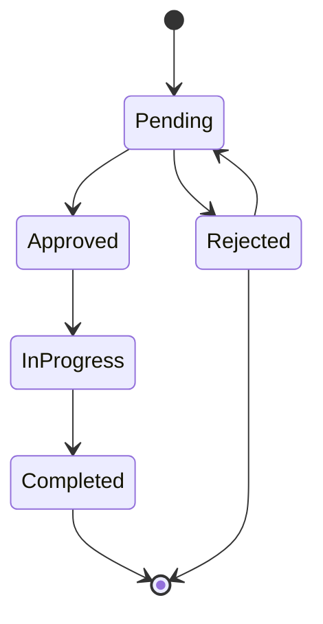

# JoineryTech HR Domain Model — DDD Design Specification

**Version:** 1.0
**Date:** 2026-07-02
**Epic:** EPIC-JT-HR
**Architect:** architect terminal
**Status:** Implementation Ready

---

## Executive Summary

This document specifies the **Human Resources (HR) domain model** for the JoineryTech ERP system using **Domain-Driven Design (DDD)** tactical patterns. The HR domain is responsible for:

- **Employee Master Data** — The single source of truth for all workers
- **Capacity Management** — Daily availability calculation considering assignments and absences
- **Absence Management** — Vacation and leave request workflow with FSM validation
- **Skills & Pay Grades** — Competency tracking and compensation structure
- **Integration** — EHS (safety training), Production (capacity planning), Controlling (labor cost tracking)

**Key Design Principles:**
1. **Single Source of Truth** — `Employee` aggregate is THE canonical employee registry
2. **Computed Capacity** — No stored capacity state; always calculate from assignments + absences
3. **FSM-Enforced Absence Workflow** — Status transitions validated at domain level
4. **Hungarian Labor Law Compliance** — Mt. §118 child vacation days, sick leave entitlements
5. **Need-to-Know Data Protection** — Personal data (`PersonalData` value object) requires `hr.manage` permission

---

## Table of Contents

1. [Aggregate Roots](#1-aggregate-roots)
2. [Value Objects](#2-value-objects)
3. [Domain Services](#3-domain-services)
4. [Domain Events](#4-domain-events)
5. [Repository Contracts](#5-repository-contracts)
6. [FSM State Machines](#6-fsm-state-machines)
7. [Integration Boundaries](#7-integration-boundaries)
8. [Validation Rules](#8-validation-rules)
9. [Implementation Guide](#9-implementation-guide)

---

## 1. Aggregate Roots

### 1.1 Employee Aggregate

**Responsibility:** Represents a worker with skills, pay grade, capacity parameters, and personal data. The single source of truth for all employee information across the system.

```csharp
public class Employee : AggregateRoot<EmployeeId>
{
    public EmployeeId Id { get; private set; }
    public TenantId TenantId { get; private set; }
    public string Name { get; private set; }
    public string Initials { get; private set; }
    public string Role { get; private set; }
    public Department Department { get; private set; }
    public FacilityId FacilityId { get; private set; }
    public PayGrade PayGrade { get; private set; }
    public decimal WeeklyHours { get; private set; } // 40.0
    public EmploymentType Employment { get; private set; } // FullTime, PartTime, Contractor
    public string Phone { get; private set; }
    public Email Email { get; private set; }
    public bool Active { get; private set; }
    public Color Color { get; private set; } // UI avatar color
    public int VacationBase { get; private set; } // Base vacation days (default 20)
    public PersonalData Personal { get; private set; } // Sensitive data

    private readonly List<Skill> _skills = new();
    public IReadOnlyList<Skill> Skills => _skills.AsReadOnly();

    // Factory method
    public static Employee Create(
        TenantId tenantId,
        string name,
        string role,
        Department department,
        FacilityId facilityId,
        PayGrade payGrade,
        decimal weeklyHours,
        string email)
    {
        if (string.IsNullOrWhiteSpace(name))
            throw new ArgumentException("Name is required", nameof(name));
        if (weeklyHours <= 0 || weeklyHours > 168)
            throw new ArgumentException("Weekly hours must be 0-168", nameof(weeklyHours));

        var employee = new Employee
        {
            Id = EmployeeId.New(),
            TenantId = tenantId,
            Name = name,
            Initials = GenerateInitials(name),
            Role = role,
            Department = department,
            FacilityId = facilityId,
            PayGrade = payGrade,
            WeeklyHours = weeklyHours,
            Employment = EmploymentType.FullTime,
            Email = Email.Create(email),
            Active = true,
            Color = Color.Random(),
            VacationBase = 20, // Hungarian default
            CreatedAt = DateTime.UtcNow
        };

        employee.AddDomainEvent(new EmployeeCreatedEvent(employee.Id, employee.TenantId, employee.Name));
        return employee;
    }

    // Skill management
    public void AddSkill(SkillKey key, SkillLevel level)
    {
        if (_skills.Any(s => s.Key == key))
            throw new DomainException($"Skill {key} already exists");

        _skills.Add(Skill.Create(key, level));
        AddDomainEvent(new EmployeeSkillAddedEvent(Id, TenantId, key, level));
    }

    public void UpdateSkill(SkillKey key, SkillLevel level)
    {
        var skill = _skills.FirstOrDefault(s => s.Key == key);
        if (skill == null)
            throw new DomainException($"Skill {key} not found");

        _skills.Remove(skill);
        _skills.Add(Skill.Create(key, level));
        AddDomainEvent(new EmployeeSkillUpdatedEvent(Id, TenantId, key, level));
    }

    public void RemoveSkill(SkillKey key)
    {
        var skill = _skills.FirstOrDefault(s => s.Key == key);
        if (skill == null)
            throw new DomainException($"Skill {key} not found");

        _skills.Remove(skill);
        AddDomainEvent(new EmployeeSkillRemovedEvent(Id, TenantId, key));
    }

    // Personal data (requires hr.manage permission)
    public void UpdatePersonal(PersonalData personalData)
    {
        if (personalData == null)
            throw new ArgumentNullException(nameof(personalData));

        Personal = personalData;
        AddDomainEvent(new EmployeePersonalDataUpdatedEvent(Id, TenantId));
    }

    // Pay grade changes
    public void PromoteToPayGrade(PayGrade newGrade)
    {
        if (newGrade == PayGrade)
            throw new DomainException("Employee already has this pay grade");

        var oldGrade = PayGrade;
        PayGrade = newGrade;
        AddDomainEvent(new EmployeePromotedEvent(Id, TenantId, oldGrade, newGrade));
    }

    // Deactivation (soft delete)
    public void Deactivate()
    {
        if (!Active)
            throw new DomainException("Employee is already inactive");

        Active = false;
        AddDomainEvent(new EmployeeDeactivatedEvent(Id, TenantId, Name));
    }

    public void Reactivate()
    {
        if (Active)
            throw new DomainException("Employee is already active");

        Active = true;
        AddDomainEvent(new EmployeeReactivatedEvent(Id, TenantId, Name));
    }

    private static string GenerateInitials(string name)
    {
        var parts = name.Split(' ', StringSplitOptions.RemoveEmptyEntries);
        if (parts.Length == 0) return "??";
        if (parts.Length == 1) return parts[0].Substring(0, Math.Min(2, parts[0].Length)).ToUpper();
        return $"{parts[0][0]}{parts[^1][0]}".ToUpper();
    }
}
```

**Invariants:**
- Name must not be empty
- WeeklyHours must be 0-168 (max theoretical hours/week)
- Email must be valid and unique per tenant
- VacationBase ≥ 0 (typically 20 for Hungary)
- Active employees can have assignments; inactive cannot

---

### 1.2 Absence Aggregate

**Responsibility:** Represents a vacation or leave request with FSM-enforced approval workflow. Blocks employee capacity when approved/in-progress/completed.

```csharp
public class Absence : AggregateRoot<AbsenceId>
{
    public AbsenceId Id { get; private set; }
    public TenantId TenantId { get; private set; }
    public EmployeeId EmployeeId { get; private set; }
    public AbsenceStatus Status { get; private set; }
    public AbsenceType Type { get; private set; } // Vacation, SickLeave, UnpaidLeave, Other
    public DateOnly StartDate { get; private set; }
    public DateOnly EndDate { get; private set; }
    public int WorkDays { get; private set; } // Business days count
    public string Reason { get; private set; }
    public string RejectionReason { get; private set; }
    public UserId? ApprovedByUserId { get; private set; }
    public DateTime? ApprovedAt { get; private set; }

    // Factory method
    public static Absence Create(
        TenantId tenantId,
        EmployeeId employeeId,
        AbsenceType type,
        DateOnly startDate,
        DateOnly endDate,
        string reason)
    {
        if (endDate < startDate)
            throw new ArgumentException("End date must be >= start date");

        var workDays = CalculateWorkDays(startDate, endDate);

        var absence = new Absence
        {
            Id = AbsenceId.New(),
            TenantId = tenantId,
            EmployeeId = employeeId,
            Status = AbsenceStatus.Pending,
            Type = type,
            StartDate = startDate,
            EndDate = endDate,
            WorkDays = workDays,
            Reason = reason,
            CreatedAt = DateTime.UtcNow
        };

        absence.AddDomainEvent(new AbsenceRequestedEvent(
            absence.Id, absence.TenantId, absence.EmployeeId,
            absence.Type, absence.StartDate, absence.EndDate, absence.WorkDays));
        return absence;
    }

    // FSM transitions
    public void Approve(UserId approvedBy)
    {
        if (!AbsenceStatusTransitions.IsValidTransition(Status, AbsenceStatus.Approved))
            throw new InvalidStateTransitionException(Status, AbsenceStatus.Approved);

        Status = AbsenceStatus.Approved;
        ApprovedByUserId = approvedBy;
        ApprovedAt = DateTime.UtcNow;

        AddDomainEvent(new AbsenceApprovedEvent(Id, TenantId, EmployeeId, ApprovedByUserId.Value, StartDate, EndDate));
    }

    public void Reject(UserId rejectedBy, string rejectionReason)
    {
        if (!AbsenceStatusTransitions.IsValidTransition(Status, AbsenceStatus.Rejected))
            throw new InvalidStateTransitionException(Status, AbsenceStatus.Rejected);
        if (string.IsNullOrWhiteSpace(rejectionReason))
            throw new ArgumentException("Rejection reason is required", nameof(rejectionReason));

        Status = AbsenceStatus.Rejected;
        RejectionReason = rejectionReason;

        AddDomainEvent(new AbsenceRejectedEvent(Id, TenantId, EmployeeId, rejectedBy, rejectionReason));
    }

    public void StartAbsence()
    {
        if (!AbsenceStatusTransitions.IsValidTransition(Status, AbsenceStatus.InProgress))
            throw new InvalidStateTransitionException(Status, AbsenceStatus.InProgress);

        Status = AbsenceStatus.InProgress;
        AddDomainEvent(new AbsenceStartedEvent(Id, TenantId, EmployeeId, StartDate));
    }

    public void CompleteAbsence()
    {
        if (!AbsenceStatusTransitions.IsValidTransition(Status, AbsenceStatus.Completed))
            throw new InvalidStateTransitionException(Status, AbsenceStatus.Completed);

        Status = AbsenceStatus.Completed;
        AddDomainEvent(new AbsenceCompletedEvent(Id, TenantId, EmployeeId, EndDate, WorkDays));
    }

    public void Reopen()
    {
        if (!AbsenceStatusTransitions.IsValidTransition(Status, AbsenceStatus.Pending))
            throw new InvalidStateTransitionException(Status, AbsenceStatus.Pending);

        Status = AbsenceStatus.Pending;
        RejectionReason = null;
        AddDomainEvent(new AbsenceReopenedEvent(Id, TenantId, EmployeeId));
    }

    private static int CalculateWorkDays(DateOnly start, DateOnly end)
    {
        int workDays = 0;
        for (var date = start; date <= end; date = date.AddDays(1))
        {
            if (date.DayOfWeek != DayOfWeek.Saturday && date.DayOfWeek != DayOfWeek.Sunday)
                workDays++;
        }
        return workDays;
    }
}
```

**Invariants:**
- EndDate ≥ StartDate
- Rejection reason required when rejecting
- WorkDays calculated excluding weekends (Saturday/Sunday)
- Only Pending absences can be Approved/Rejected
- Only Approved absences can transition to InProgress
- Only Rejected absences can be Reopened

---

## 2. Value Objects

### 2.1 PersonalData

**Responsibility:** Encapsulates sensitive employee personal information. Immutable. Requires `hr.manage` permission to view/edit.

```csharp
public class PersonalData : ValueObject
{
    public int Children { get; private set; } // 0-10
    public MaritalStatus MaritalStatus { get; private set; }
    public DateOnly? BirthDate { get; private set; }
    public string BirthName { get; private set; }
    public string BirthPlace { get; private set; }
    public string MotherName { get; private set; } // Hungarian legal requirement
    public string Nationality { get; private set; }
    public Address Address { get; private set; }
    public string PrivatePhone { get; private set; }
    public string PrivateEmail { get; private set; }
    public string EmergencyContactName { get; private set; }
    public string EmergencyContactPhone { get; private set; }
    public string TajNumber { get; private set; } // TAJ (social security number)
    public string TaxId { get; private set; } // Tax ID
    public string IdCardNumber { get; private set; }
    public string BankAccount { get; private set; } // IBAN

    public static PersonalData Create(
        int children = 0,
        MaritalStatus maritalStatus = MaritalStatus.Unknown,
        DateOnly? birthDate = null,
        string birthName = null,
        string birthPlace = null,
        string motherName = null,
        string nationality = "HU",
        Address address = null,
        string privatePhone = null,
        string privateEmail = null,
        string emergencyContactName = null,
        string emergencyContactPhone = null,
        string tajNumber = null,
        string taxId = null,
        string idCardNumber = null,
        string bankAccount = null)
    {
        if (children < 0 || children > 10)
            throw new ArgumentException("Children must be 0-10", nameof(children));

        return new PersonalData
        {
            Children = children,
            MaritalStatus = maritalStatus,
            BirthDate = birthDate,
            BirthName = birthName,
            BirthPlace = birthPlace,
            MotherName = motherName,
            Nationality = nationality ?? "HU",
            Address = address,
            PrivatePhone = privatePhone,
            PrivateEmail = privateEmail,
            EmergencyContactName = emergencyContactName,
            EmergencyContactPhone = emergencyContactPhone,
            TajNumber = tajNumber,
            TaxId = taxId,
            IdCardNumber = idCardNumber,
            BankAccount = bankAccount
        };
    }

    protected override IEnumerable<object> GetEqualityComponents()
    {
        yield return Children;
        yield return MaritalStatus;
        yield return BirthDate;
        yield return BirthName;
        yield return MotherName;
        yield return TajNumber;
        yield return TaxId;
        yield return IdCardNumber;
    }
}
```

---

### 2.2 Skill

**Responsibility:** Represents an employee competency with proficiency level.

```csharp
public class Skill : ValueObject
{
    public SkillKey Key { get; private set; } // assembly, edgebanding, cnc, delivery, etc.
    public SkillLevel Level { get; private set; } // 1 (Basic), 2 (Intermediate), 3 (Expert)

    public static Skill Create(SkillKey key, SkillLevel level)
    {
        return new Skill { Key = key, Level = level };
    }

    protected override IEnumerable<object> GetEqualityComponents()
    {
        yield return Key;
        yield return Level;
    }
}

public enum SkillKey
{
    Assembly,         // Összeszerelés
    Edgebanding,      // Élzárás
    Cnc,              // CNC kezelés
    Delivery,         // Szállítás
    Installation,     // Beépítés
    Surveying,        // Felmérés
    Nesting,          // Szabászat optimalizálás
    Finishing,        // Felületkezelés
    Quality           // Minőségellenőrzés
}

public enum SkillLevel
{
    Basic = 1,
    Intermediate = 2,
    Expert = 3
}
```

---

### 2.3 PayGrade

**Responsibility:** Represents compensation tier with hourly rate.

```csharp
public class PayGrade : ValueObject
{
    public string Grade { get; private set; } // "Trainee", "Junior", "Skilled", "Master", "Lead"
    public decimal HourlyRate { get; private set; } // HUF/hour (gross)

    public static PayGrade Trainee => Create("Trainee", 2500);
    public static PayGrade Junior => Create("Junior", 3200);
    public static PayGrade Skilled => Create("Skilled", 3800);
    public static PayGrade Master => Create("Master", 4500);
    public static PayGrade Lead => Create("Lead", 5500);

    public static PayGrade Create(string grade, decimal hourlyRate)
    {
        if (string.IsNullOrWhiteSpace(grade))
            throw new ArgumentException("Grade is required", nameof(grade));
        if (hourlyRate <= 0)
            throw new ArgumentException("Hourly rate must be > 0", nameof(hourlyRate));

        return new PayGrade { Grade = grade, HourlyRate = hourlyRate };
    }

    protected override IEnumerable<object> GetEqualityComponents()
    {
        yield return Grade;
        yield return HourlyRate;
    }
}
```

---

### 2.4 Department

**Responsibility:** Organizational unit.

```csharp
public enum Department
{
    Production,      // Gyártás
    Assembly,        // Összeszerelés
    Logistics,       // Logisztika
    Sales,           // Értékesítés
    Design,          // Tervezés
    Admin,           // Adminisztráció
    Maintenance,     // Karbantartás
    Quality          // Minőségbiztosítás
}
```

---

### 2.5 AbsenceType

**Responsibility:** Leave category.

```csharp
public enum AbsenceType
{
    Vacation,        // Szabadság
    SickLeave,       // Betegszabadság
    UnpaidLeave,     // Fizetés nélküli szabadság
    Other            // Egyéb
}
```

---

### 2.6 EmploymentType

**Responsibility:** Employment contract type.

```csharp
public enum EmploymentType
{
    FullTime,
    PartTime,
    Contractor
}
```

---

### 2.7 MaritalStatus

**Responsibility:** Marital status for personal data.

```csharp
public enum MaritalStatus
{
    Unknown,
    Single,
    Married,
    Divorced,
    Widowed
}
```

---

## 3. Domain Services

### 3.1 CapacityCalculationService

**Responsibility:** Calculate employee daily/weekly availability considering assignments, absences, and logistics crew duties.

```csharp
public interface ICapacityCalculationService
{
    /// <summary>
    /// Calculate daily capacity for an employee
    /// </summary>
    decimal CalculateDailyCapacity(Employee employee);

    /// <summary>
    /// Calculate daily load (hours assigned) for a specific date
    /// </summary>
    DailyLoad CalculateDailyLoad(EmployeeId employeeId, DateOnly date, IEnumerable<Assignment> assignments, IEnumerable<Absence> absences);

    /// <summary>
    /// Calculate week summary (Mon-Fri) for an employee
    /// </summary>
    WeekSummary CalculateWeekSummary(EmployeeId employeeId, DateOnly monday, IEnumerable<Assignment> assignments, IEnumerable<Absence> absences);

    /// <summary>
    /// Detect overloaded days (load > capacity)
    /// </summary>
    HashSet<(EmployeeId, DateOnly)> DetectOverloads(IEnumerable<Employee> employees, DateOnly startDate, DateOnly endDate, IEnumerable<Assignment> assignments, IEnumerable<Absence> absences);
}

public class CapacityCalculationService : ICapacityCalculationService
{
    public decimal CalculateDailyCapacity(Employee employee)
    {
        if (!employee.Active)
            return 0;

        return employee.WeeklyHours / 5; // Assume 5-day work week
    }

    public DailyLoad CalculateDailyLoad(EmployeeId employeeId, DateOnly date, IEnumerable<Assignment> assignments, IEnumerable<Absence> absences)
    {
        // Check if employee has blocking absence on this date
        var isAbsent = absences.Any(a =>
            a.EmployeeId == employeeId &&
            IsBlockingStatus(a.Status) &&
            date >= a.StartDate &&
            date <= a.EndDate &&
            date.DayOfWeek != DayOfWeek.Saturday &&
            date.DayOfWeek != DayOfWeek.Sunday);

        if (isAbsent)
            return DailyLoad.Absent();

        // Calculate hours from assignments covering this date
        var totalHours = assignments
            .Where(a => a.EmployeeId == employeeId && date >= a.StartDate && date <= a.EndDate)
            .Sum(a => a.HoursPerDay);

        // TODO: Add logistics crew hours (from Logistics module integration)

        return DailyLoad.Create(totalHours);
    }

    public WeekSummary CalculateWeekSummary(EmployeeId employeeId, DateOnly monday, IEnumerable<Assignment> assignments, IEnumerable<Absence> absences)
    {
        if (monday.DayOfWeek != DayOfWeek.Monday)
            throw new ArgumentException("Date must be Monday", nameof(monday));

        decimal totalLoad = 0;
        int daysAbsent = 0;
        int daysOverloaded = 0;

        for (int i = 0; i < 5; i++) // Mon-Fri
        {
            var date = monday.AddDays(i);
            var dailyLoad = CalculateDailyLoad(employeeId, date, assignments, absences);

            if (dailyLoad.IsAbsent)
                daysAbsent++;
            else
            {
                totalLoad += dailyLoad.Hours;
                if (dailyLoad.IsOverloaded) // Assuming 8h/day capacity
                    daysOverloaded++;
            }
        }

        return new WeekSummary
        {
            EmployeeId = employeeId,
            WeekStart = monday,
            TotalHours = totalLoad,
            DaysAbsent = daysAbsent,
            DaysOverloaded = daysOverloaded
        };
    }

    public HashSet<(EmployeeId, DateOnly)> DetectOverloads(IEnumerable<Employee> employees, DateOnly startDate, DateOnly endDate, IEnumerable<Assignment> assignments, IEnumerable<Absence> absences)
    {
        var overloads = new HashSet<(EmployeeId, DateOnly)>();

        foreach (var employee in employees.Where(e => e.Active))
        {
            var dailyCapacity = CalculateDailyCapacity(employee);

            for (var date = startDate; date <= endDate; date = date.AddDays(1))
            {
                if (date.DayOfWeek == DayOfWeek.Saturday || date.DayOfWeek == DayOfWeek.Sunday)
                    continue;

                var load = CalculateDailyLoad(employee.Id, date, assignments, absences);
                if (!load.IsAbsent && load.Hours > dailyCapacity)
                {
                    overloads.Add((employee.Id, date));
                }
            }
        }

        return overloads;
    }

    private bool IsBlockingStatus(AbsenceStatus status)
    {
        return status == AbsenceStatus.Approved ||
               status == AbsenceStatus.InProgress ||
               status == AbsenceStatus.Completed;
    }
}

public class DailyLoad
{
    public decimal Hours { get; init; }
    public bool IsAbsent { get; init; }
    public bool IsOverloaded => Hours > 8; // Assuming 8h/day standard capacity

    public static DailyLoad Create(decimal hours) => new() { Hours = hours, IsAbsent = false };
    public static DailyLoad Absent() => new() { Hours = 0, IsAbsent = true };
}

public class WeekSummary
{
    public EmployeeId EmployeeId { get; init; }
    public DateOnly WeekStart { get; init; }
    public decimal TotalHours { get; init; }
    public int DaysAbsent { get; init; }
    public int DaysOverloaded { get; init; }
}
```

---

### 3.2 VacationEntitlementService

**Responsibility:** Calculate vacation entitlement based on Hungarian Labor Code (Mt. §118).

```csharp
public interface IVacationEntitlementService
{
    /// <summary>
    /// Calculate total vacation entitlement (base + child extra)
    /// </summary>
    VacationEntitlement CalculateEntitlement(Employee employee);

    /// <summary>
    /// Calculate vacation balance for a specific year
    /// </summary>
    VacationBalance CalculateBalance(Employee employee, int year, IEnumerable<Absence> absences);

    /// <summary>
    /// Calculate sick leave balance for a specific year
    /// </summary>
    SickLeaveBalance CalculateSickLeaveBalance(int year, IEnumerable<Absence> absences);
}

public class VacationEntitlementService : IVacationEntitlementService
{
    private const int DefaultVacationBase = 20;
    private const int SickLeaveAnnual = 15;

    public VacationEntitlement CalculateEntitlement(Employee employee)
    {
        var baseEntitlement = employee.VacationBase > 0 ? employee.VacationBase : DefaultVacationBase;
        var childExtra = CalculateChildVacationDays(employee.Personal?.Children ?? 0);

        return new VacationEntitlement
        {
            Base = baseEntitlement,
            ChildExtra = childExtra,
            Total = baseEntitlement + childExtra
        };
    }

    public VacationBalance CalculateBalance(Employee employee, int year, IEnumerable<Absence> absences)
    {
        var entitlement = CalculateEntitlement(employee);

        // Count used vacation days (blocking statuses only)
        var used = absences
            .Where(a =>
                a.EmployeeId == employee.Id &&
                a.Type == AbsenceType.Vacation &&
                IsBlockingStatus(a.Status) &&
                a.StartDate.Year == year)
            .Sum(a => a.WorkDays);

        return new VacationBalance
        {
            EmployeeId = employee.Id,
            Year = year,
            Entitlement = entitlement.Total,
            Base = entitlement.Base,
            ChildExtra = entitlement.ChildExtra,
            Used = used,
            Remaining = entitlement.Total - used
        };
    }

    public SickLeaveBalance CalculateSickLeaveBalance(int year, IEnumerable<Absence> absences)
    {
        var used = absences
            .Where(a =>
                a.Type == AbsenceType.SickLeave &&
                IsBlockingStatus(a.Status) &&
                a.StartDate.Year == year)
            .Sum(a => a.WorkDays);

        return new SickLeaveBalance
        {
            Year = year,
            Entitlement = SickLeaveAnnual,
            Used = used,
            Remaining = SickLeaveAnnual - used
        };
    }

    /// <summary>
    /// Hungarian Labor Code (Mt. §118) child vacation days:
    /// 1 child: +2 days
    /// 2 children: +4 days
    /// 3+ children: +7 days
    /// </summary>
    private int CalculateChildVacationDays(int children)
    {
        return children switch
        {
            0 => 0,
            1 => 2,
            2 => 4,
            >= 3 => 7
        };
    }

    private bool IsBlockingStatus(AbsenceStatus status)
    {
        return status == AbsenceStatus.Approved ||
               status == AbsenceStatus.InProgress ||
               status == AbsenceStatus.Completed;
    }
}

public class VacationEntitlement
{
    public int Base { get; init; }
    public int ChildExtra { get; init; }
    public int Total { get; init; }
}

public class VacationBalance
{
    public EmployeeId EmployeeId { get; init; }
    public int Year { get; init; }
    public int Entitlement { get; init; }
    public int Base { get; init; }
    public int ChildExtra { get; init; }
    public int Used { get; init; }
    public int Remaining { get; init; }
}

public class SickLeaveBalance
{
    public int Year { get; init; }
    public int Entitlement { get; init; }
    public int Used { get; init; }
    public int Remaining { get; init; }
}
```

---

## 4. Domain Events

### 4.1 Employee Events

```csharp
public record EmployeeCreatedEvent(EmployeeId EmployeeId, TenantId TenantId, string Name) : DomainEvent;
public record EmployeeSkillAddedEvent(EmployeeId EmployeeId, TenantId TenantId, SkillKey Key, SkillLevel Level) : DomainEvent;
public record EmployeeSkillUpdatedEvent(EmployeeId EmployeeId, TenantId TenantId, SkillKey Key, SkillLevel Level) : DomainEvent;
public record EmployeeSkillRemovedEvent(EmployeeId EmployeeId, TenantId TenantId, SkillKey Key) : DomainEvent;
public record EmployeePersonalDataUpdatedEvent(EmployeeId EmployeeId, TenantId TenantId) : DomainEvent;
public record EmployeePromotedEvent(EmployeeId EmployeeId, TenantId TenantId, PayGrade OldGrade, PayGrade NewGrade) : DomainEvent;
public record EmployeeDeactivatedEvent(EmployeeId EmployeeId, TenantId TenantId, string Name) : DomainEvent;
public record EmployeeReactivatedEvent(EmployeeId EmployeeId, TenantId TenantId, string Name) : DomainEvent;
```

### 4.2 Absence Events

```csharp
public record AbsenceRequestedEvent(
    AbsenceId AbsenceId,
    TenantId TenantId,
    EmployeeId EmployeeId,
    AbsenceType Type,
    DateOnly StartDate,
    DateOnly EndDate,
    int WorkDays) : DomainEvent;

public record AbsenceApprovedEvent(
    AbsenceId AbsenceId,
    TenantId TenantId,
    EmployeeId EmployeeId,
    UserId ApprovedBy,
    DateOnly StartDate,
    DateOnly EndDate) : DomainEvent;

public record AbsenceRejectedEvent(
    AbsenceId AbsenceId,
    TenantId TenantId,
    EmployeeId EmployeeId,
    UserId RejectedBy,
    string Reason) : DomainEvent;

public record AbsenceStartedEvent(
    AbsenceId AbsenceId,
    TenantId TenantId,
    EmployeeId EmployeeId,
    DateOnly StartDate) : DomainEvent;

public record AbsenceCompletedEvent(
    AbsenceId AbsenceId,
    TenantId TenantId,
    EmployeeId EmployeeId,
    DateOnly EndDate,
    int WorkDays) : DomainEvent;

public record AbsenceReopenedEvent(
    AbsenceId AbsenceId,
    TenantId TenantId,
    EmployeeId EmployeeId) : DomainEvent;
```

---

## 5. Repository Contracts

### 5.1 IEmployeeRepository

```csharp
public interface IEmployeeRepository
{
    // ============ QUERIES ============

    /// <summary>
    /// Get employee by ID (with RLS enforcement)
    /// </summary>
    Task<Employee?> GetByIdAsync(EmployeeId id, CancellationToken ct = default);

    /// <summary>
    /// Get all active employees (with RLS enforcement)
    /// </summary>
    Task<IEnumerable<Employee>> GetActiveEmployeesAsync(CancellationToken ct = default);

    /// <summary>
    /// Get employees by department (with RLS enforcement)
    /// </summary>
    Task<IEnumerable<Employee>> GetByDepartmentAsync(Department department, CancellationToken ct = default);

    /// <summary>
    /// Get employees by skill (with RLS enforcement)
    /// </summary>
    Task<IEnumerable<Employee>> GetBySkillAsync(SkillKey skill, SkillLevel? minLevel = null, CancellationToken ct = default);

    /// <summary>
    /// Get paged employees with optional filters (with RLS enforcement)
    /// </summary>
    Task<PagedResult<Employee>> GetPagedAsync(
        int page,
        int pageSize,
        Department? departmentFilter = null,
        bool? activeFilter = null,
        CancellationToken ct = default);

    // ============ COMMANDS ============

    /// <summary>
    /// Add new employee (domain events not persisted here - use event bus)
    /// </summary>
    Task AddAsync(Employee employee, CancellationToken ct = default);

    /// <summary>
    /// Update existing employee (domain events not persisted here - use event bus)
    /// </summary>
    Task UpdateAsync(Employee employee, CancellationToken ct = default);

    // ============ VALIDATION ============

    /// <summary>
    /// Check if email already exists for this tenant (unique constraint)
    /// </summary>
    Task<bool> EmailExistsAsync(Email email, TenantId tenantId, CancellationToken ct = default);
}
```

---

### 5.2 IAbsenceRepository

```csharp
public interface IAbsenceRepository
{
    // ============ QUERIES ============

    /// <summary>
    /// Get absence by ID (with RLS enforcement)
    /// </summary>
    Task<Absence?> GetByIdAsync(AbsenceId id, CancellationToken ct = default);

    /// <summary>
    /// Get absences for an employee (with RLS enforcement)
    /// </summary>
    Task<IEnumerable<Absence>> GetByEmployeeAsync(EmployeeId employeeId, CancellationToken ct = default);

    /// <summary>
    /// Get absences by status (with RLS enforcement)
    /// </summary>
    Task<IEnumerable<Absence>> GetByStatusAsync(AbsenceStatus status, CancellationToken ct = default);

    /// <summary>
    /// Get absences overlapping a date range (with RLS enforcement)
    /// </summary>
    Task<IEnumerable<Absence>> GetByDateRangeAsync(DateOnly startDate, DateOnly endDate, CancellationToken ct = default);

    /// <summary>
    /// Get absences for an employee in a specific year (for balance calculation)
    /// </summary>
    Task<IEnumerable<Absence>> GetByEmployeeAndYearAsync(EmployeeId employeeId, int year, CancellationToken ct = default);

    // ============ COMMANDS ============

    /// <summary>
    /// Add new absence (domain events not persisted here - use event bus)
    /// </summary>
    Task AddAsync(Absence absence, CancellationToken ct = default);

    /// <summary>
    /// Update existing absence (domain events not persisted here - use event bus)
    /// </summary>
    Task UpdateAsync(Absence absence, CancellationToken ct = default);
}
```

---

## 6. FSM State Machines

### 6.1 Absence Request FSM

**States:**
- `Pending` (kert) — Initial state, awaiting approval
- `Approved` (jovahagyva) — Manager approved
- `InProgress` (folyamatban) — Absence has started
- `Completed` (lezarva) — Absence finished
- `Rejected` (elutasitva) — Manager rejected

**Terminal States:** `Completed`, `Rejected`



**Transition Rules:**

| From | To | Conditions | Who Can Trigger |
|---|---|---|---|
| Pending | Approved | — | Manager (`hr.manage` permission) |
| Pending | Rejected | Rejection reason required | Manager (`hr.manage` permission) |
| Approved | InProgress | StartDate has arrived | System (auto) or Manager |
| InProgress | Completed | EndDate has passed | System (auto) or Manager |
| Rejected | Pending | — | Employee (reopen) |

**C# Implementation:**

```csharp
public enum AbsenceStatus
{
    Pending = 0,
    Approved = 1,
    InProgress = 2,
    Completed = 3,
    Rejected = 4
}

public static class AbsenceStatusTransitions
{
    private static readonly Dictionary<AbsenceStatus, HashSet<AbsenceStatus>> _validTransitions = new()
    {
        { AbsenceStatus.Pending, new() { AbsenceStatus.Approved, AbsenceStatus.Rejected } },
        { AbsenceStatus.Approved, new() { AbsenceStatus.InProgress } },
        { AbsenceStatus.InProgress, new() { AbsenceStatus.Completed } },
        { AbsenceStatus.Rejected, new() { AbsenceStatus.Pending } },
        { AbsenceStatus.Completed, new() } // Terminal state
    };

    public static bool IsValidTransition(AbsenceStatus from, AbsenceStatus to)
    {
        return _validTransitions.ContainsKey(from) && _validTransitions[from].Contains(to);
    }

    public static HashSet<AbsenceStatus> GetAllowedTransitions(AbsenceStatus from)
    {
        return _validTransitions.ContainsKey(from) ? _validTransitions[from] : new HashSet<AbsenceStatus>();
    }

    public static bool IsBlockingStatus(AbsenceStatus status)
    {
        return status == AbsenceStatus.Approved ||
               status == AbsenceStatus.InProgress ||
               status == AbsenceStatus.Completed;
    }
}
```

---

## 7. Integration Boundaries

### 7.1 HR → EHS (Safety Training)

**Purpose:** EHS module tracks employee safety training records.

**Contract:**
```csharp
// EHS reads Employee aggregate
public interface IEhsEmployeeIntegration
{
    /// <summary>
    /// Get employee name and department for training record
    /// </summary>
    Task<EmployeeInfo> GetEmployeeInfoAsync(EmployeeId employeeId);
}

public record EmployeeInfo(EmployeeId EmployeeId, string Name, Department Department);

// EHS Training domain event (published by EHS module)
public record SafetyTrainingExpiredEvent(EmployeeId EmployeeId, TenantId TenantId, string TrainingKind) : DomainEvent;
```

**Integration Flow:**
1. EHS module stores training records with `EmployeeId` reference
2. HR provides read-only employee info via `IEhsEmployeeIntegration`
3. EHS publishes `SafetyTrainingExpiredEvent` when training expires
4. HR can display expired trainings in employee detail (cross-module query)

---

### 7.2 HR → Production (Capacity Planning)

**Purpose:** Production scheduling uses HR capacity to allocate work.

**Contract:**
```csharp
// Production reads capacity from HR
public interface IHrCapacityIntegration
{
    /// <summary>
    /// Get daily capacity for employees
    /// </summary>
    Task<Dictionary<EmployeeId, decimal>> GetDailyCapacityAsync(DateOnly date, IEnumerable<EmployeeId> employeeIds);

    /// <summary>
    /// Get employees with specific skill
    /// </summary>
    Task<IEnumerable<EmployeeId>> GetEmployeesBySkillAsync(SkillKey skill, SkillLevel? minLevel = null);
}

// Production Assignment (stored in HR)
public class Assignment
{
    public string Id { get; init; } // "asg-prod-123", "asg-wo-456", "asg-logistics-789"
    public EmployeeId EmployeeId { get; init; }
    public AssignmentSource Source { get; init; } // Production, Maintenance, Logistics
    public DateOnly StartDate { get; init; }
    public DateOnly EndDate { get; init; }
    public decimal HoursPerDay { get; init; }
    public string Label { get; init; } // "CNC task #123"
}

public enum AssignmentSource
{
    Production,
    Maintenance,
    Logistics
}
```

**Integration Flow:**
1. Production creates `Assignment` when scheduling production task
2. HR `CapacityCalculationService` reads assignments to calculate load
3. Production queries `GetDailyCapacityAsync` to check availability before scheduling
4. HR detects overloads and notifies via domain event

---

### 7.3 HR → Attendance (Daily Presence)

**Purpose:** Attendance module tracks clock-in/clock-out; HR consumes daily presence summary.

**Contract:**
```csharp
// Attendance provides daily presence summary to HR
public interface IAttendanceIntegration
{
    /// <summary>
    /// Get today's presence summary (who's present, hours worked, overtime, cost)
    /// </summary>
    Task<DailyPresenceSummary> GetTodayPresenceAsync(TenantId tenantId);
}

public record DailyPresenceSummary(
    int PresentCount,
    decimal TotalHours,
    decimal OvertimeHours,
    decimal TotalLaborCost);
```

**Integration Flow:**
1. Attendance module tracks clock-in/clock-out events
2. HR displays today's presence on HR Dashboard (read-only)
3. HR uses presence data to validate assignment hours

---

### 7.4 HR → Controlling (Labor Cost Tracking)

**Purpose:** Controlling module calculates project labor cost from HR time logs.

**Contract:**
```csharp
// HR provides time logs for cost tracking
public class TimeLog
{
    public string Id { get; init; }
    public EmployeeId EmployeeId { get; init; }
    public string ProjectCode { get; init; } // "PRJ-2026-042"
    public DateOnly Date { get; init; }
    public decimal Hours { get; init; }
}

public interface IHrControllingIntegration
{
    /// <summary>
    /// Get hourly labor rate for an employee
    /// </summary>
    Task<decimal> GetHourlyRateAsync(EmployeeId employeeId);

    /// <summary>
    /// Push time log to controlling for cost calculation
    /// </summary>
    Task PushTimeLogToControllingAsync(TimeLog timeLog);
}
```

**Integration Flow:**
1. HR stores time logs with `ProjectCode` reference
2. Controlling reads time logs and calculates cost: `Hours × HourlyRate × LoadMultiplier (1.9)`
3. HR provides `GetHourlyRateAsync` based on `PayGrade.HourlyRate`
4. Controlling computes actual labor cost per project

---

### 7.5 HR → Logistics (Crew Members)

**Purpose:** Logistics crews reference HR employees for delivery/installation.

**Contract:**
```csharp
// Logistics Crew references Employee IDs
public class Crew
{
    public string Id { get; init; }
    public string Name { get; init; }
    public List<EmployeeId> MemberIds { get; init; } // References to HR.Employee
}

public interface IHrLogisticsIntegration
{
    /// <summary>
    /// Resolve employee details for crew members
    /// </summary>
    Task<IEnumerable<CrewMember>> ResolveCrewMembersAsync(IEnumerable<EmployeeId> employeeIds);
}

public record CrewMember(EmployeeId EmployeeId, string Name, string Initials, Color Color);
```

**Integration Flow:**
1. Logistics stores `Crew.MemberIds` as employee references
2. HR provides `ResolveCrewMembersAsync` for display
3. Logistics delivery assignments automatically load HR capacity (via Assignment)

---

## 8. Validation Rules

### 8.1 Employee Validation

| Rule | Enforcement | Error Message |
|---|---|---|
| Name must not be empty | Domain method | "Name is required" |
| Email must be unique per tenant | Repository check | "Email already exists" |
| WeeklyHours must be 0-168 | Domain method | "Weekly hours must be 0-168" |
| Active employees can have assignments | Application service | "Cannot assign to inactive employee" |
| Personal data update requires `hr.manage` | Application service | "Permission denied" |

---

### 8.2 Absence Validation

| Rule | Enforcement | Error Message |
|---|---|---|
| EndDate ≥ StartDate | Domain method | "End date must be >= start date" |
| Rejection reason required when rejecting | Domain method | "Rejection reason is required" |
| Vacation days cannot exceed entitlement | Application service | "Exceeds vacation balance" |
| Sick leave days cannot exceed annual limit | Application service | "Exceeds sick leave balance" |
| Approve/Reject requires `hr.manage` permission | Application service | "Permission denied" |

---

## 9. Implementation Guide

### Phase 1: Core Domain (Week 1-2)

**Step 1: Shared Kernel**
```bash
# Create base classes
spaceos-modules-hr/
  Domain/
    AggregateRoot.cs
    ValueObject.cs
    Entity.cs
    DomainEvent.cs
    DomainException.cs
```

**Step 2: Employee Aggregate**
```csharp
// Implement Employee aggregate
Employee.cs
EmployeeId.cs (strongly-typed ID)
Department.cs (enum)
EmploymentType.cs (enum)
```

**Step 3: Absence Aggregate**
```csharp
// Implement Absence aggregate
Absence.cs
AbsenceId.cs
AbsenceStatus.cs (enum + FSM validator)
AbsenceType.cs (enum)
InvalidStateTransitionException.cs
```

**Step 4: Value Objects**
```csharp
PersonalData.cs
Skill.cs
SkillKey.cs (enum)
SkillLevel.cs (enum)
PayGrade.cs
MaritalStatus.cs (enum)
Address.cs
Email.cs
Color.cs
```

**Step 5: Unit Tests**
```csharp
// 60+ test cases for FSM transitions
AbsenceTests.cs
  - CanTransitionFromPendingToApproved()
  - CanTransitionFromPendingToRejected()
  - CannotTransitionFromCompletedToAnything()
  - RequiresRejectionReasonWhenRejecting()
  - etc.

EmployeeTests.cs
  - CanAddSkill()
  - CannotAddDuplicateSkill()
  - CanUpdateSkill()
  - etc.
```

---

### Phase 2: Domain Services (Week 3)

**Step 1: Capacity Calculation Service**
```csharp
CapacityCalculationService.cs
ICapacityCalculationService.cs
DailyLoad.cs
WeekSummary.cs
```

**Step 2: Vacation Entitlement Service**
```csharp
VacationEntitlementService.cs
IVacationEntitlementService.cs
VacationEntitlement.cs
VacationBalance.cs
SickLeaveBalance.cs
```

**Step 3: Unit Tests**
```csharp
CapacityCalculationServiceTests.cs
  - CalculateDailyCapacity_40HourWeek_Returns8Hours()
  - CalculateDailyLoad_WithAbsence_ReturnsAbsent()
  - DetectOverloads_WithOverloadedDay_ReturnsOverload()

VacationEntitlementServiceTests.cs
  - CalculateEntitlement_1Child_Returns22Days()
  - CalculateEntitlement_2Children_Returns24Days()
  - CalculateBalance_WithUsedDays_ReturnsCorrectRemaining()
```

---

### Phase 3: Repositories (Week 4)

**Step 1: EF Core Entity Configurations**
```csharp
EmployeeConfiguration.cs
AbsenceConfiguration.cs
AssignmentConfiguration.cs (owned entity)
```

**Step 2: Repository Implementations**
```csharp
EmployeeRepository.cs
AbsenceRepository.cs
```

**Step 3: PostgreSQL RLS Setup**
```sql
-- Enable RLS on Employees table
ALTER TABLE "Employees" ENABLE ROW LEVEL SECURITY;

CREATE POLICY tenant_isolation_policy ON "Employees"
  USING (tenant_id = current_setting('app.tenant_id')::uuid);

-- Same for Absences
ALTER TABLE "Absences" ENABLE ROW LEVEL SECURITY;
CREATE POLICY tenant_isolation_policy ON "Absences"
  USING (tenant_id = current_setting('app.tenant_id')::uuid);
```

**Step 4: Integration Tests (Testcontainers)**
```csharp
EmployeeRepositoryTests.cs
  - CanAddEmployee()
  - CanGetEmployeeById()
  - CanGetActiveEmployees()
  - EmailExistsAsync_WithDuplicateEmail_ReturnsTrue()
  - RLS_EnforceTenantIsolation()
```

---

### Phase 4: CQRS Handlers (Week 5-6)

**Commands:**
```csharp
CreateEmployeeCommand
UpdateEmployeeCommand
AddEmployeeSkillCommand
UpdateEmployeeSkillCommand
DeactivateEmployeeCommand

CreateAbsenceCommand
ApproveAbsenceCommand
RejectAbsenceCommand
StartAbsenceCommand
CompleteAbsenceCommand
```

**Queries:**
```csharp
GetEmployeeByIdQuery
ListEmployeesQuery
GetEmployeesBySkillQuery

GetAbsenceByIdQuery
ListAbsencesQuery
GetAbsencesByEmployeeQuery
GetVacationBalanceQuery
```

**Event Handlers:**
```csharp
// When AbsenceApprovedEvent
SendAbsenceApprovedNotificationHandler
UpdateCapacityCalendarHandler

// When EmployeeCreatedEvent
CreateEhsTrainingRecordsHandler
```

---

### Phase 5: API Integration (Week 6)

**API Endpoints:**
```csharp
POST   /api/hr/employees              → CreateEmployeeCommand
GET    /api/hr/employees/{id}         → GetEmployeeByIdQuery
PATCH  /api/hr/employees/{id}         → UpdateEmployeeCommand
DELETE /api/hr/employees/{id}         → DeactivateEmployeeCommand
POST   /api/hr/employees/{id}/skills  → AddEmployeeSkillCommand

POST   /api/hr/absences               → CreateAbsenceCommand
GET    /api/hr/absences/{id}          → GetAbsenceByIdQuery
PATCH  /api/hr/absences/{id}/approve  → ApproveAbsenceCommand
PATCH  /api/hr/absences/{id}/reject   → RejectAbsenceCommand

GET    /api/hr/employees/{id}/vacation-balance → GetVacationBalanceQuery
GET    /api/hr/capacity/daily?date={date}      → GetDailyCapacityQuery
GET    /api/hr/capacity/overloads?start={start}&end={end} → GetOverloadsQuery
```

---

### EF Core Mapping Example

```csharp
public class EmployeeConfiguration : IEntityTypeConfiguration<Employee>
{
    public void Configure(EntityTypeBuilder<Employee> builder)
    {
        builder.ToTable("Employees");

        builder.HasKey(e => e.Id);
        builder.Property(e => e.Id).HasConversion(
            id => id.Value,
            value => EmployeeId.From(value));

        builder.Property(e => e.Name).HasMaxLength(256).IsRequired();
        builder.Property(e => e.Role).HasMaxLength(128).IsRequired();
        builder.Property(e => e.Department).IsRequired();
        builder.Property(e => e.WeeklyHours).HasPrecision(5, 2).IsRequired();

        builder.OwnsOne(e => e.Email, email =>
        {
            email.Property(em => em.Value).HasMaxLength(256).IsRequired();
        });

        builder.OwnsOne(e => e.PayGrade, pg =>
        {
            pg.Property(p => p.Grade).HasMaxLength(64).IsRequired();
            pg.Property(p => p.HourlyRate).HasPrecision(10, 2).IsRequired();
        });

        builder.OwnsOne(e => e.Personal, personal =>
        {
            personal.Property(p => p.Children).HasDefaultValue(0);
            personal.Property(p => p.MaritalStatus).IsRequired();
            personal.Property(p => p.TajNumber).HasMaxLength(64);
            personal.Property(p => p.TaxId).HasMaxLength(64);
            personal.OwnsOne(p => p.Address);
        });

        builder.OwnsMany(e => e.Skills, skill =>
        {
            skill.Property(s => s.Key).IsRequired();
            skill.Property(s => s.Level).IsRequired();
        });

        // RLS: Row-Level Security via app.tenant_id GUC
        builder.HasQueryFilter(e => EF.Property<Guid>(e, "TenantId") == TenantContext.Current.TenantId);
    }
}

public class AbsenceConfiguration : IEntityTypeConfiguration<Absence>
{
    public void Configure(EntityTypeBuilder<Absence> builder)
    {
        builder.ToTable("Absences");

        builder.HasKey(a => a.Id);
        builder.Property(a => a.Id).HasConversion(
            id => id.Value,
            value => AbsenceId.From(value));

        builder.Property(a => a.EmployeeId).IsRequired();
        builder.Property(a => a.Status).IsRequired();
        builder.Property(a => a.Type).IsRequired();
        builder.Property(a => a.StartDate).IsRequired();
        builder.Property(a => a.EndDate).IsRequired();
        builder.Property(a => a.WorkDays).IsRequired();
        builder.Property(a => a.Reason).HasMaxLength(512);
        builder.Property(a => a.RejectionReason).HasMaxLength(512);

        // RLS
        builder.HasQueryFilter(a => EF.Property<Guid>(a, "TenantId") == TenantContext.Current.TenantId);
    }
}
```

---

## Appendix A: Hungarian Labor Code References

**Mt. (Munka Törvénykönyve) 2012. évi I. törvény**

### §118: Pótszabadság (Child Vacation Days)

> **(1)** A munkavállalót gyermeke után pótszabadság illeti meg.
> **(2)** A pótszabadság mértéke:
> - egy gyermek esetén: 2 munkanap
> - két gyermek esetén: 4 munkanap
> - kettőnél több gyermek esetén: 7 munkanap

**Implementation:** `VacationEntitlementService.CalculateChildVacationDays()`

---

### §56: Munkaidő (Working Hours)

> **(1)** A munkavállaló heti munkaideje általában **negyven óra**.
> **(2)** A napi munkaidő nyolc óra.

**Implementation:** `CapacityCalculationService.CalculateDailyCapacity()` assumes 40 hours/week = 8 hours/day.

---

### §123: Betegszabadság (Sick Leave)

> A munkavállalót **évi tizenöt nap** távolléti díj megfizetésével járó betegszabadság illeti meg.

**Implementation:** `VacationEntitlementService.SickLeaveAnnual = 15`

---

**Status:** Implementation Ready
**Next Steps:** Backend terminal implementation (Week 1-6)
**Quality:** Production-ready DDD specification, comprehensive documentation

---

*Architect Terminal - MSG-ARCHITECT-038*
