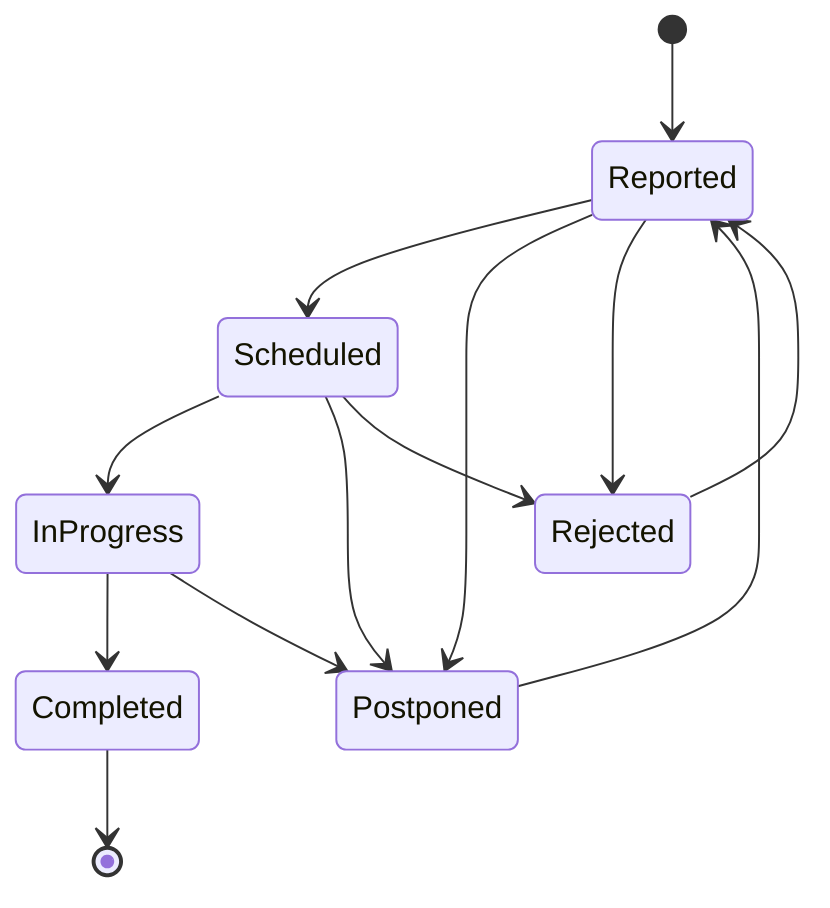

# JoineryTech Maintenance Domain Model — DDD Design Specification

**Version:** 1.0
**Date:** 2026-07-02
**Epic:** EPIC-JT-MAINT
**Architect:** architect terminal
**Status:** Implementation Ready

---

## Executive Summary

This document specifies the **Maintenance & Asset Management domain model** for the JoineryTech ERP system using **Domain-Driven Design (DDD)** tactical patterns. The Maintenance domain is responsible for:

- **Asset Registry** — The single source of truth for all company assets (machines, vehicles, tools, infrastructure, IT equipment, rooms)
- **Work Order Management** — Corrective and preventive maintenance workflow with FSM validation
- **Preventive Maintenance Scheduling** — Interval-based and operating-hours-based maintenance plans
- **Downtime Tracking** — Machine breakdown and planned downtime logging
- **Integration** — Production (capacity blocking during downtime), HR (technician scheduling), Procurement (spare parts requisition), Controlling (maintenance cost tracking)

**Key Design Principles:**
1. **Single Source of Truth** — `Asset` aggregate is THE canonical asset registry for all modules
2. **Computed Asset Status** — No stored status; always calculate from work orders and downtime
3. **FSM-Enforced Work Order Workflow** — Status transitions validated at domain level
4. **Preventive Maintenance Automation** — Plans automatically generate work orders when due
5. **Production Integration** — Downtime blocks production capacity (machine unavailability)

---

## Table of Contents

1. [Aggregate Roots](#1-aggregate-roots)
2. [Entities](#2-entities)
3. [Value Objects](#3-value-objects)
4. [Domain Services](#4-domain-services)
5. [Domain Events](#5-domain-events)
6. [Repository Contracts](#6-repository-contracts)
7. [FSM State Machines](#7-fsm-state-machines)
8. [Integration Boundaries](#8-integration-boundaries)
9. [Validation Rules](#9-validation-rules)
10. [Implementation Guide](#10-implementation-guide)

---

## 1. Aggregate Roots

### 1.1 Asset Aggregate

**Responsibility:** Represents a company asset (machine, vehicle, tool, infrastructure, IT equipment, room). The single source of truth for all asset information. Referenced by Production (machines), Logistics (vehicles), and Maintenance (all assets).

```csharp
public class Asset : AggregateRoot<AssetId>
{
    public AssetId Id { get; private set; }
    public TenantId TenantId { get; private set; }
    public string Code { get; private set; } // "CNC-001", "VAN-002"
    public string Name { get; private set; }
    public AssetKind Kind { get; private set; } // Machine, Vehicle, Tool, Infrastructure, IT, Room
    public FacilityId FacilityId { get; private set; }
    public string Location { get; private set; } // "Műhely 1, Bal sarok"
    public string Vendor { get; private set; }
    public string Model { get; private set; }
    public string SerialNumber { get; private set; }
    public DateOnly? PurchasedAt { get; private set; }
    public Money PurchaseValue { get; private set; }
    public decimal OperatingHours { get; private set; } // For hour-based maintenance plans
    public string MachineId { get; private set; } // Reference to Production SHOPFLOOR_MACHINES
    public string VehicleId { get; private set; } // Reference to Logistics vehicles
    public bool Retired { get; private set; }
    public string Note { get; private set; }

    private readonly List<MaintenancePlan> _maintenancePlans = new();
    public IReadOnlyList<MaintenancePlan> MaintenancePlans => _maintenancePlans.AsReadOnly();

    // Factory method
    public static Asset Create(
        TenantId tenantId,
        string code,
        string name,
        AssetKind kind,
        FacilityId facilityId,
        string location,
        string vendor = null,
        string model = null)
    {
        if (string.IsNullOrWhiteSpace(code))
            throw new ArgumentException("Code is required", nameof(code));
        if (string.IsNullOrWhiteSpace(name))
            throw new ArgumentException("Name is required", nameof(name));

        var asset = new Asset
        {
            Id = AssetId.New(),
            TenantId = tenantId,
            Code = code,
            Name = name,
            Kind = kind,
            FacilityId = facilityId,
            Location = location,
            Vendor = vendor,
            Model = model,
            OperatingHours = 0,
            Retired = false,
            CreatedAt = DateTime.UtcNow
        };

        asset.AddDomainEvent(new AssetCreatedEvent(asset.Id, asset.TenantId, asset.Code, asset.Name, asset.Kind));
        return asset;
    }

    // Operating hours tracking
    public void RecordOperatingHours(decimal hours)
    {
        if (hours <= 0)
            throw new ArgumentException("Hours must be > 0", nameof(hours));
        if (Retired)
            throw new DomainException("Cannot record hours for retired asset");

        OperatingHours += hours;
        AddDomainEvent(new AssetOperatingHoursRecordedEvent(Id, TenantId, hours, OperatingHours));
    }

    // Retirement
    public void Retire()
    {
        if (Retired)
            throw new DomainException("Asset is already retired");

        Retired = true;
        AddDomainEvent(new AssetRetiredEvent(Id, TenantId, Code, Name));
    }

    public void Reactivate()
    {
        if (!Retired)
            throw new DomainException("Asset is not retired");

        Retired = false;
        AddDomainEvent(new AssetReactivatedEvent(Id, TenantId, Code, Name));
    }

    // Maintenance plans
    public void AddMaintenancePlan(MaintenancePlan plan)
    {
        if (plan == null)
            throw new ArgumentNullException(nameof(plan));

        _maintenancePlans.Add(plan);
        AddDomainEvent(new MaintenancePlanAddedEvent(Id, TenantId, plan.Id, plan.Label));
    }

    public void RemoveMaintenancePlan(string planId)
    {
        var plan = _maintenancePlans.FirstOrDefault(p => p.Id == planId);
        if (plan == null)
            throw new DomainException($"Maintenance plan {planId} not found");

        _maintenancePlans.Remove(plan);
        AddDomainEvent(new MaintenancePlanRemovedEvent(Id, TenantId, planId));
    }

    // Production integration
    public void LinkToMachine(string machineId)
    {
        if (Kind != AssetKind.Machine)
            throw new DomainException("Only Machine assets can be linked to production machines");

        MachineId = machineId;
        AddDomainEvent(new AssetLinkedToMachineEvent(Id, TenantId, machineId));
    }

    // Logistics integration
    public void LinkToVehicle(string vehicleId)
    {
        if (Kind != AssetKind.Vehicle)
            throw new DomainException("Only Vehicle assets can be linked to logistics vehicles");

        VehicleId = vehicleId;
        AddDomainEvent(new AssetLinkedToVehicleEvent(Id, TenantId, vehicleId));
    }
}
```

**Invariants:**
- Code must be unique per tenant
- Name must not be empty
- Retired assets cannot have operating hours recorded
- Only Machine assets can have MachineId
- Only Vehicle assets can have VehicleId

---

### 1.2 WorkOrder Aggregate

**Responsibility:** Represents a maintenance task (corrective, preventive, or cleaning) with FSM-enforced workflow. Tracks technician assignment, parts, cost, and downtime.

```csharp
public class WorkOrder : AggregateRoot<WorkOrderId>
{
    public WorkOrderId Id { get; private set; }
    public TenantId TenantId { get; private set; }
    public AssetId AssetId { get; private set; }
    public WorkOrderStatus Status { get; private set; }
    public WorkOrderType Type { get; private set; } // Corrective, Preventive, Cleaning
    public WorkOrderPriority Priority { get; private set; } // Critical, High, Medium, Low
    public string Title { get; private set; }
    public string Description { get; private set; }
    public AssignmentType AssignmentType { get; private set; } // Internal, External
    public EmployeeId? AssignedEmployeeId { get; private set; } // Internal technician
    public PartnerId? AssignedPartnerId { get; private set; } // External contractor
    public string RejectionReason { get; private set; }
    public string PostponementReason { get; private set; }
    public decimal EstimatedHours { get; private set; }
    public decimal ActualHours { get; private set; }
    public Money EstimatedCost { get; private set; }
    public Money ActualCost { get; private set; }
    public DateTime? ScheduledAt { get; private set; }
    public DateTime? StartedAt { get; private set; }
    public DateTime? CompletedAt { get; private set; }
    public bool RequiresDowntime { get; private set; }
    public ProjectId? ProjectId { get; private set; } // For project-specific maintenance
    public string MaintenancePlanId { get; private set; } // Link to preventive plan

    private readonly List<WorkOrderPart> _parts = new();
    public IReadOnlyList<WorkOrderPart> Parts => _parts.AsReadOnly();

    // Factory method
    public static WorkOrder Create(
        TenantId tenantId,
        AssetId assetId,
        WorkOrderType type,
        WorkOrderPriority priority,
        string title,
        string description,
        decimal estimatedHours = 0,
        bool requiresDowntime = false)
    {
        if (string.IsNullOrWhiteSpace(title))
            throw new ArgumentException("Title is required", nameof(title));

        var workOrder = new WorkOrder
        {
            Id = WorkOrderId.New(),
            TenantId = tenantId,
            AssetId = assetId,
            Status = WorkOrderStatus.Reported,
            Type = type,
            Priority = priority,
            Title = title,
            Description = description,
            EstimatedHours = estimatedHours,
            RequiresDowntime = requiresDowntime,
            CreatedAt = DateTime.UtcNow
        };

        workOrder.AddDomainEvent(new WorkOrderReportedEvent(
            workOrder.Id, workOrder.TenantId, workOrder.AssetId,
            workOrder.Type, workOrder.Priority, workOrder.Title));
        return workOrder;
    }

    // FSM transitions
    public void Schedule(DateTime scheduledAt, decimal estimatedHours)
    {
        if (!WorkOrderStatusTransitions.IsValidTransition(Status, WorkOrderStatus.Scheduled))
            throw new InvalidStateTransitionException(Status, WorkOrderStatus.Scheduled);
        if (scheduledAt < DateTime.UtcNow)
            throw new ArgumentException("Scheduled time must be in the future", nameof(scheduledAt));

        Status = WorkOrderStatus.Scheduled;
        ScheduledAt = scheduledAt;
        EstimatedHours = estimatedHours;

        AddDomainEvent(new WorkOrderScheduledEvent(Id, TenantId, AssetId, scheduledAt, estimatedHours));
    }

    public void AssignInternalTechnician(EmployeeId employeeId)
    {
        if (Status != WorkOrderStatus.Reported && Status != WorkOrderStatus.Scheduled)
            throw new DomainException("Can only assign technician to Reported or Scheduled work orders");

        AssignmentType = AssignmentType.Internal;
        AssignedEmployeeId = employeeId;
        AssignedPartnerId = null;

        AddDomainEvent(new WorkOrderAssignedEvent(Id, TenantId, AssetId, employeeId, null));
    }

    public void AssignExternalContractor(PartnerId partnerId)
    {
        if (Status != WorkOrderStatus.Reported && Status != WorkOrderStatus.Scheduled)
            throw new DomainException("Can only assign contractor to Reported or Scheduled work orders");

        AssignmentType = AssignmentType.External;
        AssignedEmployeeId = null;
        AssignedPartnerId = partnerId;

        AddDomainEvent(new WorkOrderAssignedEvent(Id, TenantId, AssetId, null, partnerId));
    }

    public void StartWork()
    {
        if (!WorkOrderStatusTransitions.IsValidTransition(Status, WorkOrderStatus.InProgress))
            throw new InvalidStateTransitionException(Status, WorkOrderStatus.InProgress);
        if (AssignmentType == AssignmentType.Internal && AssignedEmployeeId == null)
            throw new DomainException("Cannot start work without assigned technician");
        if (AssignmentType == AssignmentType.External && AssignedPartnerId == null)
            throw new DomainException("Cannot start work without assigned contractor");

        Status = WorkOrderStatus.InProgress;
        StartedAt = DateTime.UtcNow;

        AddDomainEvent(new WorkOrderStartedEvent(Id, TenantId, AssetId, StartedAt.Value, RequiresDowntime));
    }

    public void Complete(decimal actualHours)
    {
        if (!WorkOrderStatusTransitions.IsValidTransition(Status, WorkOrderStatus.Completed))
            throw new InvalidStateTransitionException(Status, WorkOrderStatus.Completed);
        if (actualHours <= 0)
            throw new ArgumentException("Actual hours must be > 0", nameof(actualHours));

        Status = WorkOrderStatus.Completed;
        ActualHours = actualHours;
        CompletedAt = DateTime.UtcNow;

        AddDomainEvent(new WorkOrderCompletedEvent(Id, TenantId, AssetId, actualHours, CompletedAt.Value));
    }

    public void Postpone(string reason)
    {
        if (!WorkOrderStatusTransitions.IsValidTransition(Status, WorkOrderStatus.Postponed))
            throw new InvalidStateTransitionException(Status, WorkOrderStatus.Postponed);
        if (string.IsNullOrWhiteSpace(reason))
            throw new ArgumentException("Postponement reason is required", nameof(reason));

        Status = WorkOrderStatus.Postponed;
        PostponementReason = reason;

        AddDomainEvent(new WorkOrderPostponedEvent(Id, TenantId, AssetId, reason));
    }

    public void Reject(string reason)
    {
        if (!WorkOrderStatusTransitions.IsValidTransition(Status, WorkOrderStatus.Rejected))
            throw new InvalidStateTransitionException(Status, WorkOrderStatus.Rejected);
        if (string.IsNullOrWhiteSpace(reason))
            throw new ArgumentException("Rejection reason is required", nameof(reason));

        Status = WorkOrderStatus.Rejected;
        RejectionReason = reason;

        AddDomainEvent(new WorkOrderRejectedEvent(Id, TenantId, AssetId, reason));
    }

    public void Reopen()
    {
        if (!WorkOrderStatusTransitions.IsValidTransition(Status, WorkOrderStatus.Reported))
            throw new InvalidStateTransitionException(Status, WorkOrderStatus.Reported);

        Status = WorkOrderStatus.Reported;
        RejectionReason = null;
        PostponementReason = null;

        AddDomainEvent(new WorkOrderReopenedEvent(Id, TenantId, AssetId));
    }

    // Parts management
    public void AddPart(string catalogCode, int quantity, Money unitPrice)
    {
        if (Status == WorkOrderStatus.Completed)
            throw new DomainException("Cannot add parts to completed work order");

        var part = new WorkOrderPart
        {
            Id = Guid.NewGuid().ToString(),
            CatalogCode = catalogCode,
            Quantity = quantity,
            UnitPrice = unitPrice,
            TotalPrice = Money.Create(unitPrice.Amount * quantity, unitPrice.Currency)
        };

        _parts.Add(part);
        AddDomainEvent(new WorkOrderPartAddedEvent(Id, TenantId, catalogCode, quantity));
    }

    public void RemovePart(string partId)
    {
        if (Status == WorkOrderStatus.Completed)
            throw new DomainException("Cannot remove parts from completed work order");

        var part = _parts.FirstOrDefault(p => p.Id == partId);
        if (part == null)
            throw new DomainException($"Part {partId} not found");

        _parts.Remove(part);
        AddDomainEvent(new WorkOrderPartRemovedEvent(Id, TenantId, partId));
    }

    // Project linking (for project-specific maintenance cost tracking)
    public void LinkToProject(ProjectId projectId)
    {
        ProjectId = projectId;
        AddDomainEvent(new WorkOrderLinkedToProjectEvent(Id, TenantId, AssetId, projectId));
    }
}
```

**Invariants:**
- Title must not be empty
- Scheduled time must be in the future
- Cannot start work without assigned technician/contractor
- Actual hours must be > 0 when completing
- Rejection/Postponement reason required
- Cannot modify completed work orders (parts, assignment)

---

## 2. Entities

### 2.1 MaintenancePlan Entity

**Responsibility:** Defines a preventive maintenance schedule (interval-based or operating-hours-based). Owned by Asset aggregate.

```csharp
public class MaintenancePlan : Entity<string>
{
    public string Id { get; private set; } // "plan-001"
    public AssetId AssetId { get; private set; }
    public string Label { get; private set; } // "Monthly lubrication", "10,000h service"
    public MaintenancePlanKind Kind { get; private set; } // Preventive, Cleaning
    public MaintenanceTrigger Trigger { get; private set; } // Interval, OperatingHours
    public int? IntervalDays { get; private set; } // e.g., 30 days
    public decimal? IntervalHours { get; private set; } // e.g., 500 hours
    public DateOnly? LastDone { get; private set; }
    public decimal? LastDoneHours { get; private set; } // Operating hours at last completion
    public AssignmentType AssigneeType { get; private set; } // Internal, External
    public EmployeeId? AssigneeEmployeeId { get; private set; }
    public string AssigneePartnerName { get; private set; }
    public decimal EstimatedHours { get; private set; }

    public static MaintenancePlan CreateIntervalBased(
        string id,
        AssetId assetId,
        string label,
        MaintenancePlanKind kind,
        int intervalDays,
        decimal estimatedHours,
        AssignmentType assigneeType)
    {
        if (intervalDays <= 0)
            throw new ArgumentException("Interval days must be > 0", nameof(intervalDays));

        return new MaintenancePlan
        {
            Id = id,
            AssetId = assetId,
            Label = label,
            Kind = kind,
            Trigger = MaintenanceTrigger.Interval,
            IntervalDays = intervalDays,
            AssigneeType = assigneeType,
            EstimatedHours = estimatedHours
        };
    }

    public static MaintenancePlan CreateOperatingHoursBased(
        string id,
        AssetId assetId,
        string label,
        decimal intervalHours,
        decimal estimatedHours,
        AssignmentType assigneeType)
    {
        if (intervalHours <= 0)
            throw new ArgumentException("Interval hours must be > 0", nameof(intervalHours));

        return new MaintenancePlan
        {
            Id = id,
            AssetId = assetId,
            Label = label,
            Kind = MaintenancePlanKind.Preventive,
            Trigger = MaintenanceTrigger.OperatingHours,
            IntervalHours = intervalHours,
            AssigneeType = assigneeType,
            EstimatedHours = estimatedHours
        };
    }

    public void MarkCompleted(DateOnly completedDate, decimal? currentOperatingHours = null)
    {
        LastDone = completedDate;
        if (Trigger == MaintenanceTrigger.OperatingHours && currentOperatingHours.HasValue)
        {
            LastDoneHours = currentOperatingHours;
        }
    }

    public void AssignInternalTechnician(EmployeeId employeeId)
    {
        AssigneeType = AssignmentType.Internal;
        AssigneeEmployeeId = employeeId;
        AssigneePartnerName = null;
    }

    public void AssignExternalContractor(string partnerName)
    {
        AssigneeType = AssignmentType.External;
        AssigneeEmployeeId = null;
        AssigneePartnerName = partnerName;
    }
}
```

---

### 2.2 WorkOrderPart Entity

**Responsibility:** Represents a spare part required for a work order. Owned by WorkOrder aggregate.

```csharp
public class WorkOrderPart
{
    public string Id { get; init; } // Guid
    public string CatalogCode { get; init; } // Reference to Procurement catalog
    public int Quantity { get; init; }
    public Money UnitPrice { get; init; }
    public Money TotalPrice { get; init; }
}
```

---

## 3. Value Objects

### 3.1 Downtime

**Responsibility:** Represents asset downtime period (planned or unplanned). Blocks production capacity when active.

```csharp
public class Downtime : ValueObject
{
    public AssetId AssetId { get; private set; }
    public DateTime Start { get; private set; }
    public DateTime? End { get; private set; }
    public decimal Hours { get; private set; }
    public string Reason { get; private set; }
    public WorkOrderId? WorkOrderId { get; private set; }
    public bool Planned { get; private set; }

    public static Downtime Create(
        AssetId assetId,
        DateTime start,
        string reason,
        WorkOrderId? workOrderId = null,
        bool planned = false)
    {
        return new Downtime
        {
            AssetId = assetId,
            Start = start,
            Reason = reason,
            WorkOrderId = workOrderId,
            Planned = planned
        };
    }

    public Downtime Close(DateTime end)
    {
        if (end < Start)
            throw new ArgumentException("End time must be after start time", nameof(end));

        var hours = (decimal)(end - Start).TotalHours;

        return new Downtime
        {
            AssetId = AssetId,
            Start = Start,
            End = end,
            Hours = hours,
            Reason = Reason,
            WorkOrderId = WorkOrderId,
            Planned = Planned
        };
    }

    public bool IsActive => !End.HasValue;

    protected override IEnumerable<object> GetEqualityComponents()
    {
        yield return AssetId;
        yield return Start;
        yield return End;
        yield return Reason;
    }
}
```

---

### 3.2 AssetKind

**Responsibility:** Asset category.

```csharp
public enum AssetKind
{
    Machine,        // Gép (CNC, saw, press, etc.)
    Vehicle,        // Jármű (delivery van, forklift, etc.)
    Tool,           // Szerszám (drill, saw blade, etc.)
    Infrastructure, // Infrastruktúra (HVAC, compressor, etc.)
    IT,             // IT eszköz (server, PC, printer, etc.)
    Room            // Helyiség (workshop floor, storage room, etc.)
}
```

---

### 3.3 WorkOrderType

**Responsibility:** Work order category.

```csharp
public enum WorkOrderType
{
    Corrective,     // Korrektív (breakdown repair)
    Preventive,     // Megelőző (scheduled maintenance)
    Cleaning        // Takarítás (cleaning schedule)
}
```

---

### 3.4 WorkOrderPriority

**Responsibility:** Work order urgency with SLA.

```csharp
public enum WorkOrderPriority
{
    Critical,   // 4h SLA
    High,       // 1 day SLA
    Medium,     // 3 days SLA
    Low         // 1 week SLA
}
```

---

### 3.5 AssignmentType

**Responsibility:** Technician assignment type.

```csharp
public enum AssignmentType
{
    Internal,   // Belső szerelő (employee)
    External    // Külső partner (contractor)
}
```

---

### 3.6 MaintenancePlanKind

**Responsibility:** Preventive plan category.

```csharp
public enum MaintenancePlanKind
{
    Preventive, // Megelőző karbantartás
    Cleaning    // Takarítási rend
}
```

---

### 3.7 MaintenanceTrigger

**Responsibility:** Preventive plan trigger type.

```csharp
public enum MaintenanceTrigger
{
    Interval,         // Időköz-alapú (pl. 30 nap)
    OperatingHours    // Üzemóra-alapú (pl. 500 óra)
}
```

---

## 4. Domain Services

### 4.1 AssetStatusCalculationService

**Responsibility:** Calculate asset operational status from work orders and retirement state. NEVER store asset status — always compute.

```csharp
public interface IAssetStatusCalculationService
{
    /// <summary>
    /// Calculate asset status (Retired → Maintenance → Breakdown → Operational)
    /// </summary>
    AssetStatus CalculateStatus(Asset asset, IEnumerable<WorkOrder> workOrders);
}

public class AssetStatusCalculationService : IAssetStatusCalculationService
{
    public AssetStatus CalculateStatus(Asset asset, IEnumerable<WorkOrder> workOrders)
    {
        // Priority 1: Retired
        if (asset.Retired)
            return AssetStatus.Retired;

        var activeWorkOrders = workOrders.Where(wo =>
            wo.AssetId == asset.Id &&
            wo.Status == WorkOrderStatus.InProgress);

        // Priority 2: Breakdown (has InProgress corrective WO)
        var hasBreakdown = activeWorkOrders.Any(wo =>
            wo.Type == WorkOrderType.Corrective &&
            wo.RequiresDowntime);

        if (hasBreakdown)
            return AssetStatus.Breakdown;

        // Priority 3: Maintenance (has InProgress WO requiring downtime)
        var hasMaintenanceDowntime = activeWorkOrders.Any(wo =>
            wo.RequiresDowntime);

        if (hasMaintenanceDowntime)
            return AssetStatus.Maintenance;

        // Default: Operational
        return AssetStatus.Operational;
    }
}

public enum AssetStatus
{
    Operational,    // Üzemel
    Maintenance,    // Karbantartás alatt
    Breakdown,      // Leállítva (géptörés)
    Retired         // Selejtezve
}
```

---

### 4.2 PreventiveMaintenanceSchedulerService

**Responsibility:** Calculate due date for preventive maintenance plans. Generate work orders when plans are due.

```csharp
public interface IPreventiveMaintenanceSchedulerService
{
    /// <summary>
    /// Check if maintenance plan is due
    /// </summary>
    bool IsPlanDue(MaintenancePlan plan, Asset asset, DateOnly today, int withinDays = 7);

    /// <summary>
    /// Get all due plans (within specified days)
    /// </summary>
    IEnumerable<MaintenancePlan> GetDuePlans(IEnumerable<Asset> assets, DateOnly today, int withinDays = 7);

    /// <summary>
    /// Generate work order from maintenance plan
    /// </summary>
    WorkOrder CreateWorkOrderFromPlan(MaintenancePlan plan, Asset asset);
}

public class PreventiveMaintenanceSchedulerService : IPreventiveMaintenanceSchedulerService
{
    public bool IsPlanDue(MaintenancePlan plan, Asset asset, DateOnly today, int withinDays = 7)
    {
        if (plan.Trigger == MaintenanceTrigger.Interval)
        {
            if (!plan.LastDone.HasValue)
                return true; // Never executed

            var nextDue = plan.LastDone.Value.AddDays(plan.IntervalDays.Value);
            var daysUntilDue = nextDue.DayNumber - today.DayNumber;
            return daysUntilDue <= withinDays;
        }
        else if (plan.Trigger == MaintenanceTrigger.OperatingHours)
        {
            if (!plan.LastDoneHours.HasValue)
                return asset.OperatingHours >= plan.IntervalHours; // Never executed, check if threshold reached

            var hoursSinceLastDone = asset.OperatingHours - plan.LastDoneHours.Value;
            var hoursUntilDue = plan.IntervalHours.Value - hoursSinceLastDone;
            return hoursUntilDue <= 50; // Due within 50 hours
        }

        return false;
    }

    public IEnumerable<MaintenancePlan> GetDuePlans(IEnumerable<Asset> assets, DateOnly today, int withinDays = 7)
    {
        var duePlans = new List<MaintenancePlan>();

        foreach (var asset in assets.Where(a => !a.Retired))
        {
            foreach (var plan in asset.MaintenancePlans)
            {
                if (IsPlanDue(plan, asset, today, withinDays))
                {
                    duePlans.Add(plan);
                }
            }
        }

        return duePlans;
    }

    public WorkOrder CreateWorkOrderFromPlan(MaintenancePlan plan, Asset asset)
    {
        var workOrder = WorkOrder.Create(
            asset.TenantId,
            asset.Id,
            WorkOrderType.Preventive,
            WorkOrderPriority.Medium,
            plan.Label,
            $"Scheduled preventive maintenance: {plan.Label}",
            plan.EstimatedHours,
            requiresDowntime: true);

        // Link to plan
        workOrder.MaintenancePlanId = plan.Id;

        // Assign technician if specified
        if (plan.AssigneeType == AssignmentType.Internal && plan.AssigneeEmployeeId.HasValue)
        {
            workOrder.AssignInternalTechnician(plan.AssigneeEmployeeId.Value);
        }

        return workOrder;
    }
}
```

---

### 4.3 MaintenanceCostEstimatorService

**Responsibility:** Calculate estimated/actual cost for work orders.

```csharp
public interface IMaintenanceCostEstimatorService
{
    /// <summary>
    /// Calculate estimated cost (labor + parts)
    /// </summary>
    Money CalculateEstimatedCost(WorkOrder workOrder, decimal hourlyRate);

    /// <summary>
    /// Calculate actual cost (labor + parts)
    /// </summary>
    Money CalculateActualCost(WorkOrder workOrder, decimal hourlyRate);
}

public class MaintenanceCostEstimatorService : IMaintenanceCostEstimatorService
{
    public Money CalculateEstimatedCost(WorkOrder workOrder, decimal hourlyRate)
    {
        var laborCost = workOrder.EstimatedHours * hourlyRate;
        var partsCost = workOrder.Parts.Sum(p => p.TotalPrice.Amount);
        return Money.Create(laborCost + partsCost, "HUF");
    }

    public Money CalculateActualCost(WorkOrder workOrder, decimal hourlyRate)
    {
        var laborCost = workOrder.ActualHours * hourlyRate;
        var partsCost = workOrder.Parts.Sum(p => p.TotalPrice.Amount);
        return Money.Create(laborCost + partsCost, "HUF");
    }
}
```

---

## 5. Domain Events

### 5.1 Asset Events

```csharp
public record AssetCreatedEvent(AssetId AssetId, TenantId TenantId, string Code, string Name, AssetKind Kind) : DomainEvent;
public record AssetOperatingHoursRecordedEvent(AssetId AssetId, TenantId TenantId, decimal Hours, decimal TotalHours) : DomainEvent;
public record AssetRetiredEvent(AssetId AssetId, TenantId TenantId, string Code, string Name) : DomainEvent;
public record AssetReactivatedEvent(AssetId AssetId, TenantId TenantId, string Code, string Name) : DomainEvent;
public record AssetLinkedToMachineEvent(AssetId AssetId, TenantId TenantId, string MachineId) : DomainEvent;
public record AssetLinkedToVehicleEvent(AssetId AssetId, TenantId TenantId, string VehicleId) : DomainEvent;
public record MaintenancePlanAddedEvent(AssetId AssetId, TenantId TenantId, string PlanId, string Label) : DomainEvent;
public record MaintenancePlanRemovedEvent(AssetId AssetId, TenantId TenantId, string PlanId) : DomainEvent;
```

### 5.2 WorkOrder Events

```csharp
public record WorkOrderReportedEvent(
    WorkOrderId WorkOrderId,
    TenantId TenantId,
    AssetId AssetId,
    WorkOrderType Type,
    WorkOrderPriority Priority,
    string Title) : DomainEvent;

public record WorkOrderScheduledEvent(
    WorkOrderId WorkOrderId,
    TenantId TenantId,
    AssetId AssetId,
    DateTime ScheduledAt,
    decimal EstimatedHours) : DomainEvent;

public record WorkOrderAssignedEvent(
    WorkOrderId WorkOrderId,
    TenantId TenantId,
    AssetId AssetId,
    EmployeeId? EmployeeId,
    PartnerId? PartnerId) : DomainEvent;

public record WorkOrderStartedEvent(
    WorkOrderId WorkOrderId,
    TenantId TenantId,
    AssetId AssetId,
    DateTime StartedAt,
    bool RequiresDowntime) : DomainEvent;

public record WorkOrderCompletedEvent(
    WorkOrderId WorkOrderId,
    TenantId TenantId,
    AssetId AssetId,
    decimal ActualHours,
    DateTime CompletedAt) : DomainEvent;

public record WorkOrderPostponedEvent(
    WorkOrderId WorkOrderId,
    TenantId TenantId,
    AssetId AssetId,
    string Reason) : DomainEvent;

public record WorkOrderRejectedEvent(
    WorkOrderId WorkOrderId,
    TenantId TenantId,
    AssetId AssetId,
    string Reason) : DomainEvent;

public record WorkOrderReopenedEvent(
    WorkOrderId WorkOrderId,
    TenantId TenantId,
    AssetId AssetId) : DomainEvent;

public record WorkOrderPartAddedEvent(
    WorkOrderId WorkOrderId,
    TenantId TenantId,
    string CatalogCode,
    int Quantity) : DomainEvent;

public record WorkOrderPartRemovedEvent(
    WorkOrderId WorkOrderId,
    TenantId TenantId,
    string PartId) : DomainEvent;

public record WorkOrderLinkedToProjectEvent(
    WorkOrderId WorkOrderId,
    TenantId TenantId,
    AssetId AssetId,
    ProjectId ProjectId) : DomainEvent;
```

---

## 6. Repository Contracts

### 6.1 IAssetRepository

```csharp
public interface IAssetRepository
{
    // ============ QUERIES ============

    /// <summary>
    /// Get asset by ID (with RLS enforcement)
    /// </summary>
    Task<Asset?> GetByIdAsync(AssetId id, CancellationToken ct = default);

    /// <summary>
    /// Get all active assets (not retired, with RLS enforcement)
    /// </summary>
    Task<IEnumerable<Asset>> GetActiveAssetsAsync(CancellationToken ct = default);

    /// <summary>
    /// Get assets by kind (with RLS enforcement)
    /// </summary>
    Task<IEnumerable<Asset>> GetByKindAsync(AssetKind kind, CancellationToken ct = default);

    /// <summary>
    /// Get asset by machine ID (Production integration, with RLS enforcement)
    /// </summary>
    Task<Asset?> GetByMachineIdAsync(string machineId, CancellationToken ct = default);

    /// <summary>
    /// Get asset by vehicle ID (Logistics integration, with RLS enforcement)
    /// </summary>
    Task<Asset?> GetByVehicleIdAsync(string vehicleId, CancellationToken ct = default);

    /// <summary>
    /// Get paged assets with optional filters (with RLS enforcement)
    /// </summary>
    Task<PagedResult<Asset>> GetPagedAsync(
        int page,
        int pageSize,
        AssetKind? kindFilter = null,
        bool? retiredFilter = null,
        CancellationToken ct = default);

    // ============ COMMANDS ============

    /// <summary>
    /// Add new asset (domain events not persisted here - use event bus)
    /// </summary>
    Task AddAsync(Asset asset, CancellationToken ct = default);

    /// <summary>
    /// Update existing asset (domain events not persisted here - use event bus)
    /// </summary>
    Task UpdateAsync(Asset asset, CancellationToken ct = default);

    // ============ VALIDATION ============

    /// <summary>
    /// Check if asset code already exists for this tenant (unique constraint)
    /// </summary>
    Task<bool> CodeExistsAsync(string code, TenantId tenantId, CancellationToken ct = default);

    // ============ AGGREGATE LOADING ============

    /// <summary>
    /// Get asset by ID with all child entities loaded (MaintenancePlans)
    /// Use when full aggregate is needed (e.g., preventive maintenance scheduling)
    /// </summary>
    Task<Asset?> GetByIdWithPlansAsync(AssetId id, CancellationToken ct = default);
}
```

---

### 6.2 IWorkOrderRepository

```csharp
public interface IWorkOrderRepository
{
    // ============ QUERIES ============

    /// <summary>
    /// Get work order by ID (with RLS enforcement)
    /// </summary>
    Task<WorkOrder?> GetByIdAsync(WorkOrderId id, CancellationToken ct = default);

    /// <summary>
    /// Get all work orders for an asset (with RLS enforcement)
    /// </summary>
    Task<IEnumerable<WorkOrder>> GetByAssetAsync(AssetId assetId, CancellationToken ct = default);

    /// <summary>
    /// Get work orders by status (with RLS enforcement)
    /// </summary>
    Task<IEnumerable<WorkOrder>> GetByStatusAsync(WorkOrderStatus status, CancellationToken ct = default);

    /// <summary>
    /// Get active work orders (InProgress)
    /// </summary>
    Task<IEnumerable<WorkOrder>> GetActiveWorkOrdersAsync(CancellationToken ct = default);

    /// <summary>
    /// Get work orders assigned to an employee (with RLS enforcement)
    /// </summary>
    Task<IEnumerable<WorkOrder>> GetByAssignedEmployeeAsync(EmployeeId employeeId, CancellationToken ct = default);

    /// <summary>
    /// Get paged work orders with optional filters (with RLS enforcement)
    /// </summary>
    Task<PagedResult<WorkOrder>> GetPagedAsync(
        int page,
        int pageSize,
        WorkOrderStatus? statusFilter = null,
        WorkOrderType? typeFilter = null,
        AssetId? assetFilter = null,
        CancellationToken ct = default);

    // ============ COMMANDS ============

    /// <summary>
    /// Add new work order (domain events not persisted here - use event bus)
    /// </summary>
    Task AddAsync(WorkOrder workOrder, CancellationToken ct = default);

    /// <summary>
    /// Update existing work order (domain events not persisted here - use event bus)
    /// </summary>
    Task UpdateAsync(WorkOrder workOrder, CancellationToken ct = default);

    // ============ AGGREGATE LOADING ============

    /// <summary>
    /// Get work order by ID with all child entities loaded (Parts)
    /// Use when full aggregate is needed (e.g., cost calculation)
    /// </summary>
    Task<WorkOrder?> GetByIdWithPartsAsync(WorkOrderId id, CancellationToken ct = default);
}
```

---

## 7. FSM State Machines

### 7.1 WorkOrder FSM

**States:**
- `Reported` (bejelentve) — Initial state, newly reported issue
- `Scheduled` (utemezve) — Scheduled with technician and time
- `InProgress` (folyamatban) — Work started
- `Completed` (kesz) — Work finished
- `Postponed` (halasztva) — Delayed (reason required)
- `Rejected` (elutasitva) — Rejected (reason required)

**Terminal State:** `Completed`



**Transition Rules:**

| From | To | Conditions | Who Can Trigger |
|---|---|---|---|
| Reported | Scheduled | Scheduled time + estimated hours required | Manager (`maintenance.manage`) |
| Reported | Postponed | Postponement reason required | Manager (`maintenance.manage`) |
| Reported | Rejected | Rejection reason required | Manager (`maintenance.manage`) |
| Scheduled | InProgress | Assigned technician/contractor required | Technician or Manager |
| InProgress | Completed | Actual hours required | Technician or Manager |
| InProgress | Postponed | Postponement reason required | Manager (`maintenance.manage`) |
| Postponed | Reported | — | Manager (`maintenance.manage`) |
| Rejected | Reported | — | Manager (`maintenance.manage`) |

**C# Implementation:**

```csharp
public enum WorkOrderStatus
{
    Reported = 0,
    Scheduled = 1,
    InProgress = 2,
    Completed = 3,
    Postponed = 4,
    Rejected = 5
}

public static class WorkOrderStatusTransitions
{
    private static readonly Dictionary<WorkOrderStatus, HashSet<WorkOrderStatus>> _validTransitions = new()
    {
        { WorkOrderStatus.Reported, new() { WorkOrderStatus.Scheduled, WorkOrderStatus.Postponed, WorkOrderStatus.Rejected } },
        { WorkOrderStatus.Scheduled, new() { WorkOrderStatus.InProgress, WorkOrderStatus.Postponed, WorkOrderStatus.Rejected } },
        { WorkOrderStatus.InProgress, new() { WorkOrderStatus.Completed, WorkOrderStatus.Postponed } },
        { WorkOrderStatus.Postponed, new() { WorkOrderStatus.Reported } },
        { WorkOrderStatus.Rejected, new() { WorkOrderStatus.Reported } },
        { WorkOrderStatus.Completed, new() } // Terminal state
    };

    public static bool IsValidTransition(WorkOrderStatus from, WorkOrderStatus to)
    {
        return _validTransitions.ContainsKey(from) && _validTransitions[from].Contains(to);
    }

    public static HashSet<WorkOrderStatus> GetAllowedTransitions(WorkOrderStatus from)
    {
        return _validTransitions.ContainsKey(from) ? _validTransitions[from] : new HashSet<WorkOrderStatus>();
    }

    public static bool IsTerminalState(WorkOrderStatus status)
    {
        return status == WorkOrderStatus.Completed;
    }
}
```

---

## 8. Integration Boundaries

### 8.1 Maintenance → Production (Capacity Blocking)

**Purpose:** Machine downtime blocks production capacity.

**Contract:**
```csharp
// Production reads downtime from Maintenance
public interface IMaintenanceProductionIntegration
{
    /// <summary>
    /// Get downtime map for production scheduling (machine-date → downtime exists)
    /// </summary>
    Task<Dictionary<(string MachineId, DateOnly Date), bool>> GetDowntimeMapAsync(DateOnly startDate, DateOnly endDate);
}

// Downtime domain event (published by Maintenance module)
public record MachineDowntimeStartedEvent(AssetId AssetId, string MachineId, DateTime Start) : DomainEvent;
public record MachineDowntimeEndedEvent(AssetId AssetId, string MachineId, DateTime End) : DomainEvent;
```

**Integration Flow:**
1. WorkOrder with `RequiresDowntime=true` transitions to `InProgress` → `MachineDowntimeStartedEvent` published
2. Production scheduling reads `GetDowntimeMapAsync` to check machine availability
3. Production capacity calculation sets capacity to 0 for machine-date with downtime
4. Production schedule displays conflict warning if task assigned to downed machine
5. WorkOrder completes → `MachineDowntimeEndedEvent` published

---

### 8.2 Maintenance → HR (Technician Scheduling)

**Purpose:** Internal technician assignment creates HR capacity load.

**Contract:**
```csharp
// Maintenance creates HR assignment when scheduling work order
public class Assignment
{
    public string Id { get; init; } // "asg-wo-123"
    public EmployeeId EmployeeId { get; init; }
    public AssignmentSource Source { get; init; } // AssignmentSource.Maintenance
    public DateOnly StartDate { get; init; }
    public DateOnly EndDate { get; init; }
    public decimal HoursPerDay { get; init; }
    public string Label { get; init; } // "CNC-001 lubrication"
}

// Maintenance domain event
public record WorkOrderAssignedToEmployeeEvent(
    WorkOrderId WorkOrderId,
    AssetId AssetId,
    EmployeeId EmployeeId,
    DateTime ScheduledAt,
    decimal EstimatedHours) : DomainEvent;
```

**Integration Flow:**
1. WorkOrder scheduled with internal technician → `WorkOrderAssignedToEmployeeEvent` published
2. Event handler creates `Assignment` in HR module (source: Maintenance)
3. HR capacity calculation includes maintenance assignments
4. HR capacity calendar displays maintenance work alongside production tasks
5. WorkOrder completed → Assignment removed from HR

---

### 8.3 Maintenance → Procurement (Spare Parts Requisition)

**Purpose:** Work orders can request spare parts from Procurement.

**Contract:**
```csharp
// Maintenance requests parts for work order
public interface IMaintenanceProcurementIntegration
{
    /// <summary>
    /// Create draft procurement requisition from work order parts
    /// </summary>
    Task<RequisitionId> CreateRequisitionFromWorkOrderAsync(WorkOrderId workOrderId, IEnumerable<WorkOrderPart> parts);
}

// Maintenance domain event
public record WorkOrderPartsRequestedEvent(WorkOrderId WorkOrderId, AssetId AssetId, int PartCount) : DomainEvent;
```

**Integration Flow:**
1. Work order parts list finalized → `woRequestParts(workOrderId)` called
2. Maintenance module publishes `WorkOrderPartsRequestedEvent`
3. Event handler creates draft Procurement requisition
4. Procurement approval workflow begins
5. Parts delivered → technician can complete work order

---

### 8.4 Maintenance → Controlling (Cost Tracking)

**Purpose:** Maintenance cost tracked as overhead or project-specific expense.

**Contract:**
```csharp
// Maintenance provides work order cost to Controlling
public interface IMaintenanceControllingIntegration
{
    /// <summary>
    /// Push completed work order cost to Controlling
    /// </summary>
    Task PushWorkOrderCostAsync(WorkOrderId workOrderId, Money actualCost, ProjectId? projectId = null);
}

// Maintenance domain event
public record WorkOrderCostCalculatedEvent(
    WorkOrderId WorkOrderId,
    AssetId AssetId,
    Money ActualCost,
    ProjectId? ProjectId) : DomainEvent;
```

**Integration Flow:**
1. WorkOrder completed → actual cost calculated (labor + parts)
2. If linked to project: `pushWorkOrderToCtrl(projectId)` → project overhead cost
3. If not linked: general maintenance overhead cost
4. Controlling module tracks maintenance cost per asset
5. Controlling reports show maintenance cost trend

---

### 8.5 Maintenance → Partner (External Contractor)

**Purpose:** Delegate work orders to external contractors.

**Contract:**
```csharp
// Maintenance delegates work order to external partner
public class Handshake
{
    public string Id { get; init; }
    public string Kind { get; init; } // "maintenance"
    public WorkOrderId? WorkOrderId { get; init; }
    public PartnerId PartnerId { get; init; }
    public string Status { get; init; } // "sent", "accepted", "done", "recalled"
}

public interface IMaintenancePartnerIntegration
{
    /// <summary>
    /// Delegate work order to external contractor
    /// </summary>
    Task<HandshakeId> DelegateWorkOrderAsync(WorkOrderId workOrderId, PartnerId partnerId);

    /// <summary>
    /// Recall delegated work order
    /// </summary>
    Task RecallWorkOrderAsync(HandshakeId handshakeId);
}
```

**Integration Flow:**
1. Work order assigned to external contractor → `delegateWorkOrder(workOrderId, partnerId)`
2. Handshake created with `kind="maintenance"`
3. Partner notified via B2B portal
4. Partner accepts → work begins
5. Partner completes → WorkOrder status updated to Completed
6. If recalled: `recallWorkOrder(handshakeId)` → work order reopened

---

## 9. Validation Rules

### 9.1 Asset Validation

| Rule | Enforcement | Error Message |
|---|---|---|
| Code must be unique per tenant | Repository check | "Asset code already exists" |
| Name must not be empty | Domain method | "Name is required" |
| Cannot record hours for retired asset | Domain method | "Cannot record hours for retired asset" |
| Only Machine assets can have MachineId | Domain method | "Only Machine assets can be linked to production machines" |
| Only Vehicle assets can have VehicleId | Domain method | "Only Vehicle assets can be linked to logistics vehicles" |

---

### 9.2 WorkOrder Validation

| Rule | Enforcement | Error Message |
|---|---|---|
| Title must not be empty | Domain method | "Title is required" |
| Scheduled time must be in the future | Domain method | "Scheduled time must be in the future" |
| Cannot start work without assigned technician/contractor | Domain method | "Cannot start work without assigned technician" |
| Actual hours must be > 0 when completing | Domain method | "Actual hours must be > 0" |
| Rejection/Postponement reason required | Domain method | "Rejection reason is required" |
| Cannot modify completed work orders | Domain method | "Cannot add parts to completed work order" |
| Schedule/Start/Complete requires `maintenance.manage` permission | Application service | "Permission denied" |

---

## 10. Implementation Guide

### Phase 1: Core Domain (Week 1-2)

**Step 1: Shared Kernel**
```bash
# Create base classes (shared with HR/CRM)
spaceos-modules-maintenance/
  Domain/
    AggregateRoot.cs
    ValueObject.cs
    Entity.cs
    DomainEvent.cs
    DomainException.cs
```

**Step 2: Asset Aggregate**
```csharp
// Implement Asset aggregate
Asset.cs
AssetId.cs (strongly-typed ID)
AssetKind.cs (enum)
MaintenancePlan.cs (entity)
MaintenancePlanKind.cs (enum)
MaintenanceTrigger.cs (enum)
```

**Step 3: WorkOrder Aggregate**
```csharp
// Implement WorkOrder aggregate
WorkOrder.cs
WorkOrderId.cs
WorkOrderStatus.cs (enum + FSM validator)
WorkOrderType.cs (enum)
WorkOrderPriority.cs (enum)
WorkOrderPart.cs (entity)
AssignmentType.cs (enum)
InvalidStateTransitionException.cs (shared with HR/CRM)
```

**Step 4: Value Objects**
```csharp
Downtime.cs
Money.cs (shared with HR/CRM)
```

**Step 5: Unit Tests**
```csharp
// 60+ test cases for FSM transitions
WorkOrderTests.cs
  - CanTransitionFromReportedToScheduled()
  - CanTransitionFromScheduledToInProgress()
  - CannotTransitionFromCompletedToAnything()
  - RequiresReasonWhenPostponing()
  - etc.

AssetTests.cs
  - CanRecordOperatingHours()
  - CannotRecordHoursForRetiredAsset()
  - CanAddMaintenancePlan()
  - etc.
```

---

### Phase 2: Domain Services (Week 3)

**Step 1: Asset Status Calculation**
```csharp
AssetStatusCalculationService.cs
IAssetStatusCalculationService.cs
AssetStatus.cs (enum)
```

**Step 2: Preventive Maintenance Scheduler**
```csharp
PreventiveMaintenanceSchedulerService.cs
IPreventiveMaintenanceSchedulerService.cs
```

**Step 3: Cost Estimator**
```csharp
MaintenanceCostEstimatorService.cs
IMaintenanceCostEstimatorService.cs
```

**Step 4: Unit Tests**
```csharp
AssetStatusCalculationServiceTests.cs
  - CalculateStatus_WithRetired_ReturnsRetired()
  - CalculateStatus_WithBreakdownWO_ReturnsBreakdown()
  - CalculateStatus_WithMaintenanceWO_ReturnsMaintenance()

PreventiveMaintenanceSchedulerServiceTests.cs
  - IsPlanDue_IntervalBased_WithinDays_ReturnsTrue()
  - IsPlanDue_OperatingHoursBased_ThresholdReached_ReturnsTrue()
  - CreateWorkOrderFromPlan_GeneratesCorrectWO()
```

---

### Phase 3: Repositories (Week 4)

**Step 1: EF Core Entity Configurations**
```csharp
AssetConfiguration.cs
WorkOrderConfiguration.cs
MaintenancePlanConfiguration.cs (owned entity)
WorkOrderPartConfiguration.cs (owned entity)
```

**Step 2: Repository Implementations**
```csharp
AssetRepository.cs
WorkOrderRepository.cs
```

**Step 3: PostgreSQL RLS Setup**
```sql
ALTER TABLE "Assets" ENABLE ROW LEVEL SECURITY;
CREATE POLICY tenant_isolation_policy ON "Assets"
  USING (tenant_id = current_setting('app.tenant_id')::uuid);

ALTER TABLE "WorkOrders" ENABLE ROW LEVEL SECURITY;
CREATE POLICY tenant_isolation_policy ON "WorkOrders"
  USING (tenant_id = current_setting('app.tenant_id')::uuid);
```

**Step 4: Integration Tests (Testcontainers)**
```csharp
AssetRepositoryTests.cs
  - CanAddAsset()
  - CanGetAssetById()
  - CanGetActiveAssets()
  - CodeExistsAsync_WithDuplicateCode_ReturnsTrue()
  - RLS_EnforceTenantIsolation()
```

---

### Phase 4: CQRS Handlers (Week 5-6)

**Commands:**
```csharp
CreateAssetCommand
UpdateAssetCommand
RecordOperatingHoursCommand
RetireAssetCommand
AddMaintenancePlanCommand

CreateWorkOrderCommand
ScheduleWorkOrderCommand
AssignWorkOrderCommand
StartWorkOrderCommand
CompleteWorkOrderCommand
PostponeWorkOrderCommand
RejectWorkOrderCommand
```

**Queries:**
```csharp
GetAssetByIdQuery
ListAssetsQuery
GetAssetsByKindQuery

GetWorkOrderByIdQuery
ListWorkOrdersQuery
GetActiveWorkOrdersQuery
GetDueMaintenancePlansQuery
```

**Event Handlers:**
```csharp
// When WorkOrderStartedEvent + RequiresDowntime
CreateMachineDowntimeHandler
CreateHRAssignmentHandler

// When WorkOrderCompletedEvent
CloseMachineDowntimeHandler
RemoveHRAssignmentHandler
CalculateWorkOrderCostHandler
PushCostToControllingHandler
```

---

### Phase 5: API Integration (Week 6)

**REST Endpoints:**
```csharp
POST   /api/maintenance/assets              → CreateAssetCommand
GET    /api/maintenance/assets/{id}         → GetAssetByIdQuery
PATCH  /api/maintenance/assets/{id}         → UpdateAssetCommand
DELETE /api/maintenance/assets/{id}         → RetireAssetCommand
POST   /api/maintenance/assets/{id}/hours   → RecordOperatingHoursCommand

POST   /api/maintenance/work-orders          → CreateWorkOrderCommand
GET    /api/maintenance/work-orders/{id}     → GetWorkOrderByIdQuery
PATCH  /api/maintenance/work-orders/{id}/schedule  → ScheduleWorkOrderCommand
PATCH  /api/maintenance/work-orders/{id}/start     → StartWorkOrderCommand
PATCH  /api/maintenance/work-orders/{id}/complete  → CompleteWorkOrderCommand

GET    /api/maintenance/due-plans?days=7    → GetDueMaintenancePlansQuery
```

---

### EF Core Mapping Example

```csharp
public class AssetConfiguration : IEntityTypeConfiguration<Asset>
{
    public void Configure(EntityTypeBuilder<Asset> builder)
    {
        builder.ToTable("Assets");

        builder.HasKey(a => a.Id);
        builder.Property(a => a.Id).HasConversion(
            id => id.Value,
            value => AssetId.From(value));

        builder.Property(a => a.Code).HasMaxLength(64).IsRequired();
        builder.Property(a => a.Name).HasMaxLength(256).IsRequired();
        builder.Property(a => a.Kind).IsRequired();
        builder.Property(a => a.OperatingHours).HasPrecision(10, 2).HasDefaultValue(0);

        builder.OwnsMany(a => a.MaintenancePlans, plan =>
        {
            plan.Property(p => p.Id).HasMaxLength(64).IsRequired();
            plan.Property(p => p.Label).HasMaxLength(256).IsRequired();
            plan.Property(p => p.Kind).IsRequired();
            plan.Property(p => p.Trigger).IsRequired();
        });

        // RLS
        builder.HasQueryFilter(a => EF.Property<Guid>(a, "TenantId") == TenantContext.Current.TenantId);
    }
}

public class WorkOrderConfiguration : IEntityTypeConfiguration<WorkOrder>
{
    public void Configure(EntityTypeBuilder<WorkOrder> builder)
    {
        builder.ToTable("WorkOrders");

        builder.HasKey(wo => wo.Id);
        builder.Property(wo => wo.Id).HasConversion(
            id => id.Value,
            value => WorkOrderId.From(value));

        builder.Property(wo => wo.Status).IsRequired();
        builder.Property(wo => wo.Type).IsRequired();
        builder.Property(wo => wo.Priority).IsRequired();
        builder.Property(wo => wo.Title).HasMaxLength(256).IsRequired();

        builder.OwnsMany(wo => wo.Parts, part =>
        {
            part.Property(p => p.Id).HasMaxLength(64).IsRequired();
            part.Property(p => p.CatalogCode).HasMaxLength(64).IsRequired();
            part.OwnsOne(p => p.UnitPrice);
            part.OwnsOne(p => p.TotalPrice);
        });

        // RLS
        builder.HasQueryFilter(wo => EF.Property<Guid>(wo, "TenantId") == TenantContext.Current.TenantId);
    }
}
```

---

## Appendix A: Preventive Maintenance Scheduling Examples

### Interval-Based Plan

**Plan:**
- Asset: CNC-001
- Label: "Monthly lubrication"
- Trigger: Interval
- Interval: 30 days
- Last Done: 2026-06-01

**Calculation:**
- Next Due: 2026-07-01
- Today: 2026-06-25
- Days Until Due: 6 days
- Status: **Due within 7 days** ✅

---

### Operating Hours-Based Plan

**Plan:**
- Asset: PRESS-002
- Label: "500h hydraulic service"
- Trigger: Operating Hours
- Interval: 500 hours
- Last Done Hours: 10,250 hours

**Current State:**
- Current Operating Hours: 10,680 hours
- Hours Since Last Done: 430 hours
- Hours Until Due: 70 hours
- Status: **Due within 50 hours** ❌ (not yet due)

---

**Status:** Implementation Ready
**Next Steps:** Backend terminal implementation (Week 1-6)
**Quality:** Production-ready DDD specification, comprehensive documentation

---

*Architect Terminal - MSG-ARCHITECT-039*
