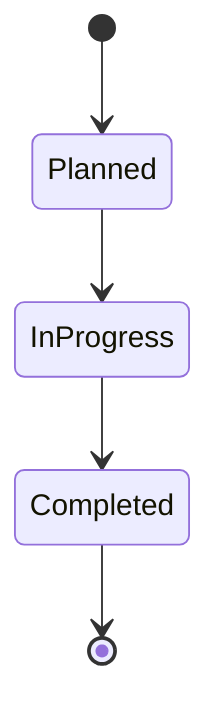
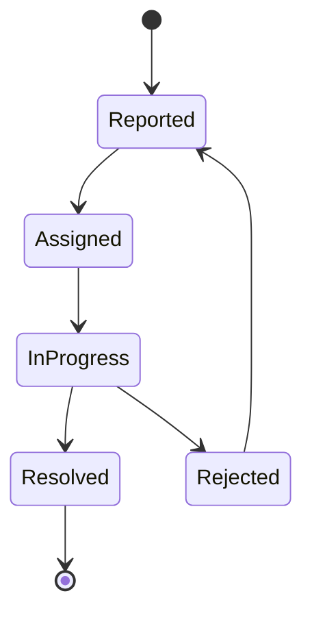

# JoineryTech QA Domain Model — DDD Design Specification

**Version:** 1.0
**Date:** 2026-07-04
**Epic:** EPIC-JT-QA
**Architect:** architect terminal
**Status:** Implementation Ready

---

## Executive Summary

This document specifies the **Quality Assurance (QA) domain model** for the JoineryTech ERP system using **Domain-Driven Design (DDD)** tactical patterns. The QA domain is responsible for:

- **Quality Checkpoint Definition** — Define quality control points in production (incoming inspection, in-process checks, final inspection)
- **Inspection Execution** — Execute inspections with pass/fail results, linking to employees and orders
- **Ticket Management** — Handle customer complaints, warranty claims, repair requests, and missing parts with FSM-enforced workflow
- **Production Integration** — Block production when critical inspections fail (safety-critical quality gate)
- **Root Cause Analysis** — Pareto analysis for failure pattern identification and Kontrolling dashboard

**Key Design Principles:**
1. **Single Source of Truth** — `QACheckpoint` aggregate defines all quality control points
2. **Immutable Inspection Results** — Inspection results cannot be modified after completion (audit trail)
3. **FSM-Enforced Ticket Workflow** — Status transitions validated at domain level
4. **Production Blocking Integration** — Critical failed inspections automatically block production
5. **Need-to-Know Access** — Inspection photos and failure details require appropriate permissions

---

## Table of Contents

1. [Aggregate Roots](#1-aggregate-roots)
2. [Value Objects](#2-value-objects)
3. [Enums](#3-enums)
4. [Domain Services](#4-domain-services)
5. [Domain Events](#5-domain-events)
6. [Repository Contracts](#6-repository-contracts)
7. [FSM State Machines](#7-fsm-state-machines)
8. [Integration Boundaries](#8-integration-boundaries)
9. [Validation Rules](#9-validation-rules)
10. [Implementation Guide](#10-implementation-guide)

---

## 1. Aggregate Roots

### 1.1 QACheckpoint Aggregate

**Responsibility:** Represents a quality control checkpoint definition (e.g., "Pre-painting visual inspection", "Final dimension check"). Defines criteria and criticality level. Referenced by Inspection aggregate.

```csharp
public class QACheckpoint : AggregateRoot<QACheckpointId>
{
    public QACheckpointId Id { get; private set; }
    public TenantId TenantId { get; private set; }
    public string Name { get; private set; }
    public CheckpointType Type { get; private set; } // Incoming, InProcess, Final
    public CriticalLevel CriticalLevel { get; private set; } // Critical, Major, Minor
    public string Description { get; private set; }
    public bool Active { get; private set; }

    private readonly List<InspectionCriteria> _criteria = new();
    public IReadOnlyList<InspectionCriteria> Criteria => _criteria.AsReadOnly();

    // Factory method
    public static QACheckpoint Create(
        TenantId tenantId,
        string name,
        CheckpointType type,
        CriticalLevel criticalLevel,
        string description = null)
    {
        if (string.IsNullOrWhiteSpace(name))
            throw new ArgumentException("Name is required", nameof(name));

        var checkpoint = new QACheckpoint
        {
            Id = QACheckpointId.New(),
            TenantId = tenantId,
            Name = name,
            Type = type,
            CriticalLevel = criticalLevel,
            Description = description,
            Active = true,
            CreatedAt = DateTime.UtcNow
        };

        checkpoint.AddDomainEvent(new CheckpointCreatedEvent(
            checkpoint.Id, checkpoint.TenantId, checkpoint.Name, checkpoint.Type, checkpoint.CriticalLevel));
        return checkpoint;
    }

    // Criteria management
    public void AddCriteria(InspectionCriteria criteria)
    {
        if (criteria == null)
            throw new ArgumentNullException(nameof(criteria));

        _criteria.Add(criteria);
        AddDomainEvent(new CheckpointCriteriaAddedEvent(Id, TenantId, criteria.Type, criteria.Description));
    }

    public void RemoveCriteria(string criteriaId)
    {
        var criteria = _criteria.FirstOrDefault(c => c.Id == criteriaId);
        if (criteria == null)
            throw new DomainException($"Criteria {criteriaId} not found");

        _criteria.Remove(criteria);
        AddDomainEvent(new CheckpointCriteriaRemovedEvent(Id, TenantId, criteriaId));
    }

    // Update checkpoint
    public void Update(string name, string description, CriticalLevel criticalLevel)
    {
        if (string.IsNullOrWhiteSpace(name))
            throw new ArgumentException("Name is required", nameof(name));

        Name = name;
        Description = description;
        CriticalLevel = criticalLevel;

        AddDomainEvent(new CheckpointUpdatedEvent(Id, TenantId, Name, CriticalLevel));
    }

    // Activation
    public void Deactivate()
    {
        if (!Active)
            throw new DomainException("Checkpoint is already inactive");

        Active = false;
        AddDomainEvent(new CheckpointDeactivatedEvent(Id, TenantId, Name));
    }

    public void Reactivate()
    {
        if (Active)
            throw new DomainException("Checkpoint is already active");

        Active = true;
        AddDomainEvent(new CheckpointReactivatedEvent(Id, TenantId, Name));
    }
}
```

**Invariants:**
- Name must not be empty
- Name must be unique per tenant
- CriticalLevel determines production blocking behavior
- Inactive checkpoints cannot be used for new inspections

---

### 1.2 Inspection Aggregate

**Responsibility:** Represents an inspection execution with pass/fail result. Links to QACheckpoint, inspector (Employee), and Order/Project. Immutable after completion.

```csharp
public class Inspection : AggregateRoot<InspectionId>
{
    public InspectionId Id { get; private set; }
    public TenantId TenantId { get; private set; }
    public QACheckpointId CheckpointId { get; private set; }
    public OrderId? OrderId { get; private set; }
    public ProjectId? ProjectId { get; private set; }
    public InspectionStatus Status { get; private set; }
    public InspectionResult? Result { get; private set; }
    public EmployeeId? InspectorEmployeeId { get; private set; }
    public DateOnly? ScheduledDate { get; private set; }
    public DateTime? StartedAt { get; private set; }
    public DateTime? CompletedAt { get; private set; }
    public string Notes { get; private set; }

    private readonly List<FailureNote> _failureNotes = new();
    public IReadOnlyList<FailureNote> FailureNotes => _failureNotes.AsReadOnly();

    // Factory method
    public static Inspection Create(
        TenantId tenantId,
        QACheckpointId checkpointId,
        OrderId? orderId = null,
        ProjectId? projectId = null,
        DateOnly? scheduledDate = null)
    {
        var inspection = new Inspection
        {
            Id = InspectionId.New(),
            TenantId = tenantId,
            CheckpointId = checkpointId,
            OrderId = orderId,
            ProjectId = projectId,
            Status = InspectionStatus.Planned,
            ScheduledDate = scheduledDate,
            CreatedAt = DateTime.UtcNow
        };

        inspection.AddDomainEvent(new InspectionPlannedEvent(
            inspection.Id, inspection.TenantId, inspection.CheckpointId,
            inspection.OrderId, inspection.ProjectId, inspection.ScheduledDate));
        return inspection;
    }

    // FSM transitions
    public void Start(EmployeeId inspectorEmployeeId)
    {
        if (!InspectionStatusTransitions.IsValidTransition(Status, InspectionStatus.InProgress))
            throw new InvalidStateTransitionException(Status, InspectionStatus.InProgress);

        Status = InspectionStatus.InProgress;
        InspectorEmployeeId = inspectorEmployeeId;
        StartedAt = DateTime.UtcNow;

        AddDomainEvent(new InspectionStartedEvent(Id, TenantId, CheckpointId, inspectorEmployeeId));
    }

    public void Complete(InspectionResult result, string notes = null)
    {
        if (!InspectionStatusTransitions.IsValidTransition(Status, InspectionStatus.Completed))
            throw new InvalidStateTransitionException(Status, InspectionStatus.Completed);
        if (InspectorEmployeeId == null)
            throw new DomainException("Cannot complete inspection without assigned inspector");
        if (result == InspectionResult.Fail && _failureNotes.Count == 0)
            throw new DomainException("Failed inspections require at least one failure note");

        Status = InspectionStatus.Completed;
        Result = result;
        Notes = notes;
        CompletedAt = DateTime.UtcNow;

        if (result == InspectionResult.Pass)
        {
            AddDomainEvent(new InspectionCompletedEvent(Id, TenantId, CheckpointId, OrderId, result));
        }
        else
        {
            AddDomainEvent(new InspectionFailedEvent(
                Id, TenantId, CheckpointId, OrderId,
                _failureNotes.Select(fn => fn.FailureType).ToList()));
        }
    }

    // Failure notes (only for failed/conditional inspections)
    public void AddFailureNote(FailureNote failureNote)
    {
        if (Status == InspectionStatus.Completed)
            throw new DomainException("Cannot add failure notes to completed inspection");
        if (failureNote == null)
            throw new ArgumentNullException(nameof(failureNote));

        _failureNotes.Add(failureNote);
    }

    public void RemoveFailureNote(string failureNoteId)
    {
        if (Status == InspectionStatus.Completed)
            throw new DomainException("Cannot remove failure notes from completed inspection");

        var note = _failureNotes.FirstOrDefault(fn => fn.Id == failureNoteId);
        if (note == null)
            throw new DomainException($"Failure note {failureNoteId} not found");

        _failureNotes.Remove(note);
    }
}
```

**Invariants:**
- Cannot complete without InspectorEmployeeId
- Failed inspections require at least one FailureNote
- Cannot modify FailureNotes after completion (immutable)
- Result is immutable after completion
- Cannot fail Planned inspection (must start first)

---

### 1.3 Ticket Aggregate

**Responsibility:** Represents a customer complaint, warranty claim, repair request, or missing parts report. FSM-enforced workflow from Reported to Resolved/Rejected.

```csharp
public class Ticket : AggregateRoot<TicketId>
{
    public TicketId Id { get; private set; }
    public TenantId TenantId { get; private set; }
    public TicketType Type { get; private set; } // Warranty, Repair, Missing
    public TicketStatus Status { get; private set; }
    public TicketPriority Priority { get; private set; }
    public OrderId? OrderId { get; private set; }
    public ProjectId? ProjectId { get; private set; }
    public string CustomerDescription { get; private set; }
    public EmployeeId? AssigneeEmployeeId { get; private set; }
    public string RootCause { get; private set; }
    public string RejectionReason { get; private set; }
    public DateTime? AssignedAt { get; private set; }
    public DateTime? StartedAt { get; private set; }
    public DateTime? ResolvedAt { get; private set; }

    private readonly List<ResolutionAction> _resolutionActions = new();
    public IReadOnlyList<ResolutionAction> ResolutionActions => _resolutionActions.AsReadOnly();

    // Factory method
    public static Ticket Create(
        TenantId tenantId,
        TicketType type,
        TicketPriority priority,
        string customerDescription,
        OrderId? orderId = null,
        ProjectId? projectId = null)
    {
        if (string.IsNullOrWhiteSpace(customerDescription))
            throw new ArgumentException("Customer description is required", nameof(customerDescription));

        var ticket = new Ticket
        {
            Id = TicketId.New(),
            TenantId = tenantId,
            Type = type,
            Status = TicketStatus.Reported,
            Priority = priority,
            OrderId = orderId,
            ProjectId = projectId,
            CustomerDescription = customerDescription,
            CreatedAt = DateTime.UtcNow
        };

        ticket.AddDomainEvent(new TicketReportedEvent(
            ticket.Id, ticket.TenantId, ticket.Type, ticket.Priority,
            ticket.OrderId, ticket.ProjectId));
        return ticket;
    }

    // FSM transitions
    public void Assign(EmployeeId assigneeEmployeeId)
    {
        if (!TicketStatusTransitions.IsValidTransition(Status, TicketStatus.Assigned))
            throw new InvalidStateTransitionException(Status, TicketStatus.Assigned);

        Status = TicketStatus.Assigned;
        AssigneeEmployeeId = assigneeEmployeeId;
        AssignedAt = DateTime.UtcNow;

        AddDomainEvent(new TicketAssignedEvent(Id, TenantId, assigneeEmployeeId));
    }

    public void StartWork()
    {
        if (!TicketStatusTransitions.IsValidTransition(Status, TicketStatus.InProgress))
            throw new InvalidStateTransitionException(Status, TicketStatus.InProgress);
        if (AssigneeEmployeeId == null)
            throw new DomainException("Cannot start work without assigned employee");

        Status = TicketStatus.InProgress;
        StartedAt = DateTime.UtcNow;

        AddDomainEvent(new TicketStartedEvent(Id, TenantId, AssigneeEmployeeId.Value));
    }

    public void Resolve(string rootCause)
    {
        if (!TicketStatusTransitions.IsValidTransition(Status, TicketStatus.Resolved))
            throw new InvalidStateTransitionException(Status, TicketStatus.Resolved);
        if (_resolutionActions.Count == 0)
            throw new DomainException("Resolution requires at least one resolution action");

        Status = TicketStatus.Resolved;
        RootCause = rootCause;
        ResolvedAt = DateTime.UtcNow;

        AddDomainEvent(new TicketResolvedEvent(
            Id, TenantId, Type, rootCause,
            _resolutionActions.Sum(ra => ra.Cost.Amount)));
    }

    public void Reject(string rejectionReason)
    {
        if (!TicketStatusTransitions.IsValidTransition(Status, TicketStatus.Rejected))
            throw new InvalidStateTransitionException(Status, TicketStatus.Rejected);
        if (string.IsNullOrWhiteSpace(rejectionReason) || rejectionReason.Length < 10)
            throw new ArgumentException("Rejection reason must be at least 10 characters", nameof(rejectionReason));

        Status = TicketStatus.Rejected;
        RejectionReason = rejectionReason;

        AddDomainEvent(new TicketRejectedEvent(Id, TenantId, rejectionReason));
    }

    public void Reopen()
    {
        if (!TicketStatusTransitions.IsValidTransition(Status, TicketStatus.Reported))
            throw new InvalidStateTransitionException(Status, TicketStatus.Reported);

        Status = TicketStatus.Reported;
        RejectionReason = null;

        AddDomainEvent(new TicketReopenedEvent(Id, TenantId));
    }

    // Resolution actions
    public void AddResolutionAction(ResolutionAction action)
    {
        if (Status == TicketStatus.Resolved)
            throw new DomainException("Cannot add resolution actions to resolved ticket");
        if (action == null)
            throw new ArgumentNullException(nameof(action));

        _resolutionActions.Add(action);
    }

    public void RemoveResolutionAction(string actionId)
    {
        if (Status == TicketStatus.Resolved)
            throw new DomainException("Cannot remove resolution actions from resolved ticket");

        var action = _resolutionActions.FirstOrDefault(ra => ra.Id == actionId);
        if (action == null)
            throw new DomainException($"Resolution action {actionId} not found");

        _resolutionActions.Remove(action);
    }

    // Priority escalation
    public void EscalatePriority(TicketPriority newPriority)
    {
        if (newPriority <= Priority)
            throw new DomainException("Can only escalate to higher priority");

        var oldPriority = Priority;
        Priority = newPriority;

        AddDomainEvent(new TicketPriorityEscalatedEvent(Id, TenantId, oldPriority, newPriority));
    }
}
```

**Invariants:**
- CustomerDescription must not be empty
- Cannot resolve without at least one ResolutionAction
- Rejection reason must be at least 10 characters
- Cannot resolve Reported ticket (must assign first)
- Cannot start work without AssigneeEmployeeId
- Resolution actions immutable after resolution

---

## 2. Value Objects

### 2.1 InspectionCriteria

**Responsibility:** Defines a single criterion to check during inspection.

```csharp
public class InspectionCriteria : ValueObject
{
    public string Id { get; private set; } // Guid
    public CriteriaType Type { get; private set; } // Visual, Dimensional, Functional
    public string Description { get; private set; }
    public string AcceptanceThreshold { get; private set; } // e.g., "Max 2mm gap", "No scratches"

    public static InspectionCriteria Create(
        CriteriaType type,
        string description,
        string acceptanceThreshold)
    {
        if (string.IsNullOrWhiteSpace(description))
            throw new ArgumentException("Description is required", nameof(description));

        return new InspectionCriteria
        {
            Id = Guid.NewGuid().ToString(),
            Type = type,
            Description = description,
            AcceptanceThreshold = acceptanceThreshold
        };
    }

    protected override IEnumerable<object> GetEqualityComponents()
    {
        yield return Type;
        yield return Description;
        yield return AcceptanceThreshold;
    }
}

public enum CriteriaType
{
    Visual,       // Szemrevételezés (scratches, color, finish)
    Dimensional,  // Méretellenőrzés (dimensions, gaps, alignment)
    Functional    // Funkcionális (opens/closes, locks, etc.)
}
```

---

### 2.2 FailureNote

**Responsibility:** Describes a specific failure found during inspection.

```csharp
public class FailureNote : ValueObject
{
    public string Id { get; private set; } // Guid
    public FailureType FailureType { get; private set; }
    public string Description { get; private set; }
    public string PhotoUrl { get; private set; } // Optional, blob storage URL

    public static FailureNote Create(
        FailureType failureType,
        string description,
        string photoUrl = null)
    {
        if (string.IsNullOrWhiteSpace(description) || description.Length < 10)
            throw new ArgumentException("Description must be at least 10 characters", nameof(description));

        return new FailureNote
        {
            Id = Guid.NewGuid().ToString(),
            FailureType = failureType,
            Description = description,
            PhotoUrl = photoUrl
        };
    }

    protected override IEnumerable<object> GetEqualityComponents()
    {
        yield return FailureType;
        yield return Description;
    }
}

public enum FailureType
{
    Scratch,         // Karcolás
    Gap,             // Rés/hézag
    Misalignment,    // Elcsúszás
    Color,           // Színeltérés
    Dimension,       // Méreteltérés
    Surface,         // Felületi hiba
    Functional,      // Működési hiba
    Missing,         // Hiányzó alkatrész
    Damage,          // Sérülés
    Other            // Egyéb
}
```

---

### 2.3 ResolutionAction

**Responsibility:** Describes an action taken to resolve a ticket.

```csharp
public class ResolutionAction : ValueObject
{
    public string Id { get; private set; } // Guid
    public ActionType ActionType { get; private set; }
    public string Description { get; private set; }
    public Money Cost { get; private set; }

    public static ResolutionAction Create(
        ActionType actionType,
        string description,
        Money cost)
    {
        if (string.IsNullOrWhiteSpace(description))
            throw new ArgumentException("Description is required", nameof(description));

        return new ResolutionAction
        {
            Id = Guid.NewGuid().ToString(),
            ActionType = actionType,
            Description = description,
            Cost = cost ?? Money.Zero("HUF")
        };
    }

    protected override IEnumerable<object> GetEqualityComponents()
    {
        yield return ActionType;
        yield return Description;
        yield return Cost;
    }
}

public enum ActionType
{
    Repair,       // Javítás
    Replace,      // Csere
    Refund,       // Visszatérítés
    NoAction      // Nincs teendő (pl. nem indokolt reklamáció)
}
```

---

## 3. Enums

### 3.1 InspectionResult

```csharp
public enum InspectionResult
{
    Pass,         // Megfelelt
    Fail,         // Nem felelt meg
    Conditional   // Feltételesen megfelelt (kisebb hibákkal)
}
```

### 3.2 InspectionStatus

```csharp
public enum InspectionStatus
{
    Planned = 0,     // Tervezett
    InProgress = 1,  // Folyamatban
    Completed = 2    // Lezárt
}
```

### 3.3 TicketType

```csharp
public enum TicketType
{
    Warranty,    // Garancia (gyártási hiba)
    Repair,      // Hiánypótlás/javítás
    Missing      // Hiányzó alkatrész
}
```

### 3.4 TicketStatus

```csharp
public enum TicketStatus
{
    Reported = 0,    // Bejelentve
    Assigned = 1,    // Kiosztva
    InProgress = 2,  // Folyamatban
    Resolved = 3,    // Megoldva
    Rejected = 4     // Elutasítva
}
```

### 3.5 TicketPriority

```csharp
public enum TicketPriority
{
    Critical,   // Kritikus (gyártás leállítva)
    High,       // Magas
    Medium,     // Közepes
    Low         // Alacsony
}
```

### 3.6 CheckpointType

```csharp
public enum CheckpointType
{
    Incoming,   // Beérkező áru ellenőrzés (beszállított anyag)
    InProcess,  // Gyártásközi ellenőrzés
    Final       // Kiszállítás előtti ellenőrzés
}
```

### 3.7 CriticalLevel

```csharp
public enum CriticalLevel
{
    Critical,   // Kritikus - bukás blokkolja a gyártást
    Major,      // Jelentős - figyelmeztetés, de nem blokkol
    Minor       // Enyhe - csak naplózás
}
```

---

## 4. Domain Services

### 4.1 InspectionBlockingService

**Responsibility:** Determine if failed inspection blocks production. Critical checkpoints with failed inspections stop production.

```csharp
public interface IInspectionBlockingService
{
    /// <summary>
    /// Check if a single failed inspection blocks production
    /// </summary>
    bool IsProductionBlocked(Inspection inspection, QACheckpoint checkpoint);

    /// <summary>
    /// Get all blocking inspections for an order
    /// </summary>
    IEnumerable<BlockingInspection> GetBlockingInspections(
        OrderId orderId,
        IEnumerable<Inspection> inspections,
        IEnumerable<QACheckpoint> checkpoints);
}

public class InspectionBlockingService : IInspectionBlockingService
{
    public bool IsProductionBlocked(Inspection inspection, QACheckpoint checkpoint)
    {
        return inspection.Status == InspectionStatus.Completed
            && inspection.Result == InspectionResult.Fail
            && checkpoint.CriticalLevel == CriticalLevel.Critical;
    }

    public IEnumerable<BlockingInspection> GetBlockingInspections(
        OrderId orderId,
        IEnumerable<Inspection> inspections,
        IEnumerable<QACheckpoint> checkpoints)
    {
        var checkpointMap = checkpoints.ToDictionary(c => c.Id);

        return inspections
            .Where(i =>
                i.OrderId == orderId &&
                i.Status == InspectionStatus.Completed &&
                i.Result == InspectionResult.Fail &&
                checkpointMap.TryGetValue(i.CheckpointId, out var cp) &&
                cp.CriticalLevel == CriticalLevel.Critical)
            .Select(i => new BlockingInspection
            {
                InspectionId = i.Id,
                CheckpointName = checkpointMap[i.CheckpointId].Name,
                FailureNotes = i.FailureNotes.Select(fn => fn.Description).ToList(),
                InspectionDate = i.CompletedAt?.Date ?? DateOnly.FromDateTime(DateTime.UtcNow)
            });
    }
}

public class BlockingInspection
{
    public InspectionId InspectionId { get; init; }
    public string CheckpointName { get; init; }
    public List<string> FailureNotes { get; init; }
    public DateOnly InspectionDate { get; init; }
}
```

---

### 4.2 TicketRoutingService

**Responsibility:** Auto-assign tickets based on type and priority. Route to appropriate team.

```csharp
public interface ITicketRoutingService
{
    /// <summary>
    /// Suggest assignee for a ticket based on type and priority
    /// </summary>
    Task<EmployeeId?> SuggestAssigneeAsync(Ticket ticket);

    /// <summary>
    /// Get available assignees for ticket type
    /// </summary>
    Task<IEnumerable<EmployeeId>> GetAvailableAssigneesAsync(TicketType ticketType);
}

public class TicketRoutingService : ITicketRoutingService
{
    private readonly IEmployeeRepository _employeeRepository;

    public TicketRoutingService(IEmployeeRepository employeeRepository)
    {
        _employeeRepository = employeeRepository;
    }

    public async Task<EmployeeId?> SuggestAssigneeAsync(Ticket ticket)
    {
        // Route based on ticket type
        var department = ticket.Type switch
        {
            TicketType.Warranty => Department.Quality,
            TicketType.Repair => Department.Production,
            TicketType.Missing => Department.Logistics,
            _ => Department.Quality
        };

        // For critical priority, route to manager
        if (ticket.Priority == TicketPriority.Critical)
        {
            var managers = await _employeeRepository.GetByDepartmentAsync(department);
            var manager = managers.FirstOrDefault(e => e.Role.Contains("Manager", StringComparison.OrdinalIgnoreCase));
            return manager?.Id;
        }

        // Route to first available employee in department
        var employees = await _employeeRepository.GetByDepartmentAsync(department);
        var available = employees.FirstOrDefault(e => e.Active);
        return available?.Id;
    }

    public async Task<IEnumerable<EmployeeId>> GetAvailableAssigneesAsync(TicketType ticketType)
    {
        var department = ticketType switch
        {
            TicketType.Warranty => Department.Quality,
            TicketType.Repair => Department.Production,
            TicketType.Missing => Department.Logistics,
            _ => Department.Quality
        };

        var employees = await _employeeRepository.GetByDepartmentAsync(department);
        return employees.Where(e => e.Active).Select(e => e.Id);
    }
}
```

---

### 4.3 RootCauseAnalysisService

**Responsibility:** Categorize failure patterns for Pareto analysis. Used by Kontrolling dashboard.

```csharp
public interface IRootCauseAnalysisService
{
    /// <summary>
    /// Analyze root causes from failed inspections (Pareto analysis)
    /// </summary>
    IEnumerable<FailureCategory> AnalyzeRootCauses(
        IEnumerable<Inspection> failedInspections,
        DateOnly startDate,
        DateOnly endDate);

    /// <summary>
    /// Get top N failure categories
    /// </summary>
    IEnumerable<FailureCategory> GetTopFailureCategories(
        IEnumerable<Inspection> failedInspections,
        DateOnly startDate,
        DateOnly endDate,
        int topN = 10);

    /// <summary>
    /// Analyze ticket root causes
    /// </summary>
    IEnumerable<TicketRootCause> AnalyzeTicketRootCauses(
        IEnumerable<Ticket> resolvedTickets,
        DateOnly startDate,
        DateOnly endDate);
}

public class RootCauseAnalysisService : IRootCauseAnalysisService
{
    public IEnumerable<FailureCategory> AnalyzeRootCauses(
        IEnumerable<Inspection> failedInspections,
        DateOnly startDate,
        DateOnly endDate)
    {
        var filtered = failedInspections
            .Where(i =>
                i.Status == InspectionStatus.Completed &&
                i.Result == InspectionResult.Fail &&
                i.CompletedAt.HasValue &&
                DateOnly.FromDateTime(i.CompletedAt.Value) >= startDate &&
                DateOnly.FromDateTime(i.CompletedAt.Value) <= endDate);

        var totalFailures = filtered.SelectMany(i => i.FailureNotes).Count();

        var categories = filtered
            .SelectMany(i => i.FailureNotes)
            .GroupBy(fn => fn.FailureType)
            .Select(g => new FailureCategory
            {
                Type = g.Key,
                Count = g.Count(),
                Percentage = totalFailures > 0
                    ? (decimal)g.Count() / totalFailures * 100
                    : 0,
                Examples = g.Take(3).Select(fn => fn.Description).ToList()
            })
            .OrderByDescending(fc => fc.Count)
            .ToList();

        // Calculate cumulative percentage for Pareto chart
        decimal cumulative = 0;
        foreach (var category in categories)
        {
            cumulative += category.Percentage;
            category.CumulativePercentage = cumulative;
        }

        return categories;
    }

    public IEnumerable<FailureCategory> GetTopFailureCategories(
        IEnumerable<Inspection> failedInspections,
        DateOnly startDate,
        DateOnly endDate,
        int topN = 10)
    {
        return AnalyzeRootCauses(failedInspections, startDate, endDate)
            .Take(topN);
    }

    public IEnumerable<TicketRootCause> AnalyzeTicketRootCauses(
        IEnumerable<Ticket> resolvedTickets,
        DateOnly startDate,
        DateOnly endDate)
    {
        var filtered = resolvedTickets
            .Where(t =>
                t.Status == TicketStatus.Resolved &&
                t.ResolvedAt.HasValue &&
                DateOnly.FromDateTime(t.ResolvedAt.Value) >= startDate &&
                DateOnly.FromDateTime(t.ResolvedAt.Value) <= endDate &&
                !string.IsNullOrWhiteSpace(t.RootCause));

        var totalTickets = filtered.Count();

        return filtered
            .GroupBy(t => t.RootCause)
            .Select(g => new TicketRootCause
            {
                RootCause = g.Key,
                Count = g.Count(),
                Percentage = totalTickets > 0
                    ? (decimal)g.Count() / totalTickets * 100
                    : 0,
                TotalCost = g.Sum(t => t.ResolutionActions.Sum(ra => ra.Cost.Amount))
            })
            .OrderByDescending(trc => trc.Count);
    }
}

public class FailureCategory
{
    public FailureType Type { get; init; }
    public int Count { get; init; }
    public decimal Percentage { get; init; }
    public decimal CumulativePercentage { get; set; }
    public List<string> Examples { get; init; }
}

public class TicketRootCause
{
    public string RootCause { get; init; }
    public int Count { get; init; }
    public decimal Percentage { get; init; }
    public decimal TotalCost { get; init; }
}
```

---

## 5. Domain Events

### 5.1 Inspection Events

```csharp
public record InspectionPlannedEvent(
    InspectionId InspectionId,
    TenantId TenantId,
    QACheckpointId CheckpointId,
    OrderId? OrderId,
    ProjectId? ProjectId,
    DateOnly? ScheduledDate) : DomainEvent;

public record InspectionStartedEvent(
    InspectionId InspectionId,
    TenantId TenantId,
    QACheckpointId CheckpointId,
    EmployeeId InspectorEmployeeId) : DomainEvent;

public record InspectionCompletedEvent(
    InspectionId InspectionId,
    TenantId TenantId,
    QACheckpointId CheckpointId,
    OrderId? OrderId,
    InspectionResult Result) : DomainEvent;

public record InspectionFailedEvent(
    InspectionId InspectionId,
    TenantId TenantId,
    QACheckpointId CheckpointId,
    OrderId? OrderId,
    List<FailureType> FailureTypes) : DomainEvent;
```

### 5.2 Ticket Events

```csharp
public record TicketReportedEvent(
    TicketId TicketId,
    TenantId TenantId,
    TicketType Type,
    TicketPriority Priority,
    OrderId? OrderId,
    ProjectId? ProjectId) : DomainEvent;

public record TicketAssignedEvent(
    TicketId TicketId,
    TenantId TenantId,
    EmployeeId AssigneeEmployeeId) : DomainEvent;

public record TicketStartedEvent(
    TicketId TicketId,
    TenantId TenantId,
    EmployeeId AssigneeEmployeeId) : DomainEvent;

public record TicketResolvedEvent(
    TicketId TicketId,
    TenantId TenantId,
    TicketType Type,
    string RootCause,
    decimal TotalResolutionCost) : DomainEvent;

public record TicketRejectedEvent(
    TicketId TicketId,
    TenantId TenantId,
    string RejectionReason) : DomainEvent;

public record TicketReopenedEvent(
    TicketId TicketId,
    TenantId TenantId) : DomainEvent;

public record TicketPriorityEscalatedEvent(
    TicketId TicketId,
    TenantId TenantId,
    TicketPriority OldPriority,
    TicketPriority NewPriority) : DomainEvent;
```

### 5.3 Checkpoint Events

```csharp
public record CheckpointCreatedEvent(
    QACheckpointId CheckpointId,
    TenantId TenantId,
    string Name,
    CheckpointType Type,
    CriticalLevel CriticalLevel) : DomainEvent;

public record CheckpointUpdatedEvent(
    QACheckpointId CheckpointId,
    TenantId TenantId,
    string Name,
    CriticalLevel CriticalLevel) : DomainEvent;

public record CheckpointDeactivatedEvent(
    QACheckpointId CheckpointId,
    TenantId TenantId,
    string Name) : DomainEvent;

public record CheckpointReactivatedEvent(
    QACheckpointId CheckpointId,
    TenantId TenantId,
    string Name) : DomainEvent;

public record CheckpointCriteriaAddedEvent(
    QACheckpointId CheckpointId,
    TenantId TenantId,
    CriteriaType CriteriaType,
    string Description) : DomainEvent;

public record CheckpointCriteriaRemovedEvent(
    QACheckpointId CheckpointId,
    TenantId TenantId,
    string CriteriaId) : DomainEvent;
```

---

## 6. Repository Contracts

### 6.1 IQACheckpointRepository

```csharp
public interface IQACheckpointRepository
{
    // ============ QUERIES ============

    Task<QACheckpoint?> GetByIdAsync(QACheckpointId id, CancellationToken ct = default);

    Task<IEnumerable<QACheckpoint>> GetActiveCheckpointsAsync(CancellationToken ct = default);

    Task<IEnumerable<QACheckpoint>> GetByTypeAsync(CheckpointType type, CancellationToken ct = default);

    Task<IEnumerable<QACheckpoint>> GetCriticalCheckpointsAsync(CancellationToken ct = default);

    Task<PagedResult<QACheckpoint>> GetPagedAsync(
        int page,
        int pageSize,
        CheckpointType? typeFilter = null,
        bool? activeFilter = null,
        CancellationToken ct = default);

    // ============ COMMANDS ============

    Task AddAsync(QACheckpoint checkpoint, CancellationToken ct = default);

    Task UpdateAsync(QACheckpoint checkpoint, CancellationToken ct = default);

    // ============ VALIDATION ============

    Task<bool> NameExistsAsync(string name, TenantId tenantId, CancellationToken ct = default);
}
```

### 6.2 IInspectionRepository

```csharp
public interface IInspectionRepository
{
    // ============ QUERIES ============

    Task<Inspection?> GetByIdAsync(InspectionId id, CancellationToken ct = default);

    Task<IEnumerable<Inspection>> GetByCheckpointAsync(
        QACheckpointId checkpointId,
        CancellationToken ct = default);

    Task<IEnumerable<Inspection>> GetByOrderAsync(
        OrderId orderId,
        CancellationToken ct = default);

    Task<IEnumerable<Inspection>> GetFailedInspectionsAsync(
        DateOnly startDate,
        DateOnly endDate,
        CancellationToken ct = default);

    Task<IEnumerable<Inspection>> GetPendingInspectionsAsync(CancellationToken ct = default);

    Task<PagedResult<Inspection>> GetPagedAsync(
        int page,
        int pageSize,
        InspectionStatus? statusFilter = null,
        InspectionResult? resultFilter = null,
        QACheckpointId? checkpointFilter = null,
        CancellationToken ct = default);

    // ============ COMMANDS ============

    Task AddAsync(Inspection inspection, CancellationToken ct = default);

    Task UpdateAsync(Inspection inspection, CancellationToken ct = default);

    // ============ AGGREGATE LOADING ============

    Task<Inspection?> GetByIdWithFailureNotesAsync(InspectionId id, CancellationToken ct = default);
}
```

### 6.3 ITicketRepository

```csharp
public interface ITicketRepository
{
    // ============ QUERIES ============

    Task<Ticket?> GetByIdAsync(TicketId id, CancellationToken ct = default);

    Task<IEnumerable<Ticket>> GetByStatusAsync(
        TicketStatus status,
        CancellationToken ct = default);

    Task<IEnumerable<Ticket>> GetByOrderAsync(
        OrderId orderId,
        CancellationToken ct = default);

    Task<IEnumerable<Ticket>> GetByAssigneeAsync(
        EmployeeId assigneeEmployeeId,
        CancellationToken ct = default);

    Task<IEnumerable<Ticket>> GetOverdueTicketsAsync(CancellationToken ct = default);

    Task<IEnumerable<Ticket>> GetResolvedTicketsAsync(
        DateOnly startDate,
        DateOnly endDate,
        CancellationToken ct = default);

    Task<PagedResult<Ticket>> GetPagedAsync(
        int page,
        int pageSize,
        TicketStatus? statusFilter = null,
        TicketType? typeFilter = null,
        TicketPriority? priorityFilter = null,
        CancellationToken ct = default);

    // ============ COMMANDS ============

    Task AddAsync(Ticket ticket, CancellationToken ct = default);

    Task UpdateAsync(Ticket ticket, CancellationToken ct = default);

    // ============ AGGREGATE LOADING ============

    Task<Ticket?> GetByIdWithResolutionActionsAsync(TicketId id, CancellationToken ct = default);
}
```

---

## 7. FSM State Machines

### 7.1 Inspection FSM

**States:**
- `Planned` (tervezett) — Initial state, awaiting execution
- `InProgress` (folyamatban) — Inspection started
- `Completed` (lezárt) — Inspection finished (with Pass/Fail/Conditional result)

**Terminal State:** `Completed`



**Transition Rules:**

| From | To | Conditions | Who Can Trigger |
|---|---|---|---|
| Planned | InProgress | InspectorEmployeeId required | Inspector (`qa.inspect`) |
| InProgress | Completed | FailureNotes required if result=Fail | Inspector (`qa.inspect`) |

**C# Implementation:**

```csharp
public static class InspectionStatusTransitions
{
    private static readonly Dictionary<InspectionStatus, HashSet<InspectionStatus>> _validTransitions = new()
    {
        { InspectionStatus.Planned, new() { InspectionStatus.InProgress } },
        { InspectionStatus.InProgress, new() { InspectionStatus.Completed } },
        { InspectionStatus.Completed, new() } // Terminal state
    };

    public static bool IsValidTransition(InspectionStatus from, InspectionStatus to)
    {
        return _validTransitions.ContainsKey(from) && _validTransitions[from].Contains(to);
    }

    public static HashSet<InspectionStatus> GetAllowedTransitions(InspectionStatus from)
    {
        return _validTransitions.ContainsKey(from) ? _validTransitions[from] : new HashSet<InspectionStatus>();
    }
}
```

---

### 7.2 Ticket FSM

**States:**
- `Reported` (bejelentve) — Initial state, newly reported ticket
- `Assigned` (kiosztva) — Assigned to employee
- `InProgress` (folyamatban) — Work started
- `Resolved` (megoldva) — Resolution completed
- `Rejected` (elutasítva) — Ticket rejected (e.g., not our fault)

**Terminal States:** `Resolved`, but `Rejected` can be reopened.



**Transition Rules:**

| From | To | Conditions | Who Can Trigger |
|---|---|---|---|
| Reported | Assigned | AssigneeEmployeeId required | Manager (`qa.manage`) |
| Assigned | InProgress | — | Assignee or Manager |
| InProgress | Resolved | ResolutionActions required, RootCause optional | Assignee or Manager |
| InProgress | Rejected | RejectionReason required (min 10 chars) | Manager (`qa.manage`) |
| Rejected | Reported | — | Manager (`qa.manage`) |

**C# Implementation:**

```csharp
public static class TicketStatusTransitions
{
    private static readonly Dictionary<TicketStatus, HashSet<TicketStatus>> _validTransitions = new()
    {
        { TicketStatus.Reported, new() { TicketStatus.Assigned } },
        { TicketStatus.Assigned, new() { TicketStatus.InProgress } },
        { TicketStatus.InProgress, new() { TicketStatus.Resolved, TicketStatus.Rejected } },
        { TicketStatus.Rejected, new() { TicketStatus.Reported } },
        { TicketStatus.Resolved, new() } // Terminal state
    };

    public static bool IsValidTransition(TicketStatus from, TicketStatus to)
    {
        return _validTransitions.ContainsKey(from) && _validTransitions[from].Contains(to);
    }

    public static HashSet<TicketStatus> GetAllowedTransitions(TicketStatus from)
    {
        return _validTransitions.ContainsKey(from) ? _validTransitions[from] : new HashSet<TicketStatus>();
    }

    public static bool IsTerminalState(TicketStatus status)
    {
        return status == TicketStatus.Resolved;
    }
}
```

---

## 8. Integration Boundaries

### 8.1 QA → Production (Blocking Inspections) — CRITICAL!

**Purpose:** Failed critical inspections block production for the affected order.

**Contract:**
```csharp
// Production queries QA for blocking inspections
GET /api/qa/inspections/blocking?orderId={orderId}

// Response:
{
  "isBlocked": true,
  "blockingInspections": [
    {
      "inspectionId": "guid",
      "checkpointName": "Festés minőség",
      "failureNotes": ["3 db karcolás észlelve"],
      "inspectionDate": "2026-07-04"
    }
  ]
}

// Event published when critical inspection fails
public record ProductionBlockedByInspectionEvent(
    OrderId OrderId,
    InspectionId InspectionId,
    string CheckpointName,
    List<string> FailureNotes) : DomainEvent;
```

**Integration Flow:**
1. Inspector completes inspection with `Result = Fail`
2. QA checks if checkpoint has `CriticalLevel = Critical`
3. If critical → `ProductionBlockedByInspectionEvent` published
4. Production module queries `/api/qa/inspections/blocking` before advancing
5. Production UI shows blocking alert with failure details
6. When corrective action taken → new inspection created → if passes → production unblocked

---

### 8.2 QA → HR (Inspector Reference)

**Purpose:** Inspections reference HR employees as inspectors.

**Contract:**
```csharp
// QA references HR.Employee for inspector
public interface IQAEmployeeIntegration
{
    Task<EmployeeInfo> GetInspectorInfoAsync(EmployeeId employeeId);
    Task<IEnumerable<EmployeeId>> GetQualifiedInspectorsAsync(CheckpointType checkpointType);
}

public record EmployeeInfo(EmployeeId EmployeeId, string Name, string Initials);
```

**Integration Flow:**
1. Inspection stores `InspectorEmployeeId` reference
2. QA queries HR for inspector details (display name, initials)
3. Optionally: HR tracks QA competency/training for inspectors

---

### 8.3 QA → Order/Project

**Purpose:** Inspections and tickets link to Orders and Projects.

**Contract:**
```csharp
// QA references Order/Project
public class Inspection
{
    public OrderId? OrderId { get; private set; }
    public ProjectId? ProjectId { get; private set; }
}

public class Ticket
{
    public OrderId? OrderId { get; private set; }
    public ProjectId? ProjectId { get; private set; }
}
```

**Integration Flow:**
1. Inspection created with `OrderId` or `ProjectId` reference
2. Order detail page queries `/api/qa/inspections?orderId={orderId}` for inspection history
3. Ticket created from customer complaint links to original Order

---

### 8.4 QA → Kontrolling (Quality Metrics)

**Purpose:** Kontrolling dashboard displays quality KPIs.

**Contract:**
```csharp
// Kontrolling queries QA for metrics
GET /api/qa/metrics/pareto?startDate={startDate}&endDate={endDate}

// Response:
{
  "totalInspections": 150,
  "passRate": 92.5,
  "failureCategories": [
    { "type": "Scratch", "count": 5, "percentage": 41.7, "cumulativePercentage": 41.7 },
    { "type": "Gap", "count": 3, "percentage": 25.0, "cumulativePercentage": 66.7 },
    ...
  ],
  "ticketMetrics": {
    "totalTickets": 12,
    "resolvedTickets": 10,
    "avgResolutionDays": 2.5,
    "totalResolutionCost": 125000
  }
}
```

**Integration Flow:**
1. Kontrolling dashboard calls `/api/qa/metrics/pareto` daily
2. RootCauseAnalysisService generates Pareto analysis
3. Dashboard displays "Top 10 Quality Issues" chart
4. Ticket resolution cost tracked for quality cost metrics

---

## 9. Validation Rules

### 9.1 QACheckpoint Validation

| Rule | Enforcement | Error Message |
|---|---|---|
| Name must not be empty | Domain method | "Name is required" |
| Name must be unique per tenant | Repository check | "Checkpoint name already exists" |
| Cannot deactivate checkpoint with pending inspections | Application service | "Cannot deactivate checkpoint with pending inspections" |
| Critical checkpoints require explicit `CriticalLevel = Critical` | Domain method | (implicit) |

### 9.2 Inspection Validation

| Rule | Enforcement | Error Message |
|---|---|---|
| Cannot complete without InspectorEmployeeId | Domain method | "Cannot complete inspection without assigned inspector" |
| Failed inspections require FailureNotes | Domain method | "Failed inspections require at least one failure note" |
| Cannot fail Planned inspection | FSM | "Invalid state transition: Planned → Completed" |
| FailureNote description min 10 chars | Value object | "Description must be at least 10 characters" |
| Cannot modify completed inspection | Domain method | "Cannot add failure notes to completed inspection" |

### 9.3 Ticket Validation

| Rule | Enforcement | Error Message |
|---|---|---|
| CustomerDescription must not be empty | Domain method | "Customer description is required" |
| Resolution requires ResolutionActions | Domain method | "Resolution requires at least one resolution action" |
| Rejection reason min 10 chars | Domain method | "Rejection reason must be at least 10 characters" |
| Cannot resolve Reported ticket | FSM | "Invalid state transition: Reported → Resolved" |
| Cannot start work without AssigneeEmployeeId | Domain method | "Cannot start work without assigned employee" |

---

## 10. Implementation Guide

### Phase 1: Core Domain (Week 1-2)

**Step 1: Shared Kernel**
```bash
spaceos-modules-qa/
  Domain/
    AggregateRoot.cs
    ValueObject.cs
    Entity.cs
    DomainEvent.cs
    DomainException.cs
    InvalidStateTransitionException.cs
```

**Step 2: QACheckpoint Aggregate**
```csharp
// Implement QACheckpoint aggregate
QACheckpoint.cs
QACheckpointId.cs (strongly-typed ID)
CheckpointType.cs (enum)
CriticalLevel.cs (enum)
InspectionCriteria.cs (value object)
CriteriaType.cs (enum)
```

**Step 3: Inspection Aggregate**
```csharp
// Implement Inspection aggregate
Inspection.cs
InspectionId.cs
InspectionStatus.cs (enum + FSM validator)
InspectionResult.cs (enum)
FailureNote.cs (value object)
FailureType.cs (enum)
```

**Step 4: Ticket Aggregate**
```csharp
// Implement Ticket aggregate
Ticket.cs
TicketId.cs
TicketStatus.cs (enum + FSM validator)
TicketType.cs (enum)
TicketPriority.cs (enum)
ResolutionAction.cs (value object)
ActionType.cs (enum)
```

**Step 5: Unit Tests**
```csharp
// 80+ test cases for FSM transitions
InspectionTests.cs
  - CanTransitionFromPlannedToInProgress()
  - CanTransitionFromInProgressToCompleted()
  - CannotCompleteWithoutInspector()
  - FailedInspectionRequiresFailureNotes()

TicketTests.cs
  - CanTransitionFromReportedToAssigned()
  - CannotResolveWithoutResolutionActions()
  - RequiresRejectionReasonWhenRejecting()
  - CanReopenRejectedTicket()

QACheckpointTests.cs
  - CanAddCriteria()
  - CanDeactivate()
```

---

### Phase 2: Domain Services (Week 3)

**Step 1: Inspection Blocking Service**
```csharp
InspectionBlockingService.cs
IInspectionBlockingService.cs
BlockingInspection.cs
```

**Step 2: Ticket Routing Service**
```csharp
TicketRoutingService.cs
ITicketRoutingService.cs
```

**Step 3: Root Cause Analysis Service**
```csharp
RootCauseAnalysisService.cs
IRootCauseAnalysisService.cs
FailureCategory.cs
TicketRootCause.cs
```

**Step 4: Unit Tests**
```csharp
InspectionBlockingServiceTests.cs
  - IsProductionBlocked_CriticalCheckpointFailed_ReturnsTrue()
  - IsProductionBlocked_MajorCheckpointFailed_ReturnsFalse()
  - GetBlockingInspections_ReturnsOnlyCriticalFailed()

RootCauseAnalysisServiceTests.cs
  - AnalyzeRootCauses_GroupsByFailureType()
  - AnalyzeRootCauses_CalculatesPercentages()
  - GetTopFailureCategories_ReturnsTopN()
```

---

### Phase 3: Repositories (Week 4)

**Step 1: EF Core Entity Configurations**
```csharp
QACheckpointConfiguration.cs
InspectionConfiguration.cs
TicketConfiguration.cs
InspectionCriteriaConfiguration.cs (owned entity)
FailureNoteConfiguration.cs (owned entity)
ResolutionActionConfiguration.cs (owned entity)
```

**Step 2: Repository Implementations**
```csharp
QACheckpointRepository.cs
InspectionRepository.cs
TicketRepository.cs
```

**Step 3: PostgreSQL RLS Setup**
```sql
ALTER TABLE "QACheckpoints" ENABLE ROW LEVEL SECURITY;
CREATE POLICY tenant_isolation_policy ON "QACheckpoints"
  USING (tenant_id = current_setting('app.tenant_id')::uuid);

ALTER TABLE "Inspections" ENABLE ROW LEVEL SECURITY;
CREATE POLICY tenant_isolation_policy ON "Inspections"
  USING (tenant_id = current_setting('app.tenant_id')::uuid);

ALTER TABLE "Tickets" ENABLE ROW LEVEL SECURITY;
CREATE POLICY tenant_isolation_policy ON "Tickets"
  USING (tenant_id = current_setting('app.tenant_id')::uuid);
```

**Step 4: Integration Tests (Testcontainers)**
```csharp
QACheckpointRepositoryTests.cs
  - CanAddCheckpoint()
  - CanGetCheckpointById()
  - NameExistsAsync_WithDuplicateName_ReturnsTrue()

InspectionRepositoryTests.cs
  - CanGetFailedInspections()
  - RLS_EnforceTenantIsolation()
```

---

### Phase 4: CQRS Handlers (Week 5-6)

**Commands:**
```csharp
CreateQACheckpointCommand
UpdateQACheckpointCommand
DeactivateQACheckpointCommand

CreateInspectionCommand
StartInspectionCommand
CompleteInspectionCommand
AddFailureNoteCommand

CreateTicketCommand
AssignTicketCommand
StartTicketCommand
ResolveTicketCommand
RejectTicketCommand
ReopenTicketCommand
```

**Queries:**
```csharp
GetQACheckpointByIdQuery
ListQACheckpointsQuery
GetCriticalCheckpointsQuery

GetInspectionByIdQuery
ListInspectionsQuery
GetBlockingInspectionsQuery
GetParetoAnalysisQuery

GetTicketByIdQuery
ListTicketsQuery
GetOverdueTicketsQuery
```

**Event Handlers:**
```csharp
// When InspectionFailedEvent + Critical checkpoint
NotifyProductionBlockedHandler
CreateTicketFromInspectionHandler (optional: auto-create ticket)

// When TicketResolvedEvent
PushQualityCostToControllingHandler
```

---

### Phase 5: API Integration (Week 6)

**REST Endpoints:**
```csharp
POST   /api/qa/checkpoints              → CreateQACheckpointCommand
GET    /api/qa/checkpoints/{id}         → GetQACheckpointByIdQuery
PATCH  /api/qa/checkpoints/{id}         → UpdateQACheckpointCommand
DELETE /api/qa/checkpoints/{id}         → DeactivateQACheckpointCommand

POST   /api/qa/inspections              → CreateInspectionCommand
GET    /api/qa/inspections/{id}         → GetInspectionByIdQuery
PATCH  /api/qa/inspections/{id}/start   → StartInspectionCommand
PATCH  /api/qa/inspections/{id}/complete → CompleteInspectionCommand
GET    /api/qa/inspections/blocking?orderId={orderId} → GetBlockingInspectionsQuery

POST   /api/qa/tickets                  → CreateTicketCommand
GET    /api/qa/tickets/{id}             → GetTicketByIdQuery
PATCH  /api/qa/tickets/{id}/assign      → AssignTicketCommand
PATCH  /api/qa/tickets/{id}/start       → StartTicketCommand
PATCH  /api/qa/tickets/{id}/resolve     → ResolveTicketCommand
PATCH  /api/qa/tickets/{id}/reject      → RejectTicketCommand

GET    /api/qa/metrics/pareto?startDate={startDate}&endDate={endDate} → GetParetoAnalysisQuery
```

---

### EF Core Mapping Example

```csharp
public class InspectionConfiguration : IEntityTypeConfiguration<Inspection>
{
    public void Configure(EntityTypeBuilder<Inspection> builder)
    {
        builder.ToTable("Inspections");

        builder.HasKey(i => i.Id);
        builder.Property(i => i.Id).HasConversion(
            id => id.Value,
            value => InspectionId.From(value));

        builder.Property(i => i.CheckpointId).IsRequired();
        builder.Property(i => i.Status).IsRequired();
        builder.Property(i => i.Result);
        builder.Property(i => i.Notes).HasMaxLength(2000);

        builder.OwnsMany(i => i.FailureNotes, fn =>
        {
            fn.Property(f => f.Id).HasMaxLength(64).IsRequired();
            fn.Property(f => f.FailureType).IsRequired();
            fn.Property(f => f.Description).HasMaxLength(1000).IsRequired();
            fn.Property(f => f.PhotoUrl).HasMaxLength(512);
        });

        // RLS
        builder.HasQueryFilter(i => EF.Property<Guid>(i, "TenantId") == TenantContext.Current.TenantId);
    }
}

public class TicketConfiguration : IEntityTypeConfiguration<Ticket>
{
    public void Configure(EntityTypeBuilder<Ticket> builder)
    {
        builder.ToTable("Tickets");

        builder.HasKey(t => t.Id);
        builder.Property(t => t.Id).HasConversion(
            id => id.Value,
            value => TicketId.From(value));

        builder.Property(t => t.Type).IsRequired();
        builder.Property(t => t.Status).IsRequired();
        builder.Property(t => t.Priority).IsRequired();
        builder.Property(t => t.CustomerDescription).HasMaxLength(4000).IsRequired();
        builder.Property(t => t.RootCause).HasMaxLength(2000);
        builder.Property(t => t.RejectionReason).HasMaxLength(2000);

        builder.OwnsMany(t => t.ResolutionActions, ra =>
        {
            ra.Property(r => r.Id).HasMaxLength(64).IsRequired();
            ra.Property(r => r.ActionType).IsRequired();
            ra.Property(r => r.Description).HasMaxLength(1000).IsRequired();
            ra.OwnsOne(r => r.Cost);
        });

        // RLS
        builder.HasQueryFilter(t => EF.Property<Guid>(t, "TenantId") == TenantContext.Current.TenantId);
    }
}
```

---

## Appendix A: Production Blocking API Example

### Request Flow

```
Production module                    QA module
     |                                   |
     |--- GET /api/qa/inspections/blocking?orderId=xxx --->|
     |                                   |
     |<-- { isBlocked: true, ... } -----|
     |                                   |
     |--- (Block production UI) -------->|
     |                                   |
Inspector completes corrective action
     |                                   |
     |<-- InspectionCompletedEvent (Pass) --|
     |                                   |
     |--- GET /api/qa/inspections/blocking?orderId=xxx --->|
     |                                   |
     |<-- { isBlocked: false, ... } ----|
     |                                   |
     |--- (Resume production) ---------->|
```

### Domain Logic

```csharp
public class InspectionBlockingService : IInspectionBlockingService
{
    public bool IsProductionBlocked(Inspection inspection, QACheckpoint checkpoint)
    {
        // Only critical checkpoints with failed inspections block production
        return inspection.Result == InspectionResult.Fail
            && checkpoint.CriticalLevel == CriticalLevel.Critical;
    }

    public IEnumerable<Inspection> GetBlockingInspections(Guid orderId, IEnumerable<Inspection> inspections)
    {
        return inspections.Where(i =>
            i.OrderId == orderId
            && i.Result == InspectionResult.Fail
            && i.Checkpoint.CriticalLevel == CriticalLevel.Critical);
    }
}
```

---

**Status:** Implementation Ready
**Next Steps:** Backend terminal implementation (Week 1-6)
**Quality:** Production-ready DDD specification, comprehensive documentation

---

*Architect Terminal - MSG-ARCHITECT-063*
