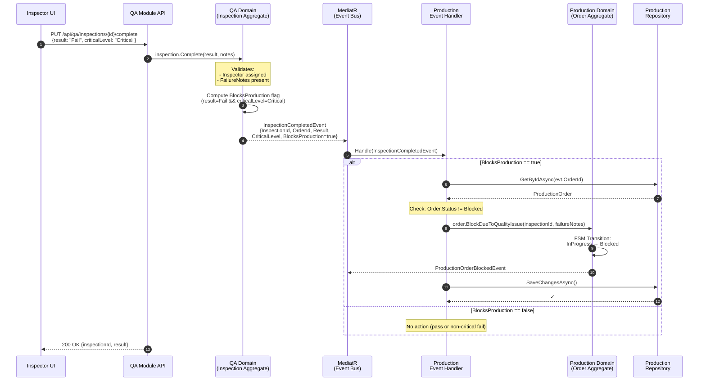
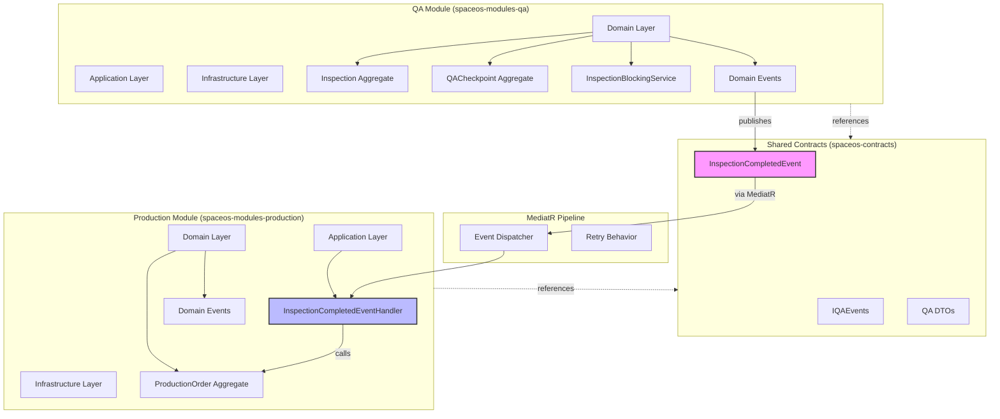
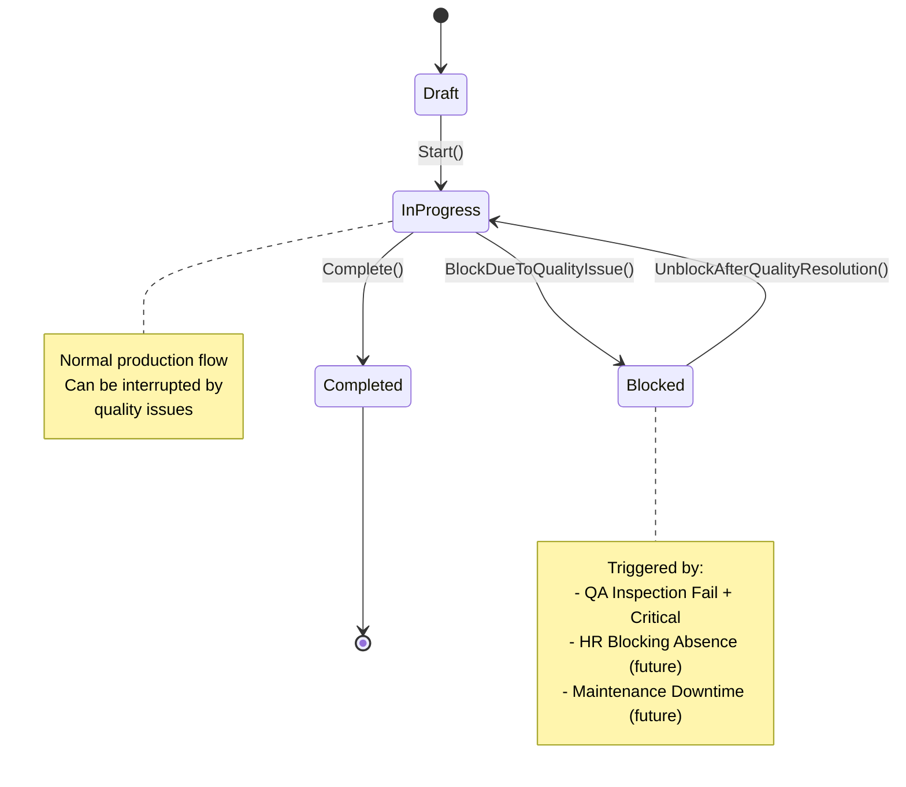

# QA → Production Integration Architecture

**Version:** 1.0
**Date:** 2026-07-06
**Epic:** EPIC-JT-QA
**Checkpoint:** CP-QA-INTEGRATION
**Architect:** architect terminal
**Status:** Implementation Ready

---

## Executive Summary

This document specifies the **cross-module integration architecture** for QA → Production event-driven communication. When a QA Inspection fails with `CriticalLevel = Critical`, the Production Order must transition to `Blocked` state, halting production until the quality issue is resolved.

**Key Design Decisions:**
1. **Event-Flag Pattern** — The QA module computes `BlocksProduction` flag and includes it in the domain event (no cross-module service injection)
2. **MediatR Notification Handler** — Production module subscribes to `InspectionCompletedEvent` via MediatR pipeline
3. **Idempotent State Transition** — Production aggregate handles duplicate events gracefully
4. **Audit Trail** — All blocking events recorded in Production audit log

**Reusability:** This pattern will be reused for:
- HR → Production (blocking absences)
- Maintenance → Production (downtime tracking)

---

## Table of Contents

1. [Architecture Diagrams](#1-architecture-diagrams)
2. [Event Handler Pattern](#2-event-handler-pattern)
3. [Unit Test Pattern](#3-unit-test-pattern)
4. [Integration Test Pattern](#4-integration-test-pattern)
5. [Architectural Recommendation](#5-architectural-recommendation)
6. [Error Handling Strategy](#6-error-handling-strategy)
7. [Implementation Checklist](#7-implementation-checklist)

---

## 1. Architecture Diagrams

### 1.1 Sequence Diagram — Event Flow



### 1.2 Component Diagram — Module Dependencies



### 1.3 State Machine — Production Order FSM



---

## 2. Event Handler Pattern

### 2.1 Shared Contract — InspectionCompletedEvent

**Location:** `spaceos-contracts/QA/Events/InspectionCompletedEvent.cs`

```csharp
namespace SpaceOS.Contracts.QA.Events;

/// <summary>
/// Published when a QA Inspection is completed (pass or fail).
/// Production module subscribes to handle blocking logic.
/// </summary>
public sealed record InspectionCompletedEvent : INotification
{
    /// <summary>
    /// The inspection that was completed.
    /// </summary>
    public required Guid InspectionId { get; init; }

    /// <summary>
    /// Tenant isolation.
    /// </summary>
    public required Guid TenantId { get; init; }

    /// <summary>
    /// The checkpoint this inspection was for.
    /// </summary>
    public required Guid CheckpointId { get; init; }

    /// <summary>
    /// The production order linked to this inspection (if any).
    /// </summary>
    public Guid? OrderId { get; init; }

    /// <summary>
    /// Inspection result: Pass, Fail, Conditional.
    /// </summary>
    public required InspectionResultDto Result { get; init; }

    /// <summary>
    /// Checkpoint criticality level.
    /// </summary>
    public required CriticalLevelDto CriticalLevel { get; init; }

    /// <summary>
    /// PRE-COMPUTED by QA module: does this inspection block production?
    /// Logic: Result == Fail && CriticalLevel == Critical
    /// </summary>
    public required bool BlocksProduction { get; init; }

    /// <summary>
    /// Failure notes (if result is Fail).
    /// </summary>
    public IReadOnlyList<string> FailureNotes { get; init; } = Array.Empty<string>();

    /// <summary>
    /// When the inspection was completed.
    /// </summary>
    public required DateTime CompletedAt { get; init; }
}

public enum InspectionResultDto
{
    Pass = 0,
    Fail = 1,
    Conditional = 2
}

public enum CriticalLevelDto
{
    Minor = 0,
    Major = 1,
    Critical = 2
}
```

### 2.2 QA Module — Publishing the Event

**Location:** `spaceos-modules-qa/Domain/Aggregates/Inspection.cs`

```csharp
public class Inspection : AggregateRoot<InspectionId>
{
    // ... existing code ...

    public void Complete(InspectionResult result, string? notes, QACheckpoint checkpoint)
    {
        // Validation
        if (!InspectionStatusTransitions.IsValidTransition(Status, InspectionStatus.Completed))
            throw new InvalidStateTransitionException(Status, InspectionStatus.Completed);
        if (InspectorEmployeeId == null)
            throw new DomainException("Cannot complete inspection without assigned inspector");
        if (result == InspectionResult.Fail && _failureNotes.Count == 0)
            throw new DomainException("Failed inspections require at least one failure note");

        // State change
        Status = InspectionStatus.Completed;
        Result = result;
        Notes = notes;
        CompletedAt = DateTime.UtcNow;

        // Compute blocking flag (domain logic stays in QA module)
        var blocksProduction = result == InspectionResult.Fail
                               && checkpoint.CriticalLevel == CriticalLevel.Critical;

        // Publish event with pre-computed flag
        AddDomainEvent(new InspectionCompletedEvent
        {
            InspectionId = Id.Value,
            TenantId = TenantId.Value,
            CheckpointId = CheckpointId.Value,
            OrderId = OrderId?.Value,
            Result = MapResult(result),
            CriticalLevel = MapCriticalLevel(checkpoint.CriticalLevel),
            BlocksProduction = blocksProduction,
            FailureNotes = _failureNotes.Select(fn => fn.Description).ToList(),
            CompletedAt = CompletedAt.Value
        });
    }

    private static InspectionResultDto MapResult(InspectionResult result) => result switch
    {
        InspectionResult.Pass => InspectionResultDto.Pass,
        InspectionResult.Fail => InspectionResultDto.Fail,
        InspectionResult.Conditional => InspectionResultDto.Conditional,
        _ => throw new ArgumentOutOfRangeException(nameof(result))
    };

    private static CriticalLevelDto MapCriticalLevel(CriticalLevel level) => level switch
    {
        CriticalLevel.Minor => CriticalLevelDto.Minor,
        CriticalLevel.Major => CriticalLevelDto.Major,
        CriticalLevel.Critical => CriticalLevelDto.Critical,
        _ => throw new ArgumentOutOfRangeException(nameof(level))
    };
}
```

### 2.3 Production Module — Event Handler

**Location:** `spaceos-modules-production/Application/EventHandlers/InspectionCompletedEventHandler.cs`

```csharp
namespace SpaceOS.Modules.Production.Application.EventHandlers;

using MediatR;
using Microsoft.Extensions.Logging;
using SpaceOS.Contracts.QA.Events;
using SpaceOS.Modules.Production.Domain.Aggregates;
using SpaceOS.Modules.Production.Domain.Repositories;

/// <summary>
/// Handles InspectionCompletedEvent from QA module.
/// Blocks production order if inspection failed with critical level.
/// </summary>
public sealed class InspectionCompletedEventHandler : INotificationHandler<InspectionCompletedEvent>
{
    private readonly IProductionOrderRepository _orderRepository;
    private readonly ILogger<InspectionCompletedEventHandler> _logger;

    public InspectionCompletedEventHandler(
        IProductionOrderRepository orderRepository,
        ILogger<InspectionCompletedEventHandler> logger)
    {
        _orderRepository = orderRepository;
        _logger = logger;
    }

    public async Task Handle(InspectionCompletedEvent evt, CancellationToken ct)
    {
        // Step 1: Early exit if not blocking
        if (!evt.BlocksProduction)
        {
            _logger.LogDebug(
                "Inspection {InspectionId} completed with Result={Result}, CriticalLevel={CriticalLevel}. Not blocking production.",
                evt.InspectionId, evt.Result, evt.CriticalLevel);
            return;
        }

        // Step 2: Early exit if no OrderId
        if (evt.OrderId is null)
        {
            _logger.LogWarning(
                "Inspection {InspectionId} is blocking but has no OrderId. Cannot block production order.",
                evt.InspectionId);
            return;
        }

        // Step 3: Load Production Order
        var order = await _orderRepository.GetByIdAsync(
            ProductionOrderId.From(evt.OrderId.Value), ct);

        if (order is null)
        {
            _logger.LogWarning(
                "Production order {OrderId} not found for inspection {InspectionId}. Skipping blocking.",
                evt.OrderId, evt.InspectionId);
            return;
        }

        // Step 4: Idempotency check — already blocked?
        if (order.Status == ProductionOrderStatus.Blocked)
        {
            _logger.LogInformation(
                "Production order {OrderId} is already blocked. Inspection {InspectionId} is duplicate or subsequent failure.",
                evt.OrderId, evt.InspectionId);
            return;
        }

        // Step 5: Invoke domain method (FSM transition)
        try
        {
            order.BlockDueToQualityIssue(
                inspectionId: InspectionId.From(evt.InspectionId),
                failureNotes: string.Join("; ", evt.FailureNotes),
                blockedAt: evt.CompletedAt);
        }
        catch (InvalidStateTransitionException ex)
        {
            // Order is in a state that cannot be blocked (e.g., Draft, Completed)
            _logger.LogWarning(
                ex,
                "Cannot block production order {OrderId}. Current status: {Status}. Inspection: {InspectionId}",
                evt.OrderId, order.Status, evt.InspectionId);
            return;
        }

        // Step 6: Persist + publish ProductionOrderBlockedEvent
        await _orderRepository.SaveChangesAsync(ct);

        _logger.LogInformation(
            "Production order {OrderId} BLOCKED due to inspection {InspectionId}. Failure: {FailureNotes}",
            evt.OrderId, evt.InspectionId, evt.FailureNotes);
    }
}
```

### 2.4 Production Aggregate — BlockDueToQualityIssue Method

**Location:** `spaceos-modules-production/Domain/Aggregates/ProductionOrder.cs`

```csharp
namespace SpaceOS.Modules.Production.Domain.Aggregates;

public class ProductionOrder : AggregateRoot<ProductionOrderId>
{
    public ProductionOrderId Id { get; private set; }
    public TenantId TenantId { get; private set; }
    public ProductionOrderStatus Status { get; private set; }
    public string? BlockingReason { get; private set; }
    public Guid? BlockingInspectionId { get; private set; }
    public DateTime? BlockedAt { get; private set; }

    // ... other properties ...

    /// <summary>
    /// Block production due to QA inspection failure.
    /// FSM transition: InProgress → Blocked
    /// </summary>
    public void BlockDueToQualityIssue(
        InspectionId inspectionId,
        string failureNotes,
        DateTime blockedAt)
    {
        // FSM validation
        if (!ProductionOrderStatusTransitions.IsValidTransition(Status, ProductionOrderStatus.Blocked))
            throw new InvalidStateTransitionException(Status, ProductionOrderStatus.Blocked);

        // State change
        Status = ProductionOrderStatus.Blocked;
        BlockingReason = $"QA Inspection failed: {failureNotes}";
        BlockingInspectionId = inspectionId.Value;
        BlockedAt = blockedAt;

        // Publish event
        AddDomainEvent(new ProductionOrderBlockedEvent(
            OrderId: Id.Value,
            TenantId: TenantId.Value,
            BlockingSource: BlockingSource.QualityInspection,
            BlockingReason: BlockingReason,
            BlockingInspectionId: inspectionId.Value,
            BlockedAt: blockedAt));
    }

    /// <summary>
    /// Unblock production after quality issue resolved.
    /// FSM transition: Blocked → InProgress
    /// </summary>
    public void UnblockAfterQualityResolution(
        InspectionId resolvingInspectionId,
        string resolutionNotes)
    {
        if (Status != ProductionOrderStatus.Blocked)
            throw new InvalidStateTransitionException(Status, ProductionOrderStatus.InProgress);

        Status = ProductionOrderStatus.InProgress;
        BlockingReason = null;
        BlockingInspectionId = null;
        BlockedAt = null;

        AddDomainEvent(new ProductionOrderUnblockedEvent(
            OrderId: Id.Value,
            TenantId: TenantId.Value,
            ResolvingInspectionId: resolvingInspectionId.Value,
            ResolutionNotes: resolutionNotes,
            UnblockedAt: DateTime.UtcNow));
    }
}

public enum ProductionOrderStatus
{
    Draft = 0,
    InProgress = 1,
    Completed = 2,
    Blocked = 3
}

public enum BlockingSource
{
    QualityInspection,
    HRAbsence,        // Future: HR → Production integration
    MaintenanceDowntime // Future: Maintenance → Production integration
}
```

### 2.5 MediatR Registration

**Location:** `spaceos-modules-production/Infrastructure/DependencyInjection.cs`

```csharp
public static class DependencyInjection
{
    public static IServiceCollection AddProductionModule(this IServiceCollection services)
    {
        // Register event handlers
        services.AddMediatR(cfg =>
        {
            cfg.RegisterServicesFromAssembly(typeof(InspectionCompletedEventHandler).Assembly);
        });

        // Register repositories
        services.AddScoped<IProductionOrderRepository, ProductionOrderRepository>();

        return services;
    }
}
```

---

## 3. Unit Test Pattern

### 3.1 Event Handler Unit Tests

**Location:** `spaceos-modules-production/Tests/Application/EventHandlers/InspectionCompletedEventHandlerTests.cs`

```csharp
namespace SpaceOS.Modules.Production.Tests.Application.EventHandlers;

using Microsoft.Extensions.Logging;
using Moq;
using SpaceOS.Contracts.QA.Events;
using SpaceOS.Modules.Production.Application.EventHandlers;
using SpaceOS.Modules.Production.Domain.Aggregates;
using SpaceOS.Modules.Production.Domain.Repositories;
using Xunit;

public sealed class InspectionCompletedEventHandlerTests
{
    private readonly Mock<IProductionOrderRepository> _orderRepositoryMock;
    private readonly Mock<ILogger<InspectionCompletedEventHandler>> _loggerMock;
    private readonly InspectionCompletedEventHandler _handler;

    public InspectionCompletedEventHandlerTests()
    {
        _orderRepositoryMock = new Mock<IProductionOrderRepository>();
        _loggerMock = new Mock<ILogger<InspectionCompletedEventHandler>>();
        _handler = new InspectionCompletedEventHandler(
            _orderRepositoryMock.Object,
            _loggerMock.Object);
    }

    [Fact]
    public async Task Handle_WhenBlocksProductionTrue_ShouldBlockProductionOrder()
    {
        // Arrange
        var orderId = Guid.NewGuid();
        var inspectionId = Guid.NewGuid();

        var evt = new InspectionCompletedEvent
        {
            InspectionId = inspectionId,
            TenantId = Guid.NewGuid(),
            CheckpointId = Guid.NewGuid(),
            OrderId = orderId,
            Result = InspectionResultDto.Fail,
            CriticalLevel = CriticalLevelDto.Critical,
            BlocksProduction = true,
            FailureNotes = new[] { "Critical defect detected on surface" },
            CompletedAt = DateTime.UtcNow
        };

        var order = ProductionOrder.Create(
            TenantId.From(evt.TenantId),
            "Test Order",
            orderId);
        order.Start(); // Move to InProgress

        _orderRepositoryMock
            .Setup(r => r.GetByIdAsync(It.IsAny<ProductionOrderId>(), It.IsAny<CancellationToken>()))
            .ReturnsAsync(order);

        // Act
        await _handler.Handle(evt, CancellationToken.None);

        // Assert
        Assert.Equal(ProductionOrderStatus.Blocked, order.Status);
        Assert.Contains("Critical defect detected", order.BlockingReason);
        Assert.Equal(inspectionId, order.BlockingInspectionId);

        _orderRepositoryMock.Verify(
            r => r.SaveChangesAsync(It.IsAny<CancellationToken>()),
            Times.Once);
    }

    [Fact]
    public async Task Handle_WhenBlocksProductionFalse_ShouldNotBlockProductionOrder()
    {
        // Arrange
        var evt = new InspectionCompletedEvent
        {
            InspectionId = Guid.NewGuid(),
            TenantId = Guid.NewGuid(),
            CheckpointId = Guid.NewGuid(),
            OrderId = Guid.NewGuid(),
            Result = InspectionResultDto.Pass,
            CriticalLevel = CriticalLevelDto.Critical,
            BlocksProduction = false, // Pass result = not blocking
            FailureNotes = Array.Empty<string>(),
            CompletedAt = DateTime.UtcNow
        };

        // Act
        await _handler.Handle(evt, CancellationToken.None);

        // Assert
        _orderRepositoryMock.Verify(
            r => r.GetByIdAsync(It.IsAny<ProductionOrderId>(), It.IsAny<CancellationToken>()),
            Times.Never);

        _orderRepositoryMock.Verify(
            r => r.SaveChangesAsync(It.IsAny<CancellationToken>()),
            Times.Never);
    }

    [Fact]
    public async Task Handle_WhenOrderNotFound_ShouldNotThrow()
    {
        // Arrange
        var evt = new InspectionCompletedEvent
        {
            InspectionId = Guid.NewGuid(),
            TenantId = Guid.NewGuid(),
            CheckpointId = Guid.NewGuid(),
            OrderId = Guid.NewGuid(),
            Result = InspectionResultDto.Fail,
            CriticalLevel = CriticalLevelDto.Critical,
            BlocksProduction = true,
            FailureNotes = new[] { "Defect" },
            CompletedAt = DateTime.UtcNow
        };

        _orderRepositoryMock
            .Setup(r => r.GetByIdAsync(It.IsAny<ProductionOrderId>(), It.IsAny<CancellationToken>()))
            .ReturnsAsync((ProductionOrder?)null);

        // Act & Assert — no exception
        await _handler.Handle(evt, CancellationToken.None);

        _orderRepositoryMock.Verify(
            r => r.SaveChangesAsync(It.IsAny<CancellationToken>()),
            Times.Never);
    }

    [Fact]
    public async Task Handle_WhenOrderAlreadyBlocked_ShouldBeIdempotent()
    {
        // Arrange
        var orderId = Guid.NewGuid();

        var evt = new InspectionCompletedEvent
        {
            InspectionId = Guid.NewGuid(),
            TenantId = Guid.NewGuid(),
            CheckpointId = Guid.NewGuid(),
            OrderId = orderId,
            Result = InspectionResultDto.Fail,
            CriticalLevel = CriticalLevelDto.Critical,
            BlocksProduction = true,
            FailureNotes = new[] { "Defect" },
            CompletedAt = DateTime.UtcNow
        };

        var order = ProductionOrder.Create(
            TenantId.From(evt.TenantId),
            "Test Order",
            orderId);
        order.Start();
        order.BlockDueToQualityIssue(
            InspectionId.From(Guid.NewGuid()),
            "Previous failure",
            DateTime.UtcNow.AddHours(-1));

        _orderRepositoryMock
            .Setup(r => r.GetByIdAsync(It.IsAny<ProductionOrderId>(), It.IsAny<CancellationToken>()))
            .ReturnsAsync(order);

        // Act
        await _handler.Handle(evt, CancellationToken.None);

        // Assert — SaveChanges NOT called (idempotent)
        _orderRepositoryMock.Verify(
            r => r.SaveChangesAsync(It.IsAny<CancellationToken>()),
            Times.Never);
    }

    [Fact]
    public async Task Handle_WhenNoOrderId_ShouldNotBlockAnything()
    {
        // Arrange
        var evt = new InspectionCompletedEvent
        {
            InspectionId = Guid.NewGuid(),
            TenantId = Guid.NewGuid(),
            CheckpointId = Guid.NewGuid(),
            OrderId = null, // No order linked
            Result = InspectionResultDto.Fail,
            CriticalLevel = CriticalLevelDto.Critical,
            BlocksProduction = true,
            FailureNotes = new[] { "Defect" },
            CompletedAt = DateTime.UtcNow
        };

        // Act
        await _handler.Handle(evt, CancellationToken.None);

        // Assert
        _orderRepositoryMock.Verify(
            r => r.GetByIdAsync(It.IsAny<ProductionOrderId>(), It.IsAny<CancellationToken>()),
            Times.Never);
    }

    [Theory]
    [InlineData(InspectionResultDto.Fail, CriticalLevelDto.Major)]
    [InlineData(InspectionResultDto.Fail, CriticalLevelDto.Minor)]
    [InlineData(InspectionResultDto.Pass, CriticalLevelDto.Critical)]
    [InlineData(InspectionResultDto.Conditional, CriticalLevelDto.Critical)]
    public async Task Handle_WhenNotBlockingCombination_ShouldNotBlock(
        InspectionResultDto result,
        CriticalLevelDto criticalLevel)
    {
        // Arrange
        var evt = new InspectionCompletedEvent
        {
            InspectionId = Guid.NewGuid(),
            TenantId = Guid.NewGuid(),
            CheckpointId = Guid.NewGuid(),
            OrderId = Guid.NewGuid(),
            Result = result,
            CriticalLevel = criticalLevel,
            BlocksProduction = false, // Pre-computed: not blocking
            FailureNotes = Array.Empty<string>(),
            CompletedAt = DateTime.UtcNow
        };

        // Act
        await _handler.Handle(evt, CancellationToken.None);

        // Assert
        _orderRepositoryMock.Verify(
            r => r.GetByIdAsync(It.IsAny<ProductionOrderId>(), It.IsAny<CancellationToken>()),
            Times.Never);
    }
}
```

### 3.2 Production Aggregate Unit Tests

**Location:** `spaceos-modules-production/Tests/Domain/Aggregates/ProductionOrderTests.cs`

```csharp
namespace SpaceOS.Modules.Production.Tests.Domain.Aggregates;

using SpaceOS.Kernel.Domain.Exceptions;
using SpaceOS.Modules.Production.Domain.Aggregates;
using Xunit;

public sealed class ProductionOrderTests
{
    [Fact]
    public void BlockDueToQualityIssue_WhenInProgress_ShouldTransitionToBlocked()
    {
        // Arrange
        var order = CreateInProgressOrder();
        var inspectionId = InspectionId.From(Guid.NewGuid());
        var failureNotes = "Critical surface defect detected";
        var blockedAt = DateTime.UtcNow;

        // Act
        order.BlockDueToQualityIssue(inspectionId, failureNotes, blockedAt);

        // Assert
        Assert.Equal(ProductionOrderStatus.Blocked, order.Status);
        Assert.Contains(failureNotes, order.BlockingReason);
        Assert.Equal(inspectionId.Value, order.BlockingInspectionId);
        Assert.Equal(blockedAt, order.BlockedAt);
    }

    [Fact]
    public void BlockDueToQualityIssue_WhenDraft_ShouldThrowInvalidStateTransition()
    {
        // Arrange
        var order = ProductionOrder.Create(
            TenantId.From(Guid.NewGuid()),
            "Test Order",
            Guid.NewGuid());
        // Status is Draft

        // Act & Assert
        Assert.Throws<InvalidStateTransitionException>(() =>
            order.BlockDueToQualityIssue(
                InspectionId.From(Guid.NewGuid()),
                "Failure",
                DateTime.UtcNow));
    }

    [Fact]
    public void BlockDueToQualityIssue_WhenCompleted_ShouldThrowInvalidStateTransition()
    {
        // Arrange
        var order = CreateInProgressOrder();
        order.Complete(); // Move to Completed

        // Act & Assert
        Assert.Throws<InvalidStateTransitionException>(() =>
            order.BlockDueToQualityIssue(
                InspectionId.From(Guid.NewGuid()),
                "Failure",
                DateTime.UtcNow));
    }

    [Fact]
    public void UnblockAfterQualityResolution_WhenBlocked_ShouldTransitionToInProgress()
    {
        // Arrange
        var order = CreateInProgressOrder();
        order.BlockDueToQualityIssue(
            InspectionId.From(Guid.NewGuid()),
            "Failure",
            DateTime.UtcNow);

        var resolvingInspectionId = InspectionId.From(Guid.NewGuid());

        // Act
        order.UnblockAfterQualityResolution(
            resolvingInspectionId,
            "Corrective action taken, re-inspection passed");

        // Assert
        Assert.Equal(ProductionOrderStatus.InProgress, order.Status);
        Assert.Null(order.BlockingReason);
        Assert.Null(order.BlockingInspectionId);
        Assert.Null(order.BlockedAt);
    }

    [Fact]
    public void UnblockAfterQualityResolution_WhenNotBlocked_ShouldThrow()
    {
        // Arrange
        var order = CreateInProgressOrder();
        // Status is InProgress, not Blocked

        // Act & Assert
        Assert.Throws<InvalidStateTransitionException>(() =>
            order.UnblockAfterQualityResolution(
                InspectionId.From(Guid.NewGuid()),
                "Resolution"));
    }

    [Fact]
    public void BlockDueToQualityIssue_ShouldPublishProductionOrderBlockedEvent()
    {
        // Arrange
        var order = CreateInProgressOrder();
        order.ClearDomainEvents(); // Clear creation events

        // Act
        order.BlockDueToQualityIssue(
            InspectionId.From(Guid.NewGuid()),
            "Failure",
            DateTime.UtcNow);

        // Assert
        var events = order.GetDomainEvents();
        Assert.Single(events);
        Assert.IsType<ProductionOrderBlockedEvent>(events[0]);

        var evt = (ProductionOrderBlockedEvent)events[0];
        Assert.Equal(BlockingSource.QualityInspection, evt.BlockingSource);
    }

    private static ProductionOrder CreateInProgressOrder()
    {
        var order = ProductionOrder.Create(
            TenantId.From(Guid.NewGuid()),
            "Test Order",
            Guid.NewGuid());
        order.Start();
        return order;
    }
}
```

---

## 4. Integration Test Pattern

### 4.1 End-to-End Integration Test

**Location:** `spaceos-modules-qa/Tests/Integration/QAProductionIntegrationTests.cs`

```csharp
namespace SpaceOS.Modules.QA.Tests.Integration;

using Microsoft.AspNetCore.Mvc.Testing;
using Microsoft.Extensions.DependencyInjection;
using System.Net.Http.Json;
using Xunit;

[Collection("Integration")]
public sealed class QAProductionIntegrationTests : IClassFixture<WebApplicationFactory<Program>>
{
    private readonly HttpClient _client;
    private readonly WebApplicationFactory<Program> _factory;

    public QAProductionIntegrationTests(WebApplicationFactory<Program> factory)
    {
        _factory = factory.WithWebHostBuilder(builder =>
        {
            builder.ConfigureServices(services =>
            {
                // Use Testcontainers PostgreSQL
                services.AddTestDatabaseContext();
            });
        });
        _client = _factory.CreateClient();
        _client.DefaultRequestHeaders.Add("X-Tenant-Id", Guid.NewGuid().ToString());
    }

    [Fact]
    public async Task CompleteInspection_WhenFailCritical_ShouldBlockProductionOrder()
    {
        // ===== ARRANGE =====

        // 1. Create Production Order and move to InProgress
        var createOrderResponse = await _client.PostAsJsonAsync("/api/production/orders", new
        {
            name = "Test Order for QA Integration",
            description = "Integration test order"
        });
        createOrderResponse.EnsureSuccessStatusCode();
        var orderResult = await createOrderResponse.Content.ReadFromJsonAsync<CreateOrderResponse>();
        var orderId = orderResult!.OrderId;

        // Start the order (Draft → InProgress)
        var startResponse = await _client.PatchAsync($"/api/production/orders/{orderId}/start", null);
        startResponse.EnsureSuccessStatusCode();

        // Verify initial status
        var initialOrderResponse = await _client.GetAsync($"/api/production/orders/{orderId}");
        var initialOrder = await initialOrderResponse.Content.ReadFromJsonAsync<OrderResponse>();
        Assert.Equal("InProgress", initialOrder!.Status);

        // 2. Create QA Checkpoint (Critical level)
        var createCheckpointResponse = await _client.PostAsJsonAsync("/api/qa/checkpoints", new
        {
            name = "Critical Surface Inspection",
            type = "Final",
            criticalLevel = "Critical",
            description = "Final inspection before shipment"
        });
        createCheckpointResponse.EnsureSuccessStatusCode();
        var checkpointResult = await createCheckpointResponse.Content.ReadFromJsonAsync<CreateCheckpointResponse>();
        var checkpointId = checkpointResult!.CheckpointId;

        // 3. Plan QA Inspection linked to Order
        var createInspectionResponse = await _client.PostAsJsonAsync("/api/qa/inspections", new
        {
            checkpointId = checkpointId,
            orderId = orderId,
            scheduledDate = DateTime.UtcNow.AddHours(1).ToString("yyyy-MM-dd")
        });
        createInspectionResponse.EnsureSuccessStatusCode();
        var inspectionResult = await createInspectionResponse.Content.ReadFromJsonAsync<CreateInspectionResponse>();
        var inspectionId = inspectionResult!.InspectionId;

        // 4. Start Inspection
        var startInspectionResponse = await _client.PatchAsJsonAsync(
            $"/api/qa/inspections/{inspectionId}/start", new
            {
                inspectorEmployeeId = Guid.NewGuid()
            });
        startInspectionResponse.EnsureSuccessStatusCode();

        // 5. Add Failure Note
        var addFailureNoteResponse = await _client.PostAsJsonAsync(
            $"/api/qa/inspections/{inspectionId}/failure-notes", new
            {
                failureType = "Scratch",
                description = "Critical surface scratch detected on front panel"
            });
        addFailureNoteResponse.EnsureSuccessStatusCode();

        // ===== ACT =====

        // 6. Complete Inspection with Fail + Critical
        var completeInspectionResponse = await _client.PatchAsJsonAsync(
            $"/api/qa/inspections/{inspectionId}/complete", new
            {
                result = "Fail",
                notes = "Failed due to critical surface defect"
            });
        completeInspectionResponse.EnsureSuccessStatusCode();

        // ===== ASSERT =====

        // 7. Verify Production Order is now Blocked
        // Wait briefly for async event processing
        await Task.Delay(TimeSpan.FromMilliseconds(500));

        var blockedOrderResponse = await _client.GetAsync($"/api/production/orders/{orderId}");
        blockedOrderResponse.EnsureSuccessStatusCode();
        var blockedOrder = await blockedOrderResponse.Content.ReadFromJsonAsync<OrderResponse>();

        Assert.Equal("Blocked", blockedOrder!.Status);
        Assert.Contains("Critical surface scratch", blockedOrder.BlockingReason);
        Assert.Equal(inspectionId, blockedOrder.BlockingInspectionId);

        // 8. Verify ProductionOrderBlockedEvent in audit log
        var eventsResponse = await _client.GetAsync($"/api/production/orders/{orderId}/events");
        eventsResponse.EnsureSuccessStatusCode();
        var events = await eventsResponse.Content.ReadFromJsonAsync<List<EventLogEntry>>();

        Assert.Contains(events!, e => e.EventType == "ProductionOrderBlockedEvent");
    }

    [Fact]
    public async Task CompleteInspection_WhenFailNonCritical_ShouldNotBlockProductionOrder()
    {
        // ===== ARRANGE =====

        // 1. Create Production Order and move to InProgress
        var createOrderResponse = await _client.PostAsJsonAsync("/api/production/orders", new
        {
            name = "Test Order Non-Critical",
            description = "Integration test"
        });
        createOrderResponse.EnsureSuccessStatusCode();
        var orderResult = await createOrderResponse.Content.ReadFromJsonAsync<CreateOrderResponse>();
        var orderId = orderResult!.OrderId;

        await _client.PatchAsync($"/api/production/orders/{orderId}/start", null);

        // 2. Create QA Checkpoint (Major level — NOT Critical)
        var createCheckpointResponse = await _client.PostAsJsonAsync("/api/qa/checkpoints", new
        {
            name = "Minor Visual Inspection",
            type = "InProcess",
            criticalLevel = "Major", // <-- Not Critical
            description = "In-process visual check"
        });
        createCheckpointResponse.EnsureSuccessStatusCode();
        var checkpointResult = await createCheckpointResponse.Content.ReadFromJsonAsync<CreateCheckpointResponse>();
        var checkpointId = checkpointResult!.CheckpointId;

        // 3. Create + Start + Add Failure + Complete Inspection
        var createInspectionResponse = await _client.PostAsJsonAsync("/api/qa/inspections", new
        {
            checkpointId = checkpointId,
            orderId = orderId,
            scheduledDate = DateTime.UtcNow.AddHours(1).ToString("yyyy-MM-dd")
        });
        var inspectionResult = await createInspectionResponse.Content.ReadFromJsonAsync<CreateInspectionResponse>();
        var inspectionId = inspectionResult!.InspectionId;

        await _client.PatchAsJsonAsync($"/api/qa/inspections/{inspectionId}/start", new
        {
            inspectorEmployeeId = Guid.NewGuid()
        });

        await _client.PostAsJsonAsync($"/api/qa/inspections/{inspectionId}/failure-notes", new
        {
            failureType = "Color",
            description = "Minor color variation detected"
        });

        // ===== ACT =====

        var completeInspectionResponse = await _client.PatchAsJsonAsync(
            $"/api/qa/inspections/{inspectionId}/complete", new
            {
                result = "Fail",
                notes = "Minor issue, does not block production"
            });
        completeInspectionResponse.EnsureSuccessStatusCode();

        // ===== ASSERT =====

        // Wait briefly for event processing
        await Task.Delay(TimeSpan.FromMilliseconds(500));

        var orderResponse = await _client.GetAsync($"/api/production/orders/{orderId}");
        orderResponse.EnsureSuccessStatusCode();
        var order = await orderResponse.Content.ReadFromJsonAsync<OrderResponse>();

        // Order should still be InProgress (NOT blocked)
        Assert.Equal("InProgress", order!.Status);
        Assert.Null(order.BlockingReason);
        Assert.Null(order.BlockingInspectionId);
    }

    [Fact]
    public async Task CompleteInspection_WhenPassCritical_ShouldNotBlockProductionOrder()
    {
        // ===== ARRANGE =====

        var createOrderResponse = await _client.PostAsJsonAsync("/api/production/orders", new
        {
            name = "Test Order Pass",
            description = "Integration test"
        });
        var orderResult = await createOrderResponse.Content.ReadFromJsonAsync<CreateOrderResponse>();
        var orderId = orderResult!.OrderId;

        await _client.PatchAsync($"/api/production/orders/{orderId}/start", null);

        var createCheckpointResponse = await _client.PostAsJsonAsync("/api/qa/checkpoints", new
        {
            name = "Critical Dimension Check",
            type = "Final",
            criticalLevel = "Critical",
            description = "Final dimension verification"
        });
        var checkpointResult = await createCheckpointResponse.Content.ReadFromJsonAsync<CreateCheckpointResponse>();
        var checkpointId = checkpointResult!.CheckpointId;

        var createInspectionResponse = await _client.PostAsJsonAsync("/api/qa/inspections", new
        {
            checkpointId = checkpointId,
            orderId = orderId,
            scheduledDate = DateTime.UtcNow.AddHours(1).ToString("yyyy-MM-dd")
        });
        var inspectionResult = await createInspectionResponse.Content.ReadFromJsonAsync<CreateInspectionResponse>();
        var inspectionId = inspectionResult!.InspectionId;

        await _client.PatchAsJsonAsync($"/api/qa/inspections/{inspectionId}/start", new
        {
            inspectorEmployeeId = Guid.NewGuid()
        });

        // ===== ACT =====

        // Complete with PASS (not Fail)
        var completeInspectionResponse = await _client.PatchAsJsonAsync(
            $"/api/qa/inspections/{inspectionId}/complete", new
            {
                result = "Pass", // <-- Passed
                notes = "All dimensions within tolerance"
            });
        completeInspectionResponse.EnsureSuccessStatusCode();

        // ===== ASSERT =====

        await Task.Delay(TimeSpan.FromMilliseconds(500));

        var orderResponse = await _client.GetAsync($"/api/production/orders/{orderId}");
        var order = await orderResponse.Content.ReadFromJsonAsync<OrderResponse>();

        // Order should still be InProgress
        Assert.Equal("InProgress", order!.Status);
    }

    // Helper DTOs
    private record CreateOrderResponse(Guid OrderId);
    private record CreateCheckpointResponse(Guid CheckpointId);
    private record CreateInspectionResponse(Guid InspectionId);
    private record OrderResponse(
        Guid OrderId,
        string Status,
        string? BlockingReason,
        Guid? BlockingInspectionId);
    private record EventLogEntry(string EventType, DateTime Timestamp);
}
```

### 4.2 Test Coverage Recommendations

| Test Type | What to Test | What to Skip |
|-----------|--------------|--------------|
| **Unit Tests** | Event handler logic, FSM transitions, idempotency | Database queries (covered by integration) |
| **Integration Tests** | Full event flow, cross-module communication | Complex business logic (covered by unit) |
| **Contract Tests** | Event schema compatibility (QA ↔ Production) | UI rendering |

**Minimum Coverage:**
- Event handler: 6 test cases (all branches)
- Production aggregate: 5 test cases (FSM transitions)
- Integration: 3 test cases (block, non-block, pass)

---

## 5. Architectural Recommendation

### 5.1 Cross-Module Dependency Strategy

**Decision: Event-Flag Pattern (Option B)**

| Approach | Description | Pros | Cons |
|----------|-------------|------|------|
| **A. Inject Service** | Production module injects `IInspectionBlockingService` from QA module | Single source of truth for blocking logic | Creates compile-time dependency between modules; harder to deploy independently |
| **B. Event Flag** ✅ | QA module computes `BlocksProduction` flag and includes it in the event | No cross-module injection; modules remain loosely coupled; event is self-contained | Blocking logic duplicated in event computation and domain model |

**Rationale for Event-Flag Pattern:**

1. **Module Independence** — Production module does not need to reference QA module. It only references the shared contracts package (`spaceos-contracts`).

2. **Simpler Testing** — Event handler tests don't need to mock `IInspectionBlockingService`. The `BlocksProduction` flag is already computed.

3. **Event Replay Consistency** — If events are replayed (e.g., projection rebuild), the blocking decision is preserved in the event itself.

4. **Reusability** — The same pattern applies to future integrations:
   - HR → Production: `AbsenceApprovedEvent { BlocksCapacity = true }`
   - Maintenance → Production: `DowntimeScheduledEvent { AffectsProduction = true }`

**Trade-off:** The blocking logic (`Result == Fail && CriticalLevel == Critical`) is computed in the QA aggregate when publishing the event. If the blocking rules change, QA domain must be updated. However, this is preferable to having Production module know about QA's internal rules.

### 5.2 MediatR vs Direct Domain Event Handler

**Decision: MediatR Notification Pipeline**

| Approach | Description | When to Use |
|----------|-------------|-------------|
| **MediatR `INotificationHandler`** ✅ | Standard MediatR pipeline with behaviors | Cross-module events, async handlers, needs retry/logging behaviors |
| **Direct `IDomainEventHandler`** | Custom event dispatcher | Same-module events, synchronous, performance-critical |

**Rationale:**
- MediatR provides built-in pipeline behaviors (logging, retry, transaction)
- Easy to add multiple handlers for the same event
- Integration tests can verify MediatR registration

### 5.3 Future Integration Templates

**HR → Production (Blocking Absences):**

```csharp
public record AbsenceApprovedEvent : INotification
{
    public required Guid AbsenceId { get; init; }
    public required Guid EmployeeId { get; init; }
    public required DateOnly StartDate { get; init; }
    public required DateOnly EndDate { get; init; }
    public required bool AffectsProductionCapacity { get; init; } // Pre-computed
}

// Production handler
public class AbsenceApprovedEventHandler : INotificationHandler<AbsenceApprovedEvent>
{
    public async Task Handle(AbsenceApprovedEvent evt, CancellationToken ct)
    {
        if (!evt.AffectsProductionCapacity) return;

        // Update capacity planning for affected dates
        await _capacityService.RecalculateCapacityAsync(evt.StartDate, evt.EndDate, ct);
    }
}
```

**Maintenance → Production (Downtime Tracking):**

```csharp
public record DowntimeScheduledEvent : INotification
{
    public required Guid DowntimeId { get; init; }
    public required Guid MachineId { get; init; }
    public required DateTime ScheduledStart { get; init; }
    public required TimeSpan Duration { get; init; }
    public required bool RequiresProductionHalt { get; init; } // Pre-computed
}

// Production handler
public class DowntimeScheduledEventHandler : INotificationHandler<DowntimeScheduledEvent>
{
    public async Task Handle(DowntimeScheduledEvent evt, CancellationToken ct)
    {
        if (!evt.RequiresProductionHalt) return;

        // Block orders scheduled for affected machine during downtime
        var affectedOrders = await _orderRepository
            .GetByMachineAndDateRangeAsync(evt.MachineId, evt.ScheduledStart, evt.ScheduledStart.Add(evt.Duration), ct);

        foreach (var order in affectedOrders)
        {
            order.BlockDueToMaintenance(evt.DowntimeId, evt.ScheduledStart);
        }

        await _orderRepository.SaveChangesAsync(ct);
    }
}
```

---

## 6. Error Handling Strategy

### 6.1 Retry Policy

**Location:** `spaceos-modules-production/Infrastructure/Behaviors/RetryBehavior.cs`

```csharp
public sealed class RetryBehavior<TNotification> : IPipelineBehavior<TNotification, Unit>
    where TNotification : INotification
{
    private readonly ILogger<RetryBehavior<TNotification>> _logger;

    private static readonly AsyncRetryPolicy RetryPolicy = Policy
        .Handle<DbUpdateException>()
        .Or<TimeoutException>()
        .WaitAndRetryAsync(
            retryCount: 3,
            sleepDurationProvider: attempt => TimeSpan.FromSeconds(Math.Pow(2, attempt)), // 2s, 4s, 8s
            onRetry: (exception, timeSpan, retryCount, context) =>
            {
                // Log retry attempt
            });

    public async Task<Unit> Handle(
        TNotification notification,
        RequestHandlerDelegate<Unit> next,
        CancellationToken ct)
    {
        try
        {
            return await RetryPolicy.ExecuteAsync(async () => await next());
        }
        catch (Exception ex)
        {
            _logger.LogError(ex, "Event handler failed after retries. Event: {EventType}", typeof(TNotification).Name);

            // Dead letter queue (optional)
            await PublishToDeadLetterQueueAsync(notification, ex);

            // Optionally: Alert ops team for critical events
            if (notification is InspectionCompletedEvent { BlocksProduction: true })
            {
                await AlertOperationsTeamAsync(notification, ex);
            }

            throw; // Re-throw to fail the transaction
        }
    }
}
```

### 6.2 Dead Letter Queue

**Option 1: Database Table**

```sql
CREATE TABLE dead_letter_events (
    id UUID PRIMARY KEY DEFAULT gen_random_uuid(),
    event_type VARCHAR(100) NOT NULL,
    event_payload JSONB NOT NULL,
    error_message TEXT NOT NULL,
    failed_at TIMESTAMPTZ NOT NULL DEFAULT NOW(),
    retry_count INTEGER NOT NULL DEFAULT 0,
    processed_at TIMESTAMPTZ
);
```

**Option 2: Azure Service Bus / RabbitMQ Dead Letter Queue**

For production systems, use a proper message queue with built-in DLQ support.

### 6.3 Alerting

```csharp
public interface IOperationsAlertService
{
    Task AlertCriticalEventFailureAsync<TEvent>(TEvent evt, Exception ex) where TEvent : INotification;
}

public class SlackOperationsAlertService : IOperationsAlertService
{
    private readonly IHttpClientFactory _httpClientFactory;
    private readonly IConfiguration _configuration;

    public async Task AlertCriticalEventFailureAsync<TEvent>(TEvent evt, Exception ex)
        where TEvent : INotification
    {
        var webhookUrl = _configuration["Slack:OperationsWebhookUrl"];

        var message = new
        {
            text = $":rotating_light: Event handler failure",
            blocks = new[]
            {
                new
                {
                    type = "section",
                    text = new
                    {
                        type = "mrkdwn",
                        text = $"*Event Type:* `{typeof(TEvent).Name}`\n" +
                               $"*Error:* {ex.Message}\n" +
                               $"*Payload:* ```{JsonSerializer.Serialize(evt)}```"
                    }
                }
            }
        };

        var client = _httpClientFactory.CreateClient();
        await client.PostAsJsonAsync(webhookUrl, message);
    }
}
```

---

## 7. Implementation Checklist

### Phase 1: Shared Contracts (Day 1)

- [ ] Create `spaceos-contracts/QA/Events/InspectionCompletedEvent.cs`
- [ ] Create `spaceos-contracts/QA/Events/InspectionResultDto.cs`
- [ ] Create `spaceos-contracts/QA/Events/CriticalLevelDto.cs`
- [ ] Create `spaceos-contracts/Production/Events/ProductionOrderBlockedEvent.cs`
- [ ] Publish contracts NuGet package (if separate)

### Phase 2: QA Module Updates (Day 2)

- [ ] Update `Inspection.Complete()` to compute `BlocksProduction` flag
- [ ] Update `Inspection.Complete()` to include checkpoint parameter
- [ ] Map `InspectionResult` and `CriticalLevel` to DTOs in event
- [ ] Add unit tests for event publishing

### Phase 3: Production Module Updates (Day 3)

- [ ] Create `ProductionOrder.BlockDueToQualityIssue()` method
- [ ] Create `ProductionOrder.UnblockAfterQualityResolution()` method
- [ ] Add `ProductionOrderStatus.Blocked` to FSM
- [ ] Create `InspectionCompletedEventHandler`
- [ ] Register handler in DI
- [ ] Add unit tests for handler and aggregate

### Phase 4: Integration Testing (Day 4)

- [ ] Create `QAProductionIntegrationTests.cs`
- [ ] Test: Fail + Critical → Blocked
- [ ] Test: Fail + Major → Not Blocked
- [ ] Test: Pass + Critical → Not Blocked
- [ ] Verify event audit trail

### Phase 5: Error Handling (Day 5)

- [ ] Add `RetryBehavior` to MediatR pipeline
- [ ] Create dead letter table/queue
- [ ] Implement operations alerting
- [ ] Test failure scenarios

---

## Appendix A: API Endpoint Summary

| Endpoint | Method | Module | Description |
|----------|--------|--------|-------------|
| `/api/qa/inspections/{id}/complete` | PATCH | QA | Complete inspection, publishes `InspectionCompletedEvent` |
| `/api/production/orders/{id}` | GET | Production | Get order details, includes `status`, `blockingReason` |
| `/api/production/orders/{id}/events` | GET | Production | Get order audit trail |
| `/api/production/orders/{id}/unblock` | PATCH | Production | Unblock order after resolution |

---

## Appendix B: Event Schema Version

**Schema Version:** `1.0.0`

**Breaking Change Policy:**
- Adding optional fields: Non-breaking, increment minor version
- Removing fields: Breaking, increment major version
- Renaming fields: Breaking, increment major version

---

**Status:** Implementation Ready
**Next Steps:** Backend terminal implementation (5 days)
**Quality:** Production-ready specification with full test coverage patterns

---

*Architect Terminal - MSG-ARCHITECT-002*
