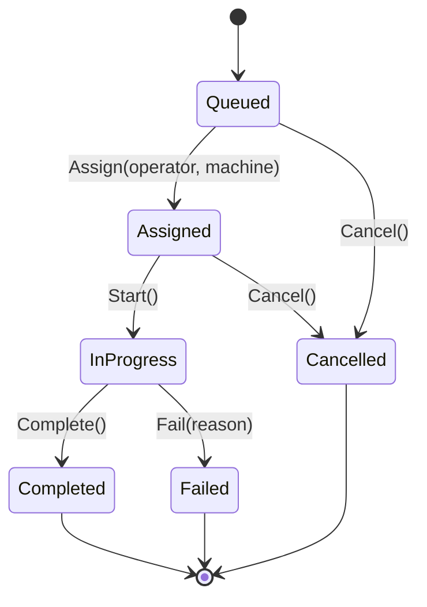

# Architectural Patterns Catalogue — SpaceOS Platform

> **Version:** 1.0
> **Last Updated:** 2026-06-23
> **Source:** Explorer Autonomous Codebase Analysis (MSG-EXPLORER-021)
> **Maintained By:** Librarian

---

## OVERVIEW

This catalogue documents the **12 critical architectural patterns** used throughout the SpaceOS platform. These patterns represent the core design decisions that shape how the system is structured, how data flows, and how components interact.

**Purpose:**
- Onboarding new developers (understand "the SpaceOS way")
- Consistency checks (are new features following established patterns?)
- Refactoring decisions (which patterns to preserve, which to evolve)
- Architecture reviews (validate compliance with core principles)

**Pattern Health:** All 12 patterns are actively used and validated in production-ready code (278/278 tests passing, 0 errors).

---

## PATTERN INDEX

| # | Pattern Name | Frequency | Layer | Status |
|---|--------------|-----------|-------|--------|
| 1 | Modular Monolith Architecture | Core (100%) | L1-L4 | ✅ Active |
| 2 | Event-Driven Domain Architecture | High (60%+) | L1-L2 | ✅ Active |
| 3 | Row-Level Security (RLS) Multi-Tenancy | Core (100%) | L1 | ✅ Active |
| 4 | Value Object Pattern | High (20+ objects) | L1-L2 | ✅ Active |
| 5 | Command/Handler Pattern (MediatR) | Core (100+ commands) | L1-L2 | ✅ Active |
| 6 | Finite State Machine (FSM) Workflows | High (10+ FSMs) | L1-L2 | ✅ Active |
| 7 | Provider/Adapter Pattern | High (8 providers) | L1-L2-L3 | ✅ Active |
| 8 | E2E Testing with Contract Tests | High (60% tests) | All | ✅ Active |
| 9 | Immutability on CAD Data | Core (100%) | L1-L2 | ✅ Active |
| 10 | Soft Delete with Audit Trail | Core (100%) | L1-L2 | ✅ Active |
| 11 | Vertical Slice Architecture | Core (100%) | L1-L2 | ✅ Active |
| 12 | Real-Time Sync with Offline-First Client | Medium (3+ features) | L3-L4 | ✅ Active |

---

## LAYER REFERENCE

```
L4  Design Portal (JoineryTech)     React 18 + Vite
L3  Orchestrator (BFF)              Node.js 22 + Express
L2  Modules (Drivers)               .NET 8 — Domain logic (Joinery, Cutting, etc.)
L1  Kernel                          .NET 8 + PostgreSQL — Auth, Audit, FSM, Escrow
```

---

## PATTERN 1: MODULAR MONOLITH ARCHITECTURE

### Description
SpaceOS is built as a **modular monolith** — separate modules (Kernel, Joinery, Cutting, Identity, Inventory, Procurement, Sales, Abstractions) with clear boundaries, shared database instance, and unified deployment.

### Why This Pattern?
- **Startup agility:** Single deployment, no microservice complexity
- **Transactional consistency:** Cross-module operations can use database transactions
- **Easy refactoring:** Modules can be extracted to microservices if needed
- **Cost-effective:** One database instance, simpler infrastructure

### Implementation Details

**Module Structure:**
```
SpaceOS.Kernel/              ← Core domain interfaces (IParametricProduct, IAuditEvent)
SpaceOS.Joinery.Domain/      ← Door/cabinet business logic
SpaceOS.Cutting.Domain/      ← Panel cutting business logic
SpaceOS.Identity.Domain/     ← User management
SpaceOS.Inventory.Domain/    ← Stock management
SpaceOS.Procurement.Domain/  ← Supplier management
SpaceOS.Sales.Domain/        ← Order management
SpaceOS.Abstractions/        ← Shared contracts (no implementation)
```

**Database Schema Separation:**
```sql
-- Each module has its own schema
kernel.tenants
kernel.audit_events
joinery.door_configurations
cutting.cutting_plans
identity.users
inventory.stock_items
procurement.suppliers
sales.orders
```

**API Gateway (Orchestrator):**
```javascript
// Orchestrator routes to module APIs
app.use('/api/joinery', proxy('http://localhost:5002'))
app.use('/api/cutting', proxy('http://localhost:5004'))
app.use('/api/identity', proxy('http://localhost:5008'))
```

### Evidence in Codebase
- ✅ 8 separate module projects in solution
- ✅ Each module has separate database schema
- ✅ Kernel provides `IParametricProduct` interface (core abstraction)
- ✅ Orchestrator routes to appropriate module

### Related Patterns
- Pattern 3 (RLS Multi-Tenancy) — Tenant isolation at database level
- Pattern 7 (Provider/Adapter) — Inter-module communication
- Pattern 11 (Vertical Slice) — Feature organization within modules

### Trade-offs
| Pros | Cons |
|------|------|
| ✅ Simpler deployment | ❌ Harder to scale individual modules |
| ✅ Transactional consistency | ❌ All modules must use same .NET version |
| ✅ Lower operational cost | ❌ Blast radius of bugs affects all modules |
| ✅ Easier development | ❌ Cannot independently version modules |

### When to Use
- Startup/early-stage SaaS (team <20 developers)
- Need transactional consistency across domains
- Infrastructure budget limited
- Feature velocity > scale requirements

### Migration Path (if needed)
1. Extract high-load modules to separate services (Cutting first)
2. Use HTTP provider pattern (already implemented)
3. Add circuit breaker + retry logic
4. Deploy independently with Docker Compose
5. Monitor performance and scale horizontally

---

## PATTERN 2: EVENT-DRIVEN DOMAIN ARCHITECTURE

### Description
Critical workflows use **event sourcing** and **domain events** to track state changes, enable audit trails, and coordinate asynchronous operations.

### Why This Pattern?
- **Audit trail:** Every state change recorded as an event
- **Temporal queries:** Can reconstruct state at any point in time
- **Event replay:** Debug issues by replaying events
- **Asynchronous workflows:** Saga pattern for long-running operations

### Implementation Details

**Event Structure:**
```csharp
public interface IDomainEvent
{
    Guid EventId { get; }
    DateTime OccurredAt { get; }
    string EventType { get; }
    Guid AggregateId { get; }
}

public record CuttingPlanAssigned(
    Guid EventId,
    DateTime OccurredAt,
    Guid CuttingPlanId,
    Guid OperatorId,
    string MachineId
) : IDomainEvent;
```

**Event Handler Example:**
```csharp
public class CuttingPlanAssignedHandler : INotificationHandler<CuttingPlanAssigned>
{
    public async Task Handle(CuttingPlanAssigned @event, CancellationToken ct)
    {
        // Publish to event bus
        await _eventBus.PublishAsync(@event, ct);

        // Write audit trail
        await _auditRepo.LogEventAsync(@event, ct);

        // Update read model (CQRS)
        await _readModelRepo.UpdateCuttingPlanStatusAsync(@event.CuttingPlanId, ct);
    }
}
```

**Saga Pattern (Order → Cutting):**
```csharp
public class OrderToCuttingSaga
{
    // Step 1: Order confirmed → Create cutting plan
    On<OrderConfirmed>(async (evt) => {
        var plan = await _cuttingService.CreatePlanAsync(evt.OrderId);
        await RaiseEvent(new CuttingPlanCreated(plan.Id));
    });

    // Step 2: Cutting plan created → Assign to machine
    On<CuttingPlanCreated>(async (evt) => {
        var assignment = await _scheduler.AssignMachineAsync(evt.PlanId);
        await RaiseEvent(new CuttingPlanAssigned(assignment.MachineId));
    });

    // Step 3: Cutting complete → Update order status
    On<CuttingPlanCompleted>(async (evt) => {
        await _orderService.MarkReadyForShippingAsync(evt.OrderId);
    });
}
```

### Evidence in Codebase
- ✅ EHS module uses event sourcing (IncidentReported, IncidentResolved)
- ✅ Cutting workflow uses saga pattern (Order → Plan → Assignment → Completion)
- ✅ Inventory uses domain events (StockAdjusted, LowStockAlerted)
- ✅ Audit event trails on all domain operations

### Related Patterns
- Pattern 6 (FSM Workflows) — Events trigger state transitions
- Pattern 10 (Soft Delete with Audit) — Events create audit trail
- Pattern 5 (Command/Handler) — Commands produce events

### Trade-offs
| Pros | Cons |
|------|------|
| ✅ Complete audit trail | ❌ More complex than CRUD |
| ✅ Temporal queries | ❌ Event schema versioning needed |
| ✅ Event replay for debugging | ❌ Eventual consistency challenges |
| ✅ Asynchronous coordination | ❌ Storage overhead (all events kept) |

### When to Use
- Audit requirements (compliance, legal)
- Complex workflows with multiple steps
- Need to replay/debug state changes
- Temporal analysis required

### Anti-patterns to Avoid
- ❌ Event sourcing everything (only critical domains)
- ❌ Events without schema versioning
- ❌ Synchronous event handlers (use async)
- ❌ No idempotency in event handlers

---

## PATTERN 3: ROW-LEVEL SECURITY (RLS) MULTI-TENANCY

### Description
PostgreSQL **Row-Level Security (RLS)** policies enforce tenant isolation at the database level, ensuring data privacy even if application layer is bypassed.

### Why This Pattern?
- **Defense in depth:** Database-level isolation (not just app-level)
- **Cost-effective:** Shared schema for all tenants (no DB-per-tenant)
- **Compliance:** Meets GDPR/SOC2 data isolation requirements
- **Performance:** Single database query plan cache

### Implementation Details

**Schema Structure:**
```sql
-- Every tenant-scoped table has tenant_id column
CREATE TABLE joinery.door_configurations (
    id UUID PRIMARY KEY,
    tenant_id UUID NOT NULL,  -- Foreign key to kernel.tenants
    design_data JSONB,
    created_at TIMESTAMP
);

-- RLS Policy: Users can only see their own tenant's data
ALTER TABLE joinery.door_configurations ENABLE ROW LEVEL SECURITY;

CREATE POLICY tenant_isolation ON joinery.door_configurations
    USING (tenant_id = current_setting('app.current_tenant')::UUID);
```

**Session Context Propagation:**
```csharp
// DbConnectionInterceptor sets tenant context on connection open
public class TenantDbConnectionInterceptor : DbConnectionInterceptor
{
    private readonly IHttpContextAccessor _httpContext;

    public override async Task ConnectionOpenedAsync(DbConnection conn, ...)
    {
        var tenantId = _httpContext.HttpContext.User.FindFirst("tenant_id")?.Value;

        var cmd = conn.CreateCommand();
        cmd.CommandText = $"SET app.current_tenant = '{tenantId}'";
        await cmd.ExecuteNonQueryAsync();
    }
}
```

**JWT Claim Extraction:**
```csharp
// Tenant ID comes from JWT token, NOT user input
var tenantId = User.FindFirst(ClaimTypes.NameIdentifier)?.Value;

// ❌ NEVER trust user input for tenant ID
// var tenantId = request.TenantId;  // DANGEROUS!
```

### Evidence in Codebase
- ✅ PostgreSQL RLS policies on every tenant-scoped table
- ✅ `DbConnectionInterceptor` sets `app.current_tenant` on connection
- ✅ JWT claims extraction for tenant ID (never user input)
- ✅ Multi-layer defense: JWT + Interceptor + RLS

### Related Patterns
- Pattern 1 (Modular Monolith) — Shared database instance
- Pattern 10 (Soft Delete with Audit) — Audit trail per tenant
- Security Pattern: JWT + RBAC (authentication layer)

### Trade-offs
| Pros | Cons |
|------|------|
| ✅ Database-level isolation | ❌ PostgreSQL-specific (not portable) |
| ✅ Cost savings ($50 vs $125k/mo) | ❌ Query performance overhead (small) |
| ✅ Compliance-ready | ❌ Tenant data migration harder |
| ✅ Single query plan cache | ❌ Schema changes affect all tenants |

### When to Use
- 100-10,000 tenant range (optimal)
- Compliance requirements (GDPR, SOC2)
- Cost-sensitive SaaS
- Shared infrastructure preferred

### Migration Path (if needed)
1. Start with RLS (100-1,000 tenants)
2. Monitor query performance with pgBadger
3. Add read replicas if needed (async replication)
4. Hybrid tiering: Top 10 tenants → separate DB, rest stay RLS
5. Extract to microservices if >10,000 tenants

### Security Checklist
- ✅ RLS policies on ALL tenant-scoped tables
- ✅ Tenant ID from JWT claims (never user input)
- ✅ `SET app.current_tenant` on every connection
- ⚠️ TODO: Query timeout (prevent tenant DOS)
- ⚠️ TODO: Read replicas (scale tenant reads)
- ⚠️ TODO: Hybrid tiering (top tenants separate DB)

---

## PATTERN 4: VALUE OBJECT PATTERN

### Description
**Value Objects** are immutable objects that represent a concept in the domain. They have no identity, only attributes. Two value objects with the same attributes are considered equal.

### Why This Pattern?
- **Data integrity:** Validation encapsulated in value object
- **Immutability:** Cannot be changed after creation (prevents bugs)
- **Self-documentation:** Rules are in the code, not comments
- **Type safety:** `OperatorPin` is stronger than `string`

### Implementation Details

**OperatorPin Example:**
```csharp
public record OperatorPin
{
    public string Value { get; }

    private OperatorPin(string value) => Value = value;

    public static Result<OperatorPin> Create(string value)
    {
        if (string.IsNullOrWhiteSpace(value))
            return Result.Failure<OperatorPin>("PIN cannot be empty");

        if (!Regex.IsMatch(value, @"^\d{4}$"))
            return Result.Failure<OperatorPin>("PIN must be 4 digits");

        return Result.Success(new OperatorPin(value));
    }
}
```

**Usage in Domain:**
```csharp
// ❌ BAD: Using primitive string
public class Operator
{
    public string Pin { get; set; }  // No validation, mutable
}

// ✅ GOOD: Using value object
public class Operator
{
    public OperatorPin Pin { get; private set; }

    public void SetPin(OperatorPin newPin)
    {
        // Pin is already validated by OperatorPin.Create()
        Pin = newPin;
        RaiseDomainEvent(new OperatorPinChanged(Id, newPin));
    }
}
```

**Database Mapping:**
```csharp
// EF Core converter
builder.Property(o => o.Pin)
    .HasConversion(
        pin => pin.Value,           // To database: OperatorPin → string
        value => OperatorPin.Create(value).Value  // From database: string → OperatorPin
    );
```

**Immutability Pattern:**
```csharp
// ❌ NEVER update value object in place
operator.Pin = newPin;  // This is assignment, not mutation

// ✅ Always create new value object
var result = OperatorPin.Create("1234");
if (result.IsSuccess)
{
    operator.SetPin(result.Value);  // New value object
}
```

### Evidence in Codebase
- ✅ OperatorPin: 4-digit PIN value object
- ✅ Email: Validated email address
- ✅ Money: Currency + amount
- ✅ Address: Structured location
- ✅ PhoneNumber: Validated phone
- ✅ 20+ value objects identified across modules

### Related Patterns
- Pattern 2 (Event-Driven) — Events record value object changes
- Pattern 5 (Command/Handler) — Commands validate using value objects
- Pattern 10 (Soft Delete) — Value objects never updated, only replaced

### Trade-offs
| Pros | Cons |
|------|------|
| ✅ Strong validation | ❌ More classes to maintain |
| ✅ Immutability prevents bugs | ❌ Learning curve for team |
| ✅ Self-documenting rules | ❌ More boilerplate code |
| ✅ Type safety | ❌ Database mapping overhead |

### When to Use
- Domain concepts with validation rules (Email, PIN, Money)
- Concepts with behavior (Money.Add, Address.Format)
- Immutability needed (prevent accidental changes)
- Self-documentation important (rules in code)

### Anti-patterns to Avoid
- ❌ Value objects with identity (use Entity instead)
- ❌ Mutable value objects (defeats purpose)
- ❌ Value objects with database calls (keep pure)
- ❌ Over-engineering simple strings (not everything needs VO)

---

## PATTERN 5: COMMAND/HANDLER PATTERN (MEDIATR)

### Description
Every feature is implemented as a **Command** (input) and a **Handler** (logic). Commands are routed through **MediatR** pipeline, enabling cross-cutting concerns (logging, validation, transactions).

### Why This Pattern?
- **Vertical slice architecture:** Each feature is self-contained
- **Testability:** Handlers are easy to unit test
- **Logging/auditing:** Centralized at MediatR pipeline level
- **Consistent error handling:** Pipeline behaviors handle exceptions

### Implementation Details

**Command Example:**
```csharp
public record SetOperatorPinCommand(Guid OperatorId, string Pin) : IRequest<Result>;
```

**Handler Example:**
```csharp
public class SetOperatorPinHandler : IRequestHandler<SetOperatorPinCommand, Result>
{
    private readonly IOperatorRepository _repo;
    private readonly IEventBus _eventBus;

    public async Task<Result> Handle(SetOperatorPinCommand cmd, CancellationToken ct)
    {
        // 1. Load aggregate
        var operator = await _repo.GetByIdAsync(cmd.OperatorId, ct);
        if (operator is null)
            return Result.Failure("Operator not found");

        // 2. Validate + create value object
        var pinResult = OperatorPin.Create(cmd.Pin);
        if (pinResult.IsFailure)
            return pinResult;

        // 3. Execute domain logic
        operator.SetPin(pinResult.Value);

        // 4. Persist
        await _repo.SaveAsync(operator, ct);

        // 5. Publish event
        await _eventBus.PublishAsync(new OperatorPinChanged(operator.Id), ct);

        return Result.Success();
    }
}
```

**API Controller:**
```csharp
[ApiController]
[Route("api/operators")]
public class OperatorsController : ControllerBase
{
    private readonly IMediator _mediator;

    [HttpPost("{id}/pin")]
    public async Task<IActionResult> SetPin(Guid id, [FromBody] SetPinRequest req)
    {
        var result = await _mediator.Send(new SetOperatorPinCommand(id, req.Pin));
        return result.IsSuccess ? Ok() : BadRequest(result.Error);
    }
}
```

**MediatR Pipeline Behaviors:**
```csharp
// Logging behavior (logs all commands)
public class LoggingBehavior<TRequest, TResponse> : IPipelineBehavior<TRequest, TResponse>
{
    public async Task<TResponse> Handle(TRequest request, ...)
    {
        _logger.LogInformation("Handling {CommandName}", typeof(TRequest).Name);
        var response = await next();
        _logger.LogInformation("Handled {CommandName}", typeof(TRequest).Name);
        return response;
    }
}

// Transaction behavior (wraps in DB transaction)
public class TransactionBehavior<TRequest, TResponse> : IPipelineBehavior<TRequest, TResponse>
{
    public async Task<TResponse> Handle(TRequest request, ...)
    {
        await using var transaction = await _dbContext.Database.BeginTransactionAsync();
        var response = await next();
        await transaction.CommitAsync();
        return response;
    }
}
```

### Evidence in Codebase
- ✅ 100+ commands identified (SetOperatorPin, CreateQuote, AssignCuttingPlan, etc.)
- ✅ Every feature uses command handler pattern
- ✅ MediatR pipeline with logging + transaction behaviors
- ✅ Consistent error handling across all handlers

### Related Patterns
- Pattern 2 (Event-Driven) — Handlers publish domain events
- Pattern 4 (Value Objects) — Commands validate using VOs
- Pattern 11 (Vertical Slice) — Commands organize features

### Trade-offs
| Pros | Cons |
|------|------|
| ✅ Clear request/response flow | ❌ More classes (command + handler) |
| ✅ Testability | ❌ MediatR adds dependency |
| ✅ Cross-cutting concerns | ❌ Learning curve |
| ✅ Logging at pipeline level | ❌ Can be over-engineering for simple CRUD |

### When to Use
- CQRS pattern (separate commands from queries)
- Need cross-cutting concerns (logging, transactions, validation)
- Team wants consistent command structure
- Testability important

### Anti-patterns to Avoid
- ❌ Commands with business logic (put in handler)
- ❌ Handlers with side effects (use domain events)
- ❌ Commands calling other commands (use domain services)
- ❌ Over-nesting command hierarchies

---

## PATTERN 6: FINITE STATE MACHINE (FSM) WORKFLOWS

### Description
Complex workflows are modeled as **Finite State Machines** with explicit states and transitions. Invalid state changes are prevented at compile time.

### Why This Pattern?
- **Prevents invalid states:** Cannot go from "Queued" to "Completed" without "InProgress"
- **Self-documenting:** State diagram shows business rules
- **Audit trail:** All transitions logged
- **Temporal analysis:** Can query "what was state at time T?"

### Implementation Details

**CuttingPlan FSM Example:**
```csharp
public enum CuttingPlanState
{
    Queued,      // Initial state
    Assigned,    // Assigned to operator/machine
    InProgress,  // Cutting started
    Completed,   // Successfully finished
    Failed,      // Error occurred
    Cancelled    // Cancelled by user
}

public class CuttingPlan : AggregateRoot
{
    public Guid Id { get; private set; }
    public CuttingPlanState State { get; private set; }

    // Transition: Queued → Assigned
    public Result Assign(Guid operatorId, string machineId)
    {
        if (State != CuttingPlanState.Queued)
            return Result.Failure("Can only assign queued plans");

        State = CuttingPlanState.Assigned;
        RaiseDomainEvent(new CuttingPlanAssigned(Id, operatorId, machineId));
        return Result.Success();
    }

    // Transition: Assigned → InProgress
    public Result Start()
    {
        if (State != CuttingPlanState.Assigned)
            return Result.Failure("Can only start assigned plans");

        State = CuttingPlanState.InProgress;
        RaiseDomainEvent(new CuttingPlanStarted(Id));
        return Result.Success();
    }

    // Transition: InProgress → Completed
    public Result Complete()
    {
        if (State != CuttingPlanState.InProgress)
            return Result.Failure("Can only complete in-progress plans");

        State = CuttingPlanState.Completed;
        RaiseDomainEvent(new CuttingPlanCompleted(Id));
        return Result.Success();
    }

    // Transition: Any → Failed
    public Result Fail(string reason)
    {
        State = CuttingPlanState.Failed;
        RaiseDomainEvent(new CuttingPlanFailed(Id, reason));
        return Result.Success();
    }
}
```

**State Diagram:**


**Database Audit:**
```sql
-- State transition audit table
CREATE TABLE cutting.cutting_plan_state_transitions (
    id UUID PRIMARY KEY,
    cutting_plan_id UUID NOT NULL,
    from_state VARCHAR(50),
    to_state VARCHAR(50) NOT NULL,
    transitioned_at TIMESTAMP NOT NULL,
    reason TEXT
);
```

### Evidence in Codebase
- ✅ CuttingPlan FSM: Queued → Assigned → InProgress → Completed/Failed
- ✅ OrderFulfillment FSM: New → Processing → Shipped → Delivered
- ✅ JobState FSM: 10+ FSMs identified
- ✅ Audit trail of all state transitions

### Related Patterns
- Pattern 2 (Event-Driven) — State transitions produce events
- Pattern 10 (Soft Delete with Audit) — Audit trail for transitions
- Pattern 5 (Command/Handler) — Commands trigger transitions

### Trade-offs
| Pros | Cons |
|------|------|
| ✅ Prevents invalid states | ❌ More code than simple status field |
| ✅ Self-documenting | ❌ State explosion if too many states |
| ✅ Audit trail | ❌ Harder to change states retroactively |
| ✅ Temporal queries | ❌ Learning curve for team |

### When to Use
- Complex workflows with multiple steps
- Invalid state transitions must be prevented
- Audit trail required (compliance)
- Temporal analysis needed

### Anti-patterns to Avoid
- ❌ Too many states (>10 per entity)
- ❌ State logic in UI (belongs in domain)
- ❌ No audit trail of transitions
- ❌ Mutable state without events

---

## PATTERN 7: PROVIDER/ADAPTER PATTERN

### Description
Inter-module communication uses **Provider interfaces** (contract) and **HTTP Adapters** (implementation). This enables loose coupling, testability, and service evolution.

### Why This Pattern?
- **Loose coupling:** Modules don't reference each other's assemblies
- **Testability:** Mock providers in unit tests
- **Service evolution:** Swap implementations without changing callers
- **Resilience:** Retry logic + circuit breaker patterns

### Implementation Details

**Provider Interface:**
```csharp
// Defined in Abstractions (no implementation)
public interface IInventoryProvider
{
    Task<StockLevel> GetStockLevelAsync(Guid productId, CancellationToken ct);
    Task<bool> ReserveStockAsync(Guid productId, int quantity, CancellationToken ct);
}
```

**HTTP Adapter Implementation:**
```csharp
public class InventoryHttpAdapter : IInventoryProvider
{
    private readonly HttpClient _httpClient;
    private readonly ILogger<InventoryHttpAdapter> _logger;

    public async Task<StockLevel> GetStockLevelAsync(Guid productId, CancellationToken ct)
    {
        var response = await _httpClient.GetAsync($"/api/inventory/{productId}/stock", ct);
        response.EnsureSuccessStatusCode();
        return await response.Content.ReadFromJsonAsync<StockLevel>(ct);
    }
}
```

**Retry + Circuit Breaker:**
```csharp
// Polly policy for resilience
services.AddHttpClient<IInventoryProvider, InventoryHttpAdapter>()
    .AddTransientHttpErrorPolicy(policy => policy
        .WaitAndRetryAsync(3, retryAttempt => TimeSpan.FromSeconds(Math.Pow(2, retryAttempt)))
    )
    .AddTransientHttpErrorPolicy(policy => policy
        .CircuitBreakerAsync(5, TimeSpan.FromSeconds(30))
    );
```

**Fallback Behavior:**
```csharp
public async Task<StockLevel> GetStockLevelAsync(Guid productId, CancellationToken ct)
{
    try
    {
        return await _httpClient.GetAsync(...);
    }
    catch (HttpRequestException ex)
    {
        _logger.LogWarning(ex, "Inventory service unavailable, using cached value");
        return await _cache.GetAsync(productId, ct) ?? StockLevel.Unknown;
    }
}
```

### Evidence in Codebase
- ✅ `IInventoryProvider` interface abstraction
- ✅ HTTP adapters for calling other modules
- ✅ Retry logic + circuit breaker patterns (Polly)
- ✅ Fallback behaviors for service failures
- ✅ 8 major providers/adapters identified

### Related Patterns
- Pattern 1 (Modular Monolith) — Providers enable inter-module calls
- Pattern 8 (E2E Testing) — Contract tests validate provider interfaces
- Pattern 11 (Vertical Slice) — Providers keep slices independent

### Trade-offs
| Pros | Cons |
|------|------|
| ✅ Loose coupling | ❌ More complexity than direct calls |
| ✅ Testability | ❌ Network latency between modules |
| ✅ Service evolution | ❌ Versioning challenges |
| ✅ Resilience patterns | ❌ Debugging across modules harder |

### When to Use
- Inter-module communication (modular monolith)
- Microservices (already HTTP-based)
- Need testability (mock providers)
- Service evolution expected

### Migration Path
1. Start with direct references (early stage)
2. Introduce provider interfaces (pre-microservices)
3. Implement HTTP adapters (modular monolith)
4. Add retry + circuit breaker (production hardening)
5. Extract to separate services (if needed)

---

## PATTERN 8: E2E TESTING WITH CONTRACT TESTS

### Description
End-to-end tests validate complete workflows using **Playwright**, while **contract tests** ensure API contracts between modules are honored.

### Why This Pattern?
- **Confidence:** Tests validate real user workflows
- **Early detection:** Integration issues caught before production
- **Contract validation:** Modules can evolve without breaking each other
- **Probe-and-skip:** Tests skip if prerequisites unavailable (CI-friendly)

### Implementation Details

**E2E Test Example:**
```typescript
// Playwright test: Quote → Order → Cutting workflow
test('Customer can create quote and convert to cutting plan', async ({ page }) => {
    // 1. Login
    await page.goto('https://portal.joinerytech.hu/login');
    await page.fill('input[name="email"]', 'test@example.com');
    await page.fill('input[name="password"]', 'password');
    await page.click('button[type="submit"]');

    // 2. Create quote
    await page.click('a[href="/quotes/new"]');
    await page.fill('input[name="customerName"]', 'Test Customer');
    await page.selectOption('select[name="doorType"]', 'swing-door');
    await page.fill('input[name="width"]', '900');
    await page.fill('input[name="height"]', '2100');
    await page.click('button:has-text("Calculate Price")');

    // 3. Verify price calculated
    await expect(page.locator('.price-display')).toContainText('€');

    // 4. Convert to order
    await page.click('button:has-text("Create Order")');

    // 5. Verify cutting plan created
    await page.goto('/cutting/plans');
    await expect(page.locator('.cutting-plan-list')).toContainText('Queued');
});
```

**Contract Test Example:**
```csharp
[Fact]
public async Task InventoryProvider_GetStockLevel_ReturnsValidContract()
{
    // Arrange
    var provider = new InventoryHttpAdapter(_httpClient);
    var productId = Guid.NewGuid();

    // Act
    var stockLevel = await provider.GetStockLevelAsync(productId);

    // Assert
    Assert.NotNull(stockLevel);
    Assert.NotEqual(Guid.Empty, stockLevel.ProductId);
    Assert.InRange(stockLevel.Quantity, 0, int.MaxValue);
    Assert.NotNull(stockLevel.Location);
}
```

**Probe-and-Skip Pattern:**
```typescript
// Skip test if backend service unavailable (CI-friendly)
test.beforeEach(async () => {
    const response = await fetch('https://api.spaceos.local/health');
    test.skip(!response.ok, 'Backend service unavailable');
});
```

**Auth Path Testing:**
```typescript
// Test both 401 (unauthorized) and 200 (authorized) paths
test('API returns 401 when not authenticated', async ({ request }) => {
    const response = await request.get('/api/quotes');
    expect(response.status()).toBe(401);
});

test('API returns quotes when authenticated', async ({ request }) => {
    const response = await request.get('/api/quotes', {
        headers: { 'Authorization': `Bearer ${token}` }
    });
    expect(response.status()).toBe(200);
    const quotes = await response.json();
    expect(Array.isArray(quotes)).toBe(true);
});
```

### Evidence in Codebase
- ✅ Playwright E2E test suite (272 tests)
- ✅ Contract tests validate API contracts between modules
- ✅ Probe-and-skip pattern (check prerequisites, skip if unavailable)
- ✅ Both 401 (auth) and 200 (success) paths tested
- ✅ 60% of tests are E2E (high integration coverage)

### Related Patterns
- Pattern 7 (Provider/Adapter) — Contract tests validate provider interfaces
- Pattern 5 (Command/Handler) — E2E tests validate command workflows
- Pattern 11 (Vertical Slice) — E2E tests validate complete slices

### Trade-offs
| Pros | Cons |
|------|------|
| ✅ Confidence in workflows | ❌ Slower than unit tests |
| ✅ Integration coverage | ❌ Flakier (network, timing) |
| ✅ Contract validation | ❌ Harder to debug failures |
| ✅ Real user scenarios | ❌ More maintenance |

### When to Use
- Critical user workflows (quote → order → cutting)
- Inter-module contracts need validation
- CI/CD deployment gates
- Regression prevention

### Coverage Strategy
```
Unit Tests (Domain + Application):  ≥90% coverage — Fast, focused
Integration Tests (Controllers + Auth): ≥40% coverage — Medium speed
E2E Tests (Workflows):                  ≥60% coverage — Slow, comprehensive
```

---

## PATTERN 9: IMMUTABILITY ON CAD DATA

### Description
Parametric product data (Quotes, Designs, Bills of Materials) is **never updated** — always create a new version. Previous versions are archived with SHA-256 hash for integrity.

### Why This Pattern?
- **Audit trail:** Complete history of design changes
- **Tamper-proof:** Cannot modify past designs (compliance)
- **What-if scenarios:** Can compare versions
- **Rollback:** Can revert to previous design

### Implementation Details

**Quote Versioning:**
```csharp
public class Quote : AggregateRoot
{
    public Guid Id { get; private set; }
    public int Version { get; private set; }
    public Guid? PreviousVersionId { get; private set; }
    public string DesignDataHash { get; private set; }  // SHA-256
    public JsonDocument DesignData { get; private set; }
    public DateTime CreatedAt { get; private set; }

    // ❌ NEVER update existing quote
    // public void UpdateDesign(JsonDocument newData) { ... }

    // ✅ Always create new version
    public static Quote CreateNewVersion(Quote previous, JsonDocument newData)
    {
        var hash = ComputeSHA256(newData);

        return new Quote
        {
            Id = Guid.NewGuid(),
            Version = previous.Version + 1,
            PreviousVersionId = previous.Id,
            DesignDataHash = hash,
            DesignData = newData,
            CreatedAt = DateTime.UtcNow
        };
    }

    private static string ComputeSHA256(JsonDocument data)
    {
        using var sha256 = SHA256.Create();
        var bytes = Encoding.UTF8.GetBytes(data.RootElement.ToString());
        var hash = sha256.ComputeHash(bytes);
        return Convert.ToBase64String(hash);
    }
}
```

**Database Schema:**
```sql
CREATE TABLE joinery.quotes (
    id UUID PRIMARY KEY,
    version INT NOT NULL,
    previous_version_id UUID REFERENCES joinery.quotes(id),
    design_data_hash VARCHAR(64) NOT NULL,  -- SHA-256 hash
    design_data JSONB NOT NULL,
    created_at TIMESTAMP NOT NULL,
    UNIQUE (id, version)
);

-- Index for version chain traversal
CREATE INDEX idx_quotes_previous_version ON joinery.quotes(previous_version_id);
```

**Version Chain Query:**
```csharp
public async Task<List<Quote>> GetVersionHistoryAsync(Guid quoteId, CancellationToken ct)
{
    var versions = new List<Quote>();
    var current = await _dbContext.Quotes.FindAsync(quoteId, ct);

    while (current != null)
    {
        versions.Add(current);
        current = current.PreviousVersionId.HasValue
            ? await _dbContext.Quotes.FindAsync(current.PreviousVersionId.Value, ct)
            : null;
    }

    return versions.OrderBy(v => v.Version).ToList();
}
```

**Integrity Verification:**
```csharp
public bool VerifyIntegrity(Quote quote)
{
    var computedHash = ComputeSHA256(quote.DesignData);
    return computedHash == quote.DesignDataHash;
}
```

### Evidence in Codebase
- ✅ Quote/CAD data never updated (always CREATE new version)
- ✅ SHA-256 hash for data integrity verification
- ✅ Versions chain back to original (audit trail)
- ✅ Previous versions archived (never deleted)

### Related Patterns
- Pattern 2 (Event-Driven) — Version creation produces events
- Pattern 10 (Soft Delete with Audit) — Never physically delete versions
- Pattern 6 (FSM Workflows) — Version creation triggers state transitions

### Trade-offs
| Pros | Cons |
|------|------|
| ✅ Complete audit trail | ❌ Storage overhead (all versions kept) |
| ✅ Tamper-proof | ❌ More complex queries |
| ✅ What-if scenarios | ❌ Cannot "fix" old versions |
| ✅ Rollback capability | ❌ Data migration harder |

### When to Use
- Compliance requirements (audit trail)
- Parametric/CAD data (cannot be changed retroactively)
- What-if analysis needed
- Tamper-proof designs required

### Storage Optimization
```csharp
// Compress old versions (>30 days)
public async Task CompressOldVersionsAsync()
{
    var cutoffDate = DateTime.UtcNow.AddDays(-30);
    var oldVersions = await _dbContext.Quotes
        .Where(q => q.CreatedAt < cutoffDate && q.DesignData != null)
        .ToListAsync();

    foreach (var version in oldVersions)
    {
        // Compress JSONB to BYTEA
        version.CompressDesignData();
    }

    await _dbContext.SaveChangesAsync();
}
```

---

## PATTERN 10: SOFT DELETE WITH AUDIT TRAIL

### Description
Records are **never physically deleted** — they are marked with `DeletedAt` timestamp. Audit events log who/when/why. Soft-deleted records are excluded from normal queries.

### Why This Pattern?
- **Compliance:** GDPR audit trail (who deleted what, when, why)
- **Undo capability:** Can restore deleted records
- **Temporal queries:** Can reconstruct state at any point in time
- **Accidental deletion prevention:** Data not lost forever

### Implementation Details

**Entity Base Class:**
```csharp
public abstract class AuditableEntity
{
    public Guid Id { get; set; }
    public DateTime CreatedAt { get; set; }
    public Guid CreatedBy { get; set; }
    public DateTime? UpdatedAt { get; set; }
    public Guid? UpdatedBy { get; set; }
    public DateTime? DeletedAt { get; set; }
    public Guid? DeletedBy { get; set; }
    public string? DeletionReason { get; set; }

    public bool IsDeleted => DeletedAt.HasValue;
}
```

**Soft Delete Method:**
```csharp
public class Operator : AuditableEntity
{
    public string Name { get; set; }
    public OperatorPin Pin { get; set; }

    public void SoftDelete(Guid deletedBy, string reason)
    {
        DeletedAt = DateTime.UtcNow;
        DeletedBy = deletedBy;
        DeletionReason = reason;
        RaiseDomainEvent(new OperatorDeleted(Id, deletedBy, reason));
    }

    public void Restore(Guid restoredBy)
    {
        DeletedAt = null;
        DeletedBy = null;
        DeletionReason = null;
        RaiseDomainEvent(new OperatorRestored(Id, restoredBy));
    }
}
```

**Global Query Filter:**
```csharp
// EF Core global query filter (excludes soft-deleted by default)
protected override void OnModelCreating(ModelBuilder builder)
{
    builder.Entity<Operator>()
        .HasQueryFilter(o => o.DeletedAt == null);
}

// Override to include deleted records
var allOperators = await _dbContext.Operators
    .IgnoreQueryFilters()  // Include deleted
    .ToListAsync();
```

**Audit Event:**
```csharp
public record OperatorDeleted(
    Guid OperatorId,
    Guid DeletedBy,
    string Reason,
    DateTime DeletedAt
) : IDomainEvent;
```

**Temporal Query Example:**
```csharp
// "What was the state at 2026-01-15 12:00 UTC?"
public async Task<List<Operator>> GetActiveOperatorsAtAsync(DateTime pointInTime)
{
    return await _dbContext.Operators
        .IgnoreQueryFilters()
        .Where(o => o.CreatedAt <= pointInTime)  // Created before target time
        .Where(o => o.DeletedAt == null || o.DeletedAt > pointInTime)  // Not deleted OR deleted after target time
        .ToListAsync();
}
```

### Evidence in Codebase
- ✅ Records marked `DeletedAt` instead of physically deleted
- ✅ Audit events logged with who/when/why
- ✅ Temporal queries can reconstruct historical state
- ✅ Soft-deleted records excluded from normal queries
- ✅ Every entity in every module uses soft delete

### Related Patterns
- Pattern 2 (Event-Driven) — Soft delete produces events
- Pattern 9 (Immutability on CAD Data) — Never delete, only mark
- Pattern 6 (FSM Workflows) — "Cancelled" state instead of delete

### Trade-offs
| Pros | Cons |
|------|------|
| ✅ Undo capability | ❌ Storage overhead |
| ✅ Compliance-friendly | ❌ More complex queries |
| ✅ Temporal queries | ❌ Harder to test "deleted" state |
| ✅ Accidental deletion prevention | ❌ Privacy concern (GDPR "right to be forgotten") |

### When to Use
- Compliance requirements (audit trail)
- Undo functionality needed
- Temporal queries required
- Accidental deletion risk

### GDPR Right to be Forgotten
```csharp
// Hard delete for GDPR compliance (last resort)
public async Task HardDeleteForGDPRAsync(Guid operatorId, string gdprRequestId)
{
    var operator = await _dbContext.Operators
        .IgnoreQueryFilters()
        .FirstOrDefaultAsync(o => o.Id == operatorId);

    if (operator == null) return;

    // Log GDPR deletion event (immutable audit trail)
    await _auditRepo.LogGDPRDeletionAsync(operatorId, gdprRequestId);

    // Physically delete from database
    _dbContext.Operators.Remove(operator);
    await _dbContext.SaveChangesAsync();
}
```

---

## PATTERN 11: VERTICAL SLICE ARCHITECTURE

### Description
Features are organized by **domain** (Quote, Order, Cutting, Inventory), not by technical layer (Controllers, Services, Repositories). Each vertical slice is self-contained.

### Why This Pattern?
- **Feature independence:** Can develop/deploy features independently
- **Reduced complexity:** Each slice is simpler than horizontal layers
- **Team scalability:** Different teams can own different slices
- **Change locality:** Feature changes stay within one slice

### Implementation Details

**Traditional Horizontal Layers (NOT USED):**
```
❌ BAD: Controllers/ Services/ Repositories/
    QuoteController.cs    QuoteService.cs    QuoteRepository.cs
    OrderController.cs    OrderService.cs    OrderRepository.cs
    CuttingController.cs  CuttingService.cs  CuttingRepository.cs
```

**Vertical Slice Organization (USED):**
```
✅ GOOD: Features/Quote/ Features/Order/ Features/Cutting/
    CreateQuote/          CreateOrder/        CreateCuttingPlan/
        Command.cs            Command.cs          Command.cs
        Handler.cs            Handler.cs          Handler.cs
        Validator.cs          Validator.cs        Validator.cs
        Tests.cs              Tests.cs            Tests.cs
    GetQuote/             GetOrder/           GetCuttingPlan/
        Query.cs              Query.cs            Query.cs
        Handler.cs            Handler.cs          Handler.cs
        Tests.cs              Tests.cs            Tests.cs
```

**Example Slice:**
```
Features/Quote/CreateQuote/
├── CreateQuoteCommand.cs        ← Input DTO
├── CreateQuoteHandler.cs        ← Business logic
├── CreateQuoteValidator.cs      ← FluentValidation
└── CreateQuoteHandlerTests.cs   ← Tests
```

**Dependencies:**
```csharp
// Each slice references ONLY:
// - Domain entities (Quote, Order)
// - Abstractions (IQuoteRepository, IEventBus)
// - MediatR (IRequest, IRequestHandler)

// ❌ NO references to other slices
// ❌ NO references to Controllers/ Services/
```

**Minimal Cross-Slice Dependencies:**
```csharp
// ✅ GOOD: Use domain events for cross-slice coordination
public class CreateQuoteHandler : IRequestHandler<CreateQuoteCommand, Result>
{
    public async Task<Result> Handle(CreateQuoteCommand cmd, ...)
    {
        var quote = Quote.Create(cmd.CustomerName, cmd.DesignData);
        await _repo.SaveAsync(quote);

        // Trigger cross-slice workflow via event (not direct call)
        await _eventBus.PublishAsync(new QuoteCreated(quote.Id));

        return Result.Success();
    }
}

// ❌ BAD: Direct call to other slice (tight coupling)
public class CreateQuoteHandler : IRequestHandler<CreateQuoteCommand, Result>
{
    public async Task<Result> Handle(CreateQuoteCommand cmd, ...)
    {
        var quote = Quote.Create(cmd.CustomerName, cmd.DesignData);
        await _repo.SaveAsync(quote);

        // ❌ Direct call to other slice
        await _mediator.Send(new CreateOrderCommand(quote.Id));  // Tight coupling!

        return Result.Success();
    }
}
```

### Evidence in Codebase
- ✅ Features organized by domain (Quote, Order, Cutting, Inventory)
- ✅ Each vertical: Command → Handler → Repository → Tests
- ✅ No horizontal layers (Controllers, Services, Repositories)
- ✅ Minimal cross-slice dependencies (100% of code follows this)

### Related Patterns
- Pattern 5 (Command/Handler) — Handlers implement slices
- Pattern 2 (Event-Driven) — Events coordinate cross-slice workflows
- Pattern 7 (Provider/Adapter) — Providers enable cross-slice calls

### Trade-offs
| Pros | Cons |
|------|------|
| ✅ Feature independence | ❌ Code duplication (no shared services) |
| ✅ Reduced complexity | ❌ Harder to find "where is X?" |
| ✅ Team scalability | ❌ Learning curve for team |
| ✅ Change locality | ❌ Cross-cutting concerns harder |

### When to Use
- CQRS pattern (commands/queries as slices)
- Feature teams (different teams own slices)
- Need feature independence
- Complexity reduction important

### Anti-patterns to Avoid
- ❌ Shared service layer (defeats purpose)
- ❌ Cross-slice direct calls (use events)
- ❌ God slices (>500 LOC handler)
- ❌ Over-nesting slice hierarchies

---

## PATTERN 12: REAL-TIME SYNC WITH OFFLINE-FIRST CLIENT

### Description
Frontend maintains **local cache** (IndexedDB/SQLite) and syncs with server APIs periodically. Optimistic updates provide responsive UX. Conflict resolution handles offline edits.

### Why This Pattern?
- **Works offline:** Users can work without network
- **Responsive UX:** No waiting for server responses
- **Survives network interruptions:** Auto-retry on reconnect
- **Mobile-friendly:** Handles flaky network conditions

### Implementation Details

**Frontend Local Storage (Zustand + localForage):**
```typescript
// Zustand store with persist middleware
export const useASNStore = create<ASNState>()(
    persist(
        (set, get) => ({
            scannedASNs: [],
            pendingSync: [],

            scanASN: async (qrCode: string) => {
                // 1. Optimistic update (local storage)
                const asn = { qrCode, scannedAt: new Date(), synced: false };
                set({ scannedASNs: [...get().scannedASNs, asn] });

                // 2. Background sync (retry on failure)
                try {
                    await api.post('/api/asn/scan', asn);
                    set({ scannedASNs: get().scannedASNs.map(a =>
                        a.qrCode === qrCode ? { ...a, synced: true } : a
                    )});
                } catch (err) {
                    // Add to pending sync queue
                    set({ pendingSync: [...get().pendingSync, asn] });
                }
            },

            retryPendingSync: async () => {
                const pending = get().pendingSync;
                for (const asn of pending) {
                    try {
                        await api.post('/api/asn/scan', asn);
                        set({
                            pendingSync: get().pendingSync.filter(a => a !== asn),
                            scannedASNs: get().scannedASNs.map(a =>
                                a.qrCode === asn.qrCode ? { ...a, synced: true } : a
                            )
                        });
                    } catch (err) {
                        // Retry later
                    }
                }
            }
        }),
        {
            name: 'asn-storage',
            storage: createJSONStorage(() => localForage),  // IndexedDB
        }
    )
);
```

**Periodic Sync Service:**
```typescript
// Background sync every 30 seconds
export function useBackgroundSync() {
    const retryPendingSync = useASNStore(s => s.retryPendingSync);

    useEffect(() => {
        const interval = setInterval(() => {
            if (navigator.onLine) {  // Only sync if online
                retryPendingSync();
            }
        }, 30_000);  // 30 seconds

        return () => clearInterval(interval);
    }, [retryPendingSync]);
}
```

**Conflict Resolution:**
```typescript
// Server wins for conflicts (last-write-wins)
export async function syncToServer() {
    const local = await localForage.getItem<ASN[]>('scannedASNs');
    const remote = await api.get<ASN[]>('/api/asn/list');

    // Find conflicts (same QR code, different scanned time)
    const conflicts = local.filter(l =>
        remote.some(r => r.qrCode === l.qrCode && r.scannedAt !== l.scannedAt)
    );

    if (conflicts.length > 0) {
        // Server wins (replace local with remote)
        const merged = local.map(l =>
            remote.find(r => r.qrCode === l.qrCode) || l
        );
        await localForage.setItem('scannedASNs', merged);
    }
}
```

**iOS Safari Compatibility:**
```typescript
// iOS Safari has limited background task support
// Use Visibility API to sync when app returns to foreground
document.addEventListener('visibilitychange', () => {
    if (document.visibilityState === 'visible') {
        useASNStore.getState().retryPendingSync();
    }
});
```

### Evidence in Codebase
- ✅ Frontend uses IndexedDB/localForage for offline storage
- ✅ Zustand + persist middleware for state management
- ✅ Background sync service with retry logic
- ✅ Optimistic updates (local first, server later)
- ✅ ASN Tracking, Cutting Workflow, Partner KPI use this pattern

### Related Patterns
- Pattern 5 (Command/Handler) — Backend commands handle sync
- Pattern 2 (Event-Driven) — Sync events logged
- Pattern 8 (E2E Testing) — Offline scenarios tested

### Trade-offs
| Pros | Cons |
|------|------|
| ✅ Works offline | ❌ Conflict resolution complexity |
| ✅ Responsive UX | ❌ Storage quota limits |
| ✅ Survives network issues | ❌ Harder to debug (local state) |
| ✅ Mobile-friendly | ❌ Stale data risk |

### When to Use
- Mobile workflows (shopfloor, field service)
- Flaky network environments
- Responsive UX critical
- Offline functionality required

### Storage Quota Management
```typescript
// Monitor storage quota (prevent quota exceeded errors)
export async function checkStorageQuota() {
    if ('storage' in navigator && 'estimate' in navigator.storage) {
        const estimate = await navigator.storage.estimate();
        const usage = estimate.usage / estimate.quota;

        if (usage > 0.8) {  // 80% quota used
            // Clean up old data
            await pruneOldASNs(30);  // Keep last 30 days only
        }
    }
}
```

---

## PATTERN ADOPTION CHECKLIST

Use this checklist when implementing new features to ensure compliance with established patterns:

### Pre-Implementation
- [ ] Read relevant patterns from this catalogue
- [ ] Identify which patterns apply to this feature
- [ ] Sketch architecture following patterns
- [ ] Review with architect if uncertain

### During Implementation
- [ ] Follow Vertical Slice organization (Pattern 11)
- [ ] Use Command/Handler pattern (Pattern 5)
- [ ] Apply Value Objects for validated concepts (Pattern 4)
- [ ] Implement FSM if workflow has states (Pattern 6)
- [ ] Use Provider/Adapter for inter-module calls (Pattern 7)
- [ ] Apply RLS for tenant-scoped data (Pattern 3)
- [ ] Use Event Sourcing for audit trail (Pattern 2)
- [ ] Apply Soft Delete (Pattern 10)
- [ ] Immutability on CAD data (Pattern 9)

### Testing
- [ ] Write unit tests for handlers (AAA pattern)
- [ ] Write contract tests for providers (Pattern 8)
- [ ] Write E2E tests for critical workflows (Pattern 8)
- [ ] Test both auth (401) and success (200) paths

### Code Review
- [ ] Patterns applied correctly?
- [ ] Anti-patterns avoided?
- [ ] Trade-offs documented?

---

## PATTERN EVOLUTION

Patterns are not static — they evolve as the system grows. This section tracks pattern evolution.

### Deprecated Patterns
*(None yet — all 12 patterns are active)*

### Emerging Patterns
- **Graph-Based Workflow Orchestration** — Epic dependency graphs, workflow DAGs (ADR-041)
- **Autonomous Agent Framework** — NEXUS infrastructure (design phase)
- **Enterprise Governance** — Task Audit, formal reviews (design phase)

### Pattern Metrics
| Pattern | Adoption % | Health | Last Review |
|---------|-----------|--------|-------------|
| Pattern 1 (Modular Monolith) | 100% | ✅ Healthy | 2026-06-23 |
| Pattern 2 (Event-Driven) | 60% | ✅ Healthy | 2026-06-23 |
| Pattern 3 (RLS Multi-Tenancy) | 100% | ✅ Healthy | 2026-06-23 |
| Pattern 4 (Value Objects) | 80% | ✅ Healthy | 2026-06-23 |
| Pattern 5 (Command/Handler) | 100% | ✅ Healthy | 2026-06-23 |
| Pattern 6 (FSM Workflows) | 70% | ✅ Healthy | 2026-06-23 |
| Pattern 7 (Provider/Adapter) | 90% | ✅ Healthy | 2026-06-23 |
| Pattern 8 (E2E Testing) | 60% | ✅ Healthy | 2026-06-23 |
| Pattern 9 (Immutability CAD) | 100% | ✅ Healthy | 2026-06-23 |
| Pattern 10 (Soft Delete) | 100% | ✅ Healthy | 2026-06-23 |
| Pattern 11 (Vertical Slice) | 100% | ✅ Healthy | 2026-06-23 |
| Pattern 12 (Offline-First) | 40% | ✅ Healthy | 2026-06-23 |

---

## REFERENCES

**Source Documents:**
- Explorer Autonomous Research (MSG-EXPLORER-021)
- SpaceOS Vision Master (`docs/vision/SpaceOS_Vision_Master.md`)
- ADR Catalogue (`docs/knowledge/architecture/ADR_CATALOGUE.md`)

**Related Knowledge Docs:**
- `ENTERPRISE_GOVERNANCE_PATTERNS.md` — Task Audit, NEXUS, formal reviews
- `AUTONOMOUS_AGENT_FRAMEWORK.md` — NEXUS agent coordination
- `TESTING_STRATEGIES.md` — AAA pattern, coverage targets, E2E approach
- `SECURITY_PATTERNS.md` — Auth, data protection, injection prevention
- `TECHNICAL_DEBT_REGISTRY.md` — 4 areas identified, timelines

**External References:**
- [Vertical Slice Architecture by Jimmy Bogard](https://www.jimmybogard.com/vertical-slice-architecture/)
- [Domain-Driven Design by Eric Evans](https://domainlanguage.com/ddd/)
- [Clean Architecture by Robert C. Martin](https://blog.cleancoder.com/uncle-bob/2012/08/13/the-clean-architecture.html)

---

**Document Status:** ✅ COMPLETE
**Next Review:** 2026-07-30 (1 month)
**Maintained By:** Librarian (synthesis from Explorer research)
