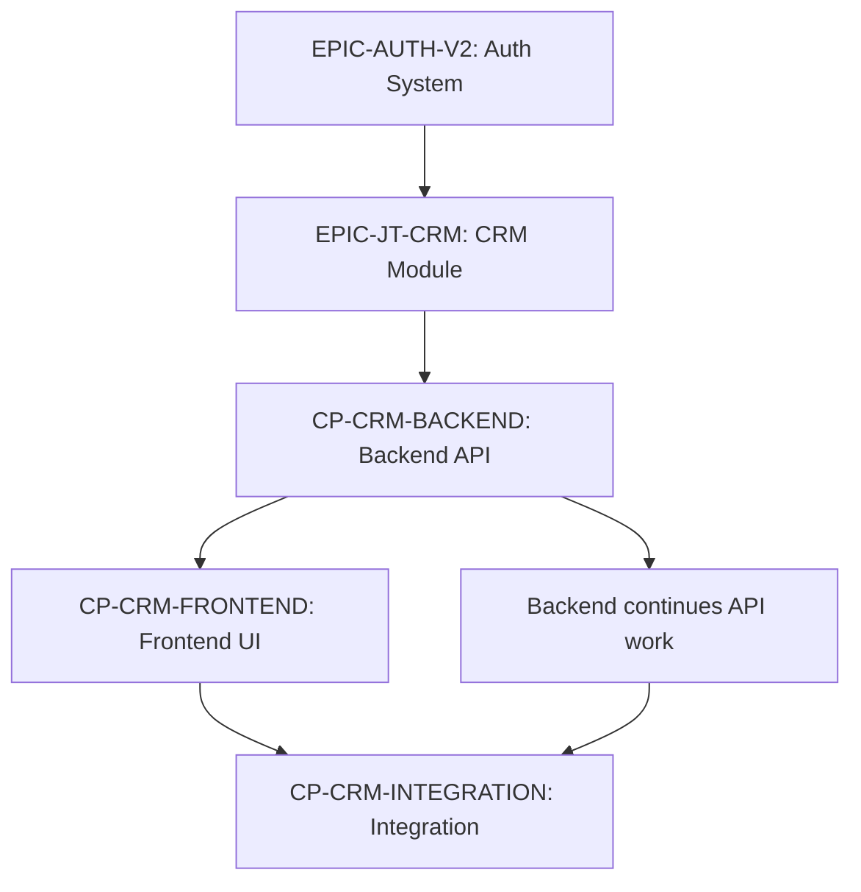

# Terminal Collaboration & Nexus Development Pattern

**Created:** 2026-07-02
**Status:** ACTIVE
**Category:** Meta-Development (Self-Improving Agent Infrastructure)

---

## Koncepció

A terminálok **nem csak használják** a Nexus infrastruktúrát, hanem **aktívan fejlesztik is**:
- Közös munka keretei megbeszélése
- Nexus tooling fejlesztése hatékonyság növelésére
- Self-improving agent infrastructure

Ez a **meta-level development** - az agent rendszer önmagát optimalizálja.

---

## Alapelvek

### 1. Terminálok Közötti Koordináció

**NEM:**
- ❌ Root mikromenedzsel minden interakciót
- ❌ Conductor minden apró dolgot delegál
- ❌ Terminálok izoláltan dolgoznak

**HANEM:**
- ✅ Terminálok **közvetlenül** koordinálnak egymással (MCP API)
- ✅ Közös munka keretei **átbeszélése** (Architect + Backend konzultáció)
- ✅ **Peer-to-peer kommunikáció** inbox/outbox-on keresztül
- ✅ Root csak **stratégiai eszkaláció** esetén avatkozik be

### 2. Nexus Tooling Fejlesztés

**Trigger:** Terminál felismeri hogy valami lassú/nehézkes/ismétlődő

**Workflow:**
```
1. Terminál azonosít egy pain point-ot
   → pl. "Minden session-ben manuálisan ellenőrzöm az EPICS.yaml-t"

2. Terminál inbox-ot ír Backend/Nexus-nak:
   → "MCP tool kérés: get_epic_dependencies(epic_id)"

3. Backend/Nexus implementálja az új tool-t

4. Terminál használja az új tool-t → hatékonyság nő

5. Knowledge dokumentáció frissül (Librarian)
```

**Példák:**
- `get_epic_dependencies()` - Epic dependency lekérdezés
- `get_critical_path()` - Critical path számítás
- `get_domain_focus()` - Aktuális domain fókusz
- `create_prioritized_inbox()` - Intelligent task creation
- `analyze_blocker_impact()` - Blocker dependency elemzés

### 3. Self-Improving Infrastructure

A rendszer **tanulja magát**:
- Monitor látja hogy sok task stuck → eszkalációs logika javítása
- Conductor látja hogy review-k lassúak → review automation fejlesztése
- Backend látja hogy API client generálás manuális → codegen tool létrehozása

---

## Konkrét Use Case-ek

### Use Case 1: Architect + Backend Collaboration

**Scenario:** Új DDD module tervezése (pl. JoineryTech Assembly modul)

**Workflow:**

1. **Conductor kioszt task-ot:**
   ```markdown
   MSG-ARCHITECT-042: JoineryTech Assembly Module Design
   MSG-BACKEND-106: Assembly Module Implementation
   ```

2. **Architect elkezdi a tervezést:**
   - Aggregate root definíció
   - FSM states
   - Domain events
   - Provider contracts

3. **Architect KÖZVETLENÜL Backend inbox-ot ír:**
   ```markdown
   ---
   from: architect
   to: backend
   type: consultation
   priority: medium
   ref: ASSEMBLY-MODULE
   ---

   # Assembly Module Design Draft - Review Request

   Kérlek nézd át a draft tervet és adj feedback:

   ## Aggregate Root
   - Assembly (id, orderId, status)
   - States: Draft → InProgress → QualityCheck → Completed

   ## Kérdések:
   1. Az AssemblyStep nested entity vagy külön aggregate?
   2. Worker assignment event-based vagy command-based?
   3. Quality check integration Abstractions-szel?
   ```

4. **Backend válaszol (outbox → Architect inbox):**
   ```markdown
   ---
   from: backend
   to: architect
   type: consultation-response
   ref: MSG-ARCHITECT-042
   ---

   # Assembly Module Design Review

   ## Feedback:

   1. ✅ AssemblyStep nested entity OK - lifecycle bound to Assembly
   2. 💡 Worker assignment: Command-based preferred (synchronous validation)
   3. 🔍 Quality check: Abstractions Provider contract - `IQualityCheckProvider`

   ## Javaslat:
   Nézzük át együtt az Abstractions integration-t. Van 20 perc konzultációra?
   ```

5. **Architect + Backend közös session** (vagy async inbox-on):
   - Design finalization
   - Interface definíció
   - Implementation plan

6. **Architect DONE outbox:**
   ```markdown
   Assembly Module design finalized with Backend consultation.

   Files:
   - docs/architecture/decisions/ADR-XXX-assembly-module.md
   - Abstractions integration designed

   Ready for Backend implementation (MSG-BACKEND-106).
   ```

**Kulcs:** Root **NEM** közvetített - terminálok **peer-to-peer** koordináltak!

---

### Use Case 2: Monitor Discovers Tool Need → Backend Implements

**Scenario:** Monitor minden 10 percben manuálisan parse-olja az EPICS.yaml-t

**Workflow:**

1. **Monitor session (10. alkalom):**
   ```bash
   # Monitor ismét parse-olja EPICS.yaml-t
   cat /opt/spaceos/docs/projects/EPICS.yaml | grep -A 5 "id: EPIC-"
   ```

   **Felismerés:** "Ez ismétlődő, lassú, error-prone. MCP tool kéne rá!"

2. **Monitor inbox Backend-nek:**
   ```markdown
   ---
   from: monitor
   to: backend
   type: tool-request
   priority: medium
   ---

   # MCP Tool Request: Epic Dependency Query

   ## Problem:
   Minden health check-nál manuálisan parse-olom az EPICS.yaml-t.

   ## Proposed Tool:
   ```typescript
   mcp__spaceos-knowledge__get_epic_dependencies
     epic_id: "EPIC-CUTTING-Q3"
     → returns: { depends_on: [...], parallel_with: [...], blocks: [...] }
   ```

   ## Use Case:
   Monitor intelligens priorizáláshoz (critical path detection)
   ```

3. **Backend implementálja:**
   ```typescript
   // spaceos-nexus/knowledge-service/src/mcp.ts

   tools.push({
     name: 'get_epic_dependencies',
     description: 'Get epic dependency graph from EPICS.yaml',
     inputSchema: {
       type: 'object',
       properties: {
         epic_id: { type: 'string', description: 'Epic ID (e.g., EPIC-CUTTING-Q3)' }
       },
       required: ['epic_id']
     }
   });

   async function getEpicDependencies(args: { epic_id: string }) {
     const epicsYaml = await fs.readFile('/opt/spaceos/docs/projects/EPICS.yaml', 'utf-8');
     const epics = YAML.parse(epicsYaml);
     const epic = epics.epics.find(e => e.id === args.epic_id);

     if (!epic) throw new Error(`Epic not found: ${args.epic_id}`);

     return {
       id: epic.id,
       name: epic.name,
       status: epic.status,
       depends_on: epic.depends_on || [],
       parallel_with: epic.parallel_with || [],
       blocks: epics.epics.filter(e => e.depends_on?.includes(args.epic_id)).map(e => e.id),
       critical_path: calculateCriticalPath(epics, args.epic_id)
     };
   }
   ```

4. **Backend DONE outbox:**
   ```markdown
   MCP tool `get_epic_dependencies` implemented.

   Monitor now can query epic dependencies without manual YAML parsing.

   Files:
   - spaceos-nexus/knowledge-service/src/mcp.ts (tool added)
   - spaceos-nexus/knowledge-service/src/graph/epicDependencies.ts (logic)
   ```

5. **Monitor következő session:**
   ```typescript
   // Most már egyszerűen:
   const deps = await mcp__spaceos_knowledge__get_epic_dependencies({
     epic_id: "EPIC-CUTTING-Q3"
   });

   if (deps.blocks.length > 0) {
     priority = 'CRITICAL'; // Blocking epic!
   }
   ```

**Hatás:** Monitor **50% gyorsabb**, **error-free**, **API-driven**!

---

### Use Case 3: Conductor Requests Parallel Dispatch Tool

**Scenario:** Conductor manuálisan delegál 5 terminálnak egyszerre → lassú, sok inbox írás

**Workflow:**

1. **Conductor felismerés:**
   ```markdown
   # Conductor outbox (self-observation)

   Minden consensus dispatch-nél 5-7 inbox üzenetet írok egyesével:
   - Backend: Architecture task
   - Frontend: UI task
   - Designer: UX task
   - Architect: Review task
   - Librarian: Documentation task

   Ez ~10-15 perc. Nexus tool kéne: `dispatch_parallel_tasks()`
   ```

2. **Conductor → Backend inbox:**
   ```markdown
   ---
   from: conductor
   to: backend
   type: tool-request
   priority: high
   ---

   # MCP Tool Request: Parallel Task Dispatch

   ## Problem:
   Consensus dispatch után 5-7 terminálnak egyenként írok inbox-ot.

   ## Proposed Tool:
   ```typescript
   mcp__spaceos-knowledge__dispatch_parallel_tasks
     tasks: [
       { terminal: 'backend', title: '...', description: '...', priority: 'high' },
       { terminal: 'frontend', title: '...', description: '...', priority: 'medium' },
       // ...
     ]
     epic_id: "EPIC-CUTTING-Q3"
     from: "conductor"
   ```

   Batch creation + subscription + Telegram notification egyszerre.
   ```

3. **Backend implementálja** (batch inbox creation API)

4. **Conductor használja:**
   ```typescript
   // Consensus után:
   await mcp__spaceos_knowledge__dispatch_parallel_tasks({
     tasks: consensusTasks,
     epic_id: currentEpic,
     from: 'conductor'
   });

   // 5-7 inbox üzenet + subscription + notification → 1 API hívás, 2 másodperc
   ```

**Hatás:** Conductor dispatch **80% gyorsabb**!

---

## Nexus Tool Development Lifecycle

```
1. PAIN POINT IDENTIFICATION
   Terminal észreveszi ismétlődő/lassú műveletet
   ↓
2. TOOL REQUEST
   Terminal inbox Backend-nek (tool-request típus)
   Spec: input/output/use case
   ↓
3. IMPLEMENTATION
   Backend implementálja (spaceos-nexus/knowledge-service/)
   MCP tool registration
   ↓
4. TESTING
   Terminal teszteli új tool-t
   Feedback/iteration ha szükséges
   ↓
5. DOCUMENTATION
   Librarian frissíti knowledge docs
   Pattern doc ha más terminálok is használhatják
   ↓
6. ADOPTION
   Más terminálok is használják (ha releváns)
```

---

## MCP Tool Categories

### 1. **Query Tools** (Read-only, gyors)
- `get_epic_dependencies()` - Epic gráf lekérdezés
- `get_domain_focus()` - Aktuális fókusz területek
- `get_critical_path()` - Critical path számítás
- `search_pattern()` - Code pattern search
- `get_terminal_workload()` - Terminal kapacitás

### 2. **Action Tools** (State change, audit trail)
- `dispatch_parallel_tasks()` - Batch task creation
- `create_prioritized_inbox()` - Intelligent task prioritization
- `escalate_blocker()` - Blocker escalation workflow
- `trigger_review()` - Review workflow trigger

### 3. **Analysis Tools** (Computation-heavy)
- `analyze_dependency_chain()` - Dependency impact analysis
- `calculate_project_timeline()` - Timeline estimation
- `detect_circular_dependency()` - Cycle detection
- `suggest_task_order()` - Optimal task sequencing

### 4. **Coordination Tools** (Multi-terminal)
- `request_consultation()` - Terminal-to-terminal consultation request
- `broadcast_announcement()` - System-wide notification
- `sync_checkpoint()` - Epic checkpoint synchronization

---

## Root Role in This Pattern

Root **NEM** mikromenedzsel, hanem:

### 1. **Strategic Nexus Decisions**
- Új tool category bevezetése (pl. AI-powered code review)
- Nexus architecture változtatások (pl. migration SQLite → PostgreSQL)
- Security/audit requirements (pl. MCP auth model)

### 2. **Escalation Handling**
- Ha terminálok **NEM tudnak megegyezni** (architectural debate)
- Ha tool request **stratégiai döntést** igényel (pl. external API integration)
- Ha **resource constraint** van (pl. cost limit, API quota)

### 3. **Pattern Documentation**
- Meta-level pattern-ök (mint ez a doc) review
- Knowledge base strukturálás
- Best practice-ek definiálása

---

## Checkpoint Coordination Pattern (ADR-053)

> **Pattern:** Multi-team epic orchestration with automated checkpoint triggers
> **Use Case:** Cross-terminal dependencies (Backend → Frontend → Integration)
> **Implementation:** EPICS.yaml checkpoint system + subscription manager

### Problem

**Traditional sequential workflow:**
```
Week 1-2: Backend implements API
Week 3: Backend DONE outbox
Week 4: Conductor dispatches Frontend task
Week 5-6: Frontend implements UI
Week 7: Frontend DONE outbox
Week 8: Integration testing

Total: 8 weeks (Backend blocked, Frontend idle)
```

**Pain points:**
- Frontend idle for 2 weeks waiting for Backend
- No automated handoff (manual Conductor coordination)
- Integration bugs discovered late (Week 8)

### Solution: Checkpoint-Based Parallel Development

**Checkpoint workflow:**
```
Week 1: Backend starts API implementation
Week 1.5: Backend reaches CP-BACKEND checkpoint
  ├─ OpenAPI spec finalized
  ├─ Contract tests passing
  └─ Automatic trigger → Frontend starts (mock API)

Week 2-4: Backend + Frontend parallel development
  ├─ Backend: Real API implementation
  └─ Frontend: UI with mock API (MSW)

Week 4: Backend reaches CP-INTEGRATION checkpoint
  ├─ Auth + Catalog APIs deployed
  ├─ Contract tests passing
  └─ Automatic trigger → Frontend integration test

Week 5: Integration complete
Total: 5 weeks (3 weeks saved, 40% faster)
```

### EPICS.yaml Checkpoint Structure

```yaml
epics:
  - id: EPIC-JT-CRM
    name: "CRM Module (Lead + Opportunity)"
    status: active
    dependencies:
      - EPIC-AUTH-V2  # Must complete first
    checkpoints:
      - id: CP-CRM-BACKEND
        name: "Backend API Ready"
        description: "Auth + CRM API endpoints deployed, contract tests passing"
        owner: backend
        triggers:
          - terminal: frontend
            action: start_ui_development
            inbox_template: |
              # CRM Frontend Development - Backend Ready

              **Backend checkpoint reached:** CP-CRM-BACKEND

              ## Available APIs:
              - POST /auth/login
              - GET /crm/leads
              - GET /crm/opportunities

              ## OpenAPI Spec:
              `/opt/spaceos/docs/joinerytech/API_SPEC_CRM.yaml`

              ## Mock API Setup:
              Use MSW (Mock Service Worker) to develop UI in parallel.
              Backend integration available Week 4.
        acceptance:
          - "OpenAPI spec finalized (CRM endpoints)"
          - "Contract tests passing (Dredd 100%)"
          - "Auth API deployed to dev environment"
          - "Mock data fixtures available for Frontend"

      - id: CP-CRM-FRONTEND
        name: "Frontend UI Ready"
        description: "CRM Lead/Opportunity UI components complete, MSW mock tested"
        owner: frontend
        triggers:
          - terminal: backend
            action: notify_integration_ready
        acceptance:
          - "Lead list, detail, edit screens complete"
          - "Opportunity pipeline UI complete"
          - "Component tests passing (Vitest ≥80%)"
          - "MSW mock API integration tested"

      - id: CP-CRM-INTEGRATION
        name: "Integration Complete"
        description: "Backend + Frontend integration tested, E2E tests passing"
        owner: architect
        triggers:
          - terminal: root
            action: approve_production_deployment
        acceptance:
          - "Feature flag swap: mock → real API"
          - "E2E tests passing (Playwright happy paths)"
          - "Performance validated (<300ms API response)"
          - "No data loss in integration testing"
```

### Checkpoint Trigger Logic

**Automatic trigger when checkpoint reached:**

```typescript
// spaceos-nexus/knowledge-service/src/pipeline/epicNotifications.ts

async function checkCheckpointCompletion(epic: Epic, checkpoint: Checkpoint): Promise<void> {
  const allCriteriaComplete = await Promise.all(
    checkpoint.acceptance.map(async (criterion) => {
      return await evaluateCriterion(criterion);
    })
  );

  if (allCriteriaComplete.every((c) => c === true)) {
    // Checkpoint reached!
    await markCheckpointComplete(epic.id, checkpoint.id);

    // Trigger downstream actions
    for (const trigger of checkpoint.triggers) {
      await sendCheckpointNotification(trigger);
    }
  }
}

async function sendCheckpointNotification(trigger: Trigger): Promise<void> {
  const message = {
    from: 'conductor',
    to: trigger.terminal,
    type: 'checkpoint-reached',
    priority: 'high',
    content: trigger.inbox_template,
    metadata: {
      epic_id: epic.id,
      checkpoint_id: checkpoint.id,
      action: trigger.action,
    },
  };

  await createInboxMessage(message);
  await notifyTerminalViaTelegram(trigger.terminal, checkpoint.name);
}
```

### Cross-Terminal Dependency Management

**Dependency graph visualization:**



**Parallel workstreams:**
- **Backend:** Continues API implementation while Frontend develops UI
- **Frontend:** Develops UI with mock API (MSW) while Backend builds real endpoints
- **Integration:** Triggered automatically when both Backend + Frontend checkpoints reached

### Example: EPIC-JT-CRM 3-Checkpoint Model

**Timeline:**

| Week | Backend (owner: CP-CRM-BACKEND) | Frontend (owner: CP-CRM-FRONTEND) | Integration (owner: CP-CRM-INTEGRATION) |
|------|--------------------------------|-----------------------------------|----------------------------------------|
| 1 | ✅ OpenAPI spec writing | 🕒 Waiting for spec | - |
| 1.5 | ✅ **CP-BACKEND reached** → Trigger Frontend | ✅ Starts UI dev (MSW mock) | - |
| 2-4 | 🔨 Real API implementation | 🔨 UI development (parallel) | - |
| 4 | ✅ Auth + CRM APIs deployed | ✅ **CP-FRONTEND reached** | 🕒 Triggered |
| 4.5 | - | ✅ Feature flag swap (mock → real) | 🔨 E2E testing |
| 5 | - | - | ✅ **CP-INTEGRATION reached** → Root approval |

**Total time:** 5 weeks (vs 8 weeks sequential)

### Checkpoint Subscription Management

**Subscribe to checkpoint events:**

```typescript
// Terminal subscribes to checkpoint notifications
await mcp__spaceos-knowledge__subscribe_to_checkpoint({
  epic_id: 'EPIC-JT-CRM',
  checkpoint_id: 'CP-CRM-BACKEND',
  terminal: 'frontend',
  events: ['checkpoint_reached', 'checkpoint_blocked'],
  delivery_method: 'inbox', // or 'telegram'
});
```

**Notification delivery:**
- **Inbox:** Creates task message in `terminals/frontend/inbox/`
- **Telegram:** Sends alert to terminal's Telegram bot
- **Dashboard:** Updates checkpoint status in Datahaven UI

### Acceptance Criteria Examples

**Backend checkpoint (CP-CRM-BACKEND):**
```yaml
acceptance:
  - "OpenAPI spec finalized (CRM endpoints)"
  - "Contract tests passing (Dredd 100%)"
  - "Auth API deployed to dev environment"
  - "Mock data fixtures available for Frontend"
```

**Automated validation:**
```bash
# Contract tests (Dredd)
dredd docs/joinerytech/API_SPEC_CRM.yaml http://localhost:5000/v1

# Deployment check (health endpoint)
curl -f http://dev.joinerytech.hu/health || exit 1

# Mock fixtures check
test -f src/mocks/fixtures/crm-leads.json || exit 1
```

**Frontend checkpoint (CP-CRM-FRONTEND):**
```yaml
acceptance:
  - "Lead list, detail, edit screens complete"
  - "Opportunity pipeline UI complete"
  - "Component tests passing (Vitest ≥80%)"
  - "MSW mock API integration tested"
```

**Automated validation:**
```bash
# Component tests
npm run test:coverage -- --threshold=80

# MSW integration check
npm run test:integration -- --grep "CRM Lead"
```

### Benefits

**Time savings:**
- **Sequential:** 8 weeks (Backend → Frontend → Integration)
- **Checkpoint-based:** 5 weeks (3 weeks saved, 37.5% faster)

**Reduced coordination overhead:**
- **Manual:** Conductor checks DONE outboxes, dispatches next task (2-3 day lag)
- **Automated:** Checkpoint trigger within 5 minutes of completion

**Early integration testing:**
- **Sequential:** Integration bugs found Week 8 (costly rework)
- **Checkpoint-based:** Integration tested continuously from Week 1.5

**Improved team morale:**
- Frontend not idle waiting for Backend
- Backend knows Frontend is progressing in parallel
- Clear acceptance criteria reduce ambiguity

### Common Pitfalls

| Pitfall | Impact | Fix |
|---------|--------|-----|
| **Too many checkpoints** | Micro-management, overhead | Max 3-5 checkpoints per epic |
| **Vague acceptance criteria** | Checkpoint never "done" | Automated validation (tests, health checks) |
| **Missing triggers** | Manual coordination continues | Every checkpoint must have ≥1 trigger |
| **Synchronous blocking** | Parallel benefits lost | Frontend starts with mock API, not waiting for Backend |
| **No rollback plan** | Checkpoint failure blocks epic | Document rollback criteria (e.g., revert to previous checkpoint) |

### Checkpoint Anti-Patterns

| Anti-Pattern | Why It's Wrong | Fix |
|--------------|----------------|-----|
| **Checkpoint = DONE outbox** | No intermediate milestones → no parallelism | Checkpoint = partial completion that unblocks downstream work |
| **All checkpoints owned by 1 terminal** | No cross-team coordination | Distribute ownership (Backend, Frontend, Architect) |
| **No automated triggers** | Manual Conductor coordination overhead | Automatic inbox creation on checkpoint reached |
| **Acceptance criteria = code review** | Subjective, delays checkpoint | Objective criteria (tests pass, API deployed) |

---

## Benefits

### 1. **Hatékonyság növekedés**
- Ismétlődő műveletek automatizálása
- Gyorsabb koordináció
- Kevesebb manuális parsing/checking

### 2. **Self-improving rendszer**
- Terminálok tanulnak a pain point-okból
- Nexus folyamatosan fejlődik
- Új tool-ok → új lehetőségek

### 3. **Decentralized decision making**
- Root nem bottleneck
- Peer-to-peer kommunikáció
- Gyorsabb reakcióidő

### 4. **Knowledge accumulation**
- Minden tool documented
- Pattern library bővül
- Future terminálok "okosabbak" induláskor

---

## Anti-patterns (MIT NE CSINÁLJ)

### ❌ 1. Tool Proliferation (túl sok apró tool)
**Probléma:** 100+ tool, nehéz átlátni, maintenance hell

**Megoldás:** Tool consolidation, generic interface-ek

### ❌ 2. Over-abstraction (túl korai absztrakció)
**Probléma:** Tool kitalálása mielőtt pain point ismétlődne

**Megoldás:** Minimum 3× manual use case → akkor tool

### ❌ 3. Single-use tools (egy terminál egy alkalomra)
**Probléma:** Tool ami csak 1 terminálnak kell 1× → waste

**Megoldás:** Generalizálás vagy manual workflow marad

### ❌ 4. Bypassing Conductor for task dispatch
**Probléma:** Minden terminál kiosztja a munkát → chaos

**Megoldás:** Task dispatch CSAK Root/Conductor privilege

---

## Monitoring & Metrics

### Tool Usage Tracking
```typescript
// MCP tool call logging
{
  tool: 'get_epic_dependencies',
  terminal: 'monitor',
  timestamp: '2026-07-02T10:15:00Z',
  duration_ms: 45,
  success: true
}
```

### Pain Point Detection
```typescript
// Pattern: Terminal ismét manuálisan csinál valamit
if (manualOperationCount[terminal][operation] > 3) {
  suggestToolCreation(terminal, operation);
}
```

### Tool Adoption Rate
```
get_epic_dependencies: 15 hívás / nap (4 terminál)
dispatch_parallel_tasks: 8 hívás / nap (1 terminál)
→ get_epic_dependencies = high adoption (generic)
→ dispatch_parallel_tasks = medium adoption (specialized)
```

---

## Future Enhancements

1. **AI-powered tool suggestion**
   - LLM observes terminal sessions
   - Suggests tool automation candidates

2. **Tool marketplace**
   - Terminálok "publish" tool-okat
   - Más terminálok "subscribe" ha hasznos

3. **Cross-project tool library**
   - SpaceOS Nexus tools → open source
   - Other agent projects can adopt

4. **Meta-learning**
   - System tracks which tools improve efficiency most
   - Prioritizes similar tool development

---

## Related Patterns

- [AUTONOMOUS_AGENT_FRAMEWORK.md](AUTONOMOUS_AGENT_FRAMEWORK.md) — Agent koordináció
- [MCP_INTEGRATION_WORKFLOW.md](MCP_INTEGRATION_WORKFLOW.md) — MCP tool development
- [CONDUCTOR_CONTINUOUS_PROGRESS_PATTERN.md](CONDUCTOR_CONTINUOUS_PROGRESS_PATTERN.md) — Monitor-based workflow
- [COLD_MODE_SESSION_PATTERN.md](COLD_MODE_SESSION_PATTERN.md) — Session lifecycle

---

## Összefoglaló

**Kulcs insight:**
> A terminálok NEM csak munkások, hanem **közös eszközkészlet építői**.
> Minden pain point → tool development lehetőség.
> Minden tool → hatékonyság növekedés.
> Self-improving agent infrastructure = meta-level AI system.

**Root mint Facilitator:**
> Root nem mikromenedzsel, hanem **lehetőséget teremt** a terminálok közötti
> peer-to-peer fejlesztésre. Strategic decisions, escalation handling, pattern curation.

**Vision:**
> A SpaceOS agent infrastructure **önmagát optimalizálja** - terminálok azonosítják
> a pain point-okat, fejlesztik a Nexus tool-okat, dokumentálják a pattern-öket.
> → Exponentially improving system over time.
