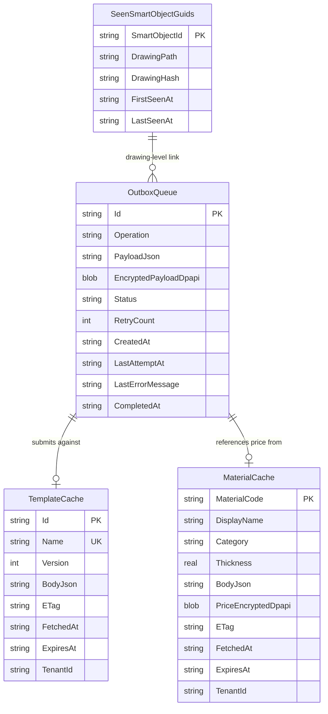

# CabinetBilder — Architecture Vision v2
## Database Review Pass · Local Storage Architecture Detailed

> **Verzió:** v2.0 — 2026-04-23
> **Szerző:** Gábor (Founder & Architect) — Database review: `sub-database-designer` + `sub-database-schema-designer` lencsék
> **Státusz:** REVIEW (v2) — v1 draft + 12 database finding beépítve
> **Kapcsolódó:** `CabinetBilder_Architecture_Vision_v1.md` (előző revízió) · `SpaceOS_Product_Manifesto_v1.md`
> **Következő:** v3 (senior-security review) · v4 (senior-backend review, feltételes)

---

## 1. Kumulált Finding Összesítő (v1 → v2)

### 1.1 Review summary

| Review | Finding-ek | Legfontosabb javítás | Effort delta |
|--------|------------|----------------------|--------------|
| v1 draft | — | — | ~48 nap (baseline) |
| **v1 → `sub-database-designer` + `sub-database-schema-designer` → v2** | **3 CRITICAL · 3 HIGH · 5 MEDIUM · 1 LOW** | Lokális SQLite DDL minden kliensoldali táblára, client-side migration stratégia, WAL mode concurrency, Guid-kollízió detekció | **+4.5 nap** |
| **Összesen (v2)** | **12** | | **~52.5 nap** |

### 1.2 Finding lista

| ID | Súly | Terület | Probléma | v2 javítás |
|----|------|---------|----------|------------|
| **DB-01** | 🔴 CRITICAL | Local Storage / OutboxQueue | v1 említi az SQLite-alapú outbox-ot, de DDL, index stratégia, payload size limit, retry count field, error retention policy nincs meghatározva — a userek adatvédelmét (Manifesto T3) nem tudja érvényesíteni | Teljes DDL (§9.2), composite index `(Status, CreatedAt)` (§9.7), 1MB payload hard cap + hash-check (§9.2), 30 napos success-entry retention (§9.12) |
| **DB-02** | 🔴 CRITICAL | Local Storage / TemplateCache | v1 mentions `LocalProductTemplateCache` (§4.2) és pull-olást (roadmap Phase 4), de nincs cache coherence modell — sem ETag/If-None-Match, sem TTL, sem verzió-összevetés. A cache örökre stale lehet | ETag-alapú conditional GET (§9.3), `ExpiresAt` TTL + `ETag` column (§9.3), szerver push invalidation via WebSocket (jövőbeli, §9.3 opcionális) |
| **DB-03** | 🔴 CRITICAL | Schema Evolution | Kliensoldali SQLite migration stratégia teljesen hiányzik. Egy v1.1 kiadás, ami új mezőt vezet be, **a meglévő telepítéseket töri** — és szemben egy szerverrel, a user nem tud rollback-et nyomni. Rossz migration = adat-veszteség | `PRAGMA user_version` alapú forward-only migration (§9.8), verzió-specifikus migrator osztályok (§9.8 kódminta), kötelező staging-teszt minden migration-ön kiadás előtt |
| **DB-04** | 🟠 HIGH | Concurrency | Valós scenario: a user gyakran 2 AutoCAD-et futtat párhuzamosan. Alapértelmezett SQLite rollback-journal mode csak egy writer-t enged — az egyik instance blokkolja a másikat, vagy hibára fut. Outbox processing is több processben indulhat → duplicate submit | WAL mode (`PRAGMA journal_mode=WAL`) a DB megnyitáskor (§9.9), `busy_timeout=5000ms` default, leader election az outbox-processor-re OS-szintű named mutex-szel (`Global\CabinetBilder.OutboxLeader`, §9.9) |
| **DB-05** | 🟠 HIGH | Identity | A lokálisan generált `Guid` canonical — de ha a user "Save As" paranccsal duplikálja a DWG-t, a második fájlban is ugyanaz a Guid szerepel, két **különböző** állapottal. Mindkettő sync-et indít → szerver oldalon konfliktus, audit chain inkonzisztens | `SeenSmartObjectGuids` lokális tábla (§9.5): (Guid, DrawingPath, FirstSeenAt, DrawingHash). Megnyitáskor ellenőriz: ha ugyanaz a Guid más DrawingPath-ban volt → auto-regenerate Guid + notify (§11.3) |
| **DB-06** | 🟠 HIGH | Security / Token storage | DPAPI-encrypted token — de a fájl-layout, multi-tenant támogatás, key-rotation, refresh-race nincs részletezve. Ha a user 2 tenant-ban aktív, egy fájl nem elég | Per-tenant token file + manifest (§9.6). Manifest plain, token-ok DPAPI-encrypted. Refresh single-flight lock (prevents race-condition). Logout explicit wipe. |
| **DB-07** | 🟡 MEDIUM | Performance / Indexing | v1 nem ad meg index stratégiát a lokális táblákra. Kis adatmennyiségnél nem blokkoló, de alap-diszciplína | Explicit index-lista minden táblára (§9.7): Outbox: `(Status, CreatedAt)`; TemplateCache: UNIQUE `Name`; MaterialCache: UNIQUE `MaterialCode`; SeenGuids: UNIQUE `Guid` |
| **DB-08** | 🟡 MEDIUM | Data Retention | Sikeres sync után az outbox-entry törlődik vagy megmarad? Manifesto T3 (adat-tulajdon) oldaláról indokolt megmutatni a usernek, mit küldtünk — de örökös tárolás sem ésszerű | 30 napos konfigurálható retention success-entry-kre (§9.12), azután törlés. Hibás entry-k törlése csak user-akció után. `cabinetbilder diagnose --outbox-history` CLI parancs listázásra (§15.2 és DB-12) |
| **DB-09** | 🟡 MEDIUM | Privacy / Data classification | Mi kerül lemezre nyíltan és mi titkosítva? Az outbox payload tartalmazhat árazási adatot (potenciálisan érzékeny), a MaterialCache tartalmazhat beszerzői árakat. Default-ban minden plain text = sérülékeny backup-scenarióban | Data classification tábla (§9.11): `Public` (TemplateCache, saját rajzok statikus adatai), `Sensitive` (outbox-payload árazási mezők, tenant-specifikus Material-árak) — utóbbiak DPAPI-encrypted mezőben tárolva, nem teljes fájlon |
| **DB-10** | 🟡 MEDIUM | Recovery | SQLite corruption (áramszünet AutoCAD futás közben) → a cache-fájl beragad. v1 erre nincs terve | `PRAGMA integrity_check` a plugin startup-on (§9.10). Ha fail → TemplateCache/MaterialCache auto-törlés (újra letölthető a szerverről), OutboxQueue explicit user-ack-kel (mert adatvesztés lenne) |
| **DB-11** | 🟡 MEDIUM | Domain / Persistence | v1 §5.2 bemutatja a `Skeleton` aggregate-et, de nem egyértelmű: perzisztens SQLite-ban vagy csak in-memory? Ha user mid-edit bezárja AutoCAD-et, mi történik? | **Döntés:** Skeleton **nem** perzisztál lokális SQLite-ban. A DWG XRecord + Extension Dictionary az egyetlen forrás. Ha user AutoCAD-et bezárja mentés nélkül, elveszik a változás — ugyanaz, mint bármely AutoCAD-munkánál (§14.3) |
| **DB-12** | 🟢 LOW | Observability | Support-szcenárióban hogyan nézzük meg a lokális DB-állapotot? Egy SQLite fájlt nyissunk meg DB Browser-ben? Az encrypted mezők olvashatatlanok | `cabinetbilder diagnose` CLI parancs (§15.2 és §15.4): pretty-print local state (redact-ölt érzékeny mezők), JSON export → support-ticket-hez csatolható |

### 1.3 Effort delta részletezés

| Ténytó | Új fázis / feladat | Delta |
|---|---|---|
| DB-01, DB-02, DB-03 | Fázis 1.5 **(ÚJ)**: Local Storage Foundation — SQLite konfigurálás + DDL + migration runner + concurrency | +2 nap |
| DB-04 | Fázis 2 bővítés: WAL-mode + mutex-alapú leader election | +0.5 nap |
| DB-05 | Fázis 2 bővítés: SeenGuids tábla + collision detection | +0.5 nap |
| DB-06 | Fázis 2 bővítés: multi-tenant token manifest | +0.5 nap |
| DB-07 | (§9.7-ből fakadó triviális implementáció Fázis 1.5-ben) | 0 nap |
| DB-08 | Fázis 7 bővítés: outbox retention policy | +0.25 nap |
| DB-09 | Fázis 2-7 közötti cross-cutting: encrypted-field konvenció | +0.25 nap |
| DB-10 | Fázis 1.5 bővítés: integrity check at startup | +0.25 nap |
| DB-11 | (§14.3 specifikáció, nem új implementáció) | 0 nap |
| DB-12 | Fázis 11 bővítés: `diagnose` CLI command | +0.25 nap |
| **Összesen** | | **+4.5 nap** |

### 1.4 Nyitva maradó elemek v3 (security) review-hoz

- **SEC-pre-01:** A Device Code Flow QR-kód megjelenítése AutoCAD palette-ben — van-e XSS-analóg kockázat?
- **SEC-pre-02:** SQLite fájlok helye (`%APPDATA%\CabinetBilder\`) — ki tudja olvasni ugyanazon a gépen? Más user, admin, malware?
- **SEC-pre-03:** DPAPI-key rotation Windows user-profile migration esetén
- **SEC-pre-04:** MCP-server local port exposure (§12 v1): honnan lehet hívni, authentikáció hogyan?
- **SEC-pre-05:** Outbox payload integrity — HMAC-aláírás, vagy enough a TLS a submission-nél?

Ezeket a v3 security review formálisan átnézi.

---

## 2. Előhang (változatlan v1-hez képest)

Ez a dokumentum a CabinetBilder technikai jövőjét rajzolja le — **de nem a Manifesto helyett, hanem alatta**. Minden technikai döntés, amit itt rögzítünk, valamelyik Manifesto-tézisre vezet vissza.

A v1 draft tiszta vízió-dokumentum volt. A v2 ezt **adatrétegen** szűkíti meg: konkrét DDL, index-ek, migration-stratégia, concurrency-modell. A Core-Adapter-Bridge rétegezés változatlan — a v2 a Bridge réteg **lokális persistence** részét részletezi.

A későbbi `v3` (security review), `v4` (backend review) iterációk után lesz Claude Code-ra bízható terv.

---

## 3. Cél és scope

### 3.1 Amit ez a dokumentum meghatároz

| Terület | Mit mond ki | v2 státusz |
|---|---|---|
| Projekt-struktúra | Milyen .csproj-k legyenek, milyen hivatkozásokkal, melyik platformra | v1 óta változatlan |
| Rétegek | Core / Bridge / Adapter felelősség-határok | v1 óta változatlan |
| CAD-platform mátrix | Mely CAD-rendszereket támogatjuk, milyen szinten, milyen technikával | v1 óta változatlan |
| Identity & Auth | Hogyan jelentkezik be egy user (Free Tier és Paid egyaránt) | **v2: Guid-kollízió kezelés hozzáadva** |
| Connection state | Online / Offline / Unauthenticated állapotok viselkedése | **v2: WAL mode + leader election hozzáadva** |
| **Lokális storage** | **Lokális SQLite struktúrák, encryption policy, migration stratégia, concurrency** | **v2: ÚJ szakasz, §9** |
| Skeleton domain | A parametrikus tervezés alapstruktúrája | **v2: persistence-modell egyértelműsítve (§14.3)** |
| AI/LLM barátság | Konkrét technikai követelmények a "gép-barát" elvre | **v2: `diagnose` CLI parancs hozzáadva (§15.2)** |
| Migrációs út | Jelen állapotból (Milestone 8 DONE) a végcélhoz vezető fázisok | **v2: új Fázis 1.5 (Local Storage Foundation)** |

### 3.2 Amit ez a dokumentum NEM határoz meg

| Terület | Hova tartozik |
|---|---|
| Free Tier pontos limitek (nesting/hó, storage, stb.) | `SpaceOS_FreeTier_Limits_v1.md` — külön session |
| SpaceOS backend endpoint-struktúra | `SpaceOS_Modules_*_v4.md` dokumentumok |
| Web portál UI (eszkozok.joinerytech.hu) | `SpaceOS_FreeTier_Architecture_v4.md` |
| Részletes Skeleton aggregate algoritmika (Kahn's sort, stb.) | Későbbi session (Skeleton design deep-dive) |
| AI/LLM konkrét agent implementáció | `SpaceOS_LLM_Agent_Architecture_v1.md` — későbbi |
| Server-oldali SpaceOS schema változások | SpaceOS arch-planner sessionok |

---

## 4. Manifesto horgonyok

Minden fő architekturális döntést visszavezetünk a Manifesto egy tézisére. **A v2 review nem változtatott ezen a táblán** — a database finding-ek nem Manifesto-szintű döntések, hanem a meglévő döntések implementációs részletei.

| Tézis | Technikai döntés | Hol látszik (v2) |
|---|---|---|
| **1. Alkotás szabad** | Free Tier = first-class tenant, minden core feature ingyenes | §11 Identity & Free Tier |
| **1. Alkotás szabad** | AutoCAD LT-hez is van integráció (read-only mód LISP-en) | §13 CAD Platform Mátrix |
| **3. Adat tulajdon** | Teljes export DXF / IFC / JSON / CSV formátumban, egy kattintással | §8 Bridge layer (export API) |
| **3. Adat tulajdon** | Lokálisan generált `Guid` a canonical SmartObject-azonosító | §11 Identity Bridge |
| **3. Adat tulajdon** | **Outbox-history 30 napig user-láthatóan** (DB-08 findingből) | **§9.12 Data retention** |
| **4. Nem áruljuk** | Semmi telemetry, analytics tracking. Legfeljebb **opcionális, explicit** crash-report | §15 AI/LLM + Privacy |
| **4. Nem áruljuk** | **Érzékeny lokális adat DPAPI-encrypted** (DB-09 findingből) | **§9.11 Privacy classification** |
| **5. Mindenki a saját eszközét** | Multi-CAD plugin család: AutoCAD + 4 klón + LT + Inventor + SW | §13 CAD Platform Mátrix |
| **5. Mindenki a saját eszközét** | Adapter-réteg CAD-függetlenítéssel — `ICadAdapter`, `IDraftingCadAdapter`, `ISolidCadAdapter` | §8, §13 |
| **6. Skeleton-alapú tervezés** | A Core központjában `Skeleton` aggregate; **DWG XRecord a persistence-forrás, nem SQLite** (DB-11 findingből) | **§14.3 clarification** |
| **7. API-first, gép-barát** | Minden use-case handler CLI-ből is elérhető (külön `App.AutoCadScripts.Cli` project) | §15 AI/LLM |
| **7. API-first, gép-barát** | Bridge réteg teljesen platform-független, AutoCAD nélkül is tesztelhető | §8 SpaceOsBridge |
| **8. AI mint DNS** | MCP-server expozíció a Bridge rétegen, minden use-case agent-hívható | §15 AI/LLM |
| **8. AI mint DNS** | **`cabinetbilder diagnose` CLI parancs, gép-olvasható JSON export** (DB-12 findingből) | **§15.2 bővítve** |
| **9. Hálózat az érték** | Minden művelet (ha online) tenant + user címkével audit-láncban | §17 Security & audit |
| **10. Versenytárs-tisztelet** | Nyílt fájlformátumok (DXF, IFC, STEP) export/import, nincs vendor lock-in | §8 Bridge export |

---

## 5. Big Picture (változatlan v1-hez képest)

```
┌───────────────────────────────────────────────────────────────────┐
│                     SpaceOS Backend (Kernel)                      │
│         Keycloak IdP · Modules.Cutting · Modules.Inventory        │
│         Modules.Abstractions · Modules.Contracts NuGet 1.3.0      │
└────────────────────────────────┬──────────────────────────────────┘
                                 │ HTTPS / JWT / SpaceOS.Modules.Contracts DTOs
                                 │
┌────────────────────────────────┴──────────────────────────────────┐
│  CabinetBilder.SpaceOsBridge   (net10.0, platform-független)      │
│  AutoCAD nélkül tesztelhető  ·  CLI-ből hívható  ·  MCP-server    │
│                                                                    │
│   HttpSpaceOsClient  ·  DeviceCodeAuthenticator  ·  DpapiTokenStore│
│   OutboxQueue        ·  ConnectionStateMonitor   ·  McpExposer    │
│   [ÚJ v2] SqliteLocalStore · SchemaMigrator · OutboxLeader(Mutex) │
└────────────────────────────────┬──────────────────────────────────┘
                                 │  port interfészek
                                 │
┌────────────────────────────────┴──────────────────────────────────┐
│  CabinetBilder.Core   (net10.0, pure C#, AutoCAD-független)       │
│                                                                    │
│  Skeleton domain            SmartObjects/         FrontMatter/     │
│    ├── Skeleton aggregate       (meglévő)           (meglévő)      │
│    ├── SkeletonComponent                                           │
│    └── ...                   Sync ports (ÚJ)                       │
│                                 ├── ISpaceOsClient                 │
│  CAD port-ok  (platform-ag)     ├── IConnectionState               │
│    ├── ICadAdapter              ├── ISpaceOsAuthenticator          │
│    ├── IDraftingCadAdapter      └── [ÚJ v2] ILocalStore            │
│    └── ISolidCadAdapter                                            │
└────────────────────────────────┬──────────────────────────────────┘
                                 │  ICadAdapter implementációk
                                 │
      ┌──────────────┬───────────┴──────────┬────────────────┐
      │              │                      │                │
  Adapter.AutoCAD  Adapter.Bricscad/  Adapter.Inventor    Adapter.Solidworks
  (+ 2027)         GstarCAD/ZWCAD/    (+ WoodworkDesign)  (+ SWOOD)
                   CADian (shared src)
```

**v2-ben hozzáadott Bridge komponensek:** `SqliteLocalStore` (lokális SQLite absztrakció), `SchemaMigrator` (user_version-alapú), `OutboxLeader` (named mutex a leader election-re).

---

## 6. Projekt struktúra

### 6.1 Jelenlegi (Milestone 8 DONE) — változatlan v1-hez

Lásd v1 §4.1.

### 6.2 Cél (v1 vision + v2 finomítás)

```
CabinetBilder.slnx
├── CabinetBilder.Core                     (net10.0 portable)
│   ├── Skeleton/                            — ÚJ: Skeleton aggregate + VOs
│   ├── SmartObjects/                        — meglévő
│   ├── FrontMatter/                         — meglévő
│   ├── Sync/                                — ÚJ: port interfészek
│   │   ├── ISpaceOsClient
│   │   ├── IConnectionState
│   │   ├── ISpaceOsAuthenticator
│   │   └── [ÚJ v2] ILocalStore               — SQLite absztrakció port
│   └── Common/                              — meglévő (Result<T>)
│
├── CabinetBilder.SpaceOsBridge            (net10.0 portable)
│   ├── Http/                                — HttpSpaceOsClient
│   ├── Auth/                                — DeviceCodeAuthenticator
│   ├── TokenStorage/                        — DpapiTokenStore + FileTokenStore
│   ├── LocalStore/  ⟵ ÚJ v2
│   │   ├── SqliteLocalStore                  — ILocalStore implementáció
│   │   ├── SchemaMigrator                    — user_version-alapú migrator
│   │   ├── Migrations/                       — per-version migration class
│   │   │   ├── M001_InitialSchema.cs
│   │   │   ├── M002_AddSeenGuidsTable.cs
│   │   │   └── ...
│   │   └── OutboxLeader                      — named mutex (CAD-instance election)
│   ├── Outbox/                              — OutboxQueue (SqliteLocalStore-ra épül)
│   ├── StateMonitor/                        — ConnectionStateMonitor
│   └── Mcp/                                 — McpExposer
│
├── CabinetBilder.Adapter.AutoCAD          (net10.0-windows)
│   └── [v1-ben részletezve]
│
├── CabinetBilder.Adapter.Bricscad / GstarCAD / ZWCAD / CADian
│   └── [shared source, v1-ben részletezve]
│
├── CabinetBilder.Adapter.AutoCAD.LT       (LISP + submitter.exe)
│   └── [v1-ben részletezve]
│
├── CabinetBilder.Adapter.Inventor + Solidworks
│   └── [v1-ben részletezve]
│
├── CabinetBilder.Cli                      (net10.0, console)
│   └── Commands/  + [ÚJ v2] DiagnoseCommand
│
└── CabinetBilder.Tests                    (MSTest, net10.0)
    ├── (meglévő 48 teszt)
    └── LocalStore/  ⟵ ÚJ v2
        ├── SqliteLocalStoreTests.cs
        ├── SchemaMigratorTests.cs
        └── OutboxLeaderTests.cs
```

### 6.3 Lokális fájl-layout a user gépén

`%APPDATA%\CabinetBilder\` (Windows) — ez a root. Linux/Mac mirroring: `~/.config/cabinetbilder/`.

```
%APPDATA%\CabinetBilder\
├── client.db                      ← SQLite, fő local cache + outbox
├── client.db-wal                  ← WAL file (automatikus)
├── client.db-shm                  ← shared memory (automatikus)
│
├── tokens\                        ← per-tenant token files
│   ├── tenants.manifest.json        (plain — tenant lista, aktív tenant)
│   ├── {tenantId-1}.token.dpapi     (DPAPI-encrypted — access + refresh)
│   └── {tenantId-2}.token.dpapi
│
├── logs\                          ← plugin logs (text, rotating)
│   ├── cabinetbilder-20260423.log
│   └── ...
│
└── skeleton-cache\                ← opcionális: parametrikus Skeleton projections
    └── {guid}.projection.json       (DWG-sync támogatásához, v2.x-ben tisztázzuk)
```

**Rationale:**
- Egy `client.db` SQLite fájl tartalmazza a strukturált adatokat (Outbox, Caches, SeenGuids). WAL mode lehetővé teszi több AutoCAD-instance párhuzamos olvasását.
- Tokenek **külön fájlokban, per-tenant** — ha a user 3 tenantben aktív, 3 DPAPI-encrypted fájl. Manifest plain JSON, csak azonosítók.
- Logs szöveges, rotáló — AutoCAD-plugin-debug standard.
- Skeleton-projection cache külön mappa (opcionális, nem a SQLite-ban — lehet nagy, binary-like, redundáns a DWG-vel).

---

## 7. Core réteg — domain és portok (v1-hez képest kiegészítve ILocalStore porttal)

### 7.1 Meglévő tartalom (változatlan v1-hez)

Lásd v1 §5.1.

### 7.2 Új namespace: `Core.Skeleton` — v1-hez képest persistence-modellje finomítva

Lásd v1 §5.2 Skeleton definícióját. **v2 kiegészítés (DB-11):**

> **A Skeleton aggregate NEM perzisztál lokális SQLite-ban.**
> A forrás: DWG XRecord + Extension Dictionary (már az AutoCAD-ben van).
> Ha a user mentés nélkül zárja az AutoCAD-et, a módosítás elveszik — ugyanaz, mint bármely AutoCAD-munkánál.
> A lokális SQLite csak a **cache**-t (templates, materials) és az **outbox**-ot (pending syncs) tárolja.

Indok: a DWG az **egyetlen igazságforrás** a user munkájára. Ha a SQLite-ban külön "Skeleton state" lenne, két source of truth + divergálhatnak = hiba-forrás.

### 7.3 Új namespace: `Core.Sync` — port-ok (v1-hez képest bővítve ILocalStore-ral)

```csharp
namespace CabinetBilder.Core.Sync;

// v1-ben definiált portok (ISpaceOsClient, IConnectionState, ISpaceOsAuthenticator) — változatlan

// ÚJ v2: ILocalStore — lokális SQLite absztrakciója
public interface ILocalStore
{
    // Template cache
    Task<Result<IReadOnlyList<ProductTemplateDto>>> GetCachedTemplatesAsync(CancellationToken ct);
    Task<Result> UpsertTemplateCacheAsync(IReadOnlyList<ProductTemplateDto> templates, string etag, CancellationToken ct);
    Task<string?> GetTemplateEtagAsync(CancellationToken ct);

    // Material cache
    Task<Result<IReadOnlyList<MaterialDto>>> GetCachedMaterialsAsync(CancellationToken ct);
    Task<Result> UpsertMaterialCacheAsync(IReadOnlyList<MaterialDto> materials, string etag, CancellationToken ct);

    // Outbox
    Task<Result<Guid>> EnqueueOutboxAsync(OutboxEntry entry, CancellationToken ct);
    Task<Result<IReadOnlyList<OutboxEntry>>> ClaimPendingOutboxAsync(int maxCount, CancellationToken ct);
    Task<Result> MarkOutboxSuccessAsync(Guid entryId, CancellationToken ct);
    Task<Result> MarkOutboxFailedAsync(Guid entryId, string errorMessage, CancellationToken ct);

    // SmartObject Guid tracking (DB-05)
    Task<Result<SeenGuidInfo?>> TryFindSeenGuidAsync(Guid smartObjectId, CancellationToken ct);
    Task<Result> RegisterSeenGuidAsync(Guid smartObjectId, string drawingPath, string drawingHash, CancellationToken ct);

    // Meta
    Task<Result<DateTimeOffset?>> GetLastSyncAtAsync(CancellationToken ct);
    Task<Result> SetLastSyncAtAsync(DateTimeOffset timestamp, CancellationToken ct);
}

public sealed record OutboxEntry(
    Guid Id,
    OutboxOperation Operation,       // SubmitCuttingSheet, AnchorHash, ...
    string PayloadJson,               // szerializált request
    string? EncryptedPayloadDpapi,    // DB-09: érzékeny payload DPAPI-encrypted mező
    OutboxStatus Status,              // Pending, InProgress, Succeeded, Failed
    int RetryCount,
    DateTimeOffset CreatedAt,
    DateTimeOffset? LastAttemptAt,
    string? LastErrorMessage);

public sealed record SeenGuidInfo(
    Guid SmartObjectId,
    string DrawingPath,
    string DrawingHash,
    DateTimeOffset FirstSeenAt);
```

### 7.4 CAD port interfészek — változatlan v1-hez

Lásd v1 §5.4.

---

## 8. SpaceOsBridge réteg (v1-hez képest bővített outbox-struktúrával)

### 8.1 Komponens-lista (v2 bővítve)

| Komponens | Felelősség | Dependency | v2 változás |
|---|---|---|---|
| `HttpSpaceOsClient` | `ISpaceOsClient` implementáció | `HttpClient` + `System.Text.Json` + `Contracts` NuGet | — |
| `DeviceCodeAuthenticator` | Keycloak Device Code Flow | `IdentityModel.OidcClient` v6+ | — |
| `DpapiTokenStore` | Token tárolása Windows-on | `System.Security.Cryptography.ProtectedData` | **Per-tenant fájl-layout specifikálva (§9.6)** |
| `FileTokenStore` | Linux/Mac fallback | built-in | — |
| `ITokenStore` port | Platform-választó absztrakció | — | — |
| **`SqliteLocalStore`** | **`ILocalStore` implementáció, SQLite-on** | **`Microsoft.Data.Sqlite` 9.x** | **ÚJ v2** |
| **`SchemaMigrator`** | **user_version-alapú migration runner** | built-in | **ÚJ v2** |
| **`OutboxLeader`** | **Named mutex a leader election-höz** | `System.Threading.Mutex` | **ÚJ v2** |
| `OutboxQueue` | Offline-buffered write műveletek | `SqliteLocalStore` (alatta) | **v2: konkrét implementáció** |
| `ConnectionStateMonitor` | Periodikus health check | `Timer` + `HttpClient` | — |
| `McpExposer` | MCP tool registration + server | `ModelContextProtocol` NuGet | — |

### 8.2 Authentikáció — Device Code Flow (változatlan v1-hez)

Lásd v1 §6.2.

### 8.3 Outbox — offline-grace (v2 DDL-referenciával)

A v1-ben leírt flow változatlan. **v2 kiegészítés:** a konkrét SQLite-struktúra a §9.2-ben. A `OutboxQueue` komponens a `SqliteLocalStore`-ra épül — nem önálló perzisztencia.

```csharp
// Bridge/Outbox/OutboxQueue.cs
public sealed class OutboxQueue
{
    private readonly ILocalStore _store;
    private readonly ILogger<OutboxQueue> _logger;

    public async Task<Result<Guid>> EnqueueAsync(
        OutboxOperation operation,
        object payload,
        bool payloadContainsSensitiveData = false,
        CancellationToken ct = default)
    {
        var payloadJson = JsonSerializer.Serialize(payload);

        // DB-09: érzékeny payload DPAPI-encrypted a JSON-mezőbe mentés helyett
        string? encryptedPayload = null;
        if (payloadContainsSensitiveData)
        {
            encryptedPayload = DpapiHelper.EncryptString(payloadJson);
            payloadJson = null;  // plain-mező kiürítése
        }

        // Payload size limit: 1MB after encryption (DB-01)
        var effectivePayload = encryptedPayload ?? payloadJson;
        if (effectivePayload.Length > 1_048_576)
            return Result.Error("Outbox payload exceeds 1MB hard limit.");

        var entry = new OutboxEntry(
            Id: Guid.NewGuid(),
            Operation: operation,
            PayloadJson: payloadContainsSensitiveData ? null : payloadJson,
            EncryptedPayloadDpapi: encryptedPayload,
            Status: OutboxStatus.Pending,
            RetryCount: 0,
            CreatedAt: DateTimeOffset.UtcNow,
            LastAttemptAt: null,
            LastErrorMessage: null);

        return await _store.EnqueueOutboxAsync(entry, ct);
    }
}
```

---

## 9. Local Storage Architecture [ÚJ v2 szakasz]

Ez a szakasz a v2 review fő deliverable-je. A v1-ben csak *említett* lokális SQLite-ot v2 **DDL-szintig** specifikálja.

### 9.1 Overview

| Terület | Technológia | Miért ez |
|---|---|---|
| **Strukturált cache + outbox** | SQLite (embedded, `Microsoft.Data.Sqlite` 9.x) | Zero-config, single-file, WAL mode multi-reader, tesztelhető in-memory |
| **Token storage** | DPAPI-encrypted file + plain manifest JSON | Per-tenant izoláció, Windows-native encryption |
| **Logs** | Text files, rotating (NLog vagy Serilog fájl-sink) | Debug + support |
| **Skeleton projections** | Optional JSON files | A DWG-hez köthető, nem szabad SQLite-ot hizlalni vele |

### 9.2 SQLite schema — `OutboxQueue` (DB-01)

```sql
CREATE TABLE OutboxQueue (
    Id                       TEXT PRIMARY KEY,           -- Guid (uppercase, no hyphens) — stable ID
    Operation                TEXT NOT NULL,              -- "SubmitCuttingSheet", "AnchorHash", "UploadBom" — enum string
    PayloadJson              TEXT,                       -- plain JSON (ha nem érzékeny)
    EncryptedPayloadDpapi    BLOB,                       -- DPAPI-encrypted bytes (ha érzékeny — DB-09)
    Status                   TEXT NOT NULL DEFAULT 'Pending', -- enum: Pending | InProgress | Succeeded | Failed
    RetryCount               INTEGER NOT NULL DEFAULT 0,
    CreatedAt                TEXT NOT NULL,              -- ISO 8601 UTC
    LastAttemptAt            TEXT,                       -- ISO 8601 UTC, nullable
    LastErrorMessage         TEXT,                       -- max 4000 chars
    CompletedAt              TEXT,                       -- ISO 8601 UTC, for retention window

    CHECK (Status IN ('Pending','InProgress','Succeeded','Failed')),
    CHECK (PayloadJson IS NOT NULL OR EncryptedPayloadDpapi IS NOT NULL),
    CHECK (LENGTH(COALESCE(PayloadJson, '')) + LENGTH(COALESCE(EncryptedPayloadDpapi, X'')) <= 1048576)
);
```

**Kulcs-döntések:**
- PK `Guid` — stabil, újragenerálás nem kell, client-generated
- `PayloadJson` **vagy** `EncryptedPayloadDpapi` — XOR semantic (DB-09)
- 1 MB hard cap a CHECK constraint-ben — a kliens oldalán védelem
- `Status` enum string — SQLite barátságosan debug-olható (nem számmal kódolva)

### 9.3 SQLite schema — `TemplateCache` (DB-02)

```sql
CREATE TABLE TemplateCache (
    Id                       TEXT PRIMARY KEY,           -- template Guid (server-assigned)
    Name                     TEXT NOT NULL,              -- unique name, user-facing
    Version                  INTEGER NOT NULL,           -- template version (monotonikus)
    BodyJson                 TEXT NOT NULL,              -- full ProductTemplateDto serialized
    ETag                     TEXT NOT NULL,              -- szerver által adott ETag
    FetchedAt                TEXT NOT NULL,              -- ISO 8601 UTC (mikor pullok)
    ExpiresAt                TEXT NOT NULL,              -- ISO 8601 UTC (TTL, pl. +24h)
    TenantId                 TEXT NOT NULL               -- melyik tenant cache-elte
);
```

**Cache coherence protokoll:**
1. Plugin startup → `GetCachedTemplatesAsync()` → ha `ExpiresAt > now`, használd.
2. Ha lejárt (vagy user explicit refresh kér) → `HttpSpaceOsClient.PullTemplatesAsync(ifNoneMatch: CurrentETag)`:
   - `304 Not Modified` → `ExpiresAt` kitolása, tartalom változatlan
   - `200 OK` + új ETag → teljes cache-csere
3. Ha `ExpiresAt < now` és **offline** → figyelmeztetés ("cache stale, lehet hogy elavult template-ekből dolgozol") de **használható** (Manifesto T3 — adat tulajdon, nem blokkoljuk a munkát)

### 9.4 SQLite schema — `MaterialCache`

```sql
CREATE TABLE MaterialCache (
    MaterialCode             TEXT PRIMARY KEY,           -- ISO-szerű anyagkód, unique
    DisplayName              TEXT NOT NULL,              -- "Bükk furnér 18mm"
    Category                 TEXT NOT NULL,              -- "Panel", "EdgeBand", "Hardware"
    Thickness                REAL,                       -- mm, nullable
    BodyJson                 TEXT NOT NULL,              -- full MaterialDto
    PriceEncryptedDpapi      BLOB,                       -- ár DPAPI-encrypted (tenant-sensitive — DB-09)
    ETag                     TEXT NOT NULL,
    FetchedAt                TEXT NOT NULL,
    ExpiresAt                TEXT NOT NULL,
    TenantId                 TEXT NOT NULL
);
```

**DB-09:** az ár (`Price`) **DPAPI-encrypted mezőbe** megy, a többi cache plain. Ok: a template neve és tulajdonságai nyilvánosak, de a tenant-specifikus árak szenzitívek.

### 9.5 SQLite schema — `SeenSmartObjectGuids` (DB-05)

```sql
CREATE TABLE SeenSmartObjectGuids (
    SmartObjectId            TEXT PRIMARY KEY,           -- canonical Guid
    DrawingPath              TEXT NOT NULL,              -- abszolút path, last seen
    DrawingHash              TEXT NOT NULL,              -- SHA-256 of drawing content at first seen
    FirstSeenAt              TEXT NOT NULL,              -- ISO 8601 UTC
    LastSeenAt               TEXT NOT NULL               -- ISO 8601 UTC (updateable)
);
```

**Collision detection flow (§11.3-ban részletezve):**
1. Drawing megnyitáskor a plugin kiolvassa az összes SmartObject Guid-et a DWG-ből.
2. Minden Guid-ra lookup a `SeenSmartObjectGuids`-ban.
3. Ha találat + `DrawingPath` != current path + `DrawingHash` != current hash → **collision**:
   - Log-warn
   - Regeneráljon új Guid-et, írja a DWG-be (XRecord update)
   - Toast notification a usernek ("SmartObject-azonosító regenerálva egy másik rajzból származó másolatra")

### 9.6 Token storage — manifest + per-tenant files (DB-06)

**Fájl-layout:**
```
%APPDATA%\CabinetBilder\tokens\
├── tenants.manifest.json           (plain JSON)
└── {tenantGuid-XX}.token.dpapi     (DPAPI-encrypted)
```

**`tenants.manifest.json` struktúra (plain, nem érzékeny):**
```json
{
  "schemaVersion": 1,
  "activeTenantId": "550e8400-e29b-41d4-a716-446655440000",
  "tenants": [
    {
      "tenantId": "550e8400-e29b-41d4-a716-446655440000",
      "tenantName": "Gábor Personal (Free Tier)",
      "tenantType": "FreeTier",
      "userEmail": "g@example.com",
      "lastLoginAt": "2026-04-22T14:32:11Z"
    }
  ]
}
```

**`{tenantId}.token.dpapi` struktúra (DPAPI-encrypted JSON):**
```json
{
  "accessToken": "eyJhbGc...",
  "accessTokenExpiresAt": "2026-04-23T11:15:00Z",
  "refreshToken": "abc123...",
  "refreshTokenExpiresAt": "2026-05-23T10:15:00Z",
  "idToken": "eyJhbGc...",
  "issuedAt": "2026-04-23T10:15:00Z",
  "kcClientId": "cabinetbilder-plugin"
}
```

**Refresh single-flight lock:** egy `SemaphoreSlim(1,1)` a `DpapiTokenStore`-ban, hogy két párhuzamos `RefreshAsync` hívás ne indítson két concurrent refresh-t (race condition → one refresh_token invalidates the other a szerver oldalán).

**Logout / tenant-váltás:** a fájl atomi törlése (`File.Delete`) + `tenants.manifest.json` frissítése (active tenant = null, vagy másik tenant).

### 9.7 Indexes (DB-07)

```sql
-- OutboxQueue — pending lista ASC CreatedAt szerint (leader election claim)
CREATE INDEX IX_OutboxQueue_Status_CreatedAt ON OutboxQueue(Status, CreatedAt) WHERE Status = 'Pending';

-- OutboxQueue — sikeres entry retention cleanup
CREATE INDEX IX_OutboxQueue_CompletedAt ON OutboxQueue(CompletedAt) WHERE Status = 'Succeeded';

-- TemplateCache — keresés név szerint (Type picker)
CREATE UNIQUE INDEX UX_TemplateCache_Name_TenantId ON TemplateCache(Name, TenantId);

-- MaterialCache — keresés kód szerint (FrontMatter validation)
CREATE UNIQUE INDEX UX_MaterialCache_MaterialCode_TenantId ON MaterialCache(MaterialCode, TenantId);

-- SeenSmartObjectGuids — gyors Guid lookup
-- (PK-n keresztül megoldva, explicit index nem kell)

-- ExpiresAt query optimalizáció (TTL cleanup)
CREATE INDEX IX_TemplateCache_ExpiresAt ON TemplateCache(ExpiresAt);
CREATE INDEX IX_MaterialCache_ExpiresAt ON MaterialCache(ExpiresAt);
```

### 9.8 Schema migration strategy (DB-03)

**Alapelv:** `PRAGMA user_version` alapú **forward-only** migration. Rollback nincs — a kliens-oldali telepítés nem támogat "go back to v1.0" scenárió-t.

**Migration runner (kódminta):**

```csharp
// Bridge/LocalStore/SchemaMigrator.cs
public sealed class SchemaMigrator
{
    private static readonly IReadOnlyList<ISchemaMigration> Migrations = new ISchemaMigration[]
    {
        new M001_InitialSchema(),              // →v1: Outbox, TemplateCache, MaterialCache
        new M002_AddSeenGuidsTable(),          // →v2: SeenSmartObjectGuids
        new M003_AddEncryptedMaterialPrice()   // →v3: PriceEncryptedDpapi column
        // ... jövőbeli migrations
    };

    public async Task<Result> MigrateAsync(SqliteConnection conn, CancellationToken ct)
    {
        var currentVersion = await GetUserVersionAsync(conn, ct);
        var targetVersion = Migrations.Count;

        if (currentVersion > targetVersion)
            return Result.Error($"Database version {currentVersion} is newer than plugin expects ({targetVersion}). " +
                                $"Downgrade is not supported — please update the plugin.");

        for (int v = currentVersion; v < targetVersion; v++)
        {
            using var tx = conn.BeginTransaction();
            try
            {
                await Migrations[v].UpAsync(conn, tx, ct);
                await SetUserVersionAsync(conn, tx, v + 1, ct);
                await tx.CommitAsync(ct);
                _logger.LogInformation("Migrated local DB to schema version {Version}", v + 1);
            }
            catch (Exception ex)
            {
                await tx.RollbackAsync(ct);
                return Result.Error($"Migration to v{v+1} failed: {ex.Message}");
            }
        }

        return Result.Success;
    }
}

public interface ISchemaMigration
{
    Task UpAsync(SqliteConnection conn, SqliteTransaction tx, CancellationToken ct);
}
```

**Kiadási szabály:**
- Minden új migration **staging tesztben** futtatva, régi klienssel készített DB-ken (minimum 3 verzió hátra)
- Minden migration atomi tranzakcióban — ha elrontjuk, rollback
- Migration implementáció **nem hívhat hálózatot** — teljesen offline kell lefusson

### 9.9 Concurrency — WAL mode + OutboxLeader (DB-04)

**Problem:** user két AutoCAD-et futtat → két plugin-instance → mindkettő a `client.db`-t éri.

**Megoldás:**

1. **Connection-string kötelező flags:**
```
Data Source=%APPDATA%\CabinetBilder\client.db;
Cache=Shared;
Foreign Keys=True;
```
   + minden connection nyitásakor:
```sql
PRAGMA journal_mode = WAL;
PRAGMA busy_timeout = 5000;
PRAGMA synchronous = NORMAL;
PRAGMA foreign_keys = ON;
```

2. **Reader/Writer lockless WAL alatt** — több olvasó + egy író párhuzamosan OK.

3. **Outbox processing leader election:**
```csharp
// Bridge/LocalStore/OutboxLeader.cs
public sealed class OutboxLeader : IDisposable
{
    private const string MutexName = @"Global\CabinetBilder.OutboxLeader";
    private Mutex? _mutex;

    public bool TryBecomeLeader()
    {
        _mutex = new Mutex(initiallyOwned: false, name: MutexName, out bool _);
        return _mutex.WaitOne(TimeSpan.Zero);
    }

    public void Dispose()
    {
        _mutex?.ReleaseMutex();
        _mutex?.Dispose();
    }
}
```

**Viselkedés:** csak **az egyik** AutoCAD-instance dolgozza fel az outbox-ot. A többi látja az outbox-tartalmat (read-only) státusz-UI-hoz, de submit-et nem indít.

### 9.10 Corruption recovery (DB-10)

**Startup-check minden plugin-load-kor:**
```csharp
public async Task<LocalStoreHealth> CheckHealthAsync(CancellationToken ct)
{
    try
    {
        using var conn = OpenConnection();
        await conn.OpenAsync(ct);

        using var cmd = conn.CreateCommand();
        cmd.CommandText = "PRAGMA integrity_check;";
        var result = await cmd.ExecuteScalarAsync(ct) as string;

        if (result == "ok")
            return LocalStoreHealth.Healthy;
        else
            return LocalStoreHealth.Corrupt(result ?? "unknown");
    }
    catch (SqliteException ex)
    {
        return LocalStoreHealth.Corrupt(ex.Message);
    }
}
```

**Ha corrupt:**
- **Cache tables** (`TemplateCache`, `MaterialCache`, `SeenSmartObjectGuids`) → **auto-rebuild from scratch** (üresre töröl, next pull újra tölti).
- **OutboxQueue** → **explicit user-ack dialog**: "A lokális adatbázis sérült. Az outbox (N pending sync) tartalma elveszhet. Folytatod a reset-et?" — mert az adat-veszteség itt valódi, a user döntése.

### 9.11 Privacy classification — mit encrypt-elünk (DB-09)

| Adat | Osztály | Hol tárolva | Titkosítás |
|---|---|---|---|
| ProductTemplate név, struktúra | Public | `TemplateCache.BodyJson` | — plain |
| Material név, méret | Public | `MaterialCache.BodyJson` | — plain |
| **Material ár (tenant-specifikus)** | **Sensitive** | `MaterialCache.PriceEncryptedDpapi` | **DPAPI per mező** |
| **Outbox payload — ha BOM + ár** | **Sensitive** | `OutboxQueue.EncryptedPayloadDpapi` | **DPAPI per rekord** |
| Outbox payload — egyéb | Public | `OutboxQueue.PayloadJson` | — plain |
| SeenSmartObjectGuids | Public | `SeenSmartObjectGuids` | — plain |
| **Access/Refresh token** | **Secret** | `{tenantId}.token.dpapi` | **DPAPI teljes fájl** |
| Tenant manifest | Public (csak azonosítók) | `tenants.manifest.json` | — plain |
| Logs | Public (redact PII) | `logs\*.log` | — plain (redact kötelező) |

**Alapelv:** plain text csak az, amit egy támadó **nem tud pénzzé tenni**. Árak, tokenek, tenant-specifikus business adatok → DPAPI.

### 9.12 Data retention policies (DB-08)

| Adat | Retention | Törlés módja |
|---|---|---|
| `OutboxQueue` Status=`Pending` | indefinite | sikeres sync után → `Succeeded` |
| `OutboxQueue` Status=`Succeeded` | **30 nap** | cron cleanup (plugin startup-on) |
| `OutboxQueue` Status=`Failed` | indefinite | csak explicit user-akció (CLI vagy palette) — adatvédelem |
| `TemplateCache` | ETag-revalidáció minden 24h | expirált sorok törölhetők, de rename-elt template-ek megmaradnak (offline use) |
| `MaterialCache` | Ugyanaz | Ugyanaz |
| `SeenSmartObjectGuids` | indefinite | csak CLI admin-parancs (`cabinetbilder admin clear-seen-guids`) |
| Logs | **14 nap rolling** (7 fájl × 2MB) | NLog/Serilog automatikus |
| Tokens | Refresh token lejártáig (~30 nap default) | refresh vagy logout-kor törlés |

**Konfigurálható:** minden TTL `appsettings.json`-ben (`LocalStore:OutboxSuccessRetentionDays` stb.) — a default-ok a kiadott pluginban privacy-friendly-re beállítva.

### 9.13 ERD (Mermaid)



---

## 10. Adapter réteg (változatlan v1-hez)

Lásd v1 §7.

---

## 11. Identity, Free Tier, Auth (v1-hez képest §11.3 bővített Guid-kollízió szakasszal)

### 11.1 "Anonymous local" TILTVA (változatlan v1-hez)

Lásd v1 §7.1.

### 11.2 Free Tier mint first-class tenant (változatlan v1-hez)

Lásd v1 §7.2.

### 11.3 Identity Bridge — `Guid` mint canonical (v2: DB-05 collision handling)

**v1-es alap:** A lokálisan generált `Guid` canonical. A szerver csak referenciál, soha nem ír felül.

**v2-es kiegészítés — DWG copy-paste kollízió-detektálás:**

```csharp
// Adapter.AutoCAD/Commands/OnDrawingOpenedHandler.cs
public async Task HandleDrawingOpenedAsync(Document doc, CancellationToken ct)
{
    var currentPath = doc.Name;
    var currentHash = await ComputeSha256Async(currentPath, ct);

    foreach (var smartObj in GetSmartObjectsInDrawing(doc))
    {
        var seen = await _localStore.TryFindSeenGuidAsync(smartObj.Id, ct);

        if (seen is null)
        {
            // First time — register
            await _localStore.RegisterSeenGuidAsync(smartObj.Id, currentPath, currentHash, ct);
            continue;
        }

        if (seen.DrawingPath != currentPath || seen.DrawingHash != currentHash)
        {
            // Collision: ugyanaz a Guid, másik drawing/hash
            _logger.LogWarning("Guid collision detected: {Guid} was first seen in {OrigPath}, now in {NewPath}",
                smartObj.Id, seen.DrawingPath, currentPath);

            var newGuid = Guid.NewGuid();
            _metadataStore.UpdateSmartObjectId(smartObj, newGuid);  // XRecord update

            await _localStore.RegisterSeenGuidAsync(newGuid, currentPath, currentHash, ct);

            // Toast notification a usernek
            _editor.WriteMessage($"\n[CabinetBilder] SmartObject ID regenerálva copy detection miatt: {newGuid}");
        }
    }
}
```

**User-élmény:**
1. User: "Save As" drawing1.dwg → drawing2.dwg
2. drawing2.dwg megnyitásakor a plugin észleli a kollíziót
3. A drawing2.dwg SmartObject-jei új Guid-okat kapnak
4. A user értesítést kap ("SmartObject ID regenerálva") — tudja, hogy mi történt
5. drawing2.dwg önállóan szinkronizálódik a SpaceOS-hez — nincs ütközés az eredetivel

---

## 12. Connection state model (v1-hez képest §12.3 concurrency szakasszal)

### 12.1-12.2 (változatlan v1-hez)

Lásd v1 §8.1, §8.2.

### 12.3 File locking & leader election (v2: DB-04)

Ha a user két AutoCAD-instance-ot futtat egyidejűleg:

| Scenario | Viselkedés |
|---|---|
| Mindkét instance **olvassa** a cache-t (`TemplateCache`, `MaterialCache`) | ✅ OK — WAL mode multi-reader |
| Mindkettő **ír** az outbox-ba | ✅ OK — WAL mode serializált write-ok, `busy_timeout=5000ms` elnyeli a rövid konfliktust |
| Mindkettő **processzálna outbox-ot** (submit HTTP) | **⛔ BLOKKOLVA** — `OutboxLeader` mutex megvédi. Csak az egyik instance indít HTTP-t. |
| Mindkettő **write-ol XRecord-ot** ugyanarra a SmartObject-re | N/A — AutoCAD document lock védi, ugyanaz a DWG két instance-ban nem nyitható egyszerre |

**Status bar jelzés a non-leader instance-ban:** "Outbox: processed by other CAD instance" — a user látja, hogy nem ő feldolgozza, de minden rendben.

---

## 13. CAD platform mátrix (változatlan v1-hez)

Lásd v1 §9.

---

## 14. Skeleton domain modell (v1-hez képest §14.3 persistence clarification)

### 14.1-14.2 (változatlan v1-hez)

Lásd v1 §10.1, §10.2.

### 14.3 Persistence modell — v2 clarification (DB-11)

**Kérdés:** a `Skeleton` aggregate hol él?

**Döntés:**

| Layer | Skeleton-state | Indok |
|---|---|---|
| **In-memory (plugin runtime)** | ✅ igen — amíg user editálja, a `Skeleton` objektum a memóriában él | Rövid élettartam, gyors access |
| **DWG XRecord + Extension Dictionary** | ✅ igen — a Skeleton paraméterei és a komponens-referenciák itt tárolódnak | **Egyetlen persistent source of truth** — a user DWG-je |
| **Lokális SQLite (`client.db`)** | ❌ **NEM** | Két source of truth = hibaforrás. A cache tárol template-eket (pull-olt), nem aktív munkát |
| **SpaceOS szerver** | ⚠️ részben — ha a user explicit "submit"-et nyom, a BOM és a ProofHash felmegy; de a teljes Skeleton nem | Manifesto T3 (adat tulajdon) — a user DWG-je lokális |

**User-scenario:** user mid-edit bezárja AutoCAD-et **mentés nélkül** → a módosítás **elveszik**. Ez ugyanaz a viselkedés, mint bármely AutoCAD-munkánál — nem új hiba. A plugin nem emel ezen felül másik auto-save réteget.

Ez a döntés egyszerűsíti:
- A sync-logikát (nem kell 3-way merge a DWG + SQLite + server között)
- A recovery-t (csak a DWG-t kell menteni)
- A user-modelt ("mentsd a rajzot, ahogy mindig")

---

## 15. AI/LLM barátság (v1-hez képest §15.2 `diagnose` CLI hozzáadva)

### 15.1 MCP-server exposure (változatlan v1-hez)

Lásd v1 §11.1.

### 15.2 CLI-paritás — `CabinetBilder.Cli` (v1-hez képest bővített parancs-lista: `diagnose`)

```bash
cabinetbilder login                                    # (v1)
cabinetbilder templates pull                            # (v1)
cabinetbilder skeleton create --template ... --param... # (v1)
cabinetbilder bom submit --drawing ./file.dwg           # (v1)
cabinetbilder materials list --category panel           # (v1)

# [ÚJ v2]
cabinetbilder diagnose                                  # pretty-print local state
cabinetbilder diagnose --outbox                         # csak outbox listája (includes sensitive redacted)
cabinetbilder diagnose --outbox-history --days 7        # elmúlt 7 nap outbox
cabinetbilder diagnose --export support-bundle.json     # support-ticket-hez csatolható
cabinetbilder admin clear-cache                         # cache tables reset
cabinetbilder admin clear-seen-guids                    # SeenGuids reset (copy-paste scenario)
```

**`diagnose --export` output (gép-olvasható):**
```json
{
  "plugin_version": "1.2.3",
  "runtime": ".NET 10.0.5",
  "active_tenant": { "id": "abc-...", "type": "FreeTier", "login_age_hours": 12 },
  "connection_state": "Online",
  "local_store": {
    "schema_version": 3,
    "integrity_check": "ok",
    "template_cache_count": 47,
    "material_cache_count": 312,
    "seen_guids_count": 128,
    "outbox": { "pending": 2, "succeeded_last_30d": 156, "failed": 0 }
  },
  "token_storage": { "tenants_configured": 1, "refresh_expires_in_days": 28 },
  "last_sync_at": "2026-04-23T09:15:22Z"
}
```

Ezt közvetlenül át lehet adni egy LLM-nek diagnostic céllal: "itt a státuszom, miért nem szinkronizál?"

### 15.3 Natural-language metadata (változatlan v1-hez)

Lásd v1 §11.3.

### 15.4 Hibák — lépéslistával (változatlan v1-hez)

Lásd v1 §11.4.

### 15.5-15.6 (változatlan v1-hez)

Lásd v1 §11.5, §11.6.

---

## 16. Fázisolt roadmap (v1-hez képest új Fázis 1.5: Local Storage Foundation)

### 16.1 Kiterjesztett fázis-lista

| Fázis | Scope | Effort | Blokkoló | Manifesto |
|---|---|---|---|---|
| **0. Handler layer extraction** | Milestone 9 (v1) | ~2 nap | — | — |
| **1. Project rename + layer split** | v1 | ~1 nap | 0 | — |
| **1.5 Local Storage Foundation ⟵ ÚJ v2** | SqliteLocalStore, SchemaMigrator (M001), WAL config, basic integrity check, OutboxLeader mutex | **~2.5 nap** | 1 | T3 (adat tulajdon) |
| **2. Auth foundation** | v1 bővítve: per-tenant token file + manifest (DB-06), refresh single-flight | ~3 nap (v1) + 0.5 nap (DB-06) = **~3.5 nap** | 1.5 | T1 |
| **3. Free Tier MVP** | v1 | ~2 nap | 2 + SpaceOS FreeTier arch | T1 |
| **4. Read-only pull** | v1 bővítve: ETag-alapú cache coherence (DB-02) | ~2 nap | 3 | T3 |
| **5. Material catalog read** | v1 bővítve: DPAPI-encrypted price mező (DB-09) | ~1.5 nap + 0.25 nap (DB-09) = **~1.75 nap** | 4 + Inventory arch | T3 |
| **6. Skeleton domain Core** | v1 (in-memory only, DB-11-ben tisztázva) | ~3 nap | 1 | T6 |
| **7. BOM push** | v1 bővítve: outbox retention cleanup (DB-08), Guid-kollízió detect (DB-05) | ~2 nap + 0.75 nap = **~2.75 nap** | 4 + Modules.Cutting | T3, T9 |
| **8. ProofHash anchor** | v1 | ~1 nap | 7 | T4 |
| **9. Skeleton → AutoCAD projekció** | v1 | ~3 nap | 6 | T5, T6 |
| **10. Nesting feedback** | v1 | ~2 nap | 7 | T9 |
| **11. CLI projekt** | v1 bővítve: `diagnose` parancs (DB-12) | ~2 nap + 0.25 nap = **~2.25 nap** | 2-10 | T7 |
| **12. MCP server** | v1 | ~3 nap | 11 | T7, T8 |
| **13-17. Platform bővítés** | v1 | ~20+ nap | — | T5 |

### 16.2 Fázis-gruppok (v2 frissített kumulált)

| Csoport | Fázisok | Kumulált effort v1 | Kumulált effort v2 | Eredmény |
|---|---|---|---|---|
| **A. Alapozás** | 0-3 | ~8 nap | **~9 nap** (+ Fázis 1.5) | Autentikált SpaceOS-kliens + lokális persistence |
| **B. Read-only szinkron** | 4-6 | ~6.5 nap | **~6.75 nap** | Templates + materials cache + Skeleton Core |
| **C. Write + audit** | 7-8 | ~3 nap | **~3.75 nap** | BOM submit + ProofHash |
| **D. Skeleton + CAD render** | 9 | ~3 nap | ~3 nap | Parametrikus rajz-generálás |
| **E. AI + CLI** | 10-12 | ~7 nap | **~7.25 nap** | LLM-barát eszközkészlet |
| **F. Platform bővítés** | 13-17 | ~20+ nap | ~20+ nap | Multi-CAD |

**Összesen v2:** ~52.5 nap (P0/P1 adapterekkel). **+4.5 nap** a v1 ~48-hoz képest.

---

## 17. Architektúra-döntések (v1-hez képest 5 új ADR)

| # | Döntés | Indok | Manifesto | Eredet |
|---|---|---|---|---|
| **CAD-ADR-001 – 015** | v1 döntések | v1 §13-ban | — | v1 |
| **CAD-ADR-016** | Lokális SQLite = egyetlen `client.db` fájl, WAL mode, Outbox + Cache + SeenGuids benne | Kevesebb mozgó rész mint per-típus fájl | T3 | DB-04, DB-01 |
| **CAD-ADR-017** | Token storage = per-tenant DPAPI-encrypted fájl + plain manifest | Multi-tenant user támogatása, Windows-native encryption | T4 | DB-06 |
| **CAD-ADR-018** | Client-side schema migration = `PRAGMA user_version` + forward-only | Client-oldalon nincs rollback lehetőség; forward-only egyszerűbb, tesztelhetőbb | T3 | DB-03 |
| **CAD-ADR-019** | Skeleton aggregate = in-memory + DWG-persistence; **NEM** SQLite | Single source of truth (DWG), egyszerűbb sync-logika | T6 | DB-11 |
| **CAD-ADR-020** | Érzékeny adat (ár, token, BOM-payload) DPAPI-mező-szinten, nem teljes fájl-szinten | Granulált védelem + a plain-mezők debuggolhatók maradnak | T4 | DB-09 |

---

## 18. Nyitott kérdések (v1 + v2 review folytán)

| # | Kérdés | Kihez tartozik | Melyik dokumentumba |
|---|---|---|---|
| Q1-Q8 | v1-ből | — | v1 §14 |
| **Q9 (ÚJ v2)** | `client.db` méret-határa — kell-e periódikus `VACUUM`? Mennyi egy átlagos plugin-DB? | v3 vagy v4 review | Benchmark + v4 |
| **Q10 (ÚJ v2)** | Multi-tenant switching UX — ha a user 3 tenantben aktív, hogyan vált közöttük? Status bar menü, vagy Login-parancs `--tenant` flaggel? | UI design session | Későbbi FE-dokumentum |

---

## 19. Migrációs kockázatok (v1-hez képest 2 új)

| Kockázat | Valószínűség | Hatás | Mitigáció |
|---|---|---|---|
| (v1-ből összes) | — | — | v1 §15 |
| **`client.db` corruption áramszünet után** (ÚJ v2) | Közepes (laptop-környezet) | Közepes (cache újra letölthető, outbox user-ack) | WAL + `PRAGMA synchronous=NORMAL` + startup integrity check (§9.10) |
| **SchemaMigration futott bolt, de félbemaradt** (ÚJ v2) | Alacsony | Magas (user nem tud bejelentkezni) | Atomi tranzakció minden migration-re + `user_version` csak commit után; staging-teszt minden release előtt |

---

## 20. Hogyan használd ezt a dokumentumot (v1-hez képest kiegészítve)

A szabály változatlan a v1-hez képest. v2 után:

```
v1 (draft)  →  v2 (DB review) ⟵ VAGYUNK ITT  →  v3 (security review)  →  v4 (backend review)
                                                                                    ↓
                                                                 Claude Code implementation
```

**v2 lezárásához user-döntés kell:** accepting a 12 finding-et és a +4.5 nap effort delta-t, vagy valamelyik DB-NN-en módosítás?

**Ha accepting → folytatjuk v3-ra** (security review — `sub-senior-security` skill-lencsével).
**Ha módosítás → v2.1 generálás a módosításokkal.**

---

*CabinetBilder · Architecture Vision v2.0 · database-designer + database-schema-designer reviewed · 2026-04-23*
*Státusz: REVIEW — 12 DB finding beépítve, v3 security review-ra vár*
