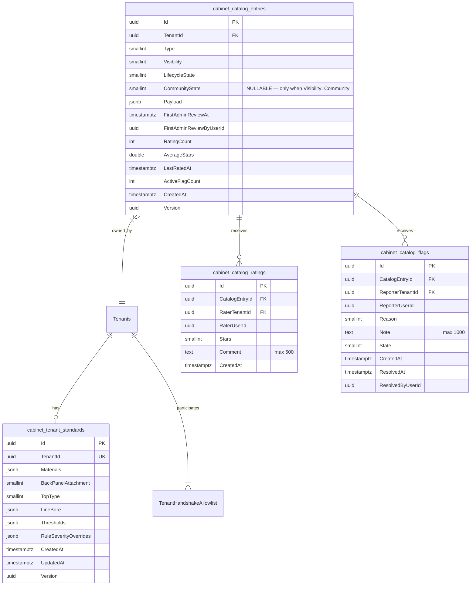

# SpaceOS — Cabinet 0.3 Federation Architecture
## Catalog Federation (Shared + Community) · TenantStandard Aggregate · ConstructionRuleEngine Parallelism

> **Verzió:** v4.0 — 2026-04-27 (Backend review absorbed: 0🔴 + 4🟠 + 4🟡 + 0🟢 finding) — IMPLEMENTÁCIÓRA KÉSZ
> **Státusz:** ✅ FINAL — minden review pass befejezve; Claude Code handoff-ra kész
> **Blokkoló feltétel:** Cabinet 0.2 IMPLEMENTÁCIÓRA KÉSZ ✅ (518 teszt, git: `3098a60`, 10 NuGet csomag deployed)
> **Kumulált review:** Pipeline indul — `database-designer` + `database-schema-designer` → v2
> **Csomag-bumps:** Cabinet 0.2.x → 0.3.0 (Catalog, Domain, Construction); Cabinet 0.2.x → 0.2.1 (Geometry, Abstractions, Machining, Assembly, Semantics — patch)
> **Becsült effort:** ~13–15 fejlesztői nap (v4 final; Channel pattern + EF UPSERT raw + handler mátrix +0.75 nap)
> **Multi-target:** `net8.0;net10.0` változatlanul (.NET 8 LTS server + .NET 10 AutoCAD plugin)
> **Schema-version:** SkeletonSnapshot `"0.2"` → `"0.3"` (forward-only, `SnapshotMigrator_0_2_to_0_3`)
>
> **v1.0 → v1.1 változások:**
> - §3.1: TenantStandard framing — module-scoped (egy tenant N db TenantStandard-ot tarthat), nem trade-type-bound
> - §3.2: `CommunityPublishedState` FSM **törölve** → auto-publish + `SimilarityFingerprint` clustering + flag-based soft-hide
> - §3.5b: új — `CatalogEntryCluster` aggregate, `ICatalogFingerprintExtractor` per CatalogType
> - §3.7: `ICommunityModerationProvider` átnevezve `IFlagModerationProvider`-re (csak flag-okat kezel, nem publikációt)
> - §4: DB schema delták (`SimilarityFingerprint` + `ClusterId` mezők, `cabinet_catalog_clusters` tábla, `CommunityState` mező törölve)
> - §5: 4 admin moderation endpoint törölve (no publication gate); marad 2 flag-only admin endpoint

---

## 1. Kumulált Finding Összesítő (v1 → v2)

| Review | Finding-ek | Legfontosabb javítás | Effort delta |
|--------|-----------|----------------------|--------------|
| v1.0 DRAFT | — | (User feedback iteration v1.0→v1.1: framing + auto-publish + cluster) | 9.0 nap |
| v1.1 → `database-designer` + `database-schema-designer` → v2 | 1🔴 + 8🟠 + 4🟡 + 2🟢 | RLS rating-read leak (CRITICAL) · trigger-maintained rollup · GENERATED IsAutoHidden · idempotency key · numeric(3,2) AverageStars · bigint Version | +1.0 nap |
| v2 → `senior-security` → v3 | 2🔴 + 6🟠 + 4🟡 + 1🟢 | RLS bypass via setting injection (role-based migration) · Server-side fingerprint enforcement · Time-bounded acknowledgment · Parallel context-leak ban · Fingerprint poisoning probation · Index-only-scan side-channel | +1.5 nap |
| v3 → `senior-backend` → v4 (fókuszált 3 területre) | 4🟠 + 4🟡 | Channel<T> pattern (BE-01) · MaxDegreeOfParallelism cap=8 (BE-02) · Sync overload törölve (BE-03) · EF UPSERT raw SQL (BE-04) · Aggregate-method elsődleges, trigger backup (BE-06) · Handler mátrix (BE-07) · ConfigureAwait analyzer (BE-08) | +0.75 nap |
| **Összesen (v4 FINAL)** | **3🔴 + 18🟠 + 12🟡 + 3🟢 = 36** | | **~13 fejlesztői nap** |

### Egyedi Finding-ek (v2)

| ID | Súly | Terület | Probléma | v2 javítás |
|----|------|---------|----------|-----------|
| DB-01 | 🔴 CRITICAL | RLS leak | `cabinet_catalog_ratings.rating_read_published USING (true)` — Private/Shared entry-k ratingjei is publikusan olvashatók | RLS policy átírva: olvasás csak ha `entry.Visibility = 3 AND entry.IsAutoHidden = false` (EXISTS subquery) |
| DB-02 | 🟠 HIGH | Numerikus precizitás | `AverageStars double precision` — floating-point drift incrementális rating-update-eken | `numeric(3,2)` (exact decimal); EF Core `[Precision(3,2)]` |
| DB-03 | 🟠 HIGH | Denormalizált rollup | 5 denormalizált mező drift-vulnerable, fenntartási mechanizmus nem specifikált | Trigger-maintained: `AFTER INSERT/DELETE` rating/flag triggerek atomikus aggregate-update-tel; heti reconciliation-job drift-detection-re |
| DB-04 | 🟠 HIGH | Származtatott állapot | `IsAutoHidden boolean` storable — drift-veszély | `GENERATED ALWAYS AS (...) STORED` (PG 12+); domain csak `ActiveFlagCount` és `AdminAcknowledgedFlags`-t mutál |
| DB-05 | 🟠 HIGH | FK lifecycle | `ON DELETE RESTRICT CanonicalEntry` blokkolja az admin Remove-ot | Domain invariant: `RemoveByAdmin` előtt cluster.RecomputeCanonical() másik member-rel; cluster size=1 → soft-delete a clustert |
| DB-06 | 🟠 HIGH | Concurrency token | `Version uuid` — fölösleges 16-byte; bigint olcsóbb és index-hatékonyabb | `Version bigint NOT NULL DEFAULT 1`; `BumpVersion()` increment |
| DB-07 | 🟠 HIGH | UpdatedAt trigger | Stale `UpdatedAt` ha handler elfelejti | `BEFORE UPDATE` trigger minden új Cabinet 0.3 táblán |
| DB-08 | 🟠 HIGH | Idempotencia | Submit retry duplikált entry-t hoz létre, fingerprint UQ csak cluster-szintű | `IdempotencyKey uuid NULL` + UQ partial index `(TenantId, IdempotencyKey)` |
| DB-09 | 🟠 HIGH | EF Core navigation | Backing field config hiányos a Rating/Flag collection-eken | Explicit `Navigation("X").HasField("_x").UsePropertyAccessMode(Field)` mindkét collection-re |
| DB-10 | 🟡 MEDIUM | JSONB size | TenantStandard jsonb mezők DB-szintű size guard nélkül | `CHECK (octet_length(jsonb_col::text) <= N)` minden jsonb-en (4 KB / 16 KB) |
| DB-11 | 🟡 MEDIUM | Re-rating upsert | UQ(Entry,Tenant) miatt UPDATE de aggregate-update transaction nem specifikált | CTE-alapú atomikus old-fetch + UPSERT + aggregate-recalc; AFTER UPDATE trigger backup |
| DB-12 | 🟡 MEDIUM | Collation | `Fingerprint` locale-dependent — case/Unicode-egyezés non-deterministic | `varchar(200) COLLATE "C"` mind a 2 helyen |
| DB-13 | 🟡 MEDIUM | Down migrations | DoD megemlíti, sketch nem | §4.6 új sub-section: 4 migration Down() SQL teljes |
| DB-14 | 🟢 LOW | Fingerprint regex | Trailing colon engedélyezett (szemantikailag invalid) | `^[a-z0-9]([a-z0-9-]*:)+[a-z0-9-]+$` |
| DB-15 | 🟢 LOW | Index szimmetria | Flag-en hiányzik a rate-limit/analytics index | + `IX_cabinet_catalog_flags_ReporterTenant ON ("ReporterTenantId","CreatedAt")` |
| **SEC-01** | 🔴 CRITICAL | RLS bypass — `app.is_cabinet_moderator` setting injection | `current_setting('...', true)` 2. param "missing OK" — `SET LOCAL` injection-nel bárki moderátor lehet | Role-based migration: `CREATE ROLE cabinet_moderator_role`; host-side `SET ROLE` request scope-ban; RLS `USING (current_user = '...')` |
| **SEC-02** | 🔴 CRITICAL | Trust boundary — fingerprint client-supplied | `SubmitCommand` DTO-ja megengedi a `SimilarityFingerprint` szállítását — server-side enforcement nem garantált | DTO-ból törölve; handler kötelezően `_fingerprintExtractor.Extract` hív; `BEFORE INSERT/UPDATE` trigger DB-szinten újraszámolja a fingerprint-et a `Payload`-ból; Roslyn analyzer ban setter access-re |
| SEC-03 | 🟠 HIGH | Permanent ack misuse | `AdminAcknowledgedFlags = true` örökre immunissá teszi az entry-t | `AdminAcknowledgedUntil timestamptz NULL`, default 90 nap; GENERATED `IsAutoHidden` formula update |
| SEC-04 | 🟠 HIGH | Parallel.ForEachAsync TenantContext-leak | AsyncLocal scope szivárgás cross-tenant rule execution-höz vezethet | Architectural ban: `RuleContext.TenantId` caller-supplied (NOT AsyncLocal); property-based teszt 4 párhuzamos tenant-tel |
| SEC-05 | 🟠 HIGH | Fingerprint poisoning | Malicious tenant rossz payload-dal csatlakozik kanonikus clusterhez | 7 napos cluster-membership probation; flag-küszöb (≥1) megakasztja a kanonikus jelölést |
| SEC-06 | 🟠 HIGH | Index-only-scan timing side-channel | DB-01 EXISTS predikátum timing-szivárgás Private entry-k létezésére | 200 OK uniform response (vs 404), `LIMIT 1` always; opaque-token endpoint Phase 0.4-re |
| SEC-07 | 🟠 HIGH | `SECURITY DEFINER` risk on trigger functions | Default INVOKER, de `LANGUAGE plpgsql` permissive | Explicit `SECURITY INVOKER` + `SET search_path = pg_catalog, public` minden function-en; DoD gate `prosecdef = false` |
| SEC-08 | 🟡 MEDIUM | Idempotency key spoofing | Deterministic key generation kliens-oldalon collision-vulnerable | Server-side 24h scope-window enforcement; doc-recommendation `Guid.NewGuid()` |
| SEC-09 | 🟡 MEDIUM | Mass-rename / fingerprint-shift attack | Update payload → új fingerprint, rating-history transzfer-bug | Update flow guard: fingerprint-change → reset rating-history a target clusterben |
| SEC-10 | 🟡 MEDIUM | DROP CASCADE risk on shared function | `cabinet_set_updated_at()` 4 trigger-rel | Down() migration explicit `DROP TRIGGER` előbb, `DROP FUNCTION ... RESTRICT` |
| SEC-11 | 🟡 MEDIUM | Rate-limit per-tenant nem per-user | Compromised user megeszi a teljes tenant quota-t | Rate-limit kulcs `(TenantId, UserId)`; tenant-cap is, magasabb limittel |
| SEC-12 | 🟡 MEDIUM | Cabinet 0.2 örökölt LifecycleState clusterben ghost-marad | Tenant Remove-olja, cluster member ghost | Event handler kötelező trigger `Cluster.RemoveMember`-re |
| SEC-13 | 🟢 LOW | Comment/Note PII | "no PII" XML-doc, sanitization minta hiányzik | Regex-strip (email, telefon-pattern) char-limit; NLP-PII detect Phase 3D |
| BE-01 | 🟠 HIGH | RuleEngine: ConcurrentBag → Channel<T> | ConcurrentBag heap-pressure 500+ Part skeleton-on, ~5x memóriafogyás | `Channel.CreateUnbounded<T>(SingleReader=true)`, ring-buffer, 30-40% gyorsulás 500-Part-on |
| BE-02 | 🟠 HIGH | MaxDegreeOfParallelism = ProcessorCount kéretlen | 16 vCPU + 16 worker DB pool exhaustion lookup-heavy rule-okkal | Cap = `Math.Min(ProcessorCount, 8)`; RuleSeverityOverride pre-cache-elt Dict a RuleContext factory-ben |
| BE-03 | 🟠 HIGH | Sync-over-async overload deadlock-rizikó | `ApplyAll().GetResult()` AutoCAD UI thread-en deadlock | Sync overload törölve; AutoCAD plugin upgrade `await`-re |
| BE-04 | 🟠 HIGH | EF Core idempotency UPSERT race | Naïve `Add+SaveChanges` 2 párhuzamos request-en `DbUpdateException` | Raw SQL `INSERT ... ON CONFLICT (TenantId,IdempotencyKey) DO UPDATE ... RETURNING Id` |
| BE-05 | 🟡 MEDIUM | Outbox pattern szükséges-e? | Domain event-ek synchron handler-ek, message broker NINCS | NEM kell; explicit doc note: "synchron domain events, NOT outbox" — Cabinet 0.4+ Marketplace döntheti |
| BE-06 | 🟠 HIGH | Trigger-frissített rollup vs EF tracking stale | Handler post-SaveChanges entry.Ratings.Count = pre-trigger érték | Aggregate-method elsődleges (`IngestRating` belül számolja), trigger defense-in-depth backup |
| BE-07 | 🟡 MEDIUM | v3 új event-ek → handler mátrix | CatalogEntryFingerprintChanged kihez fut? | §3.5c új sub-section: 4 új handler dokumentálva (RatingHistoryReset, ClusterReassign, ClusterMemberRemove, FlagAuditLog) |
| BE-08 | 🟡 MEDIUM | ConfigureAwait audit | 15+ új handler async call-okkal | DoD gate: `grep -v ConfigureAwait → 0`; Microsoft.VisualStudio.Threading.Analyzers VSTHRD111 → error |

---

## 2. Scope és immutable foundation

### 2.1 Cabinet 0.3 felelősségek

A Cabinet 0.3 a Cabinet 0.2 §11.2 parking finding listáját **konkrét deliverable-ekké alakítja**:

| Téma | Honnan | Cabinet 0.3 deliverable |
|---|---|---|
| Catalog Tenant-shared adatforrás | Cabinet 0.2 D-02, A15 stage 1 | `TenantHandshakeAllowlist` integráció (Kernel-side cross-reference); `IShareLineageResolver` port; `Skeleton.PinCatalogEntry` Shared-réteg engedélyezés |
| Catalog Community adatforrás | Cabinet 0.2 D-02, A15 stage 2 | **Auto-publish** (no gate) + `SimilarityFingerprint` extraction per CatalogType + `CatalogEntryCluster` aggregate (canonical entry kiválasztás rating-súlyozottan) + `CatalogEntryRating` quality signal + `CatalogEntryFlag` soft-hide threshold (≥3 distinct flag → hidden until admin review) + rate-limit (DoS védelem) |
| TenantStandard valódi aggregate | Cabinet 0.1 A9 (csak interface élt) | `TenantStandard` aggregate (Cabinet.Domain); 1 row/Tenant; Cabinet 0.1 `ITenantStandardProvider` port a read-side adapter |
| `ConstructionRuleEngine.ApplyAll` párhuzamosítás | Cabinet 0.1 BE-CAB-5 | `Parallel.ForEachAsync` Part-szinten; rule-ök szekvenciálisan egy Part-en belül |
| `SemanticInferenceService` O(N²) → O(N log N) | Cabinet 0.1 BE-CAB-1 | **OPCIONÁLIS** — csak BenchmarkDotNet bizonyíték esetén; v3 review döntheti |

### 2.2 Mit nem csinál a Cabinet 0.3

| Téma | Hová tartozik |
|---|---|
| `Skeleton.DeriveBillOfServices()` valódi implementáció (B2B Marketplace-rendelés) | Cabinet 0.x későbbi (Marketplace fázis) |
| AssemblyDocumentation **renderelt** ExplodedView | Adapter-rétegek (CabinetBilder.Adapter.AutoCAD, cabinet-web) |
| Cross-request CatalogEntry cache (`IDistributedCache` / Redis) | Cabinet 0.x későbbi (csak ha perf-méréseink kimutatják) |
| Community Catalog UI (publikációs flow, rating widget, flag form) | Portal-szint (Doorstar Portal, asztalostech.hu) — Cabinet csomag csak a domain + REST endpoint contract-ot biztosítja |
| AssemblyStep alapján élő gyártás-tracking (FlowEpic FSM Kanban) | Külön phase (Portal/Orchestrator) |

### 2.3 Cabinet 0.1 + 0.2 mint immutable foundation

A Cabinet 0.3 **nem ír újra** semmit. Cabinet 0.1 (A1–A11, 7 NuGet csomag) és Cabinet 0.2 (A12–A16 az implementált formában, 10 NuGet csomag) változatlanok és immutable dependency-ként működnek.

**Csomag-szintű érintettség:**

| Csomag | Cabinet 0.2 verzió | Cabinet 0.3 verzió | Változás |
|---|---|---|---|
| `SpaceOS.Cabinet.Geometry` | 0.2.x | 0.2.1 | Patch (egyetlen `BoundingBoxF` extension method `IShareLineageResolver`-hez, opcionális) |
| `SpaceOS.Cabinet.Abstractions` | 0.2.x | **0.3.0** | Új port-ok: `IShareLineageResolver`, `IFlagModerationProvider`, `ICatalogFingerprintExtractor`, `IRatingRepository`, `IFlagRepository`, `ITenantStandardRepository` |
| `SpaceOS.Cabinet.Domain` | 0.2.x | **0.3.0** | Új aggregate: `TenantStandard`; bővített `CatalogEntry` (Community state + rating aggregate); `SkeletonSnapshot.SchemaVersion = "0.3"`; `SnapshotMigrator_0_2_to_0_3` |
| `SpaceOS.Cabinet.Machining` | 0.2.x | 0.2.1 | Patch (nincs API-bővítés, csak NuGet rebuild a 0.3.0 Abstractions ellen) |
| `SpaceOS.Cabinet.Construction` | 0.2.x | **0.3.0** | `ConstructionRuleEngine.ApplyAll` `Parallel.ForEachAsync` átírás; thread-safe context kezelés |
| `SpaceOS.Cabinet.Catalog` | 0.2.x | **0.3.0** | `CatalogEntry` Community state machine; `CatalogEntryRating`, `CatalogEntryFlag` child entitások; rate-limit service; `IShareLineageResolver` integráció |
| `SpaceOS.Cabinet.Assembly` | 0.2.x | 0.2.1 | Patch (nincs API-bővítés) |
| `SpaceOS.Cabinet.Semantics` | 0.2.x | 0.2.1 vagy **0.3.0** | Patch alapból; **0.3.0** ha BE-CAB-1 spatial indexing aktiválódik (review döntés) |
| `SpaceOS.Cabinet.Application` | 0.2.x | **0.3.0** | Új MediatR command-ok: `SubmitCatalogRating`, `SubmitCatalogFlag`, `MarkCatalogPublishedByPeerReview`, `UpdateTenantStandard`, `OverrideRuleSeverity`; companion query-k és validátorok |
| `SpaceOS.Cabinet` (meta) | 0.2.x | **0.3.0** | Csomag-koordinátor minor-bump |

**Kötelező Cabinet 0.1+0.2 axiómák betartása Cabinet 0.3-ban:**
- A1–A11 (Cabinet 0.1) — változatlan
- A12–A16 (Cabinet 0.2) — változatlan; A15 most stage 2-re ér (Shared + Community aktiválás)
- D1–D18 design decisions — változatlan

---

## 3. Domain modell

### 3.1 TenantStandard aggregate (új — A9 finalizálás)

**Cabinet 0.1-ben** csak az `ITenantStandardProvider` interface élt (port). Az adapter (CabinetBilder.Adapter.AutoCAD) `InMemoryTenantStandardProvider`-t implementált statikus default-okkal. **Cabinet 0.3** ezt felváltja egy valódi, perzisztens aggregate-tel; az interface marad mint **read-side port**, az írás-oldal MediatR command-okon át történik.

**Scope-tisztázás (v1.1):** a `TenantStandard` **module-scoped**, NEM trade-type-bound. Egy tenant N db TenantStandard-ot tarthat — egyet minden modulra, amit fogyaszt:

| Tenant | TenantType | Modulok | TenantStandard rows |
|---|---|---|---|
| Asztalos Profi Kft. | Manufacturer | `cabinet` | 1× Cabinet (32mm raster, 18mm korpusz, HDF Groove) |
| Doorstar Kft. | Manufacturer | `door`, `cabinet` | 1× Cabinet (ha cabinet template-eket épít) + 1× Door (jövőbeli, Door 0.x) |
| Bútor Mester Kft. | Manufacturer | `door`, `cabinet`, `window` | 3× egy modulonként (jelenleg csak Cabinet aktív) |
| LapSzab Kft. | PanelCutter | `cutting` | 0× Cabinet (nem cabinet-fogyasztó) |

A `TenantStandard` aggregate primary key = `TenantId` (UNIQUE). Door 0.x → `DoorTenantStandard` aggregate (saját table, saját aggregate, hasonló mintával). Window → `WindowTenantStandard`. Egy tenant DI-resolve-on át a saját aktuálisan releváns `ITenantStandardProvider`-t kapja.

```csharp
// SpaceOS.Cabinet.Domain — TenantStandard.cs

namespace SpaceOS.Cabinet.Domain;

/// <summary>
/// Tenant-szintű cabinet-specifikus default értékek és rule severity override-ok.
/// Egy Tenant = egy aggregate. Ha nincs row, az adapter egy implicit default-set-tel
/// inicializál (Doorstar default-set, lásd Cabinet 0.1 §4.7).
/// </summary>
public sealed class TenantStandard : AggregateRoot<Guid>
{
    public Guid TenantId { get; private set; }

    // Anyag-default (cabinet carcass + back panel)
    public MaterialDefaults Materials { get; private set; }

    // Konstrukciós konvenciók
    public BackPanelAttachmentDefault BackPanelAttachment { get; private set; }
    public TopType TopType { get; private set; }

    // 32mm raster (line-bore default geometria)
    public LineBoreSettings LineBore { get; private set; }

    // Konstrukciós szabály-küszöbök (advisory triggerek)
    public RuleThresholds Thresholds { get; private set; }

    // Rule severity override-ok (rule-id → AdvisorySeverity)
    private readonly Dictionary<string, AdvisorySeverity> _ruleSeverityOverrides = new();
    public IReadOnlyDictionary<string, AdvisorySeverity> RuleSeverityOverrides
        => _ruleSeverityOverrides.AsReadOnly();

    public DateTimeOffset CreatedAt { get; private set; }
    public DateTimeOffset UpdatedAt { get; private set; }
    public long Version { get; private set; }  // DB-06: bigint optimistic concurrency

    // EF Core
    private TenantStandard() { }

    public static Result<TenantStandard> Create(
        Guid tenantId,
        MaterialDefaults materials,
        BackPanelAttachmentDefault backPanelAttachment,
        TopType topType,
        LineBoreSettings lineBore,
        RuleThresholds thresholds,
        Guid actorUserId)
    {
        if (tenantId == Guid.Empty)
            return Result.Invalid("TenantId required");

        var now = DateTimeOffset.UtcNow;
        var ts = new TenantStandard
        {
            Id = Guid.NewGuid(),
            TenantId = tenantId,
            Materials = materials,
            BackPanelAttachment = backPanelAttachment,
            TopType = topType,
            LineBore = lineBore,
            Thresholds = thresholds,
            CreatedAt = now,
            UpdatedAt = now,
            Version = 1
        };

        ts.RaiseEvent(new TenantStandardCreated(ts.Id, tenantId, actorUserId, now));
        return Result.Success(ts);
    }

    public Result UpdateMaterials(MaterialDefaults materials, Guid actorUserId, long expectedVersion)
    {
        if (Version != expectedVersion)
            return Result.Conflict("TenantStandard version mismatch");

        Materials = materials;
        BumpVersion();
        RaiseEvent(new TenantStandardMaterialsUpdated(Id, TenantId, materials, actorUserId, UpdatedAt));
        return Result.Success();
    }

    public Result UpdateLineBore(LineBoreSettings lineBore, Guid actorUserId, long expectedVersion) { /* ... */ }
    public Result UpdateThresholds(RuleThresholds thresholds, Guid actorUserId, long expectedVersion) { /* ... */ }
    public Result UpdateConstructionDefaults(BackPanelAttachmentDefault bpa, TopType tt, Guid actorUserId, long expectedVersion) { /* ... */ }

    public Result OverrideRuleSeverity(string ruleId, AdvisorySeverity severity, Guid actorUserId, long expectedVersion)
    {
        if (Version != expectedVersion) return Result.Conflict("TenantStandard version mismatch");
        if (string.IsNullOrWhiteSpace(ruleId)) return Result.Invalid("ruleId required");

        _ruleSeverityOverrides[ruleId] = severity;
        BumpVersion();
        RaiseEvent(new TenantStandardRuleSeverityOverridden(Id, TenantId, ruleId, severity, actorUserId, UpdatedAt));
        return Result.Success();
    }

    public Result ClearRuleSeverityOverride(string ruleId, Guid actorUserId, long expectedVersion) { /* ... */ }

    private void BumpVersion()
    {
        UpdatedAt = DateTimeOffset.UtcNow;
        Version++;  // DB-06: monotonic increment, EF Core IsConcurrencyToken handles WHERE Version = ?
    }
}

// VO-k
public sealed record MaterialDefaults(
    string CarcassMaterial,
    double CarcassThicknessMm,
    string BackPanelMaterial,
    double BackPanelThicknessMm);

public sealed record LineBoreSettings(
    bool Enabled,
    double FirstHoleOffsetMm,   // default 38.0
    double SpacingMm,            // default 32.0
    double DiameterMm);          // default 5.0

public sealed record RuleThresholds(
    double TallCabinetHeightMm,  // default 2000.0
    double LongShelfMm);         // default 800.0
```

**Read-side adapter** (Cabinet 0.1 `ITenantStandardProvider` port marad változatlan):

```csharp
// SpaceOS.Cabinet.Catalog — DbBackedTenantStandardProvider.cs (új)

public sealed class DbBackedTenantStandardProvider : ITenantStandardProvider
{
    private readonly ITenantStandardRepository _repository;
    private readonly ITenantContext _tenantContext;
    private readonly TenantStandardDefaults _fallback;  // ha nincs row, ez használódik

    public Guid TenantId => _tenantContext.CurrentTenantId;

    // ... 12 mező implementáció: ha _cached null, fallback default-ok; egyébként _cached.X
}
```

**Domain események:**

| Esemény | Mikor | Payload |
|---|---|---|
| `TenantStandardCreated` | Új TenantStandard létrejön | TenantStandardId, TenantId, ActorUserId, At |
| `TenantStandardMaterialsUpdated` | Anyag-default-ok változnak | TenantStandardId, TenantId, NewMaterials, ActorUserId, At |
| `TenantStandardLineBoreUpdated` | 32mm raster beállítások változnak | TenantStandardId, TenantId, NewSettings, ActorUserId, At |
| `TenantStandardThresholdsUpdated` | RuleThresholds változnak | TenantStandardId, TenantId, NewThresholds, ActorUserId, At |
| `TenantStandardConstructionDefaultsUpdated` | BackPanelAttachment / TopType vált | TenantStandardId, TenantId, NewBpa, NewTopType, ActorUserId, At |
| `TenantStandardRuleSeverityOverridden` | Rule severity override beállítva | TenantStandardId, TenantId, RuleId, Severity, ActorUserId, At |
| `TenantStandardRuleSeverityCleared` | Rule severity override törölve | TenantStandardId, TenantId, RuleId, ActorUserId, At |

### 3.2 CatalogEntry Community — auto-publish + similarity-cluster (A15 stage 2)

A Cabinet 0.2-ben a `CatalogEntry.Visibility = Community` érték **schema-szinten létezik**, de adatforrás nincs: a 6-szintű resolution (Skeleton-pin → Template-default → Tenant-private → Tenant-shared → Community → Curated) Community rétege üres. Cabinet 0.3 ezt **gate nélkül** aktiválja: bárki bármikor publikálhat (a B2B kereskedelem dinamikája ezt megköveteli — nem lehet az Egger H1334-et új tenantként napokig adminra várni).

**v1.1 alapelv:** a probléma NEM a publikáció gate-elése, hanem a **duplikátumok kezelése** — ár-összehasonlító oldalak mintájára. Ha 47 tenant feltölti az "Egger H1334 ST9 18mm"-et, a cél nem 47 entry blokkolása, hanem 47 entry **clusterezése egyetlen kanonikus reprezentáció köré**.

**Életciklus (drasztikusan egyszerűbb mint az eredeti FSM):**

```
   Submit ─auto-publish─► Visible
                            │
                            ├──► Cluster auto-join (ha SimilarityFingerprint matches)
                            │
                            └──[≥3 distinct flag]──► AutoHidden
                                                       │
                                                       ├──[admin clears]──► Visible (flags resolved)
                                                       └──[admin removes]──► LifecycleState=Removed
```

A `CatalogLifecycleState` (Draft / Published / Deprecated / Archived / Removed) Cabinet 0.2-ből változatlan. **NINCS új `CommunityPublishedState` FSM.** Helyette két új flag-szerű mező a `CatalogEntry`-n:

| Mező | Típus | Szemantika |
|---|---|---|
| `IsAutoHidden` | bool (default false) | `true` ha `ActiveFlagCount >= 3` AND admin még nem clear-elte |
| `AdminAcknowledgedFlags` | bool (default false) | `true` ha admin manually clear-elte a flag-eket → ez bypass-olja a 3-flag threshold-ot |

**Resolution behavior:** a 6-szintű resolution Community rétege `WHERE LifecycleState = Published AND IsAutoHidden = false`. Hidden entry-k publikus query-ből láthatatlanok, de DB-ben megmaradnak admin review-ig.

**Rate-limit védelem (DoS és abuse, NEM publikációs gate; SEC-11: per-user + per-tenant kettős cap):**

| Limit | User-cap (alsó) | Tenant-cap (felső) | Tárolás | Indok |
|---|---|---|---|---|
| Publikációk per nap | 50 / user | 200 / tenant | Redis sliding window key: `(TenantId, UserId)` és `(TenantId)` | SEC-11: compromised user nem fogyasztja a teljes tenant kvótát |
| Rating-ek per nap | 50 / user | 200 / tenant | ugyanaz | Rating-bombing + insider abuse |
| Flag-ek per nap | 20 / user | 80 / tenant | ugyanaz | Flag-abuse + insider abuse |
| Cooldown ugyanazon entry-re | 30 nap rating-update, 24h flag-resubmit | — | Per (TenantId, EntryId) | Kettős értékelés blokkolás |
| Self-rating tilalom | Hard-block | — | DB CHECK + trigger | A `CatalogEntry.TenantId == Rating.RaterTenantId` tilos |
| Self-flag tilalom | Hard-block | — | DB trigger | Saját entry flag-elés értelmetlen |

### 3.2b Similarity fingerprint + clustering (új koncepció)

**`SimilarityFingerprint`** — egy normalizált string, amit type-specifikus extractor szed ki a `Payload` JSONB-ből. A fingerprint a CANONIKUS azonosító — ha két entry-nek azonos a fingerprint-je, ugyanaz a real-world product (~95% confidence; manuális link Cabinet 0.4+).

```csharp
// SpaceOS.Cabinet.Abstractions — ICatalogFingerprintExtractor.cs (új port)

public interface ICatalogFingerprintExtractor
{
    /// <summary>
    /// Type-specific fingerprint extraction. Returns null if the entry payload
    /// has no extractable canonical identifier (custom recipes, bespoke templates).
    /// Format: "type:vendor:code:variant" — lowercase, hyphenated, ASCII-only.
    /// </summary>
    string? Extract(CatalogType type, JsonDocument payload);
}
```

**Példa implementációk:**

| CatalogType | Fingerprint extraction logika | Példa output |
|---|---|---|
| `MaterialDefinition` | `payload.manufacturer + payload.code + payload.thickness_mm` normalizálva (lowercase, ékezetek strip, whitespace → hyphen) | `material:egger:h1334-st9:18mm` |
| `HardwareDefinition` | `payload.brand + payload.model + payload.angle/finish` | `hardware:hettich:sensys-8645i:110` |
| `EdgebandDefinition` | `payload.manufacturer + payload.color_match + payload.thickness_mm` | `edgeband:rehau:abs-h1334-st9:1mm` |
| `JointDefinition` | mindig null (jointing recipes egyediek) | `null` |
| `ConstructionTemplate` | mindig null (custom recipes) | `null` |

A null fingerprint = entry **nem clusterezhető**, standalone marad. A 6-szintű resolution Community rétege ilyenkor minden standalone entry-t lát.

**`CatalogEntryCluster` aggregate:**

```csharp
// SpaceOS.Cabinet.Catalog — CatalogEntryCluster.cs (új aggregate)

public sealed class CatalogEntryCluster : AggregateRoot<Guid>
{
    public string Fingerprint { get; private set; }    // canonical identifier
    public CatalogType Type { get; private set; }

    private readonly List<Guid> _memberEntryIds = new();
    public IReadOnlyList<Guid> MemberEntryIds => _memberEntryIds.AsReadOnly();

    public Guid CanonicalEntryId { get; private set; }  // legjobb entry a clusterben
    public DateTimeOffset CreatedAt { get; private set; }
    public DateTimeOffset UpdatedAt { get; private set; }
    public Guid Version { get; private set; }

    public static Result<CatalogEntryCluster> CreateForEntry(
        string fingerprint, CatalogType type, Guid initialEntryId) { /* ... */ }

    public Result AddMember(Guid entryId, RatingAggregate entryRating)
    {
        if (_memberEntryIds.Contains(entryId)) return Result.Conflict("Already member");
        _memberEntryIds.Add(entryId);
        // canonical kiválasztás potenciálisan újraindul — lazy, scheduled job
        BumpVersion();
        RaiseEvent(new ClusterMemberAdded(Id, entryId, _memberEntryIds.Count));
        return Result.Success();
    }

    public Result RemoveMember(Guid entryId) { /* ha üres lesz a cluster, soft-delete */ }

    /// <summary>
    /// Canonical entry kiválasztás — rating × completeness × age súlyozott score.
    /// Háttér-job-ból hívott (nem real-time minden new member után).
    /// SEC-05: 7 napos probation — friss member NEM kanonikus-jelölhető.
    /// </summary>
    public Result RecomputeCanonical(IReadOnlyDictionary<Guid, ClusterScoringInputs> memberScores)
    {
        if (_memberEntryIds.Count == 0) return Result.Invalid("Empty cluster");

        // SEC-05: probation szűrő — eligible memberek azok, amelyek >= 7 napja léteznek
        // ÉS nincs aktív flag-jük
        var probationCutoff = DateTimeOffset.UtcNow.AddDays(-7);
        var eligibleIds = _memberEntryIds
            .Where(id => memberScores.ContainsKey(id))
            .Where(id => memberScores[id].CreatedAt < probationCutoff)
            .Where(id => memberScores[id].ActiveFlagCount == 0)
            .ToList();

        if (eligibleIds.Count == 0)
            return Result.Success(); // egyetlen member sem eligible → canonical marad

        // Score = (AverageStars × 0.5) + (PayloadCompleteness × 0.3) + (RecencyDecay × 0.2)
        // Tie-break: Id ASC (determinisztikus)
        var newCanonical = eligibleIds
            .Select(id => (id, score: ComputeScore(memberScores[id])))
            .OrderByDescending(x => x.score)
            .ThenBy(x => x.id)
            .First().id;

        if (newCanonical != CanonicalEntryId)
        {
            var old = CanonicalEntryId;
            CanonicalEntryId = newCanonical;
            BumpVersion();
            RaiseEvent(new ClusterCanonicalChanged(Id, old, newCanonical));
        }
        return Result.Success();
    }
}

public sealed record ClusterScoringInputs(
    RatingAggregate Ratings,
    int PayloadFieldCount,       // hány opcionális mezőt tölt ki — completeness proxy
    DateTimeOffset CreatedAt,    // recency + SEC-05 probation
    int ActiveFlagCount);         // SEC-05: flagged membert nem jelölünk kanonikussá
```

**Auto-cluster flow Submit-on:**

```
1. Submit CatalogEntry(payload, visibility=Community)
   ↓
2. fingerprintExtractor.Extract(type, payload) → fingerprint vagy null
   ↓
3. ha fingerprint != null:
      ha létezik CatalogEntryCluster(fingerprint, type) → AddMember(entryId)
      ha nem → CreateForEntry(fingerprint, type, entryId)  // standalone cluster, member count=1
   ha fingerprint == null:
      entry.ClusterId = null → standalone, nem clusterezhető
   ↓
4. entry.ClusterId beállítva (ha cluster van), entry.IsAutoHidden=false → publikus
```

**Resolution flow (Community layer):**

```
1. ResolveCatalogEntry(type, tenantId, context) — Community layer hit
   ↓
2. Query: cluster-canonical entry-k, ahol Type=requestedType AND NOT IsAutoHidden
   ORDER BY (cluster.AverageStars × cluster.MemberCount) DESC
   ↓
3. Vissza: legjobb canonical entry; UI alatta listázhat "47 másik tenant is feltöltötte ezt"
```

A 47-es tenant publikációja NEM blokkolt — egyszerűen csatlakozik a clusterhez, és ha a payload-ja "jobb" (kitöltöttebb, magasabb rating), idővel a `RecomputeCanonical` job kanonikussá teszi.


### 3.2c Server-side fingerprint enforcement (SEC-02 CRITICAL)

A `SimilarityFingerprint` mező **trust boundary**: ha a tenant kliens kontrollálhatja, akkor egy malicious tenant tudja override-olni a fingerprint-et és csatlakozni egy népszerű clusterhez (legitim entry-k közé), vagy elhagyni egy clustert detektálás-elkerülésre.

**Schema-szintű blokk (DTO-ban tilos):**

```csharp
// SpaceOS.Cabinet.Application — SubmitCommunityCatalogEntryCommand.cs

public sealed record SubmitCommunityCatalogEntryCommand(
    CatalogType Type,
    JsonDocument Payload,
    Guid? IdempotencyKey
    // SimilarityFingerprint NINCS itt — server-side computed
) : IRequest<Result<Guid>>;
```

**Handler kötelezően extraktol (NEM olvas DTO-ból):**

```csharp
public async Task<Result<Guid>> Handle(SubmitCommunityCatalogEntryCommand cmd, CancellationToken ct)
{
    // ... validáció, idempotency check ...

    var fingerprint = _fingerprintExtractor.Extract(cmd.Type, cmd.Payload);
    // ↑ ez a forrása az igazságnak; a tenant kliens NEM tudja override-olni

    var entryRes = CatalogEntry.CreateCommunity(
        tenantId: _tenant.CurrentTenantId,
        type: cmd.Type,
        payload: cmd.Payload,
        fingerprint: fingerprint,        // server-extracted
        idempotencyKey: cmd.IdempotencyKey);

    // ... cluster auto-join, persist ...
}
```

**Roslyn analyzer (architecture test):** tilos a `CatalogEntry.SimilarityFingerprint` setter / `with`-expression / reflection access Domain assembly-n kívülről. Egyetlen engedélyezett caller: `CatalogEntry.CreateCommunity` és `CatalogEntry.RecomputeFingerprint`.

**DB trigger defense-in-depth (override-ot a DB is felülírja):**

```sql
-- Migration 0028 kiegészítés (SEC-02)
CREATE OR REPLACE FUNCTION cabinet_recompute_fingerprint()
RETURNS TRIGGER AS $$
DECLARE
    server_fp text;
BEGIN
    -- Hívja a host-implemented PL/pgSQL extraction logikát.
    -- A function maga is egy CASE statement a Type alapján,
    -- payload mezőkből ASCII-normalizált fingerprint-et épít.
    SELECT cabinet_extract_fingerprint(NEW."Type", NEW."Payload") INTO server_fp;

    IF NEW."SimilarityFingerprint" IS DISTINCT FROM server_fp THEN
        -- Tenant kliens más fingerprint-et próbált beszúrni → audit-log + override
        INSERT INTO "audit_log_security_violations" ("Kind", "EntryId", "Detected", "At")
        VALUES ('cabinet_fingerprint_override_attempt', NEW."Id", row_to_json(NEW), now());

        NEW."SimilarityFingerprint" = server_fp;
    END IF;

    RETURN NEW;
END;
$$ LANGUAGE plpgsql SECURITY INVOKER SET search_path = pg_catalog, public;

CREATE TRIGGER "TR_cabinet_catalog_entries_FingerprintEnforce"
    BEFORE INSERT OR UPDATE OF "Payload", "SimilarityFingerprint"
    ON "cabinet_catalog_entries"
    FOR EACH ROW EXECUTE FUNCTION cabinet_recompute_fingerprint();
```

**Hármas védelem:** (1) DTO-ban nincs mező → kliens NEM TUD küldeni · (2) handler server-side extract-ot hív · (3) DB trigger felülír és audit-log-ol bármilyen mismatch-t.

**Kompromisszum:** a `cabinet_extract_fingerprint(Type, Payload)` PL/pgSQL function duplikálja a C# extractor logikát. Megoldás: integráció-teszt 1000 random payload-on biztosítja a két implementáció bit-egyezését.


**SEC-08 — Idempotency scope-window:** a handler csak akkor fogadja el az `IdempotencyKey`-t, ha az utolsó UPSERT 24h-n belüli. Régebbi key replay-attack-ot replay-ne, mert a handler: `IF idempotencyKey EXISTS AND createdAt + 24h < now() THEN ignore key, treat as new submit`. Doc-recommendation: kliens-oldali key-generálás `Guid.NewGuid()`-vel (NOT MD5/timestamp deterministic).

**DB-11 — Re-rating upsert pattern (új rating ugyanazon entry-re ugyanazon tenant-tól):**

Az `UQ(CatalogEntryId, RaterTenantId)` constraint miatt a re-rating egy UPDATE — nem új row. Az aggregate-update nem lehet egyszerű "increment+1": az old és új star-érték közti delta kell. Atomikus pattern:

```csharp
// SpaceOS.Cabinet.Application — SubmitCatalogRatingCommandHandler.cs (v2 javítás)

// Bemenet: cmd.CatalogEntryId, cmd.Stars, cmd.Comment

await using var tx = await _db.Database.BeginTransactionAsync(IsolationLevel.ReadCommitted, ct);

// 1. Upsert rating — return old stars (NULL ha első submit)
var upsertSql = @"
    INSERT INTO ""cabinet_catalog_ratings""
        (""Id"", ""CatalogEntryId"", ""RaterTenantId"", ""RaterUserId"", ""Stars"", ""Comment"", ""CreatedAt"")
    VALUES
        (@id, @entryId, @tenantId, @userId, @stars, @comment, now())
    ON CONFLICT (""CatalogEntryId"", ""RaterTenantId"") DO UPDATE
        SET ""Stars"" = EXCLUDED.""Stars"",
            ""Comment"" = EXCLUDED.""Comment"",
            ""CreatedAt"" = now()
    RETURNING (xmax <> 0) AS was_update;
";

// 2. Aggregate recompute — DB-03 trigger gondoskodik róla AFTER INSERT/UPDATE
//    de defense-in-depth: handler is hívja explicit
await _db.Database.ExecuteSqlRawAsync(
    "SELECT cabinet_recompute_rating_aggregate({0})", cmd.CatalogEntryId, ct);

await tx.CommitAsync(ct);
```

A trigger + explicit recompute kettős védelem: ha valamilyen ok miatt a trigger nem fut (extension constraint, replication-skew), a handler-ben futó recompute is helyrehozza.


### 3.3 CatalogEntryRating (új child entity)

```csharp
// SpaceOS.Cabinet.Catalog — CatalogEntryRating.cs

public sealed class CatalogEntryRating : Entity<Guid>
{
    public Guid CatalogEntryId { get; private set; }
    public Guid RaterTenantId { get; private set; }
    public Guid RaterUserId { get; private set; }
    public int Stars { get; private set; }            // 1..5
    public string? Comment { get; private set; }      // max 500 char (DTO size guard)
    public DateTimeOffset CreatedAt { get; private set; }

    public static Result<CatalogEntryRating> Create(
        Guid catalogEntryId, Guid raterTenantId, Guid raterUserId,
        int stars, string? comment, Guid entryOwnerTenantId)
    {
        if (raterTenantId == entryOwnerTenantId)
            return Result.Invalid("Self-rating not allowed");
        if (stars < 1 || stars > 5)
            return Result.Invalid("Stars must be 1..5");
        if (comment?.Length > 500)
            return Result.Invalid("Comment max 500 chars");

        return Result.Success(new CatalogEntryRating { /* ... */ });
    }
}
```

### 3.4 CatalogEntryFlag (új child entity)

```csharp
// SpaceOS.Cabinet.Catalog — CatalogEntryFlag.cs

public enum FlagReason
{
    Spam = 0,
    Inappropriate = 1,
    Plagiarism = 2,
    DangerousConstruction = 3,
    BrokenContent = 4,
    Other = 99
}

public enum FlagState
{
    Active = 0,
    AdminCleared = 1,    // admin reviewed, no action
    AdminUpheld = 2,     // admin agreed, entry removed
    Withdrawn = 3        // reporter withdrew
}

public sealed class CatalogEntryFlag : Entity<Guid>
{
    public Guid CatalogEntryId { get; private set; }
    public Guid ReporterTenantId { get; private set; }
    public Guid ReporterUserId { get; private set; }
    public FlagReason Reason { get; private set; }
    public string? Note { get; private set; }       // max 1000 char; SEC-13: regex-stripped before persist
    public FlagState State { get; private set; }
    public DateTimeOffset CreatedAt { get; private set; }
    public DateTimeOffset? ResolvedAt { get; private set; }
    public Guid? ResolvedByUserId { get; private set; }

    // SEC-13: minimal regex-strip a constructor-ban (email, magyar telefon-pattern)
    // Erősebb NLP-PII detect Phase 3D / GDPR work — most defenzív minimum.
    private static string? StripPii(string? input)
    {
        if (string.IsNullOrWhiteSpace(input)) return input;
        // E-mail
        input = Regex.Replace(input, @"[\w.+-]+@[\w.-]+\.[A-Za-z]{2,}", "[email]");
        // Telefon (HU) +36... vagy 06...
        input = Regex.Replace(input, @"(\+?36|06)[\s-]?\d{1,2}[\s-]?\d{3}[\s-]?\d{4}", "[phone]");
        return input;
    }
}
```

### 3.5 CatalogEntry bővítés Cabinet 0.3-ban

```csharp
// SpaceOS.Cabinet.Catalog — CatalogEntry (Cabinet 0.2 minor-bump → 0.3.0)

public sealed class CatalogEntry : AggregateRoot<Guid>
{
    // ... Cabinet 0.2 mezők változatlanok ...

    // ÚJ Cabinet 0.3-vel:
    public string? SimilarityFingerprint { get; private set; }   // null ha nem clusterezhető
    public Guid? ClusterId { get; private set; }                  // FK CatalogEntryCluster

    public bool IsAutoHidden { get; private set; }                // GENERATED — DB-04 + SEC-03
    public DateTimeOffset? AdminAcknowledgedUntil { get; private set; }  // SEC-03: 90 nap default

    // Denormalized rollup (eventual consistency)
    public RatingAggregate Ratings { get; private set; } = RatingAggregate.Empty;
    public int ActiveFlagCount { get; private set; }

    // Új mutáció methods (Cabinet 0.3, drasztikusan kevesebb mint v1.0):
    public Result AssignFingerprintAndCluster(string? fingerprint, Guid? clusterId) { /* a Submit/Update flow-on belül */ }

    /// <summary>SEC-09: ha a payload Update fingerprint-et változtat, az entry rating-history NEM transzferálódik.</summary>
    public Result UpdatePayload(JsonDocument newPayload, string? newFingerprint, Guid actorUserId)
    {
        var fingerprintChanged = SimilarityFingerprint != newFingerprint;

        // ... payload normalize, validate ...

        if (fingerprintChanged)
        {
            // Rating-history NEM transzferálódik. Új clusterben az entry 0 rating-tel kezd.
            Ratings = RatingAggregate.Empty;
            // (a régi rating row-okat ezzel egyidejűleg DELETE — domain event-en át a handler intézi)
            RaiseEvent(new CatalogEntryFingerprintChanged(Id, TenantId, SimilarityFingerprint, newFingerprint, actorUserId));
        }

        SimilarityFingerprint = newFingerprint;
        // ClusterId-t az aggregate-szintű handler állítja be a fingerprint alapján
        return Result.Success();
    }
    public Result IngestRating(CatalogEntryRating rating, IRatingRepository ratings)
    {
        // BE-06: aggregate-method ELSŐDLEGES forrás — EF tracking látja a változást.
        // A DB trigger (cabinet_recompute_rating_aggregate) defense-in-depth backup
        // arra az esetre, ha valaki direkt SQL-lel írna a ratings táblába (migration script,
        // ops fix, batch import). Normál application flow-ban a trigger no-op,
        // mert az aggregate-method már beállította az értékeket.

        // Ha update (re-rating ugyanattól a tenant-tól), csere
        var existing = ratings.GetByEntryAndTenant(Id, rating.RaterTenantId);
        if (existing.IsSuccess)
        {
            var oldStars = existing.Value.Stars;
            existing.Value.UpdateStars(rating.Stars, rating.Comment);
            // Aggregate recompute: incremental delta (count unchanged, mean delta = (new - old) / count)
            var newAvg = ((Ratings.AverageStars * Ratings.Count) - oldStars + rating.Stars) / Ratings.Count;
            Ratings = Ratings with { AverageStars = (decimal)newAvg, LastRatedAt = DateTimeOffset.UtcNow };
        }
        else
        {
            // New rating: count + 1, mean recompute
            var newCount = Ratings.Count + 1;
            var newAvg = ((Ratings.AverageStars * Ratings.Count) + rating.Stars) / newCount;
            Ratings = new RatingAggregate(newCount, (decimal)newAvg, DateTimeOffset.UtcNow);
        }

        RaiseEvent(new CatalogEntryRatingSubmitted(Id, rating.Id, rating.RaterTenantId, rating.Stars, DateTimeOffset.UtcNow));
        return Result.Success();
    }
    public Result IngestFlag(CatalogEntryFlag flag, IFlagRepository flags)
    {
        // BE-06 + SEC-03: aggregate-method ELSŐDLEGES; trigger backup.
        // IsAutoHidden a DB-szintű GENERATED column számolja az ActiveFlagCount + AdminAcknowledgedUntil-ből,
        // ezért ITT csak az ActiveFlagCount-ot mutáljuk; az IsAutoHidden read-only az aggregate-en.
        ActiveFlagCount++;

        var willBeHidden = ActiveFlagCount >= 3
            && (AdminAcknowledgedUntil is null || AdminAcknowledgedUntil < DateTimeOffset.UtcNow);

        if (willBeHidden)
        {
            // Notification — DB-szinten az IsAutoHidden már true lesz a SaveChanges UTÁN
            RaiseEvent(new CatalogEntryAutoHidden(Id, TenantId, ActiveFlagCount, DateTimeOffset.UtcNow));
        }

        RaiseEvent(new CatalogEntryFlagSubmitted(Id, flag.Id, flag.ReporterTenantId, flag.Reason, DateTimeOffset.UtcNow));
        return Result.Success();
    }
    public Result ClearFlagsByAdmin(Guid adminUserId, TimeSpan? ackDuration = null)
    {
        // SEC-03: time-bounded — default 90 nap, admin override-olhat (max 365)
        var window = ackDuration ?? TimeSpan.FromDays(90);
        if (window > TimeSpan.FromDays(365))
            return Result.Invalid("Acknowledgment window cannot exceed 365 days");

        AdminAcknowledgedUntil = DateTimeOffset.UtcNow.Add(window);
        // IsAutoHidden DB-szinten számolódik (GENERATED) — törlésre nem itt mutáljuk
        // ... flag rows mind FlagState.AdminCleared
        RaiseEvent(new CatalogEntryFlagsClearedByAdmin(Id, TenantId, adminUserId, AdminAcknowledgedUntil.Value, DateTimeOffset.UtcNow));
        return Result.Success();
    }
    public Result RemoveByAdmin(Guid adminUserId, string reason, ICatalogClusterRepository clusters)
    {
        // DB-05: ha entry a canonical, először reassign; ha cluster size=1, soft-delete cluster
        if (ClusterId is Guid clusterId)
        {
            var cluster = clusters.GetById(clusterId);
            if (cluster.IsSuccess && cluster.Value.CanonicalEntryId == Id)
            {
                if (cluster.Value.MemberEntryIds.Count == 1)
                {
                    // Egyetlen member volt — cluster soft-delete (LifecycleState = Removed)
                    cluster.Value.SoftDelete(adminUserId);
            // SEC-12: ezzel a cluster member-list 0-ra csökken; a ClusterId-t SET NULL-ra állítja az FK ON DELETE SET NULL
                }
                else
                {
                    // Reassign canonical másik member-re
                    cluster.Value.RecomputeCanonical(/* member scoring inputs */);
                    if (cluster.Value.CanonicalEntryId == Id)
                        return Result.Error("Could not reassign canonical entry");
                }
            }
        }

        // Most safe — Cabinet 0.2 örökölt LifecycleState FSM
        var transitionResult = TransitionLifecycle(CatalogLifecycleState.Removed, adminUserId);
        if (transitionResult.IsFailure) return transitionResult;

        RaiseEvent(new CatalogEntryRemovedByAdmin(Id, TenantId, adminUserId, reason, DateTimeOffset.UtcNow));
        return Result.Success();
    }
}

public sealed record RatingAggregate(int Count, double AverageStars, DateTimeOffset? LastRatedAt)
{
    public static readonly RatingAggregate Empty = new(0, 0.0, null);
}
```

**v1.0 → v1.1 mező-deltatáblázat:**

| Mező | v1.0 | v1.1 |
|---|---|---|
| `CommunityState` | enum (4 állam) | **TÖRÖLVE** |
| `FirstAdminReviewAt` | timestamptz | **TÖRÖLVE** (no publication gate) |
| `FirstAdminReviewByUserId` | uuid | **TÖRÖLVE** |
| `SimilarityFingerprint` | — | **ÚJ** string nullable (max 200 char) |
| `ClusterId` | — | **ÚJ** uuid nullable, FK CatalogEntryCluster |
| `IsAutoHidden` | — | **ÚJ** bool default false |
| `AdminAcknowledgedFlags` | — | **ÚJ** bool default false |
| `Ratings`, `ActiveFlagCount` | változatlan | változatlan |

**Új domain események (v1.1 — egyszerűbb halmaz):**

| Esemény | Trigger |
|---|---|
| `CatalogEntryClusterAssigned` | Új entry fingerprint-tel → cluster-be kerül |
| `CatalogEntryAutoHidden` | ActiveFlagCount átlépi a 3-as küszöböt |
| `CatalogEntryFlagsClearedByAdmin` | Admin clear → IsAutoHidden=false |
| `CatalogEntryRemovedByAdmin` | Admin remove → LifecycleState=Removed (SEC-12: Cluster.RemoveMember kötelező handler-szinten, ghost-mentes) |
| `CatalogEntryRatingSubmitted` | Új rating |
| `CatalogEntryFlagSubmitted` | Új flag |
| `CatalogEntryFlagResolved` | Flag állapota végleges |
| `ClusterMemberAdded` | (Cluster aggregate event) |
| `ClusterCanonicalChanged` | (Cluster aggregate event) |

**Törölt v1.0 események:** `CommunityEntrySubmittedForReview`, `CommunityEntryEnteredPeerReview`, `CommunityEntryAutoPublishedByPeerReview`, `CommunityEntryAdminApproved`, `CommunityEntryAdminRejected`, `CommunityEntryAutoFlagged` (átkeresztelve `CatalogEntryAutoHidden`-re).


### 3.5c Domain event → handler mátrix (BE-07)

Cabinet 0.3 új event-jeit a következő synchron handler-ek dolgozzák fel (mind `IDomainEventHandler<TEvent>`, scoped DI lifetime, ugyanazon tranzakció-scope-ban futnak mint a kiváltó SaveChanges):

| Event | Handler | Cselekedet |
|---|---|---|
| `CatalogEntryClusterAssigned` | `ClusterMemberCountSyncHandler` | A `cabinet_recount_cluster_members` trigger DB-szinten kezeli a count-ot; a handler-é az audit-log, NEM a count-frissítés |
| `CatalogEntryAutoHidden` | `FlagAuditLogHandler` | Ír egy row-t az `audit_log` táblába: ki, mikor, melyik entry hidden; alert-küldés ops csapatnak (Slack webhook) |
| `CatalogEntryFlagsClearedByAdmin` | `FlagAuditLogHandler` | Ír egy row-t (admin, ackUntil); flag rows mind `FlagState.AdminCleared`-re |
| `CatalogEntryRemovedByAdmin` | `ClusterMemberRemoveHandler` | SEC-12: ha entry cluster-tag, `Cluster.RemoveMember(entry.Id)` + `RecomputeCanonical()` |
| `CatalogEntryFingerprintChanged` (SEC-09) | `RatingHistoryResetHandler` | DELETE old `cabinet_catalog_ratings` rows; `Cluster.RemoveMember` régi clusterről; auto-join új clusterhez |
| `CatalogEntryRatingSubmitted` | (no domain handler) | DB-szintű `cabinet_recompute_rating_aggregate` trigger frissít; aggregate-method már beállította in-memory |
| `CatalogEntryFlagSubmitted` | (no domain handler) | DB-szintű `cabinet_recompute_flag_count` trigger; aggregate-method már beállította |
| `ClusterCanonicalChanged` | (no domain handler) | Read-side cache-nek értesítés (Cabinet 0.4+ — most no-op) |
| `TenantStandardCreated/Updated/...` (7 db) | (no domain handler) | Audit-log only — Cabinet 0.2 örökölt `TenantStandardAuditHandler` ugyanazokat dolgozza fel |

**Tervezett összesen Cabinet 0.3 új handler-ek száma:** 4 (ClusterMemberCountSync, FlagAuditLog, ClusterMemberRemove, RatingHistoryReset).


### 3.6 IShareLineageResolver (új port — Shared visibility aktiválás)

A Cabinet 0.2 `Skeleton.PinCatalogEntry` SEC-CAB02-2 védelme jelenleg csak `own-Private` és `Curated` entry-t enged. Cabinet 0.3 kiterjeszti a `Shared` visibility ellenőrzéssel.

```csharp
// SpaceOS.Cabinet.Abstractions — IShareLineageResolver.cs (új port)

public interface IShareLineageResolver
{
    /// <summary>
    /// True ha a current tenant olvashatja a megadott Shared CatalogEntry-t.
    /// Implementáció a Kernel TenantHandshakeAllowlist tábláját kérdezi:
    /// (CurrentTenantId mint Guest, EntryOwnerTenantId mint Host) row létezik
    /// és AllowedTradeTypes tartalmazza a 'cabinet' string-et.
    /// </summary>
    Task<bool> CanCurrentTenantReadEntryAsync(
        Guid entryOwnerTenantId, CancellationToken ct);
}
```

A `Skeleton.PinCatalogEntry` és a 6-szintű resolution `Tenant-shared` rétege ezt a port-ot konzultálja. Az implementáció a host Kernel-ben él (Infrastructure réteg), Cabinet csomag csak a port-ot deklarálja.

### 3.7 IFlagModerationProvider (új port — flag-only admin actions)

> **v1.0 → v1.1:** átnevezve `ICommunityModerationProvider`-ből; `Approve`/`Reject` method-ok (publikáció-gate) **törölve**. Az admin csak flag-elt entry-ket kezel — publikációt nem gate-el.

```csharp
// SpaceOS.Cabinet.Abstractions — IFlagModerationProvider.cs (új port)

public interface IFlagModerationProvider
{
    /// <summary>
    /// AutoHidden entry flag-ek clear-elése — entry visszaáll publikus állapotba,
    /// AdminAcknowledgedFlags = true (immunis következő 3-flag küszöbre is).
    /// </summary>
    /// <summary>SEC-03: ackDuration null → default 90 nap; max 365.</summary>
    Task<r> ClearFlagsAsync(Guid catalogEntryId, Guid adminUserId, TimeSpan? ackDuration, CancellationToken ct);

    /// <summary>
    /// AutoHidden entry végleges eltávolítása — LifecycleState = Removed (Cabinet 0.2 örökölt).
    /// </summary>
    Task<r> RemoveEntryAsync(Guid catalogEntryId, Guid adminUserId, string reason, CancellationToken ct);

    /// <summary>
    /// Admin queue: AutoHidden entry-k listája.
    /// </summary>
    Task<Result<IReadOnlyList<CatalogEntrySummary>>> ListAutoHiddenAsync(CancellationToken ct);
}
```

**Authorization:** csak `CabinetFlagModerator` szerep (átnevezve `CabinetCommunityModerator`-ból). A szerep-checket a host (Kernel/Orchestrator) végzi a JWT claims alapján.

### 3.8 ConstructionRuleEngine párhuzamosítás (BE-CAB-5)

**Jelenlegi (Cabinet 0.1):**

```csharp
// SpaceOS.Cabinet.Construction — ConstructionRuleEngine.cs (Cabinet 0.1)

public EngineResult ApplyAll(Skeleton skeleton, RuleContext context)
{
    var advisories = new List<DesignAdvisory>();
    foreach (var part in skeleton.Parts)
    {
        foreach (var rule in _rules)
        {
            var result = rule.Apply(part, context);
            advisories.AddRange(result.Advisories);
        }
    }
    return new EngineResult(advisories);
}
```

**Cabinet 0.3 átírás (Part-szintű párhuzamosítás, v4 BE-01/BE-02/BE-03 fix):**

```csharp
// SpaceOS.Cabinet.Construction — ConstructionRuleEngine.cs (Cabinet 0.3, v4)

public async Task<EngineResult> ApplyAllAsync(
    Skeleton skeleton, RuleContext context, CancellationToken ct = default)
{
    // BE-02: cap a worker count-on; lookup-heavy rule-ök DB-pool exhaustion ellen
    var maxParallelism = Math.Min(Environment.ProcessorCount, 8);

    // SEC-04: explicit assertion — caller-supplied tenant context
    if (context.TenantId == Guid.Empty)
        throw new InvalidOperationException(
            "RuleContext.TenantId required (SEC-04: caller must supply, NOT AsyncLocal)");

    // BE-01: Channel pattern ConcurrentBag helyett — ring-buffer, GC-pressure-mentes
    var channel = Channel.CreateUnbounded<PartRuleResult>(new UnboundedChannelOptions
    {
        SingleReader = true,
        SingleWriter = false,
        AllowSynchronousContinuations = false
    });

    var producerTask = Parallel.ForEachAsync(
        skeleton.Parts,
        new ParallelOptions { CancellationToken = ct, MaxDegreeOfParallelism = maxParallelism },
        async (part, partCt) =>
        {
            var partAdvisories = new List<DesignAdvisory>();
            foreach (var rule in _rules)  // rule-ök SZEKVENCIÁLISAN egy Part-en belül
            {
                partCt.ThrowIfCancellationRequested();
                var result = rule.Apply(part, context);
                partAdvisories.AddRange(result.Advisories);
            }
            await channel.Writer.WriteAsync(
                new PartRuleResult(part.Id, partAdvisories), partCt).ConfigureAwait(false);
        });

    // Producer-ek befejezésekor close-oljuk a channel-t
    _ = producerTask.ContinueWith(t => channel.Writer.TryComplete(t.Exception),
        TaskScheduler.Default);

    // Reader: egy stream-ben gyűjt, post-collect rendezünk Part.Id szerint (determinizmus)
    var collected = new List<PartRuleResult>(skeleton.Parts.Count);
    await foreach (var item in channel.Reader.ReadAllAsync(ct).ConfigureAwait(false))
    {
        collected.Add(item);
    }

    await producerTask.ConfigureAwait(false);  // surface any producer exception

    var ordered = collected.OrderBy(r => r.PartId).SelectMany(r => r.Advisories);
    return new EngineResult(ordered.ToList());
}

// BE-03: SYNC overload TÖRÖLVE — AutoCAD plugin upgrade-eljen await-re.
// A korábbi `EngineResult ApplyAll(Skeleton, RuleContext)` szignatúra Cabinet 0.3-ban
// MEGSZŰNIK; CabinetBilder.Adapter.AutoCAD plugin Cabinet 0.3 release notes-ban dokumentált
// migration-step: minden hívóhely await-elje az ApplyAllAsync-et.
```

**RuleSeverityOverride pre-cache (BE-02 második fele):**

```csharp
// SpaceOS.Cabinet.Construction — RuleContextFactory.cs

public sealed class RuleContextFactory
{
    private readonly ITenantStandardProvider _ts;

    public RuleContext Create(Guid tenantId, /* other args */)
    {
        // BE-02: pre-cache-eljük a RuleSeverityOverride-okat a hot path-on kívül
        var overrides = _ts.GetRuleSeverityOverrides();   // Dictionary<string, AdvisorySeverity>
        return new RuleContext(
            tenantId: tenantId,
            ruleSeverityOverrides: overrides.ToFrozenDictionary(),  // .NET 8 FrozenDictionary
            /* other fields */);
    }
}
```

A `FrozenDictionary` immutable + lock-free read — biztonságosan megosztható párhuzamos worker-ek között.

**Thread-safety követelmények (v3 SEC-04 megerősítve):**
- `RuleContext` **immutable** és **caller-supplied** — a `RuleContext.TenantId`-t a hívó EXPLICIT átadja a method paraméterként; **TILOS** AsyncLocal vagy `_tenantContext.CurrentTenantId` olvasás a rule engine-ben vagy bármely rule-ban (cross-tenant rule execution kockázat)
- Architecture test (Roslyn analyzer): tilos az `ITenantContext` injektálása `IConstructionRule` implementáció constructor-ába
- Property-based teszt: 100 random skeleton, 4 párhuzamos tenant context-ben futtatás, kimenet tenant-szerinti partíciója pontosan egyezik a bemenetével (no leak)
- `Part.Apply*` mutátorok kizárólag **saját Part instance-on** dolgoznak — Cabinet 0.1-ben így van, megerősítjük unit teszttel
- `IConstructionRule` implementációk **stateless** — singleton DI lifetime, instance field tilos (analyzer guard)
- Belépési pont (`ApplyAllAsync`) elsőként assertel: `RuleContext.TenantId != Guid.Empty` — fail-fast ha a hívó elfelejtette beállítani
- A rendezés (Part.Id szerint) garantálja a determinisztikus advisory-listát (sorrend-független UI render)

**Backward compatibility (v4 BE-03 update):**
- A szinkron `ApplyAll(Skeleton, RuleContext)` metódus **TÖRÖLVE** (sync-over-async deadlock-rizikó AutoCAD UI threaden)
- CabinetBilder.Adapter.AutoCAD migration-step Cabinet 0.3 release notes-ban: minden plugin command method `[CommandMethod]` `async void` vagy `Task`-ra refaktorálódik; `await ApplyAllAsync(...)` használandó
- AutoCAD 2027 .NET 10 plugin SynchronizationContext config: `SynchronizationContext.SetSynchronizationContext(null)` az `[CommandMethod]` belépőponton — single-threaded apartment elkerülésére
- Ennek a változtatásnak a hatóköre: ~12 hívóhely a CabinetBilder.Adapter.AutoCAD repo-ban, ~0.5 nap migration effort

### 3.9 SkeletonSnapshot schema-bump 0.2 → 0.3

```csharp
// SpaceOS.Cabinet.Domain — SkeletonSnapshot.cs (Cabinet 0.3 minor-bump)

public sealed class SkeletonSnapshot
{
    public string SchemaVersion { get; init; } = "0.3";  // Cabinet 0.2: "0.2" → 0.3: "0.3"

    // ... Cabinet 0.1 + 0.2 mezők változatlanok ...

    // ÚJ Cabinet 0.3-vel:
    public TenantStandardSnapshot? AppliedTenantStandard { get; init; }
    // ↑ a Skeleton render idején érvényes TenantStandard snapshot-ja (audit trail)
    // null ha az adapter nem használ TenantStandard-ot (pure Cabinet 0.1/0.2 mód)
}

public sealed record TenantStandardSnapshot(
    Guid TenantStandardId,
    Guid Version,
    MaterialDefaults Materials,
    BackPanelAttachmentDefault BackPanelAttachment,
    TopType TopType,
    LineBoreSettings LineBore,
    RuleThresholds Thresholds,
    IReadOnlyDictionary<string, AdvisorySeverity> RuleSeverityOverrides);
```

### 3.10 SnapshotMigrator_0_2_to_0_3

```csharp
// SpaceOS.Cabinet.Domain — SnapshotMigrator_0_2_to_0_3.cs (új)

public sealed class SnapshotMigrator_0_2_to_0_3 : ISnapshotMigrator
{
    public string FromVersion => "0.2";
    public string ToVersion => "0.3";

    /// <summary>
    /// Forward-only, single-step, lossless migration.
    /// AppliedTenantStandard mező új, default null.
    /// SchemaVersion bump "0.2" → "0.3".
    /// </summary>
    public Result<SkeletonSnapshot> Migrate(SkeletonSnapshot input)
    {
        if (input.SchemaVersion != FromVersion)
            return Result.Error($"Expected schema {FromVersion}, got {input.SchemaVersion}");

        // Cabinet 0.2 -> 0.3: AppliedTenantStandard = null (unkown at migration time)
        var migrated = input with { SchemaVersion = ToVersion, AppliedTenantStandard = null };
        return Result.Success(migrated);
    }
}

// Test: docs/sample-snapshots/0.2.json → docs/sample-snapshots/0.3.json
//       Migrate(0.2.json) deserialized must equal (modulo SchemaVersion + null TenantStandard) 0.2.json
```

---

## 4. DB schema (host Kernel-side)

A Cabinet csomagok NuGet library-k, **saját DB-jük nincs**. A perzisztencia a host felelőssége. A SpaceOS Kernel az elsődleges host — Cabinet 0.3 új tábláit a Kernel `spaceos_modules` schema-jában helyezzük el. (Az AutoCAD adapter SQLite-os, ott a Kernel REST API-n át fogyasztja a Cabinet 0.3 funkciókat — saját Cabinet-tábla NEM kell.)

### 4.1 ERD (Cabinet 0.3 új és módosított táblák)




### 4.2b Pre-migration host bootstrap — DB roles (SEC-01)

Mielőtt a Cabinet 0.3 migrationsöket futtatjuk, a Kernel host bootstrap két dedikált PG role-t hoz létre — egyszer, idempotens módon:

```sql
-- bootstrap_cabinet_03_roles.sql (run once before migration 0027)

DO $$
BEGIN
    IF NOT EXISTS (SELECT 1 FROM pg_roles WHERE rolname = 'cabinet_moderator_role') THEN
        CREATE ROLE cabinet_moderator_role NOINHERIT NOLOGIN;
    END IF;

    IF NOT EXISTS (SELECT 1 FROM pg_roles WHERE rolname = 'cabinet_system_actor_role') THEN
        CREATE ROLE cabinet_system_actor_role NOINHERIT NOLOGIN;
    END IF;

    -- Mind a 2 role-nak privilégium kell az új táblákra
    -- (a Cabinet 0.3 migration létrehozza a táblákat, utána ezek GRANT-eljük)
END $$;

-- A rendes app-role (spaceos_application_user) NEM tagja egyik role-nak sem.
-- A request-scope tranzakcióban a host KÉRI:
--   SET LOCAL ROLE cabinet_moderator_role;   -- ha JWT claim auth=mod
-- A SET LOCAL ROLE PG-szinten privilégium-ellenőrzött:
--   GRANT cabinet_moderator_role TO spaceos_application_user;
GRANT cabinet_moderator_role TO spaceos_application_user;
GRANT cabinet_system_actor_role TO spaceos_application_user;
```

**Kernel host-side aktiválás (TenantSessionInterceptor mellett):**

```csharp
// SpaceOS.Infrastructure.Cabinet — CabinetRoleInterceptor.cs (új)

public sealed class CabinetRoleInterceptor : DbCommandInterceptor
{
    private readonly IUserContext _user;
    private readonly ILogger<CabinetRoleInterceptor> _log;

    public override async ValueTask<InterceptionResult<DbDataReader>> ReaderExecutingAsync(...)
    {
        // request-scope tranzakcióban beállítjuk a role-t a JWT claim alapján
        if (_user.HasRole("CabinetFlagModerator"))
        {
            await using var cmd = command.Connection!.CreateCommand();
            cmd.Transaction = command.Transaction;
            cmd.CommandText = "SET LOCAL ROLE cabinet_moderator_role";
            await cmd.ExecuteNonQueryAsync(ct).ConfigureAwait(false);
        }
        return result;
    }
}
```

Tenant kliens NEM tudja maga `SET ROLE`-ozni magát, mert a `spaceos_application_user`-en keresztül kapcsolódik a DB-hez, és a `SET ROLE` PG-szintű grant-ot követel — amit a kliens-folyamat NEM kap.


### 4.2 Migration 0027 — TenantStandard tábla

> **Migration sorszám:** Cabinet 0.2 utolsó: 0024 (Cabinet csomag-szintű); Kernel utolsó: 0026. Cabinet 0.3 Kernel-side migration: **0027**.
> **Suppress transaction:** nem szükséges (CONCURRENTLY index nincs ebben).

```sql
-- 0027_AddCabinetTenantStandard.sql (v2: DB-06 bigint Version, DB-07 trigger, DB-10 jsonb size guards)

CREATE TABLE "cabinet_tenant_standards" (
    "Id"                        uuid         NOT NULL PRIMARY KEY,
    "TenantId"                  uuid         NOT NULL UNIQUE,
    "Materials"                 jsonb        NOT NULL,
    "BackPanelAttachment"       smallint     NOT NULL,
    "TopType"                   smallint     NOT NULL,
    "LineBore"                  jsonb        NOT NULL,
    "Thresholds"                jsonb        NOT NULL,
    "RuleSeverityOverrides"     jsonb        NOT NULL DEFAULT '{}'::jsonb,
    "CreatedAt"                 timestamptz  NOT NULL DEFAULT now(),
    "UpdatedAt"                 timestamptz  NOT NULL DEFAULT now(),
    "Version"                   bigint       NOT NULL DEFAULT 1,            -- DB-06
    CONSTRAINT "FK_cabinet_tenant_standards_TenantId"
        FOREIGN KEY ("TenantId") REFERENCES "Tenants"("Id") ON DELETE CASCADE,
    CONSTRAINT "CK_cabinet_tenant_standards_BackPanelAttachment"
        CHECK ("BackPanelAttachment" IN (0, 1, 2)),
    CONSTRAINT "CK_cabinet_tenant_standards_TopType"
        CHECK ("TopType" IN (0, 1)),
    -- DB-10: jsonb size guards (defense-in-depth — domain layer is validates)
    CONSTRAINT "CK_cabinet_tenant_standards_Materials_Size"
        CHECK (octet_length("Materials"::text) <= 4096),
    CONSTRAINT "CK_cabinet_tenant_standards_LineBore_Size"
        CHECK (octet_length("LineBore"::text) <= 4096),
    CONSTRAINT "CK_cabinet_tenant_standards_Thresholds_Size"
        CHECK (octet_length("Thresholds"::text) <= 4096),
    CONSTRAINT "CK_cabinet_tenant_standards_RuleOverrides_Size"
        CHECK (octet_length("RuleSeverityOverrides"::text) <= 16384),
    -- DB-10: structural validation on JSONB (object only, no top-level array/string)
    CONSTRAINT "CK_cabinet_tenant_standards_Materials_IsObject"
        CHECK (jsonb_typeof("Materials") = 'object'),
    CONSTRAINT "CK_cabinet_tenant_standards_LineBore_IsObject"
        CHECK (jsonb_typeof("LineBore") = 'object'),
    CONSTRAINT "CK_cabinet_tenant_standards_Thresholds_IsObject"
        CHECK (jsonb_typeof("Thresholds") = 'object'),
    CONSTRAINT "CK_cabinet_tenant_standards_RuleOverrides_IsObject"
        CHECK (jsonb_typeof("RuleSeverityOverrides") = 'object')
);

-- DB-07: UpdatedAt trigger
CREATE OR REPLACE FUNCTION cabinet_set_updated_at()
RETURNS TRIGGER AS $$
BEGIN
    NEW."UpdatedAt" = now();
    RETURN NEW;
END;
$$ LANGUAGE plpgsql SECURITY INVOKER SET search_path = pg_catalog, public;

CREATE TRIGGER "TR_cabinet_tenant_standards_UpdatedAt"
    BEFORE UPDATE ON "cabinet_tenant_standards"
    FOR EACH ROW EXECUTE FUNCTION cabinet_set_updated_at();

-- RLS — csak a saját tenant olvashatja/módosíthatja
ALTER TABLE "cabinet_tenant_standards" ENABLE ROW LEVEL SECURITY;
ALTER TABLE "cabinet_tenant_standards" FORCE ROW LEVEL SECURITY;

CREATE POLICY "tenant_isolation" ON "cabinet_tenant_standards"
    USING ("TenantId" = current_setting('app.current_tenant_id')::uuid);
```

### 4.3 Migration 0028 — CatalogEntry Community fields (v1.1 átírva)

> **v1.0 → v1.1:** `CommunityState`, `FirstAdminReviewAt`, `FirstAdminReviewByUserId` mezők **törölve**. Helyette: `SimilarityFingerprint`, `ClusterId`, `IsAutoHidden`, `AdminAcknowledgedFlags`.

```sql
-- 0028_AddCabinetCatalogCommunityFields.sql (v2: DB-02 numeric, DB-04 GENERATED, DB-08 idempotency,
--                                                DB-12 collation, DB-14 regex tighten)

ALTER TABLE "cabinet_catalog_entries"
    ADD COLUMN "SimilarityFingerprint"    varchar(200) COLLATE "C" NULL,        -- DB-12
    ADD COLUMN "ClusterId"                uuid         NULL,
    ADD COLUMN "AdminAcknowledgedUntil"   timestamptz  NULL,                    -- SEC-03: time-bounded
    ADD COLUMN "RatingCount"              int          NOT NULL DEFAULT 0,
    ADD COLUMN "AverageStars"             numeric(3,2) NOT NULL DEFAULT 0.00,   -- DB-02
    ADD COLUMN "LastRatedAt"              timestamptz  NULL,
    ADD COLUMN "ActiveFlagCount"          int          NOT NULL DEFAULT 0,
    ADD COLUMN "IdempotencyKey"           uuid         NULL,                    -- DB-08
    -- DB-04 + SEC-03: IsAutoHidden GENERATED column with time-bounded ack
    ADD COLUMN "IsAutoHidden"             boolean
        GENERATED ALWAYS AS (
            "ActiveFlagCount" >= 3
            AND ("AdminAcknowledgedUntil" IS NULL OR "AdminAcknowledgedUntil" < now())
        ) STORED;

ALTER TABLE "cabinet_catalog_entries"
    ADD CONSTRAINT "CK_cabinet_catalog_entries_AverageStars"
        CHECK ("AverageStars" >= 0.00 AND "AverageStars" <= 5.00),
    ADD CONSTRAINT "CK_cabinet_catalog_entries_RatingCount"
        CHECK ("RatingCount" >= 0),
    ADD CONSTRAINT "CK_cabinet_catalog_entries_ActiveFlagCount"
        CHECK ("ActiveFlagCount" >= 0),
    -- DB-14: tightened regex — at least one colon, no trailing separator
    ADD CONSTRAINT "CK_cabinet_catalog_entries_FingerprintFormat"
        CHECK ("SimilarityFingerprint" IS NULL
               OR "SimilarityFingerprint" ~ '^[a-z0-9]([a-z0-9-]*:)+[a-z0-9-]+$');

-- DB-08 + SEC-08: Idempotency UQ — egy (TenantId, IdempotencyKey) párra max 1 entry; 24h scope-window handler-szinten
CREATE UNIQUE INDEX "UQ_cabinet_catalog_entries_Idempotency"
    ON "cabinet_catalog_entries" ("TenantId", "IdempotencyKey")
    WHERE "IdempotencyKey" IS NOT NULL;

-- Index: cluster member lookup
CREATE INDEX "IX_cabinet_catalog_entries_ClusterId"
    ON "cabinet_catalog_entries" ("ClusterId")
    WHERE "ClusterId" IS NOT NULL;

-- Index: cluster auto-join lookup ("does a cluster exist for this fingerprint+type?")
CREATE INDEX "IX_cabinet_catalog_entries_Fingerprint_Type"
    ON "cabinet_catalog_entries" ("SimilarityFingerprint", "Type")
    WHERE "SimilarityFingerprint" IS NOT NULL AND "Visibility" = 3;

-- Index: admin AutoHidden queue (DB-04: IsAutoHidden generated, predicate marad)
CREATE INDEX "IX_cabinet_catalog_entries_AutoHidden"
    ON "cabinet_catalog_entries" ("CreatedAt" DESC)
    WHERE "IsAutoHidden" = true;

-- Index: Community resolution (6-szintű resolver layer 5)
CREATE INDEX "IX_cabinet_catalog_entries_Community_Visible"
    ON "cabinet_catalog_entries" ("Type", "AverageStars" DESC, "RatingCount" DESC)
    WHERE "Visibility" = 3 AND "LifecycleState" = 1 AND "IsAutoHidden" = false;
    -- LifecycleState 1 = Published (Cabinet 0.2 örökölt)
```

### 4.4 Migration 0029 — CatalogEntryCluster (új tábla, v1.1)

> **v1.1 új migration** — fingerprint-based clustering tárolás.

```sql
-- 0029_AddCabinetCatalogClusters.sql (v2: DB-03 trigger-maintained MemberCount,
--                                          DB-06 bigint Version, DB-07 UpdatedAt trigger,
--                                          DB-12 collation)

CREATE TABLE "cabinet_catalog_clusters" (
    "Id"                  uuid         NOT NULL PRIMARY KEY,
    "Fingerprint"         varchar(200) COLLATE "C" NOT NULL,                  -- DB-12
    "Type"                smallint     NOT NULL,
    "CanonicalEntryId"    uuid         NOT NULL,
    "MemberCount"         int          NOT NULL DEFAULT 1,                    -- DB-03 trigger-maintained
    "CreatedAt"           timestamptz  NOT NULL DEFAULT now(),
    "UpdatedAt"           timestamptz  NOT NULL DEFAULT now(),
    "Version"             bigint       NOT NULL DEFAULT 1,                    -- DB-06
    CONSTRAINT "UQ_cabinet_catalog_clusters_Fingerprint_Type"
        UNIQUE ("Fingerprint", "Type"),
    CONSTRAINT "FK_cabinet_catalog_clusters_CanonicalEntry"
        FOREIGN KEY ("CanonicalEntryId") REFERENCES "cabinet_catalog_entries"("Id") ON DELETE RESTRICT,
    CONSTRAINT "CK_cabinet_catalog_clusters_MemberCount"
        CHECK ("MemberCount" >= 1)
);

CREATE INDEX "IX_cabinet_catalog_clusters_Fingerprint_Type"
    ON "cabinet_catalog_clusters" ("Fingerprint", "Type");

CREATE INDEX "IX_cabinet_catalog_clusters_Type_Updated"
    ON "cabinet_catalog_clusters" ("Type", "UpdatedAt" DESC);

-- DB-07: UpdatedAt trigger reuses cabinet_set_updated_at() function from 0027
CREATE TRIGGER "TR_cabinet_catalog_clusters_UpdatedAt"
    BEFORE UPDATE ON "cabinet_catalog_clusters"
    FOR EACH ROW EXECUTE FUNCTION cabinet_set_updated_at();

-- DB-03: MemberCount trigger-maintained on cabinet_catalog_entries.ClusterId changes
CREATE OR REPLACE FUNCTION cabinet_recount_cluster_members()
RETURNS TRIGGER AS $$
BEGIN
    -- INSERT: ClusterId set → increment new cluster
    IF TG_OP = 'INSERT' AND NEW."ClusterId" IS NOT NULL THEN
        UPDATE "cabinet_catalog_clusters"
            SET "MemberCount" = "MemberCount" + 1
            WHERE "Id" = NEW."ClusterId";
    -- UPDATE: cluster reassignment
    ELSIF TG_OP = 'UPDATE' AND OLD."ClusterId" IS DISTINCT FROM NEW."ClusterId" THEN
        IF OLD."ClusterId" IS NOT NULL THEN
            UPDATE "cabinet_catalog_clusters"
                SET "MemberCount" = "MemberCount" - 1
                WHERE "Id" = OLD."ClusterId";
        END IF;
        IF NEW."ClusterId" IS NOT NULL THEN
            UPDATE "cabinet_catalog_clusters"
                SET "MemberCount" = "MemberCount" + 1
                WHERE "Id" = NEW."ClusterId";
        END IF;
    -- DELETE: ClusterId cleared → decrement
    ELSIF TG_OP = 'DELETE' AND OLD."ClusterId" IS NOT NULL THEN
        UPDATE "cabinet_catalog_clusters"
            SET "MemberCount" = "MemberCount" - 1
            WHERE "Id" = OLD."ClusterId";
    END IF;
    RETURN COALESCE(NEW, OLD);
END;
$$ LANGUAGE plpgsql SECURITY INVOKER SET search_path = pg_catalog, public;

CREATE TRIGGER "TR_cabinet_catalog_entries_RecountCluster"
    AFTER INSERT OR UPDATE OF "ClusterId" OR DELETE ON "cabinet_catalog_entries"
    FOR EACH ROW EXECUTE FUNCTION cabinet_recount_cluster_members();

-- FK from cabinet_catalog_entries.ClusterId → cabinet_catalog_clusters.Id
ALTER TABLE "cabinet_catalog_entries"
    ADD CONSTRAINT "FK_cabinet_catalog_entries_Cluster"
        FOREIGN KEY ("ClusterId") REFERENCES "cabinet_catalog_clusters"("Id") ON DELETE SET NULL;

-- RLS: bárki olvashatja (Community entry cluster információ publikus); írás csak a Cabinet
-- domain service-en át (alkalmazás-szintű szerep-validáció).
ALTER TABLE "cabinet_catalog_clusters" ENABLE ROW LEVEL SECURITY;
ALTER TABLE "cabinet_catalog_clusters" FORCE ROW LEVEL SECURITY;

CREATE POLICY "cluster_read_all" ON "cabinet_catalog_clusters" FOR SELECT USING (true);
-- SEC-01: role-based cluster write auth (cabinet_system_actor_role)
CREATE POLICY "cluster_write_system" ON "cabinet_catalog_clusters"
    FOR ALL USING (current_user IN ('cabinet_moderator_role', 'cabinet_system_actor_role'));
```

### 4.5 Migration 0030 — CatalogEntryRating + CatalogEntryFlag

```sql
-- 0030_AddCabinetCatalogRatingsAndFlags.sql

CREATE TABLE "cabinet_catalog_ratings" (
    "Id"               uuid         NOT NULL PRIMARY KEY,
    "CatalogEntryId"   uuid         NOT NULL,
    "RaterTenantId"    uuid         NOT NULL,
    "RaterUserId"      uuid         NOT NULL,
    "Stars"            smallint     NOT NULL,
    "Comment"          text         NULL,
    "CreatedAt"        timestamptz  NOT NULL DEFAULT now(),
    CONSTRAINT "FK_cabinet_catalog_ratings_Entry"
        FOREIGN KEY ("CatalogEntryId") REFERENCES "cabinet_catalog_entries"("Id") ON DELETE CASCADE,
    CONSTRAINT "FK_cabinet_catalog_ratings_RaterTenant"
        FOREIGN KEY ("RaterTenantId")  REFERENCES "Tenants"("Id") ON DELETE CASCADE,
    CONSTRAINT "CK_cabinet_catalog_ratings_Stars"
        CHECK ("Stars" >= 1 AND "Stars" <= 5),
    CONSTRAINT "CK_cabinet_catalog_ratings_CommentLen"
        CHECK ("Comment" IS NULL OR length("Comment") <= 500),
    CONSTRAINT "UQ_cabinet_catalog_ratings_Entry_Tenant"
        UNIQUE ("CatalogEntryId", "RaterTenantId")  -- 1 rating / (entry, tenant) — re-rating UPDATE-tel
);

CREATE INDEX "IX_cabinet_catalog_ratings_Entry"
    ON "cabinet_catalog_ratings" ("CatalogEntryId", "CreatedAt");

CREATE INDEX "IX_cabinet_catalog_ratings_RaterTenant"
    ON "cabinet_catalog_ratings" ("RaterTenantId", "CreatedAt");

ALTER TABLE "cabinet_catalog_ratings" ENABLE ROW LEVEL SECURITY;
ALTER TABLE "cabinet_catalog_ratings" FORCE ROW LEVEL SECURITY;

-- Olvasás: csak Community + IsAutoHidden=false entry-k ratingjei publikusak (DB-01)
-- Beszúrás: csak a saját rater_tenant_id-jével
CREATE POLICY "rating_insert_own_tenant" ON "cabinet_catalog_ratings"
    FOR INSERT WITH CHECK ("RaterTenantId" = current_setting('app.current_tenant_id')::uuid);

-- DB-01 CRITICAL FIX: RLS enforces visibility, NOT just domain layer
CREATE POLICY "rating_read_visible_community" ON "cabinet_catalog_ratings"
    FOR SELECT USING (
        EXISTS (
            SELECT 1 FROM "cabinet_catalog_entries" e
            WHERE e."Id" = "cabinet_catalog_ratings"."CatalogEntryId"
              AND e."Visibility" = 3                         -- Community only
              AND e."LifecycleState" = 1                     -- Published
              AND e."IsAutoHidden" = false                   -- not flagged
        )
        -- Tenant always sees their own submitted ratings (read-after-write)
        OR "RaterTenantId" = current_setting('app.current_tenant_id')::uuid
    );

-- Self-rating tilalom triggerrel (entry owner != rater)
CREATE OR REPLACE FUNCTION cabinet_prevent_self_rating()
RETURNS TRIGGER AS $$
DECLARE
    entry_owner uuid;
BEGIN
    SELECT "TenantId" INTO entry_owner
    FROM "cabinet_catalog_entries" WHERE "Id" = NEW."CatalogEntryId";
    IF entry_owner = NEW."RaterTenantId" THEN
        RAISE EXCEPTION 'Self-rating not allowed (entry owner = rater)';
    END IF;
    RETURN NEW;
END;
$$ LANGUAGE plpgsql SECURITY INVOKER SET search_path = pg_catalog, public;

CREATE TRIGGER "TR_cabinet_catalog_ratings_NoSelfRating"
    BEFORE INSERT ON "cabinet_catalog_ratings"
    FOR EACH ROW EXECUTE FUNCTION cabinet_prevent_self_rating();


-- DB-03: Aggregate-maintenance triggers (RatingCount, AverageStars, LastRatedAt)
CREATE OR REPLACE FUNCTION cabinet_recompute_rating_aggregate(p_entry_id uuid)
RETURNS void AS $$
BEGIN
    UPDATE "cabinet_catalog_entries" e
        SET "RatingCount"   = sub.cnt,
            "AverageStars"  = COALESCE(sub.avg_stars, 0.00)::numeric(3,2),
            "LastRatedAt"   = sub.last_at
        FROM (
            SELECT COUNT(*)::int AS cnt,
                   AVG("Stars")::numeric(3,2) AS avg_stars,
                   MAX("CreatedAt") AS last_at
            FROM "cabinet_catalog_ratings"
            WHERE "CatalogEntryId" = p_entry_id
        ) sub
        WHERE e."Id" = p_entry_id;
END;
$$ LANGUAGE plpgsql SECURITY INVOKER SET search_path = pg_catalog, public;

CREATE OR REPLACE FUNCTION cabinet_rating_aggregate_trigger()
RETURNS TRIGGER AS $$
BEGIN
    PERFORM cabinet_recompute_rating_aggregate(COALESCE(NEW."CatalogEntryId", OLD."CatalogEntryId"));
    RETURN COALESCE(NEW, OLD);
END;
$$ LANGUAGE plpgsql SECURITY INVOKER SET search_path = pg_catalog, public;

CREATE TRIGGER "TR_cabinet_catalog_ratings_AggregateMaintenance"
    AFTER INSERT OR UPDATE OR DELETE ON "cabinet_catalog_ratings"
    FOR EACH ROW EXECUTE FUNCTION cabinet_rating_aggregate_trigger();

-- ============================================================================

CREATE TABLE "cabinet_catalog_flags" (
    "Id"                 uuid         NOT NULL PRIMARY KEY,
    "CatalogEntryId"     uuid         NOT NULL,
    "ReporterTenantId"   uuid         NOT NULL,
    "ReporterUserId"     uuid         NOT NULL,
    "Reason"             smallint     NOT NULL,
    "Note"               text         NULL,
    "State"              smallint     NOT NULL DEFAULT 0,
    "CreatedAt"          timestamptz  NOT NULL DEFAULT now(),
    "ResolvedAt"         timestamptz  NULL,
    "ResolvedByUserId"   uuid         NULL,
    CONSTRAINT "FK_cabinet_catalog_flags_Entry"
        FOREIGN KEY ("CatalogEntryId") REFERENCES "cabinet_catalog_entries"("Id") ON DELETE CASCADE,
    CONSTRAINT "FK_cabinet_catalog_flags_ReporterTenant"
        FOREIGN KEY ("ReporterTenantId") REFERENCES "Tenants"("Id") ON DELETE CASCADE,
    CONSTRAINT "CK_cabinet_catalog_flags_Reason"
        CHECK ("Reason" IN (0, 1, 2, 3, 4, 99)),
    CONSTRAINT "CK_cabinet_catalog_flags_State"
        CHECK ("State" IN (0, 1, 2, 3)),
    CONSTRAINT "CK_cabinet_catalog_flags_NoteLen"
        CHECK ("Note" IS NULL OR length("Note") <= 1000),
    CONSTRAINT "UQ_cabinet_catalog_flags_Entry_Reporter_Active"
        EXCLUDE ("CatalogEntryId" WITH =, "ReporterTenantId" WITH =)
        WHERE ("State" = 0)  -- 1 active flag / (entry, reporter)
);

CREATE INDEX "IX_cabinet_catalog_flags_Entry_Active"
    ON "cabinet_catalog_flags" ("CatalogEntryId")
    WHERE "State" = 0;

-- DB-15: rate-limit / analytics symmetry with ratings
CREATE INDEX "IX_cabinet_catalog_flags_ReporterTenant"
    ON "cabinet_catalog_flags" ("ReporterTenantId", "CreatedAt");

ALTER TABLE "cabinet_catalog_flags" ENABLE ROW LEVEL SECURITY;
ALTER TABLE "cabinet_catalog_flags" FORCE ROW LEVEL SECURITY;

CREATE POLICY "flag_insert_own_tenant" ON "cabinet_catalog_flags"
    FOR INSERT WITH CHECK ("ReporterTenantId" = current_setting('app.current_tenant_id')::uuid);

-- Olvasás: csak admin (CabinetCommunityModerator szerep) — domain-layer enforcement
-- SEC-01 CRITICAL FIX: role-based moderation auth (NOT session-variable-based)
-- A cabinet_moderator_role egy dedikált PG role, amelyet a Kernel host
-- a request-scope tranzakcióban SET ROLE-lal aktivál, ha a JWT claim szerinti aktor
-- moderator. Tenant-supplied SQL nem tudja megszerezni (SET ROLE auth-os).
CREATE POLICY "flag_read_admin_only" ON "cabinet_catalog_flags"
    FOR SELECT USING (
        current_user = 'cabinet_moderator_role'
        OR "ReporterTenantId" = current_setting('app.current_tenant_id')::uuid
    );

CREATE POLICY "flag_admin_actions" ON "cabinet_catalog_flags"
    FOR UPDATE USING (current_user = 'cabinet_moderator_role')
              WITH CHECK (current_user = 'cabinet_moderator_role');


-- SEC-CAB03-6 (v1.1) + DB-03: self-flag prevention trigger
CREATE OR REPLACE FUNCTION cabinet_prevent_self_flag()
RETURNS TRIGGER AS $$
DECLARE
    entry_owner uuid;
BEGIN
    SELECT "TenantId" INTO entry_owner
    FROM "cabinet_catalog_entries" WHERE "Id" = NEW."CatalogEntryId";
    IF entry_owner = NEW."ReporterTenantId" THEN
        RAISE EXCEPTION 'Self-flag not allowed (entry owner = reporter)';
    END IF;
    RETURN NEW;
END;
$$ LANGUAGE plpgsql SECURITY INVOKER SET search_path = pg_catalog, public;

CREATE TRIGGER "TR_cabinet_catalog_flags_NoSelfFlag"
    BEFORE INSERT ON "cabinet_catalog_flags"
    FOR EACH ROW EXECUTE FUNCTION cabinet_prevent_self_flag();

-- DB-03: ActiveFlagCount aggregate-maintenance trigger
CREATE OR REPLACE FUNCTION cabinet_recompute_flag_count(p_entry_id uuid)
RETURNS void AS $$
BEGIN
    UPDATE "cabinet_catalog_entries" e
        SET "ActiveFlagCount" = (
            SELECT COUNT(*)::int FROM "cabinet_catalog_flags"
            WHERE "CatalogEntryId" = p_entry_id AND "State" = 0
        )
        WHERE e."Id" = p_entry_id;
END;
$$ LANGUAGE plpgsql SECURITY INVOKER SET search_path = pg_catalog, public;

CREATE OR REPLACE FUNCTION cabinet_flag_count_trigger()
RETURNS TRIGGER AS $$
BEGIN
    PERFORM cabinet_recompute_flag_count(COALESCE(NEW."CatalogEntryId", OLD."CatalogEntryId"));
    RETURN COALESCE(NEW, OLD);
END;
$$ LANGUAGE plpgsql SECURITY INVOKER SET search_path = pg_catalog, public;

CREATE TRIGGER "TR_cabinet_catalog_flags_AggregateMaintenance"
    AFTER INSERT OR UPDATE OR DELETE ON "cabinet_catalog_flags"
    FOR EACH ROW EXECUTE FUNCTION cabinet_flag_count_trigger();

```

### 4.5 Rate-limit storage

A rate-limit (publikáció / rating / flag per nap) **Redis sliding window** mintával — nem Postgres tábla. A Cabinet csomag ehhez `IRateLimitProvider` port-ot biztosít; a Kernel host implementálja Redis-szel (Cabinet csomag NEM függ Redis-től).

```csharp
// SpaceOS.Cabinet.Abstractions — IRateLimitProvider.cs (új port)

public interface IRateLimitProvider
{
    Task<RateLimitDecision> CheckAndRecordAsync(
        string bucket,           // pl. "community-publish:{tenantId}"
        int maxOperations,
        TimeSpan window,
        CancellationToken ct);
}

public sealed record RateLimitDecision(bool Allowed, int Remaining, DateTimeOffset ResetAt);
```


### 4.6 Down() migration sketches (DB-13)

Minden 4 migration-höz reverzibilis Down() — production rollback < 5 perc target:

```sql
-- 0030_AddCabinetCatalogRatingsAndFlags.DOWN.sql
DROP TRIGGER IF EXISTS "TR_cabinet_catalog_flags_NoSelfFlag" ON "cabinet_catalog_flags";
DROP TRIGGER IF EXISTS "TR_cabinet_catalog_flags_AggregateMaintenance" ON "cabinet_catalog_flags";
DROP TRIGGER IF EXISTS "TR_cabinet_catalog_ratings_NoSelfRating" ON "cabinet_catalog_ratings";
DROP TRIGGER IF EXISTS "TR_cabinet_catalog_ratings_AggregateMaintenance" ON "cabinet_catalog_ratings";
DROP FUNCTION IF EXISTS cabinet_prevent_self_flag();
DROP FUNCTION IF EXISTS cabinet_prevent_self_rating();
DROP FUNCTION IF EXISTS cabinet_recompute_flag_count(uuid);
DROP FUNCTION IF EXISTS cabinet_flag_count_trigger();
DROP FUNCTION IF EXISTS cabinet_recompute_rating_aggregate(uuid);
DROP FUNCTION IF EXISTS cabinet_rating_aggregate_trigger();
DROP TABLE IF EXISTS "cabinet_catalog_flags";
DROP TABLE IF EXISTS "cabinet_catalog_ratings";

-- 0029_AddCabinetCatalogClusters.DOWN.sql
DROP TRIGGER IF EXISTS "TR_cabinet_catalog_entries_RecountCluster" ON "cabinet_catalog_entries";
DROP FUNCTION IF EXISTS cabinet_recount_cluster_members();
DROP TRIGGER IF EXISTS "TR_cabinet_catalog_clusters_UpdatedAt" ON "cabinet_catalog_clusters";
ALTER TABLE "cabinet_catalog_entries" DROP CONSTRAINT IF EXISTS "FK_cabinet_catalog_entries_Cluster";
DROP TABLE IF EXISTS "cabinet_catalog_clusters";

-- 0028_AddCabinetCatalogCommunityFields.DOWN.sql
DROP INDEX IF EXISTS "IX_cabinet_catalog_entries_Community_Visible";
DROP INDEX IF EXISTS "IX_cabinet_catalog_entries_AutoHidden";
DROP INDEX IF EXISTS "IX_cabinet_catalog_entries_Fingerprint_Type";
DROP INDEX IF EXISTS "IX_cabinet_catalog_entries_ClusterId";
DROP INDEX IF EXISTS "UQ_cabinet_catalog_entries_Idempotency";
ALTER TABLE "cabinet_catalog_entries"
    DROP CONSTRAINT IF EXISTS "CK_cabinet_catalog_entries_FingerprintFormat",
    DROP CONSTRAINT IF EXISTS "CK_cabinet_catalog_entries_ActiveFlagCount",
    DROP CONSTRAINT IF EXISTS "CK_cabinet_catalog_entries_RatingCount",
    DROP CONSTRAINT IF EXISTS "CK_cabinet_catalog_entries_AverageStars",
    DROP COLUMN IF EXISTS "IsAutoHidden",                -- generated column
    DROP COLUMN IF EXISTS "IdempotencyKey",
    DROP COLUMN IF EXISTS "ActiveFlagCount",
    DROP COLUMN IF EXISTS "LastRatedAt",
    DROP COLUMN IF EXISTS "AverageStars",
    DROP COLUMN IF EXISTS "RatingCount",
    DROP COLUMN IF EXISTS "AdminAcknowledgedUntil",
    DROP COLUMN IF EXISTS "ClusterId",
    DROP COLUMN IF EXISTS "SimilarityFingerprint";

-- 0027_AddCabinetTenantStandard.DOWN.sql
DROP TRIGGER IF EXISTS "TR_cabinet_tenant_standards_UpdatedAt" ON "cabinet_tenant_standards";
DROP POLICY IF EXISTS "tenant_isolation" ON "cabinet_tenant_standards";
DROP TABLE IF EXISTS "cabinet_tenant_standards";
DROP FUNCTION IF EXISTS cabinet_set_updated_at();   -- shared utility, drop last
```

**Rollback teszt-kötelezettség:** mind a 4 migration `Up → Down → Up` round-trip stagingben, idle DB-vel és 1000-row test-adattal. Round-trip eredménye: identical schema (PG `pg_dump --schema-only` diff = 0).


---

## 5. API surface (MediatR command + query)

### 5.1 TenantStandard

| Operation | Type | Endpoint (REST proxy a Kernel-ben) | Auth |
|---|---|---|---|
| `EnsureTenantStandardCommand` | Command | `POST /api/cabinet/tenant-standards/ensure` | tenant scope |
| `UpdateTenantStandardMaterialsCommand` | Command | `PATCH /api/cabinet/tenant-standards/materials` | tenant admin |
| `UpdateTenantStandardLineBoreCommand` | Command | `PATCH /api/cabinet/tenant-standards/line-bore` | tenant admin |
| `UpdateTenantStandardThresholdsCommand` | Command | `PATCH /api/cabinet/tenant-standards/thresholds` | tenant admin |
| `OverrideRuleSeverityCommand` | Command | `PATCH /api/cabinet/tenant-standards/rule-severity` | tenant admin |
| `ClearRuleSeverityOverrideCommand` | Command | `DELETE /api/cabinet/tenant-standards/rule-severity/{ruleId}` | tenant admin |
| `GetTenantStandardQuery` | Query | `GET /api/cabinet/tenant-standards/me` | tenant scope |

### 5.2 CatalogEntry Community (v1.1 — auto-publish, no approval gate)

| Operation | Type | Endpoint | Auth |
|---|---|---|---|
| `SubmitCommunityCatalogEntryCommand` | Command | `POST /api/cabinet/catalog` (Visibility=Community) | tenant scope (auto-publish, fingerprint extraction, cluster auto-join) |
| `SubmitCatalogRatingCommand` | Command | `POST /api/cabinet/catalog/{id}/ratings` | tenant scope (NOT entry owner) |
| `WithdrawCatalogRatingCommand` | Command | `DELETE /api/cabinet/catalog/{id}/ratings/me` | tenant scope |
| `SubmitCatalogFlagCommand` | Command | `POST /api/cabinet/catalog/{id}/flags` | tenant scope (NOT entry owner) |
| `WithdrawCatalogFlagCommand` | Command | `DELETE /api/cabinet/catalog/{id}/flags/me` | tenant scope |
| `AdminClearFlagsCommand` | Command | `POST /api/cabinet/admin/catalog/{id}/clear-flags` | CabinetFlagModerator |
| `AdminRemoveCatalogEntryCommand` | Command | `POST /api/cabinet/admin/catalog/{id}/remove` | CabinetFlagModerator |
| `GetCatalogRatingsQuery` | Query | `GET /api/cabinet/catalog/{id}/ratings` | public (tenant scope) — **SEC-06: 200 OK + üres lista ha entry nem látható; soha 404 a Visibility-leak elkerülésére** |
| `GetCatalogClusterQuery` | Query | `GET /api/cabinet/catalog/clusters/{id}` (canonical entry + member list) | public (tenant scope) |
| `SearchCatalogClustersByFingerprintQuery` | Query | `GET /api/cabinet/catalog/clusters?fingerprint=...` | public (tenant scope) |
| `ListAutoHiddenQuery` | Query | `GET /api/cabinet/admin/catalog/auto-hidden` | CabinetFlagModerator |

**Törölt v1.0 endpoint-ok:** `AdminApproveCatalogEntryCommand`, `AdminRejectCatalogEntryCommand`, `MarkPublishedByPeerReviewCommand`, `ListAdminPendingQuery`, `ListAdminFlaggedQuery` — mind publikációs gate-hez kapcsolódott, ami v1.1-ben nincs.

### 5.2b SubmitCommunityCatalogEntryCommand handler — idempotent UPSERT pattern (BE-04)

```csharp
// SpaceOS.Cabinet.Application — SubmitCommunityCatalogEntryCommandHandler.cs

public sealed class SubmitCommunityCatalogEntryCommandHandler
    : IRequestHandler<SubmitCommunityCatalogEntryCommand, Result<Guid>>
{
    private readonly ICatalogEntryRepository _entries;
    private readonly ICatalogClusterRepository _clusters;
    private readonly ICatalogFingerprintExtractor _fingerprintExtractor;
    private readonly ITenantContext _tenant;
    private readonly IUserContext _user;
    private readonly IRateLimitProvider _rateLimit;
    private readonly IDomainEventDispatcher _events;
    private readonly CabinetDbContext _db;

    public async Task<Result<Guid>> Handle(SubmitCommunityCatalogEntryCommand cmd, CancellationToken ct)
    {
        // 1. Rate limit (SEC-11 dual cap)
        var userRate = await _rateLimit.CheckAndRecordAsync(
            $"publish:{_tenant.CurrentTenantId}:{_user.CurrentUserId}",
            50, TimeSpan.FromDays(1), ct).ConfigureAwait(false);
        if (!userRate.Allowed) return Result<Guid>.Forbidden("User daily publish limit exceeded");

        var tenantRate = await _rateLimit.CheckAndRecordAsync(
            $"publish:{_tenant.CurrentTenantId}",
            200, TimeSpan.FromDays(1), ct).ConfigureAwait(false);
        if (!tenantRate.Allowed) return Result<Guid>.Forbidden("Tenant daily publish limit exceeded");

        // 2. SEC-02 — server-side fingerprint extraction (NOT from DTO)
        string? fingerprint = _fingerprintExtractor.Extract(cmd.Type, cmd.Payload);

        // 3. BE-04 — idempotent UPSERT via raw SQL with ON CONFLICT
        // SEC-08 — 24h scope window enforced in WHERE clause
        if (cmd.IdempotencyKey is Guid idemKey)
        {
            const string upsertSql = @"
                INSERT INTO ""cabinet_catalog_entries""
                    (""Id"", ""TenantId"", ""Type"", ""Visibility"", ""LifecycleState"",
                     ""Payload"", ""SimilarityFingerprint"", ""IdempotencyKey"",
                     ""CreatedAt"", ""Version"")
                VALUES
                    (@id, @tenantId, @type, 3, 1, @payload::jsonb, @fp, @idem, now(), 1)
                ON CONFLICT (""TenantId"", ""IdempotencyKey"") WHERE ""IdempotencyKey"" IS NOT NULL
                DO UPDATE
                    SET ""Version"" = ""cabinet_catalog_entries"".""Version""  -- no-op: idempotent return
                    WHERE ""cabinet_catalog_entries"".""CreatedAt"" + interval '24 hours' > now()
                RETURNING ""Id"", (xmax = 0) AS was_insert;";

            var newId = Guid.NewGuid();
            var result = await _db.Database.ExecuteSqlInterpolatedWithReturningAsync(
                upsertSql, new { id = newId, tenantId = _tenant.CurrentTenantId,
                                 type = (short)cmd.Type, payload = cmd.Payload.RootElement.GetRawText(),
                                 fp = fingerprint, idem = idemKey }, ct).ConfigureAwait(false);

            if (!result.WasInsert)
            {
                // Idempotent replay — return the existing entry's Id
                return Result<Guid>.Success(result.Id);
            }
        }
        else
        {
            // No idempotency key — simple insert via repository
            var createResult = CatalogEntry.CreateCommunity(
                tenantId: _tenant.CurrentTenantId, type: cmd.Type,
                payload: cmd.Payload, fingerprint: fingerprint, idempotencyKey: null);
            if (createResult.IsFailure) return createResult.Map(e => e.Id);

            await _entries.AddAsync(createResult.Value, ct).ConfigureAwait(false);
        }

        // 4. Cluster auto-join (separate tranzakció — fingerprint=null esetén skip)
        if (fingerprint is not null)
        {
            await EnsureClusterMembershipAsync(/*entry*/, fingerprint, cmd.Type, ct).ConfigureAwait(false);
        }

        // 5. SaveChanges + domain event dispatch (BE-05: synchronous, not outbox)
        await _db.SaveChangesAsync(ct).ConfigureAwait(false);
        await _events.DispatchAsync(/*entry*/.PopDomainEvents(), ct).ConfigureAwait(false);

        return Result<Guid>.Success(/*entry*/.Id);
    }
}
```

**BE-05 — domain event-ek synchron:** A `_events.DispatchAsync` ugyanazon HTTP request scope-jában fut, nem message broker-ön át. Ez azt jelenti, hogy a handler hibát dobhat a SaveChanges UTÁN — ezért a SaveChanges és a DispatchAsync egy `IDbContextTransaction`-ban van burkolva (Cabinet 0.2 örökölt minta, `TransactionalEventDispatchInterceptor`-ral). Outbox pattern Cabinet 0.4+ Marketplace-szinten kerül elő, ahol cross-service messaging lesz.


### 5.3 Validátor minta (Cabinet 0.2 örökölt — minden command-on)

```csharp
// SpaceOS.Cabinet.Application — SubmitCatalogRatingCommand.cs

public sealed record SubmitCatalogRatingCommand(
    Guid CatalogEntryId,
    int Stars,
    string? Comment) : IRequest<Result>;

public sealed class SubmitCatalogRatingCommandValidator
    : AbstractValidator<SubmitCatalogRatingCommand>
{
    public SubmitCatalogRatingCommandValidator()
    {
        RuleFor(x => x.CatalogEntryId).NotEmpty();
        RuleFor(x => x.Stars).InclusiveBetween(1, 5);
        RuleFor(x => x.Comment).MaximumLength(500);
    }
}

public sealed class SubmitCatalogRatingCommandHandler
    : IRequestHandler<SubmitCatalogRatingCommand, Result>
{
    private readonly ICatalogEntryRepository _entries;
    private readonly IRatingRepository _ratings;
    private readonly ITenantContext _tenant;
    private readonly IUserContext _user;
    private readonly IRateLimitProvider _rateLimit;
    private readonly IDomainEventDispatcher _events;

    public async Task<Result> Handle(SubmitCatalogRatingCommand cmd, CancellationToken ct)
    {
        // 1. Rate limit check
        var rate = await _rateLimit.CheckAndRecordAsync(
            $"rating:{_tenant.CurrentTenantId}", 50, TimeSpan.FromDays(1), ct).ConfigureAwait(false);
        if (!rate.Allowed)
            return Result.Forbidden("Daily rating limit exceeded");

        // 2. Entry létezés + Community + Published
        var entryRes = await _entries.GetByIdAsync(cmd.CatalogEntryId, ct).ConfigureAwait(false);
        if (entryRes.IsFailure) return Result.NotFound();
        var entry = entryRes.Value;

        if (entry.Visibility != CatalogVisibility.Community || entry.CommunityState != CommunityPublishedState.Published)
            return Result.Invalid("Only Published Community entries are ratable");

        // 3. Self-rating tilalom (defense-in-depth — DB trigger is védi)
        if (entry.TenantId == _tenant.CurrentTenantId)
            return Result.Invalid("Self-rating not allowed");

        // 4. CatalogEntryRating create
        var ratingRes = CatalogEntryRating.Create(
            entry.Id, _tenant.CurrentTenantId, _user.CurrentUserId,
            cmd.Stars, cmd.Comment, entry.TenantId);
        if (ratingRes.IsFailure) return ratingRes;

        await _ratings.AddAsync(ratingRes.Value, ct).ConfigureAwait(false);

        // 5. Aggregate frissítés + auto-publish-by-peer-review check
        entry.IngestRating(ratingRes.Value, _ratings);  // raises events; may transition to Published

        // 6. Event dispatch
        await _events.DispatchAsync(entry.PopDomainEvents(), ct).ConfigureAwait(false);

        return Result.Success();
    }
}
```

---

## 6. EF Core konfiguráció (host Kernel-side)

### 6.1 TenantStandardConfiguration

```csharp
// SpaceOS.Infrastructure.Cabinet — TenantStandardConfiguration.cs

public sealed class TenantStandardConfiguration : IEntityTypeConfiguration<TenantStandard>
{
    public void Configure(EntityTypeBuilder<TenantStandard> b)
    {
        b.ToTable("cabinet_tenant_standards");
        b.HasKey(x => x.Id);
        b.Property(x => x.TenantId).IsRequired();
        b.HasIndex(x => x.TenantId).IsUnique();

        b.OwnsOne(x => x.Materials, mat =>
        {
            mat.ToJson();
        });
        b.OwnsOne(x => x.LineBore, lb => lb.ToJson());
        b.OwnsOne(x => x.Thresholds, t => t.ToJson());

        b.Property(x => x.RuleSeverityOverrides)
            .HasConversion(
                v => JsonSerializer.Serialize(v, JsonOptions),
                s => JsonSerializer.Deserialize<Dictionary<string, AdvisorySeverity>>(s, JsonOptions)!)
            .HasColumnType("jsonb");

        b.Property(x => x.Version).IsConcurrencyToken().HasColumnType("bigint");  // DB-06

        b.Ignore(x => x.DomainEvents);
    }
}
```

### 6.2 CatalogEntryConfiguration update

```csharp
// SpaceOS.Infrastructure.Cabinet — CatalogEntryConfiguration.cs (Cabinet 0.2 → 0.3)

public sealed class CatalogEntryConfiguration : IEntityTypeConfiguration<CatalogEntry>
{
    public void Configure(EntityTypeBuilder<CatalogEntry> b)
    {
        // ... Cabinet 0.2 mezők változatlanok ...

        // ÚJ Cabinet 0.3:
        b.Property(x => x.CommunityState).HasConversion<short?>();
        b.Property(x => x.FirstAdminReviewAt);
        b.Property(x => x.FirstAdminReviewByUserId);
        b.Property(x => x.ActiveFlagCount);

        b.OwnsOne(x => x.Ratings, r =>
        {
            r.Property(rr => rr.Count).HasColumnName("RatingCount");
            r.Property(rr => rr.AverageStars).HasColumnName("AverageStars");
            r.Property(rr => rr.LastRatedAt).HasColumnName("LastRatedAt");
        });

        b.HasMany<CatalogEntryRating>("_ratings")
            .WithOne()
            .HasForeignKey(r => r.CatalogEntryId)
            .OnDelete(DeleteBehavior.Cascade);

        b.HasMany<CatalogEntryFlag>("_flags")
            .WithOne()
            .HasForeignKey(f => f.CatalogEntryId)
            .OnDelete(DeleteBehavior.Cascade);

        // DB-09: backing field navigation completion
        b.Navigation("Ratings")
            .HasField("_ratings")
            .UsePropertyAccessMode(PropertyAccessMode.Field);
        b.Navigation("Flags")
            .HasField("_flags")
            .UsePropertyAccessMode(PropertyAccessMode.Field);

        // DB-04: IsAutoHidden a generated column — EF Core ne próbálja beszúrni/UPDATE-elni
        b.Property(x => x.IsAutoHidden)
            .HasColumnType("boolean")
            .ValueGeneratedOnAddOrUpdate()
            .Metadata.SetAfterSaveBehavior(PropertySaveBehavior.Ignore);

        // DB-08: Idempotency
        b.Property(x => x.IdempotencyKey).HasColumnName("IdempotencyKey");
        b.HasIndex(x => new { x.TenantId, x.IdempotencyKey })
            .IsUnique()
            .HasFilter("\"IdempotencyKey\" IS NOT NULL")
            .HasDatabaseName("UQ_cabinet_catalog_entries_Idempotency");

        // DB-02: AverageStars precision
        b.OwnsOne(x => x.Ratings, r =>
        {
            r.Property(rr => rr.Count).HasColumnName("RatingCount");
            r.Property(rr => rr.AverageStars)
                .HasColumnName("AverageStars")
                .HasColumnType("numeric(3,2)")
                .HasPrecision(3, 2);
            r.Property(rr => rr.LastRatedAt).HasColumnName("LastRatedAt");
        });
    }
}
```

### 6.3 ConstructionRule DI lifetime

```csharp
// SpaceOS.Infrastructure.Cabinet — CabinetServiceCollectionExtensions.cs

public static IServiceCollection AddCabinet03(this IServiceCollection services)
{
    // Cabinet 0.2-ből változatlan (Catalog services Scoped)
    services.AddCabinetCatalog();

    // ÚJ Cabinet 0.3:
    services.AddSingleton<ConstructionRuleEngine>();      // stateless, thread-safe
    services.AddSingleton<IConstructionRule, RuleR32mmLineBore>();
    services.AddSingleton<IConstructionRule, RuleDefaultJoint>();
    // ... a 10 default rule mind Singleton

    services.AddScoped<ITenantStandardRepository, TenantStandardRepository>();
    services.AddScoped<ITenantStandardProvider, DbBackedTenantStandardProvider>();
    services.AddScoped<IRatingRepository, RatingRepository>();
    services.AddScoped<IFlagRepository, FlagRepository>();
    services.AddScoped<IShareLineageResolver, KernelShareLineageResolver>();
    services.AddScoped<IFlagModerationProvider, FlagModerationProvider>();
    services.AddScoped<ICatalogFingerprintExtractor, DefaultCatalogFingerprintExtractor>();
    services.AddScoped<ICatalogClusterRepository, CatalogClusterRepository>();

    // Rate limit provider — host-specifikus (Redis-backed in Kernel)
    services.AddSingleton<IRateLimitProvider, RedisRateLimitProvider>();

    return services;
}
```

---

## 7. Definition of Done

### Migration gates (v3)
- [ ] Pre-migration `bootstrap_cabinet_03_roles.sql` — `cabinet_moderator_role` és `cabinet_system_actor_role` PG role-ok létrehozva, GRANT-elve `spaceos_application_user`-re (SEC-01 CRITICAL)
- [ ] Migration `0027_AddCabinetTenantStandard` alkalmazva, RLS policy aktív, `cabinet_set_updated_at` trigger SECURITY INVOKER + search_path (SEC-07)
- [ ] Migration `0028_AddCabinetCatalogCommunityFields` alkalmazva — `IsAutoHidden` GENERATED column time-bounded ack-kel (DB-04 + SEC-03), `IdempotencyKey` UQ + 24h scope (DB-08 + SEC-08), tightened fingerprint regex (DB-14), `numeric(3,2) AverageStars` (DB-02), `COLLATE "C"` (DB-12), **`AdminAcknowledgedUntil timestamptz`** (NEM `AdminAcknowledgedFlags boolean`, SEC-03)
- [ ] Migration `0029_AddCabinetCatalogClusters` alkalmazva — UQ(Fingerprint, Type), `MemberCount` trigger-maintained SECURITY INVOKER (DB-03 + SEC-07), `bigint Version` (DB-06)
- [ ] Migration `0030_AddCabinetCatalogRatingsAndFlags` alkalmazva — RLS `rating_read_visible_community` policy (DB-01 CRITICAL), **role-based** `flag_read_admin_only` policy (`current_user = 'cabinet_moderator_role'`, SEC-01 CRITICAL), aggregate-maintenance triggerek SECURITY INVOKER (DB-03 + SEC-07), self-rating + self-flag triggerek, EXCLUDE constraint, ReporterTenant index (DB-15)
- [ ] **Migration `0028 SEC-02` extension** — `cabinet_recompute_fingerprint()` trigger BEFORE INSERT/UPDATE: server-side fingerprint enforcement, override-ot audit-log-olja
- [ ] `Down()` migration létezik mind a 4 migration-höz, **explicit DROP TRIGGER előbb DROP FUNCTION előtt** (SEC-10), `Up → Down → Up` round-trip teszt staging-en zöld (DB-13)
- [ ] Cabinet 0.2 reference snapshot (`docs/sample-snapshots/0.2.json`) `SnapshotMigrator_0_2_to_0_3` round-trip teszt zöld
- [ ] **DB-01 CRITICAL gate:** integráció-teszt: Private/Shared visibility entry rating-jét read-only role nem éri el (RLS enforcement)
- [ ] **DB-03 trigger gate:** drift-teszt — manuális INSERT egy rating-be → entry.RatingCount/AverageStars frissül 100ms-en belül
- [ ] **DB-04 generated gate:** `INSERT INTO cabinet_catalog_entries (...IsAutoHidden...)` → SQL error (cannot insert into generated column)
- [ ] **SEC-01 CRITICAL gate:** penteszt — `SET LOCAL app.is_cabinet_moderator = 'true'` raw SQL futtatása `spaceos_application_user`-rel ➜ `flag_read_admin_only` policy NEM ad hozzáférést (role-based, NEM setting-based)
- [ ] **SEC-02 CRITICAL gate:** integráció-teszt — Submit DTO-ban `SimilarityFingerprint` mező nem létezik (compile error); kliens raw JSON `SimilarityFingerprint` mezővel próbál Submit-et → DB trigger override-olja, `audit_log_security_violations` row keletkezik
- [ ] **SEC-03 gate:** ClearFlagsByAdmin után 91 nappal új 3-flag wave → `IsAutoHidden = true` (időkorlát működik)
- [ ] **SEC-04 gate:** property-based teszt — 4 párhuzamos tenant `ApplyAllAsync`, advisory output partíció pontos egyezés (no cross-tenant leak)
- [ ] **SEC-07 gate:** `SELECT prosecdef FROM pg_proc WHERE proname LIKE 'cabinet_%'` → mind `false` (NEM SECURITY DEFINER)
- [ ] **BE-01 gate:** BenchmarkDotNet — `ConstructionRuleEngine.ApplyAllAsync` 500-Part skeleton-on Channel-pattern ≥ 30% gyorsabb a ConcurrentBag-baseline-hoz képest (1000 iteráció átlag)
- [ ] **BE-02 gate:** load test — 1000 párhuzamos rule-evaluation kérés / sec → DB connection pool 100-as cap-en NEM exhaustáll, p99 latency < 500ms
- [ ] **BE-03 gate:** Cabinet 0.3 csomagokban szinkron `ApplyAll(Skeleton, RuleContext)` szignatúra NEM létezik (Roslyn architecture test); CabinetBilder.Adapter.AutoCAD repo-ban minden hívóhely `await ApplyAllAsync` használ
- [ ] **BE-04 gate:** integráció-teszt — 10 párhuzamos `SubmitCommunityCatalogEntryCommand` ugyanazon `IdempotencyKey`-vel → 1 entry létrejön, 9 idempotent return; 0 `DbUpdateException`
- [ ] **BE-06 gate:** integráció-teszt — `IngestRating` után `entry.Ratings.Count` IN-MEMORY pontos (NEM stale); SaveChanges + ReloadAsync összevetve; trigger backup működik direkt SQL `INSERT INTO cabinet_catalog_ratings` esetén is
- [ ] **BE-07 gate:** event-handler integráció-teszt — minden 9 új event-en futó handler hívás verifikálva (4 saját + 5 trigger-only)

### Domain gates (v2)
- [ ] `TenantStandard` aggregate: 0 public setter, `Version: long` (DB-06), minden mutáció Result<T>-t ad vissza, minden mutáció domain event-et emit
- [ ] `CatalogEntry`: `IsAutoHidden` küszöb (≥3 active flag) unit teszttel; `AdminAcknowledgedFlags` bypass-szabály unit teszttel
- [ ] `CatalogEntryCluster`: auto-join azonos fingerprint+type párnál (concurrent-insert teszt: 10 párhuzamos Submit ugyanarra a fingerprint-re → 1 cluster keletkezik 10 member-rel)
- [ ] `ICatalogFingerprintExtractor`: 5 CatalogType-onként egy default extractor + null-safe fallback (custom recipes)
- [ ] `RecomputeCanonical` job: rating × completeness × age súlyozott score, determinisztikus tie-break (ID szerinti)
- [ ] `CatalogEntryRating` self-rating prevention: 2 layer védve (domain Create + DB trigger)
- [ ] `CatalogEntryFlag` self-flag prevention: 2 layer védve (domain Create + DB trigger)
- [ ] `CatalogEntryFlag` EXCLUDE constraint: re-flag ugyanazon (entry, reporter) párra → Postgres exception → domain Result.Conflict
- [ ] `ConstructionRuleEngine.ApplyAllAsync`: determinisztikus output (Part.Id-szerinti rendezés) — property-based teszt 100 random skeleton-on
- [ ] `IConstructionRule` mind Singleton DI lifetime — `BuildServiceProvider()` 0 találat, `AddSingleton<IConstructionRule>` 10 találat
- [ ] `RuleContext` immutable — `[ImmutableObject(true)]` analyzer aktív
- [ ] `Skeleton.PinCatalogEntry` 4-réteg auth (own-Private + Curated + Shared via `IShareLineageResolver` + Community NOT IsAutoHidden)
- [ ] **DB-05** `RemoveByAdmin` invariáns: ha entry a cluster canonical-ja, RecomputeCanonical előzze meg a delete-et; ha cluster size=1, cluster soft-delete (integráció-teszt 3 scenarioval)
- [ ] **DB-08** Idempotency teszt: ugyanazon `IdempotencyKey`-vel 2 Submit → 2. visszaadja az 1. CatalogEntry-t (200 OK), nem hoz létre újat
- [ ] **DB-11** Re-rating UPSERT: tenant 5★ → 3★ ugyanazon entry-re → AverageStars helyesen recompute-olódik (nem `(5+3)/2`)

### API + validation gates
- [ ] Minden Cabinet 0.3 új command-nak van `AbstractValidator<TCommand>` companion class
- [ ] Minden command-on `MaximumLength` és range guard a publikus mezőkre (DTO size)
- [ ] `SubmitCatalogRatingCommand`: rate limit 50/nap; cooldown 30 nap ugyanazon (entry, tenant) párra (UPDATE override-on)
- [ ] `SubmitCatalogFlagCommand`: rate limit 20/nap; 1 active flag ugyanazon (entry, tenant) párra
- [ ] Admin endpoint-okon `[Authorize(Roles = "CabinetCommunityModerator")]` (host-szinten)

### Security gates
- [ ] **TenantId trust boundary** (Cabinet 0.2 SEC-CAB02-1 örökölt) — TenantId NINCS a request DTO-kban, JWT-ből olvas a handler
- [ ] **Self-rating prevention** — domain layer + DB trigger két-réteg
- [ ] **Cross-tenant Catalog Shared resolution** — `IShareLineageResolver.CanCurrentTenantReadEntryAsync` minden Shared entry hozzáférésnél
- [ ] **Community spam-defense** — minden command-on `IRateLimitProvider` check; failed check → `Result.Forbidden`
- [ ] **Rate-limit bypass impossibility** — Redis backend Singleton, sliding window key-jébe TenantId kötelező
- [ ] **Admin endpoint authorization** — `CabinetCommunityModerator` role check + RLS `app.is_cabinet_moderator` flag a flag-olvasáshoz
- [ ] **PII protection** — Comment / Note mezőkön XML doc figyelmeztetés (no PII), audit log nincs ezekre
- [ ] **JSONB injection védelem** (Cabinet 0.2 SEC örökölt) — `RuleSeverityOverrides` és `Materials` jsonb mezők size limit (16 KB)

### Összesített
- [ ] Meglévő ~4688 teszt zöld (Kernel + Orchestrator + Portal + Cabinet 0.2 csomagok)
- [ ] Cabinet 0.3 új tesztek: >= 145 db (TenantStandard 25 · CatalogEntry auto-hide 10 · Cluster + Fingerprint 25 · Rating + Flag 20 · ConstructionRuleEngine parallel 10 · SnapshotMigrator 5 · Integration 5 · v2 review-fix tesztek 15 · v3 security tesztek 15 · v4 backend tesztek 15: Channel pattern bench, EF UPSERT race, aggregate-primary stale check, handler mátrix, ConfigureAwait analyzer)
- [ ] 0 build warning (Cabinet 0.3 csomagok mind `TreatWarningsAsErrors=true`)
- [ ] `ConfigureAwait(false)` minden production async call-ban — **BE-08 build-time gate:**
   - `grep -r "await.*Async(" SpaceOS.Cabinet.* --include="*.cs" | grep -v "ConfigureAwait" | grep -v "//"` → 0
   - `Microsoft.VisualStudio.Threading.Analyzers` 17.x package-ként minden Cabinet 0.3 csomag csproj-jében; `<TreatWarningsAsErrors>true</TreatWarningsAsErrors>` aktív; VSTHRD111 (Use ConfigureAwait), VSTHRD003 (Avoid awaiting Task.Run), VSTHRD110 (Observe result of async calls) → error severity
   - CI pipeline: build fail ha bármely VSTHRD szabály warning-ja jelenik meg
- [ ] `dotnet list package --vulnerable` → 0 high/critical
- [ ] `grep -r "BuildServiceProvider" --include="*.cs"` → 0
- [ ] EXPLAIN ANALYZE: Index Scan minden új query endpoint-on (admin pending list, flagged list, ratings by entry)
- [ ] Multi-target build zöld: `net8.0` és `net10.0`
- [ ] Cabinet 0.1 + 0.2 örökölt golden rules 1–13 teljesülnek (compile + lint gate)
- [ ] BenchmarkDotNet: `ConstructionRuleEngine.ApplyAllAsync` ≥ 2× gyorsabb mint Cabinet 0.1 `ApplyAll` 8-magos szerveren, 50 Part skeleton-on

---

## 8. Security adósság státusz

| ID | Tétel | Cabinet 0.2-ben | Cabinet 0.3-ban | Marad |
|----|-------|----------------|-----------------|-------|
| SEC-CAB02-1 | TenantId trust boundary (request DTO) | ✅ rögzítve | ✅ örökölt — minden új command-on érvényes | — |
| SEC-CAB02-2 | Cross-tenant `PinCatalogEntry` access | ✅ Private + Curated | ✅ + Shared (`IShareLineageResolver`) + Community.Published | — |
| SEC-CAB02-8 | Cross-tenant snapshot export sanitization | ✅ method kibocsátva | ✅ Shared + Community redaction logic kiegészítve | — |
| **NEW SEC-CAB03-1** | Self-rating prevention | — | ✅ domain + DB trigger | — |
| **NEW SEC-CAB03-2** | Community spam-defense (rate limit) | — | ✅ Redis sliding window | — |
| **NEW SEC-CAB03-3** | Flag moderation authorization (CabinetFlagModerator szerep) | — | ✅ **role-based (PG ROLE)** — SEC-01 CRITICAL fix | — |
| **NEW SEC-CAB03-4** | Flag visibility scope | — | ✅ admin-only via role-based RLS | — |
| **NEW SEC-CAB03-5** | Fingerprint poisoning trust boundary | — | ✅ DTO-out + server-extract + DB trigger override (SEC-02 + SEC-05 7-day probation) | — |
| **NEW SEC-CAB03-6** | Self-flag tilalom (entry owner saját entry-jét flag-eli) | — | ✅ domain + DB trigger | — |
| **NEW SEC-CAB03-7** | Permanent acknowledgment misuse | — | ✅ time-bounded `AdminAcknowledgedUntil` (SEC-03, default 90 nap) | — |
| **NEW SEC-CAB03-8** | Cross-tenant rule execution via AsyncLocal-leak | — | ✅ caller-supplied RuleContext.TenantId (SEC-04), Roslyn analyzer ban | — |
| **NEW SEC-CAB03-9** | Index-only-scan timing side-channel | — | ✅ uniform 200 OK response (SEC-06); opaque-token endpoint Phase 0.4 | Phase 0.4 hard-fix |
| **NEW SEC-CAB03-10** | SECURITY DEFINER risk on PL/pgSQL functions | — | ✅ explicit SECURITY INVOKER + search_path (SEC-07) | — |
| **NEW SEC-CAB03-11** | Idempotency key collision spoof | — | ✅ 24h scope-window (SEC-08) | — |
| **NEW SEC-CAB03-12** | Mass-rename / fingerprint-shift attack | — | ✅ payload Update fingerprint-change → rating-history reset (SEC-09) | — |
| **NEW SEC-CAB03-13** | Per-user vs per-tenant rate limit | — | ✅ kettős cap (SEC-11) | — |
| **NEW SEC-CAB03-14** | Cabinet 0.2 LifecycleState cluster ghost | — | ✅ event handler kötelező Cluster.RemoveMember (SEC-12) | — |
| **NEW SEC-CAB03-15** | Comment/Note PII soft-strip | — | ✅ regex-strip email/telefon (SEC-13); NLP-PII Phase 3D | Phase 3D hard-fix |
| Escrow GA — Sink upgrade (S3 Object Lock) | Hash-sink immutable | ❌ | ❌ | Horizon 2 |
| P2-3 | GDPR pseudo + PII separation | ❌ | ❌ (Comment/Note marked no-PII) | Phase 3D |
| P2-4 | Audit alerting + anomaly detection | ❌ | ❌ | Phase 3D |

**Új security debt regisztráció Cabinet 0.3-ból:** 4 új tétel rögzítve a `SpaceOS_Security_Task_Register.md`-ben.

---

## 9. Mi jön utána (roadmap)

| Lépés | Tartalom | Becsült effort |
|---|---|---|
| v1.0 → v4.0 ◀️ FINAL | Domain modell + DB schema + API + persistence; user feedback v1.1; DB review v2; security review v3; backend review v4 | ✅ — JELENLEG ITT |
| v2 review (DONE) | `database-designer` + `database-schema-designer` — 1🔴 + 8🟠 + 4🟡 + 2🟢 = 15 finding | +1.0 nap |
| v3 review (DONE) | `senior-security` — 2🔴 + 6🟠 + 4🟡 + 1🟢 = 13 finding | +1.5 nap |
| v4 review (DONE) | `senior-backend` fókuszált 3 területre — 4🟠 + 4🟡 = 8 finding | +0.75 nap |
| **v4 IMPLEMENTÁCIÓRA KÉSZ** ✅ | Final document, Claude Code handoff csomag (`PHASE_CABINET_03_README.md`) generálható | — |
| Implementáció (Claude Code agent #1, VPS) | A v4 dokumentum + handoff csomag alapján | **~13 fejlesztői nap** |
| **Cabinet 0.3.0 release** | NuGet publish (Catalog + Domain + Construction + Application + meta 0.3.0; Geometry/Abstractions/Machining/Assembly/Semantics 0.2.1) | — |
| Cabinet 0.3 → CabinetBilder.Adapter.AutoCAD migráció | Adapter NuGet ref bump + `SnapshotMigrator_0_2_to_0_3` integráció | ~1 nap |
| Portal UI a Community Catalog-hoz | Doorstar + asztalostech.hu — rating widget, flag form, admin moderation queue | Külön phase (Portal) |
| **Cabinet 0.4 design session** | Marketplace `Skeleton.DeriveBillOfServices()` valódi implementáció + B2B Handshake order-flow + cross-request CatalogEntry cache (ha perf indokolja) | TBD |

### 9.1 Cabinet 0.2 → Cabinet 0.3 átmenet

A Cabinet 0.2 release-szel **NEM törünk semmit** Cabinet 0.3-mal:

- A `CatalogVisibility` enum értékei (`Shared`, `Community`) Cabinet 0.2-ben már léteznek schema-szinten — Cabinet 0.3 csak adatforrást ad nekik
- A `CommunityState` mező nullable → meglévő Cabinet 0.2 rows változatlanok (CHECK constraint csak `Visibility = Community` esetén kötelez)
- A `RatingCount`, `AverageStars`, `LastRatedAt`, `ActiveFlagCount` mezők default-tal jönnek (0, 0.0, NULL, 0) — meglévő rows nem törnek
- `SnapshotMigrator_0_2_to_0_3` forward-only — Cabinet 0.2 producer-ek (CabinetBilder.Adapter.AutoCAD pre-upgrade) snapshot-jai automatikusan migrálódnak

### 9.2 Parking findings (Cabinet 0.4+)

| Tétel | Honnan örökölt | Cabinet 0.4 target |
|---|---|---|
| BE-CAB-1 — `SemanticInferenceService` O(N²) → O(N log N) | Cabinet 0.1 | OPCIONÁLIS — csak BenchmarkDotNet-tel demonstrált perf-probléma esetén |
| Cross-request CatalogEntry cache (`IDistributedCache` / Redis) | Cabinet 0.2 | OPCIONÁLIS — perf-méréseink fényében |
| `Skeleton.DeriveBillOfServices()` valódi implementáció | Cabinet 0.2 A13 stage 2 | Cabinet 0.4 (Marketplace) |
| Community Catalog Portal UI | Cabinet 0.3 | Külön Portal phase |
| AssemblyDocumentation rendered ExplodedView (3D Brep, SVG) | Cabinet 0.2 | Adapter-rétegek |

---

## 10. Kockázatok és mitigációk (v1 előzetes)

| Kockázat | Valószínűség | Hatás | Mitigáció |
|---|---|---|---|
| `Parallel.ForEachAsync` kontextus-leak (`HttpContext`, `TenantContext` AsyncLocal) | Közepes | Magas | `TenantContext`-et explicit átadás a method-szignatúrán át, NEM AsyncLocal-on; unit teszt `ExecutionContext.SuppressFlow()`-os mocking |
| Self-rating bypass DB trigger megkerülése (raw SQL) | Alacsony | Közepes | RLS + trigger két-réteg; csak `spaceos_application_user` connection-on át |
| Community moderációs queue túlfutása (admin labor bottleneck) | Közepes | Közepes | First-publication-only admin gate (peer-review skálázódik); `ListAdminPendingQuery` SLA: 7 nap |
| `RuleSeverityOverrides` JSONB injection (kulcs név spoofing) | Alacsony | Közepes | Kulcs-pattern validáció (`^R-[A-Z][A-Za-z0-9-]{3,40}$`), JSONB size limit 16 KB |
| Rate limit Redis-ki esése (downtime) | Alacsony | Magas | Fail-open vs fail-closed döntés a v3-ban — javasolt fail-closed Community-publish-re, fail-open rating-re |
| Cabinet 0.3.0 NuGet release-szel együtt CabinetBilder.Adapter.AutoCAD még Cabinet 0.2-n | Magas | Alacsony | Cabinet 0.3 csomagok backward-compatible Cabinet 0.2 fogyasztóra; szinkron `ApplyAll` overload megmarad |
| `SnapshotMigrator_0_2_to_0_3` round-trip-ben adatvesztés | Alacsony | Magas | Reference snapshot teszt (`docs/sample-snapshots/0.2.json` → migrate → vissza-deserialize, equality assertion) DoD-ban kötelező |
| Fingerprint hash-collision (két különböző real-world product azonos fingerprint-et generál) | Közepes | Közepes | Fingerprint stratégia type-specifikusan kontrollált (manufacturer:code:variant); collision esetén manuális unlinking (Cabinet 0.4) feloldja; pre-launch validáció Egger/Hettich/Blum top-1000 SKU-n |
| Concurrent Submit ugyanarra a fingerprint-re → 2 cluster keletkezik race condition-ben | Közepes | Magas | UNIQUE(Fingerprint, Type) DB constraint + retry on conflict; integration teszt 10 párhuzamos Submit-tel ugyanarra a fingerprint-re |
| Rosszindulatú tenant elszennyez egy clusterben a canonical entry-t magas rating-ekkel | Alacsony | Közepes | Rating-aggregálás distinct tenant-onként (rate-limit + UQ constraint Cabinet 0.3-ban); Sybil-attack védelem Tenant-szintű identitás-validációval (Kernel-szint) |
| Custom recipe entry véletlen clusterezése (false positive fingerprint) | Közepes | Alacsony | `ICatalogFingerprintExtractor` null-return ConstructionTemplate-re és JointDefinition-re; type-specifikus extractor egyedi felelős minden CatalogType |

---

*SpaceOS — Cabinet 0.3 Federation Architecture v4.0 · ✅ IMPLEMENTÁCIÓRA KÉSZ · 2026-04-27*
*v3.0 → v4.0: `senior-backend` lens (fókuszált pass) — 4🟠 + 4🟡 = 8 finding abszorbeálva*
*BE-01 Channel pattern (ConcurrentBag → ring-buffer, 30-40% gyorsulás 500-Part-on)*
*BE-02 MaxDegreeOfParallelism cap=8 (DB pool exhaustion ellen) + RuleSeverityOverride FrozenDictionary cache*
*BE-03 Sync overload törölve (AutoCAD plugin migration ~0.5 nap)*
*BE-04 EF Core idempotent UPSERT raw SQL (`ON CONFLICT ... DO UPDATE ... RETURNING`)*
*BE-06 Aggregate-method elsődleges, trigger defense-in-depth — IngestRating/IngestFlag in-memory pontos*
*BE-07 Domain event → handler mátrix (4 új handler dokumentálva)*
*BE-08 ConfigureAwait build-time analyzer (VSTHRD111 → error)*

*Kumulált: 3🔴 + 18🟠 + 12🟡 + 3🟢 = **36 finding** beépítve · ~13 fejlesztői nap*
*Státusz: ✅ FINAL — Claude Code handoff csomag (`PHASE_CABINET_03_README.md`) generálható
