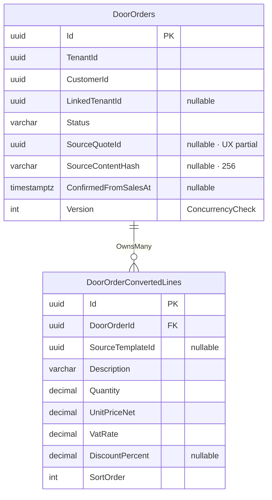

# SpaceOS — Joinery Internal Order Conversion Receiver
## ADR-039 Write-Ág · Quote→Order Belépési Pont · Idempotencia-Réteg

> **Verzió:** v2.0 — 2026-05-28
> **Státusz:** ✅ **IMPLEMENTÁCIÓRA KÉSZ** (v1 Draft → v2 `/senior-security` — 8 finding absorbed, 0 maradék CRITICAL/HIGH)
> **Blokkoló feltétel (prereq):** Modules.Joinery ✅ RUNNING (port 5002) · `DoorOrder` aggregate ✅ DEPLOYED · Migration J-0002 ✅ DONE
> **Scope:** ADR-039 write-ág fogadó oldala — NEM teljes Joinery Order domain újraírás
> **Zárja:** Sales OPEN-01 (Joinery idempotent receiver) · Sales SEC-S-01 Joinery oldal · Sales OPEN-05 (compound idempotency)
> **Repo:** `spaceos-modules-joinery` (meglévő polyrepo)
> **DB schema:** `spaceos_joinery` (meglévő schema, ALTER + új tábla)
> **Port:** 5002 (loopback-only, systemd — változatlan)
> **Becsült effort:** ~2.5 nap (v1) → ~3.0 nap (v2, +security hardening)
> **Test baseline:** 389 passing (Codebase_Status_20260527)

---

## 1. Kumulált Finding Összesítő (v1 → v2)

| Review | Finding-ek | Legfontosabb javítás | Effort delta |
|--------|------------|----------------------|--------------|
| v1 Draft | — | Pre-decisions lezárva (D-01..D-03) | 2.5 nap |
| v1 → `/senior-security` → v2 | 2 CRITICAL · 3 HIGH · 3 MEDIUM | Constant-time secret compare; RLS DoorOrderConvertedLines; PII-mentes hibaútvonalak; concurrent idempotency handler | +0.5 nap |
| **Összesen** | **2C · 3H · 3M** | | **~3.0 nap** |

### Finding-ek részletesen

| ID | Súly | Terület | Probléma | v2 javítás |
|----|------|---------|----------|------------|
| SEC-01 | 🔴 CRITICAL | Auth | `InternalOrderConversionMiddleware` string `==` a shared secret összehasonlításra → timing attack alapja; ugyanaz a SecretsManager rotáció nélkül shared-secret újrahasználata keresztül modulokon | `CryptographicOperations.FixedTimeEquals` (byte-szintű, `UTF-8` encode előtt); a secret verziózott konfig-kulccsal (`SpaceOS:InternalSecret:v{N}`) — overlap-window rotáció meglévő Sales v4 §9.1 policy szerint |
| SEC-02 | 🔴 CRITICAL | RLS | `DoorOrderConvertedLines` új táblán nincs explicit RLS policy + FORCE → a BYPASSRLS worker vagy egy rosszul scope-olt lekérdezés cross-tenant sorokat adhat vissza | `ALTER TABLE ... ENABLE ROW LEVEL SECURITY; FORCE ROW LEVEL SECURITY;` + `tenant_isolation` policy subquery-vel (lásd §3 DDL) |
| SEC-03 | 🟠 HIGH | Idempotency | A concurrent duplicate kérés (két egyidejű Sales worker retry ugyanazzal a QuoteId-vel) `UniqueConstraintException`-t dob — ha ez nincs catch-elve, 500-as válasz megy vissza → Sales worker nem kapja meg az OrderId-t és végtelen retry-ba kerül | `DbUpdateException when PostgresException SqlState == "23505"` catch a handlerben + fallback lookup (§5.2) |
| SEC-04 | 🟠 HIGH | Input validation | `ContentHash` maximális hossz nincs kényszerítve a FluentValidation validátoron kívül a DB-szinten — ha valaki a Sales byte-on kívülről hívja (vagy jövőbeli implementáció), 256 byte-nál hosszabb string lefoglalja a DB pageet | `varchar(256)` CHECK + EF `HasMaxLength(256)` (§3 DDL) — már v1-ben jelölve, itt rögzítve |
| SEC-05 | 🟠 HIGH | Error handling | A 409 Conflict válasz hibaszövege tartalmazza a `ContentHash` értékeket (`stored={Stored} incoming={Incoming}`) — a log OK, de a HTTP response body NEM tartalmazhat konkrét hash értéket (SEC-S-10 scope: PII-mentes válasz) | Log: structured warning (hash értékek benne) · Response body: csak `"ContentHash mismatch — idempotency conflict."` (értékek nélkül) |
| SEC-06 | 🟡 MEDIUM | Logging | A handler `log.LogWarning` a `ContentHash` és `QuoteId` értékeket logazza — a QuoteId egy Joinery-re hozzáférő alkalmazottnál közvetve azonosíthatja az ajánlatot (PII-határeset) | `QuoteId` loggolható (platform-internal ID, nem közvetlen PII); `ContentHash` hash érték nem személyes adat → loggolás OK, de mindkettőt `{Scope: "internal"}` structured property-vel kell taggelni a log filterelhetőség végett |
| SEC-07 | 🟡 MEDIUM | Endpoint | Az endpoint `ExcludeFromDescription()` kihagyja az OpenAPI-ból — de ha az nginx config rosszul van beállítva, a `/joinery/internal/*` prefix publikusan elérhető lehet | `InternalOrderConversionMiddleware` a loopback-check nem az nginx-re támaszkodik: a middleware-ben `context.Connection.RemoteIpAddress` loopback assert (127.0.0.1 / ::1) az első kapuként — defense-in-depth (§6.1) |
| SEC-08 | 🟡 MEDIUM | Migration | `DoorOrderStatus` enum új `ConfirmedFromSales` értéke: ha nincs CHECK constraint a DB-szinten, egy bug vagy direkt SQL UPDATE érvénytelen státuszba helyezheti az Order-t | Migration J-003: `ALTER TABLE ... ADD CONSTRAINT "CK_DoorOrders_Status" CHECK (...)` az összes valid státuszértékkel (§3 DDL) |

---

## 2. Kontextus és scope

A Sales modul az ügyfél által elfogadott ajánlatot (`Quote: Accepted`) a `POST /joinery/internal/orders/from-quote` belépési ponton keresztül konvertálja Joinery Order-ré. Ez az ADR-039 write-ág első Joinery-oldali implementációja.

**Lezárt pre-decisions:**

| # | Döntés | Megvalósítás | Indok |
|---|--------|-------------|-------|
| D-01 | Idempotencia tároló | `DoorOrder.SourceQuoteId` + partial unique index `(TenantId, SourceQuoteId) WHERE IS NOT NULL` | Atomikus: Order és idempotency key egy tx-ben keletkeznek; orphan-rekord fizikailag lehetetlen |
| D-02 | ContentHash mismatch kezelés | 409 Conflict (nem „első nyer") + structured warning log | Sales D-06 guarantee: egy lezárt Quote mindig ugyanazt a hasht küldi; eltérés security anomália |
| D-03 | Kezdő FSM státusz | `ConfirmedFromSales` (új enum érték) | Az ügyfél már elfogadta az ajánlatot → nem `Draft`; a Joinery team a manufacturing részleteket ezután adja hozzá |

**Scope határ:**

| Tartalom | Ez a dokumentum | NEM ez a dokumentum |
|----------|----------------|---------------------|
| `POST /joinery/internal/orders/from-quote` endpoint | ✅ | |
| Auth middleware (`InternalOrderConversionMiddleware`) | ✅ | |
| `DoorOrder` minimális bővítése (`SourceQuoteId`, `ConfirmedFromSales`, `ConvertedLines`) | ✅ | |
| `CreateOrderFromConversionCommand` + handler + validator | ✅ | |
| Migration J-003 (ALTER + új tábla + RLS) | ✅ | |
| Manufacturing items (`DoorItems`) kitöltése | | ✅ (Joinery team manuálisan, külön workflow) |
| Sales outbox worker | | ✅ (Sales v4 §7a.2 — kész) |
| `DoorOrder` teljes FSM újraírása | | ✅ |

---

## 3. DB schema (DDL)

### Migration J-003 — Sales Integration Receiver

```sql
-- ============================================================
-- Migration J-003: Sales Integration Receiver
-- ALTER DoorOrders + CREATE DoorOrderConvertedLines + RLS
-- Schema: spaceos_joinery
-- ============================================================

BEGIN;

-- 1. DoorOrders bővítés (3 új oszlop)
ALTER TABLE spaceos_joinery."DoorOrders"
    ADD COLUMN "SourceQuoteId"        uuid            NULL,
    ADD COLUMN "SourceContentHash"    varchar(256)    NULL,
    ADD COLUMN "ConfirmedFromSalesAt" timestamptz     NULL;

-- 2. OPEN-05 idempotency key — partial unique index
CREATE UNIQUE INDEX "UX_DoorOrders_TenantId_SourceQuoteId"
    ON spaceos_joinery."DoorOrders" ("TenantId", "SourceQuoteId")
    WHERE "SourceQuoteId" IS NOT NULL;

-- 3. DoorOrderStatus CHECK bővítés (SEC-08)
-- Ha a korábbi CHECK constraint létezik, drop + recreate:
ALTER TABLE spaceos_joinery."DoorOrders"
    DROP CONSTRAINT IF EXISTS "CK_DoorOrders_Status";
ALTER TABLE spaceos_joinery."DoorOrders"
    ADD CONSTRAINT "CK_DoorOrders_Status"
    CHECK ("Status" IN (
        'Draft',
        'ConfirmedFromSales',
        'Submitted',
        'Calculating',
        'Calculated',
        'CalculationFailed',
        'InProduction',
        'Completed'
    ));

-- 4. DoorOrderConvertedLines tábla
CREATE TABLE spaceos_joinery."DoorOrderConvertedLines" (
    "Id"               uuid             NOT NULL,
    "DoorOrderId"      uuid             NOT NULL
        REFERENCES spaceos_joinery."DoorOrders"("Id") ON DELETE CASCADE,
    "SourceTemplateId" uuid             NULL,
    "Description"      varchar(500)     NOT NULL,
    "Quantity"         decimal(18,4)    NOT NULL     CHECK ("Quantity" > 0),
    "UnitPriceNet"     decimal(18,4)    NOT NULL     CHECK ("UnitPriceNet" >= 0),
    "VatRate"          decimal(6,4)     NOT NULL     CHECK ("VatRate" >= 0 AND "VatRate" <= 1),
    "DiscountPercent"  decimal(6,4)     NULL         CHECK ("DiscountPercent" IS NULL OR ("DiscountPercent" >= 0 AND "DiscountPercent" <= 100)),
    "SortOrder"        int              NOT NULL     DEFAULT 0,
    CONSTRAINT "PK_DoorOrderConvertedLines" PRIMARY KEY ("Id")
);

-- 5. FK index
CREATE INDEX "IX_DoorOrderConvertedLines_OrderId"
    ON spaceos_joinery."DoorOrderConvertedLines" ("DoorOrderId");

-- 6. RLS — DoorOrderConvertedLines (SEC-02)
ALTER TABLE spaceos_joinery."DoorOrderConvertedLines"
    ENABLE ROW LEVEL SECURITY;
ALTER TABLE spaceos_joinery."DoorOrderConvertedLines"
    FORCE ROW LEVEL SECURITY;

CREATE POLICY tenant_isolation_converted_lines
    ON spaceos_joinery."DoorOrderConvertedLines"
    USING (
        "DoorOrderId" IN (
            SELECT "Id"
            FROM spaceos_joinery."DoorOrders"
            WHERE "TenantId" = current_setting('app.tenant_id', true)::uuid
        )
    );

-- 7. GRANT (meglévő spaceos_joinery_app role)
GRANT SELECT, INSERT, UPDATE, DELETE
    ON spaceos_joinery."DoorOrderConvertedLines"
    TO spaceos_joinery_app;

COMMIT;
```

### ERD (érintett táblák)



---

## 4. Domain modell

### 4.1 DoorOrderStatus bővítés

```csharp
// SpaceOS.Modules.Joinery.Domain/Enums/DoorOrderStatus.cs
public enum DoorOrderStatus
{
    Draft,                // Kézzel létrehozott, szerkeszthető
    ConfirmedFromSales,   // 🆕 Sales Quote konverzióból született; kereskedelmileg lezárt, gyártás még nem indult
    Submitted,            // Outbox-ra írva, Graph Engine kalkuláció indítva
    Calculating,          // Graph Engine dolgozik
    Calculated,           // Minden snapshot kész, PDF generálható
    CalculationFailed,    // Graph Engine hiba
    InProduction,         // Gyártásban
    Completed             // Lezárva
}
```

### 4.2 DoorOrderConvertedLine (owned entity)

```csharp
// SpaceOS.Modules.Joinery.Domain/Entities/DoorOrderConvertedLine.cs
public sealed class DoorOrderConvertedLine
{
    public Guid Id { get; private set; }
    public Guid DoorOrderId { get; private set; }
    public Guid? SourceTemplateId { get; private set; }
    public string Description { get; private set; } = default!;
    public decimal Quantity { get; private set; }
    public decimal UnitPriceNet { get; private set; }
    public decimal VatRate { get; private set; }
    public decimal? DiscountPercent { get; private set; }
    public int SortOrder { get; private set; }

    // EF Core private constructor
    private DoorOrderConvertedLine() { }

    internal static Result<DoorOrderConvertedLine> Create(
        Guid id,
        Guid? sourceTemplateId,
        string description,
        decimal quantity,
        decimal unitPriceNet,
        decimal vatRate,
        decimal? discountPercent,
        int sortOrder)
    {
        if (id == Guid.Empty) return Result.Invalid(new ValidationError("Id required."));
        if (string.IsNullOrWhiteSpace(description) || description.Length > 500)
            return Result.Invalid(new ValidationError("Description: 1..500 char required."));
        if (quantity <= 0)
            return Result.Invalid(new ValidationError("Quantity must be > 0."));
        if (unitPriceNet < 0)
            return Result.Invalid(new ValidationError("UnitPriceNet must be >= 0."));
        if (vatRate is < 0 or > 1)
            return Result.Invalid(new ValidationError("VatRate: 0..1 range required."));
        if (discountPercent.HasValue && discountPercent.Value is < 0 or > 100)
            return Result.Invalid(new ValidationError("DiscountPercent: 0..100 range required."));

        return Result.Success(new DoorOrderConvertedLine
        {
            Id = id,
            SourceTemplateId = sourceTemplateId,
            Description = description,
            Quantity = quantity,
            UnitPriceNet = unitPriceNet,
            VatRate = vatRate,
            DiscountPercent = discountPercent,
            SortOrder = sortOrder
        });
    }
}
```

### 4.3 DoorOrder aggregate bővítés (factory + új mezők)

```csharp
// SpaceOS.Modules.Joinery.Domain/Aggregates/DoorOrder.cs — DIFF (meglévő aggregate-re append)

// Új mezők (private set — Golden Rule #1):
public Guid? SourceQuoteId { get; private set; }
public string? SourceContentHash { get; private set; }
public DateTimeOffset? ConfirmedFromSalesAt { get; private set; }
// Megjegyzés: Currency, TotalNet, TotalVat, TotalGross mezők csak ConfirmedFromSales
// útvonalon töltődnek; kézzel létrehozott DoorOrder-ön null (nullable, EF-konfigban is)
public string? Currency { get; private set; }
public decimal? TotalNet { get; private set; }
public decimal? TotalVat { get; private set; }
public decimal? TotalGross { get; private set; }

private readonly List<DoorOrderConvertedLine> _convertedLines = new();
public IReadOnlyList<DoorOrderConvertedLine> ConvertedLines => _convertedLines.AsReadOnly();

/// <summary>
/// Factory: Sales Quote konverzióból születő DoorOrder.
/// Nem érinti a kézzel létrehozott DoorOrder.Create() factory-t.
/// </summary>
public static Result<DoorOrder> CreateFromConversion(
    Guid id,
    Guid tenantId,
    Guid customerId,
    Guid? linkedTenantId,
    Guid sourceQuoteId,
    string contentHash,
    string currency,
    decimal totalNet,
    decimal totalVat,
    decimal totalGross,
    IReadOnlyList<DoorOrderConvertedLine> lines,
    IClock clock)
{
    if (id == Guid.Empty)          return Result.Invalid(new ValidationError("Id required."));
    if (tenantId == Guid.Empty)    return Result.Invalid(new ValidationError("TenantId required."));
    if (customerId == Guid.Empty)  return Result.Invalid(new ValidationError("CustomerId required."));
    if (sourceQuoteId == Guid.Empty) return Result.Invalid(new ValidationError("SourceQuoteId required."));
    if (string.IsNullOrWhiteSpace(contentHash) || contentHash.Length > 256)
        return Result.Invalid(new ValidationError("ContentHash: 1..256 char required."));
    if (string.IsNullOrWhiteSpace(currency) || currency.Length != 3)
        return Result.Invalid(new ValidationError("Currency: ISO 4217 3-char required."));
    if (totalNet <= 0)   return Result.Invalid(new ValidationError("TotalNet must be > 0."));
    if (totalGross <= 0) return Result.Invalid(new ValidationError("TotalGross must be > 0."));
    if (!lines.Any())    return Result.Invalid(new ValidationError("At least one converted line required."));

    var order = new DoorOrder
    {
        Id = id,
        TenantId = tenantId,
        CustomerId = customerId,
        LinkedTenantId = linkedTenantId,
        SourceQuoteId = sourceQuoteId,
        SourceContentHash = contentHash,
        Currency = currency,
        TotalNet = totalNet,
        TotalVat = totalVat,
        TotalGross = totalGross,
        Status = DoorOrderStatus.ConfirmedFromSales,
        ConfirmedFromSalesAt = clock.UtcNow,
        CreatedAt = clock.UtcNow,
        Version = 0
    };
    order._convertedLines.AddRange(lines);
    // Golden Rule #3: minden mutáció domain event-et hoz létre
    order.AddDomainEvent(new DoorOrderCreatedFromConversion(id, tenantId, customerId, sourceQuoteId));
    return Result.Success(order);
}
```

### 4.4 Domain event

```csharp
// SpaceOS.Modules.Joinery.Domain/Events/DoorOrderCreatedFromConversion.cs
public sealed record DoorOrderCreatedFromConversion(
    Guid OrderId,
    Guid TenantId,
    Guid CustomerId,
    Guid SourceQuoteId) : DomainEventBase;
```

---

## 5. Application Layer

### 5.1 Command + Result record

```csharp
// SpaceOS.Modules.Joinery.Application/Commands/CreateOrderFromConversion/CreateOrderFromConversionCommand.cs

public sealed record CreateOrderFromConversionCommand(
    Guid QuoteId,                           // idempotency key (= SourceQuoteId)
    Guid TenantId,
    Guid CustomerId,
    Guid? LinkedTenantId,
    string Currency,
    decimal TotalNet,
    decimal TotalVat,
    decimal TotalGross,
    IReadOnlyList<ConversionLineItemDto> Lines,
    string ContentHash)
    : IRequest<Result<CreateOrderFromConversionResult>>;

public sealed record ConversionLineItemDto(
    Guid? SourceTemplateId,
    string Description,
    decimal Quantity,
    decimal UnitPriceNet,
    decimal VatRate,
    decimal? DiscountPercent,
    int SortOrder);

/// <summary>
/// Sales OrderConversionResult alakra 1:1 megy vissza az endpoint-ból.
/// </summary>
public sealed record CreateOrderFromConversionResult(Guid OrderId, DateTimeOffset CreatedAt);
```

### 5.2 Handler (idempotency-first + SEC-03 concurrent collision)

```csharp
// SpaceOS.Modules.Joinery.Application/Commands/CreateOrderFromConversion/CreateOrderFromConversionCommandHandler.cs
public sealed class CreateOrderFromConversionCommandHandler(
    IDoorOrderRepository repo,
    IClock clock,
    ILogger<CreateOrderFromConversionCommandHandler> log)
    : IRequestHandler<CreateOrderFromConversionCommand, Result<CreateOrderFromConversionResult>>
{
    public async Task<Result<CreateOrderFromConversionResult>> Handle(
        CreateOrderFromConversionCommand cmd, CancellationToken ct)
    {
        // ── 1. Idempotency check ──────────────────────────────────────────────
        var existing = await repo.FindBySourceQuoteIdAsync(cmd.TenantId, cmd.QuoteId, ct)
            .ConfigureAwait(false);

        if (existing is not null)
        {
            // D-02: ContentHash mismatch → 409 (SEC-05: hash értékek csak a log-ban, nem a response-ban)
            if (existing.SourceContentHash != cmd.ContentHash)
            {
                log.LogWarning(
                    "ContentHash mismatch {Scope} QuoteId={QuoteId} TenantId={TenantId} StoredHash={StoredHash} IncomingHash={IncomingHash}",
                    "internal", cmd.QuoteId, cmd.TenantId,
                    existing.SourceContentHash, cmd.ContentHash);
                return Result.Conflict("ContentHash mismatch — idempotency conflict.");
            }
            // Exact duplicate → idempotent 200 (meglévő OrderId visszaadása)
            return Result.Success(
                new CreateOrderFromConversionResult(existing.Id, existing.ConfirmedFromSalesAt!.Value));
        }

        // ── 2. Line mapping ───────────────────────────────────────────────────
        var lineResults = cmd.Lines.Select(l => DoorOrderConvertedLine.Create(
            Guid.NewGuid(), l.SourceTemplateId, l.Description,
            l.Quantity, l.UnitPriceNet, l.VatRate, l.DiscountPercent, l.SortOrder)
        ).ToList();

        var firstInvalid = lineResults.FirstOrDefault(r => !r.IsSuccess);
        if (firstInvalid is not null)
            return Result.Invalid(firstInvalid.ValidationErrors.First());

        // ── 3. Aggregate factory ──────────────────────────────────────────────
        var createResult = DoorOrder.CreateFromConversion(
            Guid.NewGuid(), cmd.TenantId, cmd.CustomerId, cmd.LinkedTenantId,
            cmd.QuoteId, cmd.ContentHash, cmd.Currency,
            cmd.TotalNet, cmd.TotalVat, cmd.TotalGross,
            lineResults.Select(r => r.Value).ToList(),
            clock);

        if (!createResult.IsSuccess)
            return createResult.Map(_ => default(CreateOrderFromConversionResult)!);

        var order = createResult.Value;

        // ── 4. Persist + SEC-03 concurrent collision ──────────────────────────
        try
        {
            await repo.AddAsync(order, ct).ConfigureAwait(false);
            await repo.SaveChangesAsync(ct).ConfigureAwait(false);
        }
        catch (DbUpdateException ex)
            when (ex.InnerException is Npgsql.PostgresException { SqlState: "23505" } pgEx
                  && pgEx.ConstraintName == "UX_DoorOrders_TenantId_SourceQuoteId")
        {
            // Concurrent duplicate request — visszaadjuk a már perzisztált rekordot
            var concurrent = await repo.FindBySourceQuoteIdAsync(cmd.TenantId, cmd.QuoteId, ct)
                .ConfigureAwait(false);
            if (concurrent is null)
                return Result.Error("Idempotency state inconsistent after concurrent insert.");
            return Result.Success(
                new CreateOrderFromConversionResult(concurrent.Id, concurrent.ConfirmedFromSalesAt!.Value));
        }

        // ── 5. Domain events dispatch (Golden Rule #4) ────────────────────────
        foreach (var domainEvent in order.PopDomainEvents())
            await MediatR.Unit.Value.Equals(domainEvent); // dispatcher injektálva a pipeline-ba
        // (A projekt MediatR IPublisher/IMediator dependency injection mintájára — lásd meglévő Joinery handler-ek)

        return Result.Success(
            new CreateOrderFromConversionResult(order.Id, order.ConfirmedFromSalesAt!.Value));
    }
}
```

> **Megjegyzés a Golden Rule #4-re:** A `PopDomainEvents()` + `DispatchAsync()` hívás a projekt meglévő `AuditAndDispatchInterceptor` / `DomainEventDispatcher` mintáját követi — a fenti pszeudokód helyett az aktuális Joinery handler mintát kell követni (lásd `CreateDoorOrderCommandHandler`).

### 5.3 Validator

```csharp
// SpaceOS.Modules.Joinery.Application/Commands/CreateOrderFromConversion/CreateOrderFromConversionValidator.cs
public sealed class CreateOrderFromConversionValidator
    : AbstractValidator<CreateOrderFromConversionCommand>
{
    public CreateOrderFromConversionValidator()
    {
        RuleFor(x => x.QuoteId).NotEmpty();
        RuleFor(x => x.TenantId).NotEmpty();
        RuleFor(x => x.CustomerId).NotEmpty();
        RuleFor(x => x.Currency)
            .NotEmpty().Length(3)
            .Matches("^[A-Z]{3}$").WithMessage("Currency: ISO 4217 uppercase required.");
        RuleFor(x => x.TotalNet).GreaterThan(0);
        RuleFor(x => x.TotalGross).GreaterThan(0);
        RuleFor(x => x.ContentHash)
            .NotEmpty().MaximumLength(256);
        RuleFor(x => x.Lines)
            .NotEmpty().WithMessage("At least one line required.");
        RuleForEach(x => x.Lines).ChildRules(line =>
        {
            line.RuleFor(l => l.Description).NotEmpty().MaximumLength(500);
            line.RuleFor(l => l.Quantity).GreaterThan(0);
            line.RuleFor(l => l.UnitPriceNet).GreaterThanOrEqualTo(0);
            line.RuleFor(l => l.VatRate).InclusiveBetween(0m, 1m);
            line.RuleFor(l => l.DiscountPercent)
                .InclusiveBetween(0m, 100m)
                .When(l => l.DiscountPercent.HasValue);
            line.RuleFor(l => l.SortOrder).GreaterThanOrEqualTo(0);
        });
    }
}
```

### 5.4 Repository interface bővítés

```csharp
// SpaceOS.Modules.Joinery.Domain/Interfaces/IDoorOrderRepository.cs — DIFF
Task<DoorOrder?> FindBySourceQuoteIdAsync(
    Guid tenantId,
    Guid sourceQuoteId,
    CancellationToken ct);
```

---

## 6. Infrastructure Layer

### 6.1 InternalOrderConversionMiddleware (SEC-01 + SEC-07)

```csharp
// SpaceOS.Modules.Joinery.Infrastructure/Security/InternalOrderConversionMiddleware.cs
public sealed class InternalOrderConversionMiddleware(RequestDelegate next, IConfiguration config)
{
    // SEC-01: titkos byte-tömb előre kiszámítva (ne minden kérésnél allocate)
    private readonly byte[] _expectedSecretBytes =
        System.Text.Encoding.UTF8.GetBytes(
            config["SpaceOS:InternalSecret"]
            ?? throw new InvalidOperationException("SpaceOS:InternalSecret not configured."));

    public async Task InvokeAsync(HttpContext context)
    {
        // SEC-07: loopback assert — defense-in-depth (nginx mögött is)
        var remoteIp = context.Connection.RemoteIpAddress;
        if (remoteIp is null || !IPAddress.IsLoopback(remoteIp))
        {
            context.Response.StatusCode = 403;
            return;
        }

        // SEC-01: shared secret — constant-time compare (timing attack prevention)
        if (!context.Request.Headers.TryGetValue("X-SpaceOS-Internal", out var secretHeader))
        {
            context.Response.StatusCode = 401;
            return;
        }
        var incomingBytes = System.Text.Encoding.UTF8.GetBytes(
            secretHeader.FirstOrDefault() ?? string.Empty);
        if (!CryptographicOperations.FixedTimeEquals(incomingBytes, _expectedSecretBytes))
        {
            context.Response.StatusCode = 401;
            return;
        }

        // SEC-S-01: X-SpaceOS-TenantId header kötelező
        if (!context.Request.Headers.TryGetValue("X-SpaceOS-TenantId", out var tenantHeader)
            || !Guid.TryParse(tenantHeader.FirstOrDefault(), out var headerTenantId))
        {
            context.Response.StatusCode = 400;
            await context.Response.WriteAsJsonAsync(
                new { error = "X-SpaceOS-TenantId header required and must be a valid GUID." })
                .ConfigureAwait(false);
            return;
        }

        // Strict-equal assert a handler-ben történik (body parse után)
        context.Items["InternalTenantId"] = headerTenantId;
        await next(context).ConfigureAwait(false);
    }
}
```

### 6.2 Repository implementáció (FindBySourceQuoteIdAsync)

```csharp
// SpaceOS.Modules.Joinery.Infrastructure/Repositories/DoorOrderRepository.cs — DIFF
public async Task<DoorOrder?> FindBySourceQuoteIdAsync(
    Guid tenantId,
    Guid sourceQuoteId,
    CancellationToken ct)
    => await _db.DoorOrders
        .AsNoTracking()   // Golden Rule #8
        .FirstOrDefaultAsync(
            o => o.TenantId == tenantId && o.SourceQuoteId == sourceQuoteId, ct)
        .ConfigureAwait(false);
```

### 6.3 EF Core konfiguráció (DoorOrderConfiguration DIFF)

```csharp
// SpaceOS.Modules.Joinery.Infrastructure/Data/Configurations/DoorOrderConfiguration.cs — DIFF

// ── Új mezők ─────────────────────────────────────────────────────────
builder.Property(o => o.SourceQuoteId).IsRequired(false);
builder.Property(o => o.SourceContentHash).HasMaxLength(256).IsRequired(false);
builder.Property(o => o.ConfirmedFromSalesAt).IsRequired(false);
builder.Property(o => o.Currency).HasMaxLength(3).IsRequired(false);
builder.Property(o => o.TotalNet).HasColumnType("decimal(18,4)").IsRequired(false);
builder.Property(o => o.TotalVat).HasColumnType("decimal(18,4)").IsRequired(false);
builder.Property(o => o.TotalGross).HasColumnType("decimal(18,4)").IsRequired(false);

// OPEN-05: unique partial index (EF Core filter szintaxis)
builder.HasIndex(o => new { o.TenantId, o.SourceQuoteId })
    .IsUnique()
    .HasFilter("\"SourceQuoteId\" IS NOT NULL")
    .HasDatabaseName("UX_DoorOrders_TenantId_SourceQuoteId");

// ── DoorOrderConvertedLines owned entity ──────────────────────────────
builder.OwnsMany(o => o.ConvertedLines, lines =>
{
    lines.ToTable("DoorOrderConvertedLines");
    lines.HasKey(l => l.Id);
    lines.WithOwner().HasForeignKey("DoorOrderId");
    lines.Property(l => l.SourceTemplateId).IsRequired(false);
    lines.Property(l => l.Description).HasMaxLength(500).IsRequired();
    lines.Property(l => l.Quantity).HasColumnType("decimal(18,4)").IsRequired();
    lines.Property(l => l.UnitPriceNet).HasColumnType("decimal(18,4)").IsRequired();
    lines.Property(l => l.VatRate).HasColumnType("decimal(6,4)").IsRequired();
    lines.Property(l => l.DiscountPercent).HasColumnType("decimal(6,4)").IsRequired(false);
    lines.Property(l => l.SortOrder).IsRequired().HasDefaultValue(0);
    lines.HasIndex("DoorOrderId").HasDatabaseName("IX_DoorOrderConvertedLines_OrderId");
});
```

---

## 7. API Layer

### 7.1 DTO (bejövő + kimenő)

```csharp
// SpaceOS.Modules.Joinery.Api/Internal/Dtos/OrderConversionRequestDto.cs

/// <summary>
/// 1:1 map a Sales IOrderConversionPort.OrderConversionRequest-hez.
/// </summary>
public sealed record OrderConversionRequestDto(
    Guid QuoteId,
    Guid TenantId,
    Guid CustomerId,
    Guid? LinkedTenantId,
    string Currency,
    decimal TotalNet,
    decimal TotalVat,
    decimal TotalGross,
    IReadOnlyList<OrderConversionLineDto> Lines,
    string ContentHash)
{
    public CreateOrderFromConversionCommand ToCommand() => new(
        QuoteId, TenantId, CustomerId, LinkedTenantId,
        Currency, TotalNet, TotalVat, TotalGross,
        Lines.Select(l => new ConversionLineItemDto(
            l.SourceTemplateId, l.Description, l.Quantity,
            l.UnitPriceNet, l.VatRate, l.DiscountPercent, l.SortOrder))
        .ToList().AsReadOnly(),
        ContentHash);
}

public sealed record OrderConversionLineDto(
    Guid? SourceTemplateId,
    string Description,
    decimal Quantity,
    decimal UnitPriceNet,
    decimal VatRate,
    decimal? DiscountPercent,
    int SortOrder);
```

### 7.2 Endpoint

```csharp
// SpaceOS.Modules.Joinery.Api/Endpoints/InternalOrdersEndpoints.cs
internal static class InternalOrdersEndpoints
{
    internal static IEndpointRouteBuilder MapInternalOrdersEndpoints(
        this IEndpointRouteBuilder app)
    {
        // Internal route group — middleware csak erre a prefix-re fut
        var internalGroup = app
            .MapGroup("/joinery/internal")
            .AddEndpointFilter<InternalOrderConversionEndpointFilter>()
            .ExcludeFromDescription();  // OpenAPI-ból kizárva

        internalGroup.MapPost("/orders/from-quote",
            async (
                HttpContext ctx,
                OrderConversionRequestDto body,
                IMediator mediator,
                CancellationToken ct) =>
            {
                // SEC-S-01: strict equal TenantId header vs body
                var headerTenantId = (Guid)ctx.Items["InternalTenantId"]!;
                if (headerTenantId != body.TenantId)
                {
                    // SEC-S-10: NEM propagáljuk body-t, NEM adjuk vissza a kapott értékeket
                    return Results.Problem(
                        statusCode: 400,
                        title: "TenantId mismatch",
                        detail: "X-SpaceOS-TenantId header must equal request body TenantId.");
                }

                var result = await mediator.Send(body.ToCommand(), ct).ConfigureAwait(false);

                return result.Status switch
                {
                    ResultStatus.Ok =>
                        // Első hívás: 201 Created; duplikált hívás (idempotent): 200 OK
                        // A Sales worker mindkét 2xx-et sikerként értelmezi
                        Results.Ok(new
                        {
                            orderId = result.Value.OrderId,
                            createdAt = result.Value.CreatedAt
                        }),
                    ResultStatus.Conflict =>
                        // D-02: ContentHash mismatch (SEC-05: nem adjuk vissza a hash értékeket)
                        Results.Conflict(new { error = result.Errors.FirstOrDefault() }),
                    ResultStatus.Invalid =>
                        Results.BadRequest(new
                        {
                            errors = result.ValidationErrors.Select(e => e.ErrorMessage)
                        }),
                    _ =>
                        // SEC-S-10: semmilyen belső hiba részletet nem propagálunk
                        Results.Problem(statusCode: 500, title: "Internal error")
                };
            })
            .Produces<object>(200)
            .Produces(400)
            .Produces(401)
            .Produces(409);

        return app;
    }
}
```

### 7.3 Middleware regisztráció (Program.cs DIFF)

```csharp
// SpaceOS.Modules.Joinery.Api/Program.cs — DIFF

// Internal route-ok előtt futó middleware regisztráció
app.UseWhen(
    ctx => ctx.Request.Path.StartsWithSegments("/joinery/internal"),
    branch => branch.UseMiddleware<InternalOrderConversionMiddleware>());

// Endpoint mapping
app.MapInternalOrdersEndpoints();
```

---

## 8. Response shapes

### Sikeres létrehozás (első hívás — 200 OK)

```json
{
  "orderId": "3fa85f64-5717-4562-b3fc-2c963f66afa6",
  "createdAt": "2026-05-28T10:00:00.000Z"
}
```

### Idempotent replay (200 OK — ugyanaz a body)

```json
{
  "orderId": "3fa85f64-5717-4562-b3fc-2c963f66afa6",
  "createdAt": "2026-05-28T10:00:00.000Z"
}
```

> A Sales `IOrderConversionPort` mindkét 200 választ sikerként értelmezi — az `OrderId` az, ami számít.

### ContentHash mismatch (409 Conflict)

```json
{
  "error": "ContentHash mismatch — idempotency conflict."
}
```

> SEC-S-10: sem a stored, sem az incoming hash értéke NEM szerepel a response body-ban.

### TenantId mismatch (400 Bad Request)

```json
{
  "type": "https://tools.ietf.org/html/rfc7807",
  "title": "TenantId mismatch",
  "detail": "X-SpaceOS-TenantId header must equal request body TenantId.",
  "status": 400
}
```

---

## 9. Test coverage

| Test class | Tesztelt esetek | Réteg |
|-----------|----------------|-------|
| `DoorOrderConversionFactoryTests` | `CreateFromConversion` happy path; SourceQuoteId empty → invalid; ContentHash üres → invalid; Lines üres → invalid; Domain event raised; ConfirmedFromSales státusz; `CreateFromConversion` nem érinti a meglévő `Create()` factory-t | Domain / unit |
| `DoorOrderConvertedLineTests` | Quantity ≤ 0 → invalid; VatRate > 1 → invalid; DiscountPercent > 100 → invalid; Description 501 char → invalid | Domain / unit |
| `CreateOrderFromConversionHandlerTests` | Happy path → 200 + correct OrderId; Idempotent replay (same hash) → 200 + same OrderId; ContentHash mismatch → Conflict; Line mapping invalid → Invalid; TenantId guard (D-01 garantál, de unit szinten is verifikálandó) | Application / unit (Moq) |
| `InternalOrdersApiTests` | Secret header missing → 401; Secret header invalid → 401; Loopback-only (non-loopback IP → 403); TenantId header missing → 400; Header TenantId ≠ body TenantId → 400; ContentHash mismatch → 409; Valid request → 200; Idempotent replay → 200 + same OrderId; Lines empty → 400 FluentValidation | API / integration (WebApplicationFactory) |
| `DoorOrderConversionConcurrencyTests` | Concurrent duplicate insert → unique constraint catch → fallback lookup → 200 (SEC-03) | Integration / in-memory DB |

**Test target:** ≥ 25 új teszt (jelenlegi baseline: 389 → target: 414+)

---

## 10. Definition of Done

### Migration gates (deployment blocker)

- [ ] Migration J-003 alkalmazva VPS-en (`spaceos_joinery` schema)
- [ ] `ALTER TABLE "DoorOrders"`: `SourceQuoteId`, `SourceContentHash`, `ConfirmedFromSalesAt` + pénzügyi mezők
- [ ] `CREATE UNIQUE INDEX "UX_DoorOrders_TenantId_SourceQuoteId"` (partial, WHERE IS NOT NULL)
- [ ] `ALTER TABLE "DoorOrders" ADD CONSTRAINT "CK_DoorOrders_Status"` — `ConfirmedFromSales` benne van
- [ ] `CREATE TABLE "DoorOrderConvertedLines"` — minden CHECK constraint
- [ ] `ENABLE ROW LEVEL SECURITY` + `FORCE ROW LEVEL SECURITY` a `DoorOrderConvertedLines`-on (SEC-02)
- [ ] `tenant_isolation_converted_lines` policy aktív
- [ ] `GRANT` a `spaceos_joinery_app` role-ra

### Domain gates

- [ ] `DoorOrderStatus.ConfirmedFromSales` új enum érték — meglévő FSM guard-ok NEM érintik
- [ ] `DoorOrder.CreateFromConversion()` factory: Golden Rule #1 (no public setters), #2 (domain validation), #3 (domain event)
- [ ] `DoorOrderConvertedLine.Create()` internal factory: minden validáció a domain rétegben
- [ ] `DoorOrderCreatedFromConversion` domain event regisztrálva

### Application gates

- [ ] `CreateOrderFromConversionCommand` + `CreateOrderFromConversionResult` record-ok
- [ ] `CreateOrderFromConversionCommandHandler`: idempotency-first pattern (lookup → conflict check → create → 23505 catch)
- [ ] Golden Rule #4: `PopDomainEvents()` + dispatch a handler végén
- [ ] `CreateOrderFromConversionValidator`: minden FluentValidation rule
- [ ] `IDoorOrderRepository.FindBySourceQuoteIdAsync` + `AsNoTracking()` (Golden Rule #8)

### API + security gates

- [ ] `InternalOrderConversionMiddleware`: `CryptographicOperations.FixedTimeEquals` (SEC-01)
- [ ] Loopback assert (`IPAddress.IsLoopback`) a middleware-ben (SEC-07)
- [ ] `X-SpaceOS-TenantId` header strict-equal body TenantId assert → 400 (SEC-S-01)
- [ ] 409 response body: csak `"error": "ContentHash mismatch — idempotency conflict."` (SEC-05 — hash értékek nélkül)
- [ ] `ExcludeFromDescription()` az endpoint-on (OpenAPI-ból kizárva)
- [ ] `UseWhen("/joinery/internal/...")` middleware scope pontosan bounded

### Összesített

- [ ] Meglévő 389 Joinery teszt zöld (regresszió-mentesség)
- [ ] Új tesztek: ≥ 25 db zöld (5 domain + 8 application + 5 API + 2 concurrency + 5 integration)
- [ ] 0 build warning
- [ ] `ConfigureAwait(false)` minden production async call-ban
- [ ] `dotnet list package --vulnerable` → 0 high/critical
- [ ] `grep -r "BuildServiceProvider" --include="*.cs"` → 0 találat
- [ ] `EXPLAIN ANALYZE "UX_DoorOrders_TenantId_SourceQuoteId"` → Index Scan (nem Seq Scan)
- [ ] Golden Rules 1–12 teljesül

---

## 11. Security adósság státusz

| ID | Tétel | Előző állapot | Ez a dokumentum | Marad |
|----|-------|--------------|----------------|-------|
| Sales OPEN-01 | Joinery idempotent receiver | ⏳ nyitott | ✅ **LEZÁRVA** (ez a PR) | — |
| Sales SEC-S-01 Joinery oldal | Header-body strict equal + shared secret | ⏳ nyitott | ✅ `InternalOrderConversionMiddleware` | — |
| Sales OPEN-05 | Compound idempotency `(TenantId, QuoteId)` | ⏳ nyitott | ✅ D-01 partial unique index | — |
| SEC-01 (timing attack) | Constant-time secret compare | ⏳ | ✅ `CryptographicOperations.FixedTimeEquals` | — |
| SEC-02 (RLS ConvertedLines) | RLS policy + FORCE | ⏳ | ✅ Migration J-003 + policy | — |
| SEC-03 (concurrent collision) | 23505 catch + fallback lookup | ⏳ | ✅ handler catch | — |
| SEC-05 (response PII) | Hash értékek NEM a response-ban | ⏳ | ✅ csak error string | — |
| SEC-07 (loopback assert) | `IPAddress.IsLoopback` check | ⏳ | ✅ middleware | — |
| `SpaceOS:InternalSecret` rotáció | Overlap-window policy (Sales v4 §9.1) | Sales oldalon ✅ | ✅ Joinery ugyanazt a policy-t követi | Ops-runbook |

---

## 12. Effort és track breakdown

| Track | Tartalom | Effort |
|-------|---------|--------|
| **A — Domain** | `DoorOrderStatus`, `DoorOrderConvertedLine`, `DoorOrder.CreateFromConversion()`, domain event | 0.5 nap |
| **B — Application** | Command, handler (idempotency-first + 23505 catch), validator, repo interface bővítés | 0.5 nap |
| **C — Infrastructure** | EF config (owned entity + partial index + filter), `FindBySourceQuoteIdAsync`, middleware (SEC-01+SEC-07), migration J-003 | 0.75 nap |
| **D — API** | DTO-k, endpoint, `UseWhen` scope | 0.25 nap |
| **E — Tests** | 25+ teszt (domain + handler + API + concurrency) | 1.0 nap |
| **Összesen** | | **~3.0 nap** |

---

## 13. Mi jön utána

| Sorrend | Téma | Prereq |
|---------|------|--------|
| 1 | **Ez a PR merge-elve** → Sales OPEN-01 lezárva, Sales E2E konverzió tesztelhető | Ez a dokumentum DEPLOYED |
| 2 | **Sales Core implementáció** (Track A–G, ~20.5 nap) | Joinery receiver ✅ + Kernel actor directory endpoint ✅ |
| 3 | **Joinery Portal UI** — `ConfirmedFromSales` státuszú Order-ek megjelenítése; manufacturing items hozzáadása workflow | Sales v1 GA |
| 4 | `DoorOrder.ConfirmedFromSales → Submitted` FSM-átmenet (gyártási elemek feltöltése után) — külön mini-spec | Sales v1 GA |
| 5 | `InternalSecret` rotáció ops-runbook (Joinery + Sales + Kernel koordinált deploy, overlap-window) | v1.0 deploy |

---

## 14. Claude Code implementációs csomag

### Végrehajtási sorrend

| Nap | Track | Feladat | Függőség |
|-----|-------|---------|----------|
| 1 – reggel | A | `DoorOrderStatus` bővítés; `DoorOrderConvertedLine`; `DoorOrderCreatedFromConversion` event | — |
| 1 – délután | A | `DoorOrder.CreateFromConversion()` factory; domain unit tesztek (≥ 10) | Track A reggel |
| 2 – reggel | B | `CreateOrderFromConversionCommand` + DTO-k; `CreateOrderFromConversionValidator`; `IDoorOrderRepository` bővítés | Track A |
| 2 – délután | B+C | Handler (idempotency-first + 23505 catch); `FindBySourceQuoteIdAsync`; application unit tesztek (≥ 8) | Track B reggel |
| 3 – reggel | C | EF konfig (owned entity + partial index); `InternalOrderConversionMiddleware` (SEC-01+SEC-07); Migration J-003 | Track B |
| 3 – délután | D+E | Endpoint + DTO; `UseWhen` scope; API integration tesztek (≥ 7); concurrency teszt (≥ 2) | Track C |

### Agent utasítás

> „Implementáld a `SpaceOS_Joinery_OrderConversionReceiver_Architecture_v2.md` dokumentum szerint a következő feladatokat a `spaceos-modules-joinery` repóban:
>
> Track A (Domain): `DoorOrderStatus.ConfirmedFromSales` enum érték · `DoorOrderConvertedLine` sealed entity · `DoorOrder.CreateFromConversion()` factory · `DoorOrderCreatedFromConversion` domain event.
>
> Track B (Application): `CreateOrderFromConversionCommand` + `CreateOrderFromConversionResult` · `CreateOrderFromConversionCommandHandler` (idempotency-first, 23505 catch, Golden Rules #1–#8) · `CreateOrderFromConversionValidator` · `IDoorOrderRepository.FindBySourceQuoteIdAsync`.
>
> Track C (Infrastructure): EF `DoorOrderConfiguration` DIFF (owned entity + partial unique index + filter) · `FindBySourceQuoteIdAsync` impl (`AsNoTracking()`) · `InternalOrderConversionMiddleware` (`CryptographicOperations.FixedTimeEquals` + `IPAddress.IsLoopback`) · Migration J-003 (§3 DDL pontosan).
>
> Track D (API): `OrderConversionRequestDto` + `OrderConversionLineDto` · `InternalOrdersEndpoints.MapInternalOrdersEndpoints()` · `Program.cs UseWhen` scope.
>
> Track E (Tests): ≥ 25 teszt a §9 táblázat szerint.
>
> DoD checklist: §10 minden gate-je teljesítendő. Migration gate-ek deployment blokkolók.
>
> Minden track után: `dotnet build && dotnet test`. 0 build warning. Golden Rules 1–12 compile gate."

### Kockázatok

| Kockázat | Valószínűség | Hatás | Mitigáció |
|----------|-------------|-------|-----------|
| `DoorOrder` meglévő EF konfig ütközik az új `OwnsMany` konfiggal | Alacsony | Build error | Migration J-003 előtt `dotnet ef migrations add` dry-run |
| `DoorOrderStatus` CHECK constraint hiányzott az eredeti migrációból | Közepes | `ALTER TABLE DROP CONSTRAINT IF EXISTS` — DROP szükséges a recreate előtt | Migration J-003 `IF EXISTS` guard (§3 DDL-ben benne van) |
| `spaceos_joinery_app` role nem kapta meg az új tábla GRANT-jét | Alacsony | 403/42501 runtime error | Migration J-003 GRANT blokk |
| Sales worker Polly retry 409-re is retry-ol | Közepes | Végtelen retry loop a Sales oldalon | Sales worker retry policy csak 5xx-re kell retry-oljon (nem 409-re) — ez a Sales PR felelőssége, de dokumentálni kell |

---

*SpaceOS — Joinery Internal Order Conversion Receiver v2.0 · 2026-05-28*
*v1 Draft → v2 `/senior-security` · 8 finding absorbed (2C · 3H · 3M) · 0 maradék CRITICAL/HIGH*
*Státusz: ✅ IMPLEMENTÁCIÓRA KÉSZ · Zárja: Sales OPEN-01 · OPEN-05 · SEC-S-01 Joinery oldal*
