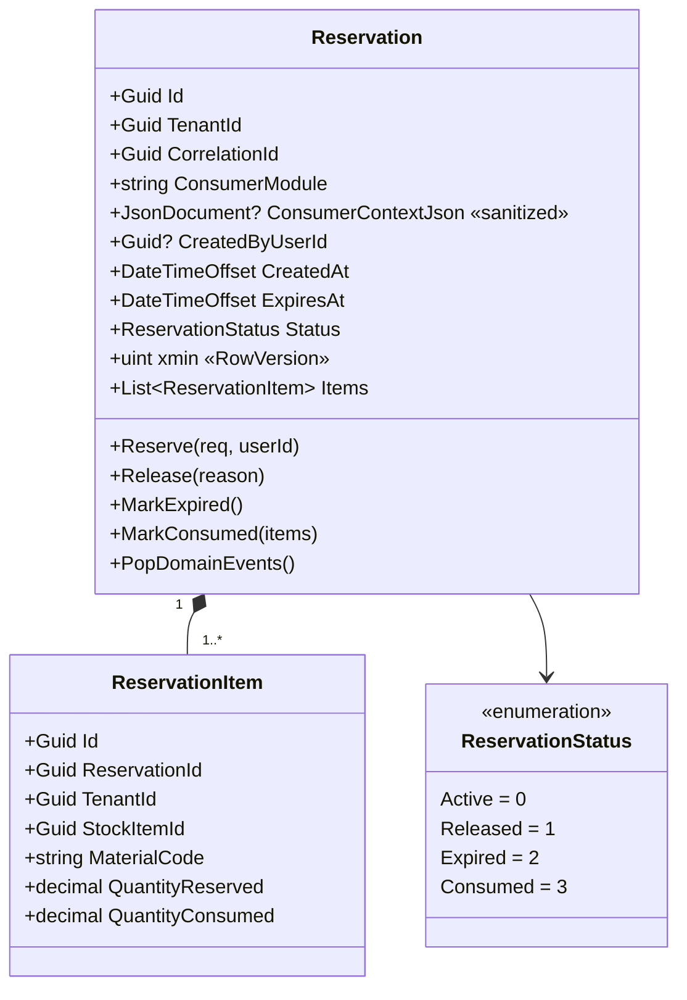

# SpaceOS — Shared Module Contracts Architecture
## v4.1 Amendment · Reservation API (Package v1.2.0)

> **Verzió:** v4.0 — 2026-04-17 (Backend review complete · IMPLEMENTÁCIÓRA KÉSZ)
> **Státusz:** **IMPLEMENTÁCIÓRA KÉSZ** · 28 finding beépítve, 0 nyitott CRITICAL/HIGH
> **Blokkoló feltétel:** `SpaceOS_Modules_Contracts_Architecture_v4.md` (v4.0) DEPLOYED ✅ · Modules.Inventory Core DEPLOYED ✅
> **Kumulált review:** `/database-designer` + `/database-schema-designer` → v2 · `/senior-security` → v3 · `/senior-backend` → v4
> **Base doc:** `SpaceOS_Modules_Contracts_Architecture_v4.md` (v4.0)
> **Package version jump:** 1.1.0 → **1.2.0** (MINOR bump — additive only)
> **Becsült effort:** **~8.75 nap design** (v1 3 + v2 +1.75 + v3 +2.25 + v4 +1.75) · **~5 nap impl** = **~14 fejlesztői nap total**
> **Új SpaceOS konvenció:** ADR-024 — Background Worker Privilege Pattern
> **Új approved package:** `Polly` (BE-07) — HTTP resilience
> **Fogyasztók:** Cutting Planning (elsődleges, Session B) · Joinery v2 (opcionális) · Cabinet v1 (jövőbeli)

---

## 1. Kumulált Finding Összesítő (v1 → v4)

| Review | Finding-ek | Legfontosabb javítás | Effort delta |
|--------|-----------|----------------------|--------------|
| v1 Draft | — (initial) | — | — |
| v1 → DB Designer → v2 | 3 CRITICAL · 4 HIGH · 3 MEDIUM | View `security_invoker` RLS bypass · `reservation_items` tenant_id denormalize · `xmin` IsRowVersion (nem BYTEA) | +1.75 nap |
| v2 → Senior Security → v3 | 2 CRITICAL · 2 HIGH · 5 MEDIUM | Cleanup worker RLS bypass (ADR-024) · ConsumerContextJson XSS · per-tenant rate limit · GDPR PII protection | +2.25 nap |
| v3 → Senior Backend → v4 | 0 CRITICAL · 1 HIGH · 5 MEDIUM · 3 LOW | **Idempotency terminal state paradox** (partial unique index) · Polly retry · OpenTelemetry metrics · Worker heartbeat | +1.75 nap |
| **Összesen** | **5 CRITICAL · 7 HIGH · 13 MEDIUM · 3 LOW = 28** | | **~8.75 nap design + ~5 nap impl** |

### v4 Backend Finding részletek

| ID | Súly | Terület | Probléma | v4 javítás |
|----|------|---------|----------|------------|
| BE-04 | 🟡 MEDIUM | Worker resilience | Crash előtt SaveChanges → duplicate events másik worker iterációban | At-least-once dokumentáció · Outbox EventId dedup (már megvan) · integration test worker crash |
| BE-05 | 🟡 MEDIUM | Memory pressure | Cleanup batch 500×200 item = ~50MB memória spike | Batch limit 500 → **100**, konfigurálható (`inventory.cleanup.batch_size`) |
| **BE-06** | 🟠 **HIGH** | **Idempotency** | **Terminal state reservation visszaadása új `ReserveAsync` hívásnál → production race** | **Partial UNIQUE index**: `(tenant_id, correlation_id) WHERE status = 0` · Handler FirstOrDefault csak Active-ra |
| BE-07 | 🟡 MEDIUM | Resilience | Polly retry + circuit breaker hiányzik | `HttpClientFactory + AddPolicyHandler()` 3 retry exp backoff · circuit breaker 5 failure / 30s open · **Polly approval kérés** |
| BE-08 | 🟡 MEDIUM | Observability | Prometheus metrikák hiányoznak | OpenTelemetry metric set + Grafana dashboard `inventory-reservations.json` |
| BE-09 | 🟡 MEDIUM | Health check | Worker crash nem jelez | Worker heartbeat + `HealthCheckAsync` response structured `{api, cleanupWorker.lastRun}` |
| BE-10 | 🟢 LOW | Pool sizing | Worker/app pool docs | `MinPoolSize=2, MaxPoolSize=10` worker connection (docs only) |
| BE-11 | 🟢 LOW | Migration ops | Worker role rollback | Migration 0031 Down() csak grants revoke, role megmarad (docs) |
| BE-12 | 🟢 LOW | API versioning | URL version nem változik | Csak NuGet SemVer (docs) |

---

## 2. Végleges architekturális döntések (26 döntés)

| # | Döntés | Választás | Review forrás |
|---|--------|-----------|---------------|
| D-01..D-06 | (v4.0 base) | (változatlan) | — |
| D-07 | Reservation lokáció | Modules.Inventory aggregate | v1 |
| D-08 | TTL default | 24h · 1h–168h range | v1 |
| D-09 | Correlation key | Consumer-generated UUID | v1 |
| D-10 | Consumer module metadata | string + JSONB | v1 · v2 update |
| D-11 | Cleanup strategy | BackgroundService · SKIP LOCKED · 15min | v1 |
| D-12 | Capability flag | `InventoryReservation` bit 6 | v1 |
| D-13 | Consume semantics | RecordConsumptionAsync(reservationId) | v1 |
| D-14 | Idempotency | `(TenantId, CorrelationId)` UNIQUE | v1 · **v4: partial WHERE status=0** (BE-06) |
| D-15 | Package version | 1.2.0 MINOR bump | v1 |
| D-16 | Tenant denormalize | `reservation_items.tenant_id` NOT NULL | v2 DB-02 |
| D-17 | Concurrency mapping | PG `xmin` system column | v2 DB-03 |
| D-18 | View security | `security_invoker = true` | v2 DB-01 |
| D-19 | Terminal state retention | Nem törlődnek (archival v2 sprint) | v2 DB-06 |
| D-20 | IsArchived kivétel | Reservation NEM követi | v2 DB-08 |
| D-21 | **ADR-024 Background Worker Privilege** | **Dedicated PG role + BYPASSRLS** | v3 SEC-06 |
| D-22 | ConsumerContextJson policy | TRUSTED-ONLY · no PII · 3-layer defense | v3 SEC-07, SEC-09 |
| D-23 | Rate limit tier | Per-tenant: 100 Reserve/min · 60 Get/min | v3 SEC-08 |
| D-24 | Within-tenant audit | Optional `created_by_user_id` | v3 SEC-10 |
| D-25 | Idempotency race pattern | `DbUpdateException 23505` explicit catch | v3 SEC-12 |
| D-26 | ConsumerModule allowlist | Runtime registry (v1 hardcoded 4) | v3 SEC-13 |
| **D-27** | **Cleanup batch size** | **100 default, max 500, config kulcs** | **v4 BE-05** |
| **D-28** | **Idempotency scope** | **Partial UNIQUE index csak Active state-re** | **v4 BE-06** |
| **D-29** | **HTTP resilience** | **Polly retry + circuit breaker (new approved package)** | **v4 BE-07** |
| **D-30** | **Worker heartbeat** | **HealthCheck integrált worker status** | **v4 BE-09** |

---

## 3. Solution struktúra (v4 FINAL)

```
spaceos-modules-contracts/
├── SpaceOS.Modules.Contracts/
│   ├── Shared/
│   │   └── ProviderCapability.cs            ← MÓDOSUL (+InventoryReservation bit 6)
│   ├── Inventory/
│   │   ├── IInventoryProvider.cs            ← MÓDOSUL (+3 metódus)
│   │   ├── Requests/
│   │   │   └── ReserveStockRequest.cs       ✨ ÚJ
│   │   ├── DTOs/
│   │   │   ├── ReservationDto.cs            ✨ ÚJ
│   │   │   ├── ReservationItemDto.cs        ✨ ÚJ
│   │   │   └── ReservationFilter.cs         ✨ ÚJ
│   │   ├── Events/
│   │   │   ├── StockReserved.cs             ✨ ÚJ (SEC-14 XML doc)
│   │   │   ├── ReservationReleased.cs       ✨ ÚJ
│   │   │   ├── ReservationExpired.cs        ✨ ÚJ
│   │   │   └── ReservationConsumed.cs       ✨ ÚJ
│   │   ├── Enums/
│   │   │   └── ReservationStatus.cs         ✨ ÚJ
│   │   └── Validation/
│   │       └── ConsumerContextJsonSchema.cs ✨ ÚJ (SEC-07)
│   ├── SpaceOS.Modules.Contracts.csproj     ← MÓDOSUL (Version=1.2.0)
│   ├── CHANGELOG.md                         ← MÓDOSUL (v1.2.0 notes)
│   └── README.md                            ← MÓDOSUL (Reservation usage)
└── SpaceOS.Modules.Contracts.Tests/
    └── Inventory/
        └── ReservationContractTests.cs     ✨ ÚJ (≥15 teszt)

spaceos-modules-inventory/
├── SpaceOS.Modules.Inventory.Domain/
│   ├── Aggregates/
│   │   └── Reservation.cs                   ✨ ÚJ (I-01..I-12, CreatedByUserId)
│   ├── Services/
│   │   ├── IModuleRegistry.cs               ✨ ÚJ (SEC-13)
│   │   └── ConsumerContextValidator.cs      ✨ ÚJ (SEC-07, SEC-09)
│   └── Specifications/
│       ├── ReservationByCorrelationActiveSpec.cs ✨ ÚJ (BE-06: Active only)
│       ├── ReservationWithItemsSpec.cs      ✨ ÚJ
│       └── ExpiredActiveReservationsSpec.cs ✨ ÚJ
├── SpaceOS.Modules.Inventory.Application/
│   └── Handlers/
│       ├── ReserveStockHandler.cs           ✨ ÚJ (SEC-12, BE-06)
│       ├── ReleaseReservationHandler.cs     ✨ ÚJ
│       └── GetReservationsHandler.cs        ✨ ÚJ
├── SpaceOS.Modules.Inventory.Infrastructure/
│   ├── Migrations/
│   │   ├── 0030_AddReservations.cs          ✨ ÚJ (DDL + v_stock_availability view)
│   │   └── 0031_CreateInventoryWorkerRole.cs ✨ ÚJ (ADR-024)
│   ├── EntityConfigurations/
│   │   ├── ReservationConfiguration.cs      ✨ ÚJ (xmin IsRowVersion, JSONB)
│   │   └── ReservationItemConfiguration.cs  ✨ ÚJ (tenant_id)
│   ├── RateLimit/
│   │   └── InventoryRateLimitConfig.cs      ✨ ÚJ (SEC-08)
│   ├── Resilience/
│   │   └── PollyHttpPolicies.cs             ✨ ÚJ (BE-07)
│   ├── Observability/
│   │   └── ReservationMetrics.cs            ✨ ÚJ (BE-08)
│   ├── HealthChecks/
│   │   └── InventoryHealthCheck.cs          ← MÓDOSUL (+workerHeartbeat, BE-09)
│   └── Services/
│       ├── ReservationCleanupWorker.cs      ✨ ÚJ (BYPASSRLS, heartbeat)
│       └── WorkerHeartbeatStore.cs          ✨ ÚJ (BE-09)
└── SpaceOS.Modules.Inventory.Api/
    └── Program.cs                            ← MÓDOSUL (rate limit, health check)

adr/
└── ADR-024-background-worker-privilege-pattern.md ✨ ÚJ

grafana/
└── inventory-reservations.json              ✨ ÚJ (BE-08 dashboard)
```

---

## 4. Domain modell — végleges

### 4.1 Aggregate diagram



### 4.2 Invariánsok (v4 · 12 invariáns)

| # | Invariáns | Forrás |
|---|-----------|--------|
| I-01 | `Items.Count >= 1` | v1 |
| I-02 | `ExpiresAt > CreatedAt` | v1 |
| I-03 | `ExpiresAt - CreatedAt BETWEEN 1h AND 168h` | v1 |
| I-04 | `(TenantId, CorrelationId)` UNIQUE **WHERE status = Active** | v1 · **v4 BE-06 partial** |
| I-05 | Status transitions: `Active → Released/Expired/Consumed` irreversible | v1 |
| I-06 | `QuantityReserved > 0` | v1 |
| I-07 | `QuantityConsumed <= QuantityReserved` | v1 |
| I-08 | `MarkExpired()` csak worker-context-ben | v1 |
| I-09 | Reserved qty levonódik availability-ből | v1 |
| I-10 | `ReservationItem.TenantId == Reservation.TenantId` | v2 DB-02 |
| I-11 | `ConsumerContextJson` schema + regex validation | v3 SEC-07 |
| I-12 | `ConsumerModule` in allowlist | v3 SEC-13 |

---

## 5. API surface — végleges

### 5.1 IInventoryProvider

```csharp
/// <summary>
/// Contract for inventory/stock management.
/// v1.2.0 — Reservation capability added.
/// TenantId resolved from JWT — not in request parameters.
/// </summary>
public interface IInventoryProvider : IModuleProvider
{
    // ... v4.0 existing 7 methods unchanged ...

    /// <summary>
    /// Reserves stock for a consumer module. Soft reservation with TTL.
    /// Requires <see cref="ProviderCapability.InventoryReservation"/> capability.
    /// </summary>
    /// <remarks>
    /// <para>Idempotent on (TenantId, CorrelationId) for Active reservations only.
    /// Terminal state (Expired/Released/Consumed) reservations DO NOT block new ones.</para>
    /// <para>TTL range: 1h to 168h (7 days). Default enforced by tenant config.</para>
    /// <para><b>SEC-07 / SEC-09 — ConsumerContextJson policy:</b> TRUSTED ONLY.
    /// NO user input, NO PII, NO secrets. Schema validated on ingest.</para>
    /// <para><b>SEC-13 — ConsumerModule allowlist:</b> Must be registered via IModuleRegistry.</para>
    /// <para>Rate limit: 100 requests/minute/tenant (429 with Retry-After on exceed).</para>
    /// </remarks>
    Task<Result<ReservationDto>> ReserveAsync(
        ReserveStockRequest request,
        CancellationToken ct);

    /// <summary>
    /// Releases an active reservation by correlation ID.
    /// No-op if reservation is already Released, Expired, or Consumed.
    /// Rate limit: 100 requests/minute/tenant.
    /// </summary>
    Task<r> ReleaseReservationAsync(
        Guid correlationId,
        string? reason,
        CancellationToken ct);

    /// <summary>
    /// Queries reservations by filter (consumer module, status, correlation, date range).
    /// At least one filter mandatory (DoS guard). Max Take: 500.
    /// Rate limit: 60 requests/minute/tenant.
    /// </summary>
    Task<Result<IReadOnlyList<ReservationDto>>> GetReservationsAsync(
        ReservationFilter filter,
        CancellationToken ct);
}
```

### 5.2 DTOs (v4 final)

```csharp
public sealed record ReserveStockRequest(
    Guid CorrelationId,
    string ConsumerModule,
    JsonDocument? ConsumerContextJson,
    IReadOnlyList<ReserveItemRequest> Items,
    TimeSpan Ttl
);

public sealed record ReserveItemRequest(
    Guid StockItemId,
    string MaterialCode,
    decimal QuantityReserved
);

public sealed record ReservationDto(
    Guid Id,
    Guid TenantId,
    Guid CorrelationId,
    string ConsumerModule,
    JsonDocument? ConsumerContextJson,
    Guid? CreatedByUserId,
    DateTimeOffset CreatedAt,
    DateTimeOffset ExpiresAt,
    ReservationStatus Status,
    IReadOnlyList<ReservationItemDto> Items
);

public sealed record ReservationItemDto(
    Guid Id,
    Guid StockItemId,
    string MaterialCode,
    decimal QuantityReserved,
    decimal QuantityConsumed
);

public sealed record ReservationFilter(
    string? ConsumerModule,
    ReservationStatus? Status,
    Guid? CorrelationId,
    DateTimeOffset? CreatedAfter,
    DateTimeOffset? CreatedBefore,
    int Skip = 0,
    int Take = 100
);

public enum ReservationStatus
{
    Active = 0,
    Released = 1,
    Expired = 2,
    Consumed = 3
}
```

### 5.3 Events (v4 final · SEC-14 XML doc)

```csharp
/// <summary>Published when a reservation is successfully created.</summary>
/// <remarks>Consumers MUST verify Event.TenantId matches their JWT TenantId (SEC-03).</remarks>
public sealed record StockReserved(
    Guid EventId,
    DateTimeOffset OccurredAt,
    Guid TenantId,
    Guid? ActorUserId,
    Guid CorrelationId,
    Guid ReservationId,
    string ConsumerModule,
    DateTimeOffset ExpiresAt,
    IReadOnlyList<ReservationItemDto> Items
) : ModuleEvent(EventId, OccurredAt, TenantId);

// Identical <remarks> SEC-03 pattern on:
//   ReservationReleased, ReservationExpired, ReservationConsumed
```

### 5.4 Capability flag

```csharp
[Flags]
public enum ProviderCapability
{
    // ... v4.0 existing ...
    InventoryReservation = 1 << 6,    // ✨ v1.2.0
}
```

---

## 6. DB schema (v4 FINAL · Migration 0030 + 0031)

### 6.1 Migration 0030 — DDL

```sql
CREATE TABLE spaceos_inventory.reservations (
    id                    UUID         PRIMARY KEY DEFAULT gen_random_uuid(),
    tenant_id             UUID         NOT NULL,
    correlation_id        UUID         NOT NULL,
    consumer_module       VARCHAR(50)  NOT NULL,
    consumer_context_json JSONB        NULL,
    created_by_user_id    UUID         NULL,
    created_at            TIMESTAMPTZ  NOT NULL DEFAULT NOW(),
    expires_at            TIMESTAMPTZ  NOT NULL,
    status                SMALLINT     NOT NULL DEFAULT 0,

    CONSTRAINT chk_expires_after_created CHECK (expires_at > created_at),
    CONSTRAINT chk_ttl_range CHECK (
        expires_at - created_at >= INTERVAL '1 hour' AND
        expires_at - created_at <= INTERVAL '168 hours'
    ),
    CONSTRAINT chk_status_range CHECK (status BETWEEN 0 AND 3),
    CONSTRAINT chk_consumer_module_len CHECK (LENGTH(consumer_module) BETWEEN 1 AND 50),
    CONSTRAINT chk_context_size CHECK (
        consumer_context_json IS NULL OR pg_column_size(consumer_context_json) <= 4000
    ),
    CONSTRAINT chk_context_no_xss CHECK (
        consumer_context_json IS NULL OR
        consumer_context_json::text !~ '(<|>|javascript:|data:|on[a-z]+=)'
    )
);

-- v4 BE-06: Partial unique only on Active status
CREATE UNIQUE INDEX ux_reservations_tenant_correlation_active
    ON spaceos_inventory.reservations (tenant_id, correlation_id)
    WHERE status = 0;

CREATE INDEX ix_reservations_expired_active
    ON spaceos_inventory.reservations (expires_at)
    WHERE status = 0;

CREATE INDEX ix_reservations_tenant_consumer_status
    ON spaceos_inventory.reservations (tenant_id, consumer_module, status);

CREATE INDEX ix_reservations_tenant_created_by
    ON spaceos_inventory.reservations (tenant_id, created_by_user_id)
    WHERE created_by_user_id IS NOT NULL;

-- Child table
CREATE TABLE spaceos_inventory.reservation_items (
    id                  UUID          PRIMARY KEY DEFAULT gen_random_uuid(),
    reservation_id      UUID          NOT NULL REFERENCES spaceos_inventory.reservations(id) ON DELETE CASCADE,
    tenant_id           UUID          NOT NULL,
    stock_item_id       UUID          NOT NULL,
    material_code       VARCHAR(20)   NOT NULL,
    quantity_reserved   NUMERIC(18,4) NOT NULL,
    quantity_consumed   NUMERIC(18,4) NOT NULL DEFAULT 0,

    CONSTRAINT chk_quantity_reserved_pos CHECK (quantity_reserved > 0),
    CONSTRAINT chk_quantity_consumed_range CHECK (
        quantity_consumed >= 0 AND quantity_consumed <= quantity_reserved
    )
);

-- Trigger for tenant_id consistency (DB-02)
CREATE OR REPLACE FUNCTION spaceos_inventory.fn_validate_reservation_item_tenant()
RETURNS TRIGGER AS $$
BEGIN
    IF NEW.tenant_id != (SELECT tenant_id FROM spaceos_inventory.reservations WHERE id = NEW.reservation_id) THEN
        RAISE EXCEPTION 'reservation_items.tenant_id must match parent reservation.tenant_id';
    END IF;
    RETURN NEW;
END;
$$ LANGUAGE plpgsql;

CREATE TRIGGER trg_validate_reservation_item_tenant
    BEFORE INSERT OR UPDATE ON spaceos_inventory.reservation_items
    FOR EACH ROW EXECUTE FUNCTION spaceos_inventory.fn_validate_reservation_item_tenant();

CREATE INDEX ix_reservation_items_stock
    ON spaceos_inventory.reservation_items (stock_item_id)
    INCLUDE (quantity_reserved, quantity_consumed);

CREATE INDEX ix_reservation_items_tenant
    ON spaceos_inventory.reservation_items (tenant_id);

-- RLS
ALTER TABLE spaceos_inventory.reservations ENABLE ROW LEVEL SECURITY;
ALTER TABLE spaceos_inventory.reservations FORCE ROW LEVEL SECURITY;

CREATE POLICY reservations_tenant_isolation ON spaceos_inventory.reservations
    USING (tenant_id = current_setting('spaceos.tenant_id')::uuid);

ALTER TABLE spaceos_inventory.reservation_items ENABLE ROW LEVEL SECURITY;
ALTER TABLE spaceos_inventory.reservation_items FORCE ROW LEVEL SECURITY;

CREATE POLICY reservation_items_tenant_isolation ON spaceos_inventory.reservation_items
    USING (tenant_id = current_setting('spaceos.tenant_id')::uuid);

-- Availability view (security_invoker forces RLS)
CREATE VIEW spaceos_inventory.v_stock_availability
WITH (security_invoker = true) AS
SELECT
    ps.id                                       AS stock_item_id,
    ps.tenant_id,
    ps.material_code,
    ps.quantity_on_hand,
    COALESCE(SUM(ri.quantity_reserved - ri.quantity_consumed), 0) AS quantity_reserved_active,
    ps.quantity_on_hand - COALESCE(SUM(ri.quantity_reserved - ri.quantity_consumed), 0) AS quantity_available
FROM spaceos_inventory.panel_stocks ps
LEFT JOIN spaceos_inventory.reservation_items ri ON ri.stock_item_id = ps.id
LEFT JOIN spaceos_inventory.reservations r ON r.id = ri.reservation_id AND r.status = 0
GROUP BY ps.id, ps.tenant_id, ps.material_code, ps.quantity_on_hand;
```

### 6.2 Migration 0031 — Worker role (ADR-024)

```sql
DO $$
BEGIN
    IF NOT EXISTS (SELECT 1 FROM pg_roles WHERE rolname = 'spaceos_inventory_worker') THEN
        CREATE ROLE spaceos_inventory_worker WITH
            LOGIN BYPASSRLS NOCREATEDB NOCREATEROLE NOINHERIT PASSWORD NULL;
    END IF;
END $$;

GRANT USAGE ON SCHEMA spaceos_inventory TO spaceos_inventory_worker;
GRANT SELECT, UPDATE ON spaceos_inventory.reservations TO spaceos_inventory_worker;
GRANT SELECT ON spaceos_inventory.reservation_items TO spaceos_inventory_worker;

REVOKE ALL ON spaceos_inventory.panel_stocks FROM spaceos_inventory_worker;
REVOKE ALL ON spaceos_inventory.material_catalog FROM spaceos_inventory_worker;
REVOKE ALL ON spaceos_inventory.stock_movements FROM spaceos_inventory_worker;

COMMENT ON ROLE spaceos_inventory_worker IS
    'ADR-024: Background worker role. BYPASSRLS for cross-tenant cleanup. '
    'Narrow grants only. All actions audited via domain event dispatch.';
```

---

## 7. Observability (v4 új · BE-08)

### 7.1 Metric set

```csharp
public static class ReservationMetrics
{
    private static readonly Meter Meter = new("SpaceOS.Inventory.Reservations", "1.0.0");

    public static readonly Counter<long> ReservationsCreated = Meter.CreateCounter<long>(
        name: "reservations.created.total",
        description: "Total reservations created, by tenant and consumer module",
        unit: "{reservation}");

    public static readonly Counter<long> ReservationsReleased = Meter.CreateCounter<long>(
        name: "reservations.released.total",
        description: "Total reservations released (explicit + expired)",
        unit: "{reservation}");

    public static readonly Counter<long> ReservationsExpired = Meter.CreateCounter<long>(
        name: "reservations.expired.total");

    public static readonly Counter<long> ReservationsConsumed = Meter.CreateCounter<long>(
        name: "reservations.consumed.total");

    public static readonly Histogram<double> ReservationDurationMs = Meter.CreateHistogram<double>(
        name: "reservations.request.duration",
        unit: "ms");

    public static readonly Histogram<double> CleanupIterationMs = Meter.CreateHistogram<double>(
        name: "reservations.cleanup.iteration.duration",
        unit: "ms");

    public static readonly Counter<long> IdempotencyHits = Meter.CreateCounter<long>(
        name: "reservations.idempotency.hit.total",
        description: "Returning existing reservation for duplicate correlation");
}
```

### 7.2 Grafana dashboard (`inventory-reservations.json`)

| Panel | Query | Threshold |
|-------|-------|-----------|
| Reserve rate per tenant | `rate(reservations_created_total[5m])` | Alert if > 50/sec/tenant |
| Active reservations gauge | `reservations_active_gauge` | Alert if > 10000/tenant |
| Cleanup worker duration | `histogram_quantile(0.95, reservations_cleanup_iteration_duration)` | Alert if p95 > 10s |
| Idempotency hit rate | `rate(reservations_idempotency_hit_total[5m])` | — (informational) |
| Expiration rate | `rate(reservations_expired_total[5m])` | — |

---

## 8. Cleanup Worker (v4 FINAL)

```csharp
public sealed class ReservationCleanupWorker : BackgroundService
{
    private readonly IServiceProvider _sp;
    private readonly ILogger<ReservationCleanupWorker> _log;
    private readonly IAuditLogger _audit;
    private readonly IWorkerHeartbeatStore _heartbeat;             // v4 BE-09
    private readonly TimeSpan _interval;
    private readonly int _batchSize;                                // v4 BE-05

    public ReservationCleanupWorker(
        IServiceProvider sp,
        IConfiguration config,
        ILogger<ReservationCleanupWorker> log,
        IAuditLogger audit,
        IWorkerHeartbeatStore heartbeat)
    {
        _sp = sp; _log = log; _audit = audit; _heartbeat = heartbeat;
        _interval = TimeSpan.FromMinutes(config.GetValue("inventory:cleanup:intervalMinutes", 15));
        _batchSize = config.GetValue("inventory:cleanup:batchSize", 100);
        if (_batchSize > 500) throw new InvalidOperationException("Cleanup batch size cannot exceed 500");
    }

    protected override async Task ExecuteAsync(CancellationToken stoppingToken)
    {
        while (!stoppingToken.IsCancellationRequested)
        {
            var sw = Stopwatch.StartNew();
            try
            {
                using var scope = _sp.CreateScope();
                var ctx = scope.ServiceProvider.GetRequiredService<InventoryWorkerDbContext>();
                var dispatcher = scope.ServiceProvider.GetRequiredService<IDomainEventDispatcher>();

                var expired = await ctx.Reservations
                    .FromSqlRaw("""
                        SELECT * FROM spaceos_inventory.reservations
                        WHERE status = 0 AND expires_at < NOW()
                        ORDER BY expires_at ASC
                        LIMIT @batchSize
                        FOR UPDATE SKIP LOCKED
                        """, new NpgsqlParameter("@batchSize", _batchSize))
                    .Include(r => r.Items)
                    .ToListAsync(stoppingToken).ConfigureAwait(false);

                foreach (var reservation in expired)
                {
                    reservation.MarkExpired();
                    await dispatcher.DispatchAsync(
                        reservation.PopDomainEvents(), stoppingToken).ConfigureAwait(false);
                }

                await ctx.SaveChangesAsync(stoppingToken).ConfigureAwait(false);

                // Metrics (BE-08)
                ReservationMetrics.ReservationsExpired.Add(expired.Count);

                // Audit (SEC-06)
                var byTenant = expired.GroupBy(r => r.TenantId);
                foreach (var group in byTenant)
                {
                    await _audit.LogSystemActionAsync(
                        actor: "spaceos_inventory_worker",
                        action: "ReservationExpired",
                        tenantId: group.Key,
                        payload: new { count = group.Count(), reservationIds = group.Select(r => r.Id).ToArray() },
                        stoppingToken).ConfigureAwait(false);
                }

                // Heartbeat (BE-09)
                await _heartbeat.TickAsync("inventory-cleanup-worker", stoppingToken).ConfigureAwait(false);

                _log.LogInformation("Cleanup: {Count} expired across {Tenants} tenants in {Ms}ms",
                    expired.Count, byTenant.Count(), sw.ElapsedMilliseconds);
            }
            catch (Exception ex) when (ex is not OperationCanceledException)
            {
                _log.LogError(ex, "Reservation cleanup iteration failed");
                await _audit.LogSystemErrorAsync(
                    actor: "spaceos_inventory_worker",
                    error: ex.Message,
                    stoppingToken).ConfigureAwait(false);
            }
            finally
            {
                ReservationMetrics.CleanupIterationMs.Record(sw.Elapsed.TotalMilliseconds);
            }

            await Task.Delay(_interval, stoppingToken).ConfigureAwait(false);
        }
    }
}
```

---

## 9. Handler (v4 FINAL · BE-06 critical fix)

```csharp
public sealed class ReserveStockHandler : IRequestHandler<ReserveStockRequest, Result<ReservationDto>>
{
    // ... dependencies: _repo, _panelStockRepo, _tenantAccessor, _userAccessor,
    //                   _moduleRegistry, _contextValidator, _uow, _dispatcher ...

    public async Task<Result<ReservationDto>> HandleAsync(
        ReserveStockRequest request, CancellationToken ct)
    {
        // SEC-13 allowlist
        if (!_moduleRegistry.IsKnownConsumerModule(request.ConsumerModule))
            return Result.Invalid(new ValidationError("Unknown consumer module"));

        // SEC-07 + SEC-09 content validation
        var contextValidation = _contextValidator.Validate(request.ConsumerContextJson);
        if (!contextValidation.IsSuccess)
            return Result.Invalid(contextValidation.ValidationErrors.ToArray());

        // v4 BE-06 — idempotency check ONLY on Active state
        var existing = await _repo.FirstOrDefaultAsync(
            new ReservationByCorrelationActiveSpec(_tenantAccessor.TenantId, request.CorrelationId),
            ct).ConfigureAwait(false);

        if (existing is not null)
        {
            ReservationMetrics.IdempotencyHits.Add(1);
            return Result.Success(existing.ToDto());
        }

        // Soft reference validation (DB-09)
        var stockItemIds = request.Items.Select(i => i.StockItemId).ToList();
        var validIds = await _panelStockRepo.GetExistingIdsAsync(stockItemIds, ct).ConfigureAwait(false);
        var invalidIds = stockItemIds.Except(validIds).ToList();

        if (invalidIds.Any())
            return Result.NotFound($"Unknown stock item ids: {string.Join(",", invalidIds)}");

        // Availability (SELECT FOR UPDATE)
        var availabilityResult = await _stockService.CheckAvailabilityAsync(
            request.Items, ct).ConfigureAwait(false);

        if (!availabilityResult.IsSuccess)
            return Result.Error(availabilityResult.Errors.ToArray());

        // Create aggregate
        var reservation = Reservation.Reserve(
            tenantId: _tenantAccessor.TenantId,
            correlationId: request.CorrelationId,
            consumerModule: request.ConsumerModule,
            contextJson: request.ConsumerContextJson,
            createdByUserId: _userAccessor.UserId,
            items: request.Items,
            ttl: request.Ttl);

        // v3 SEC-12 idempotency race handling
        try
        {
            await _repo.AddAsync(reservation, ct).ConfigureAwait(false);
            await _uow.SaveChangesAsync(ct).ConfigureAwait(false);
            await _dispatcher.DispatchAsync(
                reservation.PopDomainEvents(), ct).ConfigureAwait(false);

            ReservationMetrics.ReservationsCreated.Add(1,
                new KeyValuePair<string, object?>("tenant_id", _tenantAccessor.TenantId),
                new KeyValuePair<string, object?>("consumer_module", request.ConsumerModule));

            return Result.Success(reservation.ToDto());
        }
        catch (DbUpdateException ex)
            when (ex.InnerException is PostgresException pgex
                  && pgex.SqlState == "23505"
                  && pgex.ConstraintName == "ux_reservations_tenant_correlation_active")
        {
            var winner = await _repo.FirstOrDefaultAsync(
                new ReservationByCorrelationActiveSpec(_tenantAccessor.TenantId, request.CorrelationId),
                ct).ConfigureAwait(false);

            return winner is not null
                ? Result.Success(winner.ToDto())
                : Result.Conflict("Idempotency race winner not found");
        }
    }
}
```

---

## 10. Health Check (v4 FRISSÍTETT · BE-09)

```csharp
public sealed class InventoryHealthCheck : IHealthCheck
{
    private readonly InventoryDbContext _ctx;
    private readonly IWorkerHeartbeatStore _heartbeat;

    public async Task<HealthCheckResult> CheckHealthAsync(
        HealthCheckContext context, CancellationToken ct = default)
    {
        var data = new Dictionary<string, object>();

        // DB connectivity
        try { await _ctx.Database.ExecuteSqlRawAsync("SELECT 1", ct).ConfigureAwait(false); }
        catch (Exception ex) { return HealthCheckResult.Unhealthy("DB unreachable", ex); }

        // Worker heartbeat (BE-09)
        var lastRun = await _heartbeat.GetLastTickAsync("inventory-cleanup-worker", ct).ConfigureAwait(false);
        var workerStatus = lastRun switch
        {
            null => "never",
            _ when DateTimeOffset.UtcNow - lastRun.Value < TimeSpan.FromMinutes(30) => "healthy",
            _ => "stale"
        };

        data["api"] = "Healthy";
        data["cleanupWorker"] = new { lastRun, status = workerStatus };

        return workerStatus == "stale"
            ? HealthCheckResult.Degraded("Cleanup worker heartbeat stale (> 30 min)", data: data)
            : HealthCheckResult.Healthy("All components operational", data);
    }
}
```

---

## 11. Definition of Done (v4 FINAL)

### Migration gates

- [ ] Migration 0030 applied · RLS + trigger + view + XSS constraint active
- [ ] Migration 0031 — worker role created, narrow grants, idempotent
- [ ] **v4 BE-06:** Partial unique index `ux_reservations_tenant_correlation_active` confirmed
- [ ] View `v_stock_availability` has `security_invoker = true` — test confirms non-superuser RLS enforcement
- [ ] Migration Down() tested in staging (0030 + 0031)
- [ ] Existing Inventory queries use `v_stock_availability` for availability

### Domain gates

- [ ] 12 invariáns test green (I-01..I-12)
- [ ] **v4 BE-06:** `Reserve()` idempotent on Active only; Expired + sameCorrelationId → new reservation
- [ ] `MarkExpired()` worker-scope enforced
- [ ] 4 domain events dispatch tested
- [ ] `ConsumerContextValidator` rejects XSS + PII patterns
- [ ] `IModuleRegistry` allowlist enforced

### API gates

- [ ] `ReserveAsync` race-free 10-way concurrent test
- [ ] Idempotency race (`DbUpdateException 23505`) explicit catch + re-fetch
- [ ] **v4 BE-06:** `ReserveAsync` terminal state test: Expired → new ReserveAsync → new ReservationId
- [ ] `ReleaseReservationAsync` no-op on terminal state
- [ ] `GetReservationsAsync` filter validation + pagination
- [ ] `GetReservationsAsync` uses `ReservationWithItemsSpec` — no N+1
- [ ] Rate limit: 100 Reserve/min, 100 Release/min, 60 Get/min — 429 + Retry-After
- [ ] ProviderCapability `InventoryReservation` flag query-zhető
- [ ] **v4 BE-07:** Polly retry + circuit breaker wired (Inventory consumer side)

### Security gates (deployment blockers)

- [ ] RLS cross-tenant read blokkolt (E2E 47)
- [ ] RLS on `reservation_items` — DIRECT column policy (no subselect)
- [ ] View `security_invoker = true` confirmed
- [ ] Cleanup worker uses `spaceos_inventory_worker` role connection (ADR-024)
- [ ] Worker role has narrow grants only
- [ ] All worker actions audited to chain
- [ ] `ConsumerContextJson` validation (3-layer: schema + regex + DB constraint)
- [ ] `ConsumerContextJson` PII patterns rejected (email, bearer)
- [ ] CI pre-commit: grep test JSON for email/bearer patterns
- [ ] TenantId minden request-nél JWT-ből (SEC-01)
- [ ] DTO size limits (Items ≤ 200, ConsumerModule ≤ 50)
- [ ] ReservationFilter DoS guard (min 1 filter, Take ≤ 500)
- [ ] All 4 events XML doc states SEC-03 pattern

### Performance gates

- [ ] EXPLAIN ANALYZE `ReserveAsync` query → Index Scan only, < 10ms P95
- [ ] EXPLAIN ANALYZE `GetReservationsAsync` query → single query, < 50ms P95
- [ ] EXPLAIN ANALYZE `v_stock_availability` at 10k×100k → < 50ms P95
- [ ] Cleanup worker SKIP LOCKED no deadlock under 10-way concurrent
- [ ] **v4 BE-05:** Worker batch size 100 default, spikes under 100MB memory

### Observability gates

- [ ] **v4 BE-08:** OpenTelemetry metrics emitting (reservations.created/released/expired/consumed)
- [ ] **v4 BE-08:** Grafana dashboard `inventory-reservations.json` loaded
- [ ] **v4 BE-09:** Worker heartbeat updates every iteration
- [ ] **v4 BE-09:** HealthCheck reports `cleanupWorker.status` correctly (healthy/stale/never)

### Data integrity gates

- [ ] Trigger `fn_validate_reservation_item_tenant` rejects mismatched tenant_id
- [ ] Soft `stock_item_id` validation in handler (Result.NotFound)

### Összesített

- [ ] Meglévő **2289** teszt zöld
- [ ] **Contracts új tesztek:** ≥15 db (total: 20 → 35)
- [ ] **Inventory új tesztek:** ≥24 db (total: 47 → 71)
- [ ] **E2E új tesztek:** ≥7 db (total: 214 → 221)
- [ ] 0 build warning
- [ ] `ConfigureAwait(false)` minden production async call-ban
- [ ] `dotnet list package --vulnerable` → 0 high/critical
- [ ] `grep -r "BuildServiceProvider" --include="*.cs"` → 0 találat
- [ ] EXPLAIN ANALYZE: Index Scan minden új query endpointon
- [ ] Golden Rules 1–12 teljesül
- [ ] Ardalis.Specification minden list query-n
- [ ] ADR-024 dokumentálva
- [ ] **v4:** `Polly` NuGet package hozzáadva, approval rögzítve SpaceOS approved list-re

### Contracts package DoD

- [ ] NuGet version 1.2.0
- [ ] SemVer: MINOR bump (additive only)
- [ ] README.md Reservation usage + policy
- [ ] XML doc comments complete
- [ ] CHANGELOG.md v1.2.0 release notes

---

## 12. Security adósság státusz

| ID | Tétel | Státusz |
|----|-------|---------|
| SEC-01..SEC-05 (Contracts v4.0) | ✅ Követjük |
| **ADR-024 ✨ ÚJ** | **Background Worker Privilege Pattern** | Ez az amendment vezeti be — jövőbeli worker-ekre érvényes |

---

## 13. Mi jön utána (Roadmap)

| Fázis | Tartalom | Függőség | Effort |
|-------|----------|----------|--------|
| **Session B** | **Cutting Planning Core** (CuttingPlan + FSM + Nesting + Reservation consumer) | **Ez az amendment (v4)** ✅ | ~14 nap |
| Session C | Cutting Planning Profile System | Session B | ~10 nap |
| Session D | FreeTier Anonymous Workspace | Session B | ~21 nap |
| Session E | PartnerTier B2B2C Channel Network | Session D | ~27 nap |

---

## 14. Amit ez az amendment NEM tartalmaz

| Téma | Hol |
|------|-----|
| Cutting Planning aggregate | Session B |
| CuttingPlan consumer side of Reserve() | Session B |
| Explicit ConsumeReservationAsync API | YAGNI |
| Hard reservation (pessimistic lock) | Soft only (Q1 döntés) |
| ExtendReservationAsync | NEM (BE-06 partial unique megold) |
| Multi-step reservation chain | YAGNI |
| Reservation history audit | Audit Chain lefedi |
| Materialized view availability | v2 sprintre (OQ-01) |
| GIN index ConsumerContextJson | v2 sprintre (OQ-07) |
| Archival strategy terminal state-ek | v2 sprintre (OQ-08) |

---

## 15. Open questions — CLOSED

| Q | Válasz |
|---|---|
| OQ-01 view performance | v2: sima view + benchmark gate (DB-10) · materialized v2 sprintre |
| OQ-02 SKIP LOCKED deadlock | v2: nincs risk |
| OQ-03 ConsumerContextJson XSS | v3: 3-layer defense (SEC-07) |
| OQ-04 Worker multi-instance leader | v4 BE-04: at-least-once delivery + Outbox dedup |
| OQ-05 ReservationExpired Outbox size | v4 BE-05: batch 100 default |
| OQ-06 ExtendReservationAsync | v4 BE-06: megoldva partial unique index-szel |
| OQ-07 JSONB GIN index | v2 sprintre deferred |
| OQ-08 Archival | v2 sprintre deferred |
| OQ-09 ADR-024 reusable | Igen — FreeTier/PartnerTier worker-ekre applicable |

---

## 16. Sign-off

| Role | Name | Status | Date |
|------|------|--------|------|
| Architect | Gábor | ✅ APPROVED | 2026-04-17 |
| DB review | `/database-designer` + `/database-schema-designer` | ✅ 10 findings absorbed | 2026-04-17 |
| Security review | `/senior-security` | ✅ 9 findings absorbed · 2 CRITICAL resolved · ADR-024 | 2026-04-17 |
| Backend review | `/senior-backend` | ✅ 9 findings absorbed · 1 HIGH resolved | 2026-04-17 |

---

## 17. Claude Code implementációs csomag

### 17.1 Végrehajtási sorrend (5 nap × 3 track)

| Nap | Track A — Contracts | Track B — Inventory Domain/App | Track C — Infrastructure/Ops |
|-----|---------------------|-------------------------------|------------------------------|
| 1 | `ProviderCapability` bit 6 · `ReservationStatus` enum · 4 DTO · 4 Event · `ConsumerContextJsonSchema` | `Reservation` aggregate + 12 invariáns · `ReservationItem` · 3 Spec · `IModuleRegistry` · `ConsumerContextValidator` | Migration 0030 (DDL + view + RLS + trigger) |
| 2 | `IInventoryProvider` +3 metódus · XML doc (SEC-03 all events) · ReservationContractTests | `ReserveStockHandler` · `ReleaseReservationHandler` · `GetReservationsHandler` · `PopDomainEvents()` dispatch | Migration 0031 (worker role) · Worker connection string config · `ReservationCleanupWorker` |
| 3 | NuGet package 1.2.0 · CHANGELOG · README · deploy to internal feed | `ReservationRepository` + SKIP LOCKED raw SQL · EF Core config (xmin, JSONB) · DB integration tests | `InventoryRateLimitConfig` (SEC-08) · `PollyHttpPolicies` (BE-07) · `ReservationMetrics` (BE-08) |
| 4 | ✅ Track A DONE | ≥24 Inventory tests · race condition tests · idempotency terminal state test (BE-06) | `WorkerHeartbeatStore` · `InventoryHealthCheck` update · Grafana dashboard JSON |
| 5 | — | E2E tests: 47-reservation-flow · 48-cross-tenant-cleanup · final integration | VPS deploy · migration 0030+0031 · ADR-024 dokumentálás · CLAUDE.md update |

### 17.2 Agent utasítás (Claude Code handoff)

> **Implementáld a Contracts v4.1 Amendment (Reservation API · Package 1.2.0) tervdokumentum szerint a következő feladatokat:**
>
> **Track A (Contracts NuGet package):**
> - `SpaceOS.Modules.Contracts.Inventory.Requests.ReserveStockRequest`
> - DTOs: `ReservationDto`, `ReservationItemDto`, `ReservationFilter`
> - Events: `StockReserved`, `ReservationReleased`, `ReservationExpired`, `ReservationConsumed` (mindegyiken SEC-03 XML doc)
> - Enum: `ReservationStatus`
> - Validator: `ConsumerContextJsonSchema`
> - Interface: `IInventoryProvider` kiterjesztés 3 új metódussal
> - ProviderCapability bit 6 flag
> - NuGet version bump 1.1.0 → 1.2.0
> - ≥15 teszt a ReservationContractTests.cs-ben
>
> **Track B (Modules.Inventory domain + application):**
> - Aggregate `Reservation` 12 invariánssal (I-01..I-12)
> - ValueObject `ReservationItem` (tenant_id denormalized)
> - Services: `IModuleRegistry` (hardcoded allowlist: Cutting/Joinery/Cabinet/FreeTier), `ConsumerContextValidator` (schema + regex XSS + PII)
> - Specifications: `ReservationByCorrelationActiveSpec`, `ReservationWithItemsSpec`, `ExpiredActiveReservationsSpec`
> - Handlers: `ReserveStockHandler` (idempotency race catch, BE-06 partial unique), `ReleaseReservationHandler`, `GetReservationsHandler`
> - EF Core: `ReservationConfiguration` (xmin IsRowVersion, JSONB mapping), `ReservationItemConfiguration`
> - ≥24 Inventory unit/integration test
>
> **Track C (Infrastructure + Operations):**
> - Migration `0030_AddReservations` (DDL + RLS + trigger + view security_invoker)
> - Migration `0031_CreateInventoryWorkerRole` (ADR-024 worker role + grants)
> - Connection string "CleanupWorker" (env var-ral)
> - `ReservationCleanupWorker` BackgroundService (SKIP LOCKED, batch 100, heartbeat, audit)
> - `InventoryRateLimitConfig` (3 policy, Redis backing)
> - `PollyHttpPolicies` (3 retry exp backoff + circuit breaker) — **Polly NuGet package approval kérés a kickoff-on**
> - `ReservationMetrics` OpenTelemetry meters
> - `WorkerHeartbeatStore` + `InventoryHealthCheck` update
> - Grafana dashboard `inventory-reservations.json`
> - ADR-024 markdown `/adr/ADR-024-background-worker-privilege-pattern.md`
> - ≥7 új E2E teszt
>
> **DoD checklist:** Section 11 — minden gate pipál
> **Blokkoló gate-ek:** Migration 0030 + 0031 deployed staging · RLS/view security confirmed · worker role grant-ek verified
> **Minden feladat után futtasd:** `dotnet test && dotnet build && npm run e2e`

### 17.3 Kockázatok és mitigációk

| Kockázat | Valószínűség | Hatás | Mitigáció |
|----------|-------------|-------|-----------|
| Polly NuGet approval csúszás | Alacsony | 0.5 nap | Session kickoff első 15 perc — approval kérés Gábortól |
| Migration 0030 deploy rollback szükséges | Alacsony | 1 nap | Down() teszt staging-ban első deploy előtt |
| Worker connection string env var hiányzik production-ban | Közepes | 4 óra | Deploy runbook: `WORKER_PASSWORD` mandatory check |
| `xmin` EF mapping gotcha | Közepes (új pattern) | 4 óra | Dokumentum Section 8 kód 1:1 követése; runtime error esetén Npgsql.EntityFrameworkCore.PostgreSQL 8.x specific |
| Partial unique index migráció production-ban existing adatra | NINCS (új tábla) | — | — |
| Rate limit túl szigorú a Cutting Planning bulk operation-re | Közepes | 2 óra | Cutting Planning ne hívjon 100+ Reserve/min-t 1 tenant-en; ha mégis kell, policy update v1.3.0-ra |
| Worker role password rotation | Alacsony | 4 óra | Ops runbook: quarterly rotation, both env vars update |

### 17.4 Deploy sorrend (staging → production)

```
1. NuGet package 1.2.0 publish internal feed
2. Inventory migration 0030 staging → verify DDL
3. Inventory migration 0031 staging → verify role + grants
4. Worker connection string env var set (staging + prod)
5. Inventory API deploy staging (with Polly + rate limit)
6. E2E smoke test on staging
7. Monitoring dashboard verify
8. Production migrate 0030 → 0031
9. Production API deploy
10. Production smoke test + monitor 30 min
```

---

*SpaceOS · Contracts v4.1 Amendment (Reservation API · Package 1.2.0) · v4.0 FINAL · 2026-04-17*
*Státusz: **IMPLEMENTÁCIÓRA KÉSZ** — 28 finding beépítve (5C · 7H · 13M · 3L), 0 nyitott CRITICAL/HIGH*
*Új konvenció: ADR-024 Background Worker Privilege Pattern*
*Új approved package: Polly (HTTP resilience)*
*Next session: **`SpaceOS_Modules_Cutting_Planning_Architecture_v4.md`** (Session B — ~14 nap)*
