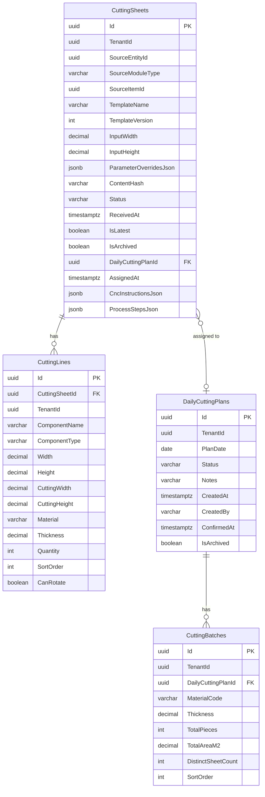

# SpaceOS — Modules.Cutting Core Architecture
## CuttingSheet + DailyCuttingPlan + CuttingBatch — Shared Cutting Service

> **Verzió:** v4.0 — 2026-04-13
> **Státusz:** IMPLEMENTÁCIÓRA KÉSZ
> **Blokkoló feltétel:** Modules.Contracts DONE · Ecosystem Actor DEPLOYED (ModuleRegistry `cutting` entry)
> **Kumulált review:** `/database-designer` + `/database-schema-designer` → v2 · `/senior-security` → v3 · `/senior-backend` → v4
> **Referencia:** `SpaceOS_Modules_Cutting_Vision_v1.md` · `SpaceOS_Modules_Contracts_Architecture_v4.md`
> **Repo:** `spaceos-modules-cutting` (új polyrepo)
> **DB schema:** `spaceos_cutting` (önálló PostgreSQL 16 schema)
> **Port:** 5004 (systemd, loopback-only)
> **Becsült effort:** ~15 fejlesztői nap (v1: 12 → v2: +1.5 → v3: +1 → v4: +0.5)
> **Test baseline:** 1570+ pass (Kernel 933 + Orchestrator 176 + Portal 291 + Joinery 109 + Abstractions 61)

---

## 1. Kumulált Finding Összesítő (v1 → v4)

| Review | Finding-ek | Legfontosabb javítás | Effort delta |
|--------|-----------|----------------------|--------------|
| v1 → `/database-designer` + `/database-schema-designer` → v2 | 1 CRITICAL · 3 HIGH · 3 MEDIUM | Content immutability trigger · Compound cross-tenant FK · JSONB size CHECK fix · TenantId consistency trigger | +1.5 nap |
| v2 → `/senior-security` → v3 | 1 CRITICAL · 3 HIGH · 2 MEDIUM | Internal API auth header · Hash integrity (JSONB) · Batch recalc concurrency · Domain trust boundary | +1 nap |
| v3 → `/senior-backend` → v4 | 0 CRITICAL · 3 HIGH · 3 MEDIUM | RemoveFromPlan event · Plan status guard on assign · IsLatest lifecycle in handler | +0.5 nap |
| **Összesen** | **2 CRITICAL · 9 HIGH · 8 MEDIUM** | | **~15 fejlesztői nap** |

### Finding részletek

| ID | Súly | Terület | Probléma | vN javítás |
|----|------|---------|----------|------------|
| DB-01 | 🔴 CRITICAL | Immutability | CuttingSheet content mezők UPDATE-olhatók direkt SQL-lel | v2: `prevent_cutting_sheet_content_update()` trigger |
| DB-02 | 🟠 HIGH | Cross-tenant FK | DailyCuttingPlanId FK egyszerű — cross-tenant assignment lehetséges | v2: Compound FK: `(DailyCuttingPlanId, TenantId)` |
| DB-03 | 🟠 HIGH | JSONB size CHECK | `pg_column_size()` TOAST-tömörített méretet ad | v2: `octet_length()` |
| DB-04 | 🟠 HIGH | TenantId consistency | CuttingLine.TenantId nem garantáltan egyezik parent-tel | v2: `check_cutting_line_tenant()` trigger |
| DB-05 | 🟡 MEDIUM | Function schema | `try_cast_uuid` nem fully-qualified | v2: `public.try_cast_uuid()` |
| DB-06 | 🟡 MEDIUM | Orphan status | Plan törlés → sheet Status `Assigned` marad | v2: `revert_sheet_status_on_plan_delete()` trigger |
| DB-07 | 🟡 MEDIUM | IsArchived | Kernel convention hiányzik | v2: `IsArchived` + partial index-ek |
| SEC-01 | 🔴 CRITICAL | Internal API auth | Bármely localhost process hívhatja a Cutting API-t | v3: `InternalHeaderMiddleware` + `X-SpaceOS-Internal` |
| SEC-02 | 🟠 HIGH | Hash integrity | CncInstructionsJson + ProcessStepsJson kimaradt a hash-ből | v3: Mindkét mező bekerül ComputeHash()-be |
| SEC-03 | 🟠 HIGH | Concurrency | Párhuzamos batch recalc race | v3: `pg_advisory_xact_lock(planId)` |
| SEC-04 | 🟠 HIGH | Domain trust | AssignToPlan nem validálja plan.TenantId | v3: `AssignToPlan(DailyCuttingPlan plan, ...)` |
| SEC-05 | 🟡 MEDIUM | DoS | Nincs per-tenant sheet limit | v3: Max 200 aktív sheet/tenant |
| SEC-06 | 🟡 MEDIUM | Enum parsing | SourceModuleType unknown → exception | v3: Strict Enum.TryParse + Result.Invalid |
| BE-01 | 🟠 HIGH | Golden Rule 3 | `RemoveFromPlan()` nem vet domain event-et — audit trail hiányos, batch recalc nem triggerelődik | v4: `CuttingSheetRemovedFromPlan` event + `RecalculateBatchesOnSheetRemoved` handler |
| BE-02 | 🟠 HIGH | Plan status guard | `AssignToPlan()` nem ellenőrzi plan Status == Draft — Confirmed plan-hez is enged assign-t | v4: `if (plan.Status != CuttingPlanStatus.Draft) return Result.Invalid(...)` |
| BE-03 | 🟠 HIGH | IsLatest lifecycle | Új sheet submit azonos SourceItemId-re → partial unique index exception ahelyett, hogy a régi sheet-et IsLatest=false-ra állítaná | v4: Handler: load existing → MarkNotLatest() → save new. Explicit séma. |
| BE-04 | 🟡 MEDIUM | Return type | `RecalculateBatches()` void — confirmed plan-en csendben nem csinál semmit | v4: `Result` return type |
| BE-05 | 🟡 MEDIUM | Spec gap | `CuttingSheetsByPlanSpec` hivatkozva de nem listázva | v4: Hozzáadva — 6 spec összesen |
| BE-06 | 🟡 MEDIUM | EF Core mapping | `SheetDimensions` VO → `OwnsOne()` config nincs dokumentálva | v4: Explicit `OwnsOne()` mapping + column name override |

---

## 2. Architekturális döntések

| # | Döntés | Választás | Indoklás |
|---|--------|-----------|----------|
| D-01 | Repo struktúra | **Önálló polyrepo** `spaceos-modules-cutting` | Kernel/Joinery mintája; önálló deploy ciklus; process isolation |
| D-02 | DB schema | **`spaceos_cutting`** önálló schema | Teljes izoláció; RLS saját policy-kkel; független migration |
| D-03 | Port | **5004** (Kernel:5001 · Joinery:5002 · Abstractions:5003) | Stage Registry port range 5000-5099 (SEC-01) |
| D-04 | Core capability | **Csak `CuttingSubmit`** | Core = fogadás + tárolás + tervezés. Nesting/Execution/Waste = későbbi fázis |
| D-05 | Inventory dependency | **Nincs runtime dependency Core-ban** | `IInventoryProvider` a Planning fázis prereq-je. Core önállóan működik. A tenant saját inventory megoldása adapter-on keresztül csatlakozik |
| D-06 | CuttingSheet immutability | **Immutable snapshot** | Új submit = új sheet (régi megmarad, `IsLatest = false`). Audit trail |
| D-07 | CncInstructions + ProcessSteps | **JSONB tároláss** (nem owned entity) | Core-ban nem query-zett, pass-through az Execution fázisnak. JSONB: flexibilis, kevés tábla |
| D-08 | DailyCuttingPlan | **Operátor hozza létre manuálisan** | Nem auto-generált — a szabász dönti el mit csinál holnap |
| D-09 | CuttingBatch | **Auto-computed owned entity** a Plan-en belül | Sheet assignment → lines csoportosítása (Material, Thickness) → batch auto-generálás |
| D-10 | Contract implementáció | **`ICuttingProvider` partial** | Core: Submit + Get + GetBySource. Nesting/Execution/Waste → `NotSupportedException` + `ProviderCapability` flag |
| D-11 | Source tracking | **SourceModuleType + SourceEntityId** | A CuttingSheet tudja, hogy Door/Cabinet/Window modul küldte, és melyik entity-hez tartozik |

---

## 3. Scope határ

### Core fázis (ez a dokumentum)

| Fogalom | Tartalom | Státusz kezelés |
|---------|----------|-----------------|
| **CuttingSheet** | Fogadás trade moduloktól, immutable snapshot tárolás | Received → Queued → Assigned |
| **CuttingLine** | Alkatrészek a sheeten belül (owned entity) | — |
| **DailyCuttingPlan** | Napi szabász terv, operátor kezeli | Draft → Confirmed |
| **CuttingBatch** | Anyag szerinti csoportosítás a terven belül (auto) | — |

### NEM scope (későbbi fázisok)

| Fogalom | Fázis | Prereq |
|---------|-------|--------|
| PanelAssignment (nesting) | Planning | Core DEPLOYED + IInventoryProvider |
| CuttingExecution FSM | Execution | Planning DEPLOYED + Stage Registry |
| WasteReport, Analytics | Analytics | Execution DEPLOYED |
| OptiCut / CutRite adapter | Adapters | Contract DONE |

---

## 4. Domain modell

### Solution struktúra

```
spaceos-modules-cutting/
├── SpaceOS.Modules.Cutting.Domain/
│   ├── Aggregates/
│   │   ├── CuttingSheet.cs
│   │   └── DailyCuttingPlan.cs
│   ├── Entities/
│   │   ├── CuttingLine.cs
│   │   ├── CuttingBatch.cs
│   │   └── PlanSheetAssignment.cs
│   ├── ValueObjects/
│   │   ├── MaterialSpec.cs         (MaterialCode + Thickness)
│   │   └── SheetDimensions.cs      (InputWidth + InputHeight)
│   ├── Enums/
│   │   ├── CuttingSheetStatus.cs
│   │   ├── CuttingPlanStatus.cs
│   │   └── SourceModuleType.cs
│   ├── Events/
│   │   ├── CuttingSheetReceived.cs
│   │   ├── CuttingSheetQueued.cs
│   │   ├── CuttingSheetAssigned.cs
│   │   ├── DailyCuttingPlanCreated.cs
│   │   ├── DailyCuttingPlanConfirmed.cs
│   │   └── BatchesRecalculated.cs
│   ├── Repositories/
│   │   ├── ICuttingSheetRepository.cs
│   │   └── IDailyCuttingPlanRepository.cs
│   └── Services/
│       └── IBatchGroupingService.cs
├── SpaceOS.Modules.Cutting.Application/
│   ├── Commands/
│   │   ├── SubmitCuttingSheet/
│   │   │   ├── SubmitCuttingSheetCommand.cs
│   │   │   ├── SubmitCuttingSheetCommandHandler.cs
│   │   │   └── SubmitCuttingSheetCommandValidator.cs
│   │   ├── QueueCuttingSheet/
│   │   │   ├── QueueCuttingSheetCommand.cs
│   │   │   ├── QueueCuttingSheetCommandHandler.cs
│   │   │   └── QueueCuttingSheetCommandValidator.cs
│   │   ├── CreateDailyCuttingPlan/
│   │   │   ├── CreateDailyCuttingPlanCommand.cs
│   │   │   ├── CreateDailyCuttingPlanCommandHandler.cs
│   │   │   └── CreateDailyCuttingPlanCommandValidator.cs
│   │   ├── AssignSheetToPlan/
│   │   │   ├── AssignSheetToPlanCommand.cs
│   │   │   ├── AssignSheetToPlanCommandHandler.cs
│   │   │   └── AssignSheetToPlanCommandValidator.cs
│   │   ├── RemoveSheetFromPlan/
│   │   │   ├── RemoveSheetFromPlanCommand.cs
│   │   │   └── RemoveSheetFromPlanCommandHandler.cs
│   │   └── ConfirmDailyCuttingPlan/
│   │       ├── ConfirmDailyCuttingPlanCommand.cs
│   │       └── ConfirmDailyCuttingPlanCommandHandler.cs
│   ├── Queries/
│   │   ├── GetCuttingSheet/
│   │   │   └── GetCuttingSheetQueryHandler.cs
│   │   ├── GetCuttingSheetsBySource/
│   │   │   └── GetCuttingSheetsBySourceQueryHandler.cs
│   │   ├── ListCuttingSheets/
│   │   │   └── ListCuttingSheetsQueryHandler.cs
│   │   ├── GetDailyCuttingPlan/
│   │   │   └── GetDailyCuttingPlanQueryHandler.cs
│   │   └── ListDailyCuttingPlans/
│   │       └── ListDailyCuttingPlansQueryHandler.cs
│   ├── DTOs/
│   │   ├── CuttingSheetDetailDto.cs
│   │   ├── CuttingSheetListDto.cs
│   │   ├── DailyCuttingPlanDetailDto.cs
│   │   ├── DailyCuttingPlanListDto.cs
│   │   └── CuttingBatchSummaryDto.cs
│   ├── Specifications/
│   │   ├── CuttingSheetsByTenantSpec.cs
│   │   ├── CuttingSheetsBySourceSpec.cs
│   │   ├── CuttingSheetsByStatusSpec.cs
│   │   ├── QueuedSheetsForPlanningSpec.cs
│   │   └── DailyCuttingPlansByDateRangeSpec.cs
│   ├── EventHandlers/
│   │   └── RecalculateBatchesOnSheetAssigned.cs
│   └── Services/
│       ├── CuttingProviderService.cs   (ICuttingProvider implementation)
│       └── BatchGroupingService.cs
├── SpaceOS.Modules.Cutting.Infrastructure/
│   ├── Data/
│   │   ├── CuttingDbContext.cs
│   │   ├── Configurations/
│   │   │   ├── CuttingSheetConfiguration.cs
│   │   │   ├── CuttingLineConfiguration.cs
│   │   │   ├── DailyCuttingPlanConfiguration.cs
│   │   │   ├── CuttingBatchConfiguration.cs
│   │   │   └── PlanSheetAssignmentConfiguration.cs
│   │   ├── Repositories/
│   │   │   ├── CuttingSheetRepository.cs
│   │   │   └── DailyCuttingPlanRepository.cs
│   │   └── Migrations/
│   │       └── C_0001_InitialSchema.cs
│   └── Security/
│       ├── TenantSessionInterceptor.cs
│       └── CuttingSchemaInitializer.cs
├── SpaceOS.Modules.Cutting.Api/
│   ├── Endpoints/
│   │   ├── CuttingSheetEndpoints.cs
│   │   └── DailyCuttingPlanEndpoints.cs
│   ├── Program.cs
│   └── appsettings.json
├── SpaceOS.Modules.Cutting.Tests/
│   ├── Domain/
│   │   ├── CuttingSheetTests.cs
│   │   ├── DailyCuttingPlanTests.cs
│   │   ├── CuttingBatchTests.cs
│   │   └── MaterialSpecTests.cs
│   ├── Application/
│   │   ├── SubmitCuttingSheetCommandHandlerTests.cs
│   │   ├── AssignSheetToPlanCommandHandlerTests.cs
│   │   ├── BatchGroupingServiceTests.cs
│   │   └── ValidatorTests.cs
│   ├── Api/
│   │   ├── CuttingSheetApiTests.cs
│   │   └── DailyCuttingPlanApiTests.cs
│   └── Security/
│       ├── TenantIsolationTests.cs
│       └── AuthTests.cs
├── CLAUDE.md
└── README.md
```

### 4.1 CuttingSheet aggregate

```csharp
// Domain/Aggregates/CuttingSheet.cs
public sealed class CuttingSheet : TenantScopedEntity
{
    private readonly List<CuttingLine> _lines = [];

    // Source tracking — which trade module sent this
    public Guid SourceEntityId { get; private set; }
    public SourceModuleType SourceModuleType { get; private set; }
    public Guid? SourceItemId { get; private set; }

    // Template reference (immutable snapshot context)
    public string TemplateName { get; private set; } = default!;
    public int TemplateVersion { get; private set; }
    public SheetDimensions InputDimensions { get; private set; } = default!;
    public string? ParameterOverridesJson { get; private set; }

    // Integrity
    public string ContentHash { get; private set; } = default!;

    // Status
    public CuttingSheetStatus Status { get; private set; }
    public DateTimeOffset ReceivedAt { get; private set; }
    public bool IsLatest { get; private set; }
    public bool IsArchived { get; private set; }  // DB-07

    // Plan assignment (nullable — not yet assigned)
    public Guid? DailyCuttingPlanId { get; private set; }
    public DateTimeOffset? AssignedAt { get; private set; }

    // Stored as JSONB — not queried at Core, pass-through for Execution
    public string CncInstructionsJson { get; private set; } = "[]";
    public string ProcessStepsJson { get; private set; } = "[]";

    // Owned entities — queryable for batch grouping
    public IReadOnlyList<CuttingLine> Lines => _lines.AsReadOnly();

    private CuttingSheet() { } // EF Core

    public static Result<CuttingSheet> Receive(
        Guid tenantId,
        Guid sourceEntityId,
        SourceModuleType sourceModuleType,
        Guid? sourceItemId,
        string templateName,
        int templateVersion,
        SheetDimensions inputDimensions,
        string? parameterOverridesJson,
        IReadOnlyList<CuttingLine> lines,
        string cncInstructionsJson,
        string processStepsJson,
        IClock clock)
    {
        if (lines.Count == 0)
            return Result.Invalid(new ValidationError("At least one CuttingLine is required."));
        if (lines.Count > 200)
            return Result.Invalid(new ValidationError("Maximum 200 CuttingLines per sheet."));
        if (string.IsNullOrWhiteSpace(templateName))
            return Result.Invalid(new ValidationError("TemplateName is required."));

        var sheet = new CuttingSheet
        {
            Id = Guid.NewGuid(),
            TenantId = tenantId,
            SourceEntityId = sourceEntityId,
            SourceModuleType = sourceModuleType,
            SourceItemId = sourceItemId,
            TemplateName = templateName,
            TemplateVersion = templateVersion,
            InputDimensions = inputDimensions,
            ParameterOverridesJson = parameterOverridesJson,
            Status = CuttingSheetStatus.Received,
            ReceivedAt = clock.UtcNow,
            IsLatest = true,
            IsArchived = false,
            CncInstructionsJson = cncInstructionsJson,
            ProcessStepsJson = processStepsJson
        };

        sheet._lines.AddRange(lines);
        sheet.ContentHash = sheet.ComputeHash();
        sheet.AddDomainEvent(new CuttingSheetReceived(sheet.Id, tenantId, sourceModuleType));
        return Result.Success(sheet);
    }

    public Result QueueForPlanning()
    {
        if (Status != CuttingSheetStatus.Received)
            return Result.Invalid(new ValidationError(
                $"Cannot queue sheet in status {Status}. Expected: Received."));

        Status = CuttingSheetStatus.Queued;
        AddDomainEvent(new CuttingSheetQueued(Id, TenantId));
        return Result.Success();
    }

    // SEC-04: takes DailyCuttingPlan entity — domain-level TenantId check
    // BE-02: plan must be Draft to accept new assignments
    public Result AssignToPlan(DailyCuttingPlan plan, IClock clock)
    {
        if (Status != CuttingSheetStatus.Queued)
            return Result.Invalid(new ValidationError(
                $"Cannot assign sheet in status {Status}. Expected: Queued."));
        if (plan.TenantId != TenantId)
            return Result.Forbidden();
        if (plan.Status != CuttingPlanStatus.Draft)
            return Result.Invalid(new ValidationError(
                $"Cannot assign to plan in status {plan.Status}. Expected: Draft."));

        DailyCuttingPlanId = plan.Id;
        AssignedAt = clock.UtcNow;
        Status = CuttingSheetStatus.Assigned;
        AddDomainEvent(new CuttingSheetAssigned(Id, TenantId, plan.Id));
        return Result.Success();
    }

    // BE-01: raises domain event for audit trail + batch recalc trigger
    public Result RemoveFromPlan()
    {
        if (Status != CuttingSheetStatus.Assigned)
            return Result.Invalid(new ValidationError(
                $"Cannot remove sheet in status {Status}. Expected: Assigned."));

        var previousPlanId = DailyCuttingPlanId!.Value;
        DailyCuttingPlanId = null;
        AssignedAt = null;
        Status = CuttingSheetStatus.Queued;
        AddDomainEvent(new CuttingSheetRemovedFromPlan(Id, TenantId, previousPlanId));
        return Result.Success();
    }

    internal void MarkNotLatest() => IsLatest = false;

    private string ComputeHash()
    {
        var sb = new StringBuilder();
        sb.Append(TenantId);
        sb.Append(SourceEntityId).Append(SourceModuleType)
          .Append(TemplateName).Append(TemplateVersion)
          .Append(InputDimensions.Width).Append(InputDimensions.Height)
          .Append(ParameterOverridesJson ?? "");
        foreach (var line in _lines.OrderBy(l => l.SortOrder))
            sb.Append(line.ComponentName).Append(line.Width).Append(line.Height)
              .Append(line.CuttingWidth).Append(line.CuttingHeight)
              .Append(line.Material).Append(line.Thickness).Append(line.Quantity);
        // SEC-02: include JSONB fields in hash
        sb.Append(CncInstructionsJson).Append(ProcessStepsJson);
        using var sha = SHA256.Create();
        return Convert.ToHexString(sha.ComputeHash(Encoding.UTF8.GetBytes(sb.ToString())));
    }
}
```

### 4.2 CuttingLine (owned entity)

```csharp
// Domain/Entities/CuttingLine.cs
public sealed class CuttingLine
{
    public Guid Id { get; private set; }
    public Guid CuttingSheetId { get; private set; }

    public string ComponentName { get; private set; } = default!;  // max 100
    public string ComponentType { get; private set; } = default!;  // max 50
    public decimal Width { get; private set; }       // nyers méret
    public decimal Height { get; private set; }      // nyers méret
    public decimal CuttingWidth { get; private set; }  // oversize-zal
    public decimal CuttingHeight { get; private set; } // oversize-zal
    public string Material { get; private set; } = default!;  // max 100
    public decimal Thickness { get; private set; }
    public int Quantity { get; private set; }
    public int SortOrder { get; private set; }
    public bool CanRotate { get; private set; }  // nesting support (dekorminta iránya)

    private CuttingLine() { } // EF Core

    public static CuttingLine Create(
        string componentName, string componentType,
        decimal width, decimal height,
        decimal cuttingWidth, decimal cuttingHeight,
        string material, decimal thickness,
        int quantity, int sortOrder, bool canRotate)
    {
        return new CuttingLine
        {
            Id = Guid.NewGuid(),
            ComponentName = componentName,
            ComponentType = componentType,
            Width = width, Height = height,
            CuttingWidth = cuttingWidth, CuttingHeight = cuttingHeight,
            Material = material, Thickness = thickness,
            Quantity = quantity, SortOrder = sortOrder,
            CanRotate = canRotate
        };
    }

    /// <summary>Material grouping key for batch computation.</summary>
    public MaterialSpec GetMaterialSpec() => new(Material, Thickness);
}
```

### 4.3 DailyCuttingPlan aggregate

```csharp
// Domain/Aggregates/DailyCuttingPlan.cs
public sealed class DailyCuttingPlan : TenantScopedEntity
{
    private readonly List<CuttingBatch> _batches = [];

    public DateOnly PlanDate { get; private set; }
    public CuttingPlanStatus Status { get; private set; }
    public string? Notes { get; private set; }
    public DateTimeOffset CreatedAt { get; private set; }
    public string CreatedBy { get; private set; } = default!;  // operator name/id
    public DateTimeOffset? ConfirmedAt { get; private set; }
    public bool IsArchived { get; private set; }  // DB-07

    public IReadOnlyList<CuttingBatch> Batches => _batches.AsReadOnly();

    private DailyCuttingPlan() { } // EF Core

    public static Result<DailyCuttingPlan> Create(
        Guid tenantId,
        DateOnly planDate,
        string createdBy,
        string? notes,
        IClock clock)
    {
        if (string.IsNullOrWhiteSpace(createdBy))
            return Result.Invalid(new ValidationError("CreatedBy is required."));

        var plan = new DailyCuttingPlan
        {
            Id = Guid.NewGuid(),
            TenantId = tenantId,
            PlanDate = planDate,
            Status = CuttingPlanStatus.Draft,
            Notes = notes,
            CreatedAt = clock.UtcNow,
            CreatedBy = createdBy
        };

        plan.AddDomainEvent(new DailyCuttingPlanCreated(plan.Id, tenantId, planDate));
        return Result.Success(plan);
    }

    public Result Confirm(IClock clock)
    {
        if (Status != CuttingPlanStatus.Draft)
            return Result.Invalid(new ValidationError(
                $"Cannot confirm plan in status {Status}. Expected: Draft."));
        if (_batches.Count == 0)
            return Result.Invalid(new ValidationError(
                "Cannot confirm plan with no batches. Assign sheets first."));

        Status = CuttingPlanStatus.Confirmed;
        ConfirmedAt = clock.UtcNow;
        AddDomainEvent(new DailyCuttingPlanConfirmed(Id, TenantId, PlanDate));
        return Result.Success();
    }

    /// <summary>
    /// Recalculates batches from the given sheets' lines.
    /// Called by BatchGroupingService after sheet assignment changes.
    /// Replaces all existing batches.
    /// </summary>
    // BE-04: returns Result instead of void — caller knows if recalc happened
    public Result RecalculateBatches(IReadOnlyList<CuttingSheet> assignedSheets)
    {
        if (Status != CuttingPlanStatus.Draft)
            return Result.Invalid(new ValidationError(
                $"Cannot recalculate batches on plan in status {Status}. Expected: Draft."));

        _batches.Clear();

        var groups = assignedSheets
            .SelectMany(s => s.Lines)
            .GroupBy(l => l.GetMaterialSpec())
            .OrderBy(g => g.Key.MaterialCode)
            .ThenBy(g => g.Key.Thickness);

        int sortOrder = 0;
        foreach (var group in groups)
        {
            var batch = CuttingBatch.Create(
                TenantId,
                group.Key,
                totalPieces: group.Sum(l => l.Quantity),
                totalAreaM2: group.Sum(l => l.CuttingWidth * l.CuttingHeight * l.Quantity) / 1_000_000m,
                distinctSheetCount: assignedSheets.Count(s => s.Lines.Any(l => l.GetMaterialSpec() == group.Key)),
                sortOrder: sortOrder++);
            _batches.Add(batch);
        }

        AddDomainEvent(new BatchesRecalculated(Id, TenantId, _batches.Count));
        return Result.Success();
    }

    public void UpdateNotes(string? notes) => Notes = notes;
}
```

### 4.4 CuttingBatch (owned entity)

```csharp
// Domain/Entities/CuttingBatch.cs
public sealed class CuttingBatch
{
    public Guid Id { get; private set; }
    public Guid TenantId { get; private set; }
    public Guid DailyCuttingPlanId { get; private set; }

    public string MaterialCode { get; private set; } = default!;
    public decimal Thickness { get; private set; }
    public int TotalPieces { get; private set; }
    public decimal TotalAreaM2 { get; private set; }
    public int DistinctSheetCount { get; private set; }
    public int SortOrder { get; private set; }

    private CuttingBatch() { }

    internal static CuttingBatch Create(
        Guid tenantId, MaterialSpec spec,
        int totalPieces, decimal totalAreaM2,
        int distinctSheetCount, int sortOrder)
    {
        return new CuttingBatch
        {
            Id = Guid.NewGuid(),
            TenantId = tenantId,
            MaterialCode = spec.MaterialCode,
            Thickness = spec.Thickness,
            TotalPieces = totalPieces,
            TotalAreaM2 = Math.Round(totalAreaM2, 4, MidpointRounding.AwayFromZero),
            DistinctSheetCount = distinctSheetCount,
            SortOrder = sortOrder
        };
    }
}
```

### 4.5 Value Objects

```csharp
// Domain/ValueObjects/MaterialSpec.cs
public sealed record MaterialSpec(string MaterialCode, decimal Thickness);

// Domain/ValueObjects/SheetDimensions.cs
public sealed record SheetDimensions
{
    public decimal Width { get; }
    public decimal Height { get; }

    public SheetDimensions(decimal width, decimal height)
    {
        if (width <= 0 || width > 10_000)
            throw new ArgumentOutOfRangeException(nameof(width));
        if (height <= 0 || height > 10_000)
            throw new ArgumentOutOfRangeException(nameof(height));
        Width = width;
        Height = height;
    }
}
```

### 4.6 Enums

```csharp
// Domain/Enums/CuttingSheetStatus.cs
public enum CuttingSheetStatus
{
    Received,       // just submitted by trade module
    Queued,         // operator confirmed, waiting for plan assignment
    Assigned,       // part of a DailyCuttingPlan
    // Future phases:
    // Nested,       // Planning: nesting complete
    // InExecution,  // Execution: cutting in progress
    // Completed,    // Execution: done
    // Failed        // Execution: failed
}

// Domain/Enums/CuttingPlanStatus.cs
public enum CuttingPlanStatus
{
    Draft,          // operator building the plan
    Confirmed,      // plan locked, ready for nesting/execution
    // Future phases:
    // InProgress,   // Execution: cutting started
    // Completed     // Execution: all sheets done
}

// Domain/Enums/SourceModuleType.cs
public enum SourceModuleType
{
    Door,
    Cabinet,
    Window
}
```

### 4.7 Domain Events

```csharp
public sealed record CuttingSheetReceived(Guid SheetId, Guid TenantId, SourceModuleType Source) : IDomainEvent;
public sealed record CuttingSheetQueued(Guid SheetId, Guid TenantId) : IDomainEvent;
public sealed record CuttingSheetAssigned(Guid SheetId, Guid TenantId, Guid PlanId) : IDomainEvent;
public sealed record CuttingSheetRemovedFromPlan(Guid SheetId, Guid TenantId, Guid PreviousPlanId) : IDomainEvent;  // BE-01
public sealed record DailyCuttingPlanCreated(Guid PlanId, Guid TenantId, DateOnly PlanDate) : IDomainEvent;
public sealed record DailyCuttingPlanConfirmed(Guid PlanId, Guid TenantId, DateOnly PlanDate) : IDomainEvent;
public sealed record BatchesRecalculated(Guid PlanId, Guid TenantId, int BatchCount) : IDomainEvent;
```

### 4.8 Repository interfaces

```csharp
public interface ICuttingSheetRepository
{
    Task<CuttingSheet?> GetByIdAsync(Guid id, CancellationToken ct);
    Task<IReadOnlyList<CuttingSheet>> GetBySourceAsync(Guid sourceEntityId, CancellationToken ct);
    Task<IReadOnlyList<CuttingSheet>> ListAsync(ISpecification<CuttingSheet> spec, CancellationToken ct);
    Task AddAsync(CuttingSheet sheet, CancellationToken ct);
    Task SaveChangesAsync(CancellationToken ct);
}

public interface IDailyCuttingPlanRepository
{
    Task<DailyCuttingPlan?> GetByIdAsync(Guid id, CancellationToken ct);
    Task<IReadOnlyList<DailyCuttingPlan>> ListAsync(ISpecification<DailyCuttingPlan> spec, CancellationToken ct);
    Task AddAsync(DailyCuttingPlan plan, CancellationToken ct);
    Task SaveChangesAsync(CancellationToken ct);
}
```

### 4.9 BatchGroupingService

```csharp
// Domain/Services/IBatchGroupingService.cs
public interface IBatchGroupingService
{
    /// <summary>
    /// Loads all assigned sheets for the given plan and recalculates batches.
    /// </summary>
    Task RecalculateBatchesAsync(DailyCuttingPlan plan, CancellationToken ct);
}

// Application/Services/BatchGroupingService.cs
public sealed class BatchGroupingService(
    ICuttingSheetRepository sheetRepo) : IBatchGroupingService
{
    public async Task RecalculateBatchesAsync(DailyCuttingPlan plan, CancellationToken ct)
    {
        var assignedSheets = await sheetRepo
            .ListAsync(new CuttingSheetsByPlanSpec(plan.Id), ct)
            .ConfigureAwait(false);

        plan.RecalculateBatches(assignedSheets);
    }
}
```

---

## 5. DB schema (DDL)

### Migration C-0001 — Cutting Core

```sql
-- ============================================================
-- Migration C-0001: Cutting Core Schema
-- CuttingSheet + CuttingLine + DailyCuttingPlan + CuttingBatch
-- Schema: spaceos_cutting (isolated)
-- ============================================================

-- 0. Schema + RLS role setup
CREATE SCHEMA IF NOT EXISTS spaceos_cutting;
SET search_path TO spaceos_cutting;

-- Application role (not superuser)
DO $$
BEGIN
    IF NOT EXISTS (SELECT FROM pg_roles WHERE rolname = 'spaceos_cutting_app') THEN
        CREATE ROLE spaceos_cutting_app LOGIN;
    END IF;
END $$;

GRANT USAGE ON SCHEMA spaceos_cutting TO spaceos_cutting_app;
ALTER DEFAULT PRIVILEGES IN SCHEMA spaceos_cutting
    GRANT SELECT, INSERT, UPDATE, DELETE ON TABLES TO spaceos_cutting_app;

-- 1. CuttingSheets
CREATE TABLE spaceos_cutting."CuttingSheets" (
    "Id"                        uuid          NOT NULL PRIMARY KEY DEFAULT gen_random_uuid(),
    "TenantId"                  uuid          NOT NULL,

    -- Source tracking
    "SourceEntityId"            uuid          NOT NULL,
    "SourceModuleType"          varchar(20)   NOT NULL,
    "SourceItemId"              uuid          NULL,

    -- Template snapshot context
    "TemplateName"              varchar(100)  NOT NULL,
    "TemplateVersion"           int           NOT NULL CHECK ("TemplateVersion" > 0),
    "InputWidth"                decimal(8,2)  NOT NULL CHECK ("InputWidth" > 0 AND "InputWidth" <= 10000),
    "InputHeight"               decimal(8,2)  NOT NULL CHECK ("InputHeight" > 0 AND "InputHeight" <= 10000),
    "ParameterOverridesJson"    jsonb         NULL,

    -- Integrity
    "ContentHash"               varchar(64)   NOT NULL,

    -- Status
    "Status"                    varchar(20)   NOT NULL DEFAULT 'Received',
    "ReceivedAt"                timestamptz   NOT NULL DEFAULT NOW(),
    "IsLatest"                  boolean       NOT NULL DEFAULT true,
    "IsArchived"                boolean       NOT NULL DEFAULT false,  -- DB-07

    -- Plan assignment
    "DailyCuttingPlanId"        uuid          NULL,
    "AssignedAt"                timestamptz   NULL,

    -- JSONB pass-through (not queried at Core)
    "CncInstructionsJson"       jsonb         NOT NULL DEFAULT '[]',
    "ProcessStepsJson"          jsonb         NOT NULL DEFAULT '[]',

    -- Constraints
    CONSTRAINT "CK_CuttingSheets_Status"
        CHECK ("Status" IN ('Received','Queued','Assigned','Nested','InExecution','Completed','Failed')),
    CONSTRAINT "CK_CuttingSheets_SourceModuleType"
        CHECK ("SourceModuleType" IN ('Door','Cabinet','Window')),
    -- DB-03: octet_length instead of pg_column_size (TOAST-safe)
    CONSTRAINT "CK_CuttingSheets_ParameterOverridesJson_Size"
        CHECK ("ParameterOverridesJson" IS NULL OR octet_length("ParameterOverridesJson"::text) <= 10240),
    CONSTRAINT "CK_CuttingSheets_CncInstructionsJson_Size"
        CHECK (octet_length("CncInstructionsJson"::text) <= 524288),
    CONSTRAINT "CK_CuttingSheets_ProcessStepsJson_Size"
        CHECK (octet_length("ProcessStepsJson"::text) <= 102400)
);

-- Partial unique: egy SourceItemId-hez max 1 IsLatest=true (per tenant)
CREATE UNIQUE INDEX "UX_CuttingSheets_SourceItemId_Latest"
    ON spaceos_cutting."CuttingSheets" ("TenantId", "SourceItemId")
    WHERE "IsLatest" = true AND "SourceItemId" IS NOT NULL;

CREATE INDEX "IX_CuttingSheets_TenantId" ON spaceos_cutting."CuttingSheets" ("TenantId");
CREATE INDEX "IX_CuttingSheets_Status" ON spaceos_cutting."CuttingSheets" ("TenantId", "Status")
    WHERE "IsArchived" = false;
CREATE INDEX "IX_CuttingSheets_SourceEntityId" ON spaceos_cutting."CuttingSheets" ("TenantId", "SourceEntityId");
CREATE INDEX "IX_CuttingSheets_PlanId" ON spaceos_cutting."CuttingSheets" ("DailyCuttingPlanId")
    WHERE "DailyCuttingPlanId" IS NOT NULL;

-- 2. CuttingLines
CREATE TABLE spaceos_cutting."CuttingLines" (
    "Id"              uuid          NOT NULL PRIMARY KEY DEFAULT gen_random_uuid(),
    "CuttingSheetId"  uuid          NOT NULL REFERENCES spaceos_cutting."CuttingSheets"("Id") ON DELETE CASCADE,
    "TenantId"        uuid          NOT NULL,

    "ComponentName"   varchar(100)  NOT NULL,
    "ComponentType"   varchar(50)   NOT NULL,
    "Width"           decimal(8,2)  NOT NULL CHECK ("Width" > 0),
    "Height"          decimal(8,2)  NOT NULL CHECK ("Height" > 0),
    "CuttingWidth"    decimal(8,2)  NOT NULL CHECK ("CuttingWidth" > 0),
    "CuttingHeight"   decimal(8,2)  NOT NULL CHECK ("CuttingHeight" > 0),
    "Material"        varchar(100)  NOT NULL,
    "Thickness"       decimal(6,2)  NOT NULL CHECK ("Thickness" > 0),
    "Quantity"        int           NOT NULL CHECK ("Quantity" > 0 AND "Quantity" <= 100),
    "SortOrder"       int           NOT NULL DEFAULT 0,
    "CanRotate"       boolean       NOT NULL DEFAULT true
);

CREATE INDEX "IX_CuttingLines_SheetId" ON spaceos_cutting."CuttingLines" ("CuttingSheetId");
CREATE INDEX "IX_CuttingLines_Material" ON spaceos_cutting."CuttingLines" ("TenantId", "Material", "Thickness");

-- 3. DailyCuttingPlans
CREATE TABLE spaceos_cutting."DailyCuttingPlans" (
    "Id"              uuid          NOT NULL PRIMARY KEY DEFAULT gen_random_uuid(),
    "TenantId"        uuid          NOT NULL,

    "PlanDate"        date          NOT NULL,
    "Status"          varchar(20)   NOT NULL DEFAULT 'Draft',
    "Notes"           varchar(2000) NULL,
    "CreatedAt"       timestamptz   NOT NULL DEFAULT NOW(),
    "CreatedBy"       varchar(200)  NOT NULL,
    "ConfirmedAt"     timestamptz   NULL,
    "IsArchived"      boolean       NOT NULL DEFAULT false,  -- DB-07

    CONSTRAINT "CK_DailyCuttingPlans_Status"
        CHECK ("Status" IN ('Draft','Confirmed','InProgress','Completed'))
);

-- DB-02: Compound unique for cross-tenant FK guard
CREATE UNIQUE INDEX "UX_DailyCuttingPlans_Id_TenantId"
    ON spaceos_cutting."DailyCuttingPlans" ("Id", "TenantId");

-- Egy tenant-nek egy napra max 1 aktív plan
CREATE UNIQUE INDEX "UX_DailyCuttingPlans_TenantDate"
    ON spaceos_cutting."DailyCuttingPlans" ("TenantId", "PlanDate")
    WHERE "IsArchived" = false;  -- DB-07: archived plans don't block new ones

CREATE INDEX "IX_DailyCuttingPlans_TenantId_Status"
    ON spaceos_cutting."DailyCuttingPlans" ("TenantId", "Status")
    WHERE "IsArchived" = false;

-- 4. CuttingBatches (auto-computed, owned by Plan)
CREATE TABLE spaceos_cutting."CuttingBatches" (
    "Id"                  uuid          NOT NULL PRIMARY KEY DEFAULT gen_random_uuid(),
    "TenantId"            uuid          NOT NULL,
    "DailyCuttingPlanId"  uuid          NOT NULL REFERENCES spaceos_cutting."DailyCuttingPlans"("Id") ON DELETE CASCADE,

    "MaterialCode"        varchar(100)  NOT NULL,
    "Thickness"           decimal(6,2)  NOT NULL CHECK ("Thickness" > 0),
    "TotalPieces"         int           NOT NULL CHECK ("TotalPieces" > 0),
    "TotalAreaM2"         decimal(12,4) NOT NULL CHECK ("TotalAreaM2" > 0),
    "DistinctSheetCount"  int           NOT NULL CHECK ("DistinctSheetCount" > 0),
    "SortOrder"           int           NOT NULL DEFAULT 0
);

CREATE INDEX "IX_CuttingBatches_PlanId" ON spaceos_cutting."CuttingBatches" ("DailyCuttingPlanId");

-- 5. CuttingSheets compound FK → DailyCuttingPlans (DB-02: cross-tenant guard)
ALTER TABLE spaceos_cutting."CuttingSheets"
    ADD CONSTRAINT "FK_CuttingSheets_DailyCuttingPlan"
    FOREIGN KEY ("DailyCuttingPlanId", "TenantId")
    REFERENCES spaceos_cutting."DailyCuttingPlans"("Id", "TenantId")
    ON DELETE SET NULL
    DEFERRABLE INITIALLY DEFERRED;

-- 6. Row-Level Security (DB-05: fully-qualified public.try_cast_uuid)
ALTER TABLE spaceos_cutting."CuttingSheets" ENABLE ROW LEVEL SECURITY;
ALTER TABLE spaceos_cutting."CuttingSheets" FORCE ROW LEVEL SECURITY;
CREATE POLICY tenant_isolation_cutting_sheets ON spaceos_cutting."CuttingSheets"
    USING ("TenantId" = public.try_cast_uuid(current_setting('app.tenant_id', true)));

ALTER TABLE spaceos_cutting."CuttingLines" ENABLE ROW LEVEL SECURITY;
ALTER TABLE spaceos_cutting."CuttingLines" FORCE ROW LEVEL SECURITY;
CREATE POLICY tenant_isolation_cutting_lines ON spaceos_cutting."CuttingLines"
    USING ("TenantId" = public.try_cast_uuid(current_setting('app.tenant_id', true)));

ALTER TABLE spaceos_cutting."DailyCuttingPlans" ENABLE ROW LEVEL SECURITY;
ALTER TABLE spaceos_cutting."DailyCuttingPlans" FORCE ROW LEVEL SECURITY;
CREATE POLICY tenant_isolation_daily_plans ON spaceos_cutting."DailyCuttingPlans"
    USING ("TenantId" = public.try_cast_uuid(current_setting('app.tenant_id', true)));

ALTER TABLE spaceos_cutting."CuttingBatches" ENABLE ROW LEVEL SECURITY;
ALTER TABLE spaceos_cutting."CuttingBatches" FORCE ROW LEVEL SECURITY;
CREATE POLICY tenant_isolation_cutting_batches ON spaceos_cutting."CuttingBatches"
    USING ("TenantId" = public.try_cast_uuid(current_setting('app.tenant_id', true)));

-- 7. try_cast_uuid (idempotent — Kernel migration already created this in public schema)
CREATE OR REPLACE FUNCTION public.try_cast_uuid(text) RETURNS uuid AS $$
BEGIN
    RETURN $1::uuid;
EXCEPTION WHEN others THEN
    RETURN '00000000-0000-0000-0000-000000000000'::uuid;
END;
$$ LANGUAGE plpgsql IMMUTABLE;

-- ============================================================
-- 8. Triggers (v2 findings)
-- ============================================================

-- DB-01: CuttingSheet content immutability trigger
-- Prevents UPDATE on content columns; allows Status/PlanId/IsLatest/IsArchived changes
CREATE OR REPLACE FUNCTION spaceos_cutting.prevent_cutting_sheet_content_update()
RETURNS TRIGGER AS $$
BEGIN
    IF OLD."TemplateName"           IS DISTINCT FROM NEW."TemplateName"
    OR OLD."TemplateVersion"        IS DISTINCT FROM NEW."TemplateVersion"
    OR OLD."InputWidth"             IS DISTINCT FROM NEW."InputWidth"
    OR OLD."InputHeight"            IS DISTINCT FROM NEW."InputHeight"
    OR OLD."ParameterOverridesJson" IS DISTINCT FROM NEW."ParameterOverridesJson"
    OR OLD."ContentHash"            IS DISTINCT FROM NEW."ContentHash"
    OR OLD."SourceEntityId"         IS DISTINCT FROM NEW."SourceEntityId"
    OR OLD."SourceModuleType"       IS DISTINCT FROM NEW."SourceModuleType"
    OR OLD."SourceItemId"           IS DISTINCT FROM NEW."SourceItemId"
    OR OLD."CncInstructionsJson"    IS DISTINCT FROM NEW."CncInstructionsJson"
    OR OLD."ProcessStepsJson"       IS DISTINCT FROM NEW."ProcessStepsJson"
    OR OLD."ReceivedAt"             IS DISTINCT FROM NEW."ReceivedAt"
    THEN
        RAISE EXCEPTION 'CuttingSheet content columns are immutable. Only Status, PlanId, IsLatest, IsArchived, AssignedAt may be updated.';
    END IF;
    RETURN NEW;
END;
$$ LANGUAGE plpgsql;

CREATE TRIGGER trg_cutting_sheet_content_immutable
    BEFORE UPDATE ON spaceos_cutting."CuttingSheets"
    FOR EACH ROW
    EXECUTE FUNCTION spaceos_cutting.prevent_cutting_sheet_content_update();

-- DB-04: CuttingLine TenantId consistency trigger
-- Ensures CuttingLine.TenantId matches parent CuttingSheet.TenantId
CREATE OR REPLACE FUNCTION spaceos_cutting.check_cutting_line_tenant()
RETURNS TRIGGER AS $$
DECLARE
    parent_tenant_id uuid;
BEGIN
    SELECT "TenantId" INTO parent_tenant_id
    FROM spaceos_cutting."CuttingSheets"
    WHERE "Id" = NEW."CuttingSheetId";

    IF parent_tenant_id IS NULL THEN
        RAISE EXCEPTION 'CuttingSheet % does not exist.', NEW."CuttingSheetId";
    END IF;

    IF NEW."TenantId" != parent_tenant_id THEN
        RAISE EXCEPTION 'CuttingLine.TenantId (%) does not match CuttingSheet.TenantId (%).',
            NEW."TenantId", parent_tenant_id;
    END IF;

    RETURN NEW;
END;
$$ LANGUAGE plpgsql;

CREATE TRIGGER trg_cutting_line_tenant_check
    BEFORE INSERT ON spaceos_cutting."CuttingLines"
    FOR EACH ROW
    EXECUTE FUNCTION spaceos_cutting.check_cutting_line_tenant();

-- DB-06: Revert sheet status when plan is deleted
-- When a DailyCuttingPlan is deleted, assigned sheets revert to Queued
CREATE OR REPLACE FUNCTION spaceos_cutting.revert_sheet_status_on_plan_delete()
RETURNS TRIGGER AS $$
BEGIN
    UPDATE spaceos_cutting."CuttingSheets"
    SET "Status" = 'Queued',
        "DailyCuttingPlanId" = NULL,
        "AssignedAt" = NULL
    WHERE "DailyCuttingPlanId" = OLD."Id"
      AND "Status" = 'Assigned';
    RETURN OLD;
END;
$$ LANGUAGE plpgsql;

CREATE TRIGGER trg_revert_sheets_on_plan_delete
    BEFORE DELETE ON spaceos_cutting."DailyCuttingPlans"
    FOR EACH ROW
    EXECUTE FUNCTION spaceos_cutting.revert_sheet_status_on_plan_delete();

-- 9. Partial indexes for common queries (DB-07: IsArchived filter)
CREATE INDEX "IX_CuttingSheets_Active_Status"
    ON spaceos_cutting."CuttingSheets" ("TenantId", "Status")
    WHERE "IsArchived" = false;

CREATE INDEX "IX_DailyCuttingPlans_Active"
    ON spaceos_cutting."DailyCuttingPlans" ("TenantId", "PlanDate")
    WHERE "IsArchived" = false;
```

### ERD (Mermaid)



---

## 6. API surface

### 6.1 CuttingSheet endpoints

| Method | Path | Handler | RBAC | Megjegyzés |
|--------|------|---------|------|------------|
| `POST` | `/api/cutting-sheets` | SubmitCuttingSheet | TenantAdmin, CuttingOperator | Contract: ICuttingProvider.SubmitCuttingSheetAsync |
| `GET` | `/api/cutting-sheets/{id}` | GetCuttingSheet | TenantUser+ | Contract: ICuttingProvider.GetCuttingSheetAsync |
| `GET` | `/api/cutting-sheets/by-source/{sourceEntityId}` | GetBySource | TenantUser+ | Contract: ICuttingProvider.GetCuttingSheetsBySourceAsync |
| `GET` | `/api/cutting-sheets` | ListCuttingSheets | TenantUser+ | Filtered: status, sourceModuleType, dateRange. Paged |
| `PUT` | `/api/cutting-sheets/{id}/queue` | QueueCuttingSheet | TenantAdmin, CuttingOperator | Received → Queued |

### 6.2 DailyCuttingPlan endpoints

| Method | Path | Handler | RBAC | Megjegyzés |
|--------|------|---------|------|------------|
| `POST` | `/api/daily-plans` | CreateDailyCuttingPlan | TenantAdmin, CuttingOperator | Manuális létrehozás |
| `GET` | `/api/daily-plans/{id}` | GetDailyCuttingPlan | TenantUser+ | Includes batches |
| `GET` | `/api/daily-plans` | ListDailyCuttingPlans | TenantUser+ | Filtered: dateRange, status. Paged |
| `POST` | `/api/daily-plans/{id}/assign/{sheetId}` | AssignSheetToPlan | CuttingOperator | Sheet Queued → Assigned + batch recalc |
| `DELETE` | `/api/daily-plans/{id}/assign/{sheetId}` | RemoveSheetFromPlan | CuttingOperator | Sheet Assigned → Queued + batch recalc |
| `PUT` | `/api/daily-plans/{id}/confirm` | ConfirmDailyCuttingPlan | TenantAdmin | Draft → Confirmed |

**Összesen: 11 endpoint**

---

## 7. Integration — hogyan hívja a Joinery / Cabinet

### Szekvencia: DoorOrder submit → CuttingSheet

```
Portal              Orchestrator :3000       Joinery :5002           Cutting :5004
  │                      │                       │                       │
  ├─ PUT /bff/joinery/   │                       │                       │
  │  orders/{id}/submit →│                       │                       │
  │                      ├─ PUT /api/orders/     │                       │
  │                      │  {id}/submit ────────→│                       │
  │                      │                       │ DoorOrder.Submit()    │
  │                      │                       │ → Outbox → Calculate  │
  │                      │←── 202 Accepted ──────┤                       │
  │                      │                       │                       │
  │    [async: JoineryOutboxWorker → Abstractions calculate → result]     │
  │                      │                       │                       │
  │                      │←── POST /internal/    │                       │
  │                      │    cutting/submit ────┤                       │
  │                      │    (CuttingListSnapshot → SubmitCuttingSheetRequest mapping)
  │                      │                       │                       │
  │                      ├── POST /api/          │                       │
  │                      │   cutting-sheets ─────────────────────────────→│
  │                      │   (SubmitCuttingSheetRequest)                  │
  │                      │                       │                       │
  │                      │                       │    CuttingSheet.Receive()
  │                      │                       │    Status = Received
  │                      │←── 201 Created ───────│←──────────────────────┤
  │                      │   (sheetId)           │                       │
```

A mapping az **Orchestrator** felelőssége (ADR-010): Joinery v2 `CuttingListSnapshot` → Contracts `SubmitCuttingSheetRequest`. A Cutting modul soha nem tud a Joinery létezéséről.

---

## 7a. Application Layer — Key Handlers

### 7a.1 SubmitCuttingSheetCommandHandler (BE-03: IsLatest lifecycle)

```csharp
// Application/Commands/SubmitCuttingSheet/SubmitCuttingSheetCommand.cs
public sealed record SubmitCuttingSheetCommand(
    Guid TenantId,  // JWT-ből, nem DTO-ból
    Guid SourceEntityId,
    SourceModuleType SourceModuleType,
    Guid? SourceItemId,
    string TemplateName,
    int TemplateVersion,
    decimal InputWidth,
    decimal InputHeight,
    string? ParameterOverridesJson,
    IReadOnlyList<CuttingLineInput> Lines,
    string CncInstructionsJson,
    string ProcessStepsJson) : IRequest<Result<Guid>>;

public sealed record CuttingLineInput(
    string ComponentName, string ComponentType,
    decimal Width, decimal Height,
    decimal CuttingWidth, decimal CuttingHeight,
    string Material, decimal Thickness,
    int Quantity, int SortOrder, bool CanRotate);

// Application/Commands/SubmitCuttingSheet/SubmitCuttingSheetCommandHandler.cs
public sealed class SubmitCuttingSheetCommandHandler(
    ICuttingSheetRepository repo,
    IClock clock) : IRequestHandler<SubmitCuttingSheetCommand, Result<Guid>>
{
    public async Task<Result<Guid>> Handle(SubmitCuttingSheetCommand cmd, CancellationToken ct)
    {
        // SEC-05: per-tenant active sheet limit
        var activeCount = await repo
            .CountAsync(new ActiveSheetsByTenantSpec(cmd.TenantId), ct)
            .ConfigureAwait(false);
        if (activeCount >= 200)
            return Result.Invalid(new ValidationError(
                "Maximum 200 active CuttingSheets per tenant. Archive old sheets first."));

        // BE-03: IsLatest lifecycle — mark existing sheet as not latest
        if (cmd.SourceItemId.HasValue)
        {
            var existing = await repo
                .ListAsync(new LatestSheetBySourceItemSpec(cmd.TenantId, cmd.SourceItemId.Value), ct)
                .ConfigureAwait(false);
            foreach (var old in existing)
                old.MarkNotLatest();
        }

        var lines = cmd.Lines
            .Select(l => CuttingLine.Create(
                l.ComponentName, l.ComponentType,
                l.Width, l.Height,
                l.CuttingWidth, l.CuttingHeight,
                l.Material, l.Thickness,
                l.Quantity, l.SortOrder, l.CanRotate))
            .ToList();

        var result = CuttingSheet.Receive(
            cmd.TenantId, cmd.SourceEntityId, cmd.SourceModuleType,
            cmd.SourceItemId, cmd.TemplateName, cmd.TemplateVersion,
            new SheetDimensions(cmd.InputWidth, cmd.InputHeight),
            cmd.ParameterOverridesJson, lines,
            cmd.CncInstructionsJson, cmd.ProcessStepsJson,
            clock);

        if (!result.IsSuccess) return result.Map(_ => Guid.Empty);

        var sheet = result.Value;
        await repo.AddAsync(sheet, ct).ConfigureAwait(false);
        await repo.SaveChangesAsync(ct).ConfigureAwait(false);

        // PopDomainEvents + DispatchAsync — Golden Rule 4
        // (DomainEventDispatcher middleware-ben, Joinery mintájára)

        return Result.Success(sheet.Id);
    }
}
```

### 7a.2 AssignSheetToPlanCommandHandler (SEC-03: advisory lock)

```csharp
// Application/Commands/AssignSheetToPlan/AssignSheetToPlanCommand.cs
public sealed record AssignSheetToPlanCommand(
    Guid TenantId, Guid PlanId, Guid SheetId) : IRequest<Result>;

// Application/Commands/AssignSheetToPlan/AssignSheetToPlanCommandHandler.cs
public sealed class AssignSheetToPlanCommandHandler(
    ICuttingSheetRepository sheetRepo,
    IDailyCuttingPlanRepository planRepo,
    IBatchGroupingService batchService,
    CuttingDbContext db,
    IClock clock) : IRequestHandler<AssignSheetToPlanCommand, Result>
{
    public async Task<Result> Handle(AssignSheetToPlanCommand cmd, CancellationToken ct)
    {
        // SEC-03: advisory lock on plan to prevent concurrent batch recalc
        await using var tx = await db.Database
            .BeginTransactionAsync(ct).ConfigureAwait(false);

        await db.Database.ExecuteSqlRawAsync(
            "SELECT pg_advisory_xact_lock({0}::bigint)",
            [cmd.PlanId.GetHashCode()], ct).ConfigureAwait(false);

        var plan = await planRepo.GetByIdAsync(cmd.PlanId, ct).ConfigureAwait(false);
        if (plan is null) return Result.NotFound("Plan not found.");
        if (plan.TenantId != cmd.TenantId) return Result.Forbidden();

        var sheet = await sheetRepo.GetByIdAsync(cmd.SheetId, ct).ConfigureAwait(false);
        if (sheet is null) return Result.NotFound("Sheet not found.");
        if (sheet.TenantId != cmd.TenantId) return Result.Forbidden();

        // SEC-04 + BE-02: domain-level guards (TenantId + plan.Status == Draft)
        var assignResult = sheet.AssignToPlan(plan, clock);
        if (!assignResult.IsSuccess) return assignResult;

        // Recalculate batches with new sheet included
        await batchService.RecalculateBatchesAsync(plan, ct).ConfigureAwait(false);

        await sheetRepo.SaveChangesAsync(ct).ConfigureAwait(false);
        await tx.CommitAsync(ct).ConfigureAwait(false);

        return Result.Success();
    }
}
```

### 7a.3 RemoveSheetFromPlanCommandHandler (BE-01: event + recalc)

```csharp
// Application/Commands/RemoveSheetFromPlan/RemoveSheetFromPlanCommandHandler.cs
public sealed class RemoveSheetFromPlanCommandHandler(
    ICuttingSheetRepository sheetRepo,
    IDailyCuttingPlanRepository planRepo,
    IBatchGroupingService batchService,
    CuttingDbContext db,
    IClock clock) : IRequestHandler<RemoveSheetFromPlanCommand, Result>
{
    public async Task<Result> Handle(RemoveSheetFromPlanCommand cmd, CancellationToken ct)
    {
        // SEC-03: same advisory lock pattern as Assign
        await using var tx = await db.Database
            .BeginTransactionAsync(ct).ConfigureAwait(false);

        await db.Database.ExecuteSqlRawAsync(
            "SELECT pg_advisory_xact_lock({0}::bigint)",
            [cmd.PlanId.GetHashCode()], ct).ConfigureAwait(false);

        var sheet = await sheetRepo.GetByIdAsync(cmd.SheetId, ct).ConfigureAwait(false);
        if (sheet is null) return Result.NotFound("Sheet not found.");
        if (sheet.TenantId != cmd.TenantId) return Result.Forbidden();
        if (sheet.DailyCuttingPlanId != cmd.PlanId)
            return Result.Invalid(new ValidationError("Sheet is not assigned to this plan."));

        // BE-01: raises CuttingSheetRemovedFromPlan event
        var removeResult = sheet.RemoveFromPlan();
        if (!removeResult.IsSuccess) return removeResult;

        // Recalculate batches without removed sheet
        var plan = await planRepo.GetByIdAsync(cmd.PlanId, ct).ConfigureAwait(false);
        if (plan is not null)
            await batchService.RecalculateBatchesAsync(plan, ct).ConfigureAwait(false);

        await sheetRepo.SaveChangesAsync(ct).ConfigureAwait(false);
        await tx.CommitAsync(ct).ConfigureAwait(false);

        return Result.Success();
    }
}
```

### 7a.4 Event Handlers

```csharp
// Application/EventHandlers/RecalculateBatchesOnSheetAssigned.cs
public sealed class RecalculateBatchesOnSheetAssigned(
    IDailyCuttingPlanRepository planRepo,
    IBatchGroupingService batchService)
    : INotificationHandler<CuttingSheetAssigned>
{
    public async Task Handle(CuttingSheetAssigned e, CancellationToken ct)
    {
        // Note: batch recalc already done in handler under advisory lock.
        // This event handler exists for cross-cutting concerns (logging, audit).
        // Actual recalc is in AssignSheetToPlanCommandHandler to ensure atomicity.
    }
}

// Application/EventHandlers/RecalculateBatchesOnSheetRemoved.cs
public sealed class RecalculateBatchesOnSheetRemoved(
    IDailyCuttingPlanRepository planRepo,
    IBatchGroupingService batchService)
    : INotificationHandler<CuttingSheetRemovedFromPlan>
{
    public async Task Handle(CuttingSheetRemovedFromPlan e, CancellationToken ct)
    {
        // Same pattern — recalc is in RemoveSheetFromPlanCommandHandler.
        // Event handler for audit/logging only.
    }
}
```

### 7a.5 FluentValidation

```csharp
// Application/Commands/SubmitCuttingSheet/SubmitCuttingSheetCommandValidator.cs
public sealed class SubmitCuttingSheetCommandValidator
    : AbstractValidator<SubmitCuttingSheetCommand>
{
    public SubmitCuttingSheetCommandValidator()
    {
        RuleFor(x => x.TenantId).NotEmpty();
        RuleFor(x => x.SourceEntityId).NotEmpty();
        // SEC-06: strict enum validation
        RuleFor(x => x.SourceModuleType).IsInEnum()
            .WithMessage("SourceModuleType must be Door, Cabinet, or Window.");
        RuleFor(x => x.TemplateName).NotEmpty().MaximumLength(100);
        RuleFor(x => x.TemplateVersion).GreaterThan(0);
        RuleFor(x => x.InputWidth).GreaterThan(0).LessThanOrEqualTo(10_000);
        RuleFor(x => x.InputHeight).GreaterThan(0).LessThanOrEqualTo(10_000);
        RuleFor(x => x.ParameterOverridesJson)
            .Must(j => j is null || Encoding.UTF8.GetByteCount(j) <= 10_240)
            .WithMessage("ParameterOverridesJson max 10KB.");
        RuleFor(x => x.CncInstructionsJson)
            .NotEmpty()
            .Must(j => Encoding.UTF8.GetByteCount(j) <= 524_288)
            .WithMessage("CncInstructionsJson max 512KB.");
        RuleFor(x => x.ProcessStepsJson)
            .NotEmpty()
            .Must(j => Encoding.UTF8.GetByteCount(j) <= 102_400)
            .WithMessage("ProcessStepsJson max 100KB.");

        // Lines: 1-200 (Contracts SEC-02)
        RuleFor(x => x.Lines).NotEmpty()
            .Must(l => l.Count <= 200).WithMessage("Maximum 200 lines per sheet.");
        RuleForEach(x => x.Lines).ChildRules(line =>
        {
            line.RuleFor(l => l.ComponentName).NotEmpty().MaximumLength(100);
            line.RuleFor(l => l.ComponentType).NotEmpty().MaximumLength(50);
            line.RuleFor(l => l.Width).GreaterThan(0);
            line.RuleFor(l => l.Height).GreaterThan(0);
            line.RuleFor(l => l.CuttingWidth).GreaterThan(0);
            line.RuleFor(l => l.CuttingHeight).GreaterThan(0);
            line.RuleFor(l => l.Material).NotEmpty().MaximumLength(100);
            line.RuleFor(l => l.Thickness).GreaterThan(0);
            line.RuleFor(l => l.Quantity).InclusiveBetween(1, 100);
        });
    }
}

// Application/Commands/CreateDailyCuttingPlan/CreateDailyCuttingPlanCommandValidator.cs
public sealed class CreateDailyCuttingPlanCommandValidator
    : AbstractValidator<CreateDailyCuttingPlanCommand>
{
    public CreateDailyCuttingPlanCommandValidator()
    {
        RuleFor(x => x.TenantId).NotEmpty();
        RuleFor(x => x.PlanDate).NotEmpty();
        RuleFor(x => x.CreatedBy).NotEmpty().MaximumLength(200);
        RuleFor(x => x.Notes).MaximumLength(2000);
    }
}

// Application/Commands/AssignSheetToPlan/AssignSheetToPlanCommandValidator.cs
public sealed class AssignSheetToPlanCommandValidator
    : AbstractValidator<AssignSheetToPlanCommand>
{
    public AssignSheetToPlanCommandValidator()
    {
        RuleFor(x => x.TenantId).NotEmpty();
        RuleFor(x => x.PlanId).NotEmpty();
        RuleFor(x => x.SheetId).NotEmpty();
    }
}
```

### 7a.6 Application DTOs

```csharp
// Application/DTOs/CuttingSheetDetailDto.cs
public sealed record CuttingSheetDetailDto(
    Guid Id,
    Guid TenantId,
    Guid SourceEntityId,
    string SourceModuleType,
    Guid? SourceItemId,
    string TemplateName,
    int TemplateVersion,
    decimal InputWidth,
    decimal InputHeight,
    string? ParameterOverridesJson,
    string ContentHash,
    string Status,
    DateTimeOffset ReceivedAt,
    bool IsLatest,
    Guid? DailyCuttingPlanId,
    DateTimeOffset? AssignedAt,
    IReadOnlyList<CuttingLineDto> Lines);

// Application/DTOs/CuttingLineDto.cs
public sealed record CuttingLineDto(
    Guid Id,
    string ComponentName,
    string ComponentType,
    decimal Width, decimal Height,
    decimal CuttingWidth, decimal CuttingHeight,
    string Material, decimal Thickness,
    int Quantity, int SortOrder, bool CanRotate);

// Application/DTOs/CuttingSheetListDto.cs
public sealed record CuttingSheetListDto(
    Guid Id,
    string SourceModuleType,
    string TemplateName,
    string Status,
    DateTimeOffset ReceivedAt,
    bool IsLatest,
    int LineCount);

// Application/DTOs/DailyCuttingPlanDetailDto.cs
public sealed record DailyCuttingPlanDetailDto(
    Guid Id,
    Guid TenantId,
    DateOnly PlanDate,
    string Status,
    string? Notes,
    DateTimeOffset CreatedAt,
    string CreatedBy,
    DateTimeOffset? ConfirmedAt,
    IReadOnlyList<CuttingBatchSummaryDto> Batches,
    int AssignedSheetCount);

// Application/DTOs/DailyCuttingPlanListDto.cs
public sealed record DailyCuttingPlanListDto(
    Guid Id,
    DateOnly PlanDate,
    string Status,
    DateTimeOffset CreatedAt,
    string CreatedBy,
    int BatchCount,
    int AssignedSheetCount);

// Application/DTOs/CuttingBatchSummaryDto.cs
public sealed record CuttingBatchSummaryDto(
    Guid Id,
    string MaterialCode,
    decimal Thickness,
    int TotalPieces,
    decimal TotalAreaM2,
    int DistinctSheetCount,
    int SortOrder);
```

### 7a.7 Specifications

```csharp
// Application/Specifications/CuttingSheetsByTenantSpec.cs
public sealed class CuttingSheetsByTenantSpec : Specification<CuttingSheet>
{
    public CuttingSheetsByTenantSpec(Guid tenantId, int page, int pageSize)
    {
        Query.Where(s => s.TenantId == tenantId && !s.IsArchived)
             .OrderByDescending(s => s.ReceivedAt)
             .Skip((page - 1) * pageSize).Take(pageSize);
    }
}

// Application/Specifications/CuttingSheetsBySourceSpec.cs
public sealed class CuttingSheetsBySourceSpec : Specification<CuttingSheet>
{
    public CuttingSheetsBySourceSpec(Guid tenantId, Guid sourceEntityId)
    {
        Query.Where(s => s.TenantId == tenantId
                      && s.SourceEntityId == sourceEntityId
                      && !s.IsArchived)
             .OrderByDescending(s => s.ReceivedAt);
    }
}

// Application/Specifications/CuttingSheetsByStatusSpec.cs
public sealed class CuttingSheetsByStatusSpec : Specification<CuttingSheet>
{
    public CuttingSheetsByStatusSpec(Guid tenantId, CuttingSheetStatus status)
    {
        Query.Where(s => s.TenantId == tenantId
                      && s.Status == status
                      && !s.IsArchived);
    }
}

// Application/Specifications/QueuedSheetsForPlanningSpec.cs
public sealed class QueuedSheetsForPlanningSpec : Specification<CuttingSheet>
{
    public QueuedSheetsForPlanningSpec(Guid tenantId)
    {
        Query.Where(s => s.TenantId == tenantId
                      && s.Status == CuttingSheetStatus.Queued
                      && s.IsLatest
                      && !s.IsArchived)
             .OrderBy(s => s.ReceivedAt);
    }
}

// Application/Specifications/DailyCuttingPlansByDateRangeSpec.cs
public sealed class DailyCuttingPlansByDateRangeSpec : Specification<DailyCuttingPlan>
{
    public DailyCuttingPlansByDateRangeSpec(Guid tenantId, DateOnly from, DateOnly to)
    {
        Query.Where(p => p.TenantId == tenantId
                      && p.PlanDate >= from
                      && p.PlanDate <= to
                      && !p.IsArchived)
             .OrderByDescending(p => p.PlanDate);
    }
}

// Application/Specifications/CuttingSheetsByPlanSpec.cs (BE-05)
public sealed class CuttingSheetsByPlanSpec : Specification<CuttingSheet>
{
    public CuttingSheetsByPlanSpec(Guid planId)
    {
        Query.Where(s => s.DailyCuttingPlanId == planId
                      && s.Status == CuttingSheetStatus.Assigned)
             .Include(s => s.Lines);  // needed for batch grouping
    }
}

// Application/Specifications/LatestSheetBySourceItemSpec.cs (BE-03)
public sealed class LatestSheetBySourceItemSpec : Specification<CuttingSheet>
{
    public LatestSheetBySourceItemSpec(Guid tenantId, Guid sourceItemId)
    {
        Query.Where(s => s.TenantId == tenantId
                      && s.SourceItemId == sourceItemId
                      && s.IsLatest);
    }
}

// Application/Specifications/ActiveSheetsByTenantSpec.cs (SEC-05)
public sealed class ActiveSheetsByTenantSpec : Specification<CuttingSheet>
{
    public ActiveSheetsByTenantSpec(Guid tenantId)
    {
        Query.Where(s => s.TenantId == tenantId && !s.IsArchived);
    }
}
```

---

## 7b. Infrastructure Layer — EF Core + Middleware

### 7b.1 CuttingDbContext

```csharp
// Infrastructure/Data/CuttingDbContext.cs
public sealed class CuttingDbContext(DbContextOptions<CuttingDbContext> options)
    : DbContext(options)
{
    public DbSet<CuttingSheet> CuttingSheets => Set<CuttingSheet>();
    public DbSet<CuttingLine> CuttingLines => Set<CuttingLine>();
    public DbSet<DailyCuttingPlan> DailyCuttingPlans => Set<DailyCuttingPlan>();
    public DbSet<CuttingBatch> CuttingBatches => Set<CuttingBatch>();

    protected override void OnModelCreating(ModelBuilder modelBuilder)
    {
        modelBuilder.HasDefaultSchema("spaceos_cutting");
        modelBuilder.ApplyConfigurationsFromAssembly(typeof(CuttingDbContext).Assembly);
    }
}
```

### 7b.2 EF Core Configurations

```csharp
// Infrastructure/Data/Configurations/CuttingSheetConfiguration.cs
public sealed class CuttingSheetConfiguration : IEntityTypeConfiguration<CuttingSheet>
{
    public void Configure(EntityTypeBuilder<CuttingSheet> builder)
    {
        builder.ToTable("CuttingSheets");
        builder.HasKey(s => s.Id);
        builder.Property(s => s.TenantId).IsRequired();
        builder.Property(s => s.SourceEntityId).IsRequired();
        builder.Property(s => s.SourceModuleType)
            .HasConversion<string>().HasMaxLength(20).IsRequired();
        builder.Property(s => s.TemplateName).HasMaxLength(100).IsRequired();
        builder.Property(s => s.TemplateVersion).IsRequired();

        // BE-06: SheetDimensions value object → OwnsOne
        builder.OwnsOne(s => s.InputDimensions, d =>
        {
            d.Property(p => p.Width).HasColumnName("InputWidth")
                .HasColumnType("decimal(8,2)").IsRequired();
            d.Property(p => p.Height).HasColumnName("InputHeight")
                .HasColumnType("decimal(8,2)").IsRequired();
        });

        builder.Property(s => s.ParameterOverridesJson)
            .HasColumnType("jsonb");
        builder.Property(s => s.ContentHash).HasMaxLength(64).IsRequired();
        builder.Property(s => s.Status)
            .HasConversion<string>().HasMaxLength(20).IsRequired();
        builder.Property(s => s.ReceivedAt).IsRequired();
        builder.Property(s => s.IsLatest).IsRequired().HasDefaultValue(true);
        builder.Property(s => s.IsArchived).IsRequired().HasDefaultValue(false);

        // JSONB pass-through
        builder.Property(s => s.CncInstructionsJson)
            .HasColumnType("jsonb").IsRequired().HasDefaultValueSql("'[]'");
        builder.Property(s => s.ProcessStepsJson)
            .HasColumnType("jsonb").IsRequired().HasDefaultValueSql("'[]'");

        // Lines navigation
        builder.HasMany(s => s.Lines)
            .WithOne()
            .HasForeignKey(l => l.CuttingSheetId)
            .OnDelete(DeleteBehavior.Cascade);

        // Plan FK — compound (DB-02), configured via HasOne/WithMany
        builder.HasOne<DailyCuttingPlan>()
            .WithMany()
            .HasForeignKey(s => new { s.DailyCuttingPlanId, s.TenantId })
            .HasPrincipalKey(p => new { p.Id, p.TenantId })
            .OnDelete(DeleteBehavior.SetNull)
            .IsRequired(false);

        builder.HasIndex(s => s.TenantId).HasDatabaseName("IX_CuttingSheets_TenantId");
        builder.HasIndex(s => new { s.TenantId, s.Status })
            .HasFilter("\"IsArchived\" = false")
            .HasDatabaseName("IX_CuttingSheets_Status");
        builder.HasIndex(s => new { s.TenantId, s.SourceEntityId })
            .HasDatabaseName("IX_CuttingSheets_SourceEntityId");

        builder.Ignore("_lines");  // backing field mapped via HasMany
    }
}

// Infrastructure/Data/Configurations/CuttingLineConfiguration.cs
public sealed class CuttingLineConfiguration : IEntityTypeConfiguration<CuttingLine>
{
    public void Configure(EntityTypeBuilder<CuttingLine> builder)
    {
        builder.ToTable("CuttingLines");
        builder.HasKey(l => l.Id);
        builder.Property(l => l.TenantId).IsRequired();
        builder.Property(l => l.ComponentName).HasMaxLength(100).IsRequired();
        builder.Property(l => l.ComponentType).HasMaxLength(50).IsRequired();
        builder.Property(l => l.Width).HasColumnType("decimal(8,2)").IsRequired();
        builder.Property(l => l.Height).HasColumnType("decimal(8,2)").IsRequired();
        builder.Property(l => l.CuttingWidth).HasColumnType("decimal(8,2)").IsRequired();
        builder.Property(l => l.CuttingHeight).HasColumnType("decimal(8,2)").IsRequired();
        builder.Property(l => l.Material).HasMaxLength(100).IsRequired();
        builder.Property(l => l.Thickness).HasColumnType("decimal(6,2)").IsRequired();
        builder.Property(l => l.Quantity).IsRequired();
        builder.Property(l => l.SortOrder).IsRequired().HasDefaultValue(0);
        builder.Property(l => l.CanRotate).IsRequired().HasDefaultValue(true);

        builder.HasIndex(l => l.CuttingSheetId).HasDatabaseName("IX_CuttingLines_SheetId");
        builder.HasIndex(l => new { l.TenantId, l.Material, l.Thickness })
            .HasDatabaseName("IX_CuttingLines_Material");
    }
}

// Infrastructure/Data/Configurations/DailyCuttingPlanConfiguration.cs
public sealed class DailyCuttingPlanConfiguration : IEntityTypeConfiguration<DailyCuttingPlan>
{
    public void Configure(EntityTypeBuilder<DailyCuttingPlan> builder)
    {
        builder.ToTable("DailyCuttingPlans");
        builder.HasKey(p => p.Id);
        builder.Property(p => p.TenantId).IsRequired();
        builder.Property(p => p.PlanDate).IsRequired();
        builder.Property(p => p.Status)
            .HasConversion<string>().HasMaxLength(20).IsRequired();
        builder.Property(p => p.Notes).HasMaxLength(2000);
        builder.Property(p => p.CreatedAt).IsRequired();
        builder.Property(p => p.CreatedBy).HasMaxLength(200).IsRequired();
        builder.Property(p => p.IsArchived).IsRequired().HasDefaultValue(false);

        // Compound unique for cross-tenant FK (DB-02)
        builder.HasAlternateKey(p => new { p.Id, p.TenantId });

        builder.HasMany(p => p.Batches)
            .WithOne()
            .HasForeignKey(b => b.DailyCuttingPlanId)
            .OnDelete(DeleteBehavior.Cascade);

        builder.HasIndex(p => new { p.TenantId, p.PlanDate })
            .HasFilter("\"IsArchived\" = false")
            .IsUnique()
            .HasDatabaseName("UX_DailyCuttingPlans_TenantDate");

        builder.Ignore("_batches");
    }
}

// Infrastructure/Data/Configurations/CuttingBatchConfiguration.cs
public sealed class CuttingBatchConfiguration : IEntityTypeConfiguration<CuttingBatch>
{
    public void Configure(EntityTypeBuilder<CuttingBatch> builder)
    {
        builder.ToTable("CuttingBatches");
        builder.HasKey(b => b.Id);
        builder.Property(b => b.TenantId).IsRequired();
        builder.Property(b => b.MaterialCode).HasMaxLength(100).IsRequired();
        builder.Property(b => b.Thickness).HasColumnType("decimal(6,2)").IsRequired();
        builder.Property(b => b.TotalPieces).IsRequired();
        builder.Property(b => b.TotalAreaM2).HasColumnType("decimal(12,4)").IsRequired();
        builder.Property(b => b.DistinctSheetCount).IsRequired();
        builder.Property(b => b.SortOrder).IsRequired().HasDefaultValue(0);

        builder.HasIndex(b => b.DailyCuttingPlanId)
            .HasDatabaseName("IX_CuttingBatches_PlanId");
    }
}
```

### 7b.3 TenantSessionInterceptor

```csharp
// Infrastructure/Security/TenantSessionInterceptor.cs
// Kernel/Joinery mintájára — set_config('app.tenant_id', ...) minden connection open-kor
public sealed class TenantSessionInterceptor(IHttpContextAccessor httpCtx)
    : DbConnectionInterceptor
{
    public override async Task ConnectionOpenedAsync(
        DbConnection connection, ConnectionEndEventData eventData, CancellationToken ct)
    {
        var tenantId = httpCtx.HttpContext?.User?.FindFirstValue("tenant_id");
        if (!string.IsNullOrEmpty(tenantId))
        {
            await using var cmd = connection.CreateCommand();
            cmd.CommandText = "SELECT set_config('app.tenant_id', @tid, true)";
            var param = cmd.CreateParameter();
            param.ParameterName = "tid";
            param.Value = tenantId;
            cmd.Parameters.Add(param);
            await cmd.ExecuteNonQueryAsync(ct).ConfigureAwait(false);
        }

        await base.ConnectionOpenedAsync(connection, eventData, ct).ConfigureAwait(false);
    }
}
```

### 7b.4 InternalHeaderMiddleware (SEC-01)

```csharp
// Infrastructure/Security/InternalHeaderMiddleware.cs
public sealed class InternalHeaderMiddleware(RequestDelegate next, IConfiguration config)
{
    private readonly string _expectedSecret = config["SpaceOS:InternalSecret"]
        ?? throw new InvalidOperationException("SpaceOS:InternalSecret not configured.");

    public async Task InvokeAsync(HttpContext context)
    {
        if (!context.Request.Headers.TryGetValue("X-SpaceOS-Internal", out var header)
            || header.FirstOrDefault() != _expectedSecret)
        {
            context.Response.StatusCode = 401;
            await context.Response.WriteAsync("Missing or invalid X-SpaceOS-Internal header.");
            return;
        }

        await next(context);
    }
}
```

---

## 7c. Api Layer — Program.cs + appsettings.json

### 7c.1 Program.cs scaffold

```csharp
// Api/Program.cs
var builder = WebApplication.CreateBuilder(args);

// --- Database ---
builder.Services.AddDbContext<CuttingDbContext>(options =>
{
    options.UseNpgsql(builder.Configuration.GetConnectionString("CuttingDb"),
        npgsql => npgsql.MigrationsHistoryTable("__EFMigrationsHistory", "spaceos_cutting"));
    options.AddInterceptors(
        builder.Services.BuildServiceProvider()  // Note: resolved later via DI
            .GetRequiredService<TenantSessionInterceptor>());
});

// --- MediatR + FluentValidation ---
builder.Services.AddMediatR(cfg =>
    cfg.RegisterServicesFromAssemblyContaining<SubmitCuttingSheetCommandHandler>());
builder.Services.AddValidatorsFromAssemblyContaining<SubmitCuttingSheetCommandValidator>();

// --- Domain services ---
builder.Services.AddScoped<IBatchGroupingService, BatchGroupingService>();
builder.Services.AddScoped<ICuttingSheetRepository, CuttingSheetRepository>();
builder.Services.AddScoped<IDailyCuttingPlanRepository, DailyCuttingPlanRepository>();
builder.Services.AddScoped<TenantSessionInterceptor>();
builder.Services.AddHttpContextAccessor();
builder.Services.AddSingleton<IClock, SystemClock>();

// --- Auth (Keycloak JWKS / dev JWT fallback — Joinery mintája) ---
builder.Services.AddAuthentication(JwtBearerDefaults.AuthenticationScheme)
    .AddJwtBearer(options =>
    {
        options.Authority = builder.Configuration["Auth:Authority"];
        options.TokenValidationParameters = new TokenValidationParameters
        {
            ValidateIssuer = true,
            ValidateAudience = false,
            ValidateLifetime = true,
            ClockSkew = TimeSpan.FromSeconds(30)
        };
    });
builder.Services.AddAuthorization();

// --- Swagger ---
builder.Services.AddEndpointsApiExplorer();
builder.Services.AddSwaggerGen();

var app = builder.Build();

// --- Middleware pipeline ---
app.UseMiddleware<InternalHeaderMiddleware>();  // SEC-01: first in pipeline
app.UseAuthentication();
app.UseAuthorization();

if (app.Environment.IsDevelopment())
{
    app.UseSwagger();
    app.UseSwaggerUI();
}

// --- Endpoint mapping ---
app.MapCuttingSheetEndpoints();
app.MapDailyCuttingPlanEndpoints();

// --- DB initialization ---
await using (var scope = app.Services.CreateAsyncScope())
{
    var db = scope.ServiceProvider.GetRequiredService<CuttingDbContext>();
    await db.Database.MigrateAsync();
}

app.Run();
```

### 7c.2 Endpoint registration példa

```csharp
// Api/Endpoints/CuttingSheetEndpoints.cs
public static class CuttingSheetEndpoints
{
    public static void MapCuttingSheetEndpoints(this WebApplication app)
    {
        var group = app.MapGroup("/api/cutting-sheets")
            .RequireAuthorization();

        group.MapPost("/", async (
            SubmitCuttingSheetRequest request,
            IMediator mediator,
            ClaimsPrincipal user,
            CancellationToken ct) =>
        {
            var tenantId = Guid.Parse(user.FindFirstValue("tenant_id")!);
            var command = new SubmitCuttingSheetCommand(
                tenantId, request.SourceEntityId, request.SourceModuleType,
                request.SourceItemId, request.TemplateName, request.TemplateVersion,
                request.InputWidth, request.InputHeight,
                request.ParameterOverridesJson,
                request.Lines, request.CncInstructionsJson, request.ProcessStepsJson);

            var result = await mediator.Send(command, ct);
            return result.IsSuccess
                ? Results.Created($"/api/cutting-sheets/{result.Value}", new { id = result.Value })
                : result.ToMinimalApiResult();
        })
        .RequireAuthorization("CuttingOperator");

        group.MapGet("/{id:guid}", async (
            Guid id, IMediator mediator, CancellationToken ct) =>
        {
            var result = await mediator.Send(new GetCuttingSheetQuery(id), ct);
            return result.IsSuccess ? Results.Ok(result.Value) : result.ToMinimalApiResult();
        });

        group.MapGet("/by-source/{sourceEntityId:guid}", async (
            Guid sourceEntityId, IMediator mediator,
            ClaimsPrincipal user, CancellationToken ct) =>
        {
            var tenantId = Guid.Parse(user.FindFirstValue("tenant_id")!);
            var result = await mediator.Send(
                new GetCuttingSheetsBySourceQuery(tenantId, sourceEntityId), ct);
            return result.IsSuccess ? Results.Ok(result.Value) : result.ToMinimalApiResult();
        });

        group.MapGet("/", async (
            [AsParameters] ListCuttingSheetsQuery query,
            IMediator mediator, CancellationToken ct) =>
        {
            var result = await mediator.Send(query, ct);
            return result.IsSuccess ? Results.Ok(result.Value) : result.ToMinimalApiResult();
        });

        group.MapPut("/{id:guid}/queue", async (
            Guid id, IMediator mediator,
            ClaimsPrincipal user, CancellationToken ct) =>
        {
            var tenantId = Guid.Parse(user.FindFirstValue("tenant_id")!);
            var result = await mediator.Send(new QueueCuttingSheetCommand(tenantId, id), ct);
            return result.IsSuccess ? Results.NoContent() : result.ToMinimalApiResult();
        })
        .RequireAuthorization("CuttingOperator");
    }
}
```

### 7c.3 appsettings.json template

```json
{
  "ConnectionStrings": {
    "CuttingDb": "Host=localhost;Port=5433;Database=spaceos;Username=spaceos_cutting_app;Password=<secret>;Search Path=spaceos_cutting"
  },
  "Auth": {
    "Authority": "https://joinerytech.hu/auth/realms/spaceos",
    "ValidIssuer": "https://joinerytech.hu/auth/realms/spaceos"
  },
  "SpaceOS": {
    "InternalSecret": "<generate-with-openssl-rand-hex-32>"
  },
  "Kestrel": {
    "Endpoints": {
      "Http": {
        "Url": "http://127.0.0.1:5004"
      }
    }
  },
  "Logging": {
    "LogLevel": {
      "Default": "Information",
      "Microsoft.EntityFrameworkCore": "Warning"
    }
  }
}
```

### 7c.4 appsettings.Development.json

```json
{
  "ConnectionStrings": {
    "CuttingDb": "Host=localhost;Port=5433;Database=spaceos_dev;Username=spaceos_cutting_app;Password=dev_password;Search Path=spaceos_cutting"
  },
  "Auth": {
    "Authority": "http://localhost:8080/realms/spaceos"
  },
  "SpaceOS": {
    "InternalSecret": "dev-internal-secret-not-for-production"
  },
  "Kestrel": {
    "Endpoints": {
      "Http": {
        "Url": "http://127.0.0.1:5004"
      }
    }
  }
}
```

---

## 8. Definition of Done

### Migration gates
- [ ] C-0001: `spaceos_cutting` schema + 4 tábla + RLS FORCE mind a 4-en
- [ ] `spaceos_cutting_app` role GRANT-ok
- [ ] `public.try_cast_uuid` fully-qualified hívás RLS policy-kban (DB-05)
- [ ] `CK_CuttingSheets_Status` CHECK
- [ ] `CK_CuttingSheets_SourceModuleType` CHECK
- [ ] `UX_CuttingSheets_SourceItemId_Latest` partial unique index
- [ ] `UX_DailyCuttingPlans_Id_TenantId` compound unique (DB-02)
- [ ] `UX_DailyCuttingPlans_TenantDate` unique index (WHERE IsArchived = false)
- [ ] Compound FK: CuttingSheets (DailyCuttingPlanId, TenantId) → DailyCuttingPlans (Id, TenantId) (DB-02)
- [ ] JSONB size CHECK-ek `octet_length()` alapú (DB-03)
- [ ] CuttingLine CHECK-ek: Width/Height/CuttingWidth/CuttingHeight > 0, Quantity 1-100, Thickness > 0
- [ ] `IsArchived boolean DEFAULT false` CuttingSheets és DailyCuttingPlans táblákon (DB-07)
- [ ] `prevent_cutting_sheet_content_update()` trigger (DB-01 CRITICAL)
- [ ] `check_cutting_line_tenant()` trigger (DB-04)
- [ ] `revert_sheet_status_on_plan_delete()` trigger (DB-06)
- [ ] Partial index-ek: `IX_CuttingSheets_Active_Status`, `IX_DailyCuttingPlans_Active` (WHERE IsArchived = false)

### Domain gates
- [ ] `CuttingSheet.Receive()` static factory, no public setters
- [ ] `CuttingSheet.QueueForPlanning()` — status guard (Received → Queued)
- [ ] `CuttingSheet.AssignToPlan(DailyCuttingPlan plan, IClock clock)` — status guard (Queued → Assigned) + plan.TenantId check (SEC-04) + plan.Status == Draft guard (BE-02)
- [ ] `CuttingSheet.RemoveFromPlan()` — status guard (Assigned → Queued) + `CuttingSheetRemovedFromPlan` event (BE-01)
- [ ] `CuttingSheet.MarkNotLatest()` — internal
- [ ] `CuttingSheet.ComputeHash()` — TenantId + CncInstructionsJson + ProcessStepsJson a hash-ben (SEC-02)
- [ ] `DailyCuttingPlan.Create()` — static factory
- [ ] `DailyCuttingPlan.Confirm()` — status guard (Draft → Confirmed) + batch count guard
- [ ] `DailyCuttingPlan.RecalculateBatches()` — `Result` return type (BE-04), auto-group by MaterialSpec
- [ ] `CuttingLine.Create()` static factory, CanRotate mező
- [ ] `CuttingBatch.Create()` internal factory
- [ ] `MaterialSpec` value object (record)
- [ ] `SheetDimensions` value object (validated range) + EF Core `OwnsOne()` mapping (BE-06)
- [ ] Minden mutáció domain event-et vet (7 event — BE-01)
- [ ] `SubmitCuttingSheetCommandHandler`: IsLatest lifecycle — load existing by SourceItemId → MarkNotLatest → save new (BE-03)
- [ ] `RecalculateBatchesOnSheetRemoved` event handler (BE-01)

### API + validation gates
- [ ] 11 endpoint: 5 CuttingSheet + 6 DailyCuttingPlan
- [ ] FluentValidation: SubmitCuttingSheet (Lines max 200, ComponentName max 100, Material max 100, ParameterOverridesJson max 10KB)
- [ ] FluentValidation: CreateDailyCuttingPlan (PlanDate required, CreatedBy required)
- [ ] FluentValidation: AssignSheetToPlan (SheetId required, PlanId required)
- [ ] RBAC: TenantUser (read) · CuttingOperator (assign/queue) · TenantAdmin (create/confirm)
- [ ] Paged list endpoint-ok: ListCuttingSheets, ListDailyCuttingPlans
- [ ] Ardalis.Specification: 6 spec (ByTenant, BySource, ByStatus, QueuedForPlanning, PlansByDateRange, SheetsByPlan — BE-05)

### Security gates
- [ ] RLS FORCE mind 4 táblán
- [ ] TenantSessionInterceptor: `set_config('app.tenant_id', ...)` (Kernel/Joinery mintájára)
- [ ] Cross-tenant guard: sheet.TenantId != JWT TenantId → `Result.Forbidden`
- [ ] JWT RS256 validation (Keycloak JWKS)
- [ ] Port 5004 loopback-only (UFW DENY)
- [ ] SourceModuleType CHECK (Door/Cabinet/Window) — closed enum, nem bővíthető szabadon
- [ ] JSONB size CHECK-ek (DoS prevention)
- [ ] CuttingLine max 200/sheet (Contracts SEC-02 kényszerítés)
- [ ] `InternalHeaderMiddleware`: `X-SpaceOS-Internal` header check minden endpoint-on (SEC-01 CRITICAL)
- [ ] `ComputeHash()` tartalmazza CncInstructionsJson + ProcessStepsJson (SEC-02)
- [ ] `pg_advisory_xact_lock(planId)` az AssignSheetToPlanCommandHandler-ben (SEC-03)
- [ ] `AssignToPlan(DailyCuttingPlan plan, ...)` — domain-level TenantId check (SEC-04)
- [ ] Max 200 aktív sheet/tenant guard (SEC-05)
- [ ] SourceModuleType strict FluentValidation + Enum.TryParse (SEC-06)

### Összesített
- [ ] Meglévő 1570+ teszt zöld (Kernel + Orchestrator + Portal + Joinery + Abstractions)
- [ ] Cutting Core új tesztek: ≥ 55 db
  - ≥ 20 domain teszt (CuttingSheet lifecycle, DailyCuttingPlan, batch grouping, VO validation)
  - ≥ 15 handler/validator teszt
  - ≥ 10 API teszt (CRUD + status transitions)
  - ≥ 10 security teszt (RLS, cross-tenant, auth)
- [ ] 0 build warning
- [ ] `ConfigureAwait(false)` minden production async call-ban
- [ ] `AsNoTracking()` minden read-only query-ben
- [ ] `dotnet list package --vulnerable` → 0 high/critical
- [ ] EXPLAIN ANALYZE: Index Scan minden query endpoint-on (CuttingSheet by source, by status, Plan by date)
- [ ] CLAUDE.md a repo root-ban

---

## 9. Security adósság

| ID | Tétel | Ez a fázis | Marad |
|----|-------|------------|-------|
| Contracts SEC-01 | TenantId trust boundary | ✅ JWT-ből, nincs DTO-ban | — |
| Contracts SEC-02 | CuttingLine max 200 | ✅ FluentValidation + domain guard | — |
| SEC-01 | Internal API auth | ✅ InternalHeaderMiddleware | — |
| SEC-02 | Hash integrity (JSONB) | ✅ ComputeHash() frissítve | — |
| SEC-03 | Batch recalc concurrency | ✅ pg_advisory_xact_lock | — |
| SEC-04 | Domain trust boundary | ✅ AssignToPlan(plan) signature | — |
| P0-1 | JWT ES256 → Keycloak | ⏳ KC CODE_REVIEW | Infra deploy |
| GDPR | PII szeparáció | — | Future (P2-3) |
| Escrow | WORM hash sink | — | Future |

---

## 10. Mi jön utána

| Sorrend | Fázis | Prereq | Effort |
|---------|-------|--------|--------|
| 1 | **Cutting Core** (ez a dokumentum) | Contracts DONE · Ecosystem Actor DEPLOYED | ~15 nap |
| 2 | **Inventory Core** (párhuzamosan tervezhető) | Contracts DONE | ~10-14 nap |
| 3 | **Cutting Planning** (nesting L1-L2) | Core DEPLOYED + Inventory Core DEPLOYED | ~10-12 nap |
| 4 | **Cutting Execution** (FSM + Stage Registry) | Planning DEPLOYED | ~8-10 nap |
| 5 | **Cutting Adapters** (OptiCut / CutRite) | Contract DONE | ~5-8 nap |
| 6 | **Cutting Analytics** (waste %, kapacitás) | Execution DEPLOYED | ~3-5 nap |

---

## 11. Claude Code implementációs csomag

### Végrehajtási sorrend

| Nap | Feladat | Track | Függőség |
|-----|---------|-------|----------|
| 1 | Repo scaffold: solution + 5 csproj + CLAUDE.md + README.md + appsettings.json | Setup | — |
| 1 | Domain: enums (CuttingSheetStatus, CuttingPlanStatus, SourceModuleType) + VOs (MaterialSpec, SheetDimensions) | A-Domain | — |
| 2 | Domain: CuttingLine entity + CuttingBatch entity | A-Domain | Nap 1 |
| 2 | Domain: CuttingSheet aggregate (Receive, Queue, AssignToPlan, RemoveFromPlan, ComputeHash) | A-Domain | Nap 1 |
| 3 | Domain: DailyCuttingPlan aggregate (Create, Confirm, RecalculateBatches) + 7 domain event | A-Domain | Nap 2 |
| 3 | Domain: Repository interfaces + IBatchGroupingService | A-Domain | Nap 2 |
| 4 | Infrastructure: CuttingDbContext + 5 EF Core Configuration (OwnsOne SheetDimensions — BE-06) | B-Infra | Nap 3 |
| 4 | Infrastructure: TenantSessionInterceptor + CuttingSchemaInitializer | B-Infra | Nap 3 |
| 5 | Infrastructure: Migration C-0001 DDL (4 tábla + RLS + 3 trigger + compound FK + indexes) | B-Infra | Nap 4 |
| 5 | Infrastructure: CuttingSheetRepository + DailyCuttingPlanRepository | B-Infra | Nap 4 |
| 6 | Application: 6 Specifications (ByTenant, BySource, ByStatus, QueuedForPlanning, PlansByDateRange, SheetsByPlan) | C-App | Nap 5 |
| 6 | Application: BatchGroupingService | C-App | Nap 5 |
| 7 | Application: SubmitCuttingSheetCommand + Handler + Validator (IsLatest lifecycle — BE-03) | C-App | Nap 6 |
| 7 | Application: QueueCuttingSheetCommand + Handler | C-App | Nap 6 |
| 8 | Application: CreateDailyCuttingPlan + AssignSheetToPlan + RemoveSheetFromPlan + ConfirmPlan handlers (advisory lock — SEC-03) | C-App | Nap 7 |
| 8 | Application: EventHandlers (RecalculateBatchesOnSheetAssigned + RecalculateBatchesOnSheetRemoved — BE-01) | C-App | Nap 7 |
| 9 | Application: 5 Query handlers + DTOs | C-App | Nap 6 |
| 9 | Api: InternalHeaderMiddleware (SEC-01) + Program.cs + JWT config | D-Api | Nap 8 |
| 10 | Api: CuttingSheetEndpoints (5 endpoint) + DailyCuttingPlanEndpoints (6 endpoint) | D-Api | Nap 9 |
| 11-13 | Tests: ≥20 domain + ≥15 handler/validator + ≥10 API + ≥10 security = ≥55 | E-Test | Nap 10 |
| 14 | CuttingProviderService (ICuttingProvider partial implementation — D-10) | F-Contract | Nap 10 |
| 15 | Integration: systemd service file + EXPLAIN ANALYZE + final review | G-Ops | Nap 14 |

### Agent utasítás

> "Implementáld a `SpaceOS_Modules_Cutting_Core_Architecture_v4.md` alapján:
>
> **Repo:** `spaceos-modules-cutting` (új polyrepo, `spaceos-modules-joinery` mintájára)
> **DB:** `spaceos_cutting` schema, PostgreSQL 16, port 5433
> **Port:** 5004 (loopback-only)
>
> Track A: Domain — 2 aggregate (CuttingSheet, DailyCuttingPlan) + 2 owned entity + 2 VO + 3 enum + 7 event + 2 repo interface + IBatchGroupingService
> Track B: Infrastructure — CuttingDbContext + 5 EF Config (OwnsOne SheetDimensions) + TenantSessionInterceptor + Migration C-0001 (4 tábla, RLS FORCE, 3 trigger, compound FK)
> Track C: Application — 6 command handlers (advisory lock SEC-03) + 5 query handlers + 6 Specifications + 2 event handlers + BatchGroupingService + 5 FluentValidation validators
> Track D: API — InternalHeaderMiddleware (SEC-01) + 11 Minimal API endpoints + JWT RS256 + RBAC
> Track E: ≥ 55 teszt (domain 20 + handler 15 + API 10 + security 10)
> Track F: CuttingProviderService (ICuttingProvider partial — Submit/Get/GetBySource only)
>
> **KRITIKUS:**
> - SEC-01: InternalHeaderMiddleware kötelező minden endpoint-on
> - SEC-03: pg_advisory_xact_lock(planId) az AssignSheetToPlan és RemoveSheetFromPlan handler-ben
> - BE-01: RemoveFromPlan() domain event + RecalculateBatchesOnSheetRemoved handler
> - BE-02: AssignToPlan() plan.Status == Draft guard
> - BE-03: SubmitCuttingSheetCommandHandler IsLatest lifecycle (load existing → MarkNotLatest → save new)
> - DB-01: prevent_cutting_sheet_content_update() trigger
>
> DoD: Section 8 · Gate: `dotnet build && dotnet test`"

### Kockázatok

| Kockázat | P | Hatás | Mitigáció |
|----------|---|-------|-----------|
| Contracts NuGet csomag nincs még publish-olva | Magas | Build fail — ICuttingProvider nem elérhető | Project reference a Contracts repo-ra (lokális), NuGet publish a Contract implementáció előtt |
| Keycloak IdP nincs deployed — JWT validation fallback | Közepes | Dev auth szükséges | Keycloak JWKS fallback: configurable dev JWT (Joinery mintája) |
| Port 5004 ütközés dev gépen | Alacsony | Dev instance fail | `appsettings.Development.json` override |
| 3 trigger + compound FK → migration complexity | Közepes | Migration fail rollback | Idempotens DDL (`IF NOT EXISTS`, `DO $$ ... END $$`) |

---

*SpaceOS — Modules.Cutting Core Architecture v4.0 · 2026-04-13*
*`/database-designer` + `/database-schema-designer` + `/senior-security` + `/senior-backend` reviewed · 19 finding beépítve*
*Státusz: IMPLEMENTÁCIÓRA KÉSZ — minden döntés lezárva, nincs nyitott CRITICAL/HIGH*
