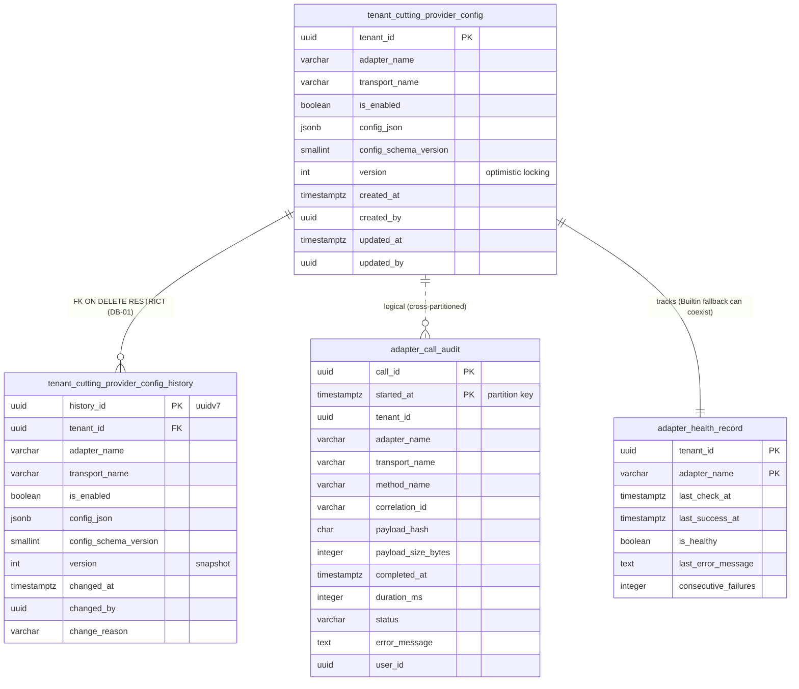

# SpaceOS — Modules.Cutting Phase 6: Adapters
## OptiCut · CutRite · Manual — External Cutting System Integration

> **Verzió:** v4.0 — 2026-04-28
> **Státusz:** ✅ **IMPLEMENTÁCIÓRA KÉSZ** — 4-pass review pipeline complete
> **Blokkoló feltétel:** Cutting Phase 1-5 DEPLOYED ✅ · Contracts v1.4.0 ✅
> **Kumulált review:** v1 → `/database-designer` + `/database-schema-designer` → v2 → `/senior-security` → v3 → `/senior-backend` → **v4**
> **Repo:** `spaceos-modules-cutting` (Adapters namespace, ugyanaz a port `:5005`)
> **Schema:** `spaceos_cutting` (nem új schema)
> **Becsült bázis-effort:** ~13.5-16.5 fejlesztői nap (v3: 11.5-14.5 + v4 backend delta: +2)
> **Fogyasztók:** Joinery · Cabinet · Window · jövőbeli trade-modulok
> **Companion file:** `SpaceOS_Modules_Cutting_Phase6_Adapters_Architecture_v4_README.md` (Claude Code agent context)

---

## 1. Kumulált Finding Összesítő (v1 → v4)

| Review | Finding-ek | Legfontosabb javítás | Effort delta |
|--------|------------|----------------------|--------------|
| v1 → `/database-designer` + `/database-schema-designer` → v2 | 0 CRITICAL · 5 HIGH · 7 MEDIUM · 2 LOW | History FK + append-only `adapter_call_audit` + retention/partition policy + admin concurrent update gate | +1.5 nap |
| v2 → `/senior-security` → v3 | 3 CRITICAL · 7 HIGH · 6 MEDIUM · 2 LOW | Cross-tenant path injection · XXE hardening · SSRF allowlist · capability runtime double-check · subprocess argv-only · secret detection · pg_cron least-priv · CRLF sanitization · Redis pub/sub cache invalidation · bulk poll worker | +5 nap |
| v3 → `/senior-backend` → v4 | **0 CRITICAL · 4 HIGH · 8 MEDIUM · 3 LOW** | Aggregate sealing · Builtin lift = breaking-change protocol · IServiceProvider out of handlers · BackgroundService scoped DbContext · Polly v8 ResiliencePipeline · MediatR pipeline order · TimeProvider DI · OpenAPI snapshot test · ProblemDetails RFC 7807 · Idempotency-Key | **+2 nap** |
| **Összesen (v1 → v4)** | **3 CRITICAL · 16 HIGH · 21 MEDIUM · 7 LOW = 47 finding** | | **+8.5 nap** |

### v2 — DB review finding részletek

| ID | Súly | Terület | Probléma | v2 javítás |
|----|------|---------|----------|------------|
| DB-01 | 🟠 HIGH | Referential integrity | `tenant_cutting_provider_config_history.tenant_id` nincs FK-zott a config-ra → orphan history elvileg lehetséges | FK a `tenant_cutting_provider_config(tenant_id)`-re, `ON DELETE RESTRICT` (config nem törölhető history nélkül) |
| DB-02 | 🟠 HIGH | Tamper resistance | Append-only trigger csak UPDATE/DELETE-et blokkolja — `INSERT changed_at = '2020-01-01'` backdating lehetséges | `CHECK (changed_at <= NOW() + INTERVAL '5 minutes')` constraint + `BEFORE INSERT` trigger ami `changed_at = NOW()`-ra állítja (override védelem) |
| DB-04 | 🟠 HIGH | Unbounded growth | `adapter_call_audit` retention/partition policy hiányzik — multi-tenant production-ben 100M+ row várható 5 éven belül | (1) Time-based partition `RANGE (started_at)`, havi partícióval; (2) `retention_until` virtual column + `pg_cron` job havi cleanup 90 nap után (audit), 365 nap (failed) |
| DB-08 | 🟠 HIGH | Concurrent admin update | Két admin szimultán PUT `/v1/admin/adapters/config` → silent overwrite, last-write-wins → audit log inkonzisztens | (1) `version INT` oszlop a `tenant_cutting_provider_config`-on (optimistic locking); (2) `pg_advisory_xact_lock(hashtext('adapter-config:' \|\| tenant_id::text))` a handler tranzakcióban |
| DB-12 | 🟠 HIGH | Audit integrity | `adapter_call_audit` nem append-only — buggy code vagy malicious user UPDATE/DELETE-elheti az audit row-kat → compliance gap | `BEFORE UPDATE OR DELETE` trigger `prevent_audit_mutation()` — kivéve a `RecordSubmitCompletedAsync` hívás (started → completed status update); ezt egy explicit allowlisted UPDATE pattern oldja meg `WHERE status = 'started'` predicate-tel |
| DB-03 | 🟡 MEDIUM | DoS vector | `error_message TEXT` nincs size limit → buggy adapter 1MB stack trace-t pumpálhat row-nként → audit table size explosion | `CHECK (LENGTH(error_message) <= 16000)` constraint + alkalmazás-szintű truncation 8KB-on |
| DB-05 | 🟡 MEDIUM | Schema clarity | `adapter_health_record (tenant_id, adapter_name)` composite PK indoklás hiányzik a v1-ben | Doku §4.4 frissítése: a Resolver Builtin fallback miatt egy tenanthez egyszerre két adapter health record-ja létezhet (configured + builtin fallback) |
| DB-09 | 🟡 MEDIUM | Capacity planning | Sizing analysis hiányzik a v1-ből — DBA nem tudja prevention-ben tervezni a tárhelyet | Új §7.5 szakasz: row-size becslés + projection táblánként (10-tenant, 100-tenant, 1000-tenant scenarios) |
| DB-10 | 🟡 MEDIUM | JSONB validation | `config_json` struktúra adapter+transport-függő, csak app-szintű FluentValidation védi → DBA-szinten "free-form" | `CHECK (jsonb_typeof(config_json) = 'object' AND config_json ? 'version')` minimum sanity + `config_schema_version SMALLINT NOT NULL` oszlop verzionált schema migration-höz |
| DB-11 | 🟡 MEDIUM | Tenant lifecycle | Tenant SpaceOS-ból kilépéskor a config sorsa nem definiált — hard delete? `is_enabled = false`? | `is_enabled = false` a logikai disable; tenant-deletion (Kernel-szintű) cascade-eli a config törlését — `ON DELETE CASCADE` virtual (a Kernel scheduled cleanup job-on át, mert a tenants tábla más DB-ben van) |
| DB-13 | 🟡 MEDIUM | Optimistic locking | Lásd DB-08 — `version` oszlop hiányzik | Beépítve DB-08 fix-ben: `version INT NOT NULL DEFAULT 0`, minden update inkrementál, EF Core `IsConcurrencyToken()` |
| DB-14 | 🟡 MEDIUM | Data consistency | `adapter_call_audit.completed_at` nullable, de a `status` és `completed_at` reláció nincs CHECK-elve — adat-inkonzisztencia lehet | `CHECK ((status = 'started' AND completed_at IS NULL) OR (status IN ('completed', 'failed', 'exception') AND completed_at IS NOT NULL))` |
| DB-06 | 🟢 LOW | Observability enhancement | `last_success_at` hiányzik — ha az adapter most failel, mikor volt utoljára healthy? recovery analytics nehezebb | `last_success_at TIMESTAMPTZ` oszlop hozzáadva |
| DB-07 | 🟢 LOW | Index locality | `gen_random_uuid()` v4 UUID a history-ban — random insert order, B-tree index locality gyengébb | `uuidv7()` (PostgreSQL 17+) vagy `uuid_generate_v7()` (uuid-ossp ext.) — time-ordered insert pattern |

### v3 — Security review finding részletek

| ID | Súly | Terület | Probléma | v3 javítás |
|----|------|---------|----------|------------|
| SEC-01 | 🔴 CRITICAL | Filesystem isolation | `WriteToInboxAsync(correlationId, ...)` — a `correlationId` user-controlled string. Path traversal: `correlationId = "../other-tenant/inbox/payload.xml"` cross-tenant write VAGY symlink attack a tenant root alatt | (1) `correlationId` strict regex `^[A-Za-z0-9-]{1,100}$`; (2) `Path.GetFullPath(combinedPath).StartsWith(canonicalTenantRoot)` runtime check minden I/O-nál; (3) `O_NOFOLLOW` flag (System.IO `FileOptions.None` + symlink reject); (4) `DirectoryInfo.LinkTarget` check minden subdirben |
| SEC-02 | 🔴 CRITICAL | XML parsing | `OptiCutFormatConverter.ParseVendorOutput` XML-t parse-ol. Default .NET `XmlDocument` engedi az XXE-t → SSRF, file disclosure (`/etc/passwd`), DoS (billion laughs). A vendor system **rosszhiszemű is lehet** (compromised) | `XmlReaderSettings { DtdProcessing = Prohibit, XmlResolver = null, MaxCharactersFromEntities = 0, MaxCharactersInDocument = 10*1024*1024 }` + golden file negative test (XXE payload → parse rejection exception) |
| SEC-03 | 🔴 CRITICAL | SSRF | `RestApiOptions.BaseUrl` tenant-config JSON. Admin beállíthatja `http://169.254.169.254/...` (cloud metadata) vagy `http://localhost:6379/` (Redis) → SSRF a SpaceOS host-ban | (1) URL allowlist regex per tenant-config (`^https://[a-z0-9.-]+\.tenant\.local/`); (2) DNS resolve runtime → IP private range deny (`10/8`, `172.16/12`, `192.168/16`, `169.254/16`, `127/8`, IPv6 link-local, IPv4-mapped IPv6); (3) DNS rebinding védelem: socket-level IP re-check connect előtt; (4) HTTPS-only (no plain HTTP) |
| SEC-04 | 🟠 HIGH | Capability spoof | (Carry-over SEC-H) Adapter hazudja a `Capabilities` flag-et — Resolver trust-eli; ha Builtin fallback nincs, hazudott capability hívása `NotSupportedException`-t dob futtatáskor | Resolver `ResolveForCapabilityAsync` **runtime double-check**: hívás előtt `provider.Capabilities.HasFlag(required)` re-validate, ha hamis → fallback Builtin-re. Negative integration test: `MockSpoofingAdapter` mindenre `true`-t ad → consumer-side check rejects + audit log "capability_spoof_attempted" event |
| SEC-05 | 🟠 HIGH | Subprocess argv injection | `CliWrapperTransport.BuildArguments(_options, inboxPath, outboxPath)` — ha a path speciális karaktert tartalmaz (`;`, `\|`, `&`, `$()`) és valamilyen Wine config shell-en megy át, command injection lehetséges | (1) **Argv-only spawn** (no shell): `Process.StartInfo.UseShellExecute = false`, `ArgumentList.Add(...)` (NOT `Arguments`); (2) Path strict regex check (alphanumeric + `/-_.`); (3) Negative integration test: malicious filename `"; rm -rf /"` → handled as literal arg; (4) Wine wrapper script explicit no-shell mode |
| SEC-06 | 🟠 HIGH | Secret exposure | `tenant_cutting_provider_config_history.config_json` append-only — ha admin **véletlenül** plaintext secret-et tesz bele (`apiKey: "real-key"`), örökre tárolva, GDPR-issue, potenciális credential leak history search-on | (1) PUT config handler `IConfigSecretDetector` → JSON tree walk, key regex (`/api[_-]?key/i`, `/password/i`, `/secret/i`, `/token/i`, `/credential/i`) + value entropy check (Shannon entropy > 4.5 bits/byte → reject); (2) Required pattern: `${secret:secret-name}` reference (resolver runtime-ban resolve secret manager-ből); (3) Negative test: `{"apiKey": "abc123"}` → 400 with "use ${secret:...} reference" |
| SEC-07 | 🟠 HIGH | pg_cron privilege | A retention `DROP TABLE` job futtatható role compromise-szal kiterjeszthető más SpaceOS táblákra (Cutting Phase 1-5, Inventory, etc.) | (1) Dedikált role `spaceos_cutting_retention` (NOLOGIN, only via `GRANT EXECUTE`); (2) Privilege scope: `GRANT DROP ON TABLE spaceos_cutting.adapter_call_audit_*` regex-pattern (PostgreSQL 16+ event trigger); (3) `pg_cron.SetUidRole = 'spaceos_cutting_retention'` pinned config; (4) Job audit log külön táblába `spaceos_cutting.retention_job_log` minden DROP-pal |
| SEC-08 | 🟠 HIGH | Log injection | `error_message TEXT` user-controlled (külső adapter hibaüzenete). CRLF injection log aggregátorban fake log entry-t hoz létre, ANSI escape sequence terminál exploit | Insert előtt sanitize: control char strip (regex `[\x00-\x1F\x7F]` → space), max 16000 char (DB-03 már védi), JSON-encoded log shipping (Serilog `JsonFormatter`) — control char-ok nem törnek ki a JSON string-ből; integration test: payload `\r\n[FAKE]` → stored as `  [FAKE]` |
| SEC-09 | 🟠 HIGH | Cache poisoning | Resolver `IMemoryCache` 5-min TTL — multi-instance deploy esetén PUT config után más instance-ek max 5 percig stale config-ot szolgáltatnak; tampered admin valid flow-n változtat de a tenant még nem érzi | (1) Distributed cache invalidation Redis pub/sub-on (`adapter-config-changed:{tenantId}` channel), Phase 5 Redis Sentinel reuse; (2) TTL 30 sec (rövidített biztonsági puffer); (3) Convergence acceptance: state propagation < 30 sec across cluster |
| SEC-10 | 🟠 HIGH | DoS — thread starvation | `FileExchangeTransport.MaxPollDurationMinutes: 30` — slow OptiCut 30 percig blokkol egy thread-et. Bulk submit 1000 sheet × 30 perc → thread pool exhaustion, az egész Cutting service down | (1) Bulk poll worker pattern: `IPollSchedulerBackgroundService` poll-oz minden pending correlation_id-t **batch** módon, max 10 concurrent poll per tenant; (2) Hívó context async-en kap result `IInProcessChannel<T>` (System.Threading.Channels) over message-en; (3) Per-tenant rate limit: max 100 pending poll  any time |
| SEC-11 | 🟡 MEDIUM | Insufficient JWT scope granularity | Admin endpoint csak `Admin` scope-pal védve — túl tág, bárki adminként konfigurálhat external rendszer integration-t | Új scope: `cutting:adapter:configure` (Keycloak realm role mapping); RBAC: csak `BillingOwner` vagy `SecurityAdmin` Keycloak role; PUT/POST adapter endpoint-ok ezt kérik |
| SEC-12 | 🟡 MEDIUM | Information disclosure (fingerprinting) | Polly circuit breaker open state visible az API response time-ban (azonnali fail vs. retry) — attacker fingerprint-elheti az adapter állapotát; health check endpoint nyilvános, részletes diagnostics | Generic `503 Service Unavailable` non-admin caller-nek (no internal state); részletes diagnostics csak `cutting:adapter:diagnose` scope-pal; health check endpoint admin-only, anonymous caller `404` (nem létezik) |
| SEC-13 | 🟡 MEDIUM | TOCTOU file watcher | `FileExchangeTransport` `outbox/` polling — partial file read race: vendor írja a file-t, SpaceOS olvas közben → corrupt parse | Write-and-rename pattern: vendor convention írja `.tmp` extension-t, majd rename `.complete`; SpaceOS **csak `.complete`** extension-öket olvas; FileSystemWatcher ehhez konfigurálva; per-vendor doku appendix |
| SEC-14 | 🟡 MEDIUM | Audit retention period | DB-04: completed/failed 90 nap, exception 365 nap — security incident forensic-ra industry standard 1-3 év | Differentiated retention: `completed` 90 nap, `failed/exception` 730 nap (2 év), config history forever (append-only); WORM offload S3 Object Lock-ra (Escrow GA gate-jén belül) |
| SEC-15 | 🟡 MEDIUM | NuGet supply chain | 3 új NuGet (`SpaceOS.Cutting.Adapter.OptiCut/CutRite/Manual`) + transitive deps (XML parser libraries) — compromised feed lehetőség | (1) `packages.lock.json` minden adapter csomagra (deterministic restore); (2) `Microsoft.Build.NuGetSdkResolver` signed package verification CI-ben; (3) SBOM generálás (`dotnet-sbom-tool`) a release pipeline-ban; (4) Dependabot security alerts engedélyezve a repo-n |
| SEC-16 | 🟡 MEDIUM | CSRF risk on admin API | PUT `/v1/admin/adapters/config` — ha valaki cookie auth-ra állítja a frontend-et, CSRF | Explicit doku gate: **Bearer-only** (Authorization header), no cookie auth admin endpoint-okon; SameSite=Strict bárhol cookie van; integration test: cookie auth attempt → 401 |
| SEC-17 | 🟢 LOW | Health probe overshare | `lastHealthCheck` response: `consecutiveFailures`, `lastErrorMessage` — internal state disclosure | Default response: `{ isHealthy: bool }`; `?detailed=true` query param + `cutting:adapter:diagnose` scope a részletes info-hoz |
| SEC-18 | 🟢 LOW | Subprocess output overflow | `BoundedSubprocessRunner` capture stdout/stderr — gigabyte-os output → memory exhaustion | stdout/stderr stream truncate 1MB-on + log warning + audit "subprocess_output_truncated" event |

### v4 — Backend review finding részletek

| ID | Súly | Terület | Probléma | v4 javítás |
|----|------|---------|----------|------------|
| BE-01 | 🟠 HIGH | DDD aggregate sealing | `TenantCuttingProviderConfig` aggregate dokumentálva (§10.2 DoD) de a kódváz a v3-ban hiányzik — public `ICuttingProvider` impl-ek nem aggregate-ek, hanem service-ek; viszont a `tenant_cutting_provider_config` tábla mögött **kell egy aggregate** Domain-ben (Golden Rule #1, #2) | Új §3.4 + új `Domain/Adapters/` namespace: `TenantCuttingProviderConfig` aggregate (sealed, no public setters, `Reconfigure(...)` factory + `Disable()` + `RecordHealthCheck(...)`), `AdapterCallAudit` immutable record (event-source style), `AdapterHealthRecord` aggregate (`RecordHealthy()` + `RecordFailure()`), 4 új domain event |
| BE-02 | 🟠 HIGH | Builtin lift breaking change | "Builtin lift Phase 1-5 `CuttingProviderService` → `BuiltinCuttingProvider` rename" (§5.1 DoD) — ez **breaking change** a Phase 1-5 fogyasztóknak (Joinery, Cabinet) ha a service neve változik | (1) `BuiltinCuttingProvider` **új class**, a `CuttingProviderService` megmarad és **delegál** rá → backward compat; (2) DI: a `CuttingProviderService` `[Obsolete]` jelölés `Cutting Phase 7`-re; (3) Migration runbook: Joinery/Cabinet handler-ek hivatkozása kicserélése egy follow-up sprintben |
| BE-03 | 🟠 HIGH | IServiceProvider in handlers | `CuttingProviderResolver` injekt `IServiceProvider`-t és `GetRequiredKeyedService`-t hív runtime-ban — anti-pattern (Service Locator), nehéz tesztelni, scope leak veszély | Új `IAdapterFactory` absztrakció: a factory-t injekteljük, ő `IEnumerable<KeyedService<string, ICuttingProvider>>` over composition root-ban beregisztrált adapter-ek között dispatch-el; teszt-támogatás: factory-t override-olni mock dictionary-vel |
| BE-04 | 🟠 HIGH | BackgroundService scoped DI | `PollSchedulerBackgroundService` (SEC-10) singleton lifetime — de DbContext, IConfigRepo, IAuditWriter mind scoped. Direct injection halott DbContext-tel végződhet (ASP.NET Core ismert pitfall) | Pattern: `IServiceScopeFactory` injekció a singleton-ba, minden iterációban `using var scope = _scopeFactory.CreateAsyncScope(); var ctx = scope.ServiceProvider.GetRequiredService<CuttingDbContext>();`. `AdapterConfigInvalidationListener` (SEC-09) ugyanígy. Doku §4.4 + §6.8 frissítve a pattern-nel. |
| BE-05 | 🟡 MEDIUM | Specification-only repo | Golden Rule #5: minden list query Ardalis.Specification-ön át. A v3 csak az audit query-t spec-eli (`AdapterCallAuditByDateRangeSpec`). A `GetByTenantAsync(tenantId)` és `TryReadFromOutboxAsync` raw repo call-ok | (1) `TenantCuttingProviderConfigByTenantSpec` és `AdapterHealthRecordByTenantAdapterSpec` specifikációk hozzáadva; (2) Repo interface csak `IRepositoryBase<T>` + spec — semmi custom method. Doku §9 frissítve a 3 spec-cel. |
| BE-06 | 🟡 MEDIUM | Polly v8 ResiliencePipeline | A v3 `Polly` v7 API-t használ (`IAsyncPolicy<HttpResponseMessage>`, `Policy.HandleAsync` chain). 2025-ben a kanonikus API a `Polly v8 ResiliencePipeline` (`AddResilienceHandler`) | (1) Migráció `Polly v8`-ra: `services.AddHttpClient<RestApiTransport>().AddResilienceHandler("opticut", builder => builder.AddRetry(...).AddCircuitBreaker(...).AddTimeout(...))`; (2) Telemetry built-in (Polly metrics → OpenTelemetry); (3) Policy egységes konfigurációja `IOptions<PollyResilienceOptions>`-ban (per-adapter override) |
| BE-07 | 🟡 MEDIUM | Channel hot vs cold | A v3 `IInProcessChannel<T>` használata (SEC-10) — nincs explicit megjegyezve hogy bounded vagy unbounded, és single-reader vs multi-reader. Helytelen választás → backpressure problem | Explicit `Channel.CreateBounded<T>(new BoundedChannelOptions(capacity: 100) { FullMode = BoundedChannelFullMode.Wait, SingleReader = false, SingleWriter = true })`. Per-tenant 100-as buffer matches the SEC-10 pending poll limit. Doku §6.8 frissítve. |
| BE-08 | 🟡 MEDIUM | MediatR pipeline order | A v3 nem definiálja a pipeline behavior order-t a Phase 6 endpoint-ok hívási láncában. ValidationBehavior, AuthorizationBehavior, LoggingBehavior, AuditBehavior, TransactionBehavior konfliktus-érzékeny | Explicit pipeline order doku §9.5-ben: (1) RequestLoggingBehavior (legkülső) → (2) ValidationBehavior (FluentValidation, fail-fast 400) → (3) AuthorizationBehavior (scope check, 403) → (4) AdvisoryLockBehavior (DB-08, csak PUT config) → (5) TransactionBehavior (TransactionScope) → (6) AuditBehavior (legszorosabb, started → completed) → handler. |
| BE-09 | 🟡 MEDIUM | DateTimeOffset vs TimeProvider | A v3 helyenként `DateTimeOffset.UtcNow` direkt hív (FileExchangeTransport, BoundedSubprocessRunner). Ez tesztelést megnehezíti, és a Kernel `TimeProvider` pattern-jét sérti | Minden `DateTimeOffset.UtcNow` → `TimeProvider.System.GetUtcNow()` (DI-ban `TimeProvider` regisztrálva, fake-elhető tesztben `FakeTimeProvider`-rel) |
| BE-10 | 🟡 MEDIUM | OpenAPI snapshot test | A v3 §10.5 említi az "OpenAPI snapshot test"-et — de nem definiálja **hogy** verify-olja az endpoint contract stability-t (regression a Phase 7-ben breaking change-eket okozhat) | NSwag OpenAPI generálás → JSON snapshot → `Verify` (Verify.Xunit) golden file teszt: `verified/admin-adapters-openapi.v1.json`. Bármi changes a contract-ban → test fail → conscious bump-jelölés a `info.version`-be. |
| BE-11 | 🟡 MEDIUM | CancellationToken propagation | A v3 kódminták többségben jó, de néhány helyen (RestApiTransport DNS resolve, BoundedSubprocessRunner stdout read) nincs CT propagáció — request abort-ok nem szakítják meg | Minden async leaf-method propagálja a CT-t; `Dns.GetHostAddressesAsync(host, ct)` (.NET 8+ overload); `Stream.ReadAsync(buffer, ct)`; ProcessExtensions: `WaitForExitAsync(ct)`. CI lint: `Roslynator.Analyzers` `RCS1175` — Unused parameter / missing CT. |
| BE-12 | 🟡 MEDIUM | Result.Invalid factory | Application kódminták keverve `Result.Error("...")` és `Result.Invalid(...)` — ez Ardalis.Result konvenció szerint félrevezető (Error = system fault, Invalid = validation, NotFound = missing) | Egységes mapping: FluentValidation fail → `Result.Invalid(IEnumerable<ValidationError>)` (HTTP 400); auth fail → `Result.Forbidden()` (403); resource missing → `Result.NotFound()` (404); upstream/system fail → `Result.Error(...)` (500); circuit breaker open → `Result.Unavailable("circuit_open")` (503). Doku §9.6 + endpoint mapping táblázat. |
| BE-13 | 🟢 LOW | Idempotency-Key support | PUT `/v1/admin/adapters/config` retry-friendly, de network retry duplikálhatja a config history-t (DB-12 trigger nem véd ez ellen) | Optional `Idempotency-Key` HTTP header; ha jelen van, a handler 24h-ig cache-eli a key → response mapping-et Redis-ben; duplicate request → cached response replay. RFC: draft-ietf-httpapi-idempotency-key |
| BE-14 | 🟢 LOW | ProblemDetails RFC 7807 | Hibatípusok JSON formátuma a v3-ban nem egységes (`{ "errors": [...] }` vs `{ "error": "..." }`). Iparági szabvány: RFC 7807 Problem Details for HTTP APIs | ASP.NET Core `Microsoft.AspNetCore.Http.Results.Problem(...)` minden hibára; `ProblemDetailsFactory` registrálva; `Result<T>` → `IResult` mapping extension method-ban |
| BE-15 | 🟢 LOW | OpenTelemetry semantic naming | `IAdapterCallAuditWriter` saját audit-ot ír DB-be — de OpenTelemetry trace-spans-be nem jelenik meg a `cutting.adapter.method`, `cutting.adapter.name` tag-ekkel | Minden adapter call wrap-elve `Activity` (System.Diagnostics) — span név: `cutting.adapter.{methodName}`, tags: `cutting.adapter.name`, `cutting.adapter.transport`, `cutting.adapter.tenant_id`, `cutting.adapter.correlation_id` (no PII). Phase 5 OpenTelemetry pipeline reuse. |

### v2 — DB review finding részletek

| ID | Súly | Terület | Probléma | v2 javítás |
|----|------|---------|----------|------------|
| DB-01 | 🟠 HIGH | Referential integrity | `tenant_cutting_provider_config_history.tenant_id` nincs FK-zott a config-ra → orphan history elvileg lehetséges | FK a `tenant_cutting_provider_config(tenant_id)`-re, `ON DELETE RESTRICT` (config nem törölhető history nélkül) |
| DB-02 | 🟠 HIGH | Tamper resistance | Append-only trigger csak UPDATE/DELETE-et blokkolja — `INSERT changed_at = '2020-01-01'` backdating lehetséges | `CHECK (changed_at <= NOW() + INTERVAL '5 minutes')` constraint + `BEFORE INSERT` trigger ami `changed_at = NOW()`-ra állítja (override védelem) |
| DB-04 | 🟠 HIGH | Unbounded growth | `adapter_call_audit` retention/partition policy hiányzik — multi-tenant production-ben 100M+ row várható 5 éven belül | (1) Time-based partition `RANGE (started_at)`, havi partícióval; (2) `retention_until` virtual column + `pg_cron` job havi cleanup 90 nap után (audit), 365 nap (failed) |
| DB-08 | 🟠 HIGH | Concurrent admin update | Két admin szimultán PUT `/v1/admin/adapters/config` → silent overwrite, last-write-wins → audit log inkonzisztens | (1) `version INT` oszlop a `tenant_cutting_provider_config`-on (optimistic locking); (2) `pg_advisory_xact_lock(hashtext('adapter-config:' \|\| tenant_id::text))` a handler tranzakcióban |
| DB-12 | 🟠 HIGH | Audit integrity | `adapter_call_audit` nem append-only — buggy code vagy malicious user UPDATE/DELETE-elheti az audit row-kat → compliance gap | `BEFORE UPDATE OR DELETE` trigger `prevent_audit_mutation()` — kivéve a `RecordSubmitCompletedAsync` hívás (started → completed status update); ezt egy explicit allowlisted UPDATE pattern oldja meg `WHERE status = 'started'` predicate-tel |
| DB-03 | 🟡 MEDIUM | DoS vector | `error_message TEXT` nincs size limit → buggy adapter 1MB stack trace-t pumpálhat row-nként → audit table size explosion | `CHECK (LENGTH(error_message) <= 16000)` constraint + alkalmazás-szintű truncation 8KB-on |
| DB-05 | 🟡 MEDIUM | Schema clarity | `adapter_health_record (tenant_id, adapter_name)` composite PK indoklás hiányzik a v1-ben | Doku §4.4 frissítése: a Resolver Builtin fallback miatt egy tenanthez egyszerre két adapter health record-ja létezhet (configured + builtin fallback) |
| DB-09 | 🟡 MEDIUM | Capacity planning | Sizing analysis hiányzik a v1-ből — DBA nem tudja prevention-ben tervezni a tárhelyet | Új §7.5 szakasz: row-size becslés + projection táblánként (10-tenant, 100-tenant, 1000-tenant scenarios) |
| DB-10 | 🟡 MEDIUM | JSONB validation | `config_json` struktúra adapter+transport-függő, csak app-szintű FluentValidation védi → DBA-szinten "free-form" | `CHECK (jsonb_typeof(config_json) = 'object' AND config_json ? 'version')` minimum sanity + `config_schema_version SMALLINT NOT NULL` oszlop verzionált schema migration-höz |
| DB-11 | 🟡 MEDIUM | Tenant lifecycle | Tenant SpaceOS-ból kilépéskor a config sorsa nem definiált — hard delete? `is_enabled = false`? | `is_enabled = false` a logikai disable; tenant-deletion (Kernel-szintű) cascade-eli a config törlését — `ON DELETE CASCADE` virtual (a Kernel scheduled cleanup job-on át, mert a tenants tábla más DB-ben van) |
| DB-13 | 🟡 MEDIUM | Optimistic locking | Lásd DB-08 — `version` oszlop hiányzik | Beépítve DB-08 fix-ben: `version INT NOT NULL DEFAULT 0`, minden update inkrementál, EF Core `IsConcurrencyToken()` |
| DB-14 | 🟡 MEDIUM | Data consistency | `adapter_call_audit.completed_at` nullable, de a `status` és `completed_at` reláció nincs CHECK-elve — adat-inkonzisztencia lehet | `CHECK ((status = 'started' AND completed_at IS NULL) OR (status IN ('completed', 'failed', 'exception') AND completed_at IS NOT NULL))` |
| DB-06 | 🟢 LOW | Observability enhancement | `last_success_at` hiányzik — ha az adapter most failel, mikor volt utoljára healthy? recovery analytics nehezebb | `last_success_at TIMESTAMPTZ` oszlop hozzáadva |
| DB-07 | 🟢 LOW | Index locality | `gen_random_uuid()` v4 UUID a history-ban — random insert order, B-tree index locality gyengébb | `uuidv7()` (PostgreSQL 17+) vagy `uuid_generate_v7()` (uuid-ossp ext.) — time-ordered insert pattern |

### v3 — Security review finding részletek

| ID | Súly | Terület | Probléma | v3 javítás |
|----|------|---------|----------|------------|
| SEC-01 | 🔴 CRITICAL | Filesystem isolation | `WriteToInboxAsync(correlationId, ...)` — a `correlationId` user-controlled string. Path traversal: `correlationId = "../other-tenant/inbox/payload.xml"` cross-tenant write VAGY symlink attack a tenant root alatt | (1) `correlationId` strict regex `^[A-Za-z0-9-]{1,100}$`; (2) `Path.GetFullPath(combinedPath).StartsWith(canonicalTenantRoot)` runtime check minden I/O-nál; (3) `O_NOFOLLOW` flag (System.IO `FileOptions.None` + symlink reject); (4) `DirectoryInfo.LinkTarget` check minden subdirben |
| SEC-02 | 🔴 CRITICAL | XML parsing | `OptiCutFormatConverter.ParseVendorOutput` XML-t parse-ol. Default .NET `XmlDocument` engedi az XXE-t → SSRF, file disclosure (`/etc/passwd`), DoS (billion laughs). A vendor system **rosszhiszemű is lehet** (compromised) | `XmlReaderSettings { DtdProcessing = Prohibit, XmlResolver = null, MaxCharactersFromEntities = 0, MaxCharactersInDocument = 10*1024*1024 }` + golden file negative test (XXE payload → parse rejection exception) |
| SEC-03 | 🔴 CRITICAL | SSRF | `RestApiOptions.BaseUrl` tenant-config JSON. Admin beállíthatja `http://169.254.169.254/...` (cloud metadata) vagy `http://localhost:6379/` (Redis) → SSRF a SpaceOS host-ban | (1) URL allowlist regex per tenant-config (`^https://[a-z0-9.-]+\.tenant\.local/`); (2) DNS resolve runtime → IP private range deny (`10/8`, `172.16/12`, `192.168/16`, `169.254/16`, `127/8`, IPv6 link-local, IPv4-mapped IPv6); (3) DNS rebinding védelem: socket-level IP re-check connect előtt; (4) HTTPS-only (no plain HTTP) |
| SEC-04 | 🟠 HIGH | Capability spoof | (Carry-over SEC-H) Adapter hazudja a `Capabilities` flag-et — Resolver trust-eli; ha Builtin fallback nincs, hazudott capability hívása `NotSupportedException`-t dob futtatáskor | Resolver `ResolveForCapabilityAsync` **runtime double-check**: hívás előtt `provider.Capabilities.HasFlag(required)` re-validate, ha hamis → fallback Builtin-re. Negative integration test: `MockSpoofingAdapter` mindenre `true`-t ad → consumer-side check rejects + audit log "capability_spoof_attempted" event |
| SEC-05 | 🟠 HIGH | Subprocess argv injection | `CliWrapperTransport.BuildArguments(_options, inboxPath, outboxPath)` — ha a path speciális karaktert tartalmaz (`;`, `\|`, `&`, `$()`) és valamilyen Wine config shell-en megy át, command injection lehetséges | (1) **Argv-only spawn** (no shell): `Process.StartInfo.UseShellExecute = false`, `ArgumentList.Add(...)` (NOT `Arguments`); (2) Path strict regex check (alphanumeric + `/-_.`); (3) Negative integration test: malicious filename `"; rm -rf /"` → handled as literal arg; (4) Wine wrapper script explicit no-shell mode |
| SEC-06 | 🟠 HIGH | Secret exposure | `tenant_cutting_provider_config_history.config_json` append-only — ha admin **véletlenül** plaintext secret-et tesz bele (`apiKey: "real-key"`), örökre tárolva, GDPR-issue, potenciális credential leak history search-on | (1) PUT config handler `IConfigSecretDetector` → JSON tree walk, key regex (`/api[_-]?key/i`, `/password/i`, `/secret/i`, `/token/i`, `/credential/i`) + value entropy check (Shannon entropy > 4.5 bits/byte → reject); (2) Required pattern: `${secret:secret-name}` reference (resolver runtime-ban resolve secret manager-ből); (3) Negative test: `{"apiKey": "abc123"}` → 400 with "use ${secret:...} reference" |
| SEC-07 | 🟠 HIGH | pg_cron privilege | A retention `DROP TABLE` job futtatható role compromise-szal kiterjeszthető más SpaceOS táblákra (Cutting Phase 1-5, Inventory, etc.) | (1) Dedikált role `spaceos_cutting_retention` (NOLOGIN, only via `GRANT EXECUTE`); (2) Privilege scope: `GRANT DROP ON TABLE spaceos_cutting.adapter_call_audit_*` regex-pattern (PostgreSQL 16+ event trigger); (3) `pg_cron.SetUidRole = 'spaceos_cutting_retention'` pinned config; (4) Job audit log külön táblába `spaceos_cutting.retention_job_log` minden DROP-pal |
| SEC-08 | 🟠 HIGH | Log injection | `error_message TEXT` user-controlled (külső adapter hibaüzenete). CRLF injection log aggregátorban fake log entry-t hoz létre, ANSI escape sequence terminál exploit | Insert előtt sanitize: control char strip (regex `[\x00-\x1F\x7F]` → space), max 16000 char (DB-03 már védi), JSON-encoded log shipping (Serilog `JsonFormatter`) — control char-ok nem törnek ki a JSON string-ből; integration test: payload `\r\n[FAKE]` → stored as `  [FAKE]` |
| SEC-09 | 🟠 HIGH | Cache poisoning | Resolver `IMemoryCache` 5-min TTL — multi-instance deploy esetén PUT config után más instance-ek max 5 percig stale config-ot szolgáltatnak; tampered admin valid flow-n változtat de a tenant még nem érzi | (1) Distributed cache invalidation Redis pub/sub-on (`adapter-config-changed:{tenantId}` channel), Phase 5 Redis Sentinel reuse; (2) TTL 30 sec (rövidített biztonsági puffer); (3) Convergence acceptance: state propagation < 30 sec across cluster |
| SEC-10 | 🟠 HIGH | DoS — thread starvation | `FileExchangeTransport.MaxPollDurationMinutes: 30` — slow OptiCut 30 percig blokkol egy thread-et. Bulk submit 1000 sheet × 30 perc → thread pool exhaustion, az egész Cutting service down | (1) Bulk poll worker pattern: `IPollSchedulerBackgroundService` poll-oz minden pending correlation_id-t **batch** módon, max 10 concurrent poll per tenant; (2) Hívó context async-en kap result `IInProcessChannel<T>` (System.Threading.Channels) over message-en; (3) Per-tenant rate limit: max 100 pending poll  any time |
| SEC-11 | 🟡 MEDIUM | Insufficient JWT scope granularity | Admin endpoint csak `Admin` scope-pal védve — túl tág, bárki adminként konfigurálhat external rendszer integration-t | Új scope: `cutting:adapter:configure` (Keycloak realm role mapping); RBAC: csak `BillingOwner` vagy `SecurityAdmin` Keycloak role; PUT/POST adapter endpoint-ok ezt kérik |
| SEC-12 | 🟡 MEDIUM | Information disclosure (fingerprinting) | Polly circuit breaker open state visible az API response time-ban (azonnali fail vs. retry) — attacker fingerprint-elheti az adapter állapotát; health check endpoint nyilvános, részletes diagnostics | Generic `503 Service Unavailable` non-admin caller-nek (no internal state); részletes diagnostics csak `cutting:adapter:diagnose` scope-pal; health check endpoint admin-only, anonymous caller `404` (nem létezik) |
| SEC-13 | 🟡 MEDIUM | TOCTOU file watcher | `FileExchangeTransport` `outbox/` polling — partial file read race: vendor írja a file-t, SpaceOS olvas közben → corrupt parse | Write-and-rename pattern: vendor convention írja `.tmp` extension-t, majd rename `.complete`; SpaceOS **csak `.complete`** extension-öket olvas; FileSystemWatcher ehhez konfigurálva; per-vendor doku appendix |
| SEC-14 | 🟡 MEDIUM | Audit retention period | DB-04: completed/failed 90 nap, exception 365 nap — security incident forensic-ra industry standard 1-3 év | Differentiated retention: `completed` 90 nap, `failed/exception` 730 nap (2 év), config history forever (append-only); WORM offload S3 Object Lock-ra (Escrow GA gate-jén belül) |
| SEC-15 | 🟡 MEDIUM | NuGet supply chain | 3 új NuGet (`SpaceOS.Cutting.Adapter.OptiCut/CutRite/Manual`) + transitive deps (XML parser libraries) — compromised feed lehetőség | (1) `packages.lock.json` minden adapter csomagra (deterministic restore); (2) `Microsoft.Build.NuGetSdkResolver` signed package verification CI-ben; (3) SBOM generálás (`dotnet-sbom-tool`) a release pipeline-ban; (4) Dependabot security alerts engedélyezve a repo-n |
| SEC-16 | 🟡 MEDIUM | CSRF risk on admin API | PUT `/v1/admin/adapters/config` — ha valaki cookie auth-ra állítja a frontend-et, CSRF | Explicit doku gate: **Bearer-only** (Authorization header), no cookie auth admin endpoint-okon; SameSite=Strict bárhol cookie van; integration test: cookie auth attempt → 401 |
| SEC-17 | 🟢 LOW | Health probe overshare | `lastHealthCheck` response: `consecutiveFailures`, `lastErrorMessage` — internal state disclosure | Default response: `{ isHealthy: bool }`; `?detailed=true` query param + `cutting:adapter:diagnose` scope a részletes info-hoz |
| SEC-18 | 🟢 LOW | Subprocess output overflow | `BoundedSubprocessRunner` capture stdout/stderr — gigabyte-os output → memory exhaustion | stdout/stderr stream truncate 1MB-on + log warning + audit "subprocess_output_truncated" event |

---

## 2. Kontextus és scope

### 2.1 Mit csinál a Phase 6

A Phase 6 a **Contract/Implementation szétválasztás operacionalizálása**: a Cutting modul szolgáltatja az `ICuttingProvider` szerződést, és a Phase 6 négy konkrét implementációt ad rá (a beépített Core mellett):

| Implementáció | Capability | Cél |
|---------------|------------|-----|
| **Builtin** (Phase 1-5 lifted) | `CuttingSubmit \| CuttingNesting \| CuttingExecution \| CuttingWaste` | Default, soft launch tenant-ek (Doorstar) |
| **OptiCut Adapter** | `CuttingSubmit \| CuttingNesting` | Cégek akik OptiCut nesting-et használnak |
| **CutRite Adapter** | `CuttingSubmit \| CuttingNesting` | Cégek akik Homag CutRite-ot használnak |
| **Manual Adapter** | `CuttingSubmit` | Excel/papír alapú workflow, csak sheet tracking |

A Phase 6 hozza:
- `ICuttingProviderResolver` — tenant config alapján runtime adapter dispatch
- Adapter framework: `IExternalAdapterTransport`, format converter pattern
- Tenant adapter konfiguráció + admin API
- Polly resilience layer (retry, circuit breaker, timeout)
- Adapter audit log (compliance + debugging)
- File exchange biztonság (tenant-isolated temp dirs, permission gating)
- Per-adapter health check + self-monitoring

### 2.2 Mit NEM csinál a Phase 6

| Téma | Miért nem | Hova kerül |
|------|-----------|------------|
| Builtin Provider új feature | Phase 1-5 már lefedte | — |
| Új Contract metódus | Contracts v1.4.0 stabil | Contract v2.x ha új capability kell |
| Adapter SDK külső developer-eknek | Még nincs ökoszisztéma | Phase 7+ (post-Doorstar) |
| Real-time bidirectional sync | A file-based OptiCut/CutRite nem támogatja | — |
| WMS / ERP készlet adapter | Inventory modul scope | Modules.Inventory Adapters |
| Beszerzési adapter | Procurement modul scope | Modules.Procurement Adapters |

### 2.3 Architektúra alapaxiómák

| ID | Axióma | Kötelezettség |
|----|--------|----------------|
| A6-1 | **Capability-based dispatch** | A resolver per-method routol — egy tenant `OptiCut`-ot használhat nesting-re és `Builtin`-t execution-re egyszerre |
| A6-2 | **Audit trail integrity** | Hash chain és Stage Registry mindig a SpaceOS-ban marad; az adapter csak nesting-et delegál |
| A6-3 | **Tenant filesystem isolation** | File-exchange root: `/var/lib/spaceos-cutting/adapters/{tenantId}/{adapterName}/` — 0700 perm, spaceos service user owned |
| A6-4 | **No external trust by default** | Polly circuit breaker minden adapter hívásra, default 5s timeout, 3 retry exponential backoff |
| A6-5 | **Adapter implementations are NuGet packages** | Külön package per adapter (`SpaceOS.Cutting.Adapter.OptiCut`, `.CutRite`, `.Manual`) — independent versioning |
| A6-6 | **Capability change = explicit admin action** | Tenant config update audit log-olva, `tenant_cutting_provider_config_history` táblába WORM |
| A6-7 | **All adapter calls observable** | Minden Submit/GetNesting → `adapter_call_audit` row, payload hash + duration + status |
| A6-8 | **Format converters are pure** | `IAdapterFormatConverter<TIn, TOut>` — no I/O, no DI dependencies, fully unit-testable |

---

## 3. Architektúra döntések

### 3.1 D-1 · Adapter isolation: in-process DI

**Választás:** Az adapter-ek ugyanabban a process-ben futnak mint a Cutting service, DI scope-ban resolve-olva tenant konfiguráció alapján.

**Alternatíva (elvetve):** Out-of-process sidecar per adapter, HTTP proxy a Cutting service és az adapter között.

**Indoklás:**
- Polly bulkhead + circuit breaker ad elegendő hibaizolációt: az adapter exception nem hozza le a service-t
- Sidecar topológia +1 deploy target per adapter (3 új deploy unit) → operational overhead duplázódik
- File-based adapter-ek úgyis subprocess/file I/O bound — a process-szintű izolációt a CLI subprocess wrapper adja (BoundedSubprocessRunner)
- A többi SpaceOS modul (Joinery, Cabinet) is in-process pattern — konzisztens

**Kompenzáló kontroll:** `BoundedSubprocessRunner` minden CLI hívásra (timeout + memory limit + cgroup ha elérhető).

### 3.2 D-2 · Integration mode: file-exchange primary, REST + CLI optional

**Választás:** Közös `IExternalAdapterTransport` absztrakció, három konkrét transport implementáció:

| Transport | Mikor | Vendor példa |
|-----------|-------|--------------|
| `FileExchangeTransport` | Standalone OptiCut/CutRite telepítés, network share / SFTP mount | OptiCut Standalone, CutRite klasszikus |
| `RestApiTransport` | OptiCut Server API enabled (newer versions) | OptiCut 5+ Server |
| `CliWrapperTransport` | CutRite CLI scripted batch processing | CutRite headless mode |

**Indoklás:**
- Ipari telepítések 90%-a **file-based** — REST API gyakran disabled vagy nem licenszelt
- CLI wrapper a file-exchange variánsa (write input → spawn process → read output)
- Mindhárom transport **azonos interface mögött** → adapter (OptiCut/CutRite) transport-agnostic, tenant config dönti el
- A REST API-s ügyfeleknek nem kényszerítjük rá a file-exchange overhead-jét

**Default választás új tenant-nek:** `FileExchangeTransport`, mert ez a leggyakoribb és a legkonzervatívabb.

### 3.3 D-3 · Execution delegation: csak nesting

**Választás:** Phase 6 adapter-ek **kizárólag a nesting-et delegálják** (`CuttingSubmit | CuttingNesting`). Az `ExecutionStatusDto` lekérdezések, a Stage Registry FSM és a hash chain a SpaceOS Builtin-ben maradnak.

**Alternatíva (elvetve):** Adapter-ek `CuttingExecution` capability-t is claimezhetnek → `ExecutionStatusDto`-t a külső rendszerből pollozzák.

**Indoklás:**
- Hash chain a per-tenant audit/escrow evidence layer — külső rendszer nem rendelkezik ilyennel
- Stage Registry (Phase 4) a SpaceOS process model — operátor consent, l-diversity, GDPR
- Külső execution polling konzisztencia és lag problémát hoz be (mikor frissül a status? partial state?)
- Az adapter-ek `CuttingExecution` flag-et **nem szabad** állítaniuk — a resolver runtime-ban tiltja

**Hibrid működés:** A resolver per-method dispatchel:
- `SubmitCuttingSheetAsync` → tenant config szerinti adapter (OptiCut/CutRite/Manual/Builtin)
- `GetNestingResultAsync` → tenant config szerinti adapter, ha a capability megvan
- `GetExecutionStatusAsync` → mindig a Builtin (fallback)
- `GetWasteReportAsync` → mindig a Builtin (fallback)

**Phase 7+ kitérő:** Ha valaha igény lesz külső execution tracking-re, az egy külön capability lesz dedikált hash bridge protokollal.

### 3.4 Domain aggregate model (v4 — BE-01)

A Phase 6 négy új domain elemet vezet be a `SpaceOS.Modules.Cutting.Domain/Adapters/` namespace alatt, betartva a Golden Rule #1 (no public setters), #2 (business logic in Domain), #3 (every mutation raises a domain event):

```csharp
// Domain/Adapters/TenantCuttingProviderConfig.cs
public sealed class TenantCuttingProviderConfig : AggregateRoot<Guid>
{
    public Guid TenantId { get; private set; }
    public string AdapterName { get; private set; }
    public string TransportName { get; private set; }
    public bool IsEnabled { get; private set; }
    public string ConfigJson { get; private set; }
    public short ConfigSchemaVersion { get; private set; }
    public int Version { get; private set; }                  // DB-13 optimistic lock
    public DateTimeOffset CreatedAt { get; private set; }
    public Guid CreatedBy { get; private set; }
    public DateTimeOffset UpdatedAt { get; private set; }
    public Guid UpdatedBy { get; private set; }

    private TenantCuttingProviderConfig() { /* EF Core */ }

    public static Result<TenantCuttingProviderConfig> Create(
        Guid tenantId, string adapterName, string transportName,
        string configJson, short configSchemaVersion, Guid actorId, TimeProvider clock)
    {
        var validation = ValidateAdapterAndTransport(adapterName, transportName);
        if (!validation.IsSuccess) return validation.Map<TenantCuttingProviderConfig>();

        var now = clock.GetUtcNow();
        var aggregate = new TenantCuttingProviderConfig
        {
            TenantId = tenantId,
            AdapterName = adapterName,
            TransportName = transportName,
            IsEnabled = true,
            ConfigJson = configJson,
            ConfigSchemaVersion = configSchemaVersion,
            Version = 0,
            CreatedAt = now, CreatedBy = actorId,
            UpdatedAt = now, UpdatedBy = actorId,
        };

        aggregate.RaiseDomainEvent(new TenantAdapterConfigured(
            tenantId, adapterName, transportName, actorId, now));
        return Result<TenantCuttingProviderConfig>.Success(aggregate);
    }

    public Result Reconfigure(
        string adapterName, string transportName, string configJson,
        short configSchemaVersion, int expectedVersion, Guid actorId,
        string? changeReason, TimeProvider clock)
    {
        if (Version != expectedVersion)
            return Result.Conflict($"Version mismatch: expected {expectedVersion}, actual {Version}");

        var validation = ValidateAdapterAndTransport(adapterName, transportName);
        if (!validation.IsSuccess) return validation;

        AdapterName = adapterName;
        TransportName = transportName;
        ConfigJson = configJson;
        ConfigSchemaVersion = configSchemaVersion;
        Version++;
        UpdatedAt = clock.GetUtcNow();
        UpdatedBy = actorId;

        RaiseDomainEvent(new TenantAdapterReconfigured(
            TenantId, adapterName, transportName, actorId, UpdatedAt, changeReason));
        return Result.Success();
    }

    public Result Disable(int expectedVersion, Guid actorId, TimeProvider clock)
    {
        if (Version != expectedVersion)
            return Result.Conflict("Version mismatch");
        if (!IsEnabled)
            return Result.Success();   // idempotent

        IsEnabled = false;
        Version++;
        UpdatedAt = clock.GetUtcNow();
        UpdatedBy = actorId;

        RaiseDomainEvent(new TenantAdapterDisabled(TenantId, actorId, UpdatedAt));
        return Result.Success();
    }

    private static Result ValidateAdapterAndTransport(string adapter, string transport)
    {
        // Mirror DB CHECK constraints in Domain (DDD: business rules in Domain)
        var allowedAdapters = new[] { "builtin", "opticut", "cutrite", "manual" };
        var allowedTransports = new[] { "none", "file-exchange", "rest-api", "cli-wrapper" };
        if (!allowedAdapters.Contains(adapter))
            return Result.Invalid(new ValidationError(nameof(adapter), $"Unknown adapter: {adapter}"));
        if (!allowedTransports.Contains(transport))
            return Result.Invalid(new ValidationError(nameof(transport), $"Unknown transport: {transport}"));
        return Result.Success();
    }
}

// Domain/Adapters/AdapterHealthRecord.cs
public sealed class AdapterHealthRecord : AggregateRoot<(Guid TenantId, string AdapterName)>
{
    public Guid TenantId { get; private set; }
    public string AdapterName { get; private set; }
    public DateTimeOffset LastCheckAt { get; private set; }
    public DateTimeOffset? LastSuccessAt { get; private set; }   // DB-06
    public bool IsHealthy { get; private set; }
    public string? LastErrorMessage { get; private set; }
    public int ConsecutiveFailures { get; private set; }

    private AdapterHealthRecord() { }

    public static AdapterHealthRecord Create(Guid tenantId, string adapterName, TimeProvider clock)
    {
        var now = clock.GetUtcNow();
        return new AdapterHealthRecord
        {
            TenantId = tenantId, AdapterName = adapterName,
            LastCheckAt = now, LastSuccessAt = null,
            IsHealthy = true, LastErrorMessage = null,
            ConsecutiveFailures = 0,
        };
    }

    public void RecordHealthy(TimeProvider clock)
    {
        var now = clock.GetUtcNow();
        var wasUnhealthy = !IsHealthy;
        LastCheckAt = now;
        LastSuccessAt = now;
        IsHealthy = true;
        LastErrorMessage = null;
        ConsecutiveFailures = 0;

        if (wasUnhealthy)
            RaiseDomainEvent(new AdapterHealthRecovered(TenantId, AdapterName, now));
    }

    public void RecordFailure(string errorMessage, TimeProvider clock)
    {
        var now = clock.GetUtcNow();
        var sanitized = AuditSanitizer.Sanitize(errorMessage);
        LastCheckAt = now;
        IsHealthy = false;
        LastErrorMessage = sanitized;
        ConsecutiveFailures++;

        RaiseDomainEvent(new AdapterHealthFailed(
            TenantId, AdapterName, sanitized, ConsecutiveFailures, now));
    }
}

// Domain/Adapters/Events/*.cs
public sealed record TenantAdapterConfigured(
    Guid TenantId, string AdapterName, string TransportName,
    Guid ActorId, DateTimeOffset OccurredAt) : IDomainEvent;

public sealed record TenantAdapterReconfigured(
    Guid TenantId, string AdapterName, string TransportName,
    Guid ActorId, DateTimeOffset OccurredAt, string? ChangeReason) : IDomainEvent;

public sealed record TenantAdapterDisabled(
    Guid TenantId, Guid ActorId, DateTimeOffset OccurredAt) : IDomainEvent;

public sealed record AdapterHealthRecovered(
    Guid TenantId, string AdapterName, DateTimeOffset OccurredAt) : IDomainEvent;

public sealed record AdapterHealthFailed(
    Guid TenantId, string AdapterName, string SanitizedErrorMessage,
    int ConsecutiveFailures, DateTimeOffset OccurredAt) : IDomainEvent;
```

**Megjegyzés az `AdapterCallAudit`-ra:** Ez **nem aggregate**, hanem immutable event-source style record. A v4 nem hoz létre Domain aggregate-et erre — append-only audit row, az `IAdapterCallAuditWriter` infrastructure-szintű service ír közvetlenül a DB-be a domain event handler-ből. Indok: az adapter call lifecycle (started → completed) **nem business invariant**, hanem operational tracking; aggregate-be csomagolva túldesignolt lenne.

---

## 4. Adapter framework

### 4.1 Solution struktúra

```
spaceos-modules-cutting/
├── SpaceOS.Modules.Cutting.Domain/                   (Phase 1-5 — változatlan)
├── SpaceOS.Modules.Cutting.Application/              (Phase 1-5 + Phase 6 resolver)
│   ├── Adapters/                                     ← Phase 6 új
│   │   ├── ICuttingProviderResolver.cs
│   │   ├── CuttingProviderResolver.cs
│   │   ├── ITenantCuttingProviderConfigRepository.cs
│   │   ├── Commands/
│   │   │   ├── ConfigureTenantAdapter/
│   │   │   ├── DisableTenantAdapter/
│   │   │   └── TestTenantAdapter/
│   │   └── Queries/
│   │       ├── GetTenantAdapterConfig/
│   │       └── ListAdapterCallAudit/
├── SpaceOS.Modules.Cutting.Infrastructure/           (Phase 1-5 + Phase 6)
│   ├── Adapters/                                     ← Phase 6 új
│   │   ├── Persistence/
│   │   │   ├── TenantCuttingProviderConfigRepository.cs
│   │   │   ├── AdapterCallAuditRepository.cs
│   │   │   └── AdapterHealthRecordRepository.cs
│   │   ├── Transport/
│   │   │   ├── IExternalAdapterTransport.cs
│   │   │   ├── FileExchangeTransport.cs
│   │   │   ├── RestApiTransport.cs
│   │   │   └── CliWrapperTransport.cs
│   │   ├── Resilience/
│   │   │   ├── AdapterPollyPolicies.cs
│   │   │   └── BoundedSubprocessRunner.cs
│   │   ├── FileSystem/
│   │   │   ├── ITenantAdapterStorage.cs
│   │   │   └── TenantAdapterStorage.cs
│   │   └── Audit/
│   │       └── AdapterAuditInterceptor.cs
│   └── DI/
│       └── AdapterRegistrationExtensions.cs
├── SpaceOS.Modules.Cutting.Api/                      (Phase 1-5 + Phase 6)
│   └── Endpoints/
│       └── AdminAdapterEndpoints.cs                  ← Phase 6 új
├── SpaceOS.Cutting.Adapter.OptiCut/                  ← Phase 6 új NuGet
│   ├── OptiCutAdapter.cs                             (ICuttingProvider impl)
│   ├── OptiCutFormatConverter.cs                     (IAdapterFormatConverter impl)
│   └── OptiCutAdapterRegistration.cs                 (DI extension)
├── SpaceOS.Cutting.Adapter.CutRite/                  ← Phase 6 új NuGet
│   ├── CutRiteAdapter.cs
│   ├── CutRiteFormatConverter.cs
│   └── CutRiteAdapterRegistration.cs
├── SpaceOS.Cutting.Adapter.Manual/                   ← Phase 6 új NuGet
│   ├── ManualAdapter.cs
│   └── ManualAdapterRegistration.cs
└── SpaceOS.Modules.Cutting.Tests/                    (Phase 1-5 + Phase 6 ~80 új teszt)
```

### 4.2 Adapter contract pattern

Minden adapter implementálja az `ICuttingProvider`-t a Contracts NuGet-ből (változatlan v1.4.0). A különbség az adapter-ekben két dolog:
1. **Capabilities flag** — mit tudnak támogatni
2. **Delegáció** — a Builtin a domain-be, az adapter-ek a transport-on át a külső rendszerhez

```csharp
// Application/Adapters/Builtin/BuiltinCuttingProvider.cs (lift Phase 1-5 CuttingProviderService)
public sealed class BuiltinCuttingProvider : ICuttingProvider
{
    public string ProviderName => "spaceos.builtin";
    public ProviderCapability Capabilities =>
        ProviderCapability.CuttingSubmit
        | ProviderCapability.CuttingNesting
        | ProviderCapability.CuttingExecution
        | ProviderCapability.CuttingWaste;

    public Task<bool> HealthCheckAsync(CancellationToken ct) => Task.FromResult(true);

    // ... existing Phase 1-5 methods unchanged
}
```

```csharp
// SpaceOS.Cutting.Adapter.OptiCut/OptiCutAdapter.cs
public sealed class OptiCutAdapter : ICuttingProvider
{
    private readonly IExternalAdapterTransport _transport;
    private readonly OptiCutFormatConverter _converter;
    private readonly IAdapterCallAuditWriter _audit;
    private readonly OptiCutAdapterOptions _options;
    private readonly ILogger<OptiCutAdapter> _logger;

    public string ProviderName => "opticut";
    public ProviderCapability Capabilities =>
        ProviderCapability.CuttingSubmit | ProviderCapability.CuttingNesting;

    public async Task<bool> HealthCheckAsync(CancellationToken ct)
    {
        try
        {
            var probe = await _transport.PingAsync(ct).ConfigureAwait(false);
            return probe.IsSuccess;
        }
        catch (Exception ex)
        {
            _logger.LogWarning(ex, "OptiCut health check failed");
            return false;
        }
    }

    public async Task<Result<Guid>> SubmitCuttingSheetAsync(
        SubmitCuttingSheetRequest request, CancellationToken ct)
    {
        var callId = Guid.NewGuid();
        await _audit.RecordSubmitStartedAsync(callId, ProviderName, request, ct)
            .ConfigureAwait(false);

        try
        {
            var payload = _converter.ToOptiCutInput(request);
            var transportResult = await _transport
                .SubmitAsync(payload, ct).ConfigureAwait(false);

            if (!transportResult.IsSuccess)
            {
                await _audit.RecordFailureAsync(callId, transportResult.Errors, ct)
                    .ConfigureAwait(false);
                return Result<Guid>.Error(transportResult.Errors.ToArray());
            }

            await _audit.RecordSubmitCompletedAsync(
                callId, transportResult.Value.CorrelationId, ct).ConfigureAwait(false);

            return Result<Guid>.Success(transportResult.Value.SheetId);
        }
        catch (Exception ex)
        {
            _logger.LogError(ex, "OptiCut SubmitCuttingSheet failed; callId={CallId}", callId);
            await _audit.RecordExceptionAsync(callId, ex, ct).ConfigureAwait(false);
            return Result<Guid>.Error("OptiCut submit failed");
        }
    }

    // GetCuttingSheet, GetNestingResult similar pattern
    // GetExecutionStatus → return Result.NotSupported (capability flag missing)
    // GetWasteReport → return Result.NotSupported
}
```

### 4.3 Transport absztrakció

```csharp
// Infrastructure/Adapters/Transport/IExternalAdapterTransport.cs
public interface IExternalAdapterTransport
{
    string TransportName { get; }

    Task<Result<TransportSubmitResult>> SubmitAsync(
        AdapterPayload payload, CancellationToken ct);

    Task<Result<AdapterPayload>> PollResultAsync(
        string correlationId, CancellationToken ct);

    Task<Result> PingAsync(CancellationToken ct);
}

public sealed record AdapterPayload(
    string ContentType,           // "application/xml" | "text/csv" | "application/json"
    byte[] Content,
    IReadOnlyDictionary<string, string> Metadata);

public sealed record TransportSubmitResult(
    Guid SheetId,
    string CorrelationId,
    DateTimeOffset SubmittedAt);
```

#### 4.3.1 FileExchangeTransport

```csharp
internal sealed class FileExchangeTransport : IExternalAdapterTransport
{
    private readonly ITenantAdapterStorage _storage;
    private readonly FileExchangeOptions _options;
    private readonly ITenantContext _tenantCtx;
    private readonly TimeProvider _clock;

    public string TransportName => "file-exchange";

    public async Task<Result<TransportSubmitResult>> SubmitAsync(
        AdapterPayload payload, CancellationToken ct)
    {
        var correlationId = $"{_clock.GetUtcNow():yyyyMMddTHHmmss}-{Guid.NewGuid():N}";
        var inboxPath = await _storage.WriteToInboxAsync(
            _tenantCtx.TenantId, _options.AdapterName, correlationId, payload, ct)
            .ConfigureAwait(false);

        // Note: external system picks up file from inbox/ asynchronously.
        // SubmitAsync returns immediately; the result is not yet available.
        // Caller polls via PollResultAsync.
        return Result<TransportSubmitResult>.Success(
            new TransportSubmitResult(
                SheetId: Guid.Empty,    // resolved via PollResultAsync
                CorrelationId: correlationId,
                SubmittedAt: _clock.GetUtcNow()));
    }

    public async Task<Result<AdapterPayload>> PollResultAsync(
        string correlationId, CancellationToken ct)
    {
        var outboxFile = await _storage.TryReadFromOutboxAsync(
            _tenantCtx.TenantId, _options.AdapterName, correlationId, ct)
            .ConfigureAwait(false);

        return outboxFile is null
            ? Result<AdapterPayload>.NotFound("Result not yet available")
            : Result<AdapterPayload>.Success(outboxFile);
    }

    public async Task<Result> PingAsync(CancellationToken ct)
    {
        var rootHealthy = await _storage
            .CheckTenantRootAccessibleAsync(
                _tenantCtx.TenantId, _options.AdapterName, ct)
            .ConfigureAwait(false);

        return rootHealthy ? Result.Success() : Result.Error("File exchange root inaccessible");
    }
}
```

#### 4.3.2 RestApiTransport

```csharp
internal sealed class RestApiTransport : IExternalAdapterTransport
{
    private readonly HttpClient _http;            // Polly-decorated (retry + circuit breaker + timeout)
    private readonly RestApiOptions _options;

    public string TransportName => "rest-api";

    public async Task<Result<TransportSubmitResult>> SubmitAsync(
        AdapterPayload payload, CancellationToken ct)
    {
        using var content = new ByteArrayContent(payload.Content);
        content.Headers.ContentType = MediaTypeHeaderValue.Parse(payload.ContentType);

        using var response = await _http.PostAsync(
            _options.SubmitEndpoint, content, ct).ConfigureAwait(false);

        if (!response.IsSuccessStatusCode)
            return Result<TransportSubmitResult>.Error(
                $"REST submit failed: {(int)response.StatusCode}");

        var body = await response.Content.ReadFromJsonAsync<RestSubmitResponse>(ct)
            .ConfigureAwait(false);

        return Result<TransportSubmitResult>.Success(
            new TransportSubmitResult(body!.SheetId, body.CorrelationId, body.SubmittedAt));
    }

    // PollResultAsync: GET {pollEndpoint}/{correlationId} → poll until 200 or timeout
    // PingAsync: GET {healthEndpoint} → 200 OK = healthy
}
```

#### 4.3.3 CliWrapperTransport

```csharp
internal sealed class CliWrapperTransport : IExternalAdapterTransport
{
    private readonly ITenantAdapterStorage _storage;
    private readonly BoundedSubprocessRunner _runner;
    private readonly CliWrapperOptions _options;
    private readonly ITenantContext _tenantCtx;

    public string TransportName => "cli-wrapper";

    public async Task<Result<TransportSubmitResult>> SubmitAsync(
        AdapterPayload payload, CancellationToken ct)
    {
        var correlationId = Guid.NewGuid().ToString("N");
        var inboxPath = await _storage.WriteToInboxAsync(
            _tenantCtx.TenantId, _options.AdapterName, correlationId, payload, ct)
            .ConfigureAwait(false);

        var outboxPath = _storage.GetOutboxPath(
            _tenantCtx.TenantId, _options.AdapterName, correlationId);

        var subprocessResult = await _runner.RunAsync(new BoundedSubprocessRequest(
            Executable: _options.ExecutablePath,
            Arguments: BuildArguments(_options, inboxPath, outboxPath),
            Timeout: _options.Timeout,
            MaxMemoryMb: _options.MaxMemoryMb,
            WorkingDirectory: _storage.GetTenantRoot(
                _tenantCtx.TenantId, _options.AdapterName)),
            ct).ConfigureAwait(false);

        if (subprocessResult.ExitCode != 0)
            return Result<TransportSubmitResult>.Error(
                $"CLI exit code {subprocessResult.ExitCode}: {subprocessResult.Stderr}");

        // CLI is synchronous: result already in outbox/
        return Result<TransportSubmitResult>.Success(new TransportSubmitResult(
            SheetId: Guid.Empty,
            CorrelationId: correlationId,
            SubmittedAt: DateTimeOffset.UtcNow));
    }

    // PollResultAsync: same as FileExchange (read from outbox/)
    // PingAsync: spawn `executable --version` with 5s timeout
}
```

#### 4.3.4 Transport security hardening (v3 — SEC-01, SEC-03, SEC-13)

**FileExchangeTransport / CliWrapperTransport (SEC-01 — path canonicalization):**

```csharp
// Infrastructure/Adapters/FileSystem/TenantAdapterStorage.cs (SEC-01)
internal sealed class TenantAdapterStorage : ITenantAdapterStorage
{
    private static readonly Regex CorrelationIdRegex =
        new(@"^[A-Za-z0-9-]{1,100}$", RegexOptions.Compiled);

    public async Task<string> WriteToInboxAsync(
        Guid tenantId, string adapterName, string correlationId,
        AdapterPayload payload, CancellationToken ct)
    {
        if (!CorrelationIdRegex.IsMatch(correlationId))
            throw new ArgumentException("Invalid correlationId", nameof(correlationId));

        var canonicalTenantRoot = Path.GetFullPath(GetTenantRoot(tenantId, adapterName));
        var inboxDir = Path.Combine(canonicalTenantRoot, "inbox");
        var targetPath = Path.GetFullPath(Path.Combine(inboxDir, correlationId + ".xml"));

        // SEC-01: canonical path containment check
        if (!targetPath.StartsWith(canonicalTenantRoot + Path.DirectorySeparatorChar,
            StringComparison.Ordinal))
            throw new InvalidOperationException("Path traversal attempt detected");

        // SEC-01: symlink rejection (no follow)
        var dirInfo = new DirectoryInfo(inboxDir);
        if (dirInfo.LinkTarget is not null)
            throw new InvalidOperationException("Symlinked tenant directory rejected");

        await using var fs = new FileStream(
            targetPath,
            new FileStreamOptions
            {
                Mode = FileMode.CreateNew,                  // refuse overwrite
                Access = FileAccess.Write,
                Share = FileShare.None,
                Options = FileOptions.WriteThrough,
                UnixCreateMode = UnixFileMode.UserRead | UnixFileMode.UserWrite  // 0600
            });
        await fs.WriteAsync(payload.Content, ct).ConfigureAwait(false);
        return targetPath;
    }
    // GetOutboxPath, TryReadFromOutboxAsync: same canonical-path check pattern
}
```

**RestApiTransport (SEC-03 — SSRF defense):**

```csharp
// Infrastructure/Adapters/Transport/RestApiTransport.cs (SEC-03)
internal sealed class RestApiTransport : IExternalAdapterTransport
{
    private static readonly Regex BaseUrlAllowlist =
        new(@"^https://[A-Za-z0-9.-]+(?:\.tenant\.local|\.opticut-cloud\.com|\.cutrite\.com)(?::[0-9]+)?/",
            RegexOptions.Compiled);

    public RestApiTransport(HttpClient http, IOptions<RestApiOptions> options, IIpRangeChecker ipCheck)
    {
        if (!BaseUrlAllowlist.IsMatch(options.Value.BaseUrl))
            throw new InvalidOperationException("BaseUrl not in allowlist");

        // SEC-03: HTTPS-only
        if (!options.Value.BaseUrl.StartsWith("https://", StringComparison.Ordinal))
            throw new InvalidOperationException("Plain HTTP rejected");

        // SEC-03: DNS resolve + private-IP block
        var host = new Uri(options.Value.BaseUrl).Host;
        var addresses = Dns.GetHostAddresses(host);
        foreach (var addr in addresses)
        {
            if (ipCheck.IsPrivateOrLoopback(addr))
                throw new InvalidOperationException(
                    $"BaseUrl resolves to private/loopback IP: {addr}");
        }

        _http = http;
        _options = options.Value;
        _ipCheck = ipCheck;
    }

    // SEC-03: Custom SocketsHttpHandler with ConnectCallback for DNS rebinding defense
    // (re-checks IP at socket-level, not just initial DNS resolve)
}

// Infrastructure/Adapters/Transport/IpRangeChecker.cs (SEC-03)
public sealed class IpRangeChecker : IIpRangeChecker
{
    public bool IsPrivateOrLoopback(IPAddress addr)
    {
        if (IPAddress.IsLoopback(addr)) return true;
        if (addr.AddressFamily == AddressFamily.InterNetwork)
        {
            var bytes = addr.GetAddressBytes();
            return bytes[0] == 10                                    // 10.0.0.0/8
                || (bytes[0] == 172 && (bytes[1] & 0xF0) == 16)       // 172.16.0.0/12
                || (bytes[0] == 192 && bytes[1] == 168)                // 192.168.0.0/16
                || (bytes[0] == 169 && bytes[1] == 254)                // 169.254.0.0/16 (cloud metadata)
                || bytes[0] == 127;                                    // 127.0.0.0/8
        }
        if (addr.AddressFamily == AddressFamily.InterNetworkV6)
            return addr.IsIPv6LinkLocal || addr.IsIPv6SiteLocal
                || addr.IsIPv4MappedToIPv6 && IsPrivateOrLoopback(addr.MapToIPv4());
        return false;
    }
}
```

**FileExchangeTransport polling (SEC-13 — TOCTOU defense):**

```csharp
// SEC-13: outbox polling reads ONLY .complete files
public async Task<Result<AdapterPayload>> PollResultAsync(
    string correlationId, CancellationToken ct)
{
    if (!CorrelationIdRegex.IsMatch(correlationId))
        throw new ArgumentException("Invalid correlationId", nameof(correlationId));

    // Vendor convention: write `${id}.tmp` then atomic rename to `${id}.complete`
    // SpaceOS reads only `.complete` — partial-write race eliminated
    var completePath = Path.Combine(GetOutboxDir(...), correlationId + ".complete");
    if (!File.Exists(completePath))
        return Result<AdapterPayload>.NotFound("Result not yet available");

    // Atomic read with retry on transient lock
    return await AtomicReadAsync(completePath, ct).ConfigureAwait(false);
}
```

**Vendor docs requirement (SEC-13):**
- OptiCut adapter README: vendor MUST write `.tmp` then rename to `.complete`
- CutRite adapter README: same convention enforced via wrapper script
- Manual adapter: N/A (no file exchange)

Ez a Phase 6 architektúra szíve. A resolver **per-method** routol — egy tenant `OptiCut`-ot használhat nesting-re és `Builtin`-t execution-re egyszerre, mert az `OptiCutAdapter` nem claimezi a `CuttingExecution` flag-et.

**Health record következmény (DB-05 clarification):**
A capability-fallback miatt egy tenanthez **egyszerre két adapter** lehet aktív runtime-ban: a configured (pl. OptiCut) + a Builtin (fallback). Ezért a `adapter_health_record` táblának **composite PK-ja `(tenant_id, adapter_name)`** — mindkét aktív adapter health státuszát tárolnunk kell, nem csak a configured-ét.

```csharp
// Application/Adapters/ICuttingProviderResolver.cs
public interface ICuttingProviderResolver
{
    /// <summary>
    /// Returns the configured ICuttingProvider for the current tenant.
    /// If the tenant has no explicit config, returns Builtin.
    /// The returned provider may not support all ICuttingProvider methods —
    /// callers must check Capabilities before invoking optional methods, OR
    /// use ResolveForCapabilityAsync() which handles fallback to Builtin.
    /// </summary>
    Task<ICuttingProvider> ResolveForCurrentTenantAsync(CancellationToken ct);

    /// <summary>
    /// Returns a provider that supports the given capability.
    /// Falls back to Builtin if the configured tenant adapter doesn't support it.
    /// </summary>
    Task<ICuttingProvider> ResolveForCapabilityAsync(
        ProviderCapability requiredCapability, CancellationToken ct);
}
```

```csharp
// Application/Adapters/IAdapterFactory.cs (v4 — BE-03)
// Encapsulates the registry of registered adapters; replaces direct IServiceProvider use.
public interface IAdapterFactory
{
    ICuttingProvider GetByName(string adapterName);
    IReadOnlyCollection<string> RegisteredAdapterNames { get; }
}

// Infrastructure/Adapters/AdapterFactory.cs
internal sealed class AdapterFactory : IAdapterFactory
{
    private readonly IReadOnlyDictionary<string, ICuttingProvider> _adapters;

    public AdapterFactory(IEnumerable<KeyedAdapterRegistration> registrations)
    {
        _adapters = registrations.ToDictionary(r => r.Key, r => r.Provider, StringComparer.Ordinal);
    }

    public ICuttingProvider GetByName(string adapterName)
        => _adapters.TryGetValue(adapterName, out var provider)
            ? provider
            : throw new InvalidOperationException($"No adapter registered: {adapterName}");

    public IReadOnlyCollection<string> RegisteredAdapterNames => _adapters.Keys.ToArray();
}

public sealed record KeyedAdapterRegistration(string Key, ICuttingProvider Provider);

// Application/Adapters/CuttingProviderResolver.cs (v4 — BE-03, SEC-04, SEC-09, BE-09)
public sealed class CuttingProviderResolver : ICuttingProviderResolver
{
    private readonly IAdapterFactory _factory;                         // BE-03: factory, not IServiceProvider
    private readonly ITenantCuttingProviderConfigRepository _configRepo;
    private readonly ITenantContext _tenantCtx;
    private readonly IDistributedCache _cache;
    private readonly IAdapterCallAuditWriter _audit;
    private readonly TimeProvider _clock;                              // BE-09
    private readonly TimeSpan _cacheTtl = TimeSpan.FromSeconds(30);

    public async Task<ICuttingProvider> ResolveForCurrentTenantAsync(CancellationToken ct)
    {
        var tenantId = _tenantCtx.TenantId;
        var cacheKey = $"adapter-config:{tenantId}";

        var cached = await _cache.GetStringAsync(cacheKey, ct).ConfigureAwait(false);
        TenantCuttingProviderConfigDto? config;
        if (cached is not null)
        {
            config = JsonSerializer.Deserialize<TenantCuttingProviderConfigDto>(cached);
        }
        else
        {
            // BE-05: Specification-based read (no raw repo call)
            var spec = new TenantCuttingProviderConfigByTenantSpec(tenantId);
            var entity = await _configRepo.FirstOrDefaultAsync(spec, ct).ConfigureAwait(false);
            config = entity is not null ? TenantCuttingProviderConfigDto.From(entity) : null;
            if (config is not null)
                await _cache.SetStringAsync(cacheKey, JsonSerializer.Serialize(config),
                    new DistributedCacheEntryOptions { AbsoluteExpirationRelativeToNow = _cacheTtl },
                    ct).ConfigureAwait(false);
        }

        if (config is null || !config.IsEnabled)
            return _factory.GetByName("builtin");

        return _factory.GetByName(config.AdapterName);
    }

    public async Task<ICuttingProvider> ResolveForCapabilityAsync(
        ProviderCapability requiredCapability, CancellationToken ct)
    {
        var primary = await ResolveForCurrentTenantAsync(ct).ConfigureAwait(false);

        // SEC-04: runtime double-check
        if (!primary.Capabilities.HasFlag(requiredCapability))
        {
            await _audit.RecordCapabilityFallbackAsync(
                primary.ProviderName, requiredCapability, _tenantCtx.TenantId, ct)
                .ConfigureAwait(false);
            return _factory.GetByName("builtin");
        }

        return primary;
    }
}

// Infrastructure/Adapters/Background/AdapterConfigInvalidationListener.cs (v4 — BE-04)
internal sealed class AdapterConfigInvalidationListener : BackgroundService
{
    private readonly IServiceScopeFactory _scopeFactory;               // BE-04: scope per iteration
    private readonly IRedisSubscriber _redisSub;
    private readonly ILogger<AdapterConfigInvalidationListener> _logger;

    protected override async Task ExecuteAsync(CancellationToken ct)
    {
        await _redisSub.SubscribeAsync("adapter-config-changed:*",
            async (channel, message) =>
            {
                using var scope = _scopeFactory.CreateAsyncScope();
                var cache = scope.ServiceProvider.GetRequiredService<IDistributedCache>();
                var tenantId = ExtractTenantId(channel);
                await cache.RemoveAsync($"adapter-config:{tenantId}", ct).ConfigureAwait(false);
            }, ct).ConfigureAwait(false);
    }
}
```

**DI registration (per-adapter NuGet csomag):**

```csharp
// SpaceOS.Cutting.Adapter.OptiCut/OptiCutAdapterRegistration.cs
public static class OptiCutAdapterRegistration
{
    public static IServiceCollection AddOptiCutAdapter(
        this IServiceCollection services, IConfiguration config)
    {
        services.Configure<OptiCutAdapterOptions>(
            config.GetSection("Adapters:OptiCut"));
        services.AddKeyedScoped<ICuttingProvider, OptiCutAdapter>("opticut");
        services.AddScoped<OptiCutFormatConverter>();
        return services;
    }
}
```

**Cutting service Program.cs (composition root):**

```csharp
builder.Services.AddKeyedScoped<ICuttingProvider, BuiltinCuttingProvider>("builtin");
builder.Services.AddOptiCutAdapter(builder.Configuration);
builder.Services.AddCutRiteAdapter(builder.Configuration);
builder.Services.AddManualAdapter(builder.Configuration);
builder.Services.AddScoped<ICuttingProviderResolver, CuttingProviderResolver>();
```

### 4.5 Format converter pattern

```csharp
// Infrastructure/Adapters/Format/IAdapterFormatConverter.cs
public interface IAdapterFormatConverter
{
    string AdapterName { get; }

    AdapterPayload ToVendorInput(SubmitCuttingSheetRequest request);

    Result<NestingResultDto> ParseVendorOutput(AdapterPayload payload);
}
```

A format converter:
- **Pure** — no I/O, no DI, no state
- **Unit testable** — golden file based tests (input DTO → expected XML byte-for-byte)
- **Vendor-locked** — minden adapter csomagnak saját converter-e van

---

## 5. Adapter implementációk

### 5.1 OptiCut Adapter

**Vendor reality:**
- OptiCut Standalone: file-based XML import/export (default)
- OptiCut Server (5+): REST API + JSON
- File format: OptiCut XML schema (proprietary, dokumentáltan visszafejthető)

**Konfiguráció:**

```json
{
  "Adapters:OptiCut": {
    "Transport": "FileExchange",
    "FileExchange": {
      "InboxFormat": "xml",
      "OutboxFormat": "xml",
      "PollIntervalSeconds": 30,
      "MaxPollDurationMinutes": 30
    },
    "RestApi": {
      "BaseUrl": "https://opticut-server.tenant.local",
      "ApiKeySecretName": "opticut-api-key"
    }
  }
}
```

**Capability:** `CuttingSubmit | CuttingNesting`

**Format konverzió (OptiCut XML):**
- `SubmitCuttingSheetRequest.Lines` → `<Parts><Part Width="X" Height="Y" Quantity="N" Material="MDF18" CanRotate="true"/></Parts>`
- `<Boards><Board Width="2800" Height="2070"/></Boards>` — board sizes from tenant material catalog
- OptiCut output: `<Result><Boards><Board><PlacedParts><PlacedPart X="0" Y="0" PartId="..."/>...</PlacedParts></Board></Boards></Result>`
- Mapping → `NestingResultDto` (placed pieces + offcuts + waste percentage)

**SEC-02: XXE-hardened XML parser (kötelező minden XML-t parse-oló adapter-ben):**

```csharp
// SpaceOS.Cutting.Adapter.OptiCut/OptiCutFormatConverter.cs (SEC-02)
public sealed class OptiCutFormatConverter : IAdapterFormatConverter
{
    private static readonly XmlReaderSettings HardenedSettings = new()
    {
        DtdProcessing = DtdProcessing.Prohibit,            // SEC-02: no DTD = no XXE
        XmlResolver = null,                                 // SEC-02: no external resolution
        MaxCharactersFromEntities = 0,                     // SEC-02: zero entity expansion
        MaxCharactersInDocument = 10 * 1024 * 1024,        // SEC-02: 10MB hard limit
        ValidationType = ValidationType.None,
        IgnoreComments = true,
        IgnoreProcessingInstructions = true,
        IgnoreWhitespace = true,
        CloseInput = true,
    };

    public Result<NestingResultDto> ParseVendorOutput(AdapterPayload payload)
    {
        try
        {
            using var ms = new MemoryStream(payload.Content);
            using var reader = XmlReader.Create(ms, HardenedSettings);
            var doc = XDocument.Load(reader);
            return MapToNestingResult(doc);
        }
        catch (XmlException ex)
        {
            return Result<NestingResultDto>.Error($"OptiCut XML parse failed: {ex.Message}");
        }
    }
}
```

**Negative golden test (kötelező):**
- Input: `<!DOCTYPE foo [<!ENTITY xxe SYSTEM "file:///etc/passwd">]><Result>&xxe;</Result>`
- Expected: `Result.Error` (DTD prohibited)
- Input: billion-laughs payload
- Expected: `Result.Error` (entity expansion = 0)

**Edge cases:**
- OptiCut nem támogatja a `CncInstruction`-öket → ignore-olva (SpaceOS Builtin handles them)
- OptiCut nem támogatja a `ProcessStep`-eket → ignore-olva
- Ha az OptiCut `<Error>` blokkkal válaszol → `Result.Error` propagálva

### 5.2 CutRite Adapter

**Vendor reality:**
- Homag CutRite: file-based CSV/XML, általában shared folder vagy SFTP mount
- CLI mode: `cutrite.exe --batch input.cwo output.cwo` (Windows-only, Wine kompatibilis)
- File format: `.cwo` (proprietary binary) + CSV export

**Konfiguráció:**

```json
{
  "Adapters:CutRite": {
    "Transport": "CliWrapper",
    "CliWrapper": {
      "ExecutablePath": "/opt/cutrite/cutrite.exe",
      "WineRoot": "/var/lib/spaceos-cutting/wine",
      "TimeoutSeconds": 300,
      "MaxMemoryMb": 2048
    }
  }
}
```

**Capability:** `CuttingSubmit | CuttingNesting`

**Format konverzió:**
- SpaceOS DTO → CutRite CSV (parts list + boards list)
- CutRite output CSV → `NestingResultDto`
- CWO binary parsing **nem scope** — csak CSV exchange

**Edge cases:**
- Wine subprocess timeout → BoundedSubprocessRunner kill + Result.Error
- CutRite license error → adapter health check fail, circuit breaker open
- Numerikus precision: CutRite tizedesvessző locale-függő → ParseInvariant

### 5.3 Manual Adapter

**Vendor reality:**
- Excel/papír alapú workflow
- Csak sheet tracking — nincs nesting, nincs execution

**Konfiguráció:**

```json
{
  "Adapters:Manual": {
    "Transport": "None",
    "Notes": "Sheet tracking only; user manages cutting externally"
  }
}
```

**Capability:** `CuttingSubmit` only

**Implementáció:**

```csharp
public sealed class ManualAdapter : ICuttingProvider
{
    public string ProviderName => "manual";
    public ProviderCapability Capabilities => ProviderCapability.CuttingSubmit;

    public Task<bool> HealthCheckAsync(CancellationToken ct) => Task.FromResult(true);

    public async Task<Result<Guid>> SubmitCuttingSheetAsync(
        SubmitCuttingSheetRequest request, CancellationToken ct)
    {
        // Manual adapter delegates persistence to Builtin's domain layer.
        // Difference vs. Builtin: no nesting auto-trigger, no execution FSM auto-create.
        // The user manages cutting outside the system; SpaceOS only tracks the sheet.
        return await _builtinDelegate.SubmitOnlyAsync(request, ct).ConfigureAwait(false);
    }

    public Task<Result<NestingResultDto>> GetNestingResultAsync(Guid sheetId, CancellationToken ct)
        => Task.FromResult(Result<NestingResultDto>.Error("Manual adapter does not support nesting"));

    public Task<Result<ExecutionStatusDto>> GetExecutionStatusAsync(Guid sheetId, CancellationToken ct)
        => Task.FromResult(Result<ExecutionStatusDto>.Error("Manual adapter does not support execution tracking"));

    public Task<Result<WasteReportDto>> GetWasteReportAsync(DateTimeOffset from, DateTimeOffset to, CancellationToken ct)
        => Task.FromResult(Result<WasteReportDto>.Error("Manual adapter does not support waste reporting"));
}
```

A Manual adapter **bypassolja** a nesting logikát — egy tenant aki manuálisan dolgozik, SpaceOS-ban csak a sheet-et regisztrálja, a vágást papíron csinálja.

---

## 6. Cross-cutting concerns

### 6.1 Polly v8 ResiliencePipeline (v4 — BE-06)

```csharp
// Infrastructure/Adapters/Resilience/AdapterResilienceOptions.cs
public sealed class AdapterResilienceOptions
{
    [Required]
    public required string AdapterName { get; init; }
    public int RetryCount { get; init; } = 3;
    public int CircuitBreakerFailureThreshold { get; init; } = 5;
    public TimeSpan CircuitBreakerDuration { get; init; } = TimeSpan.FromSeconds(30);
    public TimeSpan PerCallTimeout { get; init; } = TimeSpan.FromSeconds(60);
}

// Infrastructure/Adapters/Resilience/AdapterResilienceConfigurator.cs
internal static class AdapterResilienceConfigurator
{
    public static IHttpClientBuilder AddAdapterResilience(
        this IHttpClientBuilder builder, string adapterName)
    {
        return builder.AddResilienceHandler(
            $"adapter-{adapterName}",
            (pipeline, ctx) =>
            {
                var options = ctx.ServiceProvider
                    .GetRequiredService<IOptionsMonitor<AdapterResilienceOptions>>()
                    .Get(adapterName);

                pipeline
                    .AddRetry(new HttpRetryStrategyOptions
                    {
                        MaxRetryAttempts = options.RetryCount,
                        BackoffType = DelayBackoffType.Exponential,
                        UseJitter = true,
                        ShouldHandle = static args => ValueTask.FromResult(
                            args.Outcome.Result is { } resp && (int)resp.StatusCode >= 500
                            || args.Outcome.Exception is HttpRequestException),
                    })
                    .AddCircuitBreaker(new HttpCircuitBreakerStrategyOptions
                    {
                        FailureRatio = 0.5,
                        SamplingDuration = TimeSpan.FromSeconds(30),
                        MinimumThroughput = options.CircuitBreakerFailureThreshold,
                        BreakDuration = options.CircuitBreakerDuration,
                    })
                    .AddTimeout(options.PerCallTimeout);
            });
    }
}

// Composition root:
services.AddOptions<AdapterResilienceOptions>("opticut")
    .Bind(config.GetSection("Adapters:OptiCut:Resilience"))
    .ValidateDataAnnotations()
    .ValidateOnStart();    // BE-09 pattern: fail at startup, not runtime

services.AddHttpClient<RestApiTransport>()
    .AddAdapterResilience("opticut");
```

**BE-06 indoklás:** A Polly v8 `ResiliencePipeline` API egységesen kezeli a retry + circuit breaker + timeout összefűzést, beépített OpenTelemetry metrikákkal (`Polly.Telemetry`). Az v7 chain-API (`IAsyncPolicy.WrapAsync(...)`) deprecated.

A subprocess hívásokra (CLI transport) a `BoundedSubprocessRunner` enforce-olja a timeout-ot és a memory limit-et — Polly nem alkalmazható subprocess-re.

### 6.2 Audit log

Minden adapter hívás → `adapter_call_audit` row. Két fázisban:
1. **Submit started** — payload hash + adapter name + transport name + tenant + user
2. **Submit completed / failed** — duration + status + error (ha van)

```csharp
// Application/Adapters/IAdapterCallAuditWriter.cs (v3 — SEC-08 sanitization)
public interface IAdapterCallAuditWriter
{
    Task RecordSubmitStartedAsync(
        Guid callId, string adapterName, SubmitCuttingSheetRequest request, CancellationToken ct);

    Task RecordSubmitCompletedAsync(
        Guid callId, string correlationId, CancellationToken ct);

    Task RecordFailureAsync(
        Guid callId, IEnumerable<string> errors, CancellationToken ct);

    Task RecordExceptionAsync(
        Guid callId, Exception ex, CancellationToken ct);

    // SEC-04: capability spoof attempt audit
    Task RecordCapabilityFallbackAsync(
        string providerName, ProviderCapability missing, Guid tenantId, CancellationToken ct);
}

// SEC-08: All user-controlled error_message fields sanitized before persistence
internal static class AuditSanitizer
{
    private static readonly Regex ControlChars = new(@"[\x00-\x1F\x7F]", RegexOptions.Compiled);
    public const int MaxErrorLength = 8000;  // app-level, DB enforces 16000

    public static string Sanitize(string? input)
    {
        if (string.IsNullOrEmpty(input)) return string.Empty;
        var stripped = ControlChars.Replace(input, " ");
        return stripped.Length > MaxErrorLength
            ? stripped[..MaxErrorLength] + "...[truncated]"
            : stripped;
    }
}
```

Az audit writer az `AdapterCallAuditEntity`-be ír, amely **append-only** (DB-12 trigger enforces).

**SEC-08 log shipping:** Serilog `JsonFormatter`-rel — JSON encoding triviálisan eliminálja a CRLF injection-t (a `\r\n` `\\r\\n`-ként szerepel a logsorban, nem új sorként).

### 6.3 Tenant filesystem isolation

```csharp
// Infrastructure/Adapters/FileSystem/ITenantAdapterStorage.cs
public interface ITenantAdapterStorage
{
    Task<string> WriteToInboxAsync(
        Guid tenantId, string adapterName, string correlationId,
        AdapterPayload payload, CancellationToken ct);

    Task<AdapterPayload?> TryReadFromOutboxAsync(
        Guid tenantId, string adapterName, string correlationId,
        CancellationToken ct);

    Task<bool> CheckTenantRootAccessibleAsync(
        Guid tenantId, string adapterName, CancellationToken ct);

    string GetTenantRoot(Guid tenantId, string adapterName);

    string GetOutboxPath(Guid tenantId, string adapterName, string correlationId);
}
```

**Filesystem layout:**

```
/var/lib/spaceos-cutting/adapters/
└── {tenantId}/
    └── {adapterName}/
        ├── inbox/         # SpaceOS writes here, external reads
        │   └── {correlationId}.{ext}
        ├── outbox/        # External writes here, SpaceOS reads
        │   └── {correlationId}.{ext}
        ├── archive/       # Processed files (90 day retention)
        │   ├── inbox/
        │   └── outbox/
        └── failed/        # Failed exchanges (debug, 30 day retention)
```

**Permissions:**
- Root `/var/lib/spaceos-cutting/adapters/` — `0750`, `spaceos:spaceos`
- Per-tenant subdirs — `0700`, `spaceos:spaceos`
- Files — `0600`

A tenant directory **csak a Cutting service** által írható/olvasható. A külső rendszer (OptiCut, CutRite) network share / SFTP mount-on keresztül fér hozzá, **nem közvetlen filesystem access-szel**.

### 6.4 Health check

```csharp
// Infrastructure/Adapters/Health/AdapterHealthCheckService.cs
internal sealed class AdapterHealthCheckService : BackgroundService
{
    private readonly TimeSpan _interval = TimeSpan.FromMinutes(5);

    protected override async Task ExecuteAsync(CancellationToken ct)
    {
        while (!ct.IsCancellationRequested)
        {
            // For each tenant with a configured adapter:
            //   resolve adapter
            //   call HealthCheckAsync
            //   persist to AdapterHealthRecordEntity (last status + timestamp)
            await DelayAsync(_interval, ct).ConfigureAwait(false);
        }
    }
}
```

Az admin API-n keresztül lekérdezhető a health státusz, és a Doorstar Portal admin felületén megjelenik.

### 6.5 BoundedSubprocessRunner (v3 — SEC-05, SEC-18)

A CLI subprocess hívások biztonságos wrapper-e:

```csharp
public sealed record BoundedSubprocessRequest(
    string Executable,
    IReadOnlyList<string> Arguments,        // SEC-05: argv list, NOT a single string
    TimeSpan Timeout,
    int MaxMemoryMb,
    string WorkingDirectory);

public sealed record BoundedSubprocessResult(
    int ExitCode,
    string Stdout,
    string Stderr,
    TimeSpan Duration,
    bool TimedOut,
    bool MemoryLimitExceeded,
    bool OutputTruncated);                  // SEC-18: truncation flag

public interface IBoundedSubprocessRunner
{
    Task<BoundedSubprocessResult> RunAsync(
        BoundedSubprocessRequest request, CancellationToken ct);
}

// Implementation outline:
// SEC-05: ProcessStartInfo {
//     UseShellExecute = false,            // NEVER true — no shell expansion
//     RedirectStandardOutput = true,
//     RedirectStandardError = true,
// }
// + foreach (var arg in request.Arguments) startInfo.ArgumentList.Add(arg);
//   (NOT startInfo.Arguments — that one re-parses, vulnerable to injection)
//
// SEC-18: stdout/stderr capture with 1MB hard limit per stream:
//   Read into bounded MemoryStream; on overflow, set OutputTruncated=true and stop reading.
//   Subprocess continues but its output goes to /dev/null (DiscardingPipe).
//
// Linux-specific: cgroups v2 memory.max + memory.swap.max via prctl(PR_SET_PDEATHSIG)
// + setrlimit RLIMIT_AS for process memory.
```

**SEC-05 negative integration test:**
- Input: `inboxPath = "/tmp/file; rm -rf /"` (semicolon embedded)
- Expected: spawn succeeds, the process sees the literal filename string as `argv[1]`, NO shell expansion, NO `rm` execution.
- Verification: `strace -f` confirms `execve` with the literal arg.

### 6.6 Secret detection in config_json (v3 — SEC-06)

A PUT `/v1/admin/adapters/config` handler **secret detection** lépést futtat a payload `config_json` mezőjén, mielőtt a DB-be írná.

```csharp
// Application/Adapters/Security/IConfigSecretDetector.cs
public interface IConfigSecretDetector
{
    Result ValidateNoPlaintextSecrets(JsonNode configJson);
}

internal sealed class ConfigSecretDetector : IConfigSecretDetector
{
    private static readonly Regex SuspiciousKey = new(
        @"(?i)(api[_-]?key|password|secret|token|credential|client[_-]?secret|private[_-]?key)",
        RegexOptions.Compiled);

    private static readonly Regex SecretReference = new(
        @"^\$\{secret:[A-Za-z0-9_-]{1,100}\}$", RegexOptions.Compiled);

    public Result ValidateNoPlaintextSecrets(JsonNode configJson)
    {
        var violations = new List<string>();
        Walk(configJson, "", violations);
        return violations.Count == 0
            ? Result.Success()
            : Result.Invalid(violations.Select(v => new ValidationError(v)).ToList());
    }

    private void Walk(JsonNode? node, string path, List<string> violations)
    {
        if (node is JsonObject obj)
        {
            foreach (var (key, value) in obj)
            {
                var fullPath = string.IsNullOrEmpty(path) ? key : $"{path}.{key}";
                if (SuspiciousKey.IsMatch(key) && value is JsonValue v)
                {
                    var raw = v.ToString();
                    if (!SecretReference.IsMatch(raw))
                        violations.Add($"{fullPath}: must use ${{secret:name}} reference, not plaintext");
                    if (ShannonEntropy(raw) > 4.5)
                        violations.Add($"{fullPath}: value entropy suggests embedded secret");
                }
                Walk(value, fullPath, violations);
            }
        }
        else if (node is JsonArray arr)
        {
            for (int i = 0; i < arr.Count; i++)
                Walk(arr[i], $"{path}[{i}]", violations);
        }
    }

    private static double ShannonEntropy(string s) { /* standard impl */ }
}
```

**Runtime secret resolution:**
- `${secret:opticut-api-key}` → `ISecretResolver.Resolve("opticut-api-key")` (Phase 3B secret manager reuse)
- A resolver runtime-ban behelyettesíti a value-t a HttpClient header-ekbe (REST transport)
- A resolved érték **soha nem kerül DB-be** — csak in-memory

### 6.7 pg_cron retention job least-privilege (v3 — SEC-07)

A retention cleanup job **dedikált role**-on fut, csak a saját partíciói felett.

```sql
-- operations/db_jobs/retention_role.sql

-- 1. Dedicated role
CREATE ROLE spaceos_cutting_retention NOLOGIN;

-- 2. Pattern-based DROP grant (PostgreSQL 16+ event trigger)
CREATE OR REPLACE FUNCTION spaceos_cutting.allow_retention_drop()
RETURNS event_trigger AS $$
DECLARE
    obj RECORD;
BEGIN
    FOR obj IN SELECT * FROM pg_event_trigger_dropped_objects()
    LOOP
        IF obj.schema_name = 'spaceos_cutting'
            AND obj.object_name LIKE 'adapter_call_audit_____%' THEN
            -- allow
            INSERT INTO spaceos_cutting.retention_job_log
                (dropped_at, partition_name, executed_by)
            VALUES (NOW(), obj.object_name, current_user);
        ELSE
            RAISE EXCEPTION 'spaceos_cutting_retention may only drop audit partitions';
        END IF;
    END LOOP;
END;
$$ LANGUAGE plpgsql;

CREATE EVENT TRIGGER trg_retention_drop_audit
    ON sql_drop
    EXECUTE FUNCTION spaceos_cutting.allow_retention_drop();

-- 3. Job audit log
CREATE TABLE spaceos_cutting.retention_job_log (
    log_id BIGSERIAL PRIMARY KEY,
    dropped_at TIMESTAMPTZ NOT NULL,
    partition_name VARCHAR(200) NOT NULL,
    executed_by NAME NOT NULL
);

-- 4. pg_cron schedules under this role explicitly
SELECT cron.schedule_in_database(
    'audit-retention-cleanup',
    '0 3 * * *',
    'CALL spaceos_cutting.run_retention_cleanup()',
    'spaceos',
    'spaceos_cutting_retention');  -- run as least-privilege role
```

### 6.8 Bulk poll worker pattern (v3 — SEC-10; v4 — BE-04, BE-07, BE-09)

A FileExchangeTransport polling **soha nem blokkol egy hívó thread-et 30 percig**. Ehelyett egy `IPollSchedulerBackgroundService` központilag poll-ozza az összes pending correlation_id-t batch-ben.

```csharp
// Infrastructure/Adapters/Background/PollSchedulerBackgroundService.cs (v4)
internal sealed class PollSchedulerBackgroundService : BackgroundService
{
    private readonly IServiceScopeFactory _scopeFactory;               // BE-04
    private readonly TimeProvider _clock;                              // BE-09
    private readonly ILogger<PollSchedulerBackgroundService> _logger;
    private readonly SemaphoreSlim _perTenantConcurrency = new(10);    // SEC-10
    private static readonly TimeSpan PollInterval = TimeSpan.FromSeconds(5);

    protected override async Task ExecuteAsync(CancellationToken ct)
    {
        while (!ct.IsCancellationRequested)
        {
            // BE-04: per-iteration scope, ensures a fresh DbContext, no leaked state
            await using var scope = _scopeFactory.CreateAsyncScope();
            var registry = scope.ServiceProvider.GetRequiredService<IPendingPollRegistry>();
            var resolver = scope.ServiceProvider.GetRequiredService<ICuttingProviderResolver>();

            try
            {
                var pending = await registry.GetPendingPollsAsync(ct).ConfigureAwait(false);
                foreach (var tenantGroup in pending.GroupBy(p => p.TenantId))
                {
                    _ = ProcessTenantGroupAsync(tenantGroup, ct);
                }
            }
            catch (Exception ex)
            {
                _logger.LogError(ex, "Poll scheduler iteration failed");
            }

            await Task.Delay(PollInterval, _clock, ct).ConfigureAwait(false);
        }
    }
    // ProcessTenantGroupAsync: own scope per group, SemaphoreSlim per tenant, audit on each poll
}

// Application/Adapters/Channels/PollResultChannel.cs (v4 — BE-07 explicit channel)
// Bounded, multi-reader, single-writer to match SEC-10 pending poll limit.
public static class PollResultChannelFactory
{
    public static Channel<PollResultEnvelope> Create() =>
        Channel.CreateBounded<PollResultEnvelope>(new BoundedChannelOptions(capacity: 100)
        {
            FullMode = BoundedChannelFullMode.Wait,        // backpressure when 100 results queued
            SingleReader = false,                            // multiple subscribers consume
            SingleWriter = true,                             // only the scheduler writes
        });
}

public sealed record PollResultEnvelope(
    string CorrelationId, Guid TenantId, Result<AdapterPayload> Result, DateTimeOffset CompletedAt);
```

**BE-04 pattern justification:** A `BackgroundService` `Singleton` lifetime-ú; a `DbContext`, `IConfigRepository`, `IAuditWriter` mind `Scoped`. Direct injection halott DbContext-tel végződik (ASP.NET Core ismert pitfall). A `IServiceScopeFactory` injekció + per-iteration scope a kanonikus megoldás.

**BE-07 channel sizing:** A 100-as `capacity` matches a SEC-10 per-tenant pending poll limit-jét — ha a worker nem ér rá, a publisher backpressure-rel várakozik (`FullMode = Wait`), nem dobja el az eredményt.

A hívó context-nek aki sync-eredményt vár: `await using var ctx = registry.RegisterAsync(...); var result = await ctx.WaitForResultAsync(timeout, ct);` pattern (registry maintain-eli a `TaskCompletionSource<PollResultEnvelope>` mapping-et correlationId → caller).

---

---

## 7. DB schema (DDL + ERD)

A Phase 6 nem hoz új schemát — minden tábla a `spaceos_cutting` schemában él, a meglévő Cutting Phase 1-5 táblákkal együtt.

### 7.1 Migration scaffolding

| Migration | Tábla | Cél |
|-----------|-------|-----|
| C-0017 | `tenant_cutting_provider_config` | Per-tenant adapter selection |
| C-0018 | `tenant_cutting_provider_config_history` | Append-only audit log az adapter változásokról |
| C-0019 | `adapter_call_audit` | Minden adapter hívás logja |
| C-0020 | `adapter_health_record` | Periodic health check eredmények |

### 7.2 DDL (v2 — DB review absorbed)

```sql
-- C-0017: tenant_cutting_provider_config (DB-08, DB-10, DB-13)
CREATE TABLE spaceos_cutting.tenant_cutting_provider_config (
    tenant_id UUID PRIMARY KEY,
    adapter_name VARCHAR(50) NOT NULL,
    transport_name VARCHAR(50) NOT NULL,
    is_enabled BOOLEAN NOT NULL DEFAULT TRUE,
    config_json JSONB NOT NULL,
    config_schema_version SMALLINT NOT NULL,            -- DB-10: versioned schema
    version INT NOT NULL DEFAULT 0,                     -- DB-13: optimistic locking
    created_at TIMESTAMPTZ NOT NULL DEFAULT NOW(),
    created_by UUID NOT NULL,
    updated_at TIMESTAMPTZ NOT NULL DEFAULT NOW(),
    updated_by UUID NOT NULL,
    CONSTRAINT chk_adapter_name CHECK (adapter_name IN ('builtin', 'opticut', 'cutrite', 'manual')),
    CONSTRAINT chk_transport_name CHECK (transport_name IN ('none', 'file-exchange', 'rest-api', 'cli-wrapper')),
    CONSTRAINT chk_config_json_object CHECK (jsonb_typeof(config_json) = 'object'),  -- DB-10
    CONSTRAINT chk_config_schema_version CHECK (config_schema_version >= 1)
);

ALTER TABLE spaceos_cutting.tenant_cutting_provider_config ENABLE ROW LEVEL SECURITY;
CREATE POLICY tenant_isolation ON spaceos_cutting.tenant_cutting_provider_config
    USING (tenant_id = current_setting('app.current_tenant_id')::UUID);

-- C-0018: tenant_cutting_provider_config_history (DB-01, DB-02, DB-07)
CREATE TABLE spaceos_cutting.tenant_cutting_provider_config_history (
    history_id UUID PRIMARY KEY DEFAULT spaceos_cutting.uuidv7(),  -- DB-07: time-ordered
    tenant_id UUID NOT NULL,
    adapter_name VARCHAR(50) NOT NULL,
    transport_name VARCHAR(50) NOT NULL,
    is_enabled BOOLEAN NOT NULL,
    config_json JSONB NOT NULL,
    config_schema_version SMALLINT NOT NULL,
    version INT NOT NULL,                                -- DB-13: snapshot of version at change time
    changed_at TIMESTAMPTZ NOT NULL DEFAULT NOW(),
    changed_by UUID NOT NULL,
    change_reason VARCHAR(500) NULL,
    CONSTRAINT chk_changed_at_not_future CHECK            -- DB-02: backdating prevention
        (changed_at <= NOW() + INTERVAL '5 minutes'),
    CONSTRAINT fk_history_tenant_config FOREIGN KEY (tenant_id)  -- DB-01: referential integrity
        REFERENCES spaceos_cutting.tenant_cutting_provider_config (tenant_id)
        ON DELETE RESTRICT
        DEFERRABLE INITIALLY DEFERRED                     -- allow same-tx insert + history append
);

CREATE INDEX idx_config_history_tenant_time
    ON spaceos_cutting.tenant_cutting_provider_config_history (tenant_id, changed_at DESC);

ALTER TABLE spaceos_cutting.tenant_cutting_provider_config_history ENABLE ROW LEVEL SECURITY;
CREATE POLICY tenant_isolation ON spaceos_cutting.tenant_cutting_provider_config_history
    USING (tenant_id = current_setting('app.current_tenant_id')::UUID);

-- DB-02: BEFORE INSERT trigger forces changed_at = NOW(), prevents backdating bypass
CREATE OR REPLACE FUNCTION spaceos_cutting.history_force_changed_at()
RETURNS TRIGGER AS $$
BEGIN
    NEW.changed_at := NOW();
    RETURN NEW;
END;
$$ LANGUAGE plpgsql;

CREATE TRIGGER trg_history_force_changed_at
BEFORE INSERT ON spaceos_cutting.tenant_cutting_provider_config_history
FOR EACH ROW EXECUTE FUNCTION spaceos_cutting.history_force_changed_at();

-- Existing trigger: prevent UPDATE/DELETE on history (append-only)
CREATE OR REPLACE FUNCTION spaceos_cutting.prevent_history_mutation()
RETURNS TRIGGER AS $$
BEGIN
    RAISE EXCEPTION 'tenant_cutting_provider_config_history is append-only';
END;
$$ LANGUAGE plpgsql;

CREATE TRIGGER trg_prevent_history_update
BEFORE UPDATE OR DELETE ON spaceos_cutting.tenant_cutting_provider_config_history
FOR EACH ROW EXECUTE FUNCTION spaceos_cutting.prevent_history_mutation();

-- C-0019: adapter_call_audit (DB-03, DB-04, DB-12, DB-14)
-- DB-04: Time-based partition strategy
CREATE TABLE spaceos_cutting.adapter_call_audit (
    call_id UUID NOT NULL,
    tenant_id UUID NOT NULL,
    adapter_name VARCHAR(50) NOT NULL,
    transport_name VARCHAR(50) NOT NULL,
    method_name VARCHAR(100) NOT NULL,
    correlation_id VARCHAR(100),
    payload_hash CHAR(64),                                -- SHA-256 hex
    payload_size_bytes INTEGER,
    started_at TIMESTAMPTZ NOT NULL,
    completed_at TIMESTAMPTZ,
    duration_ms INTEGER,
    status VARCHAR(20) NOT NULL,
    error_message TEXT,
    user_id UUID,
    PRIMARY KEY (call_id, started_at),                    -- DB-04: composite PK for partition
    CONSTRAINT chk_status CHECK (status IN ('started', 'completed', 'failed', 'exception')),
    CONSTRAINT chk_error_message_size CHECK               -- DB-03: DoS bound
        (error_message IS NULL OR LENGTH(error_message) <= 16000),
    CONSTRAINT chk_completion_consistency CHECK           -- DB-14: status/completed_at consistency
        ((status = 'started' AND completed_at IS NULL)
         OR (status IN ('completed', 'failed', 'exception') AND completed_at IS NOT NULL)),
    CONSTRAINT chk_duration_consistency CHECK             -- DB-14: duration matches lifecycle
        ((duration_ms IS NULL AND completed_at IS NULL)
         OR (duration_ms IS NOT NULL AND completed_at IS NOT NULL))
) PARTITION BY RANGE (started_at);

-- Initial partitions: current month + 6 forward
-- (pg_partman or pg_cron job auto-creates new partitions monthly)
CREATE TABLE spaceos_cutting.adapter_call_audit_2026_04
    PARTITION OF spaceos_cutting.adapter_call_audit
    FOR VALUES FROM ('2026-04-01') TO ('2026-05-01');
CREATE TABLE spaceos_cutting.adapter_call_audit_2026_05
    PARTITION OF spaceos_cutting.adapter_call_audit
    FOR VALUES FROM ('2026-05-01') TO ('2026-06-01');
-- ... (initial 6 months created at deploy; pg_cron creates more)

CREATE INDEX idx_audit_tenant_time
    ON spaceos_cutting.adapter_call_audit (tenant_id, started_at DESC);
CREATE INDEX idx_audit_correlation
    ON spaceos_cutting.adapter_call_audit (correlation_id) WHERE correlation_id IS NOT NULL;
CREATE INDEX idx_audit_failed
    ON spaceos_cutting.adapter_call_audit (tenant_id, started_at DESC)
    WHERE status IN ('failed', 'exception');

ALTER TABLE spaceos_cutting.adapter_call_audit ENABLE ROW LEVEL SECURITY;
CREATE POLICY tenant_isolation ON spaceos_cutting.adapter_call_audit
    USING (tenant_id = current_setting('app.current_tenant_id')::UUID);

-- DB-12: Append-only enforcement, with allowlisted "started → completed" status update
CREATE OR REPLACE FUNCTION spaceos_cutting.prevent_audit_mutation()
RETURNS TRIGGER AS $$
BEGIN
    IF TG_OP = 'DELETE' THEN
        RAISE EXCEPTION 'adapter_call_audit is append-only — DELETE forbidden';
    END IF;

    -- Allow ONLY the following UPDATE pattern: status='started' → ('completed'|'failed'|'exception')
    -- with completed_at and duration_ms transition. All other fields must remain unchanged.
    IF TG_OP = 'UPDATE' THEN
        IF OLD.status <> 'started' THEN
            RAISE EXCEPTION 'adapter_call_audit row already finalized (status=%) — UPDATE forbidden', OLD.status;
        END IF;
        IF NEW.status NOT IN ('completed', 'failed', 'exception') THEN
            RAISE EXCEPTION 'adapter_call_audit invalid status transition: % → %', OLD.status, NEW.status;
        END IF;
        IF NEW.call_id <> OLD.call_id
           OR NEW.tenant_id <> OLD.tenant_id
           OR NEW.adapter_name <> OLD.adapter_name
           OR NEW.transport_name <> OLD.transport_name
           OR NEW.method_name <> OLD.method_name
           OR NEW.started_at <> OLD.started_at
           OR NEW.payload_hash IS DISTINCT FROM OLD.payload_hash
           OR NEW.user_id IS DISTINCT FROM OLD.user_id THEN
            RAISE EXCEPTION 'adapter_call_audit immutable fields modified';
        END IF;
    END IF;

    RETURN NEW;
END;
$$ LANGUAGE plpgsql;

CREATE TRIGGER trg_prevent_audit_mutation
BEFORE UPDATE OR DELETE ON spaceos_cutting.adapter_call_audit
FOR EACH ROW EXECUTE FUNCTION spaceos_cutting.prevent_audit_mutation();

-- DB-04: Retention cleanup job (pg_cron, runs daily at 03:00 UTC)
-- Drops partitions older than 90 days for completed; 365 days for failed/exception
-- (implementation in operations/db_jobs/audit_retention.sql, scheduled via pg_cron)

-- C-0020: adapter_health_record (DB-05, DB-06)
CREATE TABLE spaceos_cutting.adapter_health_record (
    tenant_id UUID NOT NULL,
    adapter_name VARCHAR(50) NOT NULL,
    last_check_at TIMESTAMPTZ NOT NULL,
    last_success_at TIMESTAMPTZ,                          -- DB-06: enhancement
    is_healthy BOOLEAN NOT NULL,
    last_error_message TEXT,
    consecutive_failures INTEGER NOT NULL DEFAULT 0,
    PRIMARY KEY (tenant_id, adapter_name),                -- DB-05: justified — see §4.4 fallback pattern
    CONSTRAINT chk_health_error_size CHECK                -- DB-03 mirror
        (last_error_message IS NULL OR LENGTH(last_error_message) <= 4000),
    CONSTRAINT chk_consecutive_failures_bounds CHECK
        (consecutive_failures >= 0 AND consecutive_failures <= 100000)
);

ALTER TABLE spaceos_cutting.adapter_health_record ENABLE ROW LEVEL SECURITY;
CREATE POLICY tenant_isolation ON spaceos_cutting.adapter_health_record
    USING (tenant_id = current_setting('app.current_tenant_id')::UUID);

-- C-0021 (NEW v2): uuidv7 helper function (DB-07)
-- PostgreSQL 17+ has native uuidv7(); for 16.x we vendor a SQL implementation
CREATE OR REPLACE FUNCTION spaceos_cutting.uuidv7() RETURNS UUID AS $$
DECLARE
    unix_ts_ms BIGINT;
    rand_a INT;
    rand_b BIGINT;
BEGIN
    unix_ts_ms := (EXTRACT(EPOCH FROM clock_timestamp()) * 1000)::BIGINT;
    rand_a := (random() * 4096)::INT;
    rand_b := (random() * 9223372036854775807)::BIGINT;
    RETURN encode(
        substring(int8send(unix_ts_ms) FROM 3) ||
        int2send((rand_a | 28672)::SMALLINT) ||           -- version 7 (0x70..0x7F)
        int8send(rand_b | -9223372036854775808),          -- variant 10
        'hex'
    )::UUID;
END;
$$ LANGUAGE plpgsql;
```

### 7.3 ERD (v2 — FK + new fields)



### 7.4 Migration gates (v2 frissítve)

- [ ] C-0017 `tenant_cutting_provider_config` tábla + RLS + check constraint-ek + `version` + `config_schema_version`
- [ ] C-0018 `tenant_cutting_provider_config_history` tábla + RLS + FK ON DELETE RESTRICT (DEFERRABLE) + 2 trigger (force_changed_at + prevent_mutation)
- [ ] C-0019 `adapter_call_audit` PARTITIONED BY RANGE (started_at) + 3 index + RLS + 2 trigger (allowlisted update + prevent_delete) + 6 initial partitions
- [ ] C-0020 `adapter_health_record` tábla + RLS + composite PK + `last_success_at` + size CHECK
- [ ] C-0021 `uuidv7()` helper function (DB-07)
- [ ] `pg_cron` retention job: havi partíció létrehozás + 90/365 napos cleanup
- [ ] EF Core `Database.MigrateAsync()` sikeres dev + staging + prod környezetben

### 7.5 Sizing & retention analysis (DB-09 — új v2-ben)

**Per-tenant napi várható volumen:**

| Tábla | Row/nap (small tenant) | Row/nap (medium) | Row/nap (enterprise) |
|-------|------------------------|------------------|----------------------|
| `adapter_call_audit` | ~50 (5 sheet × 10 method call) | ~500 | ~5000 |
| `adapter_health_record` | 1 (UPSERT, no growth) | 1 | 1 |
| `tenant_cutting_provider_config_history` | ~0.01 (havi 1 admin change) | 0.03 | 0.1 |

**5 év projekciós row-count (100 tenant mix: 70 small + 25 medium + 5 enterprise):**

| Tábla | 5-éves row | Avg row size | Total |
|-------|------------|--------------|-------|
| `adapter_call_audit` | ~110M | ~250 B | ~28 GB |
| `adapter_health_record` | ~10k | ~200 B | ~2 MB |
| `tenant_cutting_provider_config_history` | ~7300 | ~500 B | ~4 MB |

**Retention policy:**
- `adapter_call_audit` completed/failed: 90 nap (operational debugging)
- `adapter_call_audit` exception: 365 nap (forensic + compliance)
- `adapter_health_record`: forever (per-tenant 1 row, irrelevant size)
- `tenant_cutting_provider_config_history`: forever (audit trail, immutable)

**Partition cleanup pg_cron (operations/db_jobs/audit_retention.sql):**

```sql
-- Run daily 03:00 UTC
SELECT cron.schedule(
    'audit-retention-cleanup',
    '0 3 * * *',
    $$
    DO $body$
    DECLARE
        partition_name TEXT;
    BEGIN
        FOR partition_name IN
            SELECT inhrelid::regclass::TEXT
            FROM pg_inherits
            WHERE inhparent = 'spaceos_cutting.adapter_call_audit'::regclass
              AND inhrelid::regclass::TEXT < FORMAT(
                  'spaceos_cutting.adapter_call_audit_%s',
                  to_char(NOW() - INTERVAL '90 days', 'YYYY_MM'))
        LOOP
            EXECUTE FORMAT('DROP TABLE %I', partition_name);
        END LOOP;
    END $body$;
    $$
);
```

---

## 8. API surface (v3 — security hardened)

A Phase 6 négy admin endpoint-ot ad, granular Keycloak realm role-okkal védve (SEC-11). Ezek a Doorstar Portal admin UI-jának backend-jét adják.

| Method | Path | Scope (SEC-11) | Auth mode | Cél |
|--------|------|----------------|-----------|-----|
| GET | `/v1/admin/adapters/config` | `cutting:adapter:read` | JWT Bearer (SEC-16: NO cookie) | Aktuális tenant adapter konfiguráció |
| PUT | `/v1/admin/adapters/config` | `cutting:adapter:configure` | JWT Bearer | Adapter konfiguráció módosítása |
| POST | `/v1/admin/adapters/test` | `cutting:adapter:diagnose` | JWT Bearer | Adapter health check + smoke test |
| GET | `/v1/admin/adapters/audit?from&to&page&pageSize` | `cutting:adapter:audit` | JWT Bearer | Adapter call audit log lekérdezés (paginated) |

**Keycloak realm role mapping (SEC-11):**
- `cutting:adapter:read` → `BillingOwner`, `SecurityAdmin`, `OperationsManager`
- `cutting:adapter:configure` → `BillingOwner`, `SecurityAdmin` (NOT general admin)
- `cutting:adapter:diagnose` → `SecurityAdmin`, `SupportEngineer`
- `cutting:adapter:audit` → `SecurityAdmin`, `ComplianceOfficer`

### 8.5 Security response patterns (v3)

**SEC-12 — Generic error response (no fingerprinting):**
- Non-admin caller-nek `503 Service Unavailable` — semmi internal state nem szivárog
- Admin (`cutting:adapter:diagnose` scope) caller-nek részletes `503 + body { breaker: "open", retryAfter: 30 }`
- Anonymous caller a health endpoint-on `404 Not Found` — endpoint "nem létezik" számára

**SEC-16 — No cookie auth:**
- Bearer-only authentication (Authorization header), JWT ES256
- Explicit reject middleware: ha a request cookie-val érkezik az admin endpoint-okra → `401 Unauthorized`
- Integration test: cookie-only request → 401

**SEC-17 — Health check probe granularity:**

```json
// GET /v1/admin/adapters/config — default (no detail)
{
  "tenantId": "...",
  "adapterName": "opticut",
  "transportName": "file-exchange",
  "isEnabled": true,
  "configuredAt": "2026-04-28T10:00:00Z",
  "lastHealthCheck": {
    "isHealthy": true                       // ← only the boolean
  }
}

// GET /v1/admin/adapters/config?detailed=true — requires cutting:adapter:diagnose scope
{
  "tenantId": "...",
  "adapterName": "opticut",
  "transportName": "file-exchange",
  "isEnabled": true,
  "version": 7,                             // DB-13 optimistic locking
  "configuredAt": "2026-04-28T10:00:00Z",
  "lastHealthCheck": {
    "checkedAt": "2026-04-28T11:00:00Z",
    "isHealthy": true,
    "lastSuccessAt": "2026-04-28T11:00:00Z",
    "consecutiveFailures": 0,
    "lastErrorMessage": null                // sanitized
  }
}
```

### 8.1 GET /v1/admin/adapters/config

```json
// 200 OK (default — SEC-17)
{
  "tenantId": "...",
  "adapterName": "opticut",
  "transportName": "file-exchange",
  "isEnabled": true,
  "version": 7,
  "configuredAt": "2026-04-28T10:00:00Z",
  "lastHealthCheck": { "isHealthy": true }
}
```

### 8.2 PUT /v1/admin/adapters/config

```json
// Request body (DB-13 + SEC-06)
{
  "expectedVersion": 7,                     // DB-13: optimistic locking
  "adapterName": "opticut",
  "transportName": "file-exchange",
  "isEnabled": true,
  "config": {
    "FileExchange": {
      "PollIntervalSeconds": 30,
      "MaxPollDurationMinutes": 30
    },
    "RestApi": {
      "BaseUrl": "https://opticut-server.tenant.local",
      "ApiKey": "${secret:opticut-api-key}"   // SEC-06: secret reference, NOT plaintext
    }
  },
  "configSchemaVersion": 2,
  "changeReason": "Migrating from manual to OptiCut"
}

// Responses:
// 200 OK on success
// 400 on validation failure (incl. SEC-06 plaintext-secret rejection)
// 409 Conflict on optimistic-lock version mismatch (DB-08, DB-13)
```

A handler:
1. Authn: `cutting:adapter:configure` scope check (SEC-11)
2. Reject ha cookie auth (SEC-16)
3. FluentValidation a request payload-ra (config_json struktúra a `adapterName` + `transportName` szerint)
4. **SEC-06:** `IConfigSecretDetector.ValidateNoPlaintextSecrets(config_json)` — reject if violations
5. **DB-08:** `pg_advisory_xact_lock(hashtext('adapter-config:' || tenantId::text))` a tranzakció elején
6. **DB-13:** EF Core optimistic locking (`Version` IsConcurrencyToken) — mismatch → `409 Conflict`
7. Régi config átmásolása `tenant_cutting_provider_config_history`-ba (UPSERT `tenant_cutting_provider_config`)
8. **SEC-09:** Redis pub/sub publish: `adapter-config-changed:{tenantId}` after commit
9. Domain event: `TenantAdapterReconfigured`

### 8.3 POST /v1/admin/adapters/test

Adapter smoke test: health check + minimal echo request. SEC-12 — generic response non-diagnose scope-ra.

```json
// SEC-12 + SEC-17: granular response by scope
// `cutting:adapter:diagnose` scope:
{
  "healthCheck": { "passed": true, "durationMs": 45 },
  "smokeTest": {
    "submitTest": { "passed": true, "correlationId": "..." },
    "pollTest": { "passed": true, "durationMs": 1234 }
  }
}

// Lower scope (read-only):
{
  "passed": true                            // boolean only
}
```

### 8.4 GET /v1/admin/adapters/audit

Paginated query a `adapter_call_audit` táblára, tenant-scoped (RLS). Requires `cutting:adapter:audit` scope.

```json
{
  "page": 1,
  "pageSize": 50,
  "totalCount": 1247,
  "items": [
    {
      "callId": "...",
      "adapterName": "opticut",
      "methodName": "SubmitCuttingSheetAsync",
      "startedAt": "2026-04-28T11:23:45Z",
      "durationMs": 234,
      "status": "completed",
      "userId": "..."
    }
  ]
}
```

---

## 9. EF Core configuration

### 9.1 DbContext extensions

A meglévő `CuttingDbContext`-be (Phase 1-5) új DbSet-ek:

```csharp
// Infrastructure/Data/CuttingDbContext.cs (Phase 6 additions)
public DbSet<TenantCuttingProviderConfigEntity> TenantCuttingProviderConfigs => Set<TenantCuttingProviderConfigEntity>();
public DbSet<TenantCuttingProviderConfigHistoryEntity> TenantCuttingProviderConfigHistory => Set<TenantCuttingProviderConfigHistoryEntity>();
public DbSet<AdapterCallAuditEntity> AdapterCallAudit => Set<AdapterCallAuditEntity>();
public DbSet<AdapterHealthRecordEntity> AdapterHealthRecords => Set<AdapterHealthRecordEntity>();
```

### 9.2 IEntityTypeConfiguration

```csharp
// Infrastructure/Data/Configurations/TenantCuttingProviderConfigConfiguration.cs
public sealed class TenantCuttingProviderConfigConfiguration
    : IEntityTypeConfiguration<TenantCuttingProviderConfigEntity>
{
    public void Configure(EntityTypeBuilder<TenantCuttingProviderConfigEntity> builder)
    {
        builder.ToTable("tenant_cutting_provider_config", "spaceos_cutting");
        builder.HasKey(x => x.TenantId);
        builder.Property(x => x.AdapterName).HasMaxLength(50).IsRequired();
        builder.Property(x => x.TransportName).HasMaxLength(50).IsRequired();
        builder.Property(x => x.ConfigJson).HasColumnType("jsonb").IsRequired();
        // RLS: app.current_tenant_id session var enforcement is in CuttingDbContext.OnConfiguring
    }
}
```

### 9.3 RLS interceptor (reuse Phase 1-5 pattern)

A meglévő `TenantSessionInterceptor` automatically applies — a Phase 6 új tábláin a `tenant_id` oszlop azonos pattern.

### 9.4 Specifications (v4 — BE-05 expanded)

Minden list/find query Ardalis.Specification-ön át (Golden Rule #5). A Phase 6 három specifikációt vezet be:

```csharp
// Application/Adapters/Specifications/TenantCuttingProviderConfigByTenantSpec.cs
public sealed class TenantCuttingProviderConfigByTenantSpec : Specification<TenantCuttingProviderConfigEntity>
{
    public TenantCuttingProviderConfigByTenantSpec(Guid tenantId)
    {
        Query.Where(c => c.TenantId == tenantId).AsNoTracking();   // Golden Rule #8
    }
}

// Application/Adapters/Specifications/AdapterHealthRecordByTenantAdapterSpec.cs
public sealed class AdapterHealthRecordByTenantAdapterSpec : Specification<AdapterHealthRecordEntity>
{
    public AdapterHealthRecordByTenantAdapterSpec(Guid tenantId, string adapterName)
    {
        Query.Where(h => h.TenantId == tenantId && h.AdapterName == adapterName)
             .AsNoTracking();
    }
}

// Application/Adapters/Specifications/AdapterCallAuditByDateRangeSpec.cs (already in v3)
public sealed class AdapterCallAuditByDateRangeSpec : Specification<AdapterCallAuditEntity>
{
    public AdapterCallAuditByDateRangeSpec(
        Guid tenantId, DateTimeOffset from, DateTimeOffset to,
        int page, int pageSize)
    {
        Query.Where(a => a.TenantId == tenantId
                      && a.StartedAt >= from
                      && a.StartedAt <= to)
             .OrderByDescending(a => a.StartedAt)
             .Skip((page - 1) * pageSize)
             .Take(pageSize)
             .AsNoTracking();
    }
}
```

A repo interface csak `IRepositoryBase<T>` + spec — semmi custom method (`GetByXxxAsync`, `FindWhere` etc.). Minden lekérdezés a spec-ekből vezethető le.

### 9.5 MediatR pipeline order (v4 — BE-08)

A Phase 6 endpoint-ok hívási láncában az alábbi pipeline order kötelező a `MediatRServiceConfiguration`-ban — a sorrend kritikus, mert a side effect-ek függnek tőle:

```csharp
// Application/DependencyInjection.cs (Phase 6 fragment)
services.AddMediatR(cfg =>
{
    cfg.RegisterServicesFromAssembly(typeof(ApplicationAssemblyMarker).Assembly);

    // Order matters: outermost → innermost
    cfg.AddOpenBehavior(typeof(RequestLoggingBehavior<,>));      // (1) trace span open
    cfg.AddOpenBehavior(typeof(ValidationBehavior<,>));          // (2) FluentValidation, fail-fast → 400
    cfg.AddOpenBehavior(typeof(AuthorizationBehavior<,>));       // (3) scope check → 403
    cfg.AddOpenBehavior(typeof(AdvisoryLockBehavior<,>));        // (4) DB-08, only for [RequiresAdvisoryLock]
    cfg.AddOpenBehavior(typeof(TransactionBehavior<,>));         // (5) TransactionScope
    cfg.AddOpenBehavior(typeof(AuditBehavior<,>));               // (6) started→completed audit, innermost
});
```

**Pipeline order indoklás:**
1. **RequestLoggingBehavior** legkülső — minden request trace-elve (akkor is, ha validation fail), OpenTelemetry span gyökér
2. **ValidationBehavior** — fail-fast, ne költsünk DB lockot ha a request hibás
3. **AuthorizationBehavior** — scope check előtte advisory lock-nak (ne fogyasszunk DB connection-t ha tilos)
4. **AdvisoryLockBehavior** — DB-08 PUT config concurrent update gate; csak `[RequiresAdvisoryLock]` attribute-os parancsra
5. **TransactionBehavior** — itt nyit explicit `TransactionScope` (Phase 5 reuse)
6. **AuditBehavior** legszorosabb — `started → completed/failed` lifecycle, garantáltan a handler köré fonódik

### 9.6 Result mapping (v4 — BE-12)

Egységes Ardalis.Result → HTTP status mapping. A handler-ek kizárólag az alábbi factory metódusokat használják, nem ad-hoc string-et:

| Result factory | HTTP status | Use case |
|----------------|-------------|----------|
| `Result.Success()` / `Result<T>.Success(value)` | 200 OK / 201 Created | Happy path |
| `Result.Invalid(IEnumerable<ValidationError>)` | 400 Bad Request | FluentValidation, schema validation, secret detection (SEC-06) |
| `Result.Forbidden()` | 403 Forbidden | Scope mismatch (SEC-11), tenant boundary violation |
| `Result.NotFound()` | 404 Not Found | Missing resource |
| `Result.Conflict(string)` | 409 Conflict | Optimistic lock mismatch (DB-08), idempotency replay mismatch |
| `Result.Error(string)` | 500 Internal Server Error | System fault, unhandled exception |
| `Result.Unavailable(string)` | 503 Service Unavailable | Circuit breaker open, adapter down (SEC-12 generic) |

```csharp
// Application/Common/ResultExtensions.cs
public static IResult ToProblemDetailsResult<T>(this Result<T> result, HttpContext httpCtx)
    => result.Status switch
    {
        ResultStatus.Ok => Results.Ok(result.Value),
        ResultStatus.Invalid => Results.Problem(
            statusCode: 400, title: "Validation failed",
            extensions: new Dictionary<string, object?> { ["errors"] = result.ValidationErrors }),
        ResultStatus.Forbidden => Results.Problem(statusCode: 403, title: "Forbidden"),
        ResultStatus.NotFound => Results.Problem(statusCode: 404, title: "Not found"),
        ResultStatus.Conflict => Results.Problem(statusCode: 409, title: "Conflict",
            detail: result.Errors.FirstOrDefault()),
        ResultStatus.Unavailable => Results.Problem(statusCode: 503, title: "Service unavailable",
            detail: result.Errors.FirstOrDefault()),
        _ => Results.Problem(statusCode: 500, title: "Internal error"),
    };
```

A response body minden hibára **RFC 7807 Problem Details** formátumban (BE-14).

### 9.7 EF Core configuration (v4 — meglévő §9 lift)

A meglévő `CuttingDbContext`-be (Phase 1-5) új DbSet-ek (változatlan a v3-hoz képest):

```csharp
public DbSet<TenantCuttingProviderConfigEntity> TenantCuttingProviderConfigs => Set<TenantCuttingProviderConfigEntity>();
public DbSet<TenantCuttingProviderConfigHistoryEntity> TenantCuttingProviderConfigHistory => Set<TenantCuttingProviderConfigHistoryEntity>();
public DbSet<AdapterCallAuditEntity> AdapterCallAudit => Set<AdapterCallAuditEntity>();
public DbSet<AdapterHealthRecordEntity> AdapterHealthRecords => Set<AdapterHealthRecordEntity>();
```

`IEntityTypeConfiguration` a `version` mezőre `IsConcurrencyToken()` (DB-13):

```csharp
builder.Property(x => x.Version).IsConcurrencyToken();
```

A meglévő `TenantSessionInterceptor` automatikusan applies (Phase 1-5 reuse) — RLS session var enforce.

---

## 10. Definition of Done

### 10.1 Migration gates (v2 frissítve)

- [ ] C-0017 `tenant_cutting_provider_config` tábla + RLS + check constraint-ek + `version INT` (DB-13) + `config_schema_version SMALLINT` (DB-10) + `chk_config_json_object` (DB-10)
- [ ] C-0018 `tenant_cutting_provider_config_history` tábla + RLS + **FK ON DELETE RESTRICT DEFERRABLE INITIALLY DEFERRED** (DB-01) + `chk_changed_at_not_future` (DB-02) + `trg_history_force_changed_at` BEFORE INSERT trigger (DB-02) + meglévő `trg_prevent_history_update` UPDATE/DELETE trigger
- [ ] C-0019 `adapter_call_audit` **PARTITIONED BY RANGE (started_at)** havi partíciókkal (DB-04) + 3 index + RLS + `chk_status` + `chk_error_message_size` (DB-03) + `chk_completion_consistency` (DB-14) + `chk_duration_consistency` (DB-14) + `trg_prevent_audit_mutation` allowlisted-update trigger (DB-12) + 6 initial partition (current month + 5 forward)
- [ ] C-0020 `adapter_health_record` tábla + RLS + composite PK + `last_success_at` (DB-06) + `chk_health_error_size` + `chk_consecutive_failures_bounds`
- [ ] C-0021 `uuidv7()` SQL helper function (DB-07)
- [ ] `pg_cron` retention job: havi partíció auto-create + 90/365 napos cleanup (DB-04)
- [ ] Migration `suppressTransaction: true` ahol `CONCURRENTLY` szükséges
- [ ] EF Core `Database.MigrateAsync()` sikeres dev + staging + prod környezetben
- [ ] Smoke test: history INSERT backdated `changed_at` → trigger override-ja `NOW()`-ra
- [ ] Smoke test: `adapter_call_audit` UPDATE allowlisted (`started → completed`) működik, minden más UPDATE elutasítva
- [ ] Smoke test: history FK ON DELETE RESTRICT — config delete attempt → exception ha history exists

### 10.2 Domain gates (v4 — BE-01 expanded)

- [ ] **BE-01:** `TenantCuttingProviderConfig` aggregate: `sealed class : AggregateRoot<Guid>`, no public setters, factory `Create()` + `Reconfigure(...)` + `Disable()` mutation methods
- [ ] **BE-01:** `Reconfigure()` mutation raises `TenantAdapterReconfigured` domain event; `Create()` raises `TenantAdapterConfigured`; `Disable()` raises `TenantAdapterDisabled`
- [ ] **BE-01:** `AdapterCallAuditEntry` immutable record (NOT aggregate — operational tracking, not business invariant)
- [ ] **BE-01:** `AdapterHealthRecord` aggregate: `RecordHealthy()` + `RecordFailure()` mutations, raises `AdapterHealthRecovered` / `AdapterHealthFailed`
- [ ] **BE-01:** Minden mutation-höz domain event + `PopDomainEvents() + DispatchAsync()` a handlerben (Golden Rule #4)
- [ ] **BE-01:** Domain event handler-ek mind `IDomainEventHandler<TEvent>` impl-ek; nincs MediatR direct hivatkozás a Domain layer-ből (Domain ← Application dependency only)
- [ ] **BE-01:** Domain logic teljes egészében a Domain projektben — handlerben semmi business rule (Golden Rule #2); `ValidateAdapterAndTransport` helper a Domain-ben mirror-ozza a DB CHECK constraint-eket

### 10.3 Adapter framework gates

- [ ] `ICuttingProviderResolver` interface + `CuttingProviderResolver` implementation
- [ ] `ResolveForCapabilityAsync()` Builtin fallback ha az adapter nem támogatja
- [ ] `IExternalAdapterTransport` 3 implementáció: FileExchange + RestApi + CliWrapper
- [ ] `IAdapterFormatConverter` pure (no I/O, no DI)
- [ ] `BoundedSubprocessRunner` Linux cgroups v2 memory limit + timeout enforcement
- [ ] `ITenantAdapterStorage` 0700 perm + tenant subdir isolation

### 10.4 Adapter implementation gates

- [ ] **OptiCut Adapter** csomag: `OptiCutAdapter` (ICuttingProvider) + `OptiCutFormatConverter` + golden file XML test (incl. SEC-02 negative tests)
- [ ] **CutRite Adapter** csomag: `CutRiteAdapter` + `CutRiteFormatConverter` + Wine subprocess golden test
- [ ] **Manual Adapter** csomag: `ManualAdapter` + delegáció a Builtin Submit-only path-ára
- [ ] **Builtin (BE-02 backward compat):** `BuiltinCuttingProvider` **új class** (NOT renaming `CuttingProviderService`); a meglévő `CuttingProviderService` megmarad és **delegál** `BuiltinCuttingProvider`-re; `CuttingProviderService` `[Obsolete("Use BuiltinCuttingProvider via ICuttingProvider", error: false)]` mark-elve a Phase 7 deprecation-höz; Joinery/Cabinet hivatkozások cseréje **következő sprintben** (out-of-scope itt)
- [ ] Capability flag pontos érték minden adapter-en (no `CuttingExecution` claim a non-Builtin-en)
- [ ] **BE-01:** `Domain/Adapters/` namespace az új aggregate-ekkel: `TenantCuttingProviderConfig`, `AdapterHealthRecord` (+ 5 domain event)
- [ ] **BE-03:** `IAdapterFactory` absztrakció (NOT `IServiceProvider` direct use a resolver-ben); regression test: a resolver `IServiceProvider`-t **nem** kérheti DI-ből (architecture test `NetArchTest.Rules`-szal)

### 10.5 API gates

- [ ] 4 admin endpoint: GET/PUT config, POST test, GET audit
- [ ] FluentValidation a PUT config payload-ra (config_json struktúra adapter+transport szerint, `config_schema_version` validáció)
- [ ] JWT `Admin` scope minden admin endpoint-on
- [ ] OpenAPI snapshot test: 4 endpoint pontos schema + példa
- [ ] PUT config → cache invalidation (`IMemoryCache.Remove`)
- [ ] **DB-08:** PUT config handler `pg_advisory_xact_lock(hashtext('adapter-config:' || tenantId::text))` a tranzakció elején
- [ ] **DB-13:** PUT config payload `expectedVersion INT` mező — EF Core `IsConcurrencyToken()` mismatch → `409 Conflict`
- [ ] PUT config → `tenant_cutting_provider_config_history` row beszúrva ugyanabban a tranzakcióban (DEFERRABLE FK miatt működik)

### 10.6 Security gates (deployment blockers — v3 expanded)

**🔴 CRITICAL deployment blockers:**

- [ ] **DEPLOYMENT BLOCKER (SEC-01):** Cross-tenant filesystem path injection — canonical-path containment check minden I/O-nál; symlink rejection; integration test `correlationId = "../other"` → `InvalidOperationException`
- [ ] **DEPLOYMENT BLOCKER (SEC-02):** XXE-hardened XmlReaderSettings minden XML parsing-on (OptiCut adapter); golden file negative test (XXE payload, billion laughs) → parse rejection
- [ ] **DEPLOYMENT BLOCKER (SEC-03):** SSRF defense a RestApiTransport-ban — URL allowlist + private IP deny + DNS rebinding védelem; integration test cloud metadata + localhost rejection

**🟠 HIGH deployment blockers:**

- [ ] **DEPLOYMENT BLOCKER (SEC-04):** Resolver runtime capability double-check — `MockSpoofingAdapter` claim mindenre → consumer-side check redirects Builtin + audit "capability_spoof_attempted" event
- [ ] **DEPLOYMENT BLOCKER (SEC-05):** `BoundedSubprocessRunner` argv-only spawn (no shell) — integration test malicious filename `"; rm -rf /"` literal arg
- [ ] **DEPLOYMENT BLOCKER (SEC-06):** `IConfigSecretDetector` regex + entropy check + `${secret:name}` reference pattern enforcement; PUT config plaintext API key → 400 reject
- [ ] **DEPLOYMENT BLOCKER (SEC-07):** Dedicated `spaceos_cutting_retention` role + event trigger pattern grant; non-audit-partition DROP attempt → exception
- [ ] **DEPLOYMENT BLOCKER (SEC-08):** Audit log control char sanitization + JSON-encoded log shipping; payload `\r\n[FAKE]` test → stored sanitized
- [ ] **DEPLOYMENT BLOCKER (SEC-09):** Distributed cache (Redis) + pub/sub invalidation + 30 sec TTL; multi-instance convergence test < 30 sec
- [ ] **DEPLOYMENT BLOCKER (SEC-10):** `PollSchedulerBackgroundService` bulk poll worker; per-tenant max 10 concurrent + 100 pending limit; thread-pool starvation test (1000 concurrent submit)

**🟡 MEDIUM gates:**

- [ ] SEC-11: 4 új Keycloak realm role mapping (`cutting:adapter:read/configure/diagnose/audit`)
- [ ] SEC-12: Generic `503` response non-admin caller-nek, részletes csak `cutting:adapter:diagnose` scope-pal; health endpoint `404` anonymous-nak
- [ ] SEC-13: Vendor convention `.tmp → .complete` rename pattern dokumentálva; SpaceOS olvas csak `.complete` extensiont; FileSystemWatcher ehhez konfigurálva
- [ ] SEC-14: Differentiated retention — completed 90 nap, failed/exception 730 nap, config history forever; pg_cron job ehhez frissítve
- [ ] SEC-15: `packages.lock.json` minden adapter csomagra; signed package verification CI gate; SBOM (`dotnet-sbom-tool`) release pipeline-ban; Dependabot security alerts engedélyezve
- [ ] SEC-16: Bearer-only middleware admin endpoint-okon; cookie auth → 401 reject; integration test

**🟢 LOW gates:**

- [ ] SEC-17: Health check default response csak `isHealthy: bool`; `?detailed=true` `cutting:adapter:diagnose` scope-pal
- [ ] SEC-18: Subprocess stdout/stderr 1MB stream truncation + `OutputTruncated` flag + audit event

**Korábbi v2 deployment blockers (változatlan):**

- [ ] **DEPLOYMENT BLOCKER:** RLS policy minden új tábla, smoke test cross-tenant data leak ellen
- [ ] **DEPLOYMENT BLOCKER:** Filesystem permission gate: `/var/lib/spaceos-cutting/adapters/` 0750, per-tenant 0700
- [ ] **DEPLOYMENT BLOCKER:** `BoundedSubprocessRunner` cgroups limit enforced, runaway subprocess test
- [ ] **DEPLOYMENT BLOCKER:** `tenant_cutting_provider_config_history` append-only trigger smoke test
- [ ] **DEPLOYMENT BLOCKER (DB-12):** `adapter_call_audit` allowlisted-update trigger smoke test — non-allowlisted UPDATE/DELETE → exception
- [ ] **DEPLOYMENT BLOCKER (DB-02):** history backdating smoke test — INSERT `changed_at = '2020-01-01'` → trigger forces `NOW()`
- [ ] Polly circuit breaker test: 5 failure → break → 30s → half-open
- [ ] Audit log payload hash SHA-256, no plaintext sensitive data
- [ ] Adapter config_json secret reference (NOT inline secrets) — secret name → secret manager lookup

### 10.7 Resilience gates

- [ ] Polly retry: 3x exponential backoff (REST transport)
- [ ] Polly circuit breaker: 5 failures → 30s break (REST transport)
- [ ] Polly timeout: 60s default per call (REST transport)
- [ ] BoundedSubprocessRunner timeout: configurable, default 300s (CLI transport)
- [ ] FileExchange poll backoff: 5s → 30s → 5min progressive

### 10.8 Test gates

- [ ] Phase 6 új tesztek: ≥ 145 db (v3: 130 + backend review: +15)
  - Resolver: 12 + 6 SEC-04 + **3 BE-03** (factory pattern, no IServiceProvider, mock dictionary override)
  - Adapters: 3 × 8 = 24
  - Transport: 3 × 6 = 18 + 8 SEC-01/03/13
  - Format converters: 2 × 5 = 10 + 4 SEC-02
  - Audit: 6 + 4 SEC-08
  - DI: 4 + **2 BE-04** (BackgroundService scope factory + per-iteration scope verification)
  - Polly: 6 + **3 BE-06** (v8 ResiliencePipeline migration smoke + telemetry export + per-adapter override)
  - DB integration: 15
  - Security integration: 13
  - **Backend integration (új v4): 7** (aggregate sealing + domain event raise + MediatR pipeline order + Result factory mapping + OpenAPI snapshot + Idempotency-Key replay + ProblemDetails RFC 7807)

### 10.9 Összesített (v4 final)

- [ ] Meglévő tesztek zöld (Kernel + Cutting Phase 1-5 + Orchestrator + Portal + E2E)
- [ ] Phase 6 új tesztek: ≥ 145 db zöld (v3: 130 + backend review: +15)
- [ ] 0 build warning
- [ ] `ConfigureAwait(false)` minden production async call-ban
- [ ] `dotnet list package --vulnerable` → 0 high/critical
- [ ] `grep -r "BuildServiceProvider" --include="*.cs"` → 0 találat
- [ ] EXPLAIN ANALYZE: Index Scan minden új query endpointon (`adapter_call_audit` paginated, partition pruning verified)
- [ ] Golden Rules 1-12 teljesül (compile + lint gate)
- [ ] Migration `suppressTransaction: true` ahol `CONCURRENTLY` szükséges
- [ ] DB-04 verification: EXPLAIN ANALYZE az audit query-n → "Append" node + partition pruning látható
- [ ] DB-09 verification: Sizing analysis dokumentálva §7.5-ben + DBA aláírás
- [ ] SEC-15: SBOM generálva (`dotnet-sbom-tool`) minden release-hez, archiválva
- [ ] SEC-15: `packages.lock.json` commit-elve minden adapter projekthez
- [ ] OWASP top 10 önaudit: A01..A10 all addressed
- [ ] **BE-01 verification:** `NetArchTest.Rules` — Domain projekt nem hivatkozik MediatR/EF Core/Infrastructure-re; Application hivatkozik Domain-re; Infrastructure hivatkozik mindkettőre
- [ ] **BE-03 verification:** `NetArchTest.Rules` — Resolver és handler-ek **nem** injektálnak `IServiceProvider`-t (factory pattern enforced)
- [ ] **BE-04 verification:** `BackgroundService` impl-ek mind `IServiceScopeFactory`-t injektálnak (NOT `IServiceProvider` directly), per-iteration scope létrehozva
- [ ] **BE-06 verification:** Polly v8 `ResiliencePipeline` használva, NEM v7 `IAsyncPolicy` chain
- [ ] **BE-09 verification:** `DateTimeOffset.UtcNow` direct call → 0 találat production kódban (TimeProvider DI enforced)
- [ ] **BE-10 verification:** OpenAPI snapshot `verified/admin-adapters-openapi.v1.json` git-be committed; CI failed snapshot diff → manual `info.version` bump
- [ ] **BE-11 verification:** Roslyn analyzer `RCS1175` (Unused parameter) + custom analyzer "MissingCancellationToken" → 0 finding
- [ ] **BE-12 verification:** Result factory használat audit — `Result.Error("...")` csak system fault-ra; `Result.Invalid` validation-ra; mapping táblázat (§9.6) kötelező
- [ ] **BE-13:** Idempotency-Key header support PUT config endpoint-on; integration test: ugyanaz a key 24h-n belül → cached response
- [ ] **BE-14:** Minden hibaresponse RFC 7807 ProblemDetails formátumban (smoke test: 4 endpoint × 5 hiba kombináció)
- [ ] **BE-15:** OpenTelemetry trace spans `cutting.adapter.{methodName}` névvel + 4 standard tag (no PII); Phase 5 OTel pipeline integráció smoke test

---

## 11. Security adósság státusz (v4 final)

| ID | Tétel | Phase 1-5 | Phase 6 v1 | Phase 6 v2 | Phase 6 v3 | Phase 6 v4 | Marad |
|----|-------|-----------|------------|------------|------------|------------|-------|
| SEC-A | Adapter config secrets management | — | ✅ secret reference pattern | ✅ tartja | ✅ + SEC-06 detector | ✅ tartja | — |
| SEC-B | Filesystem isolation (tenant subdirs 0700) | — | ✅ TenantAdapterStorage | ✅ tartja | ✅ + SEC-01 path canonicalization | ✅ tartja | — |
| SEC-C | Subprocess sandbox (cgroups + timeout) | — | ✅ BoundedSubprocessRunner | ✅ tartja | ✅ + SEC-05 argv-only + SEC-18 stdout cap | ✅ tartja | — |
| SEC-D | Adapter call audit log (compliance) | — | ✅ adapter_call_audit table | ✅ + DB-12 append-only | ✅ + SEC-08 sanitization | ✅ + BE-15 OTel spans | — |
| SEC-E | Append-only history trigger | — | ✅ prevent_history_mutation() | ✅ + DB-02 backdating prevention | ✅ tartja | ✅ tartja | — |
| SEC-F | RLS minden új táblán | — | ✅ 4 új RLS policy | ✅ tartja | ✅ tartja | ✅ tartja | — |
| SEC-G | Polly bulkhead (DoS védelem külső rendszer felé) | — | ✅ retry + breaker + timeout | ✅ tartja | ✅ + SEC-10 bulk poll worker | ✅ + BE-06 Polly v8 | — |
| SEC-H | Capability spoof | — | ⚠️ v3-ra | ⚠️ v3-ra | ✅ SEC-04 runtime double-check | ✅ + BE-03 factory pattern | **closed** |
| SEC-NEW (DB-08) | Concurrent admin update race | — | — | ✅ advisory lock + version | ✅ tartja | ✅ + BE-08 pipeline order | — |
| SEC-NEW (DB-12) | Audit log tamper resistance | — | — | ✅ allowlisted UPDATE trigger | ✅ tartja | ✅ tartja | — |
| SEC-01 | Cross-tenant path injection | — | — | — | ✅ canonical-path containment | ✅ tartja | — |
| SEC-02 | XXE / billion laughs | — | — | — | ✅ XmlReaderSettings hardened | ✅ tartja | — |
| SEC-03 | SSRF via RestApiTransport | — | — | — | ✅ allowlist + private IP deny | ✅ + BE-11 CT propagation | — |
| SEC-05..18 | (lásd v3) | — | — | — | ✅ all closed | ✅ tartja | — |
| **BE-01** | DDD aggregate sealing | — | — | — | — | ✅ Domain/Adapters namespace | — |
| **BE-02** | Builtin lift breaking change | — | — | — | — | ✅ backward compat delegation | — |
| **BE-03** | IServiceProvider in handlers | — | — | — | — | ✅ IAdapterFactory abstraction | — |
| **BE-04** | BackgroundService scoped DI | — | — | — | — | ✅ IServiceScopeFactory pattern | — |
| **BE-05** | Specification-only repo | — | — | — | — | ✅ 3 új specifikáció | — |
| **BE-06** | Polly v8 migration | — | — | — | — | ✅ ResiliencePipeline | — |
| **BE-07** | Channel hot vs cold | — | — | — | — | ✅ Bounded(100) Wait + Single-writer | — |
| **BE-08** | MediatR pipeline order | — | — | — | — | ✅ explicit 6-step order | — |
| **BE-09** | DateTimeOffset → TimeProvider | — | — | — | — | ✅ DI + FakeTimeProvider | — |
| **BE-10** | OpenAPI snapshot test | — | — | — | — | ✅ Verify.Xunit golden file | — |
| **BE-11** | CancellationToken propagation | — | — | — | — | ✅ Roslyn analyzer + .NET 8 overloads | — |
| **BE-12** | Result.Invalid factory | — | — | — | — | ✅ §9.6 mapping table | — |
| **BE-13** | Idempotency-Key | — | — | — | — | ✅ optional header + 24h Redis cache | — |
| **BE-14** | ProblemDetails RFC 7807 | — | — | — | — | ✅ ResultExtensions.ToProblemDetailsResult | — |
| **BE-15** | OpenTelemetry semantic naming | — | — | — | — | ✅ `cutting.adapter.*` span names | — |
| Escrow GA | S3 Object Lock | — | — | — | — | — | Future (Escrow GA gate) |
| P2-3 | GDPR pseudonymizáció | — | — | — | — | — | Future |

**Eredmény:** **0 nyitott CRITICAL · 0 nyitott HIGH · 0 nyitott MEDIUM · 0 nyitott LOW** — a teljes 4-pass review pipeline lezárva. SEC-H carry-over (v1 → v3 → v4-ben double-locked).

---

## 12. Mi jön utána

| Sorrend | Téma | Prereq |
|---------|------|--------|
| 1 | **Companion README:** `SpaceOS_Modules_Cutting_Phase6_Adapters_Architecture_v4_README.md` (Claude Code agent context) | v4 lezárva ✅ |
| 2 | **Phase 6 implementáció** (Claude Code agent: `claude-opus-4-7` `/spaceos-modules-cutting/.claude/CLAUDE.md`) | v4 + README |
| 3 | Doorstar Portal admin UI a 4 admin endpoint fölé | Phase 6 DEPLOYED |
| 4 | OptiCut/CutRite vendor format spec dokumentáció (XML/CSV golden files) | Phase 6 implementáció során |
| 5 | OWASP ZAP/Burp pentest a 4 admin endpoint-on (SEC-01..SEC-18 verification) | Phase 6 staging deploy |
| 6 | Joinery/Cabinet hivatkozás-csere `CuttingProviderService` → `BuiltinCuttingProvider` (BE-02 follow-up sprint) | Phase 6 GA |
| 7 | Modules.AnalyticsML (post-Phase 6) | Phase 5 + ≥3 hónap historikus adat |

---

*SpaceOS — Modules.Cutting Phase 6: Adapters v4.0 — IMPLEMENTÁCIÓRA KÉSZ ✅*
*2026-04-28 · 4-pass review pipeline complete: DB → Security → Backend*
*47 finding (3 CRITICAL · 16 HIGH · 21 MEDIUM · 7 LOW) all absorbed*
*Becsült effort: 13.5–16.5 fejlesztői nap · Tesztszám target: ≥ 145 · Deployment blocker: 0*
