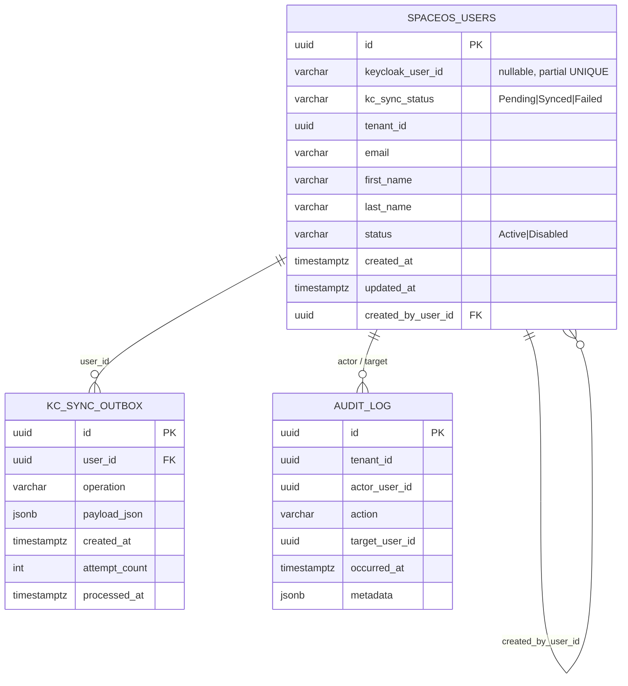

# SpaceOS — Modules Identity

## Tenant-scoped User Management · Keycloak Admin API Integration

> Verzió: v4.0 — 2026-05-27
> Státusz: IMPLEMENTÁCIÓRA KÉSZ
> Blokkoló feltétel: P0-1 (JWT RS256) lezárása előtt NEM kerülhet production GA-ra
> Kumulált review: DB Designer → Senior Security → Senior Backend → v4

---

## 1. Kumulált Finding Összesítő (v1 → v4)

| Review | Finding-ek | Legfontosabb javítás | Effort delta |
|--------|------------|----------------------|--------------|
| v1 → DB Designer → v2 | 0 🔴 · 2 🟠 · 3 🟡 · 1 🟢 | `kc_sync_status` enum column + FK self-ref constraint | +0.5 nap |
| v2 → Senior Security → v3 | 2 🔴 · 4 🟠 · 3 🟡 | SEC-01 KC scope guard · SEC-02 BOLA explicit check | +2.5 nap |
| v3 → Senior Backend → v4 | 1 🔴 · 2 🟠 · 2 🟡 | BE-01 Outbox pattern KC sync-hoz | +2.0 nap |
| **Összesen** | **3🔴 · 8🟠 · 8🟡 · 1🟢** | | **~17 fejlesztői nap** |

### Individual findings

| ID | Súly | Terület | Probléma | v4 javítás |
|----|------|---------|----------|------------|
| DB-01 | 🟠 | Schema | `keycloak_user_id` nullable + UNIQUE = több NULL befogadható | `kc_sync_status` VARCHAR(20) enum: `Pending / Synced / Failed` |
| DB-02 | 🟠 | Index | Standalone `email` index felesleges — UNIQUE(email, tenant_id) már lefedi | `idx_spaceos_users_email` törölve |
| DB-03 | 🟡 | Schema | `created_by_user_id` FK constraint hiányzik | `REFERENCES identity.spaceos_users(id) ON DELETE SET NULL` |
| DB-04 | 🟡 | Migration | Down migration nincs specifikálva | `0001_InitialSchema.Down()` hozzáadva |
| DB-05 | 🟡 | RLS | `SET LOCAL` elmaradhat connection poolingnál | `IdentityDbContext` override: SET minden tranzakció elején |
| DB-06 | 🟢 | Naming | `status` CHECK vs. PG native enum | VARCHAR + CHECK marad, bővítési eljárás dokumentálva |
| SEC-01 | 🔴 | Authorization | KC `manage-users` az egész realm-re érvényes — nincs KC-oldali tenant scope | Minden KC hívás előtt explicit `tid` attribute ellenőrzés az Infrastructure rétegben |
| SEC-02 | 🔴 | BOLA | `GET /identity/users/{id}` nem ellenőriz explicit tenant match-et | Handler-szintű guard: `user.TenantId != _currentUser.TenantId → Result.Forbidden()` |
| SEC-03 | 🟠 | Token security | Redis token cache titkosítatlan | Redis AUTH + localhost binding + token AES-256 encrypt |
| SEC-04 | 🟠 | Rate limiting | `reset-password` endpoint korlátlan | `5 reset / user / hour` — Redis sliding window, 429 RFC 7807 |
| SEC-05 | 🟠 | Info leakage | KC hibák proxyzva kliens felé | `IdentityProviderException` wrap, sanitized RFC 7807 response |
| SEC-06 | 🟠 | Bootstrap | `sync-from-keycloak` importálhat idegen tenanthoz tartozó usert | Import: `assert kc_user.tid == tenantId` — mismatch → skip + warn |
| SEC-07 | 🟡 | Audit | User management nincs audit logolva az identity DB-ben | `identity_audit_log` append-only tábla |
| SEC-08 | 🟡 | PII | Email plaintext logban | Serilog destructuring: `email_masked` |
| SEC-09 | 🟡 | Dependency | JWT HS256 (P0-1 open) — `tid` claim hamisítható | Deployment blocker: Identity GA = P0-1 lezárása után |
| BE-01 | 🔴 | Atomicity | KC sync + DB commit nem atomiáris — crash → örök `keycloak_user_id = null` | Lightweight Outbox: `kc_sync_outbox` tábla + `KcSyncWorkerService` BackgroundService |
| BE-02 | 🟠 | DDD violation | `KeycloakAdminClient` business döntést hoz (attribute mapping) | KC client csak HTTP adapter — mapping Application rétegben |
| BE-03 | 🟠 | Golden Rule #5 | `ListTenantUsersQuery` raw query kockázat | `TenantUsersByStatusSpec`, `TenantUserByIdSpec` explicit definiálva |
| BE-04 | 🟡 | Performance | `SyncFromKeycloak` szekvenciális INSERT | Batch `AddRangeAsync()`, max 200/batch, KC API lapozás |
| BE-05 | 🟡 | Async | `ConfigureAwait(false)` nincs explicit elvárva | DoD gate-ként rögzítve |

---

## 2. Domain modell

### 2.1 Stratégiai kontextus

A `spaceos-modules-identity` a SpaceOS platform **egyetlen authoritative forrása** a user és tenant membership domain-re. Keycloak kizárólag AuthN-t végez (login, JWT, MFA, session). Minden üzleti user adat az identity module DB-jében él.

```
Keycloak (KC 24.0)
└── AuthN only: login · JWT · MFA · session · keycloak_user_id generálás

spaceos-modules-identity (5008)
├── Authoritative: SpaceOSUser · TenantMembership (v2) · Invitation (v2)
├── Write-through → Keycloak (via Outbox + BackgroundService)
└── KC soha nem ír SpaceOS-ba
```

**Write-through sorrend — INVARIANT (BE-01 javítás):**
```
1. DB tranzakció: INSERT spaceos_users + INSERT kc_sync_outbox  (atomiáris)
2. KcSyncWorkerService (BackgroundService): feldolgozza az outbox-ot
3. KC Admin API hívás (Polly 3×, exponential backoff)
4. Success → kc_sync_outbox DELETE + spaceos_users.kc_sync_status = Synced
5. Final failure → kc_sync_status = Failed + UserKcSyncFailedEvent
```

### 2.2 Aggregate: `SpaceOSUser`

```
SpaceOSUser  (Aggregate Root)
├── SpaceOSUserId           (VO · UUID · immutable)
├── KeycloakUserId          (VO · string · nullable · immutable after sync)
├── KcSyncStatus            (enum · Pending | Synced | Failed)
├── TenantId                (VO · UUID · cross-module reference)
├── Email                   (VO · lowercase normalize · format validáció)
├── DisplayName             (VO · FirstName + LastName · max 100 char)
├── Status                  (enum · Active | Disabled)
├── CreatedAt               (UTC · immutable)
├── UpdatedAt               (UTC · minden mutáción frissül)
└── CreatedByUserId         (VO · UUID · nullable)
```

**Domain Events:**

| Event | Trigger |
|---|---|
| `UserCreatedEvent` | SpaceOS DB INSERT kész, KC sync pending |
| `UserProfileUpdatedEvent` | Email / DisplayName módosítva |
| `UserDisabledEvent` | Active → Disabled |
| `UserEnabledEvent` | Disabled → Active |
| `PasswordResetRequestedEvent` | Reset email trigger |
| `UserKcSyncFailedEvent` | 3× retry kimerült |

**Business rules (Domain — nem handlerben):**

- `Disable()` → csak ha `Status == Active` → különben `Result.Error("already_disabled")`
- `Enable()` → csak ha `Status == Disabled` → különben `Result.Error("already_active")`
- `Email` VO → lowercase, trim, RFC 5322 format ellenőrzés
- Factory `SpaceOSUser.Create()` → `KcSyncStatus = Pending`, `KeycloakUserId = null`

### 2.3 Modul struktúra

```
spaceos-modules-identity/
  Identity.Domain/
    Aggregates/SpaceOSUser.cs
    ValueObjects/
      SpaceOSUserId.cs · KeycloakUserId.cs · Email.cs
      DisplayName.cs · UserStatus.cs · KcSyncStatus.cs
    DomainEvents/
      UserCreatedEvent.cs · UserProfileUpdatedEvent.cs
      UserDisabledEvent.cs · UserEnabledEvent.cs
      PasswordResetRequestedEvent.cs · UserKcSyncFailedEvent.cs
    Interfaces/
      ISpaceOSUserRepository.cs
      IIdentityProviderClient.cs     ← IdP-agnosztikus interfész

  Identity.Application/
    Users/
      Queries/
        ListTenantUsersQuery.cs + Handler + TenantUsersByStatusSpec
        GetUserByIdQuery.cs + Handler + TenantUserByIdSpec
      Commands/
        CreateUserCommand.cs + Handler + Validator
        UpdateUserProfileCommand.cs + Handler + Validator
        DisableUserCommand.cs + Handler
        EnableUserCommand.cs + Handler
        ResetPasswordCommand.cs + Handler
        SyncTenantUsersFromKeycloakCommand.cs + Handler
    Common/
      ICurrentUserContext.cs
      DTOs/ UserDto.cs · CreateUserDto.cs · UpdateUserProfileDto.cs

  Identity.Infrastructure/
    Persistence/
      IdentityDbContext.cs
      Configurations/
        SpaceOSUserConfiguration.cs
        KcSyncOutboxConfiguration.cs
        IdentityAuditLogConfiguration.cs
      Repositories/SpaceOSUserRepository.cs
      Migrations/0001_InitialSchema.cs
    Keycloak/
      KeycloakAdminClient.cs         ← IIdentityProviderClient — csak HTTP adapter
      KeycloakTokenProvider.cs       ← client credentials + Redis token cache
      Models/ KcUserRepresentation.cs · KcCreateUserRequest.cs
    Workers/
      KcSyncWorkerService.cs         ← BackgroundService, Polly 3×
    Cache/
      UserCacheService.cs            ← Redis cache-aside, 30s TTL
    CurrentUser/
      CurrentUserContext.cs

  Identity.Api/
    Controllers/
      UsersController.cs
      AdminController.cs
    Program.cs · appsettings.json · appsettings.Production.json

  Identity.Tests/
    Domain/SpaceOSUserTests.cs
    Application/
      CreateUserCommandTests.cs · DisableUserCommandTests.cs
      UpdateUserProfileCommandTests.cs · ListTenantUsersQueryTests.cs
      GetUserByIdQueryTests.cs · ResetPasswordCommandTests.cs
    Infrastructure/
      KeycloakAdminClientTests.cs · UserCacheServiceTests.cs
      KcSyncWorkerServiceTests.cs · CrossTenantAccessTests.cs
```

---

## 3. DB Schema (v4 — minden finding beépítve)

### 3.1 DDL

```sql
-- Migration: 0001_InitialSchema — Up
CREATE SCHEMA IF NOT EXISTS identity;

-- Fő user tábla
CREATE TABLE identity.spaceos_users (
    id                  UUID            PRIMARY KEY DEFAULT gen_random_uuid(),
    keycloak_user_id    VARCHAR(36)     NULL,        -- nullable: KC sync pending
    kc_sync_status      VARCHAR(20)     NOT NULL DEFAULT 'Pending'
                            CHECK (kc_sync_status IN ('Pending', 'Synced', 'Failed')),
    tenant_id           UUID            NOT NULL,
    email               VARCHAR(255)    NOT NULL,
    first_name          VARCHAR(100)    NOT NULL,
    last_name           VARCHAR(100)    NOT NULL,
    status              VARCHAR(20)     NOT NULL DEFAULT 'Active'
                            CHECK (status IN ('Active', 'Disabled')),
    created_at          TIMESTAMPTZ     NOT NULL DEFAULT now(),
    updated_at          TIMESTAMPTZ     NOT NULL DEFAULT now(),
    created_by_user_id  UUID            NULL
                            REFERENCES identity.spaceos_users(id) ON DELETE SET NULL
);

-- Constraints
ALTER TABLE identity.spaceos_users
    ADD CONSTRAINT uq_spaceos_users_kc_id
    UNIQUE (keycloak_user_id)
    WHERE keycloak_user_id IS NOT NULL;  -- partial unique: NULL-ok kizárva

ALTER TABLE identity.spaceos_users
    ADD CONSTRAINT uq_spaceos_users_email_tenant
    UNIQUE (email, tenant_id);

-- Indexek
CREATE INDEX idx_spaceos_users_tenant_id
    ON identity.spaceos_users (tenant_id);

CREATE INDEX idx_spaceos_users_tenant_status
    ON identity.spaceos_users (tenant_id, status);

CREATE INDEX idx_spaceos_users_kc_sync_status
    ON identity.spaceos_users (kc_sync_status)
    WHERE kc_sync_status IN ('Pending', 'Failed');  -- csak a feldolgozandók

-- KC Sync Outbox tábla (BE-01 javítás)
CREATE TABLE identity.kc_sync_outbox (
    id              UUID        PRIMARY KEY DEFAULT gen_random_uuid(),
    user_id         UUID        NOT NULL REFERENCES identity.spaceos_users(id),
    operation       VARCHAR(20) NOT NULL
                        CHECK (operation IN ('Create', 'Update', 'Disable', 'Enable', 'ResetPassword')),
    payload_json    JSONB       NOT NULL,
    created_at      TIMESTAMPTZ NOT NULL DEFAULT now(),
    attempt_count   INT         NOT NULL DEFAULT 0,
    last_attempt_at TIMESTAMPTZ NULL,
    processed_at    TIMESTAMPTZ NULL
);

CREATE INDEX idx_kc_sync_outbox_unprocessed
    ON identity.kc_sync_outbox (created_at)
    WHERE processed_at IS NULL;

-- Audit log (SEC-07 javítás)
CREATE TABLE identity.audit_log (
    id              UUID        PRIMARY KEY DEFAULT gen_random_uuid(),
    tenant_id       UUID        NOT NULL,
    actor_user_id   UUID        NULL,
    action          VARCHAR(50) NOT NULL,
    target_user_id  UUID        NULL,
    occurred_at     TIMESTAMPTZ NOT NULL DEFAULT now(),
    metadata        JSONB       NULL
);

CREATE INDEX idx_audit_log_tenant_occurred
    ON identity.audit_log (tenant_id, occurred_at DESC);

-- updated_at trigger
CREATE OR REPLACE FUNCTION identity.set_updated_at()
RETURNS TRIGGER AS $$
BEGIN NEW.updated_at = now(); RETURN NEW; END;
$$ LANGUAGE plpgsql;

CREATE TRIGGER trg_spaceos_users_updated_at
    BEFORE UPDATE ON identity.spaceos_users
    FOR EACH ROW EXECUTE FUNCTION identity.set_updated_at();

-- RLS
ALTER TABLE identity.spaceos_users ENABLE ROW LEVEL SECURITY;
CREATE POLICY tenant_isolation ON identity.spaceos_users
    USING (tenant_id = current_setting('app.current_tenant_id')::UUID);

-- Roles
CREATE ROLE identity_app;
GRANT USAGE ON SCHEMA identity TO identity_app;
GRANT SELECT, INSERT, UPDATE ON identity.spaceos_users TO identity_app;
GRANT SELECT, INSERT, UPDATE, DELETE ON identity.kc_sync_outbox TO identity_app;
GRANT SELECT, INSERT ON identity.audit_log TO identity_app;
-- DELETE szándékosan TILTVA a spaceos_users táblán

-- Migration: 0001_InitialSchema — Down
DROP TABLE IF EXISTS identity.audit_log;
DROP TABLE IF EXISTS identity.kc_sync_outbox;
DROP TABLE IF EXISTS identity.spaceos_users;
DROP FUNCTION IF EXISTS identity.set_updated_at();
DROP SCHEMA IF EXISTS identity;
```

### 3.2 ERD (Mermaid)



---

## 4. API Surface (v4)

### 4.1 Endpoint táblázat

| Method | Path | Auth policy | Leírás |
|---|---|---|---|
| `GET` | `/identity/users` | `TenantMember` | Tenant userек listája |
| `GET` | `/identity/users/{id}` | `TenantMember` | Egy user — explicit tenant guard |
| `POST` | `/identity/users` | `TenantAdmin` | Create + Outbox insert |
| `PUT` | `/identity/users/{id}` | `TenantAdmin` | Profil update + Outbox insert |
| `POST` | `/identity/users/{id}/disable` | `TenantAdmin` | Disable + Outbox insert |
| `POST` | `/identity/users/{id}/enable` | `TenantAdmin` | Enable + Outbox insert |
| `POST` | `/identity/users/{id}/reset-password` | `TenantAdmin` | Rate limited: 5/user/hour |
| `POST` | `/identity/admin/tenants/{id}/sync-from-keycloak` | `SuperAdmin` | Bootstrap — tid assert |

### 4.2 Tenant scoping — defense in depth

Három rétegű védelem (SEC-01, SEC-02 javítás):

```
Réteg 1 — RLS:        tenant_id = current_setting('app.current_tenant_id')
Réteg 2 — Handler:    if (user.TenantId != _currentUser.TenantId) → Result.Forbidden()
Réteg 3 — KC client:  minden KC hívás előtt assert(kc_user.tid == currentUser.TenantId)
```

### 4.3 KC sync flow — Outbox pattern (BE-01 javítás)

```
POST /identity/users
    │
    ▼
CreateUserCommand handler
    ├─ 1. FluentValidation
    ├─ 2. Duplicate email check (TenantUserByEmailSpec + AsNoTracking)
    ├─ 3. SpaceOSUser.Create() → KcSyncStatus = Pending
    │
    ├─ 4. DB tranzakció (atomiáris):
    │       INSERT identity.spaceos_users (kc_sync_status = Pending)
    │       INSERT identity.kc_sync_outbox (operation = Create, payload_json = {...})
    │
    ├─ 5. PopDomainEvents() + DispatchAsync()
    ├─ 6. Result<UserDto>.Success() → 201 Created (azonnali válasz)
    │
    └─ [háttérben — KcSyncWorkerService]
            Poll kc_sync_outbox WHERE processed_at IS NULL
            → IIdentityProviderClient.CreateUserAsync()
                  → assert response.tid == tenantId (SEC-01)
            → Success: spaceos_users.kc_sync_status = Synced
                        spaceos_users.keycloak_user_id = KC response ID
                        kc_sync_outbox.processed_at = now()
            → Failure: attempt_count++, exponential backoff
                        3× után: kc_sync_status = Failed + UserKcSyncFailedEvent
```

### 4.4 Rate limiting — reset-password (SEC-04 javítás)

```csharp
// Redis key: rl:reset:{userId}
// Window: 1 hour sliding
// Limit: 5 attempts
// Response on exceed: 429 Too Many Requests (RFC 7807)

// ResetPasswordCommandHandler:
var key = $"rl:reset:{command.UserId}";
var count = await _redis.IncrementAsync(key);
if (count == 1) await _redis.ExpireAsync(key, TimeSpan.FromHours(1));
if (count > 5) return Result.Error("rate_limit_exceeded");
```

### 4.5 IIdentityProviderClient interfész (BE-02 javítás)

```csharp
// Identity.Domain/Interfaces/IIdentityProviderClient.cs
// Csak adattransfer — nincs business logic
public interface IIdentityProviderClient
{
    Task<string> CreateUserAsync(KcCreateUserRequest request, CancellationToken ct);
    Task UpdateUserAsync(string kcUserId, KcUpdateUserRequest request, CancellationToken ct);
    Task SetUserEnabledAsync(string kcUserId, bool enabled, CancellationToken ct);
    Task SendPasswordResetEmailAsync(string kcUserId, CancellationToken ct);
    Task<IReadOnlyList<KcUserRepresentation>> GetUsersByTenantAsync(Guid tenantId, int first, int max, CancellationToken ct);
}

// Mapping az Application rétegben — nem az Infrastructure-ban:
// CreateUserCommandHandler → KcCreateUserRequest assembly
var kcRequest = new KcCreateUserRequest(
    Email: command.Email,
    FirstName: command.FirstName,
    LastName: command.LastName,
    Enabled: true,
    Attributes: new Dictionary<string, string[]> {
        ["tid"] = [command.TenantId.ToString()]
    }
);
```

---

## 5. EF Core konfiguráció (v4)

```csharp
// IdentityDbContext.cs — RLS enforce + schema
protected override void OnModelCreating(ModelBuilder mb)
{
    mb.HasDefaultSchema("identity");
    mb.ApplyConfigurationsFromAssembly(typeof(IdentityDbContext).Assembly);
}

// Minden mutating repository metódus előtt:
await _db.Database.ExecuteSqlRawAsync(
    "SET LOCAL app.current_tenant_id = {0}", tenantId.ToString())
    .ConfigureAwait(false);

// SpaceOSUserConfiguration — kiegészítés DB-01 javítással:
builder.Property(u => u.KcSyncStatus)
    .HasColumnName("kc_sync_status")
    .HasMaxLength(20)
    .HasConversion<string>();

builder.Property(u => u.KeycloakUserId)
    .HasColumnName("keycloak_user_id")
    .HasMaxLength(36)
    .IsRequired(false);

// Partial unique index mapping:
builder.HasIndex(u => u.KeycloakUserId)
    .IsUnique()
    .HasFilter("keycloak_user_id IS NOT NULL")
    .HasDatabaseName("uq_spaceos_users_kc_id");
```

---

## 6. Package lista

```xml
<!-- Identity.Infrastructure -->
<PackageReference Include="Keycloak.AuthServices.Sdk" Version="2.8.0" />
<PackageReference Include="StackExchange.Redis" Version="2.8.16" />
<PackageReference Include="Polly" Version="8.4.1" />
<PackageReference Include="Polly.Extensions.Http" Version="3.0.0" />

<!-- Identity.Api -->
<PackageReference Include="Keycloak.AuthServices.Authentication" Version="2.8.0" />

<!-- Shared — Kernel-lel azonos -->
<PackageReference Include="MediatR" Version="12.4.0" />
<PackageReference Include="FluentValidation.AspNetCore" Version="11.3.0" />
<PackageReference Include="Ardalis.Result" Version="9.0.0" />
<PackageReference Include="Ardalis.Specification.EntityFrameworkCore" Version="9.1.0" />
<PackageReference Include="Microsoft.EntityFrameworkCore" Version="8.0.11" />
<PackageReference Include="Npgsql.EntityFrameworkCore.PostgreSQL" Version="8.0.11" />
<PackageReference Include="Serilog.AspNetCore" Version="8.0.1" />

<!-- Tests -->
<PackageReference Include="xunit" Version="2.9.2" />
<PackageReference Include="Moq" Version="4.20.72" />
<PackageReference Include="Microsoft.AspNetCore.Mvc.Testing" Version="8.0.11" />
```

---

## 7. Definition of Done — v4

### Migration gates
- [ ] `0001_InitialSchema` up + down migration zöld
- [ ] `identity.spaceos_users`, `identity.kc_sync_outbox`, `identity.audit_log` létezik
- [ ] `identity_app` role: DELETE tiltva a `spaceos_users` táblán — integration test bizonyítja
- [ ] RLS policy aktív — cross-tenant query 0 sort ad vissza
- [ ] Partial UNIQUE `keycloak_user_id` — több NULL beilleszthető, de két azonos KC ID nem
- [ ] `idx_kc_sync_outbox_unprocessed` partial index — csak feldolgozatlan sorokra

### Domain gates
- [ ] `SpaceOSUser.Create()` factory — public setter nélkül, `KcSyncStatus = Pending`
- [ ] `Disable()` / `Enable()` — invariáns guard, domain event raise
- [ ] `Email` VO — lowercase normalize, RFC 5322 format
- [ ] `DisplayName` VO — max 100 char each field

### API + validation gates
- [ ] `GET /identity/users` — csak JWT `tid` tenant usereit adja vissza
- [ ] `GET /identity/users/{id}` — explicit handler-szintű tenant guard: `user.TenantId != currentUser.TenantId → 403`
- [ ] `POST /identity/users` — duplikált email → 409 Conflict
- [ ] `POST /identity/users` — invalid email → 422 Unprocessable
- [ ] `POST /identity/users/{id}/disable` — saját magát → 400 Bad Request
- [ ] `POST /identity/users/{id}/reset-password` — 6. kísérlet → 429 Too Many Requests
- [ ] `POST /identity/admin/.../sync-from-keycloak` — `SuperAdmin` only; tid mismatch → skip+warn
- [ ] Minden KC hívás előtt: `kc_user.tid == currentUser.TenantId` assert

### Infrastructure gates
- [ ] `KcSyncWorkerService` — Polly 3× exponential backoff, `Failed` státusz beállítva
- [ ] DB + kc_sync_outbox INSERT atomiáris (egy tranzakcióban)
- [ ] Redis token cache — TTL = expires_in − 60s; token AES-256 encrypted
- [ ] Redis user lista cache — 30s TTL, write után invalidálás
- [ ] KC Admin API error → `IdentityProviderException` wrap → sanitized RFC 7807 (SEC-05)
- [ ] Serilog: `email_masked` destructuring policy (SEC-08)
- [ ] `audit_log` INSERT minden write handler-ben

### Security gates *(deployment blocker)*
- [ ] JWT validáció — `Keycloak.AuthServices.Authentication` configured, realm: spaceos
- [ ] `tid` claim **kizárólag JWT-ből** — header/body elfogadás tiltva
- [ ] `spaceos-identity-service` KC client — dedikált, `manage-users` scope only
- [ ] `CLIENT_SECRET` — VPS environment variable, **nem appsettings.json-ban**
- [ ] Redis AUTH password beállítva + 127.0.0.1 binding
- [ ] 5008 port loopback only — Nginx terminálja, külső forgalom 5008-on tiltva
- [ ] **PRODUCTION GA BLOCKER: P0-1 (JWT RS256) lezárva** — HS256 esetén `tid` hamisítható

### Összesített
- [ ] Meglévő ~3884 backend teszt zöld (identity modul nem érinti)
- [ ] Identity modul új tesztek: ≥ 50 db
- [ ] 0 build warning
- [ ] `ConfigureAwait(false)` minden production async call-ban
- [ ] `AsNoTracking()` minden read-only repository metóduson
- [ ] `dotnet list package --vulnerable` → 0 high/critical
- [ ] `EXPLAIN ANALYZE` — `idx_spaceos_users_tenant_status` Index Scan, nem Seq Scan
- [ ] Nginx: `/identity/*` → `localhost:5008` konfigurálva
- [ ] systemd: `spaceos-modules-identity.service` aktív, auto-restart on failure

---

## 8. Security adósság státusz

| ID | Tétel | Előző | Ez a fázis | Marad |
|----|-------|-------|------------|-------|
| P0-1 | JWT HS256 → RS256 | ❌ | ❌ — Kernel scope | **GA blocker** |
| P0-2 | Hash Chain external sink | ❌ | ❌ — Kernel scope | Kernel |
| P0-3 | Hash Chain race condition | ❌ | ❌ — Kernel scope | Kernel |
| P0-4 | Audit tábla role szeparáció | ❌ | ❌ — Kernel scope | Kernel |
| **Identity: DB role** | `identity_app` DELETE tiltva | — | ✅ DoD gate | — |
| **Identity: Token sec** | Redis token titkosítás | — | ✅ DoD gate | — |
| **Identity: BOLA** | Explicit tenant guard minden handleren | — | ✅ beépítve | — |
| **Identity: Outbox** | KC sync atomicity | — | ✅ beépítve | — |
| **Identity: Rate limit** | Reset-password 5/user/hour | — | ✅ beépítve | — |
| **Identity: Audit log** | Append-only audit_log tábla | — | ✅ beépítve | — |

---

## 9. Claude Code implementációs csomag

### Végrehajtási sorrend

| Nap | Feladat | Track | Függőség |
|-----|---------|-------|----------|
| 1 | Domain aggregates + Value Objects + Domain Events | A | — |
| 2 | Application: Specifications + Query handlers | B | A |
| 3 | Application: Command handlers + Validators | B | A |
| 4 | Infrastructure: EF Core + Migration + Repository | C | A |
| 4 | Infrastructure: IdentityDbContext RLS setup | C | C |
| 5 | Infrastructure: KeycloakAdminClient + TokenProvider | D | — |
| 5 | Infrastructure: UserCacheService (Redis cache-aside) | D | — |
| 6 | Infrastructure: KcSyncWorkerService (BackgroundService + Polly) | D | C, D |
| 7 | API: Controllers + Auth middleware + Program.cs | E | B, C |
| 7 | Deployment: systemd + nginx + env vars | F | — |
| 8–9 | Tests: ≥ 50 unit + integration + CrossTenantAccessTests | G | A–E |

### Agent utasítás

> "Implementáld a `SpaceOS_Modules_Identity_Architecture_v4.md` szerint:
>
> Track A: `Identity.Domain` — `SpaceOSUser` aggregate, Value Objects, Domain Events, `IIdentityProviderClient` interfész. Nincs public setter. Minden mutáció domain eventet raised.
>
> Track B: `Identity.Application` — CQRS handlers, Ardalis.Specification specs, FluentValidation validators. `Result<T>` minden handleren. `AsNoTracking()` minden read-only metóduson.
>
> Track C: `Identity.Infrastructure/Persistence` — `IdentityDbContext`, EF Core konfiguráció, Migration 0001 (up + down), RLS SET LOCAL, `identity_app` role.
>
> Track D: `Identity.Infrastructure/Keycloak` + `Workers` + `Cache` — `KeycloakAdminClient` (csak HTTP adapter, nincs business logic), `KeycloakTokenProvider` (Redis token cache, AES-256), `KcSyncWorkerService` (BackgroundService, Polly 3×), `UserCacheService` (30s TTL, invalidation).
>
> Track E: `Identity.Api` — `UsersController`, `AdminController`, `Program.cs` (JWT middleware, policy definíciók, rate limiting).
>
> DoD checklist: `SpaceOS_Modules_Identity_Architecture_v4.md#7-definition-of-done`
>
> Security gate: P0-1 (JWT RS256) lezárása = production GA blocker — implementáció futhat, de production deploy-t blokkold.
>
> Minden track után: `dotnet test && dotnet build`"

### Kockázatok és mitigációk

| Kockázat | Valószínűség | Hatás | Mitigáció |
|----------|-------------|-------|-----------|
| KC 24 ↔ `Keycloak.AuthServices.Sdk` 2.8 API eltérés | Közepes | Magas | Integration test KC-val az első napon; ha eltérés van → manual `HttpClient` fallback |
| `KcSyncWorkerService` polling terhelés | Alacsony | Közepes | Polling interval: 5s alapértelmezett, configurable; partial index a feldolgozatlan sorokra |
| Redis elérhetetlen — token cache miss | Alacsony | Közepes | Polly fallback: direkt CC grant Redis nélkül, 1× per request |
| Bootstrap sync félbeszakad (9 Doorstar user) | Alacsony | Alacsony | Idempotent UPSERT by `keycloak_user_id`; újrafuttatható |

---

## 10. Roadmap

| Fázis | Tartalom | Előfeltétel |
|---|---|---|
| **Identity v1** | Ez a dokumentum | — |
| **Identity v1.5** | ShopFloor PIN Auth backend | v1 deployed |
| **Identity v2** | Invitation flow + email meghívó | v1 stable |
| **Identity v2.5** | Role assignment portálból (KC group sync) | v2 stable |
| **Identity v3** | Tenant branding / feature flags | v2 stable |
| **Identity v4** | DACH / Entra ID adapter csere | v3 stable |

---

*SpaceOS · Modules Identity v4.0 · DB Designer + Senior Security + Senior Backend reviewed · 2026-05-27*
*Státusz: IMPLEMENTÁCIÓRA KÉSZ — 20 finding beépítve, minden döntés lezárva*
*Production GA blocker: P0-1 (JWT RS256) lezárása kötelező deploy előtt*
