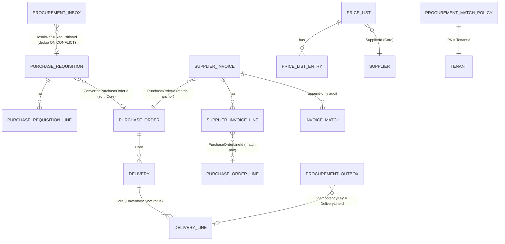

# SpaceOS — Modules.Procurement v2 Architecture
## PurchaseRequisition + SupplierInvoice + Three-Way Match + Pricing

> **Verzió:** v4.0 — 2026-05-28 (Backend review absorbed: `/senior-backend` → 11 finding beépítve)
> **Státusz:** 🟢 **IMPLEMENTÁCIÓRA KÉSZ** (v4 — teljes review pipeline lezárva: DB → Security → Backend)
> **Blokkoló feltétel (külső, Procurement-en kívül — ADR-039 függelék, párhuzamosan indítható):**
> - Inventory: idempotent `POST /inventory/internal/inbound` receiver (compound idempotency-key `(TenantId, DeliveryLineId)`, Bearer shared-secret + header-body `TenantId` strict equal)
> - Inventory: `reorder_alert` outbox + worker (ReorderAlert→Procurement irány)
> **Épít rá (nem változtatja):** Procurement Core v1 — `Supplier` · `PurchaseOrder` (FSM `Draft → Submitted → Confirmed → Shipped → Delivered/Cancelled`) · `Delivery` · `IProcurementProvider` Contracts interface
> **Kumulált review:** v1 Draft → v1.1 research → v2 DB ✅ (12) → v3 Security ✅ (12) → **v4 `/senior-backend` ✅ (11 finding: 1 🔴 · 5 🟠 · 5 🟡) → IMPLEMENTÁCIÓRA KÉSZ**
> **Referencia:** `SpaceOS_Modules_Sales_Architecture_v4.md` (ADR-039 outbox + worker BYPASSRLS + per-message `set_config` + idempotent receiver + Polly retry + `QuoteConversionFailed` kompenzáció — KÖZVETLEN precedens) · `SpaceOS_Modules_Cutting_Core_Architecture_v4.md` (domain/FSM/API-surface strukturális precedens) · `SpaceOS_Modules_Contracts_Architecture_v4.md` (`IProcurementProvider`) · `SpaceOS_Modules_Cutting_Vision_v1.md` (Procurement-fogalomtár) · `Codebase_Status_20260527.md` (topológia + test baseline)
> **Külső referencia-implementációk (study-only, NEM dependency — lásd §10):** `dotnet/eShop` Ordering aggregate · `baratgabor/MyWarehouse` (Clean Arch + DDD, "Don't Create Aggregate Roots") · Milan Jovanović Inbox/Outbox cikkek · P2P kanonikus 7-lépés (requisition→PO→receipt→invoice→reconcile)
> **Repo:** `spaceos-modules-procurement` (meglévő — bővítés, nem új polyrepo)
> **DB schema:** `spaceos_procurement` (meglévő — additív bővítés, meglévő táblák érintetlenek)
> **Port:** 5006 (systemd, loopback-only — meglévő)
> **TargetFramework:** `net8.0`
> **Becsült effort:** ~10 (v1) → ~12 (v2 DB +2) → ~15 (v3 sec +3) → **~16 nap (v4 backend +1:** tx-atomikusság-wiring, Polly-finomítás, lease/reclaim, EF composite-FK config). **Összes review-finding: 35** (3 🔴 · 17 🟠 · 15 🟡)
> **Test baseline:** 3 761+ backend pass (Procurement jelenleg 53)

---

## 1. Kumulált Finding Összesítő (v1 → vN)

| Review | Finding-ek | Legfontosabb javítás | Effort delta |
|--------|-----------|----------------------|--------------|
| **v1 Draft → v1.1 (jelen)** | 11 ön-jelzés (1 RESOLVED) | Domain modell (4 új aggregate) + DDL + API surface + ADR-039 2 write-irány + three-way match policy; **v1.1:** Inbox pattern, kumulatív match-qty, multi-PO out-of-scope, lag-monitoring, event-séma verziózás, FSM guard-fegyelem | 10 nap (baseline) |
| v1 → `/database-designer` + `/database-schema-designer` → **v2 (jelen)** | **12** (2 🔴 · 6 🟠 · 4 🟡) | `xmin` system-column ütközés javítás (DDL FAIL elhárítva), `invoice_match` append-only trigger, line tenant-integritás composite FK, hiányzó lookup/status indexek, best-price index-stratégia, receiver tenant-context | +2 nap → 12 nap |
| v2 → `/senior-security` → **v3 (jelen)** | **12** (2 🔴 · 6 🟠 · 4 🟡) | Internal-endpoint shared-secret auth (forgeable header elhárítva), `ApproveWithVariance` RBAC + segregation-of-duties, BYPASSRLS worker DiD, durable financial audit-log, secrets-management, amount-integritás invariáns, rate-limit | +3 nap → 15 nap |
| v3 → `/senior-backend` → **v4 (jelen) → IMPLEMENTÁCIÓRA KÉSZ** | **11** (1 🔴 · 5 🟠 · 5 🟡) | Transactional outbox/inbox **egy-tx atomikusság** (UoW), Polly transient-vs-permanent + circuit-breaker, worker lease/reclaim, EF owned composite-FK mapping, Result→HTTP map (peer-retry vezérlés), match-query N+1 elhárítás, teljesítmény-budget | +1 nap → 16 nap |

### Finding részletek (v4 — Backend review ABSORBED)

| ID | Súly | Terület | Probléma | v4 javítás (beépítve) |
|----|------|---------|----------|------------------------|
| **BE-P-01** | 🔴 CRITICAL | Tranzakció-atomikusság | A naiv „`PopDomainEvents` + `DispatchAsync` a handler végén" mintával a domain-mutáció és az **outbox/inbox INSERT + audit-log külön tx-be kerülhet** → crash esetén Delivery rögzült, de nincs outbox-sor (inventory sosem szinkronizál, és nincs `Failed` jelző sem); ill. requisition létrejön, de az inbox-sor nem → retry-n duplikátum. Ez az **ADR-039 egész minta alapinvariánsa** | **Egyetlen UoW / egy DB-tx:** `begin tx → aggregate SaveChanges + outbox/inbox INSERT → in-tx domain-event handler-ek (audit) → commit (egyszer)`. Az integration-dispatch a worker (decoupled). A `RecordDelivery` és a receiver is **egy-tx** (lásd §5.1/§5.2 frissítve) |
| **BE-P-02** | 🟠 HIGH | Polly retry-policy | „3× exponential retry" nem különbözteti meg a **tranziens** (timeout/5xx/conn) és a **permanens** (4xx business-reject) hibát → egy 422-re 3 retry pazarol, és nincs védelem ha az Inventory tartósan down | Polly: retry **csak** tranziensre (timeout, 5xx, `HttpRequestException`), per-attempt timeout; permanens 4xx → azonnal `Failed` (nincs retry); **circuit-breaker** ha az Inventory sorozatosan hibázik (ne hammer-eljen) (lásd §5.1) |
| **BE-P-03** | 🟠 HIGH | Worker lease/reclaim | A `LeaseUntil` mező megvan, de a reclaim-szemantika nincs specifikálva → crash-elt `InFlight` sor örökre beragad | Claim: `Status='Pending' AND NextAttemptAt<=now()` **OR** `Status='InFlight' AND LeaseUntil<now()`; `FOR UPDATE SKIP LOCKED`; claim → `LeaseUntil=now()+TTL`; siker → `Completed`; az `AttemptCount` csak valós kísérletkor nő (reclaim ≠ retry dupla-számolás) (lásd §5.1) |
| **BE-P-04** | 🟠 HIGH | EF owned composite-FK | A `(ParentId, TenantId)` composite FK (DB-P-03) owned-collection-ön nem triviális EF-config — az owned típus konvenció szerint csak a parent PK-t használja | Explicit: parent `HasAlternateKey("Id","TenantId")` + a line `WithOwner().HasForeignKey("ParentId","TenantId")`; **VAGY** a line-okat rendes entity-ként az aggregate-en belül (nem owned) explicit konfiggal. v4 választás: **owned + HasAlternateKey + explicit composite FK** (lásd §6) |
| **BE-P-05** | 🟠 HIGH | Result→HTTP map (peer-retry) | A belső receiver `Result`-ja vezérli a **peer retry-viselkedését**; ha permanens business-reject (orphan/tenant-mismatch/validation) 5xx-ként megy vissza → a peer **végtelenül retry-zik** | Egységes map: `Forbidden→403`, `Invalid/validation→422`, `Conflict→409`, `NotFound→404`, **tranziens (DB down)→503**. A receiver permanens rejectre **soha nem 5xx** (lásd §4.4) |
| **BE-P-06** | 🟠 HIGH | Match-query N+1 | A three-way match kumulatív átvett mennyisége PO-line-onként N+1-et okozhat (per-line Delivery-loop); a best-price in-memory szűrés lehet | A kumulatív `ReceivedQuantity` **egy `GROUP BY` query** PO-line-onként; a PO/invoice line-ok + match-policy korlátos query-kben; a best-price **egyetlen `Specification` query** (`Active`+validity+material+qty-tier, `ORDER BY UnitPrice LIMIT 1`), nem in-memory (lásd §2.4) |
| **BE-P-07** | 🟡 MEDIUM | Event-dispatch ordering | A SpaceOS `DispatchAsync` mintában tisztázandó: mely domain-event-handler fut **commit előtt** (audit-log, in-tx) és melyik **commit után** (notifikáció) | Konvenció: a DB-be író handler-ek (audit) **in-tx, commit előtt**; a side-effect-mentes/külső-notif handler-ek **commit után**; dokumentálva a UoW-ban (lásd §6a) |
| **BE-P-08** | 🟡 MEDIUM | Idempotent-replay kezelés | At-least-once miatt a worker küldheti kétszer az inbound-ot (crash a 200 után, Completed előtt); az Inventory idempotency-kulccsal 200/dup-ot ad | A worker a duplikátum-200-at (és az idempotens 409-et) **sikerként** kezeli → `Completed`, nem `Failed` (lásd §5.1) |
| **BE-P-09** | 🟡 MEDIUM | RequisitionNumber gap | A `fn_next_requisition_number` advisory-lock-ja előrelép akkor is, ha a rákövetkező INSERT validáció-hiba miatt elbukik → számhézag | Elfogadott (requisition-számnál a hézag OK, mint a számláknál); **vagy** a szám-generálás a validáció **után**, ugyanabban a tx-ben. v4: a számgenerálás a tx-en belül, a validáció után |
| **BE-P-10** | 🟡 MEDIUM | Worker connection-pool | A BYPASSRLS worker külön pool-t használ; korlátlanul nőhet → app-pool kontenció | Bounded külön pool a worker-nek; max concurrency = worker batch-méret; külön `Max Pool Size` a worker connection-stringben (lásd §6) |
| **BE-P-11** | 🟡 MEDIUM | Teljesítmény-budget | Nincs explicit p95 latency-cél | Budget (DoD-gate): `RunMatch` < 200ms · `best-price` < 100ms · list < 150ms · receiver < 100ms (p95); load-test gate az implementáció végén (lásd §7 + §11) |

### Finding részletek (v3 — Security review ABSORBED)

| ID | Súly | Terület | Probléma | v3 javítás (beépítve) |
|----|------|---------|----------|------------------------|
| **SEC-P-01** | 🔴 CRITICAL | Internal-endpoint auth | A cross-module hívások auth-ja **statikus `X-SpaceOS-Internal` header** → loopback-on / SSRF-fel **hamisítható**; bárki, aki egy requestet a `:5006`-ra juttat, requisition-t hozhat létre vagy inbound-ot triggerelhet | **Shared-secret bearer** (rotálható token, env/secret-store) **mindkét irányban** (`from-reorder-alert` receiver + kimenő Inventory-inbound); a receiver az auth-ot a payload-feldolgozás **előtt** validálja (constant-time compare), hiány/rossz → 401; Sales SEC-S internal-auth precedens (lásd §5.0) |
| **SEC-P-02** | 🔴 CRITICAL | Pénzügyi privilégium | Az `ApproveWithVariance` **felülírja a three-way blokkot** (out-of-tolerance számlát fizetésre engedélyez) bármely authentikált user-rel → csalás/privilege-rés | Kötelező `procurement.approver` role-claim **+** összeg-küszöb feletti varianciára emelt jogkör; a `RunMatch`/`Approve`/`Dispute`/`ApproveWithVariance` mind RBAC-gated; jogosultság nélkül `Result.Forbidden` (lásd §2.3a) |
| **SEC-P-03** | 🟠 HIGH | Segregation of Duties | Ugyanaz a user igényelhet+jóváhagyhat / rögzíthet számlát+variancia-jóváhagyhat → négy-szem-elv hiánya (klasszikus beszerzési csalás) | SoD-invariáns: requisition `ApprovedBy ≠ RequestedBy`; invoice `VarianceApprovedBy ≠ (rögzítő)`; megsértés → `Result.Forbidden`; mindkét identitás auditálva (lásd §2.2/§2.3a) |
| **SEC-P-04** | 🟠 HIGH | BYPASSRLS worker DiD | A `ProcurementIntegrationWorker` BYPASSRLS-szel **minden tenant adatát látja**; egy hiányzó tenant-filter cross-tenant mutációt okozhat | Worker fail-closed: (a) business-aggregate betöltés után kötelező `loaded.TenantId == msg.TenantId` assert mutáció előtt; (b) a worker DbContext kizárólag `outbox`/`inbox`/`delivery_line`-t érint, mindig explicit tenant-predikátummal; mismatch → abort + `CRITICAL` audit (lásd §6) |
| **SEC-P-05** | 🟠 HIGH | Financial audit-log | A pénzügyi mutációk (requisition approve/reject, PO-konverzió, invoice approve/variance/dispute, price-list activate) nincsenek tartós, tamper-evidens audit-trailben (a domain event nem elég) | Dedikált append-only `procurement_audit_log` (actor, action, aggregate-id, before/after JSONB, source-IP, ts); ugyanaz a trigger-immutabilitás mint az `invoice_match` (DB-P-02 minta); retention ≥ 7 év (számviteli) (lásd §6a) |
| **SEC-P-06** | 🟠 HIGH | Secrets management | Az internal shared-secret + a worker **BYPASSRLS connection string** a legérzékenyebb titkok; ha config-fájlban élnek → szivárgás | Mindkettő env/secret-store-ban (nem `appsettings`), rotációs policy; a worker-secret „crown jewel" — külön kezelt; CI-secret-scan a repón (lásd §6) |
| **SEC-P-07** | 🟠 HIGH | Amount-integritás | A számla-tételsorok összegei **kliens-megadottak**; a `Net+Vat=Gross` CHECK átmegy akkor is, ha `LineNetAmount ≠ Quantity×UnitPrice` → néma számla-manipuláció | Domain-invariáns: `LineNetAmount == round(Quantity × UnitPrice, 4)` és `Total* == Σ lines`; eltérés → `Result.Invalid` (a CHECK csak a Net+Vat+Gross belső konzisztenciát fogja, az ár×db-t a domain) (lásd §2.3) |
| **SEC-P-08** | 🟠 HIGH | Rate-limit / DoS | A portal API (invoice/requisition/price-list) és az internal receiver flooding-elhető → inbox-tábla-növekedés, erőforrás-kimerítés | Per-tenant token-bucket a portal write-endpointokon (FreeTier.Api rate-limit precedens) + per-secret limit az internal receiveren; 429 + Retry-After (lásd §4 + DoD) |
| **SEC-P-09** | 🟡 MEDIUM | Stored XSS | A `VarianceSummary` / `Notes` / `DisputeReason` / `LineDetailJson` szabad-szöveg → Portal/PDF-renderben stored XSS | Output-encoding kötelező a Portal-ban (soha `dangerouslySetInnerHTML`); QuestPDF text-only; a mezők tárolva nyersen, sanitizálva renderkor (Portal-réteg, dokumentálva) |
| **SEC-P-10** | 🟡 MEDIUM | Receiver payload-validáció | A `from-reorder-alert` body forrás-peer-megadott; orphan `MaterialCode`/`SupplierId` spurious requisition-t hozhat | A receiver validálja, hogy a `MaterialCode` (+ opcionális `PreferredSupplierId`) a tenant-en belül létező entitásra mutat; orphan → `Result.Invalid` (nem 5xx, hogy a peer ne retry-zzon végtelenül) |
| **SEC-P-11** | 🟡 MEDIUM | Error-leakage | Az outbox `LastError` (varchar 2000) downstream stack/hostnév/secret-töredéket rögzíthet | `LastError` scrub a persist előtt (hostnév/secret-pattern eltávolítás); admin-only exponálás; nem kerül Portal-ba |
| **SEC-P-12** | 🟡 MEDIUM | Kompenzáció-authz | A `DeliveryInboundFailed` admin-resync (v2.x) authz + replay | Admin role-gated endpoint; a `DeliveryLineId` idempotency-kulcs megakadályozza a dupla-bevételezést resync-kor (lásd §5.1) |

### Finding részletek (v2 — DB review ABSORBED)

| ID | Súly | Terület | Probléma | v2 javítás (beépítve) |
|----|------|---------|----------|------------------------|
| **DB-P-01** | 🔴 CRITICAL | DDL korrektség | A `"xmin" xid` **oszlop-deklaráció ütközik a PostgreSQL rendszer-oszloppal** (`xmin` foglalt) → a `CREATE TABLE` **hibára fut** mind a 3 mutáló aggregate-en | A `"xmin" xid` oszlop **törölve** a DDL-ből; az optimistic concurrency az **implicit rendszer-`xmin`-re** map-pel EF-ben: `Property<uint>("xmin").IsRowVersion().HasColumnName("xmin").HasColumnType("xid")` shadow property — nincs user-oszlop (lásd §3.2, §6) |
| **DB-P-02** | 🔴 CRITICAL | Audit-integritás | Az `invoice_match` „append-only" csak szándék — az `spaceos_procurement_app` role direkt `UPDATE`/`DELETE`-tel felülírhatja a money-audit snapshot-ot | `fn_prevent_invoice_match_mutation()` BEFORE UPDATE/DELETE trigger (RAISE EXCEPTION) **+** `REVOKE UPDATE, DELETE ON invoice_match FROM spaceos_procurement_app` (kettős védelem, Sales DB-S-01/02 immutability-precedens) — lásd §3.2 |
| **DB-P-03** | 🟠 HIGH | Tenant-integritás | A `*_line` táblák `TenantId`-je nincs a szülőhöz kötve — app-bug eltérő `TenantId`-t írhat egy line-ra → RLS-orphan / DiD-rés | Composite FK: szülőkön `UNIQUE ("Id","TenantId")`, a line FK `("ParentId","TenantId")` → szülő UNIQUE-ra (`purchase_requisition_line`, `supplier_invoice_line`, `price_list_entry`) — lásd §3.2 |
| **DB-P-04** | 🟠 HIGH | Index-hiány (lookup) | Logikai-FK / lookup oszlopokon nincs index → list-query Seq Scan: `supplier_invoice(SupplierId)`, `supplier_invoice(PurchaseOrderId)`, `supplier_invoice_line(PurchaseOrderLineId)`, `price_list(SupplierId)` | `IX_Invoice_Tenant_Supplier`, `IX_Invoice_Tenant_PO`, `IX_InvoiceLine_POLine`, `IX_PriceList_Tenant_Supplier` (lásd §3.2) |
| **DB-P-05** | 🟠 HIGH | Index-hiány (dashboard) | A Procurement-world dashboard státusz szerint listáz; nincs status-index | `IX_Requisition_Tenant_Status`, `IX_Invoice_Tenant_Status` (partial, az aktív státuszokra) |
| **DB-P-06** | 🟠 HIGH | best-price index | A `best-price` query az `Active` + érvényesség + currency szűrőt a `price_list`-en végzi, de csak a `price_list_entry`-n van index → `price_list` Seq Scan | `IX_PriceList_Active` (`(TenantId,"SupplierId","Status","ValidFrom","ValidTo")` partial `WHERE "Status"='Active'`); EXPLAIN ANALYZE Index Scan a join mindkét oldalán (DoD) |
| **DB-P-07** | 🟠 HIGH | Receiver tenant-context | A `from-reorder-alert` receiver az **app role**-on fut (nem worker); az `procurement_inbox` + `purchase_requisition` INSERT előtt explicit `set_config('app.tenant_id', validatedHeaderTenant)` kell, különben RLS elutasít / rosszul scope-ol | A receiver a validált `X-SpaceOS-TenantId` header-ből állítja a tenant-context-et a business-tx elején (lásd §5.2); a header-body strict-equal assert (SEC) megelőzi |
| **DB-P-08** | 🟠 HIGH | Match null-ár / div-zero | A PO line `UnitPrice` **nullable** (Contracts) → ár-match definiálatlan, ill. `PriceVariancePct = |Billed-Ordered|/Ordered` **0-osztás** ha `Ordered=0` | `IMatchPolicy`: ha PO `OrderedUnitPrice` null → fallback aktív `PriceList`-ár; ha az sincs vagy 0 → `Exception` (manual); div-zero guard a VO-ban (lásd §2.4) |
| **DB-P-09** | 🟡 MEDIUM | PriceList átfedés | Átfedő `Active` árlista ugyanarra a `(SupplierId, MaterialCode, Currency)`-ra kétértelmű best-price-t ad; cross-table EXCLUDE nem kivitelezhető (érvényesség a header-en, anyag az entry-n) | **Domain-enforced:** `ActivatePriceList` guard ellenőrzi az átfedést aktiváláskor; opcionális partial-unique `price_list (TenantId,"SupplierId","Currency","ValidFrom") WHERE "Status"='Active'` (lásd §2.5) |
| **DB-P-10** | 🟡 MEDIUM | Retention index | A `procurement_inbox` / `procurement_outbox` retention-sweep (`ProcessedAt < now()-30d`) index nélkül full scan | `IX_Inbox_ProcessedAt`, `IX_Outbox_Completed` (partial `WHERE "Status"='Completed'`) — cleanup-job támogatás |
| **DB-P-11** | 🟡 MEDIUM | Számlaszám case | A `UNIQUE (TenantId,SupplierId,SupplierInvoiceNumber)` case-sensitive → `INV-001` vs `inv-001` átcsúszik (OPEN-06 finomítás) | Normalizált tárolás (`UPPER`-trim a domain-ben) vagy `citext`; a UNIQUE a normalizált értéken |
| **DB-P-12** | 🟡 MEDIUM | Konzisztencia | `procurement_match_policy` nincs `CreatedAt`; `invoice_match.LineDetailJson` JSONB lekérdezhetőség | `CreatedAt` hozzáadva a policy-hoz; a `LineDetailJson` audit-only (invoice-onként olvasott) → GIN index **deferred**, dokumentálva (ha kell „exception material X" riport → v2.x GIN) |

### Finding részletek (v1 — DRAFT ön-jelzések)

A v1 saját ön-jelzései (a v2–v4 review-k validálni / felülírni fogják):

| ID | Súly | Terület | Probléma / nyitott pont | Tervezett megoldás |
|----|------|---------|-------------------------|--------------------|
| OPEN-01 | 🟠 HIGH | Delivery handler bővítés | A `RecordDelivery` (meglévő Core handler) v2-ben a tx-én belül outbox-sort INSERT-el DeliveryLine-onként az Inventory inbound-hoz. Az **API surface nem változik**, de a handler-belső viselkedés igen — tisztázandó: a meglévő handler bővítése vs. külön „post-delivery sync" domain-trigger | v1: handler-bővítés ugyanabban a tx-ben (`PopDomainEvents` után outbox INSERT, ADR-039); v2 DB review validálja a tx-határt |
| OPEN-02 | 🟢 **RESOLVED (v1.1)** | Idempotent receiver tárolás | A `from-reorder-alert` receiver dedup-tárolása hol él, meddig, hogyan tisztul? | **Inbox pattern** (kanonikus, Milan Jovanović / Richardson): dedikált `procurement_inbox` tábla, PK `(TenantId, MessageType, IdempotencyKey)`, `INSERT … ON CONFLICT DO NOTHING` a business-tx-ben; retention cleanup (pl. 30 nap). Egységes minden bejövő receiver-re; nem a `SourceReference` UNIQUE-ra bízva |
| OPEN-03 | 🟡 MEDIUM | Sequential RequisitionNumber | Per-tenant monoton `PR-{YYYY}-{NNNNN}` race-condition-mentes generálása | `fn_next_requisition_number(uuid,int)` PL/pgSQL `pg_advisory_xact_lock(hashtext(tenant\|\|year))` + UPSERT RETURNING (Sales `fn_next_quote_number` precedens) — v2 validálja |
| OPEN-04 | 🟠 HIGH | Outbox tenant context | A `ProcurementIntegrationWorker` BYPASSRLS role-lal poll-ol; per üzenet explicit `set_config('app.tenant_id', ...)` kell | Worker tx-en belül `set_config` a `message.TenantId`-vel (ADR-024 + Sales `SalesIntegrationWorker` minta) — v2/v3 |
| OPEN-05 | 🟠 HIGH | Three-way match küszöb-tárolás | A tolerancia-küszöbök tenant-konfigurálhatók — hol él a default, hogyan override-olható tenant-szinten breaking migration nélkül? | `procurement_match_policy` tábla (PK = TenantId), platform-default seed (`±2%` ár / `±1 db`); ha nincs tenant-sor → default policy konstans | 
| OPEN-06 | 🟡 MEDIUM | SupplierInvoice duplikáció | Ugyanazon szállítói számla kétszeri rögzítése (ember-hiba) | UNIQUE `(TenantId, SupplierId, SupplierInvoiceNumber)` index a `supplier_invoice`-on; második rögzítés `Result.Conflict` |
| OPEN-07 | 🟡 MEDIUM | Match qty — **kumulatív (v1.1)** | Three-way: PO `Quantity` (rendelt) ↔ Delivery `QuantityReceived` (átvett) ↔ Invoice `Quantity` (számlázott). **Egy PO line-ra több Delivery is érkezhet részletekben** (parciális/split szállítás — iparági standard) | A `MatchLineResult.ReceivedQuantity` a PO line-ra eső **összes Delivery line kumulált** átvett mennyisége (nem egyetlen Delivery); line-párosítás `MaterialCode` + `PurchaseOrderLineId` — v2 validálja a párosítási kulcsot |
| OPEN-08 | 🟡 MEDIUM | Currency konzisztencia | PO line `Currency` (nullable) vs. SupplierInvoice `Currency` (header) vs. PriceList `Currency` | v1: invoice `Currency` a header szintjén kötelező, ár-match csak azonos `Currency`-n belül; eltérő pénznem → `Exception` (manual) — v2/v3 |
| OPEN-09 | 🟡 MEDIUM | Multi-PO egy számlán | Egy szállítói számla több PO-t is fedhet (iparági fejlett match-szabály) | **v2 explicit out-of-scope:** `SupplierInvoice.PurchaseOrderId` egyetlen PO-hoz köt; multi-PO-per-invoice = v2.x (lásd §2.3 Scope-határ) |
| OPEN-10 | 🟡 MEDIUM | Outbox observability | At-least-once worker lag mérése hiányzik | `received→processed` gap monitoring (OpenTelemetry metric); ha nő → batch-méret↑ / poll-interval↓ / scale-out — DoD observability gate (lásd §7) |
| OPEN-11 | 🟢 LOW | Event-séma evolúció | A `procurement_outbox` payload-séma változása kompat-törést okozhat | Verziózott payload: `SchemaVersion` oszlop a `procurement_outbox`-ban; a worker a verzió szerint deszerializál (lásd §3.2) |

---

## 2. Domain modell

### 2.1 Áttekintés — mit ad hozzá a v2

```
                       ┌──────────────────────────────────────────────────────────┐
                       │              spaceos_procurement (bővítés)               │
                       │                                                          │
   Manuális igény ──┐  │  ┌─────────────────────┐    approve     ┌──────────────┐ │
                    ├──┼─▶│ PurchaseRequisition  │───────────────▶│ PurchaseOrder│ │  (Core — NEM változik)
   ReorderAlert ────┘  │  │  (ÚJ aggregate)      │ ConvertToPO    │  (meglévő)   │ │
   (Inventory→PR,      │  │  FSM: Draft→Approved │                └──────┬───────┘ │
    ADR-039 receiver)  │  │     →ConvertedToPO   │                       │         │
                       │  │     /Rejected        │                  Delivery       │  (Core — NEM változik)
                       │  └─────────────────────┘                  (meglévő)       │
                       │                                                │          │
                       │   ┌──────────────┐    three-way match          │ outbox   │
                       │   │ SupplierInvoice│◀──── PO ↔ Delivery ↔ Invoice          │ (ADR-039)
                       │   │  (ÚJ aggregate)│        MatchResult VO       ▼          │
                       │   └──────────────┘        + IMatchPolicy   Inventory inbound│
                       │   ┌──────────────┐                          (loopback HTTP)│
                       │   │  PriceList     │  versenyeztetés (best-price query)     │
                       │   │  (ÚJ aggregate)│                                        │
                       │   └──────────────┘                                        │
                       └──────────────────────────────────────────────────────────┘
```

### 2.2 PurchaseRequisition (ÚJ aggregate root) — Döntés #1

Az igény-rögzítés a PO előtt. Két forrásból keletkezik, jóváhagyási kapun megy át, és jóváhagyott állapotból konvertálódik `PurchaseOrder`-ré.

| Mező | Típus | Megjegyzés |
|------|-------|------------|
| `Id` | `Guid` | PK, stabil UUID |
| `TenantId` | `Guid` | RLS scope |
| `RequisitionNumber` | `string` | `PR-{YYYY}-{NNNNN}`, per-tenant monoton (OPEN-03) |
| `Source` | `RequisitionSource` | `Manual` / `ReorderAlert` |
| `SourceReference` | `Guid?` | `ReorderAlertId` ha `Source == ReorderAlert`; idempotencia-horgony (OPEN-02) |
| `Status` | `RequisitionStatus` | `Draft / Approved / ConvertedToPO / Rejected` |
| `RequestedBy` | `string` | aktor sub (JWT) vagy `worker:reorder-alert` |
| `ApprovedBy` | `string?` | jóváhagyó aktor |
| `ApprovedAt` | `DateTimeOffset?` | |
| `RejectedReason` | `string?` | max 2000 |
| `ConvertedPurchaseOrderId` | `Guid?` | **egyirányú soft-referencia** a keletkezett PO-ra (Quote→Order precedens) |
| `Notes` | `string?` | max 2000 |
| `Lines` | owned `IReadOnlyList<PurchaseRequisitionLine>` | privát kollekció |

**`PurchaseRequisitionLine` (owned entity):** `MaterialCode (≤20)`, `Quantity (>0)`, `EstimatedUnitPrice (decimal?)`, `PreferredSupplierId (Guid?)`, `Notes (≤500)`.

**FSM:**

```
Draft ──Approve(approver)──▶ Approved ──ConvertToPurchaseOrder(poId)──▶ ConvertedToPO  (terminál)
  │                             │
  └──Reject(reason)──▶ Rejected └──Reject(reason)──▶ Rejected  (terminál)
   (terminál)
```

**Aggregate metódusok (mind `Result<...>`, no public setter, minden átmenet event-et emel):**
- `static Create(tenant, source, sourceRef, requestedBy, lines)` → `Draft` + `PurchaseRequisitionCreated`
- `Approve(approver)` → `Draft → Approved` + `PurchaseRequisitionApproved` (guard: `Status == Draft`; SoD: `approver != RequestedBy`, SEC-P-03; ReorderAlert-forrásnál a `RequestedBy = 'worker:reorder-alert'`, így bármely humán approver megfelel)
- `Reject(reason)` → `Draft|Approved → Rejected` + `PurchaseRequisitionRejected`
- `ConvertToPurchaseOrder(purchaseOrderId)` → `Approved → ConvertedToPO`, set `ConvertedPurchaseOrderId` + `PurchaseRequisitionConvertedToPO` (guard: `Status == Approved`)

**Domain events:** `PurchaseRequisitionCreated(Id, TenantId, Source, SourceReference)` · `PurchaseRequisitionApproved(Id, TenantId, ApprovedBy)` · `PurchaseRequisitionRejected(Id, TenantId, Reason)` · `PurchaseRequisitionConvertedToPO(Id, TenantId, PurchaseOrderId)`.

> **Konverzió iránya:** a `ConvertToPurchaseOrder` **modulon belüli** művelet (Requisition → PO ugyanabban a schema-ban) — nincs cross-module, nincs outbox; egy tx, `Create PurchaseOrder` (meglévő Core factory) + `Requisition.ConvertToPurchaseOrder(po.Id)`.

### 2.3 SupplierInvoice (ÚJ aggregate root) — Döntés #2

Beérkező szállítói számla: fej + tételsorok + szállító-referencia. A three-way match itt zajlik.

| Mező | Típus | Megjegyzés |
|------|-------|------------|
| `Id` | `Guid` | PK |
| `TenantId` | `Guid` | RLS scope |
| `SupplierId` | `Guid` | FK (logikai) — Supplier (Core) |
| `PurchaseOrderId` | `Guid` | melyik PO-t számlázza (match horgony) |
| `SupplierInvoiceNumber` | `string` | a **szállító saját** számlaszáma (≤50); UNIQUE `(TenantId, SupplierId, SupplierInvoiceNumber)` (OPEN-06) |
| `InvoiceDate` | `DateOnly` | |
| `DueDate` | `DateOnly?` | |
| `Currency` | `char(3)` | ISO 4217 (`^[A-Z]{3}$`) |
| `Status` | `InvoiceStatus` | `Received / Matched / Exception / Approved / Disputed` |
| `TotalNetAmount` | `decimal` | Domain-computed (Σ line net) |
| `TotalVatAmount` | `decimal` | Domain-computed |
| `TotalGrossAmount` | `decimal` | Domain-computed (`= Net + Vat`) |
| `LatestMatchId` | `Guid?` | utolsó `invoice_match` snapshot (audit) |
| `RecordedBy` | `string` | aki a számlát rögzítette (SoD-horgony, SEC-P-03) |
| `VarianceApprovedBy` | `string?` | `ApproveWithVariance` aktora (≠ `RecordedBy`, SEC-P-03) |
| `DisputeReason` | `string?` | max 2000 |
| `Lines` | owned `IReadOnlyList<SupplierInvoiceLine>` | privát kollekció |

**`SupplierInvoiceLine` (owned entity):** `MaterialCode (≤20)`, `PurchaseOrderLineId (Guid?)` (match-párosítás), `Quantity (>0)`, `UnitPrice (decimal)`, `LineNetAmount`, `LineVatAmount`, `LineGrossAmount` (`= Net + Vat`).

> **Amount-integritás invariáns (SEC-P-07):** a `Receive` factory **elutasítja** (`Result.Invalid`) a számlát, ha bármely line-on `LineNetAmount ≠ round(Quantity × UnitPrice, 4)`, vagy ha `Total* ≠ Σ lines`. A DB CHECK csak a `Net+Vat=Gross` belső konzisztenciát fogja meg; az `ár×db` egyezést a **domain** kényszeríti — különben kliens-oldalon manipulált összeg némán átcsúszna a fizetési kapun.

**FSM:**

```
Received ──RunMatch(matchResult)──┬─▶ Matched ───Approve(approver)──────────▶ Approved (terminál)
                                  │
                                  └─▶ Exception ─┬─ ApproveWithVariance(approver) ─▶ Approved (terminál)
                                                 └─ Dispute(reason) ──────────────▶ Disputed (terminál)
```

> **Scope-határ:** a `Paid` állapot **NEM** ide tartozik — fizetés/escrow = Kernel ESCROW. Az `Approved` a „kifizetésre engedélyezve" kapu. A `Disputed`-ből visszatérés (re-match) v2.x. **Multi-PO egy számlán (OPEN-09): v2 out-of-scope** — egy `SupplierInvoice` egyetlen `PurchaseOrderId`-hoz köt; több PO-t fedő számla = v2.x (iparági fejlett match-szabály, `dotnet/eShop`/Rillion-szintű).

**Aggregate metódusok (mind `Result<...>`):**
- `static Receive(tenant, supplierId, poId, supplierInvoiceNumber, currency, lines)` → `Received` + `SupplierInvoiceReceived`
- `RunMatch(MatchResult result)` → `Received → Matched` ha `result.Outcome == Matched`, különben `Received → Exception` + `SupplierInvoiceMatched` / `SupplierInvoiceMatchException` (guard: `Status == Received`)
- `Approve(approver)` → `Matched → Approved` + `SupplierInvoiceApproved` (guard: `Status == Matched`)
- `ApproveWithVariance(approver)` → `Exception → Approved`, set `VarianceApprovedBy` + `SupplierInvoiceApproved` (`approvedWithVariance: true`); guard: `approver != RecordedBy` (SoD, SEC-P-03)
- `Dispute(reason)` → `Exception → Disputed` + `SupplierInvoiceDisputed`

**Domain events:** `SupplierInvoiceReceived` · `SupplierInvoiceMatched` · `SupplierInvoiceMatchException(Id, TenantId, MatchId, VarianceSummary)` · `SupplierInvoiceApproved(Id, TenantId, Approver, ApprovedWithVariance)` · `SupplierInvoiceDisputed(Id, TenantId, Reason)`.

### 2.3a Authorization & Segregation of Duties (SEC-P-02 / SEC-P-03)

A pénzügyi kapuk RBAC + négy-szem-elv alatt állnak — a domain/handler kényszeríti, nem a UI.

| Művelet | RBAC role-claim | SoD-invariáns |
|---------|-----------------|---------------|
| `Requisition.Approve` | `procurement.approver` | `ApprovedBy ≠ RequestedBy` |
| `Invoice.Approve` (Matched) | `procurement.approver` | — (auto-match, alacsony kockázat) |
| `Invoice.ApproveWithVariance` (Exception) | `procurement.approver` **+** összeg-küszöb feletti varianciánál emelt jogkör | `VarianceApprovedBy ≠ RecordedBy` |
| `Invoice.Dispute` | `procurement.approver` | — |
| `PriceList.Activate` | `procurement.manager` | — |
| `RunMatch` | `procurement.user` | — |

- A jogosultság-ellenőrzés a handler elején (`EnsureSameTenant` után); hiány → `Result.Forbidden`.
- A SoD-megsértés `Result.Forbidden` (nem `Invalid`) — szándékos privilege-rés-jelzés az audit-log-ba (SEC-P-05).
- **Az `ApproveWithVariance` a three-way blokk egyetlen feloldási útja** — ezért emelt jogkör + kötelező SoD; a néma auto-pass tiltott (Döntés #2 megerősítve).

### 2.4 MatchResult VO + IMatchPolicy (three-way match) — Döntés #2

A match a **PO (rendelt) ↔ Delivery (átvett) ↔ Invoice (számlázott)** egyeztetése, soronként, `MaterialCode` + `PurchaseOrderLineId` párosításon (OPEN-07).

```csharp
// Domain/ValueObjects/MatchLineResult.cs
public sealed record MatchLineResult(
    string MaterialCode,
    int OrderedQuantity,        // PO line
    int ReceivedQuantity,       // ∑ az adott PO line-ra eső ÖSSZES Delivery line QuantityReceived (kumulatív — parciális/split szállítás, OPEN-07)
    int BilledQuantity,         // Invoice line
    decimal OrderedUnitPrice,   // PO line (vagy aktív PriceList ár)
    decimal BilledUnitPrice,    // Invoice line
    int    QuantityVariance,    // |Billed - Received|
    decimal PriceVariancePct,   // |Billed - Ordered| / Ordered
    MatchOutcome LineOutcome);  // Matched / Exception

// Domain/ValueObjects/MatchResult.cs — aggregate-szintű VO
public sealed record MatchResult(
    Guid PurchaseOrderId,
    IReadOnlyList<MatchLineResult> Lines,
    MatchOutcome Outcome,       // Exception ha bármely line Exception
    string VarianceSummary);    // ember-olvasható, audit-ba kerül

public enum MatchOutcome { Matched, Exception }
```

```csharp
// Domain/Services/IMatchPolicy.cs — Domain service (tiszta, I/O nélkül)
public interface IMatchPolicy
{
    MatchResult Evaluate(
        ThreeWayMatchInput input,   // PO lines + ∑Delivery lines (kumulatív/PO-line) + Invoice lines
        MatchPolicyThresholds thresholds);
}

// Domain/ValueObjects/MatchPolicyThresholds.cs
public sealed record MatchPolicyThresholds(
    decimal PriceTolerancePct,  // default 0.02m (±2%)
    int     QuantityToleranceAbs); // default 1 (±1 db)
```

- **In-tolerance** (minden line `Matched`) → `Outcome = Matched` → invoice auto-approvable.
- **Out-of-tolerance** (bármely line) → `Outcome = Exception` → invoice **blokkolt**, kötelező manuális `ApproveWithVariance` vagy `Dispute`. **Soha nincs néma auto-pass** fizetési kapun.
- **Küszöbök forrása:** `procurement_match_policy` tábla (PK = `TenantId`). Ha nincs tenant-sor → platform-default (`±2%` / `±1 db`). A `MatchPolicyProvider` (Application) tölti a thresholds-ot tenant-context-ből; a `IMatchPolicy.Evaluate` tiszta domain-számítás.
- **Null-ár / div-zero (DB-P-08):** a PO line `UnitPrice` nullable (Contracts). Ha `OrderedUnitPrice == null` → az `IMatchPolicy` fallback-ként az adott napon `Active` `PriceList`-ár (best-price) értékét használja; ha az sincs vagy `0` → a line automatikusan `Exception` (manuális egyeztetés). A `PriceVariancePct` számítás **div-zero-guard-olt** (`Ordered == 0` → `Exception`, nincs osztás).
- **Query-alak (BE-P-06):** a kumulatív `ReceivedQuantity` PO-line-onként **egyetlen `GROUP BY` query** (nem per-line Delivery-loop → nincs N+1); a PO + invoice line-ok és a match-policy korlátos, batch-elt query-kben töltődnek a `RunMatchCommandHandler`-ben; a `MatchResult` ezután tiszta in-memory domain-számítás.

### 2.5 PriceList (ÚJ aggregate root) — Pricing

Szállítónkénti árlista érvényességgel és mennyiségi kedvezménnyel; a versenyeztetés egy best-price query több aktív árlistán.

| Mező | Típus | Megjegyzés |
|------|-------|------------|
| `Id` | `Guid` | PK |
| `TenantId` | `Guid` | RLS scope |
| `SupplierId` | `Guid` | FK (logikai) |
| `Currency` | `char(3)` | ISO 4217 |
| `ValidFrom` | `DateOnly` | |
| `ValidTo` | `DateOnly?` | nyitott = határozatlan |
| `Status` | `PriceListStatus` | `Draft / Active / Expired` |
| `Entries` | owned `IReadOnlyList<PriceListEntry>` | privát kollekció |

**`PriceListEntry` (owned):** `MaterialCode (≤20)`, `UnitPrice (decimal>0)`, `MinQuantity (int>=1, default 1)` (mennyiségi sáv alsó határa), `MaxQuantity (int?)`.

**FSM:** `Draft → Active → Expired`. **Átfedés-gát (DB-P-09):** az `ActivatePriceList` **domain-guard** ellenőrzi, hogy nincs átfedő `Active` árlista ugyanarra a `(SupplierId, Currency)`-ra a `[ValidFrom, ValidTo]` sávon (cross-table EXCLUDE nem kivitelezhető, mert az érvényesség a header-en, az anyag az entry-n van). DB-szintű háló: partial-unique `UX_PriceList_Active_Validity` (`(TenantId, SupplierId, Currency, ValidFrom) WHERE Status='Active'`).

**Versenyeztetés (best-price):** `GET /procurement/api/price-lists/best-price?material={code}&qty={n}&currency={iso}` — az adott napon `Active`, érvényes árlisták közül a megfelelő mennyiségi sávban a legolcsóbb `(SupplierId, UnitPrice)`-t adja vissza. (Egyezik a Contracts `PriceListEntryDto`-val.)

**Domain events:** `PriceListCreated` · `PriceListActivated` · `PriceListExpired`.

### 2.6 Enums

```csharp
public enum RequisitionSource  { Manual = 0, ReorderAlert = 1 }
public enum RequisitionStatus  { Draft = 0, Approved = 1, ConvertedToPO = 2, Rejected = 3 }
public enum InvoiceStatus      { Received = 0, Matched = 1, Exception = 2, Approved = 3, Disputed = 4 }
public enum MatchOutcome       { Matched = 0, Exception = 1 }
public enum PriceListStatus    { Draft = 0, Active = 1, Expired = 2 }
public enum OutboxStatus       { Pending = 0, InFlight = 1, Completed = 2, Failed = 3 }
public enum InventorySyncStatus { Pending = 0, Synced = 1, Failed = 2 }  // Delivery-line szinten (Döntés #3c)
```

---

## 3. DB schema (additív — `spaceos_procurement`)

> **Migráció:** forward-only, additív, nem destruktív. A numerikus prefix a meglévő Procurement Core Migrations-folder utolsó száma után folytatódik — **shell discovery kötelező**: `ls backend/spaceos-modules-procurement/src/SpaceOS.Procurement.Infrastructure/Migrations/`. Ez a doc logikai ID-kat használ: **PR-M1 … PR-M8**. Minden DDL idempotens (`IF NOT EXISTS`, `DO $$ … END $$`).

### 3.1 Roles (ADR-024)

```sql
-- PR-M1: worker role (BYPASSRLS — ADR-024, narrow grants), ha még nincs
DO $$ BEGIN
  IF NOT EXISTS (SELECT FROM pg_roles WHERE rolname = 'spaceos_procurement_worker') THEN
    CREATE ROLE spaceos_procurement_worker LOGIN BYPASSRLS;
  END IF;
END $$;
-- GRANT csak: procurement_outbox (SELECT/UPDATE), delivery_line (SELECT/UPDATE InventorySyncStatus),
-- purchase_requisition (INSERT — from-reorder-alert worker-úton ha kell). Audit log mandatory.
```

### 3.2 Új táblák (DDL kivonat)

```sql
-- PR-M2: purchase_requisition + line
CREATE TABLE IF NOT EXISTS spaceos_procurement.purchase_requisition (
    "Id"                       uuid PRIMARY KEY,
    "TenantId"                 uuid NOT NULL,
    "RequisitionNumber"        varchar(20) NOT NULL,
    "Source"                   varchar(20) NOT NULL CHECK ("Source" IN ('Manual','ReorderAlert')),
    "SourceReference"          uuid NULL,                  -- ReorderAlertId
    "Status"                   varchar(20) NOT NULL CHECK ("Status" IN ('Draft','Approved','ConvertedToPO','Rejected')),
    "RequestedBy"              varchar(128) NOT NULL,
    "ApprovedBy"               varchar(128) NULL,
    "ApprovedAt"               timestamptz NULL,
    "RejectedReason"           varchar(2000) NULL,
    "ConvertedPurchaseOrderId" uuid NULL,
    "Notes"                    varchar(2000) NULL,
    "CreatedAt"                timestamptz NOT NULL DEFAULT now()
    -- DB-P-01: NINCS user "xmin" oszlop — az EF az implicit rendszer-xmin-re map-pel (§6)
);
ALTER TABLE spaceos_procurement.purchase_requisition
    ADD CONSTRAINT "UQ_Requisition_Id_Tenant" UNIQUE ("Id","TenantId");   -- DB-P-03: composite FK target
-- Idempotencia: ReorderAlert-forrás esetén egyetlen requisition per (TenantId, SourceReference) (OPEN-02)
CREATE UNIQUE INDEX IF NOT EXISTS "UX_Requisition_Tenant_SourceRef"
    ON spaceos_procurement.purchase_requisition ("TenantId","SourceReference")
    WHERE "Source" = 'ReorderAlert' AND "SourceReference" IS NOT NULL;
CREATE UNIQUE INDEX IF NOT EXISTS "UX_Requisition_Tenant_Number"
    ON spaceos_procurement.purchase_requisition ("TenantId","RequisitionNumber");
CREATE INDEX IF NOT EXISTS "IX_Requisition_Tenant_Status"                -- DB-P-05
    ON spaceos_procurement.purchase_requisition ("TenantId","Status")
    WHERE "Status" IN ('Draft','Approved');

CREATE TABLE IF NOT EXISTS spaceos_procurement.purchase_requisition_line (
    "Id"                  uuid PRIMARY KEY,
    "RequisitionId"       uuid NOT NULL,
    "TenantId"            uuid NOT NULL,
    "MaterialCode"        varchar(20) NOT NULL,
    "Quantity"            int NOT NULL CHECK ("Quantity" > 0),
    "EstimatedUnitPrice"  numeric(18,4) NULL,
    "PreferredSupplierId" uuid NULL,
    "Notes"               varchar(500) NULL,
    -- DB-P-03: composite FK garantálja line.TenantId == parent.TenantId
    FOREIGN KEY ("RequisitionId","TenantId")
        REFERENCES spaceos_procurement.purchase_requisition("Id","TenantId") ON DELETE RESTRICT
);
CREATE INDEX IF NOT EXISTS "IX_ReqLine_Requisition" ON spaceos_procurement.purchase_requisition_line ("RequisitionId");

-- PR-M3: supplier_invoice + line
CREATE TABLE IF NOT EXISTS spaceos_procurement.supplier_invoice (
    "Id"                    uuid PRIMARY KEY,
    "TenantId"              uuid NOT NULL,
    "SupplierId"            uuid NOT NULL,
    "PurchaseOrderId"       uuid NOT NULL,
    "SupplierInvoiceNumber" varchar(50) NOT NULL,
    "InvoiceDate"           date NOT NULL,
    "DueDate"               date NULL,
    "Currency"              char(3) NOT NULL CHECK ("Currency" ~ '^[A-Z]{3}$'),
    "Status"                varchar(20) NOT NULL CHECK ("Status" IN ('Received','Matched','Exception','Approved','Disputed')),
    "TotalNetAmount"        numeric(18,4) NOT NULL,
    "TotalVatAmount"        numeric(18,4) NOT NULL,
    "TotalGrossAmount"      numeric(18,4) NOT NULL CHECK ("TotalGrossAmount" = "TotalNetAmount" + "TotalVatAmount"),
    "LatestMatchId"         uuid NULL,
    "VarianceApprovedBy"    varchar(128) NULL,
    "DisputeReason"         varchar(2000) NULL,
    "CreatedAt"             timestamptz NOT NULL DEFAULT now()
    -- DB-P-01: nincs user "xmin" oszlop
);
ALTER TABLE spaceos_procurement.supplier_invoice
    ADD CONSTRAINT "UQ_Invoice_Id_Tenant" UNIQUE ("Id","TenantId");        -- DB-P-03
-- DB-P-11: a SupplierInvoiceNumber NORMALIZÁLT (UPPER+trim a domain-ben) — a UNIQUE a normalizált értéken
CREATE UNIQUE INDEX IF NOT EXISTS "UX_Invoice_Tenant_Supplier_Number"      -- OPEN-06 + DB-P-11
    ON spaceos_procurement.supplier_invoice ("TenantId","SupplierId","SupplierInvoiceNumber");
CREATE INDEX IF NOT EXISTS "IX_Invoice_Tenant_Supplier"                    -- DB-P-04
    ON spaceos_procurement.supplier_invoice ("TenantId","SupplierId");
CREATE INDEX IF NOT EXISTS "IX_Invoice_Tenant_PO"                          -- DB-P-04
    ON spaceos_procurement.supplier_invoice ("TenantId","PurchaseOrderId");
CREATE INDEX IF NOT EXISTS "IX_Invoice_Tenant_Status"                      -- DB-P-05
    ON spaceos_procurement.supplier_invoice ("TenantId","Status")
    WHERE "Status" IN ('Received','Matched','Exception');

CREATE TABLE IF NOT EXISTS spaceos_procurement.supplier_invoice_line (
    "Id"                  uuid PRIMARY KEY,
    "InvoiceId"           uuid NOT NULL,
    "TenantId"            uuid NOT NULL,
    "MaterialCode"        varchar(20) NOT NULL,
    "PurchaseOrderLineId" uuid NULL,
    "Quantity"            int NOT NULL CHECK ("Quantity" > 0),
    "UnitPrice"           numeric(18,4) NOT NULL,
    "LineNetAmount"       numeric(18,4) NOT NULL,
    "LineVatAmount"       numeric(18,4) NOT NULL,
    "LineGrossAmount"     numeric(18,4) NOT NULL CHECK ("LineGrossAmount" = "LineNetAmount" + "LineVatAmount"),
    FOREIGN KEY ("InvoiceId","TenantId")                                   -- DB-P-03
        REFERENCES spaceos_procurement.supplier_invoice("Id","TenantId") ON DELETE RESTRICT
);
CREATE INDEX IF NOT EXISTS "IX_InvoiceLine_Invoice"  ON spaceos_procurement.supplier_invoice_line ("InvoiceId");
CREATE INDEX IF NOT EXISTS "IX_InvoiceLine_POLine"                         -- DB-P-04 (match-párosítás)
    ON spaceos_procurement.supplier_invoice_line ("PurchaseOrderLineId") WHERE "PurchaseOrderLineId" IS NOT NULL;

-- PR-M4: invoice_match (append-only audit snapshot, Döntés #2)
CREATE TABLE IF NOT EXISTS spaceos_procurement.invoice_match (
    "Id"              uuid PRIMARY KEY,
    "TenantId"        uuid NOT NULL,
    "InvoiceId"       uuid NOT NULL REFERENCES spaceos_procurement.supplier_invoice("Id") ON DELETE RESTRICT,
    "PurchaseOrderId" uuid NOT NULL,
    "Outcome"         varchar(20) NOT NULL CHECK ("Outcome" IN ('Matched','Exception')),
    "LineDetailJson"  jsonb NOT NULL CHECK (octet_length("LineDetailJson"::text) <= 65536),  -- MatchLineResult[]
    "VarianceSummary" varchar(2000) NOT NULL,
    "PriceTolerancePct"  numeric(6,4) NOT NULL,   -- a futáskor érvényes küszöb (audit)
    "QuantityToleranceAbs" int NOT NULL,
    "EvaluatedAt"     timestamptz NOT NULL DEFAULT now(),
    FOREIGN KEY ("InvoiceId","TenantId")                                   -- DB-P-03
        REFERENCES spaceos_procurement.supplier_invoice("Id","TenantId") ON DELETE RESTRICT
);
CREATE INDEX IF NOT EXISTS "IX_Match_Invoice" ON spaceos_procurement.invoice_match ("InvoiceId");
-- DB-P-02: append-only enforcement — trigger + grant-revoke (kettős védelem, Sales immutability-precedens)
CREATE OR REPLACE FUNCTION spaceos_procurement.fn_prevent_invoice_match_mutation()
RETURNS trigger LANGUAGE plpgsql AS $$
BEGIN
    RAISE EXCEPTION 'invoice_match is append-only (no UPDATE/DELETE)';
END $$;
DROP TRIGGER IF EXISTS trg_invoice_match_immutable ON spaceos_procurement.invoice_match;
CREATE TRIGGER trg_invoice_match_immutable
    BEFORE UPDATE OR DELETE ON spaceos_procurement.invoice_match
    FOR EACH ROW EXECUTE FUNCTION spaceos_procurement.fn_prevent_invoice_match_mutation();
-- + a migration végén: REVOKE UPDATE, DELETE ON spaceos_procurement.invoice_match FROM spaceos_procurement_app;

-- PR-M5: price_list + entry + tenant match policy
CREATE TABLE IF NOT EXISTS spaceos_procurement.price_list (
    "Id"         uuid PRIMARY KEY,
    "TenantId"   uuid NOT NULL,
    "SupplierId" uuid NOT NULL,
    "Currency"   char(3) NOT NULL CHECK ("Currency" ~ '^[A-Z]{3}$'),
    "ValidFrom"  date NOT NULL,
    "ValidTo"    date NULL,
    "Status"     varchar(20) NOT NULL CHECK ("Status" IN ('Draft','Active','Expired')),
    "CreatedAt"  timestamptz NOT NULL DEFAULT now(),
    -- DB-P-01: nincs user "xmin" oszlop
    CHECK ("ValidTo" IS NULL OR "ValidTo" >= "ValidFrom")
);
ALTER TABLE spaceos_procurement.price_list
    ADD CONSTRAINT "UQ_PriceList_Id_Tenant" UNIQUE ("Id","TenantId");      -- DB-P-03
CREATE INDEX IF NOT EXISTS "IX_PriceList_Tenant_Supplier"                  -- DB-P-04
    ON spaceos_procurement.price_list ("TenantId","SupplierId");
CREATE INDEX IF NOT EXISTS "IX_PriceList_Active"                           -- DB-P-06 (best-price)
    ON spaceos_procurement.price_list ("TenantId","SupplierId","ValidFrom","ValidTo")
    WHERE "Status" = 'Active';
-- DB-P-09: opcionális átfedés-gát (domain-enforced elsődleges; ez DB-szintű háló)
CREATE UNIQUE INDEX IF NOT EXISTS "UX_PriceList_Active_Validity"
    ON spaceos_procurement.price_list ("TenantId","SupplierId","Currency","ValidFrom")
    WHERE "Status" = 'Active';

CREATE TABLE IF NOT EXISTS spaceos_procurement.price_list_entry (
    "Id"           uuid PRIMARY KEY,
    "PriceListId"  uuid NOT NULL,
    "TenantId"     uuid NOT NULL,
    "MaterialCode" varchar(20) NOT NULL,
    "UnitPrice"    numeric(18,4) NOT NULL CHECK ("UnitPrice" > 0),
    "MinQuantity"  int NOT NULL DEFAULT 1 CHECK ("MinQuantity" >= 1),
    "MaxQuantity"  int NULL CHECK ("MaxQuantity" IS NULL OR "MaxQuantity" >= "MinQuantity"),
    FOREIGN KEY ("PriceListId","TenantId")                                 -- DB-P-03
        REFERENCES spaceos_procurement.price_list("Id","TenantId") ON DELETE RESTRICT
);
CREATE INDEX IF NOT EXISTS "IX_PriceEntry_Tenant_Material"
    ON spaceos_procurement.price_list_entry ("TenantId","MaterialCode");
CREATE INDEX IF NOT EXISTS "IX_PriceEntry_PriceList" ON spaceos_procurement.price_list_entry ("PriceListId");

CREATE TABLE IF NOT EXISTS spaceos_procurement.procurement_match_policy (   -- Döntés #2 (OPEN-05)
    "TenantId"             uuid PRIMARY KEY,
    "PriceTolerancePct"    numeric(6,4) NOT NULL DEFAULT 0.02 CHECK ("PriceTolerancePct" >= 0),
    "QuantityToleranceAbs" int NOT NULL DEFAULT 1 CHECK ("QuantityToleranceAbs" >= 0),
    "CreatedAt"            timestamptz NOT NULL DEFAULT now(),               -- DB-P-12
    "UpdatedAt"            timestamptz NOT NULL DEFAULT now()
);

-- PR-M6: procurement_outbox (ADR-039, Döntés #3) + procurement_inbox (Inbox pattern, OPEN-02)
CREATE TABLE IF NOT EXISTS spaceos_procurement.procurement_outbox (
    "Id"            uuid PRIMARY KEY,
    "TenantId"      uuid NOT NULL,
    "MessageType"   varchar(64) NOT NULL,          -- 'InventoryInboundRequested'
    "SchemaVersion" int NOT NULL DEFAULT 1,         -- payload-séma evolúció (OPEN-11); worker verzió szerint deszerializál
    "IdempotencyKey" uuid NOT NULL,                -- = DeliveryLineId (Döntés #3b)
    "PayloadJson"   jsonb NOT NULL CHECK (octet_length("PayloadJson"::text) <= 65536),
    "Status"        varchar(20) NOT NULL CHECK ("Status" IN ('Pending','InFlight','Completed','Failed')),
    "AttemptCount"  int NOT NULL DEFAULT 0,
    "NextAttemptAt" timestamptz NOT NULL DEFAULT now(),
    "LeaseUntil"    timestamptz NULL,
    "LastError"     varchar(2000) NULL,
    "CreatedAt"     timestamptz NOT NULL DEFAULT now(),
    "ProcessedAt"   timestamptz NULL                -- lag-monitoring (OPEN-10): received→processed gap
);
CREATE UNIQUE INDEX IF NOT EXISTS "UX_Outbox_Tenant_Type_IdemKey"
    ON spaceos_procurement.procurement_outbox ("TenantId","MessageType","IdempotencyKey");
CREATE INDEX IF NOT EXISTS "IX_Outbox_Claim"
    ON spaceos_procurement.procurement_outbox ("Status","NextAttemptAt") WHERE "Status" IN ('Pending','InFlight');
CREATE INDEX IF NOT EXISTS "IX_Outbox_Completed"                           -- DB-P-10 (retention sweep)
    ON spaceos_procurement.procurement_outbox ("ProcessedAt") WHERE "Status" = 'Completed';

-- Inbox pattern (OPEN-02): bejövő receiver-ek (from-reorder-alert) dedup-tárolása.
-- INSERT ... ON CONFLICT DO NOTHING a business-tx-ben; ha 0 sor → duplikátum, no-op + 200.
CREATE TABLE IF NOT EXISTS spaceos_procurement.procurement_inbox (
    "TenantId"       uuid NOT NULL,
    "MessageType"    varchar(64) NOT NULL,          -- 'ReorderAlertReceived'
    "IdempotencyKey" uuid NOT NULL,                 -- = ReorderAlertId (Döntés #3a)
    "ProcessedAt"    timestamptz NOT NULL DEFAULT now(),
    "ResultRef"      uuid NULL,                      -- a keletkezett RequisitionId (idempotens visszaadáshoz)
    PRIMARY KEY ("TenantId","MessageType","IdempotencyKey")
);  -- retention cleanup (pl. 30 nap) háttér-job-bal; RLS scope = TenantId
CREATE INDEX IF NOT EXISTS "IX_Inbox_ProcessedAt"                          -- DB-P-10 (retention sweep)
    ON spaceos_procurement.procurement_inbox ("ProcessedAt");

-- PR-M7: requisition_number_counters (OPEN-03) + fn_next_requisition_number — Sales precedens
CREATE TABLE IF NOT EXISTS spaceos_procurement.requisition_number_counters (
    "TenantId" uuid NOT NULL, "Year" int NOT NULL, "LastValue" int NOT NULL DEFAULT 0,
    PRIMARY KEY ("TenantId","Year")
);
```

> **Delivery-line bővítés (OPEN-01, Döntés #3c):** a meglévő `delivery_line` táblára additív oszlop:
> ```sql
> ALTER TABLE spaceos_procurement.delivery_line
>   ADD COLUMN IF NOT EXISTS "InventorySyncStatus" varchar(20) NOT NULL DEFAULT 'Pending'
>   CHECK ("InventorySyncStatus" IN ('Pending','Synced','Failed'));
> ```
> Nem destruktív; meglévő sorok `Pending`-re defaultolnak (történeti Delivery-k v2-discovery: backfill `Synced`-re vagy `NotApplicable` — v2 DB review dönti el).

### 3.3 RLS

Minden új tábla `ENABLE ROW LEVEL SECURITY` + `FORCE ROW LEVEL SECURITY`, policy: `"TenantId" = current_setting('app.tenant_id')::uuid`. A `procurement_match_policy` PK = TenantId → policy ugyanaz. A `procurement_inbox` és `procurement_outbox` szintén `TenantId`-scoped (a BYPASSRLS worker a tenant-context-et per-message `set_config`-gal állítja — OPEN-04). A `requisition_number_counters` csak a `fn_next_requisition_number()` function-ön át érhető el (app role direkt grant nélkül → RLS nem szükséges, dokumentálva — Sales DB-S-11 precedens).

### 3.4 ERD (mermaid)



---

## 4. API surface

### 4.1 Portal-facing (JWT, `/procurement/api/*`)

> **Auth (SEC-P-02/03):** minden write-endpoint RBAC role-claim-gated (lásd §2.3a); a money-kapuk SoD-invariánssal. **Rate-limit (SEC-P-08):** per-tenant token-bucket minden write-endpointon (429 + `Retry-After`).

| Method | Route | Handler | Megjegyzés |
|--------|-------|---------|------------|
| POST | `/procurement/api/requisitions` | `CreateRequisitionCommandHandler` | manuális igény, `Source=Manual` |
| GET  | `/procurement/api/requisitions` | `ListRequisitionsQueryHandler` | Specification, `AsNoTracking` |
| GET  | `/procurement/api/requisitions/{id}` | `GetRequisitionQueryHandler` | |
| POST | `/procurement/api/requisitions/{id}/approve` | `ApproveRequisitionCommandHandler` | |
| POST | `/procurement/api/requisitions/{id}/reject` | `RejectRequisitionCommandHandler` | |
| POST | `/procurement/api/requisitions/{id}/convert-to-po` | `ConvertRequisitionCommandHandler` | belső, egy tx (nem cross-module) |
| POST | `/procurement/api/invoices` | `ReceiveInvoiceCommandHandler` | szállítói számla rögzítés |
| GET  | `/procurement/api/invoices` / `/{id}` | query handlers | |
| POST | `/procurement/api/invoices/{id}/match` | `RunMatchCommandHandler` | three-way → `MatchResult` + `invoice_match` snapshot |
| POST | `/procurement/api/invoices/{id}/approve` | `ApproveInvoiceCommandHandler` | csak `Matched`-ből |
| POST | `/procurement/api/invoices/{id}/approve-with-variance` | `ApproveInvoiceWithVarianceCommandHandler` | csak `Exception`-ből |
| POST | `/procurement/api/invoices/{id}/dispute` | `DisputeInvoiceCommandHandler` | |
| POST | `/procurement/api/price-lists` | `CreatePriceListCommandHandler` | |
| POST | `/procurement/api/price-lists/{id}/activate` | `ActivatePriceListCommandHandler` | |
| GET  | `/procurement/api/price-lists` | `ListPriceListsQueryHandler` | |
| GET  | `/procurement/api/price-lists/best-price` | `GetBestPriceQueryHandler` | versenyeztetés (`?material=&qty=&currency=`) |
| GET  | `/procurement/api/match-policy` / PUT | `Get/UpdateMatchPolicyHandler` | tenant tolerancia-override (Döntés #2) |

### 4.2 Internal (`/procurement/internal/*`) — shared-secret auth (SEC-P-01)

> **Auth (SEC-P-01):** `Authorization: Bearer {SPACEOS_INTERNAL_SECRET}` (rotálható, env/secret-store), **constant-time** validáció a payload-feldolgozás **előtt**; hiány/rossz → **401**. A statikus `X-SpaceOS-Internal` header **megszűnik** (forgeable volt). Plusz: `X-SpaceOS-TenantId` header-body strict equal (400 mismatch), per-secret rate-limit (SEC-P-08).

| Method | Route | Handler | Megjegyzés |
|--------|-------|---------|------------|
| POST | `/procurement/internal/requisitions/from-reorder-alert` | `ReorderAlertReceiverHandler` | **idempotens receiver** (Döntés #3a); **Inbox pattern** dedup (`procurement_inbox`, `ON CONFLICT DO NOTHING`); duplikátum → 200 + `ResultRef`; **payload-validáció (SEC-P-10):** `MaterialCode`/`PreferredSupplierId` tenant-en belül létező → különben `Result.Invalid` (nem 5xx, hogy a peer ne retry-zzon végtelenül) |

### 4.3 Meglévő Core endpoint — NEM változik (épít rá)

`Supplier` · `PurchaseOrder` (FSM) · `Delivery` (`RecordDelivery`) endpointok változatlanok. A `RecordDelivery` handler v2-ben a **tx-én belül** outbox-sort INSERT-el DeliveryLine-onként (`InventoryInboundRequested`, idempotency-key = `DeliveryLineId`) — viselkedés-bővítés, API-kontraktus nem változik (OPEN-01).

### 4.4 Result → HTTP map (BE-P-05) — különösen a peer-retry vezérléshez

| `Result` | HTTP | Peer-viselkedés |
|----------|------|-----------------|
| `Success` | 200/201 | — |
| `Forbidden` (RBAC/SoD) | 403 | permanens — nincs retry |
| `Invalid` (validation, orphan ref) | 422 | **permanens — a peer NEM retry-zik** (SEC-P-10) |
| `Conflict` (dup invoice-szám / idempotens) | 409 | permanens (idempotens kezelés) |
| `NotFound` | 404 | permanens |
| tranziens infra-hiba (DB down, deadlock) | **503** | a peer **retry-zik** (a worker NextAttempt-tel) |

> **Kulcs:** a belső receiver permanens business-rejectre **soha nem ad 5xx-et** — különben a küldő peer (Inventory worker) végtelenül retry-zna egy soha-nem-sikerülő üzenetet. A `Result`→HTTP fordítás egységes middleware/endpoint-filter.

---

## 5. ADR-039 alkalmazás — cross-module integráció

> A v2 **követi** az ADR-039-et (Sales v4 §2.2), **nem dönti újra**. Write = outbox + worker + idempotent receiver; read = direkt szinkron loopback HTTP.

### 5.0 Internal-endpoint auth model (SEC-P-01)

Minden cross-module hívás (mindkét irányban) **`Authorization: Bearer {SPACEOS_INTERNAL_SECRET}`**-tel auth-ol — rotálható shared-secret az env/secret-store-ból (SEC-P-06), **constant-time** összehasonlítás, a feldolgozás előtt. A korábbi statikus `X-SpaceOS-Internal` flag-header **megszűnik** (loopback-on / SSRF-fel forgeable volt). Réteges védelem: (1) loopback-only bind (`127.0.0.1`), (2) Bearer secret, (3) `X-SpaceOS-TenantId` header-body strict equal, (4) per-secret rate-limit. A worker (kimenő) ugyanezt a Bearer-t küldi az Inventory `/internal/inbound`-ra.

### 5.1 Delivery → Inventory inbound (kimenő write — Procurement birtokolja az outbox-ot)

```
RecordDelivery (Core handler, JWT)            Procurement :5006                 Inventory :5004
   │  EGY DB-tx (BE-P-01 — UoW atomikusság):       │                                  │
   │   1. Delivery.Record() (meglévő)               │                                  │
   │   2. ∀ DeliveryLine: INSERT procurement_outbox │                                  │
   │      (InventoryInboundRequested, key=DeliveryLineId)                              │
   │   3. SaveChanges + in-tx audit-handler → COMMIT (egyszer)                          │
   │   (a domain-mutáció ÉS az outbox-INSERT ugyanabban a tx-ben — különben crash-kor   │
   │    a Delivery rögzül, de nincs outbox-sor → soha nem szinkronizál és nincs Failed) │
   │                                                 │                                  │
   │ [async — ProcurementIntegrationWorker, BYPASSRLS, SELECT FOR UPDATE SKIP LOCKED]  │
   │   claim: Pending&&NextAttempt<=now OR InFlight&&LeaseUntil<now (BE-P-03 reclaim)   │
   │   worker tx: set_config('app.tenant_id', msg.TenantId); Status=InFlight; LeaseUntil=now+TTL; Attempt++│
   │   POST http://127.0.0.1:5004/inventory/internal/inbound  [Polly: retry CSAK tranziensre, BE-P-02]
   │     Headers: Authorization: Bearer {SECRET}, X-SpaceOS-TenantId, Idempotency-Key=DeliveryLineId│
   │     Body: InboundReceiptDto ─────────────────────────────────────────────────────▶│
   │                                  [Inventory] assert header==body TenantId (400 else)│
   │                                  RecordInbound — idempotent (TenantId, DeliveryLineId)
   │     ◀── 200/201 (vagy 200 dup → BE-P-08 siker) ───────────────────────────────────│
   │   worker tx (folyt.): delivery_line.InventorySyncStatus=Synced; outbox→Completed; ProcessedAt=now│
```

**Failure mode (Döntés #3c + BE-P-02):** **tranziens** hiba (timeout/5xx/conn) → outbox `AttemptCount++`, `NextAttemptAt = now + exp(Attempt)·base`, `Status=Pending`; **permanens** 4xx business-reject → **azonnal `Failed`** (nincs retry-pazarlás); ha az Inventory tartósan down → **circuit-breaker** nyit (nem hammer-el). **3× tranziens retry után:** outbox `Failed`, `delivery_line.InventorySyncStatus=Failed`, `DeliveryInboundFailed` event → admin alert + manual reconcile. A **Delivery sosem rollback-elődik** (átvett áru fizikai tény); csak az inventory-sync oldal re-triggerelhető (admin `POST .../resync` v2.x — SEC-P-12 admin-gated, a `DeliveryLineId` idempotency a dupla-bevételezés ellen).

### 5.2 ReorderAlert → Requisition (bejövő write — Inventory birtokolja az outbox-ot, Procurement = receiver)

```
Inventory :5004 (reorder_alert outbox+worker)              Procurement :5006
   │  POST http://127.0.0.1:5006/procurement/internal/requisitions/from-reorder-alert  │
   │    Headers: Authorization: Bearer {SECRET}, X-SpaceOS-TenantId, Idempotency-Key=ReorderAlertId │
   │    Body: { ReorderAlertId, MaterialCode, ShortageQty, PreferredSupplierId? } ─────▶│
   │                          [SEC] assert header==body TenantId (else 400)             │
   │                          [DB-P-07] set_config('app.tenant_id', validatedHeaderTenant) (app role, RLS)
   │                          business-tx (EGY commit — BE-P-01 UoW):                    │
   │                            INSERT procurement_inbox (TenantId, 'ReorderAlertReceived', ReorderAlertId)
   │                              ON CONFLICT DO NOTHING                                 │
   │                            ha 0 sor érintett → duplikátum → return 200 + meglévő ResultRef (no-op)
   │                            különben: PurchaseRequisition.Create(Source=ReorderAlert, sourceRef=ReorderAlertId)
   │                            UPDATE procurement_inbox SET ResultRef = requisitionId   │
   │                            + in-tx audit → COMMIT (inbox + requisition + audit egy tx-ben)
   │    ◀── 201 { requisitionId } / 200 { requisitionId } ──────────────────────────────│
```

A keletkező requisition `Draft` állapotban születik (jóváhagyási kapu változatlanul érvényes — a ReorderAlert nem ugorja át az emberi approve-ot).

### 5.3 Cross-module read (sync loopback, ADR-039 read-ág)

A best-price / match nem hív cross-module read-et v2-ben (minden adat `spaceos_procurement`-en belül van: PO + Delivery + Invoice). Ha később supplier-rating Kernel-actorból jönne → sync loopback read, nincs outbox.

### 5.4 Külső blokkolók (ADR-039 függelék — NEM Procurement-PR, párhuzamosan indítható)

| # | Modul | Tétel |
|---|-------|-------|
| 1 | Inventory | idempotent `POST /inventory/internal/inbound` receiver (compound `(TenantId, DeliveryLineId)`, Bearer shared-secret (SEC-P-01) + header-body `TenantId` strict equal) |
| 2 | Inventory | `reorder_alert` outbox + worker (kimenő, ReorderAlertId mint idempotency-key) |

Amíg ezek nincsenek: a `ProcurementIntegrationWorker` Inventory-hívása stub-fixture-rel tesztelhető; a `from-reorder-alert` receiver unit/integration-tesztje önállóan fut.

---

## 6. EF Core konfiguráció (kulcselemek)

- Enum-ok `HasConversion<string>()` (DB CHECK-kompatibilis).
- Money flatten: `LineNet/Vat/Gross` és `Total*` `numeric(18,4)`.
- `xmin` rowversion (DB-P-01): a 3 mutáló aggregate-en (Requisition, Invoice, PriceList) **shadow property** map-pel az **implicit rendszer-`xmin`-re** — `Property<uint>("xmin").IsRowVersion().HasColumnName("xmin").HasColumnType("xid")`; **nincs `xmin` user-oszlop a DDL-ben** (a `CREATE TABLE` user-`xmin`-nel hibára futna). Optimistic concurrency (Sales BE-S precedens).
- Owned kollekciók (`*_line`) privát backing field-del, `Metadata.FindNavigation(...).SetPropertyAccessMode(Field)`.
- **Owned composite-FK (BE-P-04):** a `(ParentId, TenantId)` composite FK (DB-P-03) miatt a parent `HasAlternateKey("Id","TenantId")`, a line `WithOwner().HasForeignKey("ParentId","TenantId")` — explicit konfig (az owned-konvenció önmagában csak a parent PK-t használná).
- `procurement_outbox` + `procurement_inbox` + `requisition_number_counters` + `procurement_audit_log` külön `IEntityTypeConfiguration`; az outbox-ot/inbox-ot a worker és a receiver `IDbContextFactory` (BYPASSRLS) is használja.
- **Worker connection-pool (BE-P-10):** a BYPASSRLS worker külön, **bounded** pool-t használ (külön `Max Pool Size` a worker connection-stringben); max concurrency = worker batch-méret → nincs app-pool kontenció.
- `TenantSessionInterceptor` (Kernel/Joinery minta): JWT `tenant_id` → `set_config('app.tenant_id', …)` connection-open-kor.
- **Worker DB:** külön connection string (`spaceos_procurement_worker`, BYPASSRLS) + `IProcurementWorkerDbContextFactory`; minden message-nél explicit `set_config('app.tenant_id', msg.TenantId)` (OPEN-04).
- **Worker DiD (SEC-P-04):** a BYPASSRLS worker fail-closed — (a) business-aggregate betöltés után kötelező `loaded.TenantId == msg.TenantId` assert a mutáció **előtt**; (b) a worker DbContext **kizárólag** `outbox`/`inbox`/`delivery_line`-t érint, mindig explicit tenant-predikátummal; mismatch → tranzakció-abort + `CRITICAL` audit-bejegyzés.
- **Secrets (SEC-P-06):** a `SPACEOS_INTERNAL_SECRET` és a worker **BYPASSRLS connection string** env/secret-store-ból (nem `appsettings`), rotációs policy; a worker-secret a „crown jewel" — külön kezelt; CI secret-scan a repón.

---

## 6a. Financial audit-log (SEC-P-05)

A pénzügyi mutációk tartós, tamper-evidens audit-trailt kapnak a domain event-eken túl.

```sql
CREATE TABLE IF NOT EXISTS spaceos_procurement.procurement_audit_log (
    "Id"          uuid PRIMARY KEY,
    "TenantId"    uuid NOT NULL,
    "Actor"       varchar(128) NOT NULL,        -- JWT sub
    "Action"      varchar(64)  NOT NULL,        -- 'RequisitionApproved','InvoiceApprovedWithVariance',...
    "AggregateType" varchar(48) NOT NULL,
    "AggregateId" uuid NOT NULL,
    "BeforeJson"  jsonb NULL,
    "AfterJson"   jsonb NULL,
    "SourceIp"    inet NULL,
    "CreatedAt"   timestamptz NOT NULL DEFAULT now()
);
-- append-only: ugyanaz a trigger-immutabilitás + grant-revoke, mint az invoice_match (DB-P-02 minta)
-- retention ≥ 7 év (számviteli megőrzés)
```

- Auditált műveletek: `Requisition` approve/reject/convert-to-PO, `Invoice` approve/approve-with-variance/dispute, `PriceList` activate, **és minden `Result.Forbidden` privilege-rés-kísérlet** (SoD/RBAC).
- RLS scope = `TenantId`; az írás a mutáló handler tranzakciójában történik (atomikus a business-mutációval).
- **Event-dispatch ordering (BE-P-07):** a SpaceOS `PopDomainEvents`+`DispatchAsync` mintában a **DB-be író** handler-ek (audit-log writer) **commit ELŐTT, ugyanabban a tx-ben** futnak (in-tx); a **side-effect-mentes / külső-notifikáció** handler-ek **commit UTÁN**. Ez biztosítja, hogy az audit-bejegyzés és a business-mutáció együtt commit-ol vagy együtt bukik (BE-P-01 UoW-val konzisztens).

---

## 7. Definition of Done (v4 — teljes review pipeline beépítve · IMPLEMENTÁCIÓRA KÉSZ)

### Migration gates
- [ ] PR-M1…PR-M8 idempotens (`IF NOT EXISTS` / `DO $$`), forward-only, nem destruktív
- [ ] Meglévő `supplier` / `purchase_order` / `delivery` táblák **érintetlenek** (csak `delivery_line` additív oszlop)
- [ ] **(DB-P-01)** Egyik új táblán SINCS user-`xmin` oszlop; az EF az implicit rendszer-`xmin`-re map-pel → `CREATE TABLE` hibamentes
- [ ] **(DB-P-02)** `invoice_match`: `fn_prevent_invoice_match_mutation()` BEFORE UPDATE/DELETE trigger + `REVOKE UPDATE, DELETE … FROM spaceos_procurement_app`
- [ ] **(DB-P-03)** Szülő-aggregate-eken `UNIQUE ("Id","TenantId")`; minden `*_line` composite FK `("ParentId","TenantId")`-vel
- [ ] **(DB-P-04/05/06)** Lookup/status/best-price indexek létrehozva; EXPLAIN ANALYZE Index Scan minden list + best-price endpointon (no Seq Scan a `price_list` join mindkét oldalán)
- [ ] **(DB-P-10)** Retention indexek (`IX_Outbox_Completed`, `IX_Inbox_ProcessedAt`) + cleanup-job (Completed/inbox > 30 nap)
- [ ] **(SEC-P-05)** PR-M8: `procurement_audit_log` tábla + append-only trigger + grant-revoke (a `invoice_match` mintára)
- [ ] RLS + FORCE minden új táblán; policy `current_setting('app.tenant_id')`
- [ ] `spaceos_procurement_app` (RLS) + `spaceos_procurement_worker` (BYPASSRLS) role-ok narrow GRANT-okkal
- [ ] Migration `suppressTransaction: true` ahol `CONCURRENTLY` kell

### Domain gates
- [ ] No public setter; minden mutáció `Result<T>` + domain event
- [ ] FSM guard-ok: Requisition (`Draft→Approved→ConvertedToPO/Rejected`), Invoice (`Received→Matched/Exception→Approved/Disputed`), PriceList (`Draft→Active→Expired`)
- [ ] FSM guard-fegyelem: a guard-ok **kölcsönösen kizáróak** és **mellékhatás-mentesek** (Stateless-elv, hand-rolled implementáció)
- [ ] `IMatchPolicy.Evaluate` tiszta domain-számítás (nincs I/O); `MatchResult`/`MatchLineResult` immutable VO; `ReceivedQuantity` PO-line-ra **kumulált** (OPEN-07)
- [ ] **(DB-P-08)** Match null-ár fallback (PO `UnitPrice` null → aktív PriceList-ár; ha nincs/0 → `Exception`); `PriceVariancePct` div-zero-guard
- [ ] `PopDomainEvents()` + `DispatchAsync()` minden mutáló handler végén

### API + validation gates
- [ ] Minden list query `Ardalis.Specification` + `AsNoTracking()`
- [ ] FluentValidation minden command-en (tolerancia-tartomány, qty>0, ISO 4217, ≤ hossz-limitek)
- [ ] EXPLAIN ANALYZE: Index Scan minden új list/best-price endpointon (no Seq Scan)
- [ ] `best-price` query az `IX_PriceEntry_Tenant_Material` indexet használja
- [ ] **(BE-P-05)** Egységes `Result`→HTTP map (Forbidden→403, Invalid→422, Conflict→409, NotFound→404, tranziens→503); a receiver permanens rejectre soha nem 5xx

### Backend / orchestration gates (v4)
- [ ] **(BE-P-01)** Transactional outbox/inbox: domain-mutáció + outbox/inbox INSERT + in-tx audit **egyetlen DB-tx-ben** commit-ol (UoW); a `RecordDelivery` és a receiver is egy-tx
- [ ] **(BE-P-02)** Polly: retry **csak** tranziensre (timeout/5xx/conn) + per-attempt timeout; permanens 4xx → azonnal `Failed`; circuit-breaker az Inventory tartós kiesésére
- [ ] **(BE-P-03)** Worker lease/reclaim: claim `Pending&&NextAttempt<=now OR InFlight&&LeaseUntil<now` `FOR UPDATE SKIP LOCKED`; `LeaseUntil=now+TTL`; `AttemptCount` nem dupla-számol reclaim-kor
- [ ] **(BE-P-04)** EF owned composite-FK: parent `HasAlternateKey("Id","TenantId")` + line `WithOwner().HasForeignKey("ParentId","TenantId")`
- [ ] **(BE-P-06)** Match: kumulatív `ReceivedQuantity` egy `GROUP BY` query (no N+1); best-price egyetlen `Specification` query (no in-memory szűrés)
- [ ] **(BE-P-07)** Event-dispatch: DB-író (audit) handler-ek in-tx commit előtt; külső-notif handler-ek commit után
- [ ] **(BE-P-08)** Worker az idempotens duplikátum-200/409-et sikerként kezeli (`Completed`, nem `Failed`)
- [ ] **(BE-P-09)** RequisitionNumber generálás a tx-en belül, a validáció után (hézag-minimalizálás)
- [ ] **(BE-P-10)** Worker bounded külön connection-pool (külön `Max Pool Size`)

### Performance budget (BE-P-11 — load-test gate)
- [ ] p95: `RunMatch` < 200ms · `best-price` < 100ms · list-endpointok < 150ms · `from-reorder-alert` receiver < 100ms
- [ ] Worker throughput: ≥ 50 outbox-üzenet/s/tenant lag-növekedés nélkül

### Security gates (deployment blocker)
- [ ] **(SEC-P-01)** Internal endpointok `Authorization: Bearer {SPACEOS_INTERNAL_SECRET}` constant-time validáció a feldolgozás előtt (receiver + kimenő Inventory-hívás); statikus `X-SpaceOS-Internal` **eltávolítva**; 401 hiány/rossz esetén
- [ ] **(SEC-P-02/03)** Money-kapuk RBAC role-claim-gated (`procurement.approver`/`manager`); SoD-invariáns: requisition `ApprovedBy≠RequestedBy`, invoice `VarianceApprovedBy≠RecordedBy`; megsértés → `Result.Forbidden` + audit
- [ ] **(SEC-P-04)** Worker fail-closed: `loaded.TenantId==msg.TenantId` assert mutáció előtt; worker DbContext csak outbox/inbox/delivery_line-t érint explicit tenant-predikátummal
- [ ] **(SEC-P-05)** `procurement_audit_log` append-only (trigger+grant-revoke); minden pénzügyi mutáció + minden `Forbidden` kísérlet auditálva; retention ≥ 7 év
- [ ] **(SEC-P-06)** `SPACEOS_INTERNAL_SECRET` + worker BYPASSRLS connection string secret-store-ban (nem appsettings); rotációs policy; CI secret-scan
- [ ] **(SEC-P-07)** Amount-integritás invariáns: `LineNetAmount==round(Qty×UnitPrice,4)` és `Total*==Σlines` → eltérés `Result.Invalid`
- [ ] **(SEC-P-08)** Per-tenant rate-limit a portal write-endpointokon + per-secret az internal receiveren (429 + Retry-After)
- [ ] **(SEC-P-09)** Portal/PDF output-encoding a szabad-szöveg mezőkre (nincs `dangerouslySetInnerHTML`; QuestPDF text-only)
- [ ] **(SEC-P-10)** Receiver payload-validáció: orphan `MaterialCode`/`SupplierId` → `Result.Invalid`
- [ ] **(SEC-P-11)** Outbox `LastError` scrub (hostnév/secret-pattern) persist előtt; admin-only exponálás
- [ ] **(DB-P-07)** A receiver (app role) explicit `set_config('app.tenant_id', validatedHeaderTenant)`-t hív a business-tx elején
- [ ] `procurement_outbox` `PayloadJson` ≤ 64KB; `invoice_match.LineDetailJson` ≤ 64KB
- [ ] `EnsureSameTenant` minden handler elején → cross-tenant = `Result.Forbidden`
- [ ] JWT lockdown: `ValidateAudience`, `ValidAlgorithms=["RS256"]` whitelist (Sales SEC-S-05 minta)

### Observability gates
- [ ] Outbox lag-metric: `received→processed` gap (`ProcessedAt − CreatedAt`) OpenTelemetry-n (OPEN-10); riasztás ha a gap nő
- [ ] `procurement_outbox`/`procurement_inbox` retention cleanup háttér-job (pl. Completed > 30 nap)
- [ ] `SchemaVersion` minden outbox payload-on; worker verzió-toleráns deszerializáció (OPEN-11)

### Összesített
- [ ] Meglévő **3 761+** teszt zöld (Kernel + összes modul + Orchestrator + Portal + E2E)
- [ ] Procurement v2 új tesztek: **≥ 82 db** (≈ 22 domain + 14 handler + 10 API + 18 security + 8 DB-constraint/trigger + 10 backend [tx-atomikusság/Polly/lease/replay/N+1/concurrency] — v4 +10) — végleges
- [ ] 0 build warning
- [ ] `ConfigureAwait(false)` minden production async call-ban
- [ ] `dotnet list package --vulnerable` → 0 high/critical
- [ ] `grep -r "BuildServiceProvider" --include="*.cs"` → 0 találat
- [ ] Golden Rules 1–12 teljesül

---

## 8. Security adósság státusz

| ID | Tétel | Previous | This phase (v4) | Marad |
|----|-------|----------|-----------------|-------|
| ADR-024 | Worker BYPASSRLS narrow-grant + audit | minta (Sales) | ✅ `spaceos_procurement_worker` + DiD assert (SEC-P-04) | — |
| ADR-039 | Cross-module write/read pattern | platform (Sales) | ✅ outbox + receiver + sync read + **egy-tx UoW (BE-P-01)** | — |
| DB-P-02 | `invoice_match` append-only enforcement | 🟡 v1 self-flag | ✅ trigger + grant-revoke (v2) | — |
| DB-P-03 | Line tenant-integritás (composite FK) | — | ✅ parent UNIQUE + composite FK (v2) + EF-config (BE-P-04) | — |
| SEC-P-01 | Internal-endpoint auth (forgeable header) | 🔴 v3 | ✅ Bearer shared-secret, constant-time | — |
| SEC-P-02/03 | RBAC + Segregation of Duties a money-kapukon | 🔴/🟠 v3 | ✅ role-claim + SoD-invariáns | — |
| SEC-P-05 | Financial audit-log | 🟠 v3 | ✅ `procurement_audit_log` append-only (PR-M8) | — |
| SEC-P-06 | Secrets (internal-secret + worker conn-string) | 🟠 v3 | ✅ secret-store + rotáció | impl-verify |
| BE-P-01 | Transactional outbox/inbox atomikusság | 🔴 v4 | ✅ egy-tx UoW (RecordDelivery + receiver) | — |
| (nyitott) | Delivery-line backfill policy (történeti sorok) | — | 🟡 shell discovery (lásd §11) | impl |

---

## 9. Mi jön utána (roadmap)

| # | Tétel | Feltétel | Effort |
|---|-------|----------|--------|
| 1 | v2 DB review (`/database-designer` + `/database-schema-designer`) | ✅ **KÉSZ** (12 finding) | — |
| 2 | v3 Security review (`/senior-security`) | ✅ **KÉSZ** (12 finding) | — |
| 3 | v4 Backend review (`/senior-backend`) | ✅ **KÉSZ** (11 finding) → 🟢 IMPLEMENTÁCIÓRA KÉSZ | — |
| 4 | Inventory `/internal/inbound` (Bearer-auth) + `reorder_alert` outbox (ADR-039 függelék, **párhuzamosan indítható**) | — | ~2-3 nap (Inventory-PR) |
| 5 | **Procurement v2 Core implementáció (Claude Code) — KÖVETKEZŐ** | jelen v4 + Inventory-blokkolók | ~16 nap (tracks A–H, lásd §11) |
| 6 | `IProcurementProvider` Contracts additív bővítés (requisition + invoice + best-price) | impl-közben | ~0.5 nap |
| 7 | SupplierRating (v2.x) · Inventory-mélyítés (külön sáv) · Disputed→re-match · multi-PO-per-invoice | későbbi | — |

---

## 10. Referencia-implementációk (study-only — NEM dependency)

A v1.1 finomításai külső bevált mintákból származnak; egyik sem von be új csomagot (a Sales-stack — EF Core + BackgroundService + Polly + Ardalis — mindent lefed).

| Forrás | Mit veszünk át (elv) | Mit NEM |
|--------|----------------------|---------|
| `dotnet/eShop` — Ordering aggregate | Aggregate root + privát kollekció + domain event post-SaveChanges + integration event outbox-on | — (már Sales-precedens) |
| `baratgabor/MyWarehouse` | "Don't Create Aggregate Roots" — a PO csak `Requisition.ConvertToPurchaseOrder()`-en át keletkezik (nem haphazard `new`) | a teljes WMS-modell |
| Milan Jovanović / C. Richardson — Inbox/Outbox | **Inbox pattern** (`ON CONFLICT DO NOTHING`, retention), `FOR UPDATE SKIP LOCKED`, lag-monitoring, verziózott payload | MassTransit / Wolverine built-in outbox (hand-written marad — ADR-039) |
| `dotnet-state-machine/stateless` | Guard-fegyelem: kölcsönösen kizáró, mellékhatás-mentes guard-ok | a library maga (hand-rolled FSM marad) |
| P2P kanonikus folyamat (SAP / NetSuite / Business Central) | Three-way match: tolerancia header/line-szinten, parciális/split szállítás kumulatív qty, exception-routing, append-only audit | multi-PO-per-invoice (v2.x), AI-matching |

---

## 11. Implementation Context (Claude Code handoff)

### Shell discovery (kötelező első lépés)
```bash
cd backend/spaceos-modules-procurement
# Meglévő Core aggregate-ek és EF-config:
ls src/SpaceOS.Procurement.Domain/Aggregates/
ls src/SpaceOS.Procurement.Infrastructure/Configurations/
# Migration-prefix folytatás (PR-M1..M8 numerikus bázisa):
ls src/SpaceOS.Procurement.Infrastructure/Migrations/ | tail -5
# Delivery / DeliveryLine jelenlegi alakja (InventorySyncStatus ALTER + composite FK alapja):
grep -rn "class Delivery\b\|class DeliveryLine\b" src/SpaceOS.Procurement.Domain/
# Meglévő Bearer/internal-auth minta a Sales-ből (SEC-P-01 precedens):
grep -rn "SPACEOS_INTERNAL_SECRET\|IInternalAuth" ../spaceos-modules-sales/
# Confirmálandó nyitott pont: történeti delivery_line backfill ('Synced' vs 'NotApplicable')
```

### Track-bontás (A–H) — implementációs sorrend

| Track | Tartalom | Függ | Findings |
|-------|----------|------|----------|
| **A — Schema/Migration** | PR-M1…M8 (roles, 4 aggregate + line, invoice_match trigger, price_list, match_policy, outbox/inbox, counters, audit_log); RLS + composite FK + indexek + `delivery_line` ALTER | — | DB-P-01..12, SEC-P-05 |
| **B — Domain** | `PurchaseRequisition`, `SupplierInvoice`, `PriceList` aggregate-ek + FSM-guardok + `MatchResult`/`IMatchPolicy` VO/service; amount-integritás + null-ár/div-zero invariáns | A | OPEN-07, DB-P-08, SEC-P-07, BE-P-06 |
| **C — Application/CQRS** | Command/Query handlerek + FluentValidation + Specification-ök; RBAC + SoD guard; `Result`→HTTP map | B | SEC-P-02/03, BE-P-05 |
| **D — Outbox/Worker** | `procurement_outbox` enqueue (egy-tx), `ProcurementIntegrationWorker` (BYPASSRLS, lease/reclaim, Polly transient-only + circuit-breaker), idempotent-replay | A,B | BE-P-01/02/03/08/10, SEC-P-04 |
| **E — Receiver** | `from-reorder-alert` (Bearer-auth, Inbox dedup, set_config, payload-validáció, egy-tx) | A,B | SEC-P-01/10, DB-P-07, BE-P-01 |
| **F — Audit/Observability** | `procurement_audit_log` writer (in-tx), outbox lag-metric, retention cleanup-job | A,C | SEC-P-05, BE-P-07, OPEN-10/11 |
| **G — Delivery-hook** | `RecordDelivery` (meglévő) outbox-enqueue bővítés egy-tx-ben + `InventorySyncStatus` | A,D | OPEN-01, BE-P-01 |
| **H — Contracts** | `IProcurementProvider` additív bővítés (requisition + invoice + best-price DTO-k) | B,C | (additív, nem breaking) |

> **Companion:** `SpaceOS_Modules_Procurement_v2_Architecture_v4_README.md` (Claude Code agent-instrukciók) generálható külön kérésre — track-onkénti DoD-checklist + commit-konvenció + teszt-fixture útmutató.

---

*SpaceOS — Modules.Procurement v2 Architecture **v4.0** — 🟢 IMPLEMENTÁCIÓRA KÉSZ — 2026-05-28*
*Pipeline: v1 Draft → v1.1 research → v2 DB ✅ (12) → v3 Security ✅ (12) → **v4 Backend ✅ (11) → IMPLEMENTÁCIÓRA KÉSZ***
*Összes review-finding: **35** (3 🔴 · 17 🟠 · 15 🟡) — mind absorbed. Effort: ~16 nap. Multi-target: net8.0.*
*v4 fő javítások: transactional outbox/inbox **egy-tx UoW** (BE-P-01), Polly transient-vs-permanent + circuit-breaker (BE-P-02), worker lease/reclaim (BE-P-03), EF owned composite-FK config (BE-P-04), `Result`→HTTP peer-retry-map (BE-P-05), match-query N+1 elhárítás (BE-P-06)*
*Következő lépés: a 2 Inventory-blokkoló (párhuzamosan) + Procurement v2 Core implementáció (Claude Code, tracks A–H). Igény esetén: v4_README companion generálása.*
*Igény esetén: v4_README companion generálása.*
