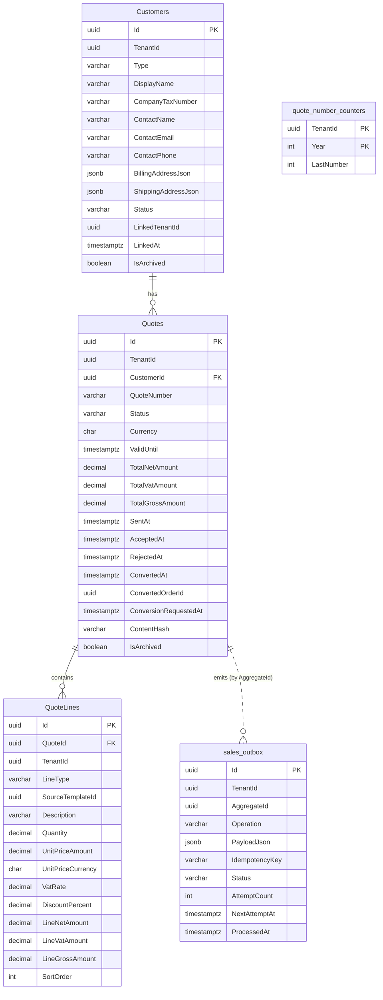

# SpaceOS — Modules.Sales Architecture
## Customer/Lead CRM + Quote Lifecycle + Quote→Order Conversion

> **Verzió:** v4.0 — 2026-05-27
> **Státusz:** ✅ **IMPLEMENTÁCIÓRA KÉSZ** (v1→v4 pipeline lezárva — 34 finding absorbed, 0 maradék CRITICAL/HIGH)
> **Blokkoló feltétel (külső, Sales-en kívül):** Joinery internal order-creation endpoint (idempotent, TenantId header-body strict equal) · Kernel `/api/internal/tenants/{id}` minimal-info contract · Keycloak IdP VPS deployed · Modules.Identity DEPLOYED
> **Kumulált review:** v1 Draft · v2 `/database-designer`+`/database-schema-designer` ✅ (12) · v3 `/senior-security` ✅ (12) · v4 `/senior-backend` ✅ (10) — **összesen 34 finding absorbed**
> **Referencia:** `SpaceOS_Modules_Cutting_Core_Architecture_v4.md` (strukturális precedens) · `SpaceOS_Modules_Identity_Architecture_v4.md` (module-service + outbox + tenant-scoping precedens) · `SpaceOS_Ecosystem_Actor_Architecture_v4.md` (EndCustomer/Client actor) · `Codebase_Status_20260527.md` (2026-04-30 topológia)
> **Repo:** `spaceos-modules-sales` (új polyrepo)
> **DB schema:** `spaceos_sales` (önálló PostgreSQL 16 schema)
> **Port:** 5009 (systemd, loopback-only — 5007/5008 deferred, 5009 az első szabad slot)
> **Becsült effort:** ~12 nap (v1) → ~14 (v2) → ~16.5 (v3) → ~17.5 nap (v4) · §13 track-szintű implementáció: **~20.5 nap**
> **Test baseline:** 3 761+ backend pass (Codebase_Status_20260527 szerint)

---

## 1. Kumulált Finding Összesítő (v1 → v4)

| Review | Finding-ek | Legfontosabb javítás | Effort delta |
|--------|-----------|----------------------|--------------|
| v1 Draft | — | Domain modell + DDL + API surface + ADR-039 outbox pattern | 12 nap (baseline) |
| v1 → `/database-designer` + `/database-schema-designer` → v2 | **12** (3 🔴 · 6 🟠 · 3 🟡) | Quote/QuoteLine immutability trigger-ek, `fn_next_quote_number()` race-free generator, worker connection split (BYPASSRLS), totals math CHECK constraint-ok | +2 nap → 14 nap |
| v2 → `/senior-security` → **v3 (jelen)** | **12** (2 🔴 · 6 🟠 · 4 🟡) | Joinery receiver header-body assert (SEC-S-01), Customer link kétoldalú handshake (SEC-S-02), worker tenant DiD assert (SEC-S-03), JWT lockdown (SEC-S-05), rate limiter (SEC-S-06), durable audit log (SEC-S-08), CompleteConversion archive guard (SEC-S-11) | **+2.5 nap → 16.5 nap** |
| v3 → `/senior-backend` → **v4 (jelen — IMPLEMENTÁCIÓRA KÉSZ)** | **10** (0 🔴 · 5 🟠 · 5 🟡) | Optimistic concurrency (`xmin`), event-dispatch same-tx audit (eShop deferred), worker tx-restructure (lock nélküli HTTP), enum `HasConversion<string>`, archive-during-conversion guard | **+1 nap → 17.5 nap (blended) / 20.5 nap (track)** |
| **Pipeline lezárva** | **34 finding** | 0 maradék CRITICAL/HIGH | **§13: ~20.5 nap implementáció** |

### Finding részletek (v1 — DRAFT)

A v1 saját ön-jelzései (a v2-v4 review-k validálni / felülírni fogják):

| ID | Súly | Terület | Probléma / nyitott pont | Tervezett megoldás |
|----|------|---------|-------------------------|--------------------|
| OPEN-01 | 🟡 MEDIUM | Joinery dependency | A Sales→Joinery konverzió feltételezi egy idempotent `POST /joinery/internal/orders/from-quote` endpoint létezését Joinery oldalon — ez ma nincs | v2 előtt: Joinery contract változás külön kis ADR-ben (ADR-039 függeléke) |
| OPEN-02 | 🟡 MEDIUM | Quote expiry | Az FSM-ben nincs `Expired` állapot (a user-spec szerint Draft/Sent/Accepted/Rejected/Converted) — funnel-pontossághoz idővel kell | v2/v3 review felvetheti; v1-ben kihagyva |
| OPEN-03 | 🟡 MEDIUM | Sequential QuoteNumber | Per-tenant monoton számozás (`Q-{YYYY}-{NNNNN}`) generálása race-condition-mentesen | `quote_number_counters` tábla + `pg_advisory_xact_lock(tenantHash)` — v2 fogja validálni |
| OPEN-04 | 🟠 HIGH | Outbox tenant context | A `SalesIntegrationWorker` BYPASSRLS role-lal poll-ol; per üzenet explicit `set_config('app.tenant_id', ...)` kell, hogy a `Quote` mutáció továbbra is tenant-scoped legyen (ADR-024 minta) | Worker implementáció: tx-en belül set_config a message.TenantId-vel |
| OPEN-05 | 🟠 HIGH | Idempotency-key tárolás | A Joinery oldali idempotency map (QuoteId → OrderId) hol él, meddig, hogyan tisztul? | Joinery felelőssége, de Sales szempontjából: a retry tetszőlegesen ismételhető legyen — v3 senior-security review |
| OPEN-06 | 🟡 MEDIUM | ContentHash scope | Quote.Send() pillanatban freeze: a hash mit fed le? (lines + customer snapshot + totals) | v1: lines + totals + customer reference; customer adatváltozás után a Sent Quote attól még a hash-elt állapotot tükrözi |

### Finding részletek (v2 — DB review ABSORBED)

| ID | Súly | Probléma | Megoldás (v2-be beillesztve) |
|----|------|----------|------------------------------|
| **DB-S-01** | 🔴 CRITICAL | Quote-immutability ma csak app-szintű (`ContentHash`); a `spaceos_sales_app` role direkt SQL UPDATE-tel felülírhatja a totalokat egy Sent Quote-on | Új `spaceos_sales.fn_prevent_quote_content_update()` BEFORE UPDATE trigger — Sent után csak FSM-engedélyezett oszlopok írhatók (lásd Migration S-0002) |
| **DB-S-02** | 🔴 CRITICAL | Ugyanez QuoteLine-okra: Sent után line INSERT/UPDATE/DELETE blokkolandó | Új `spaceos_sales.fn_prevent_quote_line_changes_after_sent()` BEFORE I/U/D trigger (lásd Migration S-0002) |
| **DB-S-03** | 🔴 CRITICAL | `quote_number_counters` v1-ben csak tábla — race-condition-mentes generálás SQL helyer nincs | Új `spaceos_sales.fn_next_quote_number(uuid, int)` PL/pgSQL function `pg_advisory_xact_lock(hashtext(tenant\|\|year))` + UPSERT RETURNING (lásd Migration S-0002); `QuoteNumberGenerator` (C#) ezt hívja |
| **DB-S-04** | 🟠 HIGH | `SalesIntegrationWorker` ma a default `SalesDbContext`-et használja (`spaceos_sales_app` role) — ADR-024 külön connection string + BYPASSRLS role-t ír elő | `SalesDb_Worker` connection string (`spaceos_sales_worker` role-lal) + `IDbContextFactory<SalesDbContext>` worker DI-ben (lásd §7c) |
| **DB-S-05** | 🟠 HIGH | `Quotes.Currency char(3)` — nincs ISO 4217 formátum CHECK | `CHECK ("Currency" ~ '^[A-Z]{3}$')` |
| **DB-S-06** | 🟠 HIGH | `ContentHash varchar(64)` — SHA-256 hex pontosan 64 char | `char(64)` |
| **DB-S-07** | 🟠 HIGH | Domain-számolta totalokat semmi nem védi DB-szinten | `CHECK ("LineGrossAmount" = "LineNetAmount" + "LineVatAmount")` QuoteLine-on; `CHECK ("TotalGrossAmount" = "TotalNetAmount" + "TotalVatAmount")` Quote-on |
| **DB-S-08** | 🟠 HIGH | `sales_outbox.PayloadJson` nincs méret-CHECK | `CHECK (octet_length("PayloadJson"::text) <= 65536)` (64KB) |
| **DB-S-09** | 🟠 HIGH | `FK_QuoteLines_Quote ON DELETE CASCADE` ütközik a DB-S-02 trigger-rel | `ON DELETE RESTRICT` — soft archive only; hard tenant-delete dedikált procedure-rel (jövőbeli) |
| **DB-S-10** | 🟡 MEDIUM | Nincs CRM-search index a `Customers.ContactEmail`-en | `IX_Customers_Tenant_Email` filtered `WHERE "ContactEmail" IS NOT NULL` |
| **DB-S-11** | 🟡 MEDIUM | `quote_number_counters` RLS-döntés | A counter csak a `fn_next_quote_number()` function-ön át érhető el; az app role direkt grant-ot a táblára nem kap → RLS nem kell (dokumentálva) |
| **DB-S-12** | 🟡 MEDIUM | OPEN-04 (worker tenant context) DDL-szintű proof-ja | v4-re kerül integration teszt fixture-ként (cross-tenant outbox stress) |

### v1 → v2 átkerült házifeladat-jelölések

- OPEN-04 → DB-S-04 + DB-S-12 abszorbálta
- v1 §5 záró „TODO v2" trigger-jelölések → DB-S-01 + DB-S-02 abszorbálta (lásd Migration S-0002)

### Finding részletek (v3 — Security review ABSORBED)

| ID | Súly | Probléma | Megoldás (v3-ba beillesztve) |
|----|------|----------|------------------------------|
| **SEC-S-01** | 🔴 CRITICAL | Joinery receiver-nél nincs előírva header-vs-body TenantId konzisztencia; idempotency-key scope nem `(TenantId, Key)` | Joinery-PR előírás (ADR-039 függelék): `X-SpaceOS-TenantId` header strict equal `request.TenantId` body (HTTP 400 különbözés esetén); idempotency tárolás compound kulcson; **Sales oldalon:** `JoineryOrderConversionClient` mindkét értéket azonosan állítja be (lásd §7a.3); §7.1 sequence diagram pontosítva |
| **SEC-S-02** | 🔴 CRITICAL | `LinkCustomerToActor` egyoldalú → forge B2BHandshake | Új `LinkVerificationStatus { None, Pending, Verified }` Customer aggregate-en (lásd §4.1). A naiv „target-tenant verify endpoint" a cross-tenant RLS-határba ütközne (tenant B nem látja A Customer-rekordját), ezért a **verifikáció a Kernel B2BHandshake registry-ből származtatott**: `LinkToPlatformActor(targetTenantId, handshakeVerified)` → `Verified` ha a Kernel-nél már van igazolt handshake A↔B között, különben `Pending`; `MarkLinkVerified()` promótálja a Pending-et amint a handshake létrejön (handler hívja Kernel-read után). Downstream kizárólag `Verified` link-et használhat. Új `POST /sales/api/customers/{id}/link/refresh` endpoint (lásd §6.1) |
| **SEC-S-03** | 🟠 HIGH | Worker `CompleteConversion` előtt nincs explicit `msg.TenantId == quote.TenantId` assert | `SalesIntegrationWorker.ProcessBatchAsync` minden message-nél: explicit `if (quote.TenantId != msg.TenantId) throw new SecurityException(...)` a FSM-átmenet előtt (lásd §7a.2); BYPASSRLS connection ellenére DiD garancia |
| **SEC-S-04** | 🟠 HIGH | Nincs dokumentált secrets-policy | Új §9.x „Secrets management" szekció: env-var / systemd `LoadCredential`, rotációs ciklusok, audit |
| **SEC-S-05** | 🟠 HIGH | JWT validation túl megengedő — algorithm confusion potenciál | `Program.cs` JWT bearer: `ValidateAudience=true`, `ValidAudiences=["sales-api"]`, `ValidIssuer=<KC realm URL>`, `ValidAlgorithms=["RS256"]` whitelist (lásd §7c) |
| **SEC-S-06** | 🟠 HIGH | Nincs rate limiter | `AddRateLimiter`: per-tenant 100 req/min sliding window, `/sales/api/quotes/{id}/convert` szigorúbb (10 req/min/tenant), per-IP 1000 req/min fallback (lásd §7c) |
| **SEC-S-07** | 🟠 HIGH | Handler-szintű tenant-scope DiD nem explicit | Új `ITenantContext` accessor + `EnsureSameTenant(entity)` extension (lásd §7a.0); RLS marad, de cross-tenant kérés Result.Forbidden, nem Result.NotFound |
| **SEC-S-08** | 🟠 HIGH | Nincs durable audit log → Escrow / GDPR / vita-feloldás vakon | Új `sales_audit_log` tábla (S-0003 migration, lásd §5.x); minden FSM event handler ide ír (aktor JWT sub, tenant, aggregate, művelet, payload SHA-256 hash); append-only GRANT (no UPDATE/DELETE) |
| **SEC-S-09** | 🟡 MEDIUM | `IActorDirectoryPort` korlátlanul lekérdezhető | Kernel-PR előírás (ADR-039 függelék): minimal-info contract (TenantType + DisplayName), per-pár audit log; **Sales oldalon:** `IActorDirectoryPort` szerződés szűkítve (csak `TenantId`, `TenantType`, `DisplayName` mezők, lásd §4.7) |
| **SEC-S-10** | 🟡 MEDIUM | Logging-ban payload / ex.Message PII-leak potenciál | Strukturált logging policy: `log.LogWarning("Outbox message {MessageId} failed (attempt {Attempt}, errorType {ErrorType})", msg.Id, msg.AttemptCount, ex.GetType().Name)` — semmi payload, semmi külső `ex.Message`; `redact-payload-from-logs` rule (lásd §7a.2) |
| **SEC-S-11** | 🟠 HIGH | `Quote.CompleteConversion` nem ellenőrzi `IsArchived` → race window | Aggregate guard: `if (IsArchived) return Result.Invalid("Cannot complete conversion on archived quote.")` (lásd §4.2); a worker `FailConversion`-be esik, admin alert |
| **SEC-S-12** | 🟡 MEDIUM | Nincs per-tenant quota | v1 soft quota policy: `Customer ≤ 10 000 / tenant`, `Quote ≤ 50 000 / tenant`; tenant-attribútum override (paid tier); handler-szintű ellenőrzés Create-eknél (lásd §7a.4) |

### v2 → v3 átkerült házifeladat-jelölések

- OPEN-01 (Joinery receiver létezése) → SEC-S-01 kibővítette explicit security-szerződéssel (ADR-039 függelék)
- OPEN-05 (idempotency-key storage) → SEC-S-01 lezárta (compound `(TenantId, Key)` kulcs)

### Finding részletek (v4 — Backend review ABSORBED)

| ID | Súly | Probléma | Megoldás (v4-be beillesztve) |
|----|------|----------|------------------------------|
| **BE-S-01** | 🟠 HIGH | Nincs optimistic concurrency — párhuzamos valid FSM-átmenet lost-update | `xmin` concurrency token a Quote + Customer aggregate-en (`Property<uint>("xmin").IsRowVersion()`, lásd §7b.5); `DbUpdateConcurrencyException` → 409 Conflict |
| **BE-S-02** | 🟡 MEDIUM | `QuoteConversionRequested` fogyasztó kétértelmű (dupla outbox-write kockázat) | Tisztázva §7a.1-ben: az outbox INSERT a handler explicit lépése; a domain event **kizárólag** az audit-notification-handler-t triggeli, soha nem ír outbox-ot |
| **BE-S-03** | 🟠 HIGH | Event dispatch SaveChanges után → audit külön tx-ben, crash-loss | eShop „deferred" minta: `AuditAndDispatchInterceptor` (SaveChanges interceptor) az event-eket commit ELŐTT dolgozza fel, az `sales_audit_log` INSERT ugyanabban a tranzakcióban (§7b.6) |
| **BE-S-04** | 🟡 MEDIUM | `Money` VO ↔ single-`Currency`-column mapping | Money flatten value converter: DB csak `decimal` amount-ot tárol, a Currency a `Quote.Currency`-ből (`OwnsOne` helyett converter, §7b.5) |
| **BE-S-05** | 🟡 MEDIUM | A 6 Ardalis.Specification nincs definiálva | Explicit spec-osztályok (§7a.5) `AsNoTracking()`-kal |
| **BE-S-07** | 🟠 HIGH | Worker HTTP-hívás nyitott DB-tranzakción belül (lock-hold I/O alatt) | Claim→call→complete szétválasztás: rövid claim-tx (`MarkInFlight` + 60s visibility-lease a `NextAttemptAt`-on), HTTP lock nélkül, rövid complete-tx (§7a.2 átírva) |
| **BE-S-08** | 🟡 MEDIUM | FluentValidation nincs a MediatR pipeline-ban | `ValidationBehavior<TReq,TRes>` + `LoggingBehavior` regisztráció (§7c) |
| **BE-S-10** | 🟠 HIGH | Enum int-backed C#, DDL varchar+CHECK → EF int-et írna, töri a CHECK-et | `.HasConversion<string>()` minden enum property-n (§7b.5) |
| **BE-S-11** | 🟠 HIGH | Archive pending-conversion alatt → orphan Joinery Order | `Quote.Archive` guard: tiltja ha `ConversionRequestedAt != null && Status != Converted` (§4.2 — megelőzés > kompenzáció) |
| **BE-S-12** | 🟡 MEDIUM | `Archive` guard + event hiányzik | `QuoteArchived` / `CustomerArchived` event + guard-ok (§4.1/§4.2/§4.6) |

### v3 → v4 átkerült házifeladat-jelölések

- OPEN-06 (ContentHash scope) → BE-S-04 (Money mapping) + a `ComputeContentHash` már lines+totals+customerRef-et fed; lezárva
- DB-S-12 (worker tenant proof) → BE-S-07 átstrukturálás + SEC-S-03 assert teljesíti; integration teszt a DoD-ban (G track)

---

## 2. Architekturális döntések

| # | Döntés | Választás | Indoklás |
|---|--------|-----------|----------|
| D-01 | Repo struktúra | **Önálló polyrepo** `spaceos-modules-sales` | Kernel/Joinery/Cutting/Identity mintája; önálló deploy ciklus; process isolation |
| D-02 | DB schema | **`spaceos_sales`** önálló schema | Teljes izoláció; RLS saját policy-kkel; független migration történet |
| D-03 | Port | **5009** (systemd, loopback-only) | 5007 Manufacturing, 5008 workers-identity deferred — 5009 az első szabad |
| D-04 | Aggregate-design | **`Customer` és `Quote` külön aggregate** — Quote referál Customer-re ID-vel; `QuoteLine` a Quote owned entity-je | Független életciklus, Quote saját FSM-je, small aggregate elv — Cutting `CuttingSheet` precedens |
| D-05 | Quote FSM | **Draft → Sent → Accepted/Rejected → Converted** (kanonikus, user-spec) | `Expired` állapot nincs v1-ben — OPEN-02-ben jelzett v2/v3 jelölt |
| D-06 | Quote immutability snapshot | **`Send()` időpontban `ContentHash` freeze** (lines + totals + customerRef) | Sent Quote auditálható snapshot, Cutting `CuttingSheet` minta |
| D-07 | Customer-identitás | **Tenant-private kontakt-rekord** (`spaceos_sales.Customers`, RLS-scoped); opcionális nullable `LinkedTenantId` egy platform actorhoz | Az ADR-018 `EndCustomer` **regisztrált platform-tenant**; a B2C magánszemély nem fér bele — tenant data sovereignty marad |
| D-08 | Quote-totals számítás | **Domain (C#) layer**, sosem frontend | RULE 1 (Data → Rules → Geometry): pénz-kritikus szabály a Domain-ben |
| D-09 | QuoteNumber | **Per-tenant monoton: `Q-{YYYY}-{NNNNN}`** — `quote_number_counters` tábla + advisory lock | Sales-ben generálódik, ember-olvasható, tenant-egyedi |
| D-10 | Cross-module mediation **(ADR-039 — új platform-szintű ADR)** | **Write = outbox + integration worker, idempotent receiver** · **Read = direkt szinkron loopback HTTP** | A 2026-04-30 topológia (Orchestrator AI gateway only, nginx proxy, modulok loopback HTTP-vel hívják egymást); a Kernel-mediated FlowEpic (b) **regresszió** lenne |
| D-11 | Quote→Order konverzió | **Sales-orchestrated push:** `RequestConversion()` → outbox → `SalesIntegrationWorker` → `IOrderConversionPort` (Joinery loopback) → `CompleteConversion(orderId)` | Quote sosem áll `Converted`-ben Order nélkül; at-least-once + idempotency = nincs duplikált Order, nincs elveszett konverzió |
| D-12 | Customer ↔ Platform Actor link | **Soft reference (nullable Guid + `LinkedAt` + `LinkType`)**, validálás `IActorDirectoryPort`-on át (read = sync loopback Kernel-be) | B2BHandshake/Quote-sharing seam-je; magát a link-feloldást nem kötjük cross-service FK-val |
| D-13 | Outbox / messaging library | **Kézzel írt** (Identity `kc_sync_outbox` precedens) — **nem** CAP / MassTransit / Wolverine | Lásd §2.1 Build vs. buy |
| D-14 | Multi-target | **net8.0** (tisztán szerver-oldali) | Nincs Windows-only adapter |
| D-15 | Schema-version namespace | **`SpaceOS.Modules.Sales` → 0.1**, Cabinet-minta szerint | Új modul, nem öröksége van |

### 2.1 Build vs. buy — külső ökoszisztéma kiértékelés

| Csomag | Mit ad | Licenc / állapot | SpaceOS-fit | Verdikt |
|--------|--------|------------------|-------------|---------|
| DotNetCore.CAP | Local-message-table outbox + eventbus, PG + EF Core | MIT, v10.0.1 (2026-01) | Broker-központú (RabbitMQ/Kafka/ASB) — nincs brokerünk | ❌ adopt · 📘 reference |
| Wolverine (JasperFx) | Postgres-only durable inbox/outbox + Postgres transport, EF Core + multi-tenancy | Aktív, JasperFx Support-Plan monetizáció | Teljes command/message-bus runtime — a MediatR + Minimal API helyébe lépne, konzisztencia-törés a 6 modullal | ❌ adopt · 📘 erős reference |
| MassTransit v9 | Saga, inbox/outbox, broker abstraction | v9 kommerciális (~$400/hó), v8 Apache 2.0 de EOL 2026 vége | Broker kell + licenc-csapda | ❌ |
| Polly | Retry, exponential backoff, circuit breaker | OSS, **már a stackben** (Identity 8.4.1) | Worker HTTP-hívásához direkt használat | ✅ approved use |
| QuestPDF | Quote PDF render | Community licenc (ingyenes <$1M revenue), már a stackben | PDF amúgy is Portal/Orchestrator presentation concern (Cutting Vision) | ✅ opcionális, presentation layer |

**Konklúzió:** package list **nem bővül**. A Sales outbox + worker kézzel íródik az Identity `kc_sync_outbox` + `KcSyncWorkerService` precedens szerint, Polly-val a HTTP retry/backoff-ra.

### 2.2 ADR-039 — Cross-module integráció a 2026-04-30 utáni topológiában

**Szabály (platform-szintű, nem Sales-lokális):**

| Művelet típusa | Mechanizmus | Indok |
|----------------|-------------|-------|
| Cross-module **read** (query) | Direkt szinkron loopback HTTP (`http://127.0.0.1:{port}/...`) | Idempotens, nincs állapotváltás, nincs dual-write kockázat |
| Cross-module **write** (state-changing) | Outbox tábla + integration worker + idempotent receiver (`Idempotency-Key` header) | Money-adjacent/elveszthetetlen művelet; at-least-once + idempotency = no dup / no loss |

A Kernel-mediated FlowEpic (régi ADR-010 Orchestrator-mediated) **kizárt** — regresszió lenne a 2026-04-30 topológiához. A Sales az első alkalmazó; minden későbbi cross-module integrációnak ezt a mintát kell követnie.

---

## 3. Scope határ

### v1 (ez a dokumentum)

| Fogalom | Tartalom | Státusz kezelés |
|---------|----------|-----------------|
| **Customer** | Tenant-private kontakt: CRM-rekord, B2B/B2C, opcionális platform actor link | Lead → Active → Inactive |
| **Quote** | Árajánlat FSM-mel, lines + totals (Domain-computed) | Draft → Sent → Accepted/Rejected → Converted |
| **QuoteLine** | Owned entity, line totals + VAT | — |
| **Pipeline read-model** | Sales world dashboard funnel: count + amount per QuoteStatus | — |
| **Quote→Order konverzió** | Outbox + worker → Joinery loopback (ADR-039) | RequestConversion → CompleteConversion / FailConversion |

### NEM scope (későbbi)

| Fogalom | Hova tartozik | Megjegyzés |
|---------|---------------|------------|
| Order aggregate | Joinery (`/joinery/api/orders`) | Sales sosem birtokol Order-t |
| Payment / Escrow | Kernel ESCROW | Quote `Converted` után |
| Product template | Modules.Abstractions | Sales line-ok `SourceTemplateId`-vel soft-referálnak |
| B2BHandshake activation | Kernel ecosystem | Sales csak a `LinkedTenantId` seam-et tartja |
| Sales pipeline ML / forecast | Future analytics | v1: csak count + sum funnel |
| Multi-currency conversion | Future | v1: per-quote single currency (Customer alapérték), pl. HUF |

---

## 4. Domain modell

### Solution struktúra

```
spaceos-modules-sales/
├── SpaceOS.Modules.Sales.Domain/
│   ├── Aggregates/
│   │   ├── Customer.cs
│   │   └── Quote.cs
│   ├── Entities/
│   │   └── QuoteLine.cs
│   ├── ValueObjects/
│   │   ├── Money.cs
│   │   ├── QuoteNumber.cs
│   │   ├── Email.cs
│   │   ├── PhoneNumber.cs
│   │   └── Address.cs
│   ├── Enums/
│   │   ├── CustomerType.cs
│   │   ├── CustomerStatus.cs
│   │   ├── QuoteStatus.cs
│   │   └── QuoteLineType.cs
│   ├── Events/                  (11 domain event)
│   ├── Interfaces/
│   │   ├── ICustomerRepository.cs
│   │   ├── IQuoteRepository.cs
│   │   └── IQuoteNumberGenerator.cs
│   └── Common/
│       └── TenantScopedEntity.cs (Kernel/Joinery minta)
├── SpaceOS.Modules.Sales.Application/
│   ├── Customers/                (commands, queries, validators, handlers)
│   ├── Quotes/                   (commands, queries, validators, handlers)
│   ├── Pipeline/                 (funnel read-model)
│   ├── EventHandlers/
│   ├── Specifications/
│   └── DTOs/
├── SpaceOS.Modules.Sales.Abstractions/
│   ├── Ports/
│   │   ├── IOrderConversionPort.cs   (write — Joinery)
│   │   └── IActorDirectoryPort.cs    (read  — Kernel)
│   └── Contracts/
│       ├── OrderConversionRequest.cs
│       └── OrderConversionResult.cs
├── SpaceOS.Modules.Sales.Infrastructure/
│   ├── Persistence/
│   │   ├── SalesDbContext.cs
│   │   ├── Configurations/
│   │   └── Migrations/           (S-0001)
│   ├── Security/
│   │   ├── TenantSessionInterceptor.cs
│   │   └── InternalHeaderMiddleware.cs   (csak internal endpoint-okra alkalmazva)
│   ├── Repositories/
│   ├── Outbox/
│   │   ├── OutboxMessage.cs
│   │   ├── OutboxRepository.cs
│   │   └── SalesIntegrationWorker.cs     (BackgroundService — ADR-024 BYPASSRLS)
│   ├── Generators/
│   │   └── QuoteNumberGenerator.cs       (advisory lock)
│   └── Adapters/
│       ├── JoineryOrderConversionClient.cs   (IOrderConversionPort impl, Polly retry)
│       └── KernelActorDirectoryClient.cs     (IActorDirectoryPort impl)
├── SpaceOS.Modules.Sales.Api/
│   ├── Endpoints/
│   ├── Program.cs
│   └── appsettings*.json
└── SpaceOS.Modules.Sales.Tests/        (xUnit v3 + Moq)
```

### 4.1 Customer aggregate

```csharp
// Domain/Aggregates/Customer.cs
public sealed class Customer : TenantScopedEntity
{
    public CustomerType Type { get; private set; }
    public string DisplayName { get; private set; } = default!;       // max 200
    public string? CompanyTaxNumber { get; private set; }              // max 50, Company only
    public string ContactName { get; private set; } = default!;        // max 200
    public Email? ContactEmail { get; private set; }
    public PhoneNumber? ContactPhone { get; private set; }
    public Address? BillingAddress { get; private set; }
    public Address? ShippingAddress { get; private set; }

    public CustomerStatus Status { get; private set; }

    // D-07/D-12 + SEC-S-02: optional soft link to platform actor (Kernel-handshake-derived trust)
    public Guid? LinkedTenantId { get; private set; }
    public DateTimeOffset? LinkedAt { get; private set; }
    public LinkVerificationStatus LinkStatus { get; private set; } = LinkVerificationStatus.None;
    public DateTimeOffset? LinkVerifiedAt { get; private set; }

    public string? Notes { get; private set; }                          // max 2000
    public bool IsArchived { get; private set; }
    public DateTimeOffset CreatedAt { get; private set; }
    public string CreatedBy { get; private set; } = default!;           // JWT sub
    public DateTimeOffset? UpdatedAt { get; private set; }

    private Customer() { } // EF Core

    public static Result<Customer> Create(
        Guid tenantId, CustomerType type, string displayName, string contactName,
        Email? email, PhoneNumber? phone, string createdBy, IClock clock)
    {
        if (string.IsNullOrWhiteSpace(displayName) || displayName.Length > 200)
            return Result.Invalid(new ValidationError("DisplayName: 1..200 char required."));
        if (string.IsNullOrWhiteSpace(contactName) || contactName.Length > 200)
            return Result.Invalid(new ValidationError("ContactName: 1..200 char required."));

        return Result.Success(new Customer
        {
            Id = Guid.NewGuid(),
            TenantId = tenantId,
            Type = type,
            DisplayName = displayName,
            ContactName = contactName,
            ContactEmail = email,
            ContactPhone = phone,
            Status = CustomerStatus.Lead,
            IsArchived = false,
            CreatedAt = clock.UtcNow,
            CreatedBy = createdBy
        }.WithEvent(c => new CustomerRegistered(c.Id, tenantId, type)));
    }

    public Result UpdateContact(
        string contactName, Email? email, PhoneNumber? phone, IClock clock)
    {
        if (IsArchived) return Result.Invalid(new ValidationError("Customer is archived."));
        ContactName = contactName;
        ContactEmail = email;
        ContactPhone = phone;
        UpdatedAt = clock.UtcNow;
        AddDomainEvent(new CustomerUpdated(Id, TenantId));
        return Result.Success();
    }

    public Result LinkToPlatformActor(Guid platformTenantId, bool handshakeVerified, IClock clock)
    {
        if (platformTenantId == Guid.Empty)
            return Result.Invalid(new ValidationError("PlatformTenantId required."));
        if (platformTenantId == TenantId)
            return Result.Invalid(new ValidationError("Cannot link customer to its own tenant."));
        if (LinkedTenantId.HasValue)
            return Result.Invalid(new ValidationError("Customer already linked."));

        LinkedTenantId = platformTenantId;
        LinkedAt = clock.UtcNow;
        // SEC-S-02: trusted ONLY if Kernel already has a verified B2B handshake A↔B; else Pending
        LinkStatus = handshakeVerified
            ? LinkVerificationStatus.Verified
            : LinkVerificationStatus.Pending;
        LinkVerifiedAt = handshakeVerified ? clock.UtcNow : null;
        AddDomainEvent(new CustomerLinkRequested(Id, TenantId, platformTenantId, LinkStatus));
        return Result.Success();
    }

    // SEC-S-02: promote Pending → Verified once a Kernel handshake is confirmed (handler-driven,
    // after IActorDirectoryPort read). No cross-tenant mutation — trust derives from Kernel registry.
    public Result MarkLinkVerified(IClock clock)
    {
        if (LinkStatus != LinkVerificationStatus.Pending)
            return Result.Invalid(new ValidationError("No pending link to verify."));
        LinkStatus = LinkVerificationStatus.Verified;
        LinkVerifiedAt = clock.UtcNow;
        AddDomainEvent(new CustomerLinkVerified(Id, TenantId, LinkedTenantId!.Value));
        return Result.Success();
    }

    public Result UnlinkFromPlatformActor()
    {
        if (!LinkedTenantId.HasValue)
            return Result.Invalid(new ValidationError("Customer is not linked."));
        LinkedTenantId = null;
        LinkedAt = null;
        LinkStatus = LinkVerificationStatus.None;
        LinkVerifiedAt = null;
        AddDomainEvent(new CustomerUnlinkedFromActor(Id, TenantId));
        return Result.Success();
    }

    public Result Promote(IClock clock)
    {
        if (Status == CustomerStatus.Active) return Result.Success();
        if (Status == CustomerStatus.Inactive)
            return Result.Invalid(new ValidationError("Cannot promote inactive customer; reactivate first."));
        Status = CustomerStatus.Active;
        UpdatedAt = clock.UtcNow;
        return Result.Success();
    }

    public Result Deactivate(IClock clock)
    {
        if (Status == CustomerStatus.Inactive) return Result.Success();
        Status = CustomerStatus.Inactive;
        UpdatedAt = clock.UtcNow;
        return Result.Success();
    }

    public Result Archive(IClock clock)
    {
        if (IsArchived) return Result.Success();
        IsArchived = true;
        UpdatedAt = clock.UtcNow;
        AddDomainEvent(new CustomerArchived(Id, TenantId));   // BE-S-12
        return Result.Success();
    }
}
```

### 4.2 Quote aggregate (a központi FSM)

```csharp
// Domain/Aggregates/Quote.cs
public sealed class Quote : TenantScopedEntity
{
    private readonly List<QuoteLine> _lines = [];

    public Guid CustomerId { get; private set; }
    public QuoteNumber Number { get; private set; } = default!;
    public QuoteStatus Status { get; private set; }
    public string Currency { get; private set; } = "HUF";   // ISO 4217
    public DateTimeOffset? ValidUntil { get; private set; }
    public string? Notes { get; private set; }              // max 2000

    // Computed totals (Domain — RULE 1)
    public Money TotalNet { get; private set; } = default!;
    public Money TotalVat { get; private set; } = default!;
    public Money TotalGross { get; private set; } = default!;

    // Lifecycle timestamps
    public DateTimeOffset CreatedAt { get; private set; }
    public string CreatedBy { get; private set; } = default!;
    public DateTimeOffset? SentAt { get; private set; }
    public DateTimeOffset? AcceptedAt { get; private set; }
    public DateTimeOffset? RejectedAt { get; private set; }
    public string? RejectionReason { get; private set; }    // max 500
    public DateTimeOffset? ConvertedAt { get; private set; }
    public Guid? ConvertedOrderId { get; private set; }

    // ADR-039 / D-11: conversion lifecycle (outbox bookkeeping)
    public DateTimeOffset? ConversionRequestedAt { get; private set; }
    public string? ConversionFailureReason { get; private set; }

    // D-06: immutable snapshot when Sent
    public string? ContentHash { get; private set; }

    public bool IsArchived { get; private set; }
    public IReadOnlyList<QuoteLine> Lines => _lines.AsReadOnly();

    private Quote() { } // EF Core

    public static async Task<Result<Quote>> CreateAsync(
        Guid tenantId, Guid customerId, string currency, string createdBy,
        IQuoteNumberGenerator numberGen, IClock clock, CancellationToken ct)
    {
        if (customerId == Guid.Empty)
            return Result.Invalid(new ValidationError("CustomerId required."));
        if (string.IsNullOrWhiteSpace(currency) || currency.Length != 3)
            return Result.Invalid(new ValidationError("Currency must be ISO 4217 (3 chars)."));

        var number = await numberGen.NextAsync(tenantId, clock.UtcNow.Year, ct)
            .ConfigureAwait(false);

        var quote = new Quote
        {
            Id = Guid.NewGuid(),
            TenantId = tenantId,
            CustomerId = customerId,
            Number = number,
            Status = QuoteStatus.Draft,
            Currency = currency,
            TotalNet = Money.Zero(currency),
            TotalVat = Money.Zero(currency),
            TotalGross = Money.Zero(currency),
            CreatedAt = clock.UtcNow,
            CreatedBy = createdBy,
            IsArchived = false
        };
        quote.AddDomainEvent(new QuoteCreated(quote.Id, tenantId, customerId, number));
        return Result.Success(quote);
    }

    // ---------- Line mutations (Draft only) ----------
    public Result AddLine(QuoteLine line)
    {
        if (Status != QuoteStatus.Draft)
            return Result.Invalid(new ValidationError($"Cannot modify lines in {Status}."));
        if (_lines.Count >= 200)
            return Result.Invalid(new ValidationError("Maximum 200 lines per quote."));
        if (line.Currency != Currency)
            return Result.Invalid(new ValidationError("Line currency must match quote."));

        _lines.Add(line);
        RecomputeTotals();
        return Result.Success();
    }

    public Result RemoveLine(Guid lineId)
    {
        if (Status != QuoteStatus.Draft)
            return Result.Invalid(new ValidationError($"Cannot modify lines in {Status}."));
        var removed = _lines.RemoveAll(l => l.Id == lineId);
        if (removed == 0)
            return Result.NotFound($"Line {lineId} not on quote.");
        RecomputeTotals();
        return Result.Success();
    }

    // ---------- FSM transitions ----------
    public Result Send(DateTimeOffset? validUntil, IClock clock)
    {
        if (Status != QuoteStatus.Draft)
            return Result.Invalid(new ValidationError($"Cannot Send in {Status}. Expected: Draft."));
        if (_lines.Count == 0)
            return Result.Invalid(new ValidationError("Quote must have at least one line."));
        if (validUntil.HasValue && validUntil <= clock.UtcNow)
            return Result.Invalid(new ValidationError("ValidUntil must be in the future."));

        Status = QuoteStatus.Sent;
        SentAt = clock.UtcNow;
        ValidUntil = validUntil;
        ContentHash = ComputeContentHash();    // D-06
        AddDomainEvent(new QuoteSent(Id, TenantId, CustomerId));
        return Result.Success();
    }

    public Result Accept(IClock clock)
    {
        if (Status != QuoteStatus.Sent)
            return Result.Invalid(new ValidationError($"Cannot Accept in {Status}. Expected: Sent."));
        Status = QuoteStatus.Accepted;
        AcceptedAt = clock.UtcNow;
        AddDomainEvent(new QuoteAccepted(Id, TenantId, CustomerId));
        return Result.Success();
    }

    public Result Reject(string reason, IClock clock)
    {
        if (Status != QuoteStatus.Sent)
            return Result.Invalid(new ValidationError($"Cannot Reject in {Status}. Expected: Sent."));
        if (string.IsNullOrWhiteSpace(reason) || reason.Length > 500)
            return Result.Invalid(new ValidationError("RejectionReason: 1..500 char required."));
        Status = QuoteStatus.Rejected;
        RejectedAt = clock.UtcNow;
        RejectionReason = reason;
        AddDomainEvent(new QuoteRejected(Id, TenantId, reason));
        return Result.Success();
    }

    // ADR-039 / D-11: conversion is two-step (request → outbox → complete on worker callback)
    public Result RequestConversion(IClock clock)
    {
        if (Status != QuoteStatus.Accepted)
            return Result.Invalid(new ValidationError($"Cannot RequestConversion in {Status}. Expected: Accepted."));
        if (ConvertedOrderId.HasValue)
            return Result.Invalid(new ValidationError("Quote already converted."));
        if (ConversionRequestedAt.HasValue)
            return Result.Success();   // idempotent — outbox already has the message

        ConversionRequestedAt = clock.UtcNow;
        ConversionFailureReason = null;
        AddDomainEvent(new QuoteConversionRequested(Id, TenantId, CustomerId));
        return Result.Success();
    }

    public Result CompleteConversion(Guid orderId, IClock clock)
    {
        if (IsArchived)
            return Result.Invalid(new ValidationError("Cannot complete conversion on archived quote.")); // SEC-S-11
        if (Status != QuoteStatus.Accepted)
            return Result.Invalid(new ValidationError($"Cannot CompleteConversion in {Status}."));
        if (!ConversionRequestedAt.HasValue)
            return Result.Invalid(new ValidationError("Conversion was not requested."));
        if (orderId == Guid.Empty)
            return Result.Invalid(new ValidationError("OrderId required."));

        Status = QuoteStatus.Converted;
        ConvertedAt = clock.UtcNow;
        ConvertedOrderId = orderId;
        AddDomainEvent(new QuoteConverted(Id, TenantId, CustomerId, orderId));
        return Result.Success();
    }

    public Result FailConversion(string reason)
    {
        if (!ConversionRequestedAt.HasValue)
            return Result.Invalid(new ValidationError("Conversion was not requested."));
        if (Status == QuoteStatus.Converted)
            return Result.Invalid(new ValidationError("Cannot fail an already-converted quote."));

        ConversionFailureReason = reason;
        // Quote stays Accepted → user/worker can retry via RequestConversion (idempotent)
        ConversionRequestedAt = null;
        AddDomainEvent(new QuoteConversionFailed(Id, TenantId, reason));
        return Result.Success();
    }

    public Result Archive(IClock clock)
    {
        // BE-S-11: prevent orphan Joinery Order — cannot archive during a pending conversion
        if (ConversionRequestedAt.HasValue && Status != QuoteStatus.Converted)
            return Result.Invalid(new ValidationError("Cannot archive a quote with a pending conversion."));
        if (IsArchived) return Result.Success();
        IsArchived = true;
        AddDomainEvent(new QuoteArchived(Id, TenantId));   // BE-S-12
        return Result.Success();
    }

    // ---------- internals ----------
    private void RecomputeTotals()
    {
        TotalNet   = Money.Sum(_lines.Select(l => l.LineNet),   Currency);
        TotalVat   = Money.Sum(_lines.Select(l => l.LineVat),   Currency);
        TotalGross = Money.Sum(_lines.Select(l => l.LineGross), Currency);
    }

    private string ComputeContentHash()
    {
        var sb = new StringBuilder();
        sb.Append(TenantId).Append(CustomerId).Append(Number.Value).Append(Currency);
        sb.Append(TotalNet.Amount).Append(TotalVat.Amount).Append(TotalGross.Amount);
        foreach (var line in _lines.OrderBy(l => l.SortOrder))
            sb.Append(line.Description).Append(line.Quantity)
              .Append(line.UnitPrice.Amount).Append(line.VatRate)
              .Append(line.DiscountPercent ?? 0m).Append(line.LineType);
        using var sha = SHA256.Create();
        return Convert.ToHexString(sha.ComputeHash(Encoding.UTF8.GetBytes(sb.ToString())));
    }
}
```

### 4.3 QuoteLine (owned entity)

```csharp
// Domain/Entities/QuoteLine.cs
public sealed class QuoteLine
{
    public Guid Id { get; private set; }
    public Guid QuoteId { get; private set; }
    public Guid TenantId { get; private set; }
    public QuoteLineType LineType { get; private set; }
    public Guid? SourceTemplateId { get; private set; }     // soft ref → Abstractions
    public string Description { get; private set; } = default!;  // max 500 (frozen snapshot)
    public decimal Quantity { get; private set; }
    public Money UnitPrice { get; private set; } = default!;
    public decimal VatRate { get; private set; }            // pl. 0.27m for HU 27%
    public decimal? DiscountPercent { get; private set; }   // 0..1, nullable
    public int SortOrder { get; private set; }

    // Computed (RULE 1 — Domain)
    public Money LineNet   { get; private set; } = default!;
    public Money LineVat   { get; private set; } = default!;
    public Money LineGross { get; private set; } = default!;

    public string Currency => UnitPrice.Currency;

    private QuoteLine() { } // EF Core

    public static Result<QuoteLine> Create(
        Guid tenantId, QuoteLineType type, Guid? sourceTemplateId,
        string description, decimal quantity, Money unitPrice,
        decimal vatRate, decimal? discountPercent, int sortOrder)
    {
        if (string.IsNullOrWhiteSpace(description) || description.Length > 500)
            return Result.Invalid(new ValidationError("Description: 1..500 char."));
        if (quantity <= 0m)
            return Result.Invalid(new ValidationError("Quantity must be > 0."));
        if (unitPrice.Amount < 0m)
            return Result.Invalid(new ValidationError("UnitPrice must be ≥ 0."));
        if (vatRate < 0m || vatRate > 1m)
            return Result.Invalid(new ValidationError("VatRate must be 0..1."));
        if (discountPercent.HasValue && (discountPercent < 0m || discountPercent > 1m))
            return Result.Invalid(new ValidationError("DiscountPercent must be 0..1."));

        var grossBeforeDiscount = unitPrice.Amount * quantity;
        var discountAmount = grossBeforeDiscount * (discountPercent ?? 0m);
        var net = Math.Round(grossBeforeDiscount - discountAmount, 2, MidpointRounding.AwayFromZero);
        var vat = Math.Round(net * vatRate, 2, MidpointRounding.AwayFromZero);
        var gross = net + vat;

        return Result.Success(new QuoteLine
        {
            Id = Guid.NewGuid(),
            TenantId = tenantId,
            LineType = type,
            SourceTemplateId = sourceTemplateId,
            Description = description,
            Quantity = quantity,
            UnitPrice = unitPrice,
            VatRate = vatRate,
            DiscountPercent = discountPercent,
            SortOrder = sortOrder,
            LineNet   = new Money(net,   unitPrice.Currency),
            LineVat   = new Money(vat,   unitPrice.Currency),
            LineGross = new Money(gross, unitPrice.Currency)
        });
    }
}
```

### 4.4 Value Objects

```csharp
// Domain/ValueObjects/Money.cs
public readonly record struct Money(decimal Amount, string Currency)
{
    public static Money Zero(string ccy) => new(0m, ccy);
    public static Money Sum(IEnumerable<Money> items, string ccy)
        => new(items.Sum(m => m.Amount), ccy);
}

// Domain/ValueObjects/QuoteNumber.cs
// Format: Q-{YYYY}-{NNNNN} — per-tenant monoton (D-09)
public readonly record struct QuoteNumber(string Value)
{
    private static readonly Regex Pattern = new(@"^Q-\d{4}-\d{5}$", RegexOptions.Compiled);
    public static Result<QuoteNumber> From(string raw)
        => Pattern.IsMatch(raw)
            ? Result.Success(new QuoteNumber(raw))
            : Result.Invalid(new ValidationError("QuoteNumber must match Q-YYYY-NNNNN."));
}

// Domain/ValueObjects/Email.cs, PhoneNumber.cs, Address.cs — standard validated VOs
```

### 4.5 Enums

```csharp
public enum CustomerType         { Individual = 1, Company = 2 }
public enum CustomerStatus       { Lead = 1, Active = 2, Inactive = 3 }
public enum LinkVerificationStatus { None = 0, Pending = 1, Verified = 2 }   // SEC-S-02
public enum QuoteStatus          { Draft = 1, Sent = 2, Accepted = 3, Rejected = 4, Converted = 5 }
public enum QuoteLineType        { Product = 1, Service = 2, Custom = 3, Discount = 4 }
```

### 4.6 Domain Events (14 db)

```csharp
public record CustomerRegistered        (Guid CustomerId, Guid TenantId, CustomerType Type);
public record CustomerUpdated           (Guid CustomerId, Guid TenantId);
public record CustomerLinkRequested     (Guid CustomerId, Guid TenantId, Guid PlatformTenantId, LinkVerificationStatus Status);  // SEC-S-02
public record CustomerLinkVerified      (Guid CustomerId, Guid TenantId, Guid PlatformTenantId);                                 // SEC-S-02
public record CustomerUnlinkedFromActor (Guid CustomerId, Guid TenantId);
public record QuoteCreated              (Guid QuoteId, Guid TenantId, Guid CustomerId, QuoteNumber Number);
public record QuoteSent                 (Guid QuoteId, Guid TenantId, Guid CustomerId);
public record QuoteAccepted             (Guid QuoteId, Guid TenantId, Guid CustomerId);
public record QuoteRejected             (Guid QuoteId, Guid TenantId, string Reason);
public record QuoteConversionRequested  (Guid QuoteId, Guid TenantId, Guid CustomerId);   // → outbox write
public record QuoteConverted            (Guid QuoteId, Guid TenantId, Guid CustomerId, Guid OrderId);
public record QuoteConversionFailed     (Guid QuoteId, Guid TenantId, string Reason);
public record QuoteArchived             (Guid QuoteId, Guid TenantId);                  // BE-S-12
public record CustomerArchived          (Guid CustomerId, Guid TenantId);              // BE-S-12
```

### 4.7 Repository interfaces + Ports

```csharp
// Domain/Interfaces/ICustomerRepository.cs
public interface ICustomerRepository
{
    Task<Customer?> GetByIdAsync(Guid id, CancellationToken ct);
    Task<IReadOnlyList<Customer>> ListAsync(ISpecification<Customer> spec, CancellationToken ct);
    Task AddAsync(Customer customer, CancellationToken ct);
    void Update(Customer customer);
    Task<int> SaveChangesAsync(CancellationToken ct);
}

// Domain/Interfaces/IQuoteRepository.cs
public interface IQuoteRepository
{
    Task<Quote?> GetByIdAsync(Guid id, CancellationToken ct);
    Task<Quote?> GetByIdWithLinesAsync(Guid id, CancellationToken ct);
    Task<IReadOnlyList<Quote>> ListAsync(ISpecification<Quote> spec, CancellationToken ct);
    Task AddAsync(Quote quote, CancellationToken ct);
    void Update(Quote quote);
    Task<int> SaveChangesAsync(CancellationToken ct);
}

// Domain/Interfaces/IQuoteNumberGenerator.cs — Domain-szintű port (D-09)
public interface IQuoteNumberGenerator
{
    Task<QuoteNumber> NextAsync(Guid tenantId, int year, CancellationToken ct);
}

// Abstractions/Ports/IOrderConversionPort.cs — cross-module write (ADR-039)
public interface IOrderConversionPort
{
    Task<Result<OrderConversionResult>> CreateOrderFromQuoteAsync(
        OrderConversionRequest request, CancellationToken ct);
}

public sealed record OrderConversionRequest(
    Guid QuoteId,                       // idempotency key
    Guid TenantId,
    Guid CustomerId,
    Guid? LinkedTenantId,
    string Currency,
    decimal TotalNet,
    decimal TotalVat,
    decimal TotalGross,
    IReadOnlyList<OrderConversionLine> Lines,
    string ContentHash);

public sealed record OrderConversionLine(
    Guid? SourceTemplateId, string Description,
    decimal Quantity, decimal UnitPriceNet, decimal VatRate,
    decimal? DiscountPercent, int SortOrder);

public sealed record OrderConversionResult(Guid OrderId, DateTimeOffset CreatedAt);

// Abstractions/Ports/IActorDirectoryPort.cs — cross-module read (sync loopback, ADR-039 read path)
public interface IActorDirectoryPort
{
    // SEC-S-09: requesterTenantId passed so Kernel scopes the lookup + audits the (requester→target) pair.
    Task<Result<ActorDirectoryEntry>> GetTenantActorAsync(
        Guid requesterTenantId, Guid platformTenantId, CancellationToken ct);
}

// SEC-S-09: minimal info only (no contact/billing data).
// SEC-S-02: HasVerifiedHandshakeWithRequester drives Customer.LinkStatus (Verified vs Pending).
public sealed record ActorDirectoryEntry(
    Guid TenantId, string TenantType, string DisplayName, bool HasVerifiedHandshakeWithRequester);
```

---

## 5. DB schema (DDL)

### Migration S-0001 — Sales Core

```sql
-- ============================================================
-- Migration S-0001: Sales Core Schema
-- Customers + Quotes + QuoteLines + sales_outbox + quote_number_counters
-- Schema: spaceos_sales (isolated)
-- ============================================================

CREATE SCHEMA IF NOT EXISTS spaceos_sales;
SET search_path TO spaceos_sales;

-- 0a. Application role (RLS-enforced)
DO $$
BEGIN
    IF NOT EXISTS (SELECT FROM pg_roles WHERE rolname = 'spaceos_sales_app') THEN
        CREATE ROLE spaceos_sales_app LOGIN;
    END IF;
END $$;

-- 0b. Worker role (BYPASSRLS — ADR-024, narrow grants)
DO $$
BEGIN
    IF NOT EXISTS (SELECT FROM pg_roles WHERE rolname = 'spaceos_sales_worker') THEN
        CREATE ROLE spaceos_sales_worker LOGIN BYPASSRLS;
    END IF;
END $$;

GRANT USAGE ON SCHEMA spaceos_sales TO spaceos_sales_app, spaceos_sales_worker;
ALTER DEFAULT PRIVILEGES IN SCHEMA spaceos_sales
    GRANT SELECT, INSERT, UPDATE, DELETE ON TABLES TO spaceos_sales_app;

-- 1. Customers
CREATE TABLE spaceos_sales."Customers" (
    "Id"                uuid          NOT NULL PRIMARY KEY DEFAULT gen_random_uuid(),
    "TenantId"          uuid          NOT NULL,
    "Type"              varchar(20)   NOT NULL,
    "DisplayName"       varchar(200)  NOT NULL,
    "CompanyTaxNumber"  varchar(50)   NULL,
    "ContactName"       varchar(200)  NOT NULL,
    "ContactEmail"      varchar(320)  NULL,
    "ContactPhone"      varchar(50)   NULL,
    "BillingAddressJson"   jsonb      NULL,
    "ShippingAddressJson"  jsonb      NULL,
    "Status"            varchar(20)   NOT NULL DEFAULT 'Lead',
    "LinkedTenantId"    uuid          NULL,
    "LinkedAt"          timestamptz   NULL,
    "LinkStatus"        varchar(20)   NOT NULL DEFAULT 'None',     -- SEC-S-02
    "LinkVerifiedAt"    timestamptz   NULL,                        -- SEC-S-02
    "Notes"             varchar(2000) NULL,
    "IsArchived"        boolean       NOT NULL DEFAULT false,
    "CreatedAt"         timestamptz   NOT NULL DEFAULT NOW(),
    "CreatedBy"         varchar(200)  NOT NULL,
    "UpdatedAt"         timestamptz   NULL,

    CONSTRAINT "CK_Customers_Type"   CHECK ("Type" IN ('Individual','Company')),
    CONSTRAINT "CK_Customers_Status" CHECK ("Status" IN ('Lead','Active','Inactive')),
    CONSTRAINT "CK_Customers_LinkStatus"                                   -- SEC-S-02
        CHECK ("LinkStatus" IN ('None','Pending','Verified')),
    CONSTRAINT "CK_Customers_Link_Integrity"                              -- SEC-S-02
        CHECK (("LinkStatus" = 'None' AND "LinkedTenantId" IS NULL)
            OR ("LinkStatus" IN ('Pending','Verified') AND "LinkedTenantId" IS NOT NULL)),
    CONSTRAINT "CK_Customers_BillingAddress_Size"
        CHECK ("BillingAddressJson"  IS NULL OR octet_length("BillingAddressJson"::text)  <= 4096),
    CONSTRAINT "CK_Customers_ShippingAddress_Size"
        CHECK ("ShippingAddressJson" IS NULL OR octet_length("ShippingAddressJson"::text) <= 4096)
);

CREATE INDEX "IX_Customers_TenantId"        ON spaceos_sales."Customers" ("TenantId");
CREATE INDEX "IX_Customers_Tenant_Status"   ON spaceos_sales."Customers" ("TenantId", "Status")
    WHERE "IsArchived" = false;
CREATE INDEX "IX_Customers_LinkedTenant"    ON spaceos_sales."Customers" ("LinkedTenantId")
    WHERE "LinkedTenantId" IS NOT NULL;
CREATE INDEX "IX_Customers_Tenant_Email"    ON spaceos_sales."Customers" ("TenantId", "ContactEmail")
    WHERE "ContactEmail" IS NOT NULL AND "IsArchived" = false;          -- DB-S-10

-- DB-02 minta: compound unique a cross-tenant FK guard-hoz
CREATE UNIQUE INDEX "UX_Customers_Id_TenantId" ON spaceos_sales."Customers" ("Id", "TenantId");

-- 2. Quotes
CREATE TABLE spaceos_sales."Quotes" (
    "Id"                       uuid          NOT NULL PRIMARY KEY DEFAULT gen_random_uuid(),
    "TenantId"                 uuid          NOT NULL,
    "CustomerId"               uuid          NOT NULL,
    "QuoteNumber"              varchar(15)   NOT NULL,
    "Status"                   varchar(20)   NOT NULL DEFAULT 'Draft',
    "Currency"                 char(3)       NOT NULL,
    "ValidUntil"               timestamptz   NULL,
    "Notes"                    varchar(2000) NULL,

    "TotalNetAmount"           decimal(14,2) NOT NULL DEFAULT 0,
    "TotalVatAmount"           decimal(14,2) NOT NULL DEFAULT 0,
    "TotalGrossAmount"         decimal(14,2) NOT NULL DEFAULT 0,

    "CreatedAt"                timestamptz   NOT NULL DEFAULT NOW(),
    "CreatedBy"                varchar(200)  NOT NULL,
    "SentAt"                   timestamptz   NULL,
    "AcceptedAt"               timestamptz   NULL,
    "RejectedAt"               timestamptz   NULL,
    "RejectionReason"          varchar(500)  NULL,
    "ConvertedAt"              timestamptz   NULL,
    "ConvertedOrderId"         uuid          NULL,

    -- ADR-039 outbox bookkeeping
    "ConversionRequestedAt"    timestamptz   NULL,
    "ConversionFailureReason"  varchar(1000) NULL,

    -- D-06 immutability snapshot
    "ContentHash"              char(64)      NULL,

    "IsArchived"               boolean       NOT NULL DEFAULT false,

    CONSTRAINT "CK_Quotes_Status"
        CHECK ("Status" IN ('Draft','Sent','Accepted','Rejected','Converted')),
    CONSTRAINT "CK_Quotes_Totals_NonNegative"
        CHECK ("TotalNetAmount" >= 0 AND "TotalVatAmount" >= 0 AND "TotalGrossAmount" >= 0),
    CONSTRAINT "CK_Quotes_Currency_Iso4217"             -- DB-S-05
        CHECK ("Currency" ~ '^[A-Z]{3}$'),
    CONSTRAINT "CK_Quotes_Totals_Math"                  -- DB-S-07
        CHECK ("TotalGrossAmount" = "TotalNetAmount" + "TotalVatAmount"),

    -- Compound cross-tenant FK guard (DB-02 minta)
    CONSTRAINT "FK_Quotes_Customer"
        FOREIGN KEY ("CustomerId", "TenantId")
        REFERENCES spaceos_sales."Customers"("Id", "TenantId")
        ON DELETE RESTRICT
        DEFERRABLE INITIALLY DEFERRED
);

-- Per-tenant unique QuoteNumber
CREATE UNIQUE INDEX "UX_Quotes_Tenant_Number"
    ON spaceos_sales."Quotes" ("TenantId", "QuoteNumber");
CREATE INDEX "IX_Quotes_Tenant_Status"
    ON spaceos_sales."Quotes" ("TenantId", "Status")
    WHERE "IsArchived" = false;
CREATE INDEX "IX_Quotes_Tenant_Customer"
    ON spaceos_sales."Quotes" ("TenantId", "CustomerId");
CREATE INDEX "IX_Quotes_PendingConversion"
    ON spaceos_sales."Quotes" ("TenantId", "ConversionRequestedAt")
    WHERE "ConversionRequestedAt" IS NOT NULL AND "Status" = 'Accepted';

-- Compound unique for Quotes (used by QuoteLines FK)
CREATE UNIQUE INDEX "UX_Quotes_Id_TenantId" ON spaceos_sales."Quotes" ("Id", "TenantId");

-- 3. QuoteLines
CREATE TABLE spaceos_sales."QuoteLines" (
    "Id"               uuid          NOT NULL PRIMARY KEY DEFAULT gen_random_uuid(),
    "QuoteId"          uuid          NOT NULL,
    "TenantId"         uuid          NOT NULL,
    "LineType"         varchar(20)   NOT NULL,
    "SourceTemplateId" uuid          NULL,
    "Description"      varchar(500)  NOT NULL,
    "Quantity"         decimal(12,3) NOT NULL CHECK ("Quantity" > 0),
    "UnitPriceAmount"  decimal(14,2) NOT NULL CHECK ("UnitPriceAmount" >= 0),
    "UnitPriceCurrency" char(3)      NOT NULL,
    "VatRate"          decimal(5,4)  NOT NULL CHECK ("VatRate" >= 0 AND "VatRate" <= 1),
    "DiscountPercent"  decimal(5,4)  NULL CHECK ("DiscountPercent" IS NULL OR ("DiscountPercent" >= 0 AND "DiscountPercent" <= 1)),
    "LineNetAmount"    decimal(14,2) NOT NULL,
    "LineVatAmount"    decimal(14,2) NOT NULL,
    "LineGrossAmount"  decimal(14,2) NOT NULL,
    "SortOrder"        int           NOT NULL DEFAULT 0,

    CONSTRAINT "CK_QuoteLines_LineType"
        CHECK ("LineType" IN ('Product','Service','Custom','Discount')),
    CONSTRAINT "CK_QuoteLines_Totals_Math"              -- DB-S-07
        CHECK ("LineGrossAmount" = "LineNetAmount" + "LineVatAmount"),

    CONSTRAINT "FK_QuoteLines_Quote"
        FOREIGN KEY ("QuoteId", "TenantId")
        REFERENCES spaceos_sales."Quotes"("Id", "TenantId")
        ON DELETE RESTRICT                              -- DB-S-09 (volt: CASCADE)
);

CREATE INDEX "IX_QuoteLines_QuoteId"    ON spaceos_sales."QuoteLines" ("QuoteId");
CREATE INDEX "IX_QuoteLines_TenantId"   ON spaceos_sales."QuoteLines" ("TenantId");

-- 4. sales_outbox (ADR-039)
CREATE TABLE spaceos_sales."sales_outbox" (
    "Id"             uuid          NOT NULL PRIMARY KEY DEFAULT gen_random_uuid(),
    "TenantId"       uuid          NOT NULL,
    "AggregateId"    uuid          NOT NULL,             -- QuoteId
    "Operation"      varchar(50)   NOT NULL,             -- 'QuoteConversionRequested'
    "PayloadJson"    jsonb         NOT NULL,
    "IdempotencyKey" varchar(64)   NOT NULL,             -- = QuoteId.ToString("N")
    "Status"         varchar(20)   NOT NULL DEFAULT 'Pending',
    "AttemptCount"   int           NOT NULL DEFAULT 0,
    "NextAttemptAt"  timestamptz   NOT NULL DEFAULT NOW(),
    "CreatedAt"      timestamptz   NOT NULL DEFAULT NOW(),
    "ProcessedAt"    timestamptz   NULL,
    "LastError"      varchar(2000) NULL,

    CONSTRAINT "CK_SalesOutbox_Status"
        CHECK ("Status" IN ('Pending','InFlight','Completed','Failed')),
    CONSTRAINT "CK_SalesOutbox_PayloadSize"             -- DB-S-08
        CHECK (octet_length("PayloadJson"::text) <= 65536)
);

-- Polling index (worker SELECT ... FOR UPDATE SKIP LOCKED)
CREATE INDEX "IX_SalesOutbox_Pending"
    ON spaceos_sales."sales_outbox" ("NextAttemptAt")
    WHERE "Status" IN ('Pending','InFlight');

-- Per-tenant duplicate guard (idempotency at outbox layer too)
CREATE UNIQUE INDEX "UX_SalesOutbox_Tenant_Idem"
    ON spaceos_sales."sales_outbox" ("TenantId", "Operation", "IdempotencyKey");

-- 5. quote_number_counters (D-09)
CREATE TABLE spaceos_sales."quote_number_counters" (
    "TenantId"   uuid    NOT NULL,
    "Year"       int     NOT NULL,
    "LastNumber" int     NOT NULL DEFAULT 0,
    PRIMARY KEY ("TenantId", "Year")
);

-- 6. Row-Level Security (DB-05 minta: fully-qualified public.try_cast_uuid)
ALTER TABLE spaceos_sales."Customers"   ENABLE ROW LEVEL SECURITY;
ALTER TABLE spaceos_sales."Customers"   FORCE  ROW LEVEL SECURITY;
CREATE POLICY tenant_isolation_customers ON spaceos_sales."Customers"
    USING ("TenantId" = public.try_cast_uuid(current_setting('app.tenant_id', true)));

ALTER TABLE spaceos_sales."Quotes"      ENABLE ROW LEVEL SECURITY;
ALTER TABLE spaceos_sales."Quotes"      FORCE  ROW LEVEL SECURITY;
CREATE POLICY tenant_isolation_quotes ON spaceos_sales."Quotes"
    USING ("TenantId" = public.try_cast_uuid(current_setting('app.tenant_id', true)));

ALTER TABLE spaceos_sales."QuoteLines"  ENABLE ROW LEVEL SECURITY;
ALTER TABLE spaceos_sales."QuoteLines"  FORCE  ROW LEVEL SECURITY;
CREATE POLICY tenant_isolation_quote_lines ON spaceos_sales."QuoteLines"
    USING ("TenantId" = public.try_cast_uuid(current_setting('app.tenant_id', true)));

ALTER TABLE spaceos_sales."sales_outbox" ENABLE ROW LEVEL SECURITY;
ALTER TABLE spaceos_sales."sales_outbox" FORCE  ROW LEVEL SECURITY;
CREATE POLICY tenant_isolation_sales_outbox ON spaceos_sales."sales_outbox"
    USING ("TenantId" = public.try_cast_uuid(current_setting('app.tenant_id', true)));

-- DB-S-11: quote_number_counters access ONLY via SECURITY DEFINER function below.
-- No direct grants to spaceos_sales_app; RLS therefore not applied (function is sole gate).
REVOKE ALL    ON spaceos_sales."quote_number_counters" FROM PUBLIC;
REVOKE ALL    ON spaceos_sales."quote_number_counters" FROM spaceos_sales_app;
```

### Migration S-0002 — Functions & Triggers (v2 absorb: DB-S-01 · DB-S-02 · DB-S-03)

#### Sequential QuoteNumber generator (DB-S-03)

Race-condition-mentes per-tenant + per-year monoton számozás `pg_advisory_xact_lock` + UPSERT RETURNING-gel. A `QuoteNumberGenerator` (C#) ezt a function-t hívja, az advisory lock magic szám-mentes (hash-based).

```sql
CREATE OR REPLACE FUNCTION spaceos_sales.fn_next_quote_number(
    p_tenant_id uuid, p_year int)
RETURNS varchar(15)
LANGUAGE plpgsql
SECURITY DEFINER                        -- bypasses table grants; sole access path
SET search_path = spaceos_sales, pg_temp
AS $$
DECLARE
    v_lock_key bigint;
    v_next     int;
BEGIN
    IF p_tenant_id IS NULL OR p_year IS NULL THEN
        RAISE EXCEPTION 'TenantId and Year required.' USING ERRCODE = '22023';
    END IF;

    -- Per (tenant, year) advisory lock — serializes only this counter, not the whole tenant
    v_lock_key := hashtextextended(p_tenant_id::text || ':' || p_year::text, 0);
    PERFORM pg_advisory_xact_lock(v_lock_key);

    INSERT INTO spaceos_sales."quote_number_counters" ("TenantId","Year","LastNumber")
    VALUES (p_tenant_id, p_year, 1)
    ON CONFLICT ("TenantId","Year") DO UPDATE
        SET "LastNumber" = spaceos_sales."quote_number_counters"."LastNumber" + 1
    RETURNING "LastNumber" INTO v_next;

    RETURN 'Q-' || p_year || '-' || lpad(v_next::text, 5, '0');
END;
$$;

GRANT EXECUTE ON FUNCTION spaceos_sales.fn_next_quote_number(uuid,int)
    TO spaceos_sales_app;
```

#### Quote content immutability after Sent (DB-S-01)

A `ContentHash` integritás-ellenőrzés app-szintű — ezt egészíti ki DB-szintű trigger, ami a Sent után csak az FSM-engedélyezett oszlopváltozásokat enged át. A 'Status' és az FSM-vezérelte mezők (AcceptedAt, RejectedAt, ConvertedAt, ConversionRequestedAt, ConvertedOrderId, ConversionFailureReason, RejectionReason, IsArchived, ValidUntil) változhatnak.

```sql
CREATE OR REPLACE FUNCTION spaceos_sales.fn_prevent_quote_content_update()
RETURNS trigger
LANGUAGE plpgsql
AS $$
BEGIN
    IF OLD."Status" <> 'Draft' THEN
        IF  (NEW."CustomerId"        IS DISTINCT FROM OLD."CustomerId")
         OR (NEW."QuoteNumber"       IS DISTINCT FROM OLD."QuoteNumber")
         OR (NEW."Currency"          IS DISTINCT FROM OLD."Currency")
         OR (NEW."TotalNetAmount"    IS DISTINCT FROM OLD."TotalNetAmount")
         OR (NEW."TotalVatAmount"    IS DISTINCT FROM OLD."TotalVatAmount")
         OR (NEW."TotalGrossAmount"  IS DISTINCT FROM OLD."TotalGrossAmount")
         OR (NEW."ContentHash"       IS DISTINCT FROM OLD."ContentHash")
         OR (NEW."SentAt"            IS DISTINCT FROM OLD."SentAt")
         OR (NEW."CreatedAt"         IS DISTINCT FROM OLD."CreatedAt")
         OR (NEW."CreatedBy"         IS DISTINCT FROM OLD."CreatedBy")
         OR (NEW."TenantId"          IS DISTINCT FROM OLD."TenantId")
        THEN
            RAISE EXCEPTION
                'Quote content immutable after Sent — only FSM-controlled columns may change.'
                USING ERRCODE = '42501';
        END IF;
    END IF;
    RETURN NEW;
END;
$$;

CREATE TRIGGER tr_prevent_quote_content_update
    BEFORE UPDATE ON spaceos_sales."Quotes"
    FOR EACH ROW EXECUTE FUNCTION spaceos_sales.fn_prevent_quote_content_update();
```

#### QuoteLine immutability after Sent (DB-S-02)

```sql
CREATE OR REPLACE FUNCTION spaceos_sales.fn_prevent_quote_line_changes_after_sent()
RETURNS trigger
LANGUAGE plpgsql
AS $$
DECLARE
    v_status   text;
    v_quote_id uuid;
BEGIN
    v_quote_id := COALESCE(NEW."QuoteId", OLD."QuoteId");
    SELECT "Status" INTO v_status
      FROM spaceos_sales."Quotes" WHERE "Id" = v_quote_id;

    IF v_status IS NOT NULL AND v_status <> 'Draft' THEN
        RAISE EXCEPTION
            'QuoteLine % not allowed while parent Quote is %.', TG_OP, v_status
            USING ERRCODE = '42501';
    END IF;
    RETURN COALESCE(NEW, OLD);
END;
$$;

CREATE TRIGGER tr_prevent_quote_line_changes_after_sent
    BEFORE INSERT OR UPDATE OR DELETE ON spaceos_sales."QuoteLines"
    FOR EACH ROW EXECUTE FUNCTION spaceos_sales.fn_prevent_quote_line_changes_after_sent();
```

> **Megjegyzés:** a DB-S-09 miatti FK `ON DELETE RESTRICT` garantálja, hogy a parent Quote DELETE-je nem indít CASCADE-et a QuoteLine trigger-be. Hard tenant-delete dedikált procedure-be kerül (jövőbeli ADR — admin-only, audit log-olt).

### Migration S-0003 — Audit Log (v3 absorb: SEC-S-08)

Append-only audit log minden FSM-átmenethez és Customer-mutációhoz. Az Escrow (RULE 3) + GDPR + vita-feloldás megköveteli. **Nincs** raw PII a táblában — csak az event payload SHA-256 hash-e (tamper-evidence), az aktor (JWT sub) és a metaadat.

```sql
-- ============================================================
-- Migration S-0003: Audit Log (SEC-S-08)
-- Append-only — no UPDATE/DELETE grant to app or worker role
-- ============================================================
CREATE TABLE spaceos_sales."sales_audit_log" (
    "Id"            bigint        GENERATED ALWAYS AS IDENTITY PRIMARY KEY,
    "TenantId"      uuid          NOT NULL,
    "ActorSub"      varchar(200)  NOT NULL,         -- JWT sub, or 'worker:integration'
    "AggregateType" varchar(50)   NOT NULL,         -- 'Quote' | 'Customer'
    "AggregateId"   uuid          NOT NULL,
    "Operation"     varchar(50)   NOT NULL,         -- 'QuoteSent','QuoteConverted','CustomerLinkVerified', ...
    "PayloadHash"   char(64)      NOT NULL,         -- SHA-256 of event payload (no raw PII)
    "OccurredAt"    timestamptz   NOT NULL DEFAULT NOW(),

    CONSTRAINT "CK_SalesAudit_AggregateType"
        CHECK ("AggregateType" IN ('Quote','Customer'))
);

CREATE INDEX "IX_SalesAudit_Tenant_Aggregate"
    ON spaceos_sales."sales_audit_log" ("TenantId", "AggregateType", "AggregateId");
CREATE INDEX "IX_SalesAudit_Tenant_Occurred"
    ON spaceos_sales."sales_audit_log" ("TenantId", "OccurredAt");

-- RLS FORCE (tenant isolation)
ALTER TABLE spaceos_sales."sales_audit_log" ENABLE ROW LEVEL SECURITY;
ALTER TABLE spaceos_sales."sales_audit_log" FORCE  ROW LEVEL SECURITY;
CREATE POLICY tenant_isolation_sales_audit ON spaceos_sales."sales_audit_log"
    USING ("TenantId" = public.try_cast_uuid(current_setting('app.tenant_id', true)));

-- Append-only: INSERT + SELECT only; never UPDATE/DELETE (SEC-S-08)
REVOKE UPDATE, DELETE ON spaceos_sales."sales_audit_log"
    FROM spaceos_sales_app, spaceos_sales_worker;
GRANT  SELECT, INSERT  ON spaceos_sales."sales_audit_log"
    TO   spaceos_sales_app, spaceos_sales_worker;
```

> Az audit-író egy MediatR `INotificationHandler<T>` minden FSM-event-re; a worker (BYPASSRLS) az `OccurredAt`/`TenantId`-t a message-context-ből tölti. A `PayloadHash` az event JSON SHA-256-ja — így a tartalom igazolható PII-tárolás nélkül.

### ERD (Mermaid)



---

## 6. API surface

### 6.1 Customer endpoints

| Method | Path | Handler | RBAC | Megjegyzés |
|--------|------|---------|------|------------|
| `POST` | `/sales/api/customers` | CreateCustomer | TenantAdmin, SalesUser | Status = Lead alapból |
| `GET` | `/sales/api/customers/{id}` | GetCustomer | TenantUser+ | — |
| `GET` | `/sales/api/customers` | ListCustomers | TenantUser+ | Filtered: status, type, search. Paged |
| `PUT` | `/sales/api/customers/{id}/contact` | UpdateCustomerContact | TenantAdmin, SalesUser | — |
| `PUT` | `/sales/api/customers/{id}/addresses` | UpdateCustomerAddresses | TenantAdmin, SalesUser | — |
| `POST` | `/sales/api/customers/{id}/link` | LinkCustomerToActor | TenantAdmin | SEC-S-02: Kernel handshake-check → `Pending` vagy `Verified` |
| `POST` | `/sales/api/customers/{id}/link/refresh` | RefreshCustomerLink | TenantAdmin | SEC-S-02: `Pending` → `Verified`, ha közben létrejött a Kernel handshake |
| `DELETE` | `/sales/api/customers/{id}/link` | UnlinkCustomerFromActor | TenantAdmin | — |
| `PUT` | `/sales/api/customers/{id}/promote` | PromoteCustomer | TenantAdmin, SalesUser | Lead → Active |
| `PUT` | `/sales/api/customers/{id}/deactivate` | DeactivateCustomer | TenantAdmin | Active → Inactive |
| `DELETE` | `/sales/api/customers/{id}` | ArchiveCustomer | TenantAdmin | Soft delete |

### 6.2 Quote endpoints

| Method | Path | Handler | RBAC | Megjegyzés |
|--------|------|---------|------|------------|
| `POST` | `/sales/api/quotes` | CreateQuote | TenantAdmin, SalesUser | Status = Draft |
| `GET` | `/sales/api/quotes/{id}` | GetQuote | TenantUser+ | Includes lines |
| `GET` | `/sales/api/quotes` | ListQuotes | TenantUser+ | Filtered: status, customerId, dateRange. Paged |
| `POST` | `/sales/api/quotes/{id}/lines` | AddQuoteLine | TenantAdmin, SalesUser | Csak Draft |
| `PUT` | `/sales/api/quotes/{id}/lines/{lineId}` | UpdateQuoteLine | TenantAdmin, SalesUser | Csak Draft |
| `DELETE` | `/sales/api/quotes/{id}/lines/{lineId}` | RemoveQuoteLine | TenantAdmin, SalesUser | Csak Draft |
| `POST` | `/sales/api/quotes/{id}/send` | SendQuote | TenantAdmin, SalesUser | Draft → Sent + ContentHash freeze |
| `POST` | `/sales/api/quotes/{id}/accept` | AcceptQuote | TenantAdmin, SalesUser | Sent → Accepted |
| `POST` | `/sales/api/quotes/{id}/reject` | RejectQuote | TenantAdmin, SalesUser | Sent → Rejected (reason kötelező) |
| `POST` | `/sales/api/quotes/{id}/convert` | RequestConversion | TenantAdmin, SalesUser | Accepted → outbox push (202 Accepted) |
| `DELETE` | `/sales/api/quotes/{id}` | ArchiveQuote | TenantAdmin | Soft delete |

### 6.3 Pipeline read-model

| Method | Path | Handler | RBAC | Megjegyzés |
|--------|------|---------|------|------------|
| `GET` | `/sales/api/pipeline/funnel` | GetSalesFunnel | TenantUser+ | Count + sum(TotalGross) status szerint, opcionális dateRange |
| `GET` | `/sales/api/pipeline/conversion-rate` | GetConversionRate | TenantUser+ | Sent→Accepted, Accepted→Converted aránya |

**Összesen: 24 endpoint** (11 Customer + 11 Quote + 2 Pipeline)

---

## 7. Integration — cross-module szekvenciák (NEW topology)

### 7.1 Quote → Order konverzió (ADR-039 — outbox + worker, NO Orchestrator)

```
Portal (Sales world)        nginx          Sales :5009                                 Joinery :5002
   │                          │                  │                                          │
   │  POST /sales/api/quotes/ │                  │                                          │
   │  {id}/convert (JWT) ──→  ├─ proxy ───────→  │                                          │
   │                          │   ConvertQuoteCommandHandler                                │
   │                          │     tx-on belül:                                            │
   │                          │       1. Quote.RequestConversion()  (Quote: Accepted marad) │
   │                          │       2. INSERT sales_outbox (QuoteConversionRequested)     │
   │                          │       3. PopDomainEvents() → DispatchAsync                  │
   │  ←── 202 Accepted ───────┤   (Quote pending — UI polling vagy SignalR utólag)         │
   │                          │                  │                                          │
   │     [async — SalesIntegrationWorker, BYPASSRLS, polling SELECT FOR UPDATE SKIP LOCKED] │
   │                          │                  │                                          │
   │                          │                  │  worker tx:                              │
   │                          │                  │   set_config('app.tenant_id', msg.TenantId)
   │                          │                  │   Status = InFlight, AttemptCount++       │
   │                          │                  │                                          │
   │                          │                  ├─ POST http://127.0.0.1:5002/joinery/internal/orders/from-quote
   │                          │                  │   Headers:                              │
   │                          │                  │     X-SpaceOS-Internal: <secret>        │
   │                          │                  │     X-SpaceOS-TenantId: <tenant>        │
   │                          │                  │     Idempotency-Key: <QuoteId>          │
   │                          │                  │   Body: OrderConversionRequest ───────→ │
   │                          │                  │                          [SEC-S-01] assert header TenantId == body TenantId (else 400)
   │                          │                  │                          Order.CreateFromQuote() — idempotent on (TenantId, Idempotency-Key)
   │                          │                  │  ←── 201 { orderId } ───────────────── │
   │                          │                  │                                          │
   │                          │                  │  worker tx (folyt.):                    │
   │                          │                  │    Quote.CompleteConversion(orderId)   │
   │                          │                  │    Status = Converted                   │
   │                          │                  │    sales_outbox row → Completed         │
   │                          │                  │                                          │
   │  GET /sales/api/quotes/{id} →  Status = Converted, ConvertedOrderId = <uuid>          │
```

**Failure mode:** ha a Joinery hívás bármilyen okból megszakad / hibázik:
- Tranzakcióban: `Quote.FailConversion(reason)` (Quote marad `Accepted`, `ConversionRequestedAt = null`), outbox row `AttemptCount++`, `NextAttemptAt = now + exp(AttemptCount)·base`, `Status = Pending`.
- 3× sikertelen retry után: outbox row `Failed`, `QuoteConversionFailed` event → admin alert.
- A felhasználó újra megnyomhatja a `Convert` gombot — `RequestConversion()` idempotens, új outbox row jön létre csak ha az előző `Failed`-be került.

**Garancia:** a `Quote` sosem áll `Converted`-ben Order nélkül; a Joinery sosem hoz létre duplikált Order-t (Idempotency-Key = QuoteId).

### 7.2 Customer → Platform Actor link validálás (D-12 — sync loopback read)

```
Portal           nginx       Sales :5009                       Kernel :5001
  │  POST /sales/api/customers/{id}/link {platformTenantId}  │
  │  ──────────────────────────→ │                            │
  │                              │ LinkCustomerToActorCommandHandler
  │                              │   IActorDirectoryPort.GetTenantActorAsync(platformTenantId)
  │                              │     GET http://127.0.0.1:5001/api/internal/tenants/{id}
  │                              │       Headers: X-SpaceOS-Internal, X-SpaceOS-TenantId  ──→
  │                              │  ←── 200 ActorDirectoryEntry ─────────────────────────│
  │                              │   Customer.LinkToPlatformActor(platformTenantId)
  │  ←── 200 OK ─────────────────│
```

Ez egy **read** — szinkron, idempotens, nincs outbox. ADR-039 read-ág.

### 7.3 Cross-module dependency (OPEN-01 + SEC-S-01 + SEC-S-09)

**Joinery oldalon szükséges** (ADR-039 függelék, külön Joinery-PR — **nem része a Sales effort-becslésnek**, ~1-2 nap):
1. **Új internal endpoint:** `POST /joinery/internal/orders/from-quote`
2. **Idempotency (SEC-S-01):** kulcs `(TenantId, Idempotency-Key)` compound → `OrderId`; duplikált hívás ugyanazt az OrderId-t adja vissza
3. **Auth + integrity (SEC-S-01):** `X-SpaceOS-Internal` shared secret; `X-SpaceOS-TenantId` header **strict equal** `request.TenantId` body (HTTP 400 különbözésnél)
4. **Logging (SEC-S-10):** a hibaválasz PII-mentes (Sales nem propagálja a body-t)

**Kernel oldalon szükséges** (ADR-039 függelék, külön Kernel-PR):
5. **`GET /api/internal/tenants/{id}` (SEC-S-09):** minimal-info válasz (`TenantId`, `TenantType`, `DisplayName`, `HasVerifiedHandshakeWithRequester`); a `requesterTenantId`-target pár audit-log-ban; nincs kontakt/billing adat

Mindkettő blokkoló a Sales Quote→Order konverzió, illetve a Customer-link verifikáció éles működéséhez (lásd Blokkoló feltétel a fejlécben).

---

## 7a. Application Layer — Key Handlers

### 7a.0 Tenant-scope defense-in-depth (SEC-S-07)

Az RLS a fő tenant-izolációs réteg, de néma (0 sort ad vissza cross-tenant esetén) és BYPASSRLS-kódutakon nem véd. Minden handler explicit `EnsureSameTenant`-tal kezd → cross-tenant kérés **Result.Forbidden** (nem NotFound), és a BYPASSRLS worker-úton is garantált a scope.

```csharp
// Application/Common/ITenantContext.cs
public interface ITenantContext
{
    Guid TenantId { get; }          // a JWT 'tenant_id' claim-ből (HttpContext)
    string ActorSub { get; }        // a JWT 'sub' claim — audit loghoz (SEC-S-08)
}

// Application/Common/TenantGuardExtensions.cs
public static class TenantGuardExtensions
{
    public static Result EnsureSameTenant(this ITenantContext ctx, TenantScopedEntity entity)
        => entity.TenantId == ctx.TenantId
            ? Result.Success()
            : Result.Forbidden();   // DiD: RLS-en túli explicit ellenőrzés
}
```

Minta-használat (minden mutáló/olvasó handler-ben, miután betöltötte az entity-t):

```csharp
var quote = await quotes.GetByIdAsync(cmd.QuoteId, ct).ConfigureAwait(false);
if (quote is null) return Result.NotFound();
var guard = tenantContext.EnsureSameTenant(quote);
if (!guard.IsSuccess) return guard;     // SEC-S-07
```

### 7a.1 RequestConversionCommandHandler (ADR-039 — outbox write)

```csharp
// Application/Quotes/Commands/RequestConversionCommandHandler.cs
public sealed class RequestConversionCommandHandler(
    IQuoteRepository quotes,
    IOutboxRepository outbox,
    IClock clock,
    ILogger<RequestConversionCommandHandler> log)
    : IRequestHandler<RequestConversionCommand, Result>
{
    public async Task<Result> Handle(RequestConversionCommand cmd, CancellationToken ct)
    {
        var quote = await quotes.GetByIdWithLinesAsync(cmd.QuoteId, ct).ConfigureAwait(false);
        if (quote is null) return Result.NotFound();

        // FSM transition (idempotent)
        var transition = quote.RequestConversion(clock);
        if (!transition.IsSuccess) return transition;

        // Outbox write — same DB transaction
        var payload = OrderConversionRequest.From(quote);  // mapping
        var message = OutboxMessage.Create(
            tenantId:       quote.TenantId,
            aggregateId:    quote.Id,
            operation:      nameof(QuoteConversionRequested),
            payloadJson:    JsonSerializer.Serialize(payload),
            idempotencyKey: quote.Id.ToString("N"),
            clock:          clock);

        await outbox.AddAsync(message, ct).ConfigureAwait(false);

        // BE-S-02: az outbox INSERT a handler EXPLICIT lépése. A QuoteConversionRequested domain
        // event NEM ír outbox-ot — kizárólag az audit-notification-handler fogyasztja.
        // BE-S-03: az AuditAndDispatchInterceptor (§7b.6) a SaveChanges-en belül dolgozza fel az
        // event-eket → az sales_audit_log INSERT ugyanabban a tranzakcióban van (no crash-loss).
        await quotes.SaveChangesAsync(ct).ConfigureAwait(false);

        log.LogInformation("Conversion requested for Quote {QuoteId} (tenant {TenantId})",
            quote.Id, quote.TenantId);
        return Result.Success();
    }
}
```

### 7a.2 SalesIntegrationWorker (ADR-024 BYPASSRLS background)

```csharp
// Infrastructure/Outbox/SalesIntegrationWorker.cs
public sealed class SalesIntegrationWorker(
    IServiceProvider sp,
    ISalesWorkerDbContextFactory dbFactory,                 // DB-S-04: BYPASSRLS role
    IClock clock, ILogger<SalesIntegrationWorker> log)
    : BackgroundService
{
    private static readonly TimeSpan PollInterval = TimeSpan.FromSeconds(2);
    private const int MaxAttempts = 3;

    protected override async Task ExecuteAsync(CancellationToken stop)
    {
        while (!stop.IsCancellationRequested)
        {
            try
            {
                await ProcessBatchAsync(stop).ConfigureAwait(false);
            }
            catch (Exception ex)
            {
                log.LogError(ex, "Outbox poll batch failed");
            }
            await Task.Delay(PollInterval, stop).ConfigureAwait(false);
        }
    }

    private async Task ProcessBatchAsync(CancellationToken ct)
    {
        await using var db = await dbFactory.CreateAsync(ct).ConfigureAwait(false);   // BYPASSRLS
        await using var scope = sp.CreateAsyncScope();
        var port = scope.ServiceProvider.GetRequiredService<IOrderConversionPort>();

        // ---- Phase 1: CLAIM (BE-S-07) — rövid tx, a lock CSAK a claim alatt ----
        List<Guid> claimedIds;
        await using (var claimTx = await db.Database.BeginTransactionAsync(ct).ConfigureAwait(false))
        {
            var batch = await db.OutboxMessages.FromSqlRaw(@"
                SELECT * FROM spaceos_sales.sales_outbox
                WHERE ""Status"" IN ('Pending','InFlight')
                  AND ""NextAttemptAt"" <= NOW()
                ORDER BY ""NextAttemptAt"" ASC
                FOR UPDATE SKIP LOCKED
                LIMIT 10").ToListAsync(ct).ConfigureAwait(false);

            foreach (var msg in batch)
                msg.MarkInFlight(clock, leaseSeconds: 60);   // NextAttemptAt = now + 60s visibility-lease
            await db.SaveChangesAsync(ct).ConfigureAwait(false);
            await claimTx.CommitAsync(ct).ConfigureAwait(false);   // lock-ok elengedve
            claimedIds = batch.Select(m => m.Id).ToList();
        }

        // ---- Phase 2: PROCESS — HTTP semmilyen DB-tranzakción belül; minden message külön tx ----
        foreach (var msgId in claimedIds)
        {
            var msg = await db.OutboxMessages.SingleAsync(m => m.Id == msgId, ct).ConfigureAwait(false);
            try
            {
                var req = JsonSerializer.Deserialize<OrderConversionRequest>(msg.PayloadJson)!;
                var result = await port.CreateOrderFromQuoteAsync(req, ct).ConfigureAwait(false);  // I/O, no tx held

                await using var tx = await db.Database.BeginTransactionAsync(ct).ConfigureAwait(false);
                await db.Database.ExecuteSqlRawAsync(                                   // OPEN-04
                    "SELECT set_config('app.tenant_id', {0}, true)",
                    new object[] { msg.TenantId.ToString() }, ct).ConfigureAwait(false);

                if (result.IsSuccess)
                {
                    var quote = await db.Quotes.SingleAsync(q => q.Id == msg.AggregateId, ct).ConfigureAwait(false);
                    if (quote.TenantId != msg.TenantId)                                // SEC-S-03 DiD assert
                        throw new SecurityException($"Tenant mismatch on outbox {msg.Id}.");

                    var fsm = quote.CompleteConversion(result.Value.OrderId, clock);
                    if (!fsm.IsSuccess) throw new InvalidOperationException(fsm.Errors.First().ErrorMessage);
                    msg.MarkCompleted(clock);
                }
                else
                {
                    msg.RecordFailure("conversion-rejected", clock, MaxAttempts);      // backoff vagy terminal Failed
                }

                await db.SaveChangesAsync(ct).ConfigureAwait(false);
                await tx.CommitAsync(ct).ConfigureAwait(false);
            }
            catch (Exception ex)
            {
                // SEC-S-10: no payload, no external ex.Message
                msg.RecordFailure(ex.GetType().Name, clock, MaxAttempts);
                await db.SaveChangesAsync(ct).ConfigureAwait(false);
                log.LogWarning("Outbox {MessageId} failed (attempt {Attempt}, errorType {ErrorType})",
                    msg.Id, msg.AttemptCount, ex.GetType().Name);
            }
        }
    }
}
```

### 7a.3 JoineryOrderConversionClient (IOrderConversionPort impl, Polly retry)

```csharp
// Infrastructure/Adapters/JoineryOrderConversionClient.cs
public sealed class JoineryOrderConversionClient(
    HttpClient http,
    IConfiguration cfg,
    ILogger<JoineryOrderConversionClient> log)
    : IOrderConversionPort
{
    public async Task<Result<OrderConversionResult>> CreateOrderFromQuoteAsync(
        OrderConversionRequest req, CancellationToken ct)
    {
        using var msg = new HttpRequestMessage(HttpMethod.Post,
            "http://127.0.0.1:5002/joinery/internal/orders/from-quote");
        msg.Headers.Add("X-SpaceOS-Internal", cfg["SpaceOS:InternalSecret"]);
        // SEC-S-01: header tenant == body tenant, single source (req.TenantId).
        // Joinery MUST strict-equal these and 400 on mismatch (ADR-039 függelék).
        msg.Headers.Add("X-SpaceOS-TenantId", req.TenantId.ToString());
        msg.Headers.Add("Idempotency-Key", req.QuoteId.ToString("N"));   // scoped (TenantId, Key) on receiver
        msg.Content = JsonContent.Create(req);

        // Polly resilience pipeline (registered in Program.cs)
        var resp = await http.SendAsync(msg, ct).ConfigureAwait(false);

        if (resp.StatusCode is HttpStatusCode.Created or HttpStatusCode.OK)
        {
            var body = await resp.Content.ReadFromJsonAsync<OrderConversionResult>(ct)
                .ConfigureAwait(false);
            return Result.Success(body!);
        }

        // SEC-S-10: don't propagate raw response body (may carry PII) — status code only
        _ = await resp.Content.ReadAsStringAsync(ct).ConfigureAwait(false);
        return Result.Error($"Joinery order-creation failed with HTTP {(int)resp.StatusCode}.");
    }
}
```

### 7a.4 Per-tenant quota enforcement (SEC-S-12)

Abuse / cost-explosion ellen soft quota a Create-műveleteknél. A limit konfigurálható tenant-attribútumon (paid tier override); a default a `Sales:Quota:*` config-ban.

```csharp
// Application/Common/IQuotaGuard.cs
public interface IQuotaGuard
{
    Task<Result> EnsureCanCreateAsync(Guid tenantId, QuotaScope scope, CancellationToken ct);
}
public enum QuotaScope { Customer, Quote }

// Infrastructure/Common/QuotaGuard.cs (vázlat)
//   COUNT(*) WHERE TenantId = ... AND IsArchived = false; ha >= limit → Result.Forbidden
//   default: Customer 10_000 / tenant, Quote 50_000 / tenant (config-override per tenant-tier)
```

Használat a `CreateCustomerCommandHandler` / `CreateQuoteCommandHandler` elején:

```csharp
var quota = await quotaGuard.EnsureCanCreateAsync(ctx.TenantId, QuotaScope.Quote, ct)
    .ConfigureAwait(false);
if (!quota.IsSuccess) return quota;     // 403 Forbidden — quota exceeded
```

### 7a.5 Specifications (BE-S-05 — Ardalis.Specification)

Minden list-query spec-en megy (Golden Rule #5); minden read-spec `AsNoTracking()`.

```csharp
// Application/Specifications/Customers/CustomersByTenantSpec.cs
public sealed class CustomersByTenantSpec : Specification<Customer>
{
    public CustomersByTenantSpec(Guid tenantId, CustomerStatus? status, string? search, int skip, int take)
    {
        Query.Where(c => c.TenantId == tenantId && !c.IsArchived).AsNoTracking();
        if (status is not null)        Query.Where(c => c.Status == status);
        if (!string.IsNullOrWhiteSpace(search))
            Query.Where(c => c.DisplayName.Contains(search) || c.ContactName.Contains(search));
        Query.OrderByDescending(c => c.CreatedAt).Skip(skip).Take(take);
    }
}

// A teljes spec-készlet (≥ 6):
//   CustomersByTenantSpec            — szűrt + paged CRM lista
//   CustomerByIdSpec                 — egyedi (tracking, mutációhoz)
//   QuotesByTenantSpec               — szűrt (status/customer/dateRange) + paged
//   QuoteByIdWithLinesSpec           — Include(Lines), tracking
//   QuotesByStatusFunnelSpec         — pipeline read-model (GroupBy Status → count + sum), AsNoTracking
//   QuotesPendingConversionSpec      — Status == Accepted && ConversionRequestedAt != null (UI badge)
```

---

## 7b. Infrastructure Layer

### 7b.1 SalesDbContext (vázlat)

```csharp
// Infrastructure/Persistence/SalesDbContext.cs
public sealed class SalesDbContext(DbContextOptions<SalesDbContext> options) : DbContext(options)
{
    public DbSet<Customer>       Customers       => Set<Customer>();
    public DbSet<Quote>          Quotes          => Set<Quote>();
    public DbSet<QuoteLine>      QuoteLines      => Set<QuoteLine>();
    public DbSet<OutboxMessage>  OutboxMessages  => Set<OutboxMessage>();

    protected override void OnModelCreating(ModelBuilder mb)
    {
        mb.HasDefaultSchema("spaceos_sales");
        mb.ApplyConfigurationsFromAssembly(typeof(SalesDbContext).Assembly);
    }
}
```

### 7b.2 TenantSessionInterceptor (Kernel/Joinery minta)

```csharp
// Infrastructure/Security/TenantSessionInterceptor.cs — set_config('app.tenant_id', ...) connection open-kor
// (identikus a Cutting Core v4 7b.3-mal, kódminta a precedens dokumentumban)
```

### 7b.3 InternalHeaderMiddleware — **csak az `/sales/internal/*` route group-ra**

A 2026-04-30 topológiában a **frontend közvetlenül hívja** a Sales API-t nginx-en át, JWT-vel — tehát az InternalHeaderMiddleware **nem lehet globálisan első** (mint a Cutting Core v4-ben), mert akkor a frontend hívások 401-et kapnának. Helyette:

- `/sales/api/*` (frontend-facing) → JWT auth, **nincs** internal header
- `/sales/internal/*` (cross-module inbound, ha lesz) → `InternalHeaderMiddleware` + JWT off / service-token

A Sales v1-ben **nincs** internal inbound endpoint (a Sales caller, nem callee a konverzióban). Az InternalHeaderMiddleware-t implementáljuk, de csak a placeholder `/sales/internal/*` route group használja — kihasználva a Cutting/Identity precedens kódját.

### 7b.4 ISalesWorkerDbContextFactory (DB-S-04 absorb — ADR-024 BYPASSRLS isolation)

A `SalesIntegrationWorker` **nem** a default scoped `SalesDbContext`-et használja (az `spaceos_sales_app` role-on fut, RLS-sel); helyette egy dedikált factory ad neki BYPASSRLS-es kontextust a `spaceos_sales_worker` role-on. A factory singleton, mert csak connection-string-et tárol; minden `CreateAsync()` hívás új DbContext-et + új connection-t ad.

```csharp
// Infrastructure/Outbox/ISalesWorkerDbContextFactory.cs
public interface ISalesWorkerDbContextFactory
{
    Task<SalesDbContext> CreateAsync(CancellationToken ct);
}

// Infrastructure/Outbox/SalesWorkerDbContextFactory.cs
public sealed class SalesWorkerDbContextFactory(string workerConnectionString)
    : ISalesWorkerDbContextFactory
{
    public Task<SalesDbContext> CreateAsync(CancellationToken ct)
    {
        var opts = new DbContextOptionsBuilder<SalesDbContext>()
            .UseNpgsql(workerConnectionString,   // role = spaceos_sales_worker, BYPASSRLS
                npg => npg.MigrationsHistoryTable("__EFMigrationsHistory", "spaceos_sales"))
            .Options;
        return Task.FromResult(new SalesDbContext(opts));
        // NB: a TenantSessionInterceptor itt szándékosan NINCS regisztrálva.
        // A worker minden message-nél explicit set_config('app.tenant_id', msg.TenantId)-t hív.
    }
}
```

**Konfiguráció (appsettings):**

```json
{
  "ConnectionStrings": {
    "SalesDb":        "Host=127.0.0.1;Database=spaceos;Username=spaceos_sales_app;Password=...",
    "SalesDb_Worker": "Host=127.0.0.1;Database=spaceos;Username=spaceos_sales_worker;Password=..."
  }
}
```

A két role külön jelszót kap, külön rotálható; a worker connection string csak a Sales API service systemd unit-jának van adva (más service nem éri el).

### 7b.5 EF Core mappings (BE-S-01 · BE-S-04 · BE-S-10)

```csharp
// Infrastructure/Persistence/Configurations/QuoteConfiguration.cs (kivonat)
public sealed class QuoteConfiguration : IEntityTypeConfiguration<Quote>
{
    public void Configure(EntityTypeBuilder<Quote> b)
    {
        b.ToTable("Quotes");
        b.HasKey(q => q.Id);

        // BE-S-10: enum → string (a DDL varchar + CHECK ezt várja, NEM int-et)
        b.Property(q => q.Status).HasConversion<string>().HasMaxLength(20);

        // BE-S-04: Money flatten — DB csak amount-ot tárol; a Currency a Quote.Currency-ből.
        // A Money struct Currency-jét a Quote.Currency-vel töltjük (single-currency aggregate).
        b.Property(q => q.Currency).HasColumnName("Currency").HasMaxLength(3).IsFixedLength();
        b.Property(q => q.TotalNet)
            .HasConversion(m => m.Amount, a => new Money(a, default!))   // Currency post-load fix-elve (lent)
            .HasColumnName("TotalNetAmount").HasColumnType("decimal(14,2)");
        b.Property(q => q.TotalVat)
            .HasConversion(m => m.Amount, a => new Money(a, default!))
            .HasColumnName("TotalVatAmount").HasColumnType("decimal(14,2)");
        b.Property(q => q.TotalGross)
            .HasConversion(m => m.Amount, a => new Money(a, default!))
            .HasColumnName("TotalGrossAmount").HasColumnType("decimal(14,2)");

        b.OwnsMany(q => q.Lines, lb => { /* QuoteLine config — saját table, FK (QuoteId, TenantId) */ });

        b.Property(q => q.ContentHash).HasColumnName("ContentHash").HasMaxLength(64).IsFixedLength();

        // BE-S-01: optimistic concurrency a PostgreSQL system-column xmin-en
        b.Property<uint>("xmin").HasColumnName("xmin").IsRowVersion();
    }
}
```

> **Money Currency post-load (BE-S-04):** mivel a `Money` value converter csak az amount-ot tárolja, a betöltött `Money.Currency` üres. A `SalesDbContext` egy `materialized` interceptorral (vagy a Quote aggregate `OnMaterialized` hook-jával) a `TotalNet/Vat/Gross` Currency-jét a `Quote.Currency`-re állítja. Egyszerűbb alternatíva: a `Money` converter a parent Currency-t kapja meg — Claude Code a track-B-ben dönt, mindkettő elfogadható, a lényeg: a DB nem duplikálja a currency-t money-nként.

A `CustomerConfiguration` analóg: `Type`/`Status`/`LinkStatus` `HasConversion<string>()`; `BillingAddress`/`ShippingAddress` `OwnsOne` → `*Json` jsonb oszlop; `xmin` rowversion.

### 7b.6 AuditAndDispatchInterceptor (BE-S-03 — same-tx audit + event dispatch)

eShop „deferred" minta: a domain event-ek a `SaveChanges` ELŐTT kerülnek feldolgozásra, így az `sales_audit_log` INSERT ugyanabban a tranzakcióban van, mint az aggregate-mutáció (nincs crash-loss).

```csharp
// Infrastructure/Persistence/AuditAndDispatchInterceptor.cs
public sealed class AuditAndDispatchInterceptor(IPublisher mediator, ITenantContext tenant, IClock clock)
    : SaveChangesInterceptor
{
    public override async ValueTask<InterceptionResult<int>> SavingChangesAsync(
        DbContextEventData e, InterceptionResult<int> result, CancellationToken ct = default)
    {
        var ctx = e.Context!;
        var aggregates = ctx.ChangeTracker.Entries<TenantScopedEntity>()
            .Where(x => x.Entity.DomainEvents.Count > 0).Select(x => x.Entity).ToList();

        foreach (var agg in aggregates)
            foreach (var evt in agg.DomainEvents)
            {
                // BE-S-03 / SEC-S-08: audit write a SAME tx-ben (no raw PII — csak payload hash)
                ctx.Set<AuditEntry>().Add(AuditEntry.From(evt, tenant, clock));
                await mediator.Publish(evt, ct).ConfigureAwait(false);  // egyéb side-effect handler-ek
            }
        foreach (var agg in aggregates) agg.ClearDomainEvents();
        return result;
    }
}
```

> A worker (BYPASSRLS, nincs HttpContext) egy `WorkerTenantContext`-et használ a `msg.TenantId` + `'worker:integration'` sub-bal, így a worker-kiváltotta `QuoteConverted` audit-bejegyzés is helyes tenant + aktor.

---

## 7c. Api Layer — Program.cs scaffold

```csharp
// Api/Program.cs
var builder = WebApplication.CreateBuilder(args);

// --- Database (app role, RLS-enforced) ---
builder.Services.AddScoped<TenantSessionInterceptor>();
builder.Services.AddScoped<AuditAndDispatchInterceptor>();              // BE-S-03
builder.Services.AddDbContext<SalesDbContext>((sp, opt) =>
{
    opt.UseNpgsql(builder.Configuration.GetConnectionString("SalesDb"),    // role = spaceos_sales_app
        npg => npg.MigrationsHistoryTable("__EFMigrationsHistory", "spaceos_sales"));
    opt.AddInterceptors(
        sp.GetRequiredService<TenantSessionInterceptor>(),
        sp.GetRequiredService<AuditAndDispatchInterceptor>());          // BE-S-03 (same-tx audit)
});

// --- Worker DB (BYPASSRLS — ADR-024, DB-S-04 absorb) ---
// Külön connection string (role = spaceos_sales_worker, BYPASSRLS) — minden message
// processzálás előtt a worker explicit set_config('app.tenant_id', msg.TenantId)-t hív.
builder.Services.AddSingleton<ISalesWorkerDbContextFactory>(_ =>
    new SalesWorkerDbContextFactory(
        builder.Configuration.GetConnectionString("SalesDb_Worker")!));

// --- MediatR + FluentValidation (BE-S-08: validation pipeline) ---
builder.Services.AddMediatR(c =>
{
    c.RegisterServicesFromAssemblyContaining<CreateQuoteCommandHandler>();
    c.AddOpenBehavior(typeof(ValidationBehavior<,>));   // BE-S-08: FluentValidation a pipeline-ban
    c.AddOpenBehavior(typeof(LoggingBehavior<,>));
});
builder.Services.AddValidatorsFromAssemblyContaining<CreateQuoteCommandValidator>();

// --- Repos + domain services ---
builder.Services.AddScoped<ICustomerRepository, CustomerRepository>();
builder.Services.AddScoped<IQuoteRepository,    QuoteRepository>();
builder.Services.AddScoped<IOutboxRepository,   OutboxRepository>();
builder.Services.AddScoped<IQuoteNumberGenerator, QuoteNumberGenerator>();
builder.Services.AddSingleton<IClock, SystemClock>();
builder.Services.AddHttpContextAccessor();

// --- Ports + adapters (Polly resilience) ---
builder.Services
    .AddHttpClient<IOrderConversionPort, JoineryOrderConversionClient>()
    .AddPolicyHandler(HttpPolicyExtensions
        .HandleTransientHttpError()
        .WaitAndRetryAsync(3, attempt => TimeSpan.FromSeconds(Math.Pow(2, attempt))));
builder.Services
    .AddHttpClient<IActorDirectoryPort, KernelActorDirectoryClient>();

// --- Background worker (ADR-024 BYPASSRLS) ---
builder.Services.AddHostedService<SalesIntegrationWorker>();

// --- Auth (SEC-S-05: locked-down JWT) ---
builder.Services.AddAuthentication(JwtBearerDefaults.AuthenticationScheme)
    .AddJwtBearer(o =>
    {
        o.Authority = builder.Configuration["Auth:Authority"];
        o.TokenValidationParameters = new TokenValidationParameters
        {
            ValidateIssuer   = true,
            ValidIssuer      = builder.Configuration["Auth:Issuer"],          // KC realm URL
            ValidateAudience = true,                                          // SEC-S-05 (volt: false)
            ValidAudiences   = new[] { "sales-api" },
            ValidateLifetime = true,
            ClockSkew        = TimeSpan.FromSeconds(30),
            ValidateIssuerSigningKey = true,
            ValidAlgorithms  = new[] { SecurityAlgorithms.RsaSha256 }         // SEC-S-05: RS256 only → no alg confusion
        };
    });
builder.Services.AddAuthorization(opt =>
{
    opt.AddPolicy("SalesUser",   p => p.RequireRole("SalesUser", "TenantAdmin"));
    opt.AddPolicy("TenantAdmin", p => p.RequireRole("TenantAdmin"));
    opt.AddPolicy("TenantUser",  p => p.RequireRole("TenantUser", "SalesUser", "TenantAdmin"));
});
builder.Services.AddScoped<ITenantContext, HttpTenantContext>();              // SEC-S-07

// --- Rate limiting (SEC-S-06) ---
builder.Services.AddRateLimiter(o =>
{
    o.RejectionStatusCode = StatusCodes.Status429TooManyRequests;
    o.AddPolicy("per-tenant", http =>
        RateLimitPartition.GetSlidingWindowLimiter(
            http.User.FindFirst("tenant_id")?.Value
                ?? http.Connection.RemoteIpAddress?.ToString() ?? "anon",
            _ => new SlidingWindowRateLimiterOptions
            { PermitLimit = 100, Window = TimeSpan.FromMinutes(1), SegmentsPerWindow = 6 }));
    o.AddPolicy("convert", http =>          // szigorúbb a Quote→Order konverzión
        RateLimitPartition.GetSlidingWindowLimiter(
            http.User.FindFirst("tenant_id")?.Value ?? "anon",
            _ => new SlidingWindowRateLimiterOptions
            { PermitLimit = 10, Window = TimeSpan.FromMinutes(1), SegmentsPerWindow = 6 }));
});

var app = builder.Build();

// --- Middleware pipeline ---
app.UseAuthentication();
app.UseAuthorization();
app.UseRateLimiter();          // SEC-S-06

// /sales/internal/* group: extra InternalHeaderMiddleware (v1: üres, placeholder)
var internalGroup = app.MapGroup("/sales/internal")
    .RequireAuthorization()
    .AddEndpointFilter<InternalHeaderEndpointFilter>();

app.MapCustomerEndpoints();   // /sales/api/customers
app.MapQuoteEndpoints();      // /sales/api/quotes
app.MapPipelineEndpoints();   // /sales/api/pipeline

// --- DB init ---
await using (var scope = app.Services.CreateAsyncScope())
{
    var db = scope.ServiceProvider.GetRequiredService<SalesDbContext>();
    await db.Database.MigrateAsync();
}

app.Run();
```

---

## 8. Definition of Done

### Migration gates
- [ ] S-0001: `spaceos_sales` schema + 5 tábla + RLS FORCE Customers/Quotes/QuoteLines/sales_outbox-on
- [ ] `spaceos_sales_app` (RLS) + `spaceos_sales_worker` (BYPASSRLS) role-ok GRANT-okkal
- [ ] `public.try_cast_uuid` fully-qualified RLS policy-kban (DB-05 minta)
- [ ] CHECK constraint-ok: Customer.Type, Customer.Status, Quote.Status, QuoteLine.LineType, sales_outbox.Status, decimal range guard-ok
- [ ] **(DB-S-05)** Quote.Currency `^[A-Z]{3}$` regex CHECK
- [ ] **(DB-S-06)** Quote.ContentHash `char(64)` (volt varchar(64))
- [ ] **(DB-S-07)** Totals math CHECK: `LineGrossAmount = LineNetAmount + LineVatAmount` és `TotalGrossAmount = TotalNetAmount + TotalVatAmount`
- [ ] **(DB-S-08)** sales_outbox.PayloadJson `octet_length ≤ 65 536` CHECK
- [ ] **(DB-S-09)** FK_QuoteLines_Quote `ON DELETE RESTRICT` (volt CASCADE)
- [ ] **(DB-S-10)** `IX_Customers_Tenant_Email` filtered index
- [ ] `UX_Quotes_Tenant_Number` per-tenant QuoteNumber unique
- [ ] Compound FK `Quotes (CustomerId, TenantId) → Customers (Id, TenantId)` + `QuoteLines (QuoteId, TenantId) → Quotes (Id, TenantId)` (DB-02 minta)
- [ ] `UX_SalesOutbox_Tenant_Idem` outbox idempotency
- [ ] `IX_Quotes_PendingConversion` (worker polling)
- [ ] `quote_number_counters (TenantId, Year)` tábla + **(DB-S-11)** REVOKE az `spaceos_sales_app` role-tól (function-only access)
- [ ] **(DB-S-03)** Migration S-0002: `fn_next_quote_number(uuid,int)` SECURITY DEFINER + `GRANT EXECUTE` az app role-nak
- [ ] **(DB-S-01)** Migration S-0002: `fn_prevent_quote_content_update()` + `tr_prevent_quote_content_update` BEFORE UPDATE trigger
- [ ] **(DB-S-02)** Migration S-0002: `fn_prevent_quote_line_changes_after_sent()` + `tr_prevent_quote_line_changes_after_sent` BEFORE I/U/D trigger

### Domain gates
- [ ] `Customer.Create()` static factory, no public setters; 5 mutáció (UpdateContact, LinkToPlatformActor, UnlinkFromPlatformActor, Promote, Deactivate) + Archive
- [ ] `Quote.CreateAsync()` static factory + per-tenant QuoteNumber generator integráció
- [ ] `Quote.Send()` — Draft → Sent + `ContentHash` snapshot
- [ ] `Quote.Accept()` / `Quote.Reject(reason)` — Sent → Accepted / Rejected
- [ ] `Quote.RequestConversion()` — idempotens, Accepted-en marad
- [ ] `Quote.CompleteConversion(orderId)` — Accepted → Converted, csak `ConversionRequestedAt != null` esetén
- [ ] `Quote.FailConversion(reason)` — visszaállítja `ConversionRequestedAt = null`, Quote marad Accepted
- [ ] `Quote.AddLine` / `RemoveLine` — csak Draft, line currency match guard
- [ ] `QuoteLine.Create()` — VAT/Discount range + line total computation Domain-ben (RULE 1)
- [ ] 11 domain event (lásd §4.6)
- [ ] `Money`, `QuoteNumber`, `Email`, `PhoneNumber`, `Address` VO-k + EF Core `OwnsOne()` mapping

### Application gates
- [ ] 11 command handler + validator (Customer 5, Quote 6) + 4 query handler
- [ ] `RequestConversionCommandHandler`: tranzakcióban `Quote.RequestConversion()` + outbox INSERT
- [ ] `SalesIntegrationWorker`: BYPASSRLS poll, per-message `set_config('app.tenant_id', ...)`, idempotent Joinery hívás, retry 3× exponential, `Quote.CompleteConversion(orderId)` callback
- [ ] Ardalis.Specification: minimum 6 spec (CustomersByTenant, CustomersByStatus, QuotesByTenant, QuotesByStatus, QuotesByCustomer, QuotesPendingConversion)
- [ ] Pipeline read-model: funnel (count + sum) + conversion-rate query handler
- [ ] FluentValidation: 11 validator

### API + validation gates
- [ ] 24 endpoint (11 Customer + 11 Quote + 2 Pipeline)
- [ ] FluentValidation a body-payload-okra
- [ ] RBAC: `SalesUser` (CRUD), `TenantAdmin` (link/deactivate/archive), `TenantUser+` (read)
- [ ] Paged list endpoint-ok limit/offset + Total
- [ ] Sequential QuoteNumber: ütésmentes (concurrent CreateQuote stress test)

### Security gates
- [ ] RLS FORCE mind 5 tenant-táblán (Customers, Quotes, QuoteLines, sales_outbox, sales_audit_log)
- [ ] `TenantSessionInterceptor` (Kernel/Joinery minta) — JWT `tenant_id` → `set_config`
- [ ] **(SEC-S-07)** `ITenantContext.EnsureSameTenant(entity)` minden handler-ben → `Result.Forbidden` cross-tenant esetén
- [ ] **(SEC-S-05)** JWT lockdown: `ValidateAudience=true` + `ValidAudiences`, `ValidIssuer`, `ValidAlgorithms=["RS256"]`
- [ ] Port 5009 loopback-only (UFW DENY 0.0.0.0)
- [ ] **(SEC-S-01)** `JoineryOrderConversionClient`: header TenantId == body TenantId (single source); `Idempotency-Key` scoped
- [ ] **(SEC-S-01)** Joinery strict-equal receiver + compound idempotency (OPEN-01 → ADR-039 függelék + Joinery PR)
- [ ] **(SEC-S-03)** Worker `quote.TenantId == msg.TenantId` assert a `CompleteConversion` előtt
- [ ] sales_outbox RLS FORCE; worker tx-en belül `set_config` minden üzenetnél
- [ ] **(SEC-S-02)** Customer `LinkStatus` Kernel-handshake-derived; downstream kizárólag `Verified`
- [ ] **(SEC-S-04)** Secrets external (systemd `LoadCredential`); app + worker külön role-jelszó; InternalSecret rotáció overlap-window
- [ ] **(SEC-S-06)** RateLimiter: per-tenant 100/min, `convert` 10/min, per-IP 1000/min fallback
- [ ] **(SEC-S-08)** `sales_audit_log` append-only (REVOKE UPDATE/DELETE); minden FSM event-handler ide ír (PayloadHash)
- [ ] **(SEC-S-09)** `IActorDirectoryPort` minimal-info + requester-scoped (Kernel-PR)
- [ ] **(SEC-S-10)** Logging redaction: no payload, no external `ex.Message`
- [ ] **(SEC-S-11)** `Quote.CompleteConversion` `IsArchived` guard
- [ ] **(SEC-S-12)** `IQuotaGuard` per-tenant soft limit (Customer 10k, Quote 50k)
- [ ] JSONB méret CHECK (Address: 4KB)
- [ ] QuoteLine max 200/quote (domain + DDL)
- [ ] `QuoteNumber` regex strict (`Q-\d{4}-\d{5}`)

### Backend gates (v4)
- [ ] **(BE-S-01)** `xmin` rowversion concurrency token Quote + Customer aggregate-en; `DbUpdateConcurrencyException` → 409 Conflict
- [ ] **(BE-S-02)** `QuoteConversionRequested` event NEM ír outbox-ot (csak audit); outbox a handler explicit lépése
- [ ] **(BE-S-03)** `AuditAndDispatchInterceptor` — event-dispatch + `sales_audit_log` INSERT a SaveChanges tranzakcióján belül
- [ ] **(BE-S-04)** `Money` flatten value converter (DB csak amount; Currency a parent `Quote.Currency`-ből)
- [ ] **(BE-S-05)** ≥ 6 Ardalis.Specification, mind `AsNoTracking()` a read-utakon
- [ ] **(BE-S-07)** Worker claim→call→complete: HTTP semmilyen nyitott DB-tranzakción belül; 60s visibility-lease
- [ ] **(BE-S-08)** `ValidationBehavior<,>` + `LoggingBehavior<,>` a MediatR pipeline-ban
- [ ] **(BE-S-10)** `.HasConversion<string>()` minden enum property-n (CHECK-konzisztencia)
- [ ] **(BE-S-11)** `Quote.Archive` tiltja a pending-conversion alatti archiválást (orphan-Order megelőzés)
- [ ] **(BE-S-12)** `QuoteArchived` / `CustomerArchived` event + `Archive` guard-ok

### Összesített
- [ ] Meglévő 3 761+ teszt zöld
- [ ] Sales új tesztek: ≥ 80 db
  - ≥ 28 domain (Customer + link verification + Quote FSM + archive guard, line totals, ContentHash, conversion lifecycle)
  - ≥ 20 handler/validator (+ quota guard, tenant context, link/refresh)
  - ≥ 14 API (CRUD + status transitions + conversion flow + rate limit 429)
  - ≥ 18 security (RLS, cross-tenant DiD, outbox tenant-leak, worker tenant assert, JWT alg-confusion reject, audit append-only, link forge prevention)
- [ ] 0 build warning
- [ ] `ConfigureAwait(false)` minden production async-on
- [ ] `AsNoTracking()` minden read-only query-n
- [ ] `dotnet list package --vulnerable` → 0 high/critical
- [ ] EXPLAIN ANALYZE: Index Scan minden list endpoint-on
- [ ] `CLAUDE.md` a repo root-ban

---

## 8a. Threat model (STRIDE-lite — v3 absorbed)

> A v3 senior-security review a lenti „v3 review" oszlop tételeit beépítette (SEC-S-01…12). Az alábbi mitigációk a v3-ban implementáltak; a maradék külső függőség (Joinery/Kernel PR) a §7.3-ban.

| Threat | Vektor | Mitigáció | v3 absorb |
|--------|--------|-----------|-----------|
| **S**poofing — fake worker hívás | Localhost-ról bármely process | `X-SpaceOS-Internal` shared secret + UFW DENY 0.0.0.0 | Service-token JWT vs. shared secret döntés |
| **T**ampering — Quote tartalom módosul Sent után | Direkt SQL UPDATE | `ContentHash` integritás-ellenőrzés + `prevent_quote_content_update()` trigger (v2) | DB-01 megerősítés |
| **R**epudiation — felhasználó tagadja a Quote-elfogadást | Audit trail hiány | Minden FSM-átmenet domain event-tel + `AcceptedAt` timestamp | Escrow integráció hash-sink (P2-x) |
| **I**nformation disclosure — cross-tenant Quote leak | RLS bypass kísérlet | RLS FORCE + handler-szintű `TenantId != JWT.TenantId → Forbidden` (defense-in-depth, Identity v4 minta) | Pen-test cross-tenant CRUD |
| **D**oS — outbox tábla felduzzasztása | Spam ConvertQuote | RLS-en kívül per-tenant pending limit (max 50 outstanding), API rate limit | SEC-05 minta Cutting-ből |
| **E**levation — non-Admin link másik actorhoz | RBAC bypass | `LinkCustomerToActor` csak `TenantAdmin`; `IActorDirectoryPort` validálja a target tenant létezését | KC-szerep ellenőrzés |
| **Outbox tenant-leak** | Worker BYPASSRLS rosszul scope-ol | Per-message `set_config('app.tenant_id', msg.TenantId)` a Quote mutáció előtt | Worker integration teszt cross-tenant scenarioval |
| **Idempotency-key reuse** | Két különböző Quote ugyanazzal a key-jel | Key = `QuoteId.ToString("N")` → természetesen egyedi tenant+aggregate combo-ra | Joinery oldali storage retention review |

---

## 9. Security adósság

| ID | Tétel | Státusz | Marad |
|----|-------|---------|-------|
| ADR-039 | Cross-module write pattern | ✅ outbox + worker + idempotent receiver contract | — |
| ADR-024 | BYPASSRLS worker role | ✅ `spaceos_sales_worker` + factory + per-message set_config + tenant assert (SEC-S-03) | — |
| SEC-S-01 | Internal API integrity (header-body) | ✅ Sales client by-construction | ⏳ Joinery strict-equal PR |
| SEC-S-02 | Customer link forge | ✅ Kernel-handshake-derived verification (`LinkStatus`) | Kernel handshake registry dep |
| SEC-S-03 | Worker tenant DiD | ✅ explicit assert | — |
| SEC-S-04 | Secrets management | ✅ §9.1 policy | Rotáció ops-runbook |
| SEC-S-05 | JWT lockdown | ✅ issuer/audience/RS256-only | — |
| SEC-S-06 | Rate limiting | ✅ per-tenant + convert + per-IP | — |
| SEC-S-07 | Tenant-scope DiD | ✅ `EnsureSameTenant` | — |
| SEC-S-08 | Audit log | ✅ `sales_audit_log` append-only (S-0003) | — |
| SEC-S-09 | Actor directory leak | ✅ minimal-info contract (Sales port) | ⏳ Kernel-PR |
| SEC-S-10 | Logging PII | ✅ redacted (no payload, no ex.Message) | — |
| SEC-S-11 | Convert/archive race | ✅ `IsArchived` guard | — |
| SEC-S-12 | Per-tenant quota | ✅ `IQuotaGuard` soft limit | Tenant-tier config |
| OPEN-01 | Joinery idempotent receiver | ⏳ külön Joinery-PR | Blokkoló |
| P0-1 | JWT RS256 → Keycloak | ⏳ KC IdP deployment dep | Infra deploy |
| GDPR | PII szeparáció (Customer.ContactEmail/Phone) | ⏳ jelölt P2-3 | Future |
| Escrow | Quote hash sink → WORM | 🟡 `ContentHash` + `sales_audit_log` készen áll | Future integráció |
| OSS-licenc | MediatR/QuestPDF pinned + exit-plan | ⏳ külön mini-ADR | Platform-szintű |

### 9.1 Secrets management (SEC-S-04)

A modul minden titka external-secret-ként él — **soha** nincs repo-ban / appsettings.json-ban commitelve. A systemd unit `LoadCredential=`-lel injektálja, az app `builder.Configuration.AddKeyPerFile(...)` / env-var-on olvassa.

| Titok | Tárolás | Rotáció | Hozzáférés |
|-------|---------|---------|------------|
| `SpaceOS:InternalSecret` (loopback shared secret) | systemd `LoadCredential` / env | 90 nap, platform-szintű koordináció (Joinery + Kernel egyszerre) | Sales + Joinery + Kernel service |
| `SalesDb` connection (app role jelszó) | systemd `LoadCredential` | 90 nap | csak Sales API systemd unit |
| `SalesDb_Worker` connection (worker role jelszó, BYPASSRLS) | systemd `LoadCredential`, **külön** a `SalesDb`-től | 90 nap | csak Sales API systemd unit |
| JWT signing | Keycloak kezeli (JWKS); Sales csak public key-t validál | KC realm policy | — |

**Elvek:** (1) app és worker role külön jelszó, külön rotálható; (2) az `InternalSecret` rotációja három modul (Sales/Joinery/Kernel) koordinált deploy-ja — overlap-window-val (két érvényes secret a váltás alatt); (3) minden secret-hozzáférés a systemd unit `LoadCredential` audit-jában nyomon követhető.

---

## 10. Manifesztum-megfelelés (5 Golden Rule)

| Rule | Sales-megvalósítás |
|------|---------------------|
| **RULE 1 — Data → Rules → Geometry** | Line totals + Quote totals + VAT a Domain-ben (C#) számolódik; frontend csak megjeleníti. PDF presentation a Portal/Orchestrator szintjén. |
| **RULE 2 — Modular Monolith / Open-Closed** | `spaceos-modules-sales` önálló polyrepo, önálló schema, önálló port. `IOrderConversionPort` és `IActorDirectoryPort` Sales.Abstractions-ben → adapter cserélhető (pl. mock teszteléshez, alternatív Joinery v2 backend) |
| **RULE 3 — Immutability & Trust (Escrow)** | `Quote.Send()` `ContentHash` snapshot → minden Sent Quote auditálható; `QuoteConverted` event → Escrow hash-sink jövőbeli integrációra felkészített |
| **RULE 4 — Need-To-Know RBAC** | `TenantUser` (read) · `SalesUser` (CRUD) · `TenantAdmin` (link/deactivate/archive) + RLS FORCE defense-in-depth |
| **RULE 5 — Walking Skeleton / Lean Startup** | v1: minimal Customer CRM + Quote FSM + konverzió → a Sales world frontend MA mock-only ezen a területen, ez teszi élővé. Expanded analytics, multi-currency, lead-scoring későbbi inkrementumokban |

---

## 11. Mi jön utána (roadmap)

| Sorrend | Fázis | Prereq | Effort |
|---------|-------|--------|--------|
| 1 | **Joinery idempotent receiver PR** (`/joinery/internal/orders/from-quote`) | Joinery codebase | 1-2 nap |
| 2 | **Sales v1 → v4 review pipeline** | Joinery PR DONE | ~5.5 nap (v2: 2 ✅ + v3: 2.5 ✅ + v4: ~1 várható) |
| 3 | **Sales Core implementation** (ez a doc IMPLEMENTÁCIÓRA KÉSZ után) | v4 zárás | ~17 nap |
| 4 | **Sales world frontend live wiring** | Sales API DEPLOYED | ~4-6 nap (külön frontend track) |
| 5 | **Pipeline analytics expansion** (forecast, win-rate, lead-scoring) | Sales v1 DEPLOYED | későbbi inkrementum |
| 6 | **Multi-currency / multi-VAT-region** | EU exportra váltáskor | DACH market entry |

---

## 12. Referencia repók (nem dependency, mintaként)

| Repo | Mit nézzünk |
|------|-------------|
| `dotnet/eShop` — `src/Ordering.Domain/AggregatesModel/OrderAggregate/Order.cs` | Order aggregate root mintája: privát kollekció, `AddOrderItem()` aggregate-on át, domain event post-SaveChanges, integration event outbox-on (`AddAndSaveEventAsync`) |
| `dotnet/docs/microservice-ddd-cqrs-patterns/domain-events-design-implementation.md` | MS hivatalos guide: domain event commit előtt emelve + outbox tábla a kompenzációhoz — validálja a megközelítésünket |
| `dotnet-architecture/eShopOnWeb` — `src/ApplicationCore/Entities/OrderAggregate/Order.cs` | Ardalis-stílus: `BaseEntity, IAggregateRoot` + privát kollekció + Guard — direkt SpaceOS approved stack minta |
| `ardalis/CleanArchitecture` | Scaffolding template a Result + Specification + MediatR + FluentValidation stackre |

---

## 13. Claude Code implementációs csomag (AKTÍV — IMPLEMENTÁCIÓRA KÉSZ)

### Track-bontás

| Track | Tartalom | Effort |
|-------|----------|--------|
| **A — Domain** | 2 aggregate + QuoteLine + 5 VO + **5 enum** + **12 event** + 3 repo/port interface (+ link verification + archive guard) | 3 nap |
| **B — Infrastructure** | SalesDbContext + EF Config + TenantSessionInterceptor + S-0001 + S-0002 + **S-0003 audit log** + repository-k + QuoteNumberGenerator + **QuotaGuard** | **4 nap** *(v3 +0.5)* |
| **C — Outbox + Worker** | OutboxMessage + OutboxRepository + `ISalesWorkerDbContextFactory` + SalesIntegrationWorker (**+ tenant assert + log redaction**) + Polly | 2.5 nap |
| **D — Adapters** | JoineryOrderConversionClient (**header-body**) + KernelActorDirectoryClient (**minimal-info + handshake flag**) | 1 nap |
| **E — Application** | 12 command handler (+link/refresh) + 4 query handler + 6 spec + 12 validator + pipeline read-model + **ITenantContext + audit notification handler** | **3.5 nap** *(v3 +0.5)* |
| **F — API** | Program.cs + **24 endpoint** + JWT lockdown + **RateLimiter** + RBAC policies + InternalHeaderMiddleware placeholder + Swagger | **2.5 nap** *(v3 +0.5)* |
| **G — Tests** | ≥ **88 teszt** (30 domain + 22 handler + 14 API + 18 security + **4 concurrency/audit/worker-tx**) | **4 nap** *(v3 +0.5, v4 +0.5)* |
| **Összesen** | | **20.5 nap** *(v1: 17 → v2: +1 → v3: +1.5 → v4: +1)* |

> **Megjegyzés:** a §13 a tiszta track-szintű implementációs effort (ez az irányadó). A fejléc-banner blended becslése (~16.5 nap v3) a korábbi, durvább pipeline-szintű becslés — a track-összeg pontosabb.

### Agent utasítás (Claude Code — IMPLEMENTÁCIÓRA KÉSZ)

> **Repo bootstrap:** `spaceos-modules-sales` polyrepo, Turborepo-konform, `net8.0`, NuGet feed = GitHub Packages. 5 projekt (Domain/Application/Abstractions/Infrastructure/Api) + Tests. Másold a `spaceos-modules-cutting` solution-szerkezetet és a `CLAUDE.md` layer-fájlokat sablonként.

**Végrehajtási sorrend (track-függőségek):**
1. **A — Domain** (nincs külső dep) → aggregate-ek, VO-k, enum-ok, 14 event, repo/port interface-ek. Minden mutáció `Result<T>`, no public setter, event minden átmenetnél.
2. **B — Infrastructure** (A után) → `SalesDbContext`, EF Config-ok (`HasConversion<string>` enum-ok, Money flatten, `xmin` rowversion), S-0001 + S-0002 + S-0003 migration, repository-k, `QuoteNumberGenerator` (a `fn_next_quote_number` function wrapper), `QuotaGuard`.
3. **C — Outbox + Worker** (B után) → `OutboxMessage` (`MarkInFlight(leaseSeconds)`/`MarkCompleted`/`RecordFailure`), `ISalesWorkerDbContextFactory`, `SalesIntegrationWorker` (claim→call→complete, BE-S-07).
4. **D — Adapters** (Abstractions + C után) → `JoineryOrderConversionClient` (header-body single source, Polly), `KernelActorDirectoryClient` (minimal-info).
5. **E — Application** (A+B után) → 12 command + 4 query handler, 12 validator, 6 spec, `ITenantContext`/`EnsureSameTenant`, `AuditAndDispatchInterceptor`, pipeline read-model.
6. **F — API** (E után) → `Program.cs` (JWT lockdown, RateLimiter, RBAC policy, interceptor-ok), 24 endpoint, InternalHeaderMiddleware placeholder.
7. **G — Tests** (folyamatosan) → ≥ 88 teszt; minden új handler → companion test (no exception).

**Definition of Done:** lásd §8 minden gate (Migration/Domain/Application/API/Security/Backend/Összesített). A merge feltétele: 0 build warning, meglévő 3 761+ teszt zöld, az új ≥ 88 teszt zöld, `dotnet list package --vulnerable` = 0 high/critical, EXPLAIN ANALYZE Index Scan minden list-endpoint-on.

**Külső blokkolók (NEM Sales-PR, párhuzamosan indítható):**
- Joinery: `POST /joinery/internal/orders/from-quote` idempotent receiver (header-body strict equal, compound idempotency) — ADR-039 függelék
- Kernel: `GET /api/internal/tenants/{id}` minimal-info + handshake flag — ADR-039 függelék

Amíg ezek nincsenek, a `JoineryOrderConversionClient` / `KernelActorDirectoryClient` integration-tesztje stub-fixture-rel fut (a unit/domain réteg teljesen tesztelhető nélkülük).

### Kockázatok

| Kockázat | P | Hatás | Mitigáció |
|----------|---|-------|-----------|
| Joinery idempotent receiver PR csúszik | Közepes | Sales konverzió nem tesztelhető E2E | Stubolt JoineryOrderConversionClient + integration test fixture |
| Keycloak IdP nincs deployed | Közepes | JWT validation nem éles | Dev JWT fallback (Joinery/Cutting minta) |
| QuoteNumber concurrent generation race | Alacsony | Duplikált number | `pg_advisory_xact_lock(hashtext(tenantId::text))` az advisory lock-on |
| MediatR/QuestPDF kommercializáció eszkalál | Alacsony | Stack-szintű hatás | Pinned OSS version (külön mini-ADR), exit-plan |

---

*SpaceOS — Modules.Sales Architecture v4.0 — ✅ IMPLEMENTÁCIÓRA KÉSZ — 2026-05-27*
*Pipeline lezárva: v1 Draft → v2 DB (12) → v3 Security (12) → v4 Backend (10) = 34 finding absorbed, 0 maradék CRITICAL/HIGH*
*Következő lépés: Joinery + Kernel receiver-PR-ek (ADR-039 függelék) → Sales Core implementáció (~20.5 nap, Track A–G)*
