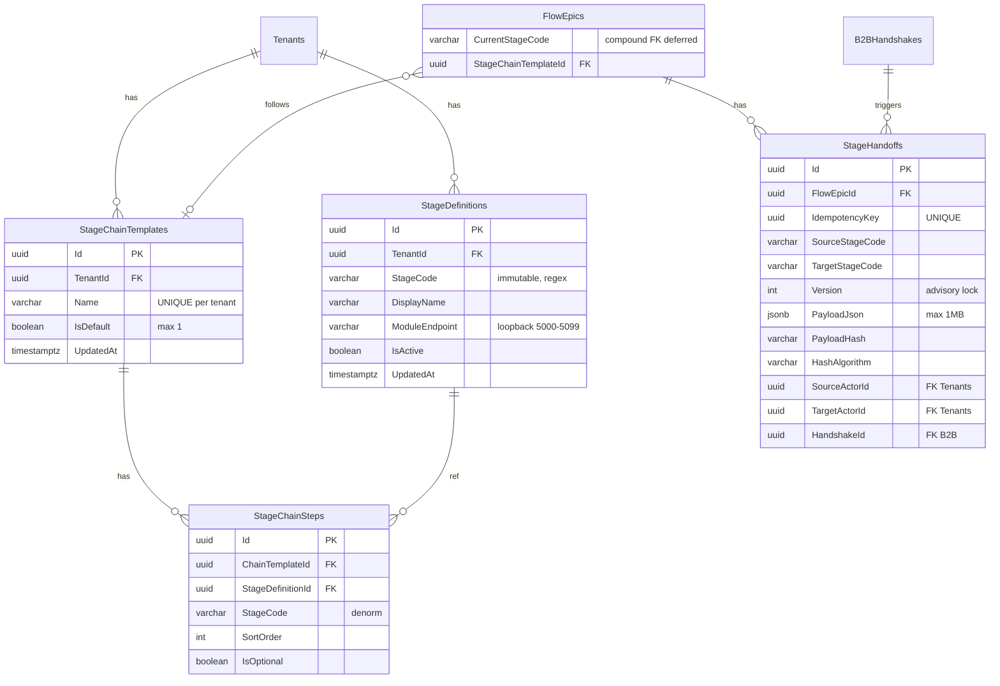

# SpaceOS — Workflow Stage Architecture
## Univerzális Stage Absztrakció + Stage Chain + Handoff Protocol

> **Verzió:** v4.0 — 2026-04-10
> **Státusz:** IMPLEMENTÁCIÓRA KÉSZ
> **Blokkoló feltétel:** Modules.Abstractions v1 Phase A+B DoD ✅ · Phase 3C+ DoD ✅
> **Kumulált review:** `/database-designer` + `/database-schema-designer` → v2 · `/senior-security` → v3 · `/senior-backend` → v4
> **Repo:** `spaceos-kernel` (Stage Registry — Kernel infrastruktúra, ADR-022)
> **DB:** Kernel `spaceos` schema — Migration 0027
> **Becsült effort:** ~8 fejlesztői nap (Kernel Stage Registry only — Sales/Survey v1 külön doc)

---

## 1. Kumulált Finding Összesítő (v1 → v4)

| Review | Finding-ek | Legfontosabb javítás | Effort delta |
|--------|-----------|----------------------|--------------|
| v1 → `/database-designer` + `/database-schema-designer` → v2 | 1 CRITICAL · 4 HIGH · 5 MEDIUM | ADR-022 Kernel elhelyezés · Version advisory lock · Compound FK direkt PK-ra · PayloadJson CHECK · StageCode immutability trigger | +2 nap |
| v2 → `/senior-security` → v3 | 2 CRITICAL · 4 HIGH · 3 MEDIUM | RBAC 3 szint · ModuleEndpoint port allowlist · Chain-sorrend validáció · IdempotencyKey · Handoff replay védelem · PayloadJson nesting limit | +2 nap |
| v3 → `/senior-backend` → v4 | 0 CRITICAL · 2 HIGH · 3 MEDIUM | IStageChainValidator domain service · CreateHandoff explicit tx pattern · Orchestrator cache egyszerűsítés · Ardalis.Specification classes | +1 nap |
| **Összesen** | **3 CRITICAL · 10 HIGH · 11 MEDIUM** | | **~8 fejlesztői nap** |

### Finding részletek

| ID | Súly | Terület | Probléma | Javítás |
|----|------|---------|----------|---------|
| DB-01 | 🔴 | Kernel frozen | Stage Registry a Kernel-ben — frozen rule | ADR-022: Kernel-ben, frozen szabály pontosítva |
| DB-02 | 🟠 | Version race | Concurrent handoff → azonos Version | `pg_advisory_xact_lock` + MAX+1 |
| DB-03 | 🟠 | CurrentStageCode no FK | Árva referencia stage törlés után | Compound FK DEFERRABLE INITIALLY DEFERRED |
| DB-04 | 🟠 | Compound FK EF Core | StageChainSteps compound FK non-PK-ra | `StageDefinitionId` direkt PK FK |
| DB-05 | 🟠 | PayloadJson unbounded | DB szinten korlátlan | `pg_column_size < 1MB` CHECK |
| DB-06 | 🟡 | Missing UpdatedAt | Módosítás nem nyomon követhető | UpdatedAt + trigger |
| DB-07 | 🟡 | Actor FK hiányzik | SourceActorId/TargetActorId no FK | `REFERENCES "Tenants"("Id")` |
| DB-08 | 🟡 | Missing partial index | IsActive szűrés index nélkül | Partial index |
| DB-09 | 🟡 | Endpoint redundancia | Per-tenant azonos URL | Elfogadott — jövőbeli izolációhoz |
| DB-10 | 🟡 | StageCode mutability | UPDATE → FK inkonzisztencia | Immutability trigger |
| SEC-01 | 🔴 | SSRF | ModuleEndpoint bármilyen loopback port | Port range 5001-5099 CHECK |
| SEC-02 | 🔴 | RBAC hiányzik | Bárki CRUD-olhat stage-eket | 3 RBAC szint: SystemAdmin/TenantAdmin/StageOperator |
| SEC-03 | 🟠 | Chain skip | AdvanceToStage() → kötelező stage kihagyható | IStageChainValidator domain service (BE-01) |
| SEC-04 | 🟠 | Payload injection | Mélyen nested JSON → DoS, XSS | Max depth 10 FluentValidation |
| SEC-05 | 🟠 | Handoff replay | Replay Version+1 → sikeres | IdempotencyKey uuid + UNIQUE |
| SEC-06 | 🟠 | Endpoint TOCTOU | ModuleEndpoint változás proxy közben | Orchestrator 5 min TTL cache (BE-03) |
| SEC-07 | 🟡 | Hash algorithm | SHA-256 hardcoded, nem future-proofed | `HashAlgorithm` mező |
| SEC-08 | 🟡 | Version disclosure | Tenant-en belül mindenki lát mindent | Elfogadott — Sales Module felelőssége |
| SEC-09 | 🟡 | Deferred FK tx boundary | Invalid state ha commit nélkül crash | Explicit `BeginTransactionAsync` (BE-02) |
| BE-01 | 🟠 | AdvanceToStage coupling | Domain method chain steps paramétert kap | `IStageChainValidator` domain service |
| BE-02 | 🟠 | Handoff tx pattern | Advisory lock + save nem explicit | Handler code pattern specifikálva |
| BE-03 | 🟡 | Cache invalidation | Orchestrator webhook nem létezik | TTL-only, no invalidation |
| BE-04 | 🟡 | Denorm source | StageCode user input-ból → drift | Domain code: StageDefinition-ből olvasva |
| BE-05 | 🟡 | Missing Specifications | Handoff query-k Spec nélkül | 3 Ardalis.Specification class |

---

## 2. Architekturális döntések (ADR)

### ADR-018: Workflow Stage as First-Class Abstraction

**Döntés:** Minden üzleti funkció = Stage Module. Önálló bounded context, B2BHandshake-kel láncolható, tenant-enként konfigurálható.

### ADR-019: StageChain — Tenant-Configurable Pipeline

**Döntés:** `StageChain` konfiguráció tenant szinten, több chain per tenant (pl. "standard", "felmérős"). FlowEpic a chain mentén halad.

### ADR-020: StageHandoff — Immutable Data Package

**Döntés:** Immutable rekord verziózással + IdempotencyKey (SEC-05). Version `pg_advisory_xact_lock`-kal számolva (DB-02). HashAlgorithm mező (SEC-07).

### ADR-021: Stage Module Anatomy

**Döntés:** Minden Stage Module: `spaceos-modules-{stagecode}/` polyrepo, saját Domain/Application/Infrastructure/Api/Tests.

### ADR-022: Stage Registry a Kernel-ben

**Döntés:** Kernel-ben marad. Frozen szabály pontosítva:
- ❌ Üzleti logika, termék-specifikus entitás, module-függő kód
- ✅ Platform-infrastruktúra (Tenant, FlowEpic, B2BHandshake, StageDefinition)

---

## 3. Domain modell

### 3.1 Stage Registry entities

```csharp
// SpaceOS.Kernel.Domain / Entities / StageDefinition.cs
public sealed class StageDefinition : TenantScopedEntity
{
    public string StageCode       { get; private set; }  // immutable (DB-10)
    public string DisplayName     { get; private set; }
    public string ModuleEndpoint  { get; private set; }  // loopback:5001-5099 (SEC-01)
    public bool IsActive          { get; private set; }
    public DateTimeOffset CreatedAt { get; private set; }
    public DateTimeOffset UpdatedAt { get; private set; }

    public static StageDefinition Register(
        Guid tenantId, string stageCode, string displayName, string moduleEndpoint)
    {
        Guard.Against.NullOrWhiteSpace(stageCode);
        Guard.Against.NullOrWhiteSpace(displayName);
        Guard.Against.NullOrWhiteSpace(moduleEndpoint);

        if (!Regex.IsMatch(stageCode, @"^[a-z][a-z0-9_]{1,28}[a-z0-9]$"))
            throw new DomainException($"Invalid StageCode format: {stageCode}");

        var sd = new StageDefinition
        {
            TenantId = tenantId,
            StageCode = stageCode.ToLowerInvariant(),
            DisplayName = displayName,
            ModuleEndpoint = moduleEndpoint,
            IsActive = true,
            CreatedAt = DateTimeOffset.UtcNow,
            UpdatedAt = DateTimeOffset.UtcNow
        };
        sd.RaiseDomainEvent(new StageDefinitionRegisteredEvent(sd.Id, tenantId, stageCode));
        return sd;
    }

    public void UpdateEndpoint(string moduleEndpoint)
    {
        Guard.Against.NullOrWhiteSpace(moduleEndpoint);
        ModuleEndpoint = moduleEndpoint;
        UpdatedAt = DateTimeOffset.UtcNow;
        RaiseDomainEvent(new StageDefinitionUpdatedEvent(Id, TenantId, StageCode));
    }

    public void Deactivate()
    {
        IsActive = false;
        UpdatedAt = DateTimeOffset.UtcNow;
    }
}
```

```csharp
// SpaceOS.Kernel.Domain / Entities / StageChainTemplate.cs
public sealed class StageChainTemplate : TenantScopedEntity
{
    public string Name            { get; private set; }
    public bool IsDefault         { get; private set; }
    public DateTimeOffset CreatedAt { get; private set; }
    public DateTimeOffset UpdatedAt { get; private set; }

    private readonly List<StageChainStep> _steps = new();
    public IReadOnlyList<StageChainStep> Steps => _steps.AsReadOnly();

    public static StageChainTemplate Create(Guid tenantId, string name, bool isDefault = false)
    {
        var ct = new StageChainTemplate
        {
            TenantId = tenantId,
            Name = name,
            IsDefault = isDefault,
            CreatedAt = DateTimeOffset.UtcNow,
            UpdatedAt = DateTimeOffset.UtcNow
        };
        ct.RaiseDomainEvent(new StageChainCreatedEvent(ct.Id, tenantId, name));
        return ct;
    }

    // BE-04: stageCode from StageDefinition, not user input
    public Result AddStep(StageDefinition stageDef, int sortOrder, bool isOptional = false)
    {
        if (_steps.Any(s => s.StageCode == stageDef.StageCode))
            return Result.Error($"Stage '{stageDef.StageCode}' already in chain");
        if (_steps.Any(s => s.SortOrder == sortOrder))
            return Result.Error($"SortOrder {sortOrder} already taken");
        if (_steps.Count >= 20)
            return Result.Error("Maximum 20 steps per chain");

        _steps.Add(StageChainStep.Create(
            Id, TenantId, stageDef.Id, stageDef.StageCode, sortOrder, isOptional));
        UpdatedAt = DateTimeOffset.UtcNow;
        return Result.Success();
    }

    public Result RemoveStep(string stageCode)
    {
        var step = _steps.FirstOrDefault(s => s.StageCode == stageCode);
        if (step is null) return Result.NotFound();
        _steps.Remove(step);
        UpdatedAt = DateTimeOffset.UtcNow;
        return Result.Success();
    }
}
```

```csharp
// SpaceOS.Kernel.Domain / Entities / StageChainStep.cs
public sealed class StageChainStep : TenantScopedEntity
{
    public Guid ChainTemplateId     { get; private set; }
    public Guid StageDefinitionId   { get; private set; }  // DB-04: direkt PK FK
    public string StageCode         { get; private set; }  // denormalizált (BE-04: from StageDefinition)
    public int SortOrder            { get; private set; }
    public bool IsOptional          { get; private set; }

    internal static StageChainStep Create(
        Guid chainTemplateId, Guid tenantId,
        Guid stageDefinitionId, string stageCode,
        int sortOrder, bool isOptional)
    {
        return new StageChainStep
        {
            ChainTemplateId = chainTemplateId,
            TenantId = tenantId,
            StageDefinitionId = stageDefinitionId,
            StageCode = stageCode,
            SortOrder = sortOrder,
            IsOptional = isOptional
        };
    }
}
```

### 3.2 StageHandoff

```csharp
// SpaceOS.Kernel.Domain / Entities / StageHandoff.cs
public sealed class StageHandoff : TenantScopedEntity
{
    public Guid FlowEpicId          { get; private set; }
    public string SourceStageCode   { get; private set; }
    public string TargetStageCode   { get; private set; }
    public int Version              { get; private set; }
    public Guid IdempotencyKey      { get; private set; }  // SEC-05
    public string PayloadJson       { get; private set; }
    public string PayloadHash       { get; private set; }
    public string HashAlgorithm     { get; private set; }  // SEC-07
    public Guid? SourceActorId      { get; private set; }  // DB-07: FK Tenants
    public Guid? TargetActorId      { get; private set; }  // DB-07: FK Tenants
    public Guid? HandshakeId        { get; private set; }
    public DateTimeOffset CreatedAt { get; private set; }

    public static StageHandoff Create(
        Guid tenantId, Guid flowEpicId,
        string sourceStage, string targetStage,
        int nextVersion,
        Guid idempotencyKey,
        string payloadJson,
        Guid? sourceActorId, Guid? targetActorId,
        Guid? handshakeId = null)
    {
        var hash = ComputeHash(tenantId, flowEpicId, sourceStage, targetStage, payloadJson, nextVersion);

        var ho = new StageHandoff
        {
            TenantId = tenantId,
            FlowEpicId = flowEpicId,
            SourceStageCode = sourceStage,
            TargetStageCode = targetStage,
            Version = nextVersion,
            IdempotencyKey = idempotencyKey,
            PayloadJson = payloadJson,
            PayloadHash = hash,
            HashAlgorithm = "SHA-256",
            SourceActorId = sourceActorId,
            TargetActorId = targetActorId,
            HandshakeId = handshakeId,
            CreatedAt = DateTimeOffset.UtcNow
        };
        ho.RaiseDomainEvent(new StageHandoffCreatedEvent(
            ho.Id, flowEpicId, sourceStage, targetStage, nextVersion));
        return ho;
    }

    private static string ComputeHash(
        Guid tenantId, Guid flowEpicId,
        string source, string target, string payload, int version)
    {
        var input = string.Join("|",
            tenantId.ToString("D"), flowEpicId.ToString("D"),
            source, target, version, payload);
        return Convert.ToHexString(
            SHA256.HashData(Encoding.UTF8.GetBytes(input))).ToLowerInvariant();
    }
}
```

### 3.3 FlowEpic bővítés

```csharp
// SpaceOS.Kernel.Domain / Aggregates / FlowEpic.cs — meglévő, bővítés
public string? CurrentStageCode   { get; private set; }
public Guid? StageChainTemplateId { get; private set; }

public Result AssignChain(Guid chainTemplateId, string firstStageCode)
{
    if (StageChainTemplateId.HasValue)
        return Result.Error("Chain already assigned");
    StageChainTemplateId = chainTemplateId;
    CurrentStageCode = firstStageCode;
    RaiseDomainEvent(new FlowEpicStageAdvancedEvent(Id, TenantId, null, firstStageCode));
    return Result.Success();
}

// SEC-03 + BE-01: IStageChainValidator validálja, nem a FlowEpic
public Result AdvanceToStage(string targetStageCode)
{
    var previousStage = CurrentStageCode;
    CurrentStageCode = targetStageCode;
    RaiseDomainEvent(new FlowEpicStageAdvancedEvent(Id, TenantId, previousStage, targetStageCode));
    return Result.Success();
}

public Result SkipOptionalStage(string stageCode)
{
    RaiseDomainEvent(new FlowEpicStageSkippedEvent(Id, TenantId, stageCode));
    return Result.Success();
}
```

### 3.4 IStageChainValidator — domain service (BE-01 + SEC-03)

```csharp
// SpaceOS.Kernel.Domain / Services / IStageChainValidator.cs
public interface IStageChainValidator
{
    Result ValidateAdvance(
        FlowEpic epic,
        string targetStageCode,
        IReadOnlyList<StageChainStep> chainSteps);
}

// SpaceOS.Kernel.Infrastructure / Services / StageChainValidator.cs
public sealed class StageChainValidator : IStageChainValidator
{
    public Result ValidateAdvance(
        FlowEpic epic,
        string targetStageCode,
        IReadOnlyList<StageChainStep> chainSteps)
    {
        if (!epic.StageChainTemplateId.HasValue)
            return Result.Error("No chain assigned to this FlowEpic");

        var currentStep = chainSteps.FirstOrDefault(s => s.StageCode == epic.CurrentStageCode);
        var targetStep = chainSteps.FirstOrDefault(s => s.StageCode == targetStageCode);

        if (targetStep is null)
            return Result.Error($"Stage '{targetStageCode}' not in chain");

        if (currentStep is not null && targetStep.SortOrder <= currentStep.SortOrder)
            return Result.Error($"Cannot go backward: {epic.CurrentStageCode} → {targetStageCode}");

        // SEC-03: no skipping required stages
        var skippedRequired = chainSteps
            .Where(s => s.SortOrder > (currentStep?.SortOrder ?? 0)
                      && s.SortOrder < targetStep.SortOrder
                      && !s.IsOptional)
            .ToList();

        if (skippedRequired.Any())
            return Result.Error(
                $"Cannot skip required stages: {string.Join(", ", skippedRequired.Select(s => s.StageCode))}");

        return Result.Success();
    }
}
```

### 3.5 Domain Events

```csharp
public sealed record StageDefinitionRegisteredEvent(Guid Id, Guid TenantId, string StageCode) : IDomainEvent;
public sealed record StageDefinitionUpdatedEvent(Guid Id, Guid TenantId, string StageCode) : IDomainEvent;
public sealed record StageChainCreatedEvent(Guid Id, Guid TenantId, string Name) : IDomainEvent;
public sealed record StageHandoffCreatedEvent(Guid Id, Guid FlowEpicId, string Source, string Target, int Version) : IDomainEvent;
public sealed record FlowEpicStageAdvancedEvent(Guid FlowEpicId, Guid TenantId, string? From, string To) : IDomainEvent;
public sealed record FlowEpicStageSkippedEvent(Guid FlowEpicId, Guid TenantId, string Skipped) : IDomainEvent;
```

### 3.6 Ardalis.Specification classes (BE-05)

```csharp
public sealed class ActiveStageDefinitionsSpec : Specification<StageDefinition>
{
    public ActiveStageDefinitionsSpec()
    {
        Query.Where(sd => sd.IsActive).OrderBy(sd => sd.StageCode);
    }
}

public sealed class HandoffsByFlowEpicSpec : Specification<StageHandoff>
{
    public HandoffsByFlowEpicSpec(Guid flowEpicId)
    {
        Query.Where(h => h.FlowEpicId == flowEpicId).OrderBy(h => h.CreatedAt);
    }
}

public sealed class LatestHandoffSpec : SingleResultSpecification<StageHandoff>
{
    public LatestHandoffSpec(Guid flowEpicId, string sourceStage, string targetStage)
    {
        Query.Where(h => h.FlowEpicId == flowEpicId
                      && h.SourceStageCode == sourceStage
                      && h.TargetStageCode == targetStage)
             .OrderByDescending(h => h.Version);
    }
}

public sealed class ChainStepsByTemplateSpec : Specification<StageChainStep>
{
    public ChainStepsByTemplateSpec(Guid chainTemplateId)
    {
        Query.Where(s => s.ChainTemplateId == chainTemplateId).OrderBy(s => s.SortOrder);
    }
}
```

### 3.7 Handoff Payload Schemas

```csharp
// Sales stage output
public sealed record SalesHandoffPayload
{
    public Guid QuoteId { get; init; }
    public int QuoteVersion { get; init; }
    public IReadOnlyList<SalesLineItem> LineItems { get; init; } = [];
    public decimal TotalPrice { get; init; }
    public string Currency { get; init; } = "HUF";
    public string? CustomerNotes { get; init; }
}

public sealed record SalesLineItem
{
    public string ProductTemplateCode { get; init; } = "";
    public int Quantity { get; init; }
    public decimal EstimatedWidth { get; init; }
    public decimal EstimatedHeight { get; init; }
    public string? SurfaceSpec { get; init; }
    public string? HardwareSpec { get; init; }
}

// Survey stage output
public sealed record SurveyHandoffPayload
{
    public Guid SurveyId { get; init; }
    public IReadOnlyList<SurveyRoom> Rooms { get; init; } = [];
}

public sealed record SurveyRoom
{
    public Guid PhysicalSpaceId { get; init; }
    public string RoomName { get; init; } = "";
    public IReadOnlyList<SurveyOpening> Openings { get; init; } = [];
}

public sealed record SurveyOpening
{
    public Guid SpatialElementId { get; init; }
    public decimal MeasuredWidth { get; init; }
    public decimal MeasuredHeight { get; init; }
    public string Position { get; init; } = "";
    public string AssignedProductTemplate { get; init; } = "";
    public IReadOnlyDictionary<string, decimal>? ParameterOverrides { get; init; }
}
```

---

## 4. DB Schema — Migration 0027

```sql
-- ============================================================
-- Migration 0027 — Stage Registry + StageChain + StageHandoff
-- ============================================================

-- 1. StageDefinitions
CREATE TABLE "StageDefinitions" (
    "Id"              uuid          NOT NULL PRIMARY KEY DEFAULT gen_random_uuid(),
    "TenantId"        uuid          NOT NULL REFERENCES "Tenants"("Id"),
    "StageCode"       varchar(30)   NOT NULL
        CHECK ("StageCode" ~ '^[a-z][a-z0-9_]{1,28}[a-z0-9]$'),
    "DisplayName"     varchar(100)  NOT NULL,
    "ModuleEndpoint"  varchar(500)  NOT NULL
        CHECK ("ModuleEndpoint" ~ '^https?://(127\.0\.0\.1|localhost):(50[0-9]{2})$'),  -- SEC-01: port 5000-5099
    "IsActive"        boolean       NOT NULL DEFAULT true,
    "CreatedAt"       timestamptz   NOT NULL DEFAULT NOW(),
    "UpdatedAt"       timestamptz   NOT NULL DEFAULT NOW(),
    UNIQUE ("TenantId", "StageCode")
);

-- 2. StageChainTemplates
CREATE TABLE "StageChainTemplates" (
    "Id"          uuid          NOT NULL PRIMARY KEY DEFAULT gen_random_uuid(),
    "TenantId"    uuid          NOT NULL REFERENCES "Tenants"("Id"),
    "Name"        varchar(100)  NOT NULL,
    "IsDefault"   boolean       NOT NULL DEFAULT false,
    "CreatedAt"   timestamptz   NOT NULL DEFAULT NOW(),
    "UpdatedAt"   timestamptz   NOT NULL DEFAULT NOW(),
    UNIQUE ("TenantId", "Name")
);

CREATE UNIQUE INDEX "IX_StageChainTemplates_DefaultPerTenant"
    ON "StageChainTemplates" ("TenantId") WHERE "IsDefault" = true;

-- 3. StageChainSteps
CREATE TABLE "StageChainSteps" (
    "Id"                  uuid        NOT NULL PRIMARY KEY DEFAULT gen_random_uuid(),
    "TenantId"            uuid        NOT NULL,
    "ChainTemplateId"     uuid        NOT NULL
        REFERENCES "StageChainTemplates"("Id") ON DELETE CASCADE,
    "StageDefinitionId"   uuid        NOT NULL
        REFERENCES "StageDefinitions"("Id"),
    "StageCode"           varchar(30) NOT NULL,
    "SortOrder"           int         NOT NULL CHECK ("SortOrder" > 0),
    "IsOptional"          boolean     NOT NULL DEFAULT false,
    UNIQUE ("ChainTemplateId", "StageCode"),
    UNIQUE ("ChainTemplateId", "SortOrder")
);

-- 4. StageHandoffs
CREATE TABLE "StageHandoffs" (
    "Id"                uuid          NOT NULL PRIMARY KEY DEFAULT gen_random_uuid(),
    "TenantId"          uuid          NOT NULL,
    "FlowEpicId"        uuid          NOT NULL REFERENCES "FlowEpics"("Id"),
    "SourceStageCode"   varchar(30)   NOT NULL,
    "TargetStageCode"   varchar(30)   NOT NULL,
    "Version"           int           NOT NULL DEFAULT 1 CHECK ("Version" > 0),
    "IdempotencyKey"    uuid          NOT NULL,                                     -- SEC-05
    "PayloadJson"       jsonb         NOT NULL
        CHECK (pg_column_size("PayloadJson") < 1048576),                            -- DB-05
    "PayloadHash"       varchar(64)   NOT NULL,
    "HashAlgorithm"     varchar(20)   NOT NULL DEFAULT 'SHA-256',                   -- SEC-07
    "SourceActorId"     uuid          DEFAULT NULL REFERENCES "Tenants"("Id"),      -- DB-07
    "TargetActorId"     uuid          DEFAULT NULL REFERENCES "Tenants"("Id"),      -- DB-07
    "HandshakeId"       uuid          DEFAULT NULL REFERENCES "B2BHandshakes"("Id"),
    "CreatedAt"         timestamptz   NOT NULL DEFAULT NOW(),
    UNIQUE ("FlowEpicId", "SourceStageCode", "TargetStageCode", "Version"),
    UNIQUE ("FlowEpicId", "IdempotencyKey"),                                        -- SEC-05
    CHECK ("SourceStageCode" <> "TargetStageCode")
);

-- 5. FlowEpics bővítés
ALTER TABLE "FlowEpics"
    ADD COLUMN IF NOT EXISTS "CurrentStageCode" varchar(30) DEFAULT NULL,
    ADD COLUMN IF NOT EXISTS "StageChainTemplateId" uuid DEFAULT NULL
        REFERENCES "StageChainTemplates"("Id");

ALTER TABLE "FlowEpics"
    ADD CONSTRAINT "FK_FlowEpics_CurrentStage"
    FOREIGN KEY ("TenantId", "CurrentStageCode")
    REFERENCES "StageDefinitions"("TenantId", "StageCode")
    DEFERRABLE INITIALLY DEFERRED;                                                  -- DB-03
```

### 4.2 Indexek

```sql
CREATE INDEX "IX_StageDefinitions_TenantId" ON "StageDefinitions" ("TenantId");
CREATE INDEX "IX_StageDefinitions_TenantId_Active"
    ON "StageDefinitions" ("TenantId", "StageCode") WHERE "IsActive" = true;        -- DB-08
CREATE INDEX "IX_StageChainSteps_ChainTemplateId" ON "StageChainSteps" ("ChainTemplateId");
CREATE INDEX "IX_StageChainSteps_StageDefinitionId" ON "StageChainSteps" ("StageDefinitionId");
CREATE INDEX "IX_StageHandoffs_FlowEpicId" ON "StageHandoffs" ("FlowEpicId");
CREATE INDEX "IX_StageHandoffs_TenantId_Source" ON "StageHandoffs" ("TenantId", "SourceStageCode");
CREATE INDEX "IX_StageHandoffs_TenantId_Target" ON "StageHandoffs" ("TenantId", "TargetStageCode");
CREATE INDEX "IX_FlowEpics_CurrentStageCode" ON "FlowEpics" ("CurrentStageCode") WHERE "CurrentStageCode" IS NOT NULL;
CREATE INDEX "IX_FlowEpics_StageChainTemplateId" ON "FlowEpics" ("StageChainTemplateId") WHERE "StageChainTemplateId" IS NOT NULL;
```

### 4.3 RLS

```sql
ALTER TABLE "StageDefinitions" ENABLE ROW LEVEL SECURITY;
ALTER TABLE "StageDefinitions" FORCE ROW LEVEL SECURITY;
CREATE POLICY "sd_tenant" ON "StageDefinitions"
    USING ("TenantId" = current_setting('app.current_tenant_id')::uuid);

ALTER TABLE "StageChainTemplates" ENABLE ROW LEVEL SECURITY;
ALTER TABLE "StageChainTemplates" FORCE ROW LEVEL SECURITY;
CREATE POLICY "sct_tenant" ON "StageChainTemplates"
    USING ("TenantId" = current_setting('app.current_tenant_id')::uuid);

ALTER TABLE "StageChainSteps" ENABLE ROW LEVEL SECURITY;
ALTER TABLE "StageChainSteps" FORCE ROW LEVEL SECURITY;
CREATE POLICY "scs_tenant" ON "StageChainSteps"
    USING ("TenantId" = current_setting('app.current_tenant_id')::uuid);

ALTER TABLE "StageHandoffs" ENABLE ROW LEVEL SECURITY;
ALTER TABLE "StageHandoffs" FORCE ROW LEVEL SECURITY;
CREATE POLICY "sh_tenant" ON "StageHandoffs"
    USING ("TenantId" = current_setting('app.current_tenant_id')::uuid);
```

### 4.4 Triggers

```sql
-- DB-10: StageCode immutable
CREATE OR REPLACE FUNCTION prevent_stage_code_change()
RETURNS TRIGGER AS $$
BEGIN
    IF NEW."StageCode" <> OLD."StageCode" THEN
        RAISE EXCEPTION 'StageCode is immutable (was: %, new: %)', OLD."StageCode", NEW."StageCode";
    END IF;
    RETURN NEW;
END;
$$ LANGUAGE plpgsql;

CREATE TRIGGER "TR_StageDefinitions_ImmutableCode"
    BEFORE UPDATE ON "StageDefinitions"
    FOR EACH ROW EXECUTE FUNCTION prevent_stage_code_change();

-- DB-06: Auto-update UpdatedAt
CREATE OR REPLACE FUNCTION update_updated_at()
RETURNS TRIGGER AS $$
BEGIN
    NEW."UpdatedAt" = NOW();
    RETURN NEW;
END;
$$ LANGUAGE plpgsql;

CREATE TRIGGER "TR_StageDefinitions_UpdatedAt"
    BEFORE UPDATE ON "StageDefinitions"
    FOR EACH ROW EXECUTE FUNCTION update_updated_at();

CREATE TRIGGER "TR_StageChainTemplates_UpdatedAt"
    BEFORE UPDATE ON "StageChainTemplates"
    FOR EACH ROW EXECUTE FUNCTION update_updated_at();
```

### 4.5 Seed — Doorstar

```sql
WITH doorstar AS (
    SELECT "Id" AS tid FROM "Tenants" WHERE "BrandSkinId" = 'doorstar' LIMIT 1
)
INSERT INTO "StageDefinitions" ("TenantId", "StageCode", "DisplayName", "ModuleEndpoint")
SELECT d.tid, s.code, s.name, s.endpoint FROM doorstar d
CROSS JOIN (VALUES
    ('sales',         'Értékesítés',  'http://127.0.0.1:5004'),
    ('survey',        'Felmérés',     'http://127.0.0.1:5005'),
    ('manufacturing', 'Gyártás',      'http://127.0.0.1:5002')
) AS s(code, name, endpoint)
ON CONFLICT ("TenantId", "StageCode") DO NOTHING;

WITH doorstar AS (
    SELECT "Id" AS tid FROM "Tenants" WHERE "BrandSkinId" = 'doorstar' LIMIT 1
)
INSERT INTO "StageChainTemplates" ("TenantId", "Name", "IsDefault")
SELECT tid, 'standard', true FROM doorstar
ON CONFLICT ("TenantId", "Name") DO NOTHING;

WITH ctx AS (
    SELECT ct."Id" AS cid, ct."TenantId" AS tid
    FROM "StageChainTemplates" ct
    JOIN "Tenants" t ON t."Id" = ct."TenantId"
    WHERE t."BrandSkinId" = 'doorstar' AND ct."Name" = 'standard' LIMIT 1
)
INSERT INTO "StageChainSteps" ("TenantId", "ChainTemplateId", "StageDefinitionId", "StageCode", "SortOrder", "IsOptional")
SELECT c.tid, c.cid, sd."Id", s.code, s.ord, s.opt
FROM ctx c
CROSS JOIN (VALUES ('sales',1,false), ('survey',2,true), ('manufacturing',3,false)) AS s(code,ord,opt)
JOIN "StageDefinitions" sd ON sd."TenantId" = c.tid AND sd."StageCode" = s.code
ON CONFLICT ("ChainTemplateId", "StageCode") DO NOTHING;
```

### 4.6 ERD



---

## 5. API Surface + RBAC (SEC-02)

```
# Stage Registry — SystemAdmin only
POST   /api/stages                                RegisterStageDefinition     [SystemAdmin]
GET    /api/stages                                ListStageDefinitions        [TenantUser]
PUT    /api/stages/{id}                           UpdateStageDefinition       [SystemAdmin]
DELETE /api/stages/{id}                           DeactivateStageDefinition   [SystemAdmin]

# Stage Chains — TenantAdmin
POST   /api/stage-chains                          CreateStageChainTemplate    [TenantAdmin]
GET    /api/stage-chains                          ListStageChainTemplates     [TenantUser]
GET    /api/stage-chains/{id}                     GetWithSteps                [TenantUser]
POST   /api/stage-chains/{id}/steps               AddStep                     [TenantAdmin]
DELETE /api/stage-chains/{id}/steps/{stageCode}   RemoveStep                  [TenantAdmin]

# Stage Handoffs — StageOperator (Orchestrator service account or TenantAdmin)
POST   /api/stage-handoffs                        CreateStageHandoff          [StageOperator]
GET    /api/stage-handoffs?flowEpicId={id}        GetHistory                  [TenantUser]
GET    /api/stage-handoffs/{id}                   GetHandoff                  [TenantUser]
GET    /api/stage-handoffs/latest?flowEpicId&src&tgt  GetLatest               [TenantUser]

# FlowEpic Stage Control — StageOperator
POST   /api/flow-epics/{id}/assign-chain          AssignChain                 [StageOperator]
POST   /api/flow-epics/{id}/advance-stage         AdvanceStage                [StageOperator]
POST   /api/flow-epics/{id}/skip-stage            SkipOptionalStage           [StageOperator]
```

---

## 6. Handler minták

### 6.1 CreateStageHandoff — BE-02 explicit tx pattern

```csharp
public sealed class CreateStageHandoffCommandHandler
    : IRequestHandler<CreateStageHandoffCommand, Result<Guid>>
{
    private readonly AppDbContext _db;
    private readonly IMediator _mediator;

    public async Task<Result<Guid>> Handle(
        CreateStageHandoffCommand cmd, CancellationToken ct)
    {
        // SEC-09: explicit transaction for advisory lock + save
        await using var tx = await _db.Database
            .BeginTransactionAsync(ct).ConfigureAwait(false);

        try
        {
            // DB-02: advisory lock on (FlowEpicId, Source, Target)
            var lockKey = $"{cmd.FlowEpicId}{cmd.SourceStageCode}{cmd.TargetStageCode}";
            await _db.Database.ExecuteSqlRawAsync(
                "SELECT pg_advisory_xact_lock(hashtext({0}))", lockKey)
                .ConfigureAwait(false);

            // DB-02: compute next version
            var maxVersion = await _db.StageHandoffs
                .Where(h => h.FlowEpicId == cmd.FlowEpicId
                         && h.SourceStageCode == cmd.SourceStageCode
                         && h.TargetStageCode == cmd.TargetStageCode)
                .MaxAsync(h => (int?)h.Version, ct).ConfigureAwait(false) ?? 0;

            var handoff = StageHandoff.Create(
                cmd.TenantId, cmd.FlowEpicId,
                cmd.SourceStageCode, cmd.TargetStageCode,
                maxVersion + 1, cmd.IdempotencyKey,
                cmd.PayloadJson, cmd.SourceActorId, cmd.TargetActorId,
                cmd.HandshakeId);

            _db.StageHandoffs.Add(handoff);
            await _db.SaveChangesAsync(ct).ConfigureAwait(false);

            // Golden Rule 4: dispatch domain events
            var events = handoff.PopDomainEvents();
            foreach (var e in events)
                await _mediator.Publish(e, ct).ConfigureAwait(false);

            await tx.CommitAsync(ct).ConfigureAwait(false);
            return Result.Success(handoff.Id);
        }
        catch (DbUpdateException ex) when (ex.InnerException is PostgresException { SqlState: "23505" })
        {
            // SEC-05: idempotency — duplicate key = already processed
            await tx.RollbackAsync(ct).ConfigureAwait(false);
            var existing = await _db.StageHandoffs
                .FirstOrDefaultAsync(h => h.FlowEpicId == cmd.FlowEpicId
                    && h.IdempotencyKey == cmd.IdempotencyKey, ct).ConfigureAwait(false);
            return existing is not null ? Result.Success(existing.Id) : Result.Error("Duplicate handoff");
        }
    }
}
```

### 6.2 AdvanceFlowEpicStage — SEC-03 + BE-01

```csharp
public sealed class AdvanceFlowEpicStageCommandHandler
    : IRequestHandler<AdvanceFlowEpicStageCommand, Result>
{
    private readonly IRepository<FlowEpic> _epicRepo;
    private readonly IReadRepository<StageChainStep> _stepRepo;
    private readonly IStageChainValidator _validator;
    private readonly IMediator _mediator;

    public async Task<Result> Handle(
        AdvanceFlowEpicStageCommand cmd, CancellationToken ct)
    {
        var epic = await _epicRepo.GetByIdAsync(cmd.FlowEpicId, ct).ConfigureAwait(false);
        if (epic is null) return Result.NotFound();

        // BE-01: validator loads chain steps, validates order
        var steps = await _stepRepo.ListAsync(
            new ChainStepsByTemplateSpec(epic.StageChainTemplateId!.Value), ct)
            .ConfigureAwait(false);

        var validation = _validator.ValidateAdvance(epic, cmd.TargetStageCode, steps);
        if (!validation.IsSuccess) return validation;

        var result = epic.AdvanceToStage(cmd.TargetStageCode);
        if (!result.IsSuccess) return result;

        await _epicRepo.UpdateAsync(epic, ct).ConfigureAwait(false);

        var events = epic.PopDomainEvents();
        foreach (var e in events)
            await _mediator.Publish(e, ct).ConfigureAwait(false);

        return Result.Success();
    }
}
```

---

## 7. Orchestrator stage dispatch (BE-03)

```typescript
// spaceos-orchestrator / src/routes/stageDispatch.ts
const endpointCache = new Map<string, { url: string; expires: number }>();
const CACHE_TTL_MS = 5 * 60 * 1000; // 5 perc — BE-03: no invalidation, TTL only

async function resolveStageEndpoint(stageCode: string, tenantId: string): Promise<string> {
  const key = `${tenantId}:${stageCode}`;
  const cached = endpointCache.get(key);
  if (cached && cached.expires > Date.now()) return cached.url;

  const resp = await kernelClient.get(`/api/stages?stageCode=${stageCode}`);
  const endpoint = resp.data.items[0]?.moduleEndpoint;
  if (!endpoint) throw new Error(`Stage '${stageCode}' not found`);

  endpointCache.set(key, { url: endpoint, expires: Date.now() + CACHE_TTL_MS });
  return endpoint;
}

// Route: /bff/stages/:stageCode/*
router.all('/:stageCode/*', async (req, res) => {
  const endpoint = await resolveStageEndpoint(req.params.stageCode, req.tenantId);
  const targetPath = req.params[0]; // everything after stageCode
  proxy(req, res, `${endpoint}/${targetPath}`);
});
```

---

## 8. Definition of Done

### Migration gates
- [ ] Migration 0027: 4 új tábla + FlowEpics ALTER + compound FK DEFERRABLE
- [ ] `IF NOT EXISTS` guard az ALTER-en
- [ ] RLS FORCE mind 4 új táblán
- [ ] `IX_StageChainTemplates_DefaultPerTenant` partial UNIQUE index
- [ ] StageCode regex CHECK + immutability trigger (DB-10)
- [ ] ModuleEndpoint port range CHECK 5000-5099 (SEC-01)
- [ ] PayloadJson size CHECK < 1MB (DB-05)
- [ ] IdempotencyKey UNIQUE (SEC-05)
- [ ] UpdatedAt auto-update triggers (DB-06)
- [ ] Doorstar seed: 3 stage + 1 chain + 3 step

### Domain gates
- [ ] StageDefinition: `static Register()`, no public setters, StageCode immutable
- [ ] StageChainTemplate: `AddStep(StageDefinition, ...)` — StageCode from entity, not input (BE-04)
- [ ] StageChainTemplate: max 20 steps guard
- [ ] StageHandoff: `static Create()`, immutable, SHA-256, IdempotencyKey, HashAlgorithm
- [ ] IStageChainValidator: chain-sorrend + required stage skip guard (SEC-03/BE-01)
- [ ] FlowEpic: `AssignChain()` + `AdvanceToStage()` + `SkipOptionalStage()`
- [ ] 6 domain event + `PopDomainEvents()` + `DispatchAsync()`
- [ ] 4 Ardalis.Specification classes (BE-05)

### API + validation gates
- [ ] 15 endpoint (6 stage + 5 chain + 4 handoff + 3 flow-epic)
- [ ] RBAC: SystemAdmin / TenantAdmin / StageOperator / TenantUser (SEC-02)
- [ ] FluentValidation: PayloadJson max depth 10 (SEC-04) + size 1MB
- [ ] `Result<T>` minden handler-en
- [ ] CreateHandoff: advisory lock + explicit tx (DB-02/BE-02/SEC-09)
- [ ] CreateHandoff: IdempotencyKey duplicate → return existing (SEC-05)

### Security gates (deployment blockers)
- [ ] Cross-tenant RLS blocked (4 tábla)
- [ ] ModuleEndpoint loopback-only CHECK (SEC-01)
- [ ] StageDefinition CRUD: SystemAdmin only (SEC-02)
- [ ] AdvanceToStage: chain sorrend validáció (SEC-03)
- [ ] PayloadHash integrity verify on read
- [ ] IdempotencyKey UNIQUE → replay blocked (SEC-05)

### Összesített
- [ ] Meglévő 1557 teszt zöld
- [ ] Stage Registry új tesztek: ≥ 45 db
- [ ] 0 build warning
- [ ] `ConfigureAwait(false)` minden production async call-ban
- [ ] `dotnet list package --vulnerable` → 0 high/critical
- [ ] `EXPLAIN ANALYZE` minden query endpoint-on — Index Scan
- [ ] Golden Rules 1-12 teljesül
- [ ] `grep -r "BuildServiceProvider" --include="*.cs"` → 0

---

## 9. Security adósság

| ID | Tétel | Korábbi | Ez a fázis | Marad |
|----|-------|---------|------------|-------|
| T-01 | Concurrent hash chain | Phase 1.5 | — | Deploy gate |
| T-02 | RLS policy enforcement | Phase 1.5 | — | Deploy gate |
| SEC-RLS | Stage Registry RLS | — | ✅ | — |
| SEC-RBAC | 4-szintű RBAC | — | ✅ | — |
| SEC-SSRF | ModuleEndpoint port range | — | ✅ | — |
| SEC-CHAIN | Chain skip guard | — | ✅ | — |
| SEC-REPLAY | IdempotencyKey | — | ✅ | — |
| SEC-PAYLOAD | PayloadJson size+depth | — | ✅ | — |
| SEC-HASH | HashAlgorithm mező | — | ✅ | — |
| Escrow GA | S3 Object Lock | — | — | Future |
| P2-3 | GDPR pseudo | — | — | Future |

---

## 10. Mi jön utána

| Sorrend | Fázis | Effort | Megjegyzés |
|---------|-------|--------|------------|
| **1** | **Kernel Stage Registry** (ez a doc) | ~8 nap | Migration 0027 + domain + 15 endpoint + ≥45 teszt |
| **2** | Joinery v2 implementáció | ~16 nap | Gyártásilap PDF — READY v4 arch doc |
| **3** | Sales Module v1 design | ~3 session | Új arch doc, arch-planner pipeline |
| **4** | Survey Module v1 design | ~3 session | Spatial registration, felmérés |
| **5** | Portal: StageChain UI | ~8 nap | Progress bar, stage navigation |
| Horizon 2 | Design Module v1 | ~15 nap | Egyedi modellezés |
| Horizon 2 | Installation Module v1 | ~10 nap | Beépítés |

---

## 11. Claude Code implementációs csomag

### Végrehajtási sorrend

| Nap | Feladat | Függőség |
|-----|---------|----------|
| 1 | Domain: StageDefinition, StageChainTemplate, StageChainStep, StageHandoff, events, enums | — |
| 2 | Domain: IStageChainValidator + FlowEpic bővítés (AssignChain, AdvanceToStage, SkipOptionalStage) | Nap 1 |
| 2 | Domain: 4 Ardalis.Specification class | Nap 1 |
| 3 | Infrastructure: EF Core config (4 entity) + Migration 0027 (DDL + RLS + triggers + seed) | Nap 2 |
| 3 | Infrastructure: StageChainValidator implementáció | Nap 2 |
| 4 | Application: CQRS handlers (Register, Update, Deactivate, CreateChain, AddStep, RemoveStep) | Nap 3 |
| 5 | Application: CreateStageHandoff handler (advisory lock + tx + idempotency) | Nap 3 |
| 5 | Application: AssignChain, AdvanceStage, SkipStage handlers | Nap 4 |
| 6 | Application: Query handlers (List, Get, GetLatest) + FluentValidation validators | Nap 5 |
| 6 | API: Minimal API endpoints + RBAC policies | Nap 5 |
| 7 | Tests: domain (validator, chain ordering, immutability, hash) — ≥20 teszt | Nap 6 |
| 8 | Tests: security (RLS, RBAC, replay, SSRF guard, payload size) — ≥25 teszt | Nap 7 |
| 8 | DoD checklist futtatás + EXPLAIN ANALYZE | Nap 7 |

### Agent utasítás

> "Implementáld a `SpaceOS_WorkflowStage_Architecture_v4.md` szerint:
>
> **Domain:** StageDefinition + StageChainTemplate + StageChainStep + StageHandoff (immutable, IdempotencyKey, HashAlgorithm) + IStageChainValidator (SEC-03/BE-01) + FlowEpic bővítés (AssignChain, AdvanceToStage, SkipOptionalStage) + 6 domain event + 4 Ardalis.Specification
>
> **Infrastructure:** Migration 0027 (DDL + RLS FORCE + triggers DB-06/DB-10 + seed) + StageChainValidator + EF Core config 4 entity
>
> **Application:** CreateStageHandoff handler (advisory lock DB-02 + explicit tx BE-02/SEC-09 + idempotency SEC-05) + AdvanceFlowEpicStage handler (IStageChainValidator SEC-03) + összes CRUD handler + FluentValidation (PayloadJson depth SEC-04)
>
> **API:** 15 Minimal API endpoint + RBAC (SEC-02: SystemAdmin/TenantAdmin/StageOperator/TenantUser)
>
> DoD: Section 8 · Blokkoló: Migration 0027, RLS FORCE, RBAC policies
> Gate: `dotnet test && dotnet build`"

### Kockázatok

| Kockázat | P | Hatás | Mitigáció |
|----------|---|-------|-----------|
| FlowEpic compound FK deferred — hibás handler tx → orphan state | Alacsony | Közepes | Explicit `BeginTransactionAsync` + integration test |
| Advisory lock contention magas handoff throughput-nál | Nagyon alacsony | Alacsony | Lock = hashtext, gyors tranzakció (<10ms) |
| RBAC policy Keycloak mapping hiányzik | Közepes | Magas | SystemAdmin/TenantAdmin/StageOperator = Keycloak realm roles — Keycloak konfig szükséges |
| Doorstar seed fail ha Tenant nem létezik | Alacsony | Közepes | `ON CONFLICT DO NOTHING` + `LIMIT 1` guard |
| PayloadJson 1MB CHECK pg_column_size — TOAST compressed méret vs raw méret | Alacsony | Alacsony | pg_column_size mért a TOAST után — nagyobb JSON-ok átmehetnek. Elfogadott: FluentValidation a primary gate. |

---

*SpaceOS — Workflow Stage Architecture v4.0 · `/database-designer` + `/database-schema-designer` + `/senior-security` + `/senior-backend` reviewed · 2026-04-10*
*Státusz: IMPLEMENTÁCIÓRA KÉSZ — 24 finding beépítve (3 CRITICAL + 10 HIGH + 11 MEDIUM), minden döntés lezárva*
