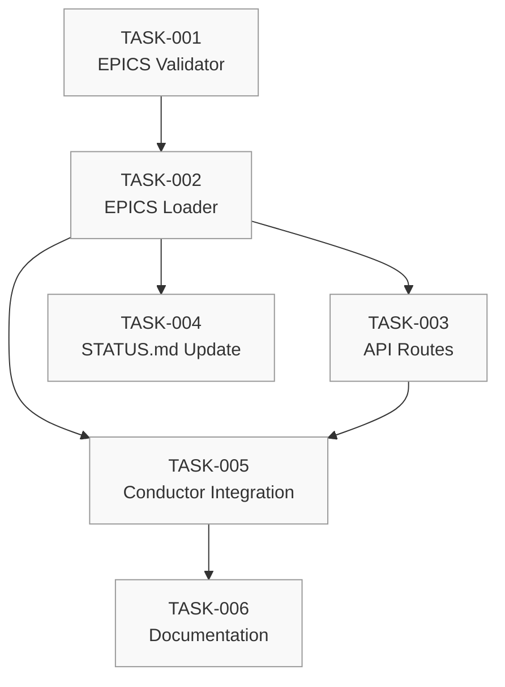

# SpaceOS Graph-Based Workflow — Phase 1 Implementation Plan

> **Verzió:** v1 (DRAFT)
> **Státusz:** IMPLEMENTÁCIÓRA KÉSZ
> **ADR:** ADR-041-graph-based-workflow-architecture.md
> **Prioritás:** HIGH
> **Becsült időtartam:** 3-4 nap

---

## Összefoglaló

Phase 1 célja az **EPICS.yaml + Mermaid MVP** megvalósítása:
- Epic-szintű dependency kezelés
- Gráf műveletek (topological sort, cycle detection, critical path)
- Mermaid vizualizáció generálás
- API endpoints
- STATUS.md auto-update

---

## Előfeltételek

1. **Meglévő infrastruktúra:**
   - `spaceos-nexus/knowledge-service` fut ✅
   - ProjectDispatcher működik ✅
   - TASKS.yaml validátor létezik ✅

2. **Elkészült artifacts (Architect):**
   - `docs/architecture/decisions/ADR-041-graph-based-workflow-architecture.md` ✅
   - `docs/projects/EPICS.yaml` (sablon) ✅
   - `src/graph/types.ts` ✅
   - `src/graph/operations.ts` ✅
   - `src/graph/mermaidGenerator.ts` ✅
   - `src/graph/index.ts` ✅

---

## Taskok

### TASK-001: EPICS.yaml Validator

**Terminál:** Backend
**Model:** sonnet
**Prioritás:** high
**blocked_by:** []

**Leírás:**
Hozd létre az EPICS.yaml schema validátort a meglévő yamlValidator.ts mintájára.

**Teendők:**
1. `src/pipeline/epicsValidator.ts` létrehozása
2. Schema validáció (version, epics array)
3. Referencia integritás (depends_on létező epic-re mutat)
4. Ciklus detektálás (DAG validáció)
5. Unit tesztek

**Acceptance Criteria:**
- [ ] `validateEpicsYaml(yaml)` function implementálva
- [ ] Invalid EPICS.yaml → validation errors
- [ ] Cycle → error with cycle path
- [ ] 80%+ teszt lefedettség

**Referenciák:**
- `src/pipeline/yamlValidator.ts` (minta)
- `src/graph/operations.ts` (detectCycles)

---

### TASK-002: EPICS Loader & Graph Builder

**Terminál:** Backend
**Model:** sonnet
**Prioritás:** high
**blocked_by:** [TASK-001]

**Leírás:**
Implementáld az EPICS.yaml betöltést és WorkflowGraph konverziót.

**Teendők:**
1. `src/graph/epicsLoader.ts` létrehozása
2. `loadEpicsYaml(path)` — fájl olvasás + parse
3. `buildEpicGraph(epics)` — EpicDependency[] → WorkflowGraph
4. triggers mező automatikus generálás depends_on inverzből
5. Integrációs teszt

**Acceptance Criteria:**
- [ ] EPICS.yaml → WorkflowGraph konverzió működik
- [ ] computeGraphProperties() futtatva
- [ ] Cached loading (file watcher opcionális)

---

### TASK-003: Graph API Routes

**Terminál:** Backend
**Model:** sonnet
**Prioritás:** high
**blocked_by:** [TASK-002]

**Leírás:**
Add hozzá a `/api/graph/*` route-okat az Express server-hez.

**Teendők:**
1. `src/routes/graphRoutes.ts` létrehozása
2. Endpoints:
   - `GET /api/graph/epics` — Epic dependency graph
   - `GET /api/graph/project/:slug` — Project task graph
   - `POST /api/graph/validate` — Validate YAML
   - `GET /api/graph/critical-path/:type/:id` — Critical path
   - `GET /api/graph/parallel/:type/:id` — Parallel groups
   - `GET /api/graph/mermaid/:type/:id` — Mermaid source
3. Error handling (404, 400)
4. Route regisztráció server.ts-ben

**Acceptance Criteria:**
- [ ] Minden endpoint működik
- [ ] JSON válaszok megfelelő struktúrájúak (types.ts)
- [ ] Error responses konzisztensek

**Referenciák:**
- Meglévő routes (pl. `/api/session/*`)

---

### TASK-004: STATUS.md Auto-Update

**Terminál:** Backend
**Model:** sonnet
**Prioritás:** medium
**blocked_by:** [TASK-002]

**Leírás:**
Egészítsd ki a statusUpdater.ts-t Mermaid gráf generálással.

**Teendők:**
1. `updateProjectStatus()` bővítése
2. Epic dependency Mermaid section hozzáadása
3. Task dependency Mermaid section hozzáadása
4. Completion percentage display

**Acceptance Criteria:**
- [ ] STATUS.md tartalmaz Mermaid code block-ot
- [ ] Mermaid renderelhető (GitHub, VS Code preview)
- [ ] Completion % pontos

**Referenciák:**
- `src/pipeline/statusUpdater.ts`
- `src/graph/mermaidGenerator.ts`

---

### TASK-005: Conductor Integration

**Terminál:** Backend
**Model:** sonnet
**Prioritás:** medium
**blocked_by:** [TASK-002, TASK-003]

**Leírás:**
Integráld az epic dependency ellenőrzést a ProjectDispatcher-be.

**Teendők:**
1. `checkEpicDependencies(epicId)` function
2. Dispatch előtt ellenőrzés: az epic depends_on epic-jei mind `done`?
3. Ha nem → dispatch blocked, warning log
4. Epic status auto-update DONE-nál

**Acceptance Criteria:**
- [ ] Blocked epic → task dispatch blocked
- [ ] Log üzenet mutatja a blokkert
- [ ] Epic status frissül, ha minden task done

---

### TASK-006: Documentation & Conductor CLAUDE.md Update

**Terminál:** Architect
**Model:** opus
**Prioritás:** medium
**blocked_by:** [TASK-005]

**Leírás:**
Frissítsd a Conductor CLAUDE.md-t az epic dependency kezelési szabályokkal.

**Teendők:**
1. Conductor CLAUDE.md "EPIC DEPENDENCY KEZELÉS" szekció
2. API használati példák
3. Knowledge doc update (`docs/knowledge/architecture/`)
4. ADR Catalogue update

**Acceptance Criteria:**
- [ ] Conductor CLAUDE.md tartalmazza az epic szabályokat
- [ ] API példák működnek
- [ ] ADR-041 hozzáadva ADR_CATALOGUE.md-hez

---

## Dependency Graph (Phase 1)

---

## Parallel Execution Plan

| Level | Tasks | Terminál |
|-------|-------|----------|
| 1 | TASK-001 | Backend |
| 2 | TASK-002 | Backend |
| 3 | TASK-003, TASK-004 | Backend (parallel) |
| 4 | TASK-005 | Backend |
| 5 | TASK-006 | Architect |

**Becsült összidő:** 3-4 nap (1 Backend + 1 Architect session párhuzamosan)

---

## Definition of Done (Phase 1)

- [ ] EPICS.yaml schema validátor működik
- [ ] `/api/graph/epics` visszaadja a gráfot
- [ ] Mermaid generálás STATUS.md-be
- [ ] Epic-szintű dependency check dispatch előtt
- [ ] Conductor CLAUDE.md frissítve
- [ ] ADR-041 APPROVED státuszban

---

## Következő fázisok (előzetes)

### Phase 2: Dashboard Visualization
- React Flow integráció
- Epic/Project graph pages
- Real-time SSE updates

### Phase 3: Workflow Builder
- Drag & drop editor
- Template library
- YAML export/import

### Phase 4: Manufacturing Integration
- SpaceOS Kernel workflow engine
- Real-time order tracking
- SLA calculation

---

**Létrehozva:** 2026-06-22 Architect session (MSG-ARCHITECT-005)
**Projekt:** datahaven/graph-workflow
**EPICS.yaml ref:** EPIC-GRAPH-WORKFLOW
