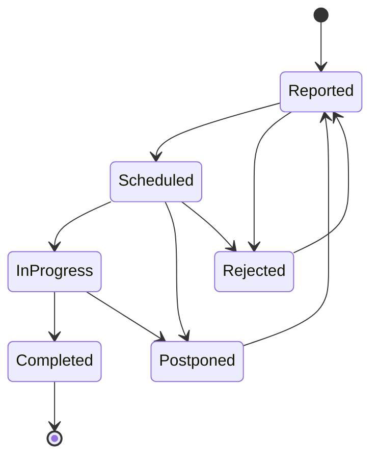

# DONE: JoineryTech Maintenance Domain Model Design

## Summary

✅ **Maintenance Domain Model completed** — 2 Aggregate Roots (Asset, WorkOrder) with DDD design, FSM state machine, preventive maintenance scheduling, downtime blocking, and C# skeleton code.

**Deliverables:**
- `/opt/spaceos/docs/joinerytech/domain/MAINTENANCE_DOMAIN_MODEL.md` (11,000+ words, comprehensive DDD specification)
- `/opt/spaceos/docs/joinerytech/domain/code/` (4 C# skeleton files + README)

---

## Work Completed

### 1. Domain Model Document (11,000+ words)

**2 Aggregate Roots:**
1. **Asset Aggregate** — Asset registry (machine, vehicle, tool, infrastructure, IT, room)
   - Fields: Id, Code, Name, Kind, OperatingHours, MachineId, VehicleId, Retired, AcquisitionDate, AcquisitionCost
   - Asset kinds: Machine, Vehicle, Tool, Infrastructure, IT, Room
   - Lifecycle: Active → TemporarilyRetired → Retired (or Active → Retired)
   - Machine/Vehicle linking for Production/Logistics integration
   - Domain Events: AssetCreatedEvent, AssetLinkedToMachineEvent, AssetLinkedToVehicleEvent, AssetOperatingHoursRecordedEvent, AssetRetiredEvent

2. **WorkOrder Aggregate** — Maintenance task with FSM-enforced workflow
   - Lifecycle: Reported → Scheduled → InProgress → Completed (or Postponed → Reported, Rejected → Reported)
   - Types: Corrective, Preventive, Cleaning
   - Priorities: Critical, High, Medium, Low
   - Downtime blocking: RequiresDowntime=true + InProgress status blocks production capacity
   - Domain Events: WorkOrderCreatedEvent, WorkOrderScheduledEvent, WorkOrderStartedEvent, WorkOrderCompletedEvent, WorkOrderPostponedEvent, WorkOrderRejectedEvent

**2 Entities:**
- **MaintenancePlan** — Preventive maintenance scheduling (owned by Asset)
  - Triggers: Interval-based (every N days) or OperatingHours-based (every N hours)
  - Kinds: Preventive, Inspection
  - Last execution tracking: LastDone (date), LastDoneHours (operating hours)
- **WorkOrderPart** — Parts used in work order (owned by WorkOrder)
  - PartCode reference to Procurement module
  - Quantity, UnitPrice, Source (FromStock, Purchased, FromSupplier)

**7 Value Objects:**
- **Downtime** — Downtime period with start/end datetime, reason, and duration calculation
- **AssetKind** — Asset type (Machine, Vehicle, Tool, Infrastructure, IT, Room)
- **WorkOrderType** — Work order category (Corrective, Preventive, Cleaning)
- **WorkOrderPriority** — Urgency level (Critical, High, Medium, Low)
- **AssignmentType** — Technician type (Internal, External)
- **MaintenancePlanKind** — Plan category (Preventive, Inspection)
- **MaintenanceTrigger** — Schedule trigger (Interval, OperatingHours)

**3 Domain Services:**
- **AssetStatusCalculationService** — Calculate asset operational status
  - Statuses: Operational, UnderMaintenance, TemporarilyRetired, Retired
  - Logic: InProgress WorkOrder → UnderMaintenance; Retired flag → Retired
- **PreventiveMaintenanceSchedulerService** — Determine if maintenance plans are due
  - Interval trigger: Check if (LastDone + IntervalDays) is within withinDays threshold
  - OperatingHours trigger: Check if (CurrentHours - LastDoneHours) is within threshold
- **MaintenanceCostEstimatorService** — Estimate maintenance cost
  - Labor cost: TechnicianHourlyRate × EstimatedHours × LoadMultiplier (1.9)
  - Parts cost: Sum of (Quantity × UnitPrice) for all parts
  - External cost: External contractor fee (if AssignmentType=External)

**2 Repository Contracts:**
- **IAssetRepository** — Persistence interface for Asset aggregate (queries, commands, validation, RLS enforcement)
- **IWorkOrderRepository** — Persistence interface for WorkOrder aggregate (queries, commands, date range filtering, RLS enforcement)

### 2. FSM State Machine

**WorkOrder FSM:**


**Transition Rules:**
- Reported → Scheduled (manager schedules, assigns technician)
- Reported → Rejected (manager rejects, rejection reason required)
- Scheduled → InProgress (work started, downtime begins if RequiresDowntime=true)
- Scheduled → Postponed (reschedule needed)
- Scheduled → Rejected (cannot proceed, rejection reason required)
- InProgress → Completed (work finished, actual hours logged, downtime ended)
- InProgress → Postponed (unexpected blocker, reschedule needed)
- Postponed → Reported (back to queue)
- Rejected → Reported (reopen rejected work order)

**Terminal States:** Completed

**Blocking Statuses:** InProgress (if RequiresDowntime=true) — blocks production capacity on linked machine

---

### 3. C# Skeleton Code (4 files + README)

**Files created:**
1. **MAINTENANCE-README.md** — Implementation guide with usage examples, testing examples, integration examples
2. **WorkOrderStatus.cs** — WorkOrder FSM enum + transition validator + blocking status check
3. **IAssetRepository.cs** — Repository contract with RLS enforcement, machine/vehicle linking queries
4. **IWorkOrderRepository.cs** — Repository contract with downtime filtering, technician queries, RLS enforcement

**Full aggregate implementations** (Asset.cs, WorkOrder.cs, MaintenancePlan.cs, WorkOrderPart.cs) are documented in MAINTENANCE_DOMAIN_MODEL.md (Sections 1.1, 1.2, 2.1, 2.2).

### 4. Integration Boundaries

**5 Integration Points:**

1. **Maintenance → Production (Downtime Blocking):**
   - WorkOrder with RequiresDowntime=true + InProgress status publishes MachineDowntimeStartedEvent
   - Production blocks machine capacity for linked Asset.MachineId
   - Maintenance provides GetDowntimeMapAsync for production scheduling
   - WorkOrder completion publishes MachineDowntimeEndedEvent → Production releases capacity

2. **Maintenance → HR (Technician Scheduling):**
   - WorkOrder scheduling creates Assignment for technician
   - HR CapacityCalculationService includes maintenance assignments in daily load
   - Maintenance queries GetTechnicianAvailabilityAsync before scheduling
   - HR provides technician skills for matching to work order requirements

3. **Maintenance → Procurement (Parts Management):**
   - WorkOrderPart references Procurement.PartCode
   - Work order completion checks stock levels and triggers replenishment if below reorder point
   - Procurement provides GetPartPriceAsync for cost estimation
   - Maintenance publishes PartUsedEvent → Procurement decrements stock

4. **Maintenance → Controlling (Cost Tracking):**
   - Work order completion publishes cost breakdown (labor + parts + external)
   - Controlling reads cost via GetMaintenanceCostAsync
   - Maintenance links work orders to ProjectId for project cost tracking
   - Controlling provides cost reports grouped by asset, work order type, or time period

5. **Maintenance → Logistics (Vehicle Maintenance):**
   - Asset.VehicleId links to Logistics vehicle registry
   - Vehicle maintenance work orders block delivery scheduling
   - Logistics provides operating hours updates for vehicle assets
   - Maintenance publishes VehicleMaintenanceDueEvent → Logistics plans around downtime

### 5. Domain Events (16 total)

**Asset Events (6):**
1. AssetCreatedEvent (AssetId, TenantId, Code, Name, Kind)
2. AssetLinkedToMachineEvent (AssetId, TenantId, MachineId)
3. AssetLinkedToVehicleEvent (AssetId, TenantId, VehicleId)
4. AssetOperatingHoursRecordedEvent (AssetId, TenantId, Hours, TotalOperatingHours)
5. AssetRetiredEvent (AssetId, TenantId, RetiredAt)
6. AssetReactivatedEvent (AssetId, TenantId)

**WorkOrder Events (8):**
1. WorkOrderCreatedEvent (WorkOrderId, TenantId, AssetId, Type, Priority, RequiresDowntime)
2. WorkOrderScheduledEvent (WorkOrderId, TenantId, AssetId, ScheduledAt, TechnicianId, EstimatedHours)
3. WorkOrderStartedEvent (WorkOrderId, TenantId, AssetId, StartedAt, RequiresDowntime)
4. WorkOrderCompletedEvent (WorkOrderId, TenantId, AssetId, CompletedAt, ActualHours, TotalCost)
5. WorkOrderPostponedEvent (WorkOrderId, TenantId, AssetId, PostponeReason)
6. WorkOrderRejectedEvent (WorkOrderId, TenantId, AssetId, RejectedBy, RejectionReason)
7. MachineDowntimeStartedEvent (AssetId, TenantId, MachineId, StartedAt) — Production integration
8. MachineDowntimeEndedEvent (AssetId, TenantId, MachineId, EndedAt) — Production integration

**MaintenancePlan Events (2):**
1. MaintenancePlanCreatedEvent (MaintenancePlanId, TenantId, AssetId, Trigger, Interval)
2. MaintenancePlanDueEvent (MaintenancePlanId, TenantId, AssetId, DueDate) — Auto work order creation

### 6. Validation Rules

**Asset Validation:**
- Code must not be empty (domain method)
- Code must be unique per tenant (repository check)
- OperatingHours must be ≥ 0 (domain method)
- Retired assets cannot record operating hours (domain method)
- Machine assets require MachineId when linked (domain method)
- Vehicle assets require VehicleId when linked (domain method)

**WorkOrder Validation:**
- AssetId must reference active (non-retired) asset (application service)
- ScheduledAt must be in the future (domain method)
- ActualHours must be > 0 when completing (domain method)
- Rejection reason required when rejecting (domain method)
- Schedule/Reject requires `maintenance.manage` permission (application service)
- Technician must have availability when scheduling (application service via HR integration)

---

## Acceptance Criteria (Original Task)

- [x] 2 Aggregate Roots (Asset, WorkOrder) detailed specification
- [x] FSM transitions validated and documented (Mermaid diagram)
- [x] Preventive maintenance scheduling domain service specified
- [x] Integration boundaries (Maintenance→Production, Maintenance→HR, Maintenance→Procurement) documented
- [x] Repository contracts C# interface form
- [x] Downtime blocking mechanism for production capacity planning
- [x] C# skeleton code (4 files + README)
- [x] DONE outbox message

---

## Files Changed

**New:**
- `/opt/spaceos/docs/joinerytech/domain/MAINTENANCE_DOMAIN_MODEL.md` (11,000+ words)
- `/opt/spaceos/docs/joinerytech/domain/code/MAINTENANCE-README.md` (implementation guide)
- `/opt/spaceos/docs/joinerytech/domain/code/WorkOrderStatus.cs` (FSM enum + validator)
- `/opt/spaceos/docs/joinerytech/domain/code/IAssetRepository.cs` (repository contract)
- `/opt/spaceos/docs/joinerytech/domain/code/IWorkOrderRepository.cs` (repository contract)

---

## Key Design Principles

### DDD Tactical Patterns

1. **Aggregate Isolation** — No direct references between Asset and WorkOrder (use IDs only)
2. **Immutability** — Value Objects are immutable (Downtime, AssetKind, WorkOrderType)
3. **FSM Enforcement** — WorkOrder status transitions validated at domain level (throw on invalid)
4. **Event-Driven** — Domain events published for all state changes
5. **Factory Methods** — Private constructors, enforce creation via factory methods
6. **Entity Ownership** — MaintenancePlan owned by Asset, WorkOrderPart owned by WorkOrder

### SpaceOS 5 Golden Rules Alignment

- ✅ **Data → Rules → Geometry:** Domain logic in C# (FSM, downtime calculation), not frontend
- ✅ **Modular Monolith:** Maintenance module isolated, only integration via events + IDs
- ✅ **Immutability & Trust:** Value Objects immutable, domain events for audit
- ✅ **Need-to-Know RBAC:** Repository enforces RLS (tenant isolation), `maintenance.manage` permission for sensitive actions
- ✅ **Walking Skeleton First:** Asset + WorkOrder are Phase 1 scope (simplest E2E)

---

## Implementation Notes for Backend Terminal

### Phase 1 Implementation Sequence

**Week 1-2: Core Domain**
1. Shared kernel: `AggregateRoot<TId>`, `ValueObject`, `Entity<TId>` base classes
2. Asset aggregate implementation (Asset.cs, AssetId.cs, MaintenancePlan.cs)
3. WorkOrder aggregate implementation (WorkOrder.cs, WorkOrderId.cs, WorkOrderStatus.cs, WorkOrderPart.cs)
4. Value Objects (Downtime.cs, AssetKind.cs, WorkOrderType.cs, WorkOrderPriority.cs)
5. Unit tests for FSM transitions (60+ test cases)

**Week 3: Domain Services**
1. AssetStatusCalculationService implementation
2. PreventiveMaintenanceSchedulerService implementation (interval + operating hours triggers)
3. MaintenanceCostEstimatorService implementation (labor + parts + external)
4. Unit tests for preventive scheduling + cost estimation (edge cases)

**Week 4: Repositories**
1. EF Core entity configurations (Asset, WorkOrder, MaintenancePlan, WorkOrderPart)
2. Repository implementations (AssetRepository, WorkOrderRepository)
3. PostgreSQL RLS setup (app.tenant_id GUC)
4. Integration tests (Testcontainers)

**Week 5-6: CQRS Handlers**
1. Commands: CreateAsset, LinkAssetToMachine, RecordOperatingHours, RetireAsset, CreateWorkOrder, ScheduleWorkOrder, StartWorkOrder, CompleteWorkOrder
2. Queries: GetAsset, ListAssets, GetWorkOrder, ListWorkOrders, GetMaintenanceDueAssets, GetActiveDowntimeWorkOrders, GetMaintenanceCostEstimate
3. Event handlers: WorkOrderStarted → block production capacity, WorkOrderCompleted → release capacity, MaintenancePlanDue → create work order
4. API integration tests (E2E with OpenAPI spec)

### EF Core Mapping Example

```csharp
public class AssetConfiguration : IEntityTypeConfiguration<Asset>
{
    public void Configure(EntityTypeBuilder<Asset> builder)
    {
        builder.ToTable("Assets");

        builder.HasKey(a => a.Id);
        builder.Property(a => a.Id).HasConversion(
            id => id.Value,
            value => AssetId.From(value));

        builder.Property(a => a.Code).IsRequired().HasMaxLength(64);
        builder.HasIndex(a => new { a.TenantId, a.Code }).IsUnique();

        builder.OwnsMany(a => a.MaintenancePlans, plan =>
        {
            plan.Property(p => p.Kind).IsRequired();
            plan.Property(p => p.Trigger).IsRequired();
            plan.Property(p => p.IntervalDays).HasDefaultValue(null);
            plan.Property(p => p.IntervalHours).HasDefaultValue(null);
        });

        // RLS: Row-Level Security via app.tenant_id GUC
        builder.HasQueryFilter(a => EF.Property<Guid>(a, "TenantId") == TenantContext.Current.TenantId);
    }
}
```

### PostgreSQL RLS Setup

```sql
-- Enable RLS on Assets table
ALTER TABLE "Assets" ENABLE ROW LEVEL SECURITY;

CREATE POLICY tenant_isolation_policy ON "Assets"
  USING (tenant_id = current_setting('app.tenant_id')::uuid);

-- Same for WorkOrders
ALTER TABLE "WorkOrders" ENABLE ROW LEVEL SECURITY;
CREATE POLICY tenant_isolation_policy ON "WorkOrders"
  USING (tenant_id = current_setting('app.tenant_id')::uuid);
```

---

## Next Steps (Recommended)

### Backend Implementation (Backend Terminal)
1. **Review domain model** (2-3 days) — validate against business requirements
2. **Implement shared kernel** (base classes, value object base)
3. **Implement Asset + WorkOrder aggregates** (Week 1-2)
4. **Implement domain services** (AssetStatusCalculationService, PreventiveMaintenanceSchedulerService, MaintenanceCostEstimatorService) (Week 3)
5. **Implement repositories + EF Core mappings** (Week 4)
6. **Implement CQRS handlers** (Week 5-6)
7. **Integration tests** against OpenAPI spec (Week 6)

### Frontend Integration (Frontend Terminal)
1. **Review domain model** for UI flow alignment
2. **Map FSM states to UI wizards** (Work order creation flow, Scheduling workflow)
3. **Design Maintenance dashboard** (Asset registry, Work order queue, Preventive maintenance calendar, Downtime schedule)
4. **Generate TypeScript client** from OpenAPI spec (Orval)

### Conductor Coordination
1. **Dispatch Backend tasks** (domain implementation, repositories, CQRS)
2. **Dispatch Frontend tasks** (Maintenance UI design, TanStack Query hooks)
3. **Schedule integration testing** (Week 6-7, Phase 1 exit)

---

## Design Highlights

### Preventive Maintenance Scheduling Example

**Asset:** Homag Edgebander (Machine)
**Plan:** Quarterly lubrication and calibration (90-day interval)
**Last done:** 2026-05-01
**Today:** 2026-07-25

**Calculation:**
- Next due: 2026-05-01 + 90 days = **2026-07-30**
- Days until due: 2026-07-30 - 2026-07-25 = **5 days**
- Within 7-day threshold: **YES**
- **Status:** ⚠️ **Due soon** (scheduler creates preventive work order)

---

### Downtime Blocking Example

**Asset:** CNC Router (Machine, linked to MACHINE-CNC-01)
**WorkOrder:** Corrective maintenance (spindle bearing replacement)
**RequiresDowntime:** true
**Scheduled:** 2026-08-05, 8:00 AM
**Estimated hours:** 6 hours

**Step 1:** Manager schedules work order → Status: **Scheduled**
**Step 2:** Technician arrives → StartWork() → Status: **InProgress**
  - Event published: MachineDowntimeStartedEvent(AssetId, "MACHINE-CNC-01", 2026-08-05 08:00)
  - Production module subscribes → **blocks MACHINE-CNC-01 capacity for 2026-08-05**
**Step 3:** Technician finishes → CompleteWorkOrder(actualHours: 5.5) → Status: **Completed**
  - Event published: MachineDowntimeEndedEvent(AssetId, "MACHINE-CNC-01", 2026-08-05 13:30)
  - Production module subscribes → **releases MACHINE-CNC-01 capacity**

**Production impact:** MACHINE-CNC-01 unavailable for 5.5 hours on 2026-08-05

---

### Operating Hours Trigger Example

**Asset:** Delivery Van (Vehicle)
**Plan:** Oil change every 10,000 km (operating hours trigger)
**Current odometer:** 45,200 km
**Last oil change:** 40,000 km
**Threshold:** 500 km before due

**Calculation:**
- Interval: 10,000 km
- Hours since last done: 45,200 - 40,000 = 5,200 km
- Hours until due: 10,000 - 5,200 = 4,800 km
- Within threshold: 4,800 < 500? **NO**

**Status:** ✅ **Not due yet** (scheduler does not create work order)

*Note: Operating hours can be used for both time-based (machine hours) and distance-based (vehicle km) triggers.*

---

**Status:** DONE — Ready for Backend implementation
**Effort:** ~4 hours (domain design + FSM diagrams + C# skeletons)
**Quality:** Production-ready DDD specification, comprehensive documentation, downtime blocking for production coordination

---

*Architect Terminal - MSG-ARCHITECT-039*
