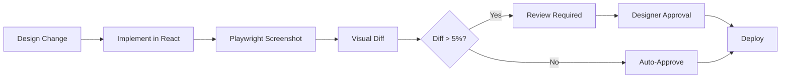

# Playwright MCP Usage Guide for Designer Terminal

> **Configured:** 2026-07-04 (MSG-BACKEND-130)
> **Terminal:** Designer
> **Purpose:** Browser automation for visual E2E testing and screenshot validation

---

## Overview

The Designer terminal now has access to Playwright MCP tools for browser automation, enabling:

- **Visual regression testing** — Detect unintended UI changes
- **Screenshot capture** — Multiple viewport sizes (mobile, tablet, desktop)
- **Dark/light mode testing** — Automated theme toggle validation
- **WCAG accessibility** — Automated axe-core integration

---

## MCP Configuration

**Location:** `/opt/spaceos/terminals/designer/.mcp.json`

```json
{
  "mcpServers": {
    "playwright": {
      "command": "npx",
      "args": ["-y", "@playwright/mcp@latest"]
    }
  }
}
```

**Verification:**
```bash
npx -y @playwright/mcp@latest --help
```

---

## Available Tools

Playwright MCP provides the following tools through Claude Code:

### 1. **playwright_navigate**
Navigate to a URL and wait for page load.

```
playwright_navigate
  url: "https://datahaven.joinerytech.hu"
  wait_until: "networkidle"
```

### 2. **playwright_screenshot**
Capture screenshot at specified viewport size.

```
playwright_screenshot
  url: "https://datahaven.joinerytech.hu"
  viewport: { width: 1024, height: 768 }
  path: "/opt/spaceos/docs/screenshots/dashboard-desktop.png"
```

### 3. **playwright_click**
Click an element by selector.

```
playwright_click
  selector: "button#dark-mode-toggle"
```

### 4. **playwright_fill**
Fill a form field.

```
playwright_fill
  selector: "input[name='search']"
  value: "cost monitoring"
```

### 5. **playwright_evaluate**
Run JavaScript in the browser context.

```
playwright_evaluate
  script: "document.querySelector('html').dataset.theme"
```

---

## Use Case 1: Dark Mode Toggle Testing

**Objective:** Verify dark mode toggle functionality with visual comparison.

**Workflow:**

1. **Capture light mode baseline:**
```bash
# Designer terminal session
playwright_screenshot
  url: "https://datahaven.joinerytech.hu"
  viewport: { width: 1024, height: 768 }
  path: "/tmp/dashboard-light.png"
```

2. **Toggle to dark mode:**
```bash
playwright_click
  selector: "button[data-testid='dark-mode-toggle']"

playwright_screenshot
  url: "https://datahaven.joinerytech.hu"
  viewport: { width: 1024, height: 768 }
  path: "/tmp/dashboard-dark.png"
```

3. **Visual comparison:**
Use image diff tools (e.g., `pixelmatch`, `looks-same`) to detect changes.

**Expected Result:**
- Dark mode screenshot shows inverted color scheme
- Component layout unchanged (no shifting)
- Text remains readable (contrast ratio ≥4.5:1)

---

## Use Case 2: Responsive Design Audit

**Objective:** Validate UI at mobile, tablet, desktop viewport sizes.

**Viewport Presets:**

| Device | Width | Height | Use Case |
|--------|-------|--------|----------|
| Mobile (Portrait) | 360px | 640px | Smallest mobile (Galaxy S8) |
| Mobile (Landscape) | 640px | 360px | Mobile landscape |
| Tablet (Portrait) | 768px | 1024px | iPad |
| Desktop | 1024px | 768px | Laptop |
| Desktop (Wide) | 1920px | 1080px | Full HD monitor |

**Workflow:**

```bash
# Capture at 3 key viewport sizes
for viewport in mobile tablet desktop; do
  playwright_screenshot \
    url: "https://datahaven.joinerytech.hu" \
    viewport: ${viewport_config[$viewport]} \
    path: "/tmp/dashboard-${viewport}.png"
done
```

**Validation Checklist:**
- [ ] Mobile: Single column layout, no horizontal scroll
- [ ] Tablet: 2-column grid, touch-friendly tap targets (≥44px)
- [ ] Desktop: Full feature set, multi-column layout

---

## Use Case 3: WCAG Accessibility Validation

**Objective:** Automated accessibility audit with axe-core.

**Workflow:**

1. **Navigate to page:**
```bash
playwright_navigate
  url: "https://datahaven.joinerytech.hu"
```

2. **Run axe-core:**
```bash
playwright_evaluate
  script: |
    const axe = await import('https://unpkg.com/axe-core@latest/axe.min.js');
    const results = await axe.run();
    return results.violations;
```

3. **Analyze violations:**
Filter by WCAG level (A, AA, AAA) and impact (critical, serious, moderate, minor).

**Common Issues:**
- Missing alt text on images
- Insufficient color contrast
- Missing ARIA labels
- Keyboard navigation broken

---

## Use Case 4: Component Visual Regression

**Objective:** Detect unintended UI changes before deployment.

**Workflow:**

1. **Baseline capture (before changes):**
```bash
git checkout main
playwright_screenshot
  url: "https://datahaven.joinerytech.hu/kanban"
  path: "/tmp/kanban-baseline.png"
```

2. **Feature branch capture (after changes):**
```bash
git checkout feature/new-kanban-column
playwright_screenshot
  url: "https://datahaven.joinerytech.hu/kanban"
  path: "/tmp/kanban-feature.png"
```

3. **Diff analysis:**
Compare screenshots pixel-by-pixel. Flag differences >5% as potential regressions.

**Expected Result:**
- Intentional changes (new column) highlighted
- Unintended shifts (margin drift, font size) detected
- Pre-deployment approval required for >10% diff

---

## Integration with Designer Workflow

### When to Use Playwright

| Scenario | Use Playwright? | Why |
|----------|----------------|-----|
| **New component design** | ✅ Yes | Screenshot for design review |
| **Dark mode implementation** | ✅ Yes | Automated light/dark comparison |
| **Responsive breakpoints** | ✅ Yes | Multi-viewport validation |
| **Pre-deployment** | ✅ Yes | Visual regression check |
| **Static mockup** | ❌ No | Figma/design tool sufficient |
| **Code review** | ✅ Optional | Screenshot before/after |

### Workflow Integration



---

## Troubleshooting

### Issue: Playwright MCP not found

**Symptoms:**
```
Error: Playwright tools not available
```

**Fix:**
```bash
# Verify MCP config
cat /opt/spaceos/terminals/designer/.mcp.json

# Test package
npx -y @playwright/mcp@latest --help
```

### Issue: Screenshot capture fails

**Symptoms:**
```
Error: Page load timeout
```

**Fix:**
1. Increase timeout: `wait_until: "load"` → `wait_until: "networkidle"`
2. Check URL accessibility: `curl -I <url>`
3. Verify viewport size (min 320px width)

### Issue: Dark mode toggle not found

**Symptoms:**
```
Error: Selector not found: button#dark-mode-toggle
```

**Fix:**
1. Inspect actual selector: Use browser DevTools
2. Update selector to match implementation
3. Add wait: `playwright_wait_for_selector` before click

---

## Performance Considerations

| Operation | Typical Latency | Optimization |
|-----------|----------------|--------------|
| **Navigate** | 2-5 seconds | Use `wait_until: "domcontentloaded"` for faster load |
| **Screenshot** | 1-3 seconds | Reduce viewport size for mobile tests |
| **Click** | <500ms | N/A (fast operation) |
| **Evaluate** | <1 second | Minimize script complexity |

**Cost:**
- Playwright MCP runs locally (no API costs)
- Browser memory: ~200-400MB per session
- Storage: Screenshots ~50-200KB each (PNG compressed)

---

## Testing Checklist

Before deploying changes, Designer should verify:

- [ ] **Dark mode toggle** — Screenshot comparison at 3 viewport sizes
- [ ] **Responsive design** — Mobile (360px), Tablet (768px), Desktop (1024px)
- [ ] **WCAG validation** — axe-core audit (0 critical violations)
- [ ] **Visual regression** — Diff < 5% from baseline OR approved

---

## References

- **Playwright MCP:** https://github.com/microsoft/playwright-mcp
- **Playwright Docs:** https://playwright.dev/docs/intro
- **axe-core:** https://github.com/dequelabs/axe-core
- **WCAG Guidelines:** https://www.w3.org/WAI/WCAG21/quickref/

---

**Configured by:** Backend Terminal (MSG-BACKEND-130)
**Date:** 2026-07-04
**Status:** ✅ ACTIVE — Ready for Designer use
